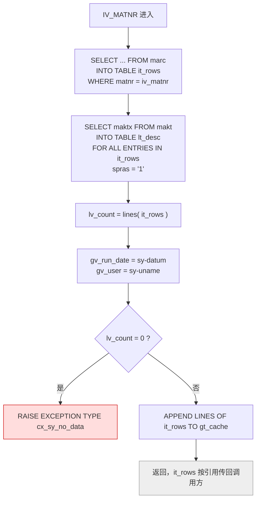
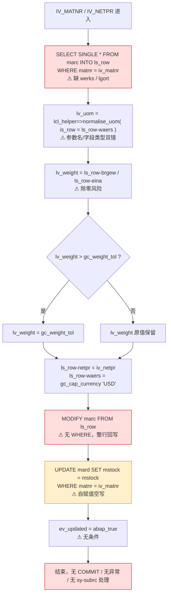

# ZFG_MATERIAL_PRICE 函数组走读报告

> 分析对象：`ZFG_MATERIAL_PRICE`（FUNCTION-POOL）+ `LZFG_MATERIAL_PACETOP` + `LZFG_MATERIAL_PACU01`
> 归属：MM Purchasing　职责域：采购信息的价格 / 重量维护
> 结论前置：**写数据库这段有严重问题，且当前代码在语法层面就存在多处错误，实际上无法激活。** 详见 §6、§7。

---

## 1. 结构地图

| 对象 | 文件 | 内容 |
|---|---|---|
| 主程序 | `ZFG_MATERIAL_PRICE.fg.abap` | `FUNCTION-POOL`，负责 INCLUDE 装配 + 定义本地类 `lcl_helper` |
| TOP include | `LZFG_MATERIAL_PACETOP` | 类型定义、全局变量、常量 |
| 实现 include | `LZFG_MATERIAL_PACU01` | `Z_READ_PRICE_ROWS`、`Z_UPDATE_NET_PRICE` |
| 本地类 | `lcl_helper`（定义在主程序里） | `normalise_uom`、`is_valid_price` |

主程序装配逻辑：

```abap
FUNCTION-POOL zfg_material_price.

INCLUDE lzfg_material_pacetop.    "session data, type declarations
INCLUDE lzfg_material_pacuxx.    "function implementations
```

**这里有一处需要立刻核实的不一致**：主程序只 INCLUDE 了 `PACETOP` 和 `PACUXX`，但两个 FM 的实现位于 `PACU01`。函数组的 FM 实现必须逐个 U0x 被主程序 INCLUDE 才会被激活。如果 `PACUXX` 内部并没有再 `INCLUDE lzfg_material_pacu01.`（函数组内 include 套 include 属于非主流写法），那么激活时函数组里根本不会有这两个 FM——`SEU` 里看到的 FM 是"幽灵"。（另一种可能是本仓库只提供了 `PACU01` 这一个快照文件，实际系统里还有 `PACU02`/`PACU03`，而 `PACUXX` 是空的占位 include，注释写得不准。）**这是接手后第一个要去 SEU 里确认的事。**

---

## 2. 数据模型与全局状态

### 2.1 行结构 `ty_price_row`

```abap
TYPES: BEGIN OF ty_price_row,
         matnr   TYPE mara-matnr,
         werks   TYPE marc-werks,
         lgort   TYPE marc-lgort,
         eina    TYPE mara-eina,
         brgew   TYPE mara-brgew,
         ntgew   TYPE mara-ntgew,
         netpr   TYPE marc-netpr,
         waers   TYPE marc-waers,
         eifn    TYPE marc-eifn,
       END OF ty_price_row.

TYPES ty_price_rows TYPE STANDARD TABLE OF ty_price_row WITH EMPTY KEY.
```

注意这是一个**跨 MARA 和 MARC 两个表的混合投影**：`matnr/eina/brgew/ntgew` 取自 MARA（物料主数据），其余取自 MARC（采购视图）。而 MARC 的主键是 `matnr + werks + lgort`，所以一行 `ty_price_row` 的业务含义是"某工厂某库位的净价 + 该物料的国际单位换算"。`WITH EMPTY KEY` 意味着内表是纯行容器，不支持主键唯一性检查——重复行不会被拦下。

### 2.2 全局变量

```abap
DATA: gt_cache    TYPE ty_price_rows,
      gv_run_date TYPE datum,
      gv_user     TYPE sy-uname,
      gv_language TYPE sy-langu.

CONSTANTS gc_weight_tol    TYPE p DECIMALS 4 VALUE '0.5'.
CONSTANTS gc_cap_currency  TYPE c LENGTH 3 VALUE 'USD'.
```

| 变量 | 状态 | 说明 |
|---|---|---|
| `gt_cache` | 被写、无人读 | `Z_READ_PRICE_ROWS` 里不断 `APPEND`，但**两个 FM 都没有任何地方读它** |
| `gv_run_date` / `gv_user` | 被写、无人读 | 只在读 FM 里赋值，写 FM 根本不赋值，也没有用于写审计记录 |
| `gv_language` | 完全未使用 | 读 FM 里却把语言硬编码成 `spras = '1'` |
| `gc_weight_tol` | 被读、结果丢弃 | 见 §5.2 |
| `gc_cap_currency` | 被读、**写进数据库** | 硬编码 `'USD'`，见 §6.3 |

**结论：这四个全局变量构成了典型的"影子状态"（shadow state）。** 它们不承载跨 FM 的必要数据传递（FM 之间本来就靠接口传参），却引入了会话级的隐式副作用：调用一次读 FM，就往 `gt_cache` 里塞一份快照，内存单调增长；重复调用同一物料会产生重复行。这对函数组来说是反模式——如果确实需要缓存，应该有明确的失效策略和读取方；现在只有写没有读，等于纯粹的状态污染。

---

## 3. FM 之一：`Z_READ_PRICE_ROWS` —— 职责与数据流

### 3.1 接口

```abap
FUNCTION z_read_price_rows.
*"----------------------------------------------------------------------
*"* Local Interface:
*"*  IMPORTING
*"*     VALUE(IV_MATNR) TYPE  MARA-MATNR
*"*  TABLES
*"*     IT_ROWS        TYPE  ZFG_MATERIAL_PRICE=>TY_PRICE_ROWS
*"*  EXCEPTIONS
*"*     NO_DATA       1
*"*----------------------------------------------------------------------
```

用 `TABLES` 参数（遗留风格）把结果表按引用传回调用方，混合调用方是唯一的结果获取途径——调用方甚至读不到 `sy-subrc`，只能靠异常。

### 3.2 执行流程



### 3.3 职责判定

设计意图是"按物料号取出所有工厂/库位的净价行，并附带物料描述"。**实际交付的是半份功能**：

1. **描述被取出来就扔掉。** `lt_desc` 查完了，既没 `TABLES` 传出、也没拼回 `it_rows`、也没有任何后续使用。这是一次纯粹的无效数据库往返——读 `MAKT` 的开销一分没换到收益。
2. **`lt_desc` 在这个文件里根本没有声明。** 它既不在函数模块的 `TABLES` 段，也不在 TOP 的全局 `DATA` 段。ABAP 里未声明的变量不能使用，这段代码**语法不通过**。
3. **异常机制名不副实。** 接口声明了经典异常 `NO_DATA`，实现里却写的是 `RAISE EXCEPTION TYPE cx_sy_no_data`：
   - `cx_sy_no_data` 这个类在标准 SAP 里并不存在（SAP 没有叫这个名字的异常类），本仓库也没有定义它，**引用不存在的类 → 激活失败**。
   - 即使补上了类的定义，`RAISE EXCEPTION TYPE` 抛出的异常类**不会**映射到 `EXCEPTIONS no_data`。调用方写 `EXCEPTIONS no_data` 时捕获不到，最终变成 short dump，而不是被优雅处理。签名和实现之间契约不成立。
   - 正确写法就是 `RAISE no_data.`，或者定义真正的 `CX_...` 类并把它加进 FM 的 `EXCEPTIONS` 列表。
4. **检查顺序颠倒。** `FOR ALL ENTRIES` 的那次 `MAKT` 查询排在"是否空表"判断之前。物料不存在时，先白跑一次 `MAKT` 查询，然后才抛异常。
5. **`FOR ALL ENTRIES` 的空表风险。** `it_rows` 为空时，SAP 在运行时会短路——本次不执行 SQL（这层保护是有的）。但代码把它排在空表检查之前，等于依赖了一个隐式行为来兜底，可读性和可维护性都很差。
6. **语言硬编码。** `spras = '1'` 写死德语，若登录语言不是 `1`，描述全空。既然 `gv_language` 就在 TOP 里摆着，此处应当用它或 `sy-langu`。
7. **无授权检查。** 物料范围未做 `MARA` / `ACT_01` 权限校验，任意调用方可跨工厂拉取价格数据。
8. **`SELECT SINGLE` 不存在，但同样没有 `sy-subrc` 检查。** 这里用 `INTO TABLE`，失败即空表，后面靠 `lines()` 兜底，勉强可以。

---

## 4. FM 之二：`Z_UPDATE_NET_PRICE` —— 职责与数据流

### 4.1 接口

```abap
FUNCTION z_update_net_price.
*"*  IMPORTING
*"*     VALUE(IV_MATNR) TYPE  MARC-MATNR
*"*     VALUE(IV_NETPR) TYPE  MARC-NETPR
*"*  EXPORTING
*"*     VALUE(EV_UPDATED) TYPE  ABAP_BOOL
*"*----------------------------------------------------------------------
```

只有 `matnr` 一个键，**没有工厂、没有库位**。这是整个函数组最致命的接口设计缺陷，后面会详细展开。

### 4.2 执行流程



### 4.3 职责判定

设计意图是"把某物料某价位的净价更新掉，必要时夹紧重量容差"。**实际逻辑比意图弱得多、也危险得多**：

- 重量逻辑（`lv_weight`）**算完就丢**，从未写入任何表。函数组头部注释宣称的 "price / weight maintenance" 中，weight 这一半**根本没有实现**。
- `is_valid_price` 定义的校验逻辑**从未被调用**。也就是说，**净价没有任何合法性校验**——负价、零价、超长小数位都可以直接落库。
- `normalise_uom` 被调用了，但参数名写成了 `is_row`（那是 `is_valid_price` 的参数名），**实际是非法参数名 → 语法错误**；而且传入的是 `ls_row-waers`（**币种字段**），而形参类型是 `marc-uom`（**基本计量单位**）——**字段语义完全错位**。调用结果 `lv_uom` 随后再也没被用过，是死变量。

---

## 5. 数据流转总览

```
                    ┌──────────────────────────────────────┐
   调用方 (RFC/BAPI)│  Z_READ_PRICE_ROWS                   │
   ───────────────► │   iv_matnr                            │
                    │      │                                │
                    │      ▼  SELECT marc                   │
                    │   it_rows ◄── TABLES(按引用) ─────┐   │
                    │      │                           │   │
                    │      ▼  SELECT makt (结果丢弃)   │   │
                    │   lt_desc (未声明 → 编译失败)     │   │
                    │      │                           │   │
                    │      ├──► gt_cache (只写不读)     │   │
                    │      └──► gv_run_date/gv_user    │   │
                    │           (只写不读)              │   │
                    │      ▲                           │   │
                    │      lv_count = 0 ?               │   │
                    │      └──► RAISE cx_sy_no_data ────┼──► 期望: no_data
                    └─────────────────────────────────┼───┘
                                                      │   实得: dump
                                                      ▼
                    ┌──────────────────────────────────────┐
                    │  Z_UPDATE_NET_PRICE                  │
                    │   iv_matnr, iv_netpr                 │
                    │      │                               │
                    │      ▼  SELECT SINGLE * marc         │
                    │   ls_row  ◄── 任意一行（不确定）      │
                    │      │                               │
                    │      ├── normalise_uom(waers→uom) ✗  │
                    │      ├── lv_weight = brgew/eina  ✗÷0  │
                    │      │   （算完丢弃）                  │
                    │      ▼                               │
                    │   MODIFY marc FROM ls_row            │
                    │      └── 整行无 WHERE 回写 ✗✗        │
                    │      ▼                               │
                    │   UPDATE mard SET mstock = mstock ✗  │
                    │      └── 自赋值空写，触发 CD/触发器    │
                    │      ▼                               │
                    │   ev_updated = abap_true（永远真）    │
                    └──────────────────────────────────────┘
```

**两条路径的实际连通度**：`Z_READ_PRICE_ROWS` 的产出**从不流入** `Z_UPDATE_NET_PRICE`，两者之间唯一的"数据流"是共享的全局变量——而共享的那几个全局变量又都是只写不读。所以这两个 FM 在数据上**完全独立**，是两条各自为政的单向通路，靠调用方在外层把它们缝起来。

---

## 6. 专题：写数据库这块到底有没有问题

**有，而且是阻断级问题。** 按严重程度分层。

### 6.1 阻断级 · `SELECT SINGLE` 缺主键 → 改到哪一行是不确定的

```abap
SELECT SINGLE * FROM marc INTO @ls_row
  WHERE matnr = iv_matnr.
```

`MARC` 的完整主键是 `matnr + werks + lgort`。只按 `matnr` 过滤，一条物料通常对应**几十到上百行**（多工厂 × 多库位）。此时 `SELECT SINGLE` 的行为是：数据库按访问路径返回**任意一条**符合条件的记录，ABAP 端不做任何排序保证。结果就是：

- 你想改 A 工厂的价格，实际可能改了 B 工厂的；
- 同一个调用重复执行两次，可能落在不同行上；
- 行分布变了（新增工厂、后台批改、数据迁移），同一个程序改的行就变了，**行为不可复现、不可测试、不可审计**。

这是典型的 **silent data corruption**：不报错、不 dump，只是安静地把别的工厂的价格覆盖了。采购信息记录一旦被这样污染，后续 PO 价格、GR 金额、差异分析全部失真，且极难归因。

**正确做法**：把 `werks` / `lgort` 提到接口里作为必填键参数，用 `WHERE matnr = … AND werks = … AND lgort = …` 精确定位。

### 6.2 阻断级 · `MODIFY marc FROM ls_row` 整行回写，无 `WHERE` 约束

```abap
MODIFY marc FROM ls_row.
```

两个叠加的问题：

**(a) 结构类型不匹配。** `ls_row` 声明为 `ty_price_row`（§2.1 那个 9 字段的投影），而 `MODIFY dbtab FROM wa` 要求 `wa` 是该表的结构类型——ABAP **不做**按字段名的隐式映射。所以这里必然是语法错误。就算有人"修好"了编译（改成 `TYPE marc`），语义问题原封不动。

**(b) 整行回写的覆盖范围。** `MODIFY` 把工作区的**每一个字段**写回数据库。MARC 有近 90 个字段，`MODIFY` 只对"值发生变化的字段"生成实际列值，但**行是整行定位、整行确认**的。配合 6.1 的 `SELECT SINGLE`——选中哪行不确定、回写哪行也不确定、且该行所有字段都被带回。这等于让一个随机行被随机回写。

即使把 SELECT 补全成精确主键，`MODIFY` 依然是不该用的写法：这条程序只该动 `netpr` 和 `waers` 两个字段，用 `MODIFY` 整行回写会把读-改-写之间的**并发窗口暴露成数据丢失面**（别人在你 SELECT 和 MODIFY 之间改了同行的 `eina`，你的 MODIFY 会把它覆盖回旧值）。

**正确做法**：定向 `UPDATE`，只写要改的列：

```abap
UPDATE marc SET netpr = @iv_netpr
  WHERE matnr = @iv_matnr
    AND werks = @iv_werks
    AND lgort = @iv_lgort.
```

这一条同时解决了：不确定选行、整行覆盖、并发丢失三个问题。

### 6.3 高危 · 币种被硬编码覆盖成 USD

```abap
ls_row-waers = gc_cap_currency.   " 常量 'USD'
```

程序把物料的采购价币种**无条件改成美元**，而且：

- 不检查原币种是什么；
- 不做任何汇率换算（输入的 `iv_netpr` 是什么币的金额，没人知道）；
- 如果原记录是 EUR，改完就是"金额没换算、币种却标成 USD"——**金额与币种语义脱节**；
- 采购信息记录、GR/IR 对账、外币折算报表全部会算错。

`gc_cap_currency` 这个命名暗示"封顶币种"之类的业务规则，但代码里既没有封顶逻辑，也没有任何 `TCURR` / 汇率读取。这更像是调试时代码被遗留在了生产路径上。

### 6.4 高危 · `UPDATE mard SET mstock = mstock` 自赋值空写

```abap
UPDATE mard SET mstock = mstock WHERE matnr = iv_matnr.
```

这行把一个字段赋给自身，**业务语义上是彻底的空操作**，但它**绝不是无害的**：

- 它仍然是一条真实的数据库 `UPDATE`，会命中所有该 `matnr` 的 MARD 行（所有工厂、所有库位、所有特殊库位），把行标记为已修改；
- 会触发 **DB 触发器**（`SAPDBMS.ADAB.CDU` / 更新模块 `UPDATE_MARD`）和 **CD（变更文档）**，可能产生一批内容为"无变化"的变更记录，污染变更历史与审计追溯；
- 会更新 **Statement Buffer / Table Buffer** 中对应 MARD 行的内容（自赋值写同样会刷新缓冲），这大概率就是作者真正想要的副作用——强制让后续读 MARD 的地方看到"这条数据动过"；
- 走 `MARD` 的更新文档 → 可能有 `MARD-MAXMG` 之类的一致性检查被触发；
- 无 `sy-subrc` 检查，无失败处理。

**这是一个"用副作用冒充意图"的典型反模式。** 如果目的是让下游感知价格变更，正确做法是显式说明并使用定向手段；如果目的是通过库存触发重新计算相关派生数据（这种意图在采购场景下更常见，比如触发 `MBEW` 重算或信息记录刷新），那么应该调用对应的业务 API，而不是靠一条自赋值 `UPDATE`。

如果只是为了绕过缓冲，正确做法是显式失效对应行的缓冲，或者用 `COMMIT WORK AND ROLLBACK` 的刷新技巧，而不是写一条无意义的 DML。

### 6.5 高危 · `ev_updated = abap_true` 无条件置真

```abap
ev_updated = abap_true.
```

不管 `SELECT SINGLE` 是否命中、`MODIFY` 是否成功、目标物料是否存在，导出参数一律为真。调用方据此判断"更新成功"就会继续后续流程（比如立即发起采购申请）。而调用方甚至拿不到 `sy-subrc`——这个 FM 的接口里**根本没有 `EXCEPTIONS`**，没有任何失败通道。

### 6.6 中危 · 除零未防护

```abap
lv_weight = ls_row-brgew / ls_row-eina.
```

`eina`（国际单位换算分母）为初始值 0 时，直接 `CX_SY_ZERODIVIDE` short dump。SAP 标准对 `mara-eina` 有默认 1 的下推，但 Z 程序里的 `ls_row` 是从 MARC 读的，而 `eina` 定义在 MARA 上——如果 `ls_row` 真的是 `ty_price_row`（从 MARC 投影里根本没填 `eina`），那它必然是 0，**必然除零**。这暴露了 §4.3 提到的结构混用问题：把 MARA 的字段硬塞进从 MARC 读出的工作区，逻辑上根本无法成立。

### 6.7 中危 · 无授权检查、无锁、无事务边界

- 无 `ACT_01` / 物料范围校验：任何人可改任意物料价格；
- 无行锁（`DEQUEUE_MARC` / `SELECT … FOR UPDATE`）：并发调价互相覆盖；
- 无 `COMMIT WORK`、无异常、无错误回传：失败时静默，甚至在 long-running 场景下留下不一致。

### 6.8 汇总

| # | 问题 | 等级 | 后果 |
|---|---|---|---|
| 1 | `SELECT SINGLE` 缺 `werks`/`lgort` | 阻断 | 改错行，静默数据损坏 |
| 2 | `MODIFY marc` 整行回写 | 阻断 | 覆盖非预期字段 + 并发丢失 |
| 3 | `lt_desc` 未声明 | 阻断 | 编译失败 |
| 4 | `cx_sy_no_data` 不存在 | 阻断 | 编译失败 |
| 5 | `normalise_uom( is_row = … )` 参数名非法 | 阻断 | 编译失败 |
| 6 | `RAISE EXCEPTION TYPE` 与 `EXCEPTIONS no_data` 契约不符 | 阻断 | 调用方捕获不到，dump 而非优雅处理 |
| 7 | `ls_row` 类型与 `marc` 不匹配（`MODIFY`/`SELECT *`） | 阻断 | 编译失败 |
| 8 | 币种硬编码 `'USD'`、无换算 | 高 | 价格语义错乱，财务数据失真 |
| 9 | `UPDATE mard SET mstock = mstock` | 高 | 空写却触发 CD/触发器/全工厂行修改 |
| 10 | `ev_updated` 恒为真、无异常通道 | 高 | 调用方误判成功 |
| 11 | `brgew / eina` 除零 | 中 | short dump |
| 12 | 净价无校验（`is_valid_price` 死代码） | 中 | 非法价格可落库 |
| 13 | weight 逻辑死代码（宣称功能未实现） | 中 | 功能承诺与实现不符 |
| 14 | 无授权检查 / 无锁 / 无事务边界 | 中 | 越权 + 并发覆盖 |
| 15 | `gt_cache` 单调增长、重复累积 | 中 | 内存与状态污染 |
| 16 | `spras = '1'` 硬编码 | 低 | 非德语环境描述为空 |
| 17 | `FOR ALL ENTRIES` 查询排在空表检查前 | 低 | 无效数据库往返 |
| 18 | 主程序未 INCLUDE `PACU01` | 待确认 | FM 可能根本未激活 |

---

## 7. 修复建议（按优先级）

### P0 — 让代码能激活并语义正确

**写 FM 重写：**

```abap
FUNCTION z_update_net_price.
*"*  IMPORTING
*"*     VALUE(IV_MATNR) TYPE  MARC-MATNR
*"*     VALUE(IV_WERKS) TYPE  MARC-WERKS   "← 补：必须进接口
*"*     VALUE(IV_LGORT) TYPE  MARC-LGORT   "← 补：必须进接口
*"*     VALUE(IV_NETPR) TYPE  MARC-NETPR
*"*  EXPORTING
*"*     VALUE(EV_UPDATED) TYPE  ABAP_BOOL
*"*  EXCEPTIONS
*"*     NOT_FOUND       1
*"*     INVALID_PRICE   2
*"*----------------------------------------------------------------------

  DATA ls_marc TYPE marc.

  SELECT SINGLE * FROM marc INTO @ls_marc
    WHERE matnr = @iv_matnr
      AND werks = @iv_werks
      AND lgort = @iv_lgort.

  IF sy-subrc <> 0.
    RAISE not_found.
  ENDIF.

  " 校验：净价必须为正（原来 is_valid_price 从未被调用）
  IF iv_netpr <= 0.
    RAISE invalid_price.
  ENDIF.

  " 币种：要么由调用方传入并校验，要么原值保留，绝不静默改成 USD
  IF ls_marc-waers IS INITIAL.
    RAISE invalid_price.
  ENDIF.

  " 只写需要变更的列，主键完整限定
  UPDATE marc SET netpr = @iv_netpr
    WHERE matnr = @iv_matnr
      AND werks = @iv_werks
      AND lgort = @iv_lgort.

  IF sy-subrc <> 0.
    ev_updated = abap_false.
    RAISE not_found.
  ENDIF.

  ev_updated = abap_true.

ENDFUNCTION.                    "Z_UPDATE_NET_PRICE
```

这一版同时消灭了 §6.1 / 6.2 / 6.3 / 6.5 / 6.7 五项问题：精确定位、定向更新、币种不擅改、失败可感知、无整行覆盖面。

**读 FM 重写：**

```abap
FUNCTION z_read_price_rows.
*"*  IMPORTING
*"*     VALUE(IV_MATNR) TYPE MARA-MATNR
*"*  TABLES
*"*     IT_ROWS        TYPE ZFG_MATERIAL_PRICE=>TY_PRICE_ROWS
*"*  EXCEPTIONS
*"*     NO_DATA        1
*"*----------------------------------------------------------------------

  DATA: lv_count TYPE i,
        lv_uom   TYPE marc-uom.

  IF iv_matnr IS INITIAL.
    RAISE no_data.
  ENDIF.

  SELECT matnr werks lgort eina brgew ntgew netpr waers eifn
    FROM marc
    INTO TABLE @it_rows
    WHERE matnr = @iv_matnr.

  lv_count = lines( it_rows ).

  " 先判空，再做后续查询
  IF lv_count = 0.
    RAISE no_data.                              "← 用经典异常，不要 RAISE EXCEPTION TYPE
  ENDIF.

  " 币种/语言参数化，不用 gv_language 之类的影子变量
  " 若确实需要描述，要么加进 it_rows，要么单独加 TABLES 参数传出

  " 去掉 gt_cache 的无主写入；如需缓存，另设有失效策略的缓存对象
  " 或者：DELETE FROM gt_cache WHERE matnr = iv_matnr.
  "       APPEND LINES OF it_rows TO gt_cache.

ENDFUNCTION.                    "Z_READ_PRICE_ROWS
```

**weight 功能：** 若业务确实要"重量容差维护"，需要明确它写到哪里。当前 `lv_weight` 与 `gc_weight_tol` 是纯死代码，应当要么实现（写入哪个字段？`mara-brgew`？还是采购信息记录的重量字段？）要么删除，避免"注释承诺了功能、代码里没有"的误导。

### P1 — 清理死代码与影子状态

- 删除 `gt_cache` / `gv_run_date` / `gv_user` / `gv_language`（若无真实消费者）；
- 删除 `lcl_helper=>is_valid_price` 或真正接入写路径（推荐后者，见 P0 示例）；
- 修 `normalise_uom` 的调用：形参是 `iv_uom TYPE marc-uom`，必须传**基本计量单位**（`mara-meins` 或 `marc-...` 对应字段），不能传币种字段 `waers`；且返回的 `rv_uom` 必须真的被用到；
- 核实主程序是否 INCLUDE 了 `PACU01`（或 `PACUXX` 是否 include 了它）。

### P2 — 工程约定

- 用 `ZFG_MATERIAL_PRICE=>TY_PRICE_ROWS` 之外，本组内直接用 `ty_price_rows` 即可；
- 统一走 `RAISE no_data` / 自定义 `CX_...` 类，并把类加进 `EXCEPTIONS` 段；
- 若这是 RFC 目的地，需要确认 SE37 里 RFC 勾选与异常映射，否则调用方拿不到异常；
- 补 `ACT_01` 权限检查与 `DEQUEUE_MARC` 行锁。

---

## 8. 一句话总结

这个函数组的整体形状是"**一个只写不读、从不校验的重量维护 + 一个改错行还把币种改成美元的价格更新器**"：`Z_READ_PRICE_ROWS` 取了一半数据（描述查了扔、变量没声明、异常类不存在）；`Z_UPDATE_NET_PRICE` 因为接口里缺 `werks`/`lgort`，从第一步 `SELECT SINGLE` 起就无法确定自己在改哪一行，随后用 `MODIFY` 整行回写、硬编码 `USD` 币种、靠一条 `UPDATE mard SET mstock = mstock` 的自赋值空写去"触发副作用"，最后无条件返回 `abap_true`。写数据库这块**不能上线**：它同时存在编译失败（至少 5 处）、静默改错行的确定性缺陷、币种数据损坏、以及靠空写 DML 触发副作用的反模式。正确路径是把 `werks`/`lgort` 提升为接口必填参数，把 `MODIFY` 换成键限定 + 列限定的 `UPDATE`，删掉那行自赋值 `UPDATE`，并把 `is_valid_price` 真正接进写路径。
