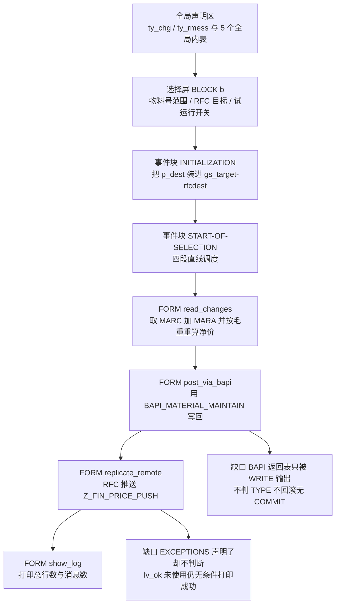
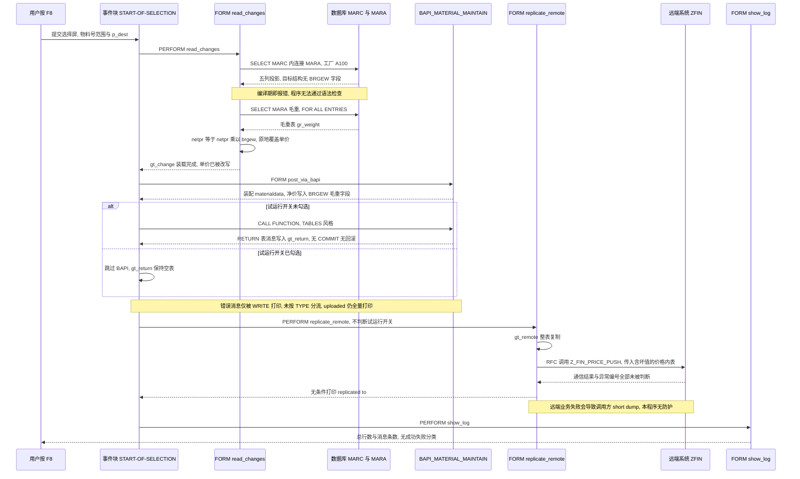

# ZREPORT_BAPI_UPLOAD 报表源码分析报告

> 分析对象：`zreport_bapi_upload.abap`（REPORT，126 行，4 个 FORM + 2 个事件块）
> 分析重点（按用户诉求）：BAPI 调用正确性、RFC 复制正确性、价格计算正确性
> 阅读对象：接手该程序后需要在 30 分钟内搞懂"它干什么、错在哪、怎么修"的后端开发

---

## 一、程序定位与业务背景

### 1.1 业务场景

这是一张**采购价批量维护 + 跨系统同步**的运维型报表。典型业务动机是这样的：

某公司财务在后台用 Excel 或其他中间件批量导入了物料的采购价变更（ERP 里的 `MARC-NETPR`），但这些价格变更只在本地系统落地。为了让财务/资金系统（代号 `ZFIN` 的远端系统，通常是 FI 侧的预算或成本核算系统）也能立即看到新价，需要在导入完成后**把同一批价格再通过 RFC 推给远端**，避免两边价格漂移、导致预算控制和实际采购成本对不上。

程序作者因此把它设计成一条**四段直线流水线**：

```
读数(MARC+MARA)  →  换算(价格×毛重)  →  上传(BAPI_MATERIAL_MAINTAIN)  →  复制(RFC 到 ZFIN)  →  日志
```

**整体设计范式一句话定性**：这是一套教科书式的"经典 ABAP 报表直线流程"（Global Data + `PERFORM` 串联 + `WRITE` 出结果），结构意图清晰、可读性尚可，但没有事务边界、没有错误处理、没有语义校验，属于典型的"能跑起来就算成功"的早期报表风格——而事实上它**连编译都过不了**（详见第三章与第五章）。

### 1.2 作者真正想做的事 vs 程序实际做的事

这是理解本程序最重要的一件事。作者的意图链是：

1. 从 `MARC` 读工厂 `A100` 下物料的采购净价 `NETPR` 和币种 `WAERS`；
2. 把价格换算成"单位重量价格"（作者大概想表达"每公斤多少钱"）；
3. 通过 `BAPI_MATERIAL_MAINTAIN` 把结果写回 SAP；
4. 把同一批数据 RFC 推送到远端 `ZFIN`；
5. 打印一份日志。

而程序**实际**做的事是：

1. ✅ 读数这一步的 SQL 骨架是对的；
2. ❌ 第 2 步把 `NETPR`（单价·金额）乘上 `BRGEW`（毛重·重量），得到一个**既不是价也不是量**的数字；
3. ❌ 第 3 步把这个坏数字塞进 BAPI 的 `BRGEW`（毛重）字段里——**FM 本身根本不更新 `MARC-NETPR` 采购价**，也就是说作者想要的"价格落库"在这条路径上从来就不成立；
4. ❌ 第 4 步把坏数字推给远端；
5. ❌ 第 5 步不看 BAPI 错误、不看 RFC 异常，永远打印"uploaded / replicated"。

也就是说：**这条流水线的三段里，只有第一段（取数）接近正确，其余三段在业务语义上都是错的。** 用户问的三个重点（价格有没有算错、BAPI 对不对、RFC 对不对），答案分别是：算错了（量纲错）、用错 FM（且不处理错误）、不判断异常（且试运行也会真推）。

---

## 二、程序执行流程总览

### 2.1 执行流程图



虚线缺口节点（`F1`/`G1`）不是程序的一部分，而是本报告要指出的两处最关键的控制流缺口。

### 2.2 责任链表

| 子程序 | 调用者 | 职责 |
| --- | --- | --- |
| 全局声明区（`TYPES`/`DATA`） | 编译器 | 定义 `ty_chg`（价格变更行）、`ty_rmess`（自定义消息行）与 `gt_change`/`gt_return`/`gt_remote`/`gr_weight`/`gs_target` 五个全局对象 |
| 选择屏 `BLOCK b` | 系统（程序启动） | 收物料号范围 `s_matnr`、RFC 目标 `p_dest`、试运行开关 `p_dryrun` |
| 事件块 `INITIALIZATION` | 系统事件 | 把选择屏上的 `p_dest` 复制进 `gs_target-rfcdest` |
| 事件块 `START-OF-SELECTION` | 系统事件（F8 执行） | 用 `PERFORM` 顺序驱动后四个 FORM |
| `FORM read_changes` | `START-OF-SELECTION` | 取 `MARC` + `MARA` 数据到 `gt_change`，另取毛重表，按毛重"重算"净价并回写 |
| `FORM post_via_bapi` | `START-OF-SELECTION` | 把 `gt_change` 装配成 BAPI 行，调用 `BAPI_MATERIAL_MAINTAIN`，打印返回消息与"已上传"清单 |
| `FORM replicate_remote` | `START-OF-SELECTION` | 复制内表并用 RFC 调用远端 `Z_FIN_PRICE_PUSH`，打印"已复制" |
| `FORM show_log` | `START-OF-SELECTION` | 打印 `gt_change` 总行数与 `gt_return` 消息条数 |

下面按这条流程，逐个子程序展开。

---

## 三、分组分析（按程序流程 / 子程序）

### 3.1 全局声明区：类型定义与数据对象

先看数据契约，后面所有的正确性判断都依赖这两个结构定义。

```abap
TYPES: BEGIN OF ty_chg,
         matnr TYPE mara-matnr,
         werks TYPE marc-werks,
         netpr TYPE marc-netpr,
         waers TYPE marc-waers,
       END OF ty_chg.

TYPES: BEGIN OF ty_rmess,
         typeid   TYPE char1,
         msgid    TYPE msgid,
         msgno    TYPE msgnum,
         msgv1    TYPE char50,
         msgv2    TYPE char50,
       END OF ty_rmess.

TYPES ty_rmess_tab TYPE STANDARD TABLE OF ty_rmess WITH EMPTY KEY.

DATA: gt_change  TYPE TABLE OF ty_chg,
      gt_return  TYPE ty_rmess_tab,
      gt_remote  TYPE TABLE OF ty_chg,
      gr_weight  TYPE TABLE OF p,
      gs_target  TYPE rfcdest.
```

**做什么** — 声明两个结构：`ty_chg` 是"一行价格变更"（物料号、工厂、采购净价、币种），`ty_rmess` 是"一条消息"；再声明四个内表（待上传变更、BAPI 返回消息、待推送远端的变更、毛重查找表）和一个 RFC 目标结构。

**为什么 / 设计点评** — 把数据契约显式抽成 `TYPES` 而非直接用 `MARC`/`MARA`，方向是对的：这让内表"窄"（只 4 列），内存与 RFC 传输量都小，也天然带着类型校验。`gs_target TYPE rfcdest` 让 `DESTINATION` 参数有了明确的类型对象而不是裸 `char3`，也比写 `DESTINATION 'ZFIN'` 硬编码好——RFC 目标可以参数化，这是本程序少有的正确决策之一。

**风险与改进** — 三个结构性问题：

- 🔴 **`ty_chg` 缺 `brgew`**。后面 `read_changes` 的 SQL 却要取 `mara~brgew`，作者等于自己给自己埋了雷：要么 SQL 投影不进来，要么补字段——这直接导致下面的编译错误。更根本的是，缺 `brgew` 说明作者从一开始就没想清楚"价格换算"到底要哪几个字段（见 3.4 ③）。
- 🟠 **`ty_rmess` 是 `BAPIRETLPY` 的手工劣化版**：只抄了 `MSGV1`/`MSGV2`，丢掉 `MSGV3`/`MSGV4`。SAP 很多标准消息的实参在 `MSGV3`/`MSGV4` 里，丢了就等于消息残缺。而且 `ty_rmess` 没有显式主键（`EMPTY KEY`），后面想按行号关联错误就无从下手。
- 🟡 **`gr_weight TYPE TABLE OF p` 是通用引用类型内表**，`p` 是 pointer 类型，行无结构。Open SQL 需要结构化的目标才能投影字段，这行声明直接判了 `read_changes` 第二段 SQL 的死刑（见 3.4 ②）。另外 `gt_change`/`gt_remote` 都没有 `WITH EMPTY KEY`，走的是标准键——对 `ty_chg` 这种无显式主键的结构，标准键会退化成"全部非表字段"，也就把被改写的 `netpr` 也算进了键里（见 3.4 ③）。

**改进方向**：保留 `ty_chg` 但显式声明主键（`matnr` + `werks`，这是 `MARC` 的真实主键），补 `brgew` 或干脆不取；消息结构直接复用 `BAPIRET2`（BAPI 专用、带 `TYPE`/`ID`/`NUMBER`/`MESSAGE`/`LOG_NO`），把 `ty_rmess` 删掉；`gr_weight` 改成 `TYPE TABLE OF mara` 或专用窄结构。

### 3.2 事件块 `INITIALIZATION`

```abap
INITIALIZATION.
  gs_target-rfcdest = p_dest.
```

**做什么** — 程序启动（还没显示选择屏）时，把选择屏参数 `p_dest` 复制到全局结构 `gs_target` 的 `rfcdest` 成员上。

**为什么 / 设计点评** — `DESTINATION` 参数需要一个"可以整体赋值的结构或变量"，作者没有直接把 `p_dest` 传给 RFC 调用，而是套了一层 `gs_target`。动机大概是"以后要加 `NO_BODY`/`rfcdest_rfc` 之类附加字段时不用改调用点"，属于预留扩展点的写法，思路不坏。

**风险与改进** — 这一行本身无功能性风险，但**结构上有两处冗余**：

- 🟡 `gs_target` 是全局变量，`DESTINATION p_dest` 直接就能用，这个中间层在本程序里没有任何额外价值，反而多出一个全局状态位。
- 🟡 把参数搬运放在 `INITIALIZATION` 而不是调用点，等于把"RFC 目标 = p_dest"这条约束隐藏在一个事件块里。新人读 `replicate_remote` 时看不出目的地从哪来，必须回头翻 `INITIALIZATION`。建议直接 `DESTINATION p_dest`，让数据流局部可见。

**风险与改进（配置校验）** — 更实质的风险在这里没有处理：`p_dest` 是**任意输入的 3 位字符**，程序从未校验它在 `TFDEST`（RFC 目标表）里存在且可被当前用户调用。填错一个字符不会在选择屏报错，而是等到运行时才以 `destination_unavailable` 抛出——而这个异常本程序也没判断（见 3.6）。建议在 `AT SELECTION-SCREEN OUTPUT` 或 RFC 前用 `RFCDEST-CHECK` 类接口（如 `CL_RFC_DESTINATION`）做一次可用性检查。

### 3.3 事件块 `START-OF-SELECTION`：主控调度

选择屏部分先看清楚了，因为后面的输入校验全靠它：

```abap
SELECTION-SCREEN BEGIN OF BLOCK b.
  SELECT-OPTIONS s_matnr FOR gt_change-matnr.
  PARAMETERS p_dest TYPE rfcdest DEFAULT 'ZFIN'.
  PARAMETERS p_dryrun AS CHECKBOX.
SELECTION-SCREEN END OF BLOCK b.
```

```abap
START-OF-SELECTION.

  PERFORM read_changes.
  PERFORM post_via_bapi.
  PERFORM replicate_remote.
  PERFORM show_log.
```

**做什么** — 选择屏给三个输入：物料号范围 `s_matnr`、RFC 目标 `p_dest`（默认 `ZFIN`）、试运行开关 `p_dryrun`。主控块不加任何判断，顺序 `PERFORM` 四个 FORM：读数 → BAPI 上传 → RFC 复制 → 打日志。

**为什么 / 设计点评** — "主控只做调度，具体逻辑放 FORM"是这个年代最主流也最直观的报表结构，可读性好、调试时能用断点逐段跟。作者把 `p_dryrun` 提到选择屏做开关，说明作者**意识到了上传动作有风险、需要人工兜一道**，这个意识是对的——只是执行只做了一半（见 3.5 ② 和 3.6 ①）。

**风险与改进** — 这段是"业务闸门"的最佳位置，但一道闸门都没设：

- 🟠 **没有空输入拦截**。`s_matnr` 可空，`gt_change` 为空时 `post_via_bapi` 仍会拿空 `materialdata` 去调 BAPI（`BAPI_MATERIAL_MAINTAIN` 对空表会返回错误或无效调用），`replicate_remote` 仍会往远端发一次空调用。应在 `PERFORM` 前加 `IF gt_change IS INITIAL. MESSAGE '000' TYPE 'S'. RETURN. ENDIF.` 一类的前置退出。
- 🟠 **没有权限检查**。改物料主数据需要 `M_MATNR`（物料主数据）+ 工厂级权限（`M_MATNR_M`/工厂授权对象），程序完全不检查，直接凭用户的 SAP 权限去调 BAPI。
- 🟡 **工厂 `A100` 硬编码在 SQL 里，没上选择屏**（见 3.4 ①）。类型里明明带了 `werks`，却让用户无法选择工厂，这是设计不一致。
- 🟡 `PARAMETERS p_dryrun AS CHECKBOX` 未指定 `GENERAL`/`SAMPLE`/`USER-CLEAR`，导入参数默认是否勾选依赖系统设置，跨系统行为不一致；试运行开关一旦默认错向就会造成生产事故，建议显式写 `AS CHECKBOX GENERAL`（默认不勾选）并配 `TEXT-001` 说明。
- 🟡 `SELECT-OPTIONS s_matnr FOR gt_change-matnr` 借内表字段获得 F4 帮助，这个技巧可用，但更标准的写法是 `TYPES` 里显式基于数据元素声明，避免依赖运行时已被覆盖的全局内表。

### 3.4 `FORM read_changes`：取数与"价格换算"（核心，分三步）

这是全程序问题最集中的地方，也是用户问"价格有没有算错"的答案所在。分三步看。

#### ① 主查询：一次 SQL 同时取价格与毛重

```abap
SELECT marc~matnr marc~werks marc~netpr marc~waers mara~brgew
  FROM marc INNER JOIN mara ON mara~matnr = marc~matnr
  INTO TABLE gt_change
  WHERE marc~matnr IN s_matnr
    AND marc~werks  = 'A100'.
```

**做什么** — 以 `MARC` 为驱动表内连接 `MARA`，取物料号、工厂、采购净价、币种、**毛重**五列，装进 `gt_change`。

**为什么 / 设计点评** — SQL 骨架本身是合理的：`MARC` 上有 `MATNR`+`WERKS` 主键索引，`s_matnr IN` 的范围扫描走索引前缀，`WERKS = 'A100'` 命中主键第二段，性能可控；`INNER JOIN MARA` 用 `MATNR` 连接，`MARA` 主键命中，回表开销小。作者想"一次取全"（连毛重一起带回来）避免第二次查表，这个出发点是对的。

**风险与改进** — 🔴 **P0：这条语句在编译期就不成立。** `INTO TABLE` 的目标 `gt_change` 行类型是 `ty_chg`，只有 `matnr/werks/netpr/waers` 四个字段，而 SELECT 列表投影了 5 列且包含 `mara~brgew`——结构化内表目标里没有这个字段，ABAP 的 SQL 语义检查会直接报错（`MARA~BRGEW` 不在目标结构中）。也就是说**当前源码根本编译不过，不存在"能不能跑"的讨论**。即使把 `brgew` 补进 `ty_chg` 让它编译通过，也只是把第 ② 步变成纯冗余。

同时还有两处非致命问题：

- 🟡 `ty_chg` 里没有 `brgew`，与 SQL 投影不一致，这正是作者后来不得不再查一次的原因——设计不闭环。
- 🟡 工厂 `'A100'` 硬编码在 `WHERE` 里，与结构里存在的 `werks` 字段不匹配（用户无法选工厂），也无法在多工厂场景复用。

**改进方向**：要么 `SELECT` 只投影 4 列（不要 `brgew`），把毛重通过一次 `FOR ALL ENTRIES` 补齐；要么把 `brgew` 加进 `ty_chg` 并让第 ② 步整体消失。无论哪种，都要把 `werks` 提到选择屏。

#### ② 二次取数：FOR ALL ENTRIES 补一张毛重表

```abap
SELECT matnr brgew FROM mara
  INTO TABLE gr_weight
  FOR ALL ENTRIES IN gt_change
  WHERE matnr = gt_change-matnr.
```

**做什么** — 以 `gt_change` 为驱动表，用 `FOR ALL ENTRIES` 再从 `MARA` 取一遍物料号与毛重，装进 `gr_weight`。

**为什么 / 设计点评** — `FOR ALL ENTRIES` 把"逐行 `SELECT SINGLE`"（N 次数据库往返）压成一次批量取数，是报表里标准的性能手法，思路正确。之所以需要它，作者大概是因为①的投影装不进 `ty_chg`，于是想让第 ③ 步从单独一张表里读毛重。

**风险与改进** — 🔴 **P0：目标表类型不对。** `gr_weight` 声明为 `TYPE TABLE OF p`（通用引用类型内表，行无结构），Open SQL 需要结构化目标才能承载投影列，这条语句同样过不了编译。即使改成 `TYPE TABLE OF mara`，这张表也是**完全冗余的**——①的 `INNER JOIN` 已经把 `brgew` 查出来了，同一次数据库往返里完全可以带下来。

其他改进点：

- 🟡 `FOR ALL ENTRIES` 前没有 `IF gt_change IS NOT INITIAL` 判断。空表时 `FAE` 会直接跳过查询（不会炸），但作者显然不清楚这个保护，**一旦以后把驱动表换成非空的场景**就可能踩到 `FAE` 的空表陷阱。养成加判断的习惯。
- 🟡 `FAE` 不做去重：`MARA` 按 `MATNR` 唯一，`gr_weight` 理论无重复；但如果驱动表同一物料多行（多工厂场景），`gr_weight` 会按行数重复，浪费内存。建议 `SELECT DISTINCT`。

**改进方向**：最简做法是**删掉这段**，把 `brgew` 直接放进 `ty_chg`。

#### ③ "按毛重重算净价"并回写内表

```abap
LOOP AT gt_change INTO DATA(ls_chg).
  READ TABLE gr_weight INTO DATA(ls_w) WITH KEY matnr = ls_chg-matnr.
  ls_chg-netpr = ls_chg-netpr * ls_w-brgew.
  MODIFY gt_change FROM ls_chg.
ENDLOOP.
```

**做什么** — 遍历 `gt_change`，从毛重表按物料号查出毛重，把该行的**采购净价乘以毛重**，然后用 `MODIFY ... FROM` 把整行写回 `gt_change`。

**为什么 / 设计点评** — 作者的意图几乎肯定是想做"价格换算"（单价 → 单位重量价）。如果换算方向对，这个位置和写法都是合理的：先批量取重量再在内存里算，避免逐行查库。

**风险与改进** — 🔴 **P0：这是量纲错误（维度不一致的乘法），而且语义上根本不成立。** 逐条校核数据元素语义：

| 数据元素 | 业务含义 | 单位/量纲 |
| --- | --- | --- |
| `MARC-NETPR` | 物料在采购价目表中的**净价（不含税单价）**，按 1 个价格单位的物料 | **金额 / 币种**（`WAERS`） |
| `MARA-BRGEW` | 物料**毛重**，随物料基础计量单位配置 | **重量**（通常 KG） |

金额 × 重量 = `金额·重量/币种`，这个量纲在 SAP 里**没有任何业务定义**。正确换算方向是**除**：要"每公斤价"应该是 `netpr / brgew`（而不是乘）。补充两点语义细节：

- 若业务真的要"每公斤价"，用 `NTGEW`（**净重**）通常比 `BRGEW`（毛重，含包装）更符合业务口径，这是同类需求里常见的口径错误。
- 若业务其实想要"按批次算总金额"，那被乘的应该是**数量**（`MENGE`/交货数量），跟重量没有任何关系。作者很可能把"数量"错写成了"重量"。

派生的次生问题：

- 🔴 **除零风险的反面：乘法虽不除零，但会放大数量级**。`NETPR` 是 `CURR` 类型（15 位、3 位小数），`BRGEW` 是重量类型；乘积随毛重线性放大，对包装类大宗物料（毛重上千 KG）可能超出 `CURR` 15 位的表示范围，导致溢出/转换异常或金额被静默截断——而且**即便不溢出，也没有业务意义**。
- 🔴 **原地覆盖，原始值不可追溯**。`ls_chg-netpr` 被直接改写，`gt_change` 里再也拿不到原始单价。后面 BAPI 上传和 RFC 推送用的都是这个坏值，且出错后无法从程序输出反推原始价格。正确做法是同时保留 `netpr_orig` 与 `netpr_calc` 两个字段，日志里也打印两者。
- 🟠 **`MODIFY ... FROM` 用在 `LOOP ... INTO` 里是隐晦写法**。因为 `ty_chg` 没显式主键，`gt_change` 的标准键退化为全部四个字段，而 `MODIFY FROM wa` 是"按 wa 的键找行、整行替换"——这里 `wa.netpr` 还是旧值，所以恰好能命中旧行，属于"歪打正着"。一旦将来给 `ty_chg` 加了 `matnr+werks` 主键，`MODIFY FROM` 的行为会变（改成部分键匹配 + 逐字段更新），语义随之改变；且重复行会被折叠。推荐 `LOOP AT gt_change ASSIGNING FIELD-SYMBOL(<row>)` 直接改当前行，或 `MODIFY gt_change FROM ls_chg` 换成按索引 `MODIFY gt_change FROM ls_chg INDEX ...`。
- 🟡 `READ TABLE` 未检查 `sy-subrc`。理论上毛重一定查得到（同一批物料），但 `READ` 失败时 `ls_w-brgew` 是初始值 `0`，乘法结果变成 `0`，程序毫无察觉。

**改进方向（最小可行修复）**：

```abap
" 正确的"每公斤价"换算
IF ls_w-brgew > 0.
  ls_chg-netpr_calc = ls_chg-netpr_orig / ls_w-brgew.
ELSE.
  ls_chg-netpr_calc = ls_chg-netpr_orig.   " 无重量时退化为单价
ENDIF.
```

`READ` 查不到、或 `brgew` 为 `0`、或单位不是 KG 的情况，都要有明确的业务分支与告警，不能静默产出 `0`。

**过渡**：读数阶段把 `MARC`+`MARA` 拉进内存并"按毛重换算"之后，接下来就是把这个内存结果写回 SAP——这正是下一节要重点审视的 BAPI 调用。

### 3.5 `FORM post_via_bapi`：写回 SAP（分三步）

用户问的"BAPI 调用正确性"，答案全部集中在这三步。

#### ① 装配 BAPI 行：把净价塞进毛重字段

```abap
DATA lt_mara TYPE mara.
DATA ls_mara TYPE mara.

LOOP AT gt_change INTO DATA(ls_chg).
  CLEAR ls_mara.
  ls_mara-matnr = ls_chg-matnr.
  ls_mara-brgew = ls_chg-netpr.
  APPEND ls_mara TO lt_mara.
ENDLOOP.
```

**做什么** — 遍历 `gt_change`，逐行新建一条清零的 `MARA` 行，只填两个字段：`MATNR`（物料号）与 `BRGEW`（毛重），把 ③ 步算出来的"净价×毛重"结果写进**毛重字段**，装配成 BAPI 的 `materialdata` 表。

**为什么 / 设计点评** — 复用数据库结构 `MARA` 而不是新建 BAPI 结构，是个常见做法（SAP 示例里也这么写），好处是字段名直观、不必维护第二套结构。用 `CLEAR` 保证每行只带本次要改的字段，**这个思路是符合 BAPI 语义的**：BAPI 把"传入字段的初始值"解释为"不更新"，所以只填 `MATNR` + `BRGEW` 意味着"只更新毛重，其余不动"。这一层设计作者的直觉是对的。

**风险与改进** — 🔴 **P0：字段语义彻底错配。** 作者的意图是"更新采购价"，但 `MARA-BRGEW` 是**毛重**，不是价格。把一个金额量纲的数字写进毛重字段，会污染 SAP 标准主数据。而毛重不是玩具字段——它被拣配重量、运输包装容量、包装规格、物流计费重等下游逻辑使用，一次批量污染会波及多个报表与策略，且这类错误往往在几周后才被发现，追溯成本极高。

🔴 **更根本的问题：FM 选错了。** `BAPI_MATERIAL_MAINTAIN` 更新的是**物料主数据**（基本数据视图 `MARA`、销售/采购视图等），`MARC-NETPR` 属于 `MARC` 的**采购价**字段，这个 BAPI 的 `materialdata` 结构里**根本不包含 `NETPR`**。也就是说：**即使把 ③ 步的换算修正了，这条 BAPI 调用也永远不会写入采购价。** 正确的技术路径通常是：

- 通过采购信息记录（`EINE`）或条件记录（`COND`/`PRICES`）的 BAPI 维护采购价；
- 或对 `MARC-NETPR` 做专门的批量维护工具（如 BDC 到 `MARC` 维护、Mass Maintenance、或自开发 FM）；
- 并配合 `BAPI_PO_CREATE` 之后的价差重算等后续业务。

其他问题：

- 🟡 直接用 `TYPE mara` 传 `materialdata`，编译器无法做 BAPI 结构校验。SAP 推荐传 `BAPIMATERIALDATA`/`BAPI_MATERIALMaintdataInt` 之类的 BAPI 结构，能在编译期发现字段越界与子类型（`EXTENDED_CHECK`、`MATNR` 的 `MATNR_TMP`/`MATNR_PRE` 语义）问题。
- 🟡 没有分块。`BAPI_MATERIAL_MAINTAIN` 对超大内表会显著拖长 LUW 甚至超时时，建议按 500–1000 行切块提交。
- 🟡 没有把 `werks` 带进 BAPI 行。`MARA-BRGEW` 虽是全局字段，但整条链路的工厂上下文（`A100`）没有作为参数传递，后续无法按工厂区分错误。

#### ② 调用 BAPI：只用 TABLES 风格，且绕过就什么都没有

```abap
IF p_dryrun IS INITIAL.
  CALL FUNCTION 'BAPI_MATERIAL_MAINTAIN'
    TABLES
      materialdata  = lt_mara
      return        = gt_return.
ENDIF.
```

**做什么** — 只有在 `p_dryrun` 未勾选时，才调用 `BAPI_MATERIAL_MAINTAIN`，把 `lt_mara` 作为 `materialdata` 传入、把 `gt_return` 作为 `return` 传入，用的是老式 `TABLES` 参数。

**为什么 / 设计点评** — 用 `p_dryrun` 兜住写操作、让用户可以先空跑，这个设计意图是正确的风控思路。但实现上用了 BAPI 编程规范明确劝退的 `TABLES` 风格。

**风险与改进** — 🔴 **P0：完全没有事务控制（无 `COMMIT WORK` / `ROLLBACK`）。** 这是本程序最严重的问题之一：

- `BAPI_MATERIAL_MAINTAIN` 运行在**独立的 LUW** 里，**不写 `COMMIT WORK` 变更就不会落库**。程序跑完只有屏幕输出，数据在 LUW 结束/程序退出时被隐式丢弃。结果是：用户看到"uploaded"满屏，SAP 里毛重一个字节都没变。
- **失败路径也没有 `ROLLBACK`**。批量中途失败时，前面成功的行仍留在 LUW 里；如果后续有人补一句 `COMMIT`，就会把"部分成功"的半截数据提交进去，制造脏数据。
- 正确写法是显式 LUW 控制，且要用 BAPI 专用提交接口：`BAPI_TRANSACTION_COMMIT`（会处理 FM 的 postprocessing）与 `BAPI_TRANSACTION_ROLLBACK`，而不是裸 `COMMIT WORK`。
- ⚠️ **LUW 与 RFC 的次序陷阱**：即使补上 `COMMIT WORK`，顺序也必须重新设计。当前顺序是"先 BAPI（本端）→ 后 RFC（远端）"。如果先提交本端、再做 RFC，而 RFC 失败，那么**本端已提交、远端未收到**，两边数据永久不一致，且没有任何补偿机制。正确做法是把两侧更新放在同一个业务边界里考虑（要么远端先成功再提交本端，要么引入日志表做补偿/重推），并在失败时明确 `ROLLBACK`。

🟠 **P0（返回表处理缺失，详见 ③）：`TABLES` 风格让错误更难正确处理。** 规范做法是用具名参数 `MATERIALDATA = lt_mara RETURN = ls_ret` 并通过 `IMPORTING` 拿 `RETURN` 结构；`TABLES` 风格的返回表**调用前不会自动清空**、不返回 `BAPIRET2` 类型信息、也不携带 `LOG_NO`，无法按行关联错误。

其他问题：

- 🟠 **`p_dryrun` 为空分支让 `gt_return` 保持初始空表**，后续 ③ 步的 `LOOP` 自然什么都不打——试运行没有任何"将要做什么"的预览输出，试运行价值大打折扣。
- 🟠 **`materialdata` 为空时不拦截**：若 `gt_change` 为空，会拿空表调 BAPI（`BAPI_MATERIAL_MAINTAIN` 会返回错误消息甚至无效调用），应在调用前 `IF lt_mara IS INITIAL. RETURN. ENDIF.`。

#### ③ 处理返回消息与"上传成功"清单

```abap
LOOP AT gt_return INTO DATA(ls_ret).
  WRITE: / ls_ret-typeid, ls_ret-msgid, ls_ret-msgno, ls_ret-msgv1.
ENDLOOP.

LOOP AT gt_change INTO DATA(ls_chg2).
  WRITE: / 'uploaded', ls_chg2-matnr.
ENDLOOP.
```

**做什么** — 遍历 BAPI 返回表，把 `TYPEID`/`MSGID`/`MSGNO`/`MSGV1` 逐条 `WRITE` 出来；然后**无条件**遍历 `gt_change`，为每一行打印"uploaded + 物料号"。

**为什么 / 设计点评** — 作者显然知道 BAPI 会返回消息（否则不会定义 `ty_rmess`、不会循环打印），说明对 BAPI 的基本模式有认知。但认知止步于"把消息显示出来"。

**风险与改进** — 🔴 **P0：返回表被"打印"而不是被"处理"，这正是 BAPI 最典型的误用。** 正确处理必须包含以下四步，本程序一步都没做：

1. **按 `TYPE` 字段分流**：`BAPIRET2`/`BAPIRETLPY` 的 `TYPE` 取值 `'E'`（错误）、`'W'`（警告）、`'S'`（成功）、`'A'`（中止）。程序完全没有 `IF ls_ret-type = 'E'` 这类判断，等于把"3 条成功 + 2 条错误"和"3 条错误"同等对待。**错误必须真正被处理**：分类、汇总、决定是否中止后续流程。
2. **按行定位并报出是哪个物料失败**：`materialdata` 是批量传入的，错误必须能对应回具体物料。标准做法是循环处理、错误消息里取物料号，或干脆**一行一次调用**以获得天然的行级错误关联。本程序的消息里没有物料号字段，`ty_rmess` 又丢了 `MSGV3`/`MSGV4`，用户拿到报错也无法定位。
3. **决定后续动作**：有 `'E'` 就必须 `ROLLBACK`（或至少标记该行失败、阻止后续 RFC 把错误数据推给远端）。本程序错误之后照样往下走，把坏数据 RFC 推给了 `ZFIN`——**这是本程序危害最大的一条链路**。
4. **正确使用 `MESSAGE` 语句**：用 `WRITE` 输出消息在交互式下勉强能看，后台运行时无法分类、无法留痕、无法触发消息监控。应该用 `MESSAGE ID ... TYPE 'E'/'S'`（配合 `ty_rmess` 的 `MSGID`/`MSGNUM` 字段）或写入应用日志（`BAL`）。

其他问题：

- 🔴 **"uploaded" 是彻头彻尾的谎报**：第二段循环与 BAPI 结果毫无关系，即使 `p_dryrun` 勾选（根本没调 BAPI）、即使所有行都报错，它照样全量打印"uploaded"。这会直接误导运维与财务，让他们以为价格已成功上传。这是"输出比没有输出更危险"的典型案例。
- 🟡 `WRITE` 未做分页与格式控制，物料量大时屏幕刷屏且不可用；没有汇总（成功数/失败数）。

**过渡**：本端 BAPI 写回之后，程序把同一批数据原样复制一份推给远端——这是本程序第二个重点，也是最容易出静默失败的地方。

### 3.6 `FORM replicate_remote`：RFC 跨系统复制（分两步）

用户问的"RFC 复制正确性"，答案在这两步。

#### ① 复制内表并发起 RFC 调用

```abap
DATA lv_ok TYPE c.

gt_remote = gt_change.

CALL FUNCTION 'Z_FIN_PRICE_PUSH'
  DESTINATION gs_target
  TABLES
    it_price = gt_remote
  EXCEPTIONS
    system_failure = 1
    destination_unavailable = 2
    OTHERS = 3.
```

**做什么** — 把 `gt_change` 整表复制到 `gt_remote`，然后用 `DESTINATION gs_target`（即 `ZFIN`）通过 RFC 调用远端 FM `Z_FIN_PRICE_PUSH`，把 `gt_remote` 作为 `it_price` 传入，并声明了三个异常。

**为什么 / 设计点评** — RFC 是"同构系统间复制数据"的正确工具，比 SMW/IDoc 轻、比 OData 适合小批量。`gt_remote = gt_change` 复制一份也体现了"本地表与传输表分离"的意识（虽然此处并未真正隔离，见下文风险）。声明 `EXCEPTIONS` 也说明作者知道 RFC 会失败。

**风险与改进** — 这一步集中了本程序最隐蔽的一批问题：

- 🔴 **P0：`p_dryrun` 完全不生效于本段。** `p_dryrun` 只包住了 3.5 ② 的 BAPI 调用，`replicate_remote` 是**无条件执行**的。这意味着勾选"试运行"、本地一个字都不写的同时，**远端 `ZFIN` 会被真实写入**。这是最危险的一条：用户以为在演练，实际上生产系统数据已被改动。任何"试运行"语义都必须覆盖**所有**写操作路径。
- 🔴 **P0：声明了异常却不判断，`lv_ok` 是死代码。** 详见 ②。
- 🟠 **`TABLES` 参数传内表到远端有结构一致性的硬约束。** 用 `TABLES` 传内表要求**调用端与被调端的行类型结构完全一致**（字段顺序、长度、类型都要对得上）。本程序传的是本地自定义结构 `ty_chg`。如果远端 `ZFIN` 系统里同名结构有任何字段长度或顺序差异，RFC 会直接 dump 或产生错位数据。正确做法是两端共用一个 **DDIC 结构**（如 `ZFIN_PRICE`）或 DDIC 表类型，这是 RFC 编程的基本纪律。
- 🟠 **`TABLES`/`REFERENCE` 传内表是按引用传输**：远端 FM 若修改了 `it_price` 的内容或追加行，修改会**直接回写到调用方的 `gt_remote`**（进而影响同结构的 `gt_change` 视图语义）。程序在 RFC 之后还继续用这些数据做日志，没有做任何隔离或副本保护。建议改用 `VALUE` 传值语义（`it_price TYPE ZFIN_PRICE_T`）或 RFC 之后不复用该表。
- 🟠 **RFC 失败会短转储（short dump）调用方。** 这是 RFC 最经典的坑：`EXCEPTIONS` 只能接住**通信层**失败（`system_failure`、`destination_unavailable`）；如果远端 FM 内部触发未捕获的 `MESSAGE TYPE 'A'`、`ASSERT` 失败或未处理的 `RAISE EXCEPTION`，**调用方会直接 short dump**，本程序对此毫无防护。稳妥做法是让远端 FM 自己捕获并通过 `RETURN`/`EXPORTING` 结构回传业务错误，或本地改用 `IN BACKGROUND` 异步调用后轮询状态。
- 🟠 **RFC 前没有校验目的地可用性与大小限制。** `p_dest` 未校验（见 3.2），且内表不分块，大批量时容易触发 `TRUNCATED`（压缩失败）或超时。
- 🟡 传输的数据本身就是坏数据：`netpr` 是 3.4 ③ 算出的"净价×毛重"，`waers` 是币种但没有做任何汇率或价格基准换算，`werks` 固定 `A100`。远端系统如果按"单价"理解这个字段，会得到量纲错误的金额，并据此做预算控制——错误会向下游决策扩散。
- 🟡 没有传输前置条件信息（价格生效日期、货源、价格类型 `PRICE_UNIT`/定价单位换算）。采购价不是一个孤立的数字，缺这些上下文远端无法正确落库。
- 🟡 没有 `IN BACKGROUND`/超时控制，大批量会阻塞对话框（`TRC` 超时对话框）。
- 🟡 与 LUW 的关系没处理：如果按正确方式在 3.5 补了 `COMMIT WORK`，则本端已提交、远端未收到的不一致会立刻出现（详见 3.5 ② 的次序陷阱）。RFC 期间**远端若自己执行 `COMMIT WORK`**，还会连带结束调用方的 LUW，这类 LUW 穿透问题必须提前设计。

#### ② 无条件打印"已复制"

```abap
WRITE: / 'replicated to', p_dest.
```

**做什么** — 不看任何执行结果，直接打印"replicated to + 目标系统名"。

**为什么 / 设计点评** — 无设计点评可写。这行代码的价值在于它**暴露了作者的真实意图**：`DATA lv_ok TYPE c.` 声明了却从未赋值，说明作者**本来打算**根据 `lv_ok` 或异常编号来分支输出成功/失败，最后没写完或写漏了。这属于典型的"半成品上线"。

**风险与改进** — 🔴 **P0：这是静默数据丢失的标准形态。** RFC 的三种失败路径（`system_failure`、`destination_unavailable`、`OTHERS`）全部被吞掉，程序在远端根本没收到数据的情况下依然报告成功。对一个跨系统价目同步程序来说，用户看到的"成功"是假的。

正确写法：

```abap
CALL FUNCTION 'Z_FIN_PRICE_PUSH'
  DESTINATION gs_target
  TABLES
    it_price = gt_remote
  EXCEPTIONS
    system_failure            = 1
    destination_unavailable   = 2
    OTHERS                    = 3.

CASE sy-subrc.
  WHEN 0.
    lv_ok = 'X'.
    WRITE: / 'replicated to', p_dest.
  WHEN 1.
    MESSAGE e000(zfin) WITH 'RFC 系统故障' p_dest.
  WHEN 2.
    MESSAGE e000(zfin) WITH 'RFC 目标不可用' p_dest.
  WHEN OTHERS.
    MESSAGE e000(zfin) WITH 'RFC 调用失败' p_dest.
ENDCASE.
```

并且**试运行时必须整段跳过**：

```abap
IF p_dryrun IS INITIAL.
  PERFORM replicate_remote.
ENDIF.
```

**过渡**：无论前面两段写得对不对，最后一段 `show_log` 决定了用户能看到什么——它也是本程序里最后一个需要审视的地方。

### 3.7 `FORM show_log`：日志输出

```abap
FORM show_log.

  WRITE: / 'total', lines( gt_change ).
  WRITE: / 'messages', lines( gt_return ).

ENDFORM.                       "show_log
```

**做什么** — 打印两行：`gt_change` 的总行数，以及 `gt_return` 的消息条数。

**为什么 / 设计点评** — 思路是对的：给运维一个最小可用的汇总。但"消息条数"这个指标本身没有意义——BAPI 可能返回 10 条消息而 9 条是 `'W'`、1 条是 `'E'`，光看条数无法判断成败，甚至在 `p_dryrun` 勾选（BAPI 未调用）时 `gt_return` 恒为空，会打印"messages 0"，让人误以为"没有错误"。

**风险与改进** — 无功能性缺陷，但作为日志有以下明显不足：

- 🟡 **没有按 `TYPE` 分类计数**：应该分别统计成功数、警告数、错误数，并给出"本次处理结论"（全部成功 / 部分失败 / 全部失败）。
- 🟡 **没有时间戳、用户名、目标系统、运行方式（手工/后台）**，日志事后无法定位是哪次跑的。
- 🟡 **`WRITE` 不是日志**。后台运行时输出进 spool，几天后就被冲掉了；也没有写应用日志（`BAL`）或自建日志表。跨系统价目同步这类操作**必须有可追溯的持久日志**。
- 🟡 **没有分页与格式控制**，物料量大时不可读；也没有把失败物料号集中列出。

**改进方向**：至少补一个"成功/警告/错误"三分计数 + 失败物料清单 + `BAL` 日志写入；配合 ALV 输出失败明细，比 `WRITE` 更适合批量维护场景。

---

## 四、执行流程全景图（数据视角）



数据流转上有三处**语义断裂**值得单独记住：`MARC-NETPR`（金额）在 3.4 ③ 被乘上重量后变成"金额×重量"，在 3.5 ① 被当作"重量"写进 `BRGEW`，在 3.6 ① 又以"价格"的名义发给远端。**一个字段在一条链路上换了两次业务含义，且每一次都静默发生**，这正是这个程序最危险的地方。

---

## 五、问题清单与改进建议（按优先级）

### 🔴 P0 业务正确性

| 编号 | 所在子程序 | 问题 | 影响 | 改进方向 |
| --- | --- | --- | --- | --- |
| P0-1 | `FORM read_changes` | SQL 投影 5 列（含 `mara~brgew`）写入只有 4 个字段的 `ty_chg` 结构 | **编译期报错，程序无法通过语法检查** | 要么 `SELECT` 只投影 4 列，要么把 `BRGEW` 补进 `ty_chg` |
| P0-2 | `FORM read_changes` | `netpr`（金额）与 `brgew`（重量）相乘，量纲错误；方向也错（应除） | 产出无业务定义的数字，并原地覆盖原单价 | 改 `netpr / brgew`（或 `ntgew`），判零、加单位换算、保留原值字段 |
| P0-3 | `FORM read_changes` | `gr_weight TYPE TABLE OF p` 无行结构，不能作为 Open SQL 目标 | 第二段 SQL 同样不成立；即使能跑也是完全冗余的重复查询 | 删掉这段，把 `brgew` 直接并入第一条 SQL |
| P0-4 | `FORM post_via_bapi` | BAPI 返回表只被 `WRITE`，不按 `TYPE` 判断 `'E'/'A'`，不按行定位错误，不汇总 | 失败被当成成功处理，错误无法追溯到物料 | `READ return ... type = 'E'`，分类汇总，一行一次调用或解析 `MSGV1` 取物料号 |
| P0-5 | `FORM post_via_bapi` | BAPI 调用后**没有 `COMMIT WORK`，失败也没有 `ROLLBACK`** | 变更不落库（用户却以为上传成功）；补提交则可能提交半截数据 | 用 `BAPI_TRANSACTION_COMMIT` / `BAPI_TRANSACTION_ROLLBACK` 显式控制 LUW |
| P0-6 | `FORM post_via_bapi` | 用 `BAPI_MATERIAL_MAINTAIN` 更新 `MARC-NETPR` 采购价，但该 BAPI 的 `materialdata` 不含 `NETPR`；反而把坏值写进 `BRGEW` 毛重字段 | 采购价永远不会被更新；毛重被批量污染，波及拣配/运输/包装等下游 | 改走采购信息记录/条件记录的 BAPI 或专门的 `MARC` 批量维护；立即停止往 `BRGEW` 写数据 |
| P0-7 | `FORM post_via_bapi` | 错误之后照样继续往下走，把坏数据推给远端 | 错误被放大到下游系统 | 出现 `'E'` 即 `ROLLBACK` 并跳过后续步骤 |
| P0-8 | `FORM replicate_remote` | `p_dryrun` 只挡住 BAPI，RFC 无条件执行 | **勾选"试运行"仍真实改动远端生产系统** | 用 `IF p_dryrun IS INITIAL` 包住整个 `PERFORM replicate_remote` |
| P0-9 | `FORM replicate_remote` | 声明了 `EXCEPTIONS` 却不判断，`lv_ok` 未赋值，无条件打印 "replicated to" | 三种失败全部静默，跨系统价目同步出现"假成功" | `CASE sy-subrc` 分流，失败发 `MESSAGE ... TYPE 'E'` |

### 🟠 P1 健壮性

| 编号 | 所在子程序 | 问题 | 改进方向 |
| --- | --- | --- | --- |
| P1-1 | `FORM replicate_remote` | RFC 业务失败会 short dump 调用方，`EXCEPTIONS` 只挡通信层失败 | 远端 FM 内部捕获并 `EXPORTING` 业务错误，或改 `IN BACKGROUND` 异步 |
| P1-2 | `FORM replicate_remote` | `TABLES` 传自定义结构 `ty_chg`，两端结构必须完全一致 | 两端共用 DDIC 结构/表类型 |
| P1-3 | `FORM replicate_remote` | `TABLES` 按引用传输，远端修改会回写本地 `gt_remote` | RFC 之后不复用该表，或改为按值传参 |
| P1-4 | `FORM replicate_remote` | 与 LUW 次序无设计：先提交本端再 RFC 会造成永久不一致 | 重新安排事务边界，必要时引入补偿日志表 |
| P1-5 | `FORM post_via_bapi` / 全局声明区 | `TABLES` 风格调用 BAPI：返回表调用前不清空、无 `BAPIRET2` 类型、无 `LOG_NO` | 改具名参数 `MATERIALDATA =` / `RETURN =`，用 `IMPORTING` 取 `RETURN` |
| P1-6 | 全局声明区 | `ty_rmess` 是 `BAPIRETLPY` 的劣化版，丢 `MSGV3`/`MSGV4`；且 `EMPTY KEY` 无法关联行 | 直接复用 `BAPIRET2` |
| P1-7 | `FORM post_via_bapi` | `materialdata` 为空不拦截；无分块 | 加 `IS INITIAL` 退出；按 500–1000 行分块 |
| P1-8 | `FORM post_via_bapi` | "uploaded" 无条件全量打印，试运行或全失败时也在打印 | 只对真正成功的行打印，并汇总成功/失败数 |
| P1-9 | 事件块 `START-OF-SELECTION` / `INITIALIZATION` | 无空输入拦截、无权限检查（`M_MATNR` 及工厂级）、`p_dest` 未校验可用性 | 补前置退出、`AUTHORITY-CHECK`、`CL_RFC_DESTINATION` 校验 |
| P1-10 | `FORM replicate_remote` | 传输数据缺价格上下文（生效日期、货源、定价单位换算、币种换算），远端无法正确落库 | 扩充传输结构，携带完整的价目条件 |

### 🟡 P2 性能与规范

| 编号 | 所在子程序 | 问题 | 改进方向 |
| --- | --- | --- | --- |
| P2-1 | `FORM read_changes` | 毛重被查了两遍（`INNER JOIN` 已取，又 `FOR ALL ENTRIES` 再取） | 合并为一次查询 |
| P2-2 | `FORM read_changes` | `FOR ALL ENTRIES` 前无空表判断、无 `DISTINCT` | 加 `IS NOT INITIAL` 判断与去重 |
| P2-3 | `FORM read_changes` | `READ TABLE` 未判 `sy-subrc`；`MODIFY ... FROM` 在 `LOOP INTO` 内按全键改写，语义隐晦 | 用 `ASSIGNING` 直接改行；给 `ty_chg` 显式主键 |
| P2-4 | `FORM read_changes` | 工厂 `'A100'` 硬编码在 SQL 中，与结构里的 `werks` 不匹配 | 工厂提到选择屏 |
| P2-5 | `FORM post_via_bapi` | 直接用 `TYPE mara` 传 `materialdata`，无 BAPI 结构校验 | 改用 `BAPIMATERIALDATA` 等 BAPI 结构 |
| P2-6 | `FORM replicate_remote` | 大批量 RFC 阻塞对话框、无超时/大小控制 | 分块 + `IN BACKGROUND` 或超时参数 |
| P2-7 | `FORM show_log` / `FORM post_via_bapi` | 全用 `WRITE` 输出，非消息、非日志，后台运行即丢失 | 用 `MESSAGE` 语句 + `BAL` 应用日志 + ALV 明细 |
| P2-8 | 事件块 `INITIALIZATION` / 选择屏 | `gs_target` 冗余间接层；`p_dryrun` 未声明 `GENERAL`/`SAMPLE`，默认值随系统设置变化 | 直接 `DESTINATION p_dest`；`AS CHECKBOX GENERAL` + 文本说明 |

### 🟢 P3 可扩展性

| 编号 | 所在子程序 | 问题 | 改进方向 |
| --- | --- | --- | --- |
| P3-1 | 全局声明区 | 全部状态放全局内表，FORM 无 `USING`/`RETURN`，无法复用、无法单元测试 | 逻辑下沉到本地类，FORM 只做编排；数据用局部内表传递 |
| P3-2 | 事件块 `START-OF-SELECTION` | 全部业务逻辑写在 REPORT 中，无分层、无扩展点，字段映射与业务规则耦合 | 拆分为"取数/换算/落库/推送/日志"若干类，BAPI 与 RFC 封装成独立方法 |
| P3-3 | `FORM show_log` | 只有一个总行数统计，无按 `TYPE` 分类、无失败物料清单、无运行元数据 | 补成功/警告/错误三分统计与失败明细，必要时落自建日志表 |
| P3-4 | `FORM replicate_remote` | 单一远端 FM 与单一目标，不可扩展到多系统/多价目类型 | 目标与价目类型参数化，为后续多系统复制留口 |

---

## 六、整体评价与启发

### 6.1 优点（客观存在的亮点）

1. **主控与逻辑分离的意识是对的**。`START-OF-SELECTION` 只做 `PERFORM` 调度、四个 FORM 各自职责单一，这是最经典的报表骨架，新人上手成本极低。责任链一目了然（见第二章责任链表）。
2. **RFC 目标参数化是本程序最正确的一个决策**。`p_dest TYPE rfcdest` + `gs_target` 让"推给哪个系统"成为运行时输入，而不是写死的 `'ZFIN'`，天然支持多目标扩展。
3. **有试运行开关的直觉**。作者知道写操作需要人工兜一道（`p_dryrun`），这个风控意识领先于程序其余部分的质量——只是执行没做完。
4. **窄内表 + 显式 `TYPES` 的数据契约**。用 `ty_chg` 而不是直接 `gt_change TYPE TABLE OF mara`，在内存和传输上是划算的。

### 6.2 短板（必须承认的缺陷）

1. **当前状态连编译都过不了**（`FORM read_changes` 两处结构错误）。这意味着这份代码从未在语法检查中通过，很可能是"写完就上线"的产物，也说明团队缺少最基本的质量闸门（`READ`/`CHECK`/Code Review）。
2. **业务语义完全没有被校核**。价格乘重量、把价格写进毛重字段、用主数据 BAPI 更新采购价——三处错误都指向同一个根因：**作者把"字段长度/类型能对上"当成了"字段能这么用"**。数据元素的**语义**（`NETPR` 是金额、`BRGEW` 是重量）才是正确性判据。
3. **错误处理三处集体缺席**：BAPI 返回表只打印不判断、无 LUW 控制、RFC 异常只声明不判断。三个环节都存在"程序报告成功、实际什么也没做成"的静默失败模式。
4. **输出具有欺骗性**。`uploaded` 与 `replicated to` 两条 `WRITE` 与真实结果无关，会主动误导使用者和运维。**没有日志比有假日志更安全**。
5. **试运行语义只覆盖了一半**，反而制造了"本地不动、远端已改"的更大风险。

### 6.3 可学到的设计经验（4 条）

1. **量纲校核必须在写代码之前做，而不是之后做**。凡是"字段 A = 字段 B 运算字段 C"，先在纸上写出三者的单位：`金额/币种 × 重量 = ?` 写不出业务定义，就说明公式错了。SAP 里 `NETPR`（金额）、`BRGEW`（重量）、`NTGEW`（净重）、`MENGE`（数量）是四个不同维度的东西，乘除方向搞反在这个程序里就是一次静默的数据污染事故。
2. **BAPI 的返回值不是日志，是控制流**。标准动作是固定的四步：清空返回表 → 调用 → **按 `TYPE` 分流 `'E'/'W'/'S'/'A'`** → 决定 COMMIT/ROLLBACK 与是否中止。少了第三步和第四步，"调用了 BAPI"和"数据更新成功"之间就没有任何联系。
3. **`COMMIT WORK` / `ROLLBACK` 是 LUW 的边界声明，必须显式**。BAPI 跑在独立 LUW 里，不写提交就是不落库；不写回滚就是给"半截数据提交"留后门。而一旦跨系统，还要额外回答一个问题：**本端提交与远端成功，谁先谁后、失败了怎么补**——这个次序问题必须在设计阶段回答，不能事后补救。
4. **`p_dryrun` 必须是"开关整条链路"，不是"挡住某一个调用"**。只要有一个写操作没被它覆盖，它就不是试运行而是"半运行"，比没有开关更危险。经验做法是把所有副作用包进一个统一入口（一个 FORM/一个类方法），由 `p_dryrun` 在入口处一次性短路。