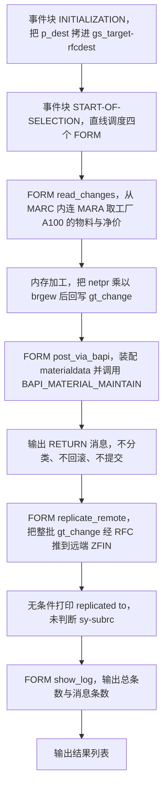
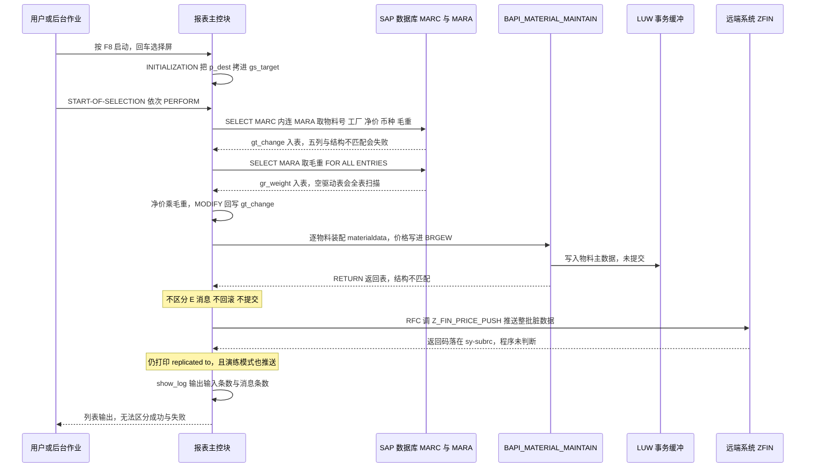

# ZREPORT_BAPI_UPLOAD 分析报告（onboarding 级）

## 一、程序定位与业务背景

这个程序要解决的是一件非常典型的分布式运维场景：**某工厂的物料采购价被上游系统（合同/调价系统）算好了，但 SAP 本地的采购价还没更新，同时下挂的财务系统 ZFIN 需要同步这份价格做成本核算**。所以它把两件事串在一条直线流程里：先用 BAPI 把价格写回 SAP 物料主数据，再用 RFC 把同一批价格推给远端系统。

现有方案为什么"不够"？因为 SAP 里改采购价的标准姿势是维护**采购信息记录 / 条件记录**（BAPI_INFO_RECORD、condition record），而本程序选择走 `BAPI_MATERIAL_MAINTAIN`（物料主数据维护 BAPI），并且把算出来的数值写进了 `MARA-BRGEW`（毛重）。也就是说：**它的写入目标字段和它的业务目标（价格）从一开始就是错位的**——BAPI 调用这一段不只是"没做好"，而是"写错了地方"。更糟的是，返回表没有被真正处理，失败被当成成功打印出来。

整段代码用一个词定性：**直线式（非 OO）批处理报表，作者有"分步骤 + dryrun 意识"的雏形，但没有事务边界、没有错误闭环、量纲校验缺席**。它能跑完、能出列表，但输出的"uploaded / replicated"全部是无条件 `WRITE`，属于典型的"绿色报表、红色数据"。

用户关心的三处正是本程序的重灾区：**BAPI 调用**（写错字段 + 返回表未处理 + 无提交）、**RFC 复制**（异常声明了却不判断 + 目的地与日志不一致 + dryrun 不阻断远端写入）、**价格计算**（净价乘毛重的量纲错误）。下面逐条拆。

## 二、程序执行流程总览



责任链：

| 子程序 | 调用者 | 职责 |
|---|---|---|
| 事件块 INITIALIZATION | 系统（报表启动、选择屏处理之前） | 把选择屏参数 `p_dest` 拷贝进 `gs_target-rfcdest`，作为后续 RFC 的目标 |
| 事件块 START-OF-SELECTION | 系统（用户按 F8，或后台作业自动触发） | 直线调度 `read_changes` → `post_via_bapi` → `replicate_remote` → `show_log` |
| FORM read_changes | 事件块 START-OF-SELECTION | 取工厂 A100 的物料号/工厂/净价/币种，内存中按重量缩放净价，写入 `gt_change` |
| FORM post_via_bapi | 事件块 START-OF-SELECTION | 把每条记录包装成一条 MARA 记录，调 `BAPI_MATERIAL_MAINTAIN` 落库，然后遍历返回表打印消息 |
| FORM replicate_remote | 事件块 START-OF-SELECTION | 把 `gt_change` 整体复制到 `gt_remote`，通过 RFC 调 `Z_FIN_PRICE_PUSH` 推送远端 |
| FORM show_log | 事件块 START-OF-SELECTION | 输出总条数与消息条数，作为程序尾部摘要 |

下面按这条流程，逐个子程序展开。

## 三、分组分析

### 3.1 全局声明区（类型与数据对象）

先看类型定义和内表声明，这是全程序的数据契约，也是后面多处问题的源头。

```abap
TYPES: BEGIN OF ty_chg,
         matnr TYPE mara-matnr,
         werks TYPE marc-werks,
         netpr TYPE marc-netpr,
         waers TYPE marc-waers,
       END OF ty_chg.

TYPES: BEGIN OF ty_rmess,
         typeid   TYPE char1,
         msgid    TYPE msgid,
         msgno    TYPE msgnum,
         msgv1    TYPE char50,
         msgv2    TYPE char50,
       END OF ty_rmess.

TYPES ty_rmess_tab TYPE STANDARD TABLE OF ty_rmess WITH EMPTY KEY.

DATA: gt_change  TYPE TABLE OF ty_chg,
      gt_return  TYPE ty_rmess_tab,
      gt_remote  TYPE TABLE OF ty_chg,
      gr_weight  TYPE TABLE OF p,
      gs_target  TYPE rfcdest.
```

**做什么** — 定义两个行结构：`ty_chg` 是本程序贯穿全程的"价格变更记录"（物料号、工厂、净价、币种），`ty_rmess` 是自制的消息结构；对应建四张全局内表，`gt_change` 承载取数结果并一路传给 BAPI 与 RFC，`gt_remote` 作为 RFC 发送副本，`gr_weight` 暂存毛重，`gs_target` 存 RFC 目的地。

**为什么** — 用 `ty_chg` 这样的窄结构做中间载体是对的：它只带 4 个字段，比直接传 MARC 整行更省内存、更清晰，也让 BAPI 与 RFC 两段共用同一份数据，逻辑上"取一次、用两次"。用一个全局 `ty_chg` 内表贯穿全程，也是非 OO 报表里最常见、成本最低的组织方式。

**风险与改进** — 三个坑。① `ty_chg` 少声明了 `brgew`，而 `read_changes` 的 SELECT 列表却选了 5 列，这直接导致后面 3.4 ① 的 `STRUCTMISMATCH`。② `ty_rmess` 的字段名 `typeid` / `msgid` 在 BAPI 返回表 `BAPIRET2` 里并不存在（BAPIRET2 的字段叫 `TYPE`、`ID`、`NUMBER`、`MESSAGE`、`MESSAGE_V1..V4`），自造结构会让消息读取从根上失效，见 3.5 ③。③ `gr_weight TYPE TABLE OF p` 用内建类型 `P` 装 MARA 子集，读者完全看不出里面是 MATNR + BRGEW，建议 `TYPE TABLE OF mara` 或定义 `ty_wt` 子结构，至少用 `SORTED TABLE ... WITH UNIQUE KEY matnr` 换掉线性查找。

再看选择屏：

```abap
SELECTION-SCREEN BEGIN OF BLOCK b.
  SELECT-OPTIONS s_matnr FOR gt_change-matnr.
  PARAMETERS p_dest TYPE rfcdest DEFAULT 'ZFIN'.
  PARAMETERS p_dryrun AS CHECKBOX.
SELECTION-SCREEN END OF BLOCK b.
```

**做什么** — 提供三个输入：物料号区间 `s_matnr`、RFC 目标系统 `p_dest`（默认 ZFIN）、演练开关 `p_dryrun`。

**为什么** — 有 `s_matnr` 区间和 `p_dryrun` 开关，说明作者已经意识到"批量写生产数据需要可控范围、需要有试跑"。这是正确的产品意识，也是本程序唯一值得肯定的设计点：它把最容易出事的两个维度（范围、试跑）暴露给了用户。

**风险与改进** — `s_matnr` 非必填意味着允许"把工厂 A100 全部物料拉出来改一遍"，这种批量写库程序必须有下限保护（如必填 + 单次条数上限 + 二次确认）。`p_dest` 默认值硬编码 `ZFIN` 意味着任何用户按 F8 都会把数据往那个系统推；建议改为 `INITIALIZATION` 里从配置表读默认目的地，或至少把默认值设为空并在 `START-OF-SELECTION` 校验非空。另外 `FOR gt_change-matnr` 直接引用全局内表字段在新语法里可以，但建议指向一个具名字段以免后人对 `gt_change` 的类型改动影响选择屏。

### 3.2 事件块 INITIALIZATION

```abap
INITIALIZATION.
  gs_target-rfcdest = p_dest.
```

**做什么** — 报表启动时，把选择屏参数 `p_dest` 的当前值写进 `gs_target-rfcdest`，作为 `replicate_remote` 里 `DESTINATION gs_target` 的载体。

**为什么** — ABAP 的 `DESTINATION` 附加项既可以传字面量也可以传变量；为了让目的地可配置、便于后续加可用性检查，作者把它先落到一个 `RFCDEST` 类型的结构里，这个"参数先落到结构体"的思路是对的。

**风险与改进** — **这里读到的是默认值，不是用户输入**。`INITIALIZATION` 在交互式运行中先于选择屏的 PAI 处理触发，此时 `p_dest` 仍是 `DEFAULT 'ZFIN'`。用户在选择屏上改目的地后，`gs_target` 不会更新，而 `replicate_remote` 末尾的日志却用 `p_dest` 打印——于是出现**日志说推到 QAS、实际推到 ZFIN** 的错位（后台 / `SUBMIT` 传参场景下表现依传输方式而异，同样不可靠）。改进：把这次赋值挪到 `START-OF-SELECTION` 第一行，或在 `INITIALIZATION` 用 `sscrfields_get_value` 读取，并在调用前校验 `gs_target-rfcdest` 与 `p_dest` 一致。

### 3.3 事件块 START-OF-SELECTION

```abap
START-OF-SELECTION.

  PERFORM read_changes.
  PERFORM post_via_bapi.
  PERFORM replicate_remote.
  PERFORM show_log.
```

**做什么** — 报表主控块，无条件按取数 → 落库 → 推送 → 摘要的顺序串起 4 个 FORM，没有任何条件判断。

**为什么** — 非 OO 报表用 `PERFORM` 做直线编排是最直白、启动开销最低的写法，阅读成本几乎为零，作为脚本型运维报表是合理的起点。

**风险与改进** — 主控块完全没有把"上一步的结果"传给下一步：`replicate_remote` 无从知道 `post_via_bapi` 里哪些物料成功，`read_changes` 返回空内表时后面两步照跑不误（空内表调 BAPI 至少是空操作，空内表调 RFC 则是白跑一趟）。建议改为"取数后判空、落库后用返回值决定是否推送"：`PERFORM post_via_bapi.` 的返回结果存到全局标记或直接用 `gt_success` 内表驱动下一步。另外顺序上应该是 **BAPI → 校验 E 消息 → COMMIT → 再推 RFC**：现在 RFC 推送发生在数据未提交的时刻，远端拿到的是"本地尚未落库"的价格，一旦本地随后回滚，两端就永久不一致。

### 3.4 FORM read_changes

这个 FORM 分三步：JOIN 取数、补取毛重、按重量缩放价格。**第一、二步是同一个"取毛重"意图的两次实现，第三步是全程序最严重的量纲错误所在。**

#### ① JOIN 取物料与净价

```abap
FORM read_changes.

  SELECT marc~matnr marc~werks marc~netpr marc~waers mara~brgew
    FROM marc INNER JOIN mara ON mara~matnr = marc~matnr
    INTO TABLE gt_change
    WHERE marc~matnr IN s_matnr
      AND marc~werks  = 'A100'.
```

**做什么** — 从 `MARC` 内连接 `MARA`，条件是物料号落在 `s_matnr` 区间且工厂为 `A100`，取物料号、工厂、净价、币种，再多取一个 `mara~brgew`（毛重），一次查询灌进 `gt_change`。

**为什么** — 用 `MARC`（物料工厂视图）驱动、`MARA` 只为补毛重而 JOIN，是数据量最小的取数路径；工厂条件写死等值、`s_matnr` 走 `IN`，都能命中 `MARC` 的主索引（MATNR + WERKS 前缀），性能上是健康的。`MARA-BRGEW` 只在 JOIN 里出现一次而不单独查第二次，这个"一次取全"的想法本身是对的。

**风险与改进** — **选择列表 5 列，而目标结构 `ty_chg` 只有 4 个组件**。结构化 `INTO TABLE` 要求选择列表与结构逐字段同名、同序、同类型，这里必然触发 `STRUCTMISMATCH`（编译期或运行期短转储），程序连第一步都过不去。真正的修法有两选一：若确实需要毛重，就给 `ty_chg` 补上 `brgew TYPE mara-brgew`（并用到的关键行保留解释）；若不需要，就从选择列表里删掉 `mara~brgew`，直接复用下一步的 `gr_weight`。此外：工厂 `A100` 硬编码成等值条件，运维灵活性为零，应改为 `PARAMETERS p_werks` 或选择屏工厂字段；没有过滤 `MARC-EINRI`（采购视图是否开）与删除/冻结标记，会把已冻结、已删除、物料视图未开采购的记录一并捞进来；也没有按 `MARC-LOEVM` / 有效期做过滤。

#### ② 用 FOR ALL ENTRIES 补取毛重

```abap
  SELECT matnr brgew FROM mara
    INTO TABLE gr_weight
    FOR ALL ENTRIES IN gt_change
    WHERE matnr = gt_change-matnr.
```

**做什么** — 以上一步得到的物料号集合为驱动表，回查 `MARA` 取 `MATNR` 与 `BRGEW`，装进 `gr_weight`。

**为什么** — 用 `FOR ALL ENTRIES` 把 N 次单条查询压成一次，且条件写在 `WHERE` 里引用驱动表字段，是官方推荐的标准写法，语法上也正确。

**风险与改进** — **没有 `IF gt_change IS NOT INITIAL` 保护**。`FOR ALL ENTRIES` 的驱动表为空时，OpenSQL 会退化成一条**不带任何限制条件的 `SELECT ... FROM MARA` 全表扫描**，MARA 有上亿行量级，这类作业会跑到超时甚至被 DBA 拦停。这一行必须展开成显式判断：

```abap
  IF gt_change IS NOT INITIAL.
    SELECT matnr brgew FROM mara
      INTO TABLE gr_weight
      FOR ALL ENTRIES IN gt_change
      WHERE matnr = gt_change-matnr.
  ENDIF.
```

另外这一步与 ① 的 JOIN 在语义上完全重复：如果按 ① 的建议给 `ty_chg` 加了 `brgew`，这整段应该删除；如果保留这段，JOIN 里就不该选 `mara~brgew`。二选一，不要两套取数并存。

#### ③ 按重量缩放净价并回写

```abap
  LOOP AT gt_change INTO DATA(ls_chg).
    READ TABLE gr_weight INTO DATA(ls_w) WITH KEY matnr = ls_chg-matnr.
    ls_chg-netpr = ls_chg-netpr * ls_w-brgew.
    MODIFY gt_change FROM ls_chg.
  ENDLOOP.

ENDFORM.                       "read_changes
```

**做什么** — 遍历取数结果，按物料号从 `gr_weight` 找回毛重，把 `NETPR`（净价）**乘以** `BRGEW`（毛重），再通过 `MODIFY` 整行写回 `gt_change`。

**为什么** — 作者的业务意图可以理解：当价格是"每公斤单价"而结算按"总重"时，需要乘数量来得到金额。想法方向不荒谬，荒谬的是选错了字段和量纲（下面详述）。

**风险与改进** — 这是全程序最需要重写的一段，**净价乘毛重是量纲错误（单位错误），不是精度问题**：

- **语义错配**：`MARC-NETPR` 是"每 N 个计价单位的净价"，必须与 `MARC-PRICE_UNIT` 配合理解（`NETPR / PRICE_UNIT` 才是每件价格）；`MARA-BRGEW` 是毛重（单位 `MM`，如 KG），含包装。净价（价格/件量纲）× 毛重（质量量纲）得到的结果**没有任何业务含义**。即便是按重量计价，也应该用净重 `MARA-NTGEW`，而不是含包装的毛重——这一点尤其容易在数据校验时蒙混过关，因为长度和数值范围都能塞进 `NETPR`，不会报任何错。
- **缺失的换算链**：真要按重量折算，完整链路应是 `NETPR × 数量 ÷ PRICE_UNIT`，并结合 `MARA-EINRZ` / `MARC-PRICE_UNIT` 与重量单位做单位换算；正确做法不是内存里乘，而是落到**条件记录的价格单位/重量单位（PRICEUNIT / WEIGHTUNIT）**上，由 SAP 定价过程去算。
- **污染下游数据**：结果被 `MODIFY` 写回 `NETPR`，于是这个既不是价也不是金额的数值，会一路流进 BAPI 的 `materialdata` 和 RFC 的 `it_price`。两段都在传递脏数据。
- **数值溢出**：`NETPR` 是 CURR 类型（约 15 位、3 位小数），净价乘三位小数毛重很容易顶到整数位上限，触发转换异常。至少要 `TRY/CATCH` 或先做量级检查。
- **`READ TABLE` 无二级键**：`gr_weight` 未定义 `SORTED` / `HASHED` 键，每次查找线性扫描，整体 O(N×M)。改成 `SORTED TABLE ... WITH UNIQUE KEY matnr` 即可降到 O(N log N)。
- **`MODIFY` 用整行回写**其实可以省掉：直接 `LOOP AT gt_change ASSIGNING FIELD-SYMBOL(<fs>)` 改字段，少一次拷贝也更易读。

### 3.5 FORM post_via_bapi

这一段分四步：装配调用参数、调 BAPI、处理返回表、输出成功日志。**四步里有三步是 P0 级别的问题，用户的"重点看 BAPI 调用的正确性"在这里得到完整回答。**

#### ① 装配 materialdata

```abap
FORM post_via_bapi.

  DATA lt_mara TYPE TABLE OF mara.
  DATA ls_mara TYPE mara.

  LOOP AT gt_change INTO DATA(ls_chg).

    CLEAR ls_mara.
    ls_mara-matnr = ls_chg-matnr.
    ls_mara-brgew = ls_chg-netpr.
    APPEND ls_mara TO lt_mara.

  ENDLOOP.
```

**做什么** — 为每条价格变更记录造一条 `MARA` 行：`MATNR` 取物料号，`BRGEW` 填成"净价"，追加到 `lt_mara`。

**为什么** — `BAPI_MATERIAL_MAINTAIN` 的 `MATERIALDATA` 参数就是 `MARA` 的子结构，理论上"按行填充、按 BAPI 约定调用"的思路是对的；`CLEAR ls_mara` 也保证了未赋值字段为空，不会带上 `INITIAL` 的垃圾值。

**风险与改进** — **这一行 `ls_mara-brgew = ls_chg-netpr` 就是 BAPI 段最致命的问题：把价格写进了物料的毛重字段。** 后果是执行成功后 SAP 里物料主数据的毛重会被这批"价格"覆盖——这是一个**静默的数据污染**，比报错更可怕，因为没人会去核对毛重。双重问题叠加：

- **写错字段**：`ls_chg-netpr` 想表达的是"价格"，但 `MARA` 里并没有可以合法承接它的字段。
- **选错 BAPI**：即使改成写价格字段也不行——`BAPI_MATERIAL_MAINTAIN` 是**物料主数据维护** BAPI（MR1/MR2 视图），它**不能更新采购价**。采购价属于采购信息记录（`BAPI_INFO_RECORD`）或条件记录（`BAPI_CONDITION`）；`MARC-NETPR` 本身是标准价格估算字段，由成本估算/收货估提流程维护，也不能通过主数据 BAPI 直接写。**换 FM 是唯一的正确解法**：

```abap
    DATA ls_info TYPE zinfo_record.
    ls_info-matnr = ls_chg-matnr.
    ls_info-werks = ls_chg-werks.
    ls_info-einrg = 'X'.
    ls_info-netpr = ls_chg-netpr.
    ls_info-waers = ls_chg-waers.
```

- **缺 `MATERIALPLANTDATA`**：更新工厂级字段必须同时传 `materialplantdata`，`MATERIALDATA` 只更新视图级字段。这一点作者也没有意识到。
- **`CLEAR` 在循环内**是安全的（每行都清了），但用 `APPEND VALUE #( ... )` 行构造器会更紧凑，也少一次全行拷贝。

#### ② 调用 BAPI_MATERIAL_MAINTAIN

```abap
  IF p_dryrun IS INITIAL.
    CALL FUNCTION 'BAPI_MATERIAL_MAINTAIN'
      TABLES
        materialdata  = lt_mara
        return        = gt_return.
  ENDIF.
```

**做什么** — 非演练模式下，把 `lt_mara` 作为 `MATERIALDATA`、全局 `gt_return` 作为 `RETURN` 调用 `BAPI_MATERIAL_MAINTAIN`。

**为什么** — 该 FM 是经典 FM，接口确实是 `TABLES` 风格，`TABLES` 调用本身合规；用 `IF p_dryrun IS INITIAL` 包住写操作，体现了"演练不落库"的意图，方向正确。

**风险与改进** — 这一段在**事务语义上是缺失的**，必须明确讨论：

- **BAPI 不提交**。`BAPI_MATERIAL_MAINTAIN` 是变更类 BAPI，按约定不隐含 `COMMIT WORK`。本程序既没有 `BAPI_TRANSACTION_COMMIT`，也没有 `COMMIT WORK`，数据只停留在 LUW 的隐式表缓冲里。如果后续发生 short dump、`LEAVE TO LIST` 之外的异常退出、或在后台以 `STARTNEW` 方式被调用，改动可能丢失；如果程序正常结束，用户离开屏幕时 SAP 会做隐式提交——**靠隐式行为兜底，就是没有事务设计**。
- **错误与提交未挂钩**。规范做法是：调用 → 遍历 `RETURN` → 若出现 `TYPE = 'E'/'A'` 则 `BAPI_TRANSACTION_ROLLBACK` 并中止；确认无错误才 `BAPI_TRANSACTION_COMMIT`。本程序两者都没有，等于"调用即提交（碰巧）"。
- **没有 `IN UPDATE MODE 'S'`**。BAPI 出于性能默认可能不锁对象（`IN BACKGROUND UPDATE`），程序设计者必须显式声明要同步写库，否则并发调价时行为不可预期。
- **全量塞进一次调用**没有分批。若物料量大，单次 `MATERIALDATA` 会撑爆内存与 BAPI 处理时间，应按 500～1000 条分批（`BAPI_MATERIAL_MAINTAIN` 本身就是可重复调用的）。
- **`gt_return` 未 `REFRESH`**。它是全局表，若后续把本 FORM 做成循环调用或被别处复用，消息会累积。
- **`TABLES return = gt_return` 的结构不匹配**：见下一步，这是编译/运行期之外更隐蔽的一颗雷。

#### ③ 处理返回表

```abap
  LOOP AT gt_return INTO DATA(ls_ret).
    WRITE: / ls_ret-typeid, ls_ret-msgid, ls_ret-msgno, ls_ret-msgv1.
  ENDLOOP.
```

**做什么** — 遍历 `gt_return`，把消息类别、消息 ID、消息号、消息变量 1 原样 `WRITE` 到列表。

**为什么** — 打印 BAPI 返回消息的意图是对的，BAPI 出错后必须把错误暴露出来，这是好习惯。

**风险与改进** — **这是用户所问的"BAPI 返回表的错误必须被真正处理"的核心缺口，四个层次的问题**：

1. **结构不匹配，消息根本拿不到**。`BAPI_MATERIAL_MAINTAIN` 的 `RETURN` 是 `BAPIRET2`（字段：`TYPE`、`ID`、`NUMBER`、`MESSAGE`、`MESSAGE_V1..V4`、`PARAMETER`）。本程序传入的是 `ty_rmess`（`TYPEID`/`MSGID`/`MSGNO`/`MSGV1`/`MSGV2`）。`TABLES` 是引用传参、运行时不做结构转换，FM 侧会按 `BAPIRET2` 的字段偏移往实际行里写，行宽不一致，轻则字段错位读到垃圾值，重则行缓冲越界短转储。**正确做法是直接用标准结构**：

```abap
  DATA gt_return TYPE STANDARD TABLE OF bapiret2.
```

2. **无法区分错误与警告**。BAPI 判定成败的唯一依据是 `TYPE` 字段（`'E'`/`'A'` = 失败，`'W'` = 警告，`'S'` = 成功）。本程序的自造结构里根本没有 `TYPE`，所以这段循环**没有任何 `IF`**，只是打印——即使消息读出来了，也不会有人去判断它是不是 `E`。

3. **失败无回滚、无中止**。规范骨架应该是：

```abap
  DATA lv_failed TYPE c.

  LOOP AT gt_return INTO DATA(ls_ret).
    WRITE: / ls_ret-type, ls_ret-id, ls_ret-number, ls_ret-message.
    IF ls_ret-type = 'E' OR ls_ret-type = 'A'.
      lv_failed = 'X'.
    ENDIF.
  ENDLOOP.

  IF lv_failed IS NOT INITIAL.
    BAPI_TRANSACTION_ROLLBACK.
    MESSAGE e001(zprice) WITH 'BAPI 更新失败，已回滚'.
    RETURN.
  ENDIF.

  BAPI_TRANSACTION_COMMIT.
```

4. **消息文本没解析**。`msgid`+`msgno` 需要 `READ TABLE t100` + `MESSAGE ... INTO` 才有中文/当前语言文本；更省事的是直接用 `BAPIRET2` 自带的 `MESSAGE` 字段。另外这些消息应当进入持久化日志表，而不是只 `WRITE` 到屏幕上——后台运行时 `WRITE` 内容基本等于丢失。

#### ④ 输出成功日志

```abap
  LOOP AT gt_change INTO DATA(ls_chg2).
    WRITE: / 'uploaded', ls_chg2-matnr.
  ENDLOOP.

ENDFORM.                       "post_via_bapi
```

**做什么** — 遍历 `gt_change`，对每个物料号无条件打印一行 `uploaded`。

**为什么** — 作者想在刷屏列表里给出"处理了哪些物料"的确认清单，这个诉求本身合理。

**风险与改进** — **这是"假成功"的制造者**：遍历的是**输入内表**，与 `gt_return` 的处理结果毫无关联。BAPI 里 E 消息的物料也会打印 `uploaded`，`p_dryrun = 'X'`（演练、根本没调 BAPI）时同样打印 `uploaded`。三种后果：运维看列表以为已更新，实际没更新；上游系统读到成功清单后继续推进流程；故障排查时被这行绿色输出带偏方向。必须改成基于成功集合打印：

```abap
  LOOP AT gt_success INTO DATA(ls_ok).
    WRITE: / 'uploaded', ls_ok-matnr.
  ENDLOOP.
```

`gt_success` 在 ③ 里确认无 E 消息后，从 `gt_change` 拷出（或用 BAPI 返回的 `PARAMETER` 字段回填实际成功的物料号）。顺带一提：`ls_chg2` 这个带序号的变量名本身就是个信号——同一个 FORM 里两个 `LOOP ... INTO DATA()` 为了不重名才被迫加后缀，说明作者在同一个内表上散着做两件不相关的事；拆成"写入"与"日志"两个 FORM 会更干净。

### 3.6 FORM replicate_remote

承接上一节的数据，这一段分三步：组装待推数据、发起 RFC 调用、打印结果。**用户关注的"RFC 复制的正确性"问题同样集中在这里。**

#### ① 组装待推送数据

```abap
FORM replicate_remote.

  DATA lv_ok TYPE c.

  gt_remote = gt_change.
```

**做什么** — 把 `gt_change` 整体复制到 `gt_remote`，作为 RFC 的发送表；同时声明了一个 `lv_ok TYPE c` 标记变量。

**为什么** — 用独立的 `gt_remote` 而不直接发 `gt_change`，是稳妥的做法：RFC 发送期间实际参数是只读的，独立副本可以避免与后续逻辑互相干扰。

**风险与改进** — 推出去的是**未经成功校验、且价格已被污染**的数据：`gt_change` 里既有 BAPI 写失败（甚至整个 BAPI 都没执行）的物料，也带着 3.4 ③ 的"净价乘毛重"结果。正确做法是从 `gt_success` 生成 `gt_remote`，且推的应该是**原始、已确认落库的价格**。`lv_ok` 声明后从未被赋值也从未被读取，是死变量——作者显然打算用它记录 RFC 结果却忘了写，这种"半截实现"往往就是 bug 的温床，直接删掉或补齐逻辑。

#### ② 发起 RFC 调用

```abap
  CALL FUNCTION 'Z_FIN_PRICE_PUSH'
    DESTINATION gs_target
    TABLES
      it_price = gt_remote
    EXCEPTIONS
      system_failure = 1
      destination_unavailable = 2
      OTHERS = 3.
```

**做什么** — 通过 `gs_target` 指定的 RFC 目标，把 `gt_remote` 作为 `IT_PRICE` 传给远端 FM `Z_FIN_PRICE_PUSH`，并声明了 `system_failure`、`destination_unavailable`、`OTHERS` 三个异常。

**为什么** — 异常列表本身写对了：这两个是 RFC 标准异常，`OTHERS` 兜底。**愿意显式声明异常，是 RFC 调用的正确姿势**——RFC 失败（目标宕机、路由断、没有权限）不会 short dump，而是通过 `sy-subrc` 反馈，作者显然知道这一点。

**风险与改进** — 异常"只声明不处理"，等于没声明：

- **完全没检查 `sy-subrc`**。三个异常捕获了风险却没有分支，`system_failure` / `destination_unavailable` 被静默吞掉，程序继续往下跑并打印成功。
- **目标可用性未预检**。`p_dest` 若是拼写错误或目标配置为不可用，应该在调用前用 `SELECT SINGLE FROM rfcdest` 校验条目存在且激活，或对字面量目的地做 `CALL FUNCTION ... DESTINATION ... EXCEPTIONS destination_unavailable` 的探测调用（`RFCDEST` 结构类型的变量目的地不能做这种空探测，需另想办法）。
- **目标系统函数不存在无法预知**。远端没有 `Z_FIN_PRICE_PUSH` 时会返回 `system_failure`，此时应有明确的错误分支。
- **顺序问题**：本地 BAPI 尚未 `COMMIT`（见 3.5 ②）就先推远端，远端拿到的是未提交状态。必须调整为"本地提交成功 → 再推送"。
- **重复推送无幂等**。批处理重跑或 `p_dryrun` 后补跑都会整批推一次，远端缺少去重键与接收回执。
- **数据量**：`TABLES` 传整批内表在几百条内没问题；上万条应改用 `PASSING VALUE` + `SHARED BUFFER` 或分段 RFC，避免超过 `rdisp` / RFC 缓冲区限制。

#### ③ 打印推送结果

```abap
  WRITE: / 'replicated to', p_dest.

ENDFORM.                       "replicate_remote
```

**做什么** — 不看任何返回值，直接打印一行"已复制到 `p_dest`"。

**为什么** — 无。这里不存在任何设计权衡可辩护，这是一个未完成的错误处理。

**风险与改进** — 三重问题叠加：

1. **无条件成功播报**。必须改成：

```abap
  CASE sy-subrc.
    WHEN 0.
      WRITE: / 'replicated to', gs_target-rfcdest.
    WHEN 1.
      MESSAGE e002(zprice) WITH 'RFC 系统故障，推送未完成'.
    WHEN 2.
      MESSAGE e002(zprice) WITH 'RFC 目标不可用，检查配置'.
    WHEN OTHERS.
      MESSAGE e002(zprice) WITH 'RFC 调用异常'.
  ENDCASE.
```

2. **打印的 `p_dest` 与实际目的地可能不同**：实际用的是 `gs_target`（INITIALIZATION 里读到的默认值），打印的是 `p_dest`（用户在选择屏选的值），两者可以不一致，形成日志与事实的错位。应统一打印 `gs_target-rfcdest`。
3. **`p_dryrun` 不阻断 RFC**——这是演练开关最严重的漏洞：`post_via_bapi` 里有 `IF p_dryrun IS INITIAL` 保护，`replicate_remote` 里**完全没有**。也就是说用户勾选了"演练"，本地数据库不写，**远端 ZFIN 却照样被推了一遍脏数据**。演练开关形同虚设，且危害在别人家系统上。必须在 FORM 开头加同样的 `IF p_dryrun IS INITIAL` 或 `RETURN`。

### 3.7 FORM show_log

```abap
FORM show_log.

  WRITE: / 'total', lines( gt_change ).
  WRITE: / 'messages', lines( gt_return ).

ENDFORM.                       "show_log
```

**做什么** — 在程序末尾打印 `gt_change` 的行数作为"total"，打印 `gt_return` 的行数作为"messages"。

**为什么** — 尾部摘要便于批量作业的日志速查，成本极低。

**风险与改进** — 统计口径错误，且延续了 `show_log` 之前的"成功即全部"假设：`total` 是**输入条数**，不是成功条数；`messages` 是**消息条数**，其中还混着 `S`/`W` 类消息，甚至 `gt_return` 在演练模式下恒为空。运维看到 "total 5000, messages 3000" 会误以为成功过半。正确写法应区分 `成功 / 失败 / 跳过` 三个计数，并且这些计数必须落到持久化日志表（`ZPRICE_LOG` 之类），后台运行时 `WRITE` 输出会被淹没在 spool 里，无法作为审计依据。

## 四、执行流程全景图（数据视角）



## 五、问题清单与改进建议（按优先级）

### 🔴 P0 业务正确性

1. **净价乘毛重是量纲错误（FORM read_changes）**：`MARC-NETPR` 是按计价单位的价格，`MARA-BRGEW` 是含包装的毛重，二者相乘无业务含义；且毛重不等于净重（语义错配），`PRICE_UNIT`、`EINRZ`、重量单位换算全部缺失。正确做法是把价格单位/重量单位落到条件记录，让 SAP 定价过程计算；若仅作校验展示，至少要注明该列是折算后的参考值而非 `NETPR`。
2. **把价格写进毛重字段（FORM post_via_bapi）**：`ls_mara-brgew = ls_chg-netpr` 会静默污染所有相关物料的毛重。必须删除该行。
3. **选错 BAPI（FORM post_via_bapi）**：采购价属于采购信息记录/条件记录，`BAPI_MATERIAL_MAINTAIN` 只维护物料主数据视图字段，`MARC-NETPR` 也非其可写字段。应改用 `BAPI_INFO_RECORD` 或 `BAPI_CONDITION`，并补 `MATERIALPLANTDATA`（若确需写工厂级字段）。
4. **BAPI 返回表结构不匹配且未处理错误（FORM post_via_bapi）**：`ty_rmess` 与 `BAPIRET2` 字段名不匹配，`TABLES` 引用传参不会转换，消息读不到或越界；即使读出来也没有 `TYPE` 字段，无法判定 `E`/`W`。必须改用 `bapiret2`，遍历判断 `TYPE`，遇 `E`/`A` 则 `BAPI_TRANSACTION_ROLLBACK` 并中止，成功才 `BAPI_TRANSACTION_COMMIT`。
5. **无条件打印成功（FORM post_via_bapi）**：`uploaded` 基于输入内表而非成功集合，失败、演练均显示成功。必须改为按成功集输出，并维护 `gt_success`。
6. **RFC 异常只声明不处理（FORM replicate_remote）**：`sy-subrc` 从未判断，`lv_ok` 死变量，`system_failure`/`destination_unavailable` 被吞掉后仍打印 `replicated to`。必须补 `CASE sy-subrc` 分支 + `MESSAGE`。
7. **`p_dryrun` 不阻断 RFC 推送（FORM replicate_remote）**：演练模式下远端系统被真实写入。必须在 FORM 开头做同样的开关判断。
8. **事务边界缺失（FORM post_via_bapi / replicate_remote）**：无 `COMMIT`/`ROLLBACK`，且先推 RFC 后落库，远端可能拿到最终回滚的数据。正确顺序为 BAPI → 校验 → 提交 → 推送。
9. **结构化 INTO TABLE 列数不匹配（FORM read_changes）**：SELECT 列表 5 列而 `ty_chg` 只有 4 个组件，`STRUCTMISMATCH`；补 `brgew` 字段或删掉 JOIN 列。

### 🟠 P1 健壮性

10. **`FOR ALL ENTRIES` 无空表保护（FORM read_changes）**：驱动表为空时退化为 `MARA` 全表扫描，作业可能跑到超时。必须加 `IF gt_change IS NOT INITIAL`。
11. **目的地与日志不一致（事件块 INITIALIZATION / FORM replicate_remote）**：`INITIALIZATION` 读到的是参数默认值而非用户输入，`gs_target` 与 `p_dest` 可能不同，日志按 `p_dest` 打印会造成"以为推到了 A，实际推给了 B"。应把赋值移到 `START-OF-SELECTION`，或用 `sscrfields_get_value`，并统一打印 `gs_target-rfcdest`。
12. **`READ TABLE` 无二级键（FORM read_changes）**：`gr_weight` 线性查找，整体退化为 O(N×M)。改为 `SORTED TABLE ... WITH UNIQUE KEY matnr`。
13. **取数条件过宽（FORM read_changes）**：工厂 `A100` 硬编码；未过滤 `MARC-EINRI`、删除/冻结标记、有效期。生产批量改价必须补齐。
14. **无范围下限保护（全局声明区）**：`s_matnr` 非必填即允许全量改价，且无条数上限、无二次确认。
15. **远端函数存在性未预检（FORM replicate_remote）**：未校验 `RFCDEST` 条目是否存在/激活。
16. **无失败清单与可重跑机制（全部子程序）**：失败物料只 `WRITE` 到屏幕，无持久化日志，重跑会把成功行再推一遍。需 `ZPRICE_LOG` + 重跑标识。

### 🟡 P2 性能与规范

17. **`gr_weight TYPE TABLE OF p`（全局声明区）**：用内建 `P` 承载 MARA 子集，语义为零，应定义具名结构或直接 `mara` 投影。
18. **`waers` 取而不用（FORM read_changes / replicate_remote）**：币种一路带到 RFC 却从不参与换算；跨系统推送若币种不同会静默错值。
19. **未分批（FORM post_via_bapi）**：整批塞进一次 BAPI 调用，应按 500～1000 条切分。
20. **消息文本未本地化（FORM post_via_bapi）**：`msgid`+`msgno` 未过 `T100`，输出不可读；改用 `BAPIRET2-MESSAGE`。
21. **统计口径错误（FORM show_log）**：`total` 是输入条数、`messages` 混含成功消息，缺少成功/失败分列。
22. **`gt_change` 命名与 `CHANGE` 关键字同词根（全局声明区）**，阅读时易与 `GET CHANGE` 混淆，建议 `gt_chg`。
23. **未做 `COMMIT WORK AND WAIT` / 锁检查**：并发调价时无对象锁声明，无幂等键。

### 🟢 P3 可扩展性

24. **工厂、币种等业务维度全部硬编码**（`A100`、`ZFIN`、重量换算），无法按国家/工厂复用；应参数化并从配置表读。
25. **直线 PERFORM 编排难以扩展（事件块 START-OF-SELECTION）**：增加"重推失败行""按工厂分批"就要改主控块；改为 `gt_success`/`gt_failed` 驱动 + 明确的提交单元边界更易扩展。
26. **全程序无抽象、无法单测**：将"取数 / 装配 / 落库 / 推送"抽成局部类或至少四个独立 FORM，使"装配"与"错误判定"可被单元测试覆盖。
27. **远端推送无握手**：建议 `Z_FIN_PRICE_PUSH` 返回接收条数与错误清单，本地据此对账。

## 六、整体评价与启发

**优点（不多，但真实）**：`s_matnr` + `p_dryrun` 的选择屏设计体现了"批量写生产数据要有范围和试跑"的正确意识；RFC 调用显式声明 `system_failure` / `destination_unavailable` 说明作者理解 RFC 的失败模型（可惜只做了一半）；用 `ty_chg` 窄结构贯穿取数、BAPI、RFC 三段，避免了三次重复查询，也让数据流向一眼可见。

**短板**：这是一个"看起来完整、实际不可信"的程序。它有三个层次的问题叠在一起——**量纲层**（净价乘毛重）、**目标层**（价格写进毛重字段、BAPI 选错）、**反馈层**（返回表不匹配、不判 `E`、不提交、`sy-subrc` 不看、无条件报成功、演练照样推远端）。前两层决定了"数据是错的"，第三层决定了"你永远发现不了数据是错的"。三者叠加的结果是：一次运行能产出漂亮的列表，代价是本地物料主数据被污染、远端系统被灌入脏数据，而且没有任何一条日志会告诉你出了问题。

**可学到的设计经验**：

1. **BAPI 调用的正确性 = 目标字段对 + 返回表处理 + 事务提交，三者缺一不可。** 最容易被写的是返回表处理，因为它"看起来在处理"（有 `LOOP`、有 `WRITE`）。判断标准很干脆：**代码里有没有基于 `RETURN-TYPE` 的分支、有没有 `COMMIT`/`ROLLBACK`**。没有分支的 `LOOP AT gt_return` 只能算日志，不能算处理。
2. **写库字段要做语义校核，不是长度/精度校核。** `NETPR`（金额）与 `BRGEW`（重量）都能塞进同一个结构体，都能通过编译、都能通过类型检查——这恰恰是最危险的地方。语义校验的时机应该放在**写 BAPI 之前**，而不是等数据被覆盖后再回头查。
3. **异常声明是"声明"，异常处理才是"处理"。** RFC/远程调用的正确形态永远是 `IF sy-subrc <> 0`（或 `CASE sy-subrc`）紧跟其后，并且**打印的必须是实际使用的目的地**，不是另一个来源的变量。
4. **演练开关的边界要覆盖所有副作用出口。** 本程序只守住了本地 BAPI，没守住 RFC——而越界的副作用恰恰发生在别人的系统上，代价最高。写 dryrun 检查时应该问一句："这个程序还有哪些地方会改到外部状态？"然后逐个加闸。
5. **"先推送、后提交"的顺序要反过来。** 跨系统数据复制的铁律是：**本地提交成功 → 再通知外部**。否则本地回滚、外部已收，两端永久不一致，而这种不一致没有任何一个报表能自愈。
