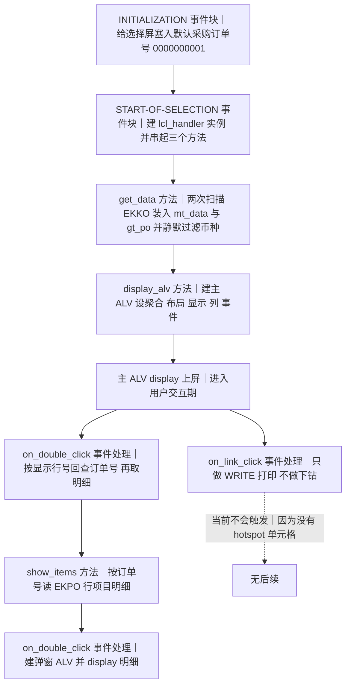
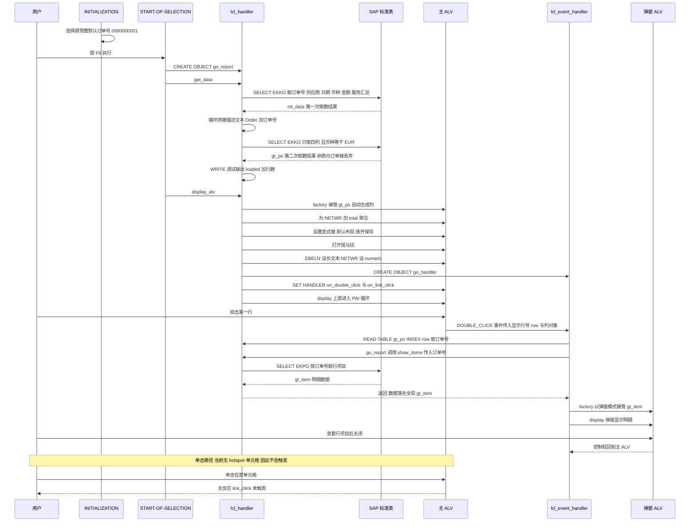

# ZSALV_PO_LIST 源码分析报告（OO ALV / CL_SALV_TABLE 采购订单总览）

> 分析对象：`zsalv_po_list.abap`（REPORT `ZSLAV_PO_LIST`）
> 分析视角：业务价值 → 执行流程 → 逐子程序三层拆解（做什么 / 为什么 / 风险与改进）→ 全景数据流 → 问题清单 → 整体评价
> 阅读前提：具备 ABAP 基础语法与 SAP MM 模块基础认知

---

## 一、程序定位与业务背景

### 1.1 这段程序想解决什么问题

MM 模块的采购员每天要回答两类问题：

1. **"我手头这批采购订单现在什么体量？"** —— 需要一个采购订单头（EKKO）总览：订单号、供应商、下单日期、币种、净金额，并且要一个能直接看的合计。
2. **"这笔订单到底买了什么？"** —— 头信息只是一行汇总数字，采购员还得逐张打开 ME23N 才知道明细长什么样。效率极低，尤其当一个订单有几十上百行时。

标准做法有两条路：一是 `REUSE_ALV_GRID_LIST` 老式 FM ALV，控制力最强但代码量大、事件要手写 FCODE 与 user-command 分发；二是 `CL_SALV_TABLE` OO ALV，用工厂方法 `cl_salv_table=>factory` 接管一张内表，自动生成列、工具栏、F4 帮助、排序、合计行。**本程序选的是第二条路**，并且明确写下了第二个目标：**双击一行就弹出该订单的行项目明细**（注释里写的 "double-click drill-down into order items"）。

所以这是一段**报表程序 + 交互式下钻的最小可行实现**，不是工具程序、不是批处理、也不是服务接口。

### 1.2 现有方案为什么不够

- 手工 `ME23N` 逐单打开：订单一多就不可行。
- `ME5A / ME5B` 之类的清单报表：字段固定、格式不可控、不能按用户习惯保存布局、也不能在报表里直接下钻到明细。
- 自己写 Dynpro + 屏幕流：为了一个列表付出成吨的 FlowLogic 成本。

`CL_SALV_TABLE` 恰好把这三件事都免掉了：列自动生成、布局可保存成变式、事件用 `SET HANDLER` 声明式绑定。作者的选型是对的。

### 1.3 整体设计范式（一句话定性）

> **一个"薄壳 + 全局状态 + 事件回调"式的 OO ALV 报表：驱动逻辑放在一个 handler 类里，交互逻辑放在另一个事件 handler 类里，两者通过全局变量互相调用。** 骨架合理，但取数层出现了两套并行且互相矛盾的数据准备，全局耦合与异常处理留下了多处会在真实环境炸掉的缺口。

### 1.4 关于本程序"能不能跑"的预判（先说结论）

在进入细节前必须给出定性判断，否则后面的三层分析会失去靶子：

| 用户关心的四块 | 结论 | 一句话理由 |
|---|---|---|
| **取数** | ❌ 有硬伤 | 同一张 EKKO 扫了两遍，两个内表字段不一致，真正上屏的 `gt_po` 把供应商和描述字段全丢了；还被静默加了一个"只看欧元"的过滤 |
| **聚合** | ⚠️ 半对 | API 用法正确（`if_salv_c_aggregation=>total` 配 CURR 字段），但三个 `CATCH` 全是空处理，合计行消失了也没人知道；而且合计只在"单一币种"前提下才成立，这个前提被实现成了静默过滤 |
| **事件绑定** | ❌ 半死 | `SET HANDLER` 写法没问题，但 `on_link_click` 因为没有 hotspot/button 单元格类型而**永远不会触发**；`mv_show` 私有属性被外部类赋值，编译期就过不去 |
| **下钻弹窗** | ❌ 有致命洞 | `CATCH cx_salv_msg` 之后不 `RETURN`，解引用的未绑定引用；用 `INDEX row` 回读全局内表，用户一点表头排序就可能串单 |

**综合判断：这是一段"教学草稿 / 半成品骨架"，不是可上生产的状态。** 但它的意图、分解方式和对 CL_SALV_TABLE API 的理解都是对的，修起来是收敛工作而不是重写。

---

## 二、程序执行流程总览

### 2.1 执行流程图



### 2.2 责任链表

| 子程序 | 调用者 | 职责 |
|---|---|---|
| `（全局声明区）` | 编译器 | 定义 `ty_po` / `ty_item` 两个输出结构、两个 local class 的签名、全局内表与对象引用、选择屏字段 |
| `（事件块 INITIALIZATION）` | SAP 隐式触发（屏幕 PBO 前） | 把选择屏的订单号区间预置成一个硬编码值 |
| `（事件块 START-OF-SELECTION）` | 用户按 F8 | 创建 `lcl_handler` 实例并按 `get_data` → `display_alv` 顺序驱动整个报表 |
| `（方法 get_data）` | `START-OF-SELECTION` 事件块 | 从 EKKO 取订单头数据、做描述字段拼接、再取一份过滤过币种的精简数据到 `gt_po` |
| `（方法 display_alv）` | `START-OF-SELECTION` 事件块 | 接管 `gt_po` 建主 ALV，配置合计行、布局、条纹、列样式，创建事件 handler 并绑定双击与单击事件，最后上屏 |
| `（方法 on_double_click）` | `lcl_events_table` 的 `DOUBLE_CLICK` 事件（用户双击主 ALV 某行） | 按事件传入的显示行号回查订单号、触发明细取数、建弹窗 ALV 并上屏 |
| `（方法 show_items）` | `on_double_click` | 按订单号从 EKPO 读行项目，装入 `gt_item` |
| `（方法 on_link_click）` | `lcl_events_table` 的 `LINK_CLICK` 事件（当前无触发路径） | 同样按行号回查订单号，然后把订单号和列对象直接 `WRITE` 到列表 |

### 2.3 走读顺序说明

主链路是 `START-OF-SELECTION → get_data → display_alv`，这是一次性直线；`on_double_click → show_items` 是用户交互后的分支，发生在 `display_alv` 返回**之后**（ALV 上屏后程序进入 PAI 循环）。下面按这条流程逐个展开。

---

## 三、分组分析

### 3.1 全局声明区

声明区分四块：两个输出结构、两个 local class 的定义、全局数据/对象引用、选择屏。

#### ① 输出结构定义

```abap
TYPES: BEGIN OF ty_po,
         ebeln   TYPE ekko-ebeln,
         lifnr   TYPE ekko-lifnr,
         bedat   TYPE ekko-bedat,
         waers   TYPE ekko-waers,
         netwr   TYPE ekko-netwr,
         menge   TYPE ekko-kumqw,
         ebeln_t TYPE ekko-ebeln_txt,
       END OF ty_po.

TYPES: BEGIN OF ty_item,
         ebeln TYPE ekpo-ebeln,
         posnr TYPE ekpo-posnr,
         matnr TYPE ekpo-matnr,
         menge TYPE ekpo-menge,
         netwr TYPE ekpo-netwr,
       END OF ty_item.
```

**做什么** — 用 `TYPES` 定义两个扁平的输出结构：`ty_po` 是采购订单头（订单号、供应商、日期、币种、净金额、一个叫 `menge` 的数量列、一段描述文本），`ty_item` 是订单行项目（订单号、行号、物料号、数量、净金额）。两者都是列清单式结构，不含表键。

**为什么** — `CL_SALV_TABLE` 靠"结构字段名 = ALV 列名"自动生成列，所以结构定义就是报表的列定义。直接用 DDIC 类型（`ekko-ebeln`）而不是裸 `char10`，可以让格式（尤其 `netwr` 的 `CURR(15,2)`）和输出内建值自动带上，省掉手工设置 cell type 的部分工作——这个起点是对的。`ty_po` 里特意留了 `ebeln_t` 描述列，说明作者打算在 ALV 上做"订单号 + 文本"的展示。

**风险与改进** — 这里埋了本程序最隐蔽的一个语义错误，需要做数据元素级校核，不能只看"类型长度能不能对上"：

- `menge TYPE ekko-kumqw` 配 `get_data` 里的 `kumvw AS menge`：**EKKO 上并不存在 `KUMQW` 这个字段**。EKKO 的服务汇总字段是 `KUMNT`（服务笔数）、`KUMQV`（服务数量）、`KUMKW` / `KUMVW`（服务金额）。字段名是 `kumvw`、类型却写 `kumqw`，说明作者是在凭记忆敲字段名而没有查 DDIC。结果是编译期直接失败（字段不存在），或在不同系统上被隐式转换悄悄放过。无论哪种都必须改成 `TYPE ekko-kumvw`。
- **更要命的是语义错配**：`KUMVW` 是**金额**，不是数量。把它别名为 `MENGE`（数量）之后，父表 ALV 的 `MENGE` 列实际显示的是钱。而下钻弹窗里 `ty_item-menge TYPE ekpo-menge` 才是真正的订单数量。**同一个列名 `MENGE` 在父子两层代表两种完全不同的单位**——用户在弹窗里看到 `MENGE = 100`，回到列表里看到 `MENGE = 5.000,00`，会怎么理解？这是必须记录的 P0 风险，不是"类型一致所以没问题"。
- `ebeln_t TYPE ekko-ebeln_txt` 是一个 40 字符的自由文本字段（不是语言相关的描述字段）。用它当"描述"只能靠程序自己拼字面量，拿不到 EKKO 里真正的订单描述（`BASTX` / `EKNAM`）。要么改取真实描述字段，要么把这一列去掉。
- 缺失字段：`ty_po` 里没有币种以外能定位订单的键；`ty_item` 里没有 `posnr` 之外的排序保证，而 `posnr` 是 `NUMC(3)`，明细列表必须按它升序才对得上 ME23N 的行号显示。

建议的修正方向：

```abap
TYPES: BEGIN OF ty_po,
         ebeln   TYPE ekko-ebeln,
         lifnr   TYPE ekko-lifnr,
         bedat   TYPE ekko-bedat,
         waers   TYPE ekko-waers,
         netwr   TYPE ekko-netwr,
         kumvw   TYPE ekko-kumvw,   " 金额：服务总值，独立成列，不要叫 MENGE
         bedat_t TYPE ekko-eknam,   " 订单描述，真实 DDIC 描述字段
       END OF ty_po.
```

#### ② 两个 local class 的定义

```abap
CLASS lcl_event_handler DEFINITION FINAL.
  PUBLIC SECTION.
    METHODS on_double_click
      FOR EVENT double_click OF cl_salv_events_table
      IMPORTING row column.
    METHODS on_link_click
      FOR EVENT link_click OF cl_salv_events_table
      IMPORTING row column.
  PRIVATE SECTION.
    DATA mv_show TYPE REF TO cl_salv_table.
ENDCLASS.


CLASS lcl_handler DEFINITION.
  PUBLIC SECTION.
    METHODS get_data.
    METHODS display_alv.
    METHODS show_items
      IMPORTING iv_ebeln TYPE ekko-ebeln.

  PRIVATE SECTION.
    DATA mt_data TYPE ty_po.
ENDCLASS.
```

**做什么** — 声明两个互相协作的 local class：`lcl_event_handler` 用 `FOR EVENT ... OF` 语法声明为 `cl_salv_events_table` 的事件处理器（导入 `row` / `column`），并持有一个 `TYPE REF TO cl_salv_table` 的私有属性 `mv_show`；`lcl_handler` 是报表主体，暴露 `get_data` / `display_alv` / `show_items` 三个公开方法，私有成员 `mt_data` 用于缓存取数结果。

**为什么** — 事件处理方法用 `FOR EVENT` 声明是 CL_SALV_TABLE 的标准写法，签名必须与事件一致（`row` 是 `salv_row`，`column` 是 `REF TO cl_salv_column`），否则 `SET HANDLER` 编译不过。**把交互逻辑从主类里拆出去单独成类**，本身是 ALV 编程的正确演进方向：主类管数据、事件类管交互，理论上以后想换成别的展现层（`CL_SALV_GRID`、FPM）也不影响取数。`show_items` 用 `IMPORTING iv_ebeln TYPE ekko-ebeln` 显式传参而不是读全局，也是同一份清醒——作者在方法签名上是讲究的，问题出在实现和可见性上。

**风险与改进** — 三处问题：

- **`mv_show` 声明在 `PRIVATE SECTION`，却在 `display_alv` 里被 `go_handler->mv_show = lo_alv` 赋值**。ABAP 私有属性外部类不可访问，这行是**编译期错误**。要么挪到 `PUBLIC SECTION`，要么在 `lcl_event_handler` 里提供一个 setter/构造方法。
- **命名与类型不匹配**：`mv_show` 按 ABAP 命名规范 `mv_` 前缀指 `TYPE`，但它装的是整张 ALV（应该是 `mr_alv` / `ms_`）。更关键的是：**这个属性在两个事件处理方法里一次都没被读过**。它既不是为了延长生命周期（`go_handler` 本身是全局变量，本来就不会被回收），也不是为了给 handler 提供能力（handler 需要的订单号通过 `row` 参数和 `go_report` 拿）。典型的"重构做了一半"的残留字段——建议直接删除，或改成真正有用途的东西（比如导航对象引用、是否已打开弹窗的状态位）。
- **`mt_data TYPE ty_po` 把内表声明成了结构**。`get_data` 里却对它做 `INTO TABLE mt_data` 和 `LOOP AT mt_data`，`INTO TABLE` 的目标与 `LOOP` 的对象都必须是内表类型。应改为 `DATA mt_data TYPE STANDARD TABLE OF ty_po WITH EMPTY KEY.`（键 `WITH EMPTY KEY` 是对的：ALV 接管的表不需要标准键，还能避免行移动时的键维护开销，这部分保留）。
- 顺带一个规范点：`lcl_event_handler` 标了 `FINAL`，`lcl_handler` 没标。local class 若无继承需求，建议两个都 `FINAL`，避免后来者误以为可以继承。

#### ③ 全局数据、对象引用与选择屏

```abap
DATA gt_po   TYPE STANDARD TABLE OF ty_po WITH EMPTY KEY.
DATA gt_item TYPE STANDARD TABLE OF ty_item WITH EMPTY KEY.
DATA go_handler  TYPE REF TO lcl_event_handler.
DATA go_report   TYPE REF TO lcl_handler.

SELECT-OPTIONS s_ebeln FOR gs_key-ebeln.
DATA gs_key TYPE ty_po.
```

**做什么** — 声明两个全局内表（`gt_po` 供主 ALV、`gt_item` 供弹窗 ALV）、两个全局对象引用（`go_report` 指向报表主体，`go_handler` 指向事件处理器），以及用 `SELECT-OPTIONS` 声明订单号区间选择屏 `s_ebeln`，其参照结构为 `gs_key` 的 `ebeln` 分量。

**为什么** — OO ALV 报表里，"一个方法创建的对象要跨事件方法使用"就必须有全局引用来持有，这是 `CL_SALV_TABLE` 报表的常见形态；比老式 FM ALV 把句柄塞进全局变量已经前进了一大步。`SELECT-OPTIONS ... FOR gs_key-ebeln` 用结构分量作参照对象也是合法技巧，作用是把选择屏字段和某个结构字段绑定起来（方便做带上下文的默认值）。

**风险与改进** — 这里有一处**编译期阻断**和两处设计问题：

- **声明顺序错误（编译期阻断）**：`SELECT-OPTIONS s_ebeln FOR gs_key-ebeln.` 出现在 `DATA gs_key TYPE ty_po.` **之前**。ABAP 的声明部分是顺序处理的，前面引用尚未声明的对象会直接报语法错误。必须把 `DATA gs_key` 上移。
- `go_handler` 与 `go_report` 两个全局对象引用在同一语义层（"报表运行期上下文"）却分散在两处初始化：`go_report` 在 `START-OF-SELECTION` 里创建，`go_handler` 在 `display_alv` 内部创建。

---

### 3.2 事件块 `INITIALIZATION`

**做什么** — 在 `INITIALIZATION` 里把选择屏的 `s_ebeln` 的单个值分量预置为字面量 `'0000000001'`，即用户不输入任何条件直接 F8 时，报表会按这一个采购订单号去查。

**为什么** — 这个事件块在屏幕 PBO 之前执行，是设置选择屏初始值的标准位置。作者的意图可以理解：给一个"能立刻跑出点东西"的默认场景，避免用户面对空白选择屏。但报表要长期服务，**默认值策略**是一个必须明确表态的业务决定，不能靠一个字面量带过。

**风险与改进** — 问题相当实际：

- **硬编码 `'0000000001'` 是开发系统里手工造的订单号**。在生产系统的 QAS/PRD 上，这张单很可能不存在，或者属于别的公司代码/采购组织——结果是用户每次运行都看到空报表，误以为程序坏了。
- **空结果无提示**：`get_data` 与 `display_alv` 都没有 `lines( ) = 0` 的判断和 message，所以"没数据"和"程序错了"在用户眼里是同一件事。
- 更合理的默认：**不要预置具体单号**。要么留空并在 `START-OF-SELECTION` 里检查必填（`MESSAGE '请输入采购订单号' TYPE 'S'`），要么预置一个业务上合理的区间（例如当前月），要么干脆做成"按供应商 / 按期间"的选择屏——从业务价值看，采购员更常见的入口是供应商或时间段，而不是记住一个订单号。

---

### 3.3 事件块 `START-OF-SELECTION`

**做什么** — 用户按 F8 触发该事件块：先 `CREATE OBJECT go_report` 实例化 `lcl_handler`，再依次调用 `go_report->get_data( )` 和 `go_report->display_alv( )`，把"取数 → 上屏"串成一条直线。

**为什么** — 报表的事件块保持极薄、只做编排，把真正的工作放进方法——这是 OO 报表的标准骨架，也是让方法可单测、可复用的前提。这个结构本身是本程序最健康的部分。

**风险与改进** — 三点：

- **空结果没有任何处理**。`get_data` 之后应该先判断 `lines( gt_po )`，为 0 就 `MESSAGE ... TYPE 'S'` 并 `LEAVE LIST-PROCESSING`（带 message 时不需要），否则用户会盯着一张空 ALV 以为是加载卡死。
- **缺少权限校验**。EKKO 属于财务/敏感对象，应该在取数前做 `AUTHORITY-CHECK OBJECT 'EKKO'`（或用 `CL_SALV_...` 配套的 SU53 方案），否则无 S_EKKO 权限的用户照样能看到采购金额。这是 P1 的合规缺口。
- `create_object` 只针对 `go_report`；事件对象 `go_handler` 在 `display_alv` 内部创建（见 3.5）。如上节所述，两个全局对象的生命周期管理应集中。

---

### 3.4 方法 `get_data`（取数核心）

这一步是本程序最需要分细的：它其实做了**四件互不相关的事**，而这四件事的落点（`mt_data` 还是 `gt_po`）互相矛盾。拆成四步看。

#### ① 第一次读 EKKO：取完整订单头到 `mt_data`

```abap
SELECT ebeln lifnr bedat waers netwr kumvw AS menge
  FROM ekko
  INTO TABLE mt_data
  WHERE ebeln IN s_ebeln.
```

**做什么** — 按选择屏区间 `s_ebeln` 扫描 EKKO，取订单号、供应商、凭证日期、订单币种、订单净金额，并把服务汇总字段 `kumvw` 取别名为 `menge`，结果整表装入成员内表 `mt_data`。

**为什么** — 投影取列而不是 `SELECT *`：EKKO 有 300+ 字段，全取会把内表撑到几十 MB，ALV 只用 6 列毫无意义。`ebelnn IN s_ebeln` 命中 EKKO 的主索引前缀，区间扫描代价可控。这一句的写法本身是教科书级的。

**风险与改进** — 三个问题叠加：

- `INTO TABLE mt_data` 的目标 `mt_data` 在 `lcl_handler` 的定义段被声明成了**结构**（见 3.1 ②），这里是类型/语法错误。
- `kumvw AS menge` 与结构里的 `menge TYPE ekko-kumqw` 不匹配（字段名与类型名不一致），且语义是"金额被当成数量"（见 3.1 ①）。金额别名成 `MENGE` 后，主 ALV 会出现一个名为 `MENGE` 的金额列，用户极易误读为订单数量。
- 没有 `bedat` 区间之类的第二维过滤，索引前缀扫描是"范围扫描"，订单号跨度大时会退化成较宽的索引区间扫描。若选择屏经常留空，建议改成两段式：先按日期/供应商从 EKKO 取 EBELN 集合，再用 `IN` 精确取列。

#### ② 循环拼接"描述"字段

```abap
LOOP AT mt_data INTO DATA(ls_row).
  ls_row-ebeln_t = |Order { ls_row-ebeln }|.
  MODIFY mt_data FROM ls_row.
ENDLOOP.
```

**做什么** — 遍历 `mt_data` 的每一行，把 `ebeln_t` 拼成字符串 `'Order ' + 订单号`，然后把整行结构 `MODIFY` 回内表。

**为什么** — 意图是给 ALV 加一列可读文本，避免用户只看裸订单号。但**做法本身是错的**：ALV 的 `get_data` 已经有了行数据，派生字段应该用**字段符号**在需要时算，而不是在内存里做一次全量读—改—写回。

**风险与改进** — 三层问题：

- **在 `LOOP AT ... INTO` 里 `MODIFY ... FROM` 全行结构**，标准表的写入语义是"按主键定位并整体覆盖"。这里结构声明的键被改成了 `WITH EMPTY KEY`（全字段键），`MODIFY FROM ls_row` 的行为依赖具体内表类型与键设置，非常容易出现"写了但没生效"或"全表扫描式定位"。正确写法是字段符号：

```abap
LOOP AT mt_data ASSIGNING FIELD-SYMBOL(<row>).
  <row>-ebeln_t = |Order { <row>-ebeln }|.
ENDLOOP.
```

- **这个字段最终根本不上屏**。ALV 是用 `gt_po` 建的（见 ① 之后的第 ③ 步），而 `gt_po` 里没有 `ebeln_t` 这一列。所以这三行是**纯无效计算**——所有循环 + 写回都白做。
- **拼接内容本身没价值**：`|Order { 订单号 }|` 是把订单号用英文单词包一层，不是 EKKO 里的订单描述。而且 `Order` 硬编码英文，中文用户看到的是英文；正确做法是取 EKKO 的真实描述字段（订单名称/描述），或用 ABAP 文本元素（`TEXT-001`）/文本池做多语言，报表程序里出现裸英文字面量是需要 review 的味道。

#### ③ 第二次读 EKKO：取精简数据到 `gt_po` 并静默过滤币种

```abap
SELECT ebeln bedat waers netwr
  INTO TABLE @gt_po
  FROM ekko
  WHERE ebeln IN s_ebeln
    AND waers = 'EUR'.
```

**做什么** — 又一次扫描 EKKO，这次只取 4 个字段装入全局内表 `gt_po`，并在 `WHERE` 里额外加了 `waers = 'EUR'`。

**为什么** — `gt_po` 才是喂给 ALV 的那张表，作者显然在这里做了"我要展示的列"的收口。写法本身（`INTO TABLE @gt_po` 的 host variable 语法、字段投影）是正确的现代 ABAP 7.40 风格。

**风险与改进** — 这是本程序**业务正确性层面最需要警惕的一处**：

- **静默的硬过滤 + 重复扫描**。用户输入的订单区间里，所有非欧元订单被无声丢弃。没有 `MESSAGE`、没有 infomessage、没有任何提示。用户会看到"我输了 20 张单，屏幕上只有 3 张"，只能靠猜。更糟的是这个 `gt_po` 是**全程序唯一被 ALV 消费的数据源**，所以前面那次带 `lifnr` 的完整取数完全作废——**供应商这个采购员最需要的维度，最终不显示**。
- **从"聚合正确性"角度看，这个过滤是有道理的、但实现方式错了**：金额列跨币种直接 `total` 是没有意义的（欧元和美元相加是错数）。所以作者限定单一币种在**结果上是正确的**。但正确做法不是"偷偷过滤 + 不吭声"，而是：把币种做成选择屏字段让用户选；或取全部数据后按币种分组显示（`CL_SALV_TABLE` 的 aggregation 是整表级的、**没有按币种分组合计的能力**，所以设计上必须强制单币种，并在取数时用 message 明确告知"已过滤为 EUR，共 N 张单"）。这个认知差异很关键：不是过滤错了，是**没有把约束告诉用户**。
- **两次扫同一张表**。同一个 `WHERE` 条件命中同一索引，第二次扫描纯属重复 IO（虽然 EKKO 有缓冲，代价不算致命，但仍是明确的浪费）。正确做法：只查一次到 `mt_data`（带 `lifnr`），然后按币种过滤/复制出 `gt_po`，或者在 DB 层一次性用 `WHERE ... AND waers = s_waers`（参数化）。

#### ④ 调试输出

```abap
WRITE: / 'loaded', lines( gt_po ).
```

**做什么** — 往基础列表输出一行 `'loaded'` 加 `gt_po` 的行数。

**为什么** — 典型的调试残留，写的时候大概是为了确认"到底取了几行"。

**风险与改进** — 正式程序里**不该出现裸 `WRITE`**：

- 它输出到基础列表，而 ALV 是全屏显示的，用户看到的顺序是"先看 ALV → 退回列表 → 看到一行英文 'loaded 3'"，观感很差；`/ ` 还会让 ALV 之后的基础列表变成一个只有一行的空报表。
- 需要提示行数，正确做法是 `lo_disp->set_header_text( )` / `set_footer_text( )` 把标题和汇总行挂到 ALV 上（见 3.5 ③），或 `MESSAGE ... TYPE 'S'`。
- 顺带：`lines( )` 是合法写法（比 `DESCRIBE TABLE ... N` 现代），这一处没问题。问题只在 `WRITE`。

**小结** — `get_data` 的正确形态应该是：**一次查询** → 得到带 `lifnr`/描述/净金额的完整 `gt_po` → 币种在 DB 条件里参数化 → 空结果给 message → 描述字段用字段符号派生或直接取真实描述。本程序在这四点上都走了弯路。

---

### 3.5 方法 `display_alv`（ALV 构建与事件绑定）

这是最长的方法，按七步拆：建表 → 聚合 → 布局 → 显示 → 列 → 事件绑定 → 上屏。

#### ① 接管数据建主 ALV

```abap
TRY.
    cl_salv_table=>factory(
      IMPORTING r_salv_table = lo_alv
      CHANGING  t_table      = gt_po ).
  CATCH cx_salv_msg.
    RETURN.
ENDTRY.
```

**做什么** — 调用工厂方法 `cl_salv_table=>factory`，把全局内表 `gt_po` 以 `CHANGING t_table` 交给 SALV 接管（SALV 取得该表的引用，列按结构字段自动生成），返回 `lo_alv` 作为后续所有配置方法的入口。

**为什么** — 这是 `CL_SALV_TABLE` 的**正确起点**。`t_table` 用 `CHANGING` 而不是 `IMPORTING` 是必须的：SALV 会把表交给它自己的数据后端，之后这张表就归 ALV 管了。这句也体现了 OO ALV 相对老 FM ALV 的最大优势——列、工具栏、导出 Excel、页面布局全部自动，不需要一行手工定义字段目录。

**风险与改进** — 异常处理**技术方向对、经营策略错**：

- 捕获 `cx_salv_msg` 后 `RETURN` 是对的（不能在未绑定引用上继续操作），但**静默返回等于什么都不做**。用户在屏幕上得不到任何反馈，只会觉得"报表没反应"。应该至少 `MESSAGE '数据无法显示，请联系管理员' TYPE 'E'`。
- 更根本的问题：`gt_po` 是全局的、且在 `get_data` 里是 `WITH EMPTY KEY`。空表 + 某些配置（本程序要加 `total` 聚合）在旧版本上会抛 `cx_salv_data_error`。**上屏前先判 `lines( ) = 0`**，比事后捕异常更干净。
- `display_alv` 方法返回后，`lo_alv` 这个局部引用消失，ALV 靠 SALV 内部 flow logic 维持存活——这是 SALV 的标准行为，不需要额外保活。**这一点很关键，它说明 `mv_show` 那个属性不是"为了保活"而存在的（见 3.1 ②）。**

#### ② 配置合计行（聚合）

```abap
lo_aggr = lo_alv->get_aggregations( ).
TRY.
    lo_aggr->add_aggregation(
      EXPORTING  columnname  = 'NETWR'
                 aggregation = if_salv_c_aggregation=>total ).
  CATCH cx_salv_data_error.
  CATCH cx_salv_not_found.
ENDTRY.
```

**做什么** — 取聚合服务，为列 `'NETWR'` 添加 `total`（求和）聚合，ALV 底部会显示合计行。

**为什么** — **API 用法是全篇最正确的一处**。`get_aggregations( )` 返回 `cl_salv_aggregations`，`add_aggregation( )` 的 `columnname` 必须是 ALV 的列名（结构字段名的**大写形式**，这里是 `NETWR` 本来就是大写，所以能匹配上），`aggregation` 用 `if_salv_c_aggregation=>total`。选 `total` 而不是 `average` 也对——`EKKO-NETWR` 是 `CURR(15,2)` 金额字段，货币字段允许 `total` 但不允许 `average`/`standard_deviation`，这处作者显然踩过坑。

**风险与改进** — 两个问题，一个是设计、一个是掩盖问题：

- **单币种前提被隐式依赖**。`NETWR` 求和只有在全表同币种时才有意义。程序里恰好有 `waers = 'EUR'` 的硬过滤，所以"结果碰巧正确"——但这是**巧合式正确**，不是设计正确。任何人后来把第 ③ 步的币种过滤删掉，合计行立刻变成错数，而程序不会报任何错。正确做法是把币种约束变成显式契约（选择屏字段 + message），并在这一层加注释说明"合计仅对单一币种有效"。
- **两个 `CATCH` 全是空处理**。`cx_salv_not_found` 通常意味着列名拼错或该列不存在，`cx_salv_data_error` 意味着该列类型不支持这种聚合。**吞掉异常 = 合计行悄悄消失，而用户只会以为是显示问题。** 至少要 `MESSAGE` 出来，或退一步：合计行失败时改在 footer 文本里手工算好金额。
- 顺带：也可以给 `MENGE`（也就是那个金额语义的 `KUMVW`）加合计，但那要先解决命名与语义问题（见 3.1 ①），否则用户会看到两个含义不清的合计。

#### ③ 布局设置

```abap
lo_layout = lo_alv->get_layout( ).
lo_layout->set_key( VALUE #( report = sy-repid ) ).
lo_layout->set_default( abap_true ).
lo_layout->set_save_restriction( if_salv_c_layout=>restrict_none ).
```

**做什么** — 取布局服务，用 `sy-repid` 作为变式键的前缀、设为默认布局、并放开所有保存限制。

**为什么** — **`set_key( VALUE #( report = sy-repid ) )` 是官方示例的写法，用得完全正确**：它把变式的作用域限定在当前报表，让不同报表互不干扰。`set_default( abap_true )` 表示默认变式生效；`restrict_none` 让用户可以自由拖列、隐藏列、调宽度并保存成个人变式——这是"报表可用性"最实用的一项能力，也是 OO ALV 相对老 FM ALV 的红利。

**风险与改进** — 两点：

- **只"存"不"选"**。程序允许保存变式，却没有任何变式选择入口（标准做法是用 `if_salv_g_layout_info` / `get_layout_info( )` 弹自定义 PAI 屏幕让用户勾选变式）。结果：用户能在 ALV 工具栏里存变式，但下次启动只能回到默认变式，想用自己那套布局还得重新调一遍。要么补变式选择屏，要么至少在文档里写清楚。
- `restrict_none` 意味着布局差异会写进 `TDIST`（客户端本地持久化表）。对报表类程序通常可接受，但**需要考虑清理策略**——长期无人清理的变式数据会缓慢膨胀。真要严格管控可以设成 `restrict_some_countries` 之类更细的粒度。属于需要和运维确认的事项，不是 bug。
- 补充：布局层没有 `set_sort( )`，也没有默认排序。这直接放大了下一节的下钻风险。

#### ④ 显示设置

```abap
lo_disp = lo_alv->get_display_settings( ).
lo_disp->set_striped_pattern( abap_true ).
```

**做什么** — 打开斑马纹（隔行底色），提升长列表的可读性。

**为什么** — 一行配置换来明显的可用性提升，采购员看几十行订单时，斑马纹能显著降低串行。这是"低成本高回报"的配置。

**风险与改进** — 无功能性风险，但配置明显偏少。标题、页脚、空值显示、紧凑模式都没设：

- 应使用 `lo_disp->set_header_text( ... )` 放标题、`set_footer_text( ... )` 放"共 N 张订单 / 合计 XXX"——这正是 3.4 ④ 里那个 `WRITE` 该去的地方。
- `set_compact( )`（紧凑模式）没有开，6 列的报表默认留白很多，可以开一下提高单屏信息量。
- 弹窗 ALV 完全没做显示设置（见 3.6 ③），父子两层观感不一致。

#### ⑤ 列设置

```abap
lo_cols = lo_alv->get_columns( ).
lo_col ?= lo_cols->get_column( 'EBELN' ).
lo_col->set_long_text( 'Purchase Order' ).
lo_col ?= lo_cols->get_column( 'NETWR' ).
lo_col->set_cell_type( if_salv_c_cell_type=>numeric ).
```

**做什么** — 取列集合，为 `EBELN` 设置长文本"Purchase Order"，为 `NETWR` 设置单元格类型为数值（保证右对齐千分位、并且该列具备可聚合能力）。

**为什么** — 给 `NETWR` 设 `numeric` 是**必要动作**（金额列不设 cell type 就无法正确格式化，也影响 ② 里的合计）。这个细节作者做对了。

**风险与改进** — 四个问题：

- **`?=` 在这里完全没用**。`get_column( )` 是**返回型方法且会抛 `cx_salv_not_found`**（列不存在时）。`?=` 只能处理"目标引用初始、源引用非初始"的情况，**完全无法拦截异常**。也就是说：列名拼错时，程序不是静默跳过，而是**以未捕获的 `cx_salv_not_found` 直接终止**。要么用 `TRY ... CATCH cx_salv_not_found.`，要么先 `get_columns( )->has_column( )`（若该方法存在）判断。`?=` 在这里纯粹是给人看的安慰剂。
- **`set_long_text( 'Purchase Order' )` 大概率达不到预期效果**。ALV 的**可见表头文本**默认取自字段的 DDIC 描述（`EBELN` 的短文本就是"Purchasing Document"），`set_long_text` 影响的是列的长文本/提示。想改可见表头应该用 `set_header_text( )`（`if_salv_c_column` 提供的接口）或者走 SAP 的文本元素机制。而且 `'Purchase Order'` 是硬编码英文，中文用户看到英文表头是体验问题。
- **金额列没有币种引用**。正确做法是让 `NETWR` 引用同表的 `WAERS` 列，这样 ALV 会在金额旁显示币种符号，而不需要用户横向对齐去读 `WAERS` 列：

```abap
DATA lv_col_waers TYPE REF TO cl_salv_column.
lv_col_waers ?= lo_cols->get_column( 'WAERS' ).
lo_col->set_cell_type( if_salv_c_cell_type=>currency, lv_col_waers ).
```

- **`MENGE` 列没有设 cell type**。而这一列（因为 3.1 ① 的错误）装的是金额 `KUMVW`——`numeric` 类型意味着它会以"数量"的姿态出现，但显示的是钱。这是语义事故的直接暴露点。

#### ⑥ 创建事件处理器并绑定事件

```abap
CREATE OBJECT go_handler.
go_handler->mv_show = lo_alv.
lo_events = lo_alv->get_event( ).
SET HANDLER go_handler->on_double_click FOR lo_events.
SET HANDLER go_handler->on_link_click   FOR lo_events.
```

**做什么** — 实例化全局事件对象 `go_handler`，把主 ALV 引用塞进它的 `mv_show` 属性，取出事件注册表，并把 `on_double_click` 与 `on_link_click` 两个处理器注册到该事件对象上。

**为什么** — **`SET HANDLER ... FOR lo_events` 本身写法正确**：`cl_salv_events_table` 是纯事件对象，用 `FOR <事件对象引用>` 绑定是标准形式（等价于 `FOR lo_events OF lo_alv`）。handler 必须是全局引用持有、且注册的是 public 方法（两个事件方法都在 `PUBLIC SECTION`，✅）。这条链路在 SALV 里之所以能工作，是因为 ALV 的数据后端在用户交互时会把行号与列对象作为事件参数回传——**事件处理方法必须是全局可见的处理器方法（非局部定义的）**，这个前提作者满足了，很好。

**风险与改进** — 三点，两个是硬伤：

- **`go_handler->mv_show = lo_alv` 是编译期错误**（`mv_show` 在 `PRIVATE SECTION`，见 3.1 ②）。这是必须立刻修的阻断项。
- **这个属性的赋值目的不明且毫无效果**。它既不影响事件触发，也不给 handler 带来新能力（`lo_alv` 在 `display_alv` 内部就已经能拿到）。请注意：即使删掉这行，事件依然正常工作，ALV 也不会被回收。**建议直接删除。**
- **绑定 `on_link_click` 是无效绑定**。`LINK_CLICK` 事件只在用户点击 **cell type 为 `hotspot` 或 `button`** 的单元格时触发，而 ⑤ 里只给 `EBELN` 设了长文本、给 `NETWR` 设了 `numeric`，**没有任何一列被设为 hotspot/button**。所以 `on_link_click` 在正常运行路径下**永远不会执行**——这是一个"看起来有、实际是死代码"的事件处理器。想让它生效，必须显式把某一列设成 `if_salv_c_cell_type=>hotspot`（这也是"点击订单号下钻"最自然的 UI 表达）。

#### ⑦ 上屏

```abap
lo_alv->display( ).
```

**做什么** — 把配置好的 ALV 全屏显示，进入 PAI 事件循环，等待用户交互。

**为什么** — `display( )` 是 SALV 生命周期的终点调用，一行搞定，内部负责生成 FlowLogic、创建 Dynpro、注册用户命令。**这是 OO ALV 最能体现收益的一行**——换成老式 FM ALV，这里要 `REUSE_ALV_GRID_LIST` + 一堆参数 + 自己处理 `user_command`/`double_click`。

**风险与改进** — 语义上没问题，但要注意它的**时序含义**：`display( )` 之后的代码要等用户离开 ALV 屏幕才执行，所以本方法里写在 `display( )` 之后的所有清理代码其实都是"退出时清理"。目前没有清理逻辑，等于 `gt_po` / `go_handler` 会一直存活到程序结束（对列表报表而言无所谓）。若将来要加"退出时释放资源"或"记录用户操作日志"，应放在 `display( )` 之后。

---

### 3.6 方法 `on_double_click`（下钻弹窗主路径）

`display( )` 上屏后，用户的第一次交互就走这里。分四步。

#### ① 用显示行号回查订单号

```abap
READ TABLE gt_po INTO DATA(ls_po) INDEX row.
IF sy-subrc <> 0.
  RETURN.
ENDIF.
```

**做什么** — 事件参数 `row` 是 SALV 报告的**显示行号**（整数），这里直接把它当 `READ TABLE ... INDEX` 去回读全局内表 `gt_po`，取出该行的订单号；读不到就静默返回。

**为什么** — 意图是"用事件告诉我的行号，定位到业务数据"。`CL_SALV_TABLE` 没有提供"根据显示行号取行内容"的官方 API（这也是 OO ALV 相比可继承的 `CL_ALV_TABLE` 的一个短板），所以很多人就写 `READ TABLE ... INDEX row`。**这是 ALV 编程里最经典的一个坑**，本程序正好踩上了。

**风险与改进** — 三个问题：

- **`row` 是"显示行号"，不是"物理行号"**。用户点一下列头排序，ALV 就把数据显示顺序换掉了，此时 `row` 与 `gt_po` 的物理行序**不再对应**。而 3.5 ③ 里恰恰**没有设置默认排序**、④ 也**没有锁定排序**——一旦用户排序，双击任意一行都可能下钻到**错误的订单**。而且 `show_items` 之后弹窗里显示的是完全无关的另一个订单的行项目，用户**完全察觉不到**（界面不会报错，因为"查得到数据"）。这是本程序**风险最高的一类缺陷：静默的、指向错误业务对象的错误**。
  正确做法有三选一：① 让 `get_data` 先 `SORT mt_data BY ebeln`，并把 `EBELN` 列设为 `hotspot`，事件里用 `column->get_column_name( )` 区分点击列，同时以**列值**而不是行号作为下钻依据（最稳）；② 维护一个"显示行号 → 订单号"的映射表；③ 若要支持排序，就换用可继承的 `CL_SALV_TABLE` 子类 + `CL_ALV_FIELDS_TABLE` 体系，直接拿行对象。
- `IF sy-subrc <> 0. RETURN.` 这个判断本身是对的（防止拿到初始结构），但**"读不到就什么都不做"**是又一次静默失败。应该给一个 infomessage。
- 同一段 `READ TABLE ... INDEX row` 逻辑在 `on_link_click` 里**原样重复了一遍**（见 3.8），说明缺少提取。至少应抽成本类的一个私有方法 `get_row_data( iv_row )`，保证行号解析与异常处理只有一份。

#### ② 调用 `show_items` 取明细

```abap
go_report->show_items( iv_ebeln = ls_po-ebeln ).
```

**做什么** — 通过全局引用 `go_report` 回调报表主体，用取到的订单号调用 `show_items` 取行项目明细（结果落在全局 `gt_item`）。

**为什么** — 复用了已有的取数方法，避免在事件里重复写 `SELECT`，也让"取数"和"呈现"有明确分工。方法签名 `show_items( IMPORTING iv_ebeln TYPE ekko-ebeln )` 是显式传参而非读全局，这是本程序里最值得表扬的设计点之一。

**风险与改进** — 耦合方向反了：

- **形成环形依赖**：`lcl_handler` 在 `display_alv` 里 `CREATE OBJECT go_handler`（持有事件类），事件类又通过全局 `go_report` 回调 `lcl_handler`。两个互为对方依赖的类，改任何一个都容易牵动另一个。
  更好的做法：① 在 `lcl_handler` 的构造里把 `THIS` 以接口形式注入事件类（`CREATE OBJECT go_handler( io_owner = me )`）；② 或者让事件类自己负责取明细（把 `SELECT` 移进事件类，事件类只管交互）；③ 或者干脆一个类——`CL_SALV_TABLE` 的事件处理方法本来就可以定义在同一个类里，不必强行拆。
- `show_items` 无返回值、不做任何错误处理。若该订单查不到明细（数据被删、代理订单无 EKPO），`gt_item` 会是空表，弹窗就是一张空 ALV，没有提示。
- 弹窗数据源是全局 `gt_item`：当前"一次只开一个弹窗"所以不会串数据，但这是**隐式约束**。一旦以后要做"并排两个订单对比"或"弹窗里继续下钻到交货单"，这张全局表立刻变成定时炸弹。改成把 `gt_item` 作为 `show_items` 的 `EXPORTING` 参数返回，事件方法用局部变量持有，能把这类问题彻底消灭。

#### ③ 创建弹窗 ALV

```abap
TRY.
    cl_salv_table=>factory(
      EXPORTING list_display = if_salv_c_bool_sap=>false
      IMPORTING r_salv_table  = lo_popup
      CHANGING  t_table       = gt_item ).
  CATCH cx_salv_msg.
ENDTRY.
```

**做什么** — 第二次调用工厂方法，这次用 `list_display = if_salv_c_bool_sap=>false` 让结果以**弹窗（独立全屏窗口）**形式出现，数据源换成全局 `gt_item`（订单行项目）。

**为什么** — `list_display` 用的是**枚举常量** `if_salv_c_bool_sap=>false` 而不是 `abap_false`，这个类型选择很讲究：`list_display` 的类型是 `if_salv_c_bool_sap`，传 `abap_false` 属于跨类型传参（虽能编过但语义不规范）。**用类型专属常量是本程序里第二处很"老手"的写法。** 选择弹窗而非全屏列表也符合业务：明细是"看一眼就走"的辅助信息，弹窗天然传达了这种临时性。

**风险与改进** — 一个致命缺陷、一个设计短板：

- **致命：`CATCH cx_salv_msg.` 之后没有 `RETURN`，紧接着执行 `lo_popup->display( )`**。异常被捕获后 `lo_popup` 保持初始引用，第 ④ 步解引用会直接 **CX_SY_REF_IS_INITIAL 短转储**。这和 3.5 ① 里 `display_alv` 的处理形成了刺眼对比——那里是 `CATCH ... RETURN.`，这里漏了。**同一个程序里同一个模式，两处写法不一致，正好是"静默失败 → 崩溃"的典型教材。**
- 弹窗 ALV **完全没有配置**：没有列设置、没有聚合、没有布局、没设标题。更要命的是它继承了 `ty_item` 的列名——其中 `MENGE` 在这里是**数量**（`EKPO-MENGE`），在父列表里却是**金额**（`KUMVW`）。父子两层同名列语义相反，用户绝对会踩。
- 弹窗也没有排序保证：`show_items` 的 `SELECT` 没有 `ORDER BY posnr`，明细行顺序依赖 DB 返回顺序，在不同系统/不同数据量下可能与 ME23N 里看到的行号顺序不一致。加上 `POSNR` 才符合采购员的预期。

#### ④ 弹窗上屏

```abap
lo_popup->display( ).
```

**做什么** — 显示明细弹窗。

**为什么** — 与主 ALV 同样的标准生命周期终点。弹窗关闭后控制权回到主 ALV，用户可以继续双击下一行——这个交互循环设计得是对的，也是"报表 + 下钻"最常见的可用形态。

**风险与改进** — 交互链路**断在第二层**，业务价值没走完：

- 用户在明细里看到 `MATNR` / `MENGE`，最自然的下一步是**跳转到 ME23N 看完整单据**（甚至 ME23D 看交货计划）。本程序没有 `CALL TRANSACTION 'ME23N'` 或 `CALL FUNCTION 'F1' ... 'ME23N'`，下钻只到"只读清单"就结束了。以"帮助采购员快速判断是否需要干预"为目标的话，这一跳的价值比明细弹窗还大。
- 弹窗没有事件绑定，也不该有（`CL_SALV_TABLE` 的第二实例默认无事件）。但要注意：`gt_item` 被 SALV 接管后，理论上不应再被 `SELECT ... INTO TABLE` 修改直到弹窗关闭。当前"先关弹窗再双击下一行"的交互路径是安全的，但这是**依赖 UI 时序的脆弱假设**，最好在代码注释里写明。
- 弹窗与主 ALV 的生命周期都由全局引用隐式维系，任何一个先被 GC 都会导致 `CX_SY_REF_IS_INITIAL`。虽然当前流程不会发生，但注释与结构上的显式化会省掉未来的排查时间。

---

### 3.7 方法 `show_items`（取行项目明细）

**做什么** — 按传入的订单号从 EKPO 读 `ebeln`、`posnr`、`matnr`、`menge`、`netwr` 五个字段，整表装入全局 `gt_item`，方法结束，**不做任何呈现**。

**为什么** — 方法职责单一（只取数、只管 `gt_item`），命名 `show_items` 名不副实（它不 show 任何东西）但结构上是"取数 / 呈现"分离的正确雏形。投影取列 + `WHERE ebeln = iv_ebeln` 命中 EKPO 主索引（`EBELN + POSNR`），性能没问题。

**风险与改进** — 三个问题：

- **命名与职责不符**：应该叫 `get_items` 或 `read_items`。`show_` 前缀会让人以为它负责弹窗显示，实际显示在调用方。这种误导在后续维护里会引发"到底谁负责 display"的困惑。
- **无过滤、无排序**。① 没有 `ORDER BY posnr`：明细顺序不可控。② 没有排除无效/已删除行项目——如果业务上存在行项目被删除或订单被部分退回的场景，明细清单里会出现用户认为"不该存在"的行。具体删除标识字段请以你们系统的 DDIC 为准核对，但**这是取数必备的过滤意识**。
- **空结果无反馈**。查不到明细时 `gt_item` 为空，事件方法照样建一个空弹窗。应该返回行数或让调用方判断：

```abap
METHOD show_items.
  SELECT ebeln posnr matnr menge netwr
    FROM ekpo
    INTO TABLE gt_item
    WHERE ebeln = iv_ebeln
    ORDER BY posnr.
  IF lines( gt_item ) = 0.
    MESSAGE '该采购订单没有行项目明细' TYPE 'S'.
  ENDIF.
ENDMETHOD.
```

---

### 3.8 方法 `on_link_click`（当前不可达的路径）

**做什么** — 同样按事件行号回读 `gt_po` 取出订单号，然后把订单号和 `column`（列对象引用）直接输出到基础列表。

**做什么（补充）** — 与 `on_double_click` 相比，它**没有 `sy-subrc` 判断**，也就是说 `READ TABLE` 失败时 `ls_po` 是上一次的残留值或初始值，后面照样 `WRITE` 出去。

**为什么** — 意图应该是一个"轻量交互"通道：单击热点单元格时给个提示，而不是每次都弹窗。这个设计本身不蠢——双击弹窗、单击提示，交互分级是合理的。**但它缺了实现这个意图的前提。**

**风险与改进** — 这个方法有三个层层递进的问题，是"半成品代码"的教科书样本：

- **① 事件永远不会触发（根因）**：`LINK_CLICK` 只在点击 **hotspot / button** 类型单元格时触发，而 3.5 ⑤ 里**没有任何一列设置过 hotspot**。所以这是**绑定正确但永远不会执行的死代码**。要让"点击订单号下钻"生效，必须配套地设置 cell type——而这恰恰是比双击更好的 UI（双击在 ALV 里容易和 F4、行选择冲突）。
- **② 缺 `sy-subrc` 判断**：一旦这个方法真的被触发（比如以后加了 hotspot），`READ TABLE` 失败时会拿残留数据去输出。`on_double_click` 里有判断、这里没有，**同一个模式两处不一致**——这比两处都写错更危险，因为它暗示作者并不真的理解这个 API 的失败语义。
- **③ 把对象引用直接放进 `WRITE` 列表**：`WRITE: / 'clicked', ls_po-ebeln, column.` 里 `column` 是 `REF TO cl_salv_column`，把对象引用当作输出对象既不合法也没有任何信息量。正确做法是取它的名字，例：`WRITE: / 'column:', column->get_column_name( ).`。**"列对象"能提供的唯一有用信息就是列名**，把对象本身打印出来是典型的"不知道 API 能拿到什么就干脆全打出来"的调试思维。
- 另外，`WRITE` 依然是调试残留。交互反馈应该用 `MESSAGE ... TYPE 'S'/'I'`（状态栏提示）而不是基础列表。

---

## 四、执行流程全景图（数据视角）



### 4.1 数据流的关键观察

1. **同一份数据被生产了两次，消费者只有一个**。`mt_data`（6 列 + 派生描述）生产出来后**无人消费**；ALV 消费的是第二次查询的 `gt_po`（4 列、无描述、无供应商）。这是本程序数据层最大的结构性浪费。
2. **`gt_po` 的一次性语义**。它同时承担"ALV 数据源"和"事件里按行号回查的依据"两个角色，而 SALV 会接管这张表。这个双重角色正是下钻串单风险的根源。
3. **跨层的单位语义冲突**。`MENGE` 在主表是金额（`KUMVW`）、在弹窗是数量（`EKPO-MENGE`）；金额列在两层都没有币种引用。数据在两层之间"看起来一致"，语义却相反——这是需要在设计阶段就消除、而不是在上线后靠用户反馈发现的问题。

---

## 五、问题清单与改进建议（按优先级）

### 🔴 P0 — 业务正确性 / 阻断性

| # | 所在子程序 | 问题 | 影响 | 建议 |
|---|---|---|---|---|
| 1 | `（全局声明区）` | `SELECT-OPTIONS` 引用了尚未声明的 `gs_key` | **编译失败** | 把 `DATA gs_key TYPE ty_po.` 上移到 `SELECT-OPTIONS` 之前 |
| 2 | `（全局声明区）`/`（类 lcl_handler 定义段）` | `mt_data` 声明成结构 `TYPE ty_po`，却被 `INTO TABLE` 与 `LOOP AT` 当内表用 | **编译/运行失败** | 改为 `TYPE STANDARD TABLE OF ty_po WITH EMPTY KEY` |
| 3 | `（全局声明区）` | `ty_po-menge TYPE ekko-kumqw`（该字段在 EKKO 不存在）配 `kumvw AS menge` | **编译失败或隐式转换** | 字段名与类型名统一为 `ekko-kumvw`；**并且把它从 `MENGE` 改名成金额语义的列名**（如 `SRVWR`） |
| 4 | `（类 lcl_event_handler 定义段）`/`（方法 display_alv）` | `mv_show` 声明在 `PRIVATE SECTION`，却被外部类 `go_handler->mv_show = lo_alv` 赋值 | **编译失败** | 直接删除该赋值与该属性（它无任何作用）；若确需持有 ALV，挪到 `PUBLIC` 或加 setter |
| 5 | `（方法 get_data）` | 静默加 `waers = 'EUR'` 硬过滤，丢弃所有非欧元订单且零提示 | 用户误判"数据丢了"；业务上无法解释为何 20 张单只显示 3 张 | 币种改为选择屏参数；若必须固定单币种，至少 `MESSAGE` 告知过滤结果与数量 |
| 6 | `（方法 get_data）` | 两次扫 EKKO，`mt_data`（含 `lifnr`、派生描述）完全作废，ALV 上看不到供应商 | **采购员最需要的维度缺失**；重复 IO | 只查一次，字段集以"ALV 要显示什么"为准，一次成型 |
| 7 | `（方法 on_double_click）` | `CATCH cx_salv_msg.` 后未 `RETURN`，仍执行 `lo_popup->display( )` | **CX_SY_REF_IS_INITIAL 短转储** | 补 `RETURN.`，并给错误 message（与 `display_alv` 保持一致） |
| 8 | `（方法 on_double_click）` | 用 `INDEX row`（显示行号）回读全局内表；程序又未固定排序 | **用户排序后下钻到错误订单，且界面无任何异常提示** | 以列值（订单号）为下钻依据并把 `EBELN` 设为 hotspot；或 `get_data` 末尾固定 `SORT`，并统一用列名判断点击目标 |
| 9 | `（方法 on_link_click）` | 缺 `sy-subrc` 判断，`READ TABLE` 失败时使用残留数据 | 输出错误订单号 | 与 `on_double_click` 抽取同一个私有方法，统一处理 |

### 🟠 P1 — 健壮性

| # | 所在子程序 | 问题 | 建议 |
|---|---|---|---|
| 1 | `（方法 display_alv）` | `get_column( )` 会抛 `cx_salv_not_found`，`?=` 无法拦截 | 用 `TRY ... CATCH cx_salv_not_found.`，不要用 `?=` 假防护 |
| 2 | `（方法 display_alv）` | 聚合的 `cx_salv_data_error` / `cx_salv_not_found` 双空捕获，合计行消失无感知 | 至少 `MESSAGE`；或在 footer 里自己算好金额作为兜底 |
| 3 | `（方法 display_alv）` | `CATCH cx_salv_msg. RETURN.` 让用户面对空屏 | 改成 `MESSAGE ... TYPE 'E'` |
| 4 | `（方法 display_alv）` | 未给任何列设 `hotspot`/`button`，`on_link_click` **永不触发** | 设 `EBELN` 为 `hotspot`，把单击路径做成真正可用的交互 |
| 5 | `（方法 display_alv）` | 金额列 `NETWR` 未引用 `WAERS` 列，无币种符号 | `set_cell_type( if_salv_c_cell_type=>currency, lv_col_waers )` |
| 6 | `（方法 get_data）` | 零结果无任何提示 | `lines( ) = 0` 时给 message 并终止 |
| 7 | `（事件块 START-OF-SELECTION）` | 无权限校验 | 补 `AUTHORITY-CHECK OBJECT 'EKKO'` |
| 8 | `（方法 show_items）` | 不过滤无效/已删除行项目，无 `ORDER BY posnr` | 加 `ORDER BY posnr` + 删除标识过滤 + 空结果提示 |
| 9 | `（方法 on_link_click）` | 把对象引用 `column` 直接放进 `WRITE` 列表 | 改用 `column->get_column_name( )` |
| 10 | 全局 | 弹窗与主列表的 `MENGE` 同名不同义 | 金额列改名，或在弹窗里把数量列明确命名为数量语义 |

### 🟡 P2 — 性能与规范

| # | 所在子程序 | 问题 | 建议 |
|---|---|---|---|
| 1 | `（方法 get_data）` | 同一张 EKKO 扫两次，第二次是纯重复 IO | 合并为一次查询 |
| 2 | `（方法 get_data）` | `LOOP ... INTO` 内 `MODIFY ... FROM` 全行结构 | 改用 `LOOP AT ... ASSIGNING FIELD-SYMBOL(<row>)` |
| 3 | `（方法 get_data）` | 派生描述 `\|Order { 订单号 }\|` 硬编码英文且无信息量 | 取 EKKO 真实描述字段；文案走文本元素/文本池 |
| 4 | `（方法 get_data）` | `WRITE` 调试语句上生产 | 用 `set_header_text` / `set_footer_text` / `MESSAGE` |
| 5 | `（方法 display_alv）` | `set_long_text( 'Purchase Order' )` 改不了可见表头，且硬编码英文 | 用 `set_header_text` + SAP 文本元素 |
| 6 | `（方法 display_alv）` | 允许任意保存变式（`restrict_none`）但无变式选择入口 | 补 `get_layout_info` 变式选择屏；并与运维确认 `TDIST` 清理策略 |
| 7 | `（方法 display_alv）` | 弹窗 ALV 零配置，父子观感与可用性不一致 | 抽一个共用的 ALV 构建方法 |
| 8 | `（事件块 INITIALIZATION）` | 硬编码默认订单号 `'0000000001'` | 留空 + 必填校验，或默认当前期间 |

### 🟢 P3 — 可扩展性

| # | 所在子程序 | 问题 | 建议 |
|---|---|---|---|
| 1 | `（类 lcl_event_handler 定义段）`/`（方法 display_alv）` | `lcl_handler` 创建事件类、事件类又回调 `lcl_handler`，环形依赖 | 构造注入接口，或让事件类自取数 |
| 2 | `（方法 show_items）` | 数据通过全局 `gt_item` 回传，隐含"同时只有一个弹窗"的约束 | 改为 `EXPORTING rt_items`，事件方法用局部变量 |
| 3 | `（方法 on_double_click）` | `READ TABLE ... INDEX row` 在两个方法里重复 | 抽私有方法统一处理行号解析 |
| 4 | `（类 lcl_event_handler 定义段）` | `mv_show` 命名/类型/用途三者不一致，是未完成的重构残留 | 删除；如需扩展点，用接口而非 `TYPE REF TO cl_salv_table` |
| 5 | `（方法 show_items）` | 命名 `show_` 但只取数不显示 | 改名 `get_items` |
| 6 | `（方法 on_double_click）` | 下钻链路止于明细，缺 `ME23N` 跳转 | 补单据跳转，把"看数 → 干预"闭环补上 |
| 7 | 全局 | `lcl_event_handler` 是 `FINAL`、`lcl_handler` 不是 | 统一风格 |

---

## 六、整体评价与启发

### 6.1 直接回答你问的四件事

- **取数：不对。** 同一张 EKKO 查了两遍，字段集互相矛盾，真正上屏的表把供应商和描述都丢了，还静默加了个"只看欧元"的过滤。这不是"多查了一次"的性能问题，是**取数意图没想清楚**——作者改了两次想显示什么，但旧的那份数据没删，新的一份又没对齐。
- **聚合：API 对，策略错。** `if_salv_c_aggregation=>total` 配 CURR 字段是标准正确用法，`EKKO-NETWR` 求和也确实需要"单币种"前提——但这个前提被实现成了一个**不告诉用户的静默过滤**，而且两个 `CATCH` 全空处理让合计行可以无声消失。合计的正确性不该靠巧合。
- **事件绑定：写法对，一半是死代码。** `SET HANDLER ... FOR lo_events` 与 `FOR EVENT ... OF` 声明都是标准姿势；问题是 `on_link_click` 因为没有 hotspot 单元格而永不触发，`mv_show` 因为是私有属性而编译不过。
- **下钻弹窗：思路对，实现有致命洞。** 双击 → 取明细 → 弹窗 ALV 的闭环设计是正确的交互形态，`list_display` 用枚举常量也很讲究；但异常后不 `RETURN` 会短转储，用显示行号回读内表会在用户排序后**静默下钻到错误订单**——后者是这里最危险的问题，因为它不报错、界面完全正常、业务结论却是错的。

### 6.2 优点（值得保留的）

1. **选型判断准确**。用 `CL_SALV_TABLE` 而不是老式 FM ALV，是 2026 年写列表报表的正确选择；列自动生成、布局变式、Excel 导出、事件声明式绑定全部免费拿到。10 个方法的体量就完成了一个"总览 + 下钻"，效率很高。
2. **方法签名有讲究**。`show_items( IMPORTING iv_ebeln TYPE ekko-ebeln )` 显式传参、事件处理方法用 `FOR EVENT` 声明、布局键用 `VALUE #( report = sy-repid )`、布尔参数用 `if_salv_c_bool_sap=>false` 而非 `abap_false`——这些细节说明作者读过 SALV 的文档，不是靠抄示例拼出来的。
3. **异常处理的意识存在**。四处 `TRY` 说明作者知道 SALV 会抛异常。问题只在"捕获之后该做什么"，这是从"能跑"到"能上生产"最容易补的一段。
4. **`WITH EMPTY KEY` 用对了**。接管给 ALV 的内表用 `WITH EMPTY KEY`，省掉键维护开销、也避免行移动时的意外，是有经验的做法。
5. **取数投影做得对**。只取需要的列、金额列设 `numeric` cell type、`ORDER BY` 的缺席只是遗漏而非习惯性全表扫描——取数的基本功在。

### 6.3 短板（必须补的）

1. **改到一半没改干净**。两次 EKKO 取数、两个内容重复的事件方法、无用的 `mv_show`、死代码 `on_link_click`——每一处都是"重构中途停下"的痕迹。这是最值得警惕的信号：**一个人写的新程序里，如果同时存在两套数据准备方式，那基本可以断定其中一套是垃圾。**
2. **异常处理只做了"捕获"没做"处置"**。四处 `CATCH` 全部空体或静默 `RETURN`，用户视角就是"偶尔没反应、偶尔崩"。异常处理的成本 90% 在"之后怎么办"，不在 `TRY` 关键字。
3. **显示行号 ≠ 物理行号**。这是 ALV 编程最经典的坑，本程序不但踩了，还恰好没设默认排序（等于主动放弃了这层保护）。这类"框架语义与内表语义错配"的问题，靠读代码是看不出来的，必须靠"假设用户会做什么操作"来推演。
4. **缺少业务语义的校核**。把金额字段 `KUMVW` 别名成 `MENGE`、把"订单号包一层 Order"当描述、把子程序的 `show_` 当 `get_` 用——这些都是"能编译就不管"的思维。**代码正确性有三层：能编译 → 逻辑对 → 语义对，本程序只到了第一层。**
5. **没有权限校验，没有空结果反馈，没有任何用户可见的错误信息。** 对一个要被采购员日常使用的报表来说，这三样是"能不能上生产"的门槛。

### 6.4 可以学到的设计经验（4 条）

1. **"取数层只做一次决策"**：一份数据要显示哪些列、什么币种、什么范围，在**第一次查询时就要想清楚**。查两次、留两个内表，是所有报表数据层混乱的起点。字段集应该由"展现需求"一次性推导出来，而不是边写边改。
2. **"静默失败"比"崩溃"危险一个数量级**：崩溃会被人立刻报 bug，静默失败会被人当成业务结论用下去。异常处理、越界读、空结果、过滤掉的行——**每一处都要有用户能看见的反馈**。判断标准很简单：*如果这个行为出错了，用户能知道吗？* 不能，就必须补 message。
3. **框架给的语义要查文档，不能靠直觉**：`row` 是显示行号、`link_click` 需要 hotspot 单元格、`cx_salv_msg` 捕获后引用保持初始、`add_aggregation` 的列名必须大写匹配——这些都不是"能跑就知道对错"的东西。写 OO ALV 时，把每个 API 的**失败语义**和**前置条件**先查清楚，比事后 debug 便宜十倍。
4. **字段名的语义要交叉校核**：金额/数量、毛重/净重、本位币/交易币——类型长度对得上不代表业务语义对得上。把 `kumvw`（金额）叫 `menge`（数量），编译器永远不会告诉你，但采购员会。这个习惯应该带到所有 SAP 开发里：**DDIC 字段引用前先想清楚它的数据元素语义。**
