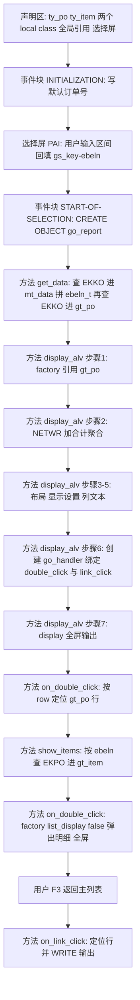
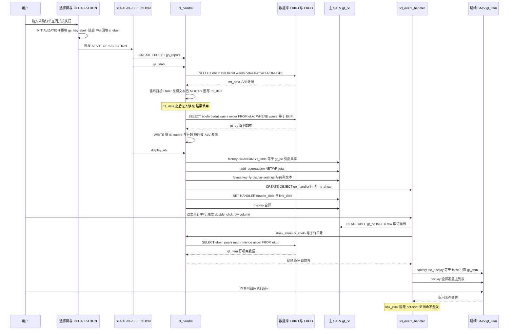

# ZSALV_PO_LIST 采购订单概览报表 —— 源码走读与风险评估

> 目标程序：`ZSLAV_PO_LIST`（OO ALV / `CL_SALV_TABLE` 全屏报表，采购订单抬头概览 + 金额合计 + 双击下钻行项目）
> 关注重点（按提问）：取数、聚合、事件绑定、下钻弹窗 四块的写法是否正确
> 覆盖范围：全部 5 个方法（`get_data` / `display_alv` / `show_items` / `on_double_click` / `on_link_click`）+ 2 个 local class（`lcl_handler` / `lcl_event_handler`）+ 全局声明区 + 2 个事件块

---

## 一、程序定位与业务背景

### 它解决什么问题

采购员每天要在系统里回答三类问题：**我们这个月下了多少采购订单、总额多少、钱花到哪些物料上了**。SAP 标准 `ME24N`（单张订单维护）不擅长"横向看一批订单"；要横向比对，常规做法是用 `ME21` 的报表功能、`ME5A`（收货/未收货统计）或自开发 ALV。本文程序就是自开发路线的最小形态：

- 选择屏给一个采购订单号区间 → 列出区间内所有订单的抬头关键字段；
- 列表底部给出净订单值合计，方便一眼看"这批单子总共多少钱"；
- 双击某一行 → 弹出该订单的行项目（物料号、项目号、数量、净价）。

### 为什么用 `CL_SALV_TABLE` 而不是 REUSE_ALV

**设计范式一句话定性**：一个"门面式"的 OO ALV 报表——全局引用做装配（`go_report` 驱动取数与显示，`go_handler` 承接事件回调），数据流走"数据库 → 内表 → SALV 全屏"，交互走"SALV 事件 → local class 回调 → 二次查询 → 二次 SALV"。

`CL_SALV_TABLE` 是 SAP 7.0 之后的对象化 ALV 封装（底层是同一个 `Reuse_ALV_Grid_display`，即 `cl_salv_uc` → `Reuse_ALV*` 那一套），好处是：

- 工厂方法 `cl_salv_table=>factory` 一步拿到全屏带工具栏的 Grid，不需要手写 `REUSE_ALV_GRID_DISPLAY` 的几十个参数；
- 每个功能（聚合 / 布局 / 列 / 事件 / 显示设置）都是独立的 `get_xxx( )` 子对象，取不到某功能时用 `is_available( )` 判断即可，避免 `NO_OPTION` 短转储；
- 事件统一为 ABAP 对象事件机制（`SET HANDLER`），而不是 `USER_FUNCTION` 回调 + `R_UCOMM`，更符合 OO 习惯。

选它的代价也很明确：**SALV 的下钻/弹窗能力几乎是零**（没有 SALV 自带的二级明细），所有扩展都得自己写；并且很多能力（标准工具栏按钮、导出 Excel 的按钮行为）默认不暴露，得逐个 `get_function( )->set_active( )` 打开。本文在这一点上走了捷径，后文详述。

### 必须先说明的一点：这份源码当前编译不过

通读后可以确认，`ZSLAV_PO_LIST` 存在**两处编译期硬错误**和**一处必崩的运行时错误**：

1. `lcl_handler` 的 `mt_data` 被声明成结构体 `TYPE ty_po`，却在 `get_data` 里被 `SELECT ... INTO TABLE`、`LOOP AT`、`MODIFY` 当内表使用（全局声明区 / 方法 `get_data`）；
2. `SELECT-OPTIONS s_ebeln FOR gs_key-ebeln.` 写在了 `DATA gs_key TYPE ty_po.` 之前，ABAP 声明部分要求 `SELECT-OPTIONS` 排在所有 `DATA` 之后，且它引用的 `gs_key` 此时尚未声明（全局声明区）。

因此本报告的分析基调是：**先指出让它跑不起来的问题，再按作者的设计意图逐块评估"意图是否正确"**——这也是提问方真正关心的四块（取数 / 聚合 / 事件绑定 / 下钻弹窗）能否成立的前提。

---

## 二、程序执行流程总览



**责任链表**

| 子程序 | 调用者 | 职责 |
|---|---|---|
| 全局声明区（`ty_po` / `ty_item` / 两个 class 定义段 / `gt_po` / `gt_item` / `go_report` / `go_handler` / `s_ebeln` / `gs_key`） | 编译器（编译期一次性执行） | 定义行结构、两个 local class 的接口、四个全局对象和选择屏字段 |
| 事件块 `INITIALIZATION` | 屏幕启动前（`LOAD-OF-PROGRAM` 之后、屏幕显示之前） | 给 `gs_key-ebeln` 写默认订单号 `'0000000001'`，作为选择屏预填值 |
| 选择屏 PAI（隐式，无代码块） | 用户按"执行" | 系统把 `s_ebeln` 的区间值回填到参考字段 `gs_key-ebeln`，随后触发 `START-OF-SELECTION` |
| 事件块 `START-OF-SELECTION` | 用户按"执行" | `CREATE OBJECT go_report`，串起取数与显示两个动作 |
| 方法 `get_data` | 事件块 `START-OF-SELECTION` | 第一次查 `EKKO` 进实例属性 `mt_data` 并循环拼 `ebeln_t`；第二次查 `EKKO` 进全局 `gt_po` 并打印行数 |
| 方法 `display_alv` | 事件块 `START-OF-SELECTION` | 用 `gt_po` 造 SALV，配置聚合 / 布局 / 斑马纹 / 两列文本与单元格类型，创建并绑定事件对象，最后全屏 `display( )` |
| 类 `lcl_event_handler` 定义段 | 编译器 | 定义 `double_click` / `link_click` 两个事件方法，并持有私有引用 `mv_show`（回指主 ALV） |
| 方法 `on_double_click` | SALV 事件 `double_click`（用户双击主表某行） | 按行号定位 `gt_po` → 调 `show_items` 取明细 → 造第二个 SALV 并弹出 |
| 方法 `show_items` | 方法 `on_double_click` | 按 `ebeln` 查 `EKPO` 进全局 `gt_item`，不做任何后处理 |
| 方法 `on_link_click` | SALV 事件 `link_click`（设计上用户点击 hot-spot 单元格） | 同样按行号定位 `gt_po`，然后 `WRITE` 打印行号与列名 |

下面按这条流程，逐个子程序展开。

---

## 三、分组分析（按程序流程 / 子程序）

### 3.1 子程序类型 `全局声明区（行结构定义）`

声明段分成三步看：行结构定义 → 两个 local class 定义 → 全局对象与选择屏。

#### ① 两个行结构 `ty_po` / `ty_item`

```abap
TYPES: BEGIN OF ty_po,
         ebeln   TYPE ekko-ebeln,
         lifnr   TYPE ekko-lifnr,
         bedat   TYPE ekko-bedat,
         waers   TYPE ekko-waers,
         netwr   TYPE ekko-netwr,
         menge   TYPE ekko-kumqw,
         ebeln_t TYPE ekko-ebeln_txt,
       END OF ty_po.

TYPES: BEGIN OF ty_item,
         ebeln TYPE ekpo-ebeln,
         posnr TYPE ekpo-posnr,
         matnr TYPE ekpo-matnr,
         menge TYPE ekpo-menge,
         netwr TYPE ekpo-netwr,
       END OF ty_item.
```

**做什么** — 用 `TYPES` 定义两个扁平结构：`ty_po` 以采购订单抬头表 `EKKO` 的字段为模板（订单号、供应商、凭证日期、凭证货币、净订单值、总数量），额外加一个 `ebeln_t` 放拼接出来的展示文本；`ty_item` 以订单行项目表 `EKPO` 为模板（订单号、项目号、物料号、数量、净价）。两者都直接 `TYPE ekko-xxx` / `TYPE ekpo-xxx`，与源表字段同类型同长度，这是 ALV 程序的标准做法——不用重复定义 domain。

**为什么** — 复用 DDIC 定义而不是写 `TYPE c LENGTH 10`，好处有三：一是 SALV 的列宽、右对齐、聚合、数值格式都依赖数据元素自带的 `CURR(15,2)` / `QUAN(13,3)` / `DATS` 描述，自定义裸类型会丢这些信息；二是后续报表扩展时字段语义一致；三是避免把 `EKKO-NETWR` 写成 `TYPE p LENGTH 15 DECIMALS 2` 这种"看起来一样但脱离 DDIC"的写法。

**风险与改进** — 类型对齐不等于语义对齐，必须做一次语义校核：
- `menge TYPE ekko-kumqw` 取的是 `EKKO-KUMVW`（采购凭证总数量，单位是**订单单位**），别名叫 `MENGE` 而 `ty_item` 里的 `menge` 取的是 `EKPO-MENGE`（行项目订购数量，单位是**行项目计量单位**）。同一个字段名在两张表里**计量单位基准不同**，两个结构都叫 `menge`，一旦以后把抬头数量和行项目数量放进同一个导出或换算逻辑，极易做出"抬头 100 + 行项目 3×40 = 220"这种重复累加。建议抬头字段直接叫 `kumvw` 或 `gesmenge`，让单位语义写在名字上。
- `netwr` 是**抬头净订单值**，即整张订单所有行的净额合计（已含行项目 `NETWR` 之和）。这一点在做第 3.5 节那个"合计"聚合时是关键前提，后面会展开。
- `ebeln_t TYPE ekko-ebeln_txt` 声明为 DDIC 文本字段（CHAR 40），却打算装 `|Order 4500001234|` 这种带前缀的展示串。**把展示文本混进数据结构的做法会污染语义**：这个字段既不是"订单号文本"也不是翻译键，且 ALV 最终并不展示它（`gt_po` 的查询根本没取它，见 3.4）。建议删掉，或改成真正的翻译键类型（如 `TYPE textl`）再配合 `SET_TEXT`。

#### ② 两个 local class 的定义段

```abap
CLASS lcl_event_handler DEFINITION FINAL.
  PUBLIC SECTION.
    METHODS on_double_click
      FOR EVENT double_click OF cl_salv_events_table
      IMPORTING row column.
    METHODS on_link_click
      FOR EVENT link_click OF cl_salv_events_table
      IMPORTING row column.
  PRIVATE SECTION.
    DATA mv_show TYPE REF TO cl_salv_table.
ENDCLASS.


CLASS lcl_handler DEFINITION.
  PUBLIC SECTION.
    METHODS get_data.
    METHODS display_alv.
    METHODS show_items
      IMPORTING iv_ebeln TYPE ekko-ebeln.

  PRIVATE SECTION.
    DATA mt_data TYPE ty_po.
ENDCLASS.
```

**做什么** — 声明两个类：`lcl_event_handler`（`FINAL`）用 `FOR EVENT ... OF cl_salv_events_table` 声明 `on_double_click` 与 `on_link_click` 两个事件方法，形参 `row column` 与 SALV 事件接口完全一致；私有属性 `mv_show` 持有主 ALV 的引用。`lcl_handler`（非 `FINAL`）暴露三个公有方法 `get_data` / `display_alv` / `show_items`，私有属性 `mt_data` 作为取数缓存。

**为什么** — 事件方法必须用 `FOR EVENT ... OF <接口/类>` 声明而不是普通方法，这是 `SET HANDLER` 的语法前提；形参必须照抄事件接口的 `IMPORTING` 列表，多写少写都会编译失败。分成"报表主控类 + 事件回调类"是 SALV 程序的经典两段式：主控类负责取数与配置，回调类只负责处理用户交互，两边通过引用协作。

**风险与改进** — 三处值得注意：
- `DATA mt_data TYPE ty_po.` 是**结构体**而不是内表类型，而它在 `get_data` 里被当内表用（`SELECT INTO TABLE mt_data` / `LOOP AT mt_data` / `MODIFY mt_data`）。这直接导致程序编译失败。必须改成 `DATA mt_data TYPE STANDARD TABLE OF ty_po WITH EMPTY KEY.`，才能与全局 `gt_po` 的定义保持一致。作者大概率是漏抄了 `STANDARD TABLE OF ... WITH EMPTY KEY` 这一段。
- `lcl_handler` 没有标 `FINAL`。报表主控类通常不需要被继承，标上 `FINAL` 可以让语法检查帮你拦住误用（本例中它反而暴露了 `mt_data` 的类型意图混乱）。
- `lcl_handler` 这个名字信息量太低：它同时干"取数 + ALV 呈现 + 下钻查询"三件事，后面 `on_double_click` 还要反过来调它。这是"一个类做所有事"的雏形，见 P3 建议拆成 `lcl_data_provider` / `lcl_presenter` / `lcl_navigation`。
- `mv_show` 声明了却在全程序中**只被赋值、从未被读取**（见 3.5 步骤 6 与 3.7）。它本来的意图应该是给事件回调一个"拿回主 ALV 引用"的入口（例如在 `link_click` 里改标题、刷新等），但作者没有用起来。

#### ③ 全局对象与选择屏声明

```abap
DATA gt_po   TYPE STANDARD TABLE OF ty_po WITH EMPTY KEY.
DATA gt_item TYPE STANDARD TABLE OF ty_item WITH EMPTY KEY.
DATA go_handler  TYPE REF TO lcl_event_handler.
DATA go_report   TYPE REF TO lcl_handler.

SELECT-OPTIONS s_ebeln FOR gs_key-ebeln.
DATA gs_key TYPE ty_po.
```

**做什么** — 定义两个全局内表（`gt_po` 订单抬头、`gt_item` 订单行项目，均为 `STANDARD TABLE ... WITH EMPTY KEY`）、两个全局对象引用（`go_report` 指向主控类、`go_handler` 指向事件类），最后声明选择屏字段 `s_ebeln`，绑定到全局结构 `gs_key` 的 `ebeln` 分量上。

**为什么** — 用全局引用而不是把对象实例塞进 `START-OF-SELECTION` 的局部变量，是因为 `START-OF-SELECTION` 是**事件块**：局部变量在事件块结束时就失效了。事件块里的 `CREATE OBJECT` 若写成局部 `DATA lo_report TYPE REF TO lcl_handler.`，语句一结束引用计数归零，对象立即被 GC 回收，之后 `lo_report->display_alv( )` 会直接 CX_SY_REF_IS_INITIAL。所以这里必须 `DATA ... TYPE REF TO` 提升为全局——这是 OO 报表里最容易踩、也最值得讲给新人的一点。
`WITH EMPTY KEY` 同样是 SALV 的硬性要求：`CL_SALV_TABLE` 需要一个**非唯一主键**的标准表来做行引用与排序，`HASHED TABLE ... WITH UNIQUE KEY` 或 `SORTED TABLE` 都会在 factory 阶段报错或行为异常。作者这里选对了。

**风险与改进** — 存在一个**编译期硬错误**：ABAP 程序的声明部分有强制顺序——先 `TYPE`/`CLASS` 等类型声明，再 `DATA`/`CONSTANTS`，最后才是 `TABLES` / `SELECT-OPTIONS` / `PARAMETERS` / `RANGES`。这里把 `SELECT-OPTIONS s_ebeln FOR gs_key-ebeln.` 放在了 `DATA gs_key TYPE ty_po.` 前面，既违反顺序，又引用了尚未声明的 `gs_key`，语法检查必然报错。修复方式是把 `DATA gs_key TYPE ty_po.` 上移到所有 `SELECT-OPTIONS` 之前。

除此之外还有两个设计上的别扭：
- `SELECT-OPTIONS ... FOR gs_key-ebeln` 借一个**结构分量**当参考字段，属于合法但少见的写法。参考字段的常规用途是"把用户选中的值放进一个可被后续代码直接读取的字段"，而本程序的后续代码（`get_data` 里的 `WHERE ebeln IN s_ebeln`）**完全没读 `gs_key-ebeln`**，只读了选择表 `s_ebeln`。也就是说 `gs_key` 存在的唯一意义是承接 `INITIALIZATION` 里的预填值，而预填值本身也可以直接写 `s_ebeln-low`。多这一层中转只带来两处状态来源（`gs_key-ebeln` 与 `s_ebeln-low` 可能不一致），没有收益。
- 全局 `gt_po` / `gt_item` 既是"数据仓库"又是"传给 SALV 的显示数据"，等于让数据层和显示层共享可变状态。事件回调类随后直接 `READ TABLE gt_po`，绕过了主控类的任何接口（见 3.7），这是后面所有耦合问题的根源。

### 3.2 子程序类型 `事件块 INITIALIZATION`

```abap
INITIALIZATION.
  gs_key-ebeln = '0000000001'.
```

**做什么** — 在屏幕显示之前，把全局结构 `gs_key` 的 `ebeln` 分量赋成字符串 `'0000000001'`，通过 `SELECT-OPTIONS` 的参考字段机制，这个值会作为选择屏的预填值呈现。

**为什么** — `INITIALIZATION` 是给选择屏设置默认值和变式名的标准位置，时机上正好在屏幕输出之前、用户交互之前。相比在 `AT SELECTION-SCREEN` 里改，选择屏阶段直接设定参考字段是最简洁的预填方式。

**风险与改进** — 有三点：
- **默认值语义可疑**。`EKKO-EBELN` 是 `NUMC 10` 的内部凭证号，SAP 真实订单号通常是 `45xxxxxxx` 这类连续号段，`'0000000001'` 更像单元测试或演示用的桩值。作为生产报表的默认查询条件，它会让用户在没改任何东西就按执行时得到空结果，且难以自查。
- **赋值时机与生效机制依赖隐式行为**。严格来说，`INITIALIZATION` 里写参考字段、指望选择屏把它显示出来，是借了"选择表在屏幕显示时从参考字段取初值"这一隐式约定。作者如果不自知，改成 `s_ebeln-low = '0000000001'.` 会更直白、也更少依赖隐式行为。两种写法在用户修改后都会被 PAI 的值回填覆盖，所以真正的风险不是"值被冲掉"，而是**读者无法判断这个默认值到底起没起作用**。
- 这个赋值只写了参考字段，没写选择表，于是屏幕上看起来有值、代码里 `s_ebeln-low` 在 PAI 之前是空的。如果后续有人加一句在 `INITIALIZATION` 之后立刻读 `s_ebeln` 的逻辑（比如校验），就会读到空值而不自知。

### 3.3 子程序类型 `事件块 START-OF-SELECTION`

```abap
START-OF-SELECTION.

  CREATE OBJECT go_report.
  go_report->get_data( ).
  go_report->display_alv( ).
```

**做什么** — 用户在选择屏按"执行"后进入本事件块：创建主控类实例存入全局引用 `go_report`，然后顺序调用 `get_data( )` 取数和 `display_alv( )` 显示。

**为什么** — 把取数与显示拆成两个方法、并且方法体内只有一行调用，是很好的"编排层"写法：事件块只负责编排顺序，逻辑落在可单测的方法里。相比 `REPORT` + `FORM` + `PERFORM`，`CREATE OBJECT` + 方法调用的好处是方法有明确的隐式 `self` 上下文（可以访问私有属性），也让后续加"权限检查""空结果提示"这类前置步骤不必改方法签名。

**风险与改进** — 编排本身是清晰的，但缺少三道常见的关口：
- **没有空选择屏拦截**。`s_ebeln` 是非必填（optional），用户清空后按执行，会发出一个不带 `IN` 限制的 `SELECT ... FROM EKKO WHERE ebeln IN s_ebeln`，在生产系统上等价于**全表范围扫描 `EKKO`**（该表通常有数千万行量级），且 ALV 会被几十万行数据撑爆。这类报表应该在事件块里第一件事就是校验选择屏，必要时 `MESSAGE` 提示后 `LEAVE LIST-PROCESSING`。
- **没有空结果短路**。查询 0 行时，`get_data` 不报错、`display_alv` 照样造出一个空表全屏，用户看到的是一张只有表头和"合计 0.00"的空白 Grid，完全分不清是"没查到"还是"程序坏了"。建议在 `get_data` 结尾或事件块里判 `IF mt_data IS INITIAL` → `MESSAGE '未查询到符合条件的采购订单' TYPE 'S'` 并退出。
- **没有权限校验**。报表直接展示 `EKKO-LIFNR`（供应商）与金额，属于敏感采购数据；标准做法是在选择屏上挂 `AT SELECTION-SCREEN ON VALUE-REQUEST` 或直接按采购组织 / 采购员做 `AUTHORITY-CHECK`，把用户限制在他有权查看的范围内。示例程序可以省，生产程序不行。

---

### 3.4 子程序类型 `方法 get_data`

这是提问里"取数"那块的核心，也是本程序问题最集中的地方。分四步看：第一次查询进 `mt_data`、循环拼 `ebeln_t`、第二次查询进 `gt_po`、调试输出。

#### ① 第一次查询：查 `EKKO` 进实例属性 `mt_data`

```abap
    SELECT ebeln lifnr bedat waers netwr kumvw AS menge
      FROM ekko
      INTO TABLE mt_data
      WHERE ebeln IN s_ebeln.
```

**做什么** — 以选择屏的订单号区间为条件，从 `EKKO` 读取 6 个字段装满 `mt_data`：`EBELN` 订单号、`LIFNR` 供应商、`BEDAT` 凭证日期、`WAERS` 凭证货币、`NETWR` 净订单值，以及 `KUMVW` **取别名**为 `MENGE` 的凭证总数量。别名这一步很关键：不取别名，结构里出现的字段名就是 `KUMVW`，与 `ty_po` 的 `menge` 不匹配，SELECT 会报结构不兼容。

**为什么** — 投影取列（只取 6 列而非 `EKKO` 全部 100+ 列）是 ALV 取数的标准优化，避免把无关列拉进内存。条件走 `EBELN` 上的主索引（`EKKO` 主键就是 `MANDT + EBELN`，另有 `EBELN` 的二级索引），且用的是 `IN` 区间，区间规模由用户输入决定、可控。
关键的一点：这条查询查的是**整个区间**，与后面第二条查询的差别只有"多一个 `waers = 'EUR'` 过滤、少两个字段"。也就是说这是一次可被完全消除的重复数据库往返。

**风险与改进** — 三点，第一点是阻断性的：
- **`mt_data` 类型不对，程序编译不过**。声明段里 `mt_data` 是结构体 `TYPE ty_po`，而这里要的是内表。必须改成 `DATA mt_data TYPE STANDARD TABLE OF ty_po WITH EMPTY KEY.`。连带地，② 和 ③ 两步的 `LOOP AT` / `MODIFY` 也一样编译不过。
- **这条查询的结果被完全丢弃**。`mt_data` 全程序只在本方法内被写入，从未被 `display_alv` 读取、也从未传给 SALV。ALV 实际绑定的是全局 `gt_po`。也就是说 `LIFNR`（供应商）、`MENGE`（总数量）、`EBELN_T` 三列是查出来就扔——白付一次全量数据库往返和一份内存驻留。
- **别名 `MENGE` 的语义要当心**。`EKKO-KUMVW` 是"整张订单的总数量"，与 `EKPO-MENGE`（行订购量）同名字段单位不同；另外 `KUMVW` 是 `QUAN(13,3)`，如果订单里混用不同订单单位，这个字段本身在业务上就未必能直接相加。真要展示数量，更可靠的是从 `EKPO` 汇总行数量。

#### ② 循环拼接展示文本 `ebeln_t`

```abap
    LOOP AT mt_data INTO DATA(ls_row).
      ls_row-ebeln_t = |Order { ls_row-ebeln }|.
      MODIFY mt_data FROM ls_row.
    ENDLOOP.
```

**做什么** — 遍历 `mt_data` 的每一行，用字符串模板 `|Order { ebeln }|` 生成一个带 `Order` 前缀的展示文本写进工作区 `ls_row-ebeln_t`，再 `MODIFY` 回内表。

**为什么** — 作者的意图是给列表加一列可读文本（例如 `Order 4500001234`），用 `|...|` 字符串模板而不是 `CONCATENATE` 是现代写法；`DATA(ls_row)` 内联声明（7.40 起）省掉了单独声明工作区的语句。这两处语法本身都是对的。

**风险与改进** — 这段几乎每一步都是问题：
- **逻辑冗余**。`LOOP AT` 已经在 `mt_data` 上逐行遍历，直接 `MODIFY mt_data FROM ls_row` 会把当前行原样写回原位，ABAP 甚至允许在 `LOOP` 里直接 `mt_data-ebeln_t = ...` 修改当前行。`LOOP + 工作区 + MODIFY` 是 pre-45A 时代的写法，现在是纯开销：每行一次线性查找 + 一次整行拷贝（`MODIFY ... FROM ws` 是按整结构比较匹配的）。
- **文案硬编码**。`'Order'` 是英文字面量，未走文本符号（非英文环境会显示英文）；文案本身也毫无信息量——订单号前后没有补零对齐、没带供应商名，不如直接展示 `LIFNR`。
- **字段类型错配**。见 3.1 ①：`ebeln_t` 声明为 `EKKO-EBELN_TXT`（订单号文本），装的却是自造串。
- **结果被丢弃**。拼好的 `ebeln_t` 留在 `mt_data` 里，而 ALV 用的是 `gt_po`，所以这列根本不会显示。
- 综合建议：整段删除。如果真的要展示可读文本，用 SALV 的列功能更对路——`lo_col->set_long_text( '采购订单' )` 配 `set_short_text( ... )`，文本走 `TEXT-xxx`，一行配置解决，不需要在数据层拼字符串。

#### ③ 第二次查询：查 `EKKO` 进全局 `gt_po`，硬编码币种过滤

```abap
    SELECT ebeln bedat waers netwr
      INTO TABLE @gt_po
      FROM ekko
      WHERE ebeln IN s_ebeln
        AND waers = 'EUR'.
```

**做什么** — 第二次访问 `EKKO`，只取 4 列（订单号、凭证日期、凭证货币、净订单值），条件是订单号在选择屏区间内**并且凭证货币等于 `EUR`**，结果装进全局内表 `gt_po`——这才是真正喂给 SALV 的数据源。

**为什么** — 写法上值得肯定的有两点：用 `INTO TABLE @gt_po`（内联主机变量 `@` 前缀）直接写全局内表，符合 7.40 之后的 inline 声明风格；只取 ALV 要展示的 4 列，投影足够窄。

**风险与改进** — 这条查询同时踩了三个坑：
- **硬编码 `waers = 'EUR'` 是最严重的问题**。它把"本报表只关心欧元订单"这个业务假设写死在程序里，而且**用户在界面上完全看不到这个限制**——选择屏上没有任何提示，用户会以为看到的是区间内全部订单，实际上非欧元订单（绝大多数本地订单、日元订单、集团其他实体订单）被静默丢弃。更麻烦的是它无提示地改变了汇总口径：列表底部的金额合计只是"欧元部分"的合计，却没有任何标注。建议两种改法：（a）若确实只需欧元，把它做成选择屏上的一个下拉（`PARAMETERS p_waers TYPE ekko-waers` + `AT SELECTION-SCREEN ON VALUE-REQUEST` 读 `TCURX`），让限制可见可控；（b）若不需要币种限制，直接删掉这个条件，同时在列表里把 `WAERS` 列显性展示，避免跨币种金额被误加。
- **和 ① 是重复查询**。同一张表、同一组键值范围，差别只是币种过滤和投影列。更合理的形态是一条 SELECT 取全部需要的列，用别名把 `KUMVW` 映成结构字段，一次查完；币种限制若保留，则作为 `WHERE` 条件写在同一条语句里。
- **两处数据源并存造成"真相分裂"**。取数后内存里同时存在 `mt_data`（6 列，带 ebeln_t）和 `gt_po`（4 列），两个容器名不同、内容不同、字段集不同。后续任何人想加一列，都要先想清楚"该加到哪个表"，加错的概率很高。正确做法是 `mt_data` 要么删掉、要么成为唯一真相并被 ALV 直接使用。
- 顺带一句：`SELECT` 未命中时不会置异常，内表自然为空且 `sy-subrc` 为 0，所以这里不需要判 `sy-subrc`，但需要在更外层判空（见 3.3）。

#### ④ 调试输出

```abap
    WRITE: / 'loaded', lines( gt_po ).
```

**做什么** — 向列表输出"loaded"和 `gt_po` 的行数。

**为什么** — 作者显然是在开发阶段用它确认"查询到底取到几行"。作为调试手段它本身有效，且 `lines( )` 内置函数比 `DESCRIBE TABLE ... LINES` 更简洁。

**风险与改进** — 不能留在生产代码里，理由有三：
- 调试图段还会**进入用户的输出列表**，出现在选择屏结果页上，属于噪音。
- 在本程序里它的时机更尴尬：它在 `display_alv` 之前执行，紧接着 SALV 全屏 `display( )` 会把整个屏幕覆盖掉，所以这条输出用户根本看不到——**它既污染不了界面也起不到诊断作用**，纯死代码。
- 正式的做法是把诊断信息交给 `MESSAGE ... TYPE 'I'`（用户可见）或写应用日志（`CALL FUNCTION 'WRITE_LOG'` / `cl_demo_output`），需要保留可观测性又不污染界面。

### 3.5 子程序类型 `方法 display_alv`

提问里的"聚合"和"事件绑定"两块都在这个方法里。它有七个逻辑步骤，逐一展开。

#### ① 引用声明 + SALV 工厂

```abap
    DATA lo_alv     TYPE REF TO cl_salv_table.
    DATA lo_cols    TYPE REF TO cl_salv_columns_table.
    DATA lo_col     TYPE REF TO cl_salv_column.
    DATA lo_events  TYPE REF TO cl_salv_events_table.
    DATA lo_aggr    TYPE REF TO cl_salv_aggregations.
    DATA lo_layout  TYPE REF TO cl_salv_layout.
    DATA lo_disp    TYPE REF TO cl_salv_display_settings.

    TRY.
        cl_salv_table=>factory(
          IMPORTING r_salv_table = lo_alv
          CHANGING  t_table      = gt_po ).
      CATCH cx_salv_msg.
        RETURN.
    ENDTRY.
```

**做什么** — 声明七个功能对象的引用（表、列集合、单列、事件、聚合、布局、显示设置），然后调 `cl_salv_table=>factory`：`IMPORTING` 取出 `r_salv_table` 对象，`CHANGING` 把显示数据源指向全局内表 `gt_po`。`CHANGING t_table` 是引用传参，SALV **不会复制**数据，保存的正是 `gt_po` 本身。异常由 `CATCH cx_salv_msg` 兜住后 `RETURN`。

**为什么** — `factory` 是 SALV 唯一入口，`t_table` 要求 `TYPE ANY TABLE` 且满足 SALV 的表类型约束，作者给的 `WITH EMPTY KEY` 标准表正好合规（与 3.1 ③ 的分析一致）。用 `TRY/CATCH` 而不是让异常冒到事件块，也是合理的防御姿态。

**风险与改进** — 三点：
- **`CATCH` 之后直接 `RETURN`，但没有任何提示**。工厂失败（表类型不合法、字段名冲突等）时，用户看到的是选择屏之后一片空白，连"出错了"都不知道。`RETURN` 至少要配一条 `MESSAGE e_display_error WITH 'ALV 初始化失败'`（或写日志），否则现场问题无法定位。
- **`CHANGING t_table` 共享引用意味着数据随时可被改**。因为 SALV 不复制数据，`get_data` 之后任何对 `gt_po` 的修改都会立刻反映到界面上；反过来说，`on_double_click` 里 `READ TABLE gt_po` 读到的就是 SALV 的活数据——这一点在 3.7 里既是便利也是隐患（行号语义依赖内表顺序）。如果希望显示快照，应在 factory 前把数据传成副本（传 `DATA(lt_copy) = gt_po` 的局部表）。
- `DATA lo_*` 声明放在方法开头是 ABAP 惯例（虽然 7.40 之后可以内联声明），此处没问题。但注意其中 `lo_cols` / `lo_col` / `lo_events` 都被使用了，唯独没有任何一个在 `factory` 之后判 `IS INITIAL`——因为 `factory` 失败时已经 `RETURN` 了，这里逻辑自洽。

#### ② 聚合：给 `NETWR` 加合计

```abap
    lo_aggr = lo_alv->get_aggregations( ).
    TRY.
        lo_aggr->add_aggregation(
          EXPORTING  columnname  = 'NETWR'
                     aggregation = if_salv_c_aggregation=>total ).
      CATCH cx_salv_data_error.
      CATCH cx_salv_not_found.
    ENDTRY.
```

**做什么** — 取出聚合功能对象，对 `NETWR` 列登记一个 `total` 聚合，效果是列表底部（或作为总计行）显示这一列所有可见行净订单值的合计。

**为什么** — 这是 SALV 里"底部合计"的标准做法，只需一行登记，合计行的显示、排序、与筛选/分页的联动都由 SALV 自己处理，远优于自己算一行再拼进数据。列名用大写 `'NETWR'` 是必须的——SALV 列的技术名统一大写，写小写会找不到。

**风险与改进** — 聚合这个思路本身是**对的**，但有三个必须指出的问题：
- **合计口径未被声明**。`EKKO-NETWR` 是**整张订单**的净订单值，所以 `total` 算出来是"区间内各订单净值的算术和"——这个口径在业务上是合理的（不重复计数，因为抬头值已经包含所有行项目）。但代码里没有任何注释说明这一点，读者很容易误以为它是对行项目金额的求和。**建议补一行注释固化语义**，这类"看起来是明细求和、其实是抬头求和"的口径差异是后续需求变更时的雷区。
- **跨币种相加的口径风险**。`waers = 'EUR'` 的硬编码（3.4 ③）恰好让当前列表内币种唯一、合计可比。但这是"靠一个 bug 掩护一个设计风险"：一旦有人删掉那个币种条件，`total` 就会把欧元和日元金额直接相加，得到一个毫无业务含义的数字。正确做法是用聚合的加权能力——把 `WAERS` 作为 NETWR 的参考币种列（见下一步 ⑤ 的 `set_currency`），让合计按币种分组，或显式约束列表内单币种。
- **异常被静默吞掉**。`CATCH cx_salv_data_error` 和 `CATCH cx_salv_not_found` 两个异常都没有处理体，等于"聚合失败就当没配"。`CX_SALV_NOT_FOUND` 在列名写错时必然抛出——也就是说如果有人把 `'NETWR'` 改成不存在的列名，程序照常运行、照常显示列表，只是底部没有合计，且没有任何日志。至少要写日志说明聚合未生效。

#### ③ 布局：布局变式键 + 默认布局 + 允许保存

```abap
    lo_layout = lo_alv->get_layout( ).
    lo_layout->set_key( VALUE #( report = sy-repid ) ).
    lo_layout->set_default( abap_true ).
    lo_layout->set_save_restriction( if_salv_c_layout=>restrict_none ).
```

**做什么** — 取布局对象，把布局变式的存储键设为当前报表名 `sy-repid`（保证变式按报表隔离，不与别的 ALV 串味），把"应用默认布局"打开（用户的个性化设置 DT/PD 优先于报表内设置），并解除保存限制（允许用户通过 ALV 的布局菜单保存自己的列宽/排序/过滤为变式）。

**为什么** — 这是三行一组的标准组合：用 `sy-repid` 做键避免变式冲突；`set_default` 让用户在 `SU3` 里做的 ALV 个性化设置生效，符合"尊重用户习惯"的报表设计哲学；`restrict_none` 给用户自由度。整体判断准确。

**风险与改进** — 一个易被忽略的坑：**这三行是"全屏专属"的配置**。ALV 的布局保存功能只在全屏（`list_display = abap_true`）模式下可用；本方法里的 `factory` 用的是默认参数，恰好是全屏，所以这里是成立的。但作者在 `on_double_click` 里（3.7）造弹窗时用了 `list_display = false`（也是全屏），如果将来把弹窗改成真正的浮动窗口（`list_display = true`），这套布局 API 在弹窗中不仅无效，部分调用还可能抛异常。建议把这类"只在全屏可用"的配置收敛到一处，或者在弹窗场景里跳过。

#### ④ 显示设置：斑马纹

```abap
    lo_disp = lo_alv->get_display_settings( ).
    lo_disp->set_striped_pattern( abap_true ).
```

**做什么** — 打开隔行着色，让长列表的横向阅读更轻松。

**为什么** — 一行即可，语义清晰，属于低成本高回报的可读性优化。

**风险与改进** — 无明显功能风险。仅提示一点：隔行着色在打印或导出时通常会被自动去掉，如果报表有打印需求，可以再配 `lo_disp->set_enable_print( )`（默认已开）与 `set_header_lines( )`，并考虑打印标题行的重复设置。属于锦上添花，非必需。

#### ⑤ 列配置：长文本 + 单元格类型

```abap
    lo_cols = lo_alv->get_columns( ).
    lo_col ?= lo_cols->get_column( 'EBELN' ).
    lo_col->set_long_text( 'Purchase Order' ).
    lo_col ?= lo_cols->get_column( 'NETWR' ).
    lo_col->set_cell_type( if_salv_c_cell_type=>numeric ).
```

**做什么** — 取出列集合，给 `EBELN` 列设长文本 `'Purchase Order'`（显示为列标题），给 `NETWR` 列设单元格类型为 `numeric`（数值型渲染，右对齐、按数值而不是按字符串对齐）。

**为什么** — 不设 `long_text` 时 SALV 会拿结构字段名或数据元素短文本当列标题（多半是 `EBELN`/`采购订单号`），显式设一次能控制标题措辞。设 `cell_type` 为数值型能拿到右对齐和数值渲染，这是 SALV 比裸 `REUSE_ALV` 省事的地方。

**风险与改进** — 这里有两个真实缺陷：
- **`?=` 是假防护**。`lo_cols->get_column( 'EBELN' )` 在列不存在时**不会**返回初始引用，而是抛 `CX_SALV_NOT_FOUND`（本方法没捕获，直接冒到事件块 → 短转储）；`?=` 只能防"返回初始引用"这种情况，防不住异常。所以这一行给人的安全感是假的。当前 `EBELN` / `NETWR` 确实存在于 `gt_po`，暂时不会出事；但一旦有人改了取数字段列表（比如为了 3.4 的去重合并而删列），这里就会立刻短转储。**正确写法**：要么去掉 `?=` 直接用（让异常被上层明确处理），要么用 `lo_cols->get_column( ... )` 后判 `IF lo_col IS BOUND`，要么用 `IF lo_cols->has_column( 'NETWR' ) = abap_true` 先探测。
- **`numeric` 用错了单元格类型**。`NETWR` 的数据元素是 `CURR(15,2)`，正确的类型是 `if_salv_c_cell_type=>currency`（或干脆让 SALV 依据数据元素自动推断）。用 `numeric` 会丢掉币种语义的渲染（不显示币种符号/千分位处理规则）。更关键的是，**币种列 `WAERS` 并没有被设为 `NETWR` 的参考币种列**——正确做法是 `cl_salv_column=>set_currency( lo_column = lo_col currency_column = 'WAERS' )`，让金额列带上币种上下文。这是报表可信度的关键：跨币种订单摆在同一列里，读者必须能一眼看出哪行是什么币种。

#### ⑥ 创建事件对象并绑定两个事件

```abap
    CREATE OBJECT go_handler.
    go_handler->mv_show = lo_alv.
    lo_events = lo_alv->get_event( ).
    SET HANDLER go_handler->on_double_click FOR lo_events.
    SET HANDLER go_handler->on_link_click   FOR lo_events.
```

**做什么** — 创建 `lcl_event_handler` 实例存入全局引用 `go_handler`，把主 ALV 引用回填给它私有属性 `mv_show`，取出事件对象，然后为 `double_click` 和 `link_click` 两个事件各注册一个处理方法。

**为什么** — 这一步是提问里"事件绑定"的核心，**绑定的语法和生命周期处理都是对的**：
- `lo_events = lo_alv->get_event( )` 取到的 `cl_salv_events_table` 在方法结束时会被释放，但 `SET HANDLER` 是**注册到事件对象上**的引用关系；`lo_alv` 本身被 SALV 框架持有并在 `display( )` 后进入事件循环，所以事件链依然有效。作者没有把 `lo_events` 提升为全局变量是**可以接受的**——需要提升的是 handler 的**宿主**。
- `CREATE OBJECT go_handler` 写的是**全局引用**，这是关键中的关键：如果写成 `DATA lo_handler TYPE REF TO lcl_event_handler.`，方法一结束对象即被 GC，下次用户双击时 `set_handler` 的引用已失效，回调不会被调用（表现是"双击没反应且无任何报错"，非常难查）。作者把它提升到全局，规避了这个 SALV 最经典的坑，值得肯定。
- 绑定两个事件而不只绑一个，说明作者本来想做"双击下钻 + 单击超链接下钻"两条交互路径。

**风险与改进** — 三个问题，其中第一个会让其中一个事件**永远不触发**：
- **`link_click` 事件实际不可达**。SALV 的 `link_click` 只在用户点击**被设为 hot-spot（超链接）类型**的单元格时才触发，而 ⑤ 里只给 `NETWR` 设了 `numeric`，**没有任何列被设为 `if_salv_c_cell_type=>hotspot`**。所以 `on_link_click` 是一个永远不会被调用的死方法。修复方式是给订单号列加一行：`lo_col ?= lo_cols->get_column( 'EBELN' ). lo_col->set_cell_type( if_salv_c_cell_type=>hotspot ).`（顺带会让双击下钻的可发现性更好——用户能看到这一列是可点的）。这一点同时也提醒：SALV 的事件不是"绑了就一定触发"，触发条件是"hot-spot 单元格 + 事件 + 被设置了的对应字段"，三者缺一不可。
- **`mv_show` 只写不读**。回填主 ALV 引用之后没有任何一处使用它（3.7 的 `on_double_click` 也没有用它）。要么在回调里真正用它（例如取 `get_data( )` 做局部刷新、或改 `set_title( )` 提示"已下钻到订单 XXX"），要么删掉这个属性，别留误导性设计。
- **handler 在 `display_alv` 里创建，职责边界不清**。主控类的方法顺手创建自己的协作对象，导致"谁持有 handler"的答案散落在 `display_alv` 里。更干净的做法是在 `lcl_handler` 里定义一个内部类（inner class）或者在 `START-OF-SELECTION` 里一次性创建并互相注入引用，让对象图的装配集中在一处。同时注意：`display_alv` 被重复调用（理论上不会，但重构后可能）会重新创建 handler，旧 handler 因无引用而回收，新 handler 重新绑定——这条路径是安全的。

#### ⑦ 全屏显示

```abap
    lo_alv->display( ).
```

**做什么** — 触发全屏输出，ALV 接管屏幕并进入事件循环，后续所有用户交互（排序、过滤、布局、双击）都在这里被分发。

**为什么** — SALV 的 `display( )` 是"显示并进入交互"的单点调用，不需要像 `REUSE_ALV_GRID_DISPLAY` 那样传 `I_SAVE` / `I_CALLBACK_*` / `IT_SORT` 一堆参数。

**风险与改进** — 缺一个常见配置：**标准工具栏没有激活**。SALV 默认关闭标准工具栏（导出、打印、选择行、布局等功能按钮需要逐个 `set_active( )`），所以这个列表大概是"只有数据、没有按钮"的裸表。作为内部查询报表可以接受，但既然 `set_key` + `restrict_none` 已经允许用户保存布局变式，说明作者是希望用户能自定义视图——那工具栏更应该打开，至少开 `EXPORT` / `PRINT` / `SELECTION` / `LAYOUT`。对应写法是 `lo_funcs = lo_alv->get_functions( ). lo_funcs->get_function( 'EXPORT' )->set_active( ).` 之类。

### 3.6 子程序类型 `方法 show_items`

```abap
  METHOD show_items.

    SELECT ebeln posnr matnr menge netwr
      FROM ekpo
      INTO TABLE gt_item
      WHERE ebeln = iv_ebeln.

  ENDMETHOD.                    "show_items
```

**做什么** — 接收一个订单号 `iv_ebeln`，按该订单号从行项目表 `EKPO` 读取 5 个字段（订单号、项目号、物料号、订购数量、净价）装进全局内表 `gt_item`，供下钻弹窗使用。

**为什么** — 这是下钻的标准动作：用抬头行的唯一键（`EBELN`）做等值查询命中 `EKPO` 的主索引前缀（`EKPO` 主键是 `EBELN + POSNR`），代价可控。方法只做"取数"，不碰 ALV，职责单一，参数用 `IMPORTING iv_ebeln TYPE ekko-ebeln` 明确了接口契约——比直接读全局 `gt_po` 要好。

**风险与改进** — 四点：
- **未过滤已删除/被阻塞的行项目**。`EKPO` 里存在已被标记删除、或因交货完成（最终交货）而被阻塞的行项目（字段 `LOEKE`），订单在业务上"看起来还有行项目"，但从采购视角已不再有效。当前查询会把它们一并显示出来，造成"行金额合计对不上抬头 `NETWR`"的经典困惑。至少应加 `AND loeeke = ' '`；如果业务要求只看在途未收货，还需结合交货/收货状态字段过滤。
- **没有排序**。`SELECT` 不带 `ORDER BY`，行项目顺序依赖数据库返回顺序，通常看起来"碰巧有序"，但没有保证。`EKPO` 的物理顺序通常就是 `POSNR` 升序（主键顺序），但一旦执行计划变化（走别的索引、或做表缓冲）顺序就不保证了。报表应显式 `ORDER BY posnr`，或在 ALV 侧用 `lo_cols->get_column( 'POSNR' )->set_sort( if_salv_c_column_sort=>ascending )` 设定排序。
- **没有空结果处理**。订单确实可能查不到行（脏数据、跨公司记账订单等）。这里返回空表，调用方（3.7）会造出一个空 Grid，用户以为程序出错。应在这里或调用方判空并 `MESSAGE`。
- **物料号是裸编码**。弹窗里只有 `MATNR` 编码，用户看到的是 `000000012345678`。下钻弹窗的价值一半在于"看清明细"，所以至少应带出行项目文本（`EKPO-TXTVW`/`TXZ01` 描述）或用 `MAKT` 取物料描述，否则用户还得再开一个窗口查。这是产品完成度问题，不是正确性问题。

### 3.7 子程序类型 `方法 on_double_click`

这是提问里"下钻弹窗"那块，分四步：定位行、调 `show_items`、造第二个 SALV、显示。

#### ① 按行号定位抬头行

```abap
    DATA lo_popup TYPE REF TO cl_salv_table.

    READ TABLE gt_po INTO DATA(ls_po) INDEX row.
    IF sy-subrc <> 0.
      RETURN.
    ENDIF.
```

**做什么** — 声明弹窗引用后，用事件参数 `row` 作为行索引，从 `gt_po` 读出该行的订单数据到内联工作区 `ls_po`；读不到就直接返回。

**为什么** — `row` 是 SALV 事件接口传入的**1 起始的行号**，`READ TABLE ... INDEX row` 是官方示例给出的标准取行写法，比"用 `row` 当条件去 `SELECT`"高效得多（数据已在内存，无需回库）。判 `sy-subrc` 也是必要防御。

**风险与改进** — 写法正确，但有两点需要留意：
- **行号语义依赖内表顺序**。`row` 是数据表中的行号，而 SALV 的视图层维护自己的显示行映射；用户在前台排序或过滤后，"视觉第 N 行"与"`gt_po` 的第 N 行"是否一致，取决于 SALV 是否已把排序应用到内表。由于 3.5 ① 中 `t_table` 传的是引用（数据共享），这里读到的确实是显示数据，但排序后的行号对应关系仍建议在真实环境里实测一次。**更稳的写法**是拿 `EBELN` 这个业务唯一键二次确认（`READ TABLE gt_po WITH KEY ebeln = ...`，从别处拿 ebeln），或干脆改用 `get_selected_rows( )` / `user_command` 路径，避免任何行号假设。
- `DATA lo_popup` 声明在方法开头却与 ① 的逻辑无关，是纯粹的样板混排；把它挪到 ③ 之前（或用 7.40 内联 `DATA(lo_popup)`）可读性更好。属于风格问题。

#### ② 调用主控类取行项目

```abap
    go_report->show_items( iv_ebeln = ls_po-ebeln ).
```

**做什么** — 通过全局引用 `go_report` 调用主控类的 `show_items`，把刚定位到的订单号传进去，触发 `EKPO` 查询并填充全局 `gt_item`。

**为什么** — 事件回调不自己查数据库、而是把取数交回主控类，方向是对的：查询逻辑集中在主控类，回调只做交互编排。

**风险与改进** — 这里暴露了对象图的**双向耦合**：主控类 `display_alv` 创建了 `go_handler`（3.5 ⑥），事件类又反过来调 `go_report`（3.7 ②），两个类互相知道对方的存在，且都必须先由 `START-OF-SELECTION` 把两个引用塞进全局变量才连得起来。当前能跑是因为 `go_report` 先于 `display_alv` 创建、事件又只在 `display_alv` 之后才可能触发——**顺序正确性成了隐式契约**，一旦有人调整 `START-OF-SELECTION` 里的两行顺序、或在别处复用 `lcl_event_handler`，就会拿到初始引用并 CX_SY_REF_IS_INITIAL。改进方向有两条：把 `lcl_event_handler` 定义成 `lcl_handler` 的局部内部类（内部类天然持有外部类引用，且外部类 `THIS` 一定已就绪）；或者用构造函数把 `go_report` 注入事件对象（`CREATE OBJECT go_handler EXPORTING io_report = go_report`）。
另外这一行**没有判空**：`go_report` 若是初始引用会直接崩。加一句 `CHECK go_report IS BOUND.` 成本极低。

#### ③ 构造明细 SALV（异常处理有致命缺陷）

```abap
    TRY.
        cl_salv_table=>factory(
          EXPORTING list_display = if_salv_c_bool_sap=>false
          IMPORTING r_salv_table  = lo_popup
          CHANGING  t_table       = gt_item ).
      CATCH cx_salv_msg.
    ENDTRY.
```

**做什么** — 调用工厂创建第二个 `CL_SALV_TABLE` 实例 `lo_popup`，数据源是全局 `gt_item`，并显式设置 `list_display = if_salv_c_bool_sap=>false`。用 `EXPORTING` 设 `false` 意味着**不使用列表显示（浮动窗口）模式**，而是走全屏显示。

**为什么** — `t_table = gt_item` 传引用、字段（`EBELN` / `POSNR` / `MATNR` / `MENGE` / `NETWR`）自然成为列，省去手工建列，这是 SALV 的最大红利所在。

**风险与改进** — 两个问题，第一个是必崩的：
- **`CATCH cx_salv_msg` 后没有 `RETURN`，紧接着 `lo_popup->display( )` 必然 CX_SY_REF_IS_INITIAL 短转储**。对比 3.5 ① 的工厂调用——那里 catch 之后老老实实 `RETURN` 了；这里漏了。这是一个教科书级的错误：异常被"抓住"了，但没有"处理"，引用仍是初始值，下一句解引用就短转储。修复方式二选一：`CATCH cx_salv_msg. RETURN.`，或改成 `IF lo_popup IS INITIAL. RETURN. ENDIF.`。这也印证了 3.5 ① 提到的"空 catch 吞异常"问题在本程序里是**系统性**的，不是孤例。
- **`list_display = false` 与"下钻弹窗"的设计意图相反**。这是提问里"下钻弹窗"最值得回答的一点：`IF_SALV_C_BOOL_SAP=>TRUE` 才是**浮动窗口（真正的弹窗）**，用户可以保持主列表可见、在小窗口里浏览明细并随时关闭；`FALSE`（也就是本程序的写法）表示**全屏弹出**——整个屏幕被明细表覆盖，用户必须按 F3 / 返回键才能回到主列表。代码注释里写的是 "double-click drill-down into order items"，从交互设计看，作者想要的很可能是前者。这里还有一个连带后果：全屏模式下明细表会套用 `display_alv` 里那套布局变式逻辑的同类问题，且**用户无法同时对照主列表**，而"对照"恰恰是下钻场景的核心价值。所以这一行应该改成 `list_display = if_salv_c_bool_sap=>true`。若改成浮动窗口，还需注意浮动窗口不能保存布局变式、且窗口尺寸/位置不持久——这些是浮动模式固有的限制，不构成不用的理由。

#### ④ 弹出明细表

```abap
    lo_popup->display( ).
```

**做什么** — 显示明细 SALV，进入交互循环；用户关闭（或返回）后，控制权回到主列表的 SALV 事件循环。

**为什么** — 与主表 `display( )` 相同的入口，第二个实例互不影响；`display( )` 是阻塞式的，返回时用户的操作状态（排序、过滤）保留在主表里，这是嵌套 SALV 的正常行为。

**风险与改进** — 除 ③ 提到的初始引用崩溃外，还有两点：
- **没有给明细表设标题**。用户看到的是一张只有 5 列裸表的屏幕，不知道这是哪张订单的明细。至少应 `lo_popup->get_display_settings( )->set_header_title( ... )` 之类带上订单号，或设 `set_key` 说明用途。
- **`gt_item` 是全局共享的**。因为 SALV 不复制数据，弹窗持有的是 `gt_item` 的活引用。如果将来改成真正的浮动窗口（可以同时打开多个），用户点开 A 单、再点开 B 单，`gt_item` 被覆盖，A 单的弹窗内容会**跟着变成 B 单的数据**——这是一个真实且隐蔽的 bug（两个弹窗共用一份数据）。改成浮动模式时必须为每次下钻创建局部数据副本（`DATA(lt_items) = gt_item` 或直接把 `show_items` 改成 `EXPORTING` 出参），并把副本传给 factory。这一点在改成 `list_display = true` 之前必须先处理。

### 3.8 子程序类型 `方法 on_link_click`

```abap
  METHOD on_link_click.

    READ TABLE gt_po INTO DATA(ls_po) INDEX row.
    WRITE: / 'clicked', ls_po-ebeln, column.

  ENDMETHOD.                    "on_link_click"
```

**做什么** — 与 `on_double_click` 一样用 `row` 定位 `gt_po` 的行，然后用 `WRITE` 把订单号和事件参数 `column`（被点击的列技术名）打印到列表输出。

**为什么** — 单击超链接触发下钻，在交互上是比双击更好的方案（可发现性强——用户看得见哪一列可点；可支持多列不同动作）。作者显然意识到了这一点，才注册了第二个事件，方向值得肯定。

**风险与改进** — 这是一个**功能未完成**的方法，问题比 `on_double_click` 的缺陷更彻底：
- **事件永远不会触发**。如 3.5 ⑥ 所述，没有任何列被设为 `hotspot`，`link_click` 不会产生。用户看到的就是一个"点了没反应"的列（或者根本没把它当超链接）。**这是提问中"事件绑定写得对不对"最直接的答案：绑定语法对，但缺少触发前提，功能是死的。**
- **没有判 `sy-subrc`**。`on_double_click` 至少做了保护，这里直接用 `ls_po-ebeln`。虽然 SALV 保证行号有效，但两处行为不一致，属于不一致的防御水平。
- **只有 `WRITE`，没有任何业务动作**。即便修好 hot-spot，它也只是在屏幕上打印一行（而且和 3.4 ④ 一样，会被随后的 SALV 全屏覆盖，用户根本看不到）。这是未完成的开发中间态，不是设计。要让它有意义，应该做成"单击即下钻"或"单击定位到具体列的自定义动作"，并把 `column` 用起来（`IF column = 'EBELN' . ...`），而不是打印。
- **与 `on_double_click` 功能重复**。如果修好 `link_click` 的 hot-spot 设置，"单击下钻"和"双击下钻"会同时存在且触发同一个下钻逻辑，交互变得含糊。建议二选一：保留双击（并把订单号列设为 hot-spot 以提供视觉提示），或改用 `user_command` + `get_selected_rows` + `selected_rows->get_current_row( )` 这条更规范的选择行路径。后者能同时解决"行号语义"和"多选下钻"两个问题，是我在真实项目里更推荐的写法。

---

## 四、执行流程全景图（数据视角）



---

## 五、问题清单与改进建议（按优先级）

### 🔴 P0 业务正确性 / 阻断性缺陷

1. **程序编译不通过：`mt_data` 被声明成结构体**（全局声明区 / 方法 `get_data`）
   `DATA mt_data TYPE ty_po.` 之后却出现 `SELECT ... INTO TABLE mt_data`、`LOOP AT mt_data`、`MODIFY mt_data`。改为 `DATA mt_data TYPE STANDARD TABLE OF ty_po WITH EMPTY KEY.`。
2. **程序编译不通过：`SELECT-OPTIONS` 声明顺序违规**（全局声明区）
   `SELECT-OPTIONS s_ebeln FOR gs_key-ebeln.` 位于 `DATA gs_key TYPE ty_po.` 之前，ABAP 要求 `SELECT-OPTIONS` 排在全部 `DATA` 之后，且此处引用了未声明对象。把 `DATA gs_key TYPE ty_po.` 上移。
3. **必崩短转储：工厂异常被捕获后仍解引用**（方法 `on_double_click`）
   `CATCH cx_salv_msg.` 之后没有 `RETURN`，下一句 `lo_popup->display( )` 在 `lo_popup` 仍为初始引用时抛 CX_SY_REF_IS_INITIAL。补 `RETURN` 或 `IF lo_popup IS INITIAL. RETURN. ENDIF.`。
4. **硬编码 `waers = 'EUR'` 静默过滤订单**（方法 `get_data`）
   币种限制被写死在代码里、界面上不可见、不合口径的订单被静默丢弃。改为选择屏上的参数 + 值提示（F4 读 `TCURX`），或删除该条件并显式展示 `WAERS` 列。

### 🟠 P1 健壮性 / 功能不可用

5. **`link_click` 事件永不触发**（方法 `display_alv` / 方法 `on_link_click`）
   未给任何列设置 `if_salv_c_cell_type=>hotspot`，`link_click` 缺少触发前提，整个事件处理方法是死代码。给 `EBELN` 列加 `set_cell_type( if_salv_c_cell_type=>hotspot )`，并把 `on_link_click` 补成真正的下钻逻辑（现在只有 `WRITE`）。
6. **下钻用全屏弹出而非浮动弹窗，与设计意图相反**（方法 `on_double_click`）
   `list_display = if_salv_c_bool_sap=>false` 是全屏覆盖，用户无法同时对照主列表。改为 `if_salv_c_bool_sap=>true` 才是真正的"弹窗"。**但改之前必须先解决第 7 条**，否则多个弹窗会共享 `gt_item` 出现数据串号。
7. **ALV 与事件类共享全局数据，存在串号隐患**（方法 `display_alv` / 方法 `on_double_click`）
   `CHANGING t_table = gt_po` / `t_table = gt_item` 传的是引用，SALV 不复制数据。一旦改为浮动窗口支持多开，`gt_item` 被覆盖会连带改变已打开弹窗的内容。应改传局部副本（`DATA(lt_items) = gt_item`）或把 `show_items` 改成 `EXPORTING` 出参。
8. **查询重复且存在两份"真相"**（方法 `get_data`）
   同一条 `EKKO` 查询做了两次，字段集不同；`mt_data`（6 列 + `ebeln_t`）查完即弃，`gt_po`（4 列）才是显示源。合并为一条 SELECT，`mt_data` 要么删除、要么作为唯一数据源并直接喂给 SALV。
9. **行项目未过滤已删除/被阻塞项**（方法 `show_items`）
   缺 `AND loeinke = ' '`（正确字段为 `EKPO-LOEKE`）会导致明细金额与抬头 `NETWR` 对不上。补过滤条件，并加 `ORDER BY posnr`。
10. **异常被静默吞掉，失败无任何痕迹**（方法 `display_alv` / 方法 `on_double_click`）
    两处 `CATCH` 都是空处理：聚合失败（列名写错）无提示、工厂失败用户看到空白屏。至少 `MESSAGE` 提示 + 写应用日志。
11. **无选择屏校验、无空结果提示**（事件块 `START-OF-SELECTION` / 方法 `get_data`）
    非必填的选择屏等于允许全表扫描 `EKKO`；0 行结果与程序故障在界面上无法区分。补空选择拦截与 `MESSAGE '未查询到数据'`。
12. **事件行号语义依赖内表顺序**（方法 `on_double_click` / 方法 `on_link_click`）
    `READ TABLE ... INDEX row` 是官方标准写法，但用户排序/过滤后行号与显示行的对应关系需实测确认。稳妥方案是改用 `user_command` + `get_selected_rows( )` + `selected_rows->get_current_row( )`，并以 `EBELN` 作业务唯一键二次校验。

### 🟡 P2 性能与规范

13. **调试 `WRITE` 残留在生产路径**（方法 `get_data` / 方法 `on_link_click`）
    `WRITE: / 'loaded', lines( gt_po )` 和 `WRITE: / 'clicked', ...` 应删除或改为 `MESSAGE`/日志。
14. **金额列单元格类型用错、缺币种参考列**（方法 `display_alv`）
    `NETWR` 是 `CURR(15,2)`，应设 `if_salv_c_cell_type=>currency`；并用 `cl_salv_column=>set_currency( ... currency_column = 'WAERS' )` 把 `WAERS` 设为参考币种列，否则合计跨币种相加时无任何提示。
15. **`?=` 假防护**（方法 `display_alv`）
    `lo_col ?= lo_cols->get_column( 'EBELN' )` 防不住 `CX_SALV_NOT_FOUND`。改为直接调用（让上层明确处理异常）或先 `has_column( )` 探测。
16. **硬编码文案**（方法 `get_data` / 方法 `display_alv`）
    `'Order ...'` 前缀与 `'Purchase Order'` 列标题都是英文字面量，未走文本符号，非英文环境不可用。
17. **`LOOP` + 工作区 + `MODIFY` 的老式写法**（方法 `get_data`）
    直接在 `LOOP AT mt_data` 内修改 `mt_data-ebeln_t` 即可，省掉 `MODIFY` 的整行拷贝。（前提是该段按第 8 条保留与否另行决定——目前建议整段删除。）
18. **标准工具栏未激活**（方法 `display_alv`）
    已允许用户保存布局变式，却没有打开 `EXPORT` / `PRINT` / `SELECTION` / `LAYOUT` 等标准功能按钮。
19. **明细表缺标题、物料号无描述**（方法 `on_double_click` / 方法 `show_items`）
    弹窗没有订单号标题，`MATNR` 是裸编码，下钻的信息价值打折。

### 🟢 P3 可扩展性

20. **类职责过宽、命名信息量低**（类 `lcl_handler` 定义段）
    一个类同时做取数、ALV 配置、下钻查询，建议拆为 `lcl_data_provider` / `lcl_presenter` / `lcl_navigation`，并标 `FINAL`。
21. **事件类与主控类双向耦合，靠全局引用 + 调用顺序维持正确性**（类 `lcl_event_handler` 定义段 / 方法 `on_double_click`）
    建议把事件类做成主控类的内部类，或用构造函数注入 `io_report`，消除隐式契约。
22. **`mv_show` 声明后从未使用**（类 `lcl_event_handler` 定义段 / 方法 `display_alv`）
    要么在回调中真正使用（取数据局部刷新、设标题），要么删除。
23. **展示文本混入数据结构**（全局声明区 / 方法 `get_data`）
    `ebeln_t` 用 `EKKO-EBELN_TXT` 承载自造串，建议删除，列标题统一用 SALV 的 `set_long_text` + 文本符号。

---

## 六、整体评价与启发

### 优点

1. **技术选型正确**。用 `CL_SALV_TABLE` 而不是 `REUSE_ALV_GRID_DISPLAY`，在这个场景里是明显更优解：投影取列省掉手工 `IT_FIELDCAT`，合计只写一行聚合，事件是标准 ABAP 对象事件。整体骨架（工厂 → 功能对象 → 事件 → `display`）是 SALV 程序的正确打开方式。
2. **两个真正的"懂行"细节**。一是 `go_handler` 提升为**全局引用**——避免了"局部引用出了事件块就被 GC、事件静默失效"这个 SALV 最经典的坑；二是 `gt_po` / `gt_item` 都声明为 `STANDARD TABLE ... WITH EMPTY KEY`——满足 SALV 对表类型的硬性要求。这两点说明作者不是照抄片段，而是理解底层机制。
3. **有产品意识的部分**。事件回调不自己查库，而是把取数交回主控类；`get_data` / `display_alv` / `show_items` 三个方法各自职责清晰；`INITIALIZATION` 里设默认查询条件也是正规做法。骨架值得保留。

### 短板

1. **这是一份"写了一半的中间态"代码**：两个编译期硬错误、一处必崩的空异常处理、一段不可达的事件回调、两条 `WRITE` 调试语句。它能表达设计意图，但离可运行还差一轮返工。
2. **提问的四块里，"聚合"的思路对、细节缺；"事件绑定"的语法对、前提缺；"下钻弹窗"的意图和参数正好相反；只有"取数"是问题最集中的地方**——重复查询、两份真相、一份结果被丢弃、币种硬编码、整段冗余的文本拼接。
3. **缺乏"数据出口"意识**：金额列没有币种参考、合计口径无注释、抬头数量与行项目数量同名不同单位、下钻明细与抬头金额无对账口径。这些都是报表上线后最容易引发用户投诉的点。

### 可学到的设计经验

- **事件绑定有两个前提：处理方法注册 + 单元格类型**。`SET HANDLER` 只是让方法"待命"，`link_click` 还要列被设为 `hotspot` 才会被调用。看到 `FOR EVENT` 就假设"能触发"，是 SALV 里最常见的误判。
- **异常处理的三要素：抓住、判断、处理**。`CATCH` 之后既不 `RETURN` 也不提示，等于把崩溃从编译期推迟到运行时，还附带一个初始引用崩溃。本程序里 `display_alv` 的 catch 写了 `RETURN`、`on_double_click` 的没写——**同一份代码里两种写法并存，说明作者没有形成习惯**。
- **全局共享数据是 ALV 的隐性成本**。`t_table` 传引用意味着数据层、显示层、事件层共享同一块内存；单窗口时它是便利（能读到活数据），一旦升级成浮动窗口多开，它立刻变成串号 bug。**在写"共享全局"的那一刻，就该知道它什么时候会咬人**。
- **"取数两遍 + 一份丢弃"通常意味着需求演进过程中没有回头收敛**。早期为了加供应商和数量查了 6 列，后来做 ALV 时重新写了一条 4 列查询，忘了删前一条。定期回头清理取数路径，是保持报表类程序可维护性的关键习惯——报表代码的维护成本随"查询条数 × 展示列数"增长，而用户只看到最后那一列。

**一句话总结**：骨架和关键机制（全局引用保活、`WITH EMPTY KEY`、`factory` + 功能对象 + `SET HANDLER`）都选对了，但四块关注点各自缺了最后一层——取数需要合并成唯一真相、聚合需要绑定币种口径、事件绑定需要补 `hotspot` 前提、下钻需要把全屏改成浮动并先隔离数据副本。修完 P0 与 P1，这个程序就能上线了。
