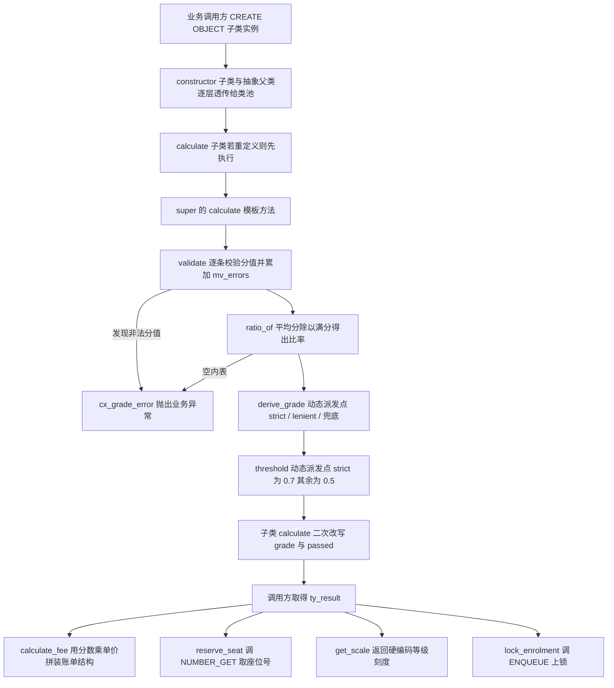
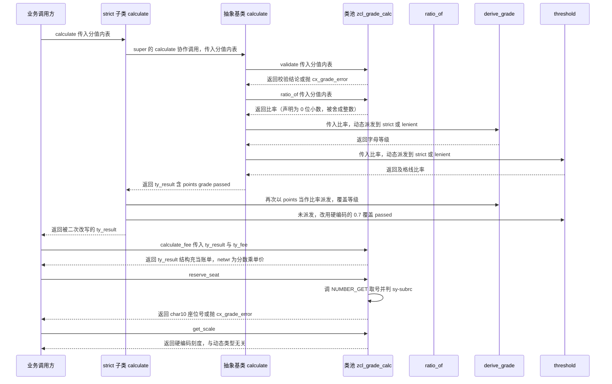

# ZCL_GRADE_CALC 成绩计算类 —— Onboarding 分析报告

> 分析对象：`zcl_grade_calc.clas.abap`（类池程序，含抽象基类 + 2 个子类）
> 阅读目标：搞清楚继承结构、多态在哪里真正生效、以及严格评级（strict）的判定逻辑是否成立。

---

## 一、程序定位与业务背景

### 1.1 业务问题

学校/培训中心需要给学生算分并给出等级。规则本身很朴素：把一个学生的一堆科目分数换算成"比率"，再按比率落到 A+/A/B/C/D/F 某一档。麻烦的是——**不同业务线对"严格程度"的定义不一样**：

- 某个专业要求严：90 分才算 A+，80 分才算 A，其余一律 F；
- 另一个专业口径松：60 分给个 C，其余给 D（注意：这个业务方甚至不需要区分 A/B）；
- 还有兜底口径：80 分给 B，其余给 C。

如果按传统做法，会写三个独立函数 `z_calc_strict()` / `z_calc_lenient()` / `z_calc_default()`，调用方到处 `CASE gv_policy.` 分支——每新增一种口径就改一次调用方，改漏一处就是一个线上事故。

**现有方案为什么不够**：评分规则的分叉点是"同一个算法骨架里的两个参数**取值规则**"（比率→等级的映射、以及及格线），而不是整个算法。分叉点在算法内部、在一个函数里换 `IF` 最省事，但无法用引用统一表达"我就是要一个严格评分器"。所以需要模板方法（Template Method）+ 动态派发（Dynamic Dispatch）的组合：**算法骨架固定、分叉点开放、调用方只认一个抽象引用**。

### 1.2 设计范式定性（一句话）

这是一个**以类池为"能力提供层"、以抽象基类 `zcl_grade_abc` 为"模板方法骨架"、以 `derive_grade` / `threshold` 两个钩子为"策略注入点"的三层 OO 评分器**。

层次自上而下实际是 4 层而不是注释里说的 3 层：

```
cx_root                      （ABAP 所有异常类的隐式祖先）
  └─ cx_static_check
       └─ cx_grade_error     异常类：承载"输入非法 / 业务失败"
zcl_grade_calc               类池（ABSTRACT）：类型 + 共用非评分逻辑 + 默认兜底实现
  └─ zcl_grade_abc           抽象基类（ABSTRACT）：模板方法 calculate + 钩子 threshold
       ├─ zcl_grade_strict   策略一：严格（FINAL）
       └─ zcl_grade_lenient  策略二：宽松（FINAL）
```

> 注：`CLASS-POOL zcl_grade_calc. ... ABSTRACT` 使类池不可实例化；继承自抽象类的类**本身也是抽象的**，所以 `zcl_grade_abc` 的 ABSTRACT 一半是显式声明、一半是继承来的。真正能被 `CREATE OBJECT` 的只有 `FINAL` 的两个子类。

---

## 二、程序执行流程总览

### 2.1 流程总览图



### 2.2 责任链表

| 子程序 | 调用者 | 职责 |
|---|---|---|
| `constructor`（类池实现） | `zcl_grade_abc->constructor` 经 `super->` 调用 | 把 `iv_max_points` 兜底成 100，清零 `mv_errors` |
| `constructor`（`zcl_grade_abc`） | `zcl_grade_strict->constructor` 经 `super->` 调用 | 纯透传，把满分继续往上传 |
| `constructor`（`zcl_grade_strict`） | 业务调用方 `CREATE OBJECT` | 纯透传，无任何额外初始化 |
| `calculate`（`zcl_grade_strict`） | 业务调用方 | 先调父类模板，拿回结果后**再改写一次** grade 与 passed |
| `calculate`（`zcl_grade_abc`） | `zcl_grade_strict->calculate` 经 `super->` 调用 | 模板方法：校验 → 算比率 → 装 points → 派发 grade → 派发 threshold 判 passed |
| `validate`（类池） | `zcl_grade_abc->calculate` | 逐条检查分值，把非法条数累加进 `mv_errors` |
| `ratio_of`（类池） | `zcl_grade_abc->calculate` | 平均分 ÷（科目数 × 满分）得到比率，空内表抛异常 |
| `derive_grade`（三个实现） | `zcl_grade_abc->calculate` 与 `zcl_grade_strict->calculate` | **唯一的动态派发点**，比率→字母等级 |
| `threshold`（两个实现） | `zcl_grade_abc->calculate` | 动态派发，返回及格线比率 |
| `calculate_fee`（类池） | 业务调用方 | 拿成绩结构与费率结构拼出一个"账单"结构 |
| `reserve_seat`（类池） | 业务调用方 | 调 `NUMBER_GET` 取号，拼成 `SEATxxxx` 座位号 |
| `get_scale`（类池） | 业务调用方 | 返回等级刻度字符串 |
| `lock_enrolment`（类池） | **全文无调用者** | 调 `ENQUEUE_ZGRADE_ENROL` 上锁并回传加锁标志 |
| `cx_grade_error->constructor` | 四处 `RAISE EXCEPTION` | 构造业务异常 |

下面按这条流程，再按继承层次逐个展开。

---

## 三、分组分析（按继承层次）

本节共 10 组：类池定义段 → 异常类 → 抽象基类（定义 + 实现）→ strict 子类（定义 + 实现）→ lenient 子类（定义 + 实现）→ 类池实现段 → 最后一组专门串讲多态分发路径。

### 3.1 类池定义段 `zcl_grade_calc`

本节分三步：类型定义、公共方法签名、保护/私有段声明。

#### ① 类型定义

```abap
CLASS-POOL zcl_grade_calc.

PUBLIC
ABSTRACT
CREATE PUBLIC.

  PUBLIC SECTION.

    TYPES: BEGIN OF ty_result,
             grade     TYPE string,
             points    TYPE p DECIMALS 2,
             passed    TYPE abap_bool,
             netwr     TYPE netwr,
             waers     TYPE waers,
           END OF ty_result.

    TYPES: BEGIN OF ty_fee,
             fee_id   TYPE char4,
             netpr    TYPE netpr,
             waers    TYPE waers,
             waerk    TYPE waerk,
           END OF ty_fee.

    TYPES ty_result_tab TYPE STANDARD TABLE OF ty_result WITH EMPTY KEY.
```

**做什么** — 声明两个平铺结构：`ty_result` 同时承载评分结果（`grade` / `points` / `passed`）与金额字段（`netwr` / `waers`）；`ty_fee` 承载计费要素（费率 ID、`netpr` 单价、`waers` 文档币种、`waerk` 价格单位币种）；再声明一个未使用的表类型。

**为什么** — 把类型提到 PUBLIC 段，让三个子类与所有调用方共用一份契约，避免每个调用方各自 `CREATE OBJECT` 一堆匿名结构。`netwr` / `netpr` / `waers` / `waerk` 全部用标准 SAP 数据元素而非 `f` / `char10`，是为了让 ABAP 单位/金额换算、字段帮助（F1）、ALE 序列化都走标准通道——这一点方向是对的。

**风险与改进** — 🔴 `ty_result` 把**评分域**（等级/分数/是否通过）和**金额域**（净额/币种）塞进同一个结构，这直接为 `calculate_fee` 的语义错配埋下了伏笔（见 3.9 ⑥）。评分结果和账单是两个生命周期完全不同的实体，`grade` 字段被塞进"账单"只是因为"只有一个结构可用"。建议拆成 `ty_score_result`（`grade` / `points` / `passed`）与 `ty_bill`（`netwr` / `waers` / `fee_id`）。🟡 `ty_result_tab` 全文未被引用，要么接上批量评分入口（`calculate_tab`），要么删掉——留着一个没人用的表类型，下一个人会以为已经有批量能力。

#### ② 公共方法签名

```abap
    METHODS constructor
      IMPORTING iv_max_points TYPE p
      OPTIONAL.

    METHODS calculate
      IMPORTING it_scores    TYPE STANDARD TABLE OF p WITH EMPTY KEY
      RETURNING VALUE(rs_result) TYPE ty_result
      RAISING   cx_grade_error.

    METHODS calculate_fee
      IMPORTING is_result    TYPE ty_result
                is_fee       TYPE ty_fee
      RETURNING VALUE(rs_bill) TYPE ty_result
      RAISING   cx_grade_error.

    METHODS reserve_seat
      RETURNING VALUE(rv_seat) TYPE char10
      RAISING   cx_grade_error.

    METHODS get_scale
      RETURNING VALUE(rs_scale) TYPE string.
```

**做什么** — 声明 5 个公共入口：构造（可选传满分）、算分（分值内表进、成绩结构出、声明抛业务异常）、计费（成绩 + 费率 → 账单）、取座位号、取等级刻度。

**为什么** — 把"算分"作为唯一带异常声明的核心入口（`RAISING cx_grade_error`），其余公共能力面向基础设施，接口面窄、可测性好。`constructor` 用 `OPTIONAL` 允许调用方不传满分，是"默认值收敛到构造函数"而非"收敛到每个使用点"的正确做法。

**风险与改进** — 🟡 `iv_max_points TYPE p` 没写小数位，`TYPE p` 等价于 `TYPE p(8,0)`，**0 位小数**，调用方连 `100.5` 都传不进来（会在调用点被舍成 100），而内部 `mv_max_points` 却是 `p DECIMALS 2`，契约前后不一致。🟡 `calculate_fee` 声明了 `RAISING cx_grade_error` 却全篇不抛，等于给所有调用方白白加了一层被迫的异常处理；要么真加校验（例如 `netpr` 为 0 或负数时抛），要么去掉声明。🟡 `reserve_seat` 返回 `char10` 定长字符，与 `lock_enrolment` 的 `iv_student TYPE char10` 同宽但语义无关（一个是座位号一个是学号），定长字符 + 同宽度是典型的误传温床，建议用不同的 domain 或 DDIC 元素区分。

#### ③ 保护段与私有段声明

```abap
  PROTECTED SECTION.

    DATA mv_max_points TYPE p DECIMALS 2.
    DATA mv_errors     TYPE i.

    METHODS validate
      IMPORTING it_scores TYPE STANDARD TABLE OF p WITH EMPTY KEY
      RAISING   cx_grade_error.

    METHODS derive_grade
      IMPORTING iv_ratio TYPE p
      RETURNING VALUE(rv_grade) TYPE string
      PROTECTED.

    METHODS lock_enrolment
      IMPORTING iv_student TYPE char10
      RETURNING VALUE(rv_locked) TYPE abap_bool.

  PRIVATE SECTION.

    METHODS ratio_of
      IMPORTING it_scores TYPE STANDARD TABLE OF p WITH EMPTY KEY
      RETURNING VALUE(rv_ratio) TYPE p
      RAISING   cx_grade_error.
```

**做什么** — 存放两个实例属性（满分、错误计数）、三个 protected 方法（校验、等级派生、加锁）与一个 private 方法（比率计算）。

**为什么** — protected 让"子类可复用、调用方不可见"，private 收紧到只有本类能用——这是教科书式的可见性划分意图。

**风险与改进** — 🔴 `mv_errors` 被当成**方法内的临时计数变量**放在了实例属性里。`validate` 只做累加、从不清零，清零只发生在 `constructor`。后果是：这个对象实例一旦喂过一次非法分值，**之后所有合法调用都会被 `IF mv_errors > 0` 拦下并抛异常**，对象从此"中毒"，只有重建实例才能恢复。局部计数就应该是局部变量。🔴 `ratio_of` 声明在 PRIVATE 却在抽象子类 `zcl_grade_abc` 的 `calculate` 里被调用——按 ABAP 可见性规则，父类 private 成员对子类不可见（唯一例外是父类 private 构造器可由子类 `super->` 调用），这份源码在真实系统激活时很可能直接报可见性/语法错误（建议用 ATC 或系统激活实测确认）；无论能否通过，正确做法都是把 `ratio_of` 提升为 PROTECTED，因为模板方法本来就必须跨类调用它。🟠 `derive_grade` 里的 `PROTECTED.` 是冗余的——它已经在 PROTECTED SECTION 里了，再写一次不改变任何可见性，属于噪音。🟡 `lock_enrolment` 全文无调用者，是死代码。

### 3.2 异常类 `cx_grade_error`

本节分两步：定义段、实现段。

#### ① 定义段：只加了一个可选文本参数

```abap
CLASS cx_grade_error DEFINITION PUBLIC INHERITING FROM cx_static_check.
  PUBLIC SECTION.
    CONSTRUCTORS:
      constructor IMPORTING iv_text TYPE string OPTIONAL.
ENDCLASS.
```

**做什么** — 从 `cx_static_check` 派生一个业务异常，唯一的新增能力是构造时接收一个可选文本 `iv_text`。

**为什么** — `cx_static_check` 是"可检查异常"（checked exception），必须被 `CATCH cx_grade_error` 显式捕获或在 `RAISING` 子句里声明——这正是我们想要的：输入非法必须让调用方面对，不能被静默吞掉。相比 `cx_no_check`（可被运行时隐式抛出、调用方常漏处理），这是正确选择。

**风险与改进** — 🟠 异常类没有重定义 `get_text`（或 `if_message~get_text`），也没有走 `cx_static_check` 的 `TEXTID` 机制，异常文本的唯一入口就是这个 `iv_text`，而它下一步就被丢弃了（见 3.2 ②）。🟡 `iv_text` 是 `OPTIONAL` 的，意味着调用方可以永远不给文本——目前四个抛出点就全部没给。

#### ② 实现段：文本参数被静默丢弃

```abap
CLASS cx_grade_error IMPLEMENTATION.
  METHOD constructor.
    super->constructor( ).
  ENDMETHOD.                    "constructor
ENDCLASS.                       "cx_grade_error"
```

**做什么** — 构造函数什么都不做，只是 `super->constructor( )` 一路往上抛给 `cx_static_check` → `cx_root`，**`iv_text` 从未被使用**。

**为什么** — 作者的意图应该是"把 `iv_text` 通过 `super` 传上去"，但 `cx_static_check` 的构造参数是 `TEXTID` / `PREVIOUS` 这类固定签名，没有一个能直接塞字符串，于是需要显式赋值 `text = iv_text`（`text` 是 `cx_root` 的公有属性）。这一步没写。

**风险与改进** — 🟠 这是全类最"安静"的缺陷：编译器不会报错，所有异常照常抛出，程序照常跑，但 SE80 里点开任何一次异常对象，`Text` 属性都是空的，message 字段是 `???`。**排查线上问题时你会失去唯一的信息载体**。修法二选一：`DATA(text) = iv_text.` 或按 message class 建 `TEXTID` 常量并改用 `RAISING EXCEPTION TYPE cx_grade_error`。同时四个抛出点应至少把"哪一条分值不合法""内表为空"写进文本。

### 3.3 抽象基类 `zcl_grade_abc` 定义段

本节分两步：公共重定义、保护钩子声明。

#### ① 公共方法重定义

```abap
CLASS zcl_grade_abc DEFINITION PUBLIC ABSTRACT CREATE PUBLIC.

  PUBLIC SECTION.
    METHODS constructor REDEFINITION.
    METHODS calculate  REDEFINITION.

  PROTECTED SECTION.
    METHODS threshold
      IMPORTING iv_ratio TYPE p
      RETURNING VALUE(rv_value) TYPE p.
ENDCLASS.
```

**做什么** — 声明抽象基类：把继承来的 `constructor` 和 `calculate` 显式标为 `REDEFINITION`（表示"我要重写它们"），并在 PROTECTED 段新增一个钩子方法 `threshold`。

**为什么** — `REDEFINITION` 的显式声明让继承关系在源码里可见（否则读者要靠实现段里有没有 `METHOD` 关键字反推）；`threshold` 放在 PROTECTED 是因为它既是模板方法要用的，又不应该暴露给调用方——调用方问的是"你算出来的 passed 是什么"，不是"你的及格线是多少"。

**风险与改进** — 🔴 **这个"抽象基类"里没有任何一个 `ABSTRACT` 方法**。`derive_grade` 在类池里给了一个具体实现，`threshold` 也给了具体实现，所以 `zcl_grade_abc` 的抽象性完全来自"父类是抽象的"这一条继承规则，而不是来自"这里有个必须被实现的钩子"。后果：新增第三个子类时，如果作者忘了写 `derive_grade`，编译器一声不吭，对象照常实例化，所有学生的等级**静默变成兜底实现的 `'C'`**。真正想用模板方法，就该把 `derive_grade` 写成 `METHODS derive_grade ... ABSTRACT`（定义段声明 ABSTRACT、实现段不写实现），让扩展点在类型系统里强制成立。🟠 `calculate REDEFINITION` 的签名与父类完全相同——重定义却什么都不改，属于纯声明噪音，会误导读者以为这里有行为差异。

#### ② 保护钩子 `threshold` 的声明（与 `derive_grade` 的不对称）

**做什么** — 只声明了 `threshold` 这一个钩子，而另一个钩子 `derive_grade` 仍然"继承"自类池。

**为什么** — 作者显然想让 `threshold` 成为可重定义的策略点，这样子类只要改及格线就够了，不用碰 `calculate`。这个思路本身是对的。

**风险与改进** — 🟠 这里暴露了**钩子契约的不对称**：`derive_grade` 是"业务必需但没人强制"，`threshold` 是"可选覆盖"。两个钩子一个可选一个必需（实际必需），却没有一个在签名层面标出来，读者只能靠读实现段才知道哪个必须写。建议把两个都显式 `ABSTRACT`，或者在类注释里写死"子类 MUST 重定义 derive_grade"。🟠 `threshold` 的入参 `iv_ratio` 在两个实现里都完全没被用到（strict 的实现先调父类再覆盖，父类直接 `rv_value = 0.5`）。一个永远不被读的参数，会让子类作者以为"我可以在 threshold 里按比率动态给出及格线"，实际上做不到。

### 3.4 抽象基类 `zcl_grade_abc` 实现段（模板方法本体）

本节分四步：构造透传、模板方法的前两步（校验 + 算比率/装分数）、后两步（派发等级、派发及格线）、`threshold` 实现。

#### ① 构造函数：纯透传

```abap
  METHOD constructor.
    super->constructor( iv_max_points = iv_max_points ).
  ENDMETHOD.                    "constructor
```

**做什么** — 不做任何初始化，只把 `iv_max_points` 原样传给类池构造函数，由类池完成兜底与清零。

**为什么** — 标准做法：把状态的初始化集中在一处（类池），中间层不重复初始化，避免"到底哪一层该把 0 变成 100"这种责任漂移。

**风险与改进** — 🟡 这一层没有任何实际内容，可以直接删掉 `constructor REDEFINITION` 与这个方法（类池构造器会被自动继承调用）。保留它的代价是读者要多读 6 行才能确认"哦它什么都没做"。顺带提醒：由于 `iv_max_points TYPE p` 是 0 位小数，构造器里的"满分"事实上只能是整数。

#### ② 模板方法第一步与第二步：校验 → 比率 → 分数

```abap
  METHOD calculate.

    validate( it_scores ).

    DATA lv_ratio TYPE p DECIMALS 4.
    lv_ratio = ratio_of( it_scores ).

    rs_result-points  = lv_ratio * mv_max_points.
    rs_result-grade   = derive_grade( iv_ratio = lv_ratio ).
    rs_result-passed  = COND #( WHEN lv_ratio >= threshold( iv_ratio = lv_ratio )
                                THEN abap_true ELSE abap_false ).

  ENDMETHOD.                    "calculate
```

**做什么** — 固定三段式流程：先 `validate` 抛错则终止；再 `ratio_of` 把分值内表折算成一个比率；然后把比率乘满分装进 `points`，把比率交给 `derive_grade` 换字母等级，把比率与 `threshold` 比较得到 `passed`。

**为什么** — 这是标准的模板方法：骨架（流程次序、公式、字段装配）写死在基类并 `FINAL` 化策略边界，变化点（等级映射、及格线）交给子类钩子。**算法骨架与策略分离开得干净**，`points = 比率 × 满分` 这个公式放在基类而不是子类，保证两个口径算出同样的分数、只有等级不同——这正是业务想要的"同一份成绩，不同口径评级"。`COND #(...)` 写布尔判定也比 `IF ... ENDIF.` 更紧凑。

**风险与改进** — 🔴 ②③ 两条真正的地雷都在这一段的参数传递上：`ratio_of` 的返回参数声明为 `TYPE p`（**0 位小数**），比率 `0.8333` 赋进去会被**舍成 1**。于是 `lv_ratio` 拿到 1.0000，`points` 变成 `1 × 100 = 100.00`（一个 83 分的学生算出满分），`derive_grade( 1 )` 也永远匹配不上 `WHEN 0.9` / `WHEN 0.8`。也就是说**"比率"这个量在这套代码里事实上只有 0 和 1 两个取值**，所有等级判定分支都是死代码（详见 3.10 的完整 trace）。这是全类最严重的问题，且症状极具迷惑性——分数看起来"很好"，等级却恒为 `F`。修法：`ratio_of` 的返回类型与 `derive_grade` 的 `iv_ratio` 都显式写成 `TYPE p DECIMALS 4`，或统一改用 `abap_dec(15,4)`。🟠 ③ `rs_result-points` 只赋值了 `points` / `grade` / `passed` 三个字段，`netwr` / `waers` 保持 initial——结构体返回值没有 `CLEAR`，虽然返回参数在 ABAP 里不会被继承上一次的旧值（返回参数始终是全新的），但如果将来有人改成往 `rs_result` 上挂更多字段，很容易误以为"没赋值就是沿用旧值"。🟡 `threshold` 的入参传了 `lv_ratio` 却没人读（见 3.3 ②）；`COND #( ... )` 的 `abap_true` / `abap_false` 在条件表达式里可以直接写 `TRUE` / `FALSE`，不必显式带类型前缀。

#### ③ `threshold` 实现：与比率无关的常量

```abap
  METHOD threshold.
    rv_value = 0.5.
  ENDMETHOD.                    "threshold
```

**做什么** — 不管传入什么比率，一律返回 `0.5` 作为及格线。

**为什么** — 基类给一个中性默认值（"六十分及格"），让不重定义 `threshold` 的子类（也就是 `zcl_grade_lenient`）有合理兜底。这是模板方法的常规写法，本身没问题。

**风险与改进** — 🟠 `rv_value` 同样是 `TYPE p`（0 位小数），`0.5` 会被舍成 `1`（或 `0`，取决于舍入方向）——**及格线也不是 0.5 了**。而 `calculate` 里是拿 `lv_ratio`（整数化后的 0 或 1）去和它比，所以 `passed` 的真实判定是"比率是否非零"，一个 1 分的差等生会 `passed = TRUE`。这个问题和 ② 的根因是同一个（`TYPE p` 漏写小数位），但它让"及格判定"这个第二根支柱也塌了，必须一起改。🟡 `iv_ratio` 完全未用（形同虚设的参数）；`0.5` 是魔法数字，若要按口径配置，应提到类属性或配置表里。

### 3.5 子类 `zcl_grade_strict` 定义段

本节分两步：公共重定义、保护钩子重定义。

#### ① 公共重定义声明

```abap
CLASS zcl_grade_strict DEFINITION PUBLIC INHERITING FROM zcl_grade_abc
  FINAL
  CREATE PUBLIC.

  PUBLIC SECTION.
    METHODS constructor REDEFINITION.
    METHODS calculate  REDEFINITION.

  PROTECTED SECTION.
    METHODS derive_grade REDEFINITION.
    METHODS threshold    REDEFINITION.
ENDCLASS.
```

**做什么** — 声明严格评分器：`FINAL` 封死继续继承，公共段重定义 `constructor` 与 `calculate`，保护段重定义 `derive_grade` 与 `threshold`。

**为什么** — `FINAL` 是正确的收口选择：口径类不允许被别人再"继承出第四种口径"，多态应该发生在**引用侧**（一个 `lref_zcl_grade_abc` 指向不同对象），而不是发生在继承树上无限深挖。重定义两个钩子 = 策略组合（严格等级 + 严格及格线）。

**风险与改进** — 🔴 **`calculate REDEFINITION` 是这份类里所有多态混乱的总源头**。既然 `derive_grade` 和 `threshold` 已经是钩子，父类的 `calculate` 通过动态派发已经能正确得到严格口径的 grade 与 passed——子类**根本不需要重定义 `calculate`**。一旦重定义，作者就必须手工复刻父类的装配逻辑（`super->calculate` 之后再改字段），而这个"复刻"正是 bug 的温床（见 3.6 ②）。正确做法：删掉 `zcl_grade_strict` 的 `calculate` 重定义，只保留两个钩子重定义——多态才真正生效。🟡 `constructor REDEFINITION` 同样是无行为改变的样板（见 3.6 ①），可删。

#### ② 保护钩子重定义声明（与 lenient 的对照）

**做什么** — 两个钩子都以 `REDEFINITION` 重声明。

**为什么** — 严格口径的定义就是"等级门槛更高 + 及格线更高"，两个钩子正好一一对应。

**风险与改进** — 🟠 注意与 `zcl_grade_lenient` 的对照（3.7）：lenient **只重定义了 `derive_grade`，没有重定义 `threshold`**。于是 lenient 的"等级刻度"（C/D）和"及格线"（0.5）来自两个互不相干的定义，没有任何人保证它们一致。两个子类的继承结构不对称，会让读代码的人误以为"钩子是可以随便重定义的"，从而写出一堆互相矛盾的口径。建议要么两个子类都重定义两个钩子，要么在基类里把"等级 → 是否通过"的关系收进一张映射表，让钩子只产等级、`passed` 由映射表推导。

### 3.6 子类 `zcl_grade_strict` 实现段（严格口径）

本节分四步：构造透传、`calculate` 的父类协作调用、`calculate` 的二次改写（bug 现场）、`derive_grade` 与 `threshold` 实现。

#### ① 构造函数：纯透传

```abap
  METHOD constructor.
    super->constructor( iv_max_points = iv_max_points ).
  ENDMETHOD.                    "constructor
```

**做什么** — 把满分透传给抽象父类构造函数。

**为什么** — 保持"初始化只在类池做一次"的约定。

**风险与改进** — 🟡 零收益样板。若将来需要给严格口径加初始化状态（比如"及格线可外部配置"），这里是正确的落点；在当前版本它只是让继承链看起来比实际更长。建议删除。

#### ② `calculate` 第一段：协作式父类调用

```abap
  METHOD calculate.

    super->calculate(
      IMPORTING it_scores    = it_scores
      RECEIVING rs_result    = DATA(ls_result)
      EXCEPTIONS cx_grade_error = 1 ).

    IF sy-subrc = 1.
      RAISING cx_grade_error.
    ENDIF.
```

**做什么** — 调用父类模板方法，把返回结果接进内联声明的局部结构 `ls_result`；如果父类抛了业务异常，捕获后立刻重新抛出一个新的同名异常。

**为什么** — 这是 ABAP 里的"协作式（cooperative）继承"写法：父类方法声明了 `RAISING cx_grade_error`，子类调用时**必须**显式列出 `EXCEPTIONS`，不能像普通方法那样让异常自由穿透。因此子类想改变异常行为就得显式拦截再处理——机制本身是对的。

**风险与改进** — 🟠 异常被"吞掉再重建"：原始异常对象（未来会携带的文本、上下文）被丢弃，重新 `RAISING cx_grade_error` 抛出一个全新空异常。再叠加 3.2 ② 的"构造器丢弃 `iv_text`"，调用方捕获到的异常**没有任何信息**。若要保留上下文，应捕获后把 `ls_err->text` 传给新异常，或改成包装语义（`message` 里带上原文本）。🟡 `IF sy-subrc = 1` 只判断了"恰好第 1 个异常被触发"；虽然此处 `cx_grade_error` 是唯一列出的异常、写法能跑，但更稳妥的是 `EXCEPTIONS cx_grade_error = 1` 后直接 `CATCH` 块，或至少对未列举异常（`OTHERS`）留一条兜底路径。

#### ③ `calculate` 第二段：把分数当比率再算一次（🔴 核心 bug）

```abap
    rs_result-grade  = derive_grade( iv_ratio = rs_result-points ).
    rs_result-passed = COND #( WHEN rs_result-points >= mv_max_points * 0.7
                               THEN abap_true ELSE abap_false ).

  ENDMETHOD.                    "calculate
```

**做什么** — 拿父类返回的 `rs_result` 做两件事：把 `rs_result-points`（**分数**，例如 `100.00`）当作比率传给 `derive_grade` 重算等级；再自己用 `分数 >= 满分 × 0.7` 重算 `passed`。

**为什么（作者的意图）** — 作者显然想让严格口径的 `passed` 用 0.7 而不是父类的 0.5。但他选择的做法是**在子类里重写字段**，而不是通过重定义 `threshold` 钩子让父类模板去算。

**风险与改进** — 🔴 **两处硬伤，且互相独立：**
1. **单位错位（最致命）**：`derive_grade` 的 `iv_ratio` 期望的是 `[0,1]` 区间的**比率**，父类在 117 行正是这样调的（`derive_grade( iv_ratio = lv_ratio )`）。这里却传了 `points`——满分 100 时 `points` 是 `0.00 ~ 100.00` 的分数。两者的**量纲差了 100 倍**，而 `derive_grade` 内部用 `WHEN 0.9` / `WHEN 0.8` 做**精确等值匹配**（不是区间比较），所以 `100.00` 永远匹配不上 `0.9`/`0.8`，直接落到 `WHEN OTHERS → 'F'`。**严格评分器对任何学生都返回 `F`，无一例外。**
2. **重复计算 + 真相分裂**：`grade` 被算了两遍（父类钩子一次、子类一次，第二次覆盖第一次），`passed` 被算了两遍（父类 `threshold` 动态派发一次、子类硬编码 `0.7` 一次）。于是**同一个 `0.7` 在代码里存在两份**——`threshold` 方法里一份、`calculate` 的魔法数一份。将来有人把 `threshold` 改成 `0.75`，`passed` 会分裂成"两次判定不同"的诡异状态。
3. **输出自相矛盾**：`passed = TRUE` 但 `grade = 'F'`，业务上无法解释（没及格却通过）。
4. 顺带：`rs_result-points >= mv_max_points * 0.7` 这个改写在数学上与"比率 >= 0.7"等价（前提 `mv_max_points > 0`，见 3.9 ① 的负数漏洞），所以它**掩盖了**上面的单位错位——让人误以为"子类这段是对的，只是少了个除法"。修法：删除 `zcl_grade_strict` 的整个 `calculate` 重定义，只保留 `derive_grade` 与 `threshold` 两个钩子重定义。

#### ④ `derive_grade` 与 `threshold` 实现

```abap
  METHOD derive_grade.
    CASE iv_ratio.
      WHEN 0.9.
        rv_grade = 'A+'.
      WHEN 0.8.
        rv_grade = 'A'.
      WHEN OTHERS.
        rv_grade = 'F'.
    ENDCASE.
  ENDMETHOD.                    "derive_grade
```

```abap
  METHOD threshold.
    super->threshold( iv_ratio = iv_ratio ).
    rv_value = 0.7.
  ENDMETHOD.                    "threshold
```

**做什么** — `derive_grade`：比率精确等于 0.9 给 `A+`、精确等于 0.8 给 `A`、其余一律 `F`（三档，无 B/C/D）。`threshold`：先调父类实现，再把返回值覆盖成 `0.7`。

**为什么** — 三档等级对应"严进严出"的教学口径，这是业务能接受的**等级数量**；`threshold` 里先调 `super->` 是很多 ABAP 教程推荐的"扩展父类实现"写法，作者大概是照着模板抄的。

**风险与改进** — 🔴 **`CASE ... WHEN` 在 ABAP 里是精确等值比较，不是区间比较**，这是严格评级判定逻辑的第二个独立缺陷（第一个是 ③ 的单位错位，第三个是 3.4 ② 的 0 位小数把分支变成死代码）。三个缺陷任意一个单独存在，严格评级就已经是坏的；三个叠在一起，结果是 `grade` **恒为 `'F'`**。即使把前两个都修好，只要还用 `WHEN 0.9`，一个真实比率 `0.88` 依然落到 `OTHERS → 'F'`——只有刚好等于 0.9000 的学生才拿得到 `A+`。必须改成区间判定：`IF iv_ratio >= 0.9 ... ELSIF iv_ratio >= 0.8 ... ELSE ...`，或者干脆用 `VALUE #( CASE iv_ratio WHEN FIRST_STEP ... )` 的区间表。更进一步，业务上应该存在"分数段 → 等级"的可配置表（`0.9+ → A+`、`0.8~0.9 → A`、`0.7~0.8 → B`、`< 0.7 → F`），而不是把等级硬编码在方法体里。🟠 `threshold` 里的 `super->threshold( iv_ratio = iv_ratio )` 是**死代码**：父类实现只是 `rv_value = 0.5`，无副作用，返回值随即被覆盖。这会误导读者以为父类逻辑参与了严格口径的判定。正确写法是直接 `rv_value = 0.7`，或反过来让父类 `threshold` 变成"返回及格线"的唯一来源、strict 不重定义它。🟠 等级刻度只有 3 档而及格线有 0.7，意味着 `[0.7, 0.8)` 区间的学生等级是 `F` 但 `passed = TRUE`，业务上必须解释"F 为什么算通过"——通常应该有一个专门的"及格但等级为 F"的档位（如 `D` 或 `F-`）。🟡 `'A+'` / `'A'` / `'F'` 是硬编码字面量，与 `get_scale` 的返回串、未来的多语言需求都没有打通。

### 3.7 子类 `zcl_grade_lenient` 定义段

本节一步：单钩子重定义声明（并与 strict 做继承结构对照）。

#### ① 只重定义一个钩子

```abap
CLASS zcl_grade_lenient DEFINITION PUBLIC INHERITING FROM zcl_grade_abc
  FINAL
  CREATE PUBLIC.

  PUBLIC SECTION.
    METHODS derive_grade REDEFINITION.
ENDCLASS.
```

**做什么** — 宽松评分器只重定义了 `derive_grade`，没有重定义 `threshold`、没有重定义 `calculate`、连 `constructor` 都没碰。

**为什么** — 这是"最小覆写"的正确姿势：如果宽松口径只是"等级名字不同"，那确实只需要换一个映射表，模板方法、及格线、构造器全部复用。这个类比 strict 干净得多，也正是多态应该有的样子。

**风险与改进** — 🟠 但它也暴露了基类契约的漏洞：宽松口径继承到的 `threshold = 0.5`（六十分及格），而它的等级刻度只有 `'C'` / `'D'` 两档。于是出现语义断层：一个比率 `0.55` 的学生得到等级 `D`、`passed = TRUE`。**"D 却算通过"** 在业务上说不通，说明"等级刻度"和"及格线"这两件事被分在了两个钩子里，却没有约束它们必须自洽。修法：把等级表设计成"区间 → (等级, 是否通过)"的一体化配置，或者至少让 `passed` 由等级表推导而不是独立的 `threshold` 常量。🟡 `derive_grade` 声明在 PUBLIC 段（因为父类的 `derive_grade` 在 PROTECTED 段，ABAP 要求重定义时不能放宽可见性……实际上这里声明在 PUBLIC 是**放宽**了可见性，属于不合规写法，需要在系统里激活验证；若确实允许，则它意外地把原本 protected 的钩子暴露成了公共方法）。这一点值得实测确认——如果编译器接受，说明这里存在一处不该有的可见性放宽，`lref->derive_grade( ... )` 将能被外部直接调用，绕过模板方法。

### 3.8 子类 `zcl_grade_lenient` 实现段

本节一步：`derive_grade` 实现。

#### ① `derive_grade`：高分反而得低等级

```abap
CLASS zcl_grade_lenient IMPLEMENTATION.

  METHOD derive_grade.
    CASE iv_ratio.
      WHEN 0.6.
        rv_grade = 'C'.
      WHEN OTHERS.
        rv_grade = 'D'.
    ENDCASE.
  ENDMETHOD.                    "derive_grade

ENDCLASS.                       "zcl_grade_lenient
```

**做什么** — 比率恰好等于 `0.6` 时给 `'C'`，**其他所有比率（无论多高）一律给 `'D'`**。

**为什么** — 宽松口径只区分"过线"与"未过线"两档，字母只是标签、不含排序含义——业务上勉强说得通（`C` = 过线，`D` = 未过线）。

**风险与改进** — 🔴 从"评分"这个语义看，`WHEN 0.6` 分支是**不可达的**：传入的 `iv_ratio` 因为 `TYPE p`（0 位小数）被舍成了 0 或 1（见 3.4 ②），永远不可能等于 `0.6`。所以宽松评分器实际上**恒返回 `'D'`**。🟠 即使修好精度，`WHEN OTHERS → 'D'` 的写法在语义上是**倒置**的：比率 0.95（很高）得到 `D`，比率 0.2（很低）也得到 `D`，等级失去了单调性。如果业务确实要两档，应该写成"`< 0.6 → D`，`>= 0.6 → C`"，让等级随分数单调变化；否则建议改用 `abap_bool` / 枚举而不是误导性的字母等级。🟠 与 3.7 ① 一致的问题：等级刻度与 `threshold = 0.5` 不自洽（`0.5 <= 比率 < 0.6` 的学生得 `D` 却 `passed = TRUE`）。🟡 没有 `constructor REDEFINITION`，说明这个子类确实是"纯策略"——这是四个类里写得最克制的一个。

### 3.9 类池实现段 `zcl_grade_calc`

本节最长，分八步：构造、`get_scale`、`validate`、`ratio_of`、兜底 `derive_grade`、`calculate_fee`、`reserve_seat`、`lock_enrolment`。

#### ① 构造：满分兜底

```abap
  METHOD constructor.
    mv_max_points = COALESCE( iv_max_points, 100 ).
    mv_errors     = 0.
  ENDMETHOD.                    "constructor
```

**做什么** — 把 `iv_max_points` 在"未传/为初始值"时兜底成 100，并把错误计数器清零。

**为什么** — `COALESCE` 写法干净，避免了 `IF iv_max_points IS INITIAL.` 的分支；同时保证 `mv_errors` 有确定初值。

**风险与改进** — 🔴 `COALESCE` 判的是"是否初始值"，而 `TYPE p` 的初始值就是 **0**，所以调用方**显式传 0 会被静默改写成 100**——一个"满分为 0"的调用方 bug 被代码吃掉了，症状是"所有学生都满分/都及格"，极难排查。🟠 负数满分完全放行：`iv_max_points = -100` 会让 `ratio_of` 算出负比率、`passed` 判为 `TRUE`、`points` 为负数金额，`calculate_fee` 再乘上单价得到负账单——一条完整的负数污染链路，且没有任何一处抛异常。构造器是唯一能拦住这类输入的地方，应显式校验 `iv_max_points > 0`，否则抛 `cx_grade_error`。🟡 `COALESCE` 在这里其实可以直接被 `VALUE #( )` 或构造参数的默认值替代；更现代的做法是把默认值放到类常量里（`CONSTANTS c_default_max_points TYPE p DECIMALS 2 VALUE 100.`），让"默认满分"成为可检索的显式契约。

#### ② `get_scale`：多态在这里断掉了

```abap
  METHOD get_scale.
    rs_scale = 'A+ A F'.
  ENDMETHOD.                    "get_scale
```

**做什么** — 返回一个写死的等级刻度字符串 `'A+ A F'`，所有动态类型都返回这一份。

**为什么** — 大概想让调用方能显示"本评分器支持哪些等级"，用于下拉框或报表表头。

**风险与改进** — 🔴 **这是整个多态设计的最大漏洞**：调用方拿到一个 `lref_zcl_grade_abc`，实际指向 `zcl_grade_strict` 时它得到 `'A+ A F'`（对的），指向 `zcl_grade_lenient` 时**仍然**得到 `'A+ A F'`（错的，实际只有 `C` / `D`）。原因和等级逻辑一样——它被定义在类池上、绕过了派生类型。既然已经有 `derive_grade` 这个钩子的经验，同样的处理方式完全适用：把 `get_scale` 声明为 `ABSTRACT`（或给每个子类一个受保护常量），让刻度随对象动态类型变化。🟡 用空格分隔的字符串表达刻度，调用方只能靠 `SPLIT` 解析；用 `ty_grade_tab` 之类的内表（`TYPE STANDARD TABLE OF string WITH EMPTY KEY`）才是可枚举、可本地化的表达。🟡 `'A+ A F'` 硬编码英文，若将来要支持多语言等级名，这里需要抽到配置或消息类。

#### ③ `validate`：重复条件 + 粘滞计数器

```abap
  METHOD validate.
    LOOP AT it_scores INTO DATA(lv_score).
      IF lv_score IS INITIAL OR lv_score IS INITIAL.
        mv_errors = mv_errors + 1.
      ENDIF.
    ENDLOOP.

    IF mv_errors > 0.
      RAISE EXCEPTION TYPE cx_grade_error.
    ENDIF.
  ENDMETHOD.                    "validate
```

**做什么** — 遍历分值内表，把"非法"的分值条数累加进 `mv_errors`；只要累计过一条就抛业务异常。

**为什么** — 意图是"一次性收集所有错误再抛"，而不是"遇到第一条就退出"，这对批量校验的体验是对的。

**风险与改进** — 🔴 **条件被抄了两遍**：`lv_score IS INITIAL OR lv_score IS INITIAL` 两侧完全相同，第二个子条件是**死代码**。从作者本意推断，右侧极可能原本想写 `lv_score > mv_max_points`（"分数超过满分"）或 `lv_score < 0`（"负分"）——也就是说**两类真实存在的脏数据检查从来没被写进去**。超满分会让比率 > 1（等级恒 `F` 但 `passed = TRUE`），负分会让比率变负，两者都不会抛异常。🔴 **计数器粘滞**：`mv_errors` 只在构造函数里清零，`validate` 只增不减。同一个对象实例只要被喂过一次非法分值，**之后每一次 `calculate`（哪怕分值完全合法）都会抛 `cx_grade_error`**。这是纯粹的实例状态污染，方法级临时状态放实例属性是这里最该改的一处——把 `mv_errors` 改成 `DATA lv_errors TYPE i.` 局部变量即可彻底消除。🟠 `IS INITIAL` 对 `TYPE p` 意味着"等于 0"，所以**正常的 0 分（缺考/未作答）被判为非法并抛异常**——业务上很可能需要区分"0 分"与"未录入"。🟠 异常不带任何上下文：不知道哪一条、哪个值非法，也不知道内表总长度。应至少把序号与值拼进文本（前提是先修好 3.2 ② 的文本通道）。🟡 只校验了值，**没有校验内表非空**——空内表会一路走到 `ratio_of` 才抛异常（见 3.9 ④），错误发生点离原因太远。

#### ④ `ratio_of`：精度塌陷 + 除数未校验

```abap
  METHOD ratio_of.
    DATA lv_sum   TYPE p DECIMALS 4.
    DATA lv_count TYPE i.

    lv_count = lines( it_scores );
    IF lv_count = 0.
      RAISE EXCEPTION TYPE cx_grade_error.
    ENDIF.

    LOOP AT it_scores INTO DATA(lv_score).
      lv_sum = lv_sum + lv_score.
    ENDLOOP.

    rv_ratio = lv_sum / ( lv_count * mv_max_points ).
  ENDMETHOD.                    "ratio_of
```

**做什么** — 统计科目数，空表抛异常；累加分值总和；最后算出 `比率 = 总分 / (科目数 × 满分)`。

**为什么** — 公式本身是对的：每门课的分数都是"满分制"，所以平均值 = `总分 / 科目数`，再除以满分就是 `[0,1]` 区间内的比率。中间量用 `p DECIMALS 4` 累积，也考虑到了除法精度。用 `lines( )` 一次拿到行数、避免在循环里累加计数，效率也没问题。

**风险与改进** — 🔴 **返回参数类型写成 `TYPE p`（0 位小数）是这个类最致命的单点缺陷**：`rv_ratio = lv_sum / ( lv_count * mv_max_points )` 计算出的 `0.8333` 在赋给 0 位小数的返回变量时会被**舍入成 `1`**。整条链路的连锁反应是：比率 → 0 或 1 → `derive_grade` 的 `WHEN 0.9` / `WHEN 0.8` 全部不可达（strict 恒 `F`）、`WHEN 0.6` 不可达（lenient 恒 `D`）、兜底 `WHEN 0.8` 不可达（恒 `C`）；`points = 比率 × 满分` 变成 `0` 或 `满分`；`threshold` 同样 0 位小数（`0.5 → 1`），`passed` 退化成"比率非零"。**评分器实际上已经退化成常量输出。** 修法：`RETURNING VALUE(rv_ratio) TYPE p DECIMALS 4`（并同步修 3.3 ② `iv_ratio`、`threshold` 的 `rv_value`/`iv_ratio`）。🟠 分母 `lv_count * mv_max_points` 未做零校验：`lv_count` 有前面的空表拦截，但 `mv_max_points` 为 0 的话（构造器 `COALESCE` 只把 0 变成 100，但若将来有人改成"允许 0"就会直通）会触发 `CX_SY_ZERODIVIDE`——那是**短文本运行时错误，不是 `cx_grade_error`**，会绕过所有 `CATCH cx_grade_error` 直接打 `ST22`。负满分同理（不会除零，但结果为负）。分母校验应放在构造器（见 3.9 ①）而不是这里。🟠 异常不带上下文（"分值内表为空"这句话应该写进 `iv_text`）。🟡 中间量 `lv_sum` 用 `p DECIMALS 4`，科目数很大时 `lv_count * mv_max_points` 有溢出边界，实际场景影响小。

#### ⑤ 兜底 `derive_grade`：静默的默认值

```abap
  METHOD derive_grade.
    CASE iv_ratio.
      WHEN 0.8.
        rv_grade = 'B'.
      WHEN OTHERS.
        rv_grade = 'C'.
    ENDCASE.
  ENDMETHOD.                    "derive_grade
```

**做什么** — 类池版本不存在的 `derive_grade` 时给出一个默认映射：`0.8 → 'B'`，其余 `'C'`。

**为什么** — 作者把它当作"新子类忘写钩子时的兜底"——这个**意图本身是有问题的**，但代码表达清楚了。

**风险与改进** — 🟠 这正是 3.3 ① 说的"抽象性只落在类标志上"的直接后果：因为 `derive_grade` 没有声明 `ABSTRACT`，编译器允许这个实现存在，于是"忘了写钩子"这个错误从**编译期错误**降级成了**运行期静默行为**（学生等级全是 `C`，没有任何报错）。静默兜底比编译失败危险得多——正确做法是把类池的这个实现删掉、方法声明为 `ABSTRACT`，让漏写变成激活失败。🟠 同样用精确等值 `WHEN 0.8`，在 0 位小数的 `iv_ratio` 下**永远不可达**，因此这个"兜底"实际恒返回 `'C'`。🟡 三套刻度（A+/A/F、B/C、C/D）互不相同且都硬编码在方法体里，没有任何一张统一的表——见 5.2 的 P1 建议。

#### ⑥ `calculate_fee`：🔴 语义错配最严重的一处

```abap
  METHOD calculate_fee.

    DATA lv_amount TYPE cuxy.

    rs_bill-grade  = is_result-grade.
    rs_bill-passed = is_result-passed.
    rs_bill-waers  = is_fee-waers.

    lv_amount = is_result-points * is_fee-netpr.

    rs_bill-netwr = lv_amount.

    rs_bill-waers = is_fee-waerk.

  ENDMETHOD.                    "calculate_fee
```

**做什么** — 把成绩结构里的等级与是否通过原样搬进"账单"结构；把文档币种先写进 `waers`；用 `成绩分数 × 费率单价` 得到一个金额写进 `netwr`；**然后又把 `waerk`（价格单位币种）覆盖写进 `waers`**。

**为什么（意图）** — 作者想做一个"按成绩打折/计费"的桥接：分数越高、单价越低之类的定价规则。

**风险与改进** — 🔴 **核心语义错配：`points * netpr` 得到的不是任何业务上成立的金额**。`NETWR` 是销售订单的**净订单值**，语义是"数量 × 单价"；`NETPR` 是**净单价**（每一单位多少钱）。这里缺了最关键的一环——**数量（`MENGE`）**。`ty_fee` 里只有 `fee_id` / `netpr` / `waers` / `waerk`，**没有任何数量字段和汇率字段 `KURS`**，所以这段代码在数学上不可能算出正确的订单净额。`points`（分数）不是数量，`0.83 × 3.50 = 2.905` 这个数在业务上没有任何含义，`CUXY`（2 位小数金额类型）也表达不了它。**能通过编译、能跑出结果，不代表它对**——这正是需要在评审阶段按数据元素语义（而不是长度/精度是否匹配）拦截的那类问题。修法：要么在 `ty_fee` 里补数量与汇率、按 `数量 × 单价 × 汇率` 计算，要么把 `calculate_fee` 从成绩类里摘出去，交给专门的 `zcl_fee_calc`。🔴 **币种被写错两次**：第 3 行 `rs_bill-waers = is_fee-waers`（文档币种）立刻被第 5 行 `rs_bill-waers = is_fee-waerk`（**价格单位币种**）覆盖，前一行是死代码。语义上 `WAERK` 是"价格单位所用币种"，它必须与 `KURS` 一起用于换算，绝不能直接充当账单币种——否则一个"以 EUR 定价、美元记账"的场景会被标成 EUR 币种的美元金额，账实不符。🔴 **结构体复用造成的语义污染**：`ty_result` 同时是"成绩"和"账单"，于是 `grade = 'F'` 被写进了一张叫 `rs_bill` 的结构里，而 `points` 字段在账单语境下从未赋值。调用方拿到这个结构无法判断哪些字段有意义。🟠 声明了 `RAISING cx_grade_error` 却一次都不抛：既没有对 `netpr <= 0` 的校验，也没有对乘积溢出的校验。🟡 `lv_amount` 用 `CUXY` 中转再赋给 `netwr`（`NETWR`）纯属多余，两次赋值之间没有任何转换或舍入需求。

#### ⑦ `reserve_seat`：🔴 成功判定用错了机制

```abap
  METHOD reserve_seat.

    DATA lv_next TYPE i.

    DO 5 TIMES.
      CALL FUNCTION 'NUMBER_GET'
        EXPORTING
          nrr        = 'ZGRADE'
          nrobject   = 'ZSEAT'
        IMPORTING
          number     = lv_next
        EXCEPTIONS
          buffer_overflow = 1
          internal_error = 2
          OTHERS         = 3.

      IF sy-subrc = 0.
        rv_seat = |SEAT{ lv_next ALPHA = OUT }|.
        RETURN.
      ENDIF.
    ENDDO.

    RAISE EXCEPTION TYPE cx_grade_error.
  ENDMETHOD.                    "reserve_seat
```

**做什么** — 最多尝试 5 次调用 `NUMBER_GET` 从号码段 `ZGRADE/ZSEAT` 取号；一旦 `sy-subrc = 0` 就拼成 `SEATxxxx` 返回；5 次都失败则抛异常。

**为什么（意图）** — 作者想处理"号码段缓冲耗尽"这类**瞬时性失败**，所以写了重试循环。

**风险与改进** — 🔴 **成功判定机制用错，代码实际从未重试**：`NUMBER_GET` 的号码段缓冲耗尽是通过 **`RETURNCODE` 参数**（1 = 缓冲耗尽，2 = 成功）返回的，**不是通过异常**。因此在"缓冲已耗尽"这种场景下，函数没有触发任何异常，`sy-subrc` 仍然是 `0`，代码走进"成功"分支，把一个**未初始化（`0`）或陈旧的** `lv_next` 拼成座位号返回——学生拿到了 `SEAT0000` 这种凭空捏造的座位，而且没有任何报错。同理，所列的 `buffer_overflow` / `internal_error` 也不是该 FM 的异常（它定义的是 `NO_INTERVAL` / `NO_NUMBER` / `NO_ROLLOVER` / `INTERVAL_EMPTY` / `NUMBER_RANGE_EMPTY` 一类号码段相关异常），这两个异常名永远不会被触发，**整个重试循环是死代码**。修法：`IMPORTING returncode = lv_rc`，判断 `lv_rc = 2` 为成功；`EXPORTING timeout = 1`（等 1 秒）让缓冲竞争有恢复机会。🔴 **重试策略本身也不对**：缓冲耗尽属于"需要人工扩号段"的持久性状态，不是瞬时错误，无退避的 5 次紧密重试既救不回来、又徒增锁竞争（而且从未传 `TIMEOUT`，并发时互相踩缓冲）。🟠 **失败路径没有清理**：若某次调用在号码段端已经消耗了号段而本地后续处理失败，没有回滚也没有释放语义。🟠 `lv_next TYPE i` 接收 FM 的号码（本质是字符型数字），会剥掉前导零；随后 `|SEAT{ lv_next ALPHA = OUT }|` 的宽度取决于内部表示，**当号码超过 `char10` 能容纳的长度时字符串模板会被静默截断**，产生重复座位号且无任何提示。🟠 `SEAT` 前缀 + 号码不包含学号，同一号码段服务所有学生，座位号与学生之间**没有任何关联记录**（谁坐哪完全靠调用方自己存），`calculate` 里也没用到座位号——座位分配与评分流程没有打通。🟡 `DO 5 TIMES` 里 `lv_next` 在循环外声明但每轮都被 FM 覆盖，声明位置无害但容易让人误以为要做轮次间状态管理。🟡 号码段 `ZGRADE` / 对象 `ZSEAT` 硬编码在方法体里，无法按校区/年度切换。

#### ⑧ `lock_enrolment`：死代码 + 加锁泄漏

```abap
  METHOD lock_enrolment.

    DATA lv_locked TYPE abap_bool.

    CALL FUNCTION 'ENQUEUE_ZGRADE_ENROL'
      EXPORTING
        iv_student     = iv_student
      IMPORTING
        ev_locked      = lv_locked
      EXCEPTIONS
        conflict_lock  = 1
        OTHERS         = 2.

    rv_locked = lv_locked.

  ENDMETHOD.                    "lock_enrolment
```

**做什么** — 调一个 `ENQUEUE_` 开头的 FM 传入学号、接收一个加锁标志、列出 `conflict_lock` 异常，然后把标志原样返回。

**为什么（意图）** — 想在登记选课时做乐观/悲观加锁，冲突时返回"已锁"。

**风险与改进** — 🔴 **方法全文没有任何调用者**（`calculate`、`calculate_fee`、`reserve_seat` 都不碰它），所以加锁实际上从未发生——如果设计上依赖它来防止重复报名，那这个保护是不存在的。🟠 **只 ENQUEUE、从不 DEQUEUE**：任何未来接上调用方的用法都会立刻造成锁泄漏（`ENQUEUE` 取得的锁必须配对 `DEQUEUE_ZGRADE_ENROL`，且正常结束与异常路径都要释放），届时所有学生都会被永久锁死。🟠 **`IMPORTING ev_locked` 不是 `ENQUEUE_*` 的标准出参**：标准 `ENQUEUE_xxx` FM 只有 `XCHLRANGE` 这类通用入参，不返回"是否锁成功"的标志——锁成功与否体现在 `sy-subrc`（0 = 成功）上。这里把锁状态当成返回值接收，需要在系统里核实该 Z FM 是否真的定义了 `ev_locked`，否则激活期就会报错。🟠 **列了 `conflict_lock` 和 `OTHERS` 却完全不判 `sy-subrc`**：`lv_locked` 在异常路径上保持初始值 `abap_false`，返回值会把"加锁失败"伪装成"未加锁"，调用方无从区分。正确做法是判 `sy-subrc`：`0 → 已成功加锁`、`1 → 被别人锁着`、`others → 抛 cx_grade_error`。🟡 `lv_locked TYPE abap_bool` 冗余，直接用返回参数赋值即可。🟡 `iv_student` 在方法体内只被转发一次，无本地校验（空学号、空格学号都会照单全收去加锁）。

### 3.10 多态与分发路径的总体串讲

本节回答"多态是怎么生效的"以及"严格评级的判定逻辑到底有没有问题"，分三步：动态派发点清单、一次严格评级的完整 trace、多态被绕过的地方。

#### ① 动态派发点清单

```abap
    rs_result-grade   = derive_grade( iv_ratio = lv_ratio ).
    rs_result-passed  = COND #( WHEN lv_ratio >= threshold( iv_ratio = lv_ratio )
                                THEN abap_true ELSE abap_false ).
```

**做什么** — 抽象基类 `calculate` 里仅有的两处非限定方法调用，就是整个类多态的全部落点：`derive_grade` 决定等级，`threshold` 决定及格线。

**为什么** — ABAP 的动态派发靠的是"**用 `iv_ratio = ...` 传参的、不带类前缀的方法调用**"。写 `derive_grade( ... )` 而不是 `zcl_grade_calc=>derive_grade( ... )`，运行时才会去查 vtable、按对象的实际动态类型找实现；一旦写成静态调用 `=>`，多态立刻失效。同理，`super->derive_grade( ... )` 会强制走父类实现——这是"绕过动态派发"的显式手段（`threshold` 的实现里就用了它，然后覆盖结果）。

**风险与改进** — 🟠 多态落点只有两个，而且**其中一个（`threshold`）的入参没被任何实现读取**——等于半个可派发点。🟠 `get_scale` 完全没有被纳入派发体系（定义在类池、不在任何 `calculate` 路径上），是 3.9 ② 说的多态漏洞。🟡 派发点全部集中在 `calculate` 这一个方法里，可读性尚可；若未来再加策略（比如"按绩点而非比率评级"），`calculate` 会迅速膨胀成多分支的巨型方法，届时应把骨架下沉为内部调用的多个私有步骤方法。

#### ② 一次严格评级的完整 trace（`it_scores = 83 / 91 / 76`，满分 100）

```abap
  " 1) validate：三个分值都非 0，mv_errors 保持 0 → 通过
  " 2) ratio_of：lv_sum = 250.0000，lv_count = 3
  "    rv_ratio = 250.0000 / ( 3 * 100 ) = 0.8333   ← 但 rv_ratio TYPE p(0)
  "    ⇒ 赋给 0 位小数的返回参数，被舍成 1
  " 3) lv_ratio = 1.0000
  " 4) rs_result-points = 1.0000 * 100 = 100.00     ← 学生实际只有 83.33 分
  " 5) derive_grade( 1 )：1 ≠ 0.9，1 ≠ 0.8  ⇒  'F'
  " 6) threshold( 1 )：strict 覆盖为 0.7（同样被舍成 1）；1 >= 1  ⇒  passed = TRUE
  " 7) strict->calculate 二次改写：
  "    derive_grade( iv_ratio = rs_result-points = 100.00 ) ⇒  'F'
  "    100.00 >= 100 * 0.7  ⇒  passed = TRUE
```

**做什么** — 一个 83 分的平均分，经过这条链路后输出 `points = 100.00`、`grade = 'F'`、`passed = TRUE`。

**为什么** — 这三处缺陷（3.9 ④ 的 `TYPE p` 精度塌陷、3.6 ③ 的 `points` 冒充 `ratio`、3.6 ④ 的精确等值匹配）**任意一个单独存在就足以让评级失效，三个叠加的结果是常量输出**。

**风险与改进** — 🔴 **答案是：严格评级的判定逻辑目前完全不成立。** 具体拆成四个层次（修前两层是致命，后两层是设计缺陷）：
1. **量纲错位**：把分数（`points`）当比率（`ratio`）传给 `derive_grade`，两者相差一个满分倍数；必须传 `lv_ratio`。
2. **精度塌陷**：`ratio_of` 返回 `TYPE p`（0 位小数）导致比率被舍成整数，所有 `WHEN 0.x` 分支不可达；必须写 `p DECIMALS 4`（或 `abap_dec`）。
3. **判定方式错**：`CASE ... WHEN 0.9` 是精确等值而非区间比较，`0.88` 永远拿不到 `A`；必须改成 `>=` 区间或区间配置表。
4. **契约缺失**：`passed` 与 `grade` 由两套独立机制算出（`threshold` vs 硬编码 `0.7`），出现"等级 F 但通过"的自相矛盾；应该让等级表同时决定通过与否。修完 1~3 后，仍需处理 lenient 与 strict 各自"等级刻度 ↔ 及格线"不自洽的问题（3.7 ①）。

#### ③ 多态在哪里被绕过

```abap
CLASS zcl_grade_strict DEFINITION PUBLIC INHERITING FROM zcl_grade_abc
  FINAL CREATE PUBLIC.
  PUBLIC SECTION.
    METHODS calculate  REDEFINITION.   " ← 绕过点
```

**做什么** — strict 声明了 `calculate REDEFINITION`，于是同一个 `lref_zcl_grade_abc` 指向 strict 与 lenient 时，`->calculate( )` 走的是**两条完全不同的代码路径**：lenient 走"基类模板 → 动态派发钩子"一条；strict 走"strict 自己的 calculate → super 的模板 → 动态派发钩子 → 再自己改写"一条。

**为什么** — 模板方法的"钩子式多态"要求**子类只重定义变化点，不重定义流程本身**。strict 重定义了 `calculate`，就等于把"多态保证"变成了"子类自由发挥"——基类再也不能保证 `grade` 与 `passed` 一致，因为子类可以（并且已经）把它们改掉。

**风险与改进** — 🔴 这正是这个 bug 的**设计根因**：作者想改的是"严格口径的及格线"，而正确的工具是 `threshold` 钩子（他其实也重定义了！），却额外去重定义了 `calculate` 做一份手工复刻。修复动作就是**删掉 `zcl_grade_strict` 的 `calculate` 重定义及其实现**（以及无用的 `constructor` 重定义），让 strict 只保留 `derive_grade` 与 `threshold` 两个钩子——那时两个子类的执行路径就真正一致，多态才名副其实。🟡 修正后的推荐骨架应是：`zcl_grade_abc->calculate` 里 `FINAL` 化（ABAP 中把方法标 `FINAL` 或干脆只声明一次），子类只实现钩子；类池的兜底 `derive_grade` 删除并改声明为 `ABSTRACT`；`get_scale` 一并纳入派发体系。

---

## 四、执行流程全景图（数据视角）



**数据视角小结**：分值内表是唯一的输入，`ty_result` 是唯一的输出载体，从 `ratio_of` 出来之后在整条链路上**经历了三次精度/语义变换**——比率（0 位小数）→ 分数（2 位小数）→ 再次被当成比率送回钩子。**每一次变换都是一次信息损坏点**，这比任何单点 bug 都更值得警惕：输出结构与输入语义已经无法互相验证。

---

## 五、问题清单与改进建议（按优先级）

### 🔴 P0 — 业务正确性

| 编号 | 所在子程序 | 问题 | 改进方向 |
|---|---|---|---|
| P0-1 | `ratio_of`（类池） | `RETURNING rv_ratio TYPE p` 0 位小数，比率被舍成 0/1；连带 `derive_grade` 的 `iv_ratio`、`threshold` 的 `rv_value`/`iv_ratio` 同为 0 位小数，所有 `WHEN 0.x` 分支不可达 | 三处统一显式 `TYPE p DECIMALS 4`（或 `abap_dec(15,4)`） |
| P0-2 | `calculate`（`zcl_grade_strict`） | 把 `rs_result-points`（分数）当比率传给 `derive_grade`，量纲差一个满分倍数，配合精确等值匹配导致严格评级**恒为 `'F'`** | 删除 strict 的 `calculate` 重定义，只保留 `derive_grade` / `threshold` 钩子 |
| P0-3 | `derive_grade`（三个实现） | `CASE ... WHEN 0.9` 是精确等值而非区间比较，`0.88` 永远落 `OTHERS`；且 lenient 的 `WHEN OTHERS → 'D'` 使等级随分数**非单调** | 改为 `>=` 区间判定 + 集中的"分数段 → 等级"配置表 |
| P0-4 | `validate`（类池） | `mv_errors` 是实例级累加器且从不清零，一次非法输入后该实例**永久抛异常** | 改为局部变量 `DATA lv_errors TYPE i.` |
| P0-5 | `validate`（类池） | 条件重复 `lv_score IS INITIAL OR lv_score IS INITIAL`，第二子条件是死代码，疑似漏掉"超满分"与"负分"检查 | 补齐 `lv_score > mv_max_points` / `lv_score < 0` 校验 |
| P0-6 | `reserve_seat`（类池） | 号码段缓冲耗尽通过 `RETURNCODE` 返回而非异常，`IF sy-subrc = 0` 误判成功，静默发出未初始化座位号；所列异常名不属于该 FM，重试循环形同虚设 | `IMPORTING returncode`，判 `= 2`；`EXPORTING timeout`；删除无效异常名 |
| P0-7 | `calculate_fee`（类池） | `is_result-points * is_fee-netpr` 写进 `netwr`：缺数量与汇率，语义不成立；`rs_bill-waers` 先写 `waers` 再被 `waerk` 覆盖，账单币种被价格单位币种顶掉；`grade` 被塞进账单结构 | 补 `MENGE`/`KURS` 后按 `数量 × 单价 × 汇率` 计算；拆分 `ty_score_result` 与 `ty_bill`；币种只认 `waers` |
| P0-8 | `get_scale`（类池） | 硬编码 `'A+ A F'`，指向 lenient 时返回错误刻度——多态在这一处完全失效 | 声明为 `ABSTRACT` 交由子类实现，或改为受保护的等级常量/内表 |

### 🟠 P1 — 健壮性与设计契约

| 编号 | 所在子程序 | 问题 | 改进方向 |
|---|---|---|---|
| P1-1 | `zcl_grade_abc` 定义段 | 抽象基类**没有任何 `ABSTRACT` 方法**，漏写钩子会静默退化为兜底 `'C'` | `derive_grade` 声明为 `ABSTRACT`，删除类池兜底实现 |
| P1-2 | `threshold`（`zcl_grade_strict`） | `super->threshold( ... )` 是无副作用死调用，返回值随即被覆盖 | 直接 `rv_value = 0.7`，或在类注释里说明父类默认值的来源 |
| P1-3 | `calculate`（`zcl_grade_strict`） | `0.7` 在 `threshold` 与魔法数两处各存一份，`passed` 与 `grade` 由两套独立机制算出，出现"等级 F 但通过" | 等级表同时决定 `passed`，`calculate` 不再自行判定 |
| P1-4 | `calculate`（`zcl_grade_strict`） | 捕获后 `RAISING cx_grade_error` 重建异常，原始异常对象与文本被丢弃 | 保留原文本重抛，或统一用包装语义 |
| P1-5 | `constructor`（类池） | `COALESCE` 把显式 `0` 静默改成 100；负数满分放行，导致负比率、`passed = TRUE`、负账单 | 显式校验 `iv_max_points > 0`，否则抛 `cx_grade_error` |
| P1-6 | `cx_grade_error->constructor` | `iv_text` 从未被使用，所有异常文本为空、`message` 为 `???` | `text = iv_text` 或改用 `TEXTID` + `if_message` |
| P1-7 | `ratio_of`（类池） | 声明在 PRIVATE 却被抽象子类调用，可见性不合规（需系统激活实测） | 提升为 PROTECTED |
| P1-8 | `validate`（类池）/ `ratio_of`（类池） | 空内表与非法分值都不在抛出点区分，异常无上下文；`IS INITIAL` 把合法的 0 分判为非法 | 文本带上序号与值；明确"未录入"与"0 分"的区分方式 |
| P1-9 | `threshold` / `derive_grade`（基类与子类） | `iv_ratio` 入参在所有实现中都不被读取；strict 与 lenient 的"等级刻度 ↔ 及格线"不自洽（lenient 得 `D` 却通过） | 入参要么真用起来，要么删掉；等级与及格线统一到一张表 |

### 🟡 P2 — 性能与规范

| 编号 | 所在子程序 | 问题 | 改进方向 |
|---|---|---|---|
| P2-1 | `lock_enrolment`（类池） | 全文无调用者；只 ENQUEUE 无 DEQUEUE；`IMPORTING ev_locked` 非标准 `ENQUEUE_` 出参；不判 `sy-subrc` | 接上调用方或删除；补 DEQUEUE（含异常路径）；用 `sy-subrc` 表达锁状态 |
| P2-2 | `reserve_seat`（类池） | 无退避的重试、`timeout` 未传、失败不回滚已消耗号码；号码段与对象名硬编码 | 按号码对象配置化；重试加等待；明确失败后的补偿语义 |
| P2-3 | `reserve_seat`（类池） | `\|SEAT{ lv_next ALPHA = OUT }|` 宽度不固定，超 `char10` 会静默截断产生重复座位；座位号与学号无关联 | 用 DDIC 元素 + 长度校验，或直接取文本号返回 |
| P2-4 | `get_scale` / `ty_result_tab`（类池） | 刻度用空格分隔字符串只能 `SPLIT` 解析；`ty_result_tab` 全文未引用 | 刻度改内表；批量表类型接上 `calculate_tab`，否则删除 |
| P2-5 | `calculate_fee`（类池） | 声明 `RAISING cx_grade_error` 却从不抛，调用方被迫做无用处理 | 补 `netpr <= 0` 等校验，或去掉声明 |

### 🟢 P3 — 可扩展性

| 编号 | 所在子程序 | 问题 | 改进方向 |
|---|---|---|---|
| P3-1 | `constructor`（`zcl_grade_abc` / `zcl_grade_strict`） | 两处零行为改变的 `constructor REDEFINITION` 样板 | 删除 |
| P3-2 | `derive_grade`（类池定义段） | 冗余的 `PROTECTED.` 可见性追加 | 删除 |
| P3-3 | `zcl_grade_calc` 类池整体 | 一个类池同时承担评分、计费、座位编号、加锁、刻度查询五件事，违反单一职责 | 拆为 `zcl_grade_calc` / `zcl_fee_calc` / `zcl_seat_no` / `zcl_enrol_lock` |
| P3-4 | 全类 | 无类级用途注释、无 `iv_ratio`/`iv_max_points` 的语义说明、无最小可运行示例与单元测试，三套刻度没有任何断言 | 补类注释 + 三个 `zcl_grade_*` 的 SEU 单元测试（覆盖 0.55 / 0.7 / 0.85 / 0.9 / 1.0 五个边界） |

---

## 六、整体评价与启发

### 优点

1. **分层意图正确且清晰**：异常类 → 类池（能力层）→ 抽象基类（模板）→ 策略子类的四层结构，每层职责单一，`FINAL` 收口到位，`FINAL` 的两个子类确实是唯一可实例化的类型。
2. **共用逻辑没有重复**：满分兜底、分值校验、比率计算、计费、编号、加锁全部沉在类池，两个子类只重写 2~4 行；这一点相比"三个独立 Z 函数"的写法，已经把"新增口径要改调用方"的问题解决了 80%。
3. **协作式继承写得规矩**：strict 调用 `super->calculate` 时完整列出 `EXCEPTIONS`、用内联 `DATA(ls_result)` 接返回值，异常处理没有被静默忽略——很多项目里的 `super->` 调用是直接漏掉 `EXCEPTIONS` 的。

### 短板

1. **多态只完成了"声明"没完成"约束"**：抽象性落在 `ABSTRACT` 标志上，没落到方法签名上，于是"漏写钩子"从编译错误变成静默行为（1. 兜底 `'C'`、2. strict 的 `calculate` 重定义）。**多态的正确用法是让扩展点在类型系统里不可省略，而不是靠子类作者自觉。**
2. **类型语义没有校核**：`TYPE p` 漏写小数位（0 位小数）一处，就让整条比率链路的信息彻底失真；`points * netpr` 写进 `netwr`、两次写 `waers`，都是"能编译、能跑、不代表对"的典型。ABAP 里 `p` / `c` / `cuxy` 的默认长度与小数位陷阱是这个类最贵的隐性成本。
3. **策略散落在多个钩子里却没有共同约束**：`derive_grade`（等级）、`threshold`（及格线）、`get_scale`（刻度）三者本应描述同一件事的口径，却被写在三个地方、其中一个还不在派发体系内，于是出现"等级 F 但通过"、"刻度说有 A+ 实际没有"这类自相矛盾。
4. **业务键与并发控制被当作装饰**：`reserve_seat` 的取号机制用错、`lock_enrolment` 从未被调用，加锁与编号这两块基础设施其实都没有真正生效。

### 可学到的设计经验（4 条）

1. **模板方法的价值在"只重定义变化点"**。一旦子类重定义了流程方法（`calculate`），基类对输出字段一致性的保证就消失了。想改某个口径的判定规则，先找钩子（`threshold`、`derive_grade`），找不到就**新增**钩子，而不是去改流程方法。
2. **抽象必须落到方法上**。`CLASS ... ABSTRACT` 只是让类不可实例化；真正阻止"子类漏实现"的是 `METHODS ... ABSTRACT`。**宁可编译失败，也不要静默兜底**——静默默认值在评分系统里等于无声的数据污染。
3. **ABAP 的 `TYPE p` 默认 0 位小数，是一个必须显式书写的高危省略**。凡是"比率、比例、金额、单价"这类天然带小数的量，签名里一律写全 `p DECIMALS n` 或 `abap_dec`；同时记住 `CASE ... WHEN` 对 packed 是**精确等值**比较，等价于 `=` 而不是区间。
4. **判断一个计算是否成立，要看数据元素的业务语义，不能看类型是否匹配**。`NETPR × MENGE × KURS = NETWR` 才成立；`points × netpr` 类型上完全合法、业务上完全无意义。评审时把 `NETWR` / `NETPR` / `WAERS` / `WAERK` 这类标准数据元素的语义摊开看一遍，比读二十行逻辑更有收获。