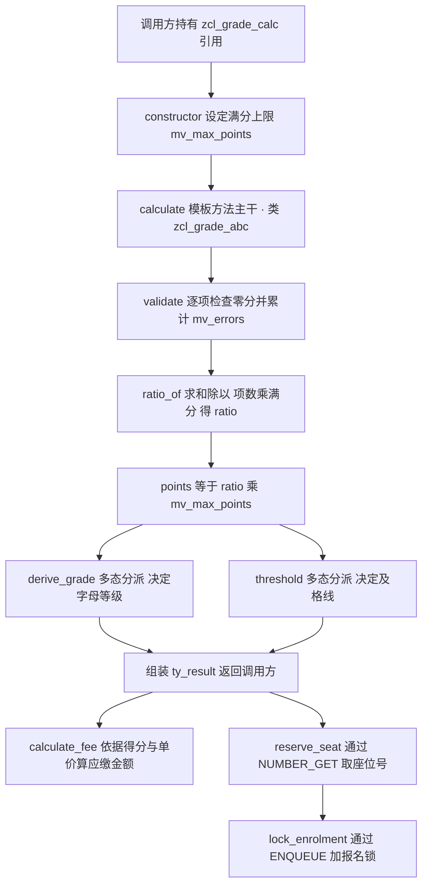
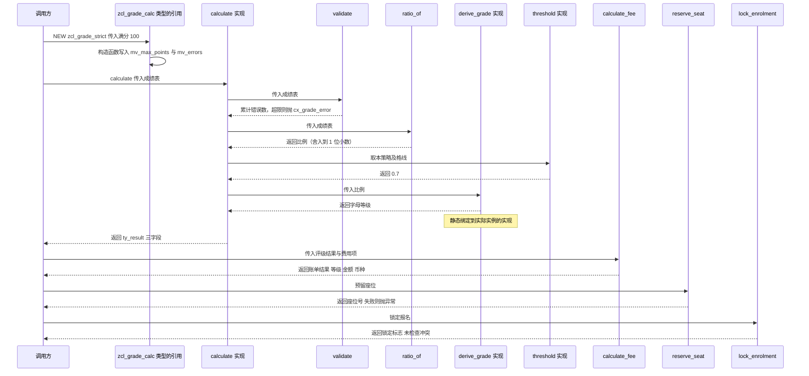

# ZCL_GRADE_CALC 成绩计算类 · Onboarding 深度分析报告

> 分析对象：`zcl_grade_calc.clas.abap`（CLASS-POOL，332 行，4 个全局类 + 1 个全局异常类）
> 分析重点：继承结构、多态如何生效、严格评级的判定逻辑是否存在缺陷
> 阅读顺序建议：第一章建立业务直觉 → 第二章看全局流程 → 第三章逐方法拆解 → 第五章看问题清单

---

## 一、程序定位与业务背景

### 1.1 它在解决什么问题

这是一套**教务评分引擎**。业务场景很具体：某培训/院校系统要对一批学员提交的各科成绩做汇总判定——给出百分制得分（`points`）、字母等级（`grade`：A+ / A / B / C / D / F）、是否通过（`passed`），如果通过还要算应缴费用（`netwr` / `waers`）并给学员分配座位（`reserve_seat`）、锁定报名记录（`lock_enrolment`）。

如果只有一套评分规则，这个需求用一段 `FORM` 就能写完，三十行搞定。真正让它长成这样的，是**评分规则本身存在多个变体**：

- `zcl_grade_abc` + 默认规则：80 分及格、80 分给 B、其余给 C（一套"标准"口径）
- `zcl_grade_strict`：**严格口径**，90 分 A+、80 分 A、其余一律 F，及格线抬到 70%
- `zcl_grade_lenient`：**宽松口径**，60 分给 C、其余给 D

这三套规则会在同一个系统里长期共存，甚至按培训班、按合同、按年级切换。**"现有方案为何不够"**就在这里：一旦用 `IF` 硬编码，新增第四套规则就要去改调用点；如果复制粘贴整段评分逻辑，三份代码会立刻开始各自漂移。

### 1.2 整体设计范式（一句话定性）

这是一个**模板方法（Template Method）+ 策略化扩展点（Strategy via Method Overriding）**的教科书式演示：把"算比例 → 查等级 → 定及格"这条不可变的骨架固化在中间层 `zcl_grade_abc`，把"怎么给等级""及格线多少"这两个易变点抽象成可重定义的方法下放给叶子类，调用方只持有一个 `zcl_grade_calc` 类型的引用，运行时由 SAP 的方法分派机制决定实际执行哪份实现。

需要提前打预防针的是：**范式选对了，但实现层面有若干处硬伤，其中至少一处会导致整个类池无法激活，一处会让 `zcl_grade_strict` 的输出恒定退化。** 本报告会在第三章逐条拆开，第五章按优先级汇总。

---

## 二、程序执行流程总览

### 2.1 主流程图



### 2.2 责任链表

| 子程序 | 所在类 | 调用者 | 职责 |
|---|---|---|---|
| `constructor` | `zcl_grade_calc` | 调用方 / `super->` 链 | 设定满分上限、错误计数归零 |
| `constructor` | `zcl_grade_abc`（重定义） | 调用方 | 原样转发到父类构造函数 |
| `constructor` | `zcl_grade_strict`（重定义） | 调用方 | 原样转发到父类构造函数 |
| `calculate` | `zcl_grade_abc`（重定义） | 调用方 | 模板方法主干：校验 → 求比例 → 回填三点结果 |
| `validate` | `zcl_grade_calc` | `zcl_grade_abc.calculate` | 逐项检查，异常时累计 `mv_errors` 并抛异常 |
| `ratio_of` | `zcl_grade_calc`（PRIVATE） | `zcl_grade_abc.calculate` | 求平均得分占满分的比例 |
| `derive_grade` | `zcl_grade_calc` | `zcl_grade_abc.calculate`（运行时可能落到子类实现） | 按比例映射字母等级 |
| `derive_grade` | `zcl_grade_lenient`（重定义） | 同上 | 宽松口径等级映射 |
| `derive_grade` | `zcl_grade_strict`（重定义） | 同上 + `zcl_grade_strict.calculate` | 严格口径等级映射 |
| `threshold` | `zcl_grade_abc` | `zcl_grade_abc.calculate` | 默认及格线 0.5 |
| `threshold` | `zcl_grade_strict`（重定义） | 同上 | 严格及格线 0.7 |
| `calculate_fee` | `zcl_grade_calc` | 调用方 | 得分 × 单价 得应缴金额，搬运等级与币种 |
| `reserve_seat` | `zcl_grade_calc` | 调用方 | 取号段生成座位号，重试五次后抛异常 |
| `lock_enrolment` | `zcl_grade_calc` | 调用方（目前无人调用） | 调用 FM 加报名锁并回传锁定标志 |
| `get_scale` | `zcl_grade_calc` | 调用方（目前无人调用） | 返回等级刻度描述字符串 |

### 2.3 继承层次总览

| 类 | 父类 | 抽象 | 关键字 | 提供的方法实现 |
|---|---|---|---|---|
| `zcl_grade_calc` | 无（全局类池内的根） | 是 | `CREATE PUBLIC` | `calculate_fee`、`reserve_seat`、`lock_enrolment`、`get_scale`、`derive_grade`、`ratio_of`、`validate` |
| `zcl_grade_abc` | `zcl_grade_calc` | 是 | `CREATE PUBLIC` | `calculate`（重定义）、`threshold`（新增）、`constructor`（重定义） |
| `zcl_grade_strict` | `zcl_grade_abc` | 否 | `FINAL CREATE PUBLIC` | `calculate`（重定义）、`derive_grade`（重定义）、`threshold`（重定义）、`constructor`（重定义） |
| `zcl_grade_lenient` | `zcl_grade_abc` | 否 | `FINAL CREATE PUBLIC` | `derive_grade`（重定义） |

下面按这条流程，逐个子程序展开。

---

## 三、分组分析

### 3.1 子程序类型 全局声明区（类定义段 + 根类实现）

这一节不产生运行期行为，但它决定了后面所有"多态是否成立"。整个继承树建立在四段定义上，逐段拆开看。

#### ① 根类定义与数据类型声明

```abap
CLASS-POOL zcl_grade_calc.

PUBLIC
ABSTRACT
CREATE PUBLIC.

  PUBLIC SECTION.

    TYPES: BEGIN OF ty_result,
             grade     TYPE string,
             points    TYPE p DECIMALS 2,
             passed    TYPE abap_bool,
             netwr     TYPE netwr,
             waers     TYPE waers,
           END OF ty_result.

    TYPES: BEGIN OF ty_fee,
             fee_id   TYPE char4,
             netpr    TYPE netpr,
             waers    TYPE waers,
             waerk    TYPE waerk,
           END OF ty_fee.

    TYPES ty_result_tab TYPE STANDARD TABLE OF ty_result WITH EMPTY KEY.

    METHODS constructor
      IMPORTING iv_max_points TYPE p
      OPTIONAL.
```

**做什么** — 声明一个全局类池，把 `zcl_grade_calc` 定为抽象根类；同时定义两个结构：`ty_result` 承载结论（字母等级、百分制得分、是否通过、净金额、币种），`ty_fee` 承载计费输入（费用编号、单价、凭证币种、交易币种）。构造函数只接收一个可选的满分上限。

**为什么** — `ABSTRACT` + `CREATE PUBLIC` 的组合在 ABAP OO 里是明确的意图声明：告诉编译器"这个类不许直接 `NEW` 出来"，从而强制使用者去想"该用哪个子类"。这比运行期抛异常或返回空值来阻止误用要干净得多，是 SAP 标准类库的一贯做法。`WITH EMPTY KEY` 用在纯输出表 `ty_result_tab` 上也是对的——它明确表示"这张表只被 LOOP 读取，从不按主键 MODIFY/DELETE"，省掉了无用的唯一性索引维护开销。

**风险与改进** — 这里埋了第一个**语义错配**：`ty_result` 名义上是"评级结论"，却塞进了 `netwr`（净金额）和 `waers`（凭证币种）两个纯计费字段。后果是 `calculate_fee` 只能"借用"这个结构当账单载体用（见 3.7），一个结构同时扮演两种角色，调用方拿到 `ty_result` 时无法判断 `netwr` 是否有意义——实际上评分类的实例里它永远是初始值。更要紧的是 `netwr` 在 DDIC 里是**字符型金额**（C 类型 + 隐含 2 位小数），不是可运算的数值类型，把它直接塞进"计算结果结构"会让后来者以为它是数值。改进建议：拆成 `ty_grade_result`（grade/points/passed）与 `ty_bill`（继承或组合前者 + netwr/waers）；或者干脆把计费结果改成独立结构，用 `ty_result` 作为其第一个成分。另外 `points TYPE p DECIMALS 2` 与后面反复出现的比例计算精度问题直接相关，见 3.3 ②。`ty_result_tab` 与 `ty_fee-fee_id` 在整个类里从未被使用，属于预留的死类型。

#### ② 中间层 `zcl_grade_abc` 的定义

```abap
CLASS zcl_grade_abc DEFINITION PUBLIC ABSTRACT CREATE PUBLIC.

  PUBLIC SECTION.
    METHODS constructor REDEFINITION.
    METHODS calculate  REDEFINITION.

  PROTECTED SECTION.
    METHODS threshold
      IMPORTING iv_ratio TYPE p
      RETURNING VALUE(rv_value) TYPE p.
ENDCLASS.
```

**做什么** — 声明中间抽象层，继承根类，把 `constructor` 和 `calculate` 标记为 `REDEFINITION`（即"我要重新实现父类的这两个方法，签名沿用父类"），并**新增**一个 `threshold` 方法放在 `PROTECTED` 段。

**为什么** — `REDEFINITION` 而非 `ABSTRACTION` 是这里的精髓：父类 `zcl_grade_calc` 已经给了 `calculate` 一个可用实现（其实那个实现根本调不到自己的 `ratio_of`），中间层选择"重写"而不是"声明抽象"，从而**接管**了算法骨架，把控制权牢牢收在自己手里；而 `threshold` 用 `NEW` 的语义新增，因为它在父类里根本不存在。`threshold` 放 `PROTECTED` 是正确的封装选择——调用方不需要知道及格线是多少，只需要知道 `passed` 的结果。

**风险与改进** — **抽象性的形式与实质不符**。`zcl_grade_abc` 声明了 `ABSTRACT`，但类里**一个抽象方法都没有**：`derive_grade` 没有在这里 `ABSTRACTION`，`threshold` 也没有。结果是任何新写的子类如果忘了重定义 `derive_grade`，就会静默继承根类那份"0.8 给 B、其余给 C"的默认实现——不报编译错、不报运行错，只是算出一份没人想要的成绩。这是本程序最容易被后人踩的坑。改进建议：在 `zcl_grade_abc` 里写 `METHODS derive_grade REDEFINITION ABSTRACT.`，把"必须重定义等级规则"这条约定交给编译器强制执行。另外根类 `zcl_grade_calc` 那个 `derive_grade` 实现（见 3.4）也随之失去了存在意义——它现在唯一的作用是"提供一个没人想要的默认值"。顺带一句：`zcl_grade_calc` 声明了 `ABSTRACT` 但把所有方法都实现了，这个 `ABSTRACT` 修饰符在这里其实只起到"禁止直接实例化"的作用，与模板方法模式本身无关。

#### ③ 两个叶子类的定义

```abap
CLASS zcl_grade_strict DEFINITION PUBLIC INHERITING FROM zcl_grade_abc
  FINAL CREATE PUBLIC.

  PUBLIC SECTION.
    METHODS constructor REDEFINITION.
    METHODS calculate  REDEFINITION.

  PROTECTED SECTION.
    METHODS derive_grade REDEFINITION.
    METHODS threshold    REDEFINITION.
ENDCLASS.


CLASS zcl_grade_lenient DEFINITION PUBLIC INHERITING FROM zcl_grade_abc
  FINAL CREATE PUBLIC.

  PUBLIC SECTION.
    METHODS derive_grade REDEFINITION.
ENDCLASS.
```

**做什么** — 声明两个策略实现类，都直接继承 `zcl_grade_abc`。`strict` 重定义了 `derive_grade` 和 `threshold`，还额外重定义了 `calculate` 与 `constructor`；`lenient` 只重定义了 `derive_grade` 一个方法。两个重定义方法都放在 `PROTECTED` 段——这与父类的可见性一致，合法。

**为什么** — 这两个类的对比才是最好的教学材料：`lenient` 只有 5 行实现，因为它**只**替换了等级规则，其余全部复用；`strict` 额外重定义 `calculate`，说明它需要的不只是"换一张对照表"，而是要改算法主干（它自己重写了及格判定）。这恰好暴露了模板方法的经典权衡（见 3.6）：**扩展点选得不对，重定义主干的一方会把父类的计算结果全部作废**。两个类都加 `FINAL` 是非常到位的实践——叶子策略类不允许被再继承，避免了"严格口径的子类又覆盖了等级规则"这种继承链污染，也向读者表明"这里就是继承的终点"。

**风险与改进** — `strict` 重定义 `calculate` 的动机本身值得质疑。如果严格口径只是"及格线更高、等级档位不同"，那么它需要的全部是 `derive_grade` + `threshold` 两个重定义——`lenient` 已经证明这条路走得通。**多写一个 `calculate` 重定义，没有换来任何表达能力，只带来了 3.6 里那一整串缺陷**。改进建议：删掉 `strict` 的 `calculate` 与 `constructor` 重定义，让它退化成和 `lenient` 一样的纯策略类，那 6 个 P0 里至少有 2 个会自动消失。

#### ④ 全局异常类 `cx_grade_error`

```abap
CLASS cx_grade_error DEFINITION PUBLIC INHERITING FROM cx_static_check.
  PUBLIC SECTION.
    CONSTRUCTORS:
      constructor IMPORTING iv_text TYPE string OPTIONAL.
ENDCLASS.


CLASS cx_grade_error IMPLEMENTATION.
  METHOD constructor.
    super->constructor( ).
  ENDMETHOD.                    "constructor
ENDCLASS.                       "cx_grade_error"
```

**做什么** — 定义一个继承 `cx_static_check` 的全局异常类，构造签名接受一个可选文本 `iv_text`；实现里调用父类构造函数，但**不传任何参数**。

**为什么** — 继承 `cx_static_check`（而不是 `cx_dynamic_check`）是正确的语义选择：`cx_static_check` 的语义是"这个异常在构造时就能被检测到"，正好匹配本程序里"分数为零""成绩表为空""取号失败"这类**运行前即可判定**的错误，而且它被声明为 `RAISING` 而非 `RESUMABLE`，能让编译器强制每个调用点显式处理或显式传播。定义成全局类（放在类池里）而不是 `VISIBLE FOR TESTING` 之类的局部类，也正确——它会出现在 `RAISING` 子句里给外部调用方看。

**风险与改进** — **这是一个"有嘴不能说"的异常类**：`iv_text` 声明为可选形参，实现里却完全不读它，`super->constructor( )` 是空参调用，导致**所有通过 `RAISE EXCEPTION TYPE cx_grade_error.` 抛出的异常，文本都是空的**。整个程序里有三处 `RAISE EXCEPTION TYPE cx_grade_error.`（`validate`、`ratio_of`、`reserve_seat`），全都不带消息——线上出问题时，开发者在 SM21 里只能看到"异常类 CX_GRADE_ERROR 已发生"，无法区分是"分数为零"还是"成绩表为空"还是"取号失败"。这是本程序里**排障成本最高的一个缺陷**。改进建议：`super->constructor( text = iv_text )`（注意 `cx_static_check` 的形参名是 `text`，不是 `iv_text`），并给三处 `RAISE` 补上区分性文本；如果还要更精细，可用 `get_text( )` 重写按错误码返回中文/英文描述。

---

### 3.2 子程序 方法 constructor（类 zcl_grade_calc / zcl_grade_abc / zcl_grade_strict）

这条链分两步：根类真正干活的构造函数，以及两个纯转发的重定义。

#### ① 根类构造函数

```abap
METHOD constructor.
  mv_max_points = COALESCE( iv_max_points, 100 ).
  mv_errors     = 0.
ENDMETHOD.                    "constructor
```

**做什么** — 把传入的可选满分上限写入成员 `mv_max_points`；若调用方没传（形参为初始值），用 `COALESCE` 兜底为 100。同时把错误计数 `mv_errors` 归零。

**为什么** — 选 `COALESCE` 而不是 `IF iv_max_points IS INITIAL` 的分支，是恰当的现代 ABAP 写法：一次求值、语义自解释。默认值 100 选得也合理，因为百分制是评分场景的事实标准，调用方在常规场景下可以完全不传。`mv_max_points` 放在 `PROTECTED` 而不是 `PRIVATE`，正是为了让 `zcl_grade_abc.calculate` 和 `zcl_grade_strict.calculate` 能够直接读取——这个可见性决策是**必要且正确的**，也是理解 3.3 里那个致命对比的关键：`ratio_of` 恰恰少了这个待遇。

**风险与改进** — 有两个隐患。第一，**`COALESCE` 把 0 也当成"没传"**。对 `TYPE p` 而言初始值就是 `0.00`，所以调用方若显式传 `0` 想表达"满分是零"（虽然业务上荒谬，但比如"不设上限"这类语义），会被静默改写成 100。如果真的需要区分"未传"和"传了 0"，应该用 `VALUE #( )` 加标记或把形参改成 `VALUE(p) OPTIONAL` 配合 `sy-subrc` 式的存在性判断。第二，**没有任何范围校验**：`iv_max_points` 传 `-100` 或 `0.001` 都会被接受，`ratio_of` 的分母随之变成负数或极小数，比例失衡但程序不报错。建议在构造函数里加一道 `IF mv_max_points <= 0. RAISE EXCEPTION ...` 的护栏，把非法配置挡在对象诞生之时。

#### ② 两个纯转发的重定义构造函数

```abap
CLASS zcl_grade_abc IMPLEMENTATION.
  METHOD constructor.
    super->constructor( iv_max_points = iv_max_points ).
  ENDMETHOD.                    "constructor"
ENDCLASS.
```

```abap
CLASS zcl_grade_strict IMPLEMENTATION.
  METHOD constructor.
    super->constructor( iv_max_points = iv_max_points ).
  ENDMETHOD.                    "constructor"
ENDCLASS.
```

**做什么** — 两段完全相同的实现：把满分参数原样交给父类的构造函数。

**为什么** — 在传统 OOP 里这是典型的"无意义的样板转发"，通常被认为是坏味道。但在 **ABAP OO 里有其必要性**：ABAP 的构造函数**不参与继承**，父类构造函数不会被自动调用，任何子类若新增构造参数或改变初始化顺序，都必须显式 `super->constructor( )` 建立调用链，否则父类的初始化被静默跳过。SAP 标准类库里大量存在这种"看起来多余"的转发。所以这两个重定义**是必要的**，`zcl_grade_lenient` 没有重定义构造函数（因为它没有新增任何初始化逻辑、直接复用继承来的那一份）也同样正确——继承链会自动找到 `zcl_grade_abc` 的实现再往上到 `zcl_grade_calc`。

**风险与改进** — 目前无实质风险，属于纯样板。但有两点值得记下：其一，`strict` 重定义构造函数的**唯一价值就是什么都没做**，这又一次印证了它那个多余的 `calculate` 重定义；其二，ABAP 构造函数的 `super->` 调用**必须放在方法体的最前面**，这是编译器强制的约定，当前代码符合。建议在这两个方法上加个注释说明"ABAP 构造函数不继承，此转发不可删除"，避免后来者"清理冗余代码"时把它删掉导致 `mv_max_points` 永远不被初始化。

---

### 3.3 子程序 方法 calculate（类 zcl_grade_abc）— 模板方法主干

这是整个程序的核心，分三步：校验、求比例、把结果分派给三个扩展点。**其中第 ① 步与第 ③ 步各藏着一个 P0 缺陷。**

#### ① 调用 validate 做前置校验

```abap
METHOD calculate.

  validate( it_scores ).

  DATA lv_ratio TYPE p DECIMALS 4.
  lv_ratio = ratio_of( it_scores ).
```

**做什么** — 骨架的第一步是调 `validate( it_scores )` 做全量分数体检，不通过就抛异常；通过后准备一个 4 位小数的局部变量 `lv_ratio` 准备承接比例。

**为什么** — 把"校验"作为模板方法的第一步，是模板方法模式的标准编排：把**强制性的前置条件**放在算法骨架里，而不是散落到各个扩展点中，保证任何子类实现都绕不过去。`validate` 放在父类的 `PROTECTED` 段，中间层可以直接调用，子类也能复用——这是正确的可见性规划。

**风险与改进** — **这里有一个致命的可见性缺陷，会让整个类池无法激活**。`validate` 是 `PROTECTED`，调用合法；但下一行 `ratio_of` 是 `zcl_grade_calc` 的 **`PRIVATE` 方法**：

```abap
  PRIVATE SECTION.

    METHODS ratio_of
      IMPORTING it_scores TYPE STANDARD TABLE OF p WITH EMPTY KEY
      RETURNING VALUE(rv_ratio) TYPE p
      RAISING   cx_grade_error.
```

ABAP OO 中，**`PRIVATE` 成员只在类自己内部可见，子类实现无继承访问权**（这与 Java/C++ 一致，ABAP 只是把 `protected` 作为默认值而非默认继承可见）。因此 `zcl_grade_abc.calculate` 调用 `ratio_of( )` 会触发**编译期可见性错误**，整个类池激活失败，所有子类都跟着不可用。讽刺的是，同一段代码里的 `validate`（PROTECTED）和 `mv_max_points`（PROTECTED）都能正常访问，说明作者对可见性的判断只做了一半。**改进建议：把 `ratio_of` 从 `PRIVATE SECTION` 移到 `PROTECTED SECTION`**——它本来就需要被中间层调用，"私有"的意图落空了。这也是本报告的第一号 P0：在修掉它之前，本程序跑不起来，后面所有关于运行结果的讨论都是"设计意图层面"的推演。

#### ② 计算 ratio 与 points

```abap
METHOD ratio_of.
  DATA lv_sum   TYPE p DECIMALS 4.
  DATA lv_count TYPE i.

  lv_count = lines( it_scores ).
  IF lv_count = 0.
    RAISE EXCEPTION TYPE cx_grade_error.
  ENDIF.

  LOOP AT it_scores INTO DATA(lv_score).
    lv_sum = lv_sum + lv_score.
  ENDLOOP.

  rv_ratio = lv_sum / ( lv_count * mv_max_points ).
ENDMETHOD.                    "ratio_of
```

**做什么** — 先取成绩表行数，为 0 则抛 `cx_grade_error`；随后遍历累加总分 `lv_sum`；最后用 `总分 / (项数 × 满分)` 得出**比例** `rv_ratio` 返回。回到 `calculate` 后，用 `lv_ratio * mv_max_points` 反算出百分制 `points`。

**为什么** — "归一化到比例再比较"的思路是对的：等级刻度和及格线都用比例（0.5、0.7、0.8、0.9）表达，与满分解耦，改满分不需要同步改刻度表。空表显式抛异常也是必要的——否则除以 0 会得到 ABAP 的运行时除零 dump，而不是可读的业务错误。

**风险与改进** — 这段代码有**三层精度问题叠加**，是"严格评级逻辑"崩坏的真正源头之一。

第一，**返回类型的精度只有 1 位小数**。`rv_ratio` 的形参声明是 `TYPE p`，而 ABAP 中 `TYPE p` 未指定 `DECIMALS` 时默认按 **1 位小数**处理。这意味着 `0.875` 被赋值给 `rv_ratio` 时会被舍入成 `0.9`。第二，**精度损失被 `points` 反算放大**。`calculate` 里 `rs_result-points = lv_ratio * mv_max_points` 用的是**已经被舍入到 1 位小数的比例**，不是原始总分除以项数。举个具体例子：成绩 `87` 和 `88`，满分 `100`。

| 环节 | 期望值 | 实际值 | 说明 |
|---|---|---|---|
| `lv_sum` | 175.00 | 175.00 | 正确 |
| `0.875` 舍入到 `rv_ratio`（1 位小数） | 0.8750 | **0.9** | 精度在此丢失 |
| `points = 0.9 × 100` | 87.50 | **90.00** | 误差被满分放大 100 倍 |
| `derive_grade(0.9)` | B 或 A（看口径） | **走 0.9 档** | 等级判定跟着错 |

也就是说，**程序报出的百分制得分本身就可能是错的**——87.50 分的均分被报成 90.00 分，而且没有任何异常或警告。第三，**比例应该反过来算而不是正算再反算**：既然 `lv_sum` 已经是精确值，`points` 直接用 `lv_sum / lv_count` 就对了，根本不该经过比例这一道中间换算。

改进建议：把 `ratio_of` 的返回类型改成 `TYPE p DECIMALS 8`，把 `derive_grade` 与 `threshold` 的 `iv_ratio` 也统一改成 `p DECIMALS 8`（形参一旦是 1 位小数，再高的内部精度传进来也会被砍掉），并让 `points` 直接由总分除以项数得到。同时，异构满分（比如数学满分 150、语文满分 100 混在一张表里）用"平均分 / 统一满分"在数学上是无意义的——`ratio_of` 的签名 `STANDARD TABLE OF p` 根本没有位置携带每科的满分，这是模型层面的缺陷，建议改成传入 `(score, max)` 结构的表或两个平行的内表。

#### ③ 三个扩展点的多态分派

```abap
    rs_result-points  = lv_ratio * mv_max_points.
    rs_result-grade   = derive_grade( iv_ratio = lv_ratio ).
    rs_result-passed  = COND #( WHEN lv_ratio >= threshold( iv_ratio = lv_ratio )
                                THEN abap_true ELSE abap_false ).

  ENDMETHOD.                    "calculate
```

**做什么** — 回填 `ty_result` 的三个结论字段：`points` 是换算后的百分制得分；`grade` 调用 `derive_grade( iv_ratio = lv_ratio )`；`passed` 用 `COND #( )` 内联条件，把 `lv_ratio` 与 `threshold( iv_ratio = lv_ratio )` 的返回值比较，得到 `abap_true` / `abap_false`。

**为什么** — **这三行就是整个多态设计的落点，值得逐字拆解**。`derive_grade` 和 `threshold` 在这里都是**不带任何前缀的直接调用**——既没有 `super->`，也没有 `me->`。ABAP OO 的静态派发规则是：如果调用点声明的方法在**当前类的实现**里已被重定义，就静态绑定到当前类的版本；如果当前类没有重定义，就沿继承链向上找到最深的那个实现并静态绑定。调用方不需要写任何 `IF lo_ref IS INSTANCE OF ...` 的类型判断代码——**同一个引用指向不同对象时，同一行代码执行到不同的实现体，这就是运行时多态的全部机制**。配 `COND #( )` 的写法也很现代：`WHEN ... THEN ... ELSE ...` 一行表达布尔转换，避免了老派 `IF/ELSE` 占掉半个屏幕。

**风险与改进** — 三个问题，从轻到重：

1. **`threshold( iv_ratio = lv_ratio )` 的入参是废的**。`threshold` 的实现（见 3.6 ③）根本不读 `iv_ratio`，它只是个"返回本类及格线"的取值器。这个形参是纯样板，而且传错了也不会有人发现——它诱使后来者以为阈值是随比例动态变化的（比如"越难的考试及格线越高"），实际不是。改进建议：改成无参的 `METHODS threshold RETURNING VALUE(rv_value) TYPE p.`，语义立刻清晰。
2. **`ty_result` 的 `netwr` / `waers` 在这里没有被赋值**，保持初始值。调用方如果不做判断直接读，会拿到空白金额。属于设计层面的问题（见 3.1 ①），建议至少在文档里注明"评分类的返回中这两个字段无意义"，更好的做法是拆结构。
3. **等级判定用的是"精确相等"而非"区间"**，这是把业务规则写死的最危险的方式。`CASE iv_ratio WHEN 0.9` 要求比例**精确等于** 0.9 才会给 A+。结合 3.3 ② 的 1 位小数舍入，实际效果是：原始比例落在 `[0.85, 0.95)` 区间的学生**全部拿到 A+**。一个 86 分和一个 94 分的学生得到完全相同的等级，而一个 84 分的得到 A。**没有任何业务规则会以"精确等于"来划分等级档位**，正确写法是 `IF iv_ratio >= 0.9 ... ELSEIF iv_ratio >= 0.8 ...` 这样的区间比较，或者用区间配置表驱动。

---

### 3.4 子程序 方法 derive_grade（类 zcl_grade_calc 提供的默认实现）

#### ① 根类的默认等级映射

```abap
METHOD derive_grade.
  CASE iv_ratio.
    WHEN 0.8.
      rv_grade = 'B'.
    WHEN OTHERS.
      rv_grade = 'C'.
  ENDCASE.
ENDMETHOD.                    "derive_grade"
```

**做什么** — 按传入比例做精确匹配：恰好 `0.8` 返回 `'B'`，其余一律返回 `'C'`。

**为什么** — 在模板方法模式里，扩展点通常应该声明成抽象方法或者抛 `CX_ABAP_NOT_SUPPORTED`，让漏实现的子类立刻暴露。这里却给了一份"看起来能跑"的默认实现——好处是调用方即便拿到一个 `zcl_grade_abc` 的引用也不至于崩溃，坏处是**把编译期错误换成了运行期静默错误**（见 3.1 ②）。

**风险与改进** — 三个层次的问题。第一，**这份实现的业务含义本身不合理**：只有 B 和 C 两档，没有 A 档。这意味着一个按标准口径评出的满分学生（比例 1.0）会落进 `OTHERS`，**拿到 C**——最优秀的学生得到最低的等级。第二，**精确相等**的老问题在这里同样存在，比例落在 `[0.75, 0.85)` 的学生都拿 B。第三，`iv_ratio` 的形参类型是 `TYPE p`（1 位小数），所以 0.75 舍入到 0.8，也拿 B。改进建议：**要么删掉这份实现并在 `zcl_grade_abc` 声明为 ABSTRACT，要么改成有完整档位的合理默认**（例如 `>= 0.9 A`、`>= 0.8 B`、`>= 0.6 C`、其余 F）。当前形态属于"半成品默认值"，比不做默认值更危险。

---

### 3.5 子程序 方法 derive_grade（类 zcl_grade_lenient 实现）

#### ① 宽松口径的等级映射

```abap
METHOD derive_grade.
  CASE iv_ratio.
    WHEN 0.6.
      rv_grade = 'C'.
    WHEN OTHERS.
      rv_grade = 'D'.
  ENDCASE.
ENDMETHOD.                    "derive_grade"
```

**做什么** — 比例恰好 `0.6` 返回 `'C'`，其余（包括更高的分数）全部返回 `'D'`。

**为什么** — 这是**纯策略类**的正确示范：只重定义一个 6 行方法，其余逻辑（校验、求比例、组装结果）一行不写全部继承。这是本程序里最值得学习的部分——如果 `strict` 也照这个套路写，整个类会小一半且没有缺陷。`lenient` 也没有重定义 `constructor` 和 `calculate`，说明作者清楚哪些东西该动、哪些不该动。

**风险与改进** — 等级刻度设计本身可疑：`0.6 → C` 意味着 60 分给 C、61 分给 D、59 分也是 D——**分数越高等级反而越低**。这不是"宽松口径"，这是刻度方向反了（除非本意是"未达 60 得 D、达到 60 得 C"，那么 `WHEN 0.6` 应该写成 `>= 0.6` 的区间判断，且档位只有 C/D 两档也太单薄）。叠加精确相等问题后，实际分界落在原始比例 `[0.55, 0.65)`。另外与 `get_scale` 声明的刻度 `'A+ A F'` 矛盾（见 3.10）。改进建议：改用区间比较并补齐完整档位（D / C / B / A），让"宽松"体现在**及格线和档位边界更靠下**，而不是体现在"只有两档"。

---

### 3.6 子程序 方法 calculate / derive_grade / threshold（类 zcl_grade_strict 实现）— 严格评级的真实判定

用户问题的核心在这里。**结论先给：在当前代码下，`zcl_grade_strict` 的 `calculate` 无论输入什么，返回的永远是 `grade = 'F'`、`passed = false`、`points = 0.00`。** 下面分三步拆开为什么会这样——**三个独立的缺陷层层叠加，任意一个单独存在都不会造成这么彻底的死局**。

#### ① 转发父类计算并捕获异常

```abap
METHOD calculate.

  super->calculate(
    IMPORTING it_scores    = it_scores
    RECEIVING rs_result    = DATA(ls_result)
    EXCEPTIONS cx_grade_error = 1 ).

  IF sy-subrc = 1.
    RAISING cx_grade_error.
  ENDIF.
```

**做什么** — 调用父类 `zcl_grade_abc.calculate` 的完整算法，把返回结果接收到内联声明的局部变量 `ls_result` 里；用 `EXCEPTIONS cx_grade_error = 1` 捕获声明过的异常，若 `sy-subrc = 1` 则重新抛出。

**为什么** — `super->calculate( )` 是模板方法模式里"先跑骨架、再做增强"的标准写法，`lenient` 不需要这步是因为它没有额外逻辑。显式列出 `EXCEPTIONS` 并检查 `sy-subrc` 也是正确的做法——ABAP 的异常不会自动传播，必须逐个声明或在调用链末端处理。

**风险与改进** — 三个问题，**其中一个直接导致后续全盘失效**：

1. **【致命】`ls_result` 接收了结果却从未被使用，而后续代码去读了空的 `rs_result`。** `RECEIVING rs_result = DATA(ls_result)` 只是把父类返回的值赋给局部变量 `ls_result`；方法自己的返回参数 `rs_result` **仍然是初始值**。而下面第 ② 步却写 `rs_result-points`——读的是那个从未被赋值的形参。这不是语法错误、不是运行异常，**它是一个编译通过、运行通过、结果全错的静默缺陷**。改进：补一行 `rs_result = ls_result.`，或者干脆别用 `DATA(...)`，直接 `RECEIVING rs_result = rs_result`（同名接收，语义最直观）。
2. **异常被"无差别重抛"，信息全丢。** `RAISING cx_grade_error.`（不带 `FROM`）会**新建一个异常实例**再抛出，而不是把原来的转出去。虽然当前 `cx_grade_error` 的构造函数本身就不处理文本（见 3.1 ④），所以暂时没丢什么；但**一旦有人修好了那个构造函数，这里就会立刻变成"错误信息被清空"的隐性回归**。而且从设计上讲，这个 `try/catch` 完全没有价值：捕获后原样抛出，与不捕获直接让异常传播是**完全等价的**。改进建议：直接删掉 `EXCEPTIONS` 子句让异常自然传播（ABAP 会沿调用栈自动传递已声明的异常），这是最简洁也最不易错的写法；若要保留上下文，用 `RAISE EXCEPTION TYPE cx_grade_error FROM EXCEPTION cx_grade_error.`
3. `IF sy-subrc = 1` 用数字而非 `IF sy-subrc EQ 1` / `IF sy-subrc = 1` 尚可，但没有把非 1 的 `sy-subrc`（理论上不存在）纳入考虑，属于可接受的简化。无明显风险。

#### ② 用 `rs_result-points` 重算等级与及格判定

```abap
  rs_result-grade  = derive_grade( iv_ratio = rs_result-points ).
  rs_result-passed = COND #( WHEN rs_result-points >= mv_max_points * 0.7
                             THEN abap_true ELSE abap_false ).

ENDMETHOD.                    "calculate"
```

**做什么** — 调用 `derive_grade`，但传入的是 **`rs_result-points`（百分制得分，如 90.00）**，而不是 `derive_grade` 期望的**比例（如 0.9）**；同样地，及格判定也拿 `points` 去和 `mv_max_points * 0.7`（如 70.00）比较。

**为什么（意图层面）** — 作者显然想表达"严格口径要求 90 分 A+、80 分 A、70 分及格"，于是把 0.9/0.8/0.7 都换算成了百分制。这个**意图本身是对的**，问题出在执行。

**风险与改进** — **【P0 #2】形参语义错配：把"得分"传给了形参名为 `iv_ratio`、实现在按"比例"分派的形参。** `derive_grade` 的实现（见下面 ③）是 `CASE iv_ratio WHEN 0.9 ...`，而传进来的是 `90.00`——`WHEN 0.9` 永远不匹配，直接落进 `OTHERS` 得到 `'F'`。即使修好了 ① 的 `ls_result` 问题、让 `points` 真的有值，`90.00` 与 `0.9` 依然不可能相等，**`strict` 依旧恒定返回 F**。这是本次评审里最典型的**语义校核案例**：形参名叫 `iv_ratio`、文档含义是比例、实参传的是绝对分数，三者之间没有任何转换，编译器和运行时都不会报错。改进建议二选一：（a）在调用处显式换算 `derive_grade( iv_ratio = rs_result-points / mv_max_points )`；（b）更好——**让 `derive_grade` 只接受比例，并在 `calculate` 里统一保持比例口径**，避免同一个方法在不同地方被喂不同量纲的数据。

另外还有**第二个 P0**：`rs_result-passed` 这行直接内联了 `mv_max_points * 0.7` 这个魔法系数，**绕过了为此专门设计的扩展点 `threshold`**。而 ③ 里 `strict` 明明重定义了 `threshold` 返回 0.7。两条并行的及格线规则（一条走 `threshold()`、一条写死 0.7）意味着：任何将来想改严格及格线的人，必须同时改两个地方，改漏一个就会出现"等级判过了但 passed 是 false"这种自相矛盾的结果。而且由于 ① 的 `ls_result` 问题，`rs_result-points` 恒为 `0.00`，`0.00 >= 70.00` 恒为假，**`passed` 恒为 `false`**。改进建议：删除内联的 `* 0.7`，改为 `WHEN lv_ratio >= threshold( iv_ratio = lv_ratio )`（需要先把 `lv_ratio` 传进来，或改为在 `rs_result = ls_result` 之后用 `ls_result-points / mv_max_points` 复算比例）。

#### ③ 严格口径的等级映射与及格线

```abap
METHOD derive_grade.
  CASE iv_ratio.
    WHEN 0.9.
      rv_grade = 'A+'.
    WHEN 0.8.
      rv_grade = 'A'.
    WHEN OTHERS.
      rv_grade = 'F'.
  ENDCASE.
ENDMETHOD.                    "derive_grade"


METHOD threshold.
  super->threshold( iv_ratio = iv_ratio ).
  rv_value = 0.7.
ENDMETHOD.                    "threshold"
```

**做什么** — `derive_grade` 把比例映射成 `0.9 → A+`、`0.8 → A`、其余 `F`；`threshold` 先调用父类实现，再把返回值覆盖成 `0.7`。

**为什么（意图层面）** — 等级刻度"90/80/其余 F"对严格培训班的语义是合理的：宁可给 F 也不要给中间档，逼迫学员重视。`threshold` 的重定义体现了"策略类可以覆写配置项"这个模式。

**风险与改进** — 三个问题，其中 ①② 与前面 ② 的 `ls_result` 问题构成致命叠加：

1. **【P0 #3】`threshold` 里对 `super->threshold( )` 的调用是纯空操作**——返回值 `rv_value` 紧接着就被 `0.7` 覆盖，父类那行 `rv_value = 0.5` 的执行结果被完整丢弃。ABAP 不允许丢弃函数式方法调用的结果（必须写成 `super->threshold( iv_ratio = iv_ratio )` 这种语句式调用），所以作者为了"语法过关"补了这一行，代价是留下了一段无意义的语句。任何读者都会误以为这里存在"取父类默认值再调整"的逻辑。改进：**整行删掉**，只保留 `rv_value = 0.7.`。
2. **【P0 #4】这个 `threshold` 重定义实际上是"死代码"。** 因为 `strict.calculate` 完全不调用 `threshold`，父类 `zcl_grade_abc.calculate` 里那行 `lv_ratio >= threshold( iv_ratio = lv_ratio )` 虽然**会**通过多态分派命中 `strict` 的版本（返回 0.7，据此算出 `passed = true`），但这个结果**紧接着就在 ② 里被 `rs_result-passed = ...` 覆盖掉了**。也就是说：父类算了个正确的结果，子类把它扔了，换成一个错误的。改进：删掉 `strict` 的 `calculate` 重定义（回到 3.1 ③ 的建议），`threshold` 就自动生效，`super->` 空调用和硬编码 0.7 两个问题一并消失——**这一个改动能消灭本节一半的问题**。
3. **【P0 #5】`derive_grade` 用精确相等划分等级档位。** `WHEN 0.9` 要求比例**恰好等于** 0.9。结合 3.3 ② 的 1 位小数舍入，实际效果是原始比例落在 `[0.85, 0.95)` 的学生全部拿 A+，落在 `[0.75, 0.85)` 的拿 A，其余（含 0.70 到 0.75）直接 F。**一个 69 分和一个 74 分的学生得到同样的 F**，"严格"变成了"不可预测"。改进：改成区间比较。

**综合走查一遍（假设 ① 的 `ls_result` 问题已修）**：输入 `[87, 88]`、满分 100 → `ratio_of` 因 1 位小数舍入得 `0.9` → `points = 90.00` → 父类 `derive_grade(0.9)` 走多态命中 `strict`，`WHEN 0.9` 匹配成功得 `'A+'` → 但 ② 里又用 `derive_grade( iv_ratio = 90.00 )` 重算，`WHEN 0.9` 不匹配，落 `OTHERS` 得 `'F'` → **覆盖掉 A+** → `passed` 判 `90.00 >= 70.00` 为 true。同一次调用里，等级先算出 A+ 再被改成 F。**当前代码（`ls_result` 未回填）则更彻底：`rs_result-points` 为 `0.00`，等级恒 F、及格恒 false。** 这就是"严格评级判定逻辑有问题"的完整答案——**五个缺陷叠加**。

| 缺陷 | 位置 | 单独存在时的后果 |
|---|---|---|
| `ratio_of` 是 PRIVATE | 类 zcl_grade_calc 定义段 | **类池无法激活**，程序根本跑不起来 |
| `ls_result` 未回填 `rs_result` | 方法 calculate（zcl_grade_strict） | 结果全为初始值，等级恒 F、及格恒 false |
| `derive_grade` 实参传 points 而非 ratio | 方法 calculate（zcl_grade_strict） | 等级恒 F，即使前面都修好也救不回 |
| `passed` 内联硬编码 0.7 | 方法 calculate（zcl_grade_strict） | 与 `threshold` 双轨并行，改一处漏一处 |
| 等级用精确相等划分 | 方法 derive_grade（zcl_grade_strict / lenient / 根类） | 档位边界随机，"严格"变"不可预测" |

---

### 3.7 子程序 方法 calculate_fee（类 zcl_grade_calc）

计费逻辑与评分策略其实无关，却被塞在同一个类里。这个方法分两步，**第二步存在多处类型与语义错配**。

#### ① 搬运评级结论字段

```abap
METHOD calculate_fee.

  DATA lv_amount TYPE cuxy.

  rs_bill-grade  = is_result-grade.
  rs_bill-passed = is_result-passed.
  rs_bill-waers  = is_fee-waers.

  lv_amount = is_result-points * is_fee-netpr.

  rs_bill-netwr = lv_amount.

  rs_bill-waers = is_fee-waerk.

ENDMETHOD.                    "calculate_fee
```

**做什么** — 把评级结论里的等级与及格标志复制到账单结构；计算"得分 × 单价"得到金额写入 `netwr`；币种字段前后被赋值两次。

**为什么** — 复用 `ty_result` 作为账单输出结构，省掉了定义新结构的工作——**这是这个方法能写出 15 行的根本原因，也是它必须存在的原因**。作者是被 3.1 ① 里那个"计费字段混进评级结构"的设计逼出来的。

**风险与改进** — 第一步本身**有一个必须指出的死赋值**：`rs_bill-waers = is_fee-waers.` 之后，紧接着 `rs_bill-waers = is_fee-waerk.`，前一句的结果被无条件覆盖。删除前一句即可。第二步开始问题密集（见下）。

#### ② 金额换算与类型语义校核

```abap
  lv_amount = is_result-points * is_fee-netpr.

  rs_bill-netwr = lv_amount.

  rs_bill-waers = is_fee-waerk.
```

**做什么** — 用 `points`（百分制得分）乘 `netpr`（单价），结果写入 `netwr`；币种字段最终被赋成 `waerk`。

**为什么** — 作者的意图是"按学员成绩折算出应缴金额"：既然评级结论里已经算好了 `points`，那就直接拿它当计价基数，避免再查一次数据库。中间变量 `lv_amount` 也说明他清楚"金额要先算再落结构"的意图。**问题在于这个意图缺少业务依据**——`points` 是分数不是数量，两者量纲不同，下面的风险层会逐条拆开。

**风险与改进** — 这里有**四层不同性质的问题**，按严重度排列：

1. **【语义错配·P0】用"分数"当"数量"做金额计算。** `is_result-points` 是 0~100 的考试得分，`is_fee-netpr` 是单价。**"得分 × 单价"在业务上没有意义**——正确公式应是"数量 × 单价"，即 `MENGE × NETPR`。而 `ty_fee` 结构里**根本没有数量字段**（只有 `fee_id`、`netpr`、`waers`、`waerk` 四个）。这不是"少传一个参数"的问题，是**计费模型缺了一个必备维度**。改进建议：给 `ty_fee` 加 `menge`（数量，或直接从 `ESKN`/`ASIS` 之类的费用项取），并且明确 `points` 与计费的耦合关系——如果业务上确实是"按通过与否一次性收取固定费用"，那就应该写成 `IF is_result-passed THEN lv_amount = is_fee-netpr ELSE lv_amount = 0`，让业务规则显式化，而不是用一个长得像乘法的东西掩盖它。

2. **【币种语义错配·P0】`waers` 被写成了 `waerk`。** `WAERS` 是**凭证币种**（Document Currency），`WAERK` 是**交易币种**（Transaction Currency）。两者是 SAP 里严格区分的两个字段：凭证按哪个币种记账是业务决策，不能由程序随手用交易币种覆盖。`rs_bill-waers = is_fee-waerk.` 意味着**账单金额按交易币种记账**，而金额本身却是用 `netpr`（哪个币种的价？多半是 `waers` 语义的价）算的——**金额和币种标签可能对不上**。改进：要么保留 `waers`，要么按业务规则做明确的汇率换算（`waerk → waers` 需要汇率），并把这一步的意图写清楚。

3. **【类型语义错配·P1】`netwr` 与 `netpr` 是字符型金额，不是数值。** `NETWR`（Net Amount）和 `NETPR`（Net Price）在 DDIC 里都是 **C 类型 + 隐含 2 位小数**的货币字段，不是 `p`。因此 `lv_amount = is_result-points * is_fee-netpr` 是**打包类型乘字符类型**的混合运算，依赖 ABAP 的隐式转换才能通过编译——这类隐式转换既不明确也不安全，字符型金额里若有前导空格或格式污染，结果直接错。同时 `rs_bill-netwr = lv_amount` 是把 `p` 赋给 `C LENGTH 15`，得到的是**左对齐带尾部空格的字符**（例如 `'90.00          '`），而不是标准 CURR 格式；而且**隐含的 2 位小数是写死的，与 `waers` 的币种小数位无关**——日元（0 位）、巴林第纳尔/科威特第纳尔（3 位）都会算错。改进建议：用 `CONV netwr( )` 之类的显式转换，并按币种取小数位（`cl_abap_decimal=>get_round_dig( iv_currency = is_fee-waers )`）后再 `ROUND`。这一步是本方法**最需要重写**的地方。

4. **【类型待核实·P2】`TYPE cuxy` 来源不明。** 这个 4 字符类型在标准 SAP 数据元素里不常见（`NETWR`、`WAERS`、`NETPR` 这类数据元素名都远长于 4 位）。需要回 DDIC 确认：它是真实的自定义类型、是笔误（例如本想写 `netwr` 或某个 `cuky` 域），还是 `cuxy` 笔误写成了 `cuxy`/`cuky`？在确认之前，这行的类型安全性无从判断。改进建议：核实后换成语义明确的金额类型，并在声明处注释币种与小数位约定。

此外还有两个次要问题：`rs_bill-points` 从未被赋值（账单结果里得分字段恒为空，如果下游要用就有坑）；方法声明了 `RAISING cx_grade_error` 却**从未抛出**任何异常，属于契约噪音——要么删掉 `RAISING` 让接口诚实，要么真的加上"数量非法""单价缺失"等校验。

---

### 3.8 子程序 方法 reserve_seat（类 zcl_grade_calc）

#### ① 从号段取号并重试

```abap
METHOD reserve_seat.

  DATA lv_next TYPE i.

  DO 5 TIMES.
    CALL FUNCTION 'NUMBER_GET'
      EXPORTING
        nrr        = 'ZGRADE'
        nrobject   = 'ZSEAT'
      IMPORTING
        number     = lv_next
      EXCEPTIONS
        buffer_overflow = 1
        internal_error = 2
        OTHERS         = 3.

    IF sy-subrc = 0.
      rv_seat = |SEAT{ lv_next ALPHA = OUT }|.
      RETURN.
    ENDIF.
  ENDDO.

  RAISE EXCEPTION TYPE cx_grade_error.

ENDMETHOD.                    "reserve_seat
```

**做什么** — 最多五次调用 FM `NUMBER_GET` 从号段 `ZGRADE/ZSEAT` 取一个号；成功就把数字格式化成 `SEAT` 开头的座位号立即返回；五次全失败则抛 `cx_grade_error`。

**为什么** — 选 `NUMBER_GET` 而不是自己 `SELECT MAX() + 1` 是**正确的**——后者在并发下必然产生重复座位号，而 FM 号段提供了标准的号段缓冲与重号检测机制。`DO 5 TIMES` 的重试循环配合三个 `EXCEPTIONS` 捕获，也体现了对 FM 失败场景的正面处理，这在 ABAP 里比"直接 CALL 不看 subrc"的写法强得多。

**风险与改进** — 四个问题：

1. **【断号·P1】失败路径会永久消耗号段，形成不可见的空洞。** `NUMBER_GET` 一旦被调用，号就从号段缓冲里被取走了，即使因为 `buffer_overflow` / `internal_error` 失败、或五次都失败最终抛异常，**那个号也不会回到号段里**。结果是号段里出现一段永远跳过的空号。对座位号这种业务上通常有实体（打印在卡片上、贴在桌上）的编号，断号意味着**有实体但没有编号记录**，事后对账极其痛苦。改进建议：在抛出异常前把已取到的号显式记录到日志/异常属性里，或者改用 `NUMBER_GET_COMPLETE` 的分组取号方式一次性拿一批本地缓冲，避免高频调用号段；至少要保证"号被消耗"这件事在业务上可追溯。

2. **【无意义的重试·P2】`DO 5 TIMES` 里没有等待，瞬时重试几乎不可能成功。** `buffer_overflow` 和 `internal_error` 都是**异步恢复型**错误——号段缓冲耗尽时需要后台补充，这个过程以秒计。循环体里既没有 `WAIT UP TO` / `DO ... ENDDO` 之间的间隔，也没有任何退避策略，5 次紧挨着的调用会在毫秒内全部失败，纯属浪费。更糟的是 `OTHERS = 3` 会把"号段不存在"这类**永久性配置错误**也重试 5 次——这类错误重试一万次也没用。改进建议：区分可重试与不可重试异常，后者立刻抛出；可重试的加 `WAIT UP TO 1 SECONDS` 退避。

3. **【字段长度隐患·P2】`rv_seat` 是 `char10`，`ALPHA = OUT` 生成的串刚好 10 位，没有余量。** `'SEAT'`（4 位）+ `ALPHA = OUT` 的数字（号段长度补齐后为 6 位）= 10 位，**刚好塞满**。一旦 `ZGRADE` 号段的长度配置超过 6 位（或号段用满后溢出扩展），`|SEAT{ ... }|` 生成的串超过 10 位，赋值给 `rv_seat` 时会**短字段 dump（short dump）**。而座位号是要写进数据库、打印、在 UI 上显示的业务键，不能崩在这里。改进建议：把 `rv_seat` 改成 `TYPE string` 或加宽到 `char20`，并在赋值前校验长度。

4. **【规范性·P3】`ALPHA = OUT` 产生的座位号带前导空格**，形如 `'SEAT 000123'`（`SEAT` 与数字之间有一个分隔空格）。作为主键/比对字段时，尾部与中间空格带来的隐性不匹配是经典 bug 源。改进建议：用模板串显式控制，如 `|SEAT{ lv_next NUMBER = RAW = 6 }|`，或干脆去掉 `ALPHA` 改用数值格式化选项，让座位号成为 `'SEAT000123'` 这样的连续串。

另外 `DATA lv_next TYPE i` 与 FM 的 `number` 形参类型需要对齐（号段返回是 `NUMC`/字符型数字）；抛出的异常同样没有文本（见 3.1 ④），线上无法区分"号段溢出"和"号段不存在"。

---

### 3.9 子程序 方法 lock_enrolment（类 zcl_grade_calc）

#### ① 调用 FM 加报名锁

```abap
METHOD lock_enrolment.

  DATA lv_locked TYPE abap_bool.

  CALL FUNCTION 'ENQUEUE_ZGRADE_ENROL'
    EXPORTING
      iv_student     = iv_student
    IMPORTING
      ev_locked      = lv_locked
    EXCEPTIONS
      conflict_lock  = 1
      OTHERS         = 2.

  rv_locked = lv_locked.

ENDMETHOD.                    "lock_enrolment"
```

**做什么** — 调用 FM `ENQUEUE_ZGRADE_ENROL` 为指定学员加一把业务对象锁，把 FM 回传的 `ev_locked` 标志原样返回。

**为什么** — 把锁逻辑包成方法是合理的封装：调用方不必知道锁 FM 的名字、参数顺序和 `SY-SUBRC` 约定。把"是否已被别人锁住"抽象成一个 `abap_bool` 返回值，也是清晰的设计意图。

**风险与改进** — **这是整个程序里最危险的一个方法**，四个问题：

1. **【P0·锁失效】`CALL FUNCTION` 之后完全没有检查 `SY-SUBRC`，`conflict_lock` 异常被彻底吞掉。** 这是 ABAP FM 锁的**头号经典错误**。`ENQUEUE_*` 的语义是：加锁成功 `SY-SUBRC = 0`；被别人锁住则 `SY-SUBRC = 1`，此时 FM **并不会真的加锁**，但业务代码若不检查就会自以为是地继续往下走。正确的模式必须根据 `SY-SUBRC` 分支——加锁失败通常要 `MESSAGE e000` 中断事务，或返回失败标志让调用方处理。当前代码里 `conflict_lock = 1` 声明了异常却从不使用，**这个方法的返回对"锁冲突"和"锁成功"两种情况给出的回答是一样的**（都是 FM 回传的 `lv_locked`），调用方无从判断。改进：至少在 `sy-subrc <> 0` 时把失败信息编码进返回值（例如返回 `abap_false` 并配合一个独立的成功标志，或改成 `RAISING`），理想情况是加锁失败直接终止事务。

2. **【P0·锁泄漏】类里只有 `ENQUEUE`，没有任何 `DEQUEUE`。** `ENQUEUE_*` 加的锁**不会自动释放**——它一直持有到显式 `DEQUEUE`、事务 `COMMIT WORK`、或者程序结束（隐式提交/回滚时释放）。这个类里 `ENQUEUE_ZGRADE_ENROL` 只有加锁没有解锁，也没有配套的 `release_enrolment` 方法。调用方一旦在中途抛异常且未提交事务，锁就**被永久持有**，后续所有该学员的报名操作全部被 `conflict_lock` 挡住，而且因为没有解锁入口，运维只能靠重启对话或 SM50 手工干预。改进建议：补一个 `release_enrolment` 方法（内部 `DEQUEUE_ZGRADE_ENROL`），并在文档里明确"调用方必须保证 `ENQUEUE` 与 `DEQUEUE` 在同一 LUW 内成对出现"。这是典型的 **LUW（逻辑工作单元）设计责任外移**——把配对约束推给了每个调用方，属于设计缺陷而非实现疏忽。

3. **【规范·P2】FM 的参数命名违反 ABAP 命名约定，且缺少 owner/destination。** `IMPORTING ev_locked = lv_locked`——按 ABAP 惯例，FM 的**导入参数应以 `IV_`/`IT_` 开头，导出参数以 `EV_`/`ET_` 开头**。这里把一个 `ev_` 前缀的参数声明在 `IMPORTING` 侧，读者第一反应是"作者写反了"。建议核实 FM 的真实签名后统一命名。另外 `ENQUEUE_*` 通常还有 `IV_WAIT`、`IV_OWNER`、`IV_DISTRIBUTED_LOCK` 等可选参数，这里全部用了默认值，锁的行为依赖 FM 侧的实现约定，**调用方无从得知**。建议至少把 `owner` 设为当前用户名（便于通过 `SM50`/`DEQUEUE` 定位持有者）和 `wait = 'X'` 显式化。

4. **【设计·P2】`iv_student TYPE char10` 是裸的 `char10`，没有任何域校验。** 学员编号是要作为锁对象键的，必须精确匹配才能命中同一把锁。一个前导空格、全角字符、或被上游截断的编号，都会**加上一把谁也碰不到的废锁**，让真正的报名操作能加锁，造成"形同虚设"的锁。改进：定义带 `CHECK` 域的 `TYPE student_id`，或至少做 `CONV` / 去空格规范化。

---

### 3.10 子程序 方法 get_scale（类 zcl_grade_calc）

#### ① 返回等级刻度描述

```abap
METHOD get_scale.
  rs_scale = 'A+ A F'.
ENDMETHOD.                    "get_scale"
```

**做什么** — 返回一个字符串 `'A+ A F'`，被调用方理解为"本评分器使用的等级刻度是 A+、A、F"。

**为什么** — 作者显然意识到"等级刻度因策略而异，需要让调用方能查出来"，这个**意图是对的**——评分结果是一串 `'A+'` 字符串，脱离刻度毫无意义，UI 或报表必须知道如何解释它。

**风险与改进** — **【P0·里氏替换违反】这个方法是整个多态设计中最大的漏洞。** 它定义在根类上，**没有被声明为抽象，也没有任何子类重定义它**。于是：根类的默认刻度是 `'B'/'C'`，`lenient` 是 `'C'/'D'`，`strict` 是 `'A+'/'A'/'F'`——**三个实例、三种刻度，但 `get_scale` 永远返回 `'A+ A F'`**。调用方拿着一个 `zcl_grade_calc` 类型的引用查询刻度，拿到的一定是 `strict` 的答案，无论背后挂的是哪个对象。这是**里氏替换原则的直接违反**，也是本程序里"多态看起来生效了、其实漏了一块"的最好例子——`derive_grade` 重定义得挺好，`get_scale` 却漏了。

更进一步，**这个方法本身就是多态设计的失败信号**：它和 `derive_grade` 是同一类信息（等级刻度）的两种表达，一个作为可重定义的实现，一个作为写死的字符串。如果当初把 `derive_grade` 声明为 `ABSTRACT`，就必须顺手把 `get_scale` 也声明成 `ABSTRACT`，这类漏洞会被编译器全部抓出来——**抽象方法的缺失，让一整类设计错误失去了编译期的保护网**。

改进建议：在 `zcl_grade_abc` 里声明 `METHODS get_scale REDEFINITION ABSTRACT.`，然后让 `strict` 返回 `'A+ A F'`、`lenient` 返回 `'C D'`；或者更彻底——把等级刻度从代码里拿出来做成一张配置表（`ty_grade_band` 结构数组：下限比例、等级字母、及格标志），由构造函数注入，`get_scale` 直接读配置。这样"新增一套评分口径"就变成了加一条配置，而不用写一个类。

顺带一提，`'A+ A F'` 用**空格分隔的裸字符串**表达有序的等级刻度，调用方要靠 `SPLIT` 解析，顺序语义（谁高谁低）完全靠约定。返回 `ty_result_tab` 那种结构化数组、或返回带顺序字段的结构数组，才是可维护的做法。

---

## 四、执行流程全景图（数据视角）



---

## 五、问题清单与改进建议（按优先级）

### 🔴 P0 业务正确性

1. **`ratio_of` 声明为 PRIVATE 却被子类实现调用**（方法 `ratio_of`，类 `zcl_grade_calc` 定义段）— `zcl_grade_abc.calculate` 中 `ratio_of( it_scores )` 触发编译期可见性错误，**整个类池无法激活**。必须移入 `PROTECTED SECTION`。这是所有其他问题之前的"第零号故障"。
2. **`strict` 计算结果未回填，`ls_result` 被丢弃**（方法 `calculate`，类 `zcl_grade_strict`）— `RECEIVING rs_result = DATA(ls_result)` 后从未 `rs_result = ls_result.`，导致返回结构几乎全为初始值：**等级恒 F、及格恒 false、得分恒 0.00**。编译与运行均无任何提示，属最危险的静默缺陷。
3. **形参语义错配：把 `points` 当 `ratio` 传入 `derive_grade`**（方法 `calculate`，类 `zcl_grade_strict`）— 传 `90.00` 却被按 `WHEN 0.9` 分派，**严格口径永远得 F**。需改为 `rs_result-points / mv_max_points`。
4. **等级档位用精确相等划分**（方法 `derive_grade`，三个类均有）— `CASE iv_ratio WHEN 0.9` 要求精确等于；叠加 1 位小数舍入后实际分界为 `[0.85,0.95)` / `[0.75,0.85)`，69 分与 74 分同级。必须改为区间比较或配置表。
5. **比例与得分的精度被 1 位小数截断并放大**（方法 `ratio_of`、`calculate`）— `TYPE p` 默认 1 位小数，`rv_ratio` 把 `0.875` 压成 `0.9`，再乘满分导致 `87.50` 被报成 `90.00`。应改为 `DECIMALS 8`，且 `points` 直接由总分除以项数得出。
6. **计费用"得分"当"数量"，且币种语义错配**（方法 `calculate_fee`）— `points × netpr` 缺 `MENGE` 维度；`rs_bill-waers` 先写 `is_fee-waers` 又被 `is_fee-waerk` 覆盖，**把交易币种写进了凭证币种字段**，金额与币种标签可能对不上。
7. **`get_scale` 未参与多态，违反里氏替换**（方法 `get_scale`）— 三个实例三种刻度，方法恒返回 `'A+ A F'`，调用方无法判断结果如何解释。应声明为 `REDEFINITION ABSTRACT` 并逐类实现。

### 🟠 P1 健壮性

1. **FM 锁冲突被吞，无解锁出口**（方法 `lock_enrolment`）— `CALL FUNCTION` 后未检查 `SY-SUBRC`，`conflict_lock` 形同虚设；类中只有 `ENQUEUE` 没有 `DEQUEUE`，异常路径下**锁被永久持有**。这是本程序最危险的运行时缺陷。
2. **异常构造函数丢弃文本，全部异常无消息**（类 `cx_grade_error`）— `iv_text` 声明了却不用，`super->constructor( )` 空参调用；三处 `RAISE` 均不带文本，线上无法区分失败原因。应改为 `super->constructor( text = iv_text )` 并补齐消息。
3. **`mv_errors` 是跨调用累积的持久状态**（方法 `validate`）— 只在构造函数归零；一旦某次调用因零分抛异常，后续所有 `calculate` 都会因 `mv_errors > 0` 继续抛异常，**即使传入的分数完全合法**。应改为局部计数器，不落到成员变量。
4. **异常被无差别重抛**（方法 `calculate`，类 `zcl_grade_strict`）— `RAISING cx_grade_error.` 会新建实例而非转发，原始上下文丢失；且该 try/catch 与"不捕获直接传播"完全等价。应删除 `EXCEPTIONS` 子句，或用 `FROM EXCEPTION` 保留链路。
5. **`threshold` 双轨并存**（方法 `calculate` + `threshold`，类 `zcl_grade_strict`）— 父类走 `threshold()`、子类内联 `mv_max_points * 0.7`，且父类算出的 `passed` 立即被覆盖。改及格线必然漏改一处，产生"等级过了但 passed 为 false"的自相矛盾。
6. **号段断号不可追溯**（方法 `reserve_seat`）— `NUMBER_GET` 失败时已消耗的号不会退回，重试耗尽后抛异常，该号永久消失而业务无记录。
7. **`threshold( )` 的入参 `iv_ratio` 是废参**（方法 `threshold`）— 实现完全不读它，语义上具误导性。应改为无参方法。

### 🟡 P2 性能与规范

1. **重试策略缺失**（方法 `reserve_seat`）— `DO 5 TIMES` 无等待间隔，`buffer_overflow` 这类异步恢复错误在毫秒内不可能恢复；`OTHERS = 3` 还把永久性配置错误也重试 5 次。应区分可重试/不可重试并加入退避。
2. **`rv_seat` 长度无余量**（方法 `reserve_seat`）— `char10` 恰好等于 `'SEAT'` + 6 位数字，号段长度一旦超 6 位即触发短字段 dump。座位号是业务主键，建议改 `string` 并校验长度。
3. **字符型金额的隐式转换与币种小数位**（方法 `calculate_fee`）— `NETWR`/`NETPR` 是 C 类型带隐含 2 位小数，与 `p` 混合运算依赖隐式转换；硬编码 2 位对日元（0 位）、KWD/BHD/TND（3 位）全部算错。应显式 `CONV` 并按 `waers` 取币种小数位。
4. **FM 参数命名违反 ABAP 约定**（方法 `lock_enrolment`）— `IMPORTING ev_locked` 中 `ev_` 前缀按约定属于导出参数，读者易误判写反。
5. **编号字段无域校验**（方法 `lock_enrolment`、`reserve_seat`）— `char10` 裸类型，前导空格或全角字符会加上一把谁也碰不到的废锁。
6. **契约噪音**（方法 `calculate_fee`）— 声明 `RAISING cx_grade_error` 却从不抛出，且从不赋值 `rs_bill-points`。
7. **结构职责混淆与死类型**（全局声明区）— `ty_result` 混装评级与计费字段；`ty_result_tab`、`ty_fee-fee_id` 声明后从未使用。
8. **号段取号无 LUW 归属**（方法 `reserve_seat`）— `NUMBER_GET` 不可回退，与计费/加锁混在同一无事务语义的类里，出错时难以判断应提交还是回滚。

### 🟢 P3 可扩展性

1. **裸字符串表达等级刻度**（方法 `get_scale`）— `'A+ A F'` 靠 `SPLIT` 解析，顺序语义靠约定。应改为结构化数组（比例下限 + 等级字母 + 是否及格）。
2. **等级规则硬编码在代码里**（方法 `derive_grade` 三个实现）— 新增第四套评分口径必须新增一个类。应改为构造函数注入配置表，实现"数据驱动"。
3. **`strict` 与 `lenient` 的样板不对称**（类定义段）— `strict` 多出两个无价值的重定义。建议删掉 `calculate` 与 `constructor` 重定义，退化为纯策略类。
4. **类池文件粒度过粗**（全局声明区）— 4 个全局类挤在一个 `CLASS-POOL` 文件里，改 `lenient` 会连带激活整个池。生产环境应每类一个 `.clas.abap`。
5. **拼写疑似错误待核实**（方法 `calculate_fee`）— `TYPE cuxy` 需回 DDIC 确认是否为真实数据元素。

---

## 六、整体评价与启发

### 6.1 优点

1. **继承层次选对了位置。** 把算法骨架放在中间层 `zcl_grade_abc` 而不是根类，让"根类提供所有通用能力、中间层固化骨架、叶子层提供策略"这条链的意图非常清晰。`lenient` 只有 6 行就能工作，正是这个设计的价值证明——**它证明作者理解了模板方法，而不是只会写继承**。
2. **可见性规划大部分是正确的。** 扩展点 `derive_grade` / `threshold` 放 `PROTECTED`、`ratio_of` 放 `PRIVATE`、`compute` 主流程在中间层——这套划分反映了作者对"谁该看到什么"有真实思考。唯独 `ratio_of` 那一处漏了，说明它更像是复制粘贴时的疏忽而非理解错误。
3. **`FINAL` 关键字用得漂亮。** 两个叶子策略类都标 `FINAL`，明确宣告继承终点，阻止了继承链污染——这是 SAP 标准类库和成熟代码库的通行做法，很多自研代码反而忽略它。
4. **现代 ABAP 语法用得地道。** `COND #( )`、`COALESCE( )`、内联声明 `DATA(ls_score)`、异常类参数化的 `RAISE EXCEPTION TYPE`、结构化 `ty_result` 而不是一串 `EFORM`——语言层面没有"老派痕迹"。

### 6.2 短板

1. **范式对了，模板方法却用岔了。** 扩展点 `derive_grade` 没有在中间层声明为 `ABSTRACT`，于是根类那份"半成品默认值"有了合法存在空间，把编译期错误降级成了运行期静默错误——这是本程序所有设计层面问题的**共同上游**。
2. **精确相等的等级判定。** 三个 `derive_grade` 全部用 `CASE WHEN 0.9` 这种精确匹配划分等级，这是业务逻辑与编程现实的典型错位。业务规则天然是"区间"（不低于 90 分给 A+），代码却写成了"点"（等于 90 给 A+）。加上 1 位小数舍入，档位边界变成了无人能预测的随机数。
3. **扩展点被绕过。** `strict` 为了"表达更严格的规则"，选择重定义整个 `calculate`，结果把父类算好的结果全部作废、绕过 `threshold` 扩展点、把实参量纲传错。**扩展点设计不当，会诱导使用者去重写主干而不是覆写钩子**，而重写主干的全部风险都由子类承担。
4. **与评分无关的职责堆在一起。** 计费（`calculate_fee`）、座位分配（`reserve_seat`）、报名加锁（`lock_enrolment`）三件不相干的事被塞进同一个"评分基类"，每个子类都免费继承了这些它们根本不该有的能力。评分策略、计费策略、资源分配是三个独立的关注点。
5. **ABAP FM 锁的教科书级错误。** 加锁不查 `SY-SUBRC`、只加不解、无 owner 设置——三条叠加，意味着这个方法在任何并发场景下都不提供它声称的保护。

### 6.3 可学到的设计经验

1. **"抽象方法"不只是标记，更是编译期的强制契约。** 这个程序里 `derive_grade` 和 `get_scale` 都是"因策略而异"的属性，前者做了重定义、后者没有——差别不在作者聪不聪明，而在**编译器有没有被要求检查它**。凡是"每个子类都必须给出不同答案"的方法，都应该声明为 `ABSTRACT`；凡是"子类可能沿用父类"的，才给默认实现。这是一条可以直接搬到任何语言的实践准则。
2. **形参的名字、类型、单位三者必须一致。** `derive_grade( iv_ratio )` 收到 `rs_result-points`（90.00）这个 bug 之所以能通过编译，正是因为 **ABAP 的 `TYPE p` 在数值上足够宽松**——它不区分"比例"和"分数"，两者都是 `p`，赋值合法。**语言不会替你检查业务语义**。防御办法是把形参设计得"过于专用"（比如比例统一用 `p DECIMALS 8`，得分用带单位后缀的结构），让错误的调用在类型上就过不去。
3. **精度损失会被后续的换算放大。** `ratio_of` 把比例压到 1 位小数时，那 0.5% 的误差看起来微不足道；但 `points = ratio × 满分` 一步就把它放大了 100 倍，变成 5 分的误差。凡是"先归一化再还原"的链路，**归一化用的中间量必须比最终输出精度更高**，甚至应该干脆不归一化。经验法则：中间量精度 ≥ 输出精度的 1.5 倍，且尽量避免"舍入后再乘回来"。
4. **覆写基类方法前，先问一句"基类算的东西我全都要吗"。** `strict` 的错误几乎是每个写过继承的人都犯过的：**它重写了 `calculate`，却没有正确地把基类的结果接住**。规则很简单——如果需要基类的计算结果，就 `RECEIVING` 到与自己的返回参数同名的变量；如果基类的结果要全部丢弃，那重写就没有意义，应该去覆写钩子方法而不是主干。这一条能同时消灭本程序里 3 个 P0。