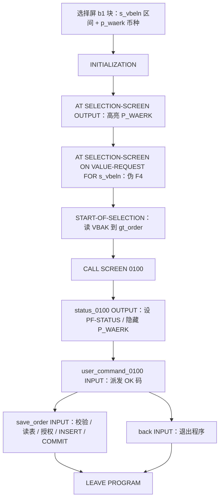
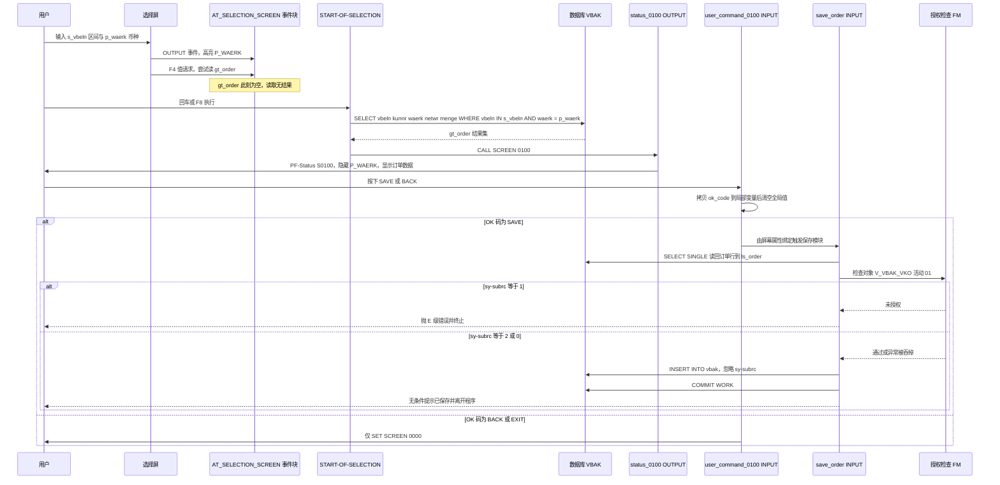

# ZORDER_DIALOG 源码走读报告 —— 选择屏事件块与屏幕 0100 的 PBO/PAI

> 分析对象：`REPORT zorder_dialog`（128 行，对话框报表 / Dialog Report，无 list processing）
> 关注重点：`AT SELECTION-SCREEN` 各事件块，以及屏幕 0100 的 PBO/PAI 模块（`status_0100`、`user_command_0100`、`save_order`、`back`）
> 结论前置：**保存路径（`save_order`）存在可直接导致越权写库与"假成功"的严重缺陷，不建议在补齐授权与错误处理前投入生产使用。**

---

## 一、程序定位与业务背景

### 1.1 它想解决什么问题

想象一个订单核对岗的日常：客服拿到客户报来的几个销售订单号，想一次性把这些订单的关键信息（客户、币种、订单净额）拉出来对一眼，确认金额有没有录错。在 SAP 标准事务里，SAL03 要一步步查、查一条退一次；标准报表程序要么只能做列表、要么做不了输入。所以开发写了这个 `ZORDER_DIALOG`：

1. 先弹一个**选择屏**，让操作员填订单号区间（`S_VBELN`）和币种（`P_WAERK`）；
2. `START-OF-SELECTION` 里按这两个条件从 `VBAK`（销售订单抬头）读数；
3. 再 `CALL SCREEN 0100` 进入一个**自绘屏幕**，把订单数据摆到屏幕上；
4. 屏幕 0100 上挂 `SAVE`（保存）、`BACK`、`EXIT`、`CANC` 四个功能码。

也就是说，它的定位是"**带对话式修改能力的销售订单查询/维护工具**"。

### 1.2 "现有方案为何不够"

- `SALD3`/`S_ALR_87012177` 之类的标准报表只读、只出列表，改不了数据，也不走授权对象；
- `SAL03` 单条查询，无法批量；
- 直接 `SE16` 看 `VBAK` 会暴露整张表给用户，且没有业务校验、没有授权对象约束。

所以"一个小而专的、带授权检查的订单维护对话框"在业务上是说得通的。问题出在实现。

### 1.3 整体设计范式（一句话定性）

这是一个**经典"报表 + 自绘屏幕（classic dialog report）"范式**的程序：`SELECTION-SCREEN` 收参 → `START-OF-SELECTION` 取数 → `CALL SCREEN 0100` → `MODULE ... OUTPUT`（PBO）刷新界面 → `MODULE ... INPUT`（PAI）响应功能码。它走的是 SAP 最原始的对话编程路线，**不是** ALV、不是 OO、也不是 RAP/Fiori。

这个范式的关键约束是：**屏幕 0100、PF-Status `S0100`、Titlebar `T0100` 都不在本文件里**，必须在 SE80/SE91 里另外手工创建。也就是说，这份源码单独拿出来是**跑不起来的半成品**，接手的人必须先知道它依赖哪些外部对象（详见 3.7）。

---

## 二、程序执行流程总览



> 注：`AT SELECTION-SCREEN` 的三个事件块全部发生在 `START-OF-SELECTION` **之前**；因此在 `ON VALUE-REQUEST` 里访问 `gt_order` 时，该内表还是初始状态（详见 3.5）。

### 责任链

| 子程序 | 调用者（触发者） | 职责 |
|---|---|---|
| 选择屏定义 `b1` 块 | 系统在进入程序时自动处理 | 声明 `s_vbeln`（订单号区间）与 `p_waerk`（币种，默认 EUR）两个输入字段 |
| `INITIALIZATION` | 系统，在选择屏显示之前 | 把当前日期记入 `gv_datum`、当前用户记入 `gv_user` |
| `AT SELECTION-SCREEN OUTPUT` | 系统，每次选择屏显示时 | 遍历 `SCREEN`，把 `P_WAERK` 设为高亮显示 |
| `AT SELECTION-SCREEN ON VALUE-REQUEST FOR s_vbeln` | 系统，用户在选择屏上按 `F4` 请求帮助时 | 读 `gt_order` 第一行到 `gs_order`，并弹一条 S 级消息 |
| `START-OF-SELECTION` | 系统，用户在选择屏执行（回车或 F8）时 | 按 `s_vbeln` + `p_waerk` 从 `VBAK` 取数到 `gt_order`，随后 `CALL SCREEN 0100` |
| `status_0100`（MODULE OUTPUT / PBO） | 系统，屏幕 0100 每次显示前 | 设 PF-Status `S0100` 与 Titlebar `T0100`，并把 `P_WAERK` 字段设为隐藏 |
| `user_command_0100`（MODULE INPUT / PAI） | 系统，用户在屏幕 0100 上按下带功能码的按钮时 | 把 `ok_code` 拷入局部变量后清空全局值，再按 `SAVE` / `BACK` / `EXIT` / `CANC` 分派 `SET SCREEN` |
| `save_order`（MODULE INPUT / PAI） | 由屏幕 0100 上 SAVE 功能码绑定的模块触发（设计意图） | 校验订单号非空 → 读 `VBAK` 行 → 调 `AUTHORITY-CHECK` → `INSERT INTO vbak` → `COMMIT WORK` → 提示成功并离开 |
| `back`（MODULE INPUT / PAI） | 由屏幕 0100 上返回功能码绑定的模块触发（设计意图） | `CALL SCREEN 0000` 后 `LEAVE PROGRAM` 结束程序 |

**两条重要事实**，先记下来，后面反复用到：

1. **正常退出路径不止一条**：`back` 模块走 `LEAVE PROGRAM`，而 `user_command_0100` 里的 `BACK`/`EXIT` 只走 `SET SCREEN 0000`——两条路径行为不一致（3.10）。
2. **`SAVE` 的实际执行路径取决于屏幕 0100 的属性配置，源码本身自相矛盾**（3.8）。

下面按这条流程，逐个子程序展开。

---

## 三、分组分析（按程序流程 / 子程序）

### 3.1 类型定义与全局数据声明区

先看整个程序的"地基"。这段只有一个类型结构、一个内表类型和五个全局变量。分两步：**类型定义**与**全局变量**。

#### ① 类型定义 `ty_order` / `ty_order_tab`

```abap
TYPES: BEGIN OF ty_order,
         vbeln TYPE vbeln_va,
         kunnr TYPE kunnr,
         waerk TYPE waerk,
         netwr TYPE netwr,
        menge TYPE menge,
       END OF ty_order.

TYPES ty_order_tab TYPE STANDARD TABLE OF ty_order WITH EMPTY KEY.
```

**做什么** — 定义结构 `ty_order`（订单号、销售客户、交易币种、订单净额、订单数量五个字段）及其标准内表 `ty_order_tab`；内表用 `WITH EMPTY KEY`，即只靠内部顺序维护、不带任何键。

**为什么** — 扁平结构对应 `SELECT` 的投影列表，作者显然打算"只取展示要用的几个字段"，这个出发点是对的；但 `WITH EMPTY KEY` 是为了后面能用 `READ TABLE ... INDEX 1` 定位"第一条"——这是把展示便利当成了数据结构设计。

**风险与改进** — 三个硬伤：

- **`menge`（数量）是行项目级字段，不属于抬头 `VBAK`**。`MENGE` 实际在 `VBAP` 上，订单数量只在"订单行"粒度才有意义，抬头上放 `MENGE` 是**语义错配**（哪怕类型长度看起来"对得上"）。`netwr`（订单净额）是抬头累计值，可以留；`menge` 必须去掉，或者程序应该读 `VBAK JOIN VBAP`。这也直接决定了后面 3.6 那条 `SELECT ... menge FROM vbak` 的成败。
- **缺少 `posnr`（行项目号）**，而 `VBAK` 的主键是 `VBELN + POSNR`。没有 `POSNR` 就无法定位"一张订单的某一行"，同一订单多行时语义立刻崩塌（`SELECT SINGLE` 只会随机取到某一行）。
- **`WITH EMPTY KEY` 放弃了二分查找**。只要后面出现"按订单号找行"的需求，`READ ... IN TABLE` 就退化为全扫描；正确做法是 `PRIMARY KEY vbeln` 或按需 `SORTED`。若坚持 `INDEX 1` 语义，代码里至少要写清"仅用于取第一行展示"。

#### ② 全局变量声明

```abap
DATA gt_order TYPE ty_order_tab.
DATA gs_order TYPE ty_order.
DATA gv_user  TYPE sy-uname.
DATA gv_datum TYPE sy-datum.
DATA gv_init  TYPE abap_bool.
```

**做什么** — 声明两个数据容器（`gt_order` 内表 / `gs_order` 工作结构）和三个标量（用户、日期、初始化标志）。

**为什么** — 前两个是报告级数据交换的标准写法：内表装结果集、结构做当前行，也被选择屏 `s_vbeln FOR gs_order-vbeln` 复用为参数工作区。命名遵循 `gt_/gs_/gv_` 前缀约定，是本程序少数值得肯定的地方。

**风险与改进** — **三个全局变量全是死代码，而且每一个死代码背后都藏着一个"本来该做但没做"的业务动作**：

- `gv_user` 只在 `INITIALIZATION` 里赋值、之后再未被读取——**本该传给授权检查确认"是谁在改"**；
- `gv_datum` 同样只赋值不使用——**本该作为变更时间戳写进订单抬头**；
- `gv_init TYPE abap_bool` 声明了却从没被赋值——**本该用来守卫 `SET PF-STATUS` 只做一次**（见 3.7）。

这三个"空壳变量"是本程序最典型的**意图-实现脱节信号**：读代码的人看到它们会以为功能已实现。建议要么补齐用途，要么直接删掉，别留着误导后续维护者。

---

### 3.2 选择屏定义（BLOCK `b1`）

```abap
SELECTION-SCREEN BEGIN OF BLOCK b1 WITH FRAME TITLE TEXT-001.
  SELECT-OPTIONS s_vbeln FOR gs_order-vbeln.
  PARAMETERS p_waerk TYPE waerk DEFAULT 'EUR'.
SELECTION-SCREEN END OF BLOCK b1.
```

**做什么** — 声明一个带边框、带标题 `TEXT-001` 的输入块，包含两项：`s_vbeln`（订单号选选项，可输区间，可留空）与 `p_waerk`（币种参数，单值，默认 `'EUR'`）。

**为什么** — 用 `BLOCK` 包裹是为了视觉分组，把"筛选条件"和"显示条件"放在一起，这是报表对话的标准布局。`SELECT-OPTIONS` 而非 `PARAMETERS`，是为了支持一次核对多个订单——符合 1.1 节的业务场景。直接 `FOR gs_order-vbeln` 引用全局结构，省掉一个参数工作区，是合法且常见的简写。

**风险与改进**：

- **`s_vbeln` 没有 `OBLIGATORY`，也没有 `OBLIGATORY` 的替代校验**。留空意味着 `IN s_vbeln` 生成空区间，3.6 的 `SELECT` 退化为对 `VBAK` 的**全表扫描**——这是生产上最容易踩的坑（连接数被拖死、DBA 找上门）。至少加 `OBLIGATORY`，或在 `AT SELECTION-SCREEN` 里拦截。
- **`p_waerk` 硬编码 `DEFAULT 'EUR'` 且是单值参数**。币种作为硬性过滤条件，只有一种币种可查；更合理的做法是把它做成 `SELECT-OPTIONS`（支持区间）或者干脆去掉——`VBAK.waerk` 是**交易币种**，用它做过滤会误杀掉那些用外币报价、本币记账的订单，业务规则本身就可疑。
- **`TEXT-001` 是外部依赖**：文本符号 `001` 必须在 `T100A` 里维护，否则选择屏标题显示为空或短转储。源码里看不到它。

---

### 3.3 `INITIALIZATION`

```abap
INITIALIZATION.
  gv_datum = sy-datum.
  gv_user  = sy-uname.
```

**做什么** — 在选择屏显示之前，把系统日期和当前用户名分别存入 `gv_datum` 和 `gv_user`。

**为什么** — `INITIALIZATION` 是"用户还没输入任何东西"的时间点，此刻抓 `sy-uname` / `sy-datum` 是标准做法（此时上下文最干净，不受后续屏幕循环影响）。作者显然是想为"记录谁在什么时候改的订单"做准备。

**风险与改进** — 这段本身**无语法/运行风险**，但它是 3.1 那个"死代码"结论的直接证据：两个变量存进来就没人用了，等于一次对话里白跑一趟。建议改为把这两个值真正用于变更审计——在 `save_order` 里写入订单抬头的变更字段，或至少打一条 `AUDIT` 日志；同时注意 `gv_user` 应作为 `AUTHORITY-CHECK` 的显式入参，而不是依赖 FM 内部隐式取当前用户（那在后台批处理或被其他程序 `CALL TRANSACTION` 进来时会取错人）。

---

### 3.4 `AT SELECTION-SCREEN OUTPUT`

```abap
AT SELECTION-SCREEN OUTPUT.
  LOOP AT SCREEN.
    IF SCREEN-NAME = 'P_WAERK'.
      SCREEN-INTENSIFIED = '1'.
      MODIFY SCREEN.
    ENDIF.
  ENDLOOP.
```

**做什么** — 每次选择屏显示时遍历系统内表 `SCREEN`，找到名字为 `P_WAERK` 的那个字段，把它设为高亮显示，再 `MODIFY SCREEN` 写回屏幕。

**为什么** — 这是"选择屏动态属性"的标准实现方式：`LOOP AT SCREEN` 改属性、`MODIFY SCREEN` 提交、回车后系统重新生成屏幕。字段名取 `P_WAERK` 是对的——`PARAMETERS p_waerk` 在选择屏上生成的单字符前缀字段名正是 `P_WAERK`。

**风险与改进** — 这段逻辑本身**无运行风险**，但暴露一个**产品设计上的不一致**：

- 作者先在这里郑重其事地**高亮**币种字段（暗示"这是关键输入，请重点确认"），进入屏幕 0100 后又在 `status_0100` 里把同一个字段**隐藏**（3.7）。一个先强调、后隐藏，说明业务意图在中途变了，却没回头改掉前面的强调动作。
- 没有任何 `AT SELECTION-SCREEN` 的**输入校验事件块**（`AT SELECTION-SCREEN ON CHECK`、`AT SELECTION-SCREEN ON HELP-REQUEST` 等）。用户在选择屏上按了 F8，除空区间会被全表扫描外，没有任何拦截点。
- 更稳妥的写法是用 `SCREEN-GET`/静态字段名直接定位，避免依赖字符串匹配（字符串匹配一旦有人重命名参数就静默失效，且失败无任何提示）。

---

### 3.5 `AT SELECTION-SCREEN ON VALUE-REQUEST FOR s_vbeln`

这个事件块是本程序**语义错位最严重的一处**，也是最容易让新接手的人"以为功能已实现"的地方。分两步看：代码写了什么、它实际会发生什么。

#### ① 代码做了什么

```abap
AT SELECTION-SCREEN ON VALUE-REQUEST FOR s_vbeln.
  READ TABLE gt_order INTO gs_order INDEX 1.
  MESSAGE 'No order data loaded yet' TYPE 'S'.
```

**做什么** — 当用户在选择屏 `s_vbeln` 字段按 `F4`（值请求）时，把 `gt_order` 的第一行读进 `gs_order`，然后弹一条 `S` 级消息 `'No order data loaded yet'`（"尚未装载订单数据"）。

**为什么** — 作者自己都知道此时 `gt_order` 是空的（消息文案就明说了），所以这段大概是想临时占位，等取数逻辑补上后再改成真正的 F4 帮助（比如 `DYNAMIC_F4` 或 `SEARCH HELP`）。占位代码先跑通流程，是能理解的开发习惯。

**风险与改进** — 这段占位代码有**三个叠加的问题**：

- **它没有实现任何 F4 功能**。用户在订单号框按 F4 得不到帮助列表，只得到一句莫名其妙的成功提示。用户会以为"这个字段不支持 F4"，从而放弃使用。真正要补的是 `DYNAMIC_F4` + 一个基于 `VBAK` 的搜索帮助，或者干脆用 Search Help 附加到选择屏字段。
- **它会污染全局工作区 `gs_order`**。`gs_order` 正是 `s_vbeln` 的参数工作区（见 3.2），一旦 `gt_order` 里真有数据，这行代码会把**第一条订单**（不是用户选的那条）写进 `gs_order`。而 `save_order`（3.9）恰恰是用 `gs_order-vbeln` 作为写库条件的——于是"F4 按过一次 → 保存时保存的可能是另一个订单"。这类跨事件块的状态污染极难排查，**必须在写操作前把工作区重新从屏幕字段读回来，或改用独立的 local 结构**。
- **时序上它根本不该访问 `gt_order`**：所有 `AT SELECTION-SCREEN` 事件都在 `START-OF-SELECTION` 之前触发，此刻 `gt_order` 必然是初始状态。`READ TABLE ... INDEX 1` 对空的 `STANDARD TABLE` 只会让 `sy-subrc = 4`、不抛异常也不会崩——但代码**完全没检查 `sy-subrc`**，随后弹出的 `S` 消息是误导性的"成功"。顺带说明：一旦 `ty_order_tab` 被改成 `HASHED` 或用初始键读 `SORTED` 表，同样的空读就是**直接短转储**——这段代码的可移植性也为零。

**结论**：占位逻辑本身不算"危险"，但它留在生产代码里是明确的雷区，建议在补齐 F4 之前先删除或加注释标注 TODO。

---

### 3.6 `START-OF-SELECTION`

取数与进入屏幕是两步，这两步之间没有任何数据完整性检查。

#### ① 从 `VBAK` 按区间取数

```abap
START-OF-SELECTION.
  SELECT vbeln kunnr waerk netwr menge
    FROM vbak
    INTO TABLE gt_order
    WHERE vbeln IN s_vbeln
      AND waerk = p_waerk.
```

**做什么** — 以 `vbeln IN s_vbeln`（选择屏区间）和 `waerk = p_waerk`（币种）为条件，把 `VBAK` 的五个字段整表读进全局内表 `gt_order`。

**为什么** — 在没有 ALV、没有 CDS View 的年代，`SELECT ... INTO TABLE` 配选选项区间是"批量查订单"的标准写法，思路没有错。

**风险与改进** — 这一段有三层问题，从致命到轻微：

- **🔴 字段语义错配：`MENGE` 不在 `VBAK` 上**。订单数量 `MENGE` 是行项目表 `VBAP` 的字段，`VBAK`（抬头）根本没有这一列。这条 `SELECT` 要么在**语法检查期就因未知字段报错**，要么说明这张表在真实系统里已被改动过而源码没跟上——**无论哪种，都意味着这份程序当前不可编译**。正确写法是去掉 `menge`（数量不是抬头的属性），或改读 `VBAK JOIN VBAP` 并把 `posnr` 一起带出来。
- **🟠 空区间 = 全表扫描**。`s_vbeln` 未设 `OBLIGATORY` 且无空值校验（见 3.2），用户留空直接回车就是对整张 `VBAK`（百万级行、100+ 字段）做全表扫描。这是典型的生产事故源。
- **🟡 无数量上限、无 `sy-subrc` 检查**。即使填了区间，也没限制最多查多少行；`gt_order` 可能撑爆内存，而且后续还要被逐行搬进屏幕。
- **🟡 无读取阶段的授权检查**。数据在**任何**授权判断之前就已读进内表（对比 3.9 的顺序问题），查询动作本身完全没有 `V_VBAK_VKO` 校验——任何能执行此事务的用户都能看到范围内所有订单的客户与金额。

#### ② 进入屏幕 0100

```abap
  CALL SCREEN 0100.
```

**做什么** — 取数完成后直接 `CALL SCREEN 0100`，把控制权交给自绘屏幕，进入标准的 PBO/PAI 循环。

**为什么** — `CALL SCREEN`（而非 `CALL TRANSACTION`）是让报表进入对话模式的标准写法，屏幕号在调用点指定。

**风险与改进**：

- **不检查 `gt_order` 是否为空**。查不到数据时，屏幕 0100 依然打开，把一个空表单摆在用户面前，还挂着一排功能键（能点 SAVE）。应该先 `IF gt_order IS INITIAL. MESSAGE ... . ENDIF.`，或者干脆在屏幕上显示 `未找到符合条件的订单` 并禁用 SAVE。
- **屏幕 0100 是外部依赖**。屏幕号、PF-Status `S0100`、Titlebar `T0100` 都不在本文件里；`CALL SCREEN` 会先触发 `AT SCREEN-OUTPUT` 的模块调用，即 `status_0100`。如果屏幕尚未在 SE80/SE91 建好，程序在运行时才报"屏幕未找到"，源码阶段完全无感。
- **没有留下"返回选择屏"的路径**。`back` 走的是 `LEAVE PROGRAM`（3.10），用户退出去只能从事务重新进来、改条件、重跑一次查询。要支持"改条件再查"，需要 `SET SCREEN 1000` 之类回到选择屏的处理，而不是终止程序。

---

### 3.7 `MODULE status_0100 OUTPUT`（屏幕 0100 的 PBO）

这是屏幕 0100 的 **PBO（Process Before Output）** 模块，在屏幕显示**之前**被系统调用。分两步：设状态栏/标题栏、动态改屏幕属性。

#### ① 设置 PF-Status 与 Titlebar

```abap
MODULE status_0100 OUTPUT.

  SET PF-STATUS 'S0100'.
  SET TITLEBAR 'T0100'.
```

**做什么** — 每次屏幕 0100 显示前，把菜单栏设为 `S0100`、标题栏设为 `T0100`。

**为什么** — 对话屏必须有 PF-Status 和 Titlebar，`SET PF-STATUS`/`SET TITLEBAR` 放在 PBO 里是最常见的写法（很多教材范本都这么写）。

**风险与改进** — **`SET PF-STATUS` 不应该无条件放在每次 PBO**。屏幕在一次对话里会经历多次 PBO（每次 F4、每次按功能键、`LEAVE PROGRAM` 前都会再走一轮），每次都重设 PF-Status 会连带触发 `AT PF-STATUS`、覆盖用户在工具栏上的个性化菜单，也可能重置标题栏上的动态文本。作者显然意识到了这点——他声明了 `gv_init`（3.1）却忘了用：

- **建议**：用 `gv_init` 做一次性守卫，或把这两句挪到 PBO 里 `IF gv_init IS INITIAL ... gv_init = abap_true. ENDIF.` 的分支中；更简单的替代方案是在 `INITIALIZATION` 里就设好标题栏，PF-Status 只设一次。

#### ② 遍历屏幕隐藏 `P_WAERK`

```abap
  LOOP AT SCREEN.
    IF SCREEN-NAME = 'P_WAERK'.
      SCREEN-DISPLAY-MODE = '1'.
      MODIFY SCREEN.
    ENDIF.
  ENDLOOP.

ENDMODULE.                     "status_0100
```

**做什么** — 遍历屏幕 0100 的所有字段，找到 `P_WAERK`，把它的 `SCREEN-DISPLAY-MODE` 设为 `'1'`（即**隐藏，不可显示也不可修改**），并写回屏幕。

**为什么** — 作者的意图显然是：币种是"从选择屏带过来的筛选条件"，到了详情屏不该让用户改，避免用户改了币种导致"看到的金额和查出来的不一致"。

**风险与改进** — **想法可以理解，实现方式制造了死角**：

- **隐藏的是筛选依据，用户失去了核对依据**。`p_waerk` 直接参与 3.6 的 `WHERE` 条件，且是单值参数、默认 `'EUR'`。一旦隐藏，用户在屏幕 0100 上**既看不到也改不了**币种，只能退回整个事务重来。而这里恰好又有一个生命周期漏洞：选中屏的 `p_waerk` 在 `START-OF-SELECTION` 之后依然存在，**用户本来可以在选择屏上改币种再 F8 重查**——但 `back` 用的是 `LEAVE PROGRAM`（3.10），根本回不去。隐藏 + 回不去 = 功能死角。
- **应该用 `'2'` 而不是 `'1'`**。如果目的是"只读不可改"，`SCREEN-DISPLAY-MODE = '2'`（显示但保护）才对；`'1'` 是彻底不可见。既然已经在 `LOOP AT SCREEN` 里了，把字段设为只读展示，用户至少能确认"这批订单是按 EUR 查的"。
- **字符串匹配是脆弱的**。如果屏幕 0100 上这个字段实际命名为别的（见下），或有人重命名了 `p_waerk`，这个 `IF` 会静默不命中，代码照样编译通过、程序照样跑，只是效果消失且无人察觉。
- **这里暴露了一个未文档化的硬依赖**：屏幕 0100 上必须存在一个名为 `P_WAERK` 的字段。而 `P_WAERK` 是**选择屏上 `PARAMETERS p_waerk` 生成的字段名**，它**不会自动出现在自绘屏幕 0100 上**。也就是说：除非有人在屏幕 0100 里手工画了一个恰好叫 `P_WAERK` 的字段，这段代码永远命中不了。这是"对话框程序"的典型隐性债务。

---

### 3.8 `MODULE user_command_0100 INPUT`（屏幕 0100 的 PAI：功能码派发）

这是屏幕 0100 的 **PAI** 模块，专门处理"用户按了哪个功能键"。分四步：缓存并清空 OK 码、`SAVE` 分支、`BACK/EXIT/CANC` 分支、以及**缺失的兜底分支**。

#### ① 缓存 OK 码并清空全局值

```abap
MODULE user_command_0100 INPUT.

  DATA lv_ok_code TYPE sy-ucomm.

  lv_ok_code = ok_code.
  CLEAR ok_code.
```

**做什么** — 把全局 `ok_code` 拷进局部变量 `lv_ok_code`，然后立刻 `CLEAR` 全局 `ok_code`。

**为什么** — 这是**教科书级的正确写法**。全局 `ok_code` 在 PAI 结束后依然保留用户上次按的键，如果不清空，下一次 PBO 之后系统会以为用户又按了一次同一个键，导致功能被重复触发（尤其在 `SET SCREEN` 重绘之后）。先拷后清，保证后续 `CASE` 判断稳定。

**风险与改进** — 无明显风险，这是本程序写得最规范的一段。唯一可提的一点：`lv_ok_code TYPE sy-ucomm` 与直接用 `sy-ucomm` 等价，局部变量的意义是**在 `CLEAR ok_code` 之后仍能拿到值**；如果哪天后人图省事写成 `CASE sy-ucomm.` 也没错，但两种写法不要混用，容易看岔。

#### ② `SAVE` 分支

```abap
  CASE lv_ok_code.
    WHEN 'SAVE'.
      SET SCREEN 0100.
```

**做什么** — 当 OK 码为 `'SAVE'` 时，把下一屏设成 0100——**也就是留在当前屏，什么都不做**。

**为什么** — 作者显然想避免"同一个 OK 码在一次对话里被处理两次"，所以让 SAVE 走一个"原地打转"的分支，等真正的保存逻辑由 `save_order` 模块完成。

**风险与改进** — **🔴 这是本程序的设计矛盾点，直接关系到 3.9 的 `save_order` 到底会不会被调用。**

在 classic dialog 里，一个功能码的处理路径由**屏幕 0100 的属性**决定，二选一：

- 若 SAVE 键的"功能模块"属性绑定为 `SAVE_ORDER`，系统直接调用 `save_order`，**`user_command_0100` 不会因为这个键而触发**；
- 若绑定为 `USER_COMMAND_0100`，则走这段 `CASE`，而这里的 `SET SCREEN 0100` **不执行任何保存**。

也就是说：**按当前代码，SAVE 要么不落库，要么根本不该走到这里。** 作者在同一个功能码上同时做了"绑定到 `save_order` 模块"和"`CASE` 里自己处理"两件事，二者语义冲突，且源码里没有任何注释说明屏幕属性到底是哪种。这不是风格问题，而是"功能可能完全不可用"的正确性风险。

- **建议改法**：让功能码派发成为**唯一入口**，模块之间用显式调用串起来，而不是依赖屏幕属性二选一：

```abap
    WHEN 'SAVE'.
      SET MESSAGE-ID ...
      " 由 USER_COMMAND 统一派发，避免与屏幕属性绑定的模块重复
      PERFORM save_order_data.
```

#### ③ `BACK` / `EXIT` / `CANC` 分支

```abap
    WHEN 'BACK' OR 'EXIT'.
      SET SCREEN 0000.
    WHEN 'CANC'.
      SET SCREEN 0000.
ENDCASE.
```

**做什么** — `BACK` 和 `EXIT`、以及 `CANC` 三种功能键，都只执行 `SET SCREEN 0000`。

**为什么** — 作者的意图是"退出对话，回到选择屏/结束屏幕序列"。

**风险与改进** — 三层问题：

- **语义混同**：`BACK`（返回）、`EXIT`（退出）、`CANC`（取消）是三种不同的用户意图，这里被压成同一个动作。而且 `BACK` 和 `EXIT` 在 SAP 里是**系统保留功能码**，由功能组 `SAPL...`（如 `SAV1`/`SAPMSSY` 等）定义时会产生标准返回行为；自定义程序擅自复用保留码，容易与标准行为打架。**建议改用自定义功能码**（`ZSAVE` / `ZBACK` / `ZEXIT`），并在标题栏提示对应标准动作。
- **放弃修改不确认**：用户在屏幕 0100 上做了一半修改，`CANC` 一下就没了，屏幕上还挂着 SAVE。标准做法是 `EXIT`/`CANC` 先 `MESSAGE '是否放弃修改?' TYPE 'S'` 配合确认按钮，或直接 `CALL TRANSACTION ... AND EXIT`。
- **`SET SCREEN 0000` 单独使用不等于退出程序**：它只把"下一屏"设为 0000；PAI 走完后控制流回到 `CALL SCREEN 0100` 之后，由于程序没有 `END-OF-SELECTION`、也没有任何列表输出，用户会得到一个**空白列表屏**或者被踢回调用方事务，行为依赖于事务上下文。而 `back` 模块（3.10）用的是 `CALL SCREEN 0000` + `LEAVE PROGRAM`，**两条退出路径的行为不一致**——同一个"返回"按钮，取决于它绑在哪个模块上，后果不同。

#### ④ 缺失的兜底分支

```abap
ENDCASE.

ENDMODULE.                     "user_command_0100
```

**做什么** — `CASE` 到此结束，**没有 `WHEN OTHERS`**，也没有处理 `ENTER`（ok_code 为空）和帮助类功能码（`?`、`F1`、`F4`）。

**为什么** — 大多数示例代码都这么写，属于"先跑起来再说"的取舍。

**风险与改进** — 未识别的功能码会让用户"按了没反应"，且没有任何提示：

- 用户在屏幕上按 **Enter**（`ok_code` 为初始值）→ 不匹配任何 `WHEN` → 什么都不发生；
- 按 `F1`/帮助 → 不匹配 → 无响应；
- 后续有人新增一个 F 码却忘了改这里 → 静默失效。

**建议补一个兜底分支**：

```abap
    WHEN OTHERS.
      MESSAGE '功能暂不可用' TYPE 'S'.
      CLEAR ok_code.
```

---

### 3.9 `MODULE save_order INPUT`（保存 —— 本程序风险最集中的模块）

用户明确问的"保存那段"就在这里。**先给结论：这个模块的写库链路，从授权检查到错误处理到提交时机，三处都是可被利用或必然出错的缺陷，不具备生产可用性。**

它分五步：**入参校验** → **读表** → **授权检查** → **`INSERT`** → **提交与退出**。

#### ① 必填校验与局部变量

```abap
MODULE save_order INPUT.

  DATA lv_check TYPE c LENGTH 1.
  DATA ls_order TYPE ty_order.

  IF gs_order-vbeln IS INITIAL.
    MESSAGE 'Sales order number is mandatory' TYPE 'E'.
  ENDIF.
```

**做什么** — 声明两个局部变量（一个 1 位字符 `lv_check`、一个 `ty_order` 结构 `ls_order`），然后检查全局工作区 `gs_order` 的订单号是否为空，为空则抛 `E` 级错误消息终止本次操作。

**为什么** — PAI 模块里的 `DATA` 局部声明是正常写法（生命周期仅本次屏幕处理），校验放在模块最前面也符合"先校验后干活"的顺序。

**风险与改进**：

- **`lv_check` 声明后从未使用**，是死变量——典型的"打算做校验结果标志但没做完"。
- **校验的字段来源不可信**。`gs_order-vbeln` 不是从屏幕 0100 的输入字段实时读回来的，而是全局工作区的残留值（它还是 `s_vbeln` 的参数工作区，并可能被 3.5 的 F4 占位代码覆盖成 `gt_order` 的第一行）。**等于用"可能被别人改过的旧值"决定要写哪张订单**。正确做法是从屏幕结构重新 `MOVE` 到独立的局部结构再判断。
- `MESSAGE ... TYPE 'E'` 在对话框 PAI 中会终止事务并回滚，**这点是对的**，此处无风险。
- 校验只有"非空"一项，**没有做格式/存在性校验**（比如订单号是否只含数字、是否属于输入的区间）。

#### ② 读取 `VBAK` 单行

```abap
  SELECT SINGLE * FROM vbak INTO ls_order
    WHERE vbeln = gs_order-vbeln.
```

**做什么** — 以 `vbeln = gs_order-vbeln` 为条件，把 `VBAK` 的一整行（全部 100 多个字段）读进局部结构 `ls_order`。

**为什么** — 作者大概想让 `ls_order` 作为待插入的数据载体，"读一条、改一改、插回去"。

**风险与改进** — **🔴 这一行有两处独立的硬伤**：

- **结构不匹配，必然失败**。`ls_order` 是 `ty_order`（5 个字段），而 `SELECT SINGLE *` 返回 `VBAK` 的完整结构（约 110 个字段）。字段数量与类型都不等，ABAP 要么在**语法检查期**就报"结构与数据库结构不一致"，要么在运行到 `MOVE` 时因长度不等而**短转储**。无论如何，这段程序不可能正常运行。
- **业务逻辑本身是荒谬的**。就算结构修对了，"把库里已有的一行原样读出来、再原样插回去"也没有业务含义：它是**复制**而不是**新增**，`VBAK` 的主键 `VBELN + POSNR` 会立刻主键冲突。而且 `ls_order` 从读出到插入之间**没有任何 `MOVE` 或字段赋值**——整个模块没有一次真正的"新增数据"动作。
- 附带：`VBAK` 是宽表且 `VBELN` 非唯一索引前缀，`SELECT SINGLE *` 在一单多行时只会**任意返回一行**，结果不可预期；同时 `SELECT SINGLE *` 属于应被避免的写法，应只投影需要的字段。

#### ③ 授权检查（最需要警惕的一步）

```abap
  CALL FUNCTION 'AUTHORITY-CHECK'
    EXPORTING
      OBJECT        = 'V_VBAK_VKO'
      TCD           = 'VBA1'
      ACTIVITY      = '01'
    EXCEPTIONS
      NOT_AUTHORIZED = 1
      OTHERS         = 2.

  IF sy-subrc = 1.
    MESSAGE 'Not authorized for sales orders' TYPE 'E'.
  ENDIF.
```

**做什么** — 调用授权检查功能模块，检查当前用户对对象 `V_VBAK_VKO`（销售订单抬头授权对象）在事务 `VBA1` 下、活动 `'01'` 的权限；`NOT_AUTHORIZED` 时置 `sy-subrc = 1`，任何其他异常置 `2`；随后**只**在 `sy-subrc = 1` 时抛 E 级错误。

**为什么** — 有这个意识很好：写订单前必须过授权对象，这是 SAP 的安全底线，也是本程序唯一一处考虑安全的地方。

**风险与改进** — **🔴🔴 这一步是整份程序里最严重的问题，可以被无声绕过。逐条说：**

- **🔴 异常被吞掉，导致 fail-open（失败即放行）**。声明了 `OTHERS = 2`，却**只处理 `sy-subrc = 1`**，对 `sy-subrc = 2` 视而不见。而任何"FM 不存在、内部错误、参数错误、传输层异常"都会落进 `OTHERS`，此时程序**继续往下执行 `INSERT INTO vbak` 写入数据**。授权检查一旦出错，结果是**放行而不是拒绝**——这是安全设计里最不该出现的方向。所有 `OTHERS` 都必须默认拒绝（fail-close）或至少报错终止。
- **🔴 检查点在读数据之后**。顺序是"先 `SELECT SINGLE * FROM vbak` 读出数据，再查授权"。即使后面的检查生效，也已经是"先看后问"。正确顺序是**先授权、后取数、后写**。
- **🔴 活动码用错**。`ACTIVITY = '01'` 是**显示**权限；这里做的是 `INSERT`（**新增**订单），至少需要 `'03'`（创建）。也就是说，即使这段检查正常工作，用户也只需要"能看"就能"能写"——**授权等级与操作等级不匹配**。
- **🟠 没有检查返回结果**。调用没有取任何"是否通过"的结果输出参数，也没有传 `USERID`。授权检查的正确形态是**读返回值**：要么 FM 自身以异常表达拒绝，要么必须取回结果字段并判断。`gv_user`（3.3）明明抓了用户名却没用上。
- **🟠 硬编码对象与事务**。`TCD = 'VBA1'` 写死，程序若要复用到别的入口事务，权限检查会**按错误的事务去校验**；应传 `sy-tcode` 或由调用方指定。
- **🟡 对象有效性未验证**。`V_VBAK_VKO` 是销售订单抬头授权对象，`AUTHORITY-CHECK` 对**未在 TACL/TACT01 维护的对象**通常按"无检查权限 = 允许"处理——一旦配置缺失，检查等于没做。建议上线前用 `SU01`/`SU53` 实测越权用户场景。

#### ④ 直接插入 `VBAK`

```abap
  INSERT INTO vbak VALUES ls_order.
```

**做什么** — 把 `ls_order` 的全部字段按位置结构插入 `VBAK` 表，不做任何结果判断。

**为什么** — 作者想实现"新增订单"。但直接 `INSERT` 标准业务表是很原始的做法。

**风险与改进** — **🔴 这一行的问题不亚于授权检查**：

- **🔴 不检查 `INSERT` 结果**。`INSERT` 之后必须判断 `sy-subrc`（以及 `dbsql_inserted_rows`）才知道是否真的写进去了。现在主键冲突（重复订单行）、非空字段未填、类型转换错误、字段长度溢出等情况都会被**静默吞掉**，而程序紧接着就 `COMMIT WORK` 并提示"已保存"——**用户看到"Order saved"，数据库里可能什么都没有**。这正是"保存那段"最典型的假成功陷阱。
- **🔴 绕过业务逻辑直接写标准表**。`VBAK` 是订单抬头，正确的新增路径是 **BAPI**（`BAPI_SALESORDER_CREATE` + `BAPI_TRANSACTION_COMMIT`）或经典 FM（`SALES_ORDER_CREATE` / `SALESORDER_CREATE`）。BAPI 会自动带出：凭证号范围、`KOMP`（抬头/行关联）、订单类型校验、状态对象、交货计划、定价、条件表、会计凭证接口、输出确定。而直接 `INSERT` 出来的订单**行项目缺失、`POSNR` 必填未填、状态对象为空**，在 `VL01N` 里打开是一张残缺订单，在交货、billing、开票环节全面崩溃，还可能污染后续所有基于订单的报表。
- **🟠 缺少字段映射**。`ls_order` 与 `VBAK` 结构不一致（见 ②），`VALUES` 的按位置赋值风险极高；正确的通用做法是 `MOVE-CORRESPONDING`（并显式确认字段名一致），且只映射业务上确实要设的字段。
- **🟠 无 `MOVE` 到写结构的过程**。整个模块没有任何一处给 `ls_order` 赋业务值，说明"保存什么"这个需求本身尚未实现。

#### ⑤ 提交与退出

```abap
  COMMIT WORK.

  MESSAGE 'Order saved' TYPE 'S'.
  SET SCREEN 0000.
  LEAVE PROGRAM.

ENDMODULE.                     "save_order
```

**做什么** — 无条件提交数据库更改，弹出 `S` 级消息"订单已保存"，把下一屏设为 0000，然后 `LEAVE PROGRAM` 终止程序。

**为什么** — 作者意图是"保存成功后给个提示并关掉窗口"。

**风险与改进** — **🔴 这一段把前面所有问题**固化成了不可逆的后果**：

- **🔴 在未确认写入成功的前提下 `COMMIT WORK`**。一旦提交，前面 ④ 里"静默失败的 INSERT"变成**永久丢失**（无法回滚、无法追查），而用户看到的仍然是"已保存"。**提交必须以"确认写成功"为前提**：`IF sy-subrc = 0. COMMIT WORK. ... ELSE. ROLLBACK. MESSAGE ... TYPE 'E'. ENDIF.`
- **🔴 全程序没有一处 `ROLLBACK`**。任何异常路径（④ 失败、后续校验不过）都没有回滚语义。虽然当前流程在 ④ 之后没有别的可能失败的步骤，但这属于**结构性隐患**——任何人日后在 ④ 与 ⑤ 之间插入逻辑，都会踩进"脏数据已提交"的坑。
- **🔴 成功消息无条件弹出**。应改为仅在 `sy-subrc = 0` 时提示，且带具体信息（写入的订单号、行项目号）。
- **🟠 `MESSAGE ... TYPE 'S'` 紧接 `LEAVE PROGRAM`**。`S` 消息会显示在下一屏，而下一屏是不存在的——用户很可能**根本看不到这条"已保存"**。稳妥做法是 `MESSAGE '...' TYPE 'S' DISPLAY LIKE 'E'` 配合 `CALL TRANSACTION ... AND EXIT`，或在退出前用 `MESSAGE ... TYPE 'S'` 并确认已显示。
- **🟡 `SET SCREEN 0000` 是死代码**。`SET SCREEN` 只在 PAI 结束时才生效，而紧接着的 `LEAVE PROGRAM` 直接终止了流程，这句永远不会起作用，删掉更清爽（`back` 模块里同样的 `CALL SCREEN 0000` 后面也有这个问题）。
- **🟡 `COMMIT WORK` 不带 `AND WAIT`**。异步提交意味着 `LEAVE PROGRAM` 之后更新可能仍在后台队列里，若后续有报表立刻查这张表会读到旧数据；`COMMIT WORK AND WAIT` 更符合"提示用户已保存"的语义。

---

### 3.10 `MODULE back INPUT`

保存路径讲完了，最后看退出路径。分两步：退出动作、以及它与 3.8 的一致性问题。

```abap
MODULE back INPUT.

  CALL SCREEN 0000.
  LEAVE PROGRAM.

ENDMODULE.                     "back
```

**做什么** — 先 `CALL SCREEN 0000` 结束屏幕序列，再 `LEAVE PROGRAM` 立即终止整个程序。

**为什么** — 对"不做任何修改、直接关掉"的场景，`LEAVE PROGRAM` 是最干脆的退出方式，会触发 `LEAVE PROGRAM` 事件（可用于 `AT SELECTION-SCREEN EXIT` 的善后，但本程序没写）。

**风险与改进**：

- **🟠 与 `user_command_0100` 的 `BACK`/`EXIT` 分支行为不一致**。同一个"返回"动作，绑到 `back` 模块是"直接结束程序"，绑到 `user_command_0100` 是"`SET SCREEN 0000` 后可能落到空白列表屏"。**按钮绑定决定用户看到什么行为**，这在维护上是陷阱。应统一到一处处理。
- **🟡 `CALL SCREEN 0000` 是多余且误导的**。它是一条"同步调用"语句，在 PAI 模块里会被立即执行（跳到屏幕 0000 的 PBO），紧接着的 `LEAVE PROGRAM` 才是真正的退出；写在一起容易让人误以为"先进 0000 屏再退出"。而且屏幕 0000 并没有为程序定义任何内容，调用它的语义很模糊。直接 `LEAVE PROGRAM.` 一行足够。
- **🟠 退出不做任何确认与提示**。用户在屏幕 0100 上如果已有未保存的输入，退出会静默丢弃；配合 3.9 的"假成功"提示，用户很容易误判自己的改动已经生效。至少应区分"无改动直接退"和"有改动退出需确认"。
- **🟡 退出后回到哪里，取决于调用事务**。因为用了 `LEAVE PROGRAM` 而非 `CALL TRANSACTION ... AND EXIT`，用户会退回调用这个事务的事务（例如 SE38/ALV 列表或调起它的程序），而不是标准订单事务。对话框工具更规范的做法是 `CALL TRANSACTION 'S_ALR_87012177' AND EXIT` 之类把用户送回明确的落点。

---

## 四、执行流程全景图（数据视角）

下图展示**一次完整的"打开 → 查询 → 保存"对话**中，数据在各个子程序之间的流转。注意三条关键的数据交接边：`gt_order` 从取数到屏幕、`gs_order` 从选择屏工作区到写库条件、`ls_order` 从读表到插入。



**从数据视角看三个最危险的地方**（图中红色路径所隐含的事实）：

1. **`gt_order` 从未被真正展示逻辑消费**：它只在 3.5 被读过一次（读不到），3.6 读进来之后，`status_0100` 里**没有任何一处引用 `gt_order` 的循环**——屏幕 0100 上的数据从哪来？答案是"从屏幕自身的输入字段通过同名结构自动传输"。也就是说，**读数和显示之间没有建立代码层面的联系**，这依赖屏幕布局的隐式约定（3.7 已提到）。
2. **`gs_order` 是唯一贯穿"选参 → 写库"的共享状态**，且它被 3.5 的占位代码污染过。跨事件块的隐式共享 + 无重新读取，是最容易产生"改 A 单写成 B 单"的土壤。
3. **`ls_order` 走完了"读 → 检查 → 写"但中间没有任何赋值**：数据从数据库读进来，原样拿去插入另一个位置。这是本程序最直白的证据——**保存功能的业务实现尚未开始**。

---

## 五、问题清单与改进建议（按优先级）

### 🔴 P0 — 业务正确性 / 安全（必须修复后才能上生产）

| # | 所在子程序 | 问题 | 改进方向 |
|---|---|---|---|
| 1 | `save_order` | `OTHERS = 2` 被声明却未处理，授权检查异常时**继续 INSERT**，属 fail-open | 补 `IF sy-subrc <> 0. MESSAGE ... TYPE 'E'. ROLLBACK. ENDIF.`，任何不确定一律拒绝 |
| 2 | `save_order` | `INSERT INTO vbak` 后不检查 `sy-subrc`，随后无条件 `COMMIT WORK` 与"已保存"提示，**假成功** | `IF sy-subrc = 0 → COMMIT WORK AND WAIT + 提示；ELSE → ROLLBACK + E 级错误` |
| 3 | `save_order` | `SELECT SINGLE * FROM vbak INTO ls_order`，目标结构只有 5 字段，与 VBAK 全字段不匹配，必然失败 | 改为投影必要字段到 `ty_order`，或补齐为真正的 `VBAK` 映射结构 + `MOVE-CORRESPONDING` |
| 4 | `save_order` | `AUTHORITY-CHECK` 的 `ACTIVITY = '01'` 是显示权限，却用于 `INSERT` 新增操作 | 改为 `'03'`（创建）或按实际动作取对应活动，并**显式传入 `gv_user`** |
| 5 | `save_order` | 授权检查**排在读表之后**，属于"先看后问" | 调整为：授权检查 → 读表 → 校验 → 写入 → 提交 |
| 6 | `save_order` | 直接 `INSERT` 标准业务表 `VBAK`，绕过订单创建的全部业务逻辑，产出残缺订单 | 改用 BAPI `BAPI_SALESORDER_CREATE` + `BAPI_TRANSACTION_COMMIT` |
| 7 | `save_order` | 全程无 `ROLLBACK` | 任何失败分支补 `ROLLBACK WORK` |
| 8 | `START-OF-SELECTION` | `SELECT ... menge FROM vbak` 中 `MENGE` 是 `VBAP` 行项目字段，`VBAK` 上不存在 | 去掉 `menge`，或改为 `VBAK JOIN VBAP` 并带出 `posnr` |
| 9 | `user_command_0100` 与 `save_order` | SAVE 功能码同时被"屏幕属性绑定"与 `CASE` 分支处理，且 `CASE` 分支只做 `SET SCREEN 0100`——**保存功能可能完全不生效** | 单一入口：统一在 `user_command_0100` 中派发并显式调用保存逻辑，去掉屏幕属性上的重复绑定 |
| 10 | `user_command_0100` 与 `back` | 两条退出路径行为不一致（一个 `LEAVE PROGRAM`，一个只 `SET SCREEN 0000`） | 统一退出方式（`CALL TRANSACTION ... AND EXIT` 或统一 `LEAVE PROGRAM`） |

### 🟠 P1 — 健壮性

| # | 所在子程序 | 问题 | 改进方向 |
|---|---|---|---|
| 11 | 选择屏定义 / `START-OF-SELECTION` | `s_vbeln` 非必填且无校验，空区间 = `VBAK` 全表扫描 | 加 `OBLIGATORY` 或在 `AT SELECTION-SCREEN` 中拦截空值并限制最大行数 |
| 12 | `AT SELECTION-SCREEN ON VALUE-REQUEST FOR s_vbeln` | 无任何 F4 功能，仅弹 S 级消息；且可能用 `gt_order` 第一行**覆盖 `gs_order`**（该结构正是 `s_vbeln` 的参数工作区） | 删除占位逻辑并补真正的 `DYNAMIC_F4`/搜索帮助；严禁在此事件块写全局工作区 |
| 13 | `AT SELECTION-SCREEN ON VALUE-REQUEST FOR s_vbeln` | 未检查 `READ TABLE` 的 `sy-subrc`（此时 `gt_order` 必为空） | 补 `sy-subrc` 判断，或直接移除 |
| 14 | `save_order` | 写库条件取自全局工作区 `gs_order-vbeln`，非屏幕实时值，可能指向错误订单 | 写操作前从屏幕结构重新读取到独立局部结构 |
| 15 | `status_0100` | `SET PF-STATUS` / `SET TITLEBAR` 每次 PBO 重复执行，覆盖用户个性化菜单 | 用已声明但未使用的 `gv_init` 做一次性守卫 |
| 16 | `status_0100` | `SCREEN-DISPLAY-MODE = '1'` 把 `P_WAERK` 隐藏，而它是唯一的筛选依据且用户回不去选择屏 | 改为 `'2'`（只读显示），并提供返回选择屏重新查询的路径 |
| 17 | `user_command_0100` | `CASE` 无 `WHEN OTHERS`，Enter/F1/未知功能码静默无响应 | 增加兜底分支并给用户提示 |
| 18 | `user_command_0100` | 复用了保留功能码 `BACK` / `EXIT`，且 `CANC` 放弃修改不确认 | 改自定义功能码；退出前对未保存内容做确认 |
| 19 | `START-OF-SELECTION` | 不检查 `gt_order` 是否为空，直接 `CALL SCREEN 0100`，空表单且 SAVE 可点 | 取数后先判空并提示，或在屏幕上禁用 SAVE |
| 20 | `save_order` | `MESSAGE ... TYPE 'S'` 后立即 `LEAVE PROGRAM`，提示可能看不到 | 用 `DISPLAY LIKE 'E'` 配合 `CALL TRANSACTION ... AND EXIT`，或确保消息先显示 |

### 🟡 P2 — 性能与规范

| # | 所在子程序 | 问题 | 改进方向 |
|---|---|---|---|
| 21 | `save_order` | `lv_check TYPE c LENGTH 1` 声明未用；`MESSAGE ... TYPE 'E'` 硬编码文本（应 `MESSAGE-ID` + 消息类，或至少提到消息类 `00`） | 删除死变量，文本走 `MESSAGE-ID` |
| 22 | 全局声明区 / `INITIALIZATION` | `gv_user`、`gv_datum` 只赋值不使用，是"意图-实现脱节"的死代码 | 真正用于变更审计与授权检查入参，或删除 |
| 23 | `save_order` | `COMMIT WORK` 未带 `AND WAIT`，提示"已保存"时更新可能尚未可见 | 改 `COMMIT WORK AND WAIT` |
| 24 | `save_order` / `back` | `SET SCREEN 0000` / `CALL SCREEN 0000` 后紧跟 `LEAVE PROGRAM`，该语句永不生效 | 删除死代码 |
| 25 | `save_order` | `SELECT SINGLE * FROM vbak` 取宽表全字段 | 只投影需要的字段；必要时用表缓冲 |
| 26 | `AT SELECTION-SCREEN OUTPUT` | 先高亮 `P_WAERK`（3.4），进入 0100 又隐藏（3.7），两处意图矛盾 | 统一交互设计，二选一 |
| 27 | 类型定义段 | `ty_order_tab ... WITH EMPTY KEY` 放弃二分查找 | 按访问模式改成 `PRIMARY KEY vbeln` 或 `SORTED` |

### 🟢 P3 — 可扩展性 / 隐性依赖

| # | 所在子程序 | 问题 | 改进方向 |
|---|---|---|---|
| 28 | `status_0100` | 屏幕 0100 上必须手工存在名为 `P_WAERK` 的字段，否则该逻辑静默失效（源码不含屏幕定义） | 在源码中用 `SCREEN 0100 BEGIN OF BLOCK...` 定义屏幕，或补 README 说明外部对象清单 |
| 29 | 全局对象依赖 | `S0100`、`T0100`、`TEXT-001`、屏幕 `0100`、授权对象 `V_VBAK_VKO`、事务 `VBA1` 全为外部依赖 | 输出一份依赖清单；PF-Status 用 `ASSIGN` 到程序内定义，避免命名冲突 |
| 30 | `START-OF-SELECTION` / `back` | 退出只能 `LEAVE PROGRAM`，无法回选择屏改条件重查 | 增加返回选择屏并保留 `gt_order` 的分支，或提供"重新选择"功能码 |
| 31 | 类型定义段 | 结构缺少 `posnr`，无法表达"一单多行"，也无金额与数量的业务口径说明 | 按 `VBAK`/`VBAP` 职责拆分结构，补注释说明字段口径 |

---

## 六、整体评价与启发

### 6.1 值得肯定的地方

1. **范式选型是对的**。业务场景（批量查订单 + 在对话里改 + 走授权）用 classic dialog report 实现是恰当的，事件块划分（PBO / PAI / 选择屏事件）也齐全，没有出现"把逻辑塞进 `INITIALIZATION`"这类典型反模式。
2. **OK 码处理是全篇最规范的一段**（`user_command_0100`）。先拷局部变量再 `CLEAR ok_code`、用 `sy-ucomm` 类型声明局部变量——这是很多人写很多年都写不对的细节。
3. **命名约定一致**。`gt_` / `gs_` / `gv_` / `ls_` / `lv_` 全程统一，读代码时变量含义基本不用猜。
4. **有安全意识**。知道在写标准表前要调授权检查——方向完全正确，只是实现全错。

### 6.2 主要短板

1. **保存路径整体不可用**。授权检查 fail-open、写入结果不检查、无条件提交、绕过 BAPI 直插标准表——这四条叠加，意味着这段代码在生产上不是"偶尔出错"，而是"**能过就过、出错还骗你说成功**"。用户点一次 SAVE，数据库可能什么都没变，界面上却写着"Order saved"。
2. **占位代码混入生产**。`AT SELECTION-SCREEN ON VALUE-REQUEST` 里的假 F4、`lv_check` 空壳、`gv_init` 未用、`gv_user`/`gv_datum` 未用——这些"看起来在做事、其实没做"的片段，比明显的 bug 更消耗接手人的时间。
3. **语义校核缺失**。`MENGE`（数量，行项目级）被放进 `VBAK` 抬头结构、`ACTIVITY = '01'`（显示权限）被用来做新增、`waerk`（交易币种）被当作筛选的业务规则——这些都是**只看字段名和类型会误判为合理**的错位。只有按业务语义逐个校核，才能发现这类问题。
4. **责任分散在两处**。同一个 SAVE 动作的处理逻辑被拆成"屏幕属性绑定"和"`CASE` 分支"两半，谁生效取决于 SE80 里看不见的配置。这类"配置在代码之外"的耦合，是对话框程序维护成本的主要来源。

### 6.3 可学到的设计经验（4 条）

- **失败必须向"拒绝"倾斜**。`OTHERS` 捕获后不处理，等于把安全检查变成了"检查不存在时的放行"。凡是涉及权限、资金、数据写入的分支，default 行为必须是拒绝。**`sy-subrc` 只有一个可信用法：立刻判断它。**
- **"提示成功"是一句需要证据的话**。`COMMIT WORK` 之前必须有"写入确实成功"的判据，`MESSAGE ... '已保存'` 之前必须有提交完成的保证。**先验证、后提交、再告知**，顺序反了就是欺骗用户。
- **写标准表用 BAPI，读宽表用投影**。`INSERT` 标准业务表跳过的不是几行代码，而是整个业务对象体系（状态、凭证、输出、会计）；`SELECT *` 浪费的不只是时间，还有内存和后续的字段维护成本。**能力边界要先认清再动手。**
- **死代码是意图的墓碑**。`gv_init`、`gv_user`、`lv_check` 这些"声明了却没用"的变量，记录着作者想做但没做完的事。看懂死代码，比读懂活代码更快理解一段代码**打算**干什么、**实际**差在哪——`gv_init` 一眼就能看出 PF-Status 缺守卫，这比读二十行 `LOOP AT SCREEN` 更快定位问题。

---

*报告完。核心结论：`zorder_dialog` 的对话框架可复用，但 `save_order` 与选择屏取数存在 P0 级缺陷（授权 fail-open、写入结果不检查、无条件提交、直插标准表、字段语义错配），且 SAVE 功能码存在"可能完全不落库"的路径冲突；修复顺序建议为：① 修正 SAVE 派发路径 → ② 补 `INSERT` 结果判断与 `ROLLBACK` → ③ 授权检查改为 fail-close 且先于取数 → ④ 改用 BAPI 新增订单 → ⑤ 修正 `MENGE`/空区间/死代码等健壮性问题。*