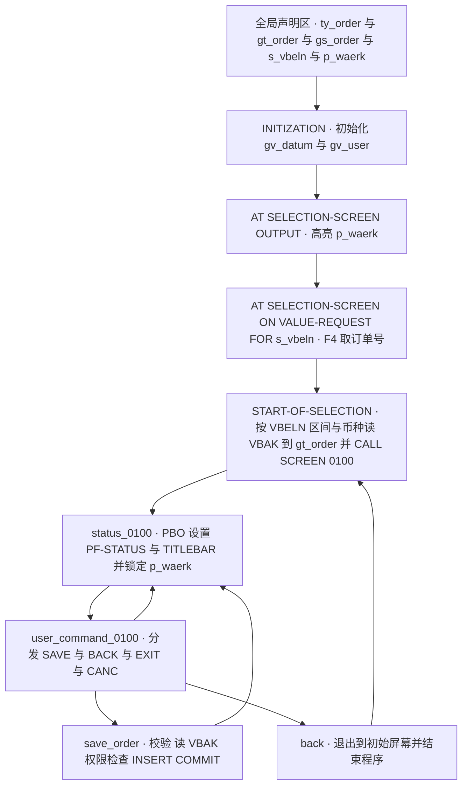
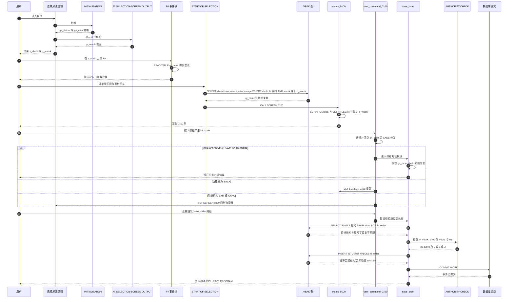

# `REPORT zorder_dialog` 代码走读报告

> 走读重点：选择屏幕的各个事件块、屏幕 0100 的 PBO / PAI 模块，以及 `save_order` 里那段数据库写操作的风险。
> 分析方式：按程序真实执行顺序逐个子程序展开，每个代码块给出「做什么 / 为什么 / 风险与改进」三层。

---

## 一、程序定位与业务背景

### 它想解决什么

销售部门接到一个需求：业务员手上有一串销售订单号（可能来自邮件、Excel、或者客户电话），希望一次性把订单抬头信息（客户、币种、净金额、总数量）拉出来核对；核对过程中还要能顺手改一笔订单头的某个字段，并保存。

在这之前，标准做法只有两条路：

1. 让业务员在 `VA01`/`VA02` 一个个手工敲订单号进去——订单一多就崩；
2. 让开发写 `SE38` 报表导 Excel——但报表改不了数据。

所以这个程序的身份是**"报表的取数能力 + 对话框的编辑能力"的缝合产物**：选择屏负责圈定范围，`START-OF-SELECTION` 负责批量取数，`CALL SCREEN 0100` 负责逐单查看和保存。它不是纯报表，也不是纯维护屏，而是典型的"批量查询转单条维护"过渡形态。

### 整体设计范式（一句话定性）

**经典 ABAP 报告式对话框范式（Report + Dynpro 0100 + PBO/PAI 模块）**，数据层用全局内表 `gt_order` + 全局结构 `gs_order` 承载全部状态，模块之间不传参、只靠全局变量耦合；控制流用 `SET SCREEN` / `LEAVE PROGRAM` 手工驱动。

这个范式本身是合理且在大量 Z 程序里被广泛使用的，读者应该先接受它、而不是急着上 OO/ABAP Cloud。但本程序把这个范式用坏了三处：**对话框的输入值与业务结构之间没有连线**、**F4 读了一个当时还不存在的数据集**、**保存逻辑在结构不匹配 + 无权限 + 无事务控制的情况下直插 VBAK**。下面逐段拆。

---

## 二、程序执行流程总览



> 说明：`BACK` 事件块内部调 `LEAVE PROGRAM` 实际会直接终止程序，图中回边画出的是"作者意图"；真实代码没有回到选择屏的路径（详见 3.9）。

### 责任链表

| 子程序 | 调用者 | 职责 |
| --- | --- | --- |
| 全局声明区（`TYPES` / `DATA` / `SELECTION-SCREEN`） | 编译器 + 屏幕生成器 | 定义订单结构、内表、4 个全局变量，以及两个录入字段 `s_vbeln`、`p_waerk` |
| 事件块 `INITIALIZATION` | 系统（选择屏显示之前自动触发） | 记录进入程序时的日期与用户名 |
| 事件块 `AT SELECTION-SCREEN OUTPUT` | 系统（每次显示选择屏前自动触发） | 把 `p_waerk` 高亮，提示这是关键筛选项 |
| 事件块 `AT SELECTION-SCREEN ON VALUE-REQUEST FOR s_vbeln` | 用户在 `s_vbeln` 上按 F4 | 试图从 `gt_order` 取第一行回填订单号（此时该表必为空） |
| 事件块 `START-OF-SELECTION` | 用户在选择屏回车 | 按订单号区间 + 币种读 `VBAK` 到 `gt_order`，然后 `CALL SCREEN 0100` |
| `MODULE status_0100 OUTPUT` | 流逻辑（每次进入 0100 屏的 PBO） | 设置 `PF-STATUS 'S0100'`、`TITLEBAR 'T0100'`，并把屏上 `p_waerk` 置为输出模式 |
| `MODULE user_command_0100 INPUT` | 流逻辑（PAI 检出功能码，且没有同名对话模块接管时） | 分发 `SAVE` / `BACK` / `EXIT` / `CANC` 四个功能码 |
| `MODULE save_order INPUT` | 0100 屏上按钮（或字段）绑定的对话模块 | 必填校验 → 读 `VBAK` → 权限检查 → `INSERT` → `COMMIT` → 返回选择屏 |
| `MODULE back INPUT` | 标准功能码 `BACK`（标准流逻辑按名自动调用同名模块） | 退出到初始屏幕并结束程序 |

下面按这条流程，逐个子程序展开。

---

## 三、分组分析

### 3.1 全局声明区与选择屏定义

这一段是整份代码的"地基"，分三步看：结构定义、内表与全局变量、选择屏录入字段。

#### ① 结构与内表定义

```abap
TYPES: BEGIN OF ty_order,
         vbeln TYPE vbeln_va,
         kunnr TYPE kunnr,
         waerk TYPE waerk,
         netwr TYPE netwr,
         menge TYPE menge,
       END OF ty_order.

TYPES ty_order_tab TYPE STANDARD TABLE OF ty_order WITH EMPTY KEY.

DATA gt_order TYPE ty_order_tab.
DATA gs_order TYPE ty_order.
DATA gv_user  TYPE sy-uname.
DATA gv_datum TYPE sy-datum.
DATA gv_init  TYPE abap_bool.
```

**做什么** — 定义一个扁平结构 `ty_order`，装 5 个字段：订单号 `vbeln`、客户号 `kunnr`、币种 `waerk`、净金额 `netwr`、数量 `menge`；再定义内表 `ty_order_tab` 作为容器，并开出 4 个全局变量：查询结果内表 `gt_order`、当前订单结构 `gs_order`，以及 `gv_user`、`gv_datum`、`gv_init` 三个从头到尾没被读过的标量。

**为什么** — 传输结构扁平化是对的：选屏查询只要这几个列，没必要把 `VBAK` 的三百多个字段拖进内存。`STANDARD TABLE ... WITH EMPTY KEY` 同样是教科书式正确选择——它是**工作内表**，`SELECT ... INTO TABLE` 灌进来时不需要唯一键，如果作者用了默认的 `WITH UNIQUE KEY vbeln`，一旦查出重复行就会以 `DUPLICATE_KEY` 短时转储收场，这一步是本程序少数写得干脆的地方。

**风险与改进** — 真正的坑在**语义**而不在长度。`netwr` 的数据元素含义是"订单**整单**净金额"（`VBAK` 抬头表上的汇总值），`menge` 在 `VBAK` 里的含义同样是"整单总数量"（由所有行项目累加出来的抬头汇总字段），它不是行项目数量。用 `SELECT ... FROM vbak` 取这两个字段，拿到的是"单据级汇总值"；而这个结构命名为 `ty_order`、程序自我定位为"Interactive order entry"，很容易让后续维护者以为它是"一行 = 一个订单行项目"。如果业务真实诉求是逐行核对，字段和数据源都选错了：应取 `VBAK` + `VBAP`，`menge` 换 `VBAP-NETT`/`MENGE`（行数量）、`netwr` 换 `VBAP-NETWR`（行金额）。另外 `gv_user` / `gv_datum` / `gv_init` 是死变量：`gv_user` 和 `gv_datum` 在 `INITIALIZATION` 被赋值后从未使用，说明作者本想用它们打审计戳（如果真要直插 `VBAK`，没有 `ERDAT`/`ERNAM` 审计字段本身就是数据完整性问题）；`gv_init` 更明显是想做"首次进入 0100 屏"的标记或"数据是否被改过"的脏标记，声明了却没落地。改进方向：要么删掉，要么落实为 `gv_init` 首次 PBO 标记 + `gv_user`/`gv_datum` 写进抬头字段。

#### ② 选择屏录入字段

```abap
SELECTION-SCREEN BEGIN OF BLOCK b1 WITH FRAME TITLE TEXT-001.
  SELECT-OPTIONS s_vbeln FOR gs_order-vbeln.
  PARAMETERS p_waerk TYPE waerk DEFAULT 'EUR'.
SELECTION-SCREEN END OF BLOCK b1.
```

**做什么** — 在分块框 `b1` 里定义两个录入字段：订单号区间 `s_vbeln`（选择选项，宿主字段挂在 `gs_order-vbeln` 上）、币种 `p_waerk`（单值参数，默认 `EUR`）。

**为什么** — 用 `SELECT-OPTIONS ... FOR gs_order-vbeln` 而不是 `FOR vbeln_va`，是为了省掉一个中间变量，语义上等价，属于常见简化。

**风险与改进** — 这里埋了两颗雷，第三章后面会各爆一次，这里先记账：

1. **`s_vbeln` 的宿主是 `gs_order`**。这意味着 `s_vbeln` 的输入值直接躺在业务结构 `gs_order-vbeln` 里；任何代码只要往 `gs_order` 里 `READ TABLE`，就会把用户正在输入的订单号冲掉（第 3.4 节的 F4 就是这样）。同一个结构同时扮演"选择屏宿主"和"对话框当前订单"两个角色，必须拆开：用 `TYPE-POOLS`（选择屏 include）或者独立的 `s_vbeln_waerk` 结构承接录入值。
2. **`PARAMETERS ... DEFAULT 'EUR'` 取消了必填性**。带 `DEFAULT` 的参数是可选的，留空时 `p_waerk` 初值为空串，而 `VBAK-WAERK` 永不为空，于是 `START-OF-SELECTION` 的 `WHERE waerk = p_waerk` 恒不命中——用户按回车看到的是一个空对话框，连一句提示都没有。此外币种硬编码 `EUR` 忽略了客户公司的本位币（通常应从 `T001C` / `T000` 读，或至少允许 `sy-langu` 无关的默认值）。改进：用 `PARAMETERS p_waerk TYPE waerk DEFAULT 'EUR' OBLIGATORY`，或干脆在 `AT SELECTION-SCREEN` PAI 里加校验并 `MESSAGE ... TYPE 'E'`（注意：**不能**用 `AT SELECTION-SCREEN OUTPUT` 里的高亮来代替校验，见 3.3）。

到这里，静态地基铺完了。接下来系统会按固定顺序触发初始化事件块。

---

### 3.2 事件块 `INITIALIZATION`

`INITIALIZATION` 是**隐式事件块**：它不属于任何子程序调用，而是流逻辑在显示选择屏之前自动执行一次，源码里看不见调用者，但责任链表的"调用者"列必须写清楚，否则新人会以为这段代码永远不跑。

```abap
INITIALIZATION.
  gv_datum = sy-datum.
  gv_user  = sy-uname.
```

**做什么** — 在进入程序时把系统日期存入 `gv_datum`、把当前登录用户名存入 `gv_user`。

**为什么** — 意图很清楚：给后面的数据变更留下审计痕迹（谁、什么时候）。这是符合 SAP 审计要求的常规做法，在写 `VBAK` 抬头这类业务数据时尤其必要。

**风险与改进** — 无功能风险，但**价值为零**：这两个变量在程序剩余部分从未被读取，所以审计信息根本没有落库。改进有两条路，选哪条取决于 3.8 节的整改力度：

- 如果保留直插 `VBAK`（不建议，见 3.8），至少要把 `gs_order` 里对应的 `ERDAT` / `ERNAM` / `AEDAT` / `AENAM` 填上；
- 更合规的做法是彻底放弃 `INSERT`，改用 BAPI（`BAPI_SALESORDER_CREATE` 等），由 BAPI 内部负责编号段、审计字段和一致性检查。

顺带一句：`INITIALIZATION` 里不要做昂贵操作（查数据库、弹消息框），它在每次重新进入选择屏时都会跑一次。

初始化结束后，系统显示选择屏，先触发 PBO 类事件块 `AT SELECTION-SCREEN OUTPUT`。

---

### 3.3 事件块 `AT SELECTION-SCREEN OUTPUT`

```abap
AT SELECTION-SCREEN OUTPUT.
  LOOP AT SCREEN.
    IF SCREEN-NAME = 'P_WAERK'.
      SCREEN-INTENSIFIED = '1'.
      MODIFY SCREEN.
    ENDIF.
  ENDLOOP.
```

**做什么** — 在选择屏显示**之前**遍历系统内表 `SCREEN`，找到名字为 `P_WAERK` 的那个字段，把它标记为高亮（`SCREEN-INTENSIFIED = '1'`），并用 `MODIFY SCREEN` 写回屏幕属性，让用户在选择屏上看到币种字段是"发光的"。

**为什么** — 意图是"视觉提示"：让用户意识到币种是必填/关键的筛选项。技术套路本身是完全正确的——`LOOP AT SCREEN` + 改属性 + `MODIFY SCREEN` 是动态改屏幕属性的标准姿势，`MODIFY SCREEN` 写在 `IF` 内部（而不是循环末尾无条件调用）也是对的写法，避免了全屏无谓刷新。

**风险与改进** —

1. **高亮不等于校验。** 用户完全可以不管这个高亮、直接回车（`p_waerk` 留空 → 查不到数据 → 静默空屏）。`SCREEN-INTENSIFIED` 是纯 UI 提示，不构成任何输入约束。改进：补一个 `AT SELECTION-SCREEN.` PAI 事件块做真正的校验：
   ```abap
   AT SELECTION-SCREEN.
     IF p_waerk IS INITIAL.
       MESSAGE 'Please enter a currency' TYPE 'E'.
     ENDIF.
   ```
2. **字段名硬编码 `'P_WAERK'` 字符串。** 一旦有人重命名字段或把参数挪到别的块，高亮静默失效，没有任何报错——这类"沉默退化"是 Z 程序里最难查的一类问题。改进：改用 `MODIFY SCREEN` 配合 `SCREEN-GROUP` / 或至少在注释里标注与选择屏定义处的强耦合；更好的做法是换成校验 + `OBLIGATORY`，把提示交给系统而不是靠颜色。
3. **该模式在选择屏上做视觉标记意义有限**，因为 `AT SELECTION-SCREEN OUTPUT` 只在显示选择屏时跑，而真正需要强调币种的场景是对话框 0100（见 3.6，那里作者又写了一遍几乎相同的循环）。

选择屏画出来后，用户可能会在订单号字段上按 F4，这会触发下一个事件块。

---

### 3.4 事件块 `AT SELECTION-SCREEN ON VALUE-REQUEST FOR s_vbeln`

这是本次走读里问题最集中的一个事件块，逻辑很短，但三处都是硬伤。

```abap
AT SELECTION-SCREEN ON VALUE-REQUEST FOR s_vbeln.
  READ TABLE gt_order INTO gs_order INDEX 1.
  MESSAGE 'No order data loaded yet' TYPE 'S'.
```

**做什么** — 用户在 `s_vbeln` 上按 F4 时，本段试图从查询结果内表 `gt_order` 里用 `INDEX 1` 取第一行，**直接读进全局结构 `gs_order`**（也就是 `s_vbeln` 的宿主结构），然后弹一条 `'S'` 成功消息。

**为什么** — 作者显然想做一个"F4 快速带出订单号"的便捷功能：既然内表里已经有查出来的订单，就用第一行当默认值，省得手敲。`INDEX 1` 而不是带 `WHERE` 的读，说明设计意图就是"无条件取第一行"。

**风险与改进** — 三处，任意一处都足以让这个功能失效：

1. **数据源在时间上根本不存在。** `AT SELECTION-SCREEN` 阶段的执行顺序是：`INITIALIZATION` → `AT SELECTION-SCREEN OUTPUT` → （显示选择屏）→ 用户操作 → `AT SELECTION-SCREEN` PAI → `START-OF-SELECTION`。`gt_order` 只有在 `START-OF-SELECTION` 里才会被 `SELECT INTO TABLE` 填充。用户是**还没按回车**就按了 F4，此刻 `gt_order` 必然是空表，`READ TABLE` 必然 `sy-subrc = 4`，整段逻辑是"读取一个尚不存在的数据集"。改进：F4 的数据来源不能是程序运行期的中间结果，标准做法有三种——`CALL FUNCTION 'F4_VALUES'`（自己组装 value table）、在 `VBELN_VA` 上挂搜索帮助（Search Help）、或调用自定义 F4 函数模块从 `VBAK` 现查。
2. **`READ TABLE` 结果没有判 `sy-subrc`，却直接污染了 `gs_order`。** 读失败时 `sy-subrc = 4`，代码毫不理会。今天因为表是空的、`READ TABLE` 没有传输数据，所以侥幸没出事；但这是一个**定时炸弹**：一旦将来有人在上游给 `gt_order` 预填数据（比如做成"上次查询结果回显"），这段代码就会**静默覆盖用户在选择屏上已经输入的订单号**（因为 `s_vbeln` 的宿主就是 `gs_order-vbeln`），屏上显示的还是旧值、下一次 PAI 才被刷掉，排查起来极其痛苦。改进：无论是否要取数，都必须 `IF sy-subrc <> 0. ...` 分支处理；更根本的是把选择屏宿主结构与业务结构拆开。
3. **F4 里弹 `'S'` 消息等于什么都没说。** F4 是对话步骤（dialog step），消息显示后紧跟着选择屏 PAI 会被触发，消息随即被下一条消息覆盖，用户几乎看不到。而且这段代码在**任何情况下**都弹这条消息（没有条件判断），所以"取到了数据"这个分支在文案上是不存在的。改进：错误提示应放在 `AT SELECTION-SCREEN` PAI 事件块里用 `TYPE 'E'`，或用 `MESSAGE ... TYPE 'S'` 配合 `MESSAGE` 保留机制；在 F4 模块里正确的方式是"取到值就回填、取不到就 `MESSAGE ... TYPE 'E'` 阻断"。

至此，选择屏交互结束。用户按下回车，数据流进入 `START-OF-SELECTION`——这是整个程序真正的业务起点。

---

### 3.5 事件块 `START-OF-SELECTION`

这一段是取数核心，两步走：读 `VBAK`，然后进对话框。

#### ① 取数

```abap
START-OF-SELECTION.
  SELECT vbeln kunnr waerk netwr menge
    FROM vbak
    INTO TABLE gt_order
    WHERE vbeln IN s_vbeln
      AND waerk = p_waerk.
```

**做什么** — 按选择屏上的订单号区间（`s_vbeln`）和币种（`p_waerk`）两个条件，从销售订单抬头表 `VBAK` 读 5 个字段，整个结果集灌进全局内表 `gt_order`。

**为什么** — 列清单投影是对的（不 `*`），条件字段 `VBELN` 命中 `VBAK` 的主键索引前缀，区间扫描代价可控；`SELECT ... INTO TABLE` 还会**先清空目标内表**再灌数据，这一点保证了反复执行时不会残留上一轮结果（这一点对 3.9 讨论的"回到选择屏再跑一次"是有利的，不用额外写 `CLEAR`）。

**风险与改进** —

1. **允许空区间 = 允许全表扫描。** `SELECT-OPTIONS` 可以全空，此时 `vbeln IN ( )` 退化为无条件扫描。`VBAK` 是销售订单抬头表，生产系统动辄百万级行，全量灌进内表会直接吃掉主存并触发 `TSV_TNEW_INMEM_IMP` 类的短时转储。改进：入口拦截
   ```abap
   IF s_vbeln[] IS INITIAL.
     MESSAGE 'Please enter at least one order number' TYPE 'E'.
   ENDIF.
   ```
2. **无 `PACKAGE SIZE`，大区间没有分批出口。** 用户填 `1-99999999` 就一次性进内存。改进：`SELECT ... INTO TABLE @gt_order PACKAGE SIZE 1000` 配合显式 `LOOP ... ENDLOOP`（注意：用了 `PACKAGE SIZE` 就不能再靠内表读，必须 `LOOP AT gt_order`），或用 `SELECT ... INTO @DATA(lt_tmp) UP TO n ROWS` 分页。
3. **币种作为硬过滤条件是业务设计缺陷。** 一个 `VBELN` 唯一对应一个 `WAERK`，用户明明输了正确的订单号，只要该订单不是 `EUR` 币，就得到空结果——而空结果没有任何提示（`START-OF-SELECTION` 里没有 `IF gt_order IS INITIAL` 的分支）。更合理的做法是：币种只作为**默认显示值/明细列**，或者用"币种不空才过滤"的软条件。至少要补一句：
   ```abap
   IF gt_order IS INITIAL.
     MESSAGE 'No order data found for the entered criteria' TYPE 'S'.
     RETURN.
   ENDIF.
   ```
4. **进入对话框前没有做读取权限检查。** 程序把订单号、客户号、金额都读了出来，却在写入时（3.8）才做权限检查。读取动作本身同样受 `V_VBAK_VKO` 约束，正确顺序是"读之前就检查"。改进：把 `AUTHORITY-CHECK` 提到 `START-OF-SELECTION`（或抽成一个共享 FORM/方法），检查通过再取数。

#### ② 切换到自定义屏幕

```abap
  CALL SCREEN 0100.
```

**做什么** — 取数结束后调用静态屏幕 `0100`，程序从"选择屏模式"切换为"对话框模式"，后面所有交互都发生在 0100 屏上。

**为什么** — 这是从"批量查询"进入"单条维护"的标准衔接方式，`CALL SCREEN` 在 `START-OF-SELECTION` 里是正确的使用位置（非对话模块中）。

**风险与改进** — 无明显语法风险，但有两个体验/健壮性问题：

1. **上一步取数为空也照样进屏**，用户面对一个空对话框还以为是程序卡了。补上"无数据直接 `LEAVE PROGRAM` / 停在选择屏"的判断更稳妥。
2. **对话终止路径不统一**：从对话框回到选择屏用的是 `SET SCREEN 0000`（3.7），而 `back` 里又用了 `CALL SCREEN 0000`（3.9），两处风格不一致，其中 `back` 的写法在 PAI 上下文中本身就是错的（见 3.9）。建议全局统一：PAI 里只用 `SET SCREEN`。

有了数据、进了对话框，第一次进入 0100 会触发 PBO。

---

### 3.6 `MODULE status_0100 OUTPUT`（屏幕 0100 的 PBO）

PBO（Process Before Output）在**每次** 0100 屏显示之前执行，包括首次进入、PAI 处理完后 `SET SCREEN 0100` 重新显示、以及 `CLEAR` 触发的刷新。读懂这一段是理解"对话框数据怎么上屏"的前提。

```abap
MODULE status_0100 OUTPUT.

  SET PF-STATUS 'S0100'.
  SET TITLEBAR 'T0100'.

  LOOP AT SCREEN.
    IF SCREEN-NAME = 'P_WAERK'.
      SCREEN-DISPLAY-MODE = '1'.
      MODIFY SCREEN.
    ENDIF.
  ENDLOOP.

ENDMODULE.                     "status_0100
```

**做什么** — 每次显示 0100 屏时：设置状态栏为 `S0100`、标题栏为 `T0100`（都用硬编码名称），然后遍历 `SCREEN` 内表，把屏上名为 `P_WAERK` 的字段设为只读/输出模式（`SCREEN-DISPLAY-MODE = '1'`），并 `MODIFY SCREEN` 生效。

**为什么** — 前两句是"装门面"：状态栏提供 SAVE/BACK/EXIT/CANC 按钮（正是 3.7 分发的那些功能码），标题栏给出屏名。后一句是"锁定币种"：既然 0100 是从一次固定查询结果进来的，币种就是这次查询的既定条件，不允许用户在查看过程中改掉它——这个业务意图是合理的。

**风险与改进** —

1. **PBO 里没有任何"把数据搬到屏上"的动作。** 这是本程序最致命的设计缺口，第三章其余部分的表现都源于此。传统 Dynpro 的自动绑定规则是：屏上字段与 ABAP 数据对象**同名**时，流逻辑在 PBO 自动做"变量 → 屏"、在 PAI 自动做"屏 → 变量"。但本程序声明的变量是 `gs_order`、`gt_order` 这类带前缀的**结构/内表**，屏上字段**不可能**与结构分量同名（`VBELN` 与 `gs_order-vbeln` 不是同一个 ABAP 对象名），程序里也没有任何 `MODULE` 或 `vbeln = gs_order-vbeln` 这样的搬运动作。结果就是：0100 屏上的输入值**无处可落**，而 `save_order` 读的是 `gs_order-vbeln`——它永远保持初始值。改进（两条路任选）：
   - 简单路线：为屏上每个可输入字段声明同名 `DATA`（如 `DATA vbeln TYPE vbeln_va.`），在 PBO 里 `vbeln = gs_order-vbeln.`，在 PAI 里 `gs_order-vbeln = vbeln.`（放在 `MODULE ... INPUT` 或在 `user_command` 之后）；
   - 规范路线：定义 `ty_order` 的**对话框 include**（`SCREEN 0100` 的字段直接对着 `DATA` 声明），或者干脆换成 **ALV + Field Catalog** 走 `REUSE_ALV_GRID_DISPLAY`。
2. **`SET PF-STATUS 'S0100'` / `SET TITLEBAR 'T0100'` 硬编码且无存在性兜底。** 这两个对象必须在 SE41/SE42 里手工建好，改名或传输遗漏会直接运行时报错（程序作者之外的人看不到这两句和真正的按钮配置之间的关联）。改进：加注释标明"S0100 需含 SAVE/BACK/EXIT/CANC 功能码"，或改用 `SET PF-STATUS` + 动态标题（`SET TITLEBAR ... WITH title = ...`）把订单号显示在标题栏上，一眼能看出当前在编辑哪张单。
3. **锁币种只锁了屏幕，没锁数据。** `SCREEN-DISPLAY-MODE = '1'` 只是让用户改不了，内部的 `p_waerk` 数据对象仍可被 PAI 代码改写；而真正的并发风险是"两个用户同时开同一张单，后保存的覆盖先保存的"。改进：保存时至少检查 `VBAK` 的 `AEDAT`（最后修改时间/用户）与打开时读到的是否一致，冲突则 `MESSAGE ... TYPE 'E'`，这比任何屏幕锁定都有效。
4. **与 3.3 重复且脆弱。** 同名硬编码 `'P_WAERK'` 出现了两次，任何一次改名都造成静默退化。若 0100 屏上实际没有名为 `P_WAERK` 的字段（屏是手工画的，很可能字段名对不上），这个循环就是纯空转。

PBO 装好了屏幕，用户按键后进入 PAI。

---

### 3.7 `MODULE user_command_0100 INPUT`（屏幕 0100 的 PAI —— 功能码分发）

```abap
MODULE user_command_0100 INPUT.

  DATA lv_ok_code TYPE sy-ucomm.

  lv_ok_code = ok_code.
  CLEAR ok_code.

  CASE lv_ok_code.
    WHEN 'SAVE'.
      SET SCREEN 0100.
    WHEN 'BACK' OR 'EXIT'.
      SET SCREEN 0000.
    WHEN 'CANC'.
      SET SCREEN 0000.
  ENDCASE.

ENDMODULE.                     "user_command_0100
```

**做什么** — 把全局 `ok_code` 复制到局部变量 `lv_ok_code`，**清空**全局 `ok_code`（这是标准套路，防止同一功能码被重复处理），然后按功能码分支：`SAVE` → `SET SCREEN 0100`（留在本屏），`BACK` / `EXIT` / `CANC` → `SET SCREEN 0000`（回到选择屏）。

**为什么** — `CLEAR ok_code` 这一步是这里最有价值的专业写法，值得单独表扬：清空后流逻辑会继续处理屏幕字段并重新显示屏幕；不清空的话同一个功能码会在下一轮 PBO/PAI 里被反复触发。`SET SCREEN 0000` 也是从对话框返回选择屏的正确姿势（`0000` 是报告程序初始屏幕的特殊编号）。整体"先存档再清空、后 `CASE` 分发"的骨架是标准教科书写法。

**风险与改进** —

1. **`SAVE` 分支是空动作，保存永远不发生。** `SET SCREEN 0100` 的唯一作用是"重置 OK code 并重画屏幕"，它不会触发 `save_order`。也就是说 `save_order` 只能靠"屏上按钮绑定该对话模块"来触发，作者却又在状态栏里定义了一个 `SAVE` 功能码，两条路径并存而其中一条是断的。改进：把保存逻辑统一到一处——要么 `SAVE` 分支里设置 `ok_code = 'SAVE_ORDER'` 之类真实字段级功能码，要么在 `SAVE` 分支里直接调用同一个保存 FORM/方法（不要用 `PERFORM` 复制代码，抽成 FORM/方法被两个入口共用）。
2. **三个"退出"功能码行为不一致。** 按 SAP 标准流逻辑，功能码 `BACK` / `EXIT` / `CANC` 会**优先查找同名对话模块**；本程序有 `MODULE back`（见 3.9，里面是 `LEAVE PROGRAM`，直接结束程序），却**没有** `EXIT` / `CANC` 模块，于是 `EXIT` 和 `CANC` 落到 `USER_COMMAND` 里走 `SET SCREEN 0000`（回到选择屏，程序继续跑）。结果：工具栏上三个长得几乎一样的按钮，`BACK` 直接退出程序，`EXIT`/`CANC` 回到选择屏——用户预期（退出 = 终止，取消 = 放弃）被打乱。改进：要么给三个码都建同名模块统一行为，要么在 `USER_COMMAND` 里显式区分语义（`CANC` 通常应 `LEAVE PROGRAM`，`BACK`/`EXIT` 回选择屏），并在状态栏上把三者对应关系写进注释。
3. **离开对话框前没有未保存修改确认。** 作者声明了 `gv_init` 却没用，本意很可能就是"记录初次状态/脏标记"。改进：用 `gv_init`（或重命名为 `gv_changed`）在 `user_command_0100` 退出前判断是否有修改，有则弹 `MESSAGE ... TYPE 'S'` 二次确认（`MESSAGE ... = 'Q'` / `POPUP`）。
4. **没有 `WHEN OTHERS`。** 未知功能码（例如用户在命令框手敲的 `SAVE` 变体、程序升级后新加的按钮）会被静默吞掉：OK code 已清空，屏幕重画，一切像没发生。这不算致命，但对 Z 程序来说，静默吞掉命令会让"按钮点了没反应"变成很难查的工单。改进：加 `WHEN OTHERS. MESSAGE 'Function not implemented' TYPE 'S'.` 至少给个回音。

功能码分发完毕；如果走的是 `SAVE` 路径最终落到 `save_order`，就是本次走读要求重点评估的那段写库逻辑。

---

### 3.8 `MODULE save_order INPUT`（保存 —— 数据库写操作风险集中区）

这是整个程序风险最高的一段，涉及**校验、读表、权限检查、写库、提交**五个环节，任何一环松掉都会产生脏数据。按四步拆开讲。

#### ① 必填校验

```abap
MODULE save_order INPUT.

  DATA lv_check TYPE c LENGTH 1.
  DATA ls_order TYPE ty_order.

  IF gs_order-vbeln IS INITIAL.
    MESSAGE 'Sales order number is mandatory' TYPE 'E'.
  ENDIF.
```

**做什么** — 声明两个局部变量（`lv_check` 和 `ls_order`），然后检查 `gs_order-vbeln` 是否为空，为空则弹 `'E'` 级错误消息中断保存。

**为什么** — 意图是保存前做最基本的必填拦截，防止把一张"没有订单号"的记录写进 `VBAK`。用 `TYPE 'E'` 而不是 `'W'`，方向正确（错误消息会触发消息处理、屏幕不前进，是写库程序该有的姿势）。

**风险与改进** — **这段校验在本程序里会 100% 触发，也就是保存功能实际上是死代码。** 原因链条很清晰：

- `gs_order` 只有两处被写入：全局声明时的初值，以及 3.4 的 F4 `READ TABLE`（必然 `sy-subrc = 4`，无数据）；
- 0100 屏上用户输入的订单号**不会被自动搬进** `gs_order`，因为流逻辑的自动绑定要求屏字段与 ABAP 对象**同名**，而结构分量做不到（3.6 已展开）；
- 程序里也没有任何 PAI 模块做 `gs_order-vbeln = vbeln` 这类回写。

所以用户看到的是：点保存 → 永远弹 "Sales order number is mandatory" → 无论在屏上敲什么都一样。**改进**：在 PAI 阶段把屏值回写（或按 3.6 建议改用同名 `DATA` 承载），让这条校验恢复它本来的意义。另外 `lv_check` 声明后从未使用（大概是预留的 `AUTHORITY-CHECK` 或 `MSGBL` 占位），属于死变量，可删可补，取决于是否打算引入"校验错误汇总"机制。

#### ② 读取订单抬头

```abap
  SELECT SINGLE * FROM vbak INTO ls_order
    WHERE vbeln = gs_order-vbeln.
```

**做什么** — 想按订单号从 `VBAK` 读一行数据到局部结构 `ls_order` 里，作为随后 `INSERT` 的数据源。`SELECT SINGLE` 找到时 `sy-subrc = 0`，找不到时 `sy-subrc = 4`。

**为什么** — 作者的意图是"把订单号先查出来看看，再决定写什么"。

**风险与改进** — 三重问题，其中第一重是**功能性硬伤**：

1. **`SELECT SINGLE *` 与 `ls_order` 字段集不匹配，运行时会失败。** `ls_order` 是 `ty_order`，只有 5 个字段；而 `*` 展开的是 `VBAK` 的全部（约 300 个）字段。目标结构无法承接整张表的字段集，运行时流逻辑无法完成映射，结果不是"取到 5 个字段"，而是取数失败（目标结构与字段列表不匹配的运行时错误）。也就是说，即便 ① 的校验被修好，这一句也拿不到任何数据。改进：要么显式列字段
   ```abap
   SELECT SINGLE vbeln kunnr waerk netwr menge
     FROM vbak INTO ls_order
     WHERE vbeln = gs_order-vbeln.
   ```
   要么改用 `SELECT ... INTO CORRESPONDING FIELDS OF TABLE` + `sy-subrc` 判断，要么在 `TYPES` 里直接引用持久化类型 `vbak`（`TYPES ty_vbak TYPE vbak.`）承载完整抬头。
2. **没有检查 `sy-subrc`。** 即使改成显式字段列表，`sy-subrc = 4`（订单不存在）时 `ls_order` 保持初始值，而下一句 `INSERT` 会**照样执行**——把一条几乎全空的记录插进 `VBAK`。这是典型的"查不到就写空"的经典事故。改进：
   ```abap
   IF sy-subrc <> 0.
     MESSAGE 'Order not found' TYPE 'E'.
   ENDIF.
   ```
   注意消息要放在下一句 `INSERT` **之前**。
3. **读库在权限检查之前。** 顺序是"先读数据、再问用户有没有权限"，属于典型的权限后置。虽然在对话框程序里危害小于后台作业，但它意味着未授权用户已经触达了数据对象，审计与合规上不可取，且读到不存在的订单号会先产生一次无意义的 DB 访问。改进：先 `AUTHORITY-CHECK` 后 `SELECT`。

#### ③ 权限检查

```abap
  CALL FUNCTION 'AUTHORITY-CHECK'
    EXPORTING
      OBJECT        = 'V_VBAK_VKO'
      TCD           = 'VBA1'
      ACTIVITY      = '01'
    EXCEPTIONS
      NOT_AUTHORIZED = 1
      OTHERS         = 2.

  IF sy-subrc = 1.
    MESSAGE 'Not authorized for sales orders' TYPE 'E'.
  ENDIF.
```

**做什么** — 调用标准 RFC `AUTHORITY-CHECK`，检查对象 `V_VBAK_VKO`、事务码 `VBA1`、活动 `01`；未授权（`sy-subrc = 1`）时弹 `'E'` 消息阻断保存。

**为什么** — 意识到"写销售订单要过 SAP 授权"，并用了标准检查入口而不是自己读 `T000`/`USR02` 手搓判断，方向完全正确，这是本段最值得肯定的一点。

**风险与改进** — 检查本身写得不严谨，四点：

1. **`OTHERS`（`sy-subrc = 2`）完全没有处理。** `AUTHORITY-CHECK` 的 `OTHERS` 覆盖内部错误、参数非法、权限档案不存在等情形，此时程序会静默当成"检查通过"继续往下走写库。**检查失败的兜底必须是保守的**。改进：`IF sy-subrc <> 0. ...` 或显式补 `IF sy-subrc = 2. MESSAGE 'Authorization check failed' TYPE 'E'.`。
2. **`TCD` 与 `ACTIVITY` 语义错配。** `TCD = 'VBA1'` 是**新建**销售订单的事务码，而 `ACTIVITY` 的语义是 `01 = 显示 / 02 = 更改 / 03 = 新建`。新建配显示，属于典型不一致组合；实际到底检了哪条 `S_TCODE` 记录，需要在 `SU53`（前台）/ `ST01`（后台）里查证，代码本身无法保证行为符合预期。程序真正要做的是"修改订单抬头"，对应 `TCD = 'VBA2'` + `ACTIVITY = '02'`。改进：TCD 与 ACTIVITY 按业务语义配对，并写注释说明为何是这个组合。
3. **只检了 TCD 级，没有做对象级的字段（ID）校验。** `V_VBAK_VKO` 支持按订单类型（`VBTK-VORG`）、销售组织（`VBAK-VKORG`）、销售范围等做对象级校验。本程序任何用户只要能建订单就能改任意一张单的组织数据，跨销售组织越权没有被挡住。改进：用 `AUTHORITY-CHECK ... ID VBTK_VORG ... ID VKORG = ...`（或 `CALL FUNCTION 'CHECK_...' / SU53` 方式）做对象级检查；同时在 `START-OF-SELECTION` 读取阶段也做一次读权限检查。
4. **检查时机仍然偏晚**：在 `SELECT` 之后（见 ②③ 的顺序问题）。并且**事务码级检查（S_TCODE）本身不足以替代对象级检查**——这是新手最常见的误解，事务码权限只说明"用户能不能进这个应用"，不说明"能不能改这张单"。

#### ④ 直接插入并提交

```abap
  INSERT INTO vbak VALUES ls_order.

  COMMIT WORK.

  MESSAGE 'Order saved' TYPE 'S'.
  SET SCREEN 0000.
  LEAVE PROGRAM.

ENDMODULE.                     "save_order
```

**做什么** — 把 `ls_order` 整行 `INSERT` 进 `VBAK`，立即 `COMMIT WORK` 提交事务，弹 `'S'` 成功消息，然后 `SET SCREEN 0000` 回到选择屏并 `LEAVE PROGRAM` 结束程序。

**为什么** — 意图是"落库 → 明确提交 → 告诉用户成功 → 干净退出"。`COMMIT WORK` 显式写在成功消息之前，时序上是想保证"提示成功时数据一定在库里"。

**风险与改进** — 这里是全程序**必须阻断上线**的一级风险，集中列七点：

1. **直插业务表 `VBAK` 在 SAP 中是禁忌。** 销售订单抬头由 `VBLK`/`VBAP` 及其配套的编号段、订单类型、定价、伙伴、状态、IDoc/BADI 逻辑共同维护；`INSERT INTO vbak` 绕过了全部这些，只会产生一张"字段勉强能填上、但业务上无意义"的订单，后续拣配、开票、报表全都会撞上 `VBAK` 与 `VBAP` 不一致。改进：改用业务 API（`BAPI_SALESORDER_CREATE` / `BAPI_SALESORDER_CHANGE` / `VB_SALESORDER_SAVE`），或直接落到 `VBAK` 的标准维护事务。
2. **`INSERT` 结果完全没检查。** `INSERT` 是数据库语句，通过 `sy-subrc` 报错，失败时不抛异常。当前写法下，键冲突（`VBELN` 已存在时必然冲突）、键字段初始（`VBELN` 为空 → 数据库层的键完整性违规，通常以短时转储结束）、字段截断等失败全部被忽略，紧接着还执行 `COMMIT` 和"Order saved"成功消息——**用户会收到假的成功提示**。改进：
   ```abap
   INSERT INTO vbak VALUES ls_order.
   IF sy-subrc <> 0.
     ROLLBACK WORK.
     MESSAGE 'Save failed' TYPE 'S' DISPLAY LIKE 'E'.
   ENDIF.
   ```
3. **无编号段（Number Range）分配。** 直插时不取号，就意味着下一个由 `VBA1`/FM 创建的订单可能撞号；同时 `VBAK` 的 `VBELN` 必填，人工构造的编号在业务上也无法解释。改进：删除直插，或显式走 `NUMBER_RANGE_ENQUEUE` / `NUMBER_RANGE_NEXT` 并 `COMMIT` 解锁。
4. **事务控制过于生硬。** 在对话框模块里无条件 `COMMIT WORK` 意味着：用户没有撤销机会，失败时无法 `ROLLBACK`（只能靠 DB 恢复工具），与"一次业务操作 = 一个对话步"的对话原则相悖。改进：把提交决定权交给上层（对话框流程自然提交，或由用户显式确认）；若坚持在此提交，必须先把成功判断做完、且在 `MESSAGE` 之前，绝不能让失败路径带着 `COMMIT` 走过去。
5. **审计字段缺失。** 声明了 `gv_user` / `gv_datum` 却没用，直插的行不会有 `ERNAM`/`ERDAT`/`AENAM`/`AEDAT`，事后无法追责（见 3.2）。
6. **无乐观锁。** 0100 屏可能开着很久，期间别人已经改了同一张单；本程序读到什么就写什么，属于无条件覆盖。改进：保存前比对 `VBAK-AEDAT`/`AENAM` 与打开时的快照，不一致则 `MESSAGE 'Order was changed by another user' TYPE 'E'`。
7. **退出方式与"保存"语义冲突。** 保存成功就 `LEAVE PROGRAM` 结束整个程序，用户想继续处理第二张订单必须从头再输一遍选择屏；这与"批量订单维护"的初衷相悖。改进：保存成功后只 `SET SCREEN 0000`（回到选择屏）并让 `gt_order` 保持可用，或者保存成功后 `MESSAGE ... TYPE 'S'` + 留在 0100 提供"下一单"按钮。
8. **最后一句 `INSERT INTO vbak VALUES ls_order` 的结构不匹配问题与 ② 同源**：`ls_order` 只有 5 个字段，而 `VBAK` 有几百个字段，即便插入能通过，语义上也是把一条残缺记录塞进业务表。

把 ①②③④ 连起来看，这段的真实状态是：**校验永远失败 → 校验修好后取数会因结构不匹配失败 → 取数修好后权限检查不严 → 全部修好后写入仍是非法的直插且无错误处理**。它是一个骨架，不能上线。

---

### 3.9 `MODULE back INPUT`（返回/退出）

```abap
MODULE back INPUT.
  CALL SCREEN 0000.
  LEAVE PROGRAM.
ENDMODULE.                     "back
```

**做什么** — 声明为输入对话模块，被触发时先 `CALL SCREEN 0000`（切到初始屏幕），紧接着 `LEAVE PROGRAM` 结束整个程序。

**为什么** — 作者想表达"取消，返回"。用模块名 `back` 也正好接住标准功能码 `BACK`（见 3.7 的说明：标准流逻辑会优先调用同名对话模块）。

**风险与改进** —

1. **PAI 里用 `CALL SCREEN` 切换屏幕是错误用法。** `CALL SCREEN` 属于"程序开始对话"的语句，在 PAI（对话模块）上下文中属于规范禁止的用法（通常以运行时错误/不允许的上下文结束执行）；PAI 期间切换屏幕的正确语句是 `SET SCREEN`（3.7 里作者就写对了）。改进：删掉 `CALL SCREEN 0000`，只保留一种退出方式。
2. **`CALL SCREEN 0000` 紧跟 `LEAVE PROGRAM` 属于无效代码。** 就算第一句能执行，第二句也会立即终止程序，屏幕切换根本来不及显示。真正生效的只有 `LEAVE PROGRAM`。改进：只留 `LEAVE PROGRAM`；如果本意是"回到选择屏继续改下一单"，就写 `SET SCREEN 0000` 且**不要** `LEAVE PROGRAM`。
3. **三个退出功能码行为不一致**（3.7 已详述）：`BACK` 走这里直接结束程序，`EXIT`/`CANC` 走 `user_command_0100` 回到选择屏。改进：统一走 `user_command_0100`（建议**删掉** `MODULE back`，让 `BACK` 也落到 `USER_COMMAND` 里统一处理），或给 `EXIT`/`CANC` 补同名模块。
4. **模块名 `back` 与标准命令同名，容易让人误读为"框架功能"**。改进：改名为 `module cancel_input` 之类，语义更清楚；或者干脆取消该模块，把三个功能码都在 `user_command_0100` 里 `CASE` 分发。
5. **离开前无未保存修改确认**（`gv_init` 又一次没用上）。

至此，所有子程序走完。程序在 0100 屏上循环 PBO/PAI，直到某次 `LEAVE PROGRAM` 或 `SET SCREEN 0000` 把它送回选择屏，或被用户用 `SHIFT+F3` 直接终止。

---

## 四、执行流程全景图（数据视角）



> 这张图刻意把"应该发生的"和"实际发生的"画在一起：`F4` 空读、校验必然失败、读库结构不匹配、权限检查放行后直插、提交与成功提示，这些就是 3.4、3.8 里逐条指出的风险在一条时间线上的样子。

---

## 五、问题清单与改进建议（按优先级）

### 🔴 P0 — 业务正确性（必须修复，禁止上线）

1. **对话框输入值与业务结构之间没有连线，保存功能是死代码**（`MODULE status_0100`、`MODULE save_order`）
   屏上字段只能与同名 ABAP 对象自动绑定，结构分量做不到；`gs_order-vbeln` 永远初始，导致 `IF gs_order-vbeln IS INITIAL` 必然报错。
   → 声明与屏字段同名的 `DATA` 并在 PBO/PAI 双向搬运，或改用 ALV；修好之前"保存"这个按钮应当摘掉。

2. **直接 `INSERT INTO vbak` 写业务表**（`MODULE save_order`）
   绕过 SD 全部业务逻辑、编号段、审计与一致性检查，会产生与 `VBAP` 不一致的脏订单头。
   → 改用 `BAPI_SALESORDER_CREATE` / `BAPI_SALESORDER_CHANGE` / `VB_SALESORDER_SAVE`。

3. **`SELECT SINGLE *` 的目标结构字段集不匹配**（`MODULE save_order`）
   `ls_order` 只有 5 个字段，无法承接 `VBAK` 全部字段，取数运行时失败。
   → 显式列字段，或 `INTO CORRESPONDING FIELDS`，或用持久化类型 `TYPES ty_vbak TYPE vbak.`

4. **`SELECT` 与 `INSERT` 都没有检查 `sy-subrc`**（`MODULE save_order`）
   查不到订单会插入一条几乎全空的记录；`INSERT` 失败仍执行 `COMMIT` 并弹"Order saved"假成功消息。
   → 每步判 `sy-subrc`，失败 `ROLLBACK WORK` + `MESSAGE ... TYPE 'S' DISPLAY LIKE 'E'`。

5. **F4 事件块读取了尚不存在的数据集，并可能覆盖用户输入**（`AT SELECTION-SCREEN ON VALUE-REQUEST FOR s_vbeln`）
   `gt_order` 在 `START-OF-SELECTION` 前必为空，`READ TABLE` 必然失败；一旦上游改为预填数据，会静默清掉 `s_vbeln` 的宿主字段。
   → 改用 `F4_VALUES` / 搜索帮助 / 自定义 F4 FM；判 `sy-subrc`；把选择屏宿主结构与 `gs_order` 拆开。

### 🟠 P1 — 健壮性

6. **无任何选择屏 PAI 校验，`p_waerk` 可留空**（`AT SELECTION-SCREEN`、`START-OF-SELECTION`）
   币种留空 → 恒查不到数据 → 静默空对话框；`s_vbeln` 留空 → 全表扫描 `VBAK`。
   → 增加 `AT SELECTION-SCREEN.` 做非空校验 + `PARAMETERS ... OBLIGATORY` + 起始即用 `s_vbeln[] IS INITIAL` 拦截。

7. **`AUTHORITY-CHECK` 的 `OTHERS`（`sy-subrc = 2`）未处理**（`MODULE save_order`）
   内部错误被当成放行。
   → 改为 `IF sy-subrc <> 0` 统一阻断。

8. **权限检查放在 `SELECT` 之后，且只有 TCD 级、无对象级 ID 校验**（`START-OF-SELECTION`、`MODULE save_order`）
   跨销售组织越权可通过。
   → 读取前先检查；补 `ID VBTK_VORG` / `ID VKORG` 等对象级字段校验。

9. **TCD 与 ACTIVITY 语义错配**（`MODULE save_order`）
   `TCD = 'VBA1'`（新建）配 `ACTIVITY = '01'`（显示），修改场景应为 `VBA2` + `02`。
   → 按业务语义配对并注释；用 `SU53`/`ST01` 验证实际检查结果。

10. **无乐观锁，保存会无条件覆盖他人修改**（`MODULE save_order`、`MODULE status_0100`）
    → 比对 `AEDAT`/`AENAM` 快照，冲突则 `TYPE 'E'` 阻断。

11. **PAI 中使用 `CALL SCREEN`，且 `CALL SCREEN 0000` 紧跟 `LEAVE PROGRAM`**（`MODULE back`）
    属于规范禁止的用法，屏幕切换语句实际无效。
    → PAI 统一用 `SET SCREEN`；`back` 只保留一种退出方式。

12. **对话框中无条件 `COMMIT WORK` + `LEAVE PROGRAM`**（`MODULE save_order`）
    用户无撤销机会、失败无法回滚、保存后只能从头再输。
    → 交由上层提交，或提供"保存并下一单"路径。

### 🟡 P2 — 性能与规范

13. **`VBAK` 无 `PACKAGE SIZE`、允许全表扫描**（`START-OF-SELECTION`）
    大区间易触发内存短时转储。
    → `PACKAGE SIZE 1000` + 显式 `LOOP`，或 `UPTO n ROWS` 分页。

14. **屏属性字段名硬编码 `'P_WAERK'` 出现两次**（`AT SELECTION-SCREEN OUTPUT`、`MODULE status_0100`）
    改名后静默失效。
    → 用 `SCREEN-GROUP` 或统一常量；关键校验不要靠高亮。

15. **`PF-STATUS 'S0100'` / `TITLEBAR 'T0100'` 硬编码且无兜底**（`MODULE status_0100`）
    → 加注释说明依赖的按钮/功能码，标题栏动态显示订单号。

16. **死变量与死代码**（`INITIALIZATION`、`MODULE save_order`、`MODULE user_command_0100`）
    `gv_user`/`gv_datum` 未用于审计；`gv_init` 未使用；`lv_check` 未使用；`SAVE` 分支是空动作。
    → 落实为审计字段与脏标记，或删除。

17. **取数为空仍进入 0100 屏**（`START-OF-SELECTION`）
    → 补 `IF gt_order IS INITIAL. MESSAGE ... TYPE 'S'. RETURN. ENDIF.`

18. **消息全部硬编码英文**（各事件块）
    → 迁移到消息类 + `TEXT-xxx`，纳入 `SE63` 翻译。

### 🟢 P3 — 可扩展性

19. **`ty_order` 字段语义与程序定位不匹配**（`TYPES` 定义段）
    `VBAK-NETWR` / `VBAK-MENGE` 是整单汇总值，而程序自我定位为订单逐条录入。
    → 明确数据粒度：单据级就用 `VBAK` 并改名 `ty_vbak_header`；行项目级则取 `VBAK` + `VBAP`。

20. **4 个 `MODULE` 之间的数据流依赖全局变量、无显式接口**（`status_0100`、`user_command_0100`、`save_order`、`back`）
    → 保存逻辑抽成 FORM/方法并显式传参；规模再大一点就迁到 `CL_GUI_ALV_GRID` 或本地类。

21. **缺少未保存修改确认与操作日志**（`user_command_0100`、`back`）
    → 用 `gv_init`/`gv_changed` 记录脏状态，退出前 `MESSAGE ... = 'Q'` 确认，并写 `ZMSEGLOG` 一类的应用日志。

---

## 六、整体评价与启发

### 优点（值得保留的部分）

- **骨架搭得对**：选择屏 → 批量取数 → Dynpro 0100 → PBO/PAI 分发，这是批量查询转单条维护的标准形态，读者学这个程序主要就是学这个骨架。
- **数据容器选得专业**：`STANDARD TABLE ... WITH EMPTY KEY`、`SELECT` 显式列投影、传输结构扁平化，都是避免了"主存短时转储 / `DUPLICATE_KEY` 转储"这类新手常踩的坑。
- **两处标准套路写得非常老练**：`user_command_0100` 里"先把 `ok_code` 存局部变量再 `CLEAR ok_code`"，以及 `AUTHORITY-CHECK` 而非手搓权限表判断——这两处一看就是有经验的写法。
- **`SELECT` 在 `START-OF-SELECTION`、`CALL SCREEN` 也在 `START-OF-SELECTION`**，位置符合"取完数才进对话"的直觉，没有把 SQL 塞进对话框模块造成重复取数。

### 短板（按上手难度排序）

- **对话框的数据搬运链断了**（屏值 ↔ `gs_order` 缺失），导致整个编辑/保存链路形同虚设——这是本程序最需要先修的一处，也是最容易在真实项目里重演的错误：对话屏的字段绑定规则（同名自动绑定 vs. 结构分量）不搞清楚，后面写的每个模块都是空中楼阁。
- **写库三件套全缺**：业务 API、`sy-subrc` 检查、事务/回滚控制。直插 `VBAK` + 无检查 + 硬 `COMMIT` 是 SAP 开发里最典型的"三件套"事故组合。
- **权限检查的粒度和时机都不对**（后置、无 `OTHERS` 兜底、无对象级 ID、TCD 与 ACTIVITY 错配），属于"看起来做了授权检查，实际拦不住任何越权"。
- **F4 事件块从运行期中间结果取数**，暴露了"没有想清楚对话框各阶段的数据可见性"这一类设计问题：选择屏阶段 `gt_order` 必然为空。

### 可学到的设计经验（4 条）

1. **对话屏的字段绑定只认"同名"，不认"语义"**。屏上 `VBELN` 永远绑不到 `gs_order-vbeln`。所以设计 Dynpro 时要同时规划三件事：屏字段清单、与屏字段同名的 `DATA` 清单、以及 PBO/PAI 里显式的搬运动作——少一件，屏幕就是个空壳。
2. **同一个结构不要兼任两个角色**。`gs_order` 同时是"选择屏 `s_vbeln` 的宿主"和"对话框当前编辑的订单"，这是本程序 F4 事故的根因。选择屏输入值请用独立的 include 结构（`TYPE-POOLS`）承载，业务状态另起变量。
3. **写库的正确顺序是"校验 → 权限 → 取数 → 判断 → 写入 → 判结果 → 提交"**，任何一步都不能省 `sy-subrc`，`COMMIT` 必须是最后一个动作且只在成功后执行；能不直插业务表就不直插，业务表请走 BAPI/标准事务。
4. **对话流程的收尾要统一**。本程序有 `SET SCREEN 0000`、`CALL SCREEN 0000`、`LEAVE PROGRAM` 三种收尾方式混用，还把 `BACK`/`EXIT`/`CANC` 三个功能码分流到了两个不同结果的分支上。**约定俗成：所有功能码在 `USER_COMMAND` 里统一 `CASE` 分发，PAI 里只用 `SET SCREEN` 和 `LEAVE PROGRAM`，需要"返回上一屏"就 `SET SCREEN 0000`**，多一个模块就少一处不一致。
