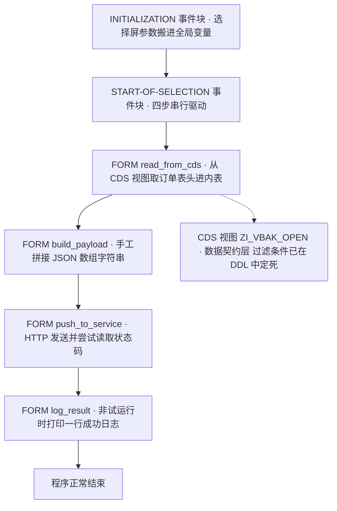
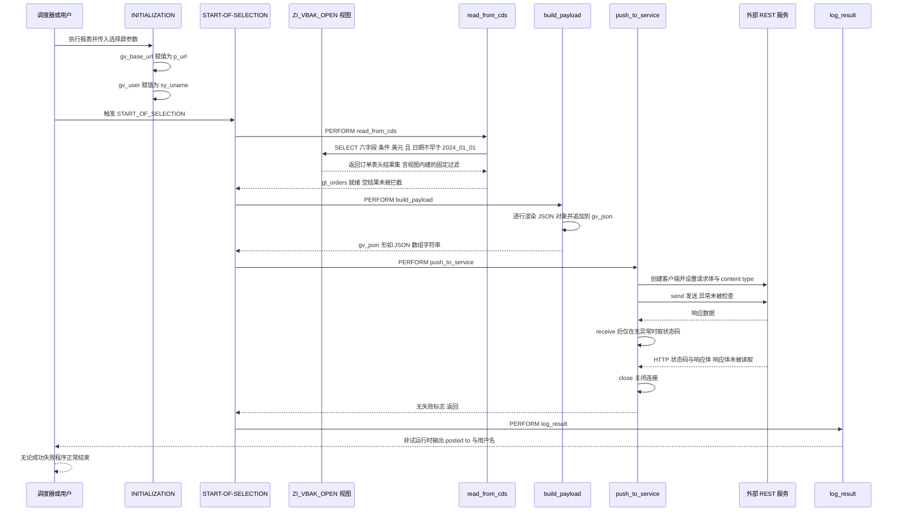

# ZSALES_SYNCH 程序分析报告

> 分析对象：`zsales_synch.abap`（报表程序） + `zi_vbak_open.asddls`（被消费的 CDS 视图 DDL 源）
> 分析重点：CDS 取数条件、JSON 拼装、HTTP 调用的错误处理
> 定位：新人 onboarding 走读级报告

---

## 一、程序定位与业务背景

### 1.1 它在业务上解决什么

把这个文件头部的注释读出来，故事就完整了：

```abap
*&---------------------------------------------------------------------*
*& Report        ZSALES_SYNCH
*&---------------------------------------------------------------------*
*& Pulls sales order data from a CDS view and pushes a daily summary
*& to an external REST endpoint.
*&---------------------------------------------------------------------*
REPORT zsales_synch.
```

**做什么** — 一个被设计为每日（或高频）运行的集成脚本：从内部 CDS 视图 `ZI_VBAK_OPEN` 拉取销售订单表头数据，在内存里手工拼成一个 JSON 数组，再通过 `if_http_client` POST/发送到公司外部的 REST 接口。

**为什么** — 这类需求在制造业/贸易型 SAP 项目里极其常见：外部系统（外部风控平台、第三方定价引擎、集团数据中台、电商履约平台）不能直连 SAP 数据库，于是由 SAP 侧主动"喂"数据。过去的做法通常是三种：人工导出 Excel 发邮件、在中间表里落数让对方用 RFC 读、或者在中间件（PI/PO）里做映射。三种都不好——人工导出无法审计、延迟不可控；中间表方案需要对方有 SAP 授权；中间件方案上线成本高。所以"用 ABAP 直接调 REST"是成本最低的一条路，也正是这个程序选的路。

**风险与改进** — 头注释里两个词值得单独拎出来对账，因为**它们和代码实际行为都不一致**，这正是本次分析的主线：

| 注释/字段声称 | 代码实际 |
|---|---|
| "daily summary"（每日汇总） | 取数条件是 `wrdat >= '20240101'` 写死，日更任务每天全量重推 2024 年以来的全部订单 |
| `p_dryrun`（试运行开关） | `push_to_service` 从头到尾**没有读过** `p_dryrun`，勾上照样真实外发 |
| `gv_json` 拼的是"数组" | 字符串模板拼 JSON，金额受用户小数点设置影响，可能产出非法 JSON |

一个外发通道程序的价值 100% 体现在**失败时是否响亮**上。而这个程序在四个点上把失败包装成了成功（详见第五章 P0）。这是本次报告要传达的核心判断。

### 1.2 整体设计范式（一句话定性）

**"CDS 视图收敛数据口径 + 经典报表程序做流程编排 + 裸 `if_http_client` 做外发"的批处理集成脚本**——骨架合理、内核薄弱，是一个典型的"演示环境跑通了就上生产"的产物：146 行、0 个配置表、0 行持久化日志、0 处授权检查、0 处错误恢复。

---

## 二、程序执行流程总览



### 责任链表

| 子程序 | 类型 | 调用者 | 职责 |
|---|---|---|---|
| 全局声明区（`ty_order` / `ty_order_tab`） | 声明区 | 编译期 | 定义订单行结构与内表类型，为后续拼报文提供字段来源 |
| 选择屏（`p_url` / `p_dryrun`） | 声明区 | 用户/调度配置 | 接收目标 URL 与"试运行"勾选 |
| `INITIALIZATION` | 事件块 | 运行时（START-OF-SELECTION 之前） | 把选择屏参数赋值到全局变量 `gv_base_url` / `gv_user` |
| `START-OF-SELECTION` | 事件块 | 运行时（用户执行或后台调度） | 串行驱动下面 4 个 FORM |
| `FORM read_from_cds` | FORM | `START-OF-SELECTION` | `SELECT` CDS 视图 `ZI_VBAK_OPEN`，结果落 `gt_orders`；尝试判空 |
| `FORM build_payload` | FORM | `START-OF-SELECTION` | 遍历 `gt_orders`，把每行渲染成 JSON 对象，串成数组字符串 `gv_json` |
| `FORM push_to_service` | FORM | `START-OF-SELECTION` | 把 `gv_json` 转 xstring、创建 HTTP 客户端、设置请求、发送、读状态码 |
| `FORM log_result` | FORM | `START-OF-SELECTION` | 仅在非试运行模式下打印"posted to …" |
| CDS 视图 `ZI_VBAK_OPEN` | CDS 视图 DDL | `FORM read_from_cds`（被消费方） | 提供数据口径：字段投影、关联、金额语义注解、固定过滤条件 |

下面按这条流程，逐个子程序展开。

---

## 三、分组分析

### 3.1 子程序类型 `全局声明区`

这一段分两步：先定义行结构与内表类型，再定义一批全局变量。

#### ① 定义订单行结构与内表类型

```abap
TYPES: BEGIN OF ty_order,
         vbeln    TYPE vbeln_va,
         kunnr    TYPE kunnr,
         waerk    TYPE waerk,
         netwr    TYPE netwr,
         menge    TYPE menge,
         wrdat    TYPE wrdat,
       END OF ty_order.

TYPES ty_order_tab TYPE STANDARD TABLE OF ty_order WITH EMPTY KEY.
```

**做什么** — 声明一个 6 字段的行结构（销售订单号、客户号、币种、订单净额、订单总数量、凭证日期），并声明其标准内表类型。

**为什么** — 用 DDIC 类型（`vbeln_va` / `kunnr` / `waerk` / `netwr` / `menge` / `wrdat`）而不是裸 `c` / `p`，是为了让内表自带类型检查与格式化语义，`INTO TABLE` 时字段顺序对齐由编译器保证，不依赖人工核对 SELECT 列表——这一步做对了。

**风险与改进** —

- **`WITH EMPTY KEY` 是一个会在后面引爆的选择**。标准表没有主键，ABAP 侧就失去了稳定访问行的手段（不能 `READ TABLE ... INTO`，不能二分查找，不能 `SORT` 后稳定定位），于是后面的 `build_payload` 只好去依赖 `sy-tabix` 这种隐式行号——缺陷的根因在这里，而不是在 `build_payload`。
- **字段选得偏**。程序取了 `menge`（订单总数量）却从未把它写进 JSON（见 3.6 ②），取而不用的字段是死重量；而 CDS 视图里明明有一个到客户名称的 association，程序只要了 `kunnr` 数字，JSON 里的 `"customer"` 对下游是一串没有业务含义的编号。
- **数据元素语义校核**：`netwr` 是**未税订单净额**（VBAK 表头合计值，CURR 15,2），`menge` 是**订单总数量**（QUAN 15,3），两者都是"表头合计"而非行项目值。所以一张订单一张记录，本质是"按订单聚合"。如果下游接口期望的是行级明细或含税金额，这里就是**语义错配**——能跑通不代表语义正确，下单方对账时必然对不上。建议在字段注释和文档里明确写清"表头聚合口径"。

#### ② 定义全局变量

```abap
DATA gt_orders TYPE ty_order_tab.
DATA gv_base_url TYPE string.
DATA gv_json TYPE string.
DATA gv_user  TYPE sy-uname.
```

**做什么** — 声明一个内表（承接 CDS 查询结果）、一个目标 URL、一个待发送的 JSON 报文、一个操作用户名。

**为什么** — 在 FORM 编程范式里，FORM 之间只能通过 ABAP 全局内存传参（PARAMETERS 方式很啰嗦），所以全局变量是必然选择，本身不算原罪。

**风险与改进** — 变量作用域过宽：`gv_json` 只在 `build_payload` 与 `push_to_service` 之间传递，`gv_user` 只用于最后一行日志，`gt_orders` 只在 `read_from_cds` 与 `build_payload` 之间用。**全部改成 FORM 内部的局部变量 + 显式 USING/PARAMETERS 传递，会让每个 FORM 自包含、可单独测试**，也让数据流向一眼可查。现在的写法让"谁修改了 `gv_json`"变成需要通读全文才能回答的问题。另外 `gv_user` 类型直接用 `sy-uname`，在后台调度下常常拿到的是 `DDIC` 之类调度账号，审计价值有限。

---

### 3.2 子程序类型 `选择屏与事件块 INITIALIZATION`

#### ① 选择屏定义

```abap
SELECTION-SCREEN BEGIN OF BLOCK b.
  PARAMETERS p_url TYPE string LOWER CASE DEFAULT 'https://api.example.com'.
  PARAMETERS p_dryrun AS CHECKBOX DEFAULT 'X'.
SELECTION-SCREEN END OF BLOCK b.
```

**做什么** — 定义两个输入项：目标 URL（默认 `https://api.example.com`，区分大小写）和"试运行"勾选框（**默认勾选**）。

**为什么** — 把目标地址做成参数而不是写死常量，说明作者考虑过"不同环境不同地址"的需求。`LOWER CASE` 对 URL 来说是个无用但无害的属性（URL 本来就区分大小写）。

**风险与改进** —

- **`p_url` 直接决定数据发往哪里，却零校验**。用户把地址打成 `api.example.com`（漏 `https://`）或手误多一个空格，只会在后面得到一个没有意义的 `argument_not_found`，排查成本很高。应该在 `AT SELECTION-SCREEN` 里做 `FIND` 校验前缀必须是 `http://` 或 `https://`，并在 URL 长度/字符集上兜一手。
- **默认值指向 `api.example.com` 这个占位域名**，说明这份代码大概率从未在生产环境配置过，或者配置是通过变式/SAPscript 传的。选择屏看不到真实目标时，操作者容易误以为"还没配置就不该发"。
- **`p_dryrun` 默认 'X'** —— 默认值本身是好的安全姿态（默认不发），但正因为默认是不发，任何"这个开关到底管不管用"的疏忽都会变成生产事故。**一个假的安全开关比没有开关更危险**：操作者看到勾着"试运行"就会放心地让它跑在生产窗口里。必须让 `push_to_service` 真正读它。
- 整个选择屏**没有任何取数参数**（日期范围、币种、销售组织），这直接导致了 3.5 里的"全量硬编码过滤"。

#### ② INITIALIZATION 事件块

```abap
INITIALIZATION.
  gv_base_url = p_url.
  gv_user     = sy-uname.
```

**做什么** — 程序初始化时把选择屏上的 URL 和当前登录用户复制到全局变量。

**为什么** — `INITIALIZATION` 早于 `START-OF-SELECTION`，是做这种"参数落地"的正确时点。

**风险与改进** — **没有实质风险**，逻辑正确、顺序正确。唯一可提的是：这里也是放"环境/配置校验"的自然位置（例如校验 URL 是否指向允许的目标环境），作者没有利用它。另外 `gv_user` 与 `sy-uname` 完全同源，属于"起个名再赋一次"的样板，可以直接删。

---

### 3.3 子程序类型 `事件块 START-OF-SELECTION`

```abap
START-OF-SELECTION.

  PERFORM read_from_cds.
  PERFORM build_payload.
  PERFORM push_to_service.
  PERFORM log_result.
```

**做什么** — 作为调度中枢，按固定顺序串行驱动 4 个 FORM：取数 → 拼报文 → 推送 → 记日志。

**为什么** — 事件块只做编排、不做业务细节，这是干净的分离；把"取数/拼装/网络"拆成 4 个 FORM 也让阅读体验不错。

**风险与改进** —

- **4 步之间没有任何返回码传递**。上一个 FORM 失败（取数 0 行、HTTP 失败）不影响后一步继续执行，于是"失败"会一路传播成"成功日志"。这是全程序 P0 缺陷的**结构性根因**：编排层没有失败语义（没有 `gv_failed` 之类的标志位、没有 `IF ... RETURN`、没有异常上抛）。
- **步骤不可配置**：`build_payload` / `push_to_service` 都没有 dry run 判断能力。等价于"只有一条路可走"，这既让 3.2 的 `p_dryrun` 变成摆设，也让"重跑推送"和"空跑校验"必须靠改代码来区分。
- **没有包一层异常保护**：`START-OF-SELECTION` 是最外层，本可以用 `TRY...CATCH` 或整体 `EXIT` 收口，把任何异常统一转成日志 + 非零 job 退出码，目前完全没有。

---

### 3.4 子程序类型 `CDS 视图定义 ZI_VBAK_OPEN`

这是本程序的数据入口，也是问题密度最高的分组——因为业务口径和业务假设被全部焊死在了 DDL 源里。它不是 FORM，而是被 `read_from_cds` 消费的独立数据契约层，分四步看：注解头 → 关联与键 → 字段投影与语义注解 → WHERE 过滤。

#### ① 注解头

```abap
@AbapCatalog.sqlViewName: 'ZVBAKOPEN'
@AccessControl.authorizationCheck: #NOT_REQUIRED
@EndUserText.label: 'Open sales order headers for batch pricing review'
define view entity ZI_VBAK_OPEN
```

**做什么** — 把视图 `ZI_VBAK_OPEN` 映射到 DDIC SQL 视图 `ZVBAKOPEN`；关闭授权检查；给业务用户一个"用于批量定价复核的未清销售订单表头"的标签。

**为什么** — 前两行是 CDS 的标准契约声明：`sqlViewName` 给非 ABAP 消费者（ADT 数据预览、Open Data Hub、Data Provisioning、S/4 侧报表工具）一个稳定句柄；`EndUserText.label` 是 F4 帮助和 Where-Used 里给人看的。

**风险与改进** — **`@AccessControl.authorizationCheck: #NOT_REQUIRED` 是本视图最严重的问题**。这个视图暴露 `KUNNR`（客户号）和 `NETWR`（金额），属于典型的销售/客户敏感数据，声明 `#NOT_REQUIRED` 意味着**系统里任何一个能执行 SELECT 的用户都能读到全量数据**，再叠加本程序"推到外部 REST"的能力，就构成了一条无授权的数据外发通道。正确做法是 `#REQUIRED` 并配 DCL（按销售组织 / 组织结构 / 授权对象限制字段与行），至少要在视图层内置销售组织范围过滤。
另外，`EndUserText` 承诺 "Open"，而 WHERE 里没有任何"未清"判定（见 ④）——**标签与实现不符**，在 Where-Used 和业务沟通中都会误导人。

#### ② 数据源、关联与主键

```abap
  as select from vbak
  association [0..1] to ZI_KNA1_NAME as _Customer
    on $projection.kunnr = _Customer.kunnr
{
  key vbeln,
      kunnr,
      waerk,
      netwr,
      menge,
      wrdat,
```

**做什么** — 以 `VBAK` 为数据源，声明一个到 `ZI_KNA1_NAME` 的"客户名称"关联（关联键 `KUNNR`，基数声明为 `0..1`），主键取 `VBELN`，投影 6 个业务字段和该关联。

**为什么** — association 用 `_` 前缀属于纯元数据，不进入结果集、不消耗读取代价，只有被 join 或按路径访问时才生成 SQL——这是 CDS 里做"可选信息"的正确姿势，避免为了一个名字去 JOIN KNA1。`key vbeln` 也对，`VBELN` 确实是 VBAK 的主键字段。

**风险与改进** —

- **`[0..1]` 是声明，不是事实，必须与关联目标核对**。`ZI_KNA1_NAME` 从名字看是 KNA1 名称视图，而 KNA1 的文本（`NAME1`）是**按语言（SPRAS）多行**的。若 `ZI_KNA1_NAME` 内部没有按语言过滤，一个客户就有多行名称——此时 `0..1` 的基数声明与实际不匹配，CDS 激活阶段会直接报错（关联目标键不唯一），或者在部分场景下产生重复订单行。必须确认 `ZI_KNA1_NAME` 已固定 `SPRAS`（如 `sy-langu`）或按 `NAME1` 唯一，否则应改为 `[1..*]` 并在 `ON` 上加语言条件。
- **这个关联被本程序完全闲置**：出现在投影列表里意味着它是"暴露关联"，而 `read_from_cds` 只 SELECT 基础 6 字段，从不访问 `_Customer`。也就是说，为了一个从未使用的能力，视图多维护了一条依赖（`ZI_KNA1_NAME` 一旦失效，本视图连带受影响）。要么让消费方真的用上路径取客户名（这对下游可读性价值很大），要么把关联先摘掉。
- `wrdat`、`menge` 直接暴露原字段，而 `netwr` 后面又另建别名（见 ③），**同一个概念在同一个列表里出现两种命名**，下游会各取各的。

#### ③ 字段投影与语义注解

```abap
      _Customer,
      @Semantics.amount.currencyCode: 'waerk'
      netwr as net_amount,
      cast( sy-datum as abap.dats ) as run_date
```

**做什么** — 暴露客户名称关联；把 `NETWR` 以别名 `net_amount` 输出并标注"金额 + 币种"语义；把会话日期 `SY-DATUM` 转成 `abap.dats` 类型输出为 `run_date`。

**为什么** — `@Semantics.amount.currencyCode: 'waerk'` 让语义模型（Fiori Elements、分析视图、下游报表）知道"这是一笔带币种的金额而不是普通数值"，需要配套 `@Semantics.currencyCode` 才好做金额格式化。**这是 CDS 里正确的姿势**，值得肯定。

**风险与改进** —

- **`netwr` 与 `net_amount` 重复暴露同一列**。而且 `read_from_cds` 取的是**未加注解的 `netwr`**，恰好绕开了那个被精心标注的别名。语义注解的全部价值（金额格式化、币种一致性检查）在这条链路上一点都没兑现。应当只保留 `net_amount`（或只保留 `netwr` 并加注解），而不是留两份。
- **`cast( sy-datum as abap.dats ) as run_date` 是把"会话状态"焊进了"数据契约"**，问题不小：
  1. `SY-DATUM` 不是表数据，而是查询发生时刻的系统值，所以这个视图的内容**随时钟变化、不可重放**——同一段查询今天和明天语义不同，它已经不是 `VBAK` 的一个投影了。
  2. **跨系统消费时语义会漂**：`SY-DATUM` 在**消费方系统**求值。CDS View Consumption、Remote API、Replication Layer 等场景下，源系统与消费系统时区/日期不同，`run_date` 就会是消费方的日期——一个被当成"数据快照日期"的字段悄悄变成了"读取日期"。
  3. 每个结果行都强制带出一列与业务无关的值，白白增大结果集并影响下推优化。
  4. 这类字段让视图无法被语义校验、无法被缓存复用，属于典型的"为了图方便在视图里塞环境变量"。
  正确做法：**删掉 `run_date`**，让消费程序在 `build_payload` 里用 `sy-datum` 自己填；需要动态日期范围就用 `WITH PARAMETERS` 传参，而不是留一列常量。
- `cast(... as abap.dats)` 本身：目标类型与 `SY-DATUM` 的 DATS 同型，转换不改变值，语法上无害，但**它给人"做了类型校验"的错觉**，实际什么也没校验。

#### ④ WHERE 过滤条件

```abap
where
  wrdat >= '20240101'
  and waerk  = 'USD'
```

**做什么** — 视图层固定两个过滤：凭证日期不早于 2024-01-01，且币种为美元。

**为什么** — 把过滤写在视图里、让它下推到数据库，比在 ABAP 内存里筛要高效得多——这个**方向**是对的。

**风险与改进** — 这一段是 CDS 视图风险最集中的地方，逐条对账：

- **硬编码日期**。常量写死在 DDL 里，需求一变就得改视图并做传输；没有 `WITH PARAMETERS` 就没有任何动态窗口能力。更要命的是它与头注释的 "daily summary" 矛盾：一个号称"每日推送"的程序，固定条件是"2024-01-01 之后的全部订单"，于是**每天都会把同一批数据全量重推一遍**，规模只增不减。
- **字面量没有类型保护**。`wrdat >= '20240101'` 靠的是"DATS 内部格式恰好是 YYYYMMDD、与字符字面量字典序一致"这一巧合。写成 `'2024-01-01'` 一样能激活、一样不报语法错，结果却完全错误。应该写成 `wrdat >= CONV wrdat( '20240101' )`，或者干脆参数化。
- **`waerk = 'USD'` 把业务口径焊进了"通用"视图**。视图名和标签都叫"未清销售订单表头"，实际**只返回美元单据**。任何别的消费者（欧元对账、集团合并口径、口径变更）拿到的是**静默缺失数据**的结果，没有任何提示。币种过滤属于消费方口径，应该通过参数传入，视图只暴露数据。
- **日期口径选错，这是最需要和业务确认的一条**。`WRDAT` 是**凭证日期（业务日期，允许事后补录）**，不是**最后变更日期**。一个"每日推送"应当回答"今天发生了什么变化"，正确字段应是 `WRDAU`（最后更改日期），或者干脆接变化日志（CDHDR / `VBAK` 的 Change Log）。用 `WRDAT` 的后果有两面：今天被重新定价但凭证日期是上周的单**不会被推送**；上周后补录入的单**会在今天突然出现**。对外部系统来说，这两种偏差都会直接造成对账差异。
- **"open" 这个词完全没有实现**。真正的未清订单要联 `VBAP` / `VBUK` 判断交货与开票状态（例如 `VBAP-LFBNR = ' '` 未交货、`VBUK` 未开票），或者用交货/开票单排除法。当前实现是"2024 年以来的全部订单表头"，**已清订单照推不误**，与视图名和 `EndUserText` 的承诺直接冲突。这是需要产品/业务侧拍板的第一优先语义问题。
- **性能上唯一的正确点**：两个条件都是简单 AND 谓词，可以正常下推到数据库并利用 `WRAU`/`WRDAT` 相关二级索引，没有发现"WHERE 里放函数导致索引失效"这类典型陷阱。

---

### 3.5 子程序类型 `FORM read_from_cds`

本 FORM 分三步：主查询 → 空结果判断 → 行数输出。

#### ① 主查询：一次全量 SELECT 进内表

```abap
  SELECT vbeln kunnr waerk netwr menge wrdat
    FROM z_i_vbak_open
    INTO TABLE gt_orders
    WHERE waerk = 'USD'
      AND wrdat >= '20240101'.
```

**做什么** — 从 CDS 视图 `ZI_VBAK_OPEN` 一次性取 6 个字段到内表 `gt_orders`，附加条件是币种美元、凭证日期不早于 2024-01-01。

**为什么** — 通过 CDS 视图而不是直读 `VBAK`，说明作者希望数据口径集中在一处维护，报表只负责编排。这是正确的架构分工。

**风险与改进** —

- **过滤条件与视图完全重复**。视图的 WHERE 已经是 `wrdat >= '20240101' and waerk = 'USD'`，这里再写一遍，最终下推 SQL 里会出现冗余谓词。真正的代价不是那点性能，而是**口径双写**：需求一改要同时改 DDL 和 ABAP 两处，还必须做传输，很容易走散成"视图放行新口径、程序仍按老口径筛"。二选一：视图管数据语义、程序不加过滤；或者视图参数化、程序传参。
- **选择屏没有参与取数**。整个选择屏只有 URL 和 dry run，日期范围和币种全是写死字面量。对一个日更任务来说，这意味着**每次运行都在推 2024 年以来的全量订单**，没有增量概念。这与"daily summary"的声明直接冲突，是本程序在业务正确性上最严重的一条（第五章 P0）。
- **字面量类型问题**同 3.4 ④：`wrdat >= '20240101'` 靠内部格式侥幸成立，应写成类型化字面量或参数。
- **`INTO TABLE` 全量、无分页**。行数完全不可控（没有 `PACKAGE SIZE`、没有上限保护）。配合 3.6 ② 的 O(n²) 字符串拼接，这是短时 dump 的直接温床：视图条件一旦放宽到全量未清订单，内存曲线会失控。
- **投影列表与内表结构靠字段顺序隐式对齐**。因为 `ty_order` 的字段顺序恰好与 SELECT 列表一致才不会错位，编译器只检查类型不检查顺序语义。视图端一旦调整字段顺序，这里就会**静默串列**（VBELN 的值被当成 KUNNR 用）。改成显式 `SELECT vbeln AS vbeln ... ` 或直接让 `ty_order` 与视图元素同名同序更稳。

#### ② 空结果判断

```abap
  IF sy-subrc <> 0.
    MESSAGE 'CDS view returned no rows' TYPE 'S'.
  ENDIF.
```

**做什么** — 作者试图在查询后判断"是否没查到数据"，并弹一条 S 级（成功）消息。

**为什么** — 防御性检查的意图是对的：日更任务最怕的是"没数据"被当成"推了 0 条也没问题"。

**风险与改进** —

- **这段判断永远不成立，是一段死代码**。`SELECT ... INTO TABLE` 只要没有 SQL 异常，`sy-subrc` 就是 0；**查无数据时内表为空，但 `sy-subrc` 依然是 0**。所以"没查到数据"这个分支永远不会进，作者以为存在的守卫根本不存在。正确写法是 `IF gt_orders IS INITIAL`。
- **语义反了**：即便能触发，"没查到数据"也是异常情况，不该用 `MESSAGE TYPE 'S'`（成功消息）上报。
- **没有 RETURN，是最要命的一点**。空结果会继续往下走：`build_payload` 拼出一个 `'[]'`，`push_to_service` 把它当正常载荷推给外部服务。于是对方每天可能收到一个空数组，而本地这边毫无察觉。**校验失败必须终止执行**，不能"提示一下然后继续"。
- **也没有成功分支的错误兜底**。真正的 SQL 异常（CDS 激活失败、字段不存在、授权失败）应该 `MESSAGE 'E'` 或写日志后终止，这里完全没接。

#### ③ 行数输出

```abap
  WRITE: / 'orders', lines( gt_orders ).
```

**做什么** — 在屏幕上裸输出一行，取到的记录数。

**为什么** — 调试痕迹，程序员想快速确认"有没有取到数据"。

**风险与改进** — 报表正文里的裸 `WRITE` 不规范（没有列表、不能排序、不能导出，应走 ALV 或至少规范设置 PF-STATUS）。更重要的是**它只写数量、不写内容，也没有任何上下文**：没有 URL、没有过滤条件、没有时间戳。数据出问题时要靠人去猜是哪次跑的、取了什么条件。更实际的做法是写应用日志（Application Log）或至少在 `START-OF-SELECTION` 统一输出一行运行头信息（条件、用户、时间），让后面的每个动作都有可追溯的上下文。

---

### 3.6 子程序类型 `FORM build_payload`

这是全程序**最需要重写**的 FORM，分三步：初始化与行模板 → 分隔符与拼接 → 收尾。

#### ① 初始化与行模板

```abap
  DATA lv_row TYPE string.

  gv_json = '['.
  LOOP AT gt_orders INTO DATA(ls_order).
    lv_row = |{ |"vbeln": "{ ls_order-vbeln }",| &
              |"customer": "{ ls_order-kunnr }",| &
              |"amount": { ls_order-netwr },| &
              |"currency": "{ ls_order-waerk }",| &
              |"date": "{ ls_order-wrdat CONDENSE SPACE }" }|.
```

**做什么** — 把报文变量初始化为左方括号，然后为每一条订单渲染一个 JSON 对象：`vbeln`（订单号）、`customer`（客户号）、`amount`（金额，**不带引号，是数字字面量**）、`currency`（币种）、`date`（凭证日期）。

**为什么** — 选 JSON 而不是 XML 面向 REST 是对的，字段命名（`vbeln` / `customer` / `amount` / `currency` / `date`）也简洁可读，外部系统对接友好。

**风险与改进** — 这里有两处必须点名的缺陷：

- **金额直接用字符串模板插值进 JSON，会受用户小数点设置影响**。`netwr` 是 packed（CURR 15,2），字符串模板的隐式类型转换会遵循用户/系统的"小数点表示法"（点 或 逗号）偏好。在设为逗号的环境里，生成的是 `"amount": 1000,00`——**这不是合法 JSON**，外部服务会整包解析失败，而本地日志依然显示"推送成功"。修法是显式指定分隔符：`|{ ls_order-netwr DECIMAL = '.' }|`。这类问题在开发机（默认点）上永远测不出来，一上生产就炸，属于必须在上线前修掉的项。
- **`CONDENSE SPACE` 加错了字段**。`wrdat` 是 DATS 类型（内部就是 YYYYMMDD，**永远不含空格**），对它压缩毫无意义；而真正需要处理的是 `vbeln`（`vbeln_va` 是 CHAR 10，字母型订单号如 `SO 4711` 含内部空格，可能还有右填充）和 `kunnr`（CHAR 10，部分场景存在前导/后置空格）。结果就是 JSON 里出现 `"vbeln": "SO 4711"`、`"customer": "  0012345"` 这类带空格的值——JSON 语法上合法，但下游严格匹配时会错配字段。**压缩要加在字符型字段上，不是日期上。**
- **完全没有 JSON 转义**。当前字段恰好都是"安全"的（订单号/客户号/币种/日期），所以现在不出事。但只要将来按 3.4 ② 的建议把 `_Customer` 客户名接进来（需求上几乎必然会发生），一个含引号、逗号或换行的客户名就会直接产出非法 JSON。这是"迟早要炸"的定时炸弹。
- **字段层面的取舍问题**：`menge` 从 CDS 取了却没进 JSON（取了不用的死字段）；`customer` 只给编号不给名称，而视图那边关联是现成的。报文的信息密度和下游可用性都偏低。

#### ② 循环内的分隔符与拼接

```abap
    IF sy-tabix > 1.
      gv_json = gv_json && |,|.
    ENDIF.

    gv_json = gv_json && lv_row.
```

**做什么** — 每处理一行，先判断"是不是第一行"，不是才补一个逗号，然后把这一行的 JSON 追加到全局报文尾部。

**为什么** — 作者显然清楚 JSON 数组不能有多余逗号，于是需要一个"当前行号"来判断。

**风险与改进** —

- **依赖 `sy-tabix` 判定行号，是很脆弱的写法**。`LOOP AT` 内表时 `sy-tabix` 确实是循环计数器，但**只要循环体里出现任何会改写它的语句**（一条 `SELECT`、一次内层 `LOOP AT`、一次嵌套的数据库读取），`sy-tabix` 就会被覆盖，后果是两种都致命的：被覆盖成 1 → **所有行之间没有逗号**，整个数组塌成一坨 `{...}{...}{...}`，非法 JSON；被覆盖成大于 1 → 每行前面都加逗号，数组开头出现 `[{...}` 之类的多余逗号，同样非法。而"往循环里加一条查客户名的 SELECT"恰恰是这个程序最自然的下一步改动。正确做法是用显式布尔标志（第一行单独处理）、或者把每行塞进字符串表（`APPEND`）最后统一 `CONCATENATE LINES`。
- **O(n²) 的字符串拼接，是本 FORM 最大的规模风险**。`gv_json = gv_json && lv_row` 每次都**重新分配整个文档**：n 行、平均每行约 120 字节，5 万行规模下最终文档约 6 MB，累计拷贝量在百 GB 量级，CPU 与内存都会被拖垮，后台作业很可能直接短时 dump（ST22 里表现为内存不足或运行时间超限），而且失败模式很难预测——数据量小的时候一切正常，量一涨就崩。正确做法是字符串表 `lt_json TYPE TABLE OF string` 逐行 `APPEND`，末尾 `CONCATENATE LINES ... INTO gv_json`；或者干脆用序列化（见下）。
- **最优解是不手写 JSON**：`to_json( )` / `json_serialization` / `cl_abap_json` 直接把结构（或内表转结构数组）序列化，自动处理转义、数字格式和数组分隔。手写模板在这个场景下没有任何优势，只有"看起来直观"这一个好处。

#### ③ 循环收尾与数组封口

```abap
    ENDLOOP.

  gv_json = gv_json && ']'.
```

**做什么** — 循环结束后给报文补上右方括号，形成完整 JSON 数组。

**为什么** — 与开头的 `gv_json = '['` 配对，结构上是对的。

**风险与改进** —

- **空内表时结果是 `'[]'`**。配合 3.5 ② 缺少 `RETURN`，这意味着"没取到数据"会被当成"一个合法的空数组"推给外部服务。空数据应该在这里（或更早）就被拦下并明确告警，而不是伪装成一次成功的推送。
- **没有任何规模保护与自检**。没有对报文长度的上限判断，也没有"拼完再解析回来验一次"的兜底。更稳妥的做法是：拼装前先用 `CONDENSE`/长度预估判断量级，量大时改走文件或分批推送；或在推送前做一次 JSON 解析自检。
- 收尾本身无独立风险，一句带过。

---

### 3.7 子程序类型 `FORM push_to_service`

这是全程序问题最严重的 FORM，分五步：报文转换与建连接 → 请求设置 → 发送 → 接收与状态判定 → 关闭连接。

#### ① 报文转换与创建 HTTP 客户端

```abap
  DATA lo_client  TYPE REF TO if_http_client.
  DATA lv_xstring TYPE xstring.
  DATA lv_status  TYPE i.

  CREATE XSTRING LV_XSTRING DATA GV_JSON.

  cl_http_client=>create_by_url(
    EXPORTING
      url                = gv_base_url
    IMPORTING
      client             = lo_client
    EXCEPTIONS
      argument_not_found = 1
      plugin_not_active  = 2
      OTHERS             = 3 ).
```

**做什么** — 把 JSON 字符串整体转成 xstring 作为请求体字节流，用 `create_by_url` 快捷入口按 URL 创建 `if_http_client` 客户端实例。

**为什么** — 用 `if_http_client` 抽象接口（而不是直接用 `cl_http_https`）是对的抽象层次，接口化便于替换和测试。异常清单写得相对完整，也比裸 `cl_http_https` 规范。

**风险与改进** —

- **`lv_status TYPE i` 的初值 0 在这里是整条链路的定时炸弹**。它后面只会在成功路径被赋值，一旦失败就保持 0，而 `0` 既是"HTTP 状态码全集里不可能出现的值"，又是"整数类型的默认值"——**程序无法区分"没取到状态码"和"取到了一个不可能的状态码"**，于是 ④ 里的判定会静默失效。正确做法是用显式的成功标志（如 `lv_ok TYPE abap_bool`）或把状态码初始化成 `-1` 之类的哨兵值。
- **`create_by_url` 是快捷入口，什么都配不了**。它无法传递 SSL 主机名校验、客户端证书、`icf` 回调（处理自签名证书、SAN 不匹配、重定向）、代理设置。对接真实 https 服务时，几乎必然要换成 `cl_http_client=>create( ... )` 显式传参，或者在 7.52+ 用 `cl_web_https=>create_client( ... )` 正确处理信任链。当前写法只可能连通"证书链完全标准且无重定向"的最理想目标。
- **零鉴权**。整个程序没有任何 Authorization 处理：没有 `set_basic_auth` / `set_authorization_oauth` / 客户端证书 / API Key 头。要么外部接口是匿名可写的（不太可能），要么**这条推送路径从未真正跑通过**。这是必须和接口方对齐的功能缺口。
- `CREATE XSTRING ... DATA GV_JSON` 是全量内存拷贝（`gv_json` + `lv_xstring` 两份大字符串同时在内存里），与 ② 提到的字符集问题叠加，放大了规模风险。
- 异常分支只 `WRITE` 一个数字 `sy-subrc`，没有取 `errmsg`，调试价值极低。

#### ② 请求设置：body 与 content type

```abap
  lo_client->request->set_cdata( lv_xstring ).
  lo_client->request->set_content_type( 'application/json' ).
```

**做什么** — 把报文设为请求体，Content-Type 设为 `application/json`。

**为什么** — 这两步本身是标准且正确的动作，顺序也对。

**风险与改进** — **这里缺了一句致命的话：`lo_client->request->set_method( if_http_client=>meth_post )`。** `if_http_request` 的默认方法就是 **GET**。也就是说，当前代码发出的是一个**"GET 请求 + JSON 请求体"**：载荷要么被 HTTP 客户端拼进 URL 查询串、要么被服务端直接忽略，外部服务几乎必然返回 405 / 404 / 400，或者返回"成功但什么都没收到"。**这份程序实际上从来没有真正 POST 过数据。** 这是仅次于"失败被当成成功"的第二严重缺陷。

同一段还有三个改进点：

- **Content-Type 没有带 charset**。当前字段全是 ASCII，不影响；但一旦接入客户名等非 ASCII 内容，就会因字符集未声明被对方按 ISO-8859-1 解析成乱码，排查成本极高。要么补 `; charset=utf-8`，要么在发送前显式做 UTF-8 编码。
- **没有设置任何业务请求头**（批次号、调用方标识、幂等键）。日更重复推送时对方无法去重，也无法把这条推送关联回具体批次。
- `set_cdata` 只设了 body，没有 `Accept` 声明；对返回 JSON 的接口通常建议补上。

#### ③ 发送请求（异常被静默吞掉）

```abap
  lo_client->send(
    EXPORTING
      timeout = 3
    EXCEPTIONS
      http_communication_failure = 1
      http_invalid_state         = 2
      http_processing_failed     = 3
      OTHERS                     = 4 ).
```

**做什么** — 发送请求，超时 3 秒，异常清单把失败归到 1/2/3/4。

**为什么** — 设置超时是必须的，否则后台作业可能被一个挂死的连接无限期占住，这一点作者做对了。

**风险与改进** —

- **`send` 之后完全没有 `IF sy-subrc <> 0`**。这是本程序最严重的一个单点缺陷：发送失败（DNS 解析不了、连接被拒、TLS 握手失败、目标服务不可达、3 秒超时）时异常被彻底吞掉，代码继续往下调 `receive`；`receive` 必然也失败，于是 `sy-subrc` 变成了 `receive` 的结果、`lv_status` 保持初值 0，后面的 `>= 400` 判定不成立。**最终效果是：一次彻底的网络故障，在日志里表现为一句"posted to https://…"**，后台作业还是绿灯。这一条就是"数据静默丢失"的完整链路。
- **`timeout = 3` 硬编码且只设了结束超时**。3 秒对"大报文 + 慢服务"偏紧，容易造成间歇性失败；且不同环境的网络特性完全不同，应该放到选择屏或配置表。同时建议补 `timeout_begin`（建连超时）、`timeout_resend`（重试次数）一起设。
- **异常列表写得很细，实际拿到的信息很粗**。`send` 阶段真正常见的失败（`ssl_ssl_error`、`host_not_reachable`、`http_timeout` 之类）都落进 `OTHERS = 4`，最后只知道一个数字 4，没有任何 `errmsg`。应该取 `lo_client->response->get_data( )` 或错误字段写进日志。
- **没有任何重试与告警**：瞬时抖动就导致整批数据丢失，且无人知晓。

#### ④ 接收响应与状态码判定

```abap
  lo_client->receive(
    EXCEPTIONS
      http_communication_failure = 1
      http_invalid_state         = 2
      OTHERS                     = 3 ).

  IF sy-subrc = 0.
    lv_status = lo_client->response->get_status( ).
  ENDIF.

  IF lv_status >= 400.
    MESSAGE 'Remote service rejected the payload' TYPE 'S'.
  ENDIF.
```

**做什么** — 读取响应；仅当 `receive` 没抛异常时才取 HTTP 状态码；只要状态码 ≥400 就弹一条 S 级消息。

**为什么** — 作者的正确意图是"用状态码区分成功与失败"，方向是对的，绝大多数 HTTP 集成都会做这一步。

**风险与改进** — 这段是**全程序最危险的代码**，四个缺陷叠加：

- **失败被表达成成功**。`receive` 异常 → `sy-subrc ≠ 0` → `lv_status` 保持初值 **0** → `0 >= 400` 为假 → 不报错、不落日志、继续 `close`、继续 `log_result` 打出一句"posted to"。必须改成显式分支：失败时至少 `MESSAGE 'E'` 或写日志并置非零 job 退出码。
- **`MESSAGE TYPE 'S'` 上报业务失败**。S 级消息在后台作业里**不会**把作业状态变成失败，在 SM21 里还容易被忽略。对方明确拒绝载荷（4xx/5xx）是必须响亮的失败，应该用 `MESSAGE 'E'` / `'A'`，或写应用日志 + 非零退出码。这是"失败伪装成成功"的第二次出现。
- **`>= 400` 的判定本身不完整**。3xx（重定向未跟随，载荷实际从未送达）会被当成成功；`lv_status = 0` 这种"从未赋值"的状态也无法与真实状态码区分（根因是 ① 里的初始化策略）。更稳妥的判定是：先判断"是否拿到状态码"，再判断"是否在 200~299 之间"，其余全部视为失败。
- **响应体被完全丢弃**。没有 `lo_client->response->get_data( )`。而对方返回的错误明细（哪个字段不合法、哪个订单号重复、是否触发限流）恰恰是排查的唯一线索。批量失败时只能靠猜，这是运维层面很实际的损失。

#### ⑤ 关闭连接

```abap
  lo_client->close( ).
```

**做什么** — 释放 HTTP 连接与相关资源。

**为什么** — 不显式 `close` 会让 `if_http_client` 保持连接直到工作进程超时回收，后台批量作业下会累积资源占用。显式关闭是对的。

**风险与改进** — 当前这段"恰好总会执行"，因为上面那句是 `MESSAGE TYPE 'S'`（不中断程序）而不是 `'E'`。但这是**靠一个巧合维持的脆弱结构**：任何人日后把那句消息改成 `'E'` 或加一句 `RETURN`，连接就会在 close 之前漏掉。正确结构是用 `TRY...CATCH` 或把 `close( )` 放在一段统一收尾逻辑里，保证任何路径都释放。另外此处也是"先把响应体落日志、再关连接"的正确位置，目前两件事都没做。

---

### 3.8 子程序类型 `FORM log_result`

```abap
FORM log_result.

  IF p_dryrun IS INITIAL.
    WRITE: / 'posted to', gv_base_url, 'by', gv_user.
  ENDIF.

ENDFORM.                       "log_result
```

**做什么** — 只有当"试运行"勾选**没有被勾上**时，才打印一行"已推送到 <URL>，操作人 <用户名>"。

**为什么** — 留一条最简的审计痕迹，说明作者意识到"外发动作应该可追溯"。

**风险与改进** —

- **它记录的是"意图"，不是"结果"，所以函数名 `log_result` 名不副实**。这行日志不包含 HTTP 状态码、成功还是失败、推了多少条、耗时多少、报文多大。它和前面那个被吞掉的 `sy-subrc` 一起，构成"网络故障 → 日志显示 posted to"的最后一环。
- **`p_dryrun` 在整个程序里只被读了这一次**。而它在 `push_to_service` 中**完全没被使用**——所以"试运行"勾选框**不 dry run**：默认勾选的情况下程序照样真的把数据外发。这是必须排在最前面的 P0：**一个不生效的安全开关，会让操作者在完全不知情的状态下把生产数据送出系统**。
- **试运行时反而什么都不打印**。勾了 dry run 之后整段被跳过，日志一片空白，"到底试跑了没有、跑了多少条"完全不可追溯。试运行模式恰恰是最需要详细输出（把报文打到屏幕或文件供比对）的场景。
- **审计价值有限**：`gv_user = sy-uname` 在后台调度下常常是 `DDIC` 之类的调度账号。真正的审计应该写应用日志（`ALGBTAB` / `BALHDR` / `BAL_LOG_*`）或 spool 文件，并把状态码、条数、URL、时间戳一起落下，便于后续对账与追责。
- **完全没有 job 级别的退出码控制**：失败路径没有任何机制让后台作业变红。这与 3.7 ④ 的 `MESSAGE TYPE 'S'` 是同一个问题的两半。

---

## 四、执行流程全景图（数据视角）



这张图请重点看**最后两条消息**：从 `send` 到程序结束，**没有任何一条把"成功或失败"传回给调用方的消息**。数据在 `CDS → gt_orders → gv_json → 请求体` 这条链路上是单向、无校验、可静默丢失的。

---

## 五、问题清单与改进建议（按优先级）

### 🔴 P0 — 业务正确性 / 必须上线前修

| # | 问题 | 所在子程序 | 影响 | 改进方向 |
|---|---|---|---|---|
| P0-1 | `p_dryrun` 从未被 `push_to_service` 读取，"试运行"开关不生效，且默认值是勾选 | `FORM push_to_service` / `FORM log_result` | 操作者以为在试跑，实际已把生产数据外发 | 在 `push_to_service` 开头判断 `p_dryrun`，为真时只打印报文不发送；并把默认值与命名对齐 |
| P0-2 | `send` 之后不检查 `sy-subrc`，发送异常被静默吞掉并继续 `receive` | `FORM push_to_service` | 网络故障（DNS/连接/TLS/超时）被当作成功，整批数据丢失且无人知晓 | `send` 后立即判 `sy-subrc`，失败即写日志 + `MESSAGE 'E'` + 终止 |
| P0-3 | `lv_status` 只在成功路径赋值、失败保持初值 0，`0 >= 400` 判定失效 | `FORM push_to_service` | "没取到状态码"被当成"成功状态码"，失败分支永不执行 | 用显式 `lv_ok` 布尔标志，或把状态码初始化为 `-1` 哨兵值并判断 `>= 300 OR = 0` |
| P0-4 | 对方拒绝载荷（4xx/5xx）用 `MESSAGE TYPE 'S'` 上报 | `FORM push_to_service` | 后台作业状态为绿，运维监控不到失败 | 改用 `MESSAGE 'E'` / `'A'`，或写应用日志 + 置非零 job 退出码 |
| P0-5 | 未调用 `set_method( meth_post )`，`if_http_request` 默认为 GET | `FORM push_to_service` | 发出的实际是 GET + JSON body，载荷从未真正 POST，对端必然报错或忽略 | 显式设置 `meth_post`，并按接口要求设置 `set_cdata` 与请求头 |
| P0-6 | 金额用字符串模板插值，packed 转字符串受用户小数点设置影响 | `FORM build_payload` | 逗号小数点环境下生成 `"amount": 1000,00`，非法 JSON，整批被拒 | 显式 `DECIMAL = '.'`，或改用 `to_json` / `json_serialization` 序列化 |
| P0-7 | 取数日期硬编码 `20240101`，与"每日推送"声明矛盾 | `FORM read_from_cds` / CDS 视图 `ZI_VBAK_OPEN` | 每天全量重推 2024 年以来所有订单，量只增不减，接口与性能双重压力 | 增加日期范围选择屏参数并默认"昨天至今"；视图改 `WITH PARAMETERS` 传参 |
| P0-8 | `@AccessControl.authorizationCheck: #NOT_REQUIRED` 且无 DCL | CDS 视图 `ZI_VBAK_OPEN` | 任意用户可全量读取客户号与金额并经本程序外发，构成无授权数据外发通道 | 改 `#REQUIRED` + DCL（销售组织 / 组织结构 / 授权对象），或视图内置销售范围过滤 |

### 🟠 P1 — 健壮性 / 运行可靠性

| # | 问题 | 所在子程序 | 影响 | 改进方向 |
|---|---|---|---|---|
| P1-1 | `SELECT INTO TABLE` 后用 `sy-subrc` 判空，永不成立；空结果也不终止 | `FORM read_from_cds` | 每天推 `'[]'` 空数组给外部系统，且本地无感 | 改 `IF gt_orders IS INITIAL` 并立即终止 + 告警 |
| P1-2 | `gv_json = gv_json && lv_row` 在循环中反复重分配整个文档（O(n²)） | `FORM build_payload` | 行数上万后 CPU/内存飙升，后台作业短时 dump，且量小时不易暴露 | 字符串表 `APPEND` + `CONCATENATE LINES`；或直接序列化；配合分批处理 |
| P1-3 | 依赖 `sy-tabix > 1` 决定分隔符 | `FORM build_payload` | 循环体一旦加入 `SELECT` 或内层 `LOOP`，`sy-tabix` 被覆盖，全数组非法 | 首行单独处理或用布尔标志；彻底改为框架序列化 |
| P1-4 | 完全无鉴权，`create_by_url` 无法配置证书/回调/代理 | `FORM push_to_service` | 对接真实 https 服务基本跑不通；即便跑通也无法识别调用方 | `cl_web_https=>create_client` 或 `cl_http_client=>create` + OAuth/证书；补请求头 |
| P1-5 | 视图里焊死 `waerk = 'USD'` | CDS 视图 `ZI_VBAK_OPEN` | 视图名/标签承诺"未清销售订单"，实际只返回美元单，别的消费者静默少数据 | 币种改为消费方参数；视图名与标签与实现对齐 |
| P1-6 | 视图名为 `OPEN` 但无未清判定（未联 `VBAP`/`VBUK` 判断交货与开票） | CDS 视图 `ZI_VBAK_OPEN` | 已清订单照推不误，下游对不上账 | 加未清过滤（`LFBNR = ' '` 之类）或排除已交货/已开票单 |
| P1-7 | 日更口径用 `WRDAT`（凭证日期）而非最后变更日期 | CDS 视图 `ZI_VBAK_OPEN` | 漏推"今天被改价但凭证日期是上周"的单；错推"上周后补"今天才录入的单 | 改用 `WRDAU` 或接变化日志（CDHDR / Change Log），与业务确认口径 |
| P1-8 | 过滤条件在视图和 ABAP 各写一份 | CDS 视图 `ZI_VBAK_OPEN` / `FORM read_from_cds` | 口径双写，改一处漏一处，出现静默的数据偏差 | 二选一：视图收敛语义，或视图参数化由程序传参 |
| P1-9 | 失败不留痕：响应体、状态码、行数、耗时全部丢弃 | `FORM push_to_service` / `FORM log_result` | 批量失败无法定位原因，只能靠猜 | `get_data( )` 取响应体落应用日志，日志包含 URL/状态码/条数/耗时/用户 |

### 🟡 P2 — 性能与规范

| # | 问题 | 所在子程序 | 改进方向 |
|---|---|---|---|
| P2-1 | `cast( sy-datum as abap.dats ) as run_date` 把会话时间焊进数据契约 | CDS 视图 `ZI_VBAK_OPEN` | 删除该列，由消费程序用 `sy-datum` 自行赋值；需要动态日期范围用 `WITH PARAMETERS` |
| P2-2 | `netwr` 与 `net_amount` 重复暴露，程序偏偏取未加注解的 `netwr` | CDS 视图 `ZI_VBAK_OPEN` / 全局声明区 `ty_order` | 只保留带语义注解的别名，消费者统一使用 |
| P2-3 | association `[0..1]` 基数未与 `ZI_KNA1_NAME`（KNA1 多语言文本）核对；且关联未被使用 | CDS 视图 `ZI_VBAK_OPEN` | 确认目标唯一性，否则改 `[1..*]` 并加语言条件；接入客户名或摘掉关联 |
| P2-4 | 手写 JSON 无任何转义 | `FORM build_payload` | 接入客户名等文本字段前必须改用序列化 API |
| P2-5 | `CONDENSE SPACE` 加在 DATS 上（永不需要），`vbeln`/`kunnr` 的空格未处理；`menge` 取了不发 | `FORM build_payload` / 全局声明区 `ty_order` | 对 CHAR 型字段做 `CONDENSE`，补上数量字段，明确报文契约 |
| P2-6 | `'20240101'` 字符字面量直比 DATS，靠内部格式侥幸成立 | `FORM read_from_cds` / CDS 视图 `ZI_VBAK_OPEN` | 写成 `CONV wrdat( '20240101' )` 或参数化 |
| P2-7 | `timeout = 3` 硬编码且只设结束超时 | `FORM push_to_service` | 补 `timeout_begin` / `timeout_resend`，超时值参数化 |
| P2-8 | 全量 `INTO TABLE` 无 `PACKAGE SIZE`、无条数上限 | `FORM read_from_cds` | 分批取数或加安全上限（`lv_max`）并超限告警 |
| P2-9 | 裸 `WRITE` 无列表规范，无运行上下文日志 | `FORM read_from_cds` / `FORM log_result` | 输出运行头信息（条件/用户/时间/条数），走应用日志或 ALV |
| P2-10 | `CREATE XSTRING` 全量内存拷贝，Content-Type 未声明 charset | `FORM push_to_service` | 补 `; charset=utf-8`；量大时评估内存峰值 |

### 🟢 P3 — 可扩展性 / 可维护性

| # | 问题 | 所在子程序 | 改进方向 |
|---|---|---|---|
| P3-1 | 全局变量跨 FORM 传递，数据流向需通读全文才能确认 | 全局声明区 | 改用 FORM 的 `USING` / `CHANGING` 显式传参，各 FORM 自包含可测 |
| P3-2 | 编排层无失败语义，步骤不可跳过 | `START-OF-SELECTION` | 引入 `gv_failed` 标志或异常上抛，失败即短路后续步骤 |
| P3-3 | 无幂等键 / 批次号，重推无法去重，接口侧无法关联批次 | `FORM push_to_service` | 请求头带批次号与幂等键，日志同步记录 |
| P3-4 | 目标 URL、过滤条件等配置散落在代码与选择屏，无配置表 | 选择屏 / CDS 视图 | 需要多环境多接口时引入配置表（N 条目的自定义表） |
| P3-5 | `netwr`（未税净额）与 `menge`（数量）同为表头合计，JSON 只给 amount 未标注口径 | 全局声明区 `ty_order` / `FORM build_payload` | 补报文口径注释或字段名（如 `net_amount_header`），与下游书面确认 |
| P3-6 | 没有单元测试可挂载点（字符串模板与 HTTP 调用都不可 mock） | 全部 FORM | 抽出报文生成为独立方法，便于 SE38 之外的单测覆盖 |

---

## 六、整体评价与启发

### 优点（值得保留的设计决策）

1. **数据入口选对了**。用 CDS 视图 `ZI_VBAK_OPEN` 收敛口径、报表只做编排，而不是在报表里直读 `VBAK` 拼条件——这个分工是这份代码里最有价值的一步。视图里 `@Semantics.amount.currencyCode` 的注解也说明作者了解 CDS 的现代语义模型。
2. **报文拼装与网络调用分离**。`build_payload` / `push_to_service` / `log_result` 三段切分，加上使用 `if_http_client` 抽象而非直接 `cl_http_https`，抽象层次是合适的，改造空间很大。
3. **技术选型符合对接场景**。选 JSON 而非 XML 面向 REST、用 `if_http_client` 而非 RFC，是当代最省事的路线；连字符式字段名（`vbeln` / `customer` / `amount`）对外部系统友好。
4. **安全默认值的意识是有的**。`p_dryrun` 默认勾选、`content_type` 显式设置、HTTP 超时显式设置——这些都是"想过生产环境"的痕迹，只是没有贯彻到底。

### 短板（结构性缺陷，不是笔误）

1. **全程序没有一处"失败要响亮"的意识**。四个缺陷叠加成完整链路：`send` 异常不检查 → `lv_status` 保持 0 → `>= 400` 不成立 → `log_result` 照样打印 "posted to"。结果是**任何网络故障都会安静地被记成一次成功推送**。一个只出不进的外发通道，最不能接受的就是这种静默。
2. **安全开关形同虚设**。`p_dryrun` 只在日志 FORM 里被读，推送 FORM 完全不看它；默认值又是勾选。这是典型的"看起来安全、实际更危险"。
3. **功能上从未真正跑通过**。缺 `set_method` 意味着发的是 GET；零鉴权、无法配置证书回调意味着连不上真实服务。这两点叠加，基本可以断定：**这份代码从未在对接真实接口的环境里验证过**。
4. **数据契约层名不副实**。视图叫 `ZI_VBAK_OPEN`、标签写 "Open"，实际只返回美元单、且不过滤未清状态；`run_date` 把会话时间焊进数据层；过滤条件在 DDL 和 ABAP 各写一份。业务假设散落在两个地方，是后续维护事故的温床。
5. **手写 JSON 是"能跑但不能规模"的写法**。O(n²) 拼接、依赖 `sy-tabix`、无转义、金额格式受用户设置影响——四个问题都在同一段代码里，且都随数据量或字段扩展而爆发。

### 可以学到的设计经验

1. **集成脚本的成败几乎全在错误路径上**。写这段代码的时间分配大概是 80% 在成功路径、20% 在异常清单上，但真正决定它能不能上生产的是那 20%。动手前先回答一个问题：**"如果目标服务挂了，我会在哪里、以什么形式知道？"** 答不上来就不要上线。
2. **契约层不要藏业务假设**。视图的名字、标签、注解、WHERE 条件必须互相印证；能用参数表达的（日期范围、币种、组织范围）就不要用常量焊死；授权注解不是可选项，尤其当这个视图的下游是"外部系统"的时候。**把 `WRDAT`（业务日期）和"今天变更了什么"当成一回事，是这类程序最常见也最难发现的语义偏差。**
3. **别手写序列化**。`to_json` / `json_serialization` / `cl_abap_json` 一行能替代整个 `build_payload`，并且自动解决转义、数组分隔、数字格式三个问题；真要手拼，也必须用字符串表而不是反复 `&&` 拼接整篇文档。
4. **开关要么真正改变行为，要么不要放**。`p_dryrun` 失效比没有它更危险——它给了使用者一个虚假的安全感。同理，任何"默认值看起来很安全"的参数，都要确认它在**每一条**执行路径上都被读到了。

> **给新人的一句话**：这份代码的骨架（CDS 视图 + 分层 FORM + HTTP 抽象）是能进企业规范的，但它演示了集成程序最危险的一种状态——**在测试环境看起来是对的**。建议你评审任何 SAP 集成程序时，都先只做一件事：**把所有 `IF sy-subrc` 和所有 `MESSAGE` 的类型逐个列出，问"失败时作业会变红吗"**。这一步做完，这份程序的 P0 缺陷会全部暴露出来。