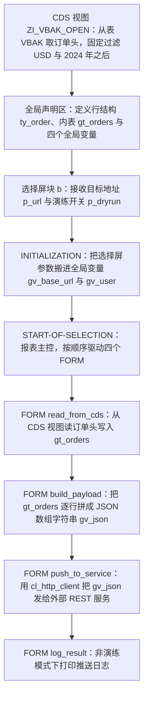
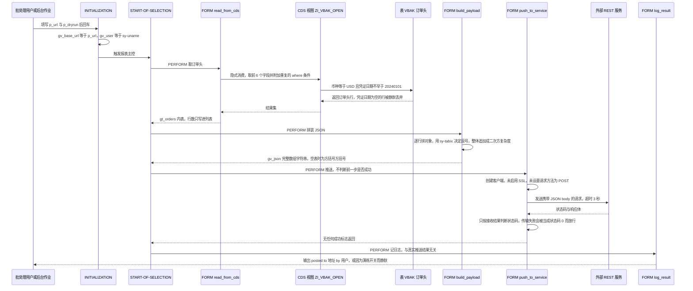

# ZSALES_SYNCH 程序分析报告（报表本体 + CDS 视图源）

分析对象：

- `zsales_synch.abap`（REPORT，146 行，4 个 FORM + 3 个事件块/声明块）
- `zi_vbak_open.asddls`（CDS View Entity 定义，22 行，被报表隐式消费）

---

## 一、程序定位与业务背景

### 1.1 这段代码在业务上想解决什么

单据数据留在 SAP 里的一个老问题是：**下游系统（CRM / 数据中台 / 定价引擎）拿不到实时数据**。最常见的解法有三种：

1. 让下游每天定时抽 SAP 的数据库表（DB extract）——对源库压力大，且绕过了 SAP 的业务语义层；
2. 让下游每天调一个 OData 服务，由 SAP 自己写接口程序；
3. 由 SAP 主动往外推（push）。

本程序选的是第 3 条：**SAP 侧定时跑一个报表，从 CDS 视图 `ZI_VBAK_OPEN` 读销售订单头，把一批订单拼成 JSON，通过 `cl_http_client` 推给外部 REST 端点**。也就是说它扮演的角色是一个"批处理集成任务（Batch Integration Job）"，而不是给人看的报表。

注意程序注释里写的是 "pushes a daily summary"（推送每日汇总），这是一个**增量同步**场景的典型表述。

### 1.2 现有方案为什么不够（作者的动机推断）

从代码结构可以反推作者想解决的问题清单：

- 用 CDS 视图而不是直接 `SELECT FROM vbak`：说明作者已经知道订单头取数应该走语义层（视图可以复用、可以挂 DCL、可以给别的程序用），但**报表里又把 CDS 的过滤条件原样抄了一遍**（见 3.1③ 与 3.6①），说明这个复用只做了一半。
- 用 `FORM/PERFORM` 而不是 OO：这是一次性脚本的形态，接收者是"跑作业的批处理用户"，不是开发者。
- 用 `p_dryrun` 参数：说明作者意识到"推错数据到生产端点"是不可逆事故，需要一个演练开关。

### 1.3 设计范式定性（一句话）

> **脚本式直连推送（Script-style direct push）**：单入口、无状态、无重试、无对账，把"取数—拼装—推送"三段用 `FORM` 串成一条直线，编排逻辑全部隐含在 `START-OF-SELECTION` 的四行 `PERFORM` 里；它能跑通一次，但不具备批处理集成应有的失败可观测性与可恢复性。

---

## 二、程序执行流程总览



**责任链（按执行先后）**

| # | 子程序 | 调用者 | 职责 |
|---|--------|--------|------|
| 0 | CDS 视图 `ZI_VBAK_OPEN` | ABAP 侧 `SELECT ... FROM z_i_vbak_open` 隐式消费（非 `PERFORM`） | 把 `VBAK` 投影成订单头视图，并在视图层固定币种与日期过滤 |
| 1 | 全局声明区（`TYPES` / `DATA` / `SELECTION-SCREEN`） | 编译器（激活时） | 定义行结构、内表、跨 FORM 传递的全局变量，以及两个输入参数 |
| 2 | 事件块 `INITIALIZATION` | ABAP 运行时（选择屏返回后） | 把 `p_url` 与 `sy-uname` 固化进全局变量 |
| 3 | 事件块 `START-OF-SELECTION` | ABAP 运行时（F8 / 后台作业开始） | 报表主控，顺序 `PERFORM` 四个 FORM |
| 4 | `FORM read_from_cds` | `START-OF-SELECTION`（PERFORM） | 从 CDS 视图取订单头到 `gt_orders`，并 `WRITE` 行数 |
| 5 | `FORM build_payload` | `START-OF-SELECTION`（PERFORM） | 把 `gt_orders` 拼成 `gv_json` 数组字符串 |
| 6 | `FORM push_to_service` | `START-OF-SELECTION`（PERFORM） | 创建 HTTP 客户端、设置 body、`send`/`receive`、判状态码、`close` |
| 7 | `FORM log_result` | `START-OF-SELECTION`（PERFORM） | 非演练模式时打印目标地址与操作者 |

下面按这条流程，逐个子程序展开。

---

## 三、分组分析

### 3.1 CDS 视图 `ZI_VBAK_OPEN`（定义段）

先看被消费的一侧。这个视图虽然只有 22 行，但它决定了报表"能取到什么"，是整条链路的数据契约源头。它可以拆成三步：注解与数据源关联、字段投影与语义注解、固定过滤条件。

#### ① 视图注解、数据源与客户关联

```abap
@AbapCatalog.sqlViewName: 'ZVBAKOPEN'
@AccessControl.authorizationCheck: #NOT_REQUIRED
@EndUserText.label: 'Open sales order headers for batch pricing review'
define view entity ZI_VBAK_OPEN
  as select from vbak
  association [0..1] to ZI_KNA1_NAME as _Customer
    on $projection.kunnr = _Customer.kunnr
{
```

**做什么** — 把视图命名为数据库对象 `ZVBAKOPEN`，数据源是订单头表 `VBAK`；同时声明一个到客户名称视图 `ZI_KNA1_NAME` 的关联，关联条件是投影后的 `KUNNR` 等于目标 `KUNNR`，基数标为 `[0..1]`。

**为什么** — `sqlViewName` 让 CDS 视图在视图维护里有一个可读的 DB 对象名，便于 DBA 用 SMOP 排查；`association` 而不是直接 `join` 是 CDS 建模的正确姿势：关联是"惰性"的，只在下游真正引用 `_Customer.xxx` 时才会生成 LEFT OUTER JOIN，避免把客户名称字段强行拉进每个消费者。基数写 `[0..1]` 而非 `[1]` 是保守做法——`KNA1` 本身每个 `KUNNR` 理论上只有一行，但目标若是过滤过的视图就可能缺行，用 `[0..1]` 不会触发运行时基数检查失败。这一段写得没问题。

**风险与改进** — `authorizationCheck: #NOT_REQUIRED` 是**明确关闭授权检查**的注解，等于声明"这张视图对所有已授权用户开放全部数据"。视图里带的是 `KUNNR`（客户号）+ `NETWR`（净订单金额），属于典型的商务敏感数据，一旦该视图被 OData/FIORI 暴露、或被别的低权限程序消费，就是越权读取。改进方向：改为 `#REQUIRED` 并配一个简单的 DCL 过滤掉无权限的 `KUNNR`，或至少限制该视图只允许通过后台作业用户访问。另外关联 `_Customer` 在本程序中**从未被使用**，属于无收益的复杂度暴露（见 3.6①）。

#### ② 字段投影与语义注解

```abap
  key vbeln,
      kunnr,
      waerk,
      netwr,
      menge,
      wrdat,
      _Customer,
      @Semantics.amount.currencyCode: 'waerk'
      netwr as net_amount,
      cast( sy-datum as abap.dats ) as run_date
}
```

**做什么** — 投影出 `VBELN`（单号）、`KUNNR`（客户号）、`WAERK`（币种）、`NETWR`（净订单金额）、`MENGE`（总数量）、`WRDAT`（凭证日期）六个业务字段，标记 `VBELN` 为 key；关联 `_Customer` 作为路径表达式暴露；另外派生两个字段：把 `NETWR` 别名为 `NET_AMOUNT` 并打上"金额，其币种由 `WAERK` 给出"的语义注解，以及把 `SY-DATUM` 转成 `DATS` 作为 `RUN_DATE` 运行日期。

**为什么** — `key vbeln` 是正确的：报表主体是"订单头"，`VBAK` 的唯一键就是 `VBELN`。`@Semantics.amount.currencyCode: 'waerk'` 是 CDS 建模里非常关键的一步——它告诉下游（CAP/FIORI/OData 消费方）"`NET_AMOUNT` 是个金额，配套币种字段是 `WAERK`"，消费方能自动渲染成带币种符号的金额或直接生成正确的小数位。`_Customer` 放在 `MENGE`/`WRDAT` 之后是刻意的：CDS 消费者做隐式消费时字段名必须是**视图字段列表的前缀**，把关联路径排在业务字段后面，报表才能只取前 6 个字段而不被关联干扰（见 3.6①）。

**风险与改进** — 三点语义校核问题：

1. **报表用的是 `NETWR` 而不是语义别名 `NET_AMOUNT`。** 两者值完全相同，但走 `NETWR` 就丢掉了 `@Semantics` 注解，消费方拿不到"金额-币种"绑定，需要自己猜哪个字段是币种（见 3.7②）。
2. **`RUN_DATE` 让视图结果依赖系统日期。** 带 `sy-datum` 的视图结果会随日期变化，不适合做 CDS 视图缓冲（Buffering）/ Analytic 查询被复用，别的程序想复用这张视图做日增量会踩坑。而且本程序完全没用它——典型的"预留字段没人用"。
3. **字段语义混装。** `MENGE`（VBAK 的"所有项目总数量"，单位是 QUAN，3 位小数）与 `NETWR`（净额，QUAN，2 位小数）、`WAERK`（币种）放在同一个结构里，但报表只用金额不用数量。若下游需要"订单级金额+数量"双指标，视图已备好；不需要，则这个字段是纯噪音。另外视图名和描述说的是 "Open sales order headers"（未清订单），但**这里没有任何"未清"条件**——`VBAK` 表头本身没有"是否未完成"字段（未清状态要看 `VBAP` 的交货/开票状态，或表 `VBAKO9` 的 `STATUS`）。名字和语义对不上，是典型的"名不副实"技术债，后来人极容易误以为已过滤。

#### ③ 固定过滤条件

```abap
where
  wrdat >= '20240101'
  and waerk  = 'USD'
```

**做什么** — 在视图层写死两个过滤条件：凭证日期不早于 `2024-01-01`，且币种等于 `USD`。

**为什么** — CDS 视图的 `where` 在视图层统一收口，好处是所有消费者天然看到一致的数据范围，避免"每个人各写一份过滤条件"导致的口径分裂。这是 CDS 相比裸 SQL SELECT 的主要价值之一，方向是对的。

**风险与改进** — 硬编码条件本身在这个场景里是**反模式**：

1. **口径会被永久冻结在 2024-01-01。** 今天是 2026 年，这个条件已经不筛掉任何东西，纯属无效约束；但它同时在报表里被复制了一份（见 3.6①），于是同一个死条件在两处维护。
2. **`'20240101'` 与 `WRDAT`（`DATS` 类型）比较是字符字面量比较。** ABAP 会做隐式类型转换，功能上没错，但扩展语法检查/代码审查会报类型不一致告警。应写 `wrdat >= CONV wrdat( '20240101' )` 或直接改成 `dats` 构造。
3. **`WRDAT` 是"凭证日期"，不是"创建日期"。** 语义上，VBAK 里 `ERDAT` 才是录入/创建日期。业务说"每天同步新订单"时，90% 的场景要的是 `ERDAT`。用 `WRDAT` 会把"昨天录入、今天才过账"和"上个月录入"的老订单混在同一个推送里——对下游增量同步来说，这是**重复推送**的源头。
4. **`WRDAT` 可为空。** 某些单据类型/未过账订单的 `WRDAT` 是初始值 `00000000`，`>= '20240101'` 会把这些行**整体静默过滤掉**，报表既不报警也不计数。这是典型的"条件过滤掉脏数据、没人知道丢了多少"。
5. **币种写死 USD。** 业务上一旦要推 EUR 订单，必须同时改视图和报表两处；只改一处就静默漏数。

改进方向：把两个条件参数化（CDS 参数或直接让报表不写 `WHERE`、靠视图收口），并对 `ERDAT` 与 `WRDAT` 做一次业务确认。

---

### 3.2 全局声明区（`TYPES` / `DATA`）

报表的"数据契约"在这里，分两步：行结构定义、跨 FORM 全局变量。

#### ① 行结构与内表定义

```abap
TYPES: BEGIN OF ty_order,
         vbeln    TYPE vbeln_va,
         kunnr    TYPE kunnr,
         waerk    TYPE waerk,
         netwr    TYPE netwr,
         menge    TYPE menge,
         wrdat    TYPE wrdat,
       END OF ty_order.

TYPES ty_order_tab TYPE STANDARD TABLE OF ty_order WITH EMPTY KEY.
```

**做什么** — 定义结构 `TY_ORDER`，六个字段的字典类型与 CDS 视图逐一对齐（`VBELN_VA`、`KUNNR`、`WAERK`、`NETWR`、`MENGE`、`WRDAT`），并定义 `TY_ORDER_TAB` 为 `WITH EMPTY KEY` 的标准表。

**为什么** — **这里做对了很重要的一件事：类型直接引用 DDIC 数据元素，而不是自己定义 `TYPE c(10)` 之类的原始类型。** 这样一来，如果 CDS 视图改了字段长度或精度（`NETWR` 从 2 位小数变 3 位），报表激活时编译器会立刻报错，而不是运行到 JSON 拼装时才发现数字被截断。字段与 CDS 一一对应也保证了隐式消费的前提（见 3.6①）。

`WITH EMPTY KEY` 而不是 `WITH DEFAULT KEY`：内表是纯线性 `LOOP` 使用、不做任何 `READ`/二分查找，空键省掉了哈希表维护开销，也强制杜绝了误用。选得对。

**风险与改进** — 用 `NETWR`/`MENGE` 这些 **QUAN 类型**（带符号 + 小数位）承载金额与数量，在报表层做算术或格式化时会继承 DDIC 的小数位定义，容易出现"金额被当成数量、精度丢一位"的经典错误。本程序暂时只是搬运，风险未爆发，但更好的做法是在结构里直接对齐 CDS 的语义别名（`NET_AMOUNT`），并加一行 `CONV` 做显式收口。另外 `MENGE` 取进来了却从没用（见 3.7②），属于无用负载。

#### ② 跨 FORM 传递的全局变量

```abap
DATA gt_orders TYPE ty_order_tab.
DATA gv_base_url TYPE string.
DATA gv_json TYPE string.
DATA gv_user  TYPE sy-uname.
```

**做什么** — 定义四个全局变量：`GT_ORDERS`（订单内表，取数结果）、`GV_BASE_URL`（目标地址）、`GV_JSON`（拼好的 JSON 字符串）、`GV_USER`（操作者）。

**为什么** — `FORM/PERFORM` 之间的参数传递只有 `PERFORM ... USING/CHANGING` 一条路，而这里三个 FORM 之间是"生产者—消费者"式的单向流（`read_from_cds` 产 `GT_ORDERS`，`build_payload` 产 `GV_JSON`，`push_to_service` 消费 `GV_JSON`）。用全局变量传这个链式数据在脚本程序里是常规做法，可读性尚可。

**风险与改进** — 全局变量意味着**单元测试几乎不可能**：想测 `build_payload` 就得先把 `GT_ORDERS` 填好，而填充逻辑在另一个 FORM 里。更关键的是 `GV_JSON` 的容量问题：ABAP `string` 类型理论上到 2GB，但一个 `DATA` 字段承载全部业务数据，且被反复整体重建（见 3.7③），内存峰值极高。改进方向：把 FORM 改成带 `USING` 参数的子程序（哪怕仍在 REPORT 里），使每个单元可独立驱动与断言；同时给推送体加"分批（chunk/paging）"设计，避免把全量订单塞进一次 HTTP 请求。

---

### 3.3 选择屏块 `b`（声明块）

#### ① 目标地址与演练开关

```abap
SELECTION-SCREEN BEGIN OF BLOCK b.
  PARAMETERS p_url TYPE string LOWER CASE DEFAULT 'https://api.example.com'.
  PARAMETERS p_dryrun AS CHECKBOX DEFAULT 'X'.
SELECTION-SCREEN END OF BLOCK b.
```

**做什么** — 定义一个带说明文字的输入块：目标服务地址 `p_url`（默认示例域 `https://api.example.com`，保留小写），以及一个复选框 `p_dryrun`（默认勾选）。

**为什么** — 两个参数分别对应"往哪儿推"和"要不要真推"，是集成脚本的最小必要输入。作者给 `p_dryrun` 默认打勾（安全默认），出发点是对的。

**风险与改进** — 三个问题，其中第一个是本程序最严重的缺陷的伏笔：

1. **`p_dryrun` 在整个程序里只被 `log_result` 用来决定"要不要打印一行日志"（见 3.9），`push_to_service` 从头到尾没有读过它。** 也就是说**勾着"演练"照样发出真实 HTTP 请求**。默认打勾反而更危险：操作员以为自己安全地跑了演练，实际上已经把数据推到了生产端点。
2. **`p_url` 没有任何校验。** 没有 `AT SELECTION-SCREEN` 检查非空、协议必须是 `https`、不能带尾随空格/换行。用户（或作业配置）把它改成内网地址就是一个**内网探测 + 数据外发**通道（SSRF 形态）。默认值还是 `example.com` 这种占位域名，说明这程序从未在生产上真正跑通过。
3. **`PARAMETERS ... TYPE string` 用于选择屏**，长度不受控。选择屏字段实际受屏幕定义限制，`string` 会让长度检查形同虚设；应改为 `TYPE c LENGTH 512` 之类显式长度定义。

---

### 3.4 事件块 `INITIALIZATION`

#### ① 把选择屏参数搬进全局变量

```abap
INITIALIZATION.
  gv_base_url = p_url.
  gv_user     = sy-uname.
```

**做什么** — 在初始化事件里把 `p_url` 复制进 `GV_BASE_URL`，并把当前登录用户 `SY-UNAME` 复制进 `GV_USER`。

**为什么** — `INITIALIZATION` 是选择屏回车后、`START-OF-SELECTION` 之前唯一可靠的时机，在此处固化输入是标准做法。`GV_USER` 单独存一份操作者，为的是事后审计"谁推的"。

**风险与改进** — 把 `SY-UNAME` 存进一个全局变量、在几屏之后才使用，属于典型的**快照过期**写法：它记录的是"启动时登录的人"。若作业由系统用户（如 `SAP*`）执行，这个值毫无审计价值——集成作业真正该记录的是**调度者/配置责任人**，建议从作业配置或自定义表读取。技术上无更多风险。

---

### 3.5 事件块 `START-OF-SELECTION`

#### ① 报表主控：顺序驱动四个 FORM

```abap
START-OF-SELECTION.

  PERFORM read_from_cds.
  PERFORM build_payload.
  PERFORM push_to_service.
  PERFORM log_result.
```

**做什么** — 报表主控，按顺序调用 `read_from_cds` → `build_payload` → `push_to_service` → `log_result`，每一步之间不做任何条件判断。

**为什么** — 四段职责切得很干净（取数 / 拼装 / 推送 / 记日志），单看这段代码一目了然，这是本程序结构上做对的地方。

**风险与改进** — 这是整条链路的**控制流最大缺陷**：主控是"无条件直线执行"，于是后面三个致命问题全部畅通无阻：

- `read_from_cds` 取空表 → `build_payload` 照样产出 `[]` → 照样推送 → 下游若按全量覆盖语义处理，等于**推送了一次清空信号**；
- `push_to_service` 中途失败并 `RETURN` → `log_result` 照样执行，打出"posted to ..." 的成功日志；
- `p_dryrun` 勾选/不勾选，行为**完全一样**。

正确做法是让每一步返回成功标志（或抛异常），主控逐段判断，失败即中止并置作业失败。例如：`IF NOT read_from_cds( ). RETURN. ENDIF.`，或在 `build_payload` 前加 `IF lines( gt_orders ) = 0. MESSAGE ... TYPE 'E'. RETURN. ENDIF.`。这是本报告的**头号改进项（P0）**。

---

### 3.6 `FORM read_from_cds`

取数是这个程序的第一个业务动作，也是数据口径最终落地的地方。分三步：执行 `SELECT`、判定空结果、输出行数。

#### ① 从 CDS 视图取订单头

```abap
FORM read_from_cds.

  SELECT vbeln kunnr waerk netwr menge wrdat
    FROM z_i_vbak_open
    INTO TABLE gt_orders
    WHERE waerk = 'USD'
      AND wrdat >= '20240101'.
```

**做什么** — 通过 CDS 视图 `ZI_VBAK_OPEN` 隐式消费，字段列表取 `VBELN KUNNR WAERK NETWR MENGE WRDAT`，连同 `WHERE waerk = 'USD' AND wrdat >= '20240101'` 一起写进内表 `GT_ORDERS`。

**为什么** — 隐式消费是 CDS 消费的标准姿势：只写 `FROM z_i_vbak_open`，不写 join、不写 `MANDT`，由数据库层面把视图展开。这里有两个**必须成立**的隐含前提，作者恰好都满足，值得肯定：

1. **字段列表必须是 CDS 字段列表的"前导前缀"。** CDS 顺序是 `vbeln, kunnr, waerk, netwr, menge, wrdat, _Customer, net_amount, run_date`，报表正好取前 6 个，是合法前缀——这正是把 `_Customer` 关联排在第 7 位（见 3.1②）所换来的好处。否则激活就会报"字段列表非前缀"错误。
2. **前置前缀的副作用是：`_Customer` 不会被 JOIN。** 所以虽然视图里有个客户关联，本报表**不会**顺带读 `KNA1`，取数范围严格限制在 `VBAK`，性能上是划算的。

**风险与改进** — 骨架正确，但**取数条件是这份代码里最需要商榷的部分**：

- **过滤条件与 CDS 视图完全重复。** 视图 `where` 里已经写了 `wrdat >= '20240101' and waerk = 'USD'`，报表又原样抄一遍，两份一模一样的字面量。这意味着：如果业务要把窗口改成 `2025-01-01`，**必须记得改两个地方**；如果只改报表那一份，CDS 的过滤仍然生效，条件"看起来生效了但改不动"；如果只改 CDS，报表的旧条件又把新数据全筛回去，同样静默漏数。这种"双份真相"是维护事故的温床。既然视图已经收口，报表里**根本不该写 `WHERE`**。
- **字面量 `'20240101'` 与 `WRDAT`（`DATS`）比较是隐式转换**，扩展程序检查会告警；应用 `CONV wrdat( '20240101' )`。
- **日期语义错配**（详见 3.1③）：注释说"daily summary"（每日汇总），条件却锁死在 2024-01-01 之后的所有凭证日期。这既不是"每日增量"，也不是"全量"——它是一个随时间无限增长的全集。
- **窗口不设上界**，意味着每年这个报表的取数结果和 JSON 体积都会增长，配合 3.7③ 的二次方拼接，是一条通向 OOM 的路。

改进方向：报表去掉 `WHERE`（口径只由视图负责）；视图把过滤参数化；窗口做成选择屏日期区间（并明确是 `ERDAT` 还是 `WRDAT`）。

#### ② 空结果判定与提示

```abap
  IF sy-subrc <> 0.
    MESSAGE 'CDS view returned no rows' TYPE 'S'.
  ENDIF.
```

**做什么** — 检查 `SY-SUBRC`，非 0 时弹出一条消息"CDS view returned no rows"。

**为什么** — 作者显然想到了"可能取不到数"这个场景。

**风险与改进** — 这段代码有三个层次的问题，从表层到本质逐级严重：

1. **`SY-SUBRC` 在这里根本不是"无行"信号。** `SELECT ... INTO TABLE` 接收进内表时，`SY-SUBRC` 不承担"空表"语义（空内表不是 SQL 错误），判断空结果只能用 `LINES( itab ) = 0`。所以这个 `IF` **基本不会成立**，是死代码；真正的空结果无人拦截。
2. **即使它成立了，也没有 `RETURN`。** `MESSAGE ... TYPE 'S'` 之后代码继续往下走，仍会拼出一个 `[]` 并推送给外部服务。判断和处置没有闭环。
3. **`TYPE 'S'` 不会中断程序，在后台作业里只写进作业日志，不把作业置为失败。** 运维在作业监控里看到的是"绿灯成功"，而实际上什么数据都没推。集成程序应当用 `MESSAGE ... TYPE 'E'`/`'A'`，或抛 `ZCX_...` 业务异常把作业打成失败。

改进方向（与 3.5① 呼应）：把空结果判定上提到主控，用 `LINES( )` 判空、抛异常中止、置作业失败。

#### ③ 输出取到的行数并结束 FORM

```abap
  WRITE: / 'orders', lines( gt_orders ).

ENDFORM.                       "read_from_cds
```

**做什么** — 用列表 `WRITE` 在屏幕上（后台则是 Spool）打印一行 `'orders'` 加取到的行数，然后结束 FORM。

**为什么** — 给操作者一个最直观的"这次取了多少行"信号。作者已经在这里用到了 `lines( )`——**恰恰证明他知道正确的判空方式**，只是没在判定处用（见 3.6②），这是逻辑上的自相矛盾。

**风险与改进** — `WRITE` 不是日志。后台作业的 Spool 会被清理、不可检索、不可告警；一旦推送失败，事后没人能从 Spool 里查出发送时间、请求字节数、响应码。集成任务的可观测性应当落在 `BAL`（`CALL FUNCTION 'BAL_LOG...'`）、`SLG0` 应用日志，或至少一张自定义推送流水表（批次号、记录数、字节数、HTTP 状态、响应摘要）。这里至少补一个批次号，把"取数行数—推送字节—状态码"三者关联起来。另外 `WRITE` 直接输出在 Formatted 列表里，对非技术用户不友好，可以考虑 ALV/参数化消息。

---

### 3.7 `FORM build_payload`

JSON 拼装是用户重点关注的第二块。拼装分四步：初始化数组、拼单行对象、粘分隔符、闭合数组。

#### ① 初始化 JSON 数组

```abap
FORM build_payload.

  DATA lv_row TYPE string.

  gv_json = '['.
```

**做什么** — 声明行字符串 `LV_ROW`，把全局 `GV_JSON` 初始化为左方括号 `[`。

**为什么** — 手写 JSON 数组的开头，配合 3.7④ 的 `]` 收尾，是最直白的拼装方式。

**风险与改进** — 用字符串拼接手搓 JSON，等于**把"转义"这件事完全托付给了开发者自己**。JSON 规范要求所有字符串值里的 `"`、`\`、控制字符必须转义，而本程序一行转义代码都没有（见 3.7②）。另外若 `GT_ORDERS` 为空，这段仍会产出 `[]` 并推给外部（见 3.5①）。根本的改进方向是换成标准序列化器——`cl_abap_json`（或 `/ui2/cl_json`）通过引用传结构体自动完成引号、逗号、数字格式与转义：

```abap
DATA(lo_json) = NEW /ui2/cl_json( ).
DATA(lv_json) = lo_json->serialize( ix = ls_row ).

```

（此处为改进建议示例，非原程序代码。）手写拼接只在教学示例里可以接受。

#### ② 逐行拼装 JSON 对象

```abap
  LOOP AT gt_orders INTO DATA(ls_order).

    lv_row = |{ |"vbeln": "{ ls_order-vbeln }",| &
              |"customer": "{ ls_order-kunnr }",| &
              |"amount": { ls_order-netwr },| &
              |"currency": "{ ls_order-waerk }",| &
              |"date": "{ ls_order-wrdat CONDENSE SPACE }" }|.
```

**做什么** — 遍历 `GT_ORDERS`，把每行拼成一个 JSON 对象字符串放入 `LV_ROW`：键 `vbeln`（原样）、`customer`（`KUNNR`）、`amount`（`NETWR`，**不带引号的裸数值**）、`currency`（`WAERK`）、`date`（`WRDAT`，带 `CONDENSE SPACE`）。

**为什么** — 字符串模板 `|{ }|` 是 7.40 之后拼接动态文本的推荐写法，比老式 `CONCATENATE` 清晰得多，方向是对的。作者在 `WRDAT` 上加 `CONDENSE SPACE` 说明他意识到数值/日期类型直接内插可能带空格（这是 ABAP 数值转字符串的经典坑），值得肯定。

**风险与改进** — 这一段是 JSON 拼装的核心，逐项核对下来问题不少：

1. **金额用了裸数值内插。** `|{ ls_order-netwr }|` 对 `NETWR`（QUAN，2 位小数）会输出 `1234.56` 这样的字面量——因为 ABAP 按 DDIC 定义的小数点输出，这个点恰好是 `.`，**当前碰巧合法**。但这是"靠数据元素定义救回来"，不是设计：一旦把 `NETWR` 换成 `CURR`、或未来换成带正负号/千分位的 `CHAR` 字段、或是含负零的值，输出就不是合法 JSON 了。稳妥写法是显式控制：`|{ ls_order-netwr DECIMAL = '.' }|` 或先 `CONV string( )`。而且这条链路完全依赖 DDIC 的 `CURRENCY`/小数位定义，属于隐式契约，应当在代码里显式声明。
2. **金额语义被抹平。** `NETWR` 是**不含税的净订单金额**（net），`MENG E` 是数量，`WAERK` 是交易币种。JSON 里把 `amount` 和 `currency` 拆成两个平级字段，等于丢掉了 `@Semantics.amount.currencyCode` 建立的那层绑定。更贴合语义的做法是直接用视图的 `NET_AMOUNT` 别名，或把金额表达成对象 `{"value": "...", "currencyCode": "USD"}`，让下游不可能把 USD 金额当成 EUR。
3. **日期格式没对齐。** `WRDAT` 是 `DATS`，内插输出是 `20240101`（`YYYYMMDD`），不是外部接口通常期待的 ISO 8601 `2024-01-01`。`CONDENSE SPACE` 在这里**没有任何实际作用**（`DATS` 是连续 8 位数字，内部不会有空格），它只对 `CHAR` 类型的带空格字段有用——作者把它当成了"日期格式化"，其实是误解。所以这一行既没解决格式问题，也没解决空日期问题（`WRDAT` 为空时会输出 `"00000000"`）。
4. **零值与未维护值不可区分。** `NETWR` 为初始值时输出 `0.00`，下游无法区分"这单确实是 0 元"和"金额字段没维护"。
5. **完全没有转义。** `VBELN` 是 `CHAR(10)`，`KUNNR` 也可能含 `/` 等字符；一旦某字段里出现 `"` 或 `\`，整个 JSON 直接解析失败、整批数据全部丢失。目前靠数据"干净"侥幸不出事。
6. **键名中英德混杂**：`vbeln`（德语 SAP 名）+ `customer`/`amount`/`currency`/`date`（英语），风格不统一，也让下游对接文档难写。建议统一加 CDS 注解（`@EndUserText.label`）在视图里就定好对外 JSON 的键名。
7. **`MENGE` 取了没用。** 订单总量在内表里躺着，JSON 里没有。若下游需要数量，就要补；若不需要，取数就该少取一列。

#### ③ 用 `sy-tabix` 决定是否加逗号并累加

```abap
    IF sy-tabix > 1.
      gv_json = gv_json && |,|.
    ENDIF.

    gv_json = gv_json && lv_row.
```

**做什么** — 循环里判断 `SY-TABIX > 1`：第一行不加逗号，其余行先补一个 `,`；然后把 `LV_ROW` 追加到 `GV_JSON` 末尾。

**为什么** — 用循环计数器代替"是否已经写过一行"的标志位，省一个变量，思路能看懂。

**风险与改进** — 两个问题，一个正确性、一个性能：

1. **依赖全局隐式状态，脆弱。** `SY-TABIX` 是 ABAP 的全局隐式字段，靠它推断"当前是不是第一行"，等于把数据结构的隐含约定写进了控制流。今天 `LOOP` 只有一个、紧邻拼接，成立；**明天任何人加一层内层 `LOOP`（比如先去重、再拼装），`SY-TABIX` 就变成内层行号，逗号逻辑立刻错乱**，而且编译不报错、只在特定数据下崩。这是典型的"用运行时全局变量做业务判断"。标准解法是显式标志 `DATA lv_first TYPE abap_bool VALUE abap_true.`，或判 `GV_JSON <> '['`。
2. **字符串整体追加是二次方复杂度。** `gv_json && lv_row` 每轮都要把整个已拼好的串复制一遍，总复制量约为 `n²m/2`（n = 行数，m = 单行长度）。取 10 万行、单行 200 字符时，纯粹用于字符串拼接的内存搬运就到 10GB 量级——这是**确定会踩的性能地雷**，而不是理论担忧。改进方向：用 `TYPE string_tab` 收集每一行，最后一次性 `CONCATINATE ... INTO gv_json SEPARATED BY ','`；更彻底的是按批次（每批 N 条）分别推送，控制单次请求体大小。

#### ④ 闭合数组并结束 FORM

```abap
  ENDLOOP.

  gv_json = gv_json && ']'.

ENDFORM.                       "build_payload
```

**做什么** — 循环结束后把右方括号 `]` 追加到 `GV_JSON`，结束 FORM。

**为什么** — 与 3.7① 的 `[` 呼应，完成数组闭合。空表时结果就是合法的空数组 `[]`。

**风险与改进** — 结构上没错，问题在于**空数组是一个合法但危险的推送内容**：如果外部接口把收到的 payload 当作"全量数据"整体覆盖，那一次"查不到订单"就会把下游数据清空，而本程序既不拦截也不提示（见 3.5①、3.6②）。另外注意 `GV_JSON` 是全局变量，若 `build_payload` 被调用两次（当前不会），逗号逻辑与数组边界会残留上一次的内容——拼装类函数应当保证"要么覆盖、要么追加"的语义，这里靠"全局变量每次被重新赋值"这一隐式约定维持，非常依赖调用纪律。改为局部变量 + 参数传出更安全。

---

### 3.8 `FORM push_to_service`

HTTP 调用是用户重点关注的第三块，也是本程序风险最集中的地方。它分五步：类型声明与请求体转换、创建客户端、设置请求、发送与接收、状态判定与关闭。

#### ① 类型声明与请求体转换

```abap
FORM push_to_service.

  DATA lo_client  TYPE REF TO if_http_client.
  DATA lv_xstring TYPE xstring.
  DATA lv_status  TYPE i.

  CREATE XSTRING LV_XSTRING DATA GV_JSON.
```

**做什么** — 声明 HTTP 客户端引用、`XSTRING` 请求体、`TYPE i` 状态码；然后用 `CREATE XSTRING` 把字符型 `GV_JSON` 转成字节型 `LV_XSTRING`（用于以二进制方式提交 body）。

**为什么** — `CREATE XSTRING` 是 7.52 及以上提供的简洁语句，比老写法 `TRANSLATE ... TO INTERNAL` 干净。要注意的是：这条语句说明本程序**至少需要 7.52**，加上 `string` 类型与内联声明 `DATA(...)`，整个程序绑定在 7.50+ 的语言特性上——而源文件头没有任何版本声明，激活时会依赖系统版本，这在跨系统拷贝时容易出问题。

**风险与改进** — `CREATE XSTRING` 的字符集转换依赖**系统代码页**，遇到非 ASCII 字符会得到与源串不一致的字节序列（长度按字节收缩），JSON 里任何非 ASCII 内容都可能损坏。本程序的字段（单号、客户号、币种、日期、金额）恰好都是 ASCII，所以**当前安全**——但这是数据碰巧干净带来的，不是设计保证。规范做法是显式指定编码：`cl_abap_char_utilities=>string_to_xstring( src = gv_json )`，或让 `if_http_client` 用字符串 + `set_content_type( ... )` 携带 charset，让 HTTP 层负责编码。另外这个 FORM 用 `DATA` 在**语句中间夹声明 + 可执行语句**的混合写法（`DATA lv_status` 之后紧跟 `CREATE XSTRING`）虽然合法，但与"先声明后执行"的阅读习惯冲突，建议统一。

#### ② 创建 HTTP 客户端

```abap
  cl_http_client=>create_by_url(
    EXPORTING
      url                = gv_base_url
    IMPORTING
      client             = lo_client
    EXCEPTIONS
      argument_not_found = 1
      plugin_not_active  = 2
      OTHERS             = 3 ).

  IF sy-subrc <> 0.
    WRITE: / 'client creation failed', sy-subrc.
    RETURN.
  ENDIF.
```

**做什么** — 调用 `CL_HTTP_CLIENT=>CREATE_BY_URL` 创建一个指向 `GV_BASE_URL` 的客户端对象，捕获 `argument_not_found`、`plugin_not_active` 和 `OTHERS` 三类异常；失败时把子返回码打到列表里并 `RETURN` 退出 FORM。

**为什么** — `CREATE_BY_URL` 是最省事的建连方式；显式列举两个具名异常再兜底 `OTHERS`，比裸调用不写 `EXCEPTIONS` 要好（后者一旦异常不被处理会直接 dump）。

**风险与改进** — 这一段有**四个**问题：

1. **HTTPS 从未被启用。** `CL_HTTP_CLIENT` 本身**不带 SSL**，`CREATE_BY_URL` 看到 `https://` 也不会自动打开加密通道，必须显式给 `lo_client->prop_ssl` 注入一个 `if_sssl` 实现（常见做法如 `lo_client->prop_ssl = NEW /ssl/ssl_client( id = 'SSL' )` 后调用 `set_verify( )` / 设置主机名校验参数）。也就是说：**按当前代码，这个默认的 `https://` 地址根本走不通 SSL**，会在 `send`/`receive` 阶段失败。生产上要接 HTTPS 服务，这段是必须补的。
2. **失败只 `WRITE` + `RETURN`，不上报。** `WRITE` 在后台作业里进 Spool，不会把作业打成失败；调用方 `START-OF-SELECTION` 也不检查任何返回值，直接继续执行 `log_result`。**结果是"客户端创建失败"会被后续日志掩盖成"推送成功"。** 正确做法是 `MESSAGE ... TYPE 'E'`、抛业务异常，或至少设置一个全局失败标志供主控判断。
3. **`WRITE ... sy-subrc` 把异常语义丢了。** 三类异常映射成 1/2/3，但打印出来的数字对运维毫无意义（`1` 是 URL 参数问题还是 `2` 是插件未激活？）。至少要打印异常名。
4. **地址没有任何校验。** `p_url` 直接进 `CREATE_BY_URL`：非空校验、协议校验、尾随空白/换行处理全缺。`string` 里一个尾部换行就可能让建连失败或连到错误主机。

#### ③ 设置请求方法与请求体

```abap
  lo_client->request->set_cdata( lv_xstring ).
  lo_client->request->set_content_type( 'application/json' ).
```

**做什么** — 把 `LV_XSTRING` 作为请求体写入客户端，并声明内容类型为 `application/json`。

**为什么** — `SET_CDATA` 是设置请求 body 的标准方法，`SET_CONTENT_TYPE` 声明媒体类型——这两行是本 FORM 里唯一完全正确的部分，媒体类型声明得很准确（推送 JSON 而不是表单编码）。

**风险与改进** — **缺了最关键的一行：`set_method`。**

- `IF_HTTP_CLIENT` 的默认请求方法是 **`GET`**。程序从未调用 `lo_client->request->set_method( if_http_client=>methods-post )` 或 `methods-put`。
- 后果：这次"推送"实际是**带着 JSON body 的 GET 请求**。绝大多数 REST 接口对带 body 的 GET 会直接返回 `400 Bad Request`；少数宽松的服务器可能接受，但那显然不是对方的设计意图。**这是一个 P0 级缺陷**——它意味着这个程序在真实接口上大概率根本推不出去。
- 补充两点：其一，`SET_CONTENT_TYPE` 最好带上 `charset=utf-8`；其二，除了业务字段，还应设置**幂等键 / 批次号请求头**（如 `If-None-Match`、`X-Batch-Id`），否则失败重试会产生重复数据，而当前程序**根本没有重试**（见 3.8⑤）。
- 再补一点安全性的：`request->set_header( ... )` 从未设置 `Authorization`，意味着外部接口是**无鉴权**的。往外部系统推客户号和订单金额而无任何身份凭据，是明确的安全问题（若接口确实匿名可调，那风险由对端承担，但本程序至少应支持并传入凭据）。

#### ④ 发送与接收（异常未被检查）

```abap
  lo_client->send(
    EXPORTING
      timeout = 3
    EXCEPTIONS
      http_communication_failure = 1
      http_invalid_state         = 2
      http_processing_failed     = 3
      OTHERS                     = 4 ).

  lo_client->receive(
    EXCEPTIONS
      http_communication_failure = 1
      http_invalid_state         = 2
      OTHERS                     = 3 ).
```

**做什么** — 调用 `SEND` 发送请求，超时设 3 秒，捕获三类异常；随后**无条件**调用 `RECEIVE` 读取响应，捕获两类异常加 `OTHERS`。

**为什么** — `SEND` + `RECEIVE` 的两步式调用是 `IF_HTTP_CLIENT` 的标准流程（前者发请求、后者读响应流），`EXCEPTIONS` 也列得比较全。这一段**看起来**做了错误处理，实际上没有——这正是最危险的地方。

**风险与改进** — 四个问题：

1. **`SEND` 的异常被完全丢弃。** `SEND` 后立刻调用 `RECEIVE`，中间的 `SY-SUBRC` 从未检查。发送失败时 `RECEIVE` 没有意义（响应流是空的），大概率再抛一次异常，于是 `SY-SUBRC` 来自 `RECEIVE`——**代码判断的其实是"接收"结果，却当成"整个调用"的结果**。传输层失败（DNS 解析不了、TLS 握手失败、超时、连接被拒）与业务层失败（4xx/5xx）本该分开处理，这里被混成一个数字。
2. **`TIMEOUT = 3` 秒过于苛刻。** 出站 HTTPS 推送通常包含 TLS 握手 + DNS + 往返，3 秒在跨公网/跨区域时极易超时。更关键的是：**超时会被当成"发送失败"**，而此时**远端可能已经收到并处理了数据**——于是"本地认为失败、重试（若将来加重试）"就会产生重复推送。这是集成场景里最经典的数据重复来源，超时值应放大（如 30~60 秒）并配合幂等键。
3. **`RECEIVE` 没有取回响应体。** 没传 `EXPORTING data_received = ...`，对方的错误信息（`{"error": "invalid payload at line 3"}` 这类）被彻底丢弃，排查时只能看到"成功/失败"，看不到原因。正确做法是接收 body 并写进日志。
4. **没有重试、没有退避。** 单次失败即放弃（还只是一句 `WRITE`）。生产集成至少应配置有限次指数退避重试，并且只对可重试错误（连接类错误、5xx）重试。

#### ⑤ 状态码判定与关闭连接

```abap
  IF sy-subrc = 0.
    lv_status = lo_client->response->get_status( ).
  ENDIF.

  IF lv_status >= 400.
    MESSAGE 'Remote service rejected the payload' TYPE 'S'.
  ENDIF.

  lo_client->close( ).

ENDFORM.                       "push_to_service
```

**做什么** — 若 `SY-SUBRC = 0` 就取 HTTP 状态码存入 `LV_STATUS`；若状态码 ≥ 400 弹一条 S 级消息；最后关闭客户端连接，结束 FORM。

**为什么** — 意图是对的：区分成功与失败。但实现把三个独立的错误维度（传输层、协议层状态码、业务语义）压成了一个变量，还压错了。

**风险与改进** — 逐条看：

1. **`LV_STATUS` 的判定对象错了。** 它只反映 `RECEIVE` 是否成功，**不代表 HTTP 交互成功**。若 `RECEIVE` 失败，`LV_STATUS` 保持初始值 `0`，于是 `IF lv_status >= 400` 为假 → **程序认为一切正常**。而 `SEND` 成功但对端返回 `500` 的情况虽然会被 `>= 400` 抓到，可抓到之后也只是弹个 S 消息，程序继续跑。所以**最常见的失败模式（发送/接收失败）在这个程序里被静默吞掉**。
2. **`MESSAGE ... TYPE 'S'` 不中断，也不置作业失败。** 与 3.6② 同病。远端拒绝（4xx/5xx）后，程序继续走到 `log_result` 打出"posted to ..."。**这是"假成功日志"**。
3. **状态判定口径偏松。** `>= 400` 意味着 **3xx 也算成功**；而 `GET_STATUS( )` 本身还有返回子返回码（取不到状态码的情况）没检查。语义上应只在 `200~299` 范围内算成功。
4. **没有 `get_reason_phrase( )`**，失败时拿不到服务器给的原因短语，日志里只有一个数字。
5. **`CLOSE( )` 不在统一出口。** 中间各条失败路径（创建失败时 `RETURN`、其余路径靠 `MESSAGE` 继续）并不一致地把连接关掉。目前只有"走到最后"才 `CLOSE`；若将来在中间加 `RETURN`，连接就泄漏了。规范做法是用一个统一出口（子程序尾部 / `ENDFORM` 前的清理段）保证 `CLOSE` 一定执行。
6. **`CLOSE( )` 之后没有释放 `LO_CLIENT`。** 引用变量在 FORM 结束时会失效，实际上问题不大；但在 `IF_HTTP_CLIENT` 的资源管理上，显式 `RELEASE lo_client` 更清晰。

**这一整段合起来，是本次分析的 P0 结论：当前代码在传输失败、SSL 未启用、方法为 GET、状态码漏判这四重作用下，唯一"可靠"的行为是把 `gv_json` 拼出来，然后大概率失败或失败后仍报告成功。**

---

### 3.9 `FORM log_result`

#### ① 非演练模式打印推送日志

```abap
FORM log_result.

  IF p_dryrun IS INITIAL.
    WRITE: / 'posted to', gv_base_url, 'by', gv_user.
  ENDIF.

ENDFORM.                       "log_result
```

**做什么** — 仅当 `p_dryrun` 未勾选时，向列表打印一行"posted to &地址 by &用户"，然后结束 FORM。

**为什么** — 意图是避免演练时输出误导性的日志。写法本身很简洁，没有风险。

**风险与改进** — 简短但要命：**这条日志是在 `push_to_service` 无条件执行之后才打的，它只根据 `p_dryrun` 判断，与推送是否真的发生过、是否成功毫无关系。** 于是：

- 客户端创建失败并 `RETURN` 了 → `log_result` 照打"posted to ..."；
- 对端返回 `500`、消息只是弹了一下 → 照打"posted to ..."；
- 用户勾了演练（`p_dryrun = 'X'`）→ 真实请求**已经发出**，只是这一行日志不打印。

也就是说，日志的存在**反而制造了误导**：一行"posted to"会让运维以为数据已落库。这个 FORM 应该接收推送结果作为参数，只在真正成功时记录，且记录的内容应包含批次号、行数、字节数、状态码、响应摘要，而不是一个 URL 和用户名。

---

## 四、执行流程全景图（数据视角）



从数据视角看三个关键事实：**（a）`gt_orders` 是唯一的事实来源，CDS 层的过滤条件是隐式的、不可见的；**（b）`gv_json` 是唯一的传参通道，且是整体重建的巨型字符串；**（c）推送结果这条信息在 `push_to_service` 与 `log_result` 之间被彻底丢失**，全流程没有任何"成功/失败"的显式表达。

---

## 五、问题清单与改进建议（按优先级）

### 🔴 P0 — 业务正确性

| # | 问题 | 所在子程序 | 建议 |
|---|------|-----------|------|
| 1 | **推送结果完全丢失，失败被报成成功**：`push_to_service` 用 `SY-SUBRC`（来自 `receive`）判断成败，`lv_status` 失败时保持 `0` 从而绕过 `>= 400`；`MESSAGE ... TYPE 'S'` 不中断，主控无判断，最后 `log_result` 无条件打"posted to" | `FORM push_to_service`、`FORM log_result`、事件块 `START-OF-SELECTION` | 三个改造一起做：① 推送子程序返回明确成功标志或抛 `ZCX_` 异常；② 主控逐段判断，失败即中止；③ 只在真正成功时记录日志，并写入批次号/行数/字节数/状态码 |
| 2 | **演练开关 `p_dryrun` 形同虚设**：只有 `log_result` 读它，`push_to_service` 完全忽略，勾着演练照样发真实请求 | `FORM push_to_service`（未读）、`FORM log_result`（唯一读取处） | 在 `push_to_service` 开头做真实短路：`IF p_dryrun = 'X'. WRITE / 'dry run: payload skipped'. EXIT. ENDIF.`；并把默认值改为不勾选（安全默认应当是"不推送"） |
| 3 | **未设置请求方法，实际发出的是 GET**：`if_http_client` 默认方法为 `GET`，程序从未调用 `set_method`，带 body 的 GET 会被绝大多数接口以 400 拒绝 | `FORM push_to_service` | 发送前加 `lo_client->request->set_method( if_http_client=>methods-post )`（或按接口约定 `methods-put`） |
| 4 | **HTTPS 从未启用**：`prop_ssl` 未注入 `if_sssl` 实现，`CREATE_BY_URL` 不会因为 URL 是 `https` 就自动开 SSL，TLS 握手必然失败 | `FORM push_to_service` | 注入 `if_sssl` 实现并设置证书与主机名校验（常见如 `lo_client->prop_ssl = NEW /ssl/ssl_client( id = 'SSL' )` 后 `set_verify( )` / 配 `SSSL_PARAMS`），或改用支持 TLS 的 HTTP 客户端封装 |
| 5 | **空结果会被当成"推送空数组"**：`SY-SUBRC` 在 `INTO TABLE` 场景不承担空表语义，空结果无人拦截，仍会推出 `[]`；下游若按全量覆盖处理即等于清空 | `FORM read_from_cds`、`FORM build_payload` | 用 `lines( gt_orders ) = 0` 判空，抛异常/置作业失败并在推送前中止；同时在请求头带批次号，让下游能识别"空批次" |
| 6 | **`SEND` 异常未被检查**：`send` 之后直接 `receive`，传输层错误（DNS/TLS/超时/连接拒绝）被降级成"接收结果"，与 HTTP 层失败混淆 | `FORM push_to_service` | `send` 后立即判 `sy-subrc`，非 0 直接进失败出口并记录异常名；不要在 `send` 失败后继续 `receive` |
| 7 | **目标地址无任何校验且被当作 SSRF/外发通道**：`p_url` 直连 `CREATE_BY_URL`，无协议、非空、尾随空白校验；后台作业可把订单数据发往任意地址（含内网） | 事件块 `INITIALIZATION`、`FORM push_to_service`、选择屏块 `b` | 加 `AT SELECTION-SCREEN` 校验（必填、必须 `https`、白名单主机名），或干脆把地址改为后台作业配置/自定义表配置，不开放为自由输入参数 |

### 🟠 P1 — 健壮性

| # | 问题 | 所在子程序 | 建议 |
|---|------|-----------|------|
| 8 | **JSON 完全没有转义**，任一字段含 `"` 或 `\` 即整批解析失败 | `FORM build_payload` | 改用 `cl_abap_json` / `/ui2/cl_json` 序列化；或对每个字符串值做引号/反斜杠/控制字符转义 |
| 9 | **`WRDAT` 为空的订单被 `where` 静默丢弃**，报表不报警不计数 | CDS 视图 `ZI_VBAK_OPEN`（定义段） | 单独统计并输出"因日期为空被排除的行数"，或改用一定有值的 `ERDAT`，或用 `OR wrdat IS INITIAL` 单独兜底 |
| 10 | **日期语义与业务目标不符**：注释说 daily summary，实际锁的是 `WRDAT`（凭证日期）自 2024-01-01 起的全集 | CDS 视图 `ZI_VBAK_OPEN`（定义段）、`FORM read_from_cds` | 与业务确认是"凭证日期"还是"创建日期（`ERDAT`）"；增量场景应加日期上界并做水位（watermark） |
| 11 | **过滤条件双份真相**：CDS 视图 `where` 与报表 `where` 完全重复，改一处必然漏数或全量扫描 | CDS 视图 `ZI_VBAK_OPEN`（定义段）、`FORM read_from_cds` | 报表删掉 `WHERE`，口径只由视图负责；视图侧把条件参数化 |
| 12 | **`timeout = 3` 秒过短且缺乏幂等**：超时后远端可能已处理，重试即重复 | `FORM push_to_service` | 超时放大到 30~60 秒；请求头带幂等键（批次号 / `If-None-Match`）；只对连接类错误与 5xx 做有限次退避重试 |
| 13 | **没有重试与退避机制**，单次瞬时抖动即整批失败 | `FORM push_to_service` | 加有限次指数退避重试，并保证重试安全性靠幂等键 |
| 14 | **`receive` 未取回响应体**，对端错误信息全丢 | `FORM push_to_service` | `receive( EXPORTING data_received = lv_body )`，失败时把 body 写进日志 |
| 15 | **`MESSAGE ... TYPE 'S'` 不中断、不置作业失败**，后台作业监控显示绿灯 | `FORM read_from_cds`、`FORM push_to_service` | 改用 `TYPE 'E'/'A'` 或抛业务异常，让 SM21/作业日志/监控能感知 |
| 16 | **外发无鉴权**：`request` 从未设置 `Authorization`，销售客户与金额明文外发 | `FORM push_to_service` | 支持并传入凭据（OAuth client credentials / API Key / mTLS），凭据放 Secure Storage，不要写死在选择屏 |
| 17 | **状态码判定偏松**：`>= 400` 把 3xx 当成功；`get_status( )` 的返回子返回码未检查 | `FORM push_to_service` | 只在 `200~299` 判成功；同时取 `get_reason_phrase( )` 记录原因短语 |
| 18 | **连接关闭不在统一出口**，将来在中间加 `RETURN` 就会泄漏连接 | `FORM push_to_service` | 把 `close( )` 放到统一清理段，保证任何路径都执行 |

### 🟡 P2 — 性能与规范

| # | 问题 | 所在子程序 | 建议 |
|---|------|-----------|------|
| 19 | **字符串整体追加是二次方复杂度**：`gv_json && lv_row` 循环内每次全量复制，10 万行级别会到 GB 级内存搬运 | `FORM build_payload` | 收集到 `string_tab` 后一次性 `CONCATINUE ... SEPARATED BY ','`；更彻底的是按批推送、控制单请求体大小 |
| 20 | **用手写全局 `SY-TABIX` 判断是否首行**：加一层内层 `LOOP` 就会静默出错 | `FORM build_payload` | 显式 `lv_first` 标志，或判 `gv_json <> '['` |
| 21 | **`CREATE XSTRING` 依赖系统代码页**，非 ASCII 内容会损坏（当前字段恰好全是 ASCII，属侥幸安全） | `FORM push_to_service` | 用 `cl_abap_char_utilities=>string_to_xstring( )` 显式编码，并在 content type 里带 `charset=utf-8` |
| 22 | **可观测性为零**：`WRITE` 进 Spool，无应用日志、无推送流水、无批次号 | `FORM read_from_cds`、`FORM log_result` | 用 `BAL`/`SLG0` 或自定义流水表记录批次号、行数、字节数、状态码、响应摘要 |
| 23 | **`PARAMETERS ... TYPE string` 长度不受控** | 选择屏块 `b` | 改 `TYPE c LENGTH 512`，并在 `AT SELECTION-SCREEN` 校验 |
| 24 | **字面量 `'20240101'` 与 `DATS` 字段隐式比较** | CDS 视图 `ZI_VBAK_OPEN`（定义段）、`FORM read_from_cds` | `CONV wrdat( '20240101' )` |
| 25 | **无授权检查**：`authorizationCheck: #NOT_REQUIRED` + 无 `AUTHORITY-CHECK`，全部客户号与金额对所有用户开放 | CDS 视图 `ZI_VBAK_OPEN`（定义段） | 改 `#REQUIRED` 并配 DCL，或限制该视图只允许后台作业用户消费 |
| 26 | **无版本声明**，程序依赖 7.50+ 特性（`string`、内联 `DATA(...)`、`CREATE XSTRING` 需 7.52+） | 全局声明区、`FORM push_to_service` | 在源文件头注明最低 Release，便于跨系统传输与维护 |
| 27 | **`MENGE` 取了不用、`RUN_DATE` 声明了不用** | 全局声明区、CDS 视图 `ZI_VBAK_OPEN`（定义段）、`FORM build_payload` | 明确下游是否需要数量；不需要就从取数字段列表里删掉 |

### 🟢 P3 — 可扩展性

| # | 问题 | 所在子程序 | 建议 |
|---|------|-----------|------|
| 28 | **视图名与语义不符**：`ZI_VBAK_OPEN` 描述为 "Open sales order headers"，但没有任何未清条件（`VBAK` 表头无此字段，需借 `VBAKO9-STATUS` 或 `VBAP` 交货/开票状态） | CDS 视图 `ZI_VBAK_OPEN`（定义段） | 补上真实的未清条件，或改名去掉了不起眼的 `open`，避免后人误判 |
| 29 | **币种写死 USD**，多币种需求要改两处 | CDS 视图 `ZI_VBAK_OPEN`（定义段）、`FORM read_from_cds` | 参数化，或建一个按币种分层的视图族 |
| 30 | **JSON 键名中英德混杂**（`vbeln` / `customer` / `amount` / `currency` / `date`），且金额与币种被拆成平级字段，丢掉 `@Semantics` 语义绑定 | `FORM build_payload`、CDS 视图 `ZI_VBAK_OPEN`（定义段） | 在视图里用 `@EndUserText.label` + `@Semantics` 统一对外命名（用 `net_amount` 而非 `netwr`），金额与币种表达为同一对象 |
| 31 | **未使用的 `_Customer` 关联** | CDS 视图 `ZI_VBAK_OPEN`（定义段） | 要么在下游真正用起来（带出客户名时必须补 JSON 转义），要么删掉以免徒增理解成本 |
| 32 | **`FORM` + 全局变量导致不可测试**：无法单独驱动 `build_payload` / `push_to_service` | 事件块 `START-OF-SELECTION`、`FORM build_payload` | 逐步迁移到带 `USING/CHANGING` 参数的子程序，payload 生成与 HTTP 发送抽成可注入依赖的独立单元，便于写单元测试 |
| 33 | **DDIC 字段约定在隐式契约里**（`QUAN` 类型输出 2 位小数才碰巧是合法 JSON 数值） | `FORM build_payload` | 显式 `DECIMAL = '.'` 或 `CONV`，不依赖数据元素定义 |

---

## 六、整体评价与启发

### 6.1 优点（值得保留的）

1. **数据契约对齐做得干净。** `TY_ORDER` 的字段直接引用 DDIC 数据元素（`VBELN_VA`/`KUNNR`/`NETWR`…），与 CDS 视图逐字段对齐；内表用 `WITH EMPTY KEY`，因为只做线性遍历。这两个决定让 CDS 改结构时会立刻报错而不是静默出错，是新人程序里少见的基本功。
2. **CDS 建模的两个关键动作做对了**：关联用 `association` 而非 `join`，以及把关联路径 `_Customer` 排在业务字段**之后**——正是这个顺序让报表能用"前 6 个字段"的前缀隐式消费，从而不触发 `KNA1` 的 JOIN。这不是随手写的，作者理解隐式消费的前缀规则。
3. **传输层的调用骨架完整。** `create_by_url` 列举了具名异常并兜底 `OTHERS`（而非放任 dump），`send` + `receive` 两步式流程正确，内容类型声明成 `application/json` 也很准确，FORM 尾部有 `close( )`。骨架对了，修问题是局部改动而不是推倒重来。
4. **有安全意识的萌芽。** `p_dryrun` 默认勾选、`gv_user` 记录操作者、`MESSAGE` 而不是 `WRITE`/dump——作者想过"不能把生产数据搞坏"这件事。方向对，只是实现没跟上。

### 6.2 短板（必须尽快修的）

1. **失败在整条链路上是不可见的。** 这是最核心的问题，且不是"某一行写错"，而是**缺少"结果必须被判断"的整体意识**：传输失败被降级成状态码 0，状态码失败被降级成一条 S 消息，S 消息被降级成一行成功日志。结果是：**这个程序可以在什么都没推送成功的情况下，让作业监控显示绿灯**。集成程序的第一性原则是"失败必须响"，这条没做到。
2. **声明了的安全开关没有接线。** `p_dryrun` 存在、直观、默认安全，但没有任何一行代码让它改变行为。这类"看起来有、其实没有"的参数比没有更危险——它给了使用者一种虚假的安全感。**任何控制开关，必须能指出它改变了哪一行行为。**
3. **手写 JSON + 二次方拼接。** 一个是正确性隐患（无转义、格式靠巧合），一个是性能地雷（O(n²) 拷贝），而两者都有成熟的库或标准写法可以替代。ABAP 里有 `cl_abap_json` / `/ui2/cl_json` / `string_tab`，都不是冷门知识。
4. **口径管理混乱。** 过滤条件在视图和报表各存一份、日期字段语义与业务目标不符、`WRDAT` 为空的行被静默丢弃、币种写死——这些单看都不致命，合在一起就是"数据对不上但没人知道为什么"。**集成程序的第一责任是口径可解释，而不只是数据能传出去。**
5. **视图名与视图语义不符。** "Open sales order headers" 没有任何 open 条件。这类命名债对后来人的伤害最大——他会相信数据已经过滤过了。

### 6.3 可学到的设计经验

1. **控制流必须能表达失败。** 判断一个集成程序写得对不对，最快的检验方法就是**逐条问"如果这一步失败了会怎样"**。本程序在这五个问题的答案都是"继续跑，而且看起来成功"。改造方向也很明确：让每个子程序返回成功标志（或抛异常），主控逐段判断，失败即中止并置作业失败——这条改完，P0 里的 1、5、6、13 一次性解决大半。
2. **开关必须接线，注释必须兑现。** 注释里写的 "daily summary" 和实际逻辑（`WRDAT >= '20240101'` 的无限增长全集）必须对齐；`p_dryrun` 和实际行为必须对齐。**注释、命名、参数名、默认行为这四者中只要有一个在撒谎，接手的人就会按谎言去推理整个系统。**
3. **格式化和转义交给库，不要自己拼字符串。** 只要出现"手搓 JSON/XML/CSV/SQL 字符串"，就应该先问一句标准序列化器在哪。手搓的代价不只是当下的 bug，还有未来每个特殊字符都要人肉想到一次的长期心智负担。
4. **可观测性是功能，不是锦上添花。** `WRITE` 进 Spool 不是日志。批次号 + 行数 + 字节数 + HTTP 状态 + 响应摘要这五项，是集成任务事后能自证的最小集合；没有它们，排查只能靠猜。
5. **从脚本式走向可测试的一小步很划算。** 不必重写成 OO 类：先把 `FORM` 换成带 `USING/CHANGING` 参数的子程序、把 URL 和客户端抽成可注入变量，`build_payload` 就能被单元测试直接驱动，`push_to_service` 也能用假客户端断言"演练时不发请求""失败时抛异常"。这一步的收益远大于它的工作量。