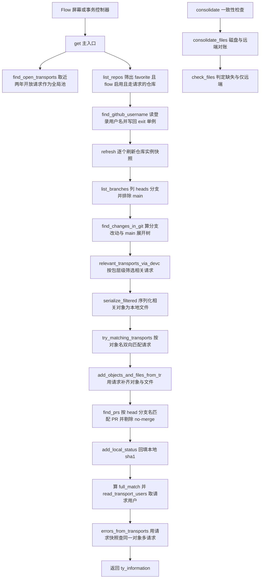
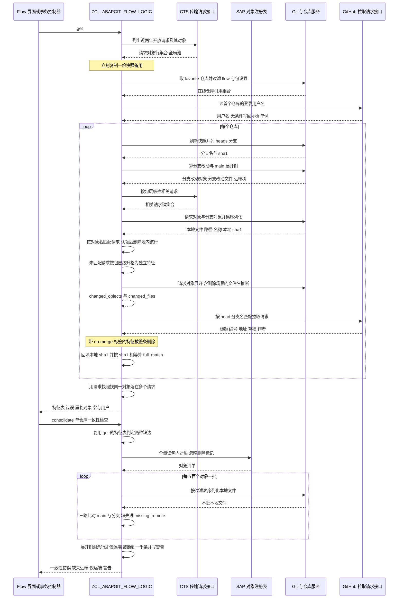

# ZCL_ABAPGIT_FLOW_LOGIC 分析报告

> 分析对象：`abapGit__abapGit__zcl_abapgit_flow_logic.clas.abap`（1114 行，1 个类定义段 + 1 个实现段，5 个公开方法 + 14 个私有方法）
> 报告视角：代码 onboarding 走读，按真实调用链展开

---

## 一、程序定位与业务背景

### 1.1 这段代码在解决什么问题

先说它**不是**什么：它不是一次 `SELECT`，不是 ALV 报表，不做 Git 操作本身（真正的 diff 由 `ZCL_ABAPGIT_FLOW_GIT` 完成），也不写任何表。它是一个**只读的对账器（reconciliation）**。

业务问题是 SAP 特有的：一套改动必须装在传输请求（transport request）里才能被系统识别，而 abapGit 的日常工作流是 Git 分支 + GitHub Pull Request。**一个开发者手头的"一件事"，可能在 Git 侧表现为一个分支，在 SAP 侧表现为一个请求，而这两者并没有外键关系**。传输请求表里没有 branch 字段，Git 对象里也没有 trkorr 字段。想回答"我这个分支到底有没有对应的传输请求""我这个请求有没有对应的分支""我本地有没有改动漏进了 Git 和请求"这类问题，必须把三套完全不相连的数据拼起来。

这就是 `get` 做的事。它最终返回一个 `ty_information`，里面有三层信息：

- **特征表（features）**：把"分支"和"传输请求"归并成同一张表。一行可能是有分支的请求、有请求的分支，也可能两侧都不完整——两侧都全才叫 `full_match`。
- **错误与警告（errors / warnings）**：分支有改动却无请求、请求存在却无分支、同一对象落在多个请求里。
- **仅远端 / 缺失远端（only_remote / missing_remote）**：反过来问"我磁盘上有什么没进 Git"，这由 `consolidate` / `consolidate_files` / `check_files` 那条链负责。

一句话设计范式定性：

> **"双向对账门面（reconciliation façade）"——以 SAP 对象标识（object + obj_name）为连接键，把 Git 分支与 SAP 传输请求做双向归并；缺的一侧各自升格为独立条目，冲突集中进 errors；全程无实例状态，可变性只走 CHANGING 内表。**

### 1.2 为什么不能写成一个 SQL 或一个出口

三个理由，按重要性排：

1. **数据源跨四个域，任何单一查询拿不齐。** Git plumbing（本地仓库的 heads 与 tree 展开）、CTS 传输请求（DEVREQ/TRDIR/R3TR，经 `zif_abapgit_cts_api` 封装）、SAP 对象注册表 TADIR、GitHub REST（PR 列表）。这四者在数据库里不共享任何可连接的主键。
2. **连接键是业务身份，不是主键。** 分支没有 trkorr，请求没有 branch name，唯一的公共属性是"改了哪个 SAP 对象"。所以必须先把两边都展开成"改了哪些对象"（`changed_objects`），再按 object + obj_name 连接。这也解释了为什么 `serialize_filtered` 要先拼出一张对象过滤表再序列化——序列化产出的是文件，而连接要的是对象。
3. **归并必须跨仓库全局竞争。** `try_matching_transports` 匹配上一个请求后就 `DELETE ct_transports WHERE trkorr = ...`，让一个请求只归属一个仓库/分支。这意味着请求表是全局资源，必须跨仓库循环存活——`get` 里的 `lt_all_transports` 就是这个全局池。

代价在第 3 条上：全类无状态、19 个方法全是 CLASS-METHODS，可变性只能靠 CHANGING 内表层层下传，读者必须靠记忆追踪"哪张表被谁改了"。这是这份代码最贵的阅读成本。

### 1.3 依赖清单（读这段代码前必须知道的地形）

```
接口（类型与常量）
  zif_abapgit_flow_logic      ty_information / ty_features / ty_feature / ty_feature-repo
                              ty_local_files / ty_path_name / ty_users_tt / ty_consolidate
                              c_main（主分支名） / c_open_transport_days（请求时间窗）
  zif_abapgit_git_definitions ty_git_branch_list_tt / ty_expanded_tt / c_git_branch-heads_prefix
  zif_abapgit_definitions     ty_item / ty_tadir_tt / c_dot_abapgit
  zif_abapgit_cts_api         ty_transport_data / ty_trkorr_tt / ty_transport_obj_tt / ty_date_range
                              ty_skip_limu_types_tt / ty_transport_creation_dates_tt
                              ty_request_and_tasks_tt
  zif_abapgit_sap_package     ty_devclass_tt
  zif_abapgit_persistence     ty_value
  zif_abapgit_pr_enum_provider ty_pull_requests

接口（对象角色）
  zif_abapgit_repo / zif_abapgit_repo_online / zif_abapgit_flow_exit / zif_abapgit_cts_api

类（被调）
  zcl_abapgit_git_factory     v2 porcelain：list_branches
  zcl_abapgit_flow_git        find_changes_in_git（真正的 diff，本文件不可见）
  zcl_abapgit_factory         get_cts_api / get_tadir / get_sap_package
  zcl_abapgit_object_filter_obj / zcl_abapgit_filename_logic / zcl_abapgit_aff_factory
  zcl_abapgit_pr_enumerator   new( iv_url )->get_pulls( )（按 host 派发到具体实现）
  zcl_abapgit_pr_enum_github  update_pull_request_branch（update_all_branches 硬编码）
  zcl_abapgit_http_agent / zcl_abapgit_login_manager / zcl_abapgit_repo_srv
  zcl_abapgit_flow_exit       change_github_username（单例，可被客户实现覆盖）

异常
  zcx_abapgit_exception       全类统一异常
SAP 侧
  DEVREQ / TRDIR / R3TR / TADIR（均经接口封装，本文件无直接 SELECT）
```

### 1.4 读之前要知道：这是带 `todo` 的生产代码

这份代码不是课程骨架，是 abapGit 社区项目的生产代码，但它是**正在演进中**的，判断依据是文件里保留着 6 处 `* todo` / `" todo` 标记，其中 3 处直接落在本报告指出的缺陷位置：`check_files` 里路径迁移分支的空体、`add_objects_and_files_from_tr` 里硬编码的 `/src/`、`consolidate_files` 里 AFF 对象处理的已知错误。

三件事影响你如何评估质量：

- **全类零实例状态，也没有 `FOR TESTING` 段**——本文件没有任何 ABAP Unit。核心的"分支×请求"匹配算法不可单独测试。
- **私有类型的键定义是关键线索**：`ty_transports_tt` 是 `WITH NON-UNIQUE KEY trkorr`，`ty_trkorr_tt` 是 `WITH DEFAULT KEY`，而 Git 展开树在别处用 `WITH TABLE KEY path_name COMPONENTS path name` 读取。同一张表在同一份代码里被两种键访问，这是第三节第一个缺陷的根源。
- **本文件是纯门面**：真正的 diff 在 `zcl_abapgit_flow_git`，序列化在仓库对象里，CTS 访问在 `zif_abapgit_cts_api` 实现里。这三块本文件都看不到，涉及它们的结论都会标注"需核实"。

---

## 二、程序执行流程总览

本类有三条独立入口链，共 19 个方法。第一条是主链 `get`，第二条是磁盘对账链 `consolidate`，第三条是两个对外出口 `get_involved_users` 与 `update_all_branches`。



### 责任链表

| 子程序 | 调用者 | 职责 |
|---|---|---|
| `get`（公开，主入口） | Flow 屏幕 / 事务控制器 | 编排全链：取请求池、列仓库、逐仓库归并分支与请求，汇总错误 |
| `list_repos`（公开） | `get`（也可被 `consolidate` 侧调用） | 从仓库服务取列表，双重过滤：flow 开关、包是否走传输请求 |
| `find_github_username`（私有） | `get` | 读首个仓库的 GitHub 登录名，并**无条件**写回 exit 单例 |
| `find_open_transports`（私有） | `get`、`consolidate_files` | 经 CTS 接口取近两年开放请求及其对象，按 devclass 过滤 |
| `get_latest_task_timestamp`（私有） | `find_open_transports` | 取请求内任务的最晚 as4date/as4time，无任务时回落当前时间戳 |
| `relevant_transports_via_devc`（私有） | `get` | 按仓库包及其子包层级，从全局请求池筛出相关 trkorr |
| `serialize_filtered`（私有） | `get` | 把相关请求对象与分支改动对象并成过滤表，序列化出本地文件 |
| `try_matching_transports`（私有） | `get` | 双向归并核心：分支匹配请求，剩余请求按包层级升格为独立特征 |
| `add_objects_and_files_from_tr`（私有） | `try_matching_transports` | 把一个请求展开成 changed_objects 与 changed_files；含删除场景推断 |
| `find_prs`（私有） | `get` | 按 head_branch 匹配 PR，填标题/编号/地址，并删除 no-merge 特征 |
| `add_local_status`（私有） | `get` | 把本地 sha1 回填进每个 changed_file，供 full_match 判断 |
| `build_repo_data`（私有） | `get`、`try_matching_transports`、`consolidate_files` | 三行取值：仓库名、key、包 |
| `read_transport_users`（私有） | `get` | 取请求及其任务的 as4user |
| `errors_from_transports`（私有） | `get` | 排序后窥视相邻行，找同一对象落在多个请求的情况 |
| `consolidate`（公开） | Flow 的一致性检查入口 | 复用 `get` 的特征表，报"分支无请求/请求无分支" |
| `consolidate_files`（私有） | `consolidate` | 磁盘对账：批量序列化 + check_files，产出 missing_remote / only_remote |
| `check_files`（私有） | `consolidate_files` | 判定核心：本地文件 vs main 展开树 vs 分支改动，三路比对 |
| `get_involved_users`（公开） | Flow 出口处 | 从特征表收集请求用户，去空值 |
| `update_all_branches`（公开） | Flow 的"更新分支"动作 | 对未更新且有 PR 的特征调 GitHub 更新 PR 分支 |

下面按这条主链逐个子程序展开，然后单独讲对账链和两个出口。

---

## 三、分组分析

### 3.1 类定义段：一份公开的归并契约（`ZCL_ABAPGIT_FLOW_LOGIC` 类定义段）

#### ① 公开入口：五个方法，只有 `get` 是主入口

```abap
CLASS zcl_abapgit_flow_logic DEFINITION PUBLIC.
  PUBLIC SECTION.
    CLASS-METHODS get
      RETURNING
        VALUE(rs_information) TYPE zif_abapgit_flow_logic=>ty_information
      RAISING
        zcx_abapgit_exception.
```

**做什么** — 声明主入口 `get`：无导入参数，按值返回 `ty_information`，抛 `zcx_abapgit_exception`。另外四个公开方法是 `get_involved_users`（吃一个 `ty_information`，返回用户集合）、`consolidate`（吃一个在线仓库引用，返回 `ty_consolidate`）、`list_repos`（可选 favorite-only 开关，默认 `abap_true`）、`update_all_branches`（吃特征表，返回 `ty_update_result` 的 updated/errors/skipped 三个计数）。

**为什么** — 全部是 CLASS-METHODS 且无实例属性，把这类做成一个"静态服务类"。好处是调用方不必管生命周期，`get` 的返回值可以按值传递；代价是所有可变性只能走 CHANGING 内表，跨方法的副作用无法从签名看出来。`get` 不带任何导入参数，意味着"当前用户可见的所有 favorite 仓库"是唯一的数据边界——这个边界是隐式的，藏在 `list_repos` 里。

**风险与改进** — 契约本身干净，但 `get` 的**耗时边界完全不可见**：它要列仓库、刷快照、对每个仓库列分支、跑 diff、序列化对象、查 CTS、打 GitHub REST。调用方拿到的是"要么给了完整结果、要么抛异常"，中间没有任何进度或超时反馈。对几十上百个开放请求的系统，这个入口是一次长事务式的读操作。建议至少在类注释里写明典型耗时与规模上限，或在 `list_repos` 结果上做数量告警。

#### ② 私有类型：三张表的键定义各不相同

```abap
    CONSTANTS c_max_missing_files TYPE i VALUE 1000.

    TYPES: BEGIN OF ty_transport,
             trkorr     TYPE trkorr,
             title      TYPE string,
             object     TYPE tadir-object,
             obj_name   TYPE tadir-obj_name,
             devclass   TYPE tadir-devclass,
             created_on TYPE d,
             changed_at TYPE timestamp,
           END OF ty_transport.

    TYPES ty_transports_tt TYPE STANDARD TABLE OF ty_transport WITH NON-UNIQUE KEY trkorr.

    TYPES ty_trkorr_tt TYPE STANDARD TABLE OF trkorr WITH DEFAULT KEY.
```

**做什么** — 定义对账用的请求行结构 `ty_transport`：一个请求的每一个对象占一行，带标题、devclass、创建日期与最晚任务时间戳。`ty_transports_tt` 以 trkorr 为非唯一键；另有 `ty_trkorr_tt` 以 DEFAULT KEY 存纯 trkorr 集合；`c_max_missing_files` 是磁盘对账结果的展示上限。

**为什么** — 行粒度选"请求×对象"而不是"请求"，是因为连接的键是对象，请求本身没有对象信息；`changed_at` 用 timestamp 而 `created_on` 用 d，对应"最晚活动"与"创建日期"两种语义。以 trkorr 为键（非唯一）是为了既能按 trkorr 取整组、又能继续 `SORT BY object obj_name` 后做对象级连接。

**风险与改进** — 类型本身合理，但**键的选择决定了后面全部 `READ TABLE ... WITH KEY` 的语义**，而这份代码里出现了三套键访问方式：`WITH NON-UNIQUE KEY trkorr`、`WITH DEFAULT KEY`、以及 Git 展开树的 `WITH TABLE KEY path_name COMPONENTS path name`。其中 `ty_expanded_tt` 是本文件之外定义的接口类型，它的键定义直接决定 3.16 节第一个缺陷是否成立——**接手第一件事是去 SE11 确认 `zif_abapgit_git_definitions=>ty_expanded_tt` 的键定义与 `path_name` 是否为命名键**。`c_max_missing_files` 放在 PRIVATE 而非 PUBLIC，与它同时被写入用户可见的 warnings 文本相比，可见性偏低。

### 3.2 `get`：主入口，把"分支"与"请求"归并成一份特征表

这是全类的主干。下面分四步。

#### ① 取请求快照并列出仓库

```abap
    lt_all_transports = find_open_transports( ).
    lt_real_transports = lt_all_transports.

* list branches on favorite + flow enabled + transported repos
    lt_repos = list_repos( ).
    rs_information-enabled_repositories = lines( lt_repos ).
    rs_information-github_username = find_github_username( lt_repos ).
```

**做什么** — 先经 CTS 接口取近两年开放的全部请求对象行，立即复制一份到 `lt_real_transports`；再从仓库服务取 favorite 且 flow 启用且包走传输请求的仓库列表；把仓库数量写进结果，再读 GitHub 用户名。

**为什么** — 那个 `lt_real_transports = lt_all_transports` 的复制是全类最重要的一处防御。`lt_all_transports` 后面要被 `try_matching_transports` 反复 `DELETE`（一个请求只能归属一个仓库/分支），而归并完成后还要拿**原始**请求集合去查"同一对象是否在多个请求里"。作者意识到全局池会被消耗，于是保留快照——这个意识是好的。

**风险与改进** — 两点。第一，顺序上 `find_open_transports` 排在 `list_repos` 之前，意味着**即使最终一个仓库都不满足过滤条件，也已经付了全部 CTS 查询的成本**；把仓库筛选提前一行就能省掉整轮。第二，`github_username` 的取值只依赖第一个仓库（见 3.4），却写进了全局结果字段——多主机场景下这个字段语义含糊。

#### ② 刷新快照、列分支、算改动

```abap
* Repository instances may contain stale snapshots when Flow is first opened
    LOOP AT lt_repos INTO li_repo_online.
      li_repo_online->zif_abapgit_repo~refresh( ).
    ENDLOOP.

    LOOP AT lt_repos INTO li_repo_online.

      lt_branches = zcl_abapgit_git_factory=>get_v2_porcelain( )->list_branches(
        iv_url    = li_repo_online->get_url( )
        iv_prefix = zif_abapgit_git_definitions=>c_git_branch-heads_prefix )->get_all( ).

      CLEAR lt_features.
      LOOP AT lt_branches INTO ls_branch WHERE display_name <> zif_abapgit_flow_logic=>c_main.
        ls_result-repo = build_repo_data( li_repo_online ).
        ls_result-branch-display_name = ls_branch-display_name.
        ls_result-branch-sha1 = ls_branch-sha1.
        INSERT ls_result INTO TABLE lt_features.
      ENDLOOP.
```

**做什么** — 先对每个仓库实例调 `refresh`（源码注释说明：Flow 首次打开时仓库实例可能持有过期快照），然后逐仓库列出 `refs/heads/` 下的分支，排除主分支，每个分支初始化成一条特征：仓库信息 + 分支名 + 分支 sha1。

**为什么** — 先用 `display_name` 建骨架，再交给 `find_changes_in_git` 填充改动，是"先定行、后补列"的装配式写法。它让特征表的主键从一开始就是"仓库 + 分支"，后续匹配请求、挂 PR、回填本地状态都在同一批行上做增量修改，避免了多次归并时的行对齐问题。`c_main` 用接口常量而非字面量，避免了 main/master 的硬编码分歧。

**风险与改进** — 两个仓库循环（refresh 一次、处理一次）可以合并成一个，但拆开是有道理的：`refresh` 是幂等的状态修复，先做完再进入只读流程，逻辑边界更清楚，这个取舍我认同。真正的风险在 `CLEAR lt_features` 的位置：它确保特征表是**每仓库独立**的，但 `lt_main_expanded` 没有在循环里 `CLEAR`——上一轮循环残留的展开树会带着进下一轮。由于下一轮紧接着被 `find_changes_in_git` 的 IMPORTING 覆盖，实际不会串数据；但如果将来有人在这个位置插入只读逻辑，就会踩到脏数据。建议在循环体第一行 `CLEAR lt_main_expanded lt_features lt_local`，把不变式写死。

#### ③ 算改动、筛请求、序列化

```abap
      zcl_abapgit_flow_git=>find_changes_in_git(
        EXPORTING
          iv_url           = li_repo_online->get_url( )
          io_dot           = li_repo_online->zif_abapgit_repo~get_dot_abapgit( )
          iv_package       = li_repo_online->zif_abapgit_repo~get_package( )
          it_branches      = lt_branches
        IMPORTING
          et_main_expanded = lt_main_expanded
        CHANGING
          ct_features      = lt_features ).

      lt_relevant_transports = relevant_transports_via_devc(
        ii_repo        = li_repo_online
        it_transports  = lt_all_transports ).

      lt_local = serialize_filtered(
        it_relevant_transports = lt_relevant_transports
        ii_repo                = li_repo_online
        it_features            = lt_features
        it_all_transports      = lt_all_transports ).
```

**做什么** — 把真正的 Git diff 委托给 `zcl_abapgit_flow_git`，产出 main 的完整展开树 `et_main_expanded`（path/name/sha1 三列，是后面所有"本地 vs 远端"比较的基准）并就地填充各分支的改动对象与改动文件；再按仓库包层级筛出相关请求；最后把"相关请求里的对象"与"分支改动的对象"并成一张过滤表，序列化出对应的本地文件（路径/文件名/sha1）。

**为什么** — 这里是全类的核心权衡：**连接要用对象，但序列化只能按对象过滤产出文件**。所以 `serialize_filtered` 的存在意义就是把两个来源（请求侧、Git 侧）的对象集合先并起来去重，再做一次序列化，避免"为每个来源各序列化一遍"。而 `relevant_transports_via_devc` 用**包层级**（而非请求内对象的 devclass 逐个比对）先粗筛，是因为请求可能横跨多个包，包层级判断比对象级判断便宜得多。这条"先粗筛包、再细筛对象"的分层，是这份代码最体面的一处工程判断。

**风险与改进** — `it_all_transports` 同时传给了 `serialize_filtered`（只读）和下一句的 `try_matching_transports`（会 DELETE），但 `relevant_transports_via_devc` 拿到的 `it_transports` 是**尚未被前序仓库消耗**的全局池——这是正确的（前面仓库 DELETE 掉的是它们已认领的请求），但可读性很差：同一个变量在三处既是"全集"又是"剩余集"。建议在注释里写明"`lt_all_transports` 是消耗型池，随仓库推进单调缩小"。另一个风险：`find_changes_in_git` 是本文件之外的黑箱，`et_main_expanded` 是否总是完整展开 main（含子对象、含被删除对象）直接决定后面所有比对的正确性——**需在 SE38 核实该方法的展开范围与 AFF 对象的序列化格式**。

#### ④ 挂 PR、回填本地状态、算 full_match、汇总错误

```abap
      try_matching_transports(
        EXPORTING
          ii_repo          = li_repo_online
          it_local         = lt_local
          it_main_expanded = lt_main_expanded
        CHANGING
          ct_transports    = lt_all_transports
          ct_features      = lt_features ).

      find_prs(
        EXPORTING
          iv_url      = li_repo_online->get_url( )
        CHANGING
          ct_features = lt_features ).

      add_local_status(
        EXPORTING
          it_local     = lt_local
        CHANGING
          ct_features = lt_features ).

      LOOP AT lt_features ASSIGNING <ls_feature>.
        <ls_feature>-full_match = abap_true.
        LOOP AT <ls_feature>-changed_files ASSIGNING <ls_path_name>.
          IF <ls_path_name>-remote_sha1 <> <ls_path_name>-local_sha1.
            <ls_feature>-full_match = abap_false.
          ENDIF.
        ENDLOOP.

        IF <ls_feature>-transport-trkorr IS NOT INITIAL.
          <ls_feature>-transport-users = read_transport_users( <ls_feature>-transport-trkorr ).
        ENDIF.
      ENDLOOP.

      INSERT LINES OF lt_features INTO TABLE rs_information-features.

    errors_from_transports(
      EXPORTING
        it_all_transports  = lt_real_transports
      CHANGING
        cs_information     = rs_information ).
```

**做什么** — 四步收尾：双向匹配请求并删除已认领的请求；按 head 分支名挂 GitHub PR；把本地 sha1 回填进每个改动文件；然后逐特征判定 `full_match`（全部文件的远端 sha1 与本地 sha1 一致即为"完全匹配"）、对有请求的特征取请求用户；最后把本仓库特征并入结果，并在全部仓库处理完后用**请求快照**查重复对象。

**为什么** — 顺序有讲究：`add_local_status` 必须在 `try_matching_transports` 之后，因为后者会往里追加来自请求的文件行（那些行只有 remote_sha1，没有 local_sha1）；`errors_from_transports` 必须放在整个仓库循环之外，因为它要用完整快照而不是被消耗后的池。`full_match` 用"逐文件 sha1 相等"而不是"提交已合并"来判断，是把判断口径落在**内容一致性**上而非流程状态上——这更贴近 Flow 想回答的问题（"我这边的东西和 Git 上的一致吗"）。

**风险与改进** — 三点。第一，`full_match` 的判定对**空 changed_files 的特征**恒为 `abap_true`（循环体不执行），一个什么文件都没列出来的请求会被标记为"完全匹配"；结合 `consolidate` 里 `ls_feature-full_match = abap_false` 才报错的逻辑，空特征会被静默放过。第二，`full_match = abap_false` 一旦命中就没有 `EXIT`，循环仍跑完所有文件——对大对象只是浪费，但若将来要记录"哪个文件不一致"，这里就是唯一的位置。第三，`INSERT LINES OF lt_features INTO TABLE rs_information-features` 之后**没有 `CLEAR lt_features`**，下一轮循环体开头虽有 `CLEAR lt_features`（见 3.2 ②），跨轮不会累积，但依赖了循环体内部的一处 CLEAR，属于隐式契约。

### 3.3 `list_repos`：两道闸门决定仓库可见性（方法 `list_repos`）

```abap
    IF iv_favorites_only = abap_true.
      lt_repos = zcl_abapgit_repo_srv=>get_instance( )->list_favorites( abap_false ).
    ELSE.
      lt_repos = zcl_abapgit_repo_srv=>get_instance( )->list( abap_false ).
    ENDIF.

    LOOP AT lt_repos INTO li_repo.
      IF li_repo->get_local_settings( )-flow = abap_false.
        CONTINUE.
      ELSEIF zcl_abapgit_factory=>get_sap_package( li_repo->get_package( )
          )->are_changes_recorded_in_tr_req( ) = abap_false.
        CONTINUE.
      ENDIF.

      li_online ?= li_repo.
      INSERT li_online INTO TABLE rt_repos.
    ENDLOOP.
```

**做什么** — 按开关取 favorite 或全部仓库，然后逐条过两道闸门：仓库本地设置的 flow 开关必须为 true；仓库所属包的"改动记录在传输请求里"必须为 true。两关都过才窄化转型为 `zif_abapgit_repo_online` 装入结果。

**为什么** — 第二道闸门是 Flow 语义的必要条件：Flow 的全部价值建立在"改动必须有传输请求"之上，包如果不走请求（例如本地包、不记录请求的包），请求匹配永远为空，展示出来只会是"每个分支都报错"。在入口就把这类仓库排除，比在展示层补救干净。`?= ` 窄化转型把"我保证它是 online repo"这个前提写进了类型系统。

**风险与改进** — 两道闸门都是**静默 `CONTINUE`**，用户在 Flow 里看不到某个仓库也不会得到任何原因说明——最常见的困惑（"我明明 favorite 了为什么 Flow 里没有"）在这里没有出口。建议在类注释或 Flow 界面上暴露"因 flow 未启用/包不走请求而被排除"的计数。另外 `get_package( )` 在一行里被调用两次（`list` 与 `are_changes_recorded_in_tr_req` 的组合表达式中），可读性与性能都不必要，提为局部变量更好。`list_favorites( abap_false )` / `list( abap_false )` 的布尔参数语义不透明，接手时需在 SE38 核实其含义。

### 3.4 `find_github_username`：无条件写回 exit 单例（方法 `find_github_username`）

```abap
    READ TABLE it_repos INTO li_repo_online INDEX 1.
    IF sy-subrc = 0.
      TRY.
          rv_username = zcl_abapgit_login_manager=>get_username( li_repo_online->get_url( ) ).
        CATCH zcx_abapgit_exception ##NO_HANDLER.
      ENDTRY.
    ENDIF.

    TRY.
        li_exit = zcl_abapgit_flow_exit=>get_instance( ).
        li_exit->change_github_username( CHANGING cv_username = rv_username ).
      CATCH zcx_abapgit_exception ##NO_HANDLER.
    ENDTRY.
```

**做什么** — 取仓库列表的**第一行**，用它读对应的 GitHub 登录用户名；然后把得到的（可能为空的）用户名无条件传给 `zcl_abapgit_flow_exit` 单例的 `change_github_username`，两处 `CATCH` 都标了 `##NO_HANDLER` 静默吞掉。

**为什么** — 意图是"尽量自动填上当前 GitHub 账号，并且允许客户用 exit 覆盖"。把 exit 调用放在 try 外、且不判 `sy-subrc`，是为了"客户实现永远有机会介入"——即使登录读取失败，也仍然走一次 exit。

**风险与改进** — 这是本节最重要的一处缺陷（P0-4）。第二个 TRY 块**无条件执行**：当仓库列表为空，或首个仓库的登录读取失败时，`rv_username` 仍是 initial，而 `change_github_username( CHANGING cv_username = rv_username )` 的参数是 `CHANGING`——按语义它把值写入 exit 实例，**于是一次空仓库的 Flow 打开就把客户在 exit 里配置好的用户名清成了空**。修法是在写回前加一个初值判断（建议改为，示意）：

```abap
      IF rv_username IS NOT INITIAL.
        li_exit->change_github_username( CHANGING cv_username = rv_username ).
      ENDIF.
```

另外两点：第一，"取第一行仓库"在多主机（GitHub 与 Gitea 混用）场景下取到的用户名可能对不上后续仓库；第二，两处 `##NO_HANDLER` 意味着**登录失败在 Flow 里完全不可见**——用户看到空白用户名，无从判断是登录态失效还是仓库为空。至少要落一条 warning。

### 3.5 `find_open_transports`：全类最重的外部依赖调用（方法 `find_open_transports`）

#### ① 两年窗口与两次批量取数

```abap
* only look for transports that are created/changed in the last two years
    ls_date-sign = 'I'.
    ls_date-option = 'GE'.
    ls_date-low = sy-datum - zif_abapgit_flow_logic=>c_open_transport_days.
    INSERT ls_date INTO TABLE lt_date.

    lt_trkorr = zcl_abapgit_factory=>get_cts_api( )->list_open_requests( lt_date ).
    lt_created_on = zcl_abapgit_factory=>get_cts_api( )->read_creation_dates( lt_trkorr ).
```

**做什么** — 构造一个"大于等于 sy-datum 减 c_open_transport_days"的选择条件，取近两年创建或修改过的开放请求列表，再批量读它们的创建日期。

**为什么** — 请求是全系统的，不设窗口会把几年前的僵尸请求全部拖进来（每个请求后面还要读描述、读任务、读 R3TR 对象，代价线性放大）。作者选择了"时间窗 + 批量创建日期"的组合，比逐请求判断便宜得多。注释直接写明这是有意为之。

**风险与改进** — 这是一个**静默的数据截断**（P1-2）：窗口之外但**仍处于开放状态**的请求会从 Flow 视图里彻底消失，而且没有任何提示。在运输窗口被长期挂起的组织里（很常见），一个开了三年的请求既不会出现在 Flow 里，也不会报错，用户会误以为"Git 里没有对应的东西"。建议在窗口边界处补一条 warning，或把 `c_open_transport_days` 做成可配置并在使用处暴露。另外 `get_cts_api( )` 在同一处调用了两次，工厂实例应当缓存。

#### ② 逐请求：描述、时间戳、LIMU 跳过

```abap
    LOOP AT lt_trkorr INTO lv_trkorr.
      ls_result-trkorr = lv_trkorr.
      ls_result-title  = zcl_abapgit_factory=>get_cts_api( )->read_description( lv_trkorr ).
      READ TABLE lt_created_on INTO ls_created_on WITH TABLE KEY trkorr = lv_trkorr.
      IF sy-subrc = 0.
        ls_result-created_on = ls_created_on-created_on.
      ELSE.
        CLEAR ls_result-created_on.
      ENDIF.
      ls_result-changed_at = get_latest_task_timestamp( lv_trkorr ).
```

**做什么** — 逐请求填充结果行：读请求标题、从批量创建日期表里取值（取不到就清空）、再用 `get_latest_task_timestamp` 取请求内最晚任务时间。

**为什么** — `created_on` 用批量接口而 `changed_at` 用单请求接口，是因为创建日期可以一次取齐，而"最晚任务时间"需要对任务逐行比较，没有批量接口可用。取不到创建日期时用 `CLEAR` 而不是留残留值，是正确的防御。

**风险与改进** — 这是标准的 **N+1 调用**（P2-1）：每个请求一次 `read_description`、一次 `read_request_and_tasks`（在 `get_latest_task_timestamp` 里）、一次 `list_r3tr_by_request`，每个对象再一次 `read_single`。在一个有几百个开放请求的系统上，这一节就是 Flow 打开耗时的绝对主体。可行的改进：把 `read_description` 批量化（CTS 接口通常有批量形态，**需在 SE38 核实 `zif_abapgit_cts_api` 是否提供**）、把 `get_cts_api( )` 提到循环外缓存、对 `read_single` 的结果做本地缓存避免同对象重复读。

#### ③ LIMU 与 CINS/NOTE 的跳过

```abap
* LIMU skipped here:
" SOTT = Concept (Online Text Repository) - Short Texts for packages are not serialized anyhow
      CLEAR ls_limu_skip.
      ls_limu_skip-sign = 'I'.
      ls_limu_skip-option = 'EQ'.
      ls_limu_skip-low = 'SOTT'.
      INSERT ls_limu_skip INTO TABLE lt_limu_skip.
      lt_objects = zcl_abapgit_factory=>get_cts_api( )->list_r3tr_by_request(
        iv_request         = lv_trkorr
        it_skip_limu_types = lt_limu_skip ).

* R3TR can be skipped here
      LOOP AT lt_objects ASSIGNING <ls_object>
          WHERE object <> 'CINS'
          AND object <> 'NOTE'.
        ls_result-object   = <ls_object>-object.
        ls_result-obj_name = <ls_object>-obj_name.

        lv_obj_name = <ls_object>-obj_name.
        ls_result-devclass = zcl_abapgit_factory=>get_tadir( )->read_single(
          iv_object   = ls_result-object
          iv_obj_name = lv_obj_name )-devclass.
        IF ls_result-devclass IS NOT INITIAL.
          INSERT ls_result INTO TABLE rt_transports.
        ENDIF.
      ENDLOOP.
```

**做什么** — 构造 LIMU 跳过条件（SOTT，源码注释解释了原因：包的短文本反正不会被序列化），取请求内的 R3TR 对象并跳过 CINS 与 NOTE，再逐对象读 TADIR 拿 devclass，devclass 为空的对象不入结果。

**为什么** — 三处跳过都是为了让"请求里的对象"和"Git 里会被序列化的对象"对齐：SOTT/CINS/NOTE 不产生可对比的文件，把它们带进来只会制造假差异。用 devclass 过滤则是为了后续 `relevant_transports_via_devc` 能按包层级筛——没有 devclass 的对象无法参与包匹配。两处 `*` 注释把"为什么要跳过"写在了跳过语句的正上方，这是本文件最好的一处注释实践。

**风险与改进** — 两个问题。第一，`lt_limu_skip` 是在 `LOOP AT lt_trkorr` **内部**构建的，每个请求都重建一次，应提到循环外（P2-2）。第二，跳过清单**硬编码成字面量**散落在方法体里（`'SOTT'`、`'CINS'`、`'NOTE'`），既无法被客户扩展，也意味着新增一种不参与序列化的对象类型时必须改这里。建议收进常量表或配置。另外 `read_single` 的对象参数被赋了一次又复制进 `lv_obj_name` 再传入，两个变量值恒等，属于冗余中间变量。

### 3.6 `get_latest_task_timestamp`：失败被伪装成"刚刚"（方法 `get_latest_task_timestamp`）

```abap
    TRY.
        lt_tasks = zcl_abapgit_factory=>get_cts_api( )->read_request_and_tasks( iv_trkorr ).

        LOOP AT lt_tasks INTO ls_task.
          IF ls_task-as4date > lv_max_date
              OR ( ls_task-as4date = lv_max_date AND ls_task-as4time > lv_max_time ).
            lv_max_date = ls_task-as4date.
            lv_max_time = ls_task-as4time.
          ENDIF.
        ENDLOOP.

        IF lv_max_date IS NOT INITIAL.
          CONVERT DATE lv_max_date TIME lv_max_time INTO TIME STAMP rv_changed_at TIME ZONE sy-zonlo.
        ELSE.
          GET TIME STAMP FIELD rv_changed_at.
        ENDIF.
      CATCH zcx_abapgit_exception.
        GET TIME STAMP FIELD rv_changed_at.
    ENDTRY.
```

**做什么** — 读请求及其任务，取 as4date/as4time 的最大值（日期相同时比时间），转成 timestamp 返回；取不到任何日期，或整个调用抛异常，都回落到 `GET TIME STAMP`（当前时间）。

**为什么** — `changed_at` 在结果里参与"哪个请求最近动过"的排序与展示，不能留空。作者用当前时间戳做兜底，让调用方拿到的一定是可比较的时间值。日期+时间双字段比较而不是只比日期，说明作者知道同一天内多个任务很常见。

**风险与改进** — 这是本节的核心缺陷（P1-1）：**"当前时间"这个兜底在语义上是假的**。一个没有任务、或读取失败的空请求会显示为"刚刚修改过"，在按时间排序的 Flow 视图里会浮到最上面，用户会把一个僵尸请求当成最活跃的工作。更糟的是 `CATCH zcx_abapgit_exception` 静默吞掉所有异常，把"CTS 接口故障"和"请求真的没任务"折叠成同一种输出，排障时无法区分。建议：区分"无任务"与"读取失败"两种兜底（例如无任务返回 initial 并在上游跳过），或在返回结构里增加一个"时间戳是否可靠"的标记。

### 3.7 `relevant_transports_via_devc`：按包层级粗筛（方法 `relevant_transports_via_devc`）

```abap
    lt_trkorr = it_transports.
    SORT lt_trkorr BY trkorr.
    DELETE ADJACENT DUPLICATES FROM lt_trkorr COMPARING trkorr.

    lt_packages = zcl_abapgit_factory=>get_sap_package( ii_repo->get_package( ) )->list_subpackages( ).
    INSERT ii_repo->get_package( ) INTO TABLE lt_packages.

    LOOP AT lt_trkorr ASSIGNING <ls_trkorr>.
      lv_found = abap_false.

      LOOP AT lt_packages ASSIGNING <lv_package>.
        READ TABLE it_transports TRANSPORTING NO FIELDS WITH KEY trkorr = <ls_trkorr>-trkorr devclass = <lv_package>.
        IF sy-subrc = 0.
          lv_found = abap_true.
          EXIT.
        ENDIF.
      ENDLOOP.
      IF lv_found = abap_false.
        CONTINUE.
      ENDIF.

      IF lv_found = abap_true.
        INSERT <ls_trkorr>-trkorr INTO TABLE rt_transports.
      ENDIF.
    ENDLOOP.
```

**做什么** — 把传入的请求集合按 trkorr 去重，取出仓库包及其全部子包，然后对每个 trkorr 检查它是否有对象落在这些包里；命中的 trkorr 进结果。

**为什么** — 用"包层级"而不是"对象逐个比对"来判定相关性，代价是一次 `list_subpackages` 换来后续判断全部是内存内表查找。这是正确的分层：包集合小而稳定，请求对象大而分散。注意 `INSERT ii_repo->get_package( )` 把本包也加进去——子包列表通常不含根包，这是必要的补全。

**风险与改进** — 两处冗余（P2-6）：`IF lv_found = abap_false. CONTINUE. ENDIF.` 之后紧跟 `IF lv_found = abap_true.` 判断同一个变量，第二个 IF 永远为真，可以删。同样的模式在 `try_matching_transports` 的未匹配块里重复出现，说明这是作者的习惯写法而不是笔误，但两处都应该收敛。另外 `DELETE ADJACENT DUPLICATES` 要求先 `SORT`，顺序正确；但 `it_transports` 是 CHANGING 语义的全局池的只读副本，本方法把它当值传参是对的，避免了消耗池。

### 3.8 `serialize_filtered`：把两个来源的对象并成一次序列化（方法 `serialize_filtered`）

```abap
* from all relevant transports(matched via package)
    LOOP AT it_relevant_transports INTO lv_trkorr.
      LOOP AT it_all_transports ASSIGNING <ls_transport> WHERE trkorr = lv_trkorr.
        APPEND INITIAL LINE TO lt_filter ASSIGNING <ls_filter>.
        <ls_filter>-object = <ls_transport>-object.
        <ls_filter>-obj_name = <ls_transport>-obj_name.
      ENDLOOP.
    ENDLOOP.

* and from git
    LOOP AT it_features INTO ls_feature.
      LOOP AT ls_feature-changed_objects INTO ls_changed_object.
        APPEND INITIAL LINE TO lt_filter ASSIGNING <ls_filter>.
        <ls_filter>-object = ls_changed_object-obj_type.
        <ls_filter>-obj_name = ls_changed_object-obj_name.
      ENDLOOP.
    ENDLOOP.

    SORT lt_filter BY object obj_name.
    DELETE ADJACENT DUPLICATES FROM lt_filter COMPARING object obj_name.

    CREATE OBJECT lo_filter EXPORTING it_filter = lt_filter.
    rt_local = ii_repo->get_files_local_filtered( lo_filter ).
```

**做什么** — 从相关请求取所有 object+obj_name，从各分支的改动对象再取一遍，合并去重后包成过滤对象，一次性向仓库服务请求"这些对象在本地序列化后长什么样"，返回本地文件集合（路径/文件名/sha1）。

**为什么** — 这一步是全类**性能判断最聪明**的地方。序列化是昂贵的（要展开对象、生成文件），如果"请求侧"和"Git 侧"各序列化一次，成本翻倍；作者把两个来源先并成一张去重过滤表，只序列化一次。两个来源语义不同但输出同构（都是 object+obj_name），所以可以合并——这个观察不显眼但值钱。两处 `*` 注释分别标明了两个来源，读者一眼能看懂这张表的构成。

**风险与改进** — 过滤表可能非常大：一个有几十对象的请求叠加几十个分支的改动，序列化规模没有上限也没有分页。更关键的是**这张表不包含"本地有改动但对象不在任何请求也不在任何分支改动列表里"的文件**——那类文件只能靠 `consolidate_files` 那条链（走 TADIR 全量遍历）才能发现。两条链的覆盖面不同，读者必须知道：`get` 的 `lt_local` 不是本地全量。另外 `APPEND INITIAL LINE ... ASSIGNING` 逐行填字段的写法在行数上千时比批量构造慢，但可读性好，这个取舍合理。

### 3.9 `try_matching_transports`：双向归并的核心（方法 `try_matching_transports`）

这是全类的算法心脏。归并是**双向**的：分支认领请求，请求剩余则自己升格成特征。

#### ① 分支认领请求

```abap
    SORT ct_transports BY object obj_name.

    LOOP AT ct_features ASSIGNING <ls_feature>.
      LOOP AT <ls_feature>-changed_objects ASSIGNING <ls_changed>.
        READ TABLE ct_transports ASSIGNING <ls_transport>
          WITH KEY object = <ls_changed>-obj_type obj_name = <ls_changed>-obj_name BINARY SEARCH.
        IF sy-subrc = 0.
          <ls_feature>-transport-trkorr = <ls_transport>-trkorr.
          <ls_feature>-transport-title = <ls_transport>-title.
          <ls_feature>-transport-created_on = <ls_transport>-created_on.
          <ls_feature>-transport-changed_at = <ls_transport>-changed_at.

          add_objects_and_files_from_tr(
            EXPORTING
              iv_trkorr        = <ls_transport>-trkorr
              it_local         = it_local
              it_main_expanded = it_main_expanded
              it_transports    = ct_transports
            CHANGING
              cs_feature       = <ls_feature> ).

          DELETE ct_transports WHERE trkorr = <ls_transport>-trkorr.
          EXIT.
        ENDIF.
      ENDLOOP.
    ENDLOOP.
```

**做什么** — 先把请求池按 object+obj_name 排序（为 BINARY SEARCH 做准备），然后对每个特征的每个改动对象在请求池里做二分查找；命中就填上请求的四项信息，调用 `add_objects_and_files_from_tr` 把该请求的其余对象与文件并入这个特征，再从池里删掉整个请求并跳出内层循环。

**为什么** — 三个设计点都很讲究。第一，**一个请求只归属一个特征**（`DELETE ct_transports WHERE trkorr = ...` + `EXIT`），避免了同一请求在两个分支下重复展示；第二，**以第一个命中的改动对象决定归属**，用 `BINARY SEARCH` 换常数级查找，这在"每个请求几十个对象、几十个分支"的规模下是必要的；第三，归属后立刻把请求的**全部**对象展开进该特征，而不是只记 trkorr——这让 Flow 界面能显示"这个分支实际覆盖了多少对象"，而不仅仅是"它对应哪个请求"。

**风险与改进** — 主要缺陷是**归属由 `changed_objects` 的遍历顺序决定**（P1-4）：如果一个分支改了三个对象、分别落在两个不同的请求里，第一个被遍历到的对象决定整个特征归属哪个请求，另一个请求会因为 trkorr 不同而在后续匹配时落空，最终在"未匹配请求"分支里变成另一个特征——**同一份分支改动被拆成两个特征显示**。这在语义上是对的（一个分支确实跨了两个请求），但对用户来说是困惑的来源，界面上看不出二者同源。建议在结果里保留"跨请求"标记，或在 errors 里报一条。第二个风险：`DELETE ct_transports WHERE trkorr = ...` 是非唯一键删除，会删掉该 trkorr 的全部行——这正是想要的语义，但它依赖 `ty_transports_tt` 的键定义，属于隐式契约。

#### ② 未匹配请求升格为独立特征

```abap
* unmatched transports
    lt_trkorr = ct_transports.
    SORT lt_trkorr BY trkorr.
    DELETE ADJACENT DUPLICATES FROM lt_trkorr COMPARING trkorr.

    lt_packages = zcl_abapgit_factory=>get_sap_package( ii_repo->get_package( ) )->list_subpackages( ).
    INSERT ii_repo->get_package( ) INTO TABLE lt_packages.

    LOOP AT lt_trkorr INTO ls_trkorr.
      lv_found = abap_false.
      LOOP AT lt_packages INTO lv_package.
        READ TABLE ct_transports ASSIGNING <ls_transport> WITH KEY trkorr = ls_trkorr-trkorr devclass = lv_package.
        IF sy-subrc = 0.
          lv_found = abap_true.
          EXIT.
        ENDIF.
      ENDLOOP.
      IF lv_found = abap_false.
        CONTINUE.
      ENDIF.

      CLEAR ls_result.
      ls_result-repo = build_repo_data( ii_repo ).
      ls_result-transport-trkorr = <ls_transport>-trkorr.
      ls_result-transport-title = <ls_transport>-title.
      ls_result-transport-created_on = <ls_transport>-created_on.
      ls_result-transport-changed_at = <ls_transport>-changed_at.

      add_objects_and_files_from_tr(
        EXPORTING
          iv_trkorr        = ls_trkorr-trkorr
          it_local         = it_local
          it_main_expanded = it_main_expanded
          it_transports    = ct_transports
        CHANGING
          cs_feature       = ls_result ).

      INSERT ls_result INTO TABLE ct_features.
    ENDLOOP.
```

**做什么** — 池里剩下的请求按 trkorr 去重，再按仓库包层级过滤，命中的每个请求都构造一条**没有分支**的新特征：填仓库与请求信息，调用同一个 `add_objects_and_files_from_tr` 展开它的对象与文件，追加进特征表。

**为什么** — 这是"双向归并"的另一半，也是 Flow 的业务价值所在：**SAP 侧存在但 Git 侧不存在的工作单元同样要展示出来**，否则用户会以为"我的请求在 Git 里没了"。复用 `add_objects_and_files_from_tr` 处理两种来源，保证两种特征的字段填充口径完全一致——这是这份代码里最值得学习的一处复用。

**风险与改进** — 三点。第一，这里出现 `lv_found = abap_false` 之后 `CONTINUE`、紧接着一段没有对应 `IF lv_found = abap_true` 保护的结构，而 3.7 的同类代码有冗余的双重判断——**两处写法不一致**（这里没有第二个 IF，那里有），说明这段是后来改的，值得统一。第二，一个横跨多个子包的请求只产生**一条**特征（外层按 trkorr 去重），这是对的，但读者不容易看出来；建议在注释里写明。第三，本方法用 `CHANGING ct_transports` 修改全局池，同时又用 `READ TABLE ct_transports WITH KEY trkorr ... devclass` 读它，删与读交替发生——正确但脆弱，任何后续重构（比如在中间再删一批）都可能让 `lv_found` 与后续 `<ls_transport>` 指向不一致的行。

### 3.10 `add_objects_and_files_from_tr`：请求展开，含删除场景的推断（方法 `add_objects_and_files_from_tr`）

这个方法最长也最微妙：它要把"请求里的一个对象"变成"特征里的改动文件行"，而**已删除的对象在本地和远端都找不到文件**，只能靠推断。

#### ① 正常路径：请求对象 → 本地文件 → 远端 sha1

```abap
    LOOP AT it_transports ASSIGNING <ls_transport> WHERE trkorr = iv_trkorr.
      ls_changed-obj_type = <ls_transport>-object.
      ls_changed-obj_name = <ls_transport>-obj_name.
      INSERT ls_changed INTO TABLE cs_feature-changed_objects.

      LOOP AT it_local ASSIGNING <ls_local>
          WHERE file-filename <> zif_abapgit_definitions=>c_dot_abapgit
          AND item-obj_type = <ls_transport>-object
          AND item-obj_name = <ls_transport>-obj_name.

        CLEAR ls_changed_file.
        ls_changed_file-path       = <ls_local>-file-path.
        ls_changed_file-filename   = <ls_local>-file-filename.
        ls_changed_file-local_sha1 = <ls_local>-file-sha1.

        READ TABLE it_main_expanded ASSIGNING <ls_main_expanded>
          WITH TABLE KEY path_name COMPONENTS
          path = ls_changed_file-path
          name = ls_changed_file-filename.
        IF sy-subrc = 0.
          ls_changed_file-remote_sha1 = <ls_main_expanded>-sha1.
        ENDIF.

        INSERT ls_changed_file INTO TABLE cs_feature-changed_files.
      ENDLOOP.
```

**做什么** — 逐请求对象：先记入 changed_objects，再在本地序列化结果里按对象+名称找到对应文件（排除 `.abapgit` 配置文件），把路径/文件名/本地 sha1 记为一条改动文件行，再按 **path_name 复合命名键**去 main 展开树里取远端 sha1。

**为什么** — 这里有一个关键的键选择：读 main 展开树用的是 `WITH TABLE KEY path_name COMPONENTS path name`，即**path + name 复合键**。这比只按文件名查要正确得多——SAP 对象序列化后同名的文件在不同目录里大量存在（`*.json`、include 文件等），只按 name 查会串号。作者在这里选对了。

**风险与改进** — 一个真实的隐患：**这段用的是复合键，而 3.16 的 `check_files` 里对同一张表用的是 `WITH KEY name` 单键**。同一份代码对同一张表有两种键访问方式，一处正确一处可疑。另外 `ls_changed` 在循环里没有 `CLEAR`，靠的是它只在赋值时被整体写入（两个字段都赋值，无残留风险），但如果将来给 `ty_feature-changed_objects` 加字段就会留脏值——建议在循环体开头加 `CLEAR ls_changed`。

#### ② 删除场景：本地没有文件，只能推断

```abap
      IF sy-subrc <> 0.
* then its a deletion
        CLEAR ls_item.
        ls_item-obj_type = <ls_transport>-object.
        ls_item-obj_name = <ls_transport>-obj_name.

        IF zcl_abapgit_aff_factory=>get_registry( )->is_supported_object_type( <ls_transport>-object ) = abap_true.
          lv_extension = 'json'.
        ELSE.
          lv_extension = 'xml'.
        ENDIF.

        lv_main_file = zcl_abapgit_filename_logic=>object_to_file(
          is_item = ls_item
          iv_ext  = lv_extension ).
        CONCATENATE '.' lv_extension INTO lv_extension.
        lv_filename = lv_main_file.
        REPLACE FIRST OCCURRENCE OF lv_extension IN lv_filename WITH '*'.

        IF lv_filename = 'package.devc*'.
* this might leave deleted packages in git, but its okay for now
          CONTINUE.
        ENDIF.

        LOOP AT it_main_expanded ASSIGNING <ls_main_expanded>
            WHERE name CP lv_filename.
          CLEAR ls_changed_file.
          ls_changed_file-filename    = <ls_main_expanded>-name.
          ls_changed_file-path        = <ls_main_expanded>-path.
          ls_changed_file-remote_sha1 = <ls_main_expanded>-sha1.
          INSERT ls_changed_file INTO TABLE cs_feature-changed_files.
        ENDLOOP.
```

**做什么** — 上面内层循环 `sy-subrc <> 0` 表示本地序列化结果里没有这个对象的文件，判定为**删除**：按对象类型推断扩展名（AFF 支持的对象用 json，否则 xml），用 `object_to_file` 拼出主文件名，把扩展名替换成通配符 `*`，然后在 main 展开树里按 `name CP` 通配匹配，把命中行的远端 sha1 记为改动（本地 sha1 留空表示已删除）。`package.devc*` 被显式跳过，源码注释承认这会让已删除的包残留在 Git 里。

**为什么** — 这是全类**最难的一段**，也是最必要的。删除在文件系统里没有痕迹：本地没文件、请求里有对象记录。要在 Flow 里正确显示"这个分支删掉了 X"，只能从对象标识**反推**文件名模式，再去远端树里找它曾经的样子。`is_supported_object_type` 的 json/xml 分流是因为 abapGit 的 Auto-Follow 特性把对象从 xml 序列化改成了 json，两种格式的扩展名不同。

**风险与改进** — 三个问题，其中第一个是确定缺陷。第一，**扩展名推断只认两种**：一个 AFF 支持的类型如果实际序列化为其他扩展名（或历史遗留），这里会算错通配模式，导致删除检测失败且**静默无错**。第二，**跳过 `package.devc*` 是作者自认的数据缺口**（P1-3 相关）：注释写得很坦白（`its okay for now`），但在 Flow 界面上表现为"删除包不会被当作改动显示"，长期挂着就是一个已知不一致。第三，`lv_extension` 这个变量先装 `'json'`/`'xml'`，又被 `CONCATENATE '.' lv_extension INTO lv_extension` **原地改成 `.json`**，同一变量在一次计算中承担两个语义，后续维护极易出错——建议拆成 `lv_ext` 与 `lv_ext_dotted`。

#### ③ 远端也没有：硬编码路径兜底

```abap
        IF sy-subrc <> 0.
          CLEAR ls_changed_file.
          ls_changed_file-filename    = lv_main_file.
          ls_changed_file-path        = '/src/'. " todo?
* after its deleted locally and remote then remote and local sha1 will match(be empty)
          INSERT ls_changed_file INTO TABLE cs_feature-changed_files.
        ENDIF.

      ENDIF.

    ENDLOOP.
```

**做什么** — 如果远端展开树里也找不到这个文件（即本地和远端都删了），仍然插入一条改动文件行：文件名是推断出的主文件名，**路径硬编码为 `/src/`**，两个 sha1 都留空。源码注释解释：两边都空时 sha1 会相等（都为空），因此 `full_match` 会把这条视作匹配。

**为什么** — 作者需要一个占位行来让"删除"这件事在 Flow 界面可见，而不是让删除完全消失。`full_match` 的判据是 sha1 相等，两个空值相等，于是这条占位行不会把特征标记为"不匹配"——这个设计是刻意的，注释写清楚了。

**风险与改进** — 这是 P0-3：`/src/` 是 abapGit 最常见的起始目录，但**不是唯一值**。如果仓库的起始目录是 `/src/zpkg/` 或 `/classes/`，这条删除条目的 path 就是错的，Flow 会把删除渲染到错误位置，用户看到的是一个指不到真实位置的删除项。更微妙的是：**它同时污染了 `full_match` 的语义**——`full_match` 的比较是逐文件 sha1 相等，两个空值永远相等，所以这条占位行永远不会让 `full_match` 变 false，即使路径根本不对。修法是先取仓库的真实起始路径（`ii_repo->get_package( )` 或序列化结果里的路径前缀）而不是硬编码；若暂不改，至少把注释里的 `todo?` 升级成明确的 TODO 并标注影响面。

### 3.11 `find_prs`：按分支名挂 PR，并静默删除 no-merge（方法 `find_prs`）

```abap
    IF lines( ct_features ) = 0.
      " only main branch
      RETURN.
    ENDIF.

    lt_pulls = zcl_abapgit_pr_enumerator=>new( iv_url )->get_pulls( ).

    LOOP AT ct_features ASSIGNING <ls_branch>.
      lv_index = sy-tabix.

      READ TABLE lt_pulls INTO ls_pull WITH KEY head_branch = <ls_branch>-branch-display_name.
      IF sy-subrc <> 0.
        CONTINUE.
      ENDIF.

      READ TABLE ls_pull-labels WITH KEY table_line = 'no-merge' TRANSPORTING NO FIELDS.
      IF sy-subrc = 0.
        DELETE ct_features INDEX lv_index.
        CONTINUE.
      ENDIF.

      <ls_branch>-pr-title_raw = ls_pull-title.

      " remove markdown formatting,
      REPLACE ALL OCCURRENCES OF '`' IN ls_pull-title WITH ''.

      <ls_branch>-pr-title = |{ ls_pull-title } #{ ls_pull-number }|.
      <ls_branch>-pr-url = ls_pull-html_url.
      <ls_branch>-pr-number = ls_pull-number.
      <ls_branch>-pr-draft = ls_pull-draft.
      <ls_branch>-pr-author = ls_pull-user.
    ENDLOOP.
```

**做什么** — 没有特征就直接返回（只有 main 分支时不打网络请求），否则按 URL 取该仓库的全部 PR，逐特征按 `head_branch` 匹配；带 `no-merge` 标签的 PR 对应的特征被**整条删除**；其余填标题（去掉反引号）、编号、地址、草稿标记、作者。

**为什么** — `pr-title_raw` 先存原文再去反引号，是保留了渲染前的原始值，方便界面自行处理；`REPLACE` 的注释说明理由（markdown 内联代码标记）。用 `WITH KEY head_branch` 读而不是逐行遍历，是正确的高效写法。空特征提前 RETURN 避免了一次无谓的 GitHub 请求。

**风险与改进** — 三点。第一，**在 `LOOP AT ... ASSIGNING` 内部按 INDEX 删除**，而 `lv_index` 是在循环体内取的 `sy-tabix`——删掉当前行后 LOOP 继续从下一行开始，此时索引整体前移，而 `lv_index` 已不再被引用，所以这里恰好安全；但这是**靠不使用它才安全**的写法，一旦有人后续用 `lv_index` 做别的就会出错。更稳妥是改用 `DELETE ct_features INDEX sy-tabix` 或收集索引后统一删除。第二，**删除 `no-merge` 特征是 UI 策略埋在逻辑层**（P1-5）：被删除的特征如果同时挂了传输请求，该请求的改动就从这个仓库的视图里消失了，只在 `errors_from_transports` 里还能看到痕迹。把"隐藏"做成"标记"更合理（界面决定是否显示）。第三，`read_prs` 依赖 `zcl_abapgit_pr_enumerator=>new( iv_url )` 按 URL 派发实现，但 3.18 的 `update_all_branches` 硬编码 `zcl_abapgit_pr_enum_github`——**同一份代码里有"按 host 派发"和"硬编码 GitHub"两种假设**，不一致。

### 3.12 三个纯搬运工具（方法 `add_local_status` / `build_repo_data` / `read_transport_users`）

这三个是链条上的连接件，简短但各自有一处值得注意。

#### ① `add_local_status`：把本地 sha1 回填进改动文件

```abap
    LOOP AT ct_features ASSIGNING <ls_branch>.
      LOOP AT <ls_branch>-changed_files ASSIGNING <ls_changed_file>.
        READ TABLE it_local ASSIGNING <ls_local>
          WITH KEY file-filename = <ls_changed_file>-filename
          file-path = <ls_changed_file>-path.
        IF sy-subrc = 0.
          <ls_changed_file>-local_sha1 = <ls_local>-file-sha1.
        ENDIF.
      ENDLOOP.
    ENDLOOP.
```

**做什么** — 双重循环遍历所有特征的所有改动文件，按 filename+path 到本地序列化结果里取值，命中则回填 local_sha1；未命中则 local_sha1 保持空（表示本地已删除）。

**为什么** — 把"远端 sha1"（在 `try_matching_transports` 阶段填充）与"本地 sha1"分离到两个阶段，是因为本地文件的可用集合要等 `serialize_filtered` 完成才知道；回填放在最后，正好覆盖来自请求追加的那些行。

**风险与改进** — `READ TABLE ... WITH KEY file-filename ... file-path` 是非唯一键的部分读取，若本地序列化结果里有重复（同名同路径不应出现，但序列化层若产生重复则取第一行），会静默取错。建议在此加一次重复性校验或改为 `BINARY SEARCH`（需先排序）。整体无其他风险。

#### ② `build_repo_data`：三行取值

```abap
    rs_data-name = ii_repo->get_name( ).
    rs_data-key = ii_repo->get_key( ).
    rs_data-package = ii_repo->get_package( ).
```

**做什么** — 从仓库对象取名字、key、包，装进 `ty_feature-repo`。

**为什么** — 特征行里嵌仓库信息而不是只存 key，是为了界面显示时不必再回查仓库服务。

**风险与改进** — 无任何风险，这是全类最干净的一段。唯一可议的是它返回的是 `ty_feature-repo`（公开接口类型），而参数是 `zif_abapgit_repo`，类型边界清楚，写法值得作为本类的样板。

#### ③ `read_transport_users`：请求用户不去重

```abap
    lt_tasks = zcl_abapgit_factory=>get_cts_api( )->read_request_and_tasks( iv_trkorr ).
    LOOP AT lt_tasks INTO ls_task.
      INSERT ls_task-as4user INTO TABLE rt_users.
    ENDLOOP.
```

**做什么** — 读请求及其任务，逐行把 as4user 装入结果。

**为什么** — 简单直接：参与者的定义就是"在这个请求里留下过修改痕迹的人"，请求创建者也在其中。

**风险与改进** — **不去重**（P1-7）。方法名 `read_request_and_tasks` 表明它同时返回请求行与任务行（**具体返回结构需在 SE38 核实**），而请求创建者通常也出现在任务行里，于是同一个用户在结果里出现多次。上游 `get_involved_users` 只删空值、不去重，最终"参与用户"列表会带重复。修法是在这里 `DELETE ADJACENT DUPLICATES`（需先 `SORT`）或在 `get_involved_users` 里统一去重——后者更好，因为那是唯一展示出口。

### 3.13 `errors_from_transports`：用相邻窥视找重复对象（方法 `errors_from_transports`）

#### ① 排序后逐行看下一行

```abap
    lt_transports = it_all_transports.
    SORT lt_transports BY object obj_name trkorr.

    LOOP AT lt_transports INTO ls_transport.
      lv_index = sy-tabix + 1.
      READ TABLE lt_transports INTO ls_next INDEX lv_index.
      IF sy-subrc <> 0.
        CONTINUE.
      ENDIF.

      IF ls_next-object = ls_transport-object
          AND ls_next-trkorr <> ls_transport-trkorr
          AND ls_next-obj_name = ls_transport-obj_name.
```

**做什么** — 复制请求集合后按 object + obj_name + trkorr 排序，然后逐行读"下一行"，当下一行是同对象、同对象名、但 trkorr 不同，就判定该对象落在多个请求里。

**为什么** — 排序后"同对象"的行必然相邻，所以只需看下一行就能发现重复，不需要嵌套循环。这是 O(n log n) 的分组检测，比双重循环好得多。用 `INTO` 而不是 `ASSIGNING` 遍历，`sy-tabix` 是可靠的行号（没有 WHERE 子句），所以 `sy-tabix + 1` 的窥视是安全的。

**风险与改进** — 写法正确但可读性差（P2-5）：`sy-tabix + 1` 加 `READ ... INDEX` 的手工窥视，读者要推一步才知道意图。更清晰的替代是先 `GROUP BY`（ABAP 7.40+）或直接 `DELETE ADJACENT DUPLICATES ... COMPARING object obj_name` 保留计数。可维护性上有价值，不是正确性问题。

#### ② 过滤与产出

```abap
        READ TABLE cs_information-features WITH KEY transport-trkorr = ls_transport-trkorr TRANSPORTING NO FIELDS.
        lv_found1 = boolc( sy-subrc = 0 ).
        READ TABLE cs_information-features WITH KEY transport-trkorr = ls_next-trkorr TRANSPORTING NO FIELDS.
        lv_found2 = boolc( sy-subrc = 0 ).
        IF lv_found1 = abap_false AND lv_found2 = abap_false.
          " not in any favorite flow enabled repo
          CONTINUE.
        ENDIF.

        lv_message = |Object <tt>{ ls_transport-object }</tt> <tt>{ ls_transport-obj_name
          }</tt> is in multiple transports: <tt>{ ls_transport-trkorr }</tt> and <tt>{ ls_next-trkorr }</tt>|.
        INSERT lv_message INTO TABLE cs_information-errors.

        CLEAR ls_duplicate.
        ls_duplicate-obj_type = ls_transport-object.
        ls_duplicate-obj_name = ls_transport-obj_name.
        INSERT ls_duplicate INTO TABLE cs_information-transport_duplicates.
      ENDIF.
    ENDLOOP.
```

**做什么** — 先检查两个 trkorr 是否至少有一个出现在 Flow 特征表里（即属于某个 favorite 且 flow 启用的仓库），都不是就跳过；否则生成一条带 `<tt>` 高亮标记的错误消息，并往 `transport_duplicates` 里插一条对象记录。

**为什么** — 全系统里同一对象落在两个请求中是常见现象，但只有涉及 Flow 范围仓库的才需要提醒用户，否则会满屏噪音。用 `boolc( sy-subrc = 0 )` 把子状态转成布尔再组合条件，比嵌套 IF 清晰。消息里的 `<tt>` 是界面渲染标记，说明这个字段会被当作富文本显示——**消息文本与展示格式耦合在逻辑层**，这是全类多处都存在的模式。

**风险与改进** — 两个问题。第一，**当同一对象落在三个或以上请求里，只报相邻的两对**：排序后 A、B、C 三个 trkorr 相邻，会产生"A 和 B"、"B 和 C"两条消息，漏掉"A 和 C"；且 `transport_duplicates` 会被插入两行同对象记录（上游需自行去重）。这在语义上是"发现了重复"而非"穷举了所有组合"，可以接受，但界面上展示为"对象 X 在多个请求中"时应当去重，否则用户看到重复条目会误判。第二，`cs_information-features` 的读取用的是 `transport-trkorr` 复合条件，若特征表里存在同一 trkorr 的多行（跨仓库不可能，但同仓库的未匹配特征与新匹配特征叠加时可能），这里判断"存在"足够，语义无问题。

### 3.14 `consolidate`：单仓库一致性检查（方法 `consolidate`）

```abap
* todo: handling multiple repositories

    li_repo ?= ii_online.
    lt_features = get( )-features.

    LOOP AT lt_features INTO ls_feature WHERE repo-key = li_repo->get_key( ).
      " IF ls_feature-branch-display_name IS NOT INITIAL
      "     AND ls_feature-branch-up_to_date = abap_false.
      "   lv_string = |Branch <tt>{ ls_feature-branch-display_name }</tt> is not up to date|.
      "   INSERT lv_string INTO TABLE rs_consolidate-errors.
      " ELSE
      IF ls_feature-branch-display_name IS NOT INITIAL
          AND ls_feature-transport-trkorr IS INITIAL
          AND lines( ls_feature-changed_files ) > 0.
* its okay if the changes are outside the starting folder
        lv_string = |Branch <tt>{ ls_feature-branch-display_name }</tt> has no transport|.
        INSERT lv_string INTO TABLE rs_consolidate-errors.
      ELSEIF ls_feature-transport-trkorr IS NOT INITIAL
          AND ls_feature-branch-display_name IS INITIAL
          AND ls_feature-full_match = abap_false.
        ls_transport = zcl_abapgit_factory=>get_cts_api( )->read( ls_feature-transport-trkorr ).
        lv_string = |Transport <tt>{ ls_feature-transport-trkorr }</tt> has no branch, created {
          ls_transport-as4date DATE = ISO }|.
        INSERT lv_string INTO TABLE rs_consolidate-errors.
      ENDIF.
* todo: branches without pull requests?
    ENDLOOP.
```

**做什么** — 窄化转型后直接复用 `get( )-features`，筛出属于该仓库的特征，按两种缺边情况报错：分支有改动文件但无请求；请求存在但无分支且非 full_match（此时读请求取 as4date 拼进消息）。然后委托 `consolidate_files` 做磁盘对账。

**为什么** — 复用 `get` 而不是重写归并逻辑，避免了两份"分支→特征"的实现。两种缺边情况正好对应 Flow 的两个业务告警，且都加了限定条件避免噪音：分支侧要求 `changed_files > 0`（纯创建分支不报错），请求侧要求 `full_match = abap_false`（已经一致的请求不报错）。两处 `* todo` 与一段被注释掉的旧逻辑都保留在文件里，说明这段的判定口径**正在演进**。

**风险与改进** — 三点。第一，**被注释掉的 `ELSE` 分支说明告警范围被缩小了**：旧逻辑会在"分支不是最新"时报错，现在这段被删除，只有 `no transport` 和 `has no branch` 两种错误——一个落后于 main 很多提交的分支不再触发任何告警。这是刻意的收敛（可能是噪音太多），但应当在类注释里说明"不检查分支新旧"，否则接手者会以为漏了。第二，**成本问题**：`consolidate` 为了检查**一个**仓库而完整跑一遍 `get( )`（它遍历所有 favorite 仓库），然后才按 `repo-key` 过滤。仓库多时这是几倍的浪费。第三，第二支里 `zcl_abapgit_factory=>get_cts_api( )->read( ... )` 会抛异常且此处不捕获——本方法声明了 RAISING，所以是合规的，但调用方必须知道"一个读不到的请求会让整个一致性检查失败"。

### 3.15 `consolidate_files`：磁盘与远端的对账（方法 `consolidate_files`）

这条链回答的问题是反向的："**我磁盘上有什么，既不在 main 里，也不在任何分支里？**"

#### ① 先建分支骨架并取 main 展开树

```abap
* find all that exists local, serialize these, skip if no changes or if in any branch
    lt_branches = zcl_abapgit_git_factory=>get_v2_porcelain( )->list_branches(
      iv_url    = ii_online->get_url( )
      iv_prefix = zif_abapgit_git_definitions=>c_git_branch-heads_prefix )->get_all( ).

    CLEAR lt_features.
    LOOP AT lt_branches INTO ls_branch WHERE display_name <> zif_abapgit_flow_logic=>c_main.
      ls_result-repo = build_repo_data( ii_online ).
      ls_result-branch-display_name = ls_branch-display_name.
      ls_result-branch-sha1 = ls_branch-sha1.
      INSERT ls_result INTO TABLE lt_features.
    ENDLOOP.
```

**做什么** — 列分支、排除 main、逐分支建特征骨架。这段与 `get` 的对应片段几乎逐字相同。

**为什么** — 对账需要知道"哪些文件已经在某个分支里"，这样才算不出多余告警（源码注释写明：`skip if no changes or if in any branch`）。

**风险与改进** — 与 `get` 重复（P3-2）。两处"列分支 + 建骨架 + 调 `find_changes_in_git`"的代码块几乎一样，将来改一处的行为必然要改另一处。应抽成一个私有方法 `collect_branch_features`。这不是本次改动的问题，但值得记为技术债。

#### ② 读 TADIR 全量并取请求池

```abap
    lt_tadir = zcl_abapgit_factory=>get_tadir( )->read(
      iv_package        = li_repo->get_package( )
      io_dot            = li_repo->get_dot_abapgit( )
      iv_ignore_delflag = abap_true
      iv_check_exists   = abap_false ).

    lt_all_transports = find_open_transports( ).
```

**做什么** — 读该包下 TADIR 的对象清单，`iv_ignore_delflag = abap_true`（忽略删除标记）、`iv_check_exists = abap_false`（不逐个验证对象是否还存在）；再取一次开放请求池。

**为什么** — 对账必须从 TADIR 出发做**全量遍历**，因为 `get` 的过滤表只覆盖"请求里有 + 分支改动有"的对象，而那些"本地有改动、但既不在请求也不在任何分支"的对象恰恰是这条链要找的目标——只有 TADIR 全量才覆盖得到。两个开关都是省成本：忽略删除标记是因为删除的对象在本地没有文件可序列化；不检查存在是因为存在性检查要一次读对象头，全量包下代价太高。

**风险与改进** — 这是一个**已知的漏检**（P1-3）：下面循环里，凡是对象出现在开放请求中的，都会被 `DELETE lt_main_expanded` 并从检查中 `CONTINUE` 掉。所以"改动放在开放请求里、但没进 Git"的文件**不会**出现在 `missing_remote` 里。这可能是设计意图（有请求就是有正当载体），但和"磁盘对账"这个语义相冲突——用户会以为 `missing_remote` 是"所有没进 Git 的改动"。建议在方法注释里明确写出这个覆盖面。另外 `find_open_transports` 在这里被**再次完整调用一次**，与 `get` 里那次重复。

#### ③ 分批序列化并逐批对账

```abap
    LOOP AT lt_tadir ASSIGNING <ls_tadir>.
" skip the object if it is in any open transport
      READ TABLE lt_all_transports WITH KEY object = <ls_tadir>-object obj_name = <ls_tadir>-obj_name TRANSPORTING NO FIELDS.
      IF sy-subrc = 0 AND <ls_tadir>-object <> 'DEVC'.
* todo: this is not correct for AFF enabled objects
        lv_filename = |{ to_lower( <ls_tadir>-obj_name ) }.{ to_lower( <ls_tadir>-object ) }*|.
        DELETE lt_main_expanded WHERE name CP lv_filename.
        CONTINUE.
      ENDIF.

      INSERT <ls_tadir> INTO TABLE lt_filter.

      IF lines( lt_filter ) >= 500.
        CREATE OBJECT lo_filter EXPORTING it_filter = lt_filter.
        lt_local = li_repo->get_files_local_filtered( lo_filter ).
        CLEAR lt_filter.
        check_files(
          EXPORTING
            it_local          = lt_local
            it_features       = lt_features
          CHANGING
            ct_main_expanded  = lt_main_expanded
            ct_missing_remote = cs_information-missing_remote ).
      ENDIF.
    ENDLOOP.
```

**做什么** — 逐 TADIR 对象：若它在开放请求里（且不是 DEVC 包对象），用通配符模式从 main 展开树里删掉对应文件并跳过；否则加入过滤批，累积到 500 个就序列化一次、调用 `check_files` 做一次对账、清空批次。

**为什么** — 分批是为了内存：序列化 500 个对象产生的文件行可以承受，序列化几千个可能爆内存。`DELETE lt_main_expanded WHERE name CP ...` 用通配而非精确名，是因为一个对象会序列化出多个文件（主文件 + 子文件），通配才能一次清掉。排除 `'DEVC'` 是因为包对象不会产生可对比的数据文件。

**风险与改进** — 两处。第一，**500 是裸魔法数字**（P2-3），与序列化规模、系统内存相关，却没有任何常量或注释说明为什么是 500。第二，注释已自认 AFF 对象处理不正确（`* todo: this is not correct for AFF enabled objects`）：通配模式 `lower(obj_name).lower(object)*` 假设了固定扩展名，而 AFF 支持的类型实际是 `.json`，模式可能对不上——**一个 AFF 类型对象若在开放请求里，它不会被从 main 展开树中删除，随后会被报成"仅远端"**，制造假告警。这是当前代码里最可能实际触发的一类误报。

#### ④ 缺失结果的数量截断

```abap
    IF lines( cs_information-missing_remote ) > c_max_missing_files.
      lv_warning = |Only first { c_max_missing_files } missing files shown, {
        lines( cs_information-missing_remote ) } total|.
      INSERT lv_warning INTO TABLE cs_information-warnings.

      lv_count = 0.
      LOOP AT cs_information-missing_remote INTO ls_missing_remote.
        lv_count = lv_count + 1.
        IF lv_count > c_max_missing_files.
          DELETE TABLE cs_information-missing_remote FROM ls_missing_remote.
        ENDIF.
      ENDLOOP.
    ENDIF.
```

**做什么** — 若缺失文件数超过 `c_max_missing_files`（1000），先插入一条带真实总数的警告，然后逐行计数，超过阈值就从当前行起删除。

**为什么** — 缺失列表可能被界面直接渲染，一千多条会拖垮屏幕；保留警告文本是为了让用户知道"还有更多"。作者先算警告再截断，顺序正确（总数在截断前读取）。

**风险与改进** — 这是本节的核心缺陷（P0-2）。`LOOP AT ... INTO` 遍历一张表的同时对**同一张表**执行 `DELETE TABLE ... FROM`，是 ABAP 里典型的危险组合：`LOOP AT` 靠内部控制块按索引推进，删行会导致索引整体前移，后续迭代可能跳行。该写法在本 ABAP 版本下的确切行为**需在 SE38 实测**，但确定存在的问题是**按内容删除会删掉首条同内容行**：`missing_remote` 的行由 path/filename/sha1 组成，若两个不同目录里存在同名的缺失文件且 sha1 相同，`DELETE TABLE ... FROM ls_missing_remote` 会删掉的是**第一次出现**的那条，而不是当前遍历到的这条，结果就是实际删除的行数与警告声称的不一致。建议改用切片一次性截断（示意）：

```abap
      cs_information-missing_remote = cs_information-missing_remote[ 1:c_max_missing_files ].
```

一行、O(1)、语义明确，还能顺便消掉 `lv_count` 与 `ls_missing_remote` 两个只为计数而存在的变量。

#### ⑤ 剩余的展开树行 = 仅远端

```abap
* those left in lt_main_expanded are only in remote, not local
    LOOP AT lt_main_expanded INTO ls_expanded.
      CLEAR ls_only_remote.
      ls_only_remote-path = ls_expanded-path.
      ls_only_remote-filename = ls_expanded-name.
      ls_only_remote-remote_sha1 = ls_expanded-sha1.
      INSERT ls_only_remote INTO TABLE cs_information-only_remote.
    ENDLOOP.
```

**做什么** — 循环结束后 main 展开树里剩下的行，就是"远端有、本地没有"的文件，逐行装入 `only_remote`。

**为什么** — 这是一个优雅的反向判定：`check_files` 每处理一个本地文件就把它在展开树里的对应行删掉，所以遍历结束后**剩下的就是本地缺失的**。用"删除已匹配"代替"反向查找"，避免了 O(n×m) 的比较。注释一句话交代了这个逻辑，是全类注释最到位的地方之一。

**风险与改进** — 这个设计的正确性**完全依赖 `check_files` 的删除是否准确**（见 3.16）：如果 `check_files` 因为同名文件按 name 查错行而没有删掉正确的行，这条就会把一个**本地实际存在**的文件报成"仅远端"。也就是说，3.16 的键选择问题会直接放大成这里的假告警。另外源码上方还留着 `* todo: double check, there might have been changes while consolidation is running`——作者知道这次遍历期间工作副本可能被改动，但没有实际防护。

### 3.16 `check_files`：三路比对，判定核心（方法 `check_files`）

这是全类判定口径最集中、也是问题最集中的一段。

#### ① 本地文件在 main 与分支中各查一次

```abap
    LOOP AT it_local ASSIGNING <ls_local> WHERE file-filename <> zif_abapgit_definitions=>c_dot_abapgit.
      READ TABLE ct_main_expanded WITH KEY name = <ls_local>-file-filename ASSIGNING <ls_expanded>.
      lv_found_main = boolc( sy-subrc = 0 ).

      lv_found_branch = abap_false.
      LOOP AT it_features INTO ls_feature.
        READ TABLE ls_feature-changed_files TRANSPORTING NO FIELDS
          WITH KEY filename = <ls_local>-file-filename.
        IF sy-subrc = 0.
          lv_found_branch = abap_true.
          EXIT.
        ENDIF.
      ENDLOOP.
```

**做什么** — 逐本地文件（排除 `.abapgit`）：先在 main 展开树里按 **name 单键**查找，记 `lv_found_main`；再遍历所有特征，看该文件名是否出现在任何分支的改动文件里，记 `lv_found_branch`。

**为什么** — 两个布尔标志把"远端有没有""任何分支有没有"两件事解耦，下面用真值表决定归类。排除 `.abapgit` 是因为仓库配置文件不属于用户改动。

**风险与改进** — 这是全类最实质的缺陷（P0-1）。**查找用 `WITH KEY name` 单键，而 3.10 用 `WITH TABLE KEY path_name COMPONENTS path name` 复合键**，同一张表两种读法。如果按 name 查在展开树里命中了**同名但不同目录**的文件，那么：`lv_found_main` 为真（其实不是同一个文件），第三个 ELSEIF 分支会用**错误文件的 sha1** 与本地文件比较，产生假的 `missing_remote`；而下面的删除是按 `name + path` 执行的，可能一行都没删掉，于是这个文件最后又被 `consolidate_files` 报成"仅远端"——**同一个文件同时出现在 missing_remote 和 only_remote 里**。`ty_expanded_tt` 的键定义决定了这一行为的精确形态，**需在 SE11 确认**，但"name 单键查、name+path 删"的不对称本身是确定的缺陷。修法是把查找改成与 3.10 一致的复合键读取。

#### ② 真值表与删除

```abap
      IF lv_found_main = abap_false AND lv_found_branch = abap_false.
        CLEAR ls_missing.
        ls_missing-path = <ls_local>-file-path.
        ls_missing-filename = <ls_local>-file-filename.
        ls_missing-local_sha1 = <ls_local>-file-sha1.
        INSERT ls_missing INTO TABLE ct_missing_remote.
      ELSEIF lv_found_branch = abap_false AND <ls_expanded>-path <> <ls_local>-file-path.
* todo
      ELSEIF lv_found_branch = abap_false AND <ls_expanded>-sha1 <> <ls_local>-file-sha1.
        CLEAR ls_missing.
        ls_missing-path = <ls_local>-file-path.
        ls_missing-filename = <ls_local>-file-filename.
        ls_missing-local_sha1 = <ls_local>-file-sha1.
        ls_missing-remote_sha1 = <ls_expanded>-sha1.
        INSERT ls_missing INTO TABLE ct_missing_remote.
      ENDIF.

      IF lv_found_main = abap_true OR lv_found_branch = abap_true.
        DELETE ct_main_expanded WHERE name = <ls_local>-file-filename AND path = <ls_local>-file-path.
      ENDIF.
    ENDLOOP.
```

**做什么** — 三种归类：main 和分支都没有 → 报"本地有、远端无"（`missing_remote`，只带本地 sha1）；在分支里但 main 中路径不同 → **空体**（作者留了 `" todo`）；在分支里且 main 中 sha1 不同 → 报"两边都有但内容不同"（`missing_remote`，带远端 sha1）。最后，只要本地文件被 main 或某分支覆盖，就按 name+path 从展开树里删掉它，为 `consolidate_files` 的"剩余即仅远端"腾位。

**为什么** — 用 IF/ELSEIF 真值表而不是嵌套判断，把四种组合压成三个可执行分支，是把判定口径显式化的一种克制写法。删除放在最后、且要求 main 或分支至少命中一个，是为了不误删真正"仅远端"的行——这个不变式与 3.15 ⑤ 配合，构成了全类唯一一处真正漂亮的隐式协议。

**风险与改进** — 三点。第一，**路径迁移场景被完全吞掉**：第二个 ELSEIF 是空体加 `" todo`，意味着"文件在分支里、在 main 里也存在但路径不同"这种典型的 Git rename/移动，既不进 `missing_remote`，也不会被删除（因为删除条件是 main 命中或分支命中——分支命中会执行删除，所以其实**会被删掉**，只是不报错）。结果是一个移动过的文件既不告警也不进 missing，用户完全看不到它。这是作者明确标记但未完成的判定缺口。第二，**`sy-subrc` 的复用范围**：第三个 ELSEIF 里的 `<ls_expanded>-sha1` 依赖 `READ TABLE ... WITH KEY name` 的字段符号仍然有效。当 `lv_found_main = abap_false` 时（例如分支命中而 main 未命中），`<ls_expanded>` 未被赋值，但两个 ELSEIF 都以 `lv_found_branch = abap_false` 为前提——此时第一个 IF 不成立意味着 `lv_found_main = abap_true`，所以字段符号有效。这段推理成立，但**它靠条件互斥才安全**，一旦有人调整条件顺序就会读到未赋值字段。建议把"取 main 行"的结果直接存成局部结构而非字段符号，让安全性不依赖条件互斥。第三，`it_features` 是 IMPORTING 而 `ct_main_expanded` 是 CHANGING，接口方向清楚，值得肯定。

### 3.17 `get_involved_users`：参与用户汇总（方法 `get_involved_users`）

```abap
    LOOP AT is_information-features ASSIGNING <ls_feature>.
      LOOP AT <ls_feature>-transport-users INTO lv_user.
        INSERT lv_user INTO TABLE rt_users.
      ENDLOOP.
    ENDLOOP.

    DELETE rt_users WHERE table_line IS INITIAL.
```

**做什么** — 双重循环把各特征的用户集合汇总成一张表，最后删掉空值行。

**为什么** — 这是 Flow 出口处的一个窄职责方法：把"每个特征的参与者"聚合成"全体参与者"，供界面显示"这个 Flow 涉及了谁"。用 INPUT 参数 `is_information` 而不是重新取数，避免了二次外部调用。

**风险与改进** — 只删空值、**不去重**（P1-7 的展示侧）：跨特征的用户必然重复出现，`read_transport_users` 内部也会重复。作为汇总出口，这里是最合适的去重位置——加一句 `DELETE ADJACENT DUPLICATES`（需先 `SORT`）。这是全类最容易修的一处缺陷。

### 3.18 `update_all_branches`：唯一写入外部系统的出口（方法 `update_all_branches`）

```abap
    LOOP AT it_features INTO ls_feature.
      IF ls_feature-branch-up_to_date <> abap_false.
        CONTINUE.
      ENDIF.
      IF ls_feature-pr-number IS INITIAL.
        rs_result-skipped = rs_result-skipped + 1.
        CONTINUE.
      ENDIF.

      IF lv_previous_key <> ls_feature-repo-key.
        li_repo_online ?= zcl_abapgit_repo_srv=>get_instance( )->get( ls_feature-repo-key ).
        lv_url = li_repo_online->get_url( ).

        FIND FIRST OCCURRENCE OF REGEX 'github\.com\/([^\/]+)\/([^\/]+)'
          IN lv_url
          SUBMATCHES lv_user lv_repo ##REGEX_POSIX.
        IF sy-subrc <> 0.
          rs_result-skipped = rs_result-skipped + 1.
          CONTINUE.
        ENDIF.
        lv_repo = replace(
          val = lv_repo
          regex = '\.git$'
          with = '' ) ##REGEX_POSIX.

        CREATE OBJECT lo_github
          EXPORTING
            iv_user_and_repo = |{ lv_user }/{ lv_repo }|
            ii_http_agent    = zcl_abapgit_http_agent=>create( ).
        lv_previous_key = ls_feature-repo-key.
      ENDIF.

      TRY.
          lo_github->update_pull_request_branch(
            iv_pull_number       = ls_feature-pr-number
            iv_expected_head_sha = ls_feature-branch-sha1 ).
          rs_result-updated = rs_result-updated + 1.
        CATCH zcx_abapgit_exception.
          rs_result-errors = rs_result-errors + 1.
      ENDTRY.
    ENDLOOP.
```

**做什么** — 逐特征：不是"明确未更新"就跳过；没有 PR 编号就记 skipped；仓库变了才重建 GitHub 客户端（用正则从 URL 里抽 user/repo，去掉 `.git` 后缀）；然后调 `update_pull_request_branch` 并带 `iv_expected_head_sha` 做乐观并发控制，成功计 updated、异常计 errors。

**为什么** — 三个细节都值得肯定：一是 `lv_previous_key` 做客户端复用缓存，避免每个分支都新建 HTTP 客户端；二是 `iv_expected_head_sha` 把"我期望的 head"传给 API，让并发修改能被检出而不是静默覆盖；三是**只处理 `branch-up_to_date <> abap_false`**，即只更新明确过期的分支，不碰已是最新的。

**风险与改进** — 三点，第一点是实质功能缺口。第一，**只支持 github.com**（P1-6）：正则硬编码 `github\.com\/([^\/]+)\/([^\/]+)`，Gitea、GitHub Enterprise、Bitbucket 的 URL 一律匹配失败并静默计入 skipped——用户会以为"这些分支被跳过了"，其实原因是主机不支持。更不一致的是 `find_prs` 用了 `zcl_abapgit_pr_enumerator=>new( iv_url )` 这种按 URL 派发，这里却硬编码 `zcl_abapgit_pr_enum_github`。第二，**errors 只有计数没有细节**：返回的 `ty_update_result` 只有 updated/errors/skipped 三个整数，调用方无法知道**哪个分支**失败了、为什么失败；`CATCH zcx_abapgit_exception` 也不把异常消息带出来。对一个会影响用户 Git 状态的动作，这个可观测性是不够的。第三，`skipped` 的语义被两种完全不同的原因共用（无 PR 编号、URL 不匹配），统计上无法区分。

### 3.19 边界：本文件看不见的实现

以下三块构成本类的外部前提，本文件无法验证，接手时必须去对应位置确认：

**做什么** — `zcl_abapgit_flow_git=>find_changes_in_git` 产出 main 展开树与各分支改动，是全类所有比对的数据源；仓库对象的 `get_files_local_filtered` 决定序列化格式与 AFF 类型的实际扩展名；`zif_abapgit_cts_api` 的实现决定 `read_request_and_tasks` 到底返回请求行、任务行还是两者、以及 `list_open_requests` 是否严格按日期条件过滤。

**为什么** — 本类刻意把自己做成门面：数据获取与序列化都不自己写，全靠接口。这让 Flow 可以替换底层实现（不同 host 的 PR 枚举器、不同 CTS 版本），代价是正确性依赖外部契约。

**风险与改进** — 三处"需核实"清单：

1. **`zif_abapgit_git_definitions=>ty_expanded_tt` 的键定义**（SE11）——直接决定 3.16 的 name 单键读取是否会产生同名错行，是全类最重要的待确认项。
2. **`zif_abapgit_cts_api=>read_request_and_tasks` 的返回结构**（SE38）——决定 3.12 ③ 的用户重复量级，以及 3.6 的"无任务"判定是否可靠。
3. **AFF 支持类型的实际序列化扩展名**（SE38 查 `zcl_abapgit_aff_factory`）——决定 3.15 ③ 与 3.10 ② 的通配模式是否命中，直接关联假告警与漏检。

---

## 四、执行流程全景图（数据视角）



从数据视角看这张图，有三个形状特征值得注意。

第一，**请求对象行集合是唯一的双向数据流**：它既被 `try_matching_transports` 消耗（匹配一个删一个），又被快照留给 `errors_from_transports` 做完整性检查。作者用一次复制保住了两个用途，但代价是同一变量在六处出现，语义从"全集"漂移到"剩余集"。

第二，**main 展开树是一个被反复削减的基准**。它先被 3.15 ③ 用通配符删掉"在开放请求里"的对象文件，再被 3.16 逐本地文件删掉"已覆盖"的行，剩下的就是仅远端。这条"削减即判定"的链非常优雅，但它把整个对账的正确性押在**删除条件是否精确**上——而 3.15 ③ 的通配模式与 3.16 的 name 单键查找是两处不精确点。

第三，**GitHub 只在两个方向被触碰**：`get` 里只读（挂 PR），`update_all_branches` 里才写。但写的那一侧硬编码了 github.com，读的那一侧按 URL 派发——读写两侧对"支持哪些 host"的假设不一致，这在全类里是唯一一处这种不对称。

---

## 五、问题清单与改进建议（按优先级）

### 🔴 P0 业务正确性

| # | 所在子程序 | 问题 | 业务后果 | 建议 |
|---|---|---|---|---|
| P0-1 | `check_files` 第一块 | 对 main 展开树用 `WITH KEY name` 单键查找，而 `add_objects_and_files_from_tr` 用 `path_name` 复合键；查找按 name、删除按 name+path，两者不对称 | 同名不同目录的文件会命中错误的展开树行：`lv_found_main` 误判为真，第三个 ELSEIF 用错误文件的 sha1 比较，产生假的 `missing_remote`；同时按 name+path 删除可能删不掉正确的行，该文件随后又被 `consolidate_files` 报成 `only_remote`。同一个文件可能同时出现在两个列表里，用户看到的是自相矛盾的告警 | 把查找改成与 `add_objects_and_files_from_tr` 一致的复合键读取（需先在 SE11 确认 `ty_expanded_tt` 的键定义与 `path_name` 是否为命名键）。这是全类收益最高的一处修改 |
| P0-2 | `consolidate_files` 截断段 | 在 `LOOP AT cs_information-missing_remote INTO` 遍历同一张表的同时 `DELETE TABLE ... FROM ls_missing_remote`；且按内容删除遇到同内容行会删掉首条 | 警告声称"前 1000 条"，但实际删除的行数与位置可能与遍历位置不一致，界面上显示的截断集合不是真正的"前 1000 条"，可能夹带跳行。该写法在特定 ABAP 版本下的确切行为需在 SE38 实测 | 改用切片：`cs_information-missing_remote = cs_information-missing_remote[ 1:c_max_missing_files ].`，一行完成，顺便消掉 `lv_count` 与 `ls_missing_remote` |
| P0-3 | `add_objects_and_files_from_tr` 第三块 | 本地与远端都已删除的对象，其 path 硬编码为 `/src/`（源码注释 `" todo?`） | 起始目录不是 `/src/` 的仓库，删除条目会被渲染到错误路径，Flow 里出现一条指不到真实位置的删除项。更隐蔽的是两个 sha1 都为空恒相等，这条占位行永远不会让 `full_match` 变 false——即使用户看到它，系统仍认为该特征"完全匹配" | 用仓库的真实起始路径替代硬编码；短期至少把 `todo?` 升级为明确 TODO 并在类注释标注影响面 |
| P0-4 | `find_github_username` | 第二个 TRY 块无条件执行 `change_github_username( CHANGING cv_username = rv_username )`，而 `rv_username` 在仓库列表为空或登录读取失败时仍为 initial | 用户用 exit 配置好的 GitHub 用户名，会在一次空仓库的 Flow 打开后被清成空。两处 `CATCH zcx_abapgit_exception ##NO_HANDLER` 让这个静默破坏完全不可见——用户只看到空用户名 | 在写回前判 `IF rv_username IS NOT INITIAL`；至少给失败路径落一条 warning，让登录失效与仓库为空可以区分 |

### 🟠 P1 健壮性

| # | 所在子程序 | 问题 | 建议 |
|---|---|---|---|
| P1-1 | `get_latest_task_timestamp` | 无任务与读取异常都回落到 `GET TIME STAMP`（当前时间），`CATCH zcx_abapgit_exception` 静默吞掉全部异常 | 一个僵尸请求会显示为"刚刚修改"并浮到时间排序顶部。区分"无任务"与"读取失败"两种结果（无任务返回 initial 并跳过），不要折叠成同一个时间值 |
| P1-2 | `find_open_transports` 第一块 | 按 `sy-datum - c_open_transport_days`（注释称近两年）截窗，窗口外但**仍开放**的请求从 Flow 视图彻底消失，无提示 | 在窗口边界补一条 warning，或把天数做成可配置并在使用处暴露实际窗口起点 |
| P1-3 | `consolidate_files` 第二、三块 | 出现在开放请求里的对象被 `DELETE lt_main_expanded` 并 `CONTINUE`，因此"改动放在开放请求里、没进 Git"的文件不会出现在 `missing_remote`；源码注释已自认 AFF 对象处理不正确 | 明确写出这条链的覆盖面边界（"仅检查不在开放请求里的对象"）；修 AFF 类型的扩展名通配模式，否则 AFF 对象会被误报为"仅远端" |
| P1-4 | `try_matching_transports` 第一块 | 分支的 `changed_objects` 遍历顺序决定请求归属，命中第一个就 `DELETE` 整个 trkorr 并 `EXIT` | 一个分支跨两个请求时，第一个请求认领后第二个请求落到"未匹配"分支，同一份分支改动被拆成两个特征，界面看不出同源。建议在结果里标记"跨请求"或在 errors 里报一条 |
| P1-5 | `find_prs` | 带 `no-merge` 标签的 PR 对应特征被 `DELETE ct_features INDEX lv_index` 整条删除，而该特征可能已挂了传输请求 | UI 隐藏策略埋在逻辑层：被删除特征的请求改动从此从该仓库视图消失，只在 `errors_from_transports` 里留痕。建议改为标记字段由界面决定是否显示 |
| P1-6 | `update_all_branches` | 正则硬编码 `github\.com\/([^\/]+)\/([^\/]+)`，且硬编码 `zcl_abapgit_pr_enum_github`；非 GitHub 主机一律计入 skipped 且无说明 | 与 `find_prs` 的 `zcl_abapgit_pr_enumerator=>new( iv_url )` 派发方式对齐；至少把"URL 不匹配"从 skipped 里区分成单独的计数或警告 |
| P1-7 | `read_transport_users` 与 `get_involved_users` | `read_request_and_tasks` 返回的请求行与任务行的 as4user 逐行插入且不去重；`get_involved_users` 只删空值 | 参与用户列表出现重复用户。在 `get_involved_users` 汇总处 `SORT` + `DELETE ADJACENT DUPLICATES`，这是全类最容易修的一处 |
| P1-8 | `check_files` 第二块 | 第二个 ELSEIF（分支命中但 main 路径不同）是空体加 `" todo`，路径迁移场景既不告警也不进 missing_remote | Git rename/移动的文件在 Flow 里完全不可见。补上这一分支的归类（建议报为"路径已变更"类信息）或明确放弃并更新注释 |

### 🟡 P2 性能与规范

| # | 所在子程序 | 问题 | 建议 |
|---|---|---|---|
| P2-1 | `find_open_transports` 第二块 | 每请求一次 `read_description`、一次 `read_request_and_tasks`、一次 `list_r3tr_by_request`，每对象一次 `read_single`；`get_cts_api( )` 在多处重复获取 | 标准的 N+1：把可批量的调用批量化（需在 SE38 核实 CTS 接口是否提供批量形态），把工厂实例提到循环外缓存，对 `read_single` 做本地结果缓存 |
| P2-2 | `find_open_transports` 第三块 | `lt_limu_skip` 在 `LOOP AT lt_trkorr` 内部逐请求重建 | 提到循环外构建一次 |
| P2-3 | `consolidate_files` 第三块 | `500` 是裸魔法数字，无常量、无注释说明与内存/序列化规模的关系 | 提为常量并注释其与序列化批量的关系；同时评估能否提高批量以减少序列化次数 |
| P2-4 | `get` 与 `consolidate` | `get` 遍历仓库两次（refresh 一次、处理一次）；`consolidate` 为检查一个仓库而完整跑一遍 `get` 再按 `repo-key` 过滤；`find_open_transports` 在 `get` 与 `consolidate_files` 各调一次 | refresh 循环可以合并但拆开的理由成立（先修状态再读），可保留；`consolidate` 的过滤应前移或让 `get` 支持仓库范围参数 |
| P2-5 | `errors_from_transports` 第一块 | `sy-tabix + 1` 加 `READ ... INDEX` 的手工窥视替代分组去重 | 可读性差。改用 `GROUP BY` 或 `DELETE ADJACENT DUPLICATES ... COMPARING object obj_name` |
| P2-6 | `relevant_transports_via_devc` 与 `try_matching_transports` 第二块 | `IF lv_found = abap_false. CONTINUE. ENDIF.` 后紧跟 `IF lv_found = abap_true.` 判断同一变量，第二个 IF 恒真；两处写法还不一致（一处有冗余 IF，一处没有） | 删掉恒真的第二个 IF，并把两处的"包层级命中"判定收敛成一个私有辅助方法 |
| P2-7 | `add_objects_and_files_from_tr` 第二块 | `lv_extension` 先装 `'json'`/`'xml'`，又被 `CONCATENATE '.' lv_extension INTO lv_extension` 原地改成 `.json`，同一变量在一次计算中承担两个语义 | 拆成 `lv_ext` 与 `lv_ext_dotted` 两个变量 |
| P2-8 | `find_prs` 与 `add_local_status` | `find_prs` 在 `LOOP AT ... ASSIGNING` 内按 INDEX 删除，靠"删除后不再使用 lv_index"才安全；`add_local_status` 的非唯一键部分读取未排序、未用 `BINARY SEARCH` | 前者改用 `DELETE ... INDEX sy-tabix` 或收集索引后统一删除；后者排序后用 `BINARY SEARCH`，并对重复行加一次校验 |

### 🟢 P3 可扩展性

| # | 所在子程序 | 问题 | 建议 |
|---|---|---|---|
| P3-1 | 全类 | 19 个方法全是 CLASS-METHODS，无实例状态，所有可变性走 CHANGING 内表；`lt_all_transports` 与 `ct_transports` 在全链中被反复 DELETE | 跨方法的副作用无法从签名读出。至少把"消耗型池"的语义写进注释，或引入一个显式的"已认领"集合替代原地删除 |
| P3-2 | `get` 与 `consolidate_files` | "列分支 + 建特征骨架 + 调 `find_changes_in_git`"这段在两处几乎逐字重复 | 抽成私有方法 `collect_branch_features`，避免两处行为漂移 |
| P3-3 | 多处 | 硬编码字面量散落：`'json'`/`'xml'`、`'package.devc*'`、`/src/`、`'SOTT'`、`'CINS'`、`'NOTE'`、`'DEVC'`、`'no-merge'`、`github\.com\/([^\/]+)\/([^\/]+)`、`500`、`1000` | 收进常量表或配置；其中扩展名与 host 正则直接影响功能正确性，优先级最高 |
| P3-4 | 全类 | 无 `FOR TESTING` 段、无任何 ABAP Unit；核心的"分支×请求"匹配与 `check_files` 真值表都不可单独测试 | 把 `try_matching_transports` 与 `check_files` 的判定部分抽成纯函数（输入集合、输出集合，无外部调用），先为这两处补测试 |
| P3-5 | `update_all_branches` | 返回结构只有三个整数计数，无失败细节；`CATCH` 丢弃异常消息 | 对会影响用户 Git 状态的动作，至少保留"哪个分支、哪条异常文本"，否则排障只能靠猜 |

---

## 六、整体评价与启发

**优点**

1. **"削减即判定"是全类最漂亮的一处设计。** `consolidate_files` 与 `check_files` 的协作方式是：每处理一个本地文件就把它在 main 展开树里的行删掉，遍历结束后剩下的就是"仅远端"。用删除代替反向查找，把 O(n×m) 的比较压成一次线性遍历，而且注释一句话就把这个协议说清楚了。这种"用状态的消长表达判定"的手法，在批处理对账类代码里非常值得学。

2. **双向归并的业务建模是准确的。** Flow 的核心洞察是"SAP 侧的工作单元和 Git 侧的工作单元没有外键，只能靠改动的对象当连接键"，并且**两侧缺边都各自升格为独立条目**，而不是只做单向连接。特别是 `try_matching_transports` 里"分支认领请求 → 未认领请求按包层级升格"这一段，把一个业务模糊的问题（"我的请求算不算一个 feature"）落实成了确定的规则。这是这份代码最有价值的一部分。

3. **注释写在了刀刃上。** 几处 `*` 注释都直接解释了"为什么这样做"：`skip the object if it is in any open transport`、`LIMU skipped here` 后面跟了 SOTT 的具体理由、`those left in lt_main_expanded are only in remote, not local`、以及作者坦白写下的三处 `* todo`。更难得的是**作者在自己不确定的地方明确标注了不确定**（`" todo?`、`its okay for now`、`todo: this is not correct for AFF enabled objects`），而不是含糊带过。这种诚实比注释的覆盖度更有价值——接手的人一眼知道哪里是坑。

4. **防御意识有真实的落地。** `lt_real_transports = lt_all_transports` 那次复制是最容易被忽略却最关键的一处：作者预见到了全局池会被消耗，而完整性检查需要原始集合，于是保留快照。`iv_expected_head_sha` 的乐观并发控制、`CLEAR lt_features` 在循环体开头的重置、序列化批处理的 500 上限，都是同类意识的体现。

**短板**

1. **同一张表，两种键访问方式。** 这是全类最实质的问题，而且它不是笔误级别的问题：`add_objects_and_files_from_tr` 用 `WITH TABLE KEY path_name COMPONENTS path name` 是正确的，`check_files` 用 `WITH KEY name` 是可疑的。同一份代码里对同一数据的访问口径不一致，说明这段判定逻辑**没有经过与另一处的对照检查**。而它的后果会被下游放大——3.15 的"削减即判定"完全依赖 3.16 删除的精确性，一处键错误就同时污染 `missing_remote` 和 `only_remote` 两个列表。

2. **可观测性几乎为零。** 这个类做的是"帮用户看懂他的改动落在哪"这件事，但它自己几乎不告诉用户任何信息：`errors_from_transports` 只报相邻两对重复、`update_all_branches` 只有三个整数计数、`find_github_username` 两处 `##NO_HANDLER` 静默吞异常、`get_latest_task_timestamp` 把失败伪装成"刚刚"、`list_repos` 静默过滤、`find_open_transports` 静默截窗。**一个诊断工具自己却是最不透明的**，这形成了全类最讽刺的矛盾。用户遇到异常时唯一的线索是"少了一条数据"，而这份代码有至少六处会造成"少了一条数据"。

3. **判定口径的缺口是作者自己知道的，但没有收敛。** 三处 `todo`（路径迁移空体、`/src/` 硬编码、AFF 对象处理）都指向同一个方向：**"本地与远端都删了"和"文件被移动了"这两个场景在 Git 语义里是明确的，在 SAP 对象语义里却没有对应物**。作者用硬编码和空体暂时代替了判定，但没有留下任何后续方案。这类缺口不会崩溃，所以永远不会被修——而它们恰好制造的是最让人困惑的那类界面输出。

4. **读写两侧对"支持哪些 host"的假设不一致。** `find_prs` 用 `zcl_abapgit_pr_enumerator=>new( iv_url )` 按 URL 派发，支持多 host；`update_all_branches` 硬编码 github.com 正则与 GitHub 实现类。同一个功能（拉取请求）的读与写，在一个文件里对"我支持谁"给出了两个答案。这类不一致只有在用户真的用了 Gitea 之后才会暴露。

**可学到的设计经验**

- **对账类代码的正确性，取决于"删除条件"是否精确。** 这份代码最漂亮的设计（削减即判定）和最实质的缺陷（name 单键查找）恰好是同一件事的两面：用状态消长表达判定，省了比较成本，但把所有正确性押在了删除条件上。学到的是：这类结构里，**删除条件的口径必须唯一**，同一份代码里对同一数据不能有两种键访问方式。

- **连接键的选择决定了整个数据模型。** 这份代码没有可用的主键，于是选了"改动的对象"当连接键，然后一切（序列化、过滤表、匹配、错误检测）都围绕它展开。反过来，一旦连接键选错（比如按文件名而不是对象+名称），后面的所有优化都救不回来。做跨系统对账时的第一问应当是："这两侧唯一的公共身份是什么？"，而不是"我要怎么写这个 join"。

- **诊断工具自己必须可观测，否则它的沉默会被当成数据。** 这份代码有至少六处静默路径（吞异常、回落当前时间、静默过滤、静默截窗、静默跳过、静默删除），每一处单独看都有合理的省事理由，合起来就是"少了一条数据"没有任何线索。经验是：**凡是会改变结果集合大小的分支，都必须留一条可追溯的痕迹**——哪怕只是一条 warning 文本。

- **作者的 `todo` 是最好的交接文档。** 三处 `todo` 都不是随便写的，每一处都精确指出了"我知道这里不对，但我现在不想解决"。接手时应当把它们当作待办清单而不是噪音——特别是 `check_files` 的空体分支和 `/src/` 硬编码，这两处一旦触发，用户看到的都是"系统报告了我没有的东西"，而这类误报比漏报更难排查，因为它会让人不再信任工具的告警。
