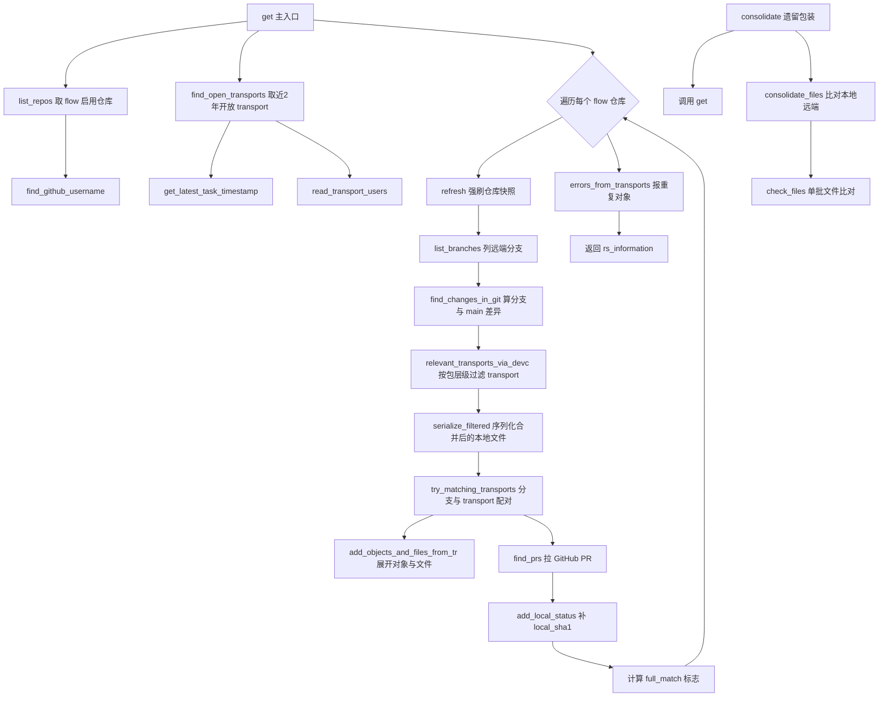
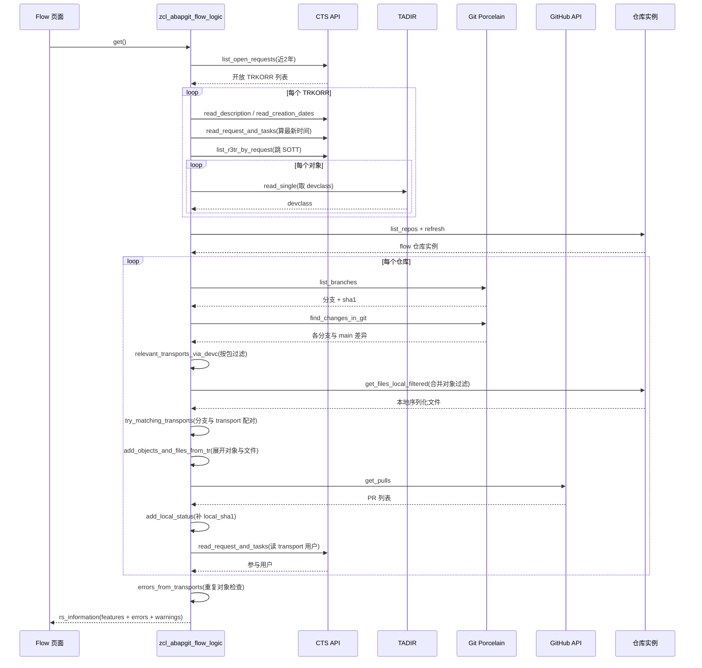

# zcl_abapgit_flow_logic 程序分析报告

> 源文件：`abapGit__abapGit__zcl_abapgit_flow_logic.clas.abap`
> 类类型：PUBLIC 类，全部为 `CLASS-METHODS`（静态工具类，无实例状态）
> 角色：abapGit「Flow」工作流的领域逻辑层

---

## 一、程序定位与业务背景

abapGit 是一个把 Git 版本控制带入 ABAP 开发的开源工具。但它面临 SAP 开发特有的约束：**在启用传输请求（TR/REQ）的开发包里，代码变更必须以 transport 为单位被 CTS 记录**，单纯用 Git commit 无法通过传输。于是 abapGit 设计了「Flow」工作流——让用户像用 Git 一样工作，底层却把变更映射到 SAP transport 上。

`zcl_abapgit_flow_logic` 就是这个工作流的**领域逻辑核心**。它要回答一个复合问题：

> 「当前这个仓库里，哪些变更是『Git 分支』形态的？哪些是『还没配到分支的纯 transport』形态的？它们各自对应哪些对象、哪些文件、哪个 PR？本地和远端是否一致？」

它的输出是一个 `ty_information` 结构，里面是一个 `features` 表——每一行 `ty_feature` 是一个**"分支驱动"**或**"transport 驱动"**的联合实体，UI 直接渲染它。

**整体设计范式**：一个无状态静态门面（static façade），把 CTS API、Git porcelain、本地序列化、GitHub PR 枚举四套异构数据源，聚合到一个统一的"feature 视图"。属于典型的 **Repository/聚合根模式**在 ABAP 里的体现——用一个方法 `get()` 收敛所有取数，下游只认 `ty_information`。

值得注意：这个类**完全用 `CLASS-METHODS`**，没有任何实例变量，是一个纯函数式门面。`consolidate()` 是一个遗留包装方法（内部直接调用 `get()`，且大量逻辑被注释掉），可以视作历史包袱。

---

## 二、程序执行流程总览



### 责任链表

| 子程序 | 调用者 | 职责 |
|---|---|---|
| `get` | Flow 页面 / 外部 UI | 主入口，聚合所有 flow 信息 |
| `list_repos` | `get` | 取启用了 flow 且走 TR 的仓库 |
| `find_github_username` | `get` | 解析当前用户的 GitHub 用户名 |
| `build_repo_data` | `get`、`try_matching_transports` | 把 repo 实例压成 name/key/package |
| `find_open_transports` | `get`、`consolidate_files` | 取近 2 年开放 transport 及其对象明细 |
| `get_latest_task_timestamp` | `find_open_transports` | 算 transport 内最新任务时间戳 |
| `zif_abapgit_repo~refresh` | `get` | 强刷仓库实例快照 |
| `list_branches`（porcelain） | `get`、`consolidate_files` | 列远端 Git 分支 |
| `find_changes_in_git`（`zcl_abapgit_flow_git`） | `get`、`consolidate_files` | 算各分支与 main 的差异，填 `changed_objects`/`changed_files` |
| `relevant_transports_via_devc` | `get` | 按仓库包及其子包过滤相关 transport |
| `serialize_filtered` | `get` | 按"transport 对象 + git 变更对象"合并过滤，序列化合并后的本地文件 |
| `try_matching_transports` | `get` | 把分支与 transport 按对象重叠配对；未配对的 transport 独立成 feature |
| `add_objects_and_files_from_tr` | `try_matching_transports` | 从 transport 展开对象与文件（含删除检测） |
| `find_prs` | `get` | 拉 GitHub PR 信息，剔除 no-merge 标签 |
| `add_local_status` | `get` | 给 `changed_files` 补 `local_sha1` |
| `read_transport_users` | `get` | 取 transport 内所有参与用户 |
| `errors_from_transports` | `get` | 报"同一对象在多个 transport"的重复 |
| `get_involved_users` | 外部 UI | 汇总所有 feature 的参与用户 |
| `consolidate` | 外部（遗留） | 一致性检查包装，内部调用 `get` + `consolidate_files` |
| `consolidate_files` | `consolidate` | 比对本地/远端，找 `missing_remote`/`only_remote` |
| `check_files` | `consolidate_files` | 单批文件比对，回填缺失项 |
| `update_all_branches` | 外部 UI | 批量更新落后的 PR 分支 |

下面按这条流程，逐个子程序展开。

---

## 三、分组分析（按程序执行流程）

### 3.1 `get` —— 主入口

`get()` 是整个类的总调度，逻辑分四段：① 准备全局数据（transport、仓库列表、GitHub 用户名）；② 遍历每个仓库做完整分析；③ 在每个仓库循环内计算 `full_match`；④ 全局错误检查后返回。

#### ① 准备全局数据

```abap
lt_all_transports = find_open_transports( ).
lt_real_transports = lt_all_transports.

lt_repos = list_repos( ).
rs_information-enabled_repositories = lines( lt_repos ).
rs_information-github_username = find_github_username( lt_repos ).

LOOP AT lt_repos INTO li_repo_online.
  li_repo_online->zif_abapgit_repo~refresh( ).
ENDLOOP
```

**做什么** — 先取全量开放 transport，并复制一份 `lt_real_transports` 作为"原始快照"；再取 flow 启用的仓库列表、GitHub 用户名，并对每个仓库实例调用 `refresh` 强制刷新快照。

**为什么** — 复制 `lt_real_transports` 是关键设计：后面的 `try_matching_transports` 会 `CHANGING` 掉 `lt_all_transports`（匹配成功的 transport 会被删除），但最后的 `errors_from_transports` 必须看**未经修改的全量**，否则重复对象检测会漏报。`refresh` 的注释说明这是修复"首次打开 Flow 时仓库实例含陈旧快照"的坑——ABAP 侧的仓库对象缓存可能滞后于 Git 远端。

**风险与改进** — `refresh` 在每个仓库循环外做了一次遍历，但仓库实例的 `refresh` 可能本身是网络调用，若仓库多则串行耗时；可考虑并行或惰性刷新。`lt_real_transports` 的深拷贝语义依赖 ABAP 的默认复制，目前结构体里没有引用类型字段，安全；但若未来给 `ty_transport` 加引用字段会破坏此拷贝假设。

#### ② 遍历每个仓库的完整分析

```abap
LOOP AT lt_repos INTO li_repo_online.

  lt_branches = zcl_abapgit_git_factory=>get_v2_porcelain( )->list_branches(
    iv_url    = li_repo_online->get_url( )
    iv_prefix = zif_abapgit_git_definitions=>c_git_branch-heads_prefix )->get_all( ).

  CLEAR lt_features.
  LOOP AT lt_branches INTO ls_branch WHERE display_name <> zif_abapgit_flow_logic=>c_main.
    ls_result-repo = build_repo_data( li_repo_online ).
    ls_result-branch-display_name = ls_branch-display_name.
    ls_result-branch-sha1 = ls_branch-sha1.
    INSERT ls_result INTO TABLE lt_features.
  ENDLOOP

  zcl_abapgit_flow_git=>find_changes_in_git(
    EXPORTING
      iv_url           = li_repo_online->get_url( )
      io_dot           = li_repo_online->zif_abapgit_repo~get_dot_abapgit( )
      iv_package       = li_repo_online->zif_abapgit_repo~get_package( )
      it_branches      = lt_branches
    IMPORTING
      et_main_expanded = lt_main_expanded
    CHANGING
      ct_features      = lt_features ).

  lt_relevant_transports = relevant_transports_via_devc(
    ii_repo        = li_repo_online
    it_transports  = lt_all_transports ).

  lt_local = serialize_filtered(
    it_relevant_transports = lt_relevant_transports
    ii_repo                = li_repo_online
    it_features            = lt_features
    it_all_transports      = lt_all_transports ).

  try_matching_transports(
    EXPORTING
      ii_repo          = li_repo_online
      it_local         = lt_local
      it_main_expanded = lt_main_expanded
    CHANGING
      ct_transports    = lt_all_transports
      ct_features      = lt_features ).

  find_prs(
    EXPORTING
      iv_url      = li_repo_online->get_url( )
    CHANGING
      ct_features = lt_features ).

  add_local_status(
    EXPORTING
      it_local     = lt_local
    CHANGING
      ct_features = lt_features ).

  LOOP AT lt_features ASSIGNING <ls_feature>.
    <ls_feature>-full_match = abap_true.
    LOOP AT <ls_feature>-changed_files ASSIGNING <ls_path_name>.
      IF <ls_path_name>-remote_sha1 <> <ls_path_name>-local_sha1.
        <ls_feature>-full_match = abap_false.
      ENDIF
    ENDLOOP.

    IF <ls_feature>-transport-trkorr IS NOT INITIAL.
      <ls_feature>-transport-users = read_transport_users( <ls_feature>-transport-trkorr ).
    ENDIF
  ENDLOOP.

  INSERT LINES OF lt_features INTO TABLE rs_information-features.
ENDLOOP
```

**做什么** — 对每个仓库：列分支并剔除 main，构建初始 feature 骨架；用 `find_changes_in_git` 计算每个分支与 main 的差异（填充 `changed_objects`/`changed_files` 的远端 sha1）；按包层级过滤出相关 transport；序列化合并后的本地文件；尝试把分支与 transport 配对；拉 PR 信息；补 `local_sha1`；计算 `full_match`；读 transport 用户；把结果汇入总表。

**为什么** — 这是一个**流水线式聚合**：每个子步骤只消费上一步的产物。`find_changes_in_git` 把"远端差异"和"分支骨架"合并到同一个 `lt_features`，使得后续步骤能在同一张表上做"本地 vs 远端 vs transport"的三维匹配。`full_match` 用 `abap_true` 初值 + 逐个文件校验的反证法，避免空集语义歧义。

**风险与改进** —
- `find_changes_in_git` 是 `CHANGING ct_features`，意味着它**原地修改**分支骨架表，但 `lt_main_expanded` 是 `IMPORTING`（只读回填）——这个不对称是有意为之：branches 是骨架需要增补，main 是只读参照。可读性上需注释说明。
- `full_match` 的判断**只看 `changed_files`**，若某分支 `changed_files` 为空（比如仅改了被跳过的对象），`full_match` 会保持 `abap_true`，语义上把"无差异"等同"完全同步"，可能误导 UI。
- `find_changes_in_git` 和 `list_branches` 都以 URL 为键，若同一 URL 被多个仓库实例引用（如 fork 同址），会重复扫描；当前没有去重。

#### ③ 全局错误检查与返回

```abap
errors_from_transports(
  EXPORTING
    it_all_transports  = lt_real_transports
  CHANGING
    cs_information     = rs_information ).
```

**做什么** — 用原始快照 `lt_real_transports` 检查"同一对象出现在多个 transport"，把错误回填到 `rs_information-errors` 和 `transport_duplicates`。

**为什么** — 这是 CTS 的硬性约束：一个对象不能同时在两个开放 transport 中。Flow UI 需要在用户操作前就暴露此冲突。用 `lt_real_transports`（未匹配过滤的原始集）是为了让**未配到分支的 transport** 的冲突也能被检测到。

**风险与改进** — 仅检查 `object + obj_name` 相同且 `trkorr` 不同的相邻行（前面已排序）。若同一对象在 3 个 transport 中，会报两对重复，计数偏多但语义正确。更稳妥的做法是 `COLLECT` 或 `GROUP BY` 后用计数判断。

---

### 3.2 `list_repos` —— 仓库筛选

```abap
IF iv_favorites_only = abap_true.
  lt_repos = zcl_abapgit_repo_srv=>get_instance( )->list_favorites( abap_false ).
ELSE.
  lt_repos = zcl_abapgit_repo_srv=>get_instance( )->list( abap_false ).
ENDIF.

LOOP AT lt_repos INTO li_repo.
  IF li_repo->get_local_settings( )-flow = abap_false.
    CONTINUE.
  ELSEIF zcl_abapgit_factory=>get_sap_package( li_repo->get_package( )
      )->are_changes_recorded_in_tr_req( ) = abap_false.
    CONTINUE.
  ENDIF.

  li_online ?= li_repo.
  INSERT li_online INTO TABLE rt_repos.
ENDLOOP
```

**做什么** — 从仓库服务取候选仓库，按两个条件过滤：本地设置里启用了 `flow`，且所在 SAP 包"变更需记录在 TR/REQ"中；过滤后窄化为 `zif_abapgit_repo_online` 引用。

**为什么** — 这两个条件是 Flow 的**前置硬约束**：没启用的仓库不该出现，不走 TR 的包（如测试包）也不该走 Flow。`?= `是 abapGit 的受控 downcast，失败会抛异常而非静默返回 null。

**风险与改进** — `iv_favorites_only` 默认 `abap_true`，意味着默认只看收藏仓库。但 `consolidate()` 调用 `get()` 时**没传** `iv_favorites_only`，所以走的是默认值——`consolidate` 与 `get` 的仓库范围可能不一致，是一个隐性耦合。`get_sap_package` 在每个仓库循环里调用，可能重复实例化；可缓存包对象。

---

### 3.3 `find_github_username` —— 用户解析

```abap
READ TABLE it_repos INTO li_repo_online INDEX 1.
IF sy-subrc = 0.
  TRY.
      rv_username = zcl_abapgit_login_manager=>get_username( li_repo_online->get_url( ) ).
    CATCH zcx_abapgit_exception ##NO_HANDLER.
  ENDTRY.
ENDIF.

TRY.
    li_exit = zcl_abapgit_flow_exit=>get_instance( ).
    li_exit->change_github_username( CHANGING cv_username = rv_username ).
  CATCH zcx_abapgit_exception ##NO_HANDLER.
ENDTRY.
```

**做什么** — 取第一个仓库的 URL，解析出 GitHub 用户名；然后调用 BAdI/exit 允许客户自定义用户名。

**为什么** — 用"第一个仓库"作为用户名解析的入口，是因为登录态通常与某个仓库绑定。exit 机制允许客户在 SAML/OIDC 场景下覆盖用户名。`##NO_HANDLER` 是 abapGit 约定：此处静默吞异常，让流程降级而非崩溃。

**风险与改进** — **只取 `INDEX 1` 是硬伤**：若用户有多个仓库分属不同 GitHub 账号（如个人 fork + 公司仓库），用户名会被第一个仓库的账号决定，后续 PR 归属判断全错。更稳妥的是对每个仓库单独解析，或在 exit 里基于仓库 URL 解析。两处 `##NO_HANDLER` 静默吞错也会让"用户名解析失败"在 UI 上表现为空值，难以诊断。

---

### 3.4 `build_repo_data` —— 仓库数据扁平化

```abap
rs_data-name = ii_repo->get_name( ).
rs_data-key = ii_repo->get_key( ).
rs_data-package = ii_repo->get_package( ).
```

**做什么** — 把仓库实例的三个核心标识压成 `ty_feature-repo` 结构体。

**为什么** — `ty_feature` 是一个被频繁复制的结构体，不能直接存引用（否则 `CHANGING` 语义混乱），所以用值类型三元组。

**风险与改进** — 三行样板，无明显风险。但 `get_package` 在某些实现里可能触发 SAP 调用，被频繁调用（每个分支一次）时是潜在热点；若 `get_package` 非幂等或有副作用，会放大问题。

---

### 3.5 `find_open_transports` —— Transport 采集

这是最重的方法之一，分四步：① 限定时间窗；② 取每个 transport 的元数据；③ 跳过 LIMU SOTT；④ 跳过 CINS/NOTE 并读 devclass。

#### ① 限定时间窗

```abap
ls_date-sign = 'I'.
ls_date-option = 'GE'.
ls_date-low = sy-datum - zif_abapgit_flow_logic=>c_open_transport_days.
INSERT ls_date INTO TABLE lt_date.

lt_trkorr = zcl_abapgit_factory=>get_cts_api( )->list_open_requests( lt_date ).
lt_created_on = zcl_abapgit_factory=>get_cts_api( )->read_creation_dates( lt_trkorr ).
```

**做什么** — 只取"近 `c_open_transport_days` 天"内创建或修改的开放 transport，再批量读其创建日期。

**为什么** — CTS 的开放 transport 可能堆积数千个（多年遗留），全量扫描会拖垮 CTS 调用。时间窗是性能护栏，常量抽取为接口常量便于集中调参。

**风险与改进** — **硬编码 2 年窗口是正确性风险**：超过 2 年的合法开放 transport 会被静默遗漏，导致某些分支/对象匹配不上。这个边界应可配置或至少在 UI 上透明提示。`read_creation_dates` 是一次批量调用，设计正确。

#### ② 取每个 transport 的元数据

```abap
LOOP AT lt_trkorr INTO lv_trkorr.
  ls_result-trkorr = lv_trkorr.
  ls_result-title  = zcl_abapgit_factory=>get_cts_api( )->read_description( lv_trkorr ).
  READ TABLE lt_created_on INTO ls_created_on WITH TABLE KEY trkorr = lv_trkorr.
  IF sy-subrc = 0.
    ls_result-created_on = ls_created_on-created_on.
  ELSE.
    CLEAR ls_result-created_on.
  ENDIF
  ls_result-changed_at = get_latest_task_timestamp( lv_trkorr ).
```

**做什么** — 遍历每个 TRKORR，读标题、创建日期、最新任务时间戳，填 `ty_transport` 行。

**为什么** — `changed_at` 用 `get_latest_task_timestamp` 而非 transport 自身的 as4date，是为了反映"最新任务改动时间"，比 transport 创建时间更能反映活跃度。`created_on` 单独读是因为 `list_open_requests` 不返回创建日期，需要二次查询。

**风险与改进** — **这是全方法性能最差的地方**：每个 transport 都单独调用 `read_description`、`read_creation_dates`（已批量但此处又单独读一次）、`get_latest_task_timestamp`（内部又调 `read_request_and_tasks`）。这是典型的 **N+1 查询**：N 个 transport = 3N+ 次 CTS 调用。在大型系统上（数百个开放 TR）这一步会成为明显瓶颈。改进方向是把这些都批量化，或至少把 `get_latest_task_timestamp` 的 `read_request_and_tasks` 改成一次取所有 TR 的 tasks。

#### ③ 跳过 LIMU SOTT

```abap
CLEAR ls_limu_skip.
ls_limu_skip-sign = 'I'.
ls_limu_skip-option = 'EQ'.
ls_limu_skip-low = 'SOTT'.
INSERT ls_limu_skip INTO TABLE lt_limu_skip.
lt_objects = zcl_abapgit_factory=>get_cts_api( )->list_r3tr_by_request(
  iv_request         = lv_trkorr
  it_skip_limu_types = lt_limu_skip ).
```

**做什么** — 在拉 R3TR 对象时跳过 `SOTT`（Short Texts for packages）这一 LIMU 对象类型。

**为什么** — 注释说明：SOTT（包的短文本）**本来就不会被序列化**，所以放进 filter 只会产生无意义的本地文件读取，纯属浪费。

**风险与改进** — 黑名单硬编码在方法体里，缺少集中定义。如果未来有其他不被序列化的对象类型（如 `R3TR` 本身），需要改代码而非配置。注释提到"R3TR can be skipped here"但未实现，是一个待办。

#### ④ 跳过 CINS/NOTE 并读 devclass

```abap
LOOP AT lt_objects ASSIGNING <ls_object>
    WHERE object <> 'CINS'
    AND object <> 'NOTE'.
  ls_result-object   = <ls_object>-object.
  ls_result-obj_name = <ls_object>-obj_name.

  lv_obj_name = <ls_object>-obj_name.
  ls_result-devclass = zcl_abapgit_factory=>get_tadir( )->read_single(
    iv_object   = ls_result-object
    iv_obj_name = lv_obj_name )-devclass.
  IF ls_result-devclass IS NOT INITIAL.
    INSERT ls_result INTO TABLE rt_transports.
  ENDIF
ENDLOOP
```

**做什么** — 遍历每个 transport 的对象，跳过 `CINS`（Consistency Check）和 `NOTE`（SAP Note），逐个读 TADIR 拿 devclass；只有 devclass 非空才插入结果。

**为什么** — `CINS`/`NOTE` 不是 ABAP 源码对象，与序列化无关；`read_single` 读 TADIR 是为了拿到对象所属包，后续才能按包层级过滤。devclass 为空的对象（可能在 TADIR 中查不到）被静默丢弃。

**风险与改进** — **又是一个 N+1**：每个对象一次 `read_single` 调用 TADIR。大型 transport 可能含数百对象，乘以数百个 transport，调用量爆炸。改进方向是用批量 TADIR 读取（`zcl_abapgit_tadir=>read` 的列表模式）。`WHERE object <> 'CINS' AND object <> 'NOTE'` 是行级过滤，比外层 `it_skip_limu_types` 粒度更细，说明两处黑名单职责不同——但缺乏集中管理，新增跳过类型时容易遗漏一处。

---

### 3.6 `get_latest_task_timestamp` —— 最新任务时间

```abap
TRY.
    lt_tasks = zcl_abapgit_factory=>get_cts_api( )->read_request_and_tasks( iv_trkorr ).

    LOOP AT lt_tasks INTO ls_task.
      IF ls_task-as4date > lv_max_date
          OR ( ls_task-as4date = lv_max_date AND ls_task-as4time > lv_max_time ).
        lv_max_date = ls_task-as4date.
        lv_max_time = ls_task-as4time.
      ENDIF
    ENDLOOP.

    IF lv_max_date IS NOT INITIAL.
      CONVERT DATE lv_max_date TIME lv_max_time INTO TIME STAMP rv_changed_at TIME ZONE sy-zonlo.
    ELSE.
      GET TIME STAMP FIELD rv_changed_at.
    ENDIF
  CATCH zcx_abapgit_exception.
    GET TIME STAMP FIELD rv_changed_at.
ENDTRY
```

**做什么** — 读 transport 及其下所有任务的日期/时间，取最大值；转换时间戳返回。空集或异常时退化为当前时间。

**为什么** — 用"日期+时间"双字段比较而非直接拼时间戳，是因为 CTS API 返回的是分离字段。`TIME ZONE sy-zonlo` 是本地时区转换，避免跨时区比较错误。

**风险与改进** — **退化为 `GET TIME STAMP` 会掩盖问题**：异常或空任务时返回"当前时间"，让调用方无法区分"transport 真的刚改过"和"读不到数据"。更稳妥是返回一个明确的 sentinel（如 `timestamp_min`）或抛异常向上。`CATCH` 块吞掉异常无日志，排障困难。

---

### 3.7 `relevant_transports_via_devc` —— 按包层级过滤

```abap
lt_trkorr = it_transports.
SORT lt_trkorr BY trkorr.
DELETE ADJACENT DUPLICATES FROM lt_trkorr COMPARING trkorr.

lt_packages = zcl_abapgit_factory=>get_sap_package( ii_repo->get_package( ) )->list_subpackages( ).
INSERT ii_repo->get_package( ) INTO TABLE lt_packages.

LOOP AT lt_trkorr ASSIGNING <ls_trkorr>.
  lv_found = abap_false.

  LOOP AT lt_packages ASSIGNING <lv_package>.
    READ TABLE it_transports TRANSPORTING NO FIELDS
      WITH KEY trkorr = <ls_trkorr>-trkorr devclass = <lv_package>.
    IF sy-subrc = 0.
      lv_found = abap_true.
      EXIT.
    ENDIF
  ENDLOOP
  IF lv_found = abap_false.
    CONTINUE.
  ENDIF

  IF lv_found = abap_true.
    INSERT <ls_trkorr>-trkorr INTO TABLE rt_transports.
  ENDIF
ENDLOOP
```

**做什么** — 先把全量 transport 按 trkorr 去重（每个 TRKORR 只留一行，避免重复处理），再取仓库包及其所有子包，对每个 transport 检查"它是否含本包/子包下的对象"，命中的加入结果。

**为什么** — 去重是性能优化：一个 transport 可能有几十个对象，但它们共享 trkorr，处理一次即可。包层级过滤保证只关心"与本仓库相关的 transport"，避免跨包污染。

**风险与改进** — `DELETE ADJACENT DUPLICATES COMPARING trkorr` 后，每行只剩 `trkorr` 字段有效，其余字段（object/obj_name/devclass）是去重前最后一行的值——但后续只用 `trkorr` 回查 `it_transports`，所以安全。`IF lv_found = abap_true` 与 `IF lv_found = abap_false CONTINUE` 后冗余（continue 后只剩 true），可简化。`READ TABLE ... WITH KEY trkorr devclass` 没有 BINARY SEARCH，且 `it_transports` 未排序——是 O(n×m) 复杂度，可优化为排序后 BINARY SEARCH 或哈希结构。`list_subpackages` 可能返回大量子包，每个 transport 都要遍历所有包，是二次热点。

---

### 3.8 `serialize_filtered` —— 本地序列化

```abap
LOOP AT it_relevant_transports INTO lv_trkorr.
  LOOP AT it_all_transports ASSIGNING <ls_transport> WHERE trkorr = lv_trkorr.
    APPEND INITIAL LINE TO lt_filter ASSIGNING <ls_filter>.
    <ls_filter>-object = <ls_transport>-object.
    <ls_filter>-obj_name = <ls_transport>-obj_name.
  ENDLOOP
ENDLOOP.

LOOP AT it_features INTO ls_feature.
  LOOP AT ls_feature-changed_objects INTO ls_changed_object.
    APPEND INITIAL LINE TO lt_filter ASSIGNING <ls_filter>.
    <ls_filter>-object = ls_changed_object-obj_type.
    <ls_filter>-obj_name = ls_changed_object-obj_name.
  ENDLOOP
ENDLOOP.

SORT lt_filter BY object obj_name.
DELETE ADJACENT DUPLICATES FROM lt_filter COMPARING object obj_name.

CREATE OBJECT lo_filter EXPORTING it_filter = lt_filter.
rt_local = ii_repo->get_files_local_filtered( lo_filter ).
```

**做什么** — 把"相关 transport 的对象"和"git 分支变更的对象"合并成一张 filter，去重后交给仓库实例做本地序列化，返回 `ty_local_files`。

**为什么** — 序列化是 abapGit 的核心操作（把 ABAP 对象变成 JSON/XML 文本），代价高，必须按需做。合并两个来源后一次序列化，避免重复序列化同一对象。`SORT` + `DELETE ADJACENT DUPLICATES` 是 ABAP 标准去重模式。

**风险与改进** — 设计干净。`lt_filter` 的 `SORT BY object obj_name` 之后 `CREATE OBJECT lo_filter` 一次性构造，符合 abapGit 的 filter 对象模式。潜在问题是 `it_features` 可能为空（仅 main 分支），此时 filter 只含 transport 对象——这是正确的，因为纯 transport 也要序列化。无明显风险。

---

### 3.9 `try_matching_transports` —— 分支与 transport 配对

这是逻辑最复杂的方法之一，分两步：① 尝试把分支匹配到 transport；② 把未匹配的 transport 独立成 feature。

#### ① 分支匹配到 transport

```abap
SORT ct_transports BY object obj_name.

LOOP AT ct_features ASSIGNING <ls_feature>.
  LOOP AT <ls_feature>-changed_objects ASSIGNING <ls_changed>.
    READ TABLE ct_transports ASSIGNING <ls_transport>
      WITH KEY object = <ls_changed>-obj_type
               obj_name = <ls_changed>-obj_name BINARY SEARCH.
    IF sy-subrc = 0.
      <ls_feature>-transport-trkorr = <ls_transport>-trkorr.
      <ls_feature>-transport-title = <ls_transport>-title.
      <ls_feature>-transport-created_on = <ls_transport>-created_on.
      <ls_feature>-transport-changed_at = <ls_transport>-changed_at.

      add_objects_and_files_from_tr(
        EXPORTING
          iv_trkorr        = <ls_transport>-trkorr
          it_local         = it_local
          it_main_expanded = it_main_expanded
          it_transports    = ct_transports
        CHANGING
          cs_feature       = <ls_feature> ).

      DELETE ct_transports WHERE trkorr = <ls_transport>-trkorr.
      EXIT.
    ENDIF
  ENDLOOP
ENDLOOP
```

**做什么** — 先把 transport 按 `object+obj_name` 排序（为 BINARY SEARCH 准备）；然后对每个分支的每个变更对象，二分查找 transport 表，命中即匹配，调用 `add_objects_and_files_from_tr` 展开该 transport 的全部对象与文件，再从 ct_transports 删除已匹配的 trkorr，跳出内层循环（一个分支只匹配一个 transport）。

**为什么** — BINARY SEARCH 是正确用法（前面已 SORT），O(log n) 查找。"一个分支只匹配一个 transport"是 Flow 的设计约束：分支和 transport 是一一映射。删除已匹配 trkorr 是为第二步"未匹配 transport"做铺垫。

**风险与改进** — `DELETE ct_transports WHERE trkorr = ...` 在已排序表上删除，**会破坏排序不变量**（虽然剩余元素相对顺序不变，但如果多个对象来自同一 trkorr，删除后 BINARY SEARCH 的后续调用仍能工作，因为 trkorr 相同行只删一次后 EXIT 跳出）。但代码可读性差：删除 + 排序 + BINARY SEARCH 的组合需要读者脑补"删除后是否仍有序"。更稳妥的是用一个 `MATCHED` 标志位而非物理删除。**关键风险**：内层循环命中后 `EXIT` 只跳出内层，外层继续下一个 feature——这意味着如果 feature A 匹配了 TR1，feature B 也能尝试匹配 TR1 的其他对象（因为 TR1 已被删除，不会重复匹配），逻辑正确。

#### ② 未匹配 transport 独立成 feature

```abap
lt_trkorr = ct_transports.
SORT lt_trkorr BY trkorr.
DELETE ADJACENT DUPLICATES FROM lt_trkorr COMPARING trkorr.

lt_packages = zcl_abapgit_factory=>get_sap_package( ii_repo->get_package( ) )->list_subpackages( ).
INSERT ii_repo->get_package( ) INTO TABLE lt_packages.

LOOP AT lt_trkorr INTO ls_trkorr.
  lv_found = abap_false.
  LOOP AT lt_packages INTO lv_package.
    READ TABLE ct_transports ASSIGNING <ls_transport>
      WITH KEY trkorr = ls_trkorr-trkorr devclass = lv_package.
    IF sy-subrc = 0.
      lv_found = abap_true.
      EXIT.
    ENDIF
  ENDLOOP
  IF lv_found = abap_false.
    CONTINUE.
  ENDIF

  CLEAR ls_result.
  ls_result-repo = build_repo_data( ii_repo ).
  ls_result-transport-trkorr = <ls_transport>-trkorr.
  ls_result-transport-title = <ls_transport>-title.
  ls_result-transport-created_on = <ls_transport>-created_on.
  ls_result-transport-changed_at = <ls_transport>-changed_at.

  add_objects_and_files_from_tr(
    EXPORTING
      iv_trkorr        = ls_trkorr-trkorr
      it_local         = it_local
      it_main_expanded = it_main_expanded
      it_transports    = ct_transports
    CHANGING
      cs_feature       = ls_result ).

  INSERT ls_result INTO TABLE ct_features.
ENDLOOP
```

**做什么** — 把剩余未匹配的 transport 按 trkorr 去重，再按包层级过滤（与 `relevant_transports_via_devc` 逻辑重复），把每个通过的 transport 包装成一个纯 transport 驱动的 feature（无 branch 信息），插入 `ct_features`。

**为什么** — 这是 Flow 的核心特性之一：用户可能"先开 transport、后开分支"或"只开 transport 不开分支"，这些 transport 必须出现在 UI 上，否则用户看不到自己的变更。包层级过滤避免把无关包的 transport 也拉进来。

**风险与改进** — **包层级过滤逻辑与 `relevant_transports_via_devc` 几乎完全重复**（取子包、循环匹配 devclass），违反 DRY。两处应抽取为公共方法。`READ TABLE ct_transports ... WITH KEY trkorr devclass` 同样是未排序的线性查找，性能同 3.7。`<ls_transport>` 是 field symbol，在 `READ TABLE ASSIGNING` 后赋值，但若 `sy-subrc <> 0` 则 `<ls_transport>` 指向旧值——不过 `EXIT` 后只 `IF lv_found = abap_false CONTINUE`，命中时才用 `<ls_transport>`，安全。但代码可读性依赖这个不变量，建议在命中分支显式 re-READ 或赋值到 WORK 变量。

---

### 3.10 `add_objects_and_files_from_tr` —— 从 transport 展开对象与文件

这是最复杂的方法，分四步：① 收集 transport 的对象；② 从本地文件匹配；③ 删除检测：本地找不到；④ 远端也找不到。

#### ① 收集 transport 的对象 + ② 从本地匹配

```abap
LOOP AT it_transports ASSIGNING <ls_transport> WHERE trkorr = iv_trkorr.
  ls_changed-obj_type = <ls_transport>-object.
  ls_changed-obj_name = <ls_transport>-obj_name.
  INSERT ls_changed INTO TABLE cs_feature-changed_objects.

  LOOP AT it_local ASSIGNING <ls_local>
      WHERE file-filename <> zif_abapgit_definitions=>c_dot_abapgit
      AND item-obj_type = <ls_transport>-object
      AND item-obj_name = <ls_transport>-obj_name.

    CLEAR ls_changed_file.
    ls_changed_file-path       = <ls_local>-file-path.
    ls_changed_file-filename   = <ls_local>-file-filename.
    ls_changed_file-local_sha1 = <ls_local>-file-sha1.

    READ TABLE it_main_expanded ASSIGNING <ls_main_expanded>
      WITH TABLE KEY path_name COMPONENTS
      path = ls_changed_file-path
      name = ls_changed_file-filename.
    IF sy-subrc = 0.
      ls_changed_file-remote_sha1 = <ls_main_expanded>-sha1.
    ENDIF

    INSERT ls_changed_file INTO TABLE cs_feature-changed_files.
  ENDLOOP
```

**做什么** — 遍历该 trkorr 的所有 transport 对象，加入 `changed_objects`；然后对每个对象，在本地序列化文件 `it_local` 中按 `obj_type+obj_name` 查找对应文件，填 `local_sha1`，再从 `it_main_expanded` 读 `remote_sha1`，加入 `changed_files`。

**为什么** — 这是 Flow 的"对象→文件"映射核心。transport 只有对象级信息（obj_type/obj_name），需要映射到 abapGit 的"文件"层级（path/filename/sha1）。`it_main_expanded` 提供"main 分支上这个文件是否存在及其 sha1"，用于后续判断"本地改了"还是"纯新增"。

**风险与改进** — `WHERE file-filename <> c_dot_abapgit` 是合理的元数据排除。`it_local` 是按对象名索引的（来自 `serialize_filtered`），但 `WHERE item-obj_type = ... AND item-obj_name = ...` 的字段名（`item-obj_type`）与 `it_local` 的元素结构有关——需确认 `ty_local_files` 的元素确实含 `item-obj_type`/`item-obj_name` 字段（从 `serialize_filtered` 的 filter 构造看是正确的）。`READ TABLE it_main_expanded WITH TABLE KEY path_name COMPONENTS` 使用了 `ty_expanded_tt` 的复合主键，前提是 `it_main_expanded` 按此键排序——`find_changes_in_git` 是否保证排序需查证，否则 READ 语义不可靠。

#### ③ 删除检测：本地找不到

```abap
  IF sy-subrc <> 0.
* then its a deletion
    CLEAR ls_item.
    ls_item-obj_type = <ls_transport>-object.
    ls_item-obj_name = <ls_transport>-obj_name.

    IF zcl_abapgit_aff_factory=>get_registry( )->is_supported_object_type( <ls_transport>-object ) = abap_true.
      lv_extension = 'json'.
    ELSE.
      lv_extension = 'xml'.
    ENDIF

    lv_main_file = zcl_abapgit_filename_logic=>object_to_file(
      is_item = ls_item
      iv_ext  = lv_extension ).
    CONCATENATE '.' lv_extension INTO lv_extension.
    lv_filename = lv_main_file.
    REPLACE FIRST OCCURRENCE OF lv_extension IN lv_filename WITH '*'.

    IF lv_filename = 'package.devc*'.
* this might leave deleted packages in git, but its okay for now
      CONTINUE.
    ENDIF

    LOOP AT it_main_expanded ASSIGNING <ls_main_expanded>
        WHERE name CP lv_filename.
      CLEAR ls_changed_file.
      ls_changed_file-filename    = <ls_main_expanded>-name.
      ls_changed_file-path        = <ls_main_expanded>-path.
      ls_changed_file-remote_sha1 = <ls_main_expanded>-sha1.
      INSERT ls_changed_file INTO TABLE cs_feature-changed_files.
    ENDLOOP
```

**做什么** — 若本地没序列化出该对象（说明本地已删除），进入"删除"分支：按 AFF 支持与否决定扩展名（json/xml），构造文件名模式，跳过 `package.devc*`（包对象），然后在 `it_main_expanded` 中按通配符匹配远端文件，把"远端还在但本地没了"的文件加入 `changed_files`（`local_sha1` 留空）。

**为什么** — 这是 abapGit 最棘手的场景之一：**transport 删除 vs git 删除**。当用户在 transport 中删除一个对象，本地文件消失，但远端 main 上仍有。Flow 需要把这些"被 transport 删除但远端还在"的文件标记出来，让 UI 显示"待删除"。通配符 `*` 是因为一个 ABAP 对象可能对应多个文件（如 `.clas.abap` + `.clas.xml` 等附属文件）。

**风险与改进** —
- **`IF sy-subrc <> 0` 依赖 LOOP 退出状态**：ABAP 中 `LOOP AT ... WHERE` 无匹配时 `sy-subrc = 4`，但内层 `READ TABLE` 也会改 `sy-subrc`——此处 `IF` 紧跟 `ENDLOOP`，ABAP 保证 LOOP 退出后 `sy-subrc` 被 LOOP 重新设置，所以语义正确，但极其微妙，**是典型的"靠语言行为而非显式状态"的反模式**，可读性和可维护性都差。
- **`REPLACE FIRST OCCURRENCE OF lv_extension IN lv_filename WITH '*'`** 把 `.json` 替换成 `*`，依赖 `lv_filename` 恰好以 `.json` 结尾且只出现一次——若文件名中间含 `.json` 会误替换。更稳妥是用 `SPLIT` 或 `REPLACE REGEX`。
- **`CONCATENATE '.' lv_extension INTO lv_extension`** 就地修改 `lv_extension`，从 `'json'` 变成 `'.json'`，后续再无使用，但变量语义被破坏，可读性差。
- **`IF lv_filename = 'package.devc*'` CONTINUE 跳过**：注释明确说"这可能把已删除的包留在 git 里，但暂时可以接受"——**这是已知的设计债务**，被显式承认并推迟。包删除在 abapGit 中本就复杂（包是目录概念），此处回避是务实但需跟踪。

#### ④ 远端也找不到

```abap
    IF sy-subrc <> 0.
      CLEAR ls_changed_file.
      ls_changed_file-filename    = lv_main_file.
      ls_changed_file-path        = '/src/'. " todo?
* after its deleted locally and remote then remote and local sha1 will match(be empty)
      INSERT ls_changed_file INTO TABLE cs_feature-changed_files.
    ENDIF
```

**做什么** — 若远端 main 上也找不到匹配文件（即"本地删、远端也删"），仍插入一行 `changed_file`，`path` 硬编码 `/src/`，`remote_sha1` 和 `local_sha1` 都留空（注释说"匹配即都为空"）。

**为什么** — 保留一个"占位"行让 UI 知道"这个对象存在过"，即使两端都删了。注释暗示这是为了 UI 一致性而非数据正确性。

**风险与改进** — **`path = '/src/'` 硬编码是明确的 bug 风险**（注释里的 `// todo?` 已暴露作者的怀疑）：ABAP 对象可能位于 `/src/` 之外的其他路径（如包层级不同的目录），硬编码会生成错误的路径记录，可能导致后续 `add_local_status` 或 `full_match` 判断基于错误路径。应改为从 `it_main_expanded` 或对象元数据动态推断，或至少用包路径作兜底。`local_sha1` 和 `remote_sha1` 都空时，`full_match` 判断 `remote <> local` 为 `abap_false`（相等），会把"两端都删"误判为"完全同步"——这其实是正确语义，但依赖"空=空"的相等性，需确认 `abap_bool` 比较语义。

---

### 3.11 `find_prs` —— PR 拉取

```abap
IF lines( ct_features ) = 0.
  " only main branch
  RETURN.
ENDIF

lt_pulls = zcl_abapgit_pr_enumerator=>new( iv_url )->get_pulls( ).

LOOP AT ct_features ASSIGNING <ls_branch>.
  lv_index = sy-tabix.

  READ TABLE lt_pulls INTO ls_pull
    WITH KEY head_branch = <ls_branch>-branch-display_name.
  IF sy-subrc <> 0.
    CONTINUE.
  ENDIF

  READ TABLE ls_pull-labels WITH KEY table_line = 'no-merge' TRANSPORTING NO FIELDS.
  IF sy-subrc = 0.
    DELETE ct_features INDEX lv_index.
    CONTINUE.
  ENDIF

  <ls_branch>-pr-title_raw = ls_pull-title.

  REPLACE ALL OCCURRENCES OF '`' IN ls_pull-title WITH ''.

  <ls_branch>-pr-title = |{ ls_pull-title } #{ ls_pull-number }|.
  <ls_branch>-pr-url = ls_pull-html_url.
  <ls_branch>-pr-number = ls_pull-number.
  <ls_branch>-pr-draft = ls_pull-draft.
  <ls_branch>-pr-author = ls_pull-user.
ENDLOOP
```

**做什么** — 仅当存在分支（非纯 main）时才拉 PR；对每个分支按 `head_branch` 匹配 PR，命中后填 PR 元数据；若 PR 带 `no-merge` 标签则从 features 中删除该分支。

**为什么** — `head_branch` 匹配是 GitHub PR 的标准语义（PR 的源分支名）。`no-merge` 是团队约定的"此 PR 不应合并"标签，Flow 直接隐藏这类分支。`pr-title` 拼接 `#{ pr-number }` 是为了 UI 显示编号。

**风险与改进** — **`DELETE ct_features INDEX lv_index` 在 LOOP 中删当前行**：ABAP 中 `DELETE INDEX` 后 `sy-tabix` 保持原值（指向被删行的"逻辑位置"），下一个 `LOOP` 迭代会从 `sy-tabix + 1` 开始——但此处 DELETE 后 `CONTINUE`，`CONTINUE` 触发的是"下一次迭代"，ABAP 会正确跳过已删行。逻辑正确但**极其依赖 ABAP LOOP/DELETE 的交互语义**，是高风险代码。更稳妥是先收集要删的索引，循环外批量删。`READ TABLE ... WITH KEY table_line = 'no-merge'` 按 label 字符串精确匹配，大小写敏感（`no-merge` vs `No-Merge` 不会命中），可能在标签命名不统一时漏判。`REPLACE ALL OCCURRENCES OF ''` 只清理反引号，其他 markdown（如 `**加粗**`、链接）会残留，`pr-title` 显示可能含脏字符。

---

### 3.12 `add_local_status` —— 补 local_sha1

```abap
LOOP AT ct_features ASSIGNING <ls_branch>.
  LOOP AT <ls_branch>-changed_files ASSIGNING <ls_changed_file>.
    READ TABLE it_local ASSIGNING <ls_local>
      WITH KEY file-filename = <ls_changed_file>-filename
               file-path = <ls_changed_file>-path.
    IF sy-subrc = 0.
      <ls_changed_file>-local_sha1 = <ls_local>-file-sha1.
    ENDIF
  ENDLOOP
ENDLOOP
```

**做什么** — 遍历每个 feature 的 `changed_files`，在本地文件表中按 `filename+path` 查找，命中则补 `local_sha1`。

**为什么** — `changed_files` 在 `find_changes_in_git` 和 `add_objects_and_files_from_tr` 中只填了 `remote_sha1`（远端差异）或部分 `local_sha1`（序列化时带出），这里统一回填，确保 `full_match` 计算有完整的本地/远端对比数据。

**风险与改进** — **与 `add_objects_and_files_from_tr` 步骤 ② 中的 `local_sha1` 回填逻辑重复**：那一步已经按 `obj_type+obj_name` 填了 `local_sha1`，这里又按 `filename+path` 填一次。两次回填的键不同，可能产生不一致（前者按对象匹配，后者按文件匹配）。`it_local` 用 `WITH KEY file-filename file-path` 读，要求 `it_local` 有这些字段的表键或已排序——从 `serialize_filtered` 的产物看，`ty_local_files` 可能没有显式索引，READ 退化为线性扫描，O(n×m) 复杂度。无明显严重风险，但冗余回填是技术债务。

---

### 3.13 `errors_from_transports` —— 重复对象检测

```abap
lt_transports = it_all_transports.
SORT lt_transports BY object obj_name trkorr.

LOOP AT lt_transports INTO ls_transport.
  lv_index = sy-tabix + 1.
  READ TABLE lt_transports INTO ls_next INDEX lv_index.
  IF sy-subrc <> 0.
    CONTINUE.
  ENDIF

  IF ls_next-object = ls_transport-object
      AND ls_next-trkorr <> ls_transport-trkorr
      AND ls_next-obj_name = ls_transport-obj_name.

    READ TABLE cs_information-features WITH KEY transport-trkorr = ls_transport-trkorr TRANSPORTING NO FIELDS.
    lv_found1 = boolc( sy-subrc = 0 ).
    READ TABLE cs_information-features WITH KEY transport-trkorr = ls_next-trkorr TRANSPORTING NO FIELDS.
    lv_found2 = boolc( sy-subrc = 0 ).
    IF lv_found1 = abap_false AND lv_found2 = abap_false.
      " not in any favorite flow enabled repo
      CONTINUE.
    ENDIF

    lv_message = |Object <tt>{ ls_transport-object }</tt> <tt>{ ls_transport-obj_name
      }</tt> is in multiple transports: <tt>{ ls_transport-trkorr }</tt> and <tt>{ ls_next-trkorr }</tt>|.
    INSERT lv_message INTO TABLE cs_information-errors.

    CLEAR ls_duplicate.
    ls_duplicate-obj_type = ls_transport-object.
    ls_duplicate-obj_name = ls_transport-obj_name.
    INSERT ls_duplicate INTO TABLE cs_information-transport_duplicates.
  ENDIF
ENDLOOP
```

**做什么** — 复制全量 transport 并排序，逐行检查"相邻行是否同对象不同 transport"；若是，且至少一个 transport 出现在当前 flow 仓库的 features 中，就报告错误并记录重复对象。

**为什么** — CTS 禁止同一对象同时在两个开放 transport 中，Flow 必须在操作前暴露此冲突。"至少一个在 features 中"的过滤避免报告与本仓库无关的冲突。

**风险与改进** — **仅检查相邻行**：排序后 `object+obj_name` 相同的行会相邻，但若同一对象在 3 个 transport 中，会报两对（TR1-TR2、TR2-TR3），计数偏多。更准确的做法是按 `object+obj_name` 分组后判断组大小。`READ TABLE ... INDEX lv_index` 用 `sy-tabix + 1` 读下一行，但 `sy-tabix` 在 `READ TABLE INDEX` 后可能被改变——此处 `READ TABLE INTO ls_next INDEX lv_index` 不修改当前 LOOP 的 `sy-tabix`，安全。`boolc( sy-subrc = 0 )` 是 ABAP 7.4+ 内联构造函数，可读性好。错误消息用 `<tt>` 包裹代码片段，是 abapGit UI 的渲染约定（HTML 风格的轻标记），非标准 ABAP 文本，依赖 UI 解析。

---

### 3.14 `get_involved_users` —— 参与用户汇总

```abap
LOOP AT is_information-features ASSIGNING <ls_feature>.
  LOOP AT <ls_feature>-transport-users INTO lv_user.
    INSERT lv_user INTO TABLE rt_users.
  ENDLOOP
ENDLOOP.

DELETE rt_users WHERE table_line IS INITIAL.
```

**做什么** — 遍历所有 feature 的 `transport-users`，汇总所有参与用户，去掉空值。

**为什么** — 供 UI 显示"此 flow 涉及哪些用户"，用于通知或权限提示。`DELETE WHERE IS INITIAL` 清理可能的空用户名。

**风险与改进** — 无去重：同一用户可能在多个 feature 中出现，会重复。若 UI 需要唯一用户列表，需调用方去重。无明显严重风险，属于纯样板代码。

---

### 3.15 `consolidate` —— 遗留包装方法

```abap
li_repo ?= ii_online.
lt_features = get( )-features.

LOOP AT lt_features INTO ls_feature WHERE repo-key = li_repo->get_key( ).
  " IF ls_feature-branch-display_name IS NOT INITIAL
  "     AND ls_feature-branch-up_to_date = abap_false.
  "   lv_string = |Branch <tt>{ ls_feature-branch-display_name }</tt> is not up to date|.
  "   INSERT lv_string INTO TABLE rs_consolidate-errors.
  " ELSE
  IF ls_feature-branch-display_name IS NOT INITIAL
      AND ls_feature-transport-trkorr IS INITIAL
      AND lines( ls_feature-changed_files ) > 0.
* its okay if the changes are outside the starting folder
    lv_string = |Branch <tt>{ ls_feature-branch-display_name }</tt> has no transport|.
    INSERT lv_string INTO TABLE rs_consolidate-errors.
  ELSEIF ls_feature-transport-trkorr IS NOT INITIAL
      AND ls_feature-branch-display_name IS INITIAL
      AND ls_feature-full_match = abap_false.
    ls_transport = zcl_abapgit_factory=>get_cts_api( )->read( ls_feature-transport-trkorr ).
    lv_string = |Transport <tt>{ ls_feature-transport-trkorr }</tt> has no branch, created {
      ls_transport-as4date DATE = ISO }|.
    INSERT lv_string INTO TABLE rs_consolidate-errors.
  ENDIF
* todo: branches without pull requests?
ENDLOOP.

consolidate_files(
  EXPORTING
    ii_online      = ii_online
  CHANGING
    cs_information = rs_consolidate ).
```

**做什么** — 取 `get()` 的结果，过滤出当前仓库的 feature，检查两类不一致：① 有分支但无 transport（且文件数>0）；② 有 transport 但无分支（且非完全匹配）。然后调用 `consolidate_files` 做本地/远端差异比对。

**为什么** — 这是一个"一致性检查"API，让用户在提交前知道"哪些分支没配对 transport、哪些 transport 没配分支"。被注释掉的"分支落后"检查（`branch-up_to_date`）说明这个字段曾经用于检查但被移除——可能是与 `update_all_branches` 的职责重叠。

**风险与改进** — **大量被注释的代码是明显的技术债务**：被注释的"分支落后"检查、末尾的 `todo: branches without pull requests?`、开头的 `todo: handling multiple repositories` 都表明这个方法处于未完成/废弃状态。方法本身只是 `get()` + `consolidate_files()` 的薄包装，**可以考虑标记为 `@deprecated` 或直接删除**，让调用方直接用 `get()` 并自行判断一致性。`consolidate_files` 被传入 `ii_online` 但内部又调用 `find_open_transports`（全量，未按包过滤），与 `get` 的路径不同——两条路径可能产生不一致的中间状态，是设计异味。

---

### 3.16 `consolidate_files` —— 本地/远端差异比对

这是最复杂的方法之一，分五步：① 取分支与差异；② 按 tadir 过滤；③ 批处理文件比对；④ 限制 missing 数量；⑤ 标记 only_remote。

#### ① 取分支与差异

```abap
li_repo ?= ii_online.

lt_branches = zcl_abapgit_git_factory=>get_v2_porcelain( )->list_branches(
  iv_url    = ii_online->get_url( )
  iv_prefix = zif_abapgit_git_definitions=>c_git_branch-heads_prefix )->get_all( ).

CLEAR lt_features.
LOOP AT lt_branches INTO ls_branch WHERE display_name <> zif_abapgit_flow_logic=>c_main.
  ls_result-repo = build_repo_data( ii_online ).
  ls_result-branch-display_name = ls_branch-display_name.
  ls_result-branch-sha1 = ls_branch-sha1.
  INSERT ls_result INTO TABLE lt_features.
ENDLOOP

zcl_abapgit_flow_git=>find_changes_in_git(
  EXPORTING
    iv_url           = ii_online->get_url( )
    io_dot           = li_repo->get_dot_abapgit( )
    iv_package       = li_repo->get_package( )
    it_branches      = lt_branches
  IMPORTING
    et_main_expanded = lt_main_expanded
  CHANGING
    ct_features      = lt_features ).
```

**做什么** — 与 `get` 的步骤 ② 几乎相同：取分支、建骨架、算差异。

**为什么** — `consolidate_files` 是 `consolidate` 的内部实现，需要独立获取分支与差异数据，不能依赖 `get` 的中间状态（因为 `get` 返回的是已匹配的 features，而这里需要原始差异）。

**风险与改进** — **与 `get` 的步骤 ② 代码完全重复**：取分支、建骨架、调 `find_changes_in_git` 这三段在 `get` 和 `consolidate_files` 中各出现一次，违反 DRY。应抽取为公共方法（如 `collect_branch_diffs`）。这是遗留代码的典型症状——`consolidate` 是旧 API，`get` 是新 API，但两者共享了大部分底层逻辑而未重构。

#### ② 按 tadir 过滤

```abap
lt_tadir = zcl_abapgit_factory=>get_tadir( )->read(
  iv_package        = li_repo->get_package( )
  io_dot            = li_repo->get_dot_abapgit( )
  iv_ignore_delflag = abap_true
  iv_check_exists   = abap_false ).

lt_all_transports = find_open_transports( ).

LOOP AT lt_tadir ASSIGNING <ls_tadir>.
  READ TABLE lt_all_transports
    WITH KEY object = <ls_tadir>-object obj_name = <ls_tadir>-obj_name
    TRANSPORTING NO FIELDS.
  IF sy-subrc = 0 AND <ls_tadir>-object <> 'DEVC'.
* todo: this is not correct for AFF enabled objects
    lv_filename = |{ to_lower( <ls_tadir>-obj_name ) }.{ to_lower( <ls_tadir>-object ) }*|.
    DELETE lt_main_expanded WHERE name CP lv_filename.
    CONTINUE.
  ENDIF

  INSERT <ls_tadir> INTO TABLE lt_filter.

  IF lines( lt_filter ) >= 500.
    CREATE OBJECT lo_filter EXPORTING it_filter = lt_filter.
    lt_local = li_repo->get_files_local_filtered( lo_filter ).
    CLEAR lt_filter.
    check_files(
      EXPORTING
        it_local          = lt_local
        it_features       = lt_features
      CHANGING
        ct_main_expanded  = lt_main_expanded
        ct_missing_remote = cs_information-missing_remote ).
  ENDIF
ENDLOOP

IF lines( lt_filter ) > 0.
  CREATE OBJECT lo_filter EXPORTING it_filter = lt_filter.
  lt_local = li_repo->get_files_local_filtered( lo_filter ).
  CLEAR lt_filter.
  check_files(
    EXPORTING
      it_local          = lt_local
      it_features       = lt_features
    CHANGING
      ct_main_expanded  = lt_main_expanded
      ct_missing_remote = cs_information-missing_remote ).
ENDIF
```

**做什么** — 读仓库包下的 tadir 对象；对每个 tadir 对象，若它在某个开放 transport 中（且不是 DEVC），则从 `lt_main_expanded` 中删除匹配的文件并跳过；否则加入 filter，每 500 条 flush 一次做 `check_files` 比对。

**为什么** — 这是"差异比对"的核心：tadir 是"包下所有 ABAP 对象"的清单，序列化后应与 git 远端一致。在 transport 中的对象已经被 `try_matching_transports` 处理过（在 `consolidate` 路径中），这里跳过它们避免重复处理。批处理 500 条是为了限制单次序列化的内存/时间。

**风险与改进** —
- **`READ TABLE lt_all_transports WITH KEY object obj_name` 无 BINARY SEARCH 且未排序**：`lt_all_transports` 来自 `find_open_transports`，未按 object+obj_name 排序，每次 READ 是线性扫描。tadir 可能有数千对象，transport 可能数百，复杂度 O(数千×数百) = 数十万次线性查找，是显著性能问题。
- **`DELETE lt_main_expanded WHERE name CP lv_filename` 用通配符删除**：`lv_filename` 如 `zclass.clas*`，会匹配 `zclass.clas.xml`、`zclass.clas.json` 等所有附属文件。注释明确说"this is not correct for AFF enabled objects"——**AFF 对象（Active File Format）的序列化文件名规则与旧格式不同**，通配符可能误删。这是已知的设计缺陷。
- **`to_lower` 转换**：`obj_name` 在 ABAP 中通常是大小写敏感的（包名），转小写后与 `lt_main_expanded` 的文件名匹配可能失效——需确认序列化文件名是否也统一小写。
- **批处理 500 的边界处理**：`IF lines(lt_filter) >= 500` 在循环内 flush，循环后再 flush 剩余——逻辑正确，但 `lo_filter` 是循环外声明的引用变量，每次 `CREATE OBJECT` 覆盖，旧引用失去引用计数会 GC——ABAP GC 行为正确，但频繁创建 filter 对象有开销。

#### ③ 限制 missing 数量

```abap
IF lines( cs_information-missing_remote ) > c_max_missing_files.
  lv_warning = |Only first { c_max_missing_files } missing files shown, {
    lines( cs_information-missing_remote) } total|.
  INSERT lv_warning INTO TABLE cs_information-warnings.

  lv_count = 0.
  LOOP AT cs_information-missing_remote INTO ls_missing_remote.
    lv_count = lv_count + 1.
    IF lv_count > c_max_missing_files.
      DELETE TABLE cs_information-missing_remote FROM ls_missing_remote.
    ENDIF
  ENDLOOP
ENDIF
```

**做什么** — 若 `missing_remote` 超过 1000 条，插入警告并截断。

**为什么** — 防止 UI 渲染数万条 missing 项而卡死，同时提示用户"还有更多"。

**风险与改进** — `DELETE TABLE ... FROM ls_missing_remote` 在 LOOP 中删除当前行，ABAP 中 `sy-tabix` 在 DELETE 后保持原值，下一个 `LOOP` 迭代会从 `sy-tabix` 指向的下一项开始——但此处 DELETE 后没有 `CONTINUE`，LOOP 自然继续，`lv_count` 继续递增，逻辑正确但**极其微妙**。更清晰的写法是先记起始索引再 `DELETE TABLE ... FROM INDEX`。`c_max_missing_files = 1000` 是硬编码常量，不可配置。

#### ④ 标记 only_remote

```abap
LOOP AT lt_main_expanded INTO ls_expanded.
  CLEAR ls_only_remote.
  ls_only_remote-path = ls_expanded-path.
  ls_only_remote-filename = ls_expanded-name.
  ls_only_remote-remote_sha1 = ls_expanded-sha1.
  INSERT ls_only_remote INTO TABLE cs_information-only_remote.
ENDLOOP
```

**做什么** — `lt_main_expanded` 中剩余的就是"只在远端、本地没有"的文件（因为前面匹配到本地文件后会被 `DELETE ct_main_expanded` 移除）。

**为什么** — `lt_main_expanded` 在 `check_files` 中被逐步消费（匹配到就删），残留即为"远端独有"。这是"差集"的自然表达：用"消费掉即匹配"的方式隐含记录了匹配状态。

**风险与改进** — **`check_files` 必须严格按"匹配即 DELETE"的契约执行**，否则残留集合语义错误。这是跨方法的隐性契约，缺乏显式声明，维护时容易破坏。`ty_path_name` 只有 `path/filename/remote_sha1` 三个字段，无 `local_sha1`（因为本地无），与 `changed_files` 结构不对称，是合理的。

---

### 3.17 `check_files` —— 单批文件比对

```abap
LOOP AT it_local ASSIGNING <ls_local>
    WHERE file-filename <> zif_abapgit_definitions=>c_dot_abapgit.
  READ TABLE ct_main_expanded
    WITH KEY name = <ls_local>-file-filename
    ASSIGNING <ls_expanded>.
  lv_found_main = boolc( sy-subrc = 0 ).

  lv_found_branch = abap_false.
  LOOP AT it_features INTO ls_feature.
    READ TABLE ls_feature-changed_files TRANSPORTING NO FIELDS
      WITH KEY filename = <ls_local>-file-filename.
    IF sy-subrc = 0.
      lv_found_branch = abap_true.
      EXIT.
    ENDIF
  ENDLOOP

  IF lv_found_main = abap_false AND lv_found_branch = abap_false.
    CLEAR ls_missing.
    ls_missing-path = <ls_local>-file-path.
    ls_missing-filename = <ls_local>-file-filename.
    ls_missing-local_sha1 = <ls_local>-file-sha1.
    INSERT ls_missing INTO TABLE ct_missing_remote.
  ELSEIF lv_found_branch = abap_false AND <ls_expanded>-path <> <ls_local>-file-path.
* todo
  ELSEIF lv_found_branch = abap_false AND <ls_expanded>-sha1 <> <ls_local>-file-sha1.
    CLEAR ls_missing.
    ls_missing-path = <ls_local>-file-path.
    ls_missing-filename = <ls_local>-file-filename.
    ls_missing-local_sha1 = <ls_local>-file-sha1.
    ls_missing-remote_sha1 = <ls_expanded>-sha1.
    INSERT ls_missing INTO TABLE ct_missing_remote.
  ENDIF

  IF lv_found_main = abap_true OR lv_found_branch = abap_true.
    DELETE ct_main_expanded
      WHERE name = <ls_local>-file-filename AND path = <ls_local>-file-path.
  ENDIF
ENDLOOP
```

**做什么** — 对每个本地文件，检查三件事：① 是否在远端 main 上（按 filename）；② 是否在任何分支的 `changed_files` 中（按 filename）；③ 若都不在，记为 missing；若在 main 但 sha1 不同，也记为 missing（内容不一致）。匹配后从 `ct_main_expanded` 删除，使残留即为 only_remote。

**为什么** — 这是"本地 vs 远端"差异比对的原子操作。三种 missing 类型：完全缺失、内容不一致、路径移动（TODO 未实现）。用 `DELETE` 消费 `ct_main_expanded` 是为后续"残留即 only_remote"做铺垫。

**风险与改进** —
- **`READ TABLE ct_main_expanded WITH KEY name = ...` 只按 filename 读，未按 path**：`ct_main_expanded` 可能有同名文件在不同目录（如 `zclass.clas.json` 在 `/src/pkg1/` 和 `/src/pkg2/`），READ 只取第一条，后续 `<ls_expanded>-path` 判断可能基于错误的行。**这是明确的 bug 风险**。应按 `name + path` 复合键读，或先按 path 过滤再按 name 读。
- **`ELSEIF lv_found_branch = abap_false AND <ls_expanded>-path <> <ls_local>-file-path` 带 `* todo`**：作者明确标注"路径移动"场景未实现。若文件被移动（本地 path 与 main path 不同但 filename 相同），当前代码不报 missing，是已知缺口。
- **`DELETE ct_main_expanded WHERE name = ... AND path = ...`** 用复合键删除，前提是 `ct_main_expanded` 有这些字段——`ty_expanded_tt` 应有 `name/path/sha1`，DELETE WHERE 多字段在 ABAP 中是 AND 语义，正确。但 `DELETE WHERE` 在未排序表上是全表扫描，性能 O(n) 每次，`it_local` 循环中反复 DELETE 是 O(n²) 总复杂度。
- **`READ TABLE ls_feature-changed_files TRANSPORTING NO FIELDS WITH KEY filename = ...`** 只看 filename 不看 path，与上面 `READ ct_main_expanded` 只按 name 读是同一类问题：可能误匹配同名不同路径的文件。

---

### 3.18 `update_all_branches` —— 批量更新 PR 分支

```abap
LOOP AT it_features INTO ls_feature.
  IF ls_feature-branch-up_to_date <> abap_false.
    CONTINUE.
  ENDIF
  IF ls_feature-pr-number IS INITIAL.
    rs_result-skipped = rs_result-skipped + 1.
    CONTINUE.
  ENDIF

  IF lv_previous_key <> ls_feature-repo-key.
    li_repo_online ?= zcl_abapgit_repo_srv=>get_instance( )->get( ls_feature-repo-key ).
    lv_url = li_repo_online->get_url( ).

    FIND FIRST OCCURRENCE OF REGEX 'github\.com\/([^\/]+)\/([^\/]+)'
      IN lv_url
      SUBMATCHES lv_user lv_repo ##REGEX_POSIX.
    IF sy-subrc <> 0.
      rs_result-skipped = rs_result-skipped + 1.
      CONTINUE.
    ENDIF
    lv_repo = replace(
      val = lv_repo
      regex = '\.git$'
      with = '' ) ##REGEX_POSIX.

    CREATE OBJECT lo_github
      EXPORTING
        iv_user_and_repo = |{ lv_user }/{ lv_repo }|
        ii_http_agent    = zcl_abapgit_http_agent=>create( ).
    lv_previous_key = ls_feature-repo-key.
  ENDIF

  TRY.
      lo_github->update_pull_request_branch(
        iv_pull_number       = ls_feature-pr-number
        iv_expected_head_sha = ls_feature-branch-sha1 ).
      rs_result-updated = rs_result-updated + 1.
    CATCH zcx_abapgit_exception.
      rs_result-errors = rs_result-errors + 1.
  ENDTRY
ENDLOOP
```

**做什么** — 遍历 features，跳过"已是最新"和"无 PR"的；按 repo-key 分组（相同 key 只创建一个 GitHub 客户端），从 URL 解析 user/repo，调用 GitHub API 更新 PR 分支。

**为什么** — 这是 Flow 的"同步"操作：当 main 分支前进后，PR 分支可能落后，需要 GitHub 的"Update branch"按钮。`lv_previous_key` 缓存避免重复创建 GitHub 客户端（网络/认证开销）。

**风险与改进** —
- **`IF ls_feature-branch-up_to_date <> abap_false` 判断脆弱**：`abap_bool` 初始值为 `abap_false`（空），所以"未设置的分支"会被视为"需要更新"，可能导致对从未设置过此字段的 feature 做无意义的更新尝试。更稳妥是 `IF ls_feature-branch-up_to_date = abap_true`。
- **正则硬编码 `github\.com`**：abapGit 支持 GitLab/Gitea/自建 Git 等多种后端，但此方法只对 GitHub 有效，其他后端全部 `skipped`。**这是扩展性硬伤**：非 GitHub 用户无法使用批量更新。改进方向是通过 `zif_abapgit_pr_enum_provider` 抽象出 `update_branch` 能力，而非直接 new `zcl_abapgit_pr_enum_github`。
- **`CATCH zcx_abapgit_exception` 只计数不记录**：丢失具体错误信息，用户无法知道哪个 PR 更新失败、为何失败。应至少把错误消息收集到结果结构。
- **`FIND FIRST OCCURRENCE OF REGEX` 解析 URL**：对 URL 格式假设较强（必须是 `github.com/user/repo`），私有 GitHub Enterprise（`github.example.com`）会跳过。
- **`replace(val = lv_repo regex = '\.git$' with = '')`** 去除 `.git` 后缀，但 `iv_user_and_repo` 期望 `user/repo` 格式——若 URL 含 `.git` 则去掉，正确。`##REGEX_POSIX` 是指令注解，抑制静态检查。

---

## 四、执行流程全景图（数据视角）



---

## 五、问题清单与改进建议（按优先级）

### 🔴 P0 业务正确性

1. **`add_objects_and_files_from_tr` 步骤 ④ 硬编码 `path = '/src/'`**（方法 `add_objects_and_files_from_tr`）— 删除检测时若远端也找不到，path 写死 `/src/`，对象可能在其他包路径下，生成错误的路径记录，影响后续 `full_match` 与 UI 显示。注释里的 `// todo?` 已暴露作者的怀疑。应动态推断路径或至少用包路径兜底。

2. **`check_files` 只按 filename 读 `ct_main_expanded`，未按 path**（方法 `check_files`）— 同名文件在不同目录时，READ 可能取到错误的行，导致后续 `<ls_expanded>-path`/`<ls_expanded>-sha1` 判断基于错误数据。应按 `name + path` 复合键读。

3. **`check_files` 的"路径移动"场景未实现**（方法 `check_files`）— `ELSEIF <ls_expanded>-path <> <ls_local>-file-path` 分支带 `* todo`，文件被移动（同 filename 不同 path）时不报 missing，是已知缺口。

4. **`find_github_username` 只取 `INDEX 1`**（方法 `find_github_username`）— 多仓库多账号场景下用户名被第一个仓库决定，后续 PR 归属判断全错。应基于仓库 URL 解析或在 exit 中动态处理。

5. **`update_all_branches` 正则硬编码 `github\.com`**（方法 `update_all_branches`）— 非 GitHub 后端（GitLab/Gitea/自建）全部跳过，扩展性硬伤。应通过 `zif_abapgit_pr_enum_provider` 抽象更新能力。

### 🟠 P1 健壮性

6. **`find_open_transports` 的 N+1 CTS 调用**（方法 `find_open_transports`）— 每个 transport 调用 `read_description`、`get_latest_task_timestamp`（内部再调 `read_request_and_tasks`）、`list_r3tr_by_request`，每个对象再调 `read_single`。数百 TR 时调用量爆炸。应批量化。

7. **`consolidate_files` 步骤 ② 的 `READ TABLE lt_all_transports` 未排序、无 BINARY SEARCH**（方法 `consolidate_files`）— 数千 tadir × 数百 transport 的线性扫描。应排序后 BINARY SEARCH 或建哈希。

8. **`find_open_transports` 硬编码 2 年窗口**（方法 `find_open_transports`）— 超过 2 年的合法开放 transport 被静默遗漏。应可配置或在 UI 上提示边界。

9. **`find_prs` 在 LOOP 中 `DELETE INDEX`**（方法 `find_prs`）— 依赖 ABAP LOOP/DELETE 的微妙交互语义，高风险。应先收集索引再批量删。

10. **`get_latest_task_timestamp` 异常/空集时退化 `GET TIME STAMP`**（方法 `get_latest_task_timestamp`）— 掩盖"读不到数据"的真实情况。应返回 sentinel 或向上抛。

11. **`consolidate` 大量被注释的代码 + 多处 todo**（方法 `consolidate`）— 包括"分支落后"检查、多仓库处理、无 PR 分支检查。是遗留未完成代码，应标记 `@deprecated` 或删除。

### 🟡 P2 性能与规范

12. **`consolidate_files` 与 `get` 的代码完全重复**（方法 `consolidate_files`、`get`）— 取分支、建骨架、调 `find_changes_in_git` 三段重复。应抽取公共方法。

13. **`relevant_transports_via_devc` 与 `try_matching_transports` 步骤 ② 的包层级过滤重复**（方法 `relevant_transports_via_devc`、`try_matching_transports`）— 取子包、循环匹配 devclass 的逻辑几乎相同，违反 DRY。

14. **`check_files` 的 O(n²) DELETE**（方法 `check_files`）— 循环中反复 `DELETE WHERE` 全表扫描。应建索引或改用标记删除后统一清理。

15. **`add_local_status` 与 `add_objects_and_files_from_tr` 步骤 ② 的 `local_sha1` 回填重复**（方法 `add_local_status`、`add_objects_and_files_from_tr`）— 两次回填键不同，可能产生不一致。

16. **`errors_from_transports` 仅检查相邻行**（方法 `errors_from_transports`）— 同一对象在 3+ transport 中时报多对，计数偏多。应分组后判断组大小。

17. **`add_objects_and_files_from_tr` 依赖 LOOP 退出后的 `sy-subrc`**（方法 `add_objects_and_files_from_tr`）— 多次 `IF sy-subrc <> 0` 依赖 LOOP 与内层 READ 的 sy-subrc 交互，可读性极差。应用显式标志位。

18. **`c_max_missing_files = 1000` 硬编码**（类常量）— 不可配置。

### 🟢 P3 可扩展性

19. **`find_open_transports` 的跳过类型黑名单分散**（方法 `find_open_transports`）— `it_skip_limu_types`（SOTT）、`WHERE object <> 'CINS' AND object <> 'NOTE'` 两处黑名单，新增跳过类型易遗漏。应集中定义。

20. **`consolidate_files` 步骤 ② 的通配符删除对 AFF 对象不正确**（方法 `consolidate_files`）— 注释明确说 "this is not correct for AFF enabled objects"。是已知缺陷。

21. **`ty_feature` 是"分支/transport"联合结构**（接口类型，非本文件）— 一个 feature 要么分支驱动要么 transport 驱动，联合类型在 ABAP 中缺乏类型约束，依赖字段空值判断，扩展新驱动源（如 workbench 变更）需改多处。

---

## 六、整体评价与启发

### 优点

1. **领域建模清晰**：用 `ty_feature` 统一表达"分支驱动"和"transport 驱动"两种变更源，把 abapGit 的核心抽象（"一个变更 = 一个 feature"）表达得很干净。UI 只需渲染一张 features 表。

2. **静态门面 + 流水线聚合**：`get()` 把四套异构数据源（CTS/Git/本地序列化/GitHub PR）按流水线串联，每步只消费上一步产物，职责分明。虽然方法多，但主流程一眼可读。

3. **"消费即匹配"的差集技巧**：`consolidate_files` 用 `DELETE ct_main_expanded WHERE ...` 在 `check_files` 中逐步消费，残留即为 `only_remote`——这是 ABAP 内表操作的优雅用法，避免额外维护"已匹配"集合。

4. **防御性设计的局部典范**：`refresh()` 修复陈旧快照、`lt_real_transports` 复制保留原始快照、`DELETE ADJACENT DUPLICATES` 减少重复处理——这些都是经过实战打磨的细节。

### 短板

1. **遗留代码未清理**：`consolidate` 是明显的旧 API 包装，大量注释掉的代码、todo 标记、与 `get` 重复的逻辑都未重构。技术债务可见但未处理。

2. **性能问题集中在 N+1 查询**：`find_open_transports` 和 `check_files` 都有大量单条 CTS/TADIR 调用和未排序的线性扫描，在大型系统上会成为瓶颈。abapGit 本身是社区工具，性能调优可能让位于功能完整。

3. **依赖 ABAP 微妙语言语义**：多处 `sy-subrc` 依赖 LOOP/READ/DELETE 的交互行为，可读性和可维护性差。对新维护者极不友好。

4. **扩展性受 GitHub 硬编码限制**：`update_all_branches` 正则只匹配 `github.com`，其他 Git 后端不可用。这与 abapGit 的多后端支持理念矛盾。

### 可学到的设计经验

1. **"消费即匹配"模式**：在处理"本地 vs 远端"差异时，不维护额外的"已匹配集合"，而是在匹配到就直接从源表中删除，残留即为差集。这在 ABAP 内表操作里既省内存又直观，但需要调用方严格遵守契约。

2. **静态门面 + 流水线**：当一个领域逻辑需要聚合多套数据源时，用一个无状态静态门面（CLASS-METHODS）做调度，每步子程序只做一件事、只消费上一步产物。这比"一个大方法"或"多个相互调用的实例方法"都更易读。

3. **原始快照 vs 工作副本**：`lt_real_transports = lt_all_transports` 这种"复制保留原始快照"的技巧，在"既要修改中间状态又要基于原始状态做后续检查"的场景里是必要的。ABAP 的值语义复制让这种做法很自然。

4. **遗留代码的诚实标注**：作者在被注释的"分支落后"检查旁留了 todo，在 `path = '/src/'` 旁留了 `// todo?`，在"通配符删除"旁留了"this is not correct for AFF"——**不回避缺陷、显式标注已知问题**是值得学习的质量意识。这比"假装一切正常"更有价值。
