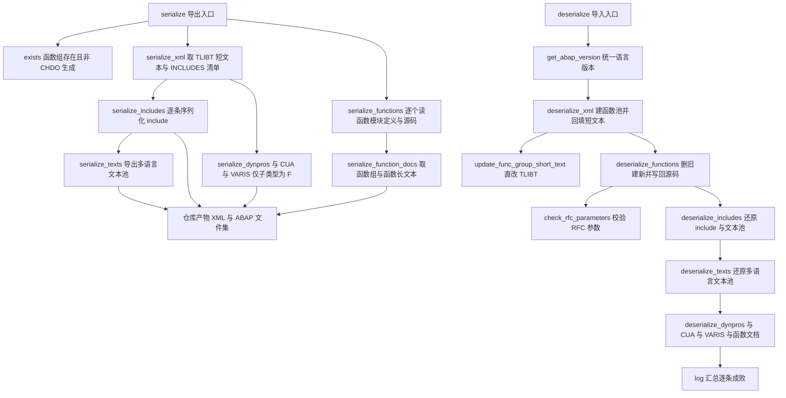
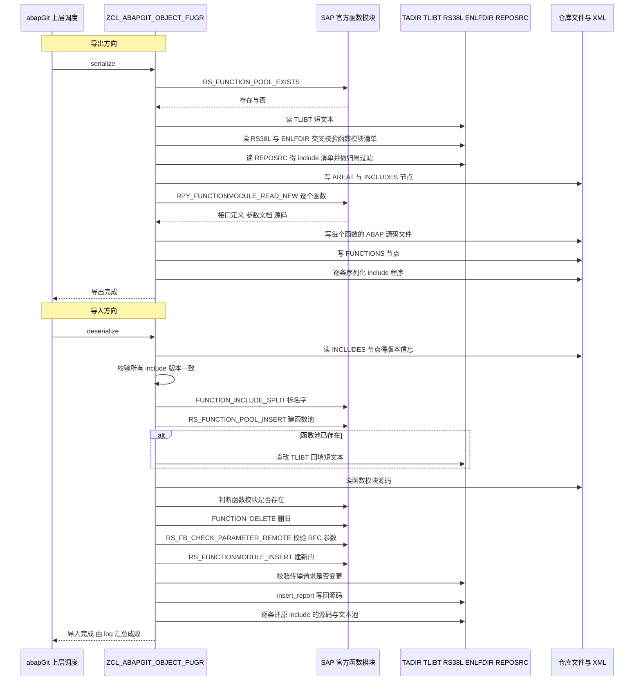

# ZCL_ABAPGIT_OBJECT_FUGR 分析报告

> 分析对象：`abapGit/abapGit — ZCL_ABAPGIT_OBJECT_FUGR.clas.abap`（1529 行，abapGit 的 FUGR 对象处理器）
> 报告视角：代码 onboarding 走读，按真实调用链展开

---

## 一、程序定位与业务背景

### 1.1 要解决的问题

这个类要解决的问题，比一般报表程序难一个量级：**把一个函数组（Function Group）变成可以进 Git 的文件，再从文件完整还原成系统里的对象。**

函数组是 ABAP 世界里最别扭的一种对象。它对外是一个 `FUGR` 类型、叫 `ZMYGROUP` 的东西，但在系统里它至少是这些表里的一堆行：

| 表 | 存的东西 |
|---|---|
| `RS38L` / `ENLFDIR` | 函数组里有哪些函数模块、每个函数的 include 是谁 |
| `TADIR` | 每个函数 include 的登记（`LSAPLxxx` 形式的程序名） |
| `TFTIT` | 每个函数模块的短文本 |
| `TLIBG` / `TLIBT` | 函数组本身、函数组在每种语言下的短文本 |
| `REPOSRC` | 主程序 `SAPLxxx`、每个 include、每个函数 include 的源码 |
| `TPOOL` / `REPOTEXT` | 程序文本池 |
| 长文本（DOKAR/DOKIL 体系） | 函数组文档 `RE`、函数文档 `FU`、函数异常文档 `FX` |

再加上如果这个函数组带 UI（`PROGDIR-SUBC = 'F'`），还要处理 DYNPRO、CUA、VARIS。

所以"把这个对象导出"不是一句 `SELECT`，而是一条跨 10 来张表、跨若干 SAP 官方函数模块、还要处理多语言和版本差异的流水线。这个类就是这条流水线。

### 1.2 设计范式定性

> **"委托型对象适配器"——本类几乎不自己碰底层表，而是把每个语义片段委托给 SAP 官方函数模块或 abapGit 的工厂单例，自己只负责编排顺序、缓存、边界判定和失败上报。**

继承关系点明了这个定位：它 `INHERITING FROM zcl_abapgit_objects_program`，因为它在物理上就是一个程序（`SAPLxxx`）加上一堆附属物，所以 include 序列化、文本池、动态屏幕、锁检查这些通用能力全部从父类借来，本类只写"函数组特有"的那一层。

### 1.3 依赖与地形（读之前必须知道）

```
SAP 官方函数模块   RS_FUNCTION_POOL_EXISTS        函数组是否存在
                   RS_FUNCTION_POOL_CONTENTS      列出函数模块
                   FUNCTION_INCLUDE_SPLIT         把 ZMYGROUP 拆成命名空间+组名
                   RS_FUNCTION_POOL_INSERT        建/更新函数池
                   RS_FUNCTION_POOL_DELETE        删函数池
                   RPY_FUNCTIONMODULE_READ_NEW    读函数模块定义与源码
                   RS_FUNCTIONMODULE_INSERT       写函数模块定义
                   FUNCTION_DELETE                删单个函数模块
                   RS_GET_ALL_INCLUDES            列主程序的全部 include
                   RS_FB_CHECK_PARAMETER_REMOTE   校验参数 RFC 兼容性
                   TADIR / TLIBG / TLIBT / ENLFDIR / REPOSRC / D010TINF / TC_DRP(S)  直接读写的表
```

```
本仓库内部        zcl_abapgit_factory=>get_sap_report( )     程序的读写（父类能力）
                 zcl_abapgit_factory=>get_function_module( ) 函数模块存在性
                 zcl_abapgit_factory=>get_longtexts( )        长文本序列化
                 zcl_abapgit_factory=>get_cts_api( )          传输请求与任务
                 zif_abapgit_object                          对象契约接口
```

还有一批**本文件里看不到实现**的父类方法被直接调用：`set_abap_language_version`、`read_tpool`、`deserialize_program`、`deserialize_textpool`、`strip_generation_comments`、`tadir_insert`、`add_tpool`、`serialize_program`、`serialize_dynpros`、`deserialize_dynpros`、`serialize_cua`、`deserialize_cua`、`serialize_varis`、`deserialize_varis`、`exists_a_lock_entry_for`、`is_any_dynpro_locked`、`is_cua_locked`、`is_text_locked`、`is_active`、`get_metadata`。读这个类时，凡是被委托出去的部分，边界就在这里断掉——这是本报告多处标"需核实"的根本原因。

---

## 二、程序执行流程总览

这个类没有 `REPORT` 那样的单一入口，它有两个真正的主流程：**导出（serialize）** 和 **导入（deserialize）**，由 abapGit 的上层调度在用户 push / pull 时触发。



### 责任链表

| 子程序 | 调用者 | 职责 |
|---|---|---|
| `zif_abapgit_object~serialize` | abapGit 上层调度 | 导出主入口：按序调用全部 serialize_*，决定导出哪些部分 |
| `zif_abapgit_object~deserialize` | abapGit 上层调度 | 导入主入口：先定版本，再按依赖顺序还原骨架→函数→include→文本→UI |
| `zif_abapgit_object~exists` | `~serialize` 的守卫；上层状态查询 | 判定函数组是否可迁移：存在 且 不是 CHDO 自动生成 |
| `serialize_xml` | `~serialize` | 导出函数组短文本（`TLIBT-AREAT`）与 INCLUDES 清单，构成仓库里的骨架 XML |
| `get_abap_version` | `~deserialize` | 遍历仓库 include 的 PROGDIR，取统一 ABAP 语言版本，不一致即抛异常 |
| `deserialize_xml` | `~deserialize` | 解析 FUGR 名、建函数池、短文本已存在时手工回填 |
| `main_name` | `includes`、`changed_by`、`~serialize`、`~deserialize`、`is_locked` | 把 FUGR 名转成主程序名 `SAPLxxx` |
| `functions` | `serialize_functions`、`~jump`、`~changed_by`、锁检查、`includes` | 列出函数模块，用 `ENLFDIR` 交叉校验并去重 |
| `serialize_functions` | `~serialize` | 逐个读函数模块接口、文档与源码，产出 `ty_function_tt` 并把源码交给仓库 |
| `serialize_function_docs` | `~serialize` | 导出函数组 `RE`、每个函数 `FU`、异常 `FX` 三类长文本 |
| `deserialize_functions` | `~deserialize` | 核心导入：读源码→删旧 FM→校验 RFC→建 FM→写回源码 |
| `check_rfc_parameters` | `deserialize_functions` | 只对 `REMOTE_CALL = 'R'` 的 FM 逐个校验参数远程兼容性 |
| `includes` | `serialize_includes`、`serialize_xml`、`is_any_include_locked`、`~delete` | 算出真正属于本 FUGR 的 include 集合，带缓存 |
| `serialize_includes` | `~serialize` | 逐条委托父类序列化 include 程序 |
| `deserialize_includes` | `~deserialize` | 逐条还原 include 的源码、PROGDIR、文本池 |
| `serialize_texts` | `~serialize` | 导出主程序的各语言文本池 |
| `deserialize_texts` | `~deserialize` | 还原主程序的多语言文本池 |
| `update_func_group_short_text` | `deserialize_xml` | 直改 `TLIBT` 回填函数组短文本 |
| `update_where_used` | `~delete` | 删除后刷新交叉引用索引 |
| `is_part_of_other_fugr` | `includes` | 判定某个 include 是否实际属于另一个函数组 |
| `is_function_group_locked` / `is_any_include_locked` / `is_any_function_module_locked` | `~is_locked` | 三级锁探测 |
| `zif_abapgit_object~is_locked` | 上层调度 | 汇总六类锁 |
| `zif_abapgit_object~changed_by` | 上层调度 | 从多张表拼出最后修改人与时间 |
| `zif_abapgit_object~delete` | 上层调度 | 删函数池并刷新索引 |
| `zif_abapgit_object~jump` | 上层调度 | 从仓库文件名跳回 SE38 对象 |
| `get_comparator` / `get_deserialize_order` / `get_deserialize_steps` / `get_metadata` / `is_active` / `map_filename_to_object` / `map_object_to_filename` | 上层调度 | 契约的骨架方法，多为空转发 |

下面按这条流程，逐个子程序展开。

---

## 三、分组分析

### 3.1 类定义段：契约与数据结构（类定义段 / 全局声明区）

先看契约。这个类最关键的三行决定了后面所有代码的形态。

```abap
CLASS zcl_abapgit_object_fugr DEFINITION
  PUBLIC
  INHERITING FROM zcl_abapgit_objects_program
  CREATE PUBLIC .
```

**做什么** — 公开类，可实例化，继承自 `zcl_abapgit_objects_program`。继承父类意味着"程序本体"的全部能力（include 读写、文本池、动态屏幕、锁、元数据）都不用自己写。

**为什么** — 这是整个类最重要的一个设计决定。FUGR 在系统里本质上就是 `SAPLxxx` 主程序加附属物，把它挂到 program 类下面，`serialize_includes` 一行就能委托完 40 行的 include 序列化逻辑，`is_locked` 里 `is_any_dynpro_locked` / `is_cua_locked` / `is_text_locked` 三个调用也全部来自父类。**代价是耦合**：本子类对父类实现的行为（尤其是 `set_abap_language_version` 的语义）没有任何本地约束，父类一变，子类静默失效。

**风险与改进** — 两个点。其一，`INHERITING FROM` 让本类的可用 API 面完全取决于父类，而父类 `zcl_abapgit_objects_program` 的源码不在本文件里，接手者无法在本地验证被继承方法的真实行为（见 P3-1）。其二，`PUBLIC` + `CREATE PUBLIC` 意味着任何人都能自行 `CREATE OBJECT` 一个实例，而本类持有 `mt_includes_cache` 这类可变实例状态——多个调用方共享或复用同一个实例时，缓存会互相污染（见 P1-5）。建议把类改为 `CREATE PRIVATE` 并由工厂统一创建，实例生命周期就能收敛到 abapGit 的工厂里。

```abap
    INTERFACES zif_abapgit_object .
```

**做什么** — 实现 abapGit 的对象契约接口。这就是本类那 14 个 `zif_abapgit_object~*` 方法存在的唯一原因。

**为什么** — abapGit 用一个接口统一 PROG / CLAS / FUGR / INTF 等所有对象类型，上层调度完全不需要知道具体类型。这是教科书式的策略模式：上层只面对 `deserialize( )` / `serialize( )` / `exists( )` / `is_locked( )` 四五个动词。

**风险与改进** — 无明显风险。但要注意接口方法的"最小实现成本"很高：本类 28 个方法里有 7 个是纯 `RETURN;`，这是接口统一性换来的固定税，属于合理支出而非缺陷。

再看数据结构。三个常量直接对应 SAP 长文本的三个 ID。

```abap
    CONSTANTS:
      c_longtext_id_prog     TYPE dokil-id VALUE 'RE',
      c_longtext_id_func     TYPE dokil-id VALUE 'FU',
      c_longtext_id_func_exc TYPE dokil-id VALUE 'FX'.
```

**做什么** — 定义三类长文本 ID：`RE` 是程序/函数组文档，`FU` 是函数模块文档，`FX` 是函数异常文档。

**为什么** — 这三个值来自 SAP 的 DOKIL 体系，是硬编码的平台约定，只能这么写。用常量而不是散在方法里的字面量，是这份代码在可读性上做得对的地方——`serialize_function_docs` 和 `deserialize_function_docs` 两个方法靠这三个常量保持严格对称。

**风险与改进** — 无明显风险。这是纯样板。

然后是本类真正的核心数据结构：`ty_function`。

```abap
    TYPES:
      BEGIN OF ty_function,
        funcname          TYPE rs38l_fnam,
        global_flag       TYPE rs38l-global,
        remote_call       TYPE rs38l-remote,
        update_task       TYPE rs38l-utask,
        short_text        TYPE tftit-stext,
        remote_basxml     TYPE rs38l-basxml_enabled,
        rfcscope          TYPE c LENGTH 1, " data element not on older releases
        rfcvers           TYPE c LENGTH 10, " data element not on older releases
        import            TYPE STANDARD TABLE OF rsimp WITH DEFAULT KEY,
        changing          TYPE STANDARD TABLE OF rscha WITH DEFAULT KEY,
        export            TYPE STANDARD TABLE OF rsexp WITH DEFAULT KEY,
        tables            TYPE STANDARD TABLE OF rstbl WITH DEFAULT KEY,
        exception         TYPE STANDARD TABLE OF rsexc WITH DEFAULT KEY,
        documentation     TYPE STANDARD TABLE OF rsfdo WITH DEFAULT KEY,
        exception_classes TYPE abap_bool,
      END OF ty_function .
```

**做什么** — 定义"一个函数模块的完整可序列化形态"：六个标量属性 + 五张参数/异常/文档子表 + 一个异常类开关。这正是 `serialize_functions` 产出、`deserialize_functions` 消费的那个结构。

**为什么** — 两个值得注意的选择。其一，`rfcscope` / `rfcvers` 没有用官方数据元素，而是自己声明成 `c LENGTH 1` 和 `c LENGTH 10`，注释写明"低版本没有这个数据元素"——这是为了**让代码在 7.40/7.50 上也能编译**，因为数据元素不存在时 `TYPE` 引用会导致激活失败。其二，`exception_classes` 单独用 `abap_bool` 而不是 `enlfdir-exten3`，让仓库里的类型语义自解释。

**风险与改进** —

1. **类型降级丢失语义**（见 P2-3）。`rfcscope` 官方是 `tfdir-rfcscope`，`rfcvers` 是 `tfdir-rfcvers`。用裸 `c LENGTH 1/10` 换来了低版本可编译性，但代价是：这两个字段的取值范围（`rfcscope` 有效值只有 `A`/`O`/`U`/`P`/`L`/`V` 一类）不再有编译期检查，仓库里手改出非法值也发现不了。注释已诚实标注这是兼容性权衡，属于已知代价。
2. **这个结构里没有 ABAP 语言版本**。`ty_function` 不含 `uccheck`，而 `RS_FUNCTIONMODULE_INSERT` 也不接受 `unicode_checks` 参数（见 3.6），意味着**函数 include 的语言版本完全由函数池决定**。这在正常场景下是对的，但如果仓库里函数 include 的 PROGDIR 与函数池不一致，导入时不会有任何提示。这算一处边界缺口。

两个实例属性是缓存。

```abap
    DATA mt_includes_cache TYPE ty_sobj_name_tt .
    DATA mt_includes_all TYPE ty_sobj_name_tt .
```

**做什么** — 两个缓存：`mt_includes_cache` 存"真正属于本 FUGR 的 include"（`includes` 的产出），`mt_includes_all` 存 `RS_GET_ALL_INCLUDES` 的原始全量结果（只被 `changed_by` 用）。

**为什么** — `includes` 是最贵的一个方法：它做 4 次数据库查询、2 次循环过滤。而它在一个导出流程里被 `serialize_xml`、`serialize_functions`（间接经 `functions`）、`serialize_includes` 至少调用两次；一次导入流程里被 `deserialize_includes`、`is_any_include_locked`、`~delete` 调用多次。不做缓存，同一批数据会被反复重算。

**风险与改进** — **这个缓存从不失效**（P1-5）。它是实例属性，只要同一个实例被复用（abapGit 在一次 pull 里会连续处理多个对象，且可能对同一对象多次调用），后一次读到的就是前一次的 include 列表。`~deserialize` 会改变系统里的 include 集合，但缓存里的值已经算过了。建议提供一个显式 `clear_includes_cache( )` 入口，并在 `~deserialize` 结尾或开始调用它；或者干脆把缓存作用域降到单次导出/导入会话。

### 3.2 序列化主入口 `zif_abapgit_object~serialize`

导出流程的编排层。

```abap
    IF zif_abapgit_object~exists( ) = abap_false.
      RETURN.
    ENDIF.
```

**做什么** — 入口守卫：对象不存在就直接返回空产物，不写任何 XML、不落任何文件。

**为什么** — abapGit 的上层调度对"仓库里有但系统里已经被别人删掉"的对象是正常场景，不能因为 `serialize` 里某个 FM 返回 `pool_not_exists` 就整个流程报错。静默跳过、让上层在 diff 时自然发现"这个对象消失了"，是更优雅的语义。

**风险与改进** — 注意这里用的是 `zif_abapgit_object~exists( )` 而不是继承的 `exists( )`，也就是显式限定为接口实现。这是有意为之：确保走的是本类定义的判定（含 CHDO 排除），而不是父类可能存在的另一份实现。写法正确，只是对不熟悉接口语法的读者有点绕。

接下来是三段式编排。

```abap
    serialize_xml( io_xml ).

    lt_functions = serialize_functions( ).

    io_xml->add( iv_name = 'FUNCTIONS'
                  ig_data = lt_functions ).

    serialize_includes( ).
```

**做什么** — 第一步写骨架 XML（短文本 + include 清单）；第二步把所有函数模块定义读出来并逐个把源码写进仓库；第三步把函数定义集作为 `FUNCTIONS` 节点写进 XML；第四步逐条序列化 include。

**为什么** — 顺序里藏着两条硬约束。其一，`FUNCTIONS` 节点必须在 `serialize_functions` 之后才写，因为 `serialize_functions` 既是产出 `lt_functions`、又顺带把每个 FM 的源码 `mo_files->add_abap` 写盘——**元数据和文件是同一个方法的两条副作用**。其二，`serialize_includes` 依赖 `includes` 的结果，而 `serialize_xml` 已经在前面调过一次 `includes` 并把结果缓存在 `mt_includes_cache` 里，所以这里 `serialize_includes` 走的是缓存，不会重复查询。

**风险与改进** —

1. **一个方法承担两条副作用，失败半径过大**（P0-2）。`serialize_functions` 里如果读到第 3 个函数模块时抛异常，前面 2 个函数的源码已经写进仓库、第 3 个没有，而 `FUNCTIONS` 节点根本没写。结果是仓库里出现"有源码文件、无元数据"的半成品，下次 push 时这个函数模块会以"文件存在但不在清单里"的形态出现。理想形状是把"读定义"和"写文件"拆开，让写盘成为可原子失败的一步。
2. **顺序耦合没有文档化**。为什么 `serialize_includes` 必须在 `serialize_functions` 之后？因为 `includes` 的缓存要在 `serialize_functions` 期间就存在吗？实际上并不是——`includes` 在 `serialize_xml` 里就已经被填满缓存了。真正的原因是**没有强约束**，纯粹是习惯写法。这种"顺序敏感但无注释"的编排，是这类流水线代码最容易被后来者打破的地方。

```abap
    IF ls_progdir-subc = 'F'.
      lt_dynpros = serialize_dynpros( lv_program_name ).
      io_xml->add( iv_name = 'DYNPROS'
                    ig_data = lt_dynpros ).

      ls_cua = serialize_cua( lv_program_name ).
      io_xml->add( iv_name = 'CUA'
                    ig_data = ls_cua ).

      lt_varis = serialize_varis( lv_program_name ).
      io_xml->add( iv_name = 'VARIS'
                    ig_data = lt_varis ).
    ENDIF.
```

**做什么** — 只有当函数组带 UI（`PROGDIR-SUBC = 'F'`）时，才导出动态屏幕、CUA（公共部分区）和 VARIS（屏幕变体）。

**为什么** — 大量函数组是纯后端逻辑，根本没有屏幕。用 `SUBC = 'F'` 做门控，避免为无 UI 的对象白跑三组查询，也让无 UI 的仓库目录保持干净。这是很务实的性能与整洁双收益设计。

**风险与改进** —

1. **判断的是"有没有屏幕"，不是"需不需要序列化屏幕"**。`SUBC = 'F'` 只说明主程序的子类型，并不能保证 `lt_dynpros` 一定非空；反过来，某些带 `SUBC = 'C'`（自定义屏幕）的程序也可能有屏幕对象（取决于具体子类型取值，需在 SE38 核实）。如果门控条件与实际数据不匹配，会出现"仓库里少了屏幕"或"多跑了一次空查询"。
2. **完全不做屏幕（SCREEN）的序列化**。`deserialize_dynpros` / `serialize_dynpros` 处理的是 DYNPRO 定义（程序 + 屏幕号 + 语言 + 字段目录），而屏幕的 UI 元素属性由 `SERIALIZER` 体系的另一部分处理——本文件里看不到屏幕属性是怎么进仓库的。这是本类边界之外的事，但读者应该知道：**这个类保证的是"屏幕存在"，不是"屏幕长什么样"**。

### 3.3 函数池骨架：`serialize_xml` / `deserialize_xml` / `get_abap_version` / `main_name`

这一组负责函数组这个"容器"本身，不涉及里面的函数。

```abap
    SELECT SINGLE areat INTO lv_areat
      FROM tlibt
      WHERE spras = mv_language
      AND area = ms_item-obj_name.        "#EC CI_GENBUFF "#EC CI_SUBRC

    lt_includes = includes( ).

    ii_xml->add( iv_name = 'AREAT'
                  ig_data = lv_areat ).
    ii_xml->add( iv_name = 'INCLUDES'
                  ig_data = lt_includes ).
```

**做什么** — 从 `TLIBT` 取当前语言下的函数组短文本，连同 include 清单一起写进 XML 的两个节点。

**为什么** — `TLIBT` 是函数组短文本的存储表，一行一个语言。取 `mv_language`（abapGit 设置的主语言）而不是 `sy-langu`，是为了让仓库内容与操作者登录语言无关——**同一个函数组，谁导出都是同样的内容**，这是版本控制工具的硬需求。两条 `ii_xml->add` 的写法把"元数据进 XML、源码进文件"的分层贯彻得很清楚。

**风险与改进** —

1. **`sy-subrc` 被 `#EC CI_SUBRC` 静默吞掉**（P0-4）。如果 `TLIBT` 里没有这个语言行的记录（例如函数组只维护了德语短文本，而 `mv_language` 是英文），`lv_areat` 就是空的，而空值被原样写进仓库。导入时 `deserialize_xml` 会把这个空值回填到系统里，**把原来存在的短文本擦掉**。这是一次静默的数据丢失路径。
2. **`#EC CI_GENBUFF` 掩盖了一个真实的索引问题**。这个注释压制的是"WHERE 条件用了非键字段，可能触发全表缓冲"。`TLIBT` 的主键是 `SPRAS + AREA`，当前查询恰好命中主键，所以抑制是安全的——但把抑制写下来等于放弃了代码审查工具对未来改动的看护。如果以后有人把条件改成按 `AREA` 单列查，抑制会直接变成真问题。

反向流程里，`deserialize_xml` 是骨架的还原入口。

```abap
    CASE sy-subrc.
      WHEN 0.
        " Everything is ok
      WHEN 1 OR 3.
        " If the function group exists we need to manually update the short text
        update_func_group_short_text( iv_group      = lv_group
                                      iv_short_text = lv_stext ).
      WHEN OTHERS.
        zcx_abapgit_exception=>raise_t100( ).
    ENDCASE.
```

**做什么** — 处理 `RS_FUNCTION_POOL_INSERT` 的返回码：成功（0）什么都不做；`1`（名称已存在）和 `3`（函数已存在）说明函数池本来就在，于是手工回填短文本；其他返回码抛异常终止。

**为什么** — 这是个很聪明的取舍。`RS_FUNCTION_POOL_INSERT` 在对象已存在时不会更新短文本，而 abapGit 需要"以仓库为准"的语义，所以遇到已存在就走手工 UPDATE 这条路。代码注释直接点明了意图，而且把两个"已存在"分支合并成一个处理——因为对短文本回填来说，这两种情况完全等价。

**风险与改进** —

1. **`WHEN 1 OR 3` 的语义依赖 FM 内部约定**（需在 SE37 核实）。这里把 1 和 3 视为"函数池存在"，但 3 的含义是"function already exists"，它与"函数池存在"不是同一件事。如果某次运行返回 3 而 `TLIBT` 里对应的行并不存在，`update_func_group_short_text` 的 UPDATE 就会影响 0 行且无人发现（见 3.8）。建议对回填结果做一次影响行数校验。
2. **`WHEN OTHERS` 一律抛 T100**，把 SAP 的错误消息原样透出。好处是错误信息准确，坏处是没有任何本地上下文（不知道是哪个函数组、在哪一步），对排障不友好。

`get_abap_version` 是导入流程的第一步，也是最容易被忽略的一个门。

```abap
      IF ls_progdir-uccheck IS INITIAL.
        CONTINUE.
      ELSEIF rv_abap_version IS INITIAL.
        rv_abap_version = ls_progdir-uccheck.
        CONTINUE.
      ELSEIF rv_abap_version <> ls_progdir-uccheck.
*** All includes need to have the same ABAP language version
        zcx_abapgit_exception=>raise( 'different ABAP Language Versions' ).
      ENDIF.

    IF rv_abap_version IS INITIAL.
      set_abap_language_version( CHANGING cv_abap_language_version = rv_abap_version ).
    ENDIF.
```

**做什么** — 遍历仓库里每个 include 的 PROGDIR，跳过空版本；取第一个非空值作为基准；后续任何一个与基准不同就抛异常终止；如果全部为空，就调用 `set_abap_language_version` 传入空值（语义上等于"用系统默认"，具体行为需在 SE38 核实父类实现）。

**为什么** — ABAP 语言版本（`UCCHECK`）是编译期属性，一个函数组里混着不同版本的 include 会让激活行为变得不可预测。在导入前就强制一致性，比让激活报错要清楚得多。这条注释写得很到位——它说清楚了"为什么要有这个检查"，而不是只说"检查什么"。

**风险与改进** —

1. **方法名以 `get_` 开头，却有写副作用**（P1-6）。`get_abap_version` 除了返回值，还调用 `set_abap_language_version` 修改实例状态。命名与职责不一致，读者会以为它只是读，从而敢在序列化路径里复用，而它只在导入路径里安全。建议改名 `get_and_set_abap_version` 或拆成两个方法。
2. **覆盖范围不完整**。它只校验 include 的 PROGDIR，而函数模块 include 的版本属性不在此列（`ty_function` 里没有 `uccheck` 字段，`RS_FUNCTIONMODULE_INSERT` 也不收这个参数）。校验只覆盖了一半的对象，注释里那句 "All includes" 的表述略微过度承诺。
3. **两次独立读同一个 XML 节点**。`get_abap_version` 和 `deserialize_includes` 都各自 `ii_xml->read( iv_name = 'INCLUDES' )`。两处读同一份数据、用同一段解析逻辑，将来任一处调整都会造成漂移。建议让 `deserialize_xml` 或入口方法统一读出一次并传下去。

`main_name` 是整份代码里最简洁也最关键的一个方法。

```abap
    CONCATENATE lv_namespace 'SAPL' lv_group INTO rv_program.
```

**做什么** — 把 FUGR 名经 `FUNCTION_INCLUDE_SPLIT` 拆出的命名空间和组名，拼成主程序名：无命名空间的 `ZMYGROUP` → `SAPLZMYGROUP`；带命名空间的 `/NS/ZMYGROUP` → `/NS/SAPLZMYGROUP`。

**为什么** — 所有对 `REPOSRC` / `TADIR` 的读写都以程序名为单位，而 `ms_item-obj_name` 存的是 FUGR 名。这个方法是两套命名体系之间的唯一翻译点。

**风险与改进** — 命名空间拼接规则（命名空间部分必须整体前置）是 SAP 平台约定，写在这里是对的。**唯一风险是它被 5 个调用方共享**：任何一个调用方对返回值做了二次加工（`~jump` 就 `to_upper` 了），语义就会分叉。建议在这里统一做大小写规范化。

### 3.4 函数模块清单解析：`functions` / `is_part_of_other_fugr`

```abap
     " FM RS_FUNCTION_POOL_CONTENTS is not reliable if Function Group is inconsistent, so cross-check results (#7147)
     " Don't check active flag, or the includes become wrong (#7702)
     SELECT * FROM enlfdir
       INTO TABLE lt_enlfdir
       WHERE area = ms_item-obj_name
       ORDER BY funcname.                                  "#EC CI_SUBRC
```

**做什么** — 先用 `RS_FUNCTION_POOL_CONTENTS` 拿函数模块清单，再用 `ENLFDIR` 按函数组名反查一遍，两边取交集。

**为什么** — 这两行注释是全文件最有价值的文档，直接引用了上游 issue 号 `#7147` 和 `#7702`，说明这段代码是**真实生产事故逼出来的补丁**：函数组不一致时官方 FM 返回脏数据；而如果加上 `R3STATE = 'A'`（激活状态）过滤，会把未激活的 include 判成不存在。这种"为什么不能加这个条件"的注释，是维护函数组这种复杂对象最需要的东西。

**风险与改进** —

1. **注释引用了 issue 号但代码里没有测试**（P3-4）。`#7147` 说明这个行为曾被验证过一次，但没有对应的 ABAP Unit 用例锁住它。哪天有人"顺手清理"这个看似冗余的交叉校验，事故就会重演。建议为 `functions` 写一个针对"函数组不一致"场景的回归测试。
2. **`SELECT *` 把 `ENLFDIR` 全字段拉进来**，而后面只用 `funcname` 一列。`ENLFDIR` 是函数模块属性表，字段很多，纯为去重用一次全表投影偏浪费。

```abap
     LOOP AT rt_functab ASSIGNING <ls_functab>.
       TRANSLATE <ls_functab> TO UPPER CASE.
       lv_index = sy-tabix.
       READ TABLE lt_enlfdir WITH KEY funcname = <ls_functab>-funcname TRANSPORTING NO FIELDS.
       IF sy-subrc <> 0.
         DELETE rt_functab INDEX lv_index.
       ENDIF.
     ENDLOOP.

     SORT rt_functab BY funcname ASCENDING.
     DELETE ADJACENT DUPLICATES FROM rt_functab COMPARING funcname.
```

**做什么** — 遍历 FM 清单，转大写后去 `ENLFDIR` 里查，查不到的删掉；最后按函数名排序并去重。

**为什么** — 三层净化：大小写归一（`TRANSLATE`）、来源校验（`ENLFDIR`）、去重（`DELETE ADJACENT DUPLICATES`）。`DELETE ADJACENT DUPLICATES` 必须紧跟 `SORT`，这个约束被正确遵守了。

**风险与改进** —

1. **`DELETE ... INDEX lv_index` 在 `LOOP` 内是危险但可用的**（P2-2）。`LOOP AT` 期间用 `INDEX sy-tabix` 删除当前行是 ABAP 允许的模式，且这里先存进 `lv_index` 再删，写法是对的。但一旦有人在这个循环里加了 `CONTINUE` 或 `ENDLOOP` 之外的分支，`lv_index` 的语义就会失效。这里的脆弱性高于它表现出的复杂度。
2. **`TRANSLATE` 直接改字段符号指向的原表**。`<ls_functab>` 是 ASSIGNING 出来的引用，`TRANSLATE` 会就地改写 `rt_functab` 的内容。这是有意的（归一化后参与后续比较），但隐式修改会让读者误以为只影响局部。建议注释一句。

`is_part_of_other_fugr` 处理一个函数组特有的边界情况。

```abap
      IF sy-subrc = 0.

        CONCATENATE lv_namespace lv_function_group INTO ls_tadir-obj_name.
        ls_item_key-obj_type = ls_tadir-object.
        ls_item_key-obj_name = ls_tadir-obj_name.

        " compare complete tadir key to distinguish between regular and exit function groups
        IF ( ls_tadir-obj_name <> ms_item-obj_name OR ls_tadir-object <> ms_item-obj_type ) AND
           zcl_abapgit_objects=>exists( ls_item_key ) = abap_true.
          rv_belongs_to_other_fugr = abap_true.
        ENDIF.
      ENDIF.
```

**做什么** — 把一个 include 名拆出它真正所属的函数组，如果这个"归属"与当前对象不一致、且那个目标对象确实存在，就判定这个 include 不属于本 FUGR。

**为什么** — 这是函数组设计里最阴的一个坑：**一个 include 在物理上可以被多个函数组引用**（`RS_GET_ALL_INCLUDES` 只认主程序，不认归属）。如果不做这道过滤，导出时会把别的函数组的 include 也拉进本仓库，两边互相覆盖。注释里那句 "compare complete tadir key" 是关键——普通函数组的对象类型是 `FUGR`，EXIT 函数组是 `FUGS`，只比名字不比对类型会误杀。这段代码前面还有一句注释 `like in LSEAPFAP Form TADIR_MAINTENANCE`，直接引用了 SAP 自己的判断逻辑来源，是非常好的可追溯性示范。

**风险与改进** —

1. **判定完全依赖 `TADIR` 的完整性**（P1-8）。如果 `TADIR` 里的登记与系统实际状态不一致（这在共享 include 的系统里很常见），这个判定就会给出错误答案。而 `TADIR` 的错误在 SE80 里通常不报错，静默漂移。这是继承自平台的数据可信度问题，不是本类的缺陷，但报告里必须点出来：**本方法的正确性上限就是 `TADIR` 的正确性**。
2. **`EXCEPTIONS OTHERS = 1 ##FM_SUBRC_OK` 压制了 FM 的失败通道**。`FUNCTION_INCLUDE_SPLIT` 在 include 名不合法时会抛异常，这里全部吞掉并用 `sy-subrc` 判断。对于"我只是想知道这个 include 属于谁"这种探测式调用，吞掉异常是合理的；但如果 `sy-subrc` 非 0 时后续 `lv_namespace`/`lv_function_group` 是垃圾值，拼出来的对象名就会是错的。当前靠 `IF sy-subrc = 0` 兜住了，但两条路径的健壮性不对称。

### 3.5 函数模块序列化：`serialize_functions` / `serialize_function_docs`

```abap
      CALL FUNCTION 'RPY_FUNCTIONMODULE_READ_NEW'
```

**做什么** — 对每个函数模块，用 `RPY_FUNCTIONMODULE_READ_NEW` 一次读回接口定义、参数文档和源码。

**为什么** — 源码里那段注释解释得很清楚：`* fm RPY_FUNCTIONMODULE_READ does not support source code lines longer than 72 characters`。**`RPY_FUNCTIONMODULE_READ_NEW` 是专门为长源码行做的替代品**——老版本 FM 用 72 字符定长行格式化，超过就会被截断或错乱。这个选择是历史包袱驱动的，但它是必须的：不这么做，从仓库还原的函数模块会带着被截断的源码。

**风险与改进** — 风险不在这条调用本身，而在它建立的调用契约：这个 FM 的返回码语义决定了后面全部分支（0 成功、2 函数已消失、其他终止），而本块没有归一化处理返回码，直接让下一个代码块去解释，两块之间靠隐式的顺序耦合衔接。更值得记下一笔的是它的失败策略与导入侧相反——导出侧失败是**整段终止**（非 0 非 2 立即 `raise`），导入侧是**跳过继续**。导出失败没有副作用，所以终止是可接受的；但这个不对称是刻意的，源码里却没有一处注释说明，读者很容易误以为是遗漏（见 P1-7 与 3.6 的对称讨论）。

```abap
       IF sy-subrc = 2.
         CONTINUE.
       ELSEIF sy-subrc <> 0.
         zcx_abapgit_exception=>raise( 'Error from RPY_FUNCTIONMODULE_READ_NEW' ).
       ENDIF.
```

**做什么** — 返回码 2（`function_not_found`）说明这个函数模块在被列出之后、被读取之前已经消失了，跳过它；其他错误终止整个导出。

**为什么** — 导出不是事务性操作，多个函数模块之间不要求全部成功。"跳过 + 继续"是务实的容错策略：**尽量多导出，把缺的那一个留给上层报 diff**，比让一个函数模块的消失毁掉整个函数组的导出要好。这与 3.6 导入侧的"跳过 + 继续"形成了对称设计。

**风险与改进** —

1. **跳过是静默的**（P1-7）。`CONTINUE` 之后 `ii_log` 里没有加任何 warning，调用方完全不知道有函数模块被漏掉了。对比 `deserialize_functions` 里每一步失败都会 `ii_log->add_error`，这里的不对称很明显。建议至少加一条 `add_warning`。
2. **只处理了 2，没处理 1 和 3 的差别**。`error_message` 和 `invalid_name` 都被归入"终止"，但它们对用户的可操作含义完全不同（前者可能是权限，后者是数据）。错误消息是裸英文 `'Error from RPY_FUNCTIONMODULE_READ_NEW'`，不带函数名，排障时得靠猜测。

```abap
       LOOP AT ls_function-documentation ASSIGNING <ls_documentation>.
         CLEAR <ls_documentation>-index.
       ENDLOOP.
```

**做什么** — 清空参数文档表的 `INDEX` 字段。

**为什么** — `INDEX` 是文档条目在原系统里的行号，是位置相关的。如果把它原样写进仓库，导入时 `RS_FUNCTIONMODULE_INSERT` 会按这个 index 重新排布文档，而参数顺序在两个系统里很可能不一样。**清空它，等于让目标系统自己重新编号**——这是正确且必要的一步，很容易被忽略。

**风险与改进** — 无明显风险。这是本类最不容易出错又最容易被误删的一行。删掉它的后果是导入后文档与参数错位。

```abap
       " Scope and Interface Contract only for 7.55 or higher
       TRY.
           SELECT SINGLE rfcscope rfcvers INTO CORRESPONDING FIELDS OF ls_function FROM ('TFDIR')
             WHERE funcname = <ls_func>-funcname.          "#EC CI_SUBRC
         CATCH cx_sy_dynamic_osql_semantics ##NO_HANDLER.
       ENDTRY.
```

**做什么** — 尝试从 `TFDIR` 读 `RFCSCOPE`（接口契约）和 `RFCVERS`（RFC 版本），这两个字段是 7.55 才有的。

**为什么** — 想用它们，又不能让代码在低版本上编译不过，于是用**动态 SQL**（表名写在括号里）绕过编译期检查。思路是对的：**动态 SQL 的失败在运行时发生，而不是激活时**。

**风险与改进** — **这段 TRY/CATCH 是无效的防护，属于 P0-1**。两个问题：

1. `##NO_HANDLER` 的语义是"这个 CATCH 分支被标记为无处理器，异常会继续传播"。所以就算 `cx_sy_dynamic_osql_semantics` 被抛出，它**不会被这个 CATCH 接住**，而是直接穿出方法、穿出 `serialize_functions`、穿出整个导出流程。注释想表达的是"低版本上这段会失败"，但代码实现的是"失败了也没人管"。
2. 更根本的问题：`SELECT FROM ('TFDIR')` 这种动态表名语法本身**要求 7.40 及以上**，在更低版本上不是抛 `cx_sy_dynamic_osql_semantics`，而是直接短转储（SQL 语法不被解析器接受）。所以这个 TRY 块连"低版本上优雅降级"都做不到。

   建议改为（示意）：先做一次显式版本判断（比较 `sy-release` 或读 `TSTCV`），仅在 7.55 以上才构造这条动态 SQL；或者干脆用 `cl_abap_unit_config` 之类的运行时能力探测。**至少应该删掉这个无效的 TRY/CATCH**，因为它给读者一个"已经处理了"的假安全感——这是比不写更糟的状态。

长文本侧，`serialize_function_docs` 是纯委托。

```abap
     zcl_abapgit_factory=>get_longtexts( )->serialize(
       iv_longtext_id = c_longtext_id_prog
       iv_object_name = iv_prog_name
       io_i18n_params = mo_i18n_params
       ii_xml         = ii_xml ).
```

**做什么** — 先导出函数组级别的长文本（ID `RE`），再循环导出每个函数模块的文档（`FU`）和异常文档（`FX`）。

**为什么** — 两类长文本的命名规则不同：函数组用 `iv_object_name`，函数模块用 `|LONGTEXTS_{ <ls_func>-funcname }|` 这种拼接的 `iv_longtext_name`。这个前缀约定是 abapGit 仓库 XML 内部的定位方式，必须与 `deserialize_function_docs` 严格一致。

**风险与改进** —

1. **对称性靠肉眼保证**（P3-3）。`serialize_function_docs` 和 `deserialize_function_docs` 两个方法体的结构几乎完全镜像（先一个程序级调用，再一个循环里两个调用），命名拼接规则 `|LONGTEXTS_{ ... }|` 和 `|LONGTEXTS_{ ... }___EXC|` 在四处出现且必须字面一致。这种"镜像一致性"没有任何编译期检查，改一处漏一处的概率不低。建议把命名规则抽成一个 `lt_key_for( )` 之类的私有函数，序列化与反序列化共用。

### 3.6 函数模块反序列化：`deserialize_functions` / `check_rfc_parameters`

这是整个类最重要、也是最危险的方法。

```abap
      lt_source = mo_files->read_abap( iv_extra = <ls_func>-funcname ).

      lv_area = ms_item-obj_name.

      CALL FUNCTION 'FUNCTION_INCLUDE_SPLIT'
```

**做什么** — 第一步从仓库文件读回这个函数模块的源码，然后把 FUGR 名拆成命名空间和组名。

**为什么** — **源码必须在删除旧函数模块之前就读出来**，顺序是对的：一旦 `FUNCTION_DELETE` 执行，系统里就没有这个 FM 了，虽然仓库文件不受影响，但如果有人把这两步调换顺序后又在中间加了任何依赖系统的读操作，就会踩空。这个"先取源、再动手"的顺序是本方法唯一正确的前置条件。

**风险与改进** — 顺序正确，但**这个顺序没有任何注释保护**（P3-2）。它是整段逻辑里最需要被记录下来的一条约束，而代码里什么都没有。建议在 `FUNCTION_DELETE` 之前加一行注释说明"源码必须在删除前读，见 P0-2"。

```abap
      IF zcl_abapgit_factory=>get_function_module( )->function_exists( <ls_func>-funcname ) = abap_true.
* delete the function module to make sure the parameters are updated
* haven't found a nice way to update the parameters
        CALL FUNCTION 'FUNCTION_DELETE'
          EXPORTING
            funcname                 = <ls_func>-funcname
            suppress_success_message = abap_true
          EXCEPTIONS
            error_message            = 1
            OTHERS                   = 2.
```

**做什么** — 如果这个函数模块已经存在，就先删掉它，再重新创建。

**为什么** — 两行注释极其诚实地交代了动机："删掉它是为了确保参数被更新，我没找到优雅的方式直接更新参数"。**`RS_FUNCTIONMODULE_INSERT` 不支持原地更新参数签名**——这是 SAP 平台的功能缺口，不是 abapGit 的偷懒。所以作者选了"删了重建"这条唯一能走通的路。这种"承认我不知道更好的办法"的注释，比粉饰的代码更值得尊重。

**风险与改进** — **P0-1：这是一次没有回滚的部分失败。** 整个序列是：读源码 → 删 FM → 校验 RFC → 建 FM → 写源码。如果 `check_rfc_parameters` 抛异常、或 `RS_FUNCTIONMODULE_INSERT` 失败、或 `insert_report` 失败，那么**系统里这个函数模块已经没了，而源码没有写回**。此时仓库文件完好，但系统处于"函数模块被删、include 不存在"的中间态。下一个用户执行 SE38 激活会直接报错，而且错误信息不会指向 abapGit。

   更麻烦的是这里用 `CONTINUE` 跳到下一个函数模块，等于**主动接受这个破损状态并继续**。对 3 个函数模块里有 1 个失败的场景，结果是 2 个成功 + 1 个系统里彻底消失。

   改进方向：把删除推迟到最后一步（先建临时名再改名不可行，因为函数名是身份），或者在失败时把 `lt_source` 通过 `insert_report` 先写回去、再做一次 `RS_FUNCTIONMODULE_INSERT` 的补救尝试，至少给出一句明确的错误提示告诉用户"请手工在 SE38 恢复 LSAPLxxx 下的这个函数"。**最低成本的做法是在 add_error 的消息里附上函数 include 名，让用户知道去哪找。**

```abap
       TRY.
           CALL FUNCTION 'RS_FUNCTIONMODULE_INSERT'
```

紧跟着是一段 90 多行的双份 FM 调用。

```abap
        CATCH cx_sy_dyn_call_param_not_found.
          CALL FUNCTION 'RS_FUNCTIONMODULE_INSERT'
```

**做什么** — 第一次调用带 `rfcscope` 和 `rfcvers` 两个新参数；如果抛 `cx_sy_dyn_call_param_not_found`（说明目标系统太老、FM 没有这两个形参），就用不含这两个参数的版本重调一遍。

**为什么** — 这是**运行时 API 探测**的标准做法：动态调用 FM 时，如果传入了 FM 签名里不存在的形参，ABAP 会抛 `cx_sy_dyn_call_param_not_found`。用 TRY/CATCH 包住就是"先试试新版接口，不行就退回老版"。这比编译期版本判断干净得多，因为它在同一个可执行文件里对高版本和低版本都能工作。

**风险与改进** —

1. **两次调用各约 40 行，几乎完全相同**（P2-1）。这是全文件最大的重复。两份 `EXPORTING` 只有两行差异，两份 `TABLES` 完全一样，两份 `EXCEPTIONS` 完全一样。任何后续改动都要改两遍，漏改一处的概率随时间稳定上升。建议把公共参数抽成常量表或用 `call function` 的动态参数组装。
2. **`CATCH cx_sy_dyn_call_param_not_found` 之后没有再包 TRY**。第二次调用如果失败（返回码非 0），走的是 `sy-subrc` 分支——那是对的。但如果第二次调用因为别的原因抛异常（比如锁定失败），异常会直接穿出。当前实现是**假设"少传参数一定成功"**，这个假设过强。

```abap
       IF iv_transport IS NOT INITIAL.
         lt_tasks = zcl_abapgit_factory=>get_cts_api( )->read_request_and_tasks( iv_transport ).
         READ TABLE lt_tasks WITH KEY trkorr = lv_transport TRANSPORTING NO FIELDS.
         IF sy-subrc <> 0.
           " this happens when a FUNC is recorded in a different transport than
           " what the current user selected
           ii_log->add_warning( iv_msg  = |FUGR, transport changed to { lv_transport }|
                                is_item = ms_item ).
         ENDIF.
       ENDIF.
```

**做什么** — `RS_FUNCTIONMODULE_INSERT` 会返回它实际把对象记入的传输请求号 `corrnum_e`。这里把它和用户在界面上选的传输请求做对比，不一致就发一条 warning。

**为什么** — 这是个很细致的处理。当用户没有主动选中传输请求（比如在后台或未配置开发机），SAP 会按用户的主传输请求自动登记，而这个值可能与 abapGit 传入的 `iv_transport` 不同。不检查的话，对象会被记进用户意料之外的传输里，将来发布时才发现。

**风险与改进** —

1. **只发 warning 不报错，可能掩盖真实问题**（P1-4）。"对象被记进了另一个传输"在多数情况下无害（用户本来就该选主传输），但在严格的多传输管控系统里这是**违规发布**的前兆。当前用 `add_warning` 处理是合理的默认，但建议提供配置项让严格模式升级为 error。
2. **`lv_transport` 被 IMPORTING 覆盖之后，本方法后续对它的使用就是"实际值"了**，而不是"用户想要值"。这个语义转换发生在 IMPORTING 参数里，隐式且不可见。变量名 `lv_transport` 在方法里被两个含义共用，是维护上的隐患。

`check_rfc_parameters` 是它调用的校验器。

```abap
    IF is_function-remote_call = 'R'.
```

**做什么** — 只对标记为远程可调用的函数模块（`RS38L-REMOTE = 'R'`）做参数兼容性校验。

**为什么** — 本地函数模块的参数类型随便怎么定都不影响外部调用方；只有 RFC 暴露的函数模块，参数类型才必须是远程兼容的（不能是内表、不能是引用、不能是自定义结构等）。非远程函数走这个校验是浪费，甚至会误报。

```abap
      LOOP AT lt_fupa INTO ls_fupa WHERE paramtype = 'I' OR paramtype = 'E' OR paramtype = 'C' OR paramtype = 'T'.
```

**做什么** — 先把仓库里的参数结构（`rsimp`/`rscha`/... 这套内部格式）用 `cl_fb_parameter_conversion=>convert_parameter_old_to_fupa` 转成 `RSFBPARA` 格式，再逐个转成外部可见格式，然后调 `RS_FB_CHECK_PARAMETER_REMOTE` 校验。

**为什么** — 源码开头那段注释交代了动机：`* function module RS_FUNCTIONMODULE_INSERT does the same deep down, but the right error message is not returned to the user, this is a workaround to give a proper error message to the user`。**同样是校验，官方 FM 的报错对最终用户没用（技术细节、消息号不对），所以自己提前校验一次，把错误翻译成能读懂的话**。这是一个很典型的"为了用户体验而重复官方逻辑"的决策，取舍合理。

**风险与改进** —

1. **错误消息依赖 SAP 的 T100 消息类，而 `raise_t100( )` 没有传任何参数**（P1-2）。`zcx_abapgit_exception=>raise_t100( )` 会读 `sy-msgid`/`sy-msgno`/`sy-msgv*` 来拼消息。如果 `RS_FB_CHECK_PARAMETER_REMOTE` 抛出的是"参数不兼容"但没设置消息文本，最终用户看到的可能是空消息或一个消息号。而且这条消息里**没有函数模块名和参数名**，用户不知道是哪个参数出了问题。建议在校验失败时自己拼一条带 `funcname` 和参数名的消息。
2. **校验范围不完整**（P1-3）。只看 `REMOTE_CALL = 'R'`，但 SAP 还有"本地函数模块被 RFC 包装后对外暴露"的场景，以及 `remote_call = 'R'` 但实际参数里有 `EXCEPTIONS` 类型不兼容的情况。这条边界取决于 `RS_FB_CHECK_PARAMETER_REMOTE` 内部的完整度，需在 SE37 核实它是否覆盖全部参数类型。
3. **循环条件把四个参数类型用 `OR` 平铺**，可读性一般且容易漏。如果以后新增参数类型（`paramtype = 'A'`/`'N'` 等），必须记得改这里。建议用 `|IEC T| CS paramtype` 或常量表。

### 3.7 include 与源码层：`includes` / `serialize_includes` / `deserialize_includes` / `update_where_used`

`includes` 是整份代码里逻辑密度最高的方法。

```abap
    IF lines( mt_includes_cache ) > 0.
      rt_includes = mt_includes_cache.
      RETURN.
    ENDIF.
```

**做什么** — 命中缓存就直接返回。

**为什么** — 见 3.1 的缓存讨论。这个短路条件放在方法开头，保证后续所有开销（`main_name`、`functions`、`RS_GET_ALL_INCLUDES`、两次 `SELECT`、三次循环过滤）只付一次。

**风险与改进** — 短路条件用 `lines( ) > 0` 判断"是否已计算过"，隐含假设是"这个函数组一定有 include"。如果某次调用后 `rt_includes` 恰好为空（全部被过滤掉了），缓存就是空的，下次会重算——语义上还算安全，只是浪费。**真正的问题是缓存永不清理**（见 P1-5），这里无法修复，得从调用方入手。

```abap
    IF ms_item-obj_name(1) <> '/'.
      "FGroup name does not contain a namespace
      lv_maintviewname = |L{ ms_item-obj_name }T00|.
    ELSE.
      "FGroup name contains a namespace
      lv_offset_ns = find( val = ms_item-obj_name+1
                            sub = '/' ).
      lv_offset_ns = lv_offset_ns + 2.
      lv_maintviewname = |{ ms_item-obj_name(lv_offset_ns) }L{ ms_item-obj_name+lv_offset_ns }T00|.
    ENDIF.
```

**做什么** — 计算表维护生成器（TMG）自动生成的 include 名 `LS...T00`，然后确保它在清单里。

**为什么** — TMG 生成的 include 不会出现在 `RS_GET_ALL_INCLUDES` 的结果里（它不属于 `REPOSRC` 主程序的常规 include 链），但它是这个函数组实际使用的一部分。不补它，导出就会漏掉维护视图的 include，导入后 TMG 生成的代码无法还原。命名规则分两种：无命名空间的 `ZMYGROUP` → `LZMYGROPT00`（截取 8 位组名 + `L` + `T00`）；有命名空间的把命名空间整体前置。这里的字符串截取是平台约定，写得谨慎（先定位第二个 `/` 再切片）。

**风险与改进** —

1. **`find( )` 找不到 `/` 时返回 -1**（P1-9）。`ELSE` 分支的前提是 `obj_name(1) = '/'`，正常情况下一定还有第二个 `/`。但如果出现畸形对象名（单个 `/` 开头但只有命名空间、没有组名），`find` 返回 -1，`lv_offset_ns = 1`，后面的切片就会取错位置，生成一个错的 include 名，然后被 `APPEND` 进清单。这个错误不会报错，只会静默多出一个幽灵 include。建议加一句非负断言。
2. **这段逻辑只在 `includes` 里有，`deserialize_includes` 里没有对称处理**。TMG include 在导出时被补进来，导入时靠 `deserialize_includes` 里 `CONTINUE` 跳过 XTI 之外的所有 include 自然落位。两个方向的不对称性没有任何注释说明，是维护时的暗礁。

```abap
      LOOP AT rt_includes ASSIGNING <lv_include>.
        " skip autogenerated includes from Table Maintenance Generator
        IF <lv_include> CP 'LSVIM*'.
          DELETE rt_includes INDEX sy-tabix.
          CONTINUE.
        ENDIF.
        READ TABLE lt_tadir_includes WITH KEY table_line = <lv_include> TRANSPORTING NO FIELDS.
        IF sy-subrc = 0.
          DELETE rt_includes.
          CONTINUE.
        ENDIF.
        IF strlen( <lv_include> ) = 33 AND <lv_include>+30(3) = 'XTI'.
          "ignore referenced (simple) transformation includes
          DELETE rt_includes.
          CONTINUE.
        ENDIF.
      ENDLOOP.
```

**做什么** — 循环里连续三道过滤：跳过 TMG 自动生成的 `LSVIM*`；跳过在 `TADIR` 里有自己独立登记条目的 include（意味着它属于别的对象）；跳过被引用的简单转换 include（`XTI` 结尾）。

**为什么** — 这段代码把"哪些 include 真的属于这个函数组"这个模糊问题拆解成了三条可执行的判据。每一条都有明确的业务理由：`LSVIM*` 是生成物、`TADIR` 有独立条目说明它是共享对象、`XTI` 是被引用而非成员。**这个循环上方那段四行注释写得很清楚**："check which includes have their own tadir entry / these includes might reside in a different package or might be shared between multiple function groups / or other programs and are hence no part of the to serialized FUGR object"——这是全文件注释质量最高的一处之一，把判据、后果、责任归属一次说完。

**风险与改进** —

1. **同一个循环里混用两种删除语法**（P2-4）。第一处是 `DELETE rt_includes INDEX sy-tabix.`，后两处是 `DELETE rt_includes.`（无 INDEX，删除当前行）。两者在这个循环里语义相同，但混用会误导读者以为有区别，也让人担心 `sy-tabix` 在 `READ TABLE ... TRANSPORTING NO FIELDS` 之后是否还可靠（答案是可靠，未命中时 `sy-tabix` 保持原值，但这是隐含约定）。**统一成一种写法即可**，建议都用 `DELETE ... INDEX sy-tabix` 并显式缓存 tabix。
2. **`FOR ALL ENTRIES` 的前置条件是 `lines( rt_includes ) > 0`**，这个保护是有的（在 SELECT 前的 IF 块里），写法正确。但 `lt_tadir_includes` 是 HASHED TABLE，`READ TABLE` 用的是 `table_line` 这个哈希键，性能好。整体这段过滤在数据结构选择上做得不错。
3. **`LSVIM*` 与 `XTI` 两个规则是硬编码的命名约定**，散落在 `includes` 和 `deserialize_includes` 两处（后者也有同样的 XTI 判断）。同一个规则出现两次，又是一处镜像一致性风险。

`serialize_includes` 只有一处实质逻辑。

```abap
* todo, filename is not correct, a include can be used in several programs
      serialize_program( is_item    = ms_item
                         io_files   = mo_files
                         iv_program = <lv_include>
                         iv_extra   = <lv_include> ).
```

**做什么** — 遍历 include 清单，逐个委托父类序列化。

**为什么** — 把 include 名同时作为 `iv_program` 和 `iv_extra` 传入，因为 include 在 `REPOSRC` 里是以程序名存的。全委托，本类不写一行序列化细节。

**风险与改进** — **源码里自己标了 `* todo`**：注释承认 `iv_extra` 用 include 名做文件名并不总对，因为一个 include 可能被多个程序共用。这个 TODO 从代码库的现状看**一直没有被解决**，说明作者接受了这个限制（共享 include 本身被 `includes` 过滤掉了，所以共用场景实际上已被上游排除）。这种"标注了已知限制但没有修"的做法是可接受的，但值得在报告里指出：**这里的正确性依赖 3.7 前面那个过滤循环**——如果过滤漏了，TODO 就会变成真实缺陷。

`deserialize_includes` 是导入侧的对应部分。

```abap
      "ignore simple transformation includes (as long as they remain in existing repositories)
      IF strlen( <lv_include> ) = 33 AND <lv_include>+30(3) = 'XTI'.
        ii_log->add_warning( iv_msg  = |Simple Transformation include { <lv_include> } ignored|
                             is_item = ms_item ).
        CONTINUE.
      ENDIF.
```

**做什么** — 与导出侧对称地跳过 XTI，但这里多了一个 `add_warning`。

**为什么** — 注释里那句 "as long as they remain in existing repositories" 点出了一个**已知的一贯性问题**：老仓库里已经存在的 XTI include 会被跳过，但跳过不是无成本的——如果仓库里存了它而系统需要它，这次导入就不会还原它。作者选择用 warning 告知用户而不是抛错，这是务实的兼容策略。

**风险与改进** —

1. **`strlen( <lv_include> ) = 33` 这个魔数**（P2-5）。SAP 程序名固定 30 位，加上前缀后总长 33。这个数字在导出侧和导入侧各写了一次，且都没有命名。建议提为常量并在注释里说明 30/33 的关系。
2. **整个循环被 TRY/CATCH 包住，异常转为日志后 CONTINUE**——与 `deserialize_functions` 的容错风格一致，是刻意的"尽量多还原"策略。代价同样是部分失败不可见（见 P0-1）。

```abap
       DATA: lv_include LIKE LINE OF it_includes,
             lo_cross   TYPE REF TO cl_wb_crossreference.


       LOOP AT it_includes INTO lv_include.

         CREATE OBJECT lo_cross
           EXPORTING
             p_name    = lv_include
             p_include = lv_include.

         lo_cross->index_actualize( ).

       ENDLOOP.
```

**做什么** — 遍历 include 清单，为每个创建交叉引用索引对象并调用 `index_actualize( )` 刷新"被哪里用到"的索引。

**为什么** — 方法开头那段注释说明了动机：`* make extra sure the where-used list is updated after deletion / * Experienced some problems with the T00 include`。删除函数池之后，"被使用"索引不会自动正确更新，而作者在 TMG 生成的 `T00` include 上实际遇到过问题。所以这里是**手工强制刷新索引**，一个从生产事故里长出来的补丁。

**风险与改进** —

1. **完全没有异常处理**（P1-10）。`CREATE OBJECT` 和 `index_actualize( )` 都可能在锁定失败或对象不存在时抛异常，一旦抛出，整个 `~delete` 方法中断——而此时 `RS_FUNCTION_POOL_DELETE` 已经成功执行完。结果是**函数组删了，但索引刷一半**。这是与 3.6 同型的"部分失败"问题。建议包 TRY/CATCH，至少保证索引刷新失败不影响删除已完成这个事实被正确上报。
2. **`lo_cross` 在循环外声明、循环内反复创建**，每次创建都覆盖引用。功能上没问题（对象用完即弃），但如果 `index_actualize` 有内部缓存或需要对象存活到循环结束，就会出问题。这里没有证据表明有该问题，属于风格提示。

### 3.8 文本层：`serialize_texts` / `deserialize_texts` / `update_func_group_short_text`

```abap
    IF mo_i18n_params->ms_params-main_language_only = abap_true.
      RETURN.
    ENDIF.
```

**做什么** — 如果配置为"只保留主语言"，直接返回，不导出其他语言。

**为什么** — abapGit 允许用户选择仓库里存多少语言。只存主语言能显著缩小仓库体积，代价是非主语言翻译在跨环境迁移时丢失。这是一个明确的用户可控权衡，放在方法开头做守卫是最干净的位置。

**风险与改进** — 无明显风险。这是本类处理国际化做得最规范的一处——入口守卫、语言过滤、排序，三步齐全。

```abap
       SELECT DISTINCT language
         INTO CORRESPONDING FIELDS OF TABLE lt_tpool_i18n
         FROM d010tinf
         WHERE r3state = 'A'
         AND prog = iv_prog_name
         AND language <> mv_language
         ORDER BY language ##TOO_MANY_ITAB_FIELDS.
```

**做什么** — 从 `D010TINF`（程序文本池的语言登记表）查出所有已激活、且不是主语言的语言，作为后续遍历的驱动表。

**为什么** — 注释写得很清楚：`" Table d010tinf stores info. on languages in which program is maintained / " Select all active translations of program texts / " Skip main language - it was already serialized`。**主语言在前面已经通过程序本体序列化过了，这里只处理其余语言**，避免重复写入。这个"主语言走主通道、其他语言走旁路"的分流是本类 i18n 设计的关键。

**风险与改进** —

1. **`##TOO_MANY_ITAB_FIELDS` 是一个真实的代码质量信号**（P2-6）。这个标记压制的是"SELECT 输出字段超过推荐阈值"。此处只输出一列，标记本身没必要——更像是习惯性加标记。它不影响运行，但会让真正的超字段查询在这个文件里难以识别。
2. **依赖 `D010TINF` 的准确性**。如果文本池已激活但 `D010TINF` 登记缺失（这在批量导入系统里偶有发生），该语言的翻译会被静默跳过，用户无感知。这个风险来自平台数据一致性，本类无法防御。

`update_func_group_short_text` 是整份代码里最短也最危险的方法。

```abap
    UPDATE tlibt SET areat = iv_short_text
      WHERE spras = mv_language AND area = iv_group.
```

**做什么** — 直接 UPDATE `TLIBT`，把函数组短文本写成仓库里的值。

**为什么** — 注释交代了来源：`" We update the short text directly. / " SE80 does the same in / " Program SAPLSEUF / LSEUFF07 / " FORM GROUP_CHANGE`。**它是模仿 SAP 自己的 SE80 维护程序写的**，不是 abapGit 自创的做法。这很重要——意味着这个"直改底层表"的写法在 SAP 官方工具链里是有先例的，选择它的风险等级因此可以下调。

**风险与改进** — **P0-3：`sy-subrc` 完全不检查，方法也没有声明 RAISING。** 三个后果：

1. 如果 `TLIBT` 里没有 `spras = mv_language` 的那一行（该语言从未维护过短文本），UPDATE 影响 0 行，**没有任何错误**。此时用户在仓库里改了函数组名字，导入后系统里的短文本保持旧值，用户会以为"我改的名字没生效"，而日志里完全没有提示。
2. 方法签名既没返回影响行数、也没抛异常，调用方 `deserialize_xml` 无法感知。
3. 直接写 T100 体系的表（`TLIBT`）绕过了 `RS_FUNCTION_POOL_INSERT` 的权限检查和传输记录逻辑。SE80 这么干是因为它有完整的会话上下文；abapGit 在批量、无人值守场景下这么干，**传输记录可能缺失**。这是与 SE80 语境不同的风险增量。

   建议至少补上影响行数检查并加一条 warning；更彻底的做法是改用 `RS_FUNCTION_POOL_INSERT` 的重载路径，但那需要先解决"已存在时不更新短文本"的问题——这也是作者选择直改表的原因。

### 3.9 状态、锁定与审计：`exists` / `is_locked` 三兄弟 / `changed_by`

```abap
    lv_pool = ms_item-obj_name.
    CALL FUNCTION 'RS_FUNCTION_POOL_EXISTS'
      EXPORTING
        function_pool   = lv_pool
      EXCEPTIONS
        pool_not_exists = 1.
    rv_bool = boolc( sy-subrc <> 1 ).
```

**做什么** — 用官方 FM 判定函数组是否存在，并把结果转成布尔值。

**为什么** — `boolc( sy-subrc <> 1 )` 是这类"用命名异常当标志位"的 FM 的标准翻译写法，比 `IF sy-subrc = 1` 更紧凑且不会漏掉边界。

**风险与改进** — 这个 FM 的判定方式有个特点：`RS_FUNCTION_POOL_EXISTS` 内部通常查的是 `TADIR`，而不是 `TADIR` + `RS38L` 的组合。如果 `TADIR` 有条目但 `RS38L` 记录缺失（对象损坏），这个 FM 会返回"存在"，后续 `serialize_xml` 就会拿到一个半残的对象。这是平台级判定与完整对象之间的差距，需在实际环境验证。

```abap
    " Skip FUGR generated by CHDO
    IF rv_bool = abap_true.
      SELECT SINGLE fgrp FROM tcdrp INTO lv_pool WHERE fgrp = lv_pool.
      IF sy-subrc = 0.
        rv_bool = abap_false.
      ENDIF.
    ENDIF.
```

**做什么** — 如果函数组是变更文档（CHDO）自动生成的，就强制返回"不存在"，从而让 abapGit 完全跳过它。

**为什么** — CHDO 会自动为业务对象（如物料、销售订单）生成处理函数组。这些函数组的内容随业务对象变动而重新生成，把它们放进版本库没有意义，而且会与 CHDO 的自动生成逻辑冲突。**排除它们是正确的设计**——版本库只应该装人写的东西。

**风险与改进** — **`~exists` 查 `TC_DRP`，而 `~delete` 查 `TC_DRPS`（见 3.10），两张不同的表。这是 P0-5。** 两张表的语义分别是"文档类型"和"文档实例"，用哪一张来判断"这个 FUGR 是 CHDO 生成的"取决于实际数据落在哪张表里。如果一处查对了、另一处查错了，就会得到不一致的结论：`exists` 说"存在，可以删"，而 `~delete` 的守卫说"这是 CHDO 的，不删"，或反过来——`exists` 说"不存在，跳过导出"，而 `~delete` 正常执行删除流程。这会造成 abapGit 对同一对象的判断在两个入口下不一致，用户会看到"对象在列表里但删不掉"或"删了却还在列表里"这类诡异现象。**这个必须去 SE11 核实两张表的实际数据形态，并统一口径。**

锁定检查分成三个细粒度的方法。

```abap
  METHOD is_function_group_locked.
    rv_is_functions_group_locked = exists_a_lock_entry_for( iv_lock_object = 'EEUDB'
                                                            iv_argument    = ms_item-obj_name
                                                            iv_prefix      = 'FG' ).
  ENDMETHOD.
```

**做什么** — 检查函数组级别的对象锁（锁定对象 `EEUDB`，前缀 `FG`）。

**为什么** — ABAP 的对象锁按粒度分三层：函数组整体（`EEUDB`）、程序/include（`ESRDIRE`）、函数模块（`ESFUNCTION`）。三层分开检查，才能给用户准确的"到底是谁锁着"的信息。

**风险与改进** — 无风险，纯委托。锁对象名和参数前缀都是 SAP 平台常量，写在这里可接受，但三个方法里的字符串常量散落在三处，建议集中声明。

```abap
     TRY.
         lt_functions = functions( ).
       CATCH zcx_abapgit_exception.
         RETURN.
     ENDTRY.
```

**做什么** — 先列出函数模块；如果列不出来（对象损坏或已删除），直接返回。

**为什么** — 锁定检查必须是"绝不抛异常"的，因为上层 `is_locked` 会把多个锁检查串起来，任何一个抛异常都会让整条判定链失效。这里的 `RETURN` 等价于返回 `abap_false`（默认值）。

**风险与改进** — **P1-11：吞掉异常，把"查询失败"和"确实没锁"混为一谈。** `is_any_include_locked` 和 `is_any_function_module_locked` 都是这个模式。后果是：如果 `includes` 或 `functions` 因为系统繁忙、锁定冲突或对象损坏而失败，`~is_locked` 会报告"没有锁"，上层就可能允许用户执行一个实际被锁的操作，然后在真正写入时才发现失败。更糟的是这个失败发生在最不该失败的地方（用户只是想知道能不能动这个对象）。建议把这三个方法改成抛出异常，让 `~is_locked` 统一决定怎么呈现；或者至少返回三态。

```abap
    IF is_function_group_locked( )        = abap_true
    OR is_any_include_locked( )           = abap_true
    OR is_any_function_module_locked( )   = abap_true
    OR is_any_dynpro_locked( lv_program ) = abap_true
    OR is_cua_locked( lv_program )        = abap_true
    OR is_text_locked( lv_program )       = abap_true.
```

**做什么** — 汇总六类锁：函数组、include、函数模块、动态屏幕、CUA、程序文本。任一为真即整体锁定。

**为什么** — 短路求值从左到右，先查最便宜的（函数组级一个锁查询），再查最贵的（函数模块级要遍历全部 FM）。**这个排列顺序是有意优化的**——函数组有锁时一个查询就能返回，不必遍历几十上百个函数模块。这个细节很容易被当成"随意排列"改掉。

**风险与改进** —

1. **顺序优化没有注释**（P3-5）。这是本类里少数几处"性能意识"的痕迹，但它完全依赖读者知道 ABAP 的 `OR` 短路求值。建议加一句注释，防止后来者"顺手重排"。
2. **锁的判定与实际写入时刻之间没有一致性保证**。锁可能在这两个时刻之间被释放，这是所有非事务性锁检查的固有问题，本类无从修复。

`changed_by` 收集最后修改信息。

```abap
    SELECT vautor AS user vdatum AS date vzeit AS time FROM eudb         " GUI
      APPENDING CORRESPONDING FIELDS OF TABLE lt_stamps
      WHERE relid = 'CU'
      AND name = lv_program
      AND srtf2 = 0
      ORDER BY PRIMARY KEY ##TOO_MANY_ITAB_FIELDS.
```

**做什么** — 从 `EUDB`（自定义对象维护的数据表）取屏幕（GUI）相关的修改记录，`relid = 'CU'` 是屏幕的标识。

**为什么** — 方法的上一段注释说明了动机：`* Screens: username not stored in D020S database table`——**屏幕的用户名根本不在标准表里，只能去 `EUDB` 找**。这体现了作者对"最后修改人"这个看似简单的需求背后有多套数据源的清晰认识。方法一共查了四个来源：`REPOSRC`（源码）、`REPOTEXT`（文本池）、`EUDB`（屏幕），拼成一张统一的时间戳表再取最新的。

**风险与改进** — **P1-12：这段查询用的 `lv_program` 值依赖前面循环的最终状态。** `lv_program` 在方法里被反复赋值：先设为 `main_name( )`，然后在"检查 include"的循环里可能改成某个 include 名，在"检查函数模块"的循环里可能改成某个函数 include 名。到这段 `EUDB` 查询时，它的值是**前面最后一次循环留下的值**，而不是"用户想知道的那个对象"。如果 `iv_extra` 既没匹配到 include 也没匹配到函数模块，`lv_program` 还是主程序名，那么这段查询查的是**主程序的屏幕**，而不是调用方想要的那个 include 的屏幕——结果就是一份看起来正常、实际指错对象的修改记录。建议把 `lv_program` 拆成两个变量（"用于时间戳查询的目标"和"用于兜底查询的主程序"），语义立刻清楚。

### 3.10 删除、跳转与其余接口方法

```abap
    " FUGR related to change documents will be deleted by CHDO
    SELECT SINGLE fgrp FROM tcdrps INTO lv_area WHERE fgrp = ms_item-obj_name.
    IF sy-subrc = 0.
      RETURN.
    ENDIF.
```

**做什么** — 如果这个函数组与变更文档相关，就不删，直接返回。

**为什么** — 与 `~exists` 的 CHDO 排除对应：这些函数组应该由 CHDO 自己管理，abapGit 不该插手。

**风险与改进** — 见 P0-5。这里查的是 `tcdrps`，`~exists` 查的是 `tcdrp`，两个方法对同一个语义问题用了两张不同的表。

```abap
    CALL FUNCTION 'RS_FUNCTION_POOL_DELETE'
      EXPORTING
        area                   = lv_area
        suppress_popups        = abap_true
        skip_progress_ind      = abap_true
        corrnum                = iv_transport
      EXCEPTIONS
        canceled_in_corr       = 1
        enqueue_system_failure = 2
        function_exist         = 3
        not_executed           = 4
        no_modify_permission   = 5
        no_show_permission     = 6
        permission_failure     = 7
        pool_not_exist         = 8
        cancelled              = 9
        OTHERS                 = 10.
    IF sy-subrc <> 0.
      zcx_abapgit_exception=>raise_t100( ).
    ENDIF.

    update_where_used( lt_includes ).
```

**做什么** — 调用官方删除 FM，成功后刷新交叉引用索引。

**为什么** — `suppress_popups` 和 `skip_progress_ind` 两个参数表明这是**无人值守的批处理调用**，不能弹确认框也不能画进度条。删除前已经通过 `includes` 拿到了 include 清单，删除后再用它刷索引——顺序正确。

**风险与改进** —

1. **删除成功后才刷索引，索引刷新失败会让删除处于不完整状态**（见 3.7 的 `update_where_used` 讨论，P1-10）。
2. **异常时抛 T100 而不携带本地上下文**。同 3.3 的问题。

```abap
    lt_functions = functions( ).

    LOOP AT lt_functions ASSIGNING <ls_function> WHERE funcname = ls_item-obj_name.
      ls_item-obj_name = <ls_function>-include.
      rv_exit = zcl_abapgit_objects_factory=>get_gui_jumper( )->jump( ls_item ).
      IF rv_exit = abap_true.
        RETURN.
      ENDIF.
    ENDLOOP.

    lt_includes = includes( ).

    LOOP AT lt_includes ASSIGNING <lv_include> WHERE table_line = ls_item-obj_name.
      rv_exit = zcl_abapgit_objects_factory=>get_gui_jumper( )->jump( ls_item ).
      IF rv_exit = abap_true.
        RETURN.
      ENDIF.
    ENDLOOP.
```

**做什么** — 把仓库里的文件名翻译成 SE38 对象：先查它是不是函数模块（是的话跳到它对应的 include），再查它是不是 include 本身。

**为什么** — abapGit 的"点击文件名跳回 SE38"这个体验，靠的就是这个方法。函数模块在 SE38 里没有独立的跳转目标（它是 include 的一部分），所以要先查 `functions` 把函数名换成 include 名——**这个"函数名 → include 名"的翻译是跳转能成立的关键**。方法最后那句注释 `" Otherwise covered by ZCL_ABAPGIT_OBJECTS=>JUMP` 交代了兜底路径，边界交代得很清楚。

**风险与改进** — **两个循环各调用一次 `functions` / `includes`**，好在两者都有缓存。但注意：**如果第一个循环命中并 RETURN，`includes` 就不会被调用**，这个短路是对的。唯一的问题是 `ls_item` 在方法开头被设为 `PROG` 类型 + `to_upper( iv_extra )`，然后在循环里被就地改成 include 名——**这个就地修改会让第二个循环的 WHERE 条件用的是被改过的值**。等等，实际上第二个循环的 WHERE 是 `table_line = ls_item-obj_name`，而第一个循环命中时会 RETURN，所以只有第一个循环完全没命中时才会到第二个循环，此时 `ls_item-obj_name` 还是原值。**这个逻辑是正确的，但正确性依赖于"命中即返回"这个隐含约束**——如果有人在第一个循环里改成 `CONTINUE` 而不是 `RETURN`，第二个循环就会拿错值。这是典型的"正确但脆弱"的写法，建议把两个循环拆成两个方法，或者用一个中间变量显式保存原始名。

剩下的接口方法是纯转发。

```abap
  METHOD zif_abapgit_object~get_comparator.
    RETURN;
  ENDMETHOD.


  METHOD zif_abapgit_object~get_deserialize_order.
    RETURN;
  ENDMETHOD.
```

```abap
  METHOD zif_abapgit_object~map_filename_to_object.
    RETURN;
  ENDMETHOD.


  METHOD zif_abapgit_object~map_object_to_filename.
    RETURN;
  ENDMETHOD.
```

**做什么** — 四个空实现：不提供比较器、不指定反序列化顺序、不做文件名与对象的自定义映射。

**为什么** — 接口的默认实现就是返回空，表示"用上层默认规则"。FUGR 不需要自定义比较器（源码级 diff 由上层统一做），不需要自定义反序列化顺序（`get_deserialize_steps` 已经声明了顺序）。**空实现不是懒，是显式声明"我不需要"**——这是接口编程的正确姿态。

**风险与改进** — 无明显风险。但四个空方法占 8 行，如果这类对象类型多了，可以考虑在接口层提供默认实现以削减样板（ABAP 接口不支持默认实现，所以这个建议在当前语言版本下不可行——需核实目标版本是否支持带实现的接口方法）。

```abap
  METHOD zif_abapgit_object~get_deserialize_steps.
    APPEND zif_abapgit_object=>gc_step_id-abap TO rt_steps.
    APPEND zif_abapgit_object=>gc_step_id-lxe TO rt_steps.
  ENDMETHOD.
```

**做什么** — 声明这个对象参与两步反序列化：ABAP 步骤和 LXED（语言扩展）步骤。

**为什么** — abapGit 把反序列化分成多个步骤，以支持"先建 ABAP 对象、再灌多语言文本"的两阶段流程。FUGR 两步都要参与。这个方法是**契约式的元信息声明**，不含业务逻辑，但决定了上层调度会不会为它调用 LXED 步骤。

**风险与改进** — 无明显风险。它与 `~deserialize` 里的 `IF mo_i18n_params->is_lxe_applicable( ) = abap_false` 守卫是一对：这里声明"我要参与 LXED"，那里决定"这次实际要不要跑"。两个方法必须一致，否则会声明了步骤却不执行、或执行了未声明的步骤。

```abap
  METHOD zif_abapgit_object~is_active.
    rv_active = is_active( ).
  ENDMETHOD.
```

**做什么** — 转发给继承的 `is_active`。

**为什么** — 保持接口调用形态统一。

**风险与改进** — 转发写法正确。这类"接口方法 → 继承方法"的一行转发在本类里出现 4 次（`get_metadata`、`is_active`、`get_deserialize_order`、`get_comparator`），是本类"薄层适配"风格的典型体现。

---

## 四、执行流程全景图（数据视角）



从数据视角看，这张图揭示了一个形状特征：**整个类是"表 → 仓库"和"仓库 → 表"两条严格对称的管道，中间没有第三处数据停留。** 除了 `mt_includes_cache` 和 `mt_includes_all` 这两个实例属性，没有任何持久中间产物。这意味着：

1. **仓库是唯一的事实来源，且必须自包含**。所有信息（短文本、include 清单、函数定义、源码、多语言文本池、动态屏幕）都必须能只从仓库文件重建。3.8 里 `serialize_texts` 跳过主语言、靠 `deserialize_texts` 补回来，就是这条对称性的体现。

2. **对称性不是自动成立的**。导出侧跳过 XTI 时不写日志，导入侧跳过时写了 warning；导出侧跳过缺失函数时静默，导入侧失败时记 error。这些不对称大多是合理的（读失败无害、写失败必须报），但少数是缺陷（见 P0-1、P0-3）。**判断一条不对称是否合理，标准就是：它会不会让仓库和系统之间出现不可察觉的差距。**

3. **`FUNCTION_DELETE` 是整条管道上唯一的破坏性不可逆操作**。它出现在数据流的中段，后面还跟着三个可能失败的步骤。整张图里最需要加保护的地方就在这里。

---

## 五、问题清单与改进建议

### 🔴 P0 业务正确性

| # | 所在子程序 | 问题 | 业务后果 | 建议 |
|---|---|---|---|---|
| P0-1 | `deserialize_functions` | 序列是"读源码 → `FUNCTION_DELETE` → 校验 RFC → `RS_FUNCTIONMODULE_INSERT` → `insert_report`"，中间任一步失败都 `CONTINUE` 跳到下一个函数，**已删除的函数模块不回滚、源码不补写** | 系统里该函数模块彻底消失，`LSAPLxxx` 里的 include 也不存在；用户下次激活会报错，而报错信息不会指向 abapGit。三个函数模块里一个失败，结果是两个成功加一个永久丢失 | 最低成本：失败时的 `add_error` 消息里附上函数 include 名，明确告诉用户去哪恢复；更彻底：把"删"推迟到最后一步，或失败时先 `insert_report` 写回源码再做补救重建 |
| P0-2 | `serialize_functions` | 一个方法同时承担"读函数定义"和"把源码写进仓库"两条副作用，中途抛异常时仓库留下"有源码文件、无 `FUNCTIONS` 节点"的半成品 | 下次 push 时该函数模块以"文件存在但不在清单里"的形态出现，diff 结果混乱；用户无法判断这是残留还是新对象 | 拆成"收集定义"与"写文件"两步，让写盘成为可原子失败的一步 |
| P0-3 | `update_func_group_short_text` | `UPDATE tlibt` 不检查 `sy-subrc`、不影响行数、不声明 RAISING | 目标语言在 `TLIBT` 中无记录时 UPDATE 影响 0 行且完全静默，用户在仓库里改的函数组名字导入后不生效，日志无任何提示 | 补影响行数检查并发 warning；或改走 `RS_FUNCTION_POOL_INSERT` 路径（需先解决"已存在时不更新短文本"） |
| P0-4 | `serialize_xml` | `SELECT SINGLE ... FROM tlibt` 用 `#EC CI_SUBRC` 压制返回码，`lv_areat` 可能为空却仍写入仓库 | 导出空短文本 → 导入时 `deserialize_xml` 把空值回填系统 → **擦掉原本存在的短文本**。这是一条静默的数据丢失路径 | 取不到值时至少发 warning；或改用能明确区分"无记录"与"空值"的读取方式 |
| P0-5 | `zif_abapgit_object~exists` 与 `zif_abapgit_object~delete` | 同一语义（"是否 CHDO 自动生成的函数组"）用了两张不同的表：前者查 `tcdrp`，后者查 `tcdrps` | 两个入口对同一对象的判断不一致，用户会看到"列表里有但删不掉"或"删了却还在列表里"的诡异状态 | 先在 SE11 核实两张表的实际数据形态，然后统一口径到一张表；两个方法应共用一个私有判定方法 |
| P0-6 | `serialize_functions` | 动态 SQL `SELECT FROM ('TFDIR')` 包在 `TRY`/`CATCH cx_sy_dynamic_osql_semantics ##NO_HANDLER` 里，**`##NO_HANDLER` 意味着异常会继续传播，这个 CATCH 实际上不生效** | 7.50 以下系统上，含接口契约属性的函数模块会导致整个导出流程短转储而不是降级跳过；注释想表达"低版本会失败"，代码实现的是"失败了也没人管" | 改成显式运行时版本判断（仅 7.55 以上执行该 SELECT）；至少删掉这个无效的 TRY/CATCH，它给出"已经处理了"的假安全感 |

### 🟠 P1 健壮性

| # | 所在子程序 | 问题 | 建议 |
|---|---|---|---|
| P1-1 | `check_rfc_parameters` | 校验失败用 `zcx_abapgit_exception=>raise_t100( )` 透出 SAP 消息，不带函数名和参数名 | 自己拼一条含 `funcname` 与参数名的消息；依赖 T100 消息文本的完整性需核实 |
| P1-2 | `check_rfc_parameters` | 只对 `remote_call = 'R'` 的函数做校验，且循环条件把四个参数类型平铺为 `OR` | 确认 `RS_FB_CHECK_PARAMETER_REMOTE` 是否覆盖全部参数类型；把类型判断改为 `CS` 或常量表 |
| P1-3 | `deserialize_functions` | 传输请求实际值与用户选中值不一致时只发 warning | 提供严格模式配置，让该场景可升级为 error |
| P1-4 | `deserialize_functions` | `CATCH cx_sy_dyn_call_param_not_found` 之后假设"少传参数一定成功"，第二次调用若因其他原因抛异常会直接穿出 | 给第二次调用也包 TRY，或明确记录该假设并加兜底 |
| P1-5 | `includes` | `mt_includes_cache` 是实例属性且从不失效 | 提供 `clear_includes_cache( )`，在 `~deserialize` 出入口调用；或把缓存作用域降到单次会话 |
| P1-6 | `get_abap_version` | 方法名以 `get_` 开头却有写副作用（调用 `set_abap_language_version`） | 改名 `get_and_set_abap_version` 或拆成两个方法 |
| P1-7 | `serialize_functions` | `sy-subrc = 2` 时 `CONTINUE` 跳过缺失函数，完全静默，无日志 | 加一条 `add_warning`，说明哪个函数被漏掉 |
| P1-8 | `is_part_of_other_fugr` | 判定完全依赖 `TADIR` 登记完整性，而 `TADIR` 在共享 include 的系统里常静默漂移 | 在注释中写明"正确性上限是 TADIR 的正确性"，并在文档里说明这类系统的限制 |
| P1-9 | `includes` | `find( )` 找不到第二个 `/` 时返回 -1，未做非负校验，切片会取错位置 | 加一句非负断言或 `CHECK` |
| P1-10 | `update_where_used` | `CREATE OBJECT` 与 `index_actualize( )` 无异常处理；失败会中断 `~delete`，此时删除已完成 | 包 TRY/CATCH，保证索引刷新失败不影响删除结果的如实上报 |
| P1-11 | `is_any_include_locked` / `is_any_function_module_locked` | CATCH 异常后 `RETURN`，把"查询失败"与"确实没锁"混为一谈 | 改为抛出异常让 `~is_locked` 统一处理，或返回三态 |
| P1-12 | `zif_abapgit_object~changed_by` | 末段 `EUDB` 查询使用的 `lv_program` 值是前面循环留下的最后状态，不一定是调用方想要的对象 | 拆成两个语义明确的变量（"时间戳查询目标"与"兜底主程序"） |

### 🟡 P2 性能与规范

| # | 所在子程序 | 问题 | 建议 |
|---|---|---|---|
| P2-1 | `deserialize_functions` | `RS_FUNCTIONMODULE_INSERT` 的两份调用各约 40 行，仅两行参数差异 | 抽公共参数构造，或至少用常量表驱动 |
| P2-2 | `functions` | 循环内混用 `DELETE ... INDEX lv_index` 与依赖当前行的删除，脆弱 | 统一删除写法，显式缓存 tabix |
| P2-3 | 类定义段 | `rfcscope` / `rfcvers` 用裸 `c LENGTH 1` / `c LENGTH 10` 替代官方数据元素以兼容低版本，取值范围失去编译期检查 | 保留兼容性权衡，但在注释中列出合法取值，或加一条运行时校验 |
| P2-4 | `includes` | 同一循环内混用 `DELETE ... INDEX sy-tabix` 与 `DELETE`（无 INDEX） | 统一为一种 |
| P2-5 | `includes` / `deserialize_includes` | `strlen = 33`、`+30(3)` 等命名长度魔数在两处各写一次，无命名常量 | 提为常量并注释 30/33 的关系 |
| P2-6 | `serialize_texts` / `zif_abapgit_object~changed_by` | `##TOO_MANY_ITAB_FIELDS` 标记压在只输出一列的查询上 | 移除无谓标记，让真正的超字段查询可被识别 |
| P2-7 | `functions` | 为去重而 `SELECT * FROM enlfdir` 拉全字段，只用 `funcname` 一列 | 投影为单列 |
| P2-8 | 全文件 | 全类共 11 处 CI 抑制标记（`#EC CI_SUBRC` × 7、`#EC CI_GENBUFF` × 1、`##NO_HANDLER` × 1、`##TOO_MANY_ITAB_FIELDS` × 2），分散在多处 | 逐个确认抑制是否仍然必要；抑制一旦写下就等于放弃审查工具的未来看护 |
| P2-9 | `get_abap_version` / `deserialize_includes` | 两处独立读同一个 `INCLUDES` XML 节点 | 入口读出一次后向下传递 |

### 🟢 P3 可扩展性

| # | 所在子程序 | 问题 | 建议 |
|---|---|---|---|
| P3-1 | 类定义段 | 强依赖父类 `zcl_abapgit_objects_program` 的隐含行为（尤其 `set_abap_language_version` 的语义），本地无任何约束 | 在本类注释或接口文档中固化对父类行为的假设 |
| P3-2 | `deserialize_functions` | "源码必须在删除前读"这个最关键的顺序约束没有注释保护 | 在 `FUNCTION_DELETE` 前加一行注释 |
| P3-3 | `serialize_function_docs` / `deserialize_function_docs` | 长文本命名规则在四个位置字面重复，镜像一致性靠肉眼保证 | 抽 `lt_key_for( )` 私有函数，两侧共用 |
| P3-4 | `functions` | 注释引用了上游 issue 号 `#7147` / `#7702`，但没有回归测试锁住这个行为 | 为"函数组不一致"场景补 ABAP Unit 用例 |
| P3-5 | `zif_abapgit_object~is_locked` | 六个锁检查的排列顺序是性能优化（先便宜的），但无注释 | 加一句注释防止被"顺手重排" |
| P3-6 | `includes` / `deserialize_includes` | XTI 跳过规则两处各写一遍，与 `includes` 的过滤循环没有形成单一来源 | 抽出共享判定 |
| P3-7 | `zif_abapgit_object~jump` | 两个循环靠"命中即 RETURN"保证 `ls_item-obj_name` 不被污染，正确但脆弱 | 用中间变量显式保存原始名，或拆成两个方法 |
| P3-8 | `serialize_includes` | 源码自带 `* todo` 承认文件名映射不严谨，长期未解决 | 接受现状的话，把"依赖上游过滤"这一前提写成注释 |

---

## 六、整体评价与启发

**优点**

1. **注释写在了刀刃上，而且带出处。** 这份代码最珍贵的东西不是代码，是那些注释：`* fm RPY_FUNCTIONMODULE_READ does not support source code lines longer than 72 characters` 解释了为什么必须用 NEW 版 FM；`* delete the function module to make sure the parameters are updated / * haven't found a nice way to update the parameters` 坦承了"平台能力不够所以绕"；`like in LSEAPFAP Form TADIR_MAINTENANCE` 直接给了 SAP 官方逻辑的来源；`#7147`、`#7702` 把代码钉到了真实生产事故上。这种注释让接手的人十分钟内理解每个"看起来很奇怪的写法"为什么必须那么写——这是维护复杂对象最稀缺的能力。

2. **镜像官方工具链的策略降低了长期漂移风险。** 直改 `TLIBT`、用 `EEUDB`/`ESRDIRE`/`ESFUNCTION` 三级锁、按 CHDO 排除函数组，这些做法都不是 abapGit 自创的，注释里明确写了 `SE80 does the same in Program SAPLSEUF / LSEUFF07 / FORM GROUP_CHANGE`。**"和 SAP 自己保持一致"是应对平台细节的最佳策略**——SAP 改了行为，你跟着改就对了。

3. **缓存与短路设计体现真实性能意识。** `includes` 是最贵的方法，被缓存；`is_locked` 里六个检查按成本从低到高排列利用短路求值；`serialize_texts` 开头就做 `main_language_only` 守卫；`SUBC = 'F'` 门控避免为无 UI 的函数组白跑三组查询。这些都不是炫技，而是反复跑生产之后的自然结果。

4. **容错策略一致且有明确取舍。** 导出侧"跳过继续"、导入侧"失败记日志继续"，全程尽量多还原，把失败汇总到 log。对一个可能要还原上千个对象的工具来说，"一个失败毁掉全部"是不可接受的。**这个取舍在方法层面贯彻得很彻底。**

**短板**

1. **部分失败没有回滚，是最贵的一处设计缺口。** `deserialize_functions` 的"删了重建"序列在删除之后还有三个可能失败的步骤，而失败处理是 `CONTINUE`——系统会被主动留在一个破损的中间态。整份代码对"读失败"的容错做得很好，对"写失败"几乎没有防御。这源于平台限制（`RS_FUNCTIONMODULE_INSERT` 不支持原地更新参数），但**限制不该导致静默破坏**：至少应该在错误消息里告诉用户去哪个 include 恢复。

2. **静默失败的路径比报错的路径多。** `#EC CI_SUBRC` 出现 7 次，每次都在压制一个真实的返回码检查点。其中 `serialize_xml` 压制的那个直接连成了一条数据丢失路径（P0-4），`update_func_group_short_text` 干脆连 `sy-subrc` 都没看（P0-3）。抑制标记本身不是问题——问题是没有一处注释说明"我知道这里会失败，而且这是可接受的"。**压制必须配一句理由。**

3. **两处镜像不一致是长期技术债。** `~exists` 查 `tcdrp`、`~delete` 查 `tcdrps`（P0-5）；导出侧跳过 XTI 不记日志、导入侧记 warning。这类不一致的危害不是一次性错误，而是**每加一个类似场景就多一份判断负担**，而且没有任何工具能发现。

4. **注释里那些 issue 号没有对应的测试。** `#7147` 和 `#7702` 说明这两处逻辑是被真实事故验证过的，但没有 ABAP Unit 用例把它们锁住。哪天有人"顺手清理"这段看起来冗余的交叉校验，事故就会原样重演。

**可学到的设计经验**

- **处理多张表组成的复合对象时，先想清楚"归属"问题。** 函数组最阴的地方不是表多，而是一个 include 可以被多个函数组引用、TMG 生成的 include 不进常规清单、共享 include 有自己的 TADIR 条目。`includes` 方法把这三条判据写成三个可执行的过滤，加上 `is_part_of_other_fugr` 做归属校验——**这是处理"物理存在不等于逻辑归属"这类问题的正确范式：每条判据都要有明确业务理由，不能靠"看起来像"。**

- **兼容低版本时，优先用运行时探测而不是编译期分支。** `CATCH cx_sy_dyn_call_param_not_found` 重调老版 FM，是让同一份代码在高版本低版本上都能跑的标准做法；比 `sy-release` 硬编码版本判断优雅得多。反例就在同一个文件里：动态 SQL 包着 `##NO_HANDLER` 的无效 TRY，看似优雅实则失效。**运行时探测的前提是真的探测——探测到了要真的处理。**

- **注释写"为什么这么写不行"，比写"这么写行"更有价值。** 这份代码里最有价值的三处注释全是反面的：为什么用 NEW 版 FM（旧版会截断）、为什么不加激活状态过滤（会误判 include）、为什么删了重建（没有更好的更新方式）。**这类"排除性知识"无法从代码本身反推，只能靠人写下来——它是团队记忆里最容易被蒸发、又最难重建的部分。**

- **一个类只做"编排"，把细节全部委托出去。** 本类 28 个方法，几乎没有一个自己写了底层逻辑：读函数模块委托 `RPY_FUNCTIONMODULE_READ_NEW`，序列化 include 委托父类，长文本委托工厂单例，锁定委托 `exists_a_lock_entry_for`。**"薄编排层"让这个类的职责边界异常清晰**——读完能立刻回答"这个类负责什么、不负责什么"。代价是与被委托方耦合（父类改行为就静默失效），但这个代价对这类工具代码是值得的。

- **判定类方法要么可靠，要么别假装可靠。** `is_any_include_locked` 那类"CATCH 后 RETURN"的写法，把"查询失败"包装成"没有锁"，是比抛异常更危险的选择——用户会因为错误的"安全"信号去做危险的操作。**宁可让 `is_locked` 报错，也不要让它说谎。**
