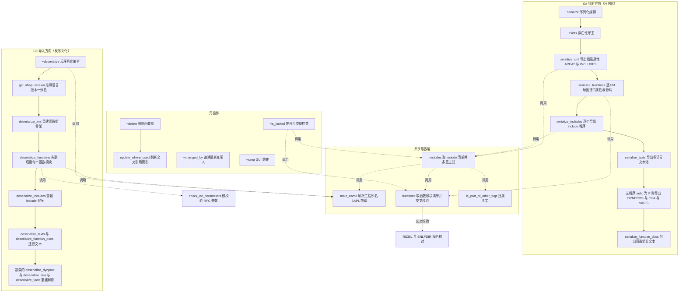
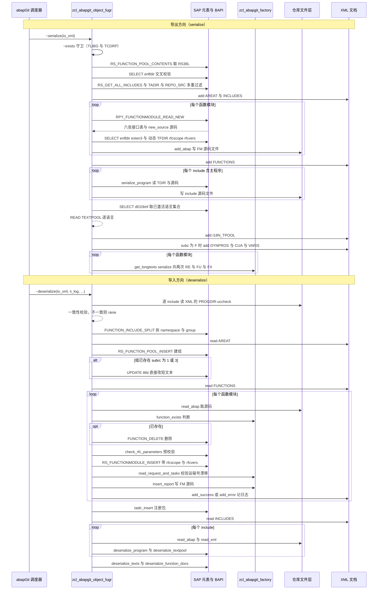

# zcl_abapgit_object_fugr 程序分析报告

## 一、程序定位与业务背景

先说清这个类站在什么位置。`zcl_abapgit_object_fugr` 是开源工具 **abapGit** 的对象适配层实现之一。abapGit 的核心命题是：把 SAP 系统里的开发对象（程序、类、函数组、表……）当作 Git 仓库里的文本文件来版本控制。

而 **FUGR（函数组）恰恰是最难搬、最容易被低估的对象类型**。在 SE80 里点开一个函数组，展开出来的是：主程序 `SAPL<组名>`、若干函数模块 include `L<组名>F0001…`、若干动态屏幕 `D<组名>001…`、`Z`/`S`/`T00` 类附加 include、CUA 动作、变量、文本池、STXH 长文本——属性散落在 `TLIBG`、`TLIBT`、`RS38L`、`RS38A`、`ENLFDIR`、`TFDIR`、`TFDIRT`、`TFDIRPARA`、`TFDIRDOC`、`D010TINF`、`D020T`、`EUDT`、`TADIR`、`REPOSRC`、`REPOTEXT`、`EUDB`、`STXH`/`DOCU` 等十几张表里。SAP 原生的迁移手段只有传输请求和归档，产物是二进制/混合编码，无法进 Git diff，也无法做 code review。

这个类就是 FUGR 的"适配器"：

- **导出方向**：把散落的属性还原成一个 Git 友好的目录结构（`data.abap` 里存 XML 属性，每个函数模块/include 一个 `.abap` 源码文件），全部落成可 diff 的文本。
- **导入方向**：反过来，从仓库重建函数组骨架、逐个函数模块、逐个 include、文本池、长文本、屏幕与 CUA。
- **周边元操作**：对象是否存在、是否被锁、谁最后改过、删除、在 SE80 里跳转。

**整体设计范式**：模板方法 + 工厂单例 + 实例状态缓存。本类继承 `zcl_abapgit_objects_program`，把"程序级"公共能力（`deserialize_program`、`deserialize_textpool`、`deserialize_dynpros`、`set_abap_language_version`、`strip_generation_comments`、`exists_a_lock_entry_for`、`get_metadata`、`is_active` 等）全部下沉到基类，只实现 FUGR 特有部分；所有外部依赖（XML 读写、文件存储、长文本、CTS API、report 服务、CTS 任务读取）一律通过 `zcl_abapgit_factory` 的单例获取，不直接 `NEW`。这是一种"接口即依赖注入点"的老派 OO 写法：可测试性靠接口，装配靠全局单例——耦合集中但调用点整洁。

一个先决的架构判断：**这个类没有自己的"流程入口"**，真正驱动它的是接口方法 `zif_abapgit_object~serialize` 与 `~deserialize`（由 abapGit 的调度器按对象类型分派调用）。所以下面的执行流程是"接口回调视角"，而不是"MAIN 开头、ENDPROGRAM 结尾"那种报表视角。

---

## 二、程序执行流程总览

整个类有三条主线：**导出（Git 方向）**、**导入（SAP 方向）**、**元操作（锁/删除/追溯/跳转）**。三条主线共享一组取数辅助方法（`main_name`、`functions`、`includes`），这也是本类最容易出问题的地方——同一份清单在不同主线里语义略有不同。



### 责任链表

| 子程序 | 调用者 | 职责 |
|---|---|---|
| `zif_abapgit_object~serialize` | abapGit 序列化调度器 | 导出总编排：串联全部子步骤并决定导出内容范围 |
| `zif_abapgit_object~exists` | `~serialize`、框架多处 | 存在性守卫，同时排除 CHDO 生成的伪函数组 |
| `main_name` | `includes`、`~deserialize`、`~serialize`、`~is_locked`、`~changed_by` | 由组名解析出主程序名 `SAPL<组名>` |
| `functions` | `~serialize`、`~deserialize`（间接）、`~is_locked`、`~jump`、`~changed_by` | 取函数模块清单，并用 `ENLFDIR` 交叉校验纠正 SAP 元表不一致 |
| `includes` | `~serialize`、`~delete`、`~is_locked`、`~jump` | 取 include 清单，剔除他人所有、自动维护、无激活版本的项 |
| `is_part_of_other_fugr` | `includes` | 判定某个 include 是否被其他函数组拥有 |
| `serialize_xml` | `~serialize` | 导出函数组短文本（`TLIBT-AREAT`）与 include 清单 |
| `serialize_functions` | `~serialize` | 逐 FM 读接口属性与源码，源码写入文件存储 |
| `serialize_includes` | `~serialize` | 逐 include 委托基类 `serialize_program` |
| `serialize_texts` | `~serialize` | 导出主程序的多语言文本池 |
| `serialize_function_docs` | `~serialize` | 导出组级与 FM 级、异常级 STXH 长文本 |
| `zif_abapgit_object~is_locked` | abapGit 冲突检测 | 聚合函数组/include/FM/屏幕/CUA/文本六类锁 |
| `zif_abapgit_object~deserialize` | abapGit 反序列化调度器 | 导入总编排 |
| `get_abap_version` | `~deserialize` | 遍历 include 推导 ABAP 语言版本，强制一致性 |
| `deserialize_xml` | `~deserialize` | 调用 `RS_FUNCTION_POOL_INSERT` 重建函数组骨架 |
| `update_func_group_short_text` | `deserialize_xml` | 组已存在时直接 UPDATE `TLIBT` 补写短文本 |
| `check_rfc_parameters` | `deserialize_functions` | 导入前预校验 RFC 参数兼容性，给用户友好报错 |
| `deserialize_functions` | `~deserialize` | 先删后建每个函数模块，落源码，记录日志 |
| `deserialize_includes` | `~deserialize` | 逐 include 委托基类重建程序、文本池 |
| `deserialize_texts` / `deserialize_function_docs` | `~deserialize` | 还原文本池与长文本 |
| `zif_abapgit_object~delete` | abapGit 删除流程 | 调 `RS_FUNCTION_POOL_DELETE` 删组 |
| `update_where_used` | `~delete` | 删除后刷新交叉引用索引 |
| `zif_abapgit_object~changed_by` | abapGit 历史视图 | 从 `REPOSRC`/`REPOTEXT`/`EUDB` 追溯最新变更人 |
| `zif_abapgit_object~jump` | abapGit GUI 跳转 | 把 FM 名或 include 名转成 PROG 对象跳转 SE80 |
| `zif_abapgit_object~get_deserialize_steps` | 框架 | 声明本对象需要 ABAP 与 LXE 两步反序列化 |

下面按这条流程，逐个子程序展开。

---

## 三、分组分析

### 3.1 类定义段（CONSTANTS / TYPES / DATA / METHODS 声明）

```abap
    CONSTANTS:
      c_longtext_id_prog     TYPE dokil-id VALUE 'RE',
      c_longtext_id_func     TYPE dokil-id VALUE 'FU',
      c_longtext_id_func_exc TYPE dokil-id VALUE 'FX'.

    DATA mt_includes_cache TYPE ty_sobj_name_tt .
    DATA mt_includes_all TYPE ty_sobj_name_tt .
```

**做什么** — 用三个常量固化 STXH/DOCU 的 `DOKIL-ID` 取值：程序长文本 `'RE'`、函数模块长文本 `'FU'`、FM 异常长文本 `'FX'`。另设两个实例状态：`mt_includes_cache` 缓存"要导出的 include 清单"，`mt_includes_all` 缓存"这个组的全部 include（含函数模块 include）"，后者只用于变更追溯。

**为什么** — 把 `DOKIL-ID` 提成常量是正确的：`'RE'/'FU'/'FX'` 是 SAP 长文本体系里最经典的三个坑位值，散落在序列化与反序列化两处（`serialize_function_docs`、`deserialize_function_docs`）各用一次，硬编码极易打错且拼写错时静默失败。两个状态成员分别服务"过滤后的清单"和"未过滤的清单"，说明作者清楚这两份数据语义不同。

**风险与改进** — 两个缓存都不失效。若同一实例先后被用于导出和变更追溯，或系统状态在两次调用之间发生变化，缓存会返回过期结果。建议在导出入口或导入入口显式 `FREE mt_includes_cache`，或把 cache 改成方法参数由调用方持有。另：`c_longtext_id_prog = 'RE'` 与 `deserialize_includes` 里对每个 include 调用的 `deserialize_program` 是两套路径，此处常量只覆盖"主程序"，需确认 include 的长文本是否另有安排（本类未实现 include 长文本导出，属功能缺口）。

---

接下来进入导出主线。

### 3.2 序列化编排 `zif_abapgit_object~serialize`

```abap
  METHOD zif_abapgit_object~serialize.

* function group SEUF
* function group SIFP
* function group SUNI

    DATA: lt_functions    TYPE ty_function_tt,
          ls_progdir      TYPE zif_abapgit_sap_report=>ty_progdir,
          lv_program_name TYPE syrepid,
          lt_dynpros      TYPE ty_dynpro_tt,
          ls_cua          TYPE ty_cua,
          lt_varis        TYPE ty_vari_tt.

    IF zif_abapgit_object~exists( ) = abap_false.
      RETURN.
    ENDIF

    serialize_xml( io_xml ).

    lt_functions = serialize_functions( ).

    io_xml->add( iv_name = 'FUNCTIONS'
                 ig_data = lt_functions ).

    serialize_includes( ).

    lv_program_name = main_name( ).

    ls_progdir = zcl_abapgit_factory=>get_sap_report( )->read_progdir( lv_program_name ).

    IF mo_i18n_params->is_lxe_applicable( ) = abap_false.
      serialize_texts(
        iv_prog_name = lv_program_name
        ii_xml       = io_xml ).
    ENDIF

    IF ls_progdir-subc = 'F'.
      lt_dynpros = serialize_dynpros( lv_program_name ).
      io_xml->add( iv_name = 'DYNPROS'
                   ig_data = lt_dynpros ).

      ls_cua = serialize_cua( lv_program_name ).
      io_xml->add( iv_name = 'CUA'
                   ig_data = ls_cua ).

      lt_varis = serialize_varis( lv_program_name ).
      io_xml->add( iv_name = 'VARIS'
                   ig_data = lt_varis ).
    ENDIF

    serialize_function_docs( iv_prog_name = lv_program_name
                             it_functions = lt_functions
                             ii_xml       = io_xml ).

  ENDMETHOD.
```

**做什么** — 作为导出总编排：① 先做存在性守卫，对象不存在则直接返回空；② 依次导出组级属性与 include 清单、函数模块接口与源码、include 程序源码、主程序多语言文本池；③ 只有当主程序子类型 `TRDIR-SUBC = 'F'`（即该函数组带自定义动态屏幕）时才导出 DYNPROS / CUA / VARIS；④ 最后导出长文本。

**为什么** — 编排顺序有讲究：`serialize_xml` 必须先跑，因为它把 `INCLUDES` 清单写进 XML，是后续所有 include 文件的"目录"；`serialize_functions` 必须先于 `serialize_function_docs`，因为长文本节点需要函数名清单来逐个写 `LONGTEXTS_<FUNCNAME>`；DYNPROS/CUA/VARIS 用 `subc = 'F'` 条件守卫，避免对纯函数型函数组做无意义取数。另一个亮点是 `zif_abapgit_object~exists( )` 用全限定接口名调用自身——如果直接写 `exists( )`，在继承 `zcl_abapgit_objects_program` 的场景下可能解析到基类同名方法，用 tilde 全限定名显式消歧，这是接口回调方法里防止递归/误绑的规范写法。

**风险与改进** — 方法头三行注释列出了 `SEUF`、`SIFP`、`SUNI` 三个 SAP 标准函数组，但代码里**没有任何过滤逻辑**，属于注释与实现脱节的遗留（可能是历史方案改掉了、注释没删）。另一个真实缺口：整个方法没有任何 TRY/CATCH，任何一个子步骤抛 `zcx_abapgit_exception` 都会让该对象导出整体失败，且此时 XML 已被部分写入——调用方拿到的是一份"半截"导出。建议在编排层统一包裹一次异常并转成日志，或让子步骤像 `deserialize_includes` 那样逐条容错。

---

### 3.3 存在性守卫 `zif_abapgit_object~exists`

```abap
  METHOD zif_abapgit_object~exists.

    DATA: lv_pool  TYPE tlibg-area.

    lv_pool = ms_item-obj_name.
    CALL FUNCTION 'RS_FUNCTION_POOL_EXISTS'
      EXPORTING
        function_pool   = lv_pool
      EXCEPTIONS
        pool_not_exists = 1.
    rv_bool = boolc( sy-subrc <> 1 ).

    " Skip FUGR generated by CHDO
    IF rv_bool = abap_true.
      SELECT SINGLE fgrp FROM tcdrp INTO lv_pool WHERE fgrp = lv_pool.
      IF sy-subrc = 0.
        rv_bool = abap_false.
      ENDIF
    ENDIF

  ENDMETHOD.
```

**做什么** — 两步判定：先调 `RS_FUNCTION_POOL_EXISTS` 查 `TLIBG`，再把结果转成布尔；如果函数组确实存在，再去 CHDO（变更文档）表 `TCDRP` 里查一次 `fgrp`，命中则视同"不存在"。

**为什么** — CHDO 对象会在 `TLIBG` 里留下同名"影子函数组"（用于把 CHDO 关联到程序组），但这些影子不是真正的开发对象，进 Git 没有意义也不能被 `RS_FUNCTION_POOL_INSERT` 正确重建。所以必须在框架统一的存在性判定里把它们屏蔽掉——这比在每个消费点各自判断干净得多。

**风险与改进** — 这里查的是 `TCDRP`，而 `zif_abapgit_object~delete` 里查的是 `TCDRP_S`（方法内写作 `tcdrps`）。**两处 CHDO 判定的数据源不一致**：一个走 `exists`（`TCDRP`）、一个走 `delete`（`TCDRP_S`）。两张表在语义上分别是 R/3 程序传输与程序变更记录的镜像，若某环境的 CHDO 影子只落在其中一张表，就会出现"exists 认为存在但 delete 会尝试删它"或"exists 屏蔽了但 delete 没屏蔽"的口径错位。建议抽成一个 `is_chdo_generated( )` 私有方法统一数据源，并在方法注释里写明为什么用这张表。

---

### 3.4 命名解析 `main_name`

```abap
    lv_area = ms_item-obj_name.

    CALL FUNCTION 'FUNCTION_INCLUDE_SPLIT'
      EXPORTING
        complete_area                = lv_area
      IMPORTING
        namespace                    = lv_namespace
        group                        = lv_group
      EXCEPTIONS
        include_not_exists           = 1
        ... 其余 9 个具体分支及 OTHERS = 12 略
        OTHERS                       = 12.
    IF sy-subrc <> 0.
      zcx_abapgit_exception=>raise_t100( ).
    ENDIF

    CONCATENATE lv_namespace 'SAPL' lv_group INTO rv_program.
```

**做什么** — 把函数组名（如 `GRP` 或 `/NS/GRP`）交给 `FUNCTION_INCLUDE_SPLIT` 拆成 namespace 与 group 两段，再按 `namespace + 'SAPL' + group` 拼出主程序名（`SAPLGRP` / `/NS/SAPLGRP`）。

**为什么** — `FUNCTION_INCLUDE_SPLIT` 是 SAP 提供的官方命名规则解析器，能正确区分客户组（首位 `L`）、退出组（首位 `X`）、命名空间对象三种形态。自己手写字符串切片很容易漏掉退出组或命名空间长度校验，这里选择复用 SAP 权威实现是正确取舍。

**风险与改进** — 两个问题：① `main_name` 被 `includes`、`deserialize_xml`、`~deserialize`、`~is_locked`、`~changed_by` 至少五处调用，每次都是一次 BAPI 式 CALL FUNCTION 的开销，且**没有像 `includes` 那样缓存**，在 `~is_locked` 里还会连带触发 `functions` 与 `includes` 的重取数，一次锁检查的 IO 成本被显著放大；② `EXCEPTIONS` 列了 11 个具体分支却全部折叠成 `raise_t100`，用户只会看到一条与组名无关的 SAP 消息，排障信息量低。建议缓存 `rv_program`，并至少把 `subrc` 写进异常消息。

---

### 3.5 函数模块清单 `functions`

```abap
    lv_area = ms_item-obj_name.

    CALL FUNCTION 'RS_FUNCTION_POOL_CONTENTS'
      EXPORTING
        function_pool           = lv_area
      TABLES
        functab                 = rt_functab
      EXCEPTIONS
        function_pool_not_found = 1
        OTHERS                  = 2.
    IF sy-subrc <> 0.
      zcx_abapgit_exception=>raise_t100( ).
    ENDIF

    " FM RS_FUNCTION_POOL_CONTENTS is not reliable if Function Group is inconsistent, so cross-check results (#7147)
    " Don't check active flag, or the includes become wrong (#7702)
    SELECT * FROM enlfdir
      INTO TABLE lt_enlfdir
      WHERE area = ms_item-obj_name
      ORDER BY funcname.                                  "#EC CI_SUBRC

    LOOP AT lt_enlfdir ASSIGNING <ls_enlfdir>.
      TRANSLATE <ls_enlfdir>-funcname TO UPPER CASE.
    ENDLOOP

    SORT lt_enlfdir BY funcname ASCENDING.

    "Remove anything not in FM attributes table
    LOOP AT rt_functab ASSIGNING <ls_functab>.
      TRANSLATE <ls_functab> TO UPPER CASE.
      lv_index = sy-tabix.
      READ TABLE lt_enlfdir WITH KEY funcname = <ls_functab>-funcname TRANSPORTING NO FIELDS.
      IF sy-subrc <> 0.
        DELETE rt_functab INDEX lv_index.
      ENDIF
    ENDLOOP

    SORT rt_functab BY funcname ASCENDING.
    DELETE ADJACENT DUPLICATES FROM rt_functab COMPARING funcname.
```

**做什么** — ① 调 `RS_FUNCTION_POOL_CONTENTS` 取 `RS38L` 视图里的函数模块清单；② 再 `SELECT * FROM enlfdir WHERE area = 组名` 取属性表清单；③ 对两个内表做大小写归一与排序；④ 用 `enlfdir` 作为基准，删掉 `RS38L` 里有但 `ENLFDIR` 里没有的条目；⑤ 最后按 funcname 排序并去重。

**为什么** — 注释直接点明了动机并挂了 issue 号（`#7147`、`#7702`）：`RS_FUNCTION_POOL_CONTENTS` 在**函数组元数据不一致**时（比如函数模块被手工改了组归属、或传输残留）会返回错误结果。而 `ENLFDIR` 是函数模块属性最权威的来源。所以这里选择"以 FM 返回为准，用 ENLFDIR 做减法校验"。第二条注释"不检查 active flag"也是血泪教训：如果加上 `r3state = 'A'`，会误删掉尚未激活但应该导出的 include。这种"把线上踩过的坑写成注释 + issue 号"的做法，是这段代码最有价值的部分。

**风险与改进** — 三处：① **单向过滤是错的**。当前只删掉"`RS38L` 有而 `ENLFDIR` 无"的项，但如果出现相反情况（`ENLFDIR` 有而 `RS38L` 无），这个函数模块会被**静默漏导出**。而 `includes` 正是靠 `functions` 的返回来决定"哪些 include 要从 include 清单里剔除"——一旦某个 FM 在这里被漏掉，它的 include 就会留在 include 清单里，被当作普通程序序列化，导入后**丢失函数模块接口定义**（参数、异常、文档全丢），只留下一个同名 include。这是本类最严重的联动风险。建议改成双向对称处理：对差集打 warning 并保留 FM，而不是静默丢弃。② `SELECT * FROM enlfdir` 取了全部列，实际只用 `funcname`，应投影取列。③ `lt_enlfdir` 是 `STANDARD TABLE`，`READ TABLE ... WITH KEY` 会退化为顺序扫描，外层再套 `LOOP AT rt_functab`，整体 O(n²)；函数模块数上百时明显拖慢导出。建议在循环前 `SORT lt_enlfdir` 后加 `BINARY SEARCH`，或改用 `HASHED TABLE`。④ `TRANSLATE <ls_functab> TO UPPER CASE` 对整个结构做转换，依赖 `rs38l_incl` 全字段均为字符型这一隐含前提，未来字段表若加入数值型会直接报错，脆弱。

---

### 3.6 include 清单 `includes`

这段方法超过 120 行，是**过滤规则最密集、也最脆弱**的地方，拆成五步看。

#### ① 缓存命中与初始取数

```abap
    IF lines( mt_includes_cache ) > 0.
      rt_includes = mt_includes_cache.
      RETURN.
    ENDIF

    lv_program = main_name( ).
    lt_functab = functions( ).

    CALL FUNCTION 'RS_GET_ALL_INCLUDES'
      EXPORTING
        program      = lv_program
      TABLES
        includetab   = rt_includes
      EXCEPTIONS
        not_existent = 1
        no_program   = 2
        OTHERS       = 3.
    IF sy-subrc <> 0.
      zcx_abapgit_exception=>raise( 'Error from RS_GET_ALL_INCLUDES' ).
    ENDIF

    LOOP AT lt_functab ASSIGNING <ls_func>.
      DELETE TABLE rt_includes FROM <ls_func>-include.
    ENDLOOP
```

**做什么** — 先查实例缓存，命中直接返回；否则解析主程序名、取函数模块清单，再用 `RS_GET_ALL_INCLUDES` 拿到主程序的全部 include，然后逐个删掉属于函数模块的 include（那些由 `serialize_functions` 单独处理）。

**为什么** — 缓存是合理的：`includes` 在 `~serialize` 里被 `serialize_xml` 和 `serialize_includes` 各调一次，在 `~is_locked`、`~delete`、`~jump` 里还会再被调，一次取数省下多次全库查询。而"剔除 FM include"这一步是职责划分的核心：FM include 有自己的接口元数据，不能当普通程序导。

**风险与改进** — 两个隐患。① **缓存永不失效**，且是实例级状态，同一对象实例的多次导出之间会串数据；更危险的是，如果第一次调用时组处于"元数据不一致"状态（`functions` 返回了截断清单），缓存下来的就是错误结果，后续所有步骤都在用这份错误清单。建议在导出/导入边界显式清空。② `DELETE TABLE rt_includes FROM <ls_func>-include` 是**按值删除**——如果 `RS_GET_ALL_INCLUDES` 返回的大小写与 `RS38L-INCLUDE` 不一致（一处大写、一处带尾空格），删除会静默失败，同一个 include 会被**既当 FM include 又被当普通 include 重复导出**。结合 `functions` 里对两个表分别做了 `TRANSLATE ... TO UPPER CASE` 而这里没做，这个风险是现实的。建议统一先对 `rt_includes` 做一次大小写归一。

#### ② 维护视图 include 名生成

```abap
* handle generated maintenance views
    IF ms_item-obj_name(1) <> '/'.
      "FGroup name does not contain a namespace
      lv_maintviewname = |L{ ms_item-obj_name }T00|.
    ELSE.
      "FGroup name contains a namespace
      lv_offset_ns = find( val = ms_item-obj_name+1
                            sub = '/' ).
      lv_offset_ns = lv_offset_ns + 2.
      lv_maintviewname = |{ ms_item-obj_name(lv_offset_ns) }L{ ms_item-obj_name+lv_offset_ns }T00|.
    ENDIF

    READ TABLE rt_includes WITH KEY table_line = lv_maintviewname TRANSPORTING NO FIELDS.
    IF sy-subrc <> 0.
      APPEND lv_maintviewname TO rt_includes.
    ENDIF
```

**做什么** — 表维护生成器（TMG）会给每个表维护函数组自动生成一个 `L<组名>T00` include。这里按"是否带命名空间"两种形态手工拼出这个 include 名，如果 `RS_GET_ALL_INCLUDES` 没返回它（新组还没生成过），就手工 append 进去，保证 T00 一定被导出。

**为什么** — 这是一个很典型的"防御性补全"：SAP 在函数组从未被打开生成屏幕时，`L<组名>T00` 可能不存在，但 Git 仓库里却需要它有稳定占位，否则导入时会因引用缺失而报语法错误。宁可多导一个空 include，也不要少。

**风险与改进** — 这段是**手写命名规则解析**，与 `main_name`/`is_part_of_other_fugr` 里的 `FUNCTION_INCLUDE_SPLIT` 形成两套并行实现，规则一变就要改三处。具体脆弱点：`find( val = ms_item-obj_name+1 sub = '/' )` 在找不到分隔符时返回 `0`，`0 + 2 = 2` 会让切片 `obj_name(2)` 得到两个字符的残片；命名空间长度若非标准（如 `/1NS/` 之类历史遗留命名）也会错位。建议统一委托给 `FUNCTION_INCLUDE_SPLIT`，命名规则只有一处真相源。

#### ③ 剔除"他人所有"的 include（含 XTI 与 TADIR 判定）

```abap
    SORT rt_includes.
    IF lines( rt_includes ) > 0.
      " check which includes have their own tadir entry
      SELECT obj_name
        INTO TABLE lt_tadir_includes
        FROM tadir
        FOR ALL ENTRIES IN rt_includes
        WHERE pgmid      = 'R3TR'
              AND object = 'PROG'
              AND obj_name = rt_includes-table_line.
      LOOP AT rt_includes ASSIGNING <lv_include>.
        " skip autogenerated includes from Table Maintenance Generator
        IF <lv_include> CP 'LSVIM*'.
          DELETE rt_includes INDEX sy-tabix.
          CONTINUE.
        ENDIF
        READ TABLE lt_tadir_includes WITH KEY table_line = <lv_include> TRANSPORTING NO FIELDS.
        IF sy-subrc = 0.
          DELETE rt_includes.
          CONTINUE.
        ENDIF
        IF strlen( <lv_include> ) = 33 AND <lv_include>+30(3) = 'XTI'.
          "ignore referenced (simple) transformation includes
          DELETE rt_includes.
          CONTINUE.
        ENDIF
      ENDLOOP
```

**做什么** — 先用 `FOR ALL ENTRIES` 从 `TADIR` 批量查出哪些 include 有自己的 `PROG` 条目；然后循环里三层剔除：`LSVIM*`（TMG 自动生成）、在 `TADIR` 里有自己条目的（属于别的包或被多个程序共享）、以及长度 33 且后缀为 `XTI` 的（引用型 simple transformation include）。

**为什么** — 这是 abapGit 处理对象边界的精髓：**一个 include 是否属于"这个 FUGR"，不是看它被谁引用，而是看它在 `TADIR` 里的注册归属**。注释写得很清楚——这些 include 可能在别的包里、可能被多个函数组共享，它们会在各自包序列化时被单独处理，FUGR 不应重复持有。`LSVIM*` 是 TMG 生成的临时 include，进 Git 只会制造噪音。

**风险与改进** — 删除方式混用：循环前半段用 `DELETE rt_includes INDEX sy-tabix` + `CONTINUE`，后半段用 `DELETE rt_includes` + `CONTINUE`。在 `LOOP AT ... ASSIGNING <lv_include>` 中裸用 `DELETE` 是高危模式——一旦某处漏掉 `CONTINUE`，字段符号就会指向已删除行，后续访问直接崩溃。当前每处都配了 `CONTINUE` 所以是安全的，但这种"靠人肉记住要写 CONTINUE"的模式非常脆弱，建议统一改成 `DELETE TABLE rt_includes INDEX sy-tabix`。另一个真实边界：`strlen( <lv_include> ) = 33` 是硬编码长度，`LSVIM*` 用 `CP` 通配（这是 `CP` 的正确用法，值得肯定），但 XTI 判定依赖"33 字符"这一 SAP 命名约束，任何变长命名都会漏判。

#### ④ 剔除无激活版本的 include

```abap
      IF lines( rt_includes ) > 0.
        SELECT progname FROM reposrc
          INTO TABLE lt_reposrc
          FOR ALL ENTRIES IN rt_includes
          WHERE progname = rt_includes-table_line
          AND r3state = 'A'.
      ENDIF
      SORT lt_reposrc BY progname ASCENDING.
    ENDIF

    LOOP AT rt_includes ASSIGNING <lv_include>.
      lv_tabix = sy-tabix.

* make sure the include exists
      READ TABLE lt_reposrc INTO ls_reposrc
        WITH KEY progname = <lv_include> BINARY SEARCH.
      IF sy-subrc <> 0.
        DELETE rt_includes INDEX lv_tabix.
        CONTINUE.
      ENDIF

      "Make sure that the include does not belong to another function group
      IF is_part_of_other_fugr( <lv_include> ) = abap_true.
        DELETE rt_includes.
      ENDIF
    ENDLOOP
```

**做什么** — 只查 `REPO_SRC` 中 `R3STATE = 'A'`（已激活）的 include，用 `BINARY SEARCH` 逐个比对；查不到的直接从清单里删掉。再对剩余每个 include 调 `is_part_of_other_fugr` 排除归属他人的项。

**为什么** — `BINARY SEARCH` 前面配了 `SORT lt_reposrc`，是全文件里少见的正确写法（有序内表 + 二分）。只取 `REPO_SRC` 而不是 `DIRC/TDIR`，是因为要验证的是"真的有源代码"而非"只是有个目录条目"。

**风险与改进** — **`R3STATE = 'A'` 这一行是全类最值得商榷的过滤条件**。它的后果是：一个**只有非激活版本**的 include 会被静默从导出清单里剔除。场景很现实——开发人员在 DEV 里新建了一个 include 还没激活，或激活版本因故被删除，此时用 abapGit 导出，这个 include 就**不会进入 Git**；再导入时该 include 永久丢失，且**没有任何日志提示**。这是数据静默丢失，比报错糟糕得多。建议：至少打一条 warning，或改成查 `R3STATE` 全状态并记录激活情况。另外这一段整体套在 `IF lines( rt_includes ) > 0` 里，但 `lt_reposrc` 在方法顶部声明，作用域没问题——只是嵌套层级已经 4 层，可读性明显下降。

#### ⑤ 收尾：补主程序并写缓存

```abap
    APPEND lv_program TO rt_includes.
    SORT rt_includes.

    mt_includes_cache = rt_includes.
```

**做什么** — 把主程序 `SAPL<组名>` 本身 append 进清单（`RS_GET_ALL_INCLUDES` 只返回 include，不含主程序），排序后写入实例缓存。

**为什么** — 主程序的源码、TDIR、文本池都是 FUGR 导出的一部分，必须显式补上；`serialize_includes` 会对清单里每一项（包括主程序）调 `serialize_program`。

**风险与改进** — 若 `lv_program` 已经存在于 `rt_includes`（理论上不可能，但函数组名与某 include 名极端巧合时会出现），会产生重复行，导致主程序被序列化两次。加一行 `READ TABLE ... TRANSPORTING NO FIELDS` 守卫成本极低。

---

### 3.7 归属判定 `is_part_of_other_fugr`

```abap
  METHOD is_part_of_other_fugr.
    " make sure that the include belongs to the function group
    " like in LSEAPFAP Form TADIR_MAINTENANCE
    DATA ls_tadir TYPE tadir.
    DATA lv_namespace TYPE rs38l-namespace.
    DATA lv_function_group TYPE rs38l-area.
    DATA lv_include TYPE rs38l-include.
    DATA ls_item_key TYPE zif_abapgit_definitions=>ty_item.

    rv_belongs_to_other_fugr = abap_false.
    IF iv_include(1) = 'L' OR iv_include+1 CS '/L'.
      lv_include = iv_include.
      ls_tadir-object = 'FUGR'.

      CALL FUNCTION 'FUNCTION_INCLUDE_SPLIT'
        IMPORTING
          namespace = lv_namespace
          group     = lv_function_group
        CHANGING
          include   = lv_include
        EXCEPTIONS
          OTHERS    = 1 ##FM_SUBRC_OK.

      IF lv_function_group(1) = 'X'.    " "EXIT"-function-module
        ls_tadir-object = 'FUGS'.
      ENDIF

      IF sy-subrc = 0.

        CONCATENATE lv_namespace lv_function_group INTO ls_tadir-obj_name.
        ls_item_key-obj_type = ls_tadir-object.
        ls_item_key-obj_name = ls_tadir-obj_name.

        " compare complete tadir key to distinguish between regular and exit function groups
        IF ( ls_tadir-obj_name <> ms_item-obj_name OR ls_tadir-object <> ms_item-obj_type ) AND
           zcl_abapgit_objects=>exists( ls_item_key ) = abap_true.
          rv_belongs_to_other_fugr = abap_true.
        ENDIF
      ENDIF

    ENDIF

  ENDMETHOD.
```

**做什么** — 只处理以 `L` 开头（客户组）或包含 `/L`（命名空间客户组）的 include：先调 `FUNCTION_INCLUDE_SPLIT` 反推出它属于哪个函数组（含退出组 `X` 前缀），若推出的组与本对象不同、且那个组在 abapGit 里确实存在，就判定"归属他人"。

**为什么** — 注释直白地说明是**模仿 SAP 自己的实现**（`LSEAPFAP` 里的 `FORM TADIR_MAINTENANCE`）。判定条件用了完整的 TADIR 键（`obj_type` + `obj_name` 双字段），注释专门点出这是为了区分普通函数组 `FUGR` 与退出函数组 `FUGS`——只比 `obj_name` 会把退出组与普通组混淆。这是本方法最容易做错的细节，作者做对了。

**风险与改进** — 三个：① **只认 `L` 开头**。`Z` 开头（客户自建的类 include）、`D` 开头（动态屏幕）、`S`/`T00` 维护视图、`XSL`/`XTP`（simple transformation）等命名形态全部不进入判定，直接返回 `abap_false`。其中动态屏幕 `D<组名>nnn` 属于本组、不该被删，所以不算错；但**被别的程序引用进来的 `Z` include 会被误纳入导出**，造成对象边界污染。② `FUNCTION_INCLUDE_SPLIT` 的错误被 `OTHERS = 1 ##FM_SUBRC_OK` 静默吞掉，然后用 `IF sy-subrc = 0` 兜底——解析失败时 `lv_namespace`/`lv_function_group` 保持初值，后续比较用空值，最终静默返回 `abap_false`。对"解析失败"这一状态缺乏显式处理。③ 每个 include 都要 `READ TABLE` 到 `FUNCTION_INCLUDE_SPLIT` 一次，`includes` 里又是逐个调用，`includes` → `is_part_of_other_fugr` 的整体复杂度是 O(n) 次 CALL FUNCTION，对 include 较多的组是明显开销，可考虑用 `RS38L`/`RS38A` 一次批量取数替代。

---

以上取数层准备完毕，回到导出主线。

### 3.8 顶层属性导出 `serialize_xml`

```abap
    SELECT SINGLE areat INTO lv_areat
      FROM tlibt
      WHERE spras = mv_language
      AND area = ms_item-obj_name.        "#EC CI_GENBUFF "#EC CI_SUBRC

    lt_includes = includes( ).

    ii_xml->add( iv_name = 'AREAT'
                 ig_data = lv_areat ).
    ii_xml->add( iv_name = 'INCLUDES'
                 ig_data = lt_includes ).
```

**做什么** — 从 `TLIBT`（函数组短文本表）按语言 `mv_language` 取组短文本，同时取 include 清单，两者分别以 `AREAT` 和 `INCLUDES` 节点写进 XML。

**为什么** — 这两个节点构成交付物的"索引头"：`INCLUDES` 告诉导入端要写哪些程序，`AREAT` 是组级显示文本。放在序列化最前面，与导入端 `deserialize_xml` 的最前面严格对称，形成清晰的协议约定。`#EC CI_GENBUFF` 抑制 `SELECT SINGLE` 缺少缓冲区的警告——单次取一行确实无需行缓冲，这个抑制是合理且规范的。

**风险与改进** — `mv_language` 在这里充当"导出语言"。如果这个语言下函数组短文本从未维护（比如 ZH 环境里从没维护过中文短文本），`lv_areat` 就是初值，`SELECT` 的 `#EC CI_SUBRC` 也明确忽略了没找到的情况——导出结果里 `AREAT` 节点为空，导入时会把短文本置空。**"缺失"被当成"空值"处理，静默丢失短文本**。建议在取不到时回退到 `SY-LANGU` 或 `'EN'` 再取一次，或至少记录日志。另：`tlibt` 的 `AREA` 字段长度与 `SOBJ_NAME` 是否完全一致没有校验，`ms_item-obj_name` 若有尾空格会取不到。

---

### 3.9 函数模块导出 `serialize_functions`

#### ① 读接口与源码

```abap
    lt_functab = functions( ).

    LOOP AT lt_functab ASSIGNING <ls_func>.
* fm RPY_FUNCTIONMODULE_READ does not support source code
* lines longer than 72 characters
      CLEAR ls_function.
      MOVE-CORRESPONDING <ls_func> TO ls_function.

      CLEAR lt_new_source.
      CLEAR lt_source.

      CALL FUNCTION 'RPY_FUNCTIONMODULE_READ_NEW'
        EXPORTING
          functionname            = <ls_func>-funcname
        IMPORTING
          global_flag             = ls_function-global_flag
          remote_call             = ls_function-remote_call
          update_task             = ls_function-update_task
          short_text              = ls_function-short_text
          remote_basxml_supported = ls_function-remote_basxml
        TABLES
          import_parameter        = ls_function-import
          changing_parameter      = ls_function-changing
          export_parameter        = ls_function-export
          tables_parameter        = ls_function-tables
          exception_list          = ls_function-exception
          documentation           = ls_function-documentation
          source                  = lt_source
        CHANGING
          new_source              = lt_new_source
        EXCEPTIONS
          error_message           = 1
          function_not_found      = 2
          invalid_name            = 3
          OTHERS                  = 4.
      IF sy-subrc = 2.
        CONTINUE.
      ELSEIF sy-subrc <> 0.
        zcx_abapgit_exception=>raise( 'Error from RPY_FUNCTIONMODULE_READ_NEW' ).
      ENDIF
```

**做什么** — 先取 FM 清单，然后逐个调 `RPY_FUNCTIONMODULE_READ_NEW`，一次调用同时拿到接口全量（import/export/tables/changing/exception/documentation 六张参数表）与源码（`source` 与 `new_source` 两个版本），映射进自定义结构 `ty_function` 的一条记录里。

**为什么** — 用 `RPY_FUNCTIONMODULE_READ_NEW` 而不是老的 `RPY_FUNCTIONMODULE_READ`，注释给出了精确理由：**老版本 FM 不支持超过 72 字符的源码行**。现代 ABAP（尤其带 `WRITE /CONCATENATE` 内联字符串、长内联方法调用的代码）行长度早已超过 72，用老 FM 会截断源码——那是**静默的数据损坏**。而 `RPY_..._NEW` 同时提供 `new_source`（`RSFB_SOURCE` 结构，74 字符行 + 行尾标记，支持现代语法）与 `source`（72 字符老格式），两者都要。这是全文件里对"版本差异导致的隐性数据丢失"处理得最到位的一处。

**风险与改进** — `sy-subrc = 2`（`function_not_found`）走 `CONTINUE` 静默跳过，其他错误则抛异常。这个分支选择是对的（`functions` 交叉校验已经过滤过，但并发删除场景下仍可能出现），但**完全不打日志**，用户无从得知哪个 FM 被跳过了。建议 `CONTINUE` 前加一条 warning。另一个观察：`MOVE-CORRESPONDING <ls_func> TO ls_function` 之后立刻又被 `IMPORTING` 的返回值覆盖同名字段（`global_flag`、`remote_call` 等），这两次赋值是重复的——`<ls_func>` 里那些字段本就已被 import 参数覆盖，`MOVE-CORRESPONDING` 只应保留 `funcname`/`include` 等未被覆盖的字段。功能上无害，但语义上让人怀疑作者是否清楚哪些字段来自哪里。

#### ② 文档索引归零

```abap
      LOOP AT ls_function-documentation ASSIGNING <ls_documentation>.
        CLEAR <ls_documentation>-index.
      ENDLOOP
```

**做什么** — 遍历参数文档表，把每条的 `index` 字段清空。

**为什么** — `index` 是 `RSFDO` 里表示"参数在接口中的序号"的展示用字段。不清空的话，不同 FM 之间序列化时会带着各自的序号信息，而**序号会随接口变动**（新增/删除参数），把易变的展示序号存进 Git 会让 diff 噪音爆炸，也会在导入时把错误的序号写回去。这是很老练的"消除易变元数据"手法。

**风险与改进** — 清空后导入端会重新生成序号，但如果导入顺序或接口定义与导出时不同，重建的序号可能不一致。属于可接受范围，无明显风险。

#### ③ 补齐版本相关字段

```abap
      SELECT SINGLE exten3 INTO ls_function-exception_classes FROM enlfdir
        WHERE funcname = <ls_func>-funcname.              "#EC CI_SUBRC

      " Scope and Interface Contract only for 7.55 or higher
      TRY.
          SELECT SINGLE rfcscope rfcvers INTO CORRESPONDING FIELDS OF ls_function FROM ('TFDIR')
            WHERE funcname = <ls_func>-funcname.          "#EC CI_SUBRC
        CATCH cx_sy_dynamic_osql_semantics ##NO_HANDLER.
      ENDTRY
```

**做什么** — 补两个 `RPY_FUNCTIONMODULE_READ_NEW` 不返回的字段：从 `ENLFDIR-EXTEN3` 取"异常类处理"标志，从 `TFDIR` 动态表取 `RFCSOPE`/`RFCSVRS`（7.55 才有的 Scope 与 Interface Contract 字段）。

**为什么** — 这两处都是"BAPI 覆盖不到的边角属性"。特别是 `FROM ('TFDIR')` 这个**动态表名**写法：`TFDIR-RFCSOPE`/`RFCSVRS` 在 7.55 以下根本不存在，静态写 `FROM tfdir` 会在**编译期**就失败，导致整个类在低版本系统上无法激活。用动态表名把编译期错误推迟到运行期，再用 `TRY/CATCH cx_sy_dynamic_osql_semantics` 优雅降级——这是 ABAP 里做"字段级向后兼容"的教科书写法，`##NO_HANDLER` 明确声明不处理，干净利落。

**风险与改进** — ① `SELECT SINGLE exten3 INTO ls_function-exception_classes`：**`ENLFDIR-EXTEN3` 是字符字段，`exception_classes` 声明为 `abap_bool`（即 `C 1`，合法值为 `'X'`/`' '`）**。这里直接靠隐式转换赌"两者长度相同"，但**长度相同不等于语义相同**。如果 `EXTEN3` 实际存储 `'1'`/`'0'` 或 `'A'`/`'B'` 之类取值，赋给 `abap_bool` 时会把非 `'X'` 的值统统转成 `abap_false`，导致"异常类处理"属性**静默丢失**且无警告。这正是需要语义校核而不是长度校核的地方——建议改成 `SELECT SINGLE ... INTO ls_exten3 ...` 后显式 `ls_function-exception_classes = boolc( ls_exten3 = '<实际真值>' )`，并在注释里写明 `EXTEN3` 的取值含义。② 动态表名写法本身在 `ABAP` 静态检查（`#EC`/SICF）里无法验证字段存在性，7.55 以下运行时 `SELECT` 会抛异常被吞掉——这是**有意的降级**，但代价是低版本导出会静默缺两个字段，建议在方法注释里写明"低版本导出的 FUGR 不支持 Scope/Interface Contract"。

---

### 3.10 include 导出 `serialize_includes`

```abap
    lt_includes = includes( ).

    LOOP AT lt_includes ASSIGNING <lv_include>.

* todo, filename is not correct, a include can be used in several programs
      serialize_program( is_item    = ms_item
                         io_files   = mo_files
                         iv_program = <lv_include>
                         iv_extra   = <lv_include> ).

    ENDLOOP
```

**做什么** — 遍历 include 清单（含主程序），对每一项委托基类 `serialize_program` 导出源码与属性，`iv_extra` 用 include 名本身作为文件名后缀。

**为什么** — 这里体现模板方法的价值：本类完全不关心"一个程序怎么读 TDIR/源码/写文件"，全部下沉给基类，自己只负责"哪些程序属于这个 FUGR"。职责边界非常清晰。

**风险与改进** — 方法里那句 `* todo, filename is not correct, a include can be used in several programs` 是作者亲笔留下的已知债务：include 名在多程序间可能重名，按 include 名做文件名在跨对象场景下会撞名。但结合 3.6 里"剔除 `TADIR` 里有自己条目的 include"的过滤，**这个 TODO 实际已经被上游逻辑大幅缓解了**——凡是可能被共享的 include 已被剔除。建议要么更新这条注释说明现有过滤已覆盖，要么补上真正的全局重名检测，别让它作为悬而未决的 TODO 一直挂着。

---

### 3.11 多语言文本池导出 `serialize_texts`

```abap
    IF mo_i18n_params->ms_params-main_language_only = abap_true.
      RETURN.
    ENDIF

    " Table d010tinf stores info. on languages in which program is maintained
    " Select all active translations of program texts
    " Skip main language - it was already serialized
    SELECT DISTINCT language
      INTO CORRESPONDING FIELDS OF TABLE lt_tpool_i18n
      FROM d010tinf
      WHERE r3state = 'A'
      AND prog = iv_prog_name
      AND language <> mv_language
      ORDER BY language ##TOO_MANY_ITAB_FIELDS.

    mo_i18n_params->trim_saplang_keyed_table(
      EXPORTING
        iv_lang_field_name = 'LANGUAGE'
      CHANGING
        ct_tab             = lt_tpool_i18n ).

    SORT lt_tpool_i18n BY language ASCENDING.
    LOOP AT lt_tpool_i18n ASSIGNING <ls_tpool>.
      READ TEXTPOOL iv_prog_name
        LANGUAGE <ls_tpool>-language
        INTO lt_tpool.
      <ls_tpool>-textpool = add_tpool( lt_tpool ).
    ENDLOOP

    ii_xml->add( iv_name = 'I18N_TPOOL'
                 ig_data = lt_tpool_i18n ).
```

**做什么** — ① 若启用"仅主语言"模式则直接返回；② 从 `D010TINF`（文本池信息表）取该程序所有**已激活**且**非主语言**的语言列表；③ 用 i18n 参数做裁剪（只保留被允许的语言）；④ 逐个 `READ TEXTPOOL` 读原文本池并经 `add_tpool` 转换后挂到结构上；⑤ 以 `I18N_TPOOL` 节点写入 XML。

**为什么** — 三个设计点都值得肯定：主语言文本池在别处单独序列化，这里**显式排除主语言**（`language <> mv_language`），避免重复；`D010TINF` 比 `TDIR` 更准确——它才是"该程序实际维护过哪些语言文本池"的真相源；`trim_saplang_keyed_table` 把语言裁剪策略抽到 i18n 参数对象里，而不是硬编码在这里。这三点合起来让国际化逻辑收敛、可配置。

**风险与改进** — ① `READ TEXTPOOL ... INTO lt_tpool` 在某个语言实际没有文本池时会报语法错误级别的问题或返回空内表，这里**没有 TRY/CATCH 也没有判空**，一旦 `D010TINF` 有记录但文本池数据缺失（元数据不一致），整个 `serialize_texts` 会抛异常，连带整个 FUGR 导出失败——而这是最不该被拖下水的步骤。② 与 3.6 ④ 同样存在 `R3STATE = 'A'` 只取激活版本的取舍，未激活的翻译文本池不会进仓库。③ `##TOO_MANY_ITAB_FIELDS` 抑制是合规的（`INTO CORRESPONDING FIELDS` + `DISTINCT language` 的组合确实会触发该警告）。

---

### 3.12 长文本导出 `serialize_function_docs`

```abap
    zcl_abapgit_factory=>get_longtexts( )->serialize(
      iv_longtext_id = c_longtext_id_prog
      iv_object_name = iv_prog_name
      io_i18n_params = mo_i18n_params
      ii_xml         = ii_xml ).

    LOOP AT it_functions ASSIGNING <ls_func>.
      zcl_abapgit_factory=>get_longtexts( )->serialize(
        iv_longtext_name = |LONGTEXTS_{ <ls_func>-funcname }|
        iv_longtext_id   = c_longtext_id_func
        iv_object_name   = <ls_func>-funcname
        io_i18n_params   = mo_i18n_params
        ii_xml           = ii_xml ).
      zcl_abapgit_factory=>get_longtexts( )->serialize(
        iv_longtext_name = |LONGTEXTS_{ <ls_func>-funcname }___EXC|
        iv_longtext_id   = c_longtext_id_func_exc
        iv_object_name   = <ls_func>-funcname
        io_i18n_params   = mo_i18n_params
        ii_xml           = ii_xml ).
    ENDLOOP
```

**做什么** — 先导出程序级长文本（`DOKIL-ID = 'RE'`），再对每个函数模块导出两份：函数模块本身的文档（`'FU'`，节点名 `LONGTEXTS_<FM名>`）与该 FM 的异常文档（`'FX'`，节点名 `LONGTEXTS_<FM名>___EXC`）。

**为什么** — 长文本不走源码文件而走 XML 节点，是因为长文本是多语言结构，天然适合结构化表达。`___EXC` 这个自定义后缀是 abapGit 自己造的命名空间——同一个 FM 名在 XML 里既要做程序级文档又要做异常文档，必须靠后缀区分，这是很务实的工程妥协。用工厂获取 `get_longtexts` 而非直接 `NEW`，保持了依赖注入一致性。

**风险与改进** — ① 每个 FM 两次 `serialize`，一次全是一次 SQL/数据库读取；函数模块上百的组这里就是几百次 IO，没有任何批量优化。② **完全没有 TRY/CATCH**：任何一个 FM 的长文本读取失败都会让整次导出失败。对比 `deserialize_includes` 是逐条 try/catch 容错的——**同一类里"逐条容错"与"一处崩溃"两种策略并存**，这是健壮性设计不一致的典型表现。③ 节点名硬编码了 `LONGTEXTS_` 前缀与 `___EXC` 后缀，导入端 `deserialize_function_docs` 必须**字面一致**地拼同一串（它确实做到了），但这种双向字符串约定没有任何常量约束，任一侧改字面量就会静默失配。建议提为类常量。

---

锁与元信息是导出之外的横切能力。

### 3.13 锁检查聚合 `zif_abapgit_object~is_locked`

```abap
    lv_program = main_name( ).

    IF is_function_group_locked( )        = abap_true
    OR is_any_include_locked( )           = abap_true
    OR is_any_function_module_locked( )   = abap_true
    OR is_any_dynpro_locked( lv_program ) = abap_true
    OR is_cua_locked( lv_program )        = abap_true
    OR is_text_locked( lv_program )       = abap_true.

      rv_is_locked = abap_true.

    ENDIF
```

三个子方法：

```abap
  METHOD is_function_group_locked.
    rv_is_functions_group_locked = exists_a_lock_entry_for( iv_lock_object = 'EEUDB'
                                                            iv_argument    = ms_item-obj_name
                                                            iv_prefix      = 'FG' ).
  ENDMETHOD.

  METHOD is_any_include_locked.
    TRY.
        lt_includes = includes( ).
      CATCH zcx_abapgit_exception.
        RETURN.
    ENDTRY

    LOOP AT lt_includes ASSIGNING <lv_include>.
      IF exists_a_lock_entry_for( iv_lock_object = 'ESRDIRE'
                                  iv_argument    = |{ <lv_include> }| ) = abap_true.
        rv_is_any_include_locked = abap_true.
        EXIT.
      ENDIF
    ENDLOOP
  ENDMETHOD.

  METHOD is_any_function_module_locked.
    TRY.
        lt_functions = functions( ).
      CATCH zcx_abapgit_exception.
        RETURN.
    ENDTRY

    LOOP AT lt_functions ASSIGNING <ls_function>.
      IF exists_a_lock_entry_for( iv_lock_object = 'ESFUNCTION'
                                  iv_argument    = |{ <ls_function>-funcname }| ) = abap_true.
        rv_any_function_module_locked = abap_true.
        EXIT.
      ENDIF
    ENDLOOP
  ENDMETHOD.
```

**做什么** — 聚合六类锁：函数组（锁对象 `EEUDB`、参数前缀 `FG`）、include（`ESRDIRE`）、函数模块（`ESFUNCTION`）、动态屏幕、CUA、文本池。任一命中即判定该对象被锁。后两个锁以及 `exists_a_lock_entry_for` 本身由基类提供，本类只提供三个专属检查。

**为什么** — 两个亮点：① `EEUDB` + `iv_prefix = 'FG'` 的组合是精妙的——`EUDL` 里同一把锁对象的参数名是 `FG<组名>` 形式，不带上前缀 `FG` 会匹配到无关对象，这个细节容易翻车。② `is_any_include_locked` 与 `is_any_function_module_locked` 都在 TRY/CATCH 里包住了取数方法，**取数失败时返回"未锁"**——这是一个刻意的降级策略：abapGit 检查锁的目的是提示冲突，而不是阻断流程，取数失败时宁可少报一次锁。三个方法都用 `EXIT` 提前退出，`includes`/`functions` 也做了缓存，成本控制得当。

**风险与改进** — ① **`is_function_group_locked` 不在 TRY 里**，而它同级的两个兄弟方法都在。若 `exists_a_lock_entry_for` 内部抛异常，整个 `~is_locked` 会向上抛出，与兄弟方法"失败即返回未锁"的策略不一致。建议统一包裹。② 更实质的问题：**"取数失败 → 报未锁"这个降级方向是反的**。锁检查的语义是"是否安全"，失败时应当**悲观地报"可能已锁"**，否则会告诉用户"这个对象没被锁，可以提交"，实际却被别人锁着——这是**危险的方向**。建议 catch 里返回 `abap_true`（或抛出带提示的异常）。③ 每次锁检查都触发 `main_name` + `functions` + `includes` + 每个 include 一次锁表查询，在 abapGit 需要批量检查对象锁的场景下开销被放大。

---

下面切换到导入主线。

### 3.14 反序列化编排 `zif_abapgit_object~deserialize`

```abap
    lv_abap_version = get_abap_version( io_xml ).

    deserialize_xml(
      ii_xml       = io_xml
      iv_version   = lv_abap_version
      iv_package   = iv_package
      iv_transport = iv_transport ).

    io_xml->read( EXPORTING iv_name = 'FUNCTIONS'
                  CHANGING  cg_data = lt_functions ).

    deserialize_functions(
      it_functions = lt_functions
      ii_log       = ii_log
      iv_version   = lv_abap_version
      iv_package   = iv_package
      iv_transport = iv_transport ).

    deserialize_includes(
      ii_xml     = io_xml
      iv_package = iv_package
      ii_log     = ii_log ).

    lv_program_name = main_name( ).

    IF mo_i18n_params->is_lxe_applicable( ) = abap_false.
      deserialize_texts( iv_prog_name = lv_program_name
                         ii_xml       = io_xml ).
    ENDIF

    io_xml->read( EXPORTING iv_name = 'DYNPROS'
                  CHANGING  cg_data = lt_dynpros ).

    deserialize_dynpros( lt_dynpros ).

    io_xml->read( EXPORTING iv_name = 'CUA'
                  CHANGING  cg_data = ls_cua ).

    deserialize_cua( iv_program_name = lv_program_name
                     is_cua          = ls_cua ).

    io_xml->read( EXPORTING iv_name = 'VARIS'
                  CHANGING  cg_data = lt_varis ).

    deserialize_varis( iv_program_name = lv_program_name
                       it_varis        = lt_varis ).

    deserialize_function_docs(
      iv_prog_name = lv_program_name
      it_functions = lt_functions
      ii_xml       = io_xml ).
```

**做什么** — ① 先推导 ABAP 语言版本；② 用 `RS_FUNCTION_POOL_INSERT` 重建函数组骨架（必须在任何 FM 之前，否则 `function_pool` 无效）；③ 从 XML 读 `FUNCTIONS` 节点并逐个重建函数模块；④ 重建 include 程序与文本池；⑤ 多语言文本池还原（受 LXE 开关控制）；⑥ 屏幕、CUA、变量还原；⑦ 最后还原长文本。

**为什么** — 顺序约束体现得很到位：函数组骨架 → 函数模块 → include → 屏幕 → 长文本，严格遵循 SAP 对象依赖方向（FM 必须挂在已存在的组上，长文本依附于已存在的对象）。而 `is_lxe_applicable( ) = abap_false` 这个守卫与导出端完全对称——LXE（跨语言增强）启用时，文本池由 `lxe` 步骤单独处理，不走 `deserialize_texts`，**导出与导入两侧一致地跳过同一块**，这种对称性是本类国际化处理的可靠性基础。

**风险与改进** — ① **所有 `io_xml->read` 都无保护**：仓库里若缺少 `FUNCTIONS`/`DYNPROS`/`CUA`/`VARIS` 节点（比如从旧版 abapGit 升级的仓库，或者手工裁剪过 `data.abap`），`read` 会静默返回空，后续步骤在空表上跑——结果是"导入成功但内容残缺"，比报错糟糕。建议在编排层对关键节点做存在性校验。② 整个方法**无 TRY/CATCH**，任一步抛异常即整体失败，且**没有事务边界控制**——注意 `deserialize_xml` 与 `deserialize_functions` 都会直接写 `TLIBG`/`TFDIR`/`REPO_SRC`，中途失败会留下"组已建、部分 FM 已建、include 未建"的半成品状态。对比 `deserialize_functions` 内部是逐 FM 容错的，编排层却完全没有补偿逻辑。③ `deserialize_texts` 在 `deserialize_includes` 之后，但 `deserialize_texts` 处理的是**主程序**的文本池，主程序本身在 `deserialize_includes` 里已被 `serialize_program` 对应的反序列化路径写入，顺序上没问题；不过这种"主程序文本池夹在 include 与屏幕之间"的编排顺序，可读性上会让人怀疑是不是位置放错了。

---

### 3.15 语言版本推导 `get_abap_version`

```abap
    ii_xml->read( EXPORTING iv_name = 'INCLUDES'
                  CHANGING  cg_data = lt_includes ).

    LOOP AT lt_includes ASSIGNING <lv_include>.

      lo_xml = mo_files->read_xml( <lv_include> ).

      lo_xml->read( EXPORTING iv_name = 'PROGDIR'
                    CHANGING  cg_data = ls_progdir ).

      IF ls_progdir-uccheck IS INITIAL.
        CONTINUE.
      ELSEIF rv_abap_version IS INITIAL.
        rv_abap_version = ls_progdir-uccheck.
        CONTINUE.
      ELSEIF rv_abap_version <> ls_progdir-uccheck.
*** All includes need to have the same ABAP language version
        zcx_abapgit_exception=>raise( 'different ABAP Language Versions' ).
      ENDIF
    ENDLOOP

    IF rv_abap_version IS INITIAL.
      set_abap_language_version( CHANGING cv_abap_language_version = rv_abap_version ).
    ENDIF
```

**做什么** — 遍历 `INCLUDES` 节点列出的每个 include，读它自己的 XML 里 `PROGDIR` 的 `uccheck`（`TRDIR-UCHECK`，Unicode 检查/语言版本标记），取第一个非空值作为基准；之后任何不一致就抛异常；如果全部为空，退化为用当前系统版本。

**为什么** — 这是导入流程的**关键前置**：`RS_FUNCTION_POOL_INSERT` 的 `unicode_checks` 参数决定重建出的对象的语言版本，取错了会导致对象在跨系统迁移时行为异常（甚至激活失败）。而语言版本可能不同 include 各写各的（多人不同时期开发、跨版本传输），所以必须显式校验一致性，把"仓库内部矛盾"提前暴露出来，而不是在插入时才炸。用"三个 `IF/ELSEIF` 分支"把"空值跳过 / 首值定基 / 不一致报错"三种状态写得很清楚。

**风险与改进** — ① **异常消息里没有任何上下文**：`'different ABAP Language Versions'` 没写是哪个 include、与哪个基准冲突、两个值分别是什么。在几十个 include 的组里，用户拿到这条消息根本无从下手。建议消息里带上 `lv_include`、当前 `ls_progdir-uccheck` 与已记录的 `rv_abap_version`。② `mo_files->read_xml( <lv_include> )` 假设每个 include 都有对应的 XML 文件——如果仓库里某个 include 只有 `.abap` 没有 XML（手工编辑或旧版导出），这里会直接抛异常并让整次导入失败。③ 与 `deserialize_includes` 相比，这里又**多读了一遍每个 include 的 XML**（`deserialize_includes` 也会读），是重复 IO。

---

### 3.16 函数组骨架重建 `deserialize_xml`

```abap
    lv_complete = ms_item-obj_name.

    CALL FUNCTION 'FUNCTION_INCLUDE_SPLIT'
      EXPORTING
        complete_area                = lv_complete
      IMPORTING
        namespace                    = lv_namespace
        group                        = lv_group
      EXCEPTIONS
        ... 11 个具体分支及 OTHERS = 12 略
        OTHERS                       = 12.
    IF sy-subrc <> 0.
      zcx_abapgit_exception=>raise_t100( ).
    ENDIF

    ii_xml->read( EXPORTING iv_name = 'AREAT'
                  CHANGING  cg_data = lv_areat ).
    lv_stext = lv_areat.

    CALL FUNCTION 'RS_FUNCTION_POOL_INSERT'
      EXPORTING
        function_pool           = lv_group
        short_text              = lv_stext
        namespace               = lv_namespace
        devclass                = iv_package
        unicode_checks          = iv_version
        corrnum                 = iv_transport
        suppress_corr_check     = abap_false
      IMPORTING
        corrnum                 = lv_transport
      EXCEPTIONS
        ... 11 个具体分支及 OTHERS = 12 略
        OTHERS                  = 12.

    CASE sy-subrc.
      WHEN 0.
        " Everything is ok
      WHEN 1 OR 3.
        " If the function group exists we need to manually update the short text
        update_func_group_short_text( iv_group      = lv_group
                                      iv_short_text = lv_stext ).
      WHEN OTHERS.
        zcx_abapgit_exception=>raise_t100( ).
    ENDCASE.
```

**做什么** — ① 解析出 namespace 与 group；② 读 XML 的 `AREAT` 拿到组短文本；③ 调 `RS_FUNCTION_POOL_INSERT` 建组（带传输号、语言版本、包）；④ 按 `sy-subrc` 分三支：成功则无需处理；`1`（名已存在）或 `3`（函数已存在）说明组已存在，补更新短文本；其他错误抛异常。

**为什么** — `CASE` 里对 `1 OR 3` 的合并处理是这个方法的精髓：**`RS_FUNCTION_POOL_INSERT` 对"组已存在"和"组已存在且带函数"返回不同的 subrc**，但两者的正确应对完全一致——组骨架已经在，只需要把短文本刷成仓库里的值。把两个 subrc 合并成一个分支，避免了重复代码。而 `WHEN OTHERS` 兜底保证其他 9 种错误不会静默通过。

**风险与改进** — ① **短文本为空的情况没有处理**：如果仓库里没有 `AREAT` 节点（旧版仓库、手工裁剪），`lv_areat` 是初值，而 `RS_FUNCTION_POOL_INSERT` 会拿到**空短文本**——新建的函数组短文本为空，`WHEN 1 OR 3` 分支还会用空值把已存在组的短文本**清空**。这与 3.8 里"缺失被当作空值"是同一个模式，且这里是**写操作**，破坏性更强。建议在 `lv_stext` 为空时跳过短文本写入。② `IMPORTING corrnum = lv_transport` 拿到的实际运输号只在此方法内使用，不向上传递——如果 SAP 把对象记到了与用户指定不同的运输请求，此处产生的偏差后续无法追踪。③ 同 3.4，11 个具体异常分支全部折叠成 `raise_t100`，排障信息量为零。

---

### 3.17 短文本直接更新 `update_func_group_short_text`

```abap
    " We update the short text directly.
    " SE80 does the same in
    "   Program SAPLSEUF / LSEUFF07
    "   FORM GROUP_CHANGE

    UPDATE tlibt SET areat = iv_short_text
      WHERE spras = mv_language AND area = iv_group.
```

**做什么** — 一条 `UPDATE` 直接改 `TLIBT` 表：把指定语言下该函数组的短文本设为新值。

**为什么** — 注释交代得很清楚：这是**模仿 SE80 自己的做法**（`SAPLSEUF`/`LSEUFF07` 的 `FORM GROUP_CHANGE`）。原因现实：`RS_FUNCTION_POOL_INSERT` 在组已存在时不会更新短文本，而 SE80 编辑短文本走的就是直接改 `TLIBT`。既然官方工具这么做，abapGit 复用同样的机制在语义上是对齐的。

**风险与改进** — 这是全类**风险最集中**的一段，四处：① **`UPDATE` 不检查 `sy-subrc`**——0 行受影响（组不存在、语言无记录、包权限不足）会完全静默。② **只更新 `mv_language` 一种语言**，其他语言的短文本保持原值。若仓库里存的是 ZH 短文本而 `mv_language` 是 EN，导入后中文短文本不会更新。③ **绕过了锁定与传输控制**：直接改 `TLIBT` 不检查 `EUDL` 锁，也不校验该组是否在当前传输请求中。SE80 的 `GROUP_CHANGE` 之所以安全，是因为它运行在 SE80 的会话上下文里（有锁、有传输、有屏幕确认）；abapGit 在后台批处理里复用同一条 SQL，**这些前置保护一个都不存在**。④ 没有事务控制，与 `deserialize_xml` 的插入操作不在同一回滚域。建议至少：检查 `sy-dbcnt`、对 0 行受影响记录 warning、并在方法注释里显式说明"绕过传输检查"这一已知取舍。

---

### 3.18 RFC 参数预校验 `check_rfc_parameters`

```abap
* function module RS_FUNCTIONMODULE_INSERT does the same deep down, but the right error
* message is not returned to the user, this is a workaround to give a proper error
* message to the user

    DATA: ls_parameter TYPE rsfbpara,
          lt_fupa      TYPE rsfb_param,
          ls_fupa      LIKE LINE OF lt_fupa.

    IF is_function-remote_call = 'R'.
      cl_fb_parameter_conversion=>convert_parameter_old_to_fupa(
        EXPORTING
          functionname = is_function-funcname
          import       = is_function-import
          export       = is_function-export
          change       = is_function-changing
          tables       = is_function-tables
          except       = is_function-exception
        IMPORTING
          fupararef    = lt_fupa ).

      LOOP AT lt_fupa INTO ls_fupa WHERE paramtype = 'I' OR paramtype = 'E' OR paramtype = 'C' OR paramtype = 'T'.
        cl_fb_parameter_conversion=>convert_intern_to_extern(
          EXPORTING
            parameter_db  = ls_fupa
          IMPORTING
            parameter_vis = ls_parameter ).

        CALL FUNCTION 'RS_FB_CHECK_PARAMETER_REMOTE'
          EXPORTING
            parameter             = ls_parameter
            basxml_enabled        = is_function-remote_basxml
          EXCEPTIONS
            not_remote_compatible = 1
            OTHERS                = 2.
        IF sy-subrc <> 0.
          zcx_abapgit_exception=>raise_t100( ).
        ENDIF.
      ENDLOOP
    ENDIF
```

**做什么** — 仅当函数模块标记为 RFC 可用（`remote_call = 'R'`）时：先用 `cl_fb_parameter_conversion=>convert_parameter_old_to_fupa` 把老式参数表转换成内部 `FUPA` 表示，再筛出 `paramtype` 为 `I/E/C/T` 的四类参数，逐个转成外部可见表示后调 `RS_FB_CHECK_PARAMETER_REMOTE` 校验其是否满足远程调用约束；任一失败即抛异常。

**为什么** — 方法头三行注释把动机讲得非常透：`RS_FUNCTIONMODULE_INSERT` 内部**本来也会做这个校验**，但失败时给用户返回的错误消息不对（笼统、不可操作）。所以这里选择**在校验前先跑一遍同等逻辑**，把异常拦在插入之前，用 `raise_t100` 抛出 SAP 原始错误文本给用户。这是"用可读性换一遍重复校验"的合理取舍——对导入这种批量操作，能明确告诉用户"哪个 FM 的哪个参数不兼容 RFC"，比插入失败后再排查高效得多。

**风险与改进** — 四处，且都很实际：① **`IF sy-subrc <> 0` 把 `OTHERS`（`sy-subrc = 2`）也当作"参数不兼容"处理**。`OTHERS` 的语义是"内部错误"，不是"参数不兼容"。这里会把内部异常（比如锁冲突、权限问题）误报为参数校验失败，误导用户去改参数而不是去查环境。应改为 `IF sy-subrc = 1` 才视为不兼容，`= 2` 走单独的 raise。② **只校验 `remote_call = 'R'`**。`RS38L-REMOTE` 还有其他取值（表示 RFC 7.0/basXML 等形态），这些路径**完全跳过预校验**，会退化到 `RS_FUNCTIONMODULE_INSERT` 内部报错——恰好是这个方法想避免的情况。③ **`paramtype` 过滤列表硬编码为 `'I'/'E'/'C'/'T'`**，写在 `LOOP AT ... WHERE` 的一长串 OR 里。`RSFB_PARA-PARAMTYPE` 的取值集合远不止这四个（还有 `R`/`S`/`V`/`H`/`A` 等），任何新增或遗漏的取值都不会被预校验，且这个列表散落在行内 WHERE 里无法集中维护。建议提成一个 `VALUE ty_paramtype_set( ... )` 常量或 CASE。④ 无 TRY/CATCH，`convert_parameter_old_to_fupa` 若失败会直接中断整个导入流程，而它被包在调用方的 TRY 里，异常会冒泡成"该 FM 导入失败"——错误归因偏移了。

---

### 3.19 函数模块重建 `deserialize_functions`

这是本类最长（约 170 行）、逻辑最重的方法，拆六步。

#### ① 读源码与解析命名

```abap
    LOOP AT it_functions ASSIGNING <ls_func>.

      lt_source = mo_files->read_abap( iv_extra = <ls_func>-funcname ).

      lv_area = ms_item-obj_name.

      CALL FUNCTION 'FUNCTION_INCLUDE_SPLIT'
        EXPORTING
          complete_area = lv_area
        IMPORTING
          namespace     = lv_namespace
          group         = lv_group
        EXCEPTIONS
          OTHERS        = 12.

      IF sy-subrc <> 0.
        MESSAGE ID sy-msgid TYPE 'S' NUMBER sy-msgno WITH sy-msgv1 sy-msgv2 sy-msgv3 sy-msgv4 INTO lv_msg.
        ii_log->add_error( iv_msg  = |Function module { <ls_func>-funcname }: { lv_msg }|
                           is_item = ms_item ).
        CONTINUE. "with next function module
      ENDIF
```

**做什么** — 对每个函数模块：先读它在仓库里的 `.abap` 源码；然后解析组名得到 namespace 与 group；解析失败则记录错误并跳到下一个 FM。

**为什么** — 失败路径处理得很规范：`FUNCTION_INCLUDE_SPLIT` 的 12 个具体异常全折叠成 `OTHERS = 12`（组名解析对同一个组只该做一次，逐 FM 重复解析是冗余但换来独立容错），失败时用 `MESSAGE ID sy-msgid TYPE 'S' ... INTO lv_msg` 取出 SAP 原文消息再拼进 abapGit 日志——这保证了**用户看到的错误与 SE80 里看到的完全一致**，同时日志条目又归属到正确的 item。`CONTINUE` 保证单个 FM 失败不影响其余 FM。

**风险与改进** — ① **`lv_area = ms_item-obj_name` 与 `FUNCTION_INCLUDE_SPLIT` 在循环内**，每个 FM 都重复一次相同的解析（组名对整批 FM 是常量），纯属冗余开销，应提到循环外。② **`mo_files->read_abap` 在循环内、且不在任何 TRY 里**：若仓库缺某个 FM 的源码文件，异常直接冒泡中断**整批** FM 导入，而不是"跳过这个 FM 并记日志"。与该方法其余部分"逐 FM 容错"的策略完全不一致，是最明显的健壮性破口。建议把 `read_abap` 也包进容错块。③ `EXCEPTIONS OTHERS = 12` 单独一个分支、且没有对应具体分支，是 `#EC` 之外的常见写法，可读性尚可，但会让"到底哪种错误"完全不可知。

#### ② 已存在则先删除

```abap
      IF zcl_abapgit_factory=>get_function_module( )->function_exists( <ls_func>-funcname ) = abap_true.
* delete the function module to make sure the parameters are updated
* haven't found a nice way to update the parameters
        CALL FUNCTION 'FUNCTION_DELETE'
          EXPORTING
            funcname                 = <ls_func>-funcname
            suppress_success_message = abap_true
          EXCEPTIONS
            error_message            = 1
            OTHERS                   = 2.
        IF sy-subrc <> 0.
          MESSAGE ID sy-msgid TYPE 'S' NUMBER sy-msgno WITH sy-msgv1 sy-msgv2 sy-msgv3 sy-msgv4 INTO lv_msg.
          ii_log->add_error( iv_msg  = |Function module { <ls_func>-funcname }: { lv_msg }|
                             is_item = ms_item ).
          CONTINUE. "with next function module
        ENDIF
      ENDIF
```

**做什么** — 如果该函数模块已存在，就先调 `FUNCTION_DELETE` 删除它，然后继续走新建流程。

**为什么** — 两行注释坦诚交代了动机：**没找到优雅地"更新"函数模块接口的方式**。SAP 没有"按接口覆盖式更新 FM"的标准入口，`RS_FUNCTIONMODULE_INSERT` 遇到已存在对象只会报错。所以作者选择了"先删后建"。这是**工程上务实但代价明显**的取舍：换来了实现的简单，放弃了对存量数据的保护。

**风险与改进** — 这是全类**业务正确性风险最高**的一段。① **删除与插入不在同一事务域，且没有补偿**：`FUNCTION_DELETE` 成功后，若后续的 `check_rfc_parameters` 失败（`CONTINUE` 跳过）、或 `RS_FUNCTIONMODULE_INSERT` 失败（同样 `CONTINUE`）、或程序在两者之间异常中断，**这个函数模块就永久丢失了**——源码还在 Git 仓库里，但 SAP 系统里它已经没了，且**日志里只有 INSERT 阶段的错误，看不出它其实已经被删掉**。用户需要人工从 Git 重新导入才能恢复，而 abapGit 的日志不会提示"已被删除待重建"。这是 P0 级风险，建议至少在删除成功且插入失败时输出一条醒目的 `add_error`，明确告知"该 FM 已被删除，需要重新导入"。② **删除会连带触发交叉引用、where-used 与潜在锁冲突**，而在锁检查（3.13）与删除之间没有重新校验锁，存在与用户编辑并发冲突的窗口。③ `function_exists` 走工厂接口取数，多一次 IO。

#### ③ RFC 参数预校验

```abap
      TRY.
          check_rfc_parameters( <ls_func> ).
        CATCH zcx_abapgit_exception INTO lx_error.
          ii_log->add_error(
            iv_msg  = |Function module { <ls_func>-funcname }: { lx_error->get_text( ) }|
            is_item = ms_item ).
          CONTINUE. "with next function module
      ENDTRY.
```

**做什么** — 用 TRY/CATCH 包住 RFC 参数预校验，失败则记错误日志并跳过该 FM。

**为什么** — 注意**位置**：这段在"删除已有 FM"**之后**。也就是说，如果一个 FM 因为参数不兼容 RFC 而校验失败，它**已经被删掉了**（见上一步），日志会显示"参数校验失败"，但真实的副作用是"FM 已被删除"。这个顺序是**设计缺陷**：预校验的价值就是"在产生任何副作用之前拦住错误"，放在删除之后就完全丧失了提前拦截的意义。正确顺序应该是"先 `check_rfc_parameters`，通过后再删除"。

**风险与改进** — 顺序问题本身就是主要风险（见上）。另外 `lx_error->get_text` 只取了异常消息文本，没有取堆栈/子对象信息；而 `check_rfc_parameters` 内部用的是 `raise_t100`，抛出的异常携带的是 SAP T100 消息，`get_text` 能否还原出用户可读文本值得验证——如果只返回异常类名，日志里就会出现不可读的错误条目。

#### ④ 插入函数模块（含版本兼容双路径）

```abap
      TRY.
          CALL FUNCTION 'RS_FUNCTIONMODULE_INSERT'
            EXPORTING
              funcname                = <ls_func>-funcname
              function_pool           = lv_group
              interface_global        = <ls_func>-global_flag
              remote_call             = <ls_func>-remote_call
              short_text              = <ls_func>-short_text
              update_task             = <ls_func>-update_task
              exception_class         = <ls_func>-exception_classes
              namespace               = lv_namespace
              remote_basxml_supported = <ls_func>-remote_basxml
              corrnum                 = iv_transport
              rfcscope                = <ls_func>-rfcscope " not on lower releases
              rfcvers                 = <ls_func>-rfcvers " not on lower releases
              suppress_corr_check     = abap_false
            IMPORTING
              function_include        = lv_include
              corrnum_e               = lv_transport
            TABLES
              import_parameter        = <ls_func>-import
              export_parameter        = <ls_func>-export
              tables_parameter        = <ls_func>-tables
              changing_parameter      = <ls_func>-changing
              exception_list          = <ls_func>-exception
              parameter_docu          = <ls_func>-documentation
            EXCEPTIONS
              double_task             = 1
              ... 其余 8 个具体分支及 OTHERS = 11 略
              OTHERS                  = 11.
        CATCH cx_sy_dyn_call_param_not_found.
          CALL FUNCTION 'RS_FUNCTIONMODULE_INSERT'
            EXPORTING
              funcname                = <ls_func>-funcname
              function_pool           = lv_group
              interface_global        = <ls_func>-global_flag
              remote_call             = <ls_func>-remote_call
              short_text              = <ls_func>-short_text
              update_task             = <ls_func>-update_task
              exception_class         = <ls_func>-exception_classes
              namespace               = lv_namespace
              remote_basxml_supported = <ls_func>-remote_basxml
              corrnum                 = iv_transport
              suppress_corr_check     = abap_false
            IMPORTING
              function_include        = lv_include
              corrnum_e               = lv_transport
            TABLES
              import_parameter        = <ls_func>-import
              export_parameter        = <ls_func>-export
              tables_parameter        = <ls_func>-tables
              changing_parameter      = <ls_func>-changing
              exception_list          = <ls_func>-exception
              parameter_docu          = <ls_func>-documentation
            EXCEPTIONS
              double_task             = 1
              ... 其余 8 个具体分支及 OTHERS = 11 略
              OTHERS                  = 11.
      ENDTRY.
```

**做什么** — 主路径带 `rfcscope`/`rfcvers` 两个参数调 `RS_FUNCTIONMODULE_INSERT`；`CATCH cx_sy_dyn_call_param_not_found` 分支再调一次不含这两个参数的版本。两个版本的 EXPORTING/IMPORTING/TABLES 完全一致，唯一差异就是那两行参数。插入成功后拿回 `function_include`（FM 对应的 include 名）和 `corrnum_e`（实际运输号）。

**为什么** — 意图是用 TRY/CATCH 做**运行时的版本兼容**：`rfcscope`/`rfcvers` 是 7.55 才引入的参数，低版本系统上 FM 签名里没有这两个参数，传了就失败，所以降级重试一次。代码块里也标注了 `" not on lower releases`。

**风险与改进** — 这里有一个**值得深挖的静态语义问题**：① **`cx_sy_dyn_call_param_not_found` 疑为死代码**。该异常在 `CALL FUNCTION` 的**动态调用**（`CALL FUNCTION FUNCTION lv_name USING/RECEIVING`）缺参数时才抛出；而这里的两处都是**静态调用**（直接写函数名 + `EXPORTING/TABLES` 块），参数绑定在**编译期**完成。静态调用缺参数是编译错误，运行期不会抛出这个异常。也就是说，**这条 CATCH 分支很可能永远不会被执行**——"低版本兼容"看起来写好了，实际从未生效。对比 3.9 ③ 里 `SELECT ... FROM ('TFDIR')` 的动态表名写法（那里 `cx_sy_dynamic_osql_semantics` 确实会在运行期抛出，降级有效），同一文件里两种版本兼容写法的效果天差地别，说明作者并未意识到这个区别。**建议验证**：若确认死代码，应改成两个独立私有方法（各自被调用一次，用 ABAP 版本判断分流），或用 `#EC` + 版本检查，不要靠一个永远不会抛的异常。② **两段几乎完全相同的调用**（40+ 行重复）本身就是维护负担：任何参数增删都要改两处，且**必须两处同步**——这是典型的复制粘贴债务。③ **异常处理不一致**：TRY 里只 `CATCH cx_sy_dyn_call_param_not_found`，其他任何异常（锁、权限、传输冲突、内部错误）都会**直接冒泡中断整批导入**，与该方法"逐 FM 容错"的整体策略冲突。④ `sy-subrc` 判断在 `ENDTRY` 之后（见下一步），**隐式依赖"TRY/CATCH 不重置 `SY-SUBRC`"这一运行时契约**。这在 ABAP 中确实成立（TRY 语句本身不改 `SY-SUBRC`），但属于隐式约定，可读性差，建议在 `ENDTRY` 后加一行注释说明。

#### ⑤ 插入结果处理与运输号漂移告警

```abap
      IF sy-subrc <> 0.
        MESSAGE ID sy-msgid TYPE 'S' NUMBER sy-msgno WITH sy-msgv1 sy-msgv2 sy-msgv3 sy-msgv4 INTO lv_msg.
        ii_log->add_error( iv_msg  = |Function module { <ls_func>-funcname }: { lv_msg }|
                           is_item = ms_item ).
        CONTINUE.  "with next function module
      ENDIF

      IF iv_transport IS NOT INITIAL.
        lt_tasks = zcl_abapgit_factory=>get_cts_api( )->read_request_and_tasks( iv_transport ).
        READ TABLE lt_tasks WITH KEY trkorr = lv_transport TRANSPORTING NO FIELDS.
        IF sy-subrc <> 0.
          " this happens when a FUNC is recorded in a different transport than
          " what the current user selected
          ii_log->add_warning( iv_msg  = |FUGR, transport changed to { lv_transport }|
                               is_item = ms_item ).
        ENDIF
      ENDIF
```

**做什么** — 插入失败则记错误日志并跳过；插入成功且用户指定了运输号时，去读该运输请求下的任务列表，检查本 FM 的实际运输号（`lv_transport`，来自 `corrnum_e`）是否在列，不在则打 warning 告知"运输号被 SAP 改成了 XXX"。

**为什么** — 注释解释了触发场景：SAP 在某些情况下（比如 FM 已属于另一个运输）会把它记录到与用户指定的不同的运输请求里，而不是报错。abapGit 选择**不打断流程、只提示**，这个策略是对的——运输号漂移不等于失败，用户需要知道但不需要阻断。用 `zcl_abapgit_cts_api` 封装读任务，符合工厂模式。

**风险与改进** — ① **`lt_tasks` 在循环内每个 FM 都重新读一遍**（`read_request_and_tasks` 是一次完整的 CTS 读取），同一请求的任务清单对整批 FM 都是常量，应提到循环外一次读取。这是明确的性能问题。② **告警之后没有回填**：`iv_transport` 作为 `IMPORTING` 之外的常量参数继续在后续 FM 里使用，而 `lv_transport` 拿到的真实运输号只是用来告警，不参与后续插入。结果是**每个 FM 都可能各自漂移到不同运输号**，但用户只看到最后几条 warning，且日志里无法还原"最终哪些 FM 落到了哪个运输"。③ 注释说 "a FUNC is recorded in a different transport than what the current user selected"，但代码比较的是 `lv_transport`（实际值）是否在本请求的任务列表里——若漂移到了**另一个**传输请求，warning 是对的；但**若漂移原因不是"另一个请求"（例如对象本就不需要传输、`lv_transport` 为空）**，也会打同样的 warning，提示信息不精确。

#### ⑥ 落源码并记成功日志

```abap
      zcl_abapgit_factory=>get_sap_report( )->insert_report(
        iv_name    = lv_include
        iv_package = iv_package
        iv_version = iv_version
        it_source  = lt_source ).

      ii_log->add_success( iv_msg  = |Function module { <ls_func>-funcname } imported|
                           is_item = ms_item ).
    ENDLOOP
```

**做什么** — 用 `RS_FUNCTIONMODULE_INSERT` 返回的 `lv_include`（FM 的 include 名）作为程序名，把仓库里读到的源码通过 report 服务写回 SAP，然后记一条成功日志。

**为什么** — **用 SAP 返回的 include 名而不是自己推算**，这是正确的：函数模块 include 命名规则复杂（`L<组名>F<4位号>`、退出组 `X` 前缀、命名空间形态），自己算必然出错，而 SAP 已经算好了并通过 `IMPORTING function_include` 回传。日志用 `|Function module { <ls_func>-funcname } imported|` 与错误日志格式完全对称，便于用户逐个核对。

**风险与改进** — ① **`insert_report` 无 TRY/CATCH**：源码写入失败会中断整批，且此时 **FM 接口已建好、源码却没写入**，留下"有接口无实现"的半成品 FM——比"什么都没建"更难恢复（用户会以为导入成功，实际激活时会报语法错误）。② 这里没有对 `lt_source` 做判空/非空校验；若 ① 步 `read_abap` 返回空表（仓库里该 FM 的源码为空），会把空源码写入并**覆盖掉系统里原有的实现**。结合 ② 步的"先删后建"，这是**静默覆盖生产代码**的路径——建议在 `lt_source` 为空时直接拒绝并报错。③ `iv_version` 作为 `unicode_checks` 传给每个 FM，若与 FM 本身的期望版本不一致，可能影响激活。

---

### 3.20 include 重建 `deserialize_includes`

```abap
    tadir_insert( iv_package ).

    ii_xml->read( EXPORTING iv_name = 'INCLUDES'
                  CHANGING  cg_data = lt_includes ).

    LOOP AT lt_includes ASSIGNING <lv_include>.

      "ignore simple transformation includes (as long as they remain in existing repositories)
      IF strlen( <lv_include> ) = 33 AND <lv_include>+30(3) = 'XTI'.
        ii_log->add_warning( iv_msg  = |Simple Transformation include { <lv_include> } ignored|
                             is_item = ms_item ).
        CONTINUE.
      ENDIF

      TRY.
          lt_source = mo_files->read_abap( iv_extra = <lv_include> ).

          lo_xml = mo_files->read_xml( <lv_include> ).

          lo_xml->read( EXPORTING iv_name = 'PROGDIR'
                        CHANGING  cg_data = ls_progdir ).

          set_abap_language_version( CHANGING cv_abap_language_version = ls_progdir-uccheck ).

          lo_xml->read( EXPORTING iv_name = 'TPOOL'
                        CHANGING  cg_data = lt_tpool_ext ).

          lt_tpool = read_tpool( lt_tpool_ext ).

          deserialize_program( is_progdir = ls_progdir
                               it_source  = lt_source
                               it_tpool   = lt_tpool
                               iv_package = iv_package ).

          deserialize_textpool( iv_program    = <lv_include>
                                it_tpool      = lt_tpool
                                iv_is_include = abap_true ).

          ii_log->add_success( iv_msg  = |Include { ls_progdir-name } imported|
                                is_item = ms_item ).

        CATCH zcx_abapgit_exception INTO lx_exc.
          ii_log->add_exception( ix_exc  = lx_exc
                                 is_item = ms_item ).
          CONTINUE.
      ENDTRY

    ENDLOOP
```

**做什么** — ① 先给包注册 `TADIR` 条目（`tadir_insert`）；② 读 `INCLUDES` 节点；③ 逐个 include 跳过 `XTI`（引用型 transformation），然后在 TRY 里：读源码、读该 include 的 XML、取 `PROGDIR` 并设置语言版本、取 `TPOOL` 并转换为标准文本池、调基类 `deserialize_program` 写程序与源码、调 `deserialize_textpool` 写文本池；④ 成功记日志，异常记入日志并继续下一个。

**为什么** — **这是本类健壮性设计最好的一个方法**：每个 include 独立 TRY/CATCH，失败只影响自己，`add_exception` 保留完整异常对象（比 `deserialize_functions` 只记 `get_text` 的字符串更好），且 `CONTINUE` 保证批量导入不因单点失败而中断。另外**导入端对称地跳过 `XTI`**，与导出端 3.6 ③ 的过滤呼应——两侧规则一致，仓库结构才稳定。`set_abap_language_version` 在循环内每个 include 单独调用，说明作者认为不同 include 可能有不同语言版本标记（这也解释了为什么 `get_abap_version` 要做一致性校验——它检查的是全局一致性，而这里是逐个设置）。

**风险与改进** — ① 成功日志用的是 `ls_progdir-name`（从 XML 读出的程序名），而循环变量是 `<lv_include>`——**两者若不一致，日志会指向错误的 include**（虽然概率低，但属于日志可信度问题）。建议统一。② `lo_xml->read( ... 'PROGDIR' )` 与 `mo_files->read_xml` 都无保护，仓库里缺某 include 的 XML 会让**该 include 失败**——不过好在 TRY 覆盖了，会降级为日志而不是中断，这点比 3.15 处理好。③ 与 `get_abap_version` 重复读取了每个 include 的 XML。④ **没有对 `ls_progdir` 判空**：XML 里没有 `PROGDIR` 时，`deserialize_program` 拿到的是初值结构，可能写出错误的程序属性。

---

### 3.21 文本还原 `deserialize_texts` 与 `deserialize_function_docs`

```abap
  METHOD deserialize_texts.
    DATA: lt_tpool_i18n TYPE zif_abapgit_lang_definitions=>ty_i18n_tpools,
          lt_tpool      TYPE textpool_table.

    FIELD-SYMBOLS <ls_tpool> LIKE LINE OF lt_tpool_i18n.
    ii_xml->read( EXPORTING iv_name = 'I18N_TPOOL'
                  CHANGING  cg_data = lt_tpool_i18n ).

    LOOP AT lt_tpool_i18n ASSIGNING <ls_tpool>.
      lt_tpool = read_tpool( <ls_tpool>-textpool ).
      deserialize_textpool( iv_program  = iv_prog_name
                            iv_language = <ls_tpool>-language
                            it_tpool    = lt_tpool ).
    ENDLOOP
  ENDMETHOD.

  METHOD deserialize_function_docs.
    FIELD-SYMBOLS <ls_func> LIKE LINE OF it_functions.

    zcl_abapgit_factory=>get_longtexts( )->deserialize(
      iv_longtext_id   = c_longtext_id_prog
      iv_object_name   = iv_prog_name
      ii_xml           = ii_xml
      iv_main_language = mv_language ).

    LOOP AT it_functions ASSIGNING <ls_func>.
      zcl_abapgit_factory=>get_longtexts( )->deserialize(
        iv_longtext_name = |LONGTEXTS_{ <ls_func>-funcname }|
        iv_longtext_id   = c_longtext_id_func
        iv_object_name   = <ls_func>-funcname
        ii_xml           = ii_xml
        iv_main_language = mv_language ).
      zcl_abapgit_factory=>get_longtexts( )->deserialize(
        iv_longtext_name = |LONGTEXTS_{ <ls_func>-funcname }___EXC|
        iv_longtext_id   = c_longtext_id_func_exc
        iv_object_name   = <ls_func>-funcname
        ii_xml           = ii_xml
        iv_main_language = mv_language ).
    ENDLOOP

  ENDMETHOD.
```

**做什么** — `deserialize_texts`：读 `I18N_TPOOL` 节点，逐语言反序列化文本池。`deserialize_function_docs`：先还原程序级长文本，再对每个 FM 还原两份长文本（`LONGTEXTS_<FM>` 与 `LONGTEXTS_<FM>___EXC`），与 3.12 的导出完全对称。

**为什么** — 两个方法的字符串约定与导出端**逐字符一致**（`LONGTEXTS_` 前缀、`___EXC` 后缀、三种 `DOKIL-ID` 常量），保证了往返一致性。`deserialize_function_docs` 在导入流程的**最后**执行，这是对的——长文本依附于已存在的对象，必须等对象全部建好再写。

**风险与改进** — ① **两方法都完全没有 TRY/CATCH**，一个 FM 的长文本缺失或格式异常就会让整次导入在**最后一步**崩溃——而此时函数组、函数模块、include、屏幕全都已经建好了，**用户看到的是"导入失败"但系统里已经存在一个完整可用的半成品**。这是最糟糕的失败形态。② `deserialize_texts` 的 `ii_xml->read` 若节点不存在，`lt_tpool_i18n` 为空，LOOP 不执行，静默"成功"——语义正确但缺乏显式确认。③ `___EXC` 后缀在导入端是硬拼字符串，导出端也是硬拼字符串，两处无常量约束（同 3.12 ③）。

---

删除、追溯、跳转是最后一组元操作。

### 3.22 删除与交叉引用刷新 `zif_abapgit_object~delete` / `update_where_used`

```abap
    " FUGR related to change documents will be deleted by CHDO
    SELECT SINGLE fgrp FROM tcdrps INTO lv_area WHERE fgrp = ms_item-obj_name.
    IF sy-subrc = 0.
      RETURN.
    ENDIF

    lt_includes = includes( ).

    lv_area = ms_item-obj_name.

    CALL FUNCTION 'RS_FUNCTION_POOL_DELETE'
      EXPORTING
        area                   = lv_area
        suppress_popups        = abap_true
        skip_progress_ind      = abap_true
        corrnum                = iv_transport
      EXCEPTIONS
        ... 9 个具体分支及 OTHERS = 10 略
        OTHERS                 = 10.
    IF sy-subrc <> 0.
      zcx_abapgit_exception=>raise_t100( ).
    ENDIF

    update_where_used( lt_includes ).
```

```abap
  METHOD update_where_used.
* make extra sure the where-used list is updated after deletion
* Experienced some problems with the T00 include
* this method just tries to update everything

    DATA: lv_include LIKE LINE OF it_includes,
          lo_cross   TYPE REF TO cl_wb_crossreference.

    LOOP AT it_includes INTO lv_include.

      CREATE OBJECT lo_cross
        EXPORTING
          p_name    = lv_include
          p_include = lv_include.

      lo_cross->index_actualize( ).

    ENDLOOP

  ENDMETHOD.
```

**做什么** — 删除：先查 `TC_DRP_S` 判断是否 CHDO 生成的组（是则不做任何事，交给 CHDO 自己删）；否则取 include 清单、调 `RS_FUNCTION_POOL_DELETE` 删组（抑制弹窗与进度条）、成功后对每个 include 刷新交叉引用索引。`update_where_used`：对每个 include 创建 `CL_WB_CROSSREFERENCE` 实例并调用 `index_actualize`。

**为什么** — 两处注释都是实战经验的直白记录。`RS_FUNCTION_POOL_DELETE` 带 `suppress_popups` 与 `skip_progress_ind` 是因为 abapGit 跑在后台会话，任何屏幕交互都会导致流程挂死——这两个参数是后台调用的必配项。`update_where_used` 的存在动机是**踩过坑**：作者明确写了"在 T00 include 上遇到过 where-used 更新问题"，所以选择"把所有 include 的交叉引用都刷一遍"。宁可多刷，也不要遗留脏索引。

**风险与改进** — 三处，且其中一处很严重：① **`update_where_used` 无 `RAISING` 声明、无 TRY/CATCH、无判空**：`CREATE OBJECT lo_cross` 可能因权限/内部错误抛出异常，`index_actualize` 也可能失败。任何一处失败都会**在删除成功后**中断整个删除流程，用户面对的是"函数组已删掉但流程报错"，而 `RS_FUNCTION_POOL_DELETE` 本身没有回滚机制——**对象没了，日志说是失败**。这是"删除成功但状态不一致"的典型坏味道。② **性能与副作用代价过高**：`CL_WB_CROSSREFERENCE#index_actualize` 是重量级操作（重建交叉引用索引），对每个 include 调用一次。一个有 200 个 include 的函数组，删除操作会触发 200 次重量级索引重建，在生产系统上可能耗时极长并产生全局锁竞争。建议：只对确有必要的 include（比如作者提到的 T00）做刷新，或改成一次批量索引重建。③ `LOOP AT ... INTO lv_include` 用 `INTO` 而非 `ASSIGNING`，每行一次复制；配合上面的重量级操作，开销叠加。④ `tcdrps` 与 3.3 里 `exists` 用的 `tcdrp` **不是同一张表**（见 3.3 的风险项），删除路径与存在性路径的 CHDO 判定口径不一致。⑤ 删除前**没有锁检查**：`~delete` 直接删，而 3.13 精心实现的 `~is_locked` 在这里完全没被调用。

---

### 3.23 变更追溯 `zif_abapgit_object~changed_by`

```abap
    lv_program = main_name( ).

    IF mt_includes_all IS INITIAL.
      CALL FUNCTION 'RS_GET_ALL_INCLUDES'
        EXPORTING
          program      = lv_program
        TABLES
          includetab   = mt_includes_all
        EXCEPTIONS
          not_existent = 1
          no_program   = 2
          OTHERS       = 3.
      IF sy-subrc <> 0.
        zcx_abapgit_exception=>raise( 'Error from RS_GET_ALL_INCLUDES' ).
      ENDIF
    ENDIF

    " Check if changed_by for include object was requested
    LOOP AT mt_includes_all ASSIGNING <lv_include> WHERE table_line = to_upper( iv_extra ).
      lv_program = <lv_include>.
      lv_found   = abap_true.
      EXIT
    ENDLOOP

    " Check if changed_by for function module was requested
    lt_functions = functions( ).

    LOOP AT lt_functions ASSIGNING <ls_function> WHERE funcname = to_upper( iv_extra ).
      lv_program = <ls_function>-include.
      lv_found   = abap_true.
      EXIT
    ENDLOOP

    SELECT unam AS user udat AS date utime AS time FROM reposrc
      APPENDING CORRESPONDING FIELDS OF TABLE lt_stamps
      WHERE progname = lv_program
      AND r3state = 'A'
      ORDER BY PRIMARY KEY.                               "#EC CI_SUBRC

    IF mt_includes_all IS NOT INITIAL AND lv_found = abap_false.
      SELECT unam AS user udat AS date utime AS time FROM reposrc
        APPENDING CORRESPONDING FIELDS OF TABLE lt_stamps
        FOR ALL ENTRIES IN mt_includes_all
        WHERE progname = mt_includes_all-table_line
        AND r3state = 'A'.                                "#EC CI_SUBRC
    ENDIF

    SELECT unam AS user udat AS date utime AS time FROM repotext " Program text pool
      APPENDING CORRESPONDING FIELDS OF TABLE lt_stamps
      WHERE progname = lv_program
      AND r3state = 'A'
      ORDER BY PRIMARY KEY.                               "#EC CI_SUBRC

    SELECT vautor AS user vdatum AS date vzeit AS time FROM eudb         " GUI
      APPENDING CORRESPONDING FIELDS OF TABLE lt_stamps
      WHERE relid = 'CU'
      AND name = lv_program
      AND srtf2 = 0
      ORDER BY PRIMARY KEY ##TOO_MANY_ITAB_FIELDS.

* Screens: username not stored in D020S database table

    SORT lt_stamps BY date DESCENDING time DESCENDING.

    READ TABLE lt_stamps INDEX 1 ASSIGNING <ls_stamp>.
    IF sy-subrc = 0.
      rv_user = <ls_stamp>-user.
    ELSE.
      rv_user = c_user_unknown.
    ENDIF
```

**做什么** — 目标是回答"谁最后改了这个 FUGR（或其某个子项）"：先解析主程序名；若 `iv_extra` 是某个 include 或某个函数模块，就把 `lv_program` 重定向到对应的 include 名；然后从三张表收集变更时间戳——`REPO_SRC`（源码）、`REPO_TEXT`（文本池）、`EUDB`（GUI/屏幕，`relid = 'CU'` 且 `srtf2 = 0`）；三表结果合并后按日期时间倒序取第一条作为"最后变更人"。若指定的子项没找到，则**兜底查全部 include**。

**为什么** — 思路非常清晰：**FUGR 的"变更"没有单一真相源**。源码改动记在 `REPO_SRC`，文本改动记在 `REPO_TEXT`，屏幕改动记在 `EUDB`（而且作者用注释明确说明 `D020S` 里不存用户名，所以只能退回 `EUDB`）。三表合并 + 取最新，是唯一能得到"最接近真实"的答案的方式。`to_upper( iv_extra )` 做大小写归一、子项找不到就退化为全组查询，都是对调用方输入不可靠的合理防御。`c_user_unknown` 作为空结果兜底，避免返回空字符串让上层困惑。

**风险与改进** — ① **`lv_found` 的两个 LOOP 顺序有语义缺陷**：include 循环在前、函数模块循环在后，且两者都 `EXIT`。如果同一个名字**既是 include 名又能在 FM 列表里匹配**（极罕见但理论上可能），include 的判定会覆盖 FM 的判定。更实际的问题是：**FM 循环在 include 循环之后无条件执行**（`lt_functions = functions( )` 每次数百次 IO），即使 include 已经命中并 `EXIT`，也不会短路 FM 循环——因为短路发生在 LOOP 内部，而 `lt_functions = functions( )` 在两个 LOOP 之间。这是一个明确的冗余开销，应该用 `IF lv_found = abap_false` 守卫 FM 部分。② `lv_found` 初值依赖 `abap_bool` 的默认 `' '`，虽然 `abap_false` 语义正确，但**没有任何显式初始化**，读者需要知道 `DATA lv_found TYPE abap_bool` 的初值约定才能看懂逻辑。建议显式 `lv_found = abap_false`。③ 第一处 `REPO_SRC` 查询用 `WHERE progname = lv_program` 单值，若 `lv_program` 被重定向到 include 名而该 include 没有源码记录，会返回空——然后靠第二处 `FOR ALL ENTRIES` 兜底。**两次查询的组合语义正确但顺序绕**：单值查询在前、全表兜底在后，而全表兜底条件里还带着 `lv_found = abap_false` 判断，导致"找到子项但没查到时间戳"这种组合状态需要读者在三个分支之间来回推断。④ `##TOO_MANY_ITAB_FIELDS` 与 `#EC CI_SUBRC` 的抑制使用得当，注释（`" Program text pool`、`" GUI`、`" Screens: username not stored in D020S`）为每张表说明了用途，这是全文件注释质量最高的一段。⑤ `READ TABLE lt_stamps INDEX 1` 依赖前一步 `SORT ... DESCENDING` 的正确性——如果所有时间戳相同（同一秒提交），"最新"的判定是随机的。建议加 `utime` 之外的次级排序键。

---

### 3.24 GUI 跳转与接口桩 `zif_abapgit_object~jump` 等

```abap
    ls_item-obj_type = 'PROG'.
    ls_item-obj_name = to_upper( iv_extra ).

    lt_functions = functions( ).

    LOOP AT lt_functions ASSIGNING <ls_function> WHERE funcname = ls_item-obj_name.
      ls_item-obj_name = <ls_function>-include.
      rv_exit = zcl_abapgit_objects_factory=>get_gui_jumper( )->jump( ls_item ).
      IF rv_exit = abap_true.
        RETURN.
      ENDIF
    ENDLOOP

    lt_includes = includes( ).

    LOOP AT lt_includes ASSIGNING <lv_include> WHERE table_line = ls_item-obj_name.
      rv_exit = zcl_abapgit_objects_factory=>get_gui_jumper( )->jump( ls_item ).
      IF rv_exit = abap_true.
        RETURN.
      ENDIF
    ENDLOOP

    " Otherwise covered by ZCL_ABAPGIT_OBJECTS=>JUMP
```

**做什么** — 把 Git 仓库里的文件名（可能是函数模块名，也可能是 include 名）转成 SE80 能识别的 `PROG` 对象：先当作 FM 名在 FM 清单里找，找到则用其 include 名跳 SE80；否则当作 include 名在 include 清单里找；两处都跳不动就交给父类 `ZCL_ABAPGIT_OBJECTS=>JUMP` 兜底。

**为什么** — 这个"两级 fallback + 父类兜底"的链条设计得很干净：abapGit 的 Git 文件名与 SAP 对象名之间的映射对 FUGR 特别复杂（FM 名 ≠ include 名），逐级尝试是最稳妥的策略。末行注释 `Otherwise covered by ZCL_ABAPGIT_OBJECTS=>JUMP` 明确交代了边界，避免读者以为存在遗漏分支。`get_gui_jumper` 走工厂，与全类风格一致。

**风险与改进** — ① 两个 LOOP 都用 `WHERE funcname = ls_item-obj_name` 全表线性扫描，`READ TABLE ... WITH KEY` 更快；FM 与 include 数量大时这里会明显变慢。② **`lt_functions = functions( )` 与 `lt_includes = includes( )` 每次都重新取数**（`includes` 有缓存但 `functions` 没有），而跳转操作可能在一个会话里被高频调用（用户在浏览器里点文件名）。③ 没有对 `iv_extra` 为空做守卫，空字符串会走完全流程最后 fallback 到父类。

其余接口桩方法（`~get_comparator`、`~map_filename_to_object`、`~map_object_to_filename`、`~get_deserialize_order` 直接 `RETURN`；`~get_metadata`/`~is_active` 委托同名基类方法；`~get_deserialize_steps` 追加 `gc_step_id-abap` 与 `gc_step_id-lxe` 两步），全部实现正确、风格统一，无实质风险。`~get_deserialize_steps` 声明"需要 ABAP 与 LXE 两步"，与 3.11/3.21 里 `is_lxe_applicable` 的守卫形成了完整的开关闭环——这是本类国际化设计最自洽的一环。

---

## 四、执行流程全景图（数据视角)



---

## 五、问题清单与改进建议（按优先级）

### 🔴 P0 业务正确性

1. **`deserialize_functions` ② ③ 顺序缺陷 + 无补偿**：先 `FUNCTION_DELETE` 再 `check_rfc_parameters`，校验失败时 FM 已被删除且静默丢失。应把预校验移到删除之前，并在"已删除但插入失败"时输出醒目的 `add_error`（明确告知"该 FM 已从系统中删除，需重新导入"）。

2. **`deserialize_functions` ⑥ `lt_source` 判空缺失**：源码为空时仍会 `insert_report`，结合"先删后建"构成**静默覆盖生产代码**的路径。必须在 `lt_source` 初值时直接拒绝。

3. **`includes` ④ `r3state = 'A'` 过滤导致静默丢失**：只有非激活版本的 include 被静默剔除，导出后 Git 里没有它，导入后**永久丢失且无日志**。至少应记录 warning，或改为全状态取数。

4. **`deserialize_texts` / `deserialize_function_docs` 无 TRY/CATCH 且处于流程最后**：失败时系统里已存在完整可用的半成品函数组，用户却看到"导入失败"。应在编排层或方法内加容错，或至少在失败时提示"部分对象已创建"。

5. **`zif_abapgit_object~delete` → `update_where_used` 无异常保护**：删除成功后索引刷新失败会中断流程，留下"对象已删但流程报错"的不一致状态。应把 `update_where_used` 包进 TRY/CATCH，删除结果不被后续操作污染。

### 🟠 P1 健壮性

6. **`functions` 单向过滤**：只删"`RS38L` 有而 `ENLFDIR` 无"，反方向漏掉的 FM 会让其 include 被当普通程序导出，**导入后丢失接口定义**。建议双向对称处理并对差集打 warning。

7. **`deserialize_functions` ④ `CATCH cx_sy_dyn_call_param_not_found` 疑为死代码**：静态 `CALL FUNCTION` 的参数在编译期绑定，运行期不会抛此异常。建议验证，若确认死代码则改用两个独立方法 + 版本判断，不要用永不可达的分支伪装成版本兼容（对比 3.9 ③ 动态表名写法是有效降级）。

8. **`check_rfc_parameters` 的 `IF sy-subrc <> 0` 把 `OTHERS` 当作"参数不兼容"**：内部错误被误报为参数问题，误导用户。应区分 `= 1`（真不兼容）与 `= 2`（内部错误）。

9. **`check_rfc_parameters` 只校验 `remote_call = 'R'`**：其他 RFC 形态取值完全跳过预校验，退化到内部报错——正是该方法想避免的场景。

10. **`deserialize_xml` / `update_func_group_short_text` 未处理 `AREAT` 为空**：仓库缺 `AREAT` 节点时会用空值覆盖已存在组的短文本。应先判空再决定写不写。

11. **`update_func_group_short_text` 绕过锁与传输控制**：直接 `UPDATE tlibT` 不检查锁、不校验传输、不检查 `sy-dbcnt`、只更新一种语言。SE80 的原始场景有屏幕与锁保护，批处理上下文里没有。至少应补 `sy-dbcnt` 检查与 0 行告警。

12. **`deserialize_functions` ① `mo_files->read_abap` 不在 TRY 内**：缺文件会中断整批 FM 导入，与该方法"逐 FM 容错"的整体策略冲突。

13. **`deserialize_functions` ④ TRY 只捕获一个异常**：锁、权限、传输冲突等异常会直接冒泡中断整批。

14. **`zif_abapgit_object~serialize` / `~deserialize` 编排层无异常保护、无事务边界**：中途失败留下半成品，且导出侧的"半截 XML"无法识别。

15. **`deserialize_functions` ⑥ `insert_report` 无保护**：接口已建、源码未写，留下无法激活的半成品 FM。

16. **`deserialize_xml` / `deserialize_xml` 的 CHDO 判定与 `~exists` 数据源不一致**（`tcdrp` vs `tcdrps`）：应抽成统一私有方法。

### 🟡 P2 性能与规范

17. **`deserialize_functions` ⑤ `read_request_and_tasks` 在循环内每个 FM 重复读取**：应提到循环外一次读取。

18. **`deserialize_functions` ① `FUNCTION_INCLUDE_SPLIT` 在循环内重复解析同一组名**：组名是常量，应提到循环外。

19. **`get_abap_version` 与 `deserialize_includes` 重复读取每个 include 的 XML**：同一份 XML 被读两遍。

20. **`functions` 的 `SELECT * FROM enlfdir`**：应投影只取 `funcname`。

21. **`functions` 的 `READ TABLE lt_enlfdir WITH KEY` 未加 `BINARY SEARCH`**：外层再套 LOOP，整体 O(n²)。（注：`includes` ④ 里 `lt_reposrc` 的 `BINARY SEARCH` 是正确的正面案例。）

22. **`main_name` 无缓存但被至少五处调用**，`functions` 同样无缓存而 `includes` 有——两个平级取数方法的缓存策略不对称。

23. **`zif_abapgit_object~jump` 用 WHERE 条件做线性扫描**：`READ TABLE ... WITH KEY` 即可。

24. **`includes` ③ 混用 `DELETE rt_includes` 与 `DELETE rt_includes INDEX sy-tabix`**：在 `LOOP AT ... ASSIGNING` 中裸用 `DELETE` 是高危模式，当前靠每处配 `CONTINUE` 保命，建议统一为 `INDEX sy-tabix`。

25. **`update_where_used` 用 `LOOP AT ... INTO` 而非 `ASSIGNING`**：每行一次复制。

26. **`update_where_used` 对每个 include 调用重量级 `index_actualize`**：include 数量大时删除耗时极长且有全局锁竞争。建议只对确有必要的 include（如 T00）刷新，或改批量重建。

27. **`serialize_function_docs` / `deserialize_function_docs` 每个 FM 两次 IO 且无批量**：上百 FM 的组开销明显。

28. **`includes` 逐 include 调用 `is_part_of_other_fugr`（内部又是 CALL FUNCTION）**：整体 O(n) 次 BAPI 调用。

29. **`zif_abapgit_object~changed_by` 的 `functions( )` 调用未被 `lv_found` 短路**：include 已命中时仍会重新取 FM 清单。

30. **大量 `EXCEPTIONS` 的 9-12 个具体分支被折叠为单一 `raise_t100`**：排障信息量几乎为零，无法区分"组名已存在"与"权限不足"。

### 🟢 P3 可扩展性

31. **`serialize_functions` ③ `ENLFDIR-EXTEN3` → `abap_bool` 的隐式类型转换**：长度相同不等于语义相同，非 `'X'` 取值会静默转成 `abap_false` 造成属性丢失。应显式 `boolc( exten3 = '<实际真值>' )` 并在注释里写明 `EXTEN3` 的取值含义。（同类关注：`rfcscope TYPE c LENGTH 1`、`rfcvers TYPE c LENGTH 10` 是刻意为低版本兼容放弃数据元素约束，代价是失去域值校验——应在方法注释里明示这一取舍。）

32. **命名规则解析有三套并行实现**：`main_name`（`FUNCTION_INCLUDE_SPLIT`）、`includes` ②（手写字符串切片算 `L<T00>`）、`is_part_of_other_fugr`（又是 `FUNCTION_INCLUDE_SPLIT`）。手写切片那段对非标准命名空间长度会错位。应统一到单一真相源。

33. **`LONGTEXTS_` 前缀与 `___EXC` 后缀在导出/导入两端硬拼字符串、无常量约束**：任一侧改字面量都会静默失配。应提为类常量。

34. **`check_rfc_parameters` 的 `paramtype` 白名单散落在行内 WHERE 的 OR 链里**：应提成常量或 CASE 便于集中维护与扩展。

35. **`serialize_functions` ④ 两段 40+ 行的 `RS_FUNCTIONMODULE_INSERT` 完全重复**（仅差 `rfcscope`/`rfcvers` 两行）：典型复制粘贴债务，任何参数增删必须两处同步。

36. **`includes` ⑤ 缓存永不失效**、`mt_includes_cache`/`mt_includes_all` 无生命周期管理：应在导出/导入边界显式清空。

37. **`~serialize` 方法头三行注释列出 `SEUF`/`SIFP`/`SUNI` 但代码无对应过滤**：注释与实现脱节，应更新或补齐。

38. **`serialize_includes` 里的 `* todo, filename is not correct` 悬而未决**：实际上游 `TADIR` 过滤已大幅缓解该问题，应更新注释说明现状或补上真正的重名检测。

39. **`zif_abapgit_object~is_locked` 的降级方向反了**：`is_any_include_locked`/`is_any_function_module_locked` 在取数失败时返回"未锁"，而锁检查语义要求失败时**悲观地报"可能已锁"**。建议 catch 里返回 `abap_true`。同时 `is_function_group_locked` 不在 TRY 里，与两个兄弟方法策略不一致。

40. **`deserialize_includes` 成功日志用 `ls_progdir-name` 而循环变量是 `<lv_include>`**：两者不一致时日志会指向错误的 include。

---

## 六、整体评价与启发

**优点**

- **异常处理与用户消息的策略高度一致**：几乎每个失败点都用 `MESSAGE ID sy-msgid TYPE 'S' ... INTO lv_msg` 取出 SAP 原始消息再拼进 abapGit 日志，并统一冠上 `|Function module { name }: ...|` 前缀。用户看到的错误与在 SE80 里看到的完全一致，同时能精确定位到是哪个对象失败。这种"错误消息可追溯"的意识贯穿全类。
- **对 SAP 元数据不可靠性的处理有真实工程经验**：`functions` 用 `ENLFDIR` 交叉校验 `RS_FUNCTION_POOL_CONTENTS`（挂了 issue 号 `#7147`/`#7702`），`includes` 用 `TADIR` 判定对象归属而不是靠引用关系，`deserialize_xml` 合并 `subrc = 1` 和 `subrc = 3` 处理"组已存在"的两种形态。这些都是踩过坑才写得出来的代码。
- **版本兼容的取舍意识**：`serialize_functions` 用动态表名 `FROM ('TFDIR')` + `CATCH cx_sy_dynamic_osql_semantics` 实现字段级向后兼容，`RPY_FUNCTIONMODULE_READ_NEW` 的选型注释直接写明"老 FM 不支持 72 字符以上的源码行"——这是**静默数据损坏**级别的隐患，作者提前规避了。
- **国际化逻辑自洽闭环**：导出端与导入端对称地用 `is_lxe_applicable` 守卫同一块文本逻辑，`get_deserialize_steps` 声明对应的两步，主语言与多语言文本池分工明确，`trim_saplang_keyed_table` 把语言裁剪策略抽到参数对象。
- **注释质量在同类代码里属上乘**：几乎每个非显而易见的判断都配了注释，注释说明的是**为什么**（`like in LSEAPFAP Form TADIR_MAINTENANCE`、`Screens: username not stored in D020S database table`、`compare complete tadir key to distinguish between regular and exit function groups`），而不是复述代码。

**短板**

- **容错策略不一致是本类最大的结构性问题**：`deserialize_includes` 逐条 TRY/CATCH、`deserialize_functions` 内部逐 FM 容错、但编排层 `~serialize`/`~deserialize` 和末尾的 `deserialize_texts`/`deserialize_function_docs` 完全裸奔。结果就是"前面几步失败只是记日志，最后一步失败却崩掉整个流程且留下完整半成品"——用户感知到的失败点与系统实际状态严重错位。
- **"缺失值被当作空值处理"是贯穿性的模式缺陷**：`AREAT` 为空会清空短文本、`lt_source` 为空会覆盖源码、`INCLUDES` 节点缺失会静默成功、`r3state = 'A'` 过滤会把未激活 include 静默剔除。四处都是同一类错误：**取不到数据时不报错、不告警、直接按初值往下走**。对"导入覆盖生产"这种操作，静默是最危险的。
- **`is_locked` 与 `~delete` 的联动缺失**：花了不少笔墨实现的六类锁检查，在真正危险的删除路径上完全没被调用。安全机制建好了但没接到关键路径上。

**可学到的设计经验**

1. **"先删后建"是 ABAP 对象重建里常见但高代价的取舍**。作者注释里坦诚写了"haven't found a nice way to update the parameters"——承认无解是正确的，但代价必须被显式管理：至少要保证"删除成功 + 重建失败"这种组合有明确日志，否则数据丢失是不可察觉的。任何用这个模式的代码，都应该把**补偿路径**当成必选项而不是可选项。

2. **版本兼容要区分"编译期问题"和"运行期问题"**。同一个文件里，动态表名 `FROM ('TFDIR')` + `cx_sy_dynamic_osql_semantics` 是真正生效的运行期降级；而静态 `CALL FUNCTION` + `CATCH cx_sy_dyn_call_param_not_found` 几乎肯定是永不可达的死代码。判断一个降级分支有没有用，关键看异常是不是**真的会在运行期被抛出**。

3. **对象边界的判定要比"谁引用了我"可靠得多**。`includes` 用 `TADIR` 的注册归属判定 include 是否属于本函数组，配合"在别的包里 / 被多程序共享 / TMG 自动生成 / 引用型 transformation"四层剔除，这是处理 SAP 对象复杂共享关系的成熟思路——比依赖调用关系可靠得多，因为调用关系是动态的、跨包的、且会被手工改动污染。

4. **同一份元数据在不同路径上要用同一张表**。`~exists` 查 `TCDRP`、`~delete` 查 `TCDRPS` 这种"两处口径不同"的问题，在对象适配器这类"多入口、单真相"的代码里特别致命——任何两个入口结论不一致，整个对象的生命周期管理就会出现死角。应该把这类判定收敛成一个私有方法。

5. **注释里写 issue 号是低成本高回报的实践**。`#7147`、`#7702` 两个 issue 号让读者能直接追溯到当时的真实故障场景，比任何长篇解释都有效。写代码注释时，把"为什么这里要这么做"关联到具体的故障单，是最高效的知识留存方式。
