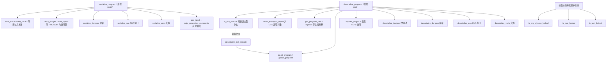
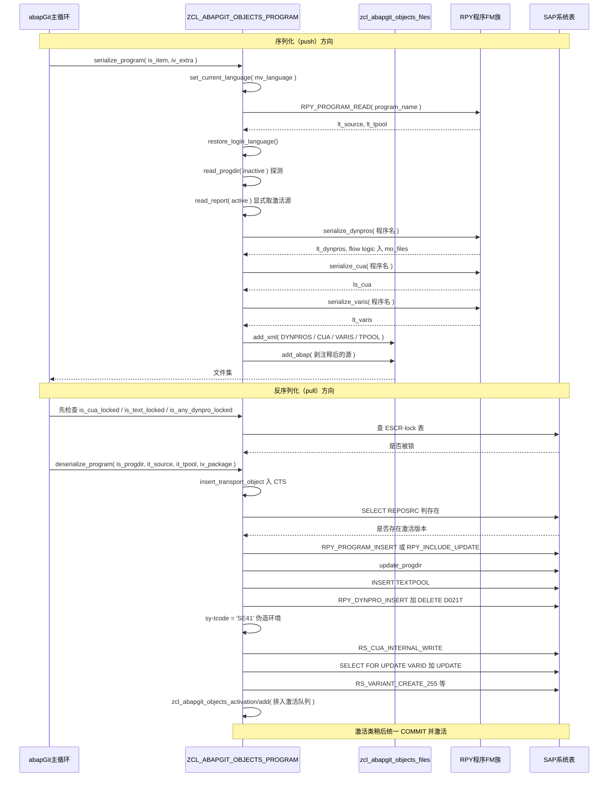

# ZCL_ABAPGIT_OBJECTS_PROGRAM 分析报告

> 分析对象：`abapGit__abapGit__zcl_abapgit_objects_program.clas.abap`（1597 行，类定义 276 行 + 实现 1316 行，18 个可实现的类方法）
> 报告视角：代码 onboarding 走读，按"push（serialize）→ pull（deserialize）→ 并发保护"的真实调用顺序展开

---

## 一、概述：程序定位与业务背景

### 1.1 它解决什么问题

这是 abapGit 的**对象处理器（object handler）之一**，负责 ABAP 程序对象家族：报表（SUBC = '1'）、模块池（SUBC = 'M'）、Include，以及从仓库侧看来的函数组（FUGR）。它的任务是把"一个程序"这个复合对象拆成可版本化的文本，再把文本还原成仓库里的对象。

难点不在源程序本身——那只是一张字符表。难点在于一个程序的**附属物分散在 5 张不同的表、靠 6 组互不相同的 SAP 内部函数模块读写**：

| 附属物 | 存储 | 读写 FM | 麻烦之处 |
|---|---|---|---|
| 屏幕（DYNPRO） | D020S / D021S / D021T | RPY_DYNPRO_READ / _INSERT | 自定义屏幕与"内部实现屏幕"是两套完全不同的结构；flow logic 要以 ABAP 文件形式单独落盘 |
| CUA 接口 | LSMGUI 系列表 | RS_CUA_INTERNAL_FETCH / _WRITE | 11 张表 + 1 个 ADM；历史版本漏存 ADM；还要伪造 SY-TCODE 才能写入 |
| 变体（Variant） | VARID / VARIT | RS_VARIANT_*_255 | 系统变体存在 CLIENT 000；创建前必须解除"保护"锁；跨版本参数不一致 |
| 文本池（TPOOL） | T000T | INSERT / DELETE TEXTPOOL | 'S' 型条目要把标题前缀与正文切成 split / entry 两段 |
| 源程序 | REPOSRC | RPY_PROGRAM_READ / RPY_INCLUDE_UPDATE | 有非激活版本时 FM 不返回激活代码，要分两次读 |

一句话设计范式：

> **"仓库抽象层"——serialize 是纯函数式读取（读 SAP、装配 XML、无写库），deserialize 是有状态的事务（写库、伪造系统上下文、最后投递激活）；两边都刻意做"规范化"，把 SAP 返回的时间戳、状态位、空占位清掉，让同一个仓库内容产生稳定的二进制输出。**

它不判断"该不该同步"（那是 abapGit 的主循环），不做差异比较，不生成运输请求。它只负责一件事：**把复合对象忠实地变成文本、再把文本忠实地变回来**。而"忠实"在这里恰恰是最难的部分——因为 SAP 的 FM 返回里混着大量每次调用都变的噪音。

### 1.2 依赖清单（读代码前的地形）

```
父类 / 接口   zcl_abapgit_objects_super      提供 ms_item / mv_language / mo_files / mo_i18n_params /
                                              exists_a_lock_entry_for / clear_abap_language_version / mo_files
              zif_abapgit_definitions        ty_item（is_item）
工厂          zcl_abapgit_factory            get_sap_report / get_cts_api / get_language
兄弟类        zcl_abapgit_objects_activation 唯一的事务出口：add( iv_type, iv_name ) 把对象排入激活队列
              zcl_abapgit_objects_files      add_xml / add_abap / read_abap（文件的实际落盘）
              zcl_abapgit_xml_output         ig_data 的 XML 序列化
              zif_abapgit_sap_report         ty_progdir / read_progdir / read_report / insert_report / update_progdir
              zif_abapgit_environment        ty_system_language_filter（语言筛选表）
SAP 表        REPOSRC / PROGDIR / TADIR / D020S / D021S / D021T / VARID / VARIT / T000T
系统字段      SY-TCODE（被显式改写）、SY-DATUM / SY-UZEIT、SY-SUBRC、SY-LANGU
```

两个必须提前建立的认知，否则后面每个方法的判断都会偏：

1. **本类自己一行 COMMIT 都没有。** 所有写库都是延迟的：先写库，再往激活队列里塞一个名字，真正的提交与激活由 `zcl_abapgit_objects_activation` 在整批对象处理完后统一执行。所以本文件里看到的"写库"不等于"已生效"。
2. **serialize 与 deserialize 在工程性质上完全不同。** serialize 侧一个副作用都没有（除了往 `mo_files` 里加文件）；deserialize 侧要伪造 `SY-TCODE`、抢数据库行锁、改系统语言。**风险几乎全部集中在 pull 这一半**，读的时候要有这个预期。

### 1.3 为什么值得单独读这个类

它不是业务代码，是**贴着 SAP 仓库内核写的适配层**。它身上浓缩了三种高级技巧，而每种技巧都带着明确的代价：

- **版本兼容**：同一个 FM 在不同系统版本上参数集不同（`uccheck`、`suppress_message`、`OUTPUTSTYLE` 字段），代码用 `TRY / CATCH cx_sy_dyn_call_param_not_found` + `ASSIGN COMPONENT ... IF sy-subrc = 0` 做运行时探测。
- **规范化去噪**：清 `nat_header-dgen/dgen` 生成时间戳、清 `OUTPUTSTYLE = '  '`、清 container 的 `c_line_min`、删 TPOOL 的空标题占位——都是为了"同一内容 → 同一输出"，这是任何版本控制工具的地基。
- **绕坑**：EU 522 的作者检查、`RPY_PROGRAM_UPDATE` 的 TTAB 不清除 bug、Note 2159455 需要 `SY-TCODE = 'SE41'`、历史版本 XML 没存 CUA 的 ADM。

后者的写法是"能跑就行"的实用主义，也是本报告主要挑刺的地方：**这些 workaround 大多没有配对清理，也没有测试护栏。**

---

## 二、执行流程总览

两类对象入口 + 一条并发的前置检查链：



### 责任链表

| 子程序 | 调用者 | 职责 |
|---|---|---|
| `serialize_program` | abapGit 仓库序列化主循环 | push 总控：读源与 PROGDIR，按 SUBC 决定是否带屏幕/CUA/变体，装配 XML 与 ABAP 文件 |
| `serialize_dynpros` | `serialize_program` | 读全部屏幕；自定义屏幕走 RPY_DYNPRO_READ，内部屏幕另取内部字段表；flow logic 拆成独立 ABAP 文件 |
| `serialize_cua` | `serialize_program` | 从 LSMGUI 表取 CUA 的 ADM + 11 张表 |
| `serialize_varis` | `serialize_program` | 遍历共享变体，逐个取技术数据、值、对象、屏幕、文本 |
| `get_varis_for_report` / `get_vari_data` / `get_vari_screens` | `serialize_varis` | 变体清单（按 SAP& / CUS& 模式过滤）；变体明细；变体绑定的屏幕号 |
| `add_tpool` / `read_tpool` / `get_program_title` | `serialize_program` / `deserialize_program` | TPOOL 的 SAP 段格式双向换算；取 'R' 条目标题（含绕过 SAP bug 的动作） |
| `strip_generation_comments` | `serialize_program` | 剥掉 FUGR 自动生成的头注释，避免合并噪音 |
| `deserialize_program` | abapGit 仓库反序列化主循环 | pull 总控：CTS 入库、存在性判断、写源、更新 PROGDIR、投递 REPS 激活 |
| `deserialize_exit_include` | `deserialize_program`（异常分支） | 退出包 Include 专用路径：不建运输对象、不投递激活、强制激活态 |
| `insert_program` / `update_program` | 上述两个总控 | 新建 / 更新源程序，含 `name_not_allowed` 与 EU 522 两条兜底 |
| `deserialize_dynpros` | `deserialize_program` | 写回屏幕并**删除远端已删除的屏幕** |
| `deserialize_cua` / `auto_correct_cua_adm` | `deserialize_program` | 补全历史漏存的 ADM，伪造 SY-TCODE 后写入 CUAD |
| `deserialize_textpool` | `deserialize_program` | 按主语言/翻译语言分叉，插/删 TPOOL 并投递 REPT 激活 |
| `deserialize_varis` / `get_vari_*` / `create_vari` / `delete_vari` / `set_vari_protection` | `deserialize_program` | 变体的增删同步，全程带保护锁的加/解 |
| `uncondense_flow` | `deserialize_dynpros` | 把 condense 过的 flow logic 用空格表还原缩进 |
| `is_any_dynpro_locked` / `is_cua_locked` / `is_text_locked` | abapGit 主循环（拉取前） | 三类对象的 ESCR-lock 前置检查 |

下面按这条流程，逐个子程序展开。

---

## 三、分组分析（按执行流程）

### 3.1 类结构契约：`ty_cua` / `ty_dynpro` / `ty_vari` 与状态常量（类定义段）

先把三个大结构读透——后面每一节的"数据形状"都由这里决定。

```abap
    TYPES:
      BEGIN OF ty_cua,
        adm TYPE rsmpe_adm,
        sta TYPE STANDARD TABLE OF rsmpe_stat WITH DEFAULT KEY,
        fun TYPE STANDARD TABLE OF rsmpe_funt WITH DEFAULT KEY,
        men TYPE STANDARD TABLE OF rsmpe_men WITH DEFAULT KEY,
        mtx TYPE STANDARD TABLE OF rsmpe_mnlt WITH DEFAULT KEY,
        act TYPE STANDARD TABLE OF rsmpe_act WITH DEFAULT KEY,
        ...
        tit TYPE STANDARD TABLE OF rsmpe_titt WITH DEFAULT KEY,
        biv TYPE STANDARD TABLE OF rsmpe_buts WITH DEFAULT KEY,
      END OF ty_cua.

    CONSTANTS:
      BEGIN OF c_state,
        active   TYPE r3state VALUE 'A',
        inactive TYPE r3state VALUE 'I',
        off      TYPE r3state VALUE '',
      END OF c_state.

    CONSTANTS c_native_dynpro TYPE c LENGTH 2 VALUE 'IN'.

    CONSTANTS c_sysvari_clnt        TYPE mandt      VALUE '000'.
    CONSTANTS c_sysvari_pattern_sap TYPE c LENGTH 5 VALUE 'SAP&*'.
    CONSTANTS c_sysvari_pattern_cus TYPE c LENGTH 5 VALUE 'CUS&*'.
```

**做什么** — `ty_cua` 是 CUA 接口的完整投影：`adm`（接口描述）加 11 张表（STA/FUN/MEN/MTX/ACT/BUT/PFK/SET/DOC/TIT/BIV），与 `RS_CUA_INTERNAL_FETCH` / `RS_CUA_INTERNAL_WRITE` 的 12 个参数一一对应。`ty_vari`（此处省略，结构相同）把 `varid` 的字段逐个提升成独立字段，再挂上变体屏幕表、对象表、值表、文本表。`c_state` 用结构体常量封装 `r3state` 的三种取值（`A` / `I` / 空格）。`c_sysvari_clnt = '000'` 固定了系统变体的客户端。

**为什么** — 把 SAP FM 的参数集"复制"成本类自己的结构，好处是序列化边界清晰：XML 的每个段落直接对应结构的一个字段，abapGit 不需要知道 LSMGUI 内部有几张表。`c_state` 用结构体常量而不是散落字符串，把 `A` / `I` / 空格这三个容易写错的字面量锁在一处，`c_state-off` 这种"传空字符串"的怪异语义也变成了一个可读的名字。

**风险与改进** — 三处：

1. **`ty_cua` 与 FM 的参数集必须同步，而没有任何断言。** `serialize_cua` 导入 12 个值、`deserialize_cua` 的守卫检查 11 张表（不含 `adm`），两处都是硬编码的字段清单。若 SAP 在某版本给 FM 增加第 13 张表，本类不会报错，只会静默漏数据。建议在激活的测试类里加一条"结构字段数 = FM 参数数"的断言。
2. **`c_sysvari_clnt` 硬编码 `'000'`** 意味着变体同步只覆盖系统变体（跨客户端共享的那些），客户端私有变体不在范围内。这是刻意的，但文档里没有任何说明，接手的人容易误以为"变体同步不全"是 bug。
3. **`c_state-off` 的值是空格**，语义靠调用方记住"传空 = 保持现状"。凡是把 `c_state-off` 和 `c_state-inactive` 记混的地方都会出错，建议在使用点加断言或改用布尔参数。另：`c_native_dynpro = 'IN'` 配合 `CA` 操作符使用，是通配匹配而非精确枚举（详见 3.9）。

三个结构定完形状，下面看它们是怎么被填出来、又是怎么被写回去的。

### 3.2 `serialize_program`：push 总控（共 4 步）

#### ① 切语言，一次取回源与文本池

```abap
    zcl_abapgit_language=>set_current_language( mv_language ).

    CALL FUNCTION 'RPY_PROGRAM_READ'
      EXPORTING
        program_name     = lv_program_name
        with_includelist = abap_false
        with_lowercase   = abap_true
      TABLES
        source_extended  = lt_source
        textelements     = lt_tpool
      EXCEPTIONS
        cancelled        = 1
        not_found        = 2
        permission_error = 3
        OTHERS           = 4.
```

**做什么** — 先把会话语言切到目标语言，再用 `RPY_PROGRAM_READ` 一次取回源程序与文本元素；`with_includelist = abap_false` 表示不要 Include 清单，`with_lowercase = abap_true` 让关键字小写化（仓库里源文件是规范化的）。

**为什么** — 语言必须先切：文本元素是按 `SY-LANGU` 读的，不切语言就等于导出错误语言的文本。用一次 FM 同时拿源和文本池，比分两次调用少一轮往返。`with_lowercase` 是为了让导出的文本在不同编辑器风格下仍然稳定——这正是"同内容 → 同输出"这条基线的体现。

**风险与改进** — 两个点：

1. **取的是哪个版本没有限定。** `RPY_PROGRAM_READ` 不带状态参数，在有非激活版本时会返回非激活代码，这正是下一步要补救的原因。
2. **`not_found`（subrc = 2）走"恢复语言 + 静默 RETURN"**。含义是：对象在列表出来之后被删了，就当作"没有文件"。abapGit 主循环要靠"文件集为空"来推断删除。这个语义只写在行为里，代码里看不出来——建议改成显式的 `CHECK` 或抛带语义的异常，让调用方能区分"对象不存在"和"对象没有内容"。

#### ② 读 PROGDIR 与激活源（两步代码，块级三层）

```abap
    li_report = zcl_abapgit_factory=>get_sap_report( ).

    TRY.
        " Raises exception if inactive version does not exist
        ls_progdir = li_report->read_progdir(
          iv_name  = lv_program_name
          iv_state = c_state-inactive ).

        " Explicitly request active source code
        lt_source = li_report->read_report(
          iv_name  = lv_program_name
          iv_state = c_state-active ).
      CATCH zcx_abapgit_exception ##NO_HANDLER.
    ENDTRY.
```

**做什么** — 用工厂拿到 report 接口。先试着读**非激活**的 PROGDIR：若成功，说明存在非激活版本，而 `RPY_PROGRAM_READ` 此时返回的是非激活源，所以要显式再取一次**激活**源覆盖掉它；若非激活版本不存在，`read_progdir` 抛异常，被空 `CATCH` 吃掉，`lt_source` 保持 FM 给的值。

**为什么** — 这是本类最巧的一处。`RPY_PROGRAM_READ` 在有非激活版本时不返回激活代码，这是 SAP 的行为而不是 bug；abapGit 用"试读非激活 PROGDIR 来探测状态"，把探测和取数合并成一条路径，比多一次 `REPOSRC` 查询便宜。空 `CATCH` + `##NO_HANDLER` 是刻意的：异常在这里是控制流信号，不是错误。

**风险与改进** — 语言上下文在这一段丢失了。前一步的 `set_current_language` 在读完 FM 之后就调用了 `restore_login_language`，所以这两次 `read_progdir` / `read_report` 是**用登录语言**执行的。如果这是有意的，应该注释说明；如果不是，主语言的对象会被按登录语言处理。更进一步：这个 TRY 里**没有** `restore_login_language`，一旦 `read_report` 抛出的不是 `zcx_abapgit_exception` 而是别的异常类型，语言就永远不会被恢复，后续所有对象都会被污染。建议把整段包进 `CLEANUP`。

```abap
    ls_progdir = li_report->read_progdir(
      iv_name  = lv_program_name
      iv_state = c_state-active ).
```

**做什么** — 无论上面走哪条分支，最终以**激活** PROGDIR 作为输出内容。

**为什么** — 非激活 PROGDIR 携带的临时信息（作者、时间戳、未生效的改动）不应该进入仓库；仓库要的是"最后一次生效的状态"。

**风险与改进** — 如果对象**只有**非激活版本（从未激活过），`read_progdir( iv_state = c_state-active )` 会抛异常且这里没有 TRY——整个 push 会中断，用户看到异常而不是得到一个只含源文件的提交。对新建的、尚未激活的程序这是一个真实的失败路径，建议同样套上 TRY 并回退到非激活 PROGDIR。

#### ③ 按 SUBC 装配 XML，并清掉 TPOOL 的空标题占位

```abap
    IF ls_progdir-subc = '1' OR ls_progdir-subc = 'M'.
      lt_dynpros = serialize_dynpros( lv_program_name ).
      li_xml->add( iv_name = 'DYNPROS'
                   ig_data = lt_dynpros ).

      ls_cua = serialize_cua( lv_program_name ).
      li_xml->add( iv_name = 'CUA'
                   ig_data = ls_cua ).

      lt_varis = serialize_varis( lv_program_name ).
      li_xml->add( iv_name = 'VARIS'
                   ig_data = lt_varis ).
    ENDIF.

    READ TABLE lt_tpool WITH KEY id = 'R' INTO ls_tpool.
    IF sy-subrc = 0 AND ls_tpool-key = '' AND ls_tpool-length = 0.
      DELETE lt_tpool INDEX sy-tabix.
    ENDIF.

    li_xml->add( iv_name = 'TPOOL'
                 ig_data = add_tpool( lt_tpool ) ).
```

**做什么** — 只有报表（`1`）和模块池（`M`）才带屏幕、CUA 和变体；`'S'`（选择屏幕）、`'I'`（Include）、`'F'`（函数模块）等一律跳过。随后找出 TPOOL 里 `id = 'R'`（标题条目）且 key 与 length 都是空的占位行并删掉，最后把文本池换算成仓库格式再写入 XML。

**为什么** — 屏幕与变体只属于有 UI 的对象，这个 SUBC 判断把不适用的分支整段挡掉，也让 XML 结构在不同对象类型间保持一致的可读性。删掉空标题占位是**去噪**：新程序刚建出来时文本池里常有一行全空的 R 条目，不删的话每次 push 都会产生一堆无意义的差异。

**风险与改进** — 用 SUBC 字面量做分派是一个脆弱点：`'1'` 和 `'M'` 之外的类型如果哪天也需要屏幕（SAP 的 SUBC 编码历史上扩展过），这段代码会静默漏掉整类附属物。建议提为常量（如 `c_subc-report = '1'`），并在注释里写明"为什么只有这两个"。另外，`READ TABLE` 与 `DELETE ... INDEX sy-tabix` 之间没有别的表操作，所以 `sy-tabix` 确实是刚读到的那一行——但这个"靠 sy-tabix 串联两条语句"的写法一旦有人在中间插一行表操作就会断，用 `ASSIGNING` 或先取 `tabix` 到局部变量更稳。

#### ④ 写文件与剥注释

```abap
    IF NOT io_xml IS BOUND.
      io_files->add_xml( iv_extra = iv_extra
                         ii_xml   = li_xml ).
    ENDIF.

    strip_generation_comments( CHANGING ct_source = lt_source ).

    io_files->add_abap( iv_extra = iv_extra
                        it_abap  = lt_source ).
```

**做什么** — XML 由外部提供（`io_xml` 已绑定）时不重复落盘，否则交给文件对象。源程序剥掉生成注释后落盘。

**为什么** — `io_xml` 可选入参让"只要 XML 结构、不要文件"的调用方（例如差异计算）可以复用整段逻辑而不产生副作用，这是很克制的可组合性设计。剥注释放在落盘**之后**的装配、落盘**之前**的处理，顺序不能反：注释只影响文本内容，不影响 XML。

**风险与改进** — `strip_generation_comments` 是 `CHANGING`，直接在传入的表上删除行。它对 `FUGR` 之外的对象是空操作，但一旦判断错了（`ms_item-obj_type` 与实际对象不一致），会静默删掉源程序的开头几行。它内部还有若干 `ASSERT`，详见 3.12。

### 3.3 `serialize_dynpros`：屏幕序列化（两段核心代码）

```abap
      "#2746: we need the dynpro fields in internal format:
      FREE lt_fieldlist_int.

      CALL FUNCTION 'RPY_DYNPRO_READ_NATIVE'
        EXPORTING
          progname   = iv_program_name
          dynnr      = <ls_d020s>-dnum
        TABLES
          fieldlist  = lt_fieldlist_int
          fieldtexts = lt_texts.

      LOOP AT lt_fields_to_containers ASSIGNING <ls_field>.
* output style is a NUMC field, the XML conversion will fail if it contains invalid value
* field does not exist in all versions
        ASSIGN COMPONENT 'OUTPUTSTYLE' OF STRUCTURE <ls_field> TO <lv_outputstyle>.
        IF sy-subrc = 0 AND <lv_outputstyle> = '  '.
          CLEAR <lv_outputstyle>.
        ENDIF.

        "2746: we apply the same logic as in SAPLWBSCREEN
        "for setting or unsetting the foreignkey field:
        UNASSIGN <ls_field_int>.
        READ TABLE lt_fieldlist_int ASSIGNING <ls_field_int> WITH KEY fnam = <ls_field>-name.
        IF <ls_field_int> IS ASSIGNED.
          IF <ls_field_int>-flg1 O lc_flg1ddf AND
              <ls_field_int>-flg3 O lc_flg3for AND
              <ls_field_int>-flg3 Z lc_flg3fdu AND
              <ls_field_int>-flg3 Z lc_flg3fku.
            <ls_field>-foreignkey = 'X'.
          ELSE.
            CLEAR <ls_field>-foreignkey.
          ENDIF.
        ENDIF.

        IF <ls_field>-from_dict = abap_true AND
           <ls_field>-modific   <> 'F' AND
           <ls_field>-modific   <> 'X'.
          CLEAR <ls_field>-text.
        ENDIF.
      ENDLOOP.
```

**做什么** — 除了用 `RPY_DYNPRO_READ` 拿到的自定义屏幕结构，这里再调 `RPY_DYNPRO_READ_NATIVE` 拿**内部格式**的字段表。然后对每个字段做三件事：把 `OUTPUTSTYLE` 里的两个空格清成真正的初始值（否则 XML 转换会失败）；按 `flg1` / `flg3` 的位运算重算 `foreignkey`（因为 FM 不返回这个字段）；`from_dict` 且 `modific` 不是 `'F'`/`'X'` 的字段，把 `text` 清空。

**为什么** — 这段是整个类里"去噪"最密集的地方，三条逻辑对应三个真实的仓库噪音源：`OUTPUTSTYLE` 是 NUMC 类型，SAP 用两个空格表示空，但 abapGit 的 XML 转换器会把它当成非法字符；`foreignkey` 在 `RPY_DYNPRO_READ` 的返回里是派生值，不同系统版本算出来的结果不一致，所以干脆按 `SAPLWBSCREEN` 的原始位运算逻辑重算一遍；DDIC 派生字段的文本可能随 DDIC 变化而变，与屏幕本身无关，清掉后仓库里就不会因为改了一个 DDIC 字段而让整个屏幕文件变脏。

**风险与改进** — 四件事：

1. **位运算标志是从 SAP 内部 include `MSEUSBIT` 抄的常量**（`lc_flg1ddf = '20'` 等），这些是十六进制位标记。它们与 SAP 的实现绑死，SAP 改位分配就不会有任何编译期提示。建议至少写注释说明每个 bit 的含义，并配一条断言测试。
2. **`READ TABLE lt_fieldlist_int ... WITH KEY fnam = <ls_field>-name`** 依赖 `lt_fieldlist_int` 是按 `fnam` 排序的。源码里没有任何 `SORT`，完全依赖 FM 的返回顺序。FM 返回顺序不是契约，换个版本可能就线性扫描甚至匹配不上。**需核实 `RPY_DYNPRO_READ_NATIVE` 的返回排序**——若未排序，`ASSIGNING` 的命中率会变，`foreignkey` 就会大面积被错误清空。
3. **循环内表未清空**：`lt_texts`、`lt_containers`、`lt_fields_to_containers`、`lt_flow_logic` 在多个屏幕之间循环复用，但只有 `lt_fieldlist_int` 显式 `FREE` 了（注释说明是为 #2746 服务）。作者显然意识到了这个坑，但只修了一处。其余四张表靠 FM 自己清空，一旦某个 FM 版本不清空，上一个屏幕的字段会串到下一个屏幕里。
4. **`ASSIGN COMPONENT 'OUTPUTSTYLE'`** 是运行时探测字段是否存在，写法正确（先 `IF sy-subrc = 0`）。但 `CLEAR <lv_outputstyle>` 改的是**工作区字段的引用**，它是否真的写回内表取决于 `ASSIGN COMPONENT` 建立的引用方向。这里恰好能工作，因为字段符号指向内表行。属于"能跑但读者必须懂 ABAP 内部机制"的代码，值得一句注释。

```abap
      READ TABLE lt_fieldlist_int TRANSPORTING NO FIELDS WITH KEY fill = 'X'.
      IF ls_header-type CA c_native_dynpro AND sy-subrc = 0.
        " In particular for dynpros with splitter
        <ls_dynpro>-nat_header = <ls_d020s>.
        CLEAR: <ls_dynpro>-nat_header-dgen, <ls_dynpro>-nat_header-tgen.
        <ls_dynpro>-nat_fields = lt_fieldlist_int.
        <ls_dynpro>-nat_texts  = lt_texts.
      ELSE.
        <ls_dynpro>-containers = lt_containers.
        <ls_dynpro>-fields     = lt_fields_to_containers.
      ENDIF.
```

**做什么** — 用 `fill = 'X'` 探测是否存在 splitter 字段，再结合 `header-type` 是否包含 `I` 或 `N`，决定这一个屏幕走"内部实现"分支（存 `nat_header` / `nat_fields` / `nat_texts`）还是"自定义屏幕"分支（存 `containers` / `fields`）。走内部分支时，把 `dgen`（生成日期）和 `tgen`（生成时间）清掉。

**为什么** — 这是**去噪里最漂亮的一手**：生成时间戳每个屏幕每次激活都在变，如果写进仓库，用户每次碰一下屏幕就会产生满屏无意义 diff。清掉这两个字段，屏幕文件就只反映"真正的结构变化"。同时它体现了 abapGit 的一条设计纪律：**凡是会随无意义动作变化的字段，一律不入库。**

**风险与改进** — 两处：

1. **`ls_header-type CA c_native_dynpro`** 里的 `c_native_dynpro` 是 `'IN'`，`CA` 是"包含其中任一字面字符"，所以任何含 `I` 或含 `N` 的 DYNPRO 类型都会走内部分支。这是**通配匹配当成精确枚举用**：目前恰好没有别的类型含这两个字母，但一旦 SAP 引入新的类型码（历史上 SUBC/DYNPRO 类型码都扩展过），会静默走错分支。**建议改成显式枚举**（如 `ls_header-type = 'I' OR ls_header-type = 'N'`），或至少加断言。
2. **只清 `dgen` / `tgen` 两个字段**，`d020s` 里还有 `aufnr`（变更号）、`autor`（作者）等同样会变的字段。为什么只清这两个？源码没有说明。如果 `d020s` 的其他易变字段也被存进仓库，去噪就是不彻底的。**建议在 SE11 里核对 `d020s` 的字段语义**，确认没有漏掉的易变列。

### 3.4 `serialize_varis`：变体序列化

```abap
    lt_varis = get_varis_for_report( iv_program_name ).

    LOOP AT lt_varis ASSIGNING <ls_varikey>.
      CLEAR: ls_vari,
             ls_varid.

      get_vari_data( EXPORTING is_vari    = <ls_varikey>
                     IMPORTING es_varid   = ls_varid
                               et_values  = ls_vari-values
                               et_objects = ls_vari-objects
                               et_texts   = ls_vari-texts ).

      MOVE-CORRESPONDING ls_varid TO ls_vari.

      " Clear texts - they will be provided in TEXTPOOL section
      LOOP AT ls_vari-objects ASSIGNING <ls_object>.
        CLEAR <ls_object>-text.
      ENDLOOP.

      ls_vari-variscreens = get_vari_screens( <ls_varikey> ).

      INSERT ls_vari INTO TABLE rt_varis.
    ENDLOOP.
```

**做什么** — 先取变体清单（`get_varis_for_report` 只返回匹配 `SAP&*` / `CUS&*` 的共享变体，用户个人变体不在范围内），逐个取技术数据、值、对象、文本，把 `varid` 技术字段搬进 `ty_vari`，然后**清空对象表里的 `text` 列**，最后补上变体绑定的屏幕号。

**为什么** — 只同步共享变体是刻意的：用户变体属于个人数据，仓库不应该管它。清空 `<ls_object>-text` 是为了避免文本在对象表和文本表里重复存一份——注释说"它们会在 TEXTPOOL 段提供"。这一步保证了同一份信息只有一个来源，避免两处文本不一致。

**风险与改进** — 三处：

1. **注释与代码的对应关系需要核实。** 注释写的是"texts 会在 TEXTPOOL 段提供"，但 `et_texts` 明明被赋值到了 `ls_vari-texts`（`ty_vari-texts`，即 `ty_vari_text_tt`）并且随 XML 一起导出。也就是说变体文本**确实被存了**，被清空的只是 `objects` 里的 `text` 列。注释的措辞容易让人误以为变体文本被完全剥离，实际不是。**建议在 SRU 里确认 `RS_VARIANT_CONTENTS_255` 的 `objects` 表 `text` 列与 `VARIT` 的 `vtext` 是否同源**——若同源，这次清空是对的；若不同源，这里可能正在丢数据。
2. **一个 `get_vari_data` 内部调 3 个 FM**（见 3.4 后半），且其中第一次调用的结果被丢弃。变体多时（一个报表常有几十个共享变体），序列化开销是 O(变体数 × 3) 轮 FM 调用。对大对象仓库这是主要瓶颈之一。
3. **`CLEAR: ls_vari, ls_varid` 在循环里做，正确但值得注意**：`ls_vari` 里的内表是 `MOVE-CORRESPONDING` 和目标赋值的组合，如果不 clear，上一个变体的 `variscreens` 会残留。这里做了，是好习惯。

### 3.5 `deserialize_program` / `deserialize_exit_include`：pull 总控与退出包分支

```abap
    DATA:
      lv_progname TYPE reposrc-progname,
      lv_title    TYPE rglif-title.

    IF is_exit_include( is_progdir-name ) = abap_true.
      deserialize_exit_include(
        is_progdir = is_progdir
        it_source  = it_source
        it_tpool   = it_tpool
        iv_package = iv_package ).
      RETURN.
    ENDIF.

    zcl_abapgit_factory=>get_cts_api( )->insert_transport_object(
      iv_object   = 'ABAP'
      iv_obj_name = is_progdir-name
      iv_package  = iv_package
      iv_language = mv_language ).

    lv_title = get_program_title( it_tpool ).

    " Check if program already exists
    SELECT SINGLE progname FROM reposrc INTO lv_progname
      WHERE progname = is_progdir-name
      AND r3state = c_state-active.

    IF sy-subrc = 0.
      update_program(
        is_progdir = is_progdir
        it_source  = it_source
        iv_title   = lv_title ).
    ELSE.
      insert_program(
        is_progdir = is_progdir
        it_source  = it_source
        iv_title   = lv_title
        iv_package = iv_package ).
    ENDIF.

    zcl_abapgit_factory=>get_sap_report( )->update_progdir(
      is_progdir = is_progdir
      iv_package = iv_package ).

    zcl_abapgit_objects_activation=>add(
      iv_type = 'REPS'
      iv_name = is_progdir-name ).
```

**做什么** — 入口先判退出包：命中就走专用分支并直接 RETURN。正常路径依次做四件事：把对象加入 CTS 运输对象、取标题、查 `REPOSRC` 里有没有激活版本以决定 insert 还是 update、更新 PROGDIR 并把对象投递进激活队列。

**为什么** — 退出包（`SAPLX*` / `LX*`）是 SAP 的标准扩展点，它们的写入规则与普通程序不同（`RS_INSERT_INTO_WORKING_AREA` 只接受激活态），所以必须分叉。CTS 入队必须在写库**之前**——CTS 系统需要在对象被修改前就知道它属于哪个运输请求，否则修改会落到基础包并触发检查。用 `REPOSRC` 的 `r3state = 'A'` 判断存在性，比 FM 的 `already_exists` 返回值更可靠，因为它直接看仓库状态。

**风险与改进** — 三处，且第一处与 3.7 呼应：

1. **退出包分支不调用 `insert_transport_object`，也不投递激活。** 这是刻意的（退出包由 SAP 标准流程管理），但代价是：**退出包的变更完全绕过 CTS**，在启用 CTS 的系统里这批修改会落到基础包上。如果这是可接受的，注释应该写明"为什么可以不入队"。
2. **`update_progdir` 的返回值（`sy-subrc`）没检查。** 若 PROGDIR 更新失败（对象被锁定、无权限），源码已经写完了，但 PROGDIR 还是旧的，然后仍然投递激活。结果是一个"源码已改、元数据未改"的半成品，且用户看不到任何错误。
3. **存在性判断只看激活版本。** 一个只有非激活版本的程序（新建未激活）会走 `insert_program`，而 `RPY_PROGRAM_INSERT` 返回 `already_exists = 1`——这个 subrc 落进 `sy-subrc > 0` 的分支，直接 `raise_t100`。所以"新建但未激活的程序被再次 pull"会报错。**建议在 SE38 里确认这个场景是否真实存在**（实践中 abapGit 通常只在激活态工作，可能碰不到）。

### 3.6 `insert_program` / `update_program`：写源的两条路径（三步）

#### ① 新建：版本降级重调

```abap
    TRY.
        CALL FUNCTION 'RPY_PROGRAM_INSERT'
          EXPORTING
            development_class = iv_package
            program_name      = is_progdir-name
            program_type      = is_progdir-subc
            title_string      = iv_title
            save_inactive     = iv_state
            suppress_dialog   = abap_true
            uccheck           = is_progdir-uccheck " does not exist on lower releases
          TABLES
            source_extended   = it_source
          EXCEPTIONS
            already_exists    = 1
            cancelled         = 2
            name_not_allowed  = 3
            permission_error  = 4
            OTHERS            = 5 ##FM_SUBRC_OK.
      CATCH cx_sy_dyn_call_param_not_found.
        CALL FUNCTION 'RPY_PROGRAM_INSERT'
          EXPORTING
            development_class = iv_package
            program_name      = is_progdir-name
            program_type      = is_progdir-subc
            title_string      = iv_title
            save_inactive     = iv_state
            suppress_dialog   = abap_true
          TABLES
            source_extended   = it_source
          EXCEPTIONS
            already_exists    = 1
            cancelled         = 2
            name_not_allowed  = 3
            permission_error  = 4
            OTHERS            = 5 ##FM_SUBRC_OK.
    ENDTRY.
```

**做什么** — 第一次调 `RPY_PROGRAM_INSERT` 时带上 `uccheck` 参数；低版本系统不认识这个参数，动态调用会抛 `cx_sy_dyn_call_param_not_found`，CATCH 里重调一遍去掉该参数。两段 FM 调用只差这一个参数。

**为什么** — `TRY / CATCH cx_sy_dyn_call_param_not_found` + 参数降级重调，是跨 SAP 版本调 FM 的**正确范式**，比 `CONVERT FUNCTION NAME` + 字符串拼接干净得多：它利用 ABAP 动态调用的类型检查在运行时探测"这个参数在当前系统上存不存在"，编译期不报错、运行时也不猜。

**风险与改进** — 两段 FM 调用**几乎完全重复**，每次给这个 FM 加参数都要改两处，属于"降级重调"范式的固有代价。建议把公共部分抽成一个内联方法，只在导出参数上分叉；或者接受重复但加一句注释说明"两段必须同步"。

#### ② 新建：`name_not_allowed` 的兜底

```abap
    IF sy-subrc = 3.

      " For cases that standard function does not handle (like FUGR),
      " we save active and inactive version of source with the given PROGRAM TYPE.
      " Without the active version, the code will not be visible in case of activation errors.
      zcl_abapgit_factory=>get_sap_report( )->insert_report(
        iv_name         = is_progdir-name
        iv_package      = iv_package
        it_source       = it_source
        iv_state        = c_state-active
        iv_version      = is_progdir-uccheck
        iv_program_type = is_progdir-subc ).

      zcl_abapgit_factory=>get_sap_report( )->insert_report(
        iv_name         = is_progdir-name
        iv_package      = iv_package
        it_source       = it_source
        iv_state        = c_state-inactive
        iv_version      = is_progdir-uccheck
        iv_program_type = is_progdir-subc ).

    ELSEIF sy-subrc > 0.
      zcx_abapgit_exception=>raise_t100( ).
    ENDIF.
```

**做什么** — 若返回 `name_not_allowed`（subrc = 3），说明标准 FM 不接受这个对象名/类型组合（FUGR 就是典型），于是降级为用工厂的 `insert_report` **分别写入激活版和非激活版**。其他 subrc 大于 0 才抛异常。

**为什么** — 降级路径的注释解释得非常清楚：必须同时存激活和非激活两份，否则激活失败时用户在 SE38 里看不到代码。这是从真实故障里长出来的经验。

**风险与改进** — 三处：

1. **兜底路径的两个 `insert_report` 都不检查异常。** `insert_report` 若抛 `zcx_abapgit_exception`（无权限、名称非法），会向上冒泡出 `insert_program`，此时**激活版已写入、非激活版未写入**，仓库里留下一个残缺的程序。虽然外层事务会回滚，但 abapGit 通常在一个 LUW 里处理多个对象，一次失败会连带回滚已成功的对象。建议对两次调用分别加检查，或在注释里写明"依赖外层事务回滚"。
2. **`ELSEIF sy-subrc > 0` 会把 `subrc = 1`（already_exists）也当成失败抛异常**（见 3.5 的第 3 条）。这依赖"insert 路径只由'不存在'触发"这个隐含约定，而该约定由调用方的 `REPOSRC` 查询保证——两个方法之间的约定没有写在任何一处文档里，属于隐式契约。
3. **`name_not_allowed` 是 3 个码里唯一被特殊处理的**，另外四个码（`already_exists` / `cancelled` / `permission_error` / `OTHERS`）都落进 `ELSEIF` 变成同一句 `raise_t100`。`permission_error`（4）对用户来说是可理解的失败，混在里面没问题；但 `cancelled`（2）通常意味着用户取消了某个弹窗，在这个后台流程里出现就属于配置问题。**建议对 `permission_error` 单独给一句可读提示**。

#### ③ 更新：EU 522 的分支与退出包的静默放行

```abap
    IF sy-subrc <> 0.
      zcl_abapgit_language=>restore_login_language( ).

      IF sy-msgid = 'EU' AND sy-msgno = '510'.
        zcx_abapgit_exception=>raise( 'User is currently editing program' ).
      ELSEIF sy-msgid = 'EU' AND sy-msgno = '522'.
        " for generated table maintenance function groups, the author is set to SAP* instead of the user which
        " generates the function group. This hits some standard checks, pulling new code again sets the author
        " to the current user which avoids the check
        IF is_exit_include( is_progdir-name ) = abap_false.
          zcx_abapgit_exception=>raise( |Delete function group and pull again, { is_progdir-name } (EU522)| ).
        ENDIF.
      ELSE.
        zcx_abapgit_exception=>raise_t100( ).
      ENDIF.
    ENDIF.

    zcl_abapgit_language=>restore_login_language( ).
```

**做什么** — 更新失败时，按 `SY-MSGID` / `SY-MSGNO` 精细分派：EU 510 说明有人在编辑，直接报错；EU 522 是作者检查失败（标准表维护函数组的作者是 `SAP*`，不是当前用户），此时**只有非退出包才抛异常**；其他错误用 `raise_t100` 保留 SAP 原始消息。语言在分支判断前就恢复了。

**为什么** — 用消息类+消息号而不是 subrc 做分派，是因为 SAP 的这些检查只通过消息区分原因，subrc 全是一样的。把用户能自己解决的问题（重新 pull 一次就能过）写成可执行的提示语，而不是笼统的"失败"，这是很好的错误信息设计。

**风险与改进** — 三处，第一处是本类最严重的问题之一：

1. **`is_exit_include` 为真 + EU 522 = 静默吞掉失败。** 注意分支结构：`IF is_exit_include = abap_false` 里才 `raise`，**没有 ELSE**。也就是说退出包遇到 EU 522 时，`sy-subrc <> 0` 的整个 IF 块正常结束，`update_program` 返回成功。可实际上**源程序一行都没写进去**。调用方（`deserialize_exit_include` / `deserialize_program`）拿到"成功"，继续走 `update_progdir` 并投递激活——仓库里源码是旧的，PROGDIR 是新的，激活队列里有一个从未被真正更新的程序。**建议在 SE38 里确认 EU 522 对退出包的确切语义**；如果确实应该继续，至少要留一条可查询的日志，不能让"更新失败"和"更新成功"长得一模一样。
2. **退出包分支给 `update_program` 传的是 `iv_state = c_state-off`（空格）。** `save_inactive = 空格` 的语义依赖 SAP FM 的文档（通常理解为"保持当前状态"），但空格作为状态值极易被误读。建议在调用点加一句注释说明"为什么这里必须传空"。
3. **异常路径先 `restore_login_language` 再抛异常，这个顺序是对的**（不会把语言污染带出去）。但注意：如果 `restore_login_language` 本身抛异常，后面的分派就执行不到——这属于极端情况，可以忽略。真正需要注意的是 `sy-msgid` / `sy-msgno` 只在 `MESSAGE` 语句或 FM 报错后有效，这里依赖 FM 恰好设置了消息，属于**隐式依赖 SAP 内部行为**。

### 3.7 `deserialize_dynpros`：屏幕写回（三步）

#### ① 枚举既有屏幕 + 兼容 flow logic 的两种存放形式

```abap
    " Delete DYNPROs which are not in the list
    CALL FUNCTION 'RS_SCREEN_LIST'
      EXPORTING
        dynnr     = ''
        progname  = ms_item-obj_name
      TABLES
        dynpros   = lt_d020s_to_delete
      EXCEPTIONS
        not_found = 1
        OTHERS    = 2.
    IF sy-subrc = 2.
      zcx_abapgit_exception=>raise_t100( ).
    ENDIF.

    SORT lt_d020s_to_delete BY dnum ASCENDING.

* ls_dynpro is changed by the function module, a field-symbol will cause
* the program to dump since it_dynpros cannot be changed
    LOOP AT it_dynpros INTO ls_dynpro.

      READ TABLE lt_d020s_to_delete WITH KEY dnum = ls_dynpro-header-screen
        TRANSPORTING NO FIELDS
        BINARY SEARCH.
      IF sy-subrc = 0.
        DELETE lt_d020s_to_delete INDEX sy-tabix.
      ENDIF.
```

**做什么** — 用 `RS_SCREEN_LIST` 取该程序在目标系统上已有的全部屏幕，作为"待删除候选"；按 `dnum` 升序排序（因为下一步要用二分查找）；然后遍历仓库给的屏幕，凡是在候选表里找到的就删掉——剩下的就是"远端已删除、本地多余"的屏幕，留到第 ③ 步真正删除。遍历用工作区 `ls_dynpro` 而不是字段符号，因为 FM 会改这个结构。

**为什么** — 这是**反向删除**的标准做法：先算差集、边处理边消减候选表，最后剩下的就是要删的。比"先收集新增列表、再逐个比"少一次全量比较。用二分查找而不是线性查找，说明作者假设屏幕数会到上百（模块池常见），`SORT` + `BINARY SEARCH` 的开销是 O(n log n)，而线性是 O(n × m)。

**风险与改进** — 三处：

1. **`subrc = 1`（`not_found`）被当作空列表继续执行。** 逻辑上没问题（没有旧屏幕就意味着没有要删的），但代码里没有注释解释"为什么不报错"。反过来，若 `RS_SCREEN_LIST` 因为权限问题返回 `not_found` 而不是 `OTHERS`，差集会被算空——**远端已删除的屏幕会全部漏删**。建议对 `subrc = 1` 也做日志或断言。
2. **`DELETE lt_d020s_to_delete INDEX sy-tabix`** 里的 `sy-tabix` 依赖 `READ TABLE` 与 `DELETE` 之间没有其他表操作，当前写法正确。但这种"两条语句共享 sy-tabix"的模式非常脆：中间任何人插一行 `LOOP` 或 `READ TABLE`，删除的就变成错行了。建议 `READ TABLE ... INDEX lv_idx` 用 `TRANSPORTING NO FIELDS` 配合 `READ ... ASSIGNING` 拿到 `sy-tabix` 后立即存局部变量。
3. **`ms_item-obj_name` 直接当 `progname` 用**，而 3.2 的 `serialize_dynpros` 用的是 `iv_program_name` 入参。两处对"程序名"的来源不一致（一个是全局 item，一个是参数），若调用方传入的名字与 item 名字不同（例如 Include 的处理），序列化与反序列化就会作用在**不同的对象**上。建议统一。

```abap
      " todo: kept for compatibility, remove after grace period #3680
      ls_dynpro-flow_logic = uncondense_flow(
        it_flow   = ls_dynpro-flow_logic
        it_spaces = ls_dynpro-spaces ).

      IF ls_dynpro-flow_logic IS INITIAL.
        ls_dynpro-flow_logic = mo_files->read_abap( iv_extra = 'screen_' && ls_dynpro-header-screen ).
      ENDIF.
```

**做什么** — 先用 `uncondense_flow` 把 flow logic 按 `spaces` 表还原缩进（早期 XML 会把 flow logic 压缩存储）；如果还原后还是空的，就从独立的 ABAP 文件里读回来。

**为什么** — 这是一个**迁移期的双读**：flow logic 曾被存成 XML 内的字段，后来改成独立的 ABAP 文件（这样它可以在 IDE 里被语法检查、被 diff）。为了不破坏旧仓库，新代码同时支持两种来源，并明确写了 todo 和"宽限期"。这种"先兼容、再设截止日期"的做法，比无限期兼容健康得多。

**风险与改进** — 三处：

1. **fallback 到文件的逻辑有一个真实的坑**：`read_abap` 读回的是**文件内容**，而 `ls_dynpro-flow_logic` 的类型是 `swydyflow`。`read_abap` 返回 `abaptxt255_tab` 之类的字符表，能赋给 `swydyflow` 是因为两者都是字符行表——但**行宽可能不同**（255 vs `swydyflow-line` 的长度）。如果行宽不一致，赋值时会被截断或补空格，flow logic 就坏了。**需在 SE11 里核对 `swydyflow` 的行类型长度**，这是典型的"长度匹配才能跑"的隐性依赖。
2. **"宽限期"没有截止日期**：todo 说 remove after grace period，但既没有版本号，也没有 issue 关闭条件。这类注释很容易变成永久代码——事实上同一段 fallback 已经存在很久。**建议给 todo 加上目标版本或时间**。
3. **`uncondense_flow` 的还原结果若是空的，就直接走文件路径**——但"XML 里的 flow logic 本来就是空的"（屏幕没有 flow logic）和"XML 里没有 flow logic、只有文件里有"是两种完全不同的情况，代码把它们合并成一个 `IF IS INITIAL`。当前无害（没有 flow logic 的屏幕读回来也是空表），但语义不清晰。

#### ② 自定义屏幕与内部屏幕的两条写回分支

```abap
      IF ls_dynpro-header-type CA c_native_dynpro AND ls_dynpro-nat_header IS NOT INITIAL.
        DELETE FROM d021t WHERE prog = ls_dynpro-header-program AND dynr = ls_dynpro-header-screen ##SUBRC_OK.
        INSERT d021t FROM TABLE ls_dynpro-nat_texts ##SUBRC_OK.

        ls_dynpro-nat_header-dgen = sy-datum.
        ls_dynpro-nat_header-tgen = sy-uzeit.

        CALL FUNCTION 'RPY_DYNPRO_INSERT_NATIVE'
          EXPORTING
            header             = ls_dynpro-nat_header
            dynprotext         = ls_dynpro-header-descript
          TABLES
            fieldlist          = ls_dynpro-nat_fields
            flowlogic          = ls_dynpro-flow_logic
            params             = lt_params
          EXCEPTIONS
            cancelled          = 1
            already_exists     = 2
            program_not_exists = 3
            not_executed       = 4
            OTHERS             = 5.
      ELSE.
        CALL FUNCTION 'RPY_DYNPRO_INSERT'
          EXPORTING
            header                 = ls_dynpro-header
            suppress_exist_checks  = abap_true
            suppress_generate      = ls_dynpro-header-no_execute
          TABLES
            containers             = ls_dynpro-containers
            fields_to_containers   = ls_dynpro-fields
            flow_logic             = ls_dynpro-flow_logic
          EXCEPTIONS
            cancelled              = 1
            already_exists         = 2
            program_not_exists     = 3
            not_executed           = 4
            missing_required_field = 5
            illegal_field_value    = 6
            field_not_allowed      = 7
            not_generated          = 8
            illegal_field_position = 9
            OTHERS                 = 10.
      ENDIF.
      IF sy-subrc <> 2 AND sy-subrc <> 0.
        zcx_abapgit_exception=>raise_t100( ).
      ENDIF.
```

**做什么** — 内部实现屏幕先删掉 `D021T`（动态文本表）里该屏幕的旧记录，再插入新的；然后把 `dgen` / `tgen` 填成**当前日期和时间**（注意：3.3 序列化时是**清掉**这两个字段，这里写回时重新生成）。最后按分支调用 `RPY_DYNPRO_INSERT_NATIVE` 或 `RPY_DYNPRO_INSERT`。两个 FM 的 `already_exists`（subrc = 2）都被当作正常情况放行，只有其他非零 subrc 才抛异常。

**为什么** — 这里体现了 abapGit 与 SAP 工具在"生成时间戳"上的分工：**SAP 需要真实的时间戳来管理对象状态，abapGit 不需要**。所以序列化的时候清掉（保证 diff 干净），反序列化的时候交给 `SY-DATUM` / `SY-UZEIT` 现场生成（保证 SAP 侧的语义完整）。这不是矛盾，而是一层清晰的"边界转换"。`already_exists` 被放行，是因为 abapGit 的模型是"幂等覆盖"：同一个屏幕被重复写是正常操作，不该报错。

**风险与改进** — 五处：

1. **`DELETE FROM d021t ... ##SUBRC_OK` 直接对 SAP 系统表做 DML，且显式压制了 subrc 检查。** `##SUBRC_OK` 是把"忽略返回值"这件事写成了代码里的显式声明（静态检查器要求这么做），但**删除失败不会被发现**：若删除失败（对象被锁、无权限），紧接着的 `INSERT` 可能产生重复文本或报错，而报错会被归因到 INSERT 而不是那次静默失败的 DELETE。建议至少记录 `sy-subrc`，或在 `INSERT` 失败时给出"可能 DELETE 没成功"的提示。
2. **`d021t` 的删除条件只有 `prog` 和 `dynr`，没有 `spra`（语言）。** 如果 `D021T` 是"程序 + 屏幕 + 语言 + 位置"四级键，这次 DELETE 会**把该屏幕所有语言的动态文本全删掉**，然后只插回 `ls_dynpro-nat_texts` 里的那一种语言（序列化时用 `mv_language` 取的）。**结果是其他语言的屏幕文本永久丢失。** 这是本类最严重的数据风险之一。**需在 SE11 核对 `D021T` 的键结构**：若 `spra` 是键字段，此处必须加 `AND spra = mv_language`。
3. **`lt_params` 从未被填充**（源码里只有声明 `DATA lt_params TYPE TABLE OF d023s`，没有任何 `APPEND` / `INSERT`），却作为 `TABLES params` 传给 FM。空表可能是 FM 的合法输入（表示"无参数"），但更可能是漏写了数据准备。**建议在 SRU 里确认 `RPY_DYNPRO_INSERT_NATIVE` 的 `params` 是否必填**；若必填，则内部屏幕的参数会全部丢失。
4. **`suppress_generate = ls_dynpro-header-no_execute`** 把"是否生成"的决定权完全交给仓库里存的那一位标志。若序列化时该标志取错了（例如被 3.3 的规范化逻辑误清），屏幕上就会多出/少掉自动生成的行。这是一个**单比特决定屏幕完整性**的脆弱点，值得在测试里覆盖。
5. **`sy-subrc <> 2 AND sy-subrc <> 0` 的放行范围是 `0` 和 `2`**，但两个 FM 的 subrc 语义并不完全一致（`RPY_DYNPRO_INSERT_NATIVE` 只有 5 个码，`RPY_DYNPRO_INSERT` 有 10 个）。用同一句判断覆盖两个 FM，等于假设"两个 FM 的 2 都是 already_exists"——**需在 SRU 里确认两个 FM 的 `2` 是否同义**。若不同义，这里会漏掉真实错误。

#### ③ 删除远端已不存在的屏幕

```abap
    " Delete obsolete screens
    LOOP AT lt_d020s_to_delete INTO ls_d020s.

      CALL FUNCTION 'RS_SCRP_DELETE'
        EXPORTING
          dynnr                  = ls_d020s-dnum
          progname               = ms_item-obj_name
          with_popup             = abap_false
        EXCEPTIONS
          enqueued_by_user       = 1
          enqueue_system_failure = 2
          not_executed           = 3
          not_exists             = 4
          no_modify_permission   = 5
          popup_canceled         = 6.
      IF sy-subrc <> 0.
        zcx_abapgit_exception=>raise_t100( ).
      ENDIF.

    ENDLOOP.
```

**做什么** — 遍历第 ① 步剩下的"远端已删除"屏幕，逐个调 `RS_SCRP_DELETE`，`with_popup = abap_false` 表示跳过确认弹窗。任何非零 subrc 都抛异常。

**为什么** — 删除必须放在**所有插入之后**：若先删再插，插入过程中一旦失败，屏幕就既删了又没补上，比不删更糟。`with_popup = abap_false` 是必须的，否则批处理会卡在人机交互上。这里用 `raise_t100` 保留了 SAP 的原始消息（比如"被其他用户锁住"），对用户定位问题更友好。

**风险与改进** — 三处：

1. **`sy-subrc = 4`（`not_exists`）也被当成错误抛异常。** 屏幕上一步 `RPY_DYNPRO_INSERT` 已经把屏幕写进了系统，但 `RS_SCREEN_LIST` 的枚举发生在最前面——如果对象在两次操作之间被外部改动（并发编辑），这里就会遇到"要删的屏幕已经没了"。这是典型的**并发窗口**：先枚举、后删除，中间任何外部动作都会打破一致性。建议把 `not_exists` 显式放行。
2. **删除是逐条 FM 调用**，一个屏幕一次 FM。若差集有 200 个屏幕，就是 200 次 FM 往返。对大模块池这是明显的性能瓶颈。
3. **仍然用 `ms_item-obj_name` 而不是参数**（同第 ① 步的第 3 条），序列化与反序列化作用对象可能不一致。

### 3.8 `deserialize_cua` / `auto_correct_cua_adm`：CUA 写回（三步）

#### ① 空 CUA 的守卫

```abap
    IF lines( is_cua-sta ) = 0
        AND lines( is_cua-fun ) = 0
        AND lines( is_cua-men ) = 0
        AND lines( is_cua-mtx ) = 0
        AND lines( is_cua-act ) = 0
        AND lines( is_cua-but ) = 0
        AND lines( is_cua-pfk ) = 0
        AND lines( is_cua-set ) = 0
        AND lines( is_cua-doc ) = 0
        AND lines( is_cua-tit ) = 0
        AND lines( is_cua-biv ) = 0.
      RETURN.
    ENDIF.
```

**做什么** — 11 张表全空就直接返回，不写任何东西。

**为什么** — 大部分报表没有 CUA 接口，序列化出来是 11 张空表加一个空 ADM。若不拦截，`RS_CUA_INTERNAL_WRITE` 会被调用上百次（每个报表一次），毫无意义地制造事务开销。

**风险与改进** — **守卫里少了一个字段：`adm`。** `ty_cua` 有 12 个字段（`adm` + 11 张表），这里只检查了 11 张表。若某次导出只有 `adm` 有值（比如 CUA 只有一个标题、没有任何功能/菜单），这个对象会被当成"空 CUA"直接跳过，**ADM 的改动静默丢失**。建议把 `AND is_cua-adm IS INITIAL` 补进守卫，或者反向思考：若"有 ADM 就写"，则守卫应该改为"ADM 空且全表空才返回"。

#### ② 取包、修 ADM、伪造 SY-TCODE、写库

```abap
    SELECT SINGLE devclass INTO ls_tr_key-devclass
      FROM tadir
      WHERE pgmid = 'R3TR'
      AND object = ms_item-obj_type
      AND obj_name = ms_item-obj_name.                  "#EC CI_GENBUFF
    IF sy-subrc <> 0.
      zcx_abapgit_exception=>raise( 'not found in tadir' ).
    ENDIF.

    ls_tr_key-obj_type = ms_item-obj_type.
    ls_tr_key-obj_name = ms_item-obj_name.
    ls_tr_key-sub_type = 'CUAD'.
    ls_tr_key-sub_name = iv_program_name.

    ls_adm = is_cua-adm.
    auto_correct_cua_adm( EXPORTING is_cua = is_cua CHANGING cs_adm = ls_adm ).

    sy-tcode = 'SE41' ##WRITE_OK. " evil hack, workaround to handle fixes in note 2159455
    CALL FUNCTION 'RS_CUA_INTERNAL_WRITE'
      EXPORTING
        program   = iv_program_name
        language  = mv_language
        tr_key    = ls_tr_key
        adm       = ls_adm
        state     = c_state-inactive
      TABLES
        ...
      EXCEPTIONS
        not_found = 1
        OTHERS    = 2.
    IF sy-subrc <> 0.
* if moving code from SAPlink, see https://github.com/abapGit/abapGit/issues/562
      zcx_abapgit_exception=>raise_t100( ).
    ENDIF.
```

**做什么** — 从 `TADIR` 取对象所属的开发类（用于构造运输键 `trkey`）；补齐 `tr_key` 的 `obj_type` / `obj_name`，子对象固定为 `CUAD` + 程序名；把 ADM 复制出来交给 `auto_correct_cua_adm` 修正；然后**把 `SY-TCODE` 硬改成 `'SE41'`**（注释自己承认这是 "evil hack"，为了绕过 Note 2159455），调 `RS_CUA_INTERNAL_WRITE` 以 `state = 'I'`（非激活）写入；最后投递 CUAD 激活。

**为什么** — 两个设计决策都值得记住：

- **写非激活态再投递激活**，与文本池、DYNPRO 一致——这是 abapGit 的统一事务模型：先在 LUW 里把所有改动写进非激活区，最后由激活类一次性提交并激活。好处是可以整体回滚。
- **`SY-TCODE = 'SE41'` 是运行时环境伪造**。SAP 的某些内部检查会看"当前事务码是不是 CUA 设计器"，abapGit 直接骗过这个检查。`##WRITE_OK` 是告诉静态检查器"我知道我在写系统字段，这是故意的"。注释里引用了 SAP Note 编号和 GitHub issue，这种"为什么"的记录质量很高。

**风险与改进** — 四处：

1. **`SY-TCODE` 被改写但没有配对恢复。** 没有任何 `CLEANUP` 或 `TRY` 把它改回原值。若 `RS_CUA_INTERNAL_WRITE` 抛异常、或后续步骤抛异常，`SY-TCODE` 会**一直保持 `'SE41'` 到本次 LUW 结束**——这会影响同一批处理里后续所有对象的处理（某些 FM 会根据事务码走不同分支）。这是本类最典型的"能跑但不安全"的模式。**必须改成 `TRY ... CLEANUP ... ENDTRY`，在 CLEANUP 里 `sy-tcode = lv_prev_tcode`。**
2. **`state = c_state-inactive` 与 3.3 的 `serialize_cua` 的 `state = c_state-active` 不对称。** 序列化读的是激活态，反序列化写的是非激活态。这符合 abapGit 的模型，但**若目标系统上该 CUA 从来没有激活版本**，写入非激活区后依赖激活队列来激活——若激活失败，用户会看到一个只存在于非激活区的 CUA。建议在激活失败时给出明确提示。
3. **`SELECT SINGLE devclass FROM tadir` 用 `#EC CI_GENBUFF` 抑制了缓存检查提示**，说明作者是知道的。但 `TADIR` 没有 `devclass` 之外的信息被取回，这一步纯粹是为了凑 `trkey`。若对象在 `TADIR` 里不存在（新建对象刚写库、TADIR 尚未更新），这里会抛 `'not found in tadir'`——**新建 CUA 的路径可能因此失败**。需核实新建对象的 TADIR 更新时机。
4. **`# if moving code from SAPlink` 这条注释引用了一个已关闭的 issue**。这类"考古注释"很有价值，但也意味着这段代码的语义绑定了十几年前的某个特定 SAP 补丁。若 SAP 在某版本修好了 Note 2159455，这里的 `SY-TCODE` 伪造就是多余的，而且**多余的环境伪造是有实际风险**的（见第 1 条）。

```abap
    zcl_abapgit_objects_activation=>add(
      iv_type = 'CUAD'
      iv_name = iv_program_name ).
```

**做什么** — 把 CUA 对象投递进激活队列，类型为 `CUAD`，名字为程序名。

**为什么** — 统一出口。本类自己不做提交、不做激活，只登记"我改了什么东西"，让 `zcl_abapgit_objects_activation` 决定顺序与批量策略。

**风险与改进** — **激活队列的粒度与 DYNPRO 不一致**：DYNPRO 投递的是"程序名 + 屏幕号"（见 3.9），CUAD 和 REPS 投递的是纯程序名。同一个激活批次里，屏幕按"程序+屏幕"粒度登记、CUA 按程序粒度登记。若激活类内部按名字匹配对象（例如 `RSYNTAX_CHECK_RUN` 的 `PROG` + `DYN` 组合），**程序名级别的 CUAD 激活可能匹配不到对象**，导致 CUA 写了但不生效。**需在 SE38 里确认激活类如何处理 `CUAD` 类型**——这是粒度不匹配可能造成的真实故障。

#### ③ `auto_correct_cua_adm`：历史数据的自动修复

```abap
    IF cs_adm IS NOT INITIAL
        AND cs_adm-actcode CO lc_num_n_space
        AND cs_adm-mencode CO lc_num_n_space
        AND cs_adm-pfkcode CO lc_num_n_space. "Check performed in form check_adm of include LSMPIF03
      RETURN.
    ENDIF.

    LOOP AT is_cua-act ASSIGNING <ls_act>.
      IF <ls_act>-code+6(14) IS INITIAL AND <ls_act>-code(6) CO lc_num_only.
        cs_adm-actcode = <ls_act>-code.
      ENDIF.
    ENDLOOP.

    LOOP AT is_cua-men ASSIGNING <ls_men>.
      IF <ls_men>-code+6(14) IS INITIAL AND <ls_men>-code(6) CO lc_num_only.
        cs_adm-mencode = <ls_men>-code.
      ENDIF.
    ENDLOOP.

    LOOP AT is_cua-pfk ASSIGNING <ls_pfk>.
      IF <ls_pfk>-code+6(14) IS INITIAL AND <ls_pfk>-code(6) CO lc_num_only.
        cs_adm-pfkcode = <ls_pfk>-code.
      ENDIF.
    ENDLOOP.
```

**做什么** — 修复方法。方法头部的注释说明动机：issue #1807，历史上保存的 CUA 接口 ADM 没被写进 XML。若 ADM 已经有值且三个码（`actcode` / `mencode` / `pfkcode`）都是"数字或空格"，直接返回不做修复；否则遍历 ACT / MEN / PFK 三张表，把 `code` 前 6 位是纯数字、后 14 位为空的条目的 `code` 填回 ADM 的对应字段。

**为什么** — 这是**向前兼容的历史债修复**：老仓库里 CUA 的 ADM 是空的，直接写入会生成一个"没有功能/菜单/状态码"的残缺 CUA。这段代码从数据本身反推 ADM 应该是什么，让老仓库不用重新导出就能正确导入。注释里还引用了 SAP 内部 include `LSMPIF03` 的 `check_adm`，说明校验规则是照 SAP 自己抄的。这种"修复历史数据而不是让用户重做"的做法，是工具类项目对用户最友好的姿态。

**风险与改进** — 四处：

1. **守卫的 AND 结构让整个修复几乎不会触发。** 条件是"ADM 非空 **且** 三个码都合规"才跳过。反向推论：只要 ADM 里**任意一个码不合规**（包括 ADM 完全为空），就进入修复路径——这部分是对的。但更关键的是另一面：**若 ADM 部分合规**（比如 `actcode` 正确、`mencode` 缺失），AND 条件不成立，进入修复；修复循环会遍历 MEN 表，但如果 MEN 表里没有"后 14 位为空"的条目（即所有菜单码都带了后缀），`mencode` 就仍然填不上，ADM 保持残缺并被写入。**结果是"看似修复了、实际没修复"**，而且用户看不到任何提示。建议每个码单独判断合规性，并且修复失败时至少记一条日志。
2. **三个循环都没有 `EXIT`，也没有优先级。** 若表里有多条"前 6 位纯数字、后 14 位为空"的条目，**最后一条会覆盖前面的**，结果取决于表的存储顺序——而表的顺序来自 XML 解析，不是契约。建议加 `EXIT`，或至少按 code 排序后取第一条。
3. **`code(6)` 与 `code+6(14)` 是位置切片**，硬编码了"ADM 码固定占 6 位、总长 20 位"的假设。`rsmpe_act-code` 的实际长度若与假设不符，切片会取到空或错位的数据。**需在 SE11 核对 `rsmpe_act` / `rsmpe_men` / `rsmpe_pfk` 的 `code` 字段长度**。
4. **`CO lc_num_n_space` / `CO lc_num_only`** 里的模式是 `' 0123456789'`（含空格）和 `'0123456789'`。`CO` 是"只包含"操作符，用在这里等价于"全字符都在集合内"，语义正确。但**空格被当成合法码字符**，意味着全空格的码也被视为合规——这可能放过真正残缺的数据。建议核实 SAP 的 `check_adm` 是否也把空格当合法值。

### 3.9 `deserialize_varis`：变体同步（两部分）

#### ① 主循环：清差集、解锁、删除、重建、复锁

```abap
    FIELD-SYMBOLS: <ls_vari>             LIKE LINE OF it_varis,
                   <ls_vari_text_remote> TYPE ty_vari_text.

    lt_local_varis = get_varis_for_report( iv_program_name ).

    ls_varikey-report = iv_program_name.

    LOOP AT it_varis ASSIGNING <ls_vari>.
      CLEAR: lt_vari_text,
             ls_varid,
             lv_recreate,
             lv_was_protected,
             lv_exists_locally.

      ls_varikey-variant = <ls_vari>-variant.

      DELETE lt_local_varis WHERE variant = <ls_vari>-variant.
      lv_exists_locally = boolc( sy-subrc = 0 ).

      lv_was_protected = set_vari_protection( is_vari    = ls_varikey
                                              iv_protect = abap_false ).

      TRY.
          IF lv_exists_locally = abap_true.
            delete_vari( ls_varikey ).
          ENDIF.

          MOVE-CORRESPONDING <ls_vari> TO ls_varid.
          ls_varid-mandt  = c_sysvari_clnt.
          ls_varid-report = iv_program_name.

          " Assemble text table
          LOOP AT <ls_vari>-texts ASSIGNING <ls_vari_text_remote>.
            ls_vari_text_create-mandt   = c_sysvari_clnt.
            ls_vari_text_create-report  = iv_program_name.
            ls_vari_text_create-variant = <ls_vari>-variant.
            ls_vari_text_create-langu   = <ls_vari_text_remote>-langu.
            ls_vari_text_create-vtext   = <ls_vari_text_remote>-vtext.
            INSERT ls_vari_text_create INTO TABLE lt_vari_text.
          ENDLOOP.

          create_vari( is_varid   = ls_varid
                       it_values  = <ls_vari>-values
                       it_texts   = lt_vari_text
                       it_screens = <ls_vari>-variscreens
                       it_objects = <ls_vari>-objects ).

          set_vari_protection( is_vari    = ls_varikey
                               iv_protect = ls_varid-protected ).

        CLEANUP.
          set_vari_protection( is_vari    = ls_varikey
                               iv_protect = lv_was_protected ).
      ENDTRY.
    ENDLOOP.
```

**做什么** — 先取本地已有的变体清单；遍历仓库给的变体，逐个从本地清单里删掉（剩下的就是要删除的）；记录本地是否已有该变体；先记住并解除"保护"锁；如果本地已有就先删再建（变体没有"更新"接口，只能删了重建）；把多语言文本按 `mandt = '000'` 组装成 `VARIT` 结构；调 `create_vari` 写入；成功后按仓库记录的 `protected` 标志重新上锁；`CLEANUP` 里无论如何都把保护状态还原成进入循环之前的样子。

**为什么** — 三个决策都很清楚：

- **差集算法与 3.7 完全一致**：边遍历边从本地清单里删除，循环结束后剩下的就是要删的。两个方法用同一种模式，说明这是 abapGit 的通用"同步"手法。
- **`TRY / CLEANUP` 保护锁还原是教科书式的正确用法**：`CLEANUP` 无论正常结束还是抛异常都会执行，所以即便创建变体失败，保护锁也会被还原成原来的状态。这保证了"失败不会留下半解锁的变体"。
- **变体只能删了重建**，因为 SAP 的变体 FM 没有"修改"入口。这是 SAP API 的限制，不是设计缺陷——注释外的常识。

**风险与改进** — 四处：

1. **`CLEANUP` 里的还原是有条件的失效。** `CLEANUP` 无条件把保护还原成 `lv_was_protected`（进入前的状态）。若创建成功且成功设置了新保护，`CLEANUP` 会**立刻把它改回进入前的值**——等于新保护白设了。等等，仔细看：`CLEANUP` 只在异常路径和正常结束都执行，也就是说**每次循环结束都会还原**。那第 3 步 `set_vari_protection( ... iv_protect = ls_varid-protected )` 的结果总是被 `CLEANUP` 覆盖。**这看起来是一个真实的 bug**：仓库里记录的 `protected` 标志永远不会生效。建议在 SE38 里实测：导出一个带保护标志的变体，导入后检查 `VARID-protected`。若确认如此，`CLEANUP` 应该只在异常路径执行还原（用 `CATCH` 而不是 `CLEANUP`）。
2. **`lv_recreate` 声明了但从未使用**（源码里只有 `CLEAR lv_recreate`，没有任何赋值或读取）。这是死变量，应该删掉。
3. **"删除再创建"不是原子操作**：`delete_vari` 成功而 `create_vari` 失败，用户会丢一个变体。虽然 LUW 回滚理论上能救回来，但 abapGit 的提交时机在这一段之后，若中间有其他已提交的动作（例如 CTS 入队），就会出现"变体没了、运输对象有了"的不一致。
4. **`MOVE-CORRESPONDING <ls_vari> TO ls_varid`** 依赖两个结构的字段名匹配。`ty_vari` 是手工把 `varid` 的字段逐个提升的，一旦 `varid` 在某个版本加了字段，`MOVE-CORRESPONDING` 会静默漏掉——无编译期警告。建议改为显式字段赋值，或加断言。

```abap
    LOOP AT lt_local_varis INTO ls_varikey.
      CLEAR lv_was_protected.

      lv_was_protected = set_vari_protection( is_vari    = ls_varikey
                                              iv_protect = abap_false ).

      TRY.
          delete_vari( ls_varikey ).
        CLEANUP.
          set_vari_protection( is_vari    = ls_varikey
                               iv_protect = lv_was_protected ).
      ENDTRY.
    ENDLOOP.
```

**做什么** — 第二轮遍历本地清单里剩下的（即"远端已删除"）变体：解锁、删除、在 CLEANUP 里复锁。

**为什么** — 与主循环同构，保持"解锁-操作-复锁"的完整序列。变体的删除也需要先解除保护，因为受保护的变体不允许被删。

**风险与改进** — 三处：

1. **`CLEAR lv_was_protected` 再赋值，这个 CLEAR 是多余的**——`set_vari_protection` 是 `VALUE()` 返回，赋值本身就会覆盖。多余代码不影响正确性，但会让读者误以为这里有什么特殊语义。
2. **若 `delete_vari` 抛异常，`CLEANUP` 会还原保护，但整个方法会向上抛出，主循环里前面已处理的变体不受影响。** 这实际上是合理的失败行为（保留已完成的工作），但**用户看到的是一个笼统的异常**，不会知道是第几个变体失败。建议在异常消息里带上变体名。
3. **与 3.9-① 相同的 `CLEANUP` 覆盖问题**：这里的 CLEANUP 会把手动设置的保护还原，但这里没有"手动设置新保护"的动作，所以无害——反而说明 3.9-① 的 CLEANUP 用法是有意的"总是还原"，这就让第 1 条的判断更微妙了：**要么作者认为还原总是对的（那 ① 的复锁就是死代码），要么 CLEANUP 用错了**。无论哪种，都值得一句注释解释意图。

#### ② `set_vari_protection`：数据库行锁上的保护开关

```abap
    SELECT SINGLE FOR UPDATE protected
      FROM varid CLIENT SPECIFIED
      INTO rv_was_protected
      WHERE mandt   = c_sysvari_clnt
        AND report  = is_vari-report
        AND variant = is_vari-variant
        AND flag1   = space
        AND flag2   = space.

    IF sy-subrc <> 0 OR rv_was_protected = iv_protect.
      RETURN.
    ENDIF.

    UPDATE varid CLIENT SPECIFIED
      SET protected = iv_protect
      WHERE mandt   = c_sysvari_clnt
        AND report  = is_vari-report
        AND variant = is_vari-variant
        AND flag1   = space
        AND flag2   = space.
```

**做什么** — 用 `SELECT ... FOR UPDATE` 在 `VARID` 上取行级锁，读出当前的 `protected` 标志；若查不到（变体不存在，或被 `flag1` / `flag2` 标记为特殊类型），或当前值已经等于目标值，直接返回；否则更新该行的 `protected`。

**为什么** — 变体的"保护"标志在 SAP 里是一个 UI 层的开关（受保护的变体不能被普通用户删除或修改），而 abapGit 要写它，必须先解锁。用 `FOR UPDATE` 而不是先 SELECT 再 UPDATE，是为了**在并发场景下避免两个 abapGit 进程互相覆盖对方的解锁动作**：`FOR UPDATE` 保证读与后续写落在同一个行锁内。`flag1 = space AND flag2 = space` 的过滤是为了只处理"普通变体"，跳过 SAP 的特殊标记行。

**风险与改进** — 五处，这是全类最容易被忽略也最危险的一段：

1. **`FOR UPDATE` 的锁没有对应的 `RELEASE`，也没有 `COMMIT`。** ABAP 的行锁在事务提交或回滚时才释放，本类不做提交（提交由激活类统一做），所以**这个锁会一直持有到整批处理结束**。后果：在处理一个有 200 个变体的报表时，200 个 `VARID` 行会**全程上锁**。同一时期任何其他用户想删除或修改这些变体，都会拿到"被锁定"的报错。对共享开发环境，这是一个真实的可用性故障源。**建议改为"操作前解锁、操作后立即 `COMMIT WORK AND WAIT` 或用 `RELEASE OBJECT`"**——但要注意 abapGit 的整体 LUW 模型，这可能需要在架构层解决而不是在这一行。
2. **`UPDATE` 的 `sy-subrc` 没检查。** 若更新影响 0 行（例如在 SELECT 和 UPDATE 之间该行被外部改动），方法静默返回，调用方以为保护状态已改变，实际上没有。
3. **`SELECT SINGLE FOR UPDATE protected ... INTO rv_was_protected` 把整个 `protected` 字段读进一个 `abap_bool` 类型的返回值。** `VARID-protected` 的实际类型是 `rsbool` / `char01`，赋给 `abap_bool` 涉及隐式转换。若 SAP 在某版本把该字段改成 `abp_bool_c` 之类，赋值会截断或报错。**需在 SE11 核对 `VARID-protected` 的类型与取值集合**——这是典型的"依赖字段类型一致"的隐性依赖。
4. **`flag1 = space AND flag2 = space` 在 SELECT 和 UPDATE 里各写了一遍，两次查询之间没有锁保证行不被改。** 虽然 SELECT 带了 `FOR UPDATE`，但 UPDATE 的条件重查了 `flag1` / `flag2`——这两个条件在锁保护下是稳定的（行锁生效），所以逻辑上是安全的。但**代码把同一个 WHERE 写两遍**，改一处忘另一处的风险很高。建议抽成 `DATA lv_where` 或用一个内联的构造函数。
5. **`CLIENT SPECIFIED` + `mandt = '000'` 硬编码客户端 000。** 变体的系统变体存在 000 客户端，这是 SAP 的机制。但在**多客户端隔离**的系统里，用户的私有变体在自己的客户端，这段代码完全看不到它们——`get_varis_for_report` 也只返回 `SAP&*` / `CUS&*` 模式，进一步收窄了范围。这组合起来意味着：**只有共享变体被同步**，这是刻意设计，但没有写在文档里。

### 3.10 并发保护检查（`is_cua_locked` / `is_any_dynpro_locked` / `is_text_locked`）

这三个方法是 abapGit 在拉取前问的"有没有人正在改这个对象"，它们决定了用户是否会拿到"我刚改的东西被覆盖"的事故。

```abap
    lv_object = |CU{ iv_program }|.
    OVERLAY lv_object WITH '                                          '.
    lv_object = lv_object && '*'.

    rv_is_cua_locked = exists_a_lock_entry_for( iv_lock_object = 'ESCUAPAINT'
                                                iv_argument    = lv_object ).
```

**做什么** — 把 `'CU'` 和程序名拼成一个锁定参数，然后用 42 个空格 `OVERLAY` 掉它，最后追加一个 `*` 通配符。结果：`lv_object` 变成"42 个空格 + `*`"（原字符串内容被 OVERLAY 完全覆盖，因为 42 个空格大于原长度）。然后用这个参数去查 `ESCUAPAINT` 锁定对象。

**为什么** — 注释没有解释，但从结果看意图是：**用通配符匹配任何与该 CUA 相关的锁**，因为 SAP 的 CUA 锁定参数格式可能带后缀。追加 `*` 是通配符搜索。

**风险与改进** — **这是一处几乎可以确定的逻辑错误**：

`OVERLAY lv_object WITH '···42 个空格···'` 的作用是把 `lv_object` 的前 42 个字符替换成空格。而 `lv_object` 此时只有 `2 + 程序名长度`（程序名最多 10 位，即最多 12 个字符）。OVERLAY 的源比目标长时，**从目标开头开始覆盖**，所以整个字符串变成 42 个空格，程序名被完全抹掉。

结果是传给 `exists_a_lock_entry_for` 的参数是"全空格 + `*`"，与具体程序**毫无关系**。这有两种可能后果，都需要在 SE38 里核实 `exists_a_lock_entry_for` 的实现：

- 若它把空格当成"未指定"，则**永远查不到锁**——CUA 的并发检查完全失效，用户会覆盖别人的工作且毫无提示。
- 若它按字面匹配"空格 + `*`"，则可能匹配到意料之外的锁——**假阳性**，导致用户无法拉取本来可拉的 CUA。

无论哪种都不是想要的行为。**建议改为**（示意，需按 `ESCUAPAINT` 的实际参数格式调整）：

```abap
    lv_object = |CU{ iv_program }*|.
```

或者如果确实需要定长填充，应该**先 OVERLAY 再拼程序名**，而不是拼完再 OVERLAY。这是一个**一行代码、后果严重**的 bug，值得优先修复和验证。

```abap
      lv_object = |{ <ls_dynpro>-header-screen }{ <ls_dynpro>-header-program }|.

      IF exists_a_lock_entry_for( iv_lock_object = 'ESCRP'
                                  iv_argument    = lv_object ) = abap_true.
        rv_is_any_dynpro_locked = abap_true.
        EXIT.
      ENDIF.
```

**做什么** — 该方法是三者中最贵的：它先调 `serialize_dynpros( iv_program )`（**完整序列化一遍所有屏幕**），然后遍历结果，把每个屏幕的 `screen` + `program` 拼成锁定参数，逐个查 `ESCRP`。找到一个锁就 `EXIT`。

**为什么** — `ESCRP` 的锁定参数格式是"屏幕号 + 程序名"，所以必须先知道有哪些屏幕。作者没有另写一个"只列屏幕号"的便宜方法，直接复用了完整的 `serialize_dynpros`。

**风险与改进** — 三处：

1. **这个方法有严重的副作用。** `serialize_dynpros` 内部调 `mo_files->add_abap( ... )` 把每个屏幕的 flow logic 加进文件对象（见 3.3）。也就是说，**一次"检查锁"的操作会往仓库里注入一堆 flow logic 文件**。若调用方在没有文件输出的上下文里调它（例如只做锁检查的 UI 刷新），这些文件会变成脏数据。这是典型的"复用带来的副作用泄漏"。建议为锁检查单独写一个只读 `D020S` 的方法。
2. **性能：锁检查的开销等于一次完整序列化。** 每次拉取前要检查所有对象，若仓库有几百个程序，就是几百次完整序列化。对大仓库，这是可测量的延迟来源。
3. **`EXIT` 只在一个屏幕被锁时退出，正确；但没有记录是哪个屏幕被锁。** 用户看到"有锁"但不知道是哪个屏幕，排查困难。建议在方法名或返回值里带上被锁的屏幕号。

```abap
    lv_object = |*{ iv_program }|.

    rv_is_text_locked = exists_a_lock_entry_for( iv_lock_object = 'EABAPTEXTE'
                                                 iv_argument    = lv_object ).
```

**做什么** — 用 `'*' + 程序名` 作为参数查 `EABAPTEXTE`（文本的锁定对象）。前导 `*` 是通配符，因为文本锁的键可能是"程序名 + 语言"的组合。

**为什么** — 与 `ESCRP` 的做法一致：通配符覆盖已知的键后缀格式。

**风险与改进** — 两处：

1. **前导通配符的性能**：以 `*` 开头的搜索通常无法用索引，会在锁定表里做全表扫描。锁定表一般不大，影响有限，但值得知道。
2. **与 `is_cua_locked` 的写法风格不一致**（一个用后缀通配、一个用前缀通配、一个被 OVERLAY 破坏），三个方法本应是同一族，写法应该统一。**建议在 SE38 里逐个核对三个锁定对象的 ARG1 实际格式**，把三个方法的参数构造规则写清楚。

### 3.11 `serialize_cua` / `serialize_varis` 的读取侧与辅助方法

```abap
    CALL FUNCTION 'RS_CUA_INTERNAL_FETCH'
      EXPORTING
        program         = iv_program_name
        language        = mv_language
        state           = c_state-active
      IMPORTING
        adm             = rs_cua-adm
      TABLES
        sta             = rs_cua-sta
        ...
      EXCEPTIONS
        not_found       = 1
        unknown_version = 2
        OTHERS          = 3.
    IF sy-subrc > 1.
      zcx_abapgit_exception=>raise_t100( ).
    ENDIF.
```

**做什么** — 取 CUA：激活态、指定语言。`subrc > 1` 才报错，即 `not_found`（1）和 `unknown_version`（2）都被放行。

**为什么** — 大部分报表没有 CUA，`not_found` 是常态；`unknown_version` 表示 CUA 的格式版本不被这个 FM 版本理解。两者都不该让导出失败。

**风险与改进** — **`unknown_version`（subrc = 2）被静默放行是一个数据风险。** 若 SAP 升级了 CUA 格式，老 FM 会返回 `unknown_version`，此时**ADM 可能已取到但 11 张表是空的**。这段代码不报错，序列化出的 CUA 就是一个"只有 ADM、没有内容"的空壳，随仓库传播到别的系统后被当成"远端 CUA 为空"导入——**结果是把有内容的 CUA 覆盖成空的**。这是"静默降级导致的数据丢失"链条。**建议对 `unknown_version` 至少抛警告，或记录日志**，让用户知道导出的 CUA 可能不完整。

```abap
    CALL FUNCTION 'RS_ALL_VARIANTS_4_1_REPORT'
      EXPORTING
        program = iv_repid
      IMPORTING
        cat     = ls_catalog
      EXCEPTIONS
        OTHERS  = 1.
    IF sy-subrc <> 0.
      zcx_abapgit_exception=>raise_t100( ).
    ENDIF.

    ls_vari-report = iv_repid.
    LOOP AT ls_catalog-cat ASSIGNING <ls_cat>
         WHERE variant CP c_sysvari_pattern_sap
         OR variant CP c_sysvari_pattern_cus.
      ls_vari-variant = <ls_cat>-variant.
      INSERT ls_vari INTO TABLE rt_varis.
    ENDLOOP.

    SORT rt_varis.
```

**做什么** — 用 `RS_ALL_VARIANTS_4_1_REPORT` 取该程序的所有变体目录，然后用 `WHERE ... CP` 只保留匹配 `SAP&*` 或 `CUS&*` 的（即共享变体），最后排序。

**为什么** — `WHERE` 子句直接内联过滤，避免先把整张表读出来再筛选。`SORT` 保证输出顺序稳定（同内容 → 同输出）。

**风险与改进** — 两处：

1. **`RS_ALL_VARIANTS_4_1_REPORT` 这个 FM 名字带版本号后缀**（`_4_1`），说明它是某个 SAP 版本的专用入口。若目标系统版本更低或更高，FM 可能不存在或行为不同，而且**这里没有 `TRY/CATCH cx_sy_dyn_call_param_not_found`**（不像 3.6 那样做了兼容）。属于"版本兼容处理不一致"。
2. **`LOOP ... WHERE` 里用了 `OR`**：ABAP 的 `LOOP AT ... WHERE` 对 `OR` 的支持在旧版本上有历史限制（7.x 早期只支持 AND），现代内核支持。这里能用说明目标系统版本足够新，但与其他地方的保守写法（例如 3.6 的动态参数降级）形成反差。

```abap
    IF mo_i18n_params->ms_params-main_language_only <> abap_true.
      lt_language_filter = mo_i18n_params->build_language_filter( ).
    ENDIF.
    ls_language_filter-sign   = 'I'.
    ls_language_filter-option = 'EQ'.
    ls_language_filter-low    = mv_language.
    CLEAR ls_language_filter-high.
    INSERT ls_language_filter INTO TABLE lt_language_filter.

    " SELECT because RS_VARIANT_TEXT and related FMs cannot list available languages
    SELECT langu vtext FROM varit CLIENT SPECIFIED
      INTO CORRESPONDING FIELDS OF TABLE et_texts
      WHERE mandt = c_sysvari_clnt
        AND report = is_vari-report
        AND variant = is_vari-variant
        AND langu IN lt_language_filter
      ORDER BY langu.
```

**做什么** — 构造语言过滤表：如果"只要主语言"没开，先取 i18n 参数里允许的语言集合，然后**再加一条排除当前语言的记录**（`sign = 'I'` 表示排除）。注释解释了为什么直接 SELECT `VARIT` 而不是用 FM：因为 `RS_VARIANT_TEXT` 等 FM **无法列出所有可用语言**（只能逐个语言取）。

**为什么** — 这是一个**用 SELECT 绕开 FM 能力缺陷**的决策，注释写得很清楚。abapGit 需要"一次拿到这个变体所有语言的文本"，而 SAP 的 FM 只支持"给一个语言取一个文本"，所以只能自己查表。`mandt = '000'` 与前面一致。

**风险与改进** — 四处：

1. **`sign = 'I'` 排除了当前语言，意图值得确认。** 推测理由是：当前语言的文本已经通过别的路径（TPOOL 或 main language）处理，这里只要翻译。但代码里没有任何注释说明这个推测的依据。**若这个假设不成立，当前语言的变体文本会被静默丢弃**。建议在 SE38 里核对一次实际导出结果里是否包含主语言文本。
2. **直接 SELECT 系统表 `VARIT`，没有走任何权限或事务边界。** 读操作风险低，但它绕过了 SAP 层的语言可见性检查（例如某些语言被组织设置为"不可用"时，FM 会过滤，直接 SELECT 不会）。
3. **`lt_language_filter` 为空时的行为**：若 `main_language_only = abap_true` 且没有加排除项，`IN lt_language_filter` 中的空表会让 WHERE 条件恒假——**查不到任何行**。这依赖"至少会 INSERT 一条"的隐含保证（确实总会 INSERT 排除项），逻辑上成立但很脆弱：若有人在排除项前加一个 `CHECK` 早退，整个查询就静默返回空表。**建议在注释里写明"此表永不为空"这个隐含前提**。
4. **`mandt = c_sysvari_clnt`（'000'）硬编码**，与 3.9-② 相同：只看系统变体。

```abap
    CALL FUNCTION 'RS_VARIANT_CONTENTS_255'
      EXPORTING
        report         = is_vari-report
        variant        = is_vari-variant
        execute_direct = abap_true
      TABLES
        valutab        = et_values
        objects        = et_objects
      EXCEPTIONS
        OTHERS         = 1.
    IF sy-subrc <> 0.
      zcx_abapgit_exception=>raise_t100( ).
    ENDIF.

    " reproducible order
    SORT et_values.
    SORT et_objects.
    SORT et_texts.
```

**做什么** — 取变体的值和对象表（`_255` 后缀表示 255 字符长度版本，兼容长变体值）。最后对三张表排序，注释直接写明理由：`reproducible order`。

**为什么** — **排序是为了可复现的输出**，这是版本控制工具的核心要求：FM 返回顺序不保证稳定，不排序的话同一内容可能产生不同 diff。三张表都排，说明作者把"输出稳定性"当成一条明确纪律。

**风险与改进** — 三处：

1. **`RS_VARIANT_VALUES_TECH_DAT_255` 的 `variant_values` 表被传入但结果被丢弃**（注释写 `is ignored`），紧接着 `CLEAR et_values`。这是一次**无用的 FM 调用**——它唯一的用途是拿到 `es_varid`（技术数据）。用一次 FM 调用换一个 `varid` 结构，代价是三轮数据库访问。**建议在 SRU 里确认 `RS_VARIANT_VALUES_TECH_DAT_255` 是否有更便宜的取 `varid` 的方式**，或直接用 SELECT 取 `VARID`。
2. **`SORT et_values` / `SORT et_objects` 用的是各自的默认键**，不是业务语义上的顺序。若 `VALUTAB` 的行顺序对用户有意义（变体的值通常按执行顺序排列），按默认键排序**可能打乱值的语义顺序**，导致导入后的变体执行顺序与原来不同。**这是需要实测验证的高风险点**：变体值的顺序在 SAP 里是语义的一部分。**建议在 SE38 里对比导出前后变体的值顺序**。
3. **`execute_direct = abap_true` 会让 FM 直接执行变体取值逻辑**，可能触发变体里定义的取数逻辑（例如带逻辑的执行）。这是一个**副作用点**：序列化一个变体可能实际执行了它的内容。对于只读的导出操作，这是一个意外行为源。

### 3.12 文本与注释的辅助方法

```abap
    DATA ls_tpool LIKE LINE OF it_tpool.

    FIELD-SYMBOLS <lg_any> TYPE any.

    READ TABLE it_tpool INTO ls_tpool WITH KEY id = 'R'.
    IF sy-subrc = 0.
      " there is a bug in RPY_PROGRAM_UPDATE, the header line of TTAB is not
      " cleared, so the title length might be inherited from a different program.
      ASSIGN ('(SAPLSIFP)TTAB') TO <lg_any>.
      IF sy-subrc = 0.
        CLEAR <lg_any>.
      ENDIF.

      rv_title = ls_tpool-entry.
    ENDIF.
```

**做什么** — 从文本池里读 `id = 'R'`（标题条目）作为程序标题。在读之前，先用 `ASSIGN` 拿到 `SAPLSIFP` 这个 include 的静态变量 `TTAB`，如果拿到就把它整个清空。

**为什么** — 注释直接点明了 SAP 的 bug：`RPY_PROGRAM_UPDATE` 不清除 `TTAB` 的头行，导致标题长度可能从另一个程序继承过来。abapGit 的对策是**在调用前主动清掉那个静态变量**。这是"用运行时反射绕过 SAP bug"的极端做法——`ASSIGN ('(SAPLSIFP)TTAB')` 是动态获取另一个程序内部的静态数据，正常情况下是禁止的（跨程序访问静态数据）。

**风险与改进** — 四处：

1. **注释里说的是 `RPY_PROGRAM_UPDATE`，但 3.6-③ 实际调用的是 `RPY_INCLUDE_UPDATE`。** 这两个 FM 是否共享同一个 `TTAB` 静态变量？**需核实**。若 `RPY_INCLUDE_UPDATE` 不用这个 TTAB，那么这段"清 TTAB"的代码**完全没有效果**，而作者以为自己在修一个 bug——最糟糕的情况：注释给出的理由和实际调用的 FM 不一致，读者会误判这段代码的作用。
2. **`CLEAR <lg_any>` 对未知结构的结构做整体清空。** `ASSIGN ('(SAPLSIFP)TTAB') TO <lg_any>` 拿到的是任意类型，`CLEAR` 会尝试按该类型的语义清空。若 `TTAB` 是一个表，`CLEAR` 会清空它；若是结构，也会清空。这个操作**跨程序修改了 SAP 自己的静态状态**，在并发环境下（多用户同时更新程序）会互相干扰。**这是一个真实的多用户风险**：用户 A 在更新程序时清了 TTAB，恰好用户 B 也在更新另一个程序，B 的标题长度就被 A 的清空动作影响了。
3. **这段代码依赖 SAP 内部 include 的名字和变量名**（`SAPLSIFP`、`TTAB`），SAP 改版可能改名。若改名，`ASSIGN` 会返回非零 subrc，代码静默跳过——**降级为"不修 bug"，但用户完全不知道**。建议至少在跳过时记一条调试日志。
4. **`DATA ls_tpool LIKE LINE OF it_tpool` 用的是旧式 `LIKE LINE OF`**，官方建议写法是 `TYPE LINE OF`；同一段里的 `FIELD-SYMBOLS <lg_any> TYPE any` 又是完全不带类型的字段符号。两种写法都还能跑，但一个靠继承、一个完全靠猜，类型信息在这种反射式代码里是最先丢失的东西。

```abap
    IF ms_item-obj_type <> 'FUGR'.
      RETURN.
    ENDIF.

    " Case 1: MV FM main prog and TOPs
    READ TABLE ct_source INDEX 1 ASSIGNING <lv_line>.
    IF sy-subrc = 0 AND <lv_line> CP '#**regenerated at *'.
      DELETE ct_source INDEX 1.
      RETURN.
    ENDIF.

    " Case 2: MV FM includes
    IF lines( ct_source ) < 5. " Generation header length
      RETURN.
    ENDIF.

    READ TABLE ct_source INDEX 1 ASSIGNING <lv_line>.
    ASSERT sy-subrc = 0.
    IF NOT <lv_line> CP '#*---*'.
      RETURN.
    ENDIF.
    ...
    READ TABLE ct_source INDEX 5 ASSIGNING <lv_line>.
    ASSERT sy-subrc = 0.
    IF NOT <lv_line> CP '#*---*'.
      RETURN.
    ENDIF.

    DELETE ct_source INDEX 4.
    DELETE ct_source INDEX 3.
```

**做什么** — 只对函数组（`FUGR`）生效。两种情况：MV 函数模块的主程序和 TOP 文件（第一行以 `#**regenerated at ` 开头，删掉第 1 行）；MV 函数模块的 Include（5 行生成头：`#*---*` / `#**` / `#**generation date:*` / `#**generator version:*` / `#*---*`，删掉第 3、4 行，保留两端的 `#*---*` 标记）。

**为什么** — MV（表维护）函数模块的 Include 是 SAP 自动生成的，SAP 在生成时写入日期和版本。若不删，**每次 SAP 重新生成这些 Include（即使代码完全没变），abapGit 都会看到差异**。删掉这两行后，仓库里只保留结构性的头标记，diff 就干净了。这是"规范化去噪"原则在文本层面的体现，与 3.3 清生成时间戳是同一思想。

**风险与改进** — 四处：

1. **`ASSERT sy-subrc = 0` 有多处，且没有任何保护。** `ASSERT` 在条件不成立时会抛出 `cx_assertion_failed`——**这是一个硬失败，会中断整个导出**。虽然前面有 `IF lines( ct_source ) < 5. RETURN.` 的长度保护，理论上 5 行以内的表不会走到 `READ INDEX 5`，但**`lines()` 的保护与后续的 `READ INDEX n` 之间没有任何东西能保证表的行数不变**（`ct_source` 是 `CHANGING` 参数，类型是 `TYPE STANDARD TABLE`——通用表类型，调用方传什么进来都可能）。**更关键的是：`ASSERT` 用在一个"数据形状检查"上，把可恢复的形态问题变成了不可恢复的异常。** 建议把所有 `ASSERT sy-subrc = 0` 改成 `IF sy-subrc <> 0. RETURN. ENDIF.`——这里没有任何一处需要"数据不合法就崩溃"。
2. **`DELETE ct_source INDEX 4` 然后 `DELETE ct_source INDEX 3`**（先删大的再删小的，顺序正确）。但若第 5 行检查失败走了 RETURN，前 4 行都没有被删，返回的是未清洗的源。这是正确的降级行为。
3. **`ms_item-obj_type` 是全局 item，不是参数。** 与 3.7 相同的"全局状态依赖"问题：这个方法实际作用于哪个对象，取决于全局 `ms_item` 的值，而不是调用方传入什么。**若调用顺序或并发改了 `ms_item`，清洗会作用在错误的对象上。**
4. **模式匹配 `CP '#**regenerated at *'` 依赖 SAP 的生成注释格式。** SAP 改注释文本（例如多语言、格式调整）就会静默失效，变成"不清理"——**降级无提示**。建议至少覆盖多种可能的生成头格式，或在失效时记日志。

---

## 四、执行流程全景图（数据视角）



从数据视角看，这张图有三个值得注意的形态：

1. **序列化是"读"，反序列化是"写"，但两者的粒度完全不对称。** 序列化侧只有 5 次 FM 调用（1 次 `RPY_PROGRAM_READ` 拿两样东西、1 次屏幕、1 次 CUA、变体内部 3 次 FM/变体）；反序列化侧是 8 类以上的写操作，且每一类都要额外处理语言、客户端、状态。这个不对称是**正常的**（读可以合并、写必须逐个），但它意味着 pull 的失败模式远多于 push。

2. **语言上下文的切换只发生在读侧，且是"切了又立刻恢复"的短窗口。** `set_current_language` 到 `restore_login_language` 之间只有一次 FM 调用，这个窗口非常窄，所以污染风险低。但如 3.2 ② 所述，TRY 块内的两次 `read_progdir` 是在恢复之后执行的——**窗口之外也有读取操作**，这是设计上的一个不严谨处。

3. **激活队列是唯一的事务出口，但它出现在流程的最后，且投递动作本身不做任何检查。** 从图上可以看到：所有写库动作（TPOOL、DYNPRO、CUA、VARID、变体）都发生在 `activation/add` 之前，而 `add` 调用本身没有返回值检查。这意味着**"写库成功但激活登记失败"是不可被检测的**：对象已经被写入非激活区，但激活队列里没有它，最终不会被激活——用户看到的是"pull 成功但代码没生效"。

---

## 五、问题清单与改进建议（按优先级）

### 🔴 P0 业务正确性

| # | 所在子程序 | 问题 | 业务后果 | 建议 |
|---|---|---|---|---|
| 🔴 P0-1 | `deserialize_dynpros` 步骤 ② | `DELETE FROM d021t WHERE prog = ... AND dynr = ...` **没有 `spra`（语言）条件**，删除的是该屏幕所有语言的动态文本，随后只插回 `mv_language` 对应的那一种语言 | 一次 pull 就会**永久删除其他语言的屏幕文本**。用户看到的是"导入后外语屏幕变成空"，且无任何报错。这是本类最严重的数据丢失风险 | 先在 SE11 核对 `D021T` 的键结构；若 `spra` 是键字段，必须加 `AND spra = mv_language`。**在核实前，这一行是最高优先级** |
| 🔴 P0-2 | `update_program` 步骤 ② | EU 522 分支用 `IF is_exit_include = abap_false ... raise`，**没有 ELSE**——退出包遇到 EU 522 时静默吞掉失败，`sy-subrc <> 0` 的整个 IF 块正常结束 | 源码一行没写进去，但方法返回"成功"；调用方继续更新 PROGDIR 并投递激活，仓库里留下"源码旧的、元数据新的、激活队列里有从未更新的程序"的半成品 | 补上 ELSE 分支：要么抛异常、要么记一条可查询的日志。绝不允许"更新失败"和"更新成功"表现得一样 |
| 🔴 P0-3 | `is_cua_locked` | `OVERLAY lv_object WITH '···42 个空格···'` 把 `'CU' + 程序名`（最多 12 字符）完全覆盖成空格，最终参数是"全空格 + `*`"，**与具体程序无关** | CUA 的并发检查形同虚设：要么永远查不到锁（用户覆盖他人工作且无提示），要么按字面匹配到意外对象（假阳性，用户无法拉取本来可拉的 CUA）。对比 `is_text_locked` 用 `'*' + 程序名`，这个方法明显是写错了 | 改成 `lv_object = |CU{ iv_program }*|.`，或按 `ESCUAPAINT` 的真实 ARG1 格式重新构造。修完后在 SE38 里造一个已知被锁的 CUA 做验证 |

### 🟠 P1 健壮性

| # | 所在子程序 | 问题 | 建议 |
|---|---|---|---|
| 🟠 P1-1 | `deserialize_cua` 步骤 ② | `sy-tcode = 'SE41'` 被改写后**没有任何配对恢复**，没有 `TRY / CLEANUP` | 用 `TRY ... CLEANUP ... ENDTRY` 包裹，CLEANUP 里 `sy-tcode = lv_prev_tcode`。当前写法在 FM 抛异常后会污染同一 LUW 内后续所有对象的处理 |
| 🟠 P1-2 | `deserialize_varis` 步骤 ① ② | `CLEANUP` 无条件把保护还原成进入前的值，导致主循环里 `set_vari_protection( ... iv_protect = ls_varid-protected )` 的结果**总是被覆盖**——仓库里记录的 `protected` 标志看起来永远不会生效 | 在 SE38 实测一次：导出带保护标志的变体，导入后查 `VARID-protected`。若确认被覆盖，把"总是还原"改成只在异常路径还原（用 `CATCH` 而非 `CLEANUP`），或明确注释"这里就是有意总是还原" |
| 🟠 P1-3 | `set_vari_protection` 步骤 ② | `SELECT SINGLE FOR UPDATE` 的行锁**没有 `RELEASE` 也没有 `COMMIT`**，锁会一直持有到整批处理结束；`UPDATE` 的 `sy-subrc` 也不检查 | 评估影响面：一个 200 个变体的报表会让 200 个 `VARID` 行全程上锁，其他用户操作会报"被锁定"。建议在架构层解决（abapGit 的整体 LUW 模型），至少对 `UPDATE` 的 subrc 做检查 |
| 🟠 P1-4 | `serialize_cua` 与 `deserialize_cua` 步骤 ① | `unknown_version`（subrc = 2）被静默放行；`deserialize_cua` 的空 CUA 守卫漏检 `adm` 字段（12 个字段只查了 11 张表） | `unknown_version` 至少记警告——否则升级后导出的"只有 ADM、没有内容"的空壳 CUA 会被当成"远端为空"传播，最终把有内容的 CUA 覆盖成空的。守卫补上 `is_cua-adm IS INITIAL` |
| 🟠 P1-5 | `serialize_dynpros` 两段核心代码 | 循环内表 `lt_texts` / `lt_containers` / `lt_fields_to_containers` / `lt_flow_logic` **没有在循环开头清空**，只有 `lt_fieldlist_int` 显式 `FREE`；`READ TABLE lt_fieldlist_int ... WITH KEY fnam` 依赖 FM 返回按 `fnam` 排序，而源码里没有任何 `SORT` | 四个表都补 `CLEAR` / `FREE`；对 `lt_fieldlist_int` 显式 `SORT BY fnam`。两个都属于"当前恰好能跑"的隐性依赖 |
| 🟠 P1-6 | `deserialize_dynpros` 步骤 ① ③ | `ms_item-obj_name` 被当成 `progname`，而序列化侧用的是入参 `iv_program_name`；两处"程序名"来源不一致 | 统一为同一个来源。否则序列化与反序列化可能作用于不同对象 |
| 🟠 P1-7 | `deserialize_dynpros` 步骤 ③ | `RS_SCRP_DELETE` 的 `subrc = 4`（`not_exists`）被当成错误抛异常 | 枚举发生在最前面，删除在最后面，中间存在并发窗口。把 `not_exists` 显式放行 |
| 🟠 P1-8 | `deserialize_program` 步骤 ① | `update_progdir` 的返回值未检查；退出包分支不调 `insert_transport_object` 也不投递激活，但注释没有说明原因 | 检查 `update_progdir` 的 subrc；为"退出包绕过 CTS"补一句注释说明为什么可接受 |
| 🟠 P1-9 | `insert_program` 步骤 ① | `name_not_allowed` 兜底路径的两个 `insert_report` 都不检查异常；`INSERT` 路径的 `subrc = 1`（`already_exists`）会落入 `ELSEIF sy-subrc > 0` 抛异常 | 分别加检查或明确写"依赖外层事务回滚"；给调用方与 `insert_program` 之间的"insert 只由不存在触发"这条隐式约定加一句注释 |

### 🟡 P2 性能与规范

| # | 所在子程序 | 问题 | 建议 |
|---|---|---|---|
| 🟡 P2-1 | `is_any_dynpro_locked` | 为了一次锁检查调用了**完整的 `serialize_dynpros`**，而后者会把每个屏幕的 flow logic 通过 `mo_files->add_abap` 注入文件对象——**一次只读检查产生了写副作用** | 为锁检查单独写一个只读 `D020S` 的方法，不要复用完整序列化 |
| 🟡 P2-2 | `get_vari_data` 步骤 | `RS_VARIANT_VALUES_TECH_DAT_255` 的 `variant_values` 表结果被丢弃后立刻 `CLEAR et_values`，等于用一次 FM 调用换一个 `varid` 结构 | 直接用 SELECT 取 `VARID`；或至少注释说明"只用 es_varid" |
| 🟡 P2-3 | `get_vari_data` 排序 | `SORT et_values` / `SORT et_objects` 用默认键，而**变体的值顺序在 SAP 里是语义的一部分**，按默认键排序可能打乱执行顺序 | 在 SE38 对比导出前后变体的值顺序；若确有语义顺序，改用稳定的显式排序键 |
| 🟡 P2-4 | `serialize_dynpros` 两段核心代码 | `ls_header-type CA c_native_dynpro`（`'IN'`）是**通配匹配当成精确枚举**用；`READ TABLE lt_fieldlist_int` 缺 `SORT` | 改成显式枚举（`type = 'I' OR type = 'N'`）；补 `SORT BY fnam` |
| 🟡 P2-5 | `deserialize_dynpros` 步骤 ② | `lt_params` 声明后从未填充，却作为 `TABLES params` 传给 FM | 在 SRU 确认 `RPY_DYNPRO_INSERT_NATIVE` 的 `params` 是否必填；若必填则此处漏了数据准备 |
| 🟡 P2-6 | `deserialize_varis` 步骤 ① | `lv_recreate` 声明并 `CLEAR` 但从未被赋值或读取（死变量）；`LOOP AT lt_local_varis` 段里 `CLEAR lv_was_protected` 也是多余的 | 删掉死变量，减少读者对"这里有什么特殊语义"的猜测 |
| 🟡 P2-7 | `strip_generation_comments` | `ms_item-obj_type` 依赖全局 item 而非参数；多处 `ASSERT sy-subrc = 0` 把可恢复的形态问题变成硬失败 | 把 `ASSERT` 改成 `IF sy-subrc <> 0. RETURN. ENDIF.`；把对象类型作为参数传入 |
| 🟡 P2-8 | `get_program_title` | 注释说修的是 `RPY_PROGRAM_UPDATE` 的 TTAB bug，但 3.6-③ 实际调用的是 `RPY_INCLUDE_UPDATE`——**注释给的理由与实际调用的 FM 不一致** | 在 SRU 确认 `RPY_INCLUDE_UPDATE` 是否共用同一 TTAB；若不用，这段代码就是无效果的，应删除或改写注释 |
| 🟡 P2-9 | `is_text_locked` / `is_cua_locked` | 前导通配符 `'*' + 程序名` 无法用索引；三个锁检查方法的参数构造风格不统一 | 在 SE38 逐个核对三个锁定对象的 ARG1 实际格式，统一写法并写清规则 |
| 🟡 P2-10 | `deserialize_dynpros` 步骤 ③ | 删除是逐条 FM 调用，差集大时（大模块池常见上百屏幕）是明显的性能瓶颈 | 考虑批处理或在注释里写明这是可接受的权衡 |

### 🟢 P3 可扩展性

| # | 所在子程序 | 问题 | 建议 |
|---|---|---|---|
| 🟢 P3-1 | 全类 | **没有一条 `COMMIT`，全部依赖 `zcl_abapgit_objects_activation` 统一提交**——好处是可整体回滚，坏处是本类里无法判断"我的写入是否已持久化" | 在类文档里明确写出这条事务契约，让每个方法都知道自己在事务的哪个位置 |
| 🟢 P3-2 | `insert_program` 步骤 ① | 两段 FM 调用只差一个参数，"降级重调"范式导致每次加参数都要改两处 | 抽成内联方法，只在导出参数上分叉 |
| 🟢 P3-3 | `auto_correct_cua_adm` 步骤 ③ | 三个循环都没有 `EXIT`，多候选时"最后一条覆盖前面的"；守卫用 AND 复合条件导致部分合规场景下"看似修复、实际未修复" | 加 `EXIT` 或按 code 排序取首条；按码单独判断合规性；修复失败时记日志 |
| 🟢 P3-4 | `serialize_program` 步骤 ③ | 用 SUBC 字面量 `'1'` / `'M'` 做分派，脆弱且无注释说明"为什么只有这两个" | 提为常量并写注释 |
| 🟢 P3-5 | `deserialize_varis` 步骤 ① | `MOVE-CORRESPONDING <ls_vari> TO ls_varid` 依赖字段名匹配，`varid` 加字段时会静默漏 | 改显式字段赋值，或加断言 |
| 🟢 P3-6 | `deserialize_dynpros` 步骤 ① | todo 注释"remove after grace period #3680"没有截止日期，容易变成永久代码 | 给 todo 加目标版本或时间 |
| 🟢 P3-7 | 全类 | 多处绕过 SAP bug 的反射式写法（`ASSIGN ('(SAPLSIFP)TTAB')`、`sy-tcode = 'SE41'`、按 SAP 内部 include 抄的位标志常量）都绑定了具体 SAP 版本，且失效时都是**静默降级** | 建立一个"兼容性 workaround 清单"，每项标注对应的 SAP Note / 版本 / 验证方法 / 计划移除版本 |

---

## 六、整体评价与启发

### 优点

1. **"规范化去噪"这条纪律执行得非常彻底，而且是刻意的。** 清 `nat_header-dgen` / `tgen`（3.3）、清 `OUTPUTSTYLE = '  '`（3.3）、清 container 的 `c_line_min`（3.3）、删 TPOOL 的空标题占位（3.2 ③）、`SORT et_values / et_objects` 并注释 `reproducible order`（3.11）、剥 FUGR 生成注释（3.12）。这些散落在各处的动作指向同一条原则：**凡是会随无意义动作变化的字段，一律不入库。** 而且作者在序列化时清、在反序列化时用 `sy-datum` / `sy-uzeit` 重新生成（3.7 ②）——这层"边界转换"的分工是清晰的，不是矛盾。对一个版本控制工具来说，这条纪律比任何架构技巧都重要。

2. **错误信息是为用户写的，不是为程序员写的。** `raise_t100` 保留 SAP 原始消息、EU 510 翻译成"User is currently editing program"、EU 522 给出一句可执行的建议（"Delete function group and pull again"）——用户读完就知道下一步做什么。这在一个需要跟 SAP 内部错误码打交道的工具里很稀缺。

3. **版本兼容的范式是干净的。** `TRY / CATCH cx_sy_dyn_call_param_not_found` + 去掉不支持的参数重调（3.6 ①）、`ASSIGN COMPONENT ... IF sy-subrc = 0` 做字段存在性探测（3.3）、`##WRITE_OK` / `##SUBRC_OK` / `##FM_SUBRC_OK` 把"我知道我在做非常规操作"写成显式声明而非绕过检查器。跨 SAP 版本开发的代码通常是一团字符串拼接的 `CONVERT FUNCTION NAME`，这里没有。

4. **注释的"为什么"质量很高。** `evil hack, workaround to handle fixes in note 2159455` 带 SAP Note 编号；`issue #1807` 带 GitHub issue；`for generated table maintenance function groups, the author is set to SAP* instead of the user which generates the function group` 把 SAP 的机制和 abapGit 的对策都讲清了；`there is a bug in RPY_PROGRAM_UPDATE...` 甚至引用了 SAP 自己的缺陷。工具类项目最缺的就是这种"这份代码为什么长这样"的记录，这里做得好。

### 短板

1. **workaround 大多没有配对清理。** `sy-tcode = 'SE41'` 改了不还原（3.8 ②）、`FOR UPDATE` 的锁不释放也不提交（3.9 ②）、`ASSIGN ('(SAPLSIFP)TTAB')` 跨程序清了静态变量却不管并发（3.12）。**每一处单独看都"能跑"，合在一起就是一批"在失败路径上留下脏状态"的模式。** 这是本类最系统性的问题，也是它从"能用的工具"到"可靠的工具"之间最主要的距离。

2. **静默降级是本类的第二条系统性问题。** `unknown_version` 放行（3.11）、`TADIR` 查不到抛一个不带上下文的字符串、`ASSIGN` 失败静默跳过、`CP` 模式不匹配静默不清理、`MOVE-CORRESPONDING` 漏字段静默漏、`READ TABLE` 顺序不匹配静默匹配不上。**工具类项目的价值在于"出了问题用户能知道"，而静默降级把这条路全堵住了。** 尤其 P0-1（`D021T` 的语言条件缺失）正是"静默导致永久数据丢失"的典型链条。

3. **一致性做得不够。** 同一族的方法写法不统一：锁检查三个方法三种参数构造（3.10）、`subrc` 放行范围在 `serialize_dynpros`（`= 2`）和 `serialize_cua`（`> 1`）之间不同、`ms_item-obj_name`（全局）与 `iv_program_name`（参数）混用、`ASSERT`（硬失败）与 `IF sy-subrc`（软降级）混用于同一类检查。**不一致本身不是 bug，但它是"下次改代码时会改错地方"的温床。**

4. **测试护栏缺失，而这类代码恰恰最需要。** `auto_correct_cua_adm` 的修复逻辑、`D021T` 的语言范围、`SORT et_values` 是否打乱变体值顺序、`CLEANUP` 是否覆盖了保护设置——**这四个都是"不跑一次真实数据就不知道对不对"的判断，而类里没有任何测试。** 本类的判断高度依赖 SAP 系统表结构和 FM 行为，正是最该被测试锁住的地方。

### 可学到的设计经验

- **版本控制工具的第一性原理是"同内容 → 同输出"，第二性原理才是"正确"。** 前者做不到，用户就无法忍受 diff 噪音而放弃工具；后者做不到，用户会在一次数据丢失后彻底失去信任。本类在这两条上都下了功夫（去噪做得好、但 `D021T` 那一行是硬伤），值得记住这个优先级。

- **`TRY / CLEANUP` 是"环境伪造"类代码的标配，不是可选。** 凡是改了 `SY-TCODE`、语言、客户端、数据库锁、静态变量这类**会话级或全局级状态**的代码，都必须用 `CLEANUP` 保证还原。本类在变体保护（3.9 ①）上用了 `CLEANUP`（用对了），在 `SY-TCODE` 上没用（用漏了）——**同一份代码里两种做法并存，说明这个模式还没变成肌肉记忆。**

- **`raise_t100` 与自定义消息的选择标准应该是"用户能否自己解决"。** 用户能解决的（有人正在编辑、EU 522 重新 pull 即可）给可读的具体建议；用户不能解决的（权限、系统错误）用 `raise_t100` 保留 SAP 原文让管理员定位。本类在这条上做得很好，且没有为了"统一"而牺牲。

- **绕过 SAP bug 的代码必须带"失效检测"。** `ASSIGN ('(SAPLSIFP)TTAB')` 拿不到时静默跳过、`CP '#**regenerated at *'` 不匹配时静默不清理、`sy-tcode` 的 Note 2159455 在 SAP 修好后变成多余——**这些都是"降级无提示"，而它们恰好是最难被发现的。** 每一条 workaround 都应该配一个可观测的失效信号（日志、断言、版本清单），否则它就是一颗定时炸弹，只是在没人改 SAP 的系统里不会响。
