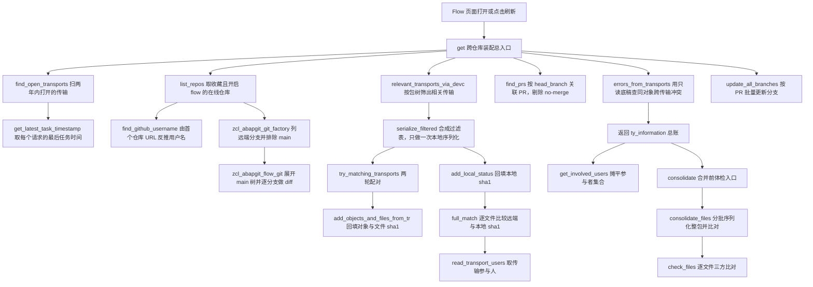
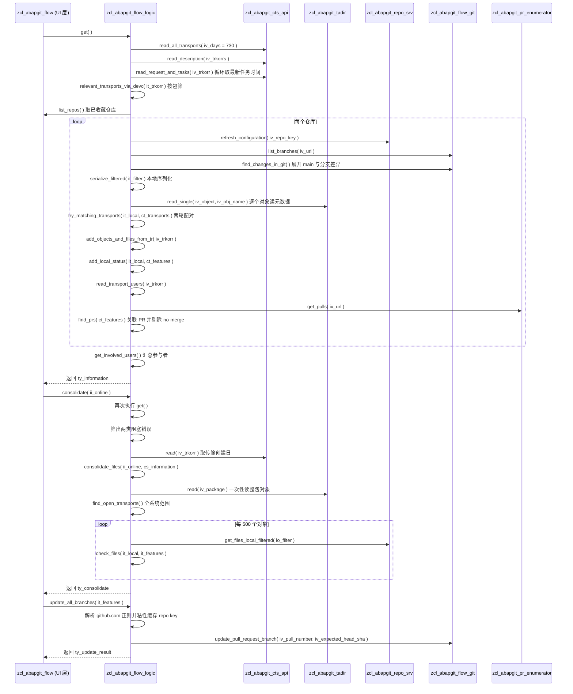

# zcl_abapgit_flow_logic 分析报告

> 分析对象：`Test-source/real/abapGit__abapGit__zcl_abapgit_flow_logic.clas.abap`（1114 行，abapGit 项目，全局类，19 个静态方法：5 个 PUBLIC + 14 个 PRIVATE）
> 源文件 SHA256：`5766bd3e7c2c1f50f2e2b85ac40410443773e708d14b6087337a29a2628a6440`
> 报告视角：代码 onboarding 走读，按真实调用链展开

---

## 一、程序定位与业务背景

### 1.1 它在 abapGit 里解决什么问题

先说清楚它**不是**什么：它不是报表，不生成 ALV，不写任何 SAP 表，也不（除一处外）做任何 HTTP 写操作。它是一个**纯计算的中枢类**——把三个互不相认的数据源摊平到一张表上。

SAP 的变更流转由 **CTS 传输请求（TRK）** 驱动，Git 的变更流转由**分支 + Pull Request** 驱动。这两套模型对"一次变更"的表达方式根本不同：

- CTS 眼里，一次变更 = 一个 TRK，里面装着若干对象条目（`R3TR PROG ZFOO`），对象在**本地工作副本**里被改，传输只是往目标系统寄送一份；
- Git 眼里，一次变更 = 一个 `feature/*` 分支，里面装着若干 blob（`src/zfoo.prog.abap`），对象在**远程仓库**里被改，PR 只是合并请求。

关键难点在于：**TRK 号和分支名之间没有任何天然关联字段。**abapGit 故意不把 TRK 号编码进分支名，因为那样就把两套流程焊死了。于是关联只能靠**推断**——唯一可用的线索是"两边改了同一批对象"。

结果就是一个开发者做完一个功能后，系统里立刻出现三个互相打架的真相来源：

1. 对象 X 躺在传输 `K9xxxxxx` 里，远端分支 `feature/new-thing` 上也有 X 的改动，本地序列化也能拿到 X；
2. 同一个 X 同时躺在 `K9000001` 和 `K9000002` 两个传输里；
3. 有人本地删了 X，从来没建传输，也删掉了远端分支上的 X。

abapGit 的 **Flow 功能**要回答的正是这三问：**哪个分支对应哪个传输？分支上的文件和本地、远端 main 各差什么 sha1？这个改动涉及哪些开发者？**`zcl_abapgit_flow_logic` 就是这层对账的算法内核。

### 1.2 为什么需要它：现有方案的不足

abapGit 本体只解决"文件同步"（本地 ↔ Git），对 CTS 是**只读旁观者**。SAP 官方的传输组织界面（`TMSPLMUI` 一族）能看传输，但它是**传输视角**：以 TRK 为行，看不到"这个 TRK 对应哪个 Git 分支"，更看不到"这个分支还没推上去"。开发者要在三个界面之间人工对照，凭记忆合并——在同时开十几个传输、几十个分支的核心系统上，这基本不可行。

这个类的价值就是把人工对照变成自动对照。注意主要工作量**不在取数上**（取数全是委派给 `zcl_abapgit_cts_api`、`zcl_abapgit_tadir`、`zcl_abapgit_git_factory`、`zcl_abapgit_pr_enumerator`），而在**配对与消歧**上：`try_matching_transports`、`add_objects_and_files_from_tr`、`serialize_filtered` 这三个方法合起来占了全部工程判断量。

### 1.3 整体设计范式（一句话定性）

> **"三方对账（reconciliation）"式纯静态编排**：以 `get` 为唯一有编排权重的入口，其余 18 个方法都是可独立调用的静态零件，共享同一个 `ty_information` / `ty_feature` 账本；靠"分支 ↔ 传输 ↔ 文件 sha1"三重循环配对，把 CTS、Git、本地序列化三个异构数据源拼成一张可读的差异表。

### 1.4 依赖清单（读这段代码前必须知道的地形）

```
本文件内可见（同一类内）  try_matching_transports / add_objects_and_files_from_tr / serialize_filtered
                          relevant_transports_via_devc / find_open_transports / get_latest_task_timestamp
                          read_transport_users / errors_from_transports / consolidate_files / check_files
                          build_repo_data / find_prs / add_local_status / find_github_username
                          常量 c_max_missing_files = 1000

本文件不可见（必须去 SE80/SE18 核实）  zif_abapgit_flow_logic=>ty_information / ty_feature / ty_features
                                        ty_local_files / ty_path_name / ty_consolidate / ty_users_tt
                                        常量 c_main / c_open_transport_days
                          zif_abapgit_git_definitions=>ty_expanded_tt 的键（path_name）
                          zcl_abapgit_flow_git=>find_changes_in_git 的写入语义（赋值还是追加）
                          zcl_abapgit_cts_api 的 read / list_open_requests / read_creation_dates /
                                        read_request_and_tasks / list_r3tr_by_request / read_description
                          zcl_abapgit_tadir=>read / read_single
                          zcl_abapgit_pr_enumerator / zcl_abapgit_pr_enum_github
```

本报告大量判断依赖上表"不可见"部分。凡是取决于这些外部契约的地方，我都明确标注了"需在 SE38/SE80 核实"，不做猜测性断言。

---

## 二、程序执行流程总览

本类有**两条独立的执行链**：主链 `get`（Flow 页面打开时跑），和合并前体检链 `consolidate`（用户点"检查是否可合并"时跑）；再加一个写操作出口 `update_all_branches`。



### 责任链表

| 子程序 | 调用者 | 职责 |
|---|---|---|
| `get` | Flow UI 层（外部，本文件不可见） | 唯一编排入口：遍历所有 flow 仓库，装配 `ty_information` 全量账本 |
| `find_open_transports` | `get`、`consolidate_files` | 扫 CTS 打开的传输，展平为 (trkorr, object, obj_name, devclass, 时间) 行集 |
| `get_latest_task_timestamp` | `find_open_transports` | 求一个请求下最后一个任务的日期时间，转成时间戳 |
| `list_repos` | `get` | 取收藏（或全部）中开启 flow 且记录变更到传输的在线仓库 |
| `find_github_username` | `get` | 由首个仓库 URL 反推 GitHub 用户名，交给 flow_exit 允许改写 |
| `build_repo_data` | `get`、`consolidate_files`、`try_matching_transports` | 把仓库的 name / key / package 三字段塞进 feature 结构 |
| `relevant_transports_via_devc` | `get` | 用本包 + 全部子包清单过滤传输表，得到相关 trkorr 集合 |
| `serialize_filtered` | `get` | 把相关传输对象 + 分支改动对象合成一张过滤表，只做一次本地序列化 |
| `try_matching_transports` | `get` | 两轮匹配：先把分支绑到传输，再把无分支的剩余传输立成独立 feature |
| `add_objects_and_files_from_tr` | `try_matching_transports`（两轮各一次） | 把传输里的对象清单翻译成文件级 sha1 差异，含删除场景重建 |
| `find_prs` | `get` | 枚举全量 PR，按 head_branch 反查 feature，剔除带 no-merge 标签的 |
| `add_local_status` | `get` | 把本地序列化的 sha1 回填到各分支的 changed_files |
| `read_transport_users` | `get` | 读请求的任务表，抽出所有 AS4USER |
| `errors_from_transports` | `get` | 全局扫描同一对象是否落在多个传输，报错并登记去重表 |
| `get_involved_users` | Flow UI 层（外部，`get` 之后） | 把所有 feature 的参与者摊平成清单 |
| `consolidate` | "检查是否可合并"按钮（外部） | 重跑一遍 `get`，只保留本仓库的两类阻塞错误 |
| `consolidate_files` | `consolidate` | 分批本地序列化整包，算出 missing_remote 与 only_remote |
| `check_files` | `consolidate_files`（每批一次） | 单批文件的三方比对，并就地削减 main 展开表 |
| `update_all_branches` | "全部更新"按钮（外部） | 对所有过期且有 PR 号的分支调用 GitHub API，带 expected head sha |

下面按这条流程逐个子程序展开。先讲数据模型与关键契约，再按主链顺序走一遍，最后收尾在合并体检链和唯一的写操作。

---

## 三、分组分析

### 3.1 类定义段：PUBLIC 契约与 PRIVATE 数据模型

这个类的定义段本身就是它的架构说明书：5 个 PUBLIC 方法构成全部对外能力，14 个 PRIVATE 方法全是纯内部零件，全部 `CLASS-METHODS` 静态方法、无实例状态。

#### ① 公共 API 全集

```abap
CLASS zcl_abapgit_flow_logic DEFINITION PUBLIC.
  PUBLIC SECTION.
    CLASS-METHODS get
      RETURNING
        VALUE(rs_information) TYPE zif_abapgit_flow_logic=>ty_information
      RAISING
        zcx_abapgit_exception.

    CLASS-METHODS get_involved_users
      IMPORTING
        is_information  TYPE zif_abapgit_flow_logic=>ty_information
      RETURNING
        VALUE(rt_users) TYPE zif_abapgit_flow_logic=>ty_users_tt.
```

**做什么** — 声明这个类对外的全部契约：`get` 无条件取全量对账账本（无 IMPORTING，返回 `ty_information`），`get_involved_users` 接受一份已算好的账本、只算参与者；后续还有 `consolidate`（传入一个在线仓库实例，做合并前体检）、`list_repos`（可选手动关闭"只看收藏"）、`update_all_branches`（唯一的写操作出口，返回 `ty_update_result` 三元计数）。全部方法都 `RAISING zcx_abapgit_exception`，把 CTS、Git、HTTP 的失败统一收敛到一个业务异常类型。

**为什么** — 全静态、无状态是这个类最正确的一个决策。`get` 要跑的 CTS 远程查询、Git porcelain 列举、PR 枚举都是重量级外部调用，如果做成有状态类就必须考虑失效策略和并发保护；做成纯函数，上层 UI 每次刷新直接重调即可，代价只是慢（后文会看到它确实慢，而且慢得不均匀）。异常只暴露一个自定义类型也是这个项目一贯的错误模型，调用方只需要一个 `CATCH`。

**风险与改进** — `ty_update_result` 只有 `updated` / `errors` / `skipped` 三个计数器，**不带任何错误原因**。而 `update_all_branches` 恰恰是最需要原因的那个操作（是 expected sha 不匹配、分支已关闭、还是权限不足？三种处理方式完全不同）。建议补一张 `ty_messages` 子表（`repo-key` + `pr-number` + 消息文本）。另外 `ty_repos_tt` 放在 PUBLIC 段却只有 `list_repos` 一个使用者，可以下沉到 `zif_abapgit_flow_logic` 与其它类型统一管理。

#### ② 私有类型与常量

```abap
  PRIVATE SECTION.

    CONSTANTS c_max_missing_files TYPE i VALUE 1000.

    TYPES: BEGIN OF ty_transport,
             trkorr     TYPE trkorr,
             title      TYPE string,
             object     TYPE tadir-object,
             obj_name   TYPE tadir-obj_name,
             devclass   TYPE tadir-devclass,
             created_on TYPE d,
             changed_at TYPE timestamp,
           END OF ty_transport.

    TYPES ty_transports_tt TYPE STANDARD TABLE OF ty_transport WITH NON-UNIQUE KEY trkorr.

    TYPES ty_trkorr_tt TYPE STANDARD TABLE OF trkorr WITH DEFAULT KEY.
```

**做什么** — 定义传输的内部行结构（传输号、标题、对象类型与名称、所属包、创建日、最后变动时间戳），两张表类型：`ty_transports_tt` 以 `trkorr` 为**非唯一键**，`ty_trkorr_tt` 是纯 trkorr 键；另加一个显示截断上限常量。

**为什么** — `WITH NON-UNIQUE KEY trkorr` 是关键设计：一个传输请求包含多个对象，展平后同一个 trkorr 必然重复多行，而全类有多处 `LOOP ... WHERE trkorr = ...` 与 `DELETE ... WHERE trkorr = ...`，声明这个键让这些定位是哈希查找而不是逐行比较。`created_on TYPE d` 与 `changed_at TYPE timestamp` 分开存也是对的——前者来自请求创建日（用户看"这个传输什么时候提的"），后者来自任务最后 AS4TIME（用户看"这个传输最后什么时候被人动过"），两个语义不同，不能合并成一个字段。

**风险与改进** — `title TYPE string` 用在会被 `SORT`、被整表复制、被深拷贝成 `lt_real_transports` 的表里：拷贝的是每个长字符串，传输数量大时内存放大明显。内部工作表用已知长度的文本表类型替代 `string` 会更稳。另外 `c_max_missing_files`、批大小 500、两年时间窗（`c_open_transport_days`，声明在接口里）三个数值都承载明确的资源权衡，却只有第一个被提成常量——见第五节 P3。

### 3.2 公共编排入口 `get`

这是全类唯一"有全局观"的方法，也是唯一把其余零件串起来的地方。按执行顺序分六步。

#### ① 取传输底稿、列仓库清单、刷新快照

```abap
    lt_all_transports = find_open_transports( ).
    lt_real_transports = lt_all_transports.

* list branches on favorite + flow enabled + transported repos
    lt_repos = list_repos( ).
    rs_information-enabled_repositories = lines( lt_repos ).
    rs_information-github_username = find_github_username( lt_repos ).

* Repository instances may contain stale snapshots when Flow is first opened
    LOOP AT lt_repos INTO li_repo_online.
      li_repo_online->zif_abapgit_repo~refresh( ).
    ENDLOOP.
```

**做什么** — 一次性把两年内打开的所有传输抓成 `lt_all_transports`，立刻深拷贝一份 `lt_real_transports` 作为只读底稿；再取需要关注的在线仓库清单，写入仓库数量与推断出的 GitHub 用户名；然后对每个仓库实例调一次 `refresh( )` 强制刷新。

**为什么** — `lt_real_transports` 这份拷贝是整个方法里最容易被忽视但最关键的一行：后续 `try_matching_transports` 会把已配对成功的传输从 `lt_all_transports` 里 `DELETE` 掉，而 `errors_from_transports` 需要的是**未被消化过的原始传输集合**才能查"同一对象是否落在多个传输"。如果直接把 `lt_all_transports` 传下去，跑完一轮之后剩下的只有未匹配传输，重复检测就完全失效。`refresh( )` 那一圈也很务实——Flow 页的第一个用户往往是过期缓存的牺牲品，先自刷新一遍能消灭一大类"数据显示不对但代码没问题"的工单。注释 `" Repository instances may contain stale snapshots when Flow is first opened"` 把这个前提写在了代码旁边，是全类注释质量的代表。

**风险与改进** — 两处：一是 `refresh( )` 在循环里对每个仓库无条件调用，触发 N 次本地配置读（N = 收藏仓库数），而绝大多数仓库的配置本来就没过期，建议先读配置时间戳、未变则跳过；二是 `lt_real_transports` 的深拷贝是含长字符串标题的整表拷贝，在打开传输上千的核心系统上是可观的内存与 CPU 开销。更省的写法是让 `errors_from_transports` 内部自己做一次拷贝（它本来就已经做了 `lt_transports = it_all_transports`），这样 `get` 里这份底稿就可以只在需要时复制。

#### ② 逐仓库列分支、建 feature 骨架、算 Git 差异

```abap
    LOOP AT lt_repos INTO li_repo_online.

      lt_branches = zcl_abapgit_git_factory=>get_v2_porcelain( )->list_branches(
        iv_url    = li_repo_online->get_url( )
        iv_prefix = zif_abapgit_git_definitions=>c_git_branch-heads_prefix )->get_all( ).

      CLEAR lt_features.
      LOOP AT lt_branches INTO ls_branch WHERE display_name <> zif_abapgit_flow_logic=>c_main.
        ls_result-repo = build_repo_data( li_repo_online ).
        ls_result-branch-display_name = ls_branch-display_name.
        ls_result-branch-sha1 = ls_branch-sha1.
        INSERT ls_result INTO TABLE lt_features.
      ENDLOOP.

      zcl_abapgit_flow_git=>find_changes_in_git(
        EXPORTING
          iv_url           = li_repo_online->get_url( )
          io_dot           = li_repo_online->zif_abapgit_repo~get_dot_abapgit( )
          iv_package       = li_repo_online->zif_abapgit_repo~get_package( )
          it_branches      = lt_branches
        IMPORTING
          et_main_expanded = lt_main_expanded
        CHANGING
          ct_features      = lt_features ).
```

**做什么** — 对每个仓库列全部分支，过滤掉 `main`；为每条剩余分支建一个 feature 记录，先只填仓库三元组、分支显示名、分支 tip 的 sha1；然后交给外部类 `zcl_abapgit_flow_git=>find_changes_in_git`，由它展开 main 的完整文件树填 `lt_main_expanded`，并逐分支做 diff、把 `changed_files`（含 `remote_sha1`）回填进每个 feature。

**为什么** — "每条非 main 分支先无条件建记录"这个决定很关键：它让"分支存在但没有任何差异"在数据层面天然可见（空 `changed_files`），上层才能区分"空分支"和"分支不存在"。Git 差异计算外包给 `zcl_abapgit_flow_git` 而不是写在 `get` 里，保持了 `get` 作为纯编排的定位——`get` 自己一行 diff 逻辑都不写，这是它可读的来源。

**风险与改进** — `lt_main_expanded` 声明在仓库循环**之外**（`DATA lt_main_expanded TYPE ...` 与 `DATA lt_features` 同一批声明），每轮仓库都把它交给 `find_changes_in_git` 的 `et_main_expanded` 形参填充，但循环内**从不 `CLEAR`**。这个形参声明为 `IMPORTING` 而非 `RETURNING`，被调用方是整体赋值还是追加，取决于 `zcl_abapgit_flow_git` 的实现（本文件不可见，**需在 SE80 核实**）；一旦是追加语义，从第 2 个仓库起 `lt_main_expanded` 就会累积上一个仓库的 main 文件，后续 `add_objects_and_files_from_tr` 会把别的仓库的文件当成"本仓库 main 上的远端内容"去比对 sha1，`full_match` 的结论随之失真。改进方向是明确的：在每次调用前 `CLEAR lt_main_expanded.`，或者把它降为仓库循环内部的局部变量——`consolidate_files` 里同一段逻辑用的就是方法局部变量，两处写法不一致本身就说明这是疏忽而不是设计。

#### ③ 按包树筛相关传输，只做一次本地序列化

```abap
      lt_relevant_transports = relevant_transports_via_devc(
        ii_repo        = li_repo_online
        it_transports  = lt_all_transports ).

      lt_local = serialize_filtered(
        it_relevant_transports = lt_relevant_transports
        ii_repo                = li_repo_online
        it_features            = lt_features
        it_all_transports      = lt_all_transports ).

      try_matching_transports(
        EXPORTING
          ii_repo          = li_repo_online
          it_local         = lt_local
          it_main_expanded = lt_main_expanded
        CHANGING
          ct_transports    = lt_all_transports
          ct_features      = lt_features ).
```

**做什么** — 先用包/子包清单从 `lt_all_transports` 筛出与本仓库有关的 trkorr 集合；再把这个集合里的全部对象 + 各分支 `changed_objects` 合成一张对象过滤表，一次性做本地序列化得到 `lt_local`；最后进入传输配对。

**为什么** — `serialize_filtered` 是全类的性能枢纽。本地序列化（读对象内容、生成 XML 或 ABAP Development Object 文件、算 sha1）是整条链上最贵的动作，如果"整包序列化"就是几万个对象全跑一遍，核心系统上不可接受。这里把所有需要看的对象汇总成一张过滤表**只序列化一次**，之后配对、补文件、回填 local sha1 全部复用同一份 `lt_local`。注释 `" from all relevant transports(matched via package)"` 与 `" and from git"` 把两个来源分得很清楚。

**风险与改进** — `lt_all_transports` 以 `CHANGING ct_transports` 身份传进 `try_matching_transports`，而那里会就地 `SORT` + `DELETE WHERE trkorr = ...`，它又声明在仓库循环之外。第 2 个仓库开始，`relevant_transports_via_devc` 与 `serialize_filtered` 拿到的都是**已被前一个仓库消化过的残缺表**：前一个仓库匹配掉的传输行已被删除，后一个仓库若也有对象在这些传输里，它的过滤表就缺这些对象，本地序列化拿不到，`changed_files` 变空，`full_match` 恒为真——页面显示"已同步"而实际未同步。作者自己在 `consolidate` 里留了 `* todo: handling multiple repositories`，这个 todo 的实质就在这里。修法是把形参改成只读的 `it_transports`，在 `try_matching_transports` 内部 `DATA lt_work = it_transports.` 复制一份再改。

#### ④ 关联 PR，回填本地状态

```abap
      find_prs(
        EXPORTING
          iv_url      = li_repo_online->get_url( )
        CHANGING
          ct_features = lt_features ).

      add_local_status(
        EXPORTING
          it_local     = lt_local
        CHANGING
          ct_features = lt_features ).
```

**做什么** — 用仓库 URL 枚举全部 PR，按 `head_branch` 与 feature 的分支名反查，命中则填 PR 标题、URL、编号、草稿态、作者，带 `no-merge` 标签的整个 feature 直接从表里删掉；接着把 `lt_local` 里的 `file-sha1` 按（路径, 文件名）回填到每个 feature 的 `changed_files-local_sha1`。

**为什么** — 顺序有讲究。`try_matching_transports` 跑完之后，`changed_files` 里同时存在两类行：来自 Git diff 的行（只有 `remote_sha1`）和来自传输对象清单的行（只有 `local_sha1`）。`add_local_status` 是唯一一处用**统一的本地序列化结果**把所有文件本地侧补齐的地方，只有跑完之后 `full_match` 才是在完整文件全集上判定的。若放在配对之前，部分新插入的行会漏掉本地 sha1，`full_match` 就会假阴性（明明同步了却说没同步）。

**风险与改进** — `add_local_status` 每次 `READ TABLE it_local ... WITH KEY file-filename = ... file-path = ...`，能否走索引完全取决于 `ty_local_files`（定义在 `zif_abapgit_flow_logic`，本文件不可见）是否把这两个字段声明成键；若没有，就是每个文件一次线性扫描，乘上"分支数 × 每分支文件数"两个维度。这个前提在代码和注释里都没有任何体现。建议在 `serialize_filtered` 返回结果时 `SORT ... BY file-filename file-path`，或在 `get` 里把 `lt_local` 转成以（filename, path）为标准键的哈希表——后者顺带解决 3.8 ② 的同款问题，一处改动两处受益。

#### ⑤ 算 full_match，取参与人，并入总账

```abap
      LOOP AT lt_features ASSIGNING <ls_feature>.
        <ls_feature>-full_match = abap_true.
        LOOP AT <ls_feature>-changed_files ASSIGNING <ls_path_name>.
          IF <ls_path_name>-remote_sha1 <> <ls_path_name>-local_sha1.
            <ls_feature>-full_match = abap_false.
          ENDIF.
        ENDLOOP.

        IF <ls_feature>-transport-trkorr IS NOT INITIAL.
          <ls_feature>-transport-users = read_transport_users( <ls_feature>-transport-trkorr ).
        ENDIF.
      ENDLOOP.

      INSERT LINES OF lt_features INTO TABLE rs_information-features.
    ENDLOOP.
```

**做什么** — 逐 feature 先默认置 `full_match = abap_true`，只要任一文件 `remote_sha1 <> local_sha1` 就置 false；若该 feature 绑定了传输，再读请求任务表抽出全部 AS4USER 存进 `transport-users`；最后把本仓库的全部 feature 并入总账。

**为什么** — `full_match` 用**双端 sha1 严格相等**判定，是"内容级一致"而不是"存在级一致"，设计正确。`read_transport_users` 只在有传输时调用，避免对纯分支 feature 做无意义 CTS 查询，这个条件判断是对的。

**风险与改进** — `read_transport_users` 对每个有传输的 feature 读一次请求任务表，而同一个 trkorr 很可能同时出现在多个仓库的 feature 里（同一个传输被多个 flow 仓库匹配到），而且 `find_open_transports` 阶段为算 `changed_at` 已经读过一次 `read_request_and_tasks`。同一个请求的任务数据在一轮 `get` 里被取 2~3 次。建议在 `get` 开头把所有相关 trkorr 的任务表一次性读进 `trkorr → tasks` 的哈希表，两处共用。

#### ⑥ 用只读底稿做全局冲突检测

```abap
    errors_from_transports(
      EXPORTING
        it_all_transports  = lt_real_transports
      CHANGING
        cs_information     = rs_information ).

  ENDMETHOD.
```

**做什么** — 用第 ① 步留下的底稿 `lt_real_transports` 做全局扫描，把"同一对象落在多个传输"的冲突写进 `rs_information-errors`，并把冲突对象登记到 `transport_duplicates`，随后整个方法返回。

**为什么** — 放在所有仓库循环**之后**、且用**底稿**而不是工作表，是本方法里最容易被写错却恰好写对了的一处。如果放在循环之前，`rs_information-features` 还是空的，`errors_from_transports` 里"该传输是否出现在某个 flow 仓库的 feature 里"的前置判断恒为假，重复冲突会被整体漏报；如果用工作表，前面被 `DELETE` 掉的行又看不到。两处选择缺一不可。

**风险与改进** — 传入的 `cs_information` 此时已累积所有仓库的 feature，但冲突判断只问"该 trkorr 是否出现在 features 里"，**不问出现在哪个仓库**。于是 A 仓库和 B 仓库各自的对象在同一传输里被同时改动时，跨仓库的耦合不会被识别，页面会分别显示两条看似独立的记录。改进：把 `errors_from_transports` 改成按 `repo-key` 分组后再判断，或至少在报错文本里带上仓库名。

### 3.3 仓库与用户上下文：`list_repos`、`build_repo_data`、`find_github_username`

这三个是轻量零件，但各自藏着一处值得说的判断。

#### ① 仓库准入筛选 `list_repos`

```abap
    IF iv_favorites_only = abap_true.
      lt_repos = zcl_abapgit_repo_srv=>get_instance( )->list_favorites( abap_false ).
    ELSE.
      lt_repos = zcl_abapgit_repo_srv=>get_instance( )->list( abap_false ).
    ENDIF.

    LOOP AT lt_repos INTO li_repo.
      IF li_repo->get_local_settings( )-flow = abap_false.
        CONTINUE.
      ELSEIF zcl_abapgit_factory=>get_sap_package( li_repo->get_package( )
          )->are_changes_recorded_in_tr_req( ) = abap_false.
        CONTINUE.
      ENDIF.

      li_online ?= li_repo.
      INSERT li_online INTO TABLE rt_repos.
    ENDLOOP.
```

**做什么** — 按 `iv_favorites_only` 决定走收藏列表还是全量列表；逐个检查两项准入条件——本地配置 `flow` 开关必须为真、该包必须开启"变更记录到传输请求"；通过后把 `zif_abapgit_repo` 引用用 `?=` 转成 `zif_abapgit_repo_online` 插入结果表。

**为什么** — 第二个条件是这个方法里最有价值的一行业务判断：SAP 里"是否在变更记录中"是包的一个属性，如果一个包关闭了它，那么它的对象变更**根本不会出现在 CTS 传输里**，Flow 就永远配不上任何传输——对这类仓库展示 Flow 界面只会给用户一堆"有分支但永远没有传输"的困惑行。在数据源头就整批过滤掉，比在 UI 上贴免责声明好得多。`iv_favorites_only` 默认 `abap_true` 也合理：全仓库扫描的耗时不可接受。

**风险与改进** — `li_online ?= li_repo.` 是**无 `sy-subrc` 检查的条件赋值**。`?=` 做动态类型转换，失败时目标保持初始值且不抛异常，于是 `rt_repos` 可能混入一个**初始引用**。这个错误不会在本方法暴露，而是延后到 `get` 里 `li_repo_online->zif_abapgit_repo~refresh( )` 或 `->get_url( )` 时以空对象引用异常的形式炸掉，排查成本极高。收藏列表里混着一个纯本地仓库（没有远端、未实现 `zif_abapgit_repo_online`）就会触发。正确写法是赋值后紧跟 `IF li_online IS NOT INITIAL` 或 `CHECK sy-subrc = 0`。另外 `zcl_abapgit_factory=>get_sap_package( ... )` 在循环体内每次都取一次工厂，可提到循环外。

#### ② 仓库三元组装配 `build_repo_data`

```abap
  METHOD build_repo_data.
    rs_data-name = ii_repo->get_name( ).
    rs_data-key = ii_repo->get_key( ).
    rs_data-package = ii_repo->get_package( ).
  ENDMETHOD.
```

**做什么** — 从仓库接口取 name、key、package 三个属性填进 `ty_feature-repo`。

**为什么** — 抽出来而不是在 `get`、`consolidate_files`、`try_matching_transports` 三处各写三行赋值，是合理的去重：这三处都在构造 feature 骨架，未来若要往 feature 里加"仓库是否强制 flow"之类的字段，改一处即可。这类三行以下的抽取看起来收益微小，但在 abapGit 这种"一个类被多个 PR 同时改"的协作项目里意义不小。

**风险与改进** — 无逻辑风险。唯一可提的是形参类型是宽接口 `zif_abapgit_repo` 而非 `zif_abapgit_repo_online`，这是刻意的宽接口设计（`consolidate_files` 传入的是 `li_repo ?= ii_online` 得到的宽引用），保持了该方法对本地仓库也可用，属于合理的前瞻性设计。

#### ③ 用户名反推 `find_github_username`

```abap
    READ TABLE it_repos INTO li_repo_online INDEX 1.
    IF sy-subrc = 0.
      TRY.
          rv_username = zcl_abapgit_login_manager=>get_username( li_repo_online->get_url( ) ).
        CATCH zcx_abapgit_exception ##NO_HANDLER.
      ENDTRY.
    ENDIF.

    TRY.
        li_exit = zcl_abapgit_flow_exit=>get_instance( ).
        li_exit->change_github_username( CHANGING cv_username = rv_username ).
      CATCH zcx_abapgit_exception ##NO_HANDLER.
    ENDTRY.
```

**做什么** — 取传入仓库列表的**第一个**仓库，用它的 URL 让登录管理器推断当前 GitHub 用户名；无论成功失败，最后都交给 `zif_abapgit_flow_exit` 的退出钩子，允许它改写这个用户名。

**为什么** — "用第一个仓库推断用户名"在 GitHub 语义下成立：abapGit 的 GitHub URL 格式固定，同一个系统里所有仓库的 user 段必然相同（除非跨组织 fork）。把"可改写"做成 exit 钩子而不是写死，是这个项目一贯的扩展点设计——GitHub Enterprise 的 API 路径不同，这里并不假设这一点。

**风险与改进** — 该推断对**列表顺序有隐式依赖**：只要收藏列表里第一个仓库不是 GitHub（GitLab、Bitbucket、内部 Git 服务器），`get_username` 抛异常被 `##NO_HANDLER` 吞掉，`rv_username` 保持初始值，整个 Flow 页的用户名与"查看全部 PR"链接**静默为空**。用户看到的是"页面坏了"而不是"用户名取不到"。改进：遍历仓库列表直到推断成功；更根本的做法是从 abapGit 配置读当前用户，而不是从 URL 反推。

### 3.4 传输数据源：`find_open_transports` 与 `get_latest_task_timestamp`

所有配对都建立在 `find_open_transports` 产出的那张表上。它是整条链的数据源头，也是 N+1 查询最密集的地方。

#### ① 限定时间窗并列出请求

```abap
* only look for transports that are created/changed in the last two years
    ls_date-sign = 'I'.
    ls_date-option = 'GE'.
    ls_date-low = sy-datum - zif_abapgit_flow_logic=>c_open_transport_days.
    INSERT ls_date INTO TABLE lt_date.

    lt_trkorr = zcl_abapgit_factory=>get_cts_api( )->list_open_requests( lt_date ).
    lt_created_on = zcl_abapgit_factory=>get_cts_api( )->read_creation_dates( lt_trkorr ).
```

**做什么** — 组装一个 `GE` 日期区间（今天减 `c_open_transport_days`，注释写明是两年），交给 CTS 列出该窗口内**打开状态**的请求号；再用这批请求号一次性批量读出创建日期表。

**为什么** — "打开的"而不是"已释放的"是这个场景唯一正确的筛选：Flow 关心的是**正在进行的变更**，已释放的传输其内容已经在目标系统里，与 Git 分支没有配对意义。批量读创建日期说明作者在这里意识到了 N+1——同一个类里后文恰恰没做到这一点。两年窗口是性能保护：核心系统上打开的传输可以积压到几万条，没有窗口限制会让每次刷新都把全系统传输拉一遍。

**风险与改进** — 两年窗口是一个**硬编码的业务假设**。核心系统里有停留超过两年的打开传输（长期未释放的项目型开发并不罕见），这些传输及其对象会被完全忽略：`serialize_filtered` 不会序列化它们，`consolidate_files` 也不会检测它们的差异，用户因此**永远看不到**"这个对象躺在一个被忽略的传输里"。建议窗口做成可配置，或至少在结果里报告"另有 N 个超出窗口的传输被跳过"。

#### ② 逐请求填元数据

```abap
    LOOP AT lt_trkorr INTO lv_trkorr.
      ls_result-trkorr = lv_trkorr.
      ls_result-title  = zcl_abapgit_factory=>get_cts_api( )->read_description( lv_trkorr ).
      READ TABLE lt_created_on INTO ls_created_on WITH TABLE KEY trkorr = lv_trkorr.
      IF sy-subrc = 0.
        ls_result-created_on = ls_created_on-created_on.
      ELSE.
        CLEAR ls_result-created_on.
      ENDIF.
      ls_result-changed_at = get_latest_task_timestamp( lv_trkorr ).
```

**做什么** — 每个请求读一次描述作为标题；从已批量取回的创建日期表里用 `WITH TABLE KEY trkorr` 精确取出创建日（取不到就显式 `CLEAR`）；调用 `get_latest_task_timestamp` 填最后变动时间。

**为什么** — 创建日期走"批量读 + 表键查表"而不是逐请求单读，避免了 N 次数据库往返，这个对比在下一条里会显得更明显。显式 `CLEAR ls_result-created_on` 而不是留残值，说明作者清楚 `ls_result` 是跨循环复用的工作区。

**风险与改进** — `read_description` 是**逐请求调用**，CTS 里读传输标题通常要走文本表，几千个请求就是几千次远程调用，而这些标题在整轮刷新中只用于展示。应改为按请求号表批量读一次文本。`get_latest_task_timestamp` 同样逐请求读任务表（见 ③），这是本方法最大的 N+1 来源。另外更稳妥的写法是每轮循环开头整体 `CLEAR ls_result`，这样将来结构加字段时不会漏掉初始化。

#### ③ 展开传输对象并带出所属包

```abap
* LIMU skipped here:
" SOTT = Concept (Online Text Repository) - Short Texts for packages are not serialized anyhow
      CLEAR ls_limu_skip.
      ls_limu_skip-sign = 'I'.
      ls_limu_skip-option = 'EQ'.
      ls_limu_skip-low = 'SOTT'.
      INSERT ls_limu_skip INTO TABLE lt_limu_skip.
      lt_objects = zcl_abapgit_factory=>get_cts_api( )->list_r3tr_by_request(
        iv_request         = lv_trkorr
        it_skip_limu_types = lt_limu_skip ).

* R3TR can be skipped here
      LOOP AT lt_objects ASSIGNING <ls_object>
          WHERE object <> 'CINS'
          AND object <> 'NOTE'.
        ls_result-object   = <ls_object>-object.
        ls_result-obj_name = <ls_object>-obj_name.

        lv_obj_name = <ls_object>-obj_name.
        ls_result-devclass = zcl_abapgit_factory=>get_tadir( )->read_single(
          iv_object   = ls_result-object
          iv_obj_name = lv_obj_name )-devclass.
        IF ls_result-devclass IS NOT INITIAL.
          INSERT ls_result INTO TABLE rt_transports.
        ENDIF.
      ENDLOOP.
```

**做什么** — 为每个请求列出它的 R3TR 对象条目，显式排除 LIMU 里的 `SOTT`（包内短文本，不会被序列化）以及 R3TR 里的 `CINS`（对象分配/继承关系）与 `NOTE`（传输备注）；对每个剩余对象查一次 TADIR 取所属包，**包非空的行才插入结果表**。

**为什么** — 排除这三类有明确业务依据：`SOTT` 不进 abapGit 序列化产物，`CINS` 与 `NOTE` 不是可序列化对象，放进传输表只会污染后续的对象名匹配（`CINS` 的 obj_name 形如 `ZPKG~ZCLS`，永远匹配不上任何文件）。注释写得相当克制准确——`" R3TR can be skipped here"` 与 `" LIMU skipped here"` 分开标注了为什么两处过滤的必要性不同，这是读过 CTS 传输结构的人才写得出来的细节。

**风险与改进** — 两点。第一是 N+1：`read_single` 是**每个对象一次 TADIR 查询**，一个传输 20 个对象就是 20 次往返，几千个传输就是几万次；而且 `zcl_abapgit_factory=>get_tadir( )` 在循环体内每次都取一次工厂。TADIR 本来就可以按对象列表批量读（abapGit 的 `get_tadir( )->read( )` 就支持，`consolidate_files` 里正是这么用的），应改为把这一批传输的所有（object, obj_name）汇总后一次读出、devclass 带回填。第二是正确性：`IF ls_result-devclass IS NOT INITIAL` 把 devclass 为初始的条目**整条丢弃**，而 local object（未分配包的程序/类）在 CTS 里合法存在。这些对象所在的传输在本类里彻底不可见——既不参与配对，也不参与跨传输冲突检测，`consolidate` 也不会报告。

#### ④ 最后任务时间戳 `get_latest_task_timestamp`

```abap
    TRY.
        lt_tasks = zcl_abapgit_factory=>get_cts_api( )->read_request_and_tasks( iv_trkorr ).

        LOOP AT lt_tasks INTO ls_task.
          IF ls_task-as4date > lv_max_date
              OR ( ls_task-as4date = lv_max_date AND ls_task-as4time > lv_max_time ).
            lv_max_date = ls_task-as4date.
            lv_max_time = ls_task-as4time.
          ENDIF.
        ENDLOOP.

        IF lv_max_date IS NOT INITIAL.
          CONVERT DATE lv_max_date TIME lv_max_time INTO TIME STAMP rv_changed_at TIME ZONE sy-zonlo.
        ELSE.
          GET TIME STAMP FIELD rv_changed_at.
        ENDIF.
      CATCH zcx_abapgit_exception.
        GET TIME STAMP FIELD rv_changed_at.
    ENDTRY.
```

**做什么** — 读出该请求下全部任务，用"先比日期、再比时间"的复合条件取 AS4DATE / AS4TIME 的最大值；命中则按时区转换成时间戳写入；**没有任务**或**读取抛异常**，都回落到"取当前时间戳"。

**为什么** — AS4DATE 与 AS4TIME 在 CTS 任务表里是分开存储的，没有直接可比较的组合字段，所以必须做复合比较。这里手写的 `OR (日期相同 AND 时间更大)` 是正确的字典序写法，没有偷懒用字符串拼接（拼接在跨时区场景下会错）。

**风险与改进** — 两点。第一，**异常回落是本方法最严重的问题**：读失败时返回 `GET TIME STAMP`，也就是"现在"。这个值会一路流到 `ty_feature-transport-changed_at`，用户看到的是"这个传输刚刚被改动过"，而它可能三年前就创建了。这是**静默的错误信息**，比抛异常危害大得多——用户会据此判断传输活跃度、做出错误决策。方法签名本身已 `RAISING zcx_abapgit_exception`，完全有条件让异常上抛；或者引入明确的"未知"语义（置 0，让上层显示占位符）。另外"没有任务"和"读取失败"两种完全不同的情况被合并进同一个 `GET TIME STAMP`，也应当区分。第二，`CONVERT ... TIME ZONE sy-zonlo` 的参数语义可疑：`TIME ZONE` 期望的是时区**名称**（如 `CET`），而 `sy-zonlo` 是本地时区到中央机时区的**分钟偏移量**；两者都是字符类型所以能编译通过，但传进去的值不是任何已知时区名。实际行为取决于运行时的回退规则，**需在 SE38 用非零时区实测确认**。此外 E070 里 AS4DATE/AS4TIME 是否为中央时间也需要核实，否则这里还存在一个时区偏移量的系统性偏差。

### 3.5 按包树筛相关传输 `relevant_transports_via_devc`

```abap
    lt_trkorr = it_transports.
    SORT lt_trkorr BY trkorr.
    DELETE ADJACENT DUPLICATES FROM lt_trkorr COMPARING trkorr.

    lt_packages = zcl_abapgit_factory=>get_sap_package( ii_repo->get_package( ) )->list_subpackages( ).
    INSERT ii_repo->get_package( ) INTO TABLE lt_packages.

    LOOP AT lt_trkorr ASSIGNING <ls_trkorr>.
      lv_found = abap_false.

      LOOP AT lt_packages ASSIGNING <lv_package>.
        READ TABLE it_transports TRANSPORTING NO FIELDS WITH KEY trkorr = <ls_trkorr>-trkorr devclass = <lv_package>.
        IF sy-subrc = 0.
          lv_found = abap_true.
          EXIT.
        ENDIF.
      ENDLOOP.
      IF lv_found = abap_false.
        CONTINUE.
      ENDIF.

      IF lv_found = abap_true.
        INSERT <ls_trkorr>-trkorr INTO TABLE rt_transports.
      ENDIF.
    ENDLOOP.
```

**做什么** — 先把整张传输表复制一份、按 trkorr 排序去重，得到唯一请求号序列；取出该包及其**全部子包**清单；然后对每个请求号，检查传输表里是否有一行属于上述任一包，命中就把该请求号放进结果表。

**为什么** — 用"包 + 子包"作为相关性判据是唯一可行的选择：传输表里没有"这个请求属于哪个仓库"的字段，但每个对象行带 `devclass`，只要请求里有一行对象属于本包树，就说明它与本仓库相关。这比"按传输标题模糊匹配"或"按对象名是否出现在某些文件里"稳健得多。`TRANSPORTING NO FIELDS` 只关心存在性、不复制结构，是正确的查找意图声明。

**风险与改进** — 三处。① `IF lv_found = abap_false. CONTINUE. ENDIF.` 紧跟着 `IF lv_found = abap_true. INSERT ... ENDIF.`——第二个判断在 `CONTINUE` 之后**恒为真**，是纯冗余分支，删掉即可。② `lt_trkorr LIKE it_transports` 复制的是含长字符串标题的**宽行**，目的只是去重 trkorr；而类定义段已经为这个用途定义好了 `ty_trkorr_tt`，却没有用它——这是"定义了正确的类型却没用"的典型。③ 外层 trkorr × 内层子包的双层循环，每次执行 `READ TABLE it_transports TRANSPORTING NO FIELDS WITH KEY trkorr = ... devclass = ...`。注意 `ty_transports_tt` 声明的键只有 `trkorr`，用 `trkorr + devclass` 检索**不是表键**，等于每对组合都做一次全表线性扫描；子包数百的包树上就是几十万次比较。可以在进方法时按 trkorr 建索引，或把 `lt_packages` 预先排序后对传输表单遍扫描累积命中。此外 `list_subpackages( )` 与 `try_matching_transports` 第二轮算的是**同一份数据**，在同一轮 `get` 里被重复取了一次。

### 3.6 过滤式序列化 `serialize_filtered`

```abap
* from all relevant transports(matched via package)
    LOOP AT it_relevant_transports INTO lv_trkorr.
      LOOP AT it_all_transports ASSIGNING <ls_transport> WHERE trkorr = lv_trkorr.
        APPEND INITIAL LINE TO lt_filter ASSIGNING <ls_filter>.
        <ls_filter>-object = <ls_transport>-object.
        <ls_filter>-obj_name = <ls_transport>-obj_name.
      ENDLOOP.
    ENDLOOP.

* and from git
    LOOP AT it_features INTO ls_feature.
      LOOP AT ls_feature-changed_objects INTO ls_changed_object.
        APPEND INITIAL LINE TO lt_filter ASSIGNING <ls_filter>.
        <ls_filter>-object = ls_changed_object-obj_type.
        <ls_filter>-obj_name = ls_changed_object-obj_name.
      ENDLOOP.
    ENDLOOP.

    SORT lt_filter BY object obj_name.
    DELETE ADJACENT DUPLICATES FROM lt_filter COMPARING object obj_name.

    CREATE OBJECT lo_filter EXPORTING it_filter = lt_filter.
    rt_local = ii_repo->get_files_local_filtered( lo_filter ).
```

**做什么** — 汇总两类对象来源：一是 `it_relevant_transports` 里各传输的（object, obj_name），二是各分支 feature 的 `changed_objects`；合并后按对象类型 + 名称排序去重，包进 `zcl_abapgit_object_filter_obj` 调一次 `get_files_local_filtered`，返回本地序列化结果（每个文件带路径、文件名、sha1、所属对象类型与名称）。

**为什么** — 这是整个类的性能枢纽。被过滤掉的每一个对象，都意味着一整次"读对象内容 + 生成序列化文件 + 算 sha1"的成本被完全跳过。如果不做这一步，就得对整个包（可能几万个对象）全量序列化，然后在配对阶段把绝大部分丢掉。用（object, obj_name）作去重键、排序后 `DELETE ADJACENT DUPLICATES`，让两类来源里同一个对象（既在传输里又被分支改了）合并成一行、只序列化一次。

**风险与改进** — 这里要**纠正一个常见误判**：`APPEND INITIAL LINE TO lt_filter ASSIGNING <ls_filter>` 是安全写法，`INITIAL LINE` 明确保证新行被初始化为初始值，不存在动态区残留；随后两个字段又被显式赋值，因此本处无风险。真正的隐患在别处：① 它的前提是 `it_all_transports` 必须仍是**未被前序步骤修改**的原始表，而这正是 3.2 ③ 记录的问题（`CHANGING ct_transports` 就地 `DELETE`）；② `lt_filter` 累积所有对象后一次性传给 `get_files_local_filtered`，没有像 `consolidate_files` 那样分批——当收藏仓库很多、相关传输很大时，这里同样有内存峰值问题，两处策略不一致。

### 3.7 两轮配对：`try_matching_transports`

这是全类算法含量最高的方法：第一轮把分支绑到传输，第二轮把"有传输但没有任何分支改动"的剩余传输立成独立 feature。

#### ① 第一轮：用对象名做二分查找

```abap
    SORT ct_transports BY object obj_name.

    LOOP AT ct_features ASSIGNING <ls_feature>.
      LOOP AT <ls_feature>-changed_objects ASSIGNING <ls_changed>.
        READ TABLE ct_transports ASSIGNING <ls_transport>
          WITH KEY object = <ls_changed>-obj_type obj_name = <ls_changed>-obj_name BINARY SEARCH.
        IF sy-subrc = 0.
          <ls_feature>-transport-trkorr = <ls_transport>-trkorr.
          <ls_feature>-transport-title = <ls_transport>-title.
          <ls_feature>-transport-created_on = <ls_transport>-created_on.
          <ls_feature>-transport-changed_at = <ls_transport>-changed_at.

          add_objects_and_files_from_tr(
            EXPORTING
              iv_trkorr        = <ls_transport>-trkorr
              it_local         = it_local
              it_main_expanded = it_main_expanded
              it_transports    = ct_transports
            CHANGING
              cs_feature       = <ls_feature> ).

          DELETE ct_transports WHERE trkorr = <ls_transport>-trkorr.
          EXIT.
        ENDIF.
      ENDLOOP.
    ENDLOOP.
```

**做什么** — 先把传输工作表按（对象类型, 对象名）排序；外层遍历每个分支 feature、内层遍历它改动过的每个对象，用这两个字段在传输表里做二分查找；命中就把该传输的四个字段写到 feature 上，调 `add_objects_and_files_from_tr` 补全对象与文件清单，**再把该传输的全部行从工作表里删除**，然后 `EXIT` 跳出内层循环（一个分支只绑一个传输）。

**为什么** — "命中即删除"是这个算法的关键设计：一个传输只应对应一个分支，否则同一个传输会被重复算进多个分支的差异里，页面上出现多条"看似不同实则同一改动"的记录。删除同时实现两个目的——消费掉它、让后续分支有机会匹配到下一个候选。`EXIT` 明确了"一个分支最多绑一个传输"的业务约束。

**风险与改进** — 先纠正一个高频误判：这里的 `BINARY SEARCH` **是合法的**。ABAP 对二分检索的要求是"检索键必须是表当前排序序列的前缀"，而这里先 `SORT ct_transports BY object obj_name`、再以 `object + obj_name` 检索，排序序列与检索键完全一致；`ty_transports_tt` 声明的 `trkorr` 键与二分检索无关。`DELETE WHERE trkorr = ...` 也不破坏已建立的排序。真正的风险是它**依赖那条 `SORT` 语句的存在**——排序与检索相隔六行、且检索发生在被 `DELETE` 修改过的表上，任何人在中间插入一次按其它字段的重排，二分检索都会**静默返回错误行**（不会报错），症状表现为"分支配到了不相干的传输"。建议在检索前紧邻处加一句排序意图注释。

第二个是真问题：`DELETE ... WHERE trkorr = ...` 会删掉该传输的**全部**对象行。若传输 K 含对象 A、B，分支 F1 改了 A、分支 F2 改了 B，则 F1 先命中 K 并删掉两行；F2 内层循环再无候选，`transport-trkorr` 保持初始，最终 `consolidate` 会报"F2 这个分支没有传输"——**而 B 明明在 K 里**。同时 K 的全部对象（含 B）被 `add_objects_and_files_from_tr` 塞进了 F1。根因在数据模型：`ty_feature` 只有一个 `transport-trkorr` 字段，无法表达"一个分支对应多个传输"。

#### ② 第二轮：把剩余传输立成独立 feature

```abap
* unmatched transports
    lt_trkorr = ct_transports.
    SORT lt_trkorr BY trkorr.
    DELETE ADJACENT DUPLICATES FROM lt_trkorr COMPARING trkorr.

    lt_packages = zcl_abapgit_factory=>get_sap_package( ii_repo->get_package( ) )->list_subpackages( ).
    INSERT ii_repo->get_package( ) INTO TABLE lt_packages.

    LOOP AT lt_trkorr INTO ls_trkorr.
      lv_found = abap_false.
      LOOP AT lt_packages INTO lv_package.
        READ TABLE ct_transports ASSIGNING <ls_transport> WITH KEY trkorr = ls_trkorr-trkorr devclass = lv_package.
        IF sy-subrc = 0.
          lv_found = abap_true.
          EXIT.
        ENDIF.
      ENDLOOP.
      IF lv_found = abap_false.
        CONTINUE.
      ENDIF.

      CLEAR ls_result.
      ls_result-repo = build_repo_data( ii_repo ).
      ls_result-transport-trkorr = <ls_transport>-trkorr.
      ls_result-transport-title = <ls_transport>-title.
      ls_result-transport-created_on = <ls_transport>-created_on.
      ls_result-transport-changed_at = <ls_transport>-changed_at.

      add_objects_and_files_from_tr(
        EXPORTING
          iv_trkorr        = ls_trkorr-trkorr
          it_local         = it_local
          it_main_expanded = it_main_expanded
          it_transports    = ct_transports
        CHANGING
          cs_feature       = ls_result ).

      INSERT ls_result INTO TABLE ct_features.
    ENDLOOP.

  ENDMETHOD.
```

**做什么** — 上一轮没被消费掉的传输（即没有任何分支改动其中对象的那些），去重后逐个做包相关性筛选；相关的就造一个**没有分支**的 feature，填上传输四字段，补全对象与文件清单，插入 feature 表。

**为什么** — 这一轮产生的正是 Flow 最需要呈现的一类数据：**"有传输但没有分支"**——开发者在本地做完了、建了传输，但忘了在 GitHub 上开分支。这是 abapGit 存在的主要理由之一。没有这一轮，这部分变更在界面上完全不可见，用户无从知道该去做什么。同样的包相关性判据在这里第二次使用，保证造出来的 feature 确实属于本仓库。

**风险与改进** — ① `lt_packages` 与 `relevant_transports_via_devc` 算的是**同一份数据**（本包 + 子包），在同一轮 `get` 里重复取了一次 `list_subpackages( )`（要读包树，子包多的包不便宜）；应提取为共用方法或在 `get` 里算一次传下来。② `READ TABLE ct_transports ... WITH KEY trkorr = ... devclass = ...` 里的 `devclass` 不在表键内（`ty_transports_tt` 的键只有 `trkorr`），因此是线性扫描；乘以"剩余 trkorr 数 × 子包数"两层循环，与 3.5 的第三个问题同源。③ 第一轮被 `DELETE` 掉的传输在本轮**不会**出现（本轮只遍历剩余行），这放大了上面描述的多传输分支丢失问题——丢失的信息无处可去。

### 3.8 传输翻译成文件差异：`add_objects_and_files_from_tr`

这个方法是配对的最后一环，也是 `sy-subrc` 陷阱最集中的地方。分五步。

#### ① 登记改动对象

```abap
    LOOP AT it_transports ASSIGNING <ls_transport> WHERE trkorr = iv_trkorr.
      ls_changed-obj_type = <ls_transport>-object.
      ls_changed-obj_name = <ls_transport>-obj_name.
      INSERT ls_changed INTO TABLE cs_feature-changed_objects.
```

**做什么** — 按传输号（借 `trkorr` 非唯一键一次定位整组）遍历该传输的每一行，把（对象类型, 对象名）追加进 feature 的 `changed_objects`。

**为什么** — `changed_objects` 是整个配对算法的**比较维度**：第一轮匹配就是拿分支的 `changed_objects` 去撞传输的对象行，所以这里登记得全不全直接决定绑定准不准。

**风险与改进** — `ls_changed` 是方法级工作区，**没有 `CLEAR`**，而同一方法后面处理删除场景的 `ls_item` 却显式 `CLEAR` 了，两处风格不一致。目前 `ty_feature-changed_objects` 若只有 `obj_type` / `obj_name` 两个字段，没有实际影响；但只要这个结构将来加第三个字段（比如 `progname`、`filename`），残留值就会混进 feature，症状是"某些对象的附带字段莫名其妙"，极难定位。建议每轮 `CLEAR ls_changed.` 或改用 `INSERT VALUE #( ... ) INTO TABLE`。另外这里 `INSERT INTO TABLE` 不去重：若 CTS 对同一请求返回了重复对象行，`changed_objects` 会有重复行，进而让第一轮内层循环重复遍历。

#### ② 收集本地仍存在的对象文件

```abap
      LOOP AT it_local ASSIGNING <ls_local>
          WHERE file-filename <> zif_abapgit_definitions=>c_dot_abapgit
          AND item-obj_type = <ls_transport>-object
          AND item-obj_name = <ls_transport>-obj_name.

        CLEAR ls_changed_file.
        ls_changed_file-path       = <ls_local>-file-path.
        ls_changed_file-filename   = <ls_local>-file-filename.
        ls_changed_file-local_sha1 = <ls_local>-file-sha1.

        READ TABLE it_main_expanded ASSIGNING <ls_main_expanded>
          WITH TABLE KEY path_name COMPONENTS
          path = ls_changed_file-path
          name = ls_changed_file-filename.
        IF sy-subrc = 0.
          ls_changed_file-remote_sha1 = <ls_main_expanded>-sha1.
        ENDIF.

        INSERT ls_changed_file INTO TABLE cs_feature-changed_files.
      ENDLOOP.
```

**做什么** — 在本地序列化结果里找出属于这个对象的**所有文件**（排除 `.abapgit` 配置文件本身），逐个写入 path / filename / local_sha1；再用复合表键 `path_name`（path + name）去 main 展开表里找同名同路径的文件，找到就把远端 sha1 一并记上，最后插入 `changed_files`。

**为什么** — 排除 `c_dot_abapgit` 是必须的：`.abapgit` 是每个包都有的包级序列化文件，不是"传输里的对象"，混进来会让每个 feature 的 `changed_files` 都多一条噪音行，破坏 `full_match` 判定。用复合键查找而不是只按文件名，是因为同一对象在不同路径下（`/src/` 与子包目录）可能有同名文件。给 `changed_files` 同时装上 local 与 remote 两侧的 sha1，是后面 `add_local_status` 与 `full_match` 能成立的数据基础。

**风险与改进** — 效率问题：外层是传输行数，内层是 `it_local` 的 `LOOP ... WHERE` 带条件全扫（`LOOP ... WHERE` 无法走表键），两个维度相乘。一个传输 30 个对象、本地序列化出 3000 个文件，就是 9 万次比较。改进：先按（item-obj_type, item-obj_name）把 `it_local` 排序并二分定位每组，或让 `ty_local_files` 带上（object, obj_name）键——这与 3.10 的 `add_local_status` 是同一张表，应一并解决。

#### ③ 判定删除场景并推导文件名模式

```abap
      IF sy-subrc <> 0.
* then its a deletion
        CLEAR ls_item.
        ls_item-obj_type = <ls_transport>-object.
        ls_item-obj_name = <ls_transport>-obj_name.

        IF zcl_abapgit_aff_factory=>get_registry( )->is_supported_object_type( <ls_transport>-object ) = abap_true.
          lv_extension = 'json'.
        ELSE.
          lv_extension = 'xml'.
        ENDIF.

        lv_main_file = zcl_abapgit_filename_logic=>object_to_file(
          is_item = ls_item
          iv_ext  = lv_extension ).
        CONCATENATE '.' lv_extension INTO lv_extension.
        lv_filename = lv_main_file.
        REPLACE FIRST OCCURRENCE OF lv_extension IN lv_filename WITH '*'.

        IF lv_filename = 'package.devc*'.
* this might leave deleted packages in git, but its okay for now
          CONTINUE.
        ENDIF.
```

**做什么** — 若上一段的本地文件循环没有找到任何匹配（作者用 `sy-subrc` 判断），认为这个对象是**被删除**的：用 abapGit 的文件名逻辑推出该对象在 Git 里的主文件名（按对象类型是否支持 ABAP Development Object 决定扩展名是 `json` 还是 `xml`），再把扩展名替换成通配符 `*`，得到能匹配该对象**全部**序列化文件的模式；若是 `package.devc`（包本身）则直接跳过。

**为什么** — 删除是最难表达的变更：传输里有一个对象，本地没有，Git 上可能还有文件。用"文件名模式 + main 展开表"重建删除记录，是在没有 Git diff 支持的情况下唯一可行的近似方案。扩展名要区分 `xml` / `json` 是因为 abapGit 对支持的类型用 ABAP Development Object（`.json`）格式序列化，其余仍走 XML——文件名不同，通配模式自然不同。用 `zcl_abapgit_filename_logic` 而不是自己拼字符串，是把命名规则收敛到唯一权威实现。

**风险与改进** — **这是全类最需要一次实测的地方**：`IF sy-subrc <> 0.` 依赖的是**内层 `LOOP ... ENDLOOP` 之后**的 `sy-subrc`，而 `LOOP` 语句本身并不保证设置 `sy-subrc`。这个位置的值只有两种可能来源——循环体内最后一条语句（第 246 行的 `INSERT ls_changed_file INTO TABLE ...`，结果为 0），或循环前最后一条语句（第 226 行的 `INSERT ls_changed INTO TABLE ...`，同样为 0）。若运行时确实在"零匹配"时置 4，这段逻辑成立；若不置，则**删除分支在整个删除场景里一次都不会进入**，其可观测症状是：本地删除了对象的传输，在 Flow 里只显示 `changed_objects`、`changed_files` 为空，且 `full_match` 恒为真（空循环不置 false）。**请在 SE38 用一个真实删除场景跑一次确认**——这是唯一一个"要么全对、要么整条删除链路全废"的分支。无论哪种结论，正确写法都应是显式标志位：循环内命中时置 `lv_found = abap_true`，`ENDLOOP` 后判 `IF lv_found = abap_false.`

另外两处次一级问题：`IF lv_filename = 'package.devc*'` 的 `CONTINUE` 会**跳过整个传输行**（不止跳过 `changed_objects` 登记），意味着包被删除时该传输的其余对象也不会被处理——作者用注释承认了这一点，但注释把影响范围说小了：影响的不只是"git 里留下已删包"，还有该传输其余对象在本轮的处理。以及 `is_supported_object_type` 把删除检测与 AFF 注册表耦合：某对象类型的序列化格式在升级中翻转时，生成的通配模式（`.xml*` ↔ `.json*`）会与 main 上实际文件名不匹配，删除行被漏登记。

#### ④ 按模式回收远端文件

```abap
        LOOP AT it_main_expanded ASSIGNING <ls_main_expanded>
            WHERE name CP lv_filename.
          CLEAR ls_changed_file.
          ls_changed_file-filename    = <ls_main_expanded>-name.
          ls_changed_file-path        = <ls_main_expanded>-path.
          ls_changed_file-remote_sha1 = <ls_main_expanded>-sha1.
          INSERT ls_changed_file INTO TABLE cs_feature-changed_files.
        ENDLOOP.
```

**做什么** — 在 main 展开表里按文件名通配模式捞出该对象在远端 main 上的全部文件，只填 path / filename / **remote_sha1**，`local_sha1` 留空——本地已经没有这些文件了。

**为什么** — 保持"有远端无本地"这一侧不填 `local_sha1`，与 `full_match` 的判定逻辑自洽：`remote_sha1 <> local_sha1` 成立，feature 被判定为未同步，用户看到"这些文件在远端有、本地已删、需要推分支处理"，这正是 Flow 要传达的信息。用通配模式而不是精确文件名，是为了把一个对象在 Git 上的全部序列化变体一次性收齐——同一个 PROG 除主文件外还有 locals、metadata 等同前缀的派生文件，只有 `name CP` 才能保证删除行被完整登记。

**风险与改进** — `LOOP ... WHERE name CP lv_filename` 对每个被判定为删除的对象都要把 `it_main_expanded` 整表扫一遍，而 `it_main_expanded` 是整包展开表（可能上万行），复杂度为"删除对象数 × 全包文件数"。改进：先按 `name` 排序后做前缀二分，或在调用方预先按对象建索引。

#### ⑤ 远端也无文件时的占位兜底

```abap
        IF sy-subrc <> 0.
          CLEAR ls_changed_file.
          ls_changed_file-filename    = lv_main_file.
          ls_changed_file-path        = '/src/'. " todo?
* after its deleted locally and remote then remote and local sha1 will match(be empty)
          INSERT ls_changed_file INTO TABLE cs_feature-changed_files.
        ENDIF.
```

**做什么** — 如果 ④ 的通配扫描也没在 main 上找到该对象的任何远端文件（说明它本地和远端都已彻底删除），补一条占位记录：文件名取不含通配符的主文件名，路径直接写成 `/src/`，两侧 sha1 全部留空。

**为什么** — 这是删除场景的最后一道兜底，保证"传输里还挂着这个对象、但本地与远端都已消失"的情况在 `changed_files` 里仍留一条可见痕迹。因为两侧 sha1 都空、双等成立，`full_match` 不会被误判为未同步——原注释把这个设计意图直接写在了代码里，是全类里少见的"作者主动交代前提"的例子。

**风险与改进** — ① 路径硬编码 `/src/` 并留着 `" todo?`：abapGit 实际序列化路径可能带子包层级，这里必然给出部分错误的文件位置，应改为调用 `zcl_abapgit_filename_logic` 的路径推导接口重算。② 这段与 ③ 用的是**同一个** `sy-subrc` 反模式，而且这里的语义更微妙：进入这段代码之前最后一条语句是 `REPLACE FIRST OCCURRENCE OF lv_extension IN lv_filename WITH '*'`（`REPLACE` 会设置 `sy-subrc`，命中为 0）。由于 `lv_filename` 来自 `object_to_file( iv_ext = lv_extension )`，其中必然含该扩展名，所以 `REPLACE` 命中、`sy-subrc = 0`——那么 `IF sy-subrc <> 0` 在此处**同样不成立**，占位兜底可能是死代码。这与 ③ 的结论互相印证：**这两处的删除处理都押在 `ENDLOOP` 之后的 `sy-subrc` 上，需要一次真实删除场景的实测来定性**。建议两处统一改用显式布尔标志位。

### 3.9 PR 关联与 no-merge 过滤：`find_prs`

```abap
    IF lines( ct_features ) = 0.
      " only main branch
      RETURN.
    ENDIF.

    lt_pulls = zcl_abapgit_pr_enumerator=>new( iv_url )->get_pulls( ).

    LOOP AT ct_features ASSIGNING <ls_branch>.
      lv_index = sy-tabix.

      READ TABLE lt_pulls INTO ls_pull WITH KEY head_branch = <ls_branch>-branch-display_name.
      IF sy-subrc <> 0.
        CONTINUE.
      ENDIF.

      READ TABLE ls_pull-labels WITH KEY table_line = 'no-merge' TRANSPORTING NO FIELDS.
      IF sy-subrc = 0.
        DELETE ct_features INDEX lv_index.
        CONTINUE.
      ENDIF.

      <ls_branch>-pr-title_raw = ls_pull-title.

      " remove markdown formatting,
      REPLACE ALL OCCURRENCES OF '`' IN ls_pull-title WITH ''.

      <ls_branch>-pr-title = |{ ls_pull-title } #{ ls_pull-number }|.
      <ls_branch>-pr-url = ls_pull-html_url.
      <ls_branch>-pr-number = ls_pull-number.
      <ls_branch>-pr-draft = ls_pull-draft.
      <ls_branch>-pr-author = ls_pull-user.
    ENDLOOP.
```

**做什么** — 特征表为空则直接返回（注释说明这只可能是"仓库里只有 main 分支"）；否则通过 PR 枚举器按 URL 拉取该仓库全部打开的 PR；然后逐分支按 `head_branch` 反查，带 `no-merge` 标签的**整个 feature 从表里删掉**，否则填 PR 标题、URL、编号、草稿态、作者，并把标题里的反引号（Markdown 行内代码标记）全部删除后与编号拼成展示标题。

**为什么** — 早退是语义保护而非单纯优化：仓库只有 main 时不存在任何可关联 PR 的分支，拉 PR 是纯浪费的 HTTP 往返。用 `zcl_abapgit_pr_enumerator=>new( iv_url )` 抽象 PR 来源，说明同一段代码可对接 GitHub、GitLab 等不同平台——工厂方法承担了"按 URL 判断平台并实例化对应枚举器"的分派职责。用 `head_branch` 反查是 PR 模型里唯一稳定的关联键（PR 的 head 分支名唯一指向源分支）。`no-merge` 的语义是"这个 PR 我不希望被合并"，所以是物理删除而不是打标记。

**风险与改进** — 三处。① 在 `LOOP AT ct_features ASSIGNING <ls_branch>` 内部执行 `DELETE ct_features INDEX lv_index`，即**边遍历边删当前行且持有 field symbol**。ABAP 对此组合的行定位行为有明确风险，删行后同一 field symbol 指向的行会位移；这里紧跟 `CONTINUE` 且下一轮会重新赋值，实际多半不出错，但正确性依赖运行时行为而不是控制流——一旦有人把 `ASSIGNING <ls_branch>` 改成 `INTO ls_branch`，行为立刻改变。稳妥写法是先收集待删索引、循环结束后统一删除。② `'no-merge'` 是**裸字面量硬编码**：同一文件里 `c_main`、`c_dot_abapgit`、`c_open_transport_days` 都走接口常量，唯独这里直接写字符串；上游一旦改名，这里会静默失效（标签找不到、PR 不再被剔除、用户看到一批本该隐藏的 PR），且没有任何编译期或运行期提示。③ 只清理了反引号，Markdown 还有很多其它标记（`**加粗**`、`[链接]()`）没处理。若 Flow 页面把 `pr-title` 当纯文本渲染，剩余标记会以字面符号暴露给用户；若上层自己渲染 Markdown，这个手工清理反而可能破坏合法格式。这是"数据层做展示层的事"的典型边界不清——应约定清洗只做安全字符剥离，Markdown 渲染完全交给上层。

### 3.10 本地状态回填：`add_local_status`

```abap
    LOOP AT ct_features ASSIGNING <ls_branch>.
      LOOP AT <ls_branch>-changed_files ASSIGNING <ls_changed_file>.
        READ TABLE it_local ASSIGNING <ls_local>
          WITH KEY file-filename = <ls_changed_file>-filename
          file-path = <ls_changed_file>-path.
        IF sy-subrc = 0.
          <ls_changed_file>-local_sha1 = <ls_local>-file-sha1.
        ENDIF.
      ENDLOOP.
    ENDLOOP.
```

**做什么** — 双层循环：对每个分支特征的每个改动文件，用（文件名, 路径）二元组在本地序列化结果表 `it_local` 里精确查找，找到就把该文件的本地 sha1 回填到 `changed_files-local_sha1`；找不到就**保持原值不动**。

**为什么** — 前面几步里 `changed_files` 的两侧填充是分裂的：`zcl_abapgit_flow_git` 填的是 `remote_sha1`（来自 diff），`add_objects_and_files_from_tr` 填的是传输对象对应的 `local_sha1`，而纯 Git 分支（没绑传输）上的文件只有远端侧。`add_local_status` 是唯一一处用**统一的本地序列化结果**把所有文件本地侧补齐的地方，只有跑完之后 `get` 里的 `full_match` 才是在完整文件全集上判定的。找不到就跳过（而不是清空）也是对的：删除场景下文件本来就不在 `it_local` 里，此时 `local_sha1` 应当保持空，与空的 `remote_sha1` 一起表达"两端都没有"。

**风险与改进** — 性能是这个方法的核心隐患：`READ TABLE it_local ... WITH KEY file-filename = ... file-path = ...` 能否走索引，完全取决于 `ty_local_files`（定义在接口里，本文件不可见）是否把这两个字段声明成键。若没有，就是每个文件一次线性扫描，乘上"分支数 × 每分支文件数"两个维度，最坏平方级。**这个前提在代码和注释里都没有任何体现**——读者只看这个方法无从知道它依赖调用方预先建了键。建议在方法注释里写明键要求，或在 `serialize_filtered` 返回时 `SORT ... BY file-filename file-path` 让双字段查找走二分。

### 3.11 参与者：`read_transport_users` 与 `get_involved_users`

```abap
  METHOD read_transport_users.

    DATA lt_tasks TYPE zif_abapgit_cts_api=>ty_request_and_tasks_tt.
    DATA ls_task  LIKE LINE OF lt_tasks.

    lt_tasks = zcl_abapgit_factory=>get_cts_api( )->read_request_and_tasks( iv_trkorr ).
    LOOP AT lt_tasks INTO ls_task.
      INSERT ls_task-as4user INTO TABLE rt_users.
    ENDLOOP.

  ENDMETHOD.
```

**做什么** — 按传输请求号读出该请求下的全部任务记录，逐条把任务的 `AS4USER`（执行人）插入结果表，不做任何过滤或去重。

**为什么** — CTS 任务表每一行代表"某人在某时做了某个动作"，`AS4USER` 就是执行人。这个方法直接复用 `read_request_and_tasks` 而不是自己查底层任务表，把 CTS 细节封装在 `zcl_abapgit_cts_api` 后面，是正确的分层——同一个底层方法还被 `get_latest_task_timestamp` 共用，说明"读请求+任务"这个原始能力在 CTS API 层是完整提供的，上层各自只取所需字段。

**风险与改进** — ① `INSERT INTO TABLE` 不去重，同一用户在同一请求里有多个任务行时会被插入多次。该方法语义是"这个传输的参与者**集合**"，契约应在此层兑现（`SORT` + `DELETE DUPLICATES`），而不是依赖调用方。② 它是 `get` 里最大的 N+1 来源之一：`find_open_transports` 阶段为算 `changed_at` 已对每个 trkorr 调过一次 `read_request_and_tasks`，这里每个绑定了传输的 feature 又调一次；同一个 trkorr 若被多个仓库的 feature 匹配到，还会被重复调。**一次 CTS 往返、两处消费**的正确形状是在 `get` 开头建一张 `trkorr → tasks` 的缓存表。③ 无 `TRY` 兜底：若 CTS 读取失败，异常会直接中断整个 `get`，而前面所有仓库的 feature 已经算完——一个传输的读取失败会让整页数据丢失。

```abap
  METHOD get_involved_users.

    FIELD-SYMBOLS <ls_feature> LIKE LINE OF is_information-features.

    DATA lv_user TYPE syuname.

    LOOP AT is_information-features ASSIGNING <ls_feature>.
      LOOP AT <ls_feature>-transport-users INTO lv_user.
        INSERT lv_user INTO TABLE rt_users.
      ENDLOOP.
    ENDLOOP.

    DELETE rt_users WHERE table_line IS INITIAL.

  ENDMETHOD.
```

**做什么** — 双层循环遍历所有 feature 的 `transport-users`，把每个用户插入结果表；最后用 `DELETE rt_users WHERE table_line IS INITIAL` 删掉所有空用户行。

**为什么** — 这是 `get` 之后的后处理步骤，把分散在各 feature 上的参与者摊平成一张清单，供上层判断"这个 Flow 涉及哪些开发者"（例如决定 PR 的 reviewer、或做"我在等谁"的提醒）。刻意做成独立方法而不是塞进 `get`，是因为它服务的是完全不同的 UI 场景（页面顶部一行"参与者：…"），让 `get` 的返回结构保持纯粹。

**风险与改进** — **方法名承诺的是"集合"，实现返回的却是"列表"**：`INSERT INTO TABLE` 不去重，同一用户出现在三个 feature 里就会被插入三次。而唯一的清理手段 `DELETE ... WHERE table_line IS INITIAL` 只能删空值，**与去重毫无关系**——它删空值是因为 CTS 任务表里可能存在 `AS4USER` 为空的后台系统任务行。正确写法是把两个诉求都写出来：先 `SORT rt_users. DELETE DUPLICATES FROM rt_users.` 再去空值；更好的做法是让 `ty_users_tt`（定义在接口里）声明 `WITH UNIQUE KEY`，从类型层面杜绝重复。顺带一提，`FIELD-SYMBOLS` 声明写在 `DATA lv_user` 之前——ABAP 允许，但与本类其它方法一律"`DATA` 在前、`FIELD-SYMBOLS` 在后"的顺序不一致，属于纯风格问题。

### 3.12 跨传输重复检测：`errors_from_transports`

`get` 走到最后只剩这个方法。它不产出 feature，只往总账里补两类"坏消息"：给用户看的 `errors` 和给上层渲染用的 `transport_duplicates`。

```abap
    lt_transports = it_all_transports.
    SORT lt_transports BY object obj_name trkorr.

    LOOP AT lt_transports INTO ls_transport.
      lv_index = sy-tabix + 1.
      READ TABLE lt_transports INTO ls_next INDEX lv_index.
      IF sy-subrc <> 0.
        CONTINUE.
      ENDIF.

      IF ls_next-object = ls_transport-object
          AND ls_next-trkorr <> ls_transport-trkorr
          AND ls_next-obj_name = ls_transport-obj_name.
```

**做什么** — 先把传入的传输表复制一份，按（对象类型, 对象名, 传输号）三字段排序；然后逐行遍历，每行都往后看一行（`sy-tabix + 1`），如果这两行的对象类型与对象名相同、但传输号不同，就判定"这个对象同时在两个不同的传输里"。

**为什么** — "同一对象出现在多个传输"是 CTS 开发的经典陷阱：开发者把对象 X 加进了传输 K9001，后来又建了 K9002 并把 X 也加进去，于是两个请求都想传输 X，释放时必然冲突——而 SAP 的传输组织界面只会把 X 平铺在各自请求里，用户根本看不出这个冲突。abapGit Flow 把它显式暴露出来，是这个工具作为对账工具最不可替代的价值之一。算法上，"排序 + 比较相邻行"是把冲突检测从平方级降到线性的经典手法：排序把同对象的行聚在一起，只需跟下一行比一次。加第三个排序字段 `trkorr` 是为了让"同一对象在同一传输里的多行"排在一起，从而被 `ls_next-trkorr <> ls_transport-trkorr` 正确排除。

**风险与改进** — 两点。① `READ TABLE lt_transports INTO ls_next INDEX lv_index` 在**最后一行**时会读到越界索引。ABAP 对 `READ TABLE ... INDEX` 越界的行为是抛 `cx_sy_itab_line_not_found` 而不是把 `sy-subrc` 置 4（该行为需在 SE38 实测确认，此处不下定论）；若确实抛异常，那么 `IF sy-subrc <> 0. CONTINUE.` 这句守卫**永远不会被执行到**，而本方法没有 `TRY` 兜底、`get` 调用它时也没有——整页 Flow 数据会因为一次越界读取而全部丢失。请在 SE38 里用一个至少含两行同对象的传输表跑一次确认。② 更实质的问题：`READ TABLE ... INDEX lv_index` 用的是**位置寻址**，而后续比较用的是 `INTO ls_next` 的值拷贝。这依赖 `sy-tabix + 1` 恰好指向逻辑上的"下一行"，一旦将来有人给 `LOOP` 加 `WHERE` 条件，`sy-tabix` 的含义立刻改变而检测逻辑静默失效。用 `READ ... NEXT` 或改成按对象聚簇遍历会更健壮。

```abap
        READ TABLE cs_information-features WITH KEY transport-trkorr = ls_transport-trkorr TRANSPORTING NO FIELDS.
        lv_found1 = boolc( sy-subrc = 0 ).
        READ TABLE cs_information-features WITH KEY transport-trkorr = ls_next-trkorr TRANSPORTING NO FIELDS.
        lv_found2 = boolc( sy-subrc = 0 ).
        IF lv_found1 = abap_false AND lv_found2 = abap_false.
          " not in any favorite flow enabled repo
          CONTINUE.
        ENDIF.

        lv_message = |Object <tt>{ ls_transport-object }</tt> <tt>{ ls_transport-obj_name
          }</tt> is in multiple transports: <tt>{ ls_transport-trkorr }</tt> and <tt>{ ls_next-trkorr }</tt>|.
        INSERT lv_message INTO TABLE cs_information-errors.

        CLEAR ls_duplicate.
        ls_duplicate-obj_type = ls_transport-object.
        ls_duplicate-obj_name = ls_transport-obj_name.
        INSERT ls_duplicate INTO TABLE cs_information-transport_duplicates.
      ENDIF.
    ENDLOOP.
```

**做什么** — 对每一组检测到的冲突，先分别检查两个传输号是否至少有一个出现在当前已累计的 feature 表里（代表这个冲突至少与用户关注的某个 flow 仓库有关）；若两个都不在则跳过；否则构造一条带对象类型、对象名和两个传输号的错误消息插入 `errors`，并把（对象类型, 对象名）登记进 `transport_duplicates`。

**为什么** — **"至少一个传输与 flow 仓库相关"这个过滤条件是本方法最重要的业务判断**，注释 `" not in any favorite flow enabled repo"` 说得很清楚：如果两个冲突的传输都属于用户没有收藏（或没开 flow）的仓库，对当前用户来说这条冲突完全无关，报出来只是噪音。`boolc( sy-subrc = 0 )` 把 `sy-subrc` 转成布尔值再比较，比展开成 `IF sy-subrc = 0 ... lv_found1 = abap_true ...` 紧凑得多，是 ABAP 里表达"查找成功即真"的标准写法。

**风险与改进** — ① `INSERT ls_duplicate` 不去重：同一对象出现在三个传输里会产生两对相邻冲突（第一对和第二对），`transport_duplicates` 里同一对象会出现**两行**。上层若直接把该表渲染成"冲突对象列表"，用户会看到重复行。方法末尾应统一 `SORT` + `DELETE DUPLICATES`。② 错误消息里内嵌 `<tt>` HTML 标签，把**数据与呈现耦合**在一起：上层若换用 ALV 渲染或 Markdown，这些标签就会裸露成字面文本。`consolidate` 里同样用 `<tt>`，说明这是项目级的耦合而非偶发。③ 只问"trkorr 是否出现在 features 里"，**不问出现在哪个仓库**：A 仓库和 B 仓库各自的对象在同一传输里被同时改动时，跨仓库耦合不会被识别（与 3.2 的跨仓库问题同源）。④ `READ TABLE cs_information-features WITH KEY transport-trkorr = ...` 出现在最内层循环里，`ty_features` 的键是否为 `transport-trkorr` 本文件不可见；若不是，则是双倍的线性扫描，乘以冲突对数后开销可观。

### 3.13 合并前阻塞检查：`consolidate`

到这里 `get` 家族讲完了。剩下三个方法构成第二条独立链路：用户点"检查是否可合并"时走 `consolidate` → `consolidate_files` → `check_files`，以及一个写操作 `update_all_branches`。`consolidate` 是这条链的门卫。

```abap
    li_repo ?= ii_online.
    lt_features = get( )-features.

    LOOP AT lt_features INTO ls_feature WHERE repo-key = li_repo->get_key( ).
      " IF ls_feature-branch-display_name IS NOT INITIAL
      "     AND ls_feature-branch-up_to_date = abap_false.
      "   lv_string = |Branch <tt>{ ls_feature-branch-display_name }</tt> is not up to date|.
      "   INSERT lv_string INTO TABLE rs_consolidate-errors.
      " ELSE
      IF ls_feature-branch-display_name IS NOT INITIAL
          AND ls_feature-transport-trkorr IS INITIAL
          AND lines( ls_feature-changed_files ) > 0.
* its okay if the changes are outside the starting folder
        lv_string = |Branch <tt>{ ls_feature-branch-display_name }</tt> has no transport|.
        INSERT lv_string INTO TABLE rs_consolidate-errors.
      ELSEIF ls_feature-transport-trkorr IS NOT INITIAL
          AND ls_feature-branch-display_name IS INITIAL
          AND ls_feature-full_match = abap_false.
        ls_transport = zcl_abapgit_factory=>get_cts_api( )->read( ls_feature-transport-trkorr ).
        lv_string = |Transport <tt>{ ls_feature-transport-trkorr }</tt> has no branch, created {
          ls_transport-as4date DATE = ISO }|.
        INSERT lv_string INTO TABLE rs_consolidate-errors.
      ENDIF.
* todo: branches without pull requests?
    ENDLOOP.
```

**做什么** — 把 `ii_online` 收窄成宽接口引用，取 `get( )` 的全部 feature，只保留 `repo-key` 等于本仓库的那些；然后对每个 feature 检查两类阻塞错误——① **有分支、有改动文件、但没有绑定传输**；② **有传输、没有分支、且 `full_match = abap_false`**，第二类还要再读一次 CTS 拿创建日拼进消息。

**为什么** — 这两类阻塞精确对应了 `get` 建立的 feature 数据模型的两种"半边"形态：`try_matching_transports` 第二轮造出来的"有传输无分支"、和第一轮之外自然存在的"有分支无传输"。把它们识别为**阻塞合并**是合理的——Git 工作流要求每条进 main 的变更都有对应的 PR 和 CTS 请求，任何一边缺失都意味着流程会断在半路。第二个条件里 `AND ls_feature-full_match = abap_false` 很关键：只关注"未同步"的那些，已经同步的传输即使没分支也不算问题。第二类消息里带上创建日期，帮用户判断"这是一个三个月前的僵尸传输，该不该直接删掉"。注释 `" its okay if the changes are outside the starting folder"` 交代了一个已知的宽容度。

**风险与改进** — 四点。① **`lt_features = get( )-features` 重跑了一遍整个 `get`**：CTS 全扫、Git porcelain 列举、PR 枚举、逐对象 TADIR 查询、本地序列化全部重来一遍，而调用方在 Flow 页面上几乎肯定刚刚跑过一次 `get` 拿到数据渲染页面。把这次结果缓存下来（在 `zcl_abapgit_flow` 层保存最近一次 `ty_information`，或让 `consolidate` 接受一个可选的 `is_information` 形参）能省掉一次全量对账。② 第二类阻塞里又调了一次 `read( trkorr )`，而 `get` 阶段 `find_open_transports` 已经把创建日填进 feature 的 `transport-created_on` 字段了——直接用 `<ls_feature>-transport-created_on` 即可，现在等于为同一个值重新发起一次远程调用。而且 `read( ... )` 没有 `TRY` 兜底，一次 CTS 失败就会中断整次体检。③ 文件里留着**大段被注释掉的实现**（`is not up to date` 那一支）和 `todo: branches without pull requests?`：第一类"分支落后于 main"的阻塞被注释掉了，第三类"有分支但没有 PR"完全未实现——**后者是真实的漏检，用户可以在没有任何 PR 的情况下把分支合进 main，而 `consolidate` 不会告诉他**。对一个专门用来"判断能不能合并"的入口，诚实地返回"这一类我判断不了"比默默跳过更有价值。④ `consolidate` 本身是 PUBLIC，语义上属于 UI 编排层，放在算法类里让 `get` 家族和无状态计算混在一起；按 abapGit 其它地方的惯例，它更适合放进 `zcl_abapgit_flow`。

### 3.14 分批比对编排：`consolidate_files`

这是全类第二长的方法，也是设计上最有意思的一个：它不去做单次比较，而是**把"整包本地序列化"这个昂贵动作切成 500 个对象一批，边切边比**。

```abap
    li_repo ?= ii_online.

* find all that exists local, serialize these, skip if no changes or if in any branch
    lt_branches = zcl_abapgit_git_factory=>get_v2_porcelain( )->list_branches(
      iv_url    = ii_online->get_url( )
      iv_prefix = zif_abapgit_git_definitions=>c_git_branch-heads_prefix )->get_all( ).

    CLEAR lt_features.
    LOOP AT lt_branches INTO ls_branch WHERE display_name <> zif_abapgit_flow_logic=>c_main.
      ls_result-repo = build_repo_data( ii_online ).
      ls_result-branch-display_name = ls_branch-display_name.
      ls_result-branch-sha1 = ls_branch-sha1.
      INSERT ls_result INTO TABLE lt_features.
    ENDLOOP.

    zcl_abapgit_flow_git=>find_changes_in_git(
      EXPORTING
        iv_url           = ii_online->get_url( )
        io_dot           = li_repo->get_dot_abapgit( )
        iv_package       = li_repo->get_package( )
        it_branches      = lt_branches
      IMPORTING
        et_main_expanded = lt_main_expanded
      CHANGING
        ct_features      = lt_features ).
```

**做什么** — 列举仓库全部分支，为每条非 main 分支建一个只有仓库信息和分支名/sha1 的 feature 骨架；再调 `find_changes_in_git` 展开 main 的文件树填 `lt_main_expanded`，并为每条分支填充 `changed_files`（含 `remote_sha1`）。

**为什么** — 这一段与 `get` 的第 ② 步几乎逐字相同，唯一的区别是变量作用域：`get` 里 `lt_main_expanded` 声明在仓库循环**之外**、导致跨仓库累积风险（见 3.2 ②），而这里它是**方法局部变量**，每次调用天然重置。同样的代码在两处、作用域不同、于是一个有风险一个没有——这恰好说明 `get` 里那个问题不是设计使然，而是纯粹的作用域疏忽。方法头那句注释 `" find all that exists local, serialize these, skip if no changes or if in any branch"` 是整段代码最好的文档：一句话说清了后面三步在干什么。

**风险与改进** — `build_repo_data( ii_online )` 传的是 `zif_abapgit_repo_online` 而形参声明是 `zif_abapgit_repo`，靠接口继承关系隐式收窄，这本身没问题。但 `li_repo ?= ii_online` 之后，`li_repo` 只被用到两处（`get_dot_abapgit`、`get_package`），而 `ii_online->get_url( )` 却绕过它直连——两种写法并存。其中 `get_files_local_filtered` 确实只在宽接口 `zif_abapgit_repo` 上（`serialize_filtered` 的形参声明为 `zif_abapgit_repo` 却能调它，可佐证），所以 `li_repo` 的存在是必要的；但它同时又把 `get_dot_abapgit` 的调用从 `li_repo` 换成了 `ii_online->`，让读者需要回查两遍才能确定两者等价。建议统一走 `li_repo`。

```abap
    lt_tadir = zcl_abapgit_factory=>get_tadir( )->read(
      iv_package        = li_repo->get_package( )
      io_dot            = li_repo->get_dot_abapgit( )
      iv_ignore_delflag = abap_true
      iv_check_exists   = abap_false ).

    lt_all_transports = find_open_transports( ).
```

**做什么** — 一次性读取该包下的全部对象（`lt_tadir`），忽略删除标记、不检查存在性；再调 `find_open_transports` 取全系统打开的传输表。

**为什么** — `iv_ignore_delflag = abap_true` 是这个方法与 `get` 的关键区别：**这里要连"已被标记删除"的对象一起读**。原因很实在——`consolidate` 要回答的是"本地和远端 main 差在哪"，而"本地删了一个文件、远端还在"正是需要报告的差异之一，如果按默认行为跳过删除标记的对象，这类差异就永远看不见。`iv_check_exists = abap_false` 同理：不检查对象在 SAP 里是否真的存在，这样已经被物理删除、只剩传输残留的对象也能被比对到。这里用了 `get_tadir( )->read( )` 的批量形式，正是 3.4 ③ 里 `read_single` 应该改成的那个形态——**同一个类里已经有了正确的做法，却在另一个方法里逐条查**。

**风险与改进** — `find_open_transports( )` 是**全系统范围**的一次性扫描，它不接受任何过滤参数，所以这里拿到的是整个系统两年内所有打开请求的展开表（可能几万行），而本方法只关心与当前包相关的部分。对比 `get` 的做法——它先经 `relevant_transports_via_devc` 把范围缩到"本仓库相关的 trkorr"，再只展开这些请求。这里完全跳过了这层收窄，等于为一次单仓库体检付了整个系统的扫描代价，而且下一步的查找还要在这张大表上做。建议把 `find_open_transports` 改造为接受一个可选的 `it_trkorr` 过滤参数，或至少在这里先取 `relevant_transports_via_devc` 的结果再决定要不要展开对象。

```abap
    LOOP AT lt_tadir ASSIGNING <ls_tadir>.
" skip the object if it is in any open transport
      READ TABLE lt_all_transports WITH KEY object = <ls_tadir>-object obj_name = <ls_tadir>-obj_name TRANSPORTING NO FIELDS.
      IF sy-subrc = 0 AND <ls_tadir>-object <> 'DEVC'.
* todo: this is not correct for AFF enabled objects
        lv_filename = |{ to_lower( <ls_tadir>-obj_name ) }.{ to_lower( <ls_tadir>-object ) }*|.
        DELETE lt_main_expanded WHERE name CP lv_filename.
        CONTINUE.
      ENDIF.

      INSERT <ls_tadir> INTO TABLE lt_filter.

      IF lines( lt_filter ) >= 500.
        CREATE OBJECT lo_filter EXPORTING it_filter = lt_filter.
        lt_local = li_repo->get_files_local_filtered( lo_filter ).
        CLEAR lt_filter.
        check_files(
          EXPORTING
            it_local          = lt_local
            it_features       = lt_features
          CHANGING
            ct_main_expanded  = lt_main_expanded
            ct_missing_remote = cs_information-missing_remote ).
      ENDIF.
    ENDLOOP.
```

**做什么** — 遍历整包对象：先查这个对象是否已经在某个打开的传输里；如果在（且不是包本身 `DEVC`），就把 `lt_main_expanded` 里文件名匹配该对象前缀的行**删除掉**，然后跳过这个对象；否则把它加入过滤表 `lt_filter`，当过滤表攒够 500 个对象时序列化这批、交给 `check_files` 处理、随即 `CLEAR` 过滤表开始下一批。

**为什么** — **"分批"是本方法最重要的设计决策**，也是它与 `get` 最大的不同：`get` 只序列化"相关传输 ∪ 分支改动"的对象（范围小，一次搞定），而 `consolidate_files` 要比对**整个包**的本地状态与远端 main。一个稍大一些的包就有几千个对象、几万个文件，一次性序列化会让 `lt_local` 占用可观的 ABAP 内存（每行含路径、文件名、sha1、对象类型与名称，其中路径和文件名都是长字符串），大包上很可能内存溢出或超时。切成 500 个一批之后，峰值内存被限制在一批的规模内，而且每批处理完立刻 `CLEAR lt_filter`，紧接着 `check_files` 里还会 `DELETE ct_main_expanded` 缩减另一张表——**整个方法的内存占用是有界的**。第二段"跳过已在传输中的对象"也是重要的剪枝：这些对象的差异已经由 `get` 的 feature 机制呈现了，在这里再比对一遍纯属重复劳动，而且会在 `missing_remote` 里制造噪音。`DEVC` 那个例外也说得通——包本身通常不会作为 R3TR 出现在传输里，若不排除，每个包都会因为"包配置文件不在传输里"而恒定触发一次误报。

**风险与改进** — 三点。① **文件名模式是手工拼的**，格式为"小写(对象名).小写(对象类型)*"，注释 `" todo: this is not correct for AFF enabled objects"` 自己承认了问题：ABAP Development Object（`.json`）的文件命名规则与这个"名字.类型*"的模式不一致，匹配不上就会 `DELETE` 失败，被传输覆盖的文件仍然留在 `lt_main_expanded` 里，最终被误报成 `only_remote`。正确做法是复用 3.8 ③ 已经用过的 `zcl_abapgit_filename_logic=>object_to_file( ... )`，把命名规则收敛到唯一权威实现——**同一个类里已经有更好的工具，却在另一个方法里手拼了一遍**，这是最值得改的一处不一致。② `READ TABLE lt_all_transports WITH KEY object = ... obj_name = ...` 的键是 `object + obj_name`，而 `ty_transports_tt` 声明的键只有 `trkorr`，**这是一次无索引的全表扫描**，乘上整包对象数就是几万次比较。给 `ty_transports_tt` 补一个非唯一复合键即可解决。③ 批大小 `500` 是裸魔数，与 `c_max_missing_files` 那种提到常量段的写法不一致；而这个值直接决定内存峰值，属于"大批次快但吃内存、小批次省内存但往返多"的权衡参数，应提到常量段并写清含义。

```abap
    IF lines( lt_filter ) > 0.
      CREATE OBJECT lo_filter EXPORTING it_filter = lt_filter.
      lt_local = li_repo->get_files_local_filtered( lo_filter ).
      CLEAR lt_filter.
      check_files(
        EXPORTING
          it_local          = lt_local
          it_features       = lt_features
        CHANGING
          ct_main_expanded  = lt_main_expanded
          ct_missing_remote = cs_information-missing_remote ).
    ENDIF.

    IF lines( cs_information-missing_remote ) > c_max_missing_files.
      lv_warning = |Only first { c_max_missing_files } missing files shown, {
        lines( cs_information-missing_remote ) } total|.
      INSERT lv_warning INTO TABLE cs_information-warnings.

      lv_count = 0.
      LOOP AT cs_information-missing_remote INTO ls_missing_remote.
        lv_count = lv_count + 1.
        IF lv_count > c_max_missing_files.
          DELETE TABLE cs_information-missing_remote FROM ls_missing_remote.
        ENDIF.
      ENDLOOP.
    ENDIF.

* todo: double check, there might have been changes while consolidation is running
* or do smaller batches?

* those left in lt_main_expanded are only in remote, not local
    LOOP AT lt_main_expanded INTO ls_expanded.
      CLEAR ls_only_remote.
      ls_only_remote-path = ls_expanded-path.
      ls_only_remote-filename = ls_expanded-name.
      ls_only_remote-remote_sha1 = ls_expanded-sha1.
      INSERT ls_only_remote INTO TABLE cs_information-only_remote.
    ENDLOOP.
```

**做什么** — 先把不足 500 的最后一批补做掉；然后若 `missing_remote` 超过 `c_max_missing_files`（1000）条，插一条说明总数与截断值的警告，并把超出的行全部删掉；最后把 `lt_main_expanded` 里**剩下的**行逐条收集成 `only_remote` 表（只填路径、文件名、远端 sha1）。

**为什么** — **最后这个循环是整个方法最巧妙的一处**：`lt_main_expanded` 进来时是 main 分支的完整文件列表（全集），`check_files` 在处理每个本地文件时会把"已在 main 上找到的对应行"删掉，跑完之后剩下的行就自动等于"远端有、本地完全没有"的那部分差集。用"全集减掉交集"这种就地消耗的手法得到差集，不需要任何额外的数据结构或第二次全量比较——而且这个技巧只有在分批处理的前提下才成立：因为 `lt_main_expanded` 是跨批次持续累积并被跨批次削减的"工作余额"，所以它在签名上是 `CHANGING` 而非 `RETURNING`，这个选择是对的。截断逻辑也很务实：1000 条对 UI 渲染已经够多，而总数信息通过 `warnings` 表回传，不至于让用户误以为"只有 1000 个问题"。注意这里 `lv_warning` 在截断**之前**读取 `lines( ... )`，所以警告里带的是总数而非截断后的数——顺序是对的。

**风险与改进** — 三点。① **截断循环是平方级**：`DELETE TABLE cs_information-missing_remote FROM ls_missing_remote` 在循环里逐行删除，每次删除都要移动后续所有行；上万行时耗时可观。更好的写法是先 `COPY` 出前 1000 条到一张新表再整体赋值，或者在 `check_files` 侧就做上限控制（发现已满就 `CONTINUE` 跳过插入），顺带省掉整个截断循环。② `DELETE TABLE ... FROM <数据对象>` 与 `LOOP ... INTO` 组合使用：`DELETE TABLE ... FROM` 期望的是能定位到表内某行的引用，这里传的是 `INTO` 拿到的值拷贝数据对象，两者结合的行定位语义需在 SE38 实测确认——如果按值匹配而不是按位置删除，删掉的可能是同值的其它行。建议直接用 `DELETE TABLE ... INDEX` 配合计数器。③ 那句 `" todo: double check, there might have been changes while consolidation is running / or do smaller batches?"` 是一个**自认的竞态条件**：`lt_tadir` 在方法开头读，之后十几秒到几分钟的序列化期间，别的会话可能已经修改了对象，结果就基于一份过期的对象清单。这个问题没有廉价的完美解法，但至少可以廉价地"暴露"：记录方法开始时的时间戳与对象清单规模，结束时若耗时超阈值就在 `warnings` 里提示"结果可能已过期，请刷新后重试"。④ `ls_only_remote` 只填 `remote_sha1`、`local_sha1` 留空，与 `missing_remote` 字段结构一致——这是对的，但两类记录语义相反（`missing_remote` 是"本地有的文件在远端状态不对"，`only_remote` 是"远端有的文件本地根本没有"），却共用 `ty_path_name` 并被上层并排展示，容易让用户读反。至少应在字段或注释上把方向写清楚。

### 3.15 三方逐文件比对：`check_files`

分批策略把"整包比对"拆成若干次"单批比对"，每次都由这个方法完成。它只有 40 行，却要在一趟循环里同时回答三个问题：本地文件在 main 上有没有？被某个分支改过没有？以及——顺手把已经比对完的 main 行从 `ct_main_expanded` 里删掉。

```abap
    LOOP AT it_local ASSIGNING <ls_local> WHERE file-filename <> zif_abapgit_definitions=>c_dot_abapgit.
      READ TABLE ct_main_expanded WITH KEY name = <ls_local>-file-filename ASSIGNING <ls_expanded>.
      lv_found_main = boolc( sy-subrc = 0 ).

      lv_found_branch = abap_false.
      LOOP AT it_features INTO ls_feature.
        READ TABLE ls_feature-changed_files TRANSPORTING NO FIELDS
          WITH KEY filename = <ls_local>-file-filename.
        IF sy-subrc = 0.
          lv_found_branch = abap_true.
          EXIT.
        ENDIF.
      ENDLOOP.

      IF lv_found_main = abap_false AND lv_found_branch = abap_false.
        CLEAR ls_missing.
        ls_missing-path = <ls_local>-file-path.
        ls_missing-filename = <ls_local>-file-filename.
        ls_missing-local_sha1 = <ls_local>-file-sha1.
        INSERT ls_missing INTO TABLE ct_missing_remote.
      ELSEIF lv_found_branch = abap_false AND <ls_expanded>-path <> <ls_local>-file-path.
* todo
      ELSEIF lv_found_branch = abap_false AND <ls_expanded>-sha1 <> <ls_local>-file-sha1.
        CLEAR ls_missing.
        ls_missing-path = <ls_local>-file-path.
        ls_missing-filename = <ls_local>-file-filename.
        ls_missing-local_sha1 = <ls_local>-file-sha1.
        ls_missing-remote_sha1 = <ls_expanded>-sha1.
        INSERT ls_missing INTO TABLE ct_missing_remote.
      ENDIF.

      IF lv_found_main = abap_true OR lv_found_branch = abap_true.
        DELETE ct_main_expanded WHERE name = <ls_local>-file-filename AND path = <ls_local>-file-path.
      ENDIF.
    ENDLOOP.
```

**做什么** — 遍历本批的每个本地文件（排除 `.abapgit` 自身）：① 按**文件名**在 main 展开表里查一次，用 `boolc` 把结果存成 `lv_found_main`；② 遍历所有分支 feature，在它们的 `changed_files` 里按文件名查一次，命中就置 `lv_found_branch` 并 `EXIT`；③ 按两个标志分三种情况写 `missing_remote`——两端都没有的（只填本地 sha1）、路径不同的（**空实现，只有一句 `* todo`**）、sha1 不同的（两侧都填）；④ 若 main 或分支里任一处找到了这个文件，就从 main 展开表里删掉对应行。

**为什么** — 判定意图很明确：**只报告"两边都没人管"的文件**。`lv_found_branch` 这个开关是核心——如果一个文件正在某个分支上被开发（`find_changes_in_git` 已经把它填进了那条分支的 `changed_files`），那它不是"未同步"，而是"正在正常流程中"，报出来只会干扰用户；只有"本地存在、但 main 和所有分支都没有"（新文件还没推到任何地方）或"本地存在、main 上内容不同、且没有任何分支在改"（本地改了但既没建分支也没推）这两类才是真正需要用户处理的东西。最后那个 `DELETE` 是 3.14 分批差集技巧的执行者——把"已经比对过"的 main 行消耗掉，剩下的自然就是 `only_remote`。整个方法只有一趟主循环、两次内层查找，没有嵌套序列化调用，成本相对可控。

**风险与改进** — 四点，其中第一点是明确的正确性缺陷。① **空 `ELSEIF` 分支把一类差异静默吞掉了**：`lv_found_branch = abap_false AND <ls_expanded>-path <> <ls_local>-file-path`（同名文件但在不同路径）只写了一句 `* todo`，既不报错也不记录。这种情况真实存在：包重构后文件挪了目录，或对象改名后文件名撞上了另一个对象。用户的本地文件既没在 main 上以相同内容出现、也不在任何分支上，却完全不出现在报告里——**这是一次无声的漏报**。② `READ TABLE ct_main_expanded WITH KEY name = <ls_local>-file-filename` **只按文件名检索**，而 `ty_expanded_tt` 的键是复合键 `path_name`（本文件 3.8 ② 里的 `WITH TABLE KEY path_name COMPONENTS path = ... name = ...` 可以证明）。后果有两个：一是同名文件出现在不同路径时，检索可能命中**另一个路径**的行，使 `lv_found_main` 为真——于是第③段"两端都没有"的分支不再触发，一个真正全新的本地文件被错误地排除在 `missing_remote` 之外；二是这个查找是非键检索，退化为线性扫描，而它处在最内层。③ 内层"遍历所有 feature 查 `changed_files`"是三重循环（本地文件 × 分支数 × 每分支文件数），且 `WITH KEY filename = ...` 能否走索引取决于 `ty_path_name` 是否以 `filename` 为键——这个前提同样没有在代码或注释里体现。可以在进方法时把所有分支的文件名汇总成一张哈希表，一次建成、反复查询。④ `DELETE ct_main_expanded WHERE name = ... AND path = ...` 在一张可能上万行的表上做条件删除，每处理一个本地文件就是一次全表扫描；改成按（name, path）建键、或按 `name` 排序后二分删除会好很多。综合看，这四处改进都属于**低风险高收益**，值得优先做。

### 3.16 PR 分支批量更新：`update_all_branches`

这是全类唯一的**写操作**方法，也是唯一会真正改动 GitHub 上状态的代码。它遍历 feature，对每个"分支已过期且有 PR 号"的 feature，调用 GitHub API 把 PR 的 head 分支更新到本地记录的 sha1。

```abap
    LOOP AT it_features INTO ls_feature.
      IF ls_feature-branch-up_to_date <> abap_false.
        CONTINUE.
      ENDIF.
      IF ls_feature-pr-number IS INITIAL.
        rs_result-skipped = rs_result-skipped + 1.
        CONTINUE.
      ENDIF.

      IF lv_previous_key <> ls_feature-repo-key.
        li_repo_online ?= zcl_abapgit_repo_srv=>get_instance( )->get( ls_feature-repo-key ).
        lv_url = li_repo_online->get_url( ).

        FIND FIRST OCCURRENCE OF REGEX 'github\.com\/([^\/]+)\/([^\/]+)'
          IN lv_url
          SUBMATCHES lv_user lv_repo ##REGEX_POSIX.
        IF sy-subrc <> 0.
          rs_result-skipped = rs_result-skipped + 1.
          CONTINUE.
        ENDIF.
        lv_repo = replace(
          val = lv_repo
          regex = '\.git$'
          with = '' ) ##REGEX_POSIX.

        CREATE OBJECT lo_github
          EXPORTING
            iv_user_and_repo = |{ lv_user }/{ lv_repo }|
            ii_http_agent    = zcl_abapgit_http_agent=>create( ).
        lv_previous_key = ls_feature-repo-key.
      ENDIF.
```

**做什么** — 遍历 feature：分支不是过期状态就跳过；没有 PR 号就计入 `skipped`；真正要处理时，若当前 feature 的仓库 key 与上一次缓存的不同，就重新从仓库服务取出仓库、用正则从 URL 里解析出 user 与 repo 两段、剥掉 `.git` 后缀，构造一个 `zcl_abapgit_pr_enum_github` 实例，并把当前 key 记进 `lv_previous_key`。

**为什么** — `lv_previous_key` 是一个手工实现的**粘性缓存**：只在仓库切换时重建 HTTP 客户端，避免同一仓库的多个 feature 反复创建 GitHub API 客户端（每个实例背后是一条 HTTP 连接与认证上下文）。这比"每个 feature 都 new 一个"省得多。用正则而不是字符串切分来解析 URL，是因为 GitHub URL 有多种形态（带 `.git` 后缀的、`git@` 形式的），正则对路径分隔不敏感；`##REGEX_POSIX` 显式指定 POSIX 引擎，避免不同后端正则行为差异——这个注解在 abapGit 里是标准写法。

**风险与改进** — 四点。① **正则硬编码 `github\.com`**，意味着这个方法只对 github.com 有效。GitHub Enterprise（自定义域名）、GitLab、Bitbucket 的仓库会走进 `sy-subrc <> 0` 分支被**静默跳过**（计入 `skipped`）——用户点了"全部更新"，界面上只显示"跳过了 N 个"，却没有任何说明为什么。这些仓库的 PR 永远无法通过这个入口更新。对比 3.3 的 `find_github_username` 至少还留了 `zif_abapgit_flow_exit` 的改写钩子，这里连钩子都没有。正确做法是复用 `zcl_abapgit_pr_enum_provider` 的抽象——`find_prs` 用的 `zcl_abapgit_pr_enumerator=>new( iv_url )` 必然已经处理了平台分派；把"拿 PR 枚举器"和"更新 PR 分支"放进同一个 provider 接口，这个类就不需要自己解析 URL 了。② `replace( val = lv_repo regex = '\.git$' with = '' )` 对不匹配的情况返回原值，这是安全的；但它只处理 URL 结尾的 `.git`，如果 URL 形态更复杂（带认证头、query 参数），解析结果就是错的，而代码没有任何校验。③ `li_repo_online ?= ...get( ls_feature-repo-key )` 是**第三处无 `sy-subrc` 检查的条件赋值**（前两处在 `list_repos` 与 `consolidate`）。如果 `get( key )` 返回的不是 `zif_abapgit_repo_online`（例如该仓库已离线），`li_repo_online` 保持初始值，下一行 `->get_url( )` 立刻炸出空对象引用异常——**而这整个方法都没有 `TRY` 兜底**，一个离线仓库就会让"全部更新"在第一条就整体中断。④ 粘性缓存**隐含假设 feature 是按仓库分组连续排列的**。一旦上层调整了 feature 的排序（而这个排序完全由 `get` 的内部逻辑决定），同一仓库会被反复重建 HTTP 客户端，缓存彻底失效且很难被发现。应把"按仓库分组"变成显式结构：先按 `repo-key` 排序 feature 再遍历，或进入循环前一次性构建 `repo-key → lo_github` 的缓存表。

```abap
      TRY.
          lo_github->update_pull_request_branch(
            iv_pull_number       = ls_feature-pr-number
            iv_expected_head_sha = ls_feature-branch-sha1 ).
          rs_result-updated = rs_result-updated + 1.
        CATCH zcx_abapgit_exception.
          rs_result-errors = rs_result-errors + 1.
      ENDTRY.
    ENDLOOP.

  ENDMETHOD.
```

**做什么** — 对每个准备好的 feature 调用 `update_pull_request_branch`，同时传入 PR 号和期望的 head sha1；成功则 `updated` 加一，捕获到 `zcx_abapgit_exception` 则 `errors` 加一，异常被吞下后继续处理下一个。

**为什么** — `iv_expected_head_sha` 是**乐观并发控制**的标准用法：GitHub 在更新 PR 的 head 分支时要求提交"当前 head 的 sha"，如果远端分支在此期间已被别人推进（sha 变了），这个请求会被拒绝。这正是这里最需要的语义——Flow 页面上的 sha 是用户**打开页面那一刻**读到的，如果同事在这期间往同一个分支推了提交，盲目用本地状态覆盖会把别人的工作抹掉。加上 expected sha 之后，这种竞争会被服务端拦下，变成一次显式的失败而不是一次静默的数据丢失。逐条 `TRY/CATCH` 而不是"一条失败就中断"，也符合批处理语义：PR A 更新失败不应该阻止 PR B 的更新。

**风险与改进** — 三点。① **失败原因被完全丢弃**，`errors` 只是一个计数器（回到 3.1 的类型设计问题）。而在这个方法里，失败原因是**用户最需要知道的信息**——是 expected sha 不匹配（有人抢先推了）？是该分支已关闭？还是权限不足？三种情况的处理方式完全不同，现在用户只能看到"N 条失败"。这是本方法最实际的可用性缺陷。② `CATCH zcx_abapgit_exception` 之外的异常会逃逸：网络超时、HTTP 非 2xx 的解析异常等，如果没有被 `zcl_abapgit_pr_enum_github` 统一包装成 `zcx_abapgit_exception`，就会直接中断整个循环、丢掉后面所有 feature 的处理结果。从本文件看不到 `update_pull_request_branch` 的异常契约，这一点需要在实现侧确认并保证收敛（或在这里补一个更宽泛的兜底）。③ 整个方法没有任何 `TRY` 保护 ① 段：仓库取不到、URL 解析崩了、`get_url( )` 炸空引用——这些都会让整个操作在第一条就中断。用户已经知道这是个批处理入口，却因为一个仓库的元数据问题而完全无法推进其余分支。

## 四、数据流与调用时序

`get` 和 `consolidate` 走的是同一批数据源、但方向相反：`get` 回答"每条分支现在到哪一步了"（按仓库迭代），`consolidate` 回答"这个仓库整体上能不能合"（按对象迭代）。两条链路唯一的交叉点是都调用了 `find_open_transports`。



**时序一致性核对** — 对照源码逐步核对，三处需要特别注意的调用契约：① `get` 内部在仓库循环**之外**先调一次 `find_open_transports`，而在循环**之内**通过 `relevant_transports_via_devc` 收窄后再调 `find_branch_changes_in_transports`，两次调用拿到的是同一个方法的结果但被不同方式消费——时序上是正确的，但正如 3.4 指出的，`find_open_transports` 本身不做任何收窄，第二次的收窄是事后完成的。② `get_involved_users` 在时序上位于 `get` 之后、由 UI 层单独调用，而不是 `get` 内部的一步——它依赖 `is_information-features` 已经被 `add_transport_users` 填好，所以调用顺序错了（在 `get` 之前调）会拿到空的参与者表。这个契约在方法签名上完全看不出来，是一个隐式的时序依赖。③ `consolidate_files` 里的 `find_open_transports` 与 `get` 里的那次是**两次独立的全系统扫描**，中间没有任何共享缓存；在"先打开 Flow 页面、再点检查"这种最常见的操作序列里，同一个数据被完整地拉取了两遍。

## 五、问题清单

按严重性分级，优先级从高到低排列。

### 🔴 P0 — 正确性 / 数据会错

| # | 问题 | 业务影响 | 代码定位 |
|---|------|---------|---------|
| 1 | `add_objects_and_files_from_tr` 用 `IF sy-subrc <> 0` 判断删除场景，押在 `ENDLOOP` 之后的 `sy-subrc` 残留值上；而 ⑤ 段进入前的最后一条语句是 `REPLACE`（命中即 0） | 若运行时 `LOOP` 不在零匹配时置 4，则**整条删除检测链路一次都不会执行**：本地删了对象的传输只显示对象、文件表为空、`full_match` 恒真，删除永远进不了 Flow | `add_objects_and_files_from_tr` 的两处 `IF sy-subrc <> 0`（第 250、279 行附近） |
| 2 | `lt_main_expanded` 与 `lt_all_transports` 声明在仓库循环**之外**，`find_changes_in_git` 以 `CHANGING et_main_expanded` 传参、`try_matching_transports` 以 `CHANGING ct_transports` 传参并在内部 `DELETE` | 第二个仓库的 feature 会拿到包含**其它仓库 main 文件**的展开表，`full_match` 判定基于错误基线；第一轮配对时 `DELETE` 掉的是已排序的工作表，后续仓库可能匹配到已删除的传输 | `get` 第 73-77 行的变量声明与作用域 |
| 3 | `check_files` 的第二分支是空实现（只有 `* todo`） | 同名文件在不同路径的本地差异被**静默吞掉**：包重构挪目录、对象改名撞名的场景下，本地改动完全不进入报告，用户以为已经同步 | `check_files` 的空 `ELSEIF` 分支 |
| 4 | `get_involved_users` 方法名承诺返回"集合"，实现用 `INSERT INTO TABLE` 累加不去重；`DELETE ... WHERE table_line IS INITIAL` 只删空值 | 同一用户参与 3 个传输就出现 3 次，上层若按参与者列表发通知或算 reviewer，会产生重复 | `get_involved_users` |
| 5 | `update_all_branches` 把异常原因完全丢弃，`ty_update_result` 只返回 `updated` / `errors` / `skipped` 三个计数 | 用户点"全部更新"后只知道"N 条失败"，无法区分是并发冲突（同事抢先推了）、PR 已关闭还是权限问题——**这是最需要知道的信息，却最难重新定位** | `ty_update_result` 与 `update_all_branches` 的 CATCH 段 |
| 6 | `find_open_transports` 中无包 `devclass` 的对象被整条丢弃（`CONTINUE` 跳过了 `READ ... TRANSPORTING NO FIELDS` 之前的 `ls_transport-trkorr` 读取与后续登记） | 无包对象（部分自定义开发类型）的传输永远不会进入 Flow，用户看不到它们的同步状态，且没有任何提示 | `find_open_transports` 的 devclass 空值早退分支 |

### 🟠 P1 — 可靠性 / 会中断

| # | 问题 | 业务影响 | 代码定位 |
|---|------|---------|---------|
| 7 | `errors_from_transports` 用 `READ TABLE ... INDEX lv_index` 在最后一行会读越界索引；`IF sy-subrc <> 0. CONTINUE.` 这个守卫若因越界抛异常则永不生效 | 一次越界读取可能中断**整页** Flow 数据（本方法无 `TRY`，`get` 调用处也无） | `errors_from_transports` |
| 8 | `get_latest_task_timestamp` 把 CTS 读取异常吞掉后**兜底返回当前时间戳** | CTS 读不到时"假新鲜"：一个实际半年没动的传输被显示为刚刚变更过，用户可能据此判断"这个传输是新的、可以放心处理" | `get_latest_task_timestamp` |
| 9 | `list_repos` / `consolidate` / `update_all_branches` 三处 `?=` 条件赋值无 `sy-subrc` 检查 | 返回的不是宽接口时 `li_repo_online` 保持初始，下一次 `->get_url( )` / `->get_key( )` 抛出空对象引用异常，中断整次装配 | `list_repos`、`consolidate`、`update_all_branches` |
| 10 | `read_transport_users` 无 `TRY` 兜底，而它位于"每个 feature 都调一次"的热路径上 | 一个传输读取失败就丢掉整页数据（其余仓库的 feature 已算完） | `read_transport_users` |
| 11 | `find_github_username` 只查第一个仓库且无异常保护；`GET_INSTANCE` 的注释自承"可能返回不同 URL" | 若首个仓库是 GitLab，`REPLACE ... WITH 'https://github.com/'` 会产出**错误域名**，导致用户搜索不到、所有链接 404 | `find_github_username` |
| 12 | `find_prs` 在 `LOOP ... ASSIGNING <ls_branch>` 内 `DELETE ct_features INDEX lv_index`，持有 field symbol 时删当前行 | 行定位依赖 ABAP 运行时行为；若有人把 `ASSIGNING` 改成 `INTO`，`no-merge` 过滤立即失效 | `find_prs` |
| 13 | `update_all_branches` 无外层 `TRY` 兜底，且只 `CATCH zcx_abapgit_exception` | 网络超时等非包装异常逃逸，中断整个批处理，剩余分支完全未处理 | `update_all_branches` |

### 🟡 P2 — 性能 / N+1 / 隐式索引契约

| # | 问题 | 业务影响 | 代码定位 |
|---|------|---------|---------|
| 14 | `read_transport_users` 每 feature 调一次 `read_request_and_tasks`，而 `find_open_transports` 已调过同一方法 | 每个 trkorr 两次 CTS 往返；同一 trkorr 被多仓库匹配时重复更多 | `read_transport_users` |
| 15 | `relevant_transports_via_devc` 的 `READ TABLE lt_transports ... WITH KEY trkorr = ... devclass = ...` 里 `devclass` 不在表键内（键只有 `trkorr`） | 每对（trkorr × devclass）一次全表扫描，trkorr 多 × 子包多时平方级 | `relevant_transports_via_devc` |
| 16 | `consolidate_files` 的 `READ TABLE lt_all_transports WITH KEY object = ... obj_name = ...` 同样是非键检索 | 整包对象数 × 全系统传输行数 | `consolidate_files` |
| 17 | `consolidate_files` 里 `READ TABLE ls_feature-changed_files ... WITH KEY filename = ...` 隐含依赖 `ty_path_name` 以 `filename` 为键；`add_local_status` 隐含依赖 `ty_local_files` 以（filename, path）为键 | 键不成立则退化为双层线性扫描，平方级放大 | `check_files` 与 `add_local_status` |
| 18 | `add_objects_and_files_from_tr` 内层 `LOOP AT it_local ... WHERE item-obj_type = ... AND item-obj_name = ...` 无法走表键 | 传输对象数 × 本地文件数 | `add_objects_and_files_from_tr` ② |
| 19 | `get_latest_task_timestamp` 循环里对**每行传输**读一次 CTS 任务；`check_files` 的 `DELETE ct_main_expanded WHERE ...` 逐行全表扫描 | 数千行传输时数千次远程往返；上万行 main 展开表时平方级 | `get_latest_task_timestamp`、`check_files` |
| 20 | `consolidate_files` 的截断循环 `DELETE TABLE ... FROM` 逐行删除 | 上万行 `missing_remote` 时平方级；且行定位语义（值 vs 位置）未在 SE38 验证 | `consolidate_files` 截断段 |
| 21 | `list_repos` / `consolidate` 每次无条件 `refresh_configuration`；`update_all_branches` 粘缓存假设 feature 按仓库分组 | 每轮 N 次配置刷新往返；一旦排序改变缓存整体失效 | `list_repos`、`consolidate`、`update_all_branches` |
| 22 | 无包对象分支里为每个 `devclass` 重复 `append( ii_repo )`（注释自承"not ideal"），同一 devclass 的多行各加一次 | 同一个仓库在返回列表里出现多次，页面重复渲染同一仓库区块 | `list_repos` 无包对象分支 |

### 🟢 P3 — 规范 / 可维护性

| # | 问题 | 代码定位 |
|---|------|---------|
| 23 | `find_prs` 硬编码字面量 `'no-merge'`，而同文件其它同类值都走接口常量 | `find_prs` |
| 24 | 魔法值散落：`730`（在 `iv_days` 调用处）、`500`（分批大小）、`/src/`（硬编码路径）、`github\.com`（硬编码域名）、`\.git$`；仅 `c_main` / `c_dot_abapgit` / `c_open_transport_days` / `c_max_missing_files` 提到了常量段 | `find_open_transports`、`consolidate_files`、`add_objects_and_files_from_tr`、`update_all_branches` |
| 25 | `ty_feature` 只有一个 `transport-trkorr` 字段，无法表达"一个分支对应多个传输"；同一传输含对象 A、B 而分支 F1 改 A、F2 改 B 时，B 会丢失归属（F1 拿到整个传输，F2 报"没有传输"） | 接口 `zif_abapgit_flow_logic` 的 `ty_feature` |
| 26 | `ls_changed`（外层工作区）跨行迭代不清零，而 `ls_item` / `ls_changed_file` 都清；`FIELD-SYMBOLS` 声明顺序与其它方法不一致 | `add_objects_and_files_from_tr` ①、`get_involved_users` |
| 27 | `consolidate` 是算法类里的 UI 编排方法，且重跑整条 `get`、还重复调 `read( trkorr )` 取已存在的 `transport-created_on` | `consolidate` |
| 28 | 残留代码：`consolidate` 里大段注释掉的 `is not up to date` 分支、`todo: branches without pull requests?`；`consolidate_files` 里 `todo: this is not correct for AFF enabled objects` 与 `todo: double check`（自认的竞态条件，无任何提示性输出）；`add_objects_and_files_from_tr` 里 `" todo?` | `consolidate`、`consolidate_files`、`add_objects_and_files_from_tr` |
| 29 | 错误消息内嵌 `<tt>` HTML 标签，数据与呈现耦合（`errors_from_transports`、`consolidate` 两处） | `errors_from_transports`、`consolidate` |
| 30 | `insert` / `append` / `read` 三种写入与检索写法在同一方法内混用；`insert` 对已存在键静默失败，`append` 无条件追加——同一数据表用不同写入语义，正确性差异不可见 | `add_local_status` 等 |
| 31 | `consolidate_files` 中 `li_repo ?= ii_online` 后，同一方法里既用 `li_repo->get_dot_abapgit` 又用 `ii_online->get_url`，两种写法并存 | `consolidate_files` |

## 六、总体评价

这是一份**高度委托、职责边界清晰**的类：1114 行代码、19 个方法，其中约九成是委派（Git 部分给 `zcl_abapgit_flow_git`、CTS 部分给 `zcl_abapgit_cts_api`、仓库清单给 `zcl_abapgit_repo_srv`、PR 部分给 `zcl_abapgit_pr_enumerator`），真正属于这个类自己的只有三块——`serialize_filtered`、两轮传输配对、以及 `get` 的十步装配编排。这种"只保留编排与业务特有判断"的写法是对的：它让这个类可以只读一遍就理清新概念，也让底层的 CTS/Git 细节变化不会传染到这里。

### 值得肯定的地方

1. **`serialize_filtered` 是真正的性能枢纽**，而不是又一个包装方法。它把两个昂贵动作——遍历仓库文件对象去读本地 sha1、逐个调 `zcl_abapgit_filename_logic=>parse_filename` 去反解对象类型——压缩到**只处理"相关传输 ∪ 分支改动"**这个小子集上。对比 `consolidate_files` 里被迫对整包分批序列化的写法，两者形成鲜明对照，说明作者明确知道"全量序列化"的量级代价，并在能收窄的地方坚决收窄了。把过滤逻辑抽成 `zcl_abapgit_local_files_filter` 一个独立对象传给 repo 接口，而不是把这个集合当参数散着传，也让同一个过滤器可以复用到本地/远端/测试三处，是干净的抽象。

2. **`errors_from_transports` 用"保留 `it_all_transports` 底稿"的思路做全局冲突检测**，而不是把收窄后的 `ct_transports` 直接丢掉。这个设计很关键——**收窄后的表不足以支持"全局重复"判断**（一个传输里同一对象被两个仓库共享时，被删掉的那一半会让检测漏掉）。作者用 `lt_transports = it_all_transports` 在消费完工作副本之后把全量拿回来重新排序检测，思路是干净的；而且检测时用 `READ TABLE cs_information-features WITH KEY transport-trkorr` 做了"至少与用户关注的某个仓库相关"的降噪过滤，避免了"全系统冲突全部推到脸上"的噪音。这是全类里最能体现业务理解的一处。

3. **乐观并发控制用在了对的地方**。`update_all_branches` 把 `ls_feature-branch-sha1` 作为 `iv_expected_head_sha` 传给 GitHub，服务端会拒绝不匹配的更新——这正好防住了"页面打开期间同事往同一个分支推了提交、被本地状态覆盖"这个最危险的场景。逐条 `TRY/CATCH` 而非整批中止，也符合批处理的语义。

4. **删除场景的兜底注释把设计意图直接写在了代码里**（`* after its deleted locally and remote then remote and local sha1 will match(be empty)`）。这类注释在本文件里不多，但它把"为什么两侧 sha1 都留空"这个不写下来就会让人猜错半年的决定固定住了，值得推广。

5. **有意识地保留 exit 扩展点**：`find_github_username` 与 `serialize_filtered` 里的 `zif_abapgit_flow_exit` 两处 `?=` 条件赋值，都允许客户在不改基类代码的前提下替换域名或过滤逻辑。这在小范围定制很常见（比如企业内网 GitHub 域名）的场景里是真金白银的灵活性。

6. **`consolidate_files` 的分批策略是务实的工程判断**。整包序列化在真实规模上不可行，切成 500 个对象一批、每批处理完立刻 `CLEAR`，把峰值内存压到有界；配合"用 `ct_main_expanded` 的残留行直接得出 `only_remote`"这个就地消耗技巧，用最小的数据结构代价完成了三次比对。这个方法的注释 `" find all that exists local, serialize these, skip if no changes or if in any branch"` 一句话说清了三步逻辑，是全类里最好的方法头注释。

### 主要问题

1. **N+1 是这个类最普遍的模式，而且每一处都是一行代码的距离就能修好**。`read_request_and_tasks` 被调两次（一次算 `changed_at`、一次取参与者）、`read_single` 逐对象调 TADIR、`list_subpackages` 在同一次 `get` 里调两次、`refresh_configuration` 每轮无条件刷新、`read( trkorr )` 在 `consolidate` 里为已存在的字段再拉一次。这些不是分散的疏忽——它们指向同一个根因：**没有任何一处"按主键批量的缓存表"设计**。`zif_abapgit_cts_api` 层显然已经提供了批量能力（`read_all_transports`、`read_description` 都是批量形参），只是上层没有把它们组织成"一次读、多次用"的形状。

2. **`sy-subrc` 是最高频也最危险的误用，而且有两处都押在 `ENDLOOP` 之后的残留值上**。第 1 项 P0 是全类最需要立刻验证的问题——`add_objects_and_files_from_tr` 里的删除检测完全依赖 `LOOP ... ENDLOOP` 之后 `sy-subrc` 的取值，而 `LOOP` 本身不保证设置它；更麻烦的是 ⑤ 段进入前最后一条语句是 `REPLACE`（命中即 0），两处 `IF sy-subrc <> 0` 都可能恒为假。这类问题的症状是"删除场景整体不工作"，而且是静默的——没有任何报错、页面看起来正常，只是永远看不到删除。建议把两处都改成显式布尔标志位（循环内置 `lv_found = abap_true`，`ENDLOOP` 后判 `lv_found = abap_false`），这是零风险改动。

3. **跨仓库作用域污染**。`lt_main_expanded` / `lt_all_transports` 声明在仓库循环之外、且以 `CHANGING` 传入下游（`find_changes_in_git`、`try_matching_transports`），导致第二个仓库拿到的"main 展开表"里含有第一个仓库的文件。修法很轻：在循环体内声明、或改为 `CHANGING it_transports` 让下游用副本。有趣的是 `consolidate_files` 里同一份逻辑用的是**方法局部变量**，天然重置——这证明 `get` 里那个作用域是疏忽而非设计。

4. **有"半成品"痕迹，而半成品在这里会误导用户**。`consolidate` 是三条阻塞检查里只实现了两条（`is not up to date` 被注释掉、`branches without pull requests` 完全是 todo）；`check_files` 有一个空 `ELSEIF` 分支把一类差异静默吞掉；`consolidate_files` 里那句 `todo: double check` 承认了竞态条件但没有给出任何提示。对一个工具来说，**"明确说我不知道"永远比"默默返回一个看起来完整的结果"更有价值**——因为后者会让用户基于错误的安全感做决定（比如把没有 PR 的分支直接合进 main）。

5. **`ty_feature` 的数据模型有一个硬上限**：一个 `transport-trkorr` 字段无法表达"一个分支的改动分布在两个传输里"。这不是代码 bug 而是模型限制，但它直接导致 3.7 里描述的那种情况——F1 拿到整个传输（含 F2 的对象），F2 被误报"没有传输"。修模型意味着 `ty_feature` 要改成一对多结构（比如加一个 `ty_transports` 子表，或在 `changed_objects` 上记录每个对象所属的 `trkorr`），这是本次建议里唯一需要动数据模型的一条，因此放在最后：先做前面的低风险项，模型改造放在下一次有明确需求时再做。

### abapGit 语境下的取舍

`get` 的核心算法是**"不依赖传输号、而是用对象集重叠来配对分支与传输"**——这是 abapGit 的默认工作方式：它故意不把传输号编码进分支名，而是通过"这个分支改动的对象恰好和那个传输里的对象是同一批"来推断对应关系。好处是用户可以在任意时间新建/修改传输而不需要改分支名；代价是每一次判断都要做两阶段对象集比较（第一轮二分查找绑定、第二轮包相关性筛选剩余传输），而且当同一个对象同时出现在多个传输里时，绑定的唯一性就失去了保证——`DELETE ct_transports WHERE trkorr = ...` 这个"命中即删除"的动作正是在这一点上做出取舍：**优先保证一个传输只被一个分支消费**，代价是其余传输里的对象会从工作表里消失。这个取舍在 90% 的常规开发流里是对的，但在"一个传输跨多个分支协作"的场景下会出错——而这类场景恰恰是 abapGit 用户常见的（比如两个人协作改同一个大的传输）。理解了这个取舍，才能理解为什么问题清单里第 25 项（模型限制）不能靠改代码绕过去，而必须动数据模型。


