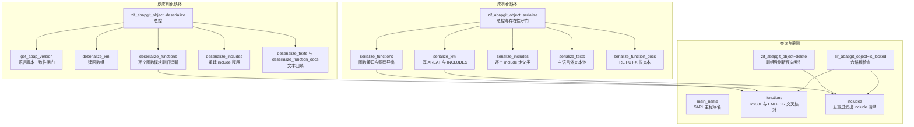
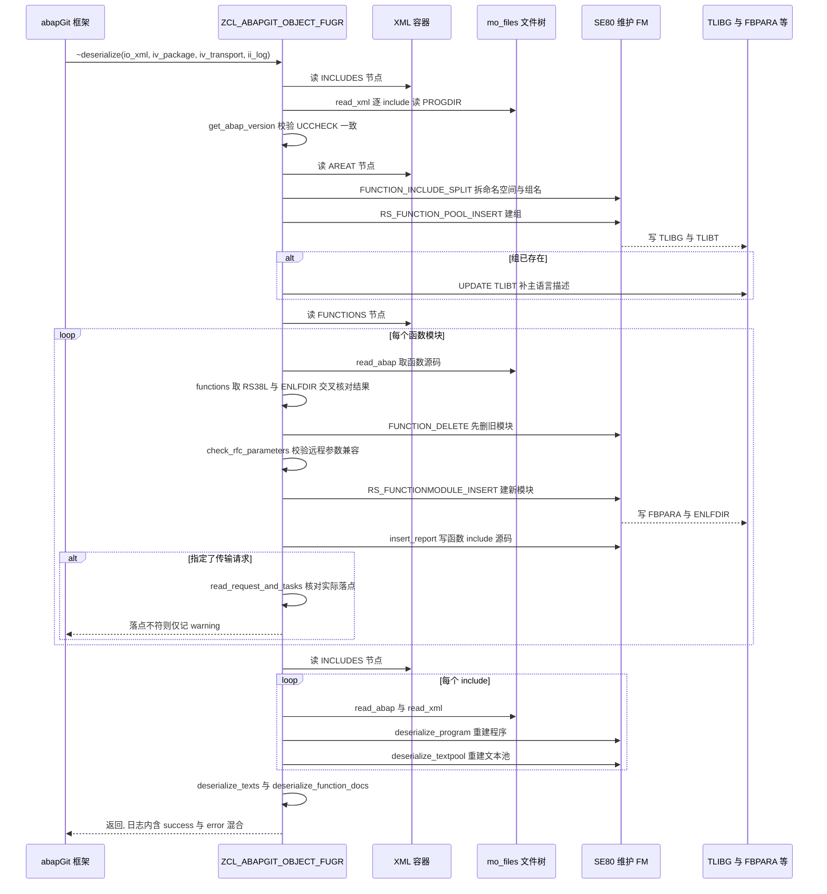

# ZCL_ABAPGIT_OBJECT_FUGR 分析报告

> 分析对象：`zcl_abapgit_object_fugr.clas.abap`（1529 行，34 个方法，实现 `ZIF_ABAPGIT_OBJECT`）
> 报告视角：代码 onboarding 走读，按真实调用链展开

---

## 一、程序定位与业务背景

### 1.1 这段代码在解决什么问题

abapGit 是一个把 ABAP 仓库纳入 Git 版本控制的工具。它的核心抽象是「对象处理器」：每一种 ABAP 对象类型（程序、类、表、函数组……）各有一个实现 `ZIF_ABAPGIT_OBJECT` 的类，负责把该对象在 SAP 里的状态序列化成一组可版本化的文件（XML 元数据 + ABAP 源码），以及反着把文件还原成 SAP 对象。

`ZCL_ABAPGIT_OBJECT_FUGR` 就是这个体系里处理函数组（FUGR）的那一个。选函数组做分析是有道理的：它是 abapGit 里结构最复杂的对象类型之一。一个函数组在 SAP 侧不是一行表记录，而是一整棵树——主程序 `SAPLxxx`、`T00`/`T99` 等 include、每个函数模块各自的 include、`FBPARA` 参数表、`ENLFDIR` 运行时属性、`RS38L` 目录、`TLIBG`/`TLIBT` 组名与描述、文本池、长文本、屏幕/CUA/变式。

要把这棵树完整搬进 Git 再搬回来，得同时对付两个难题：

1. **归属判定**：哪些 include 真的属于这个组？跨组共享的 include、别的 FUGR 的 include、表维护生成器自动造的 `LSVIM*`、简单转换的 `XTI` include、维护视图生成的 `L{组名}T00`，全都要分流。
2. **SAP 老接口不老实**：`RS_FUNCTION_POOL_CONTENTS` 在函数组不一致时结果不可靠，必须拿 `ENLFDIR` 交叉核对；`RS_FUNCTIONMODULE_INSERT` 的参数校验错误信息不返给用户，得自己绕一道。

### 1.2 整体设计范式

> **模板方法 + 薄适配器**——本类继承 `ZCL_ABAPGIT_OBJECTS_PROGRAM`，把 include 当普通程序复用父类的 `serialize_program` / `deserialize_program`，自己只补 FUGR 特有的胶水：函数模块接口元数据、函数组建库、参数校验兜底、锁与变更人的聚合查询。

这个选型是对的。函数组里有 90% 的东西（主程序、include、文本池、屏幕）和普通程序完全同构，硬写成独立类会产生几百行复制；继承之后，本类真正独有的逻辑集中在「函数模块」这一层——这也是本文件 60% 篇幅所在。

### 1.3 依赖清单

```
本类
  ├─ 继承      ZCL_ABAPGIT_OBJECTS_PROGRAM        serialize_program / deserialize_program /
  │                                                 deserialize_textpool / read_tpool /
  │                                                 strip_generation_comments / tadir_insert /
  │                                                 exists_a_lock_entry_for / is_active /
  │                                                 get_metadata / 屏幕与文本锁检查
  ├─ 实现      ZIF_ABAPGIT_OBJECT                 14 个接口方法（序列化/反序列化/删除/锁/跳转…）
  ├─ 工厂      ZCL_ABAPGIT_FACTORY                get_sap_report / get_function_module /
  │                                                 get_longtexts / get_cts_api
  ├─ 工厂      ZCL_ABAPGIT_OBJECTS_FACTORY        get_gui_jumper（仅 jump 用，见 P2-3）
  └─ 兄弟      ZCL_ABAPGIT_OBJECTS=>exists        is_part_of_other_fugr 里查 TADIR 对象是否存在
```

### 1.4 关键接口

外部只通过 `ZIF_ABAPGIT_OBJECT` 调用它。两个真正的主流程是 `~serialize` 和 `~deserialize`，其余是支撑查询（`exists`、`is_locked`、`changed_by`、`jump`）。

---

## 二、程序执行流程总览



### 责任链表

| 子程序 | 调用者 | 职责 |
|---|---|---|
| `zif_abapgit_object~serialize` | abapGit 框架（导出流程） | 序列化总控：守门、编排六步、按 `SUBC = 'F'` 决定是否带屏幕/CUA/变式 |
| `serialize_xml` | `~serialize` | 从 `TLIBT` 取主语言描述、调 `includes()` 取清单，写 `AREAT`/`INCLUDES` 两个节点 |
| `serialize_functions` | `~serialize` | 逐函数模块读接口元数据（`RPY_FUNCTIONMODULE_READ_NEW`）+ 源码，写 `FUNCTIONS` 节点与源码文件 |
| `serialize_includes` | `~serialize` | 对 `includes()` 结果逐个调父类 `serialize_program` |
| `serialize_texts` | `~serialize` | 从 `D010TINF` 取主语言外活动翻译，逐语言 `READ TEXTPOOL` 写 `I18N_TPOOL` |
| `serialize_function_docs` | `~serialize` | 写程序长文本（`RE`）与每个函数模块的长文本（`FU`）与异常长文本（`FX`） |
| `zif_abapgit_object~deserialize` | abapGit 框架（导入流程） | 反序列化总控：按顺序编排九步 |
| `get_abap_version` | `~deserialize` | 读各 include 的 `PROGDIR` 探测 `UCCHECK`，不一致即中止 |
| `deserialize_xml` | `~deserialize` | 拆组名、`RS_FUNCTION_POOL_INSERT` 建组，组已存在时手动补描述 |
| `update_func_group_short_text` | `deserialize_xml` | 直接 `UPDATE TLIBT` 补主语言短文本 |
| `deserialize_functions` | `~deserialize` | 逐函数模块：取源码 → 拆组名 → 删旧 → 校验参数 → 建新 → 插源码 |
| `check_rfc_parameters` | `deserialize_functions` | 远程调用参数兼容性预检，兜底 `RS_FUNCTIONMODULE_INSERT` 不返回友好错误的问题 |
| `deserialize_includes` | `~deserialize` | 从 XML 读 `PROGDIR`/`TPOOL`，调父类重建每个 include |
| `deserialize_texts` | `~deserialize` | 读 `I18N_TPOOL` 逐语言回填文本池 |
| `deserialize_function_docs` | `~deserialize` | 反序列化程序与函数模块长文本 |
| `main_name` | `serialize_includes` / `includes` / `~deserialize` / `~delete` / `~is_locked` / `changed_by` | 由组名拼出 `SAPL` 主程序名 |
| `functions` | `~serialize` 链 / `deserialize_functions` / `~is_locked` / `changed_by` / `jump` | 列函数模块：`RS_FUNCTION_POOL_CONTENTS` 结果与 `ENLFDIR` 交叉核对后排序去重 |
| `includes` | `serialize_xml` / `serialize_includes` / `~delete` / `~is_locked` | 列 include：五重过滤 + 追加维护视图与主程序 + 实例缓存 |
| `is_part_of_other_fugr` | `includes` | 判断某个 include 是否属于别的 FUGR/FUGS |
| `zif_abapgit_object~delete` | abapGit 框架（删除流程） | 跳过 CHDO 组、`RS_FUNCTION_POOL_DELETE` 删组、刷新反向索引 |
| `update_where_used` | `~delete` | 逐 include 建 `CL_WB_CROSSREFERENCE` 并 `index_actualize` |
| `zif_abapgit_object~is_locked` | abapGit 框架（冲突检测） | 六路 OR：组、include、函数模块、屏幕、CUA、文本 |
| `is_function_group_locked` | `~is_locked` | 查 `EEUDB`/`FG` 锁 |
| `is_any_include_locked` | `~is_locked` | 逐 include 查 `ESRDIRE` 锁 |
| `is_any_function_module_locked` | `~is_locked` | 逐函数模块查 `ESFUNCTION` 锁 |
| `zif_abapgit_object~exists` | `~serialize` / 框架 | `RS_FUNCTION_POOL_EXISTS` + CHDO 组排除 |
| `zif_abapgit_object~changed_by` | abapGit 框架（变更人识别） | 汇总 `REPOSRC`/`REPOTEXT`/`EUDB` 的最近变更人 |
| `zif_abapgit_object~jump` | abapGit 前端 | 由函数名或 include 名跳转到 SE37/SE80 |
| `get_deserialize_steps` / `get_comparator` / `get_deserialize_order` / `get_metadata` / `is_active` / `map_filename_to_object` / `map_object_to_filename` | 框架 | 步骤声明与父类委托，多数为空实现 |

下面按这条流程，逐个子程序展开。

---

## 三、分组分析

### 3.1 类骨架与类型契约（类定义段）

先看契约。这个类的骨架决定了后面所有实现的形状：三个长文本 ID 常量、一个承载函数模块接口的本地结构、两份 include 缓存。

```abap
CLASS zcl_abapgit_object_fugr DEFINITION
  PUBLIC
  INHERITING FROM zcl_abapgit_objects_program
  CREATE PUBLIC .

  PUBLIC SECTION.

    INTERFACES zif_abapgit_object .
```

**做什么** — 公开类，继承程序处理器，实现对象接口。`PUBLIC SECTION` 里除了接口声明什么都没有——所有方法都在 `PRIVATE SECTION`。

**为什么** — 把方法全部设私有，等于对外只暴露 `ZIF_ABAPGIT_OBJECT` 这一个契约面。框架只能靠接口驱动，本类内部的 `functions()`/`includes()` 拆分不会被外部误用，也不必为兼容性背负。这是 abapGit 对象类的一致做法。

**风险与改进** — 无明显风险。唯一可议的是继承链：父类 `ZCL_ABAPGIT_OBJECTS_PROGRAM` 的行为完全决定了 include 的序列化细节，读这个类必须同时读父类，否则 `serialize_program` 里发生了什么是个黑箱。

```abap
    CONSTANTS:
      c_longtext_id_prog     TYPE dokil-id VALUE 'RE',
      c_longtext_id_func     TYPE dokil-id VALUE 'FU',
      c_longtext_id_func_exc TYPE dokil-id VALUE 'FX'.
```

**做什么** — 三个 `DOKIL-ID` 常量：程序长文本 `RE`、函数模块长文本 `FU`、函数模块异常长文本 `FX`。

**为什么** — `DOKIL` 用 `ID` 区分同一对象的不同长文本槽位。把这三个魔法值提为常量是正确做法，序列化与反序列化两端（3.6 与 3.12）用同一组常量，保证往返对称。

**风险与改进** — 无明显风险。这三个值必须与 SE37 里实际的长文本 ID 一致，若某一 SAP 版本用别的 ID，长文本会静默丢失——属"需在 SE37 核实"的范畴，但 `RE`/`FU`/`FX` 是长期稳定的标准值。

```abap
    TYPES:
      BEGIN OF ty_function,
        funcname          TYPE rs38l_fnam,
        global_flag       TYPE rs38l-global,
        remote_call       TYPE rs38l-remote,
        update_task       TYPE rs38l-utask,
        short_text        TYPE tftit-stext,
        remote_basxml     TYPE rs38l-basxml_enabled,
        rfcscope          TYPE c LENGTH 1, " data element not on older releases
        rfcvers           TYPE c LENGTH 10, " data element not on older releases
        import            TYPE STANDARD TABLE OF rsimp WITH DEFAULT KEY,
        changing          TYPE STANDARD TABLE OF rscha WITH DEFAULT KEY,
        export            TYPE STANDARD TABLE OF rsexp WITH DEFAULT KEY,
        tables            TYPE STANDARD TABLE OF rstbl WITH DEFAULT KEY,
        exception         TYPE STANDARD TABLE OF rsexc WITH DEFAULT KEY,
        documentation     TYPE STANDARD TABLE OF rsfdo WITH DEFAULT KEY,
        exception_classes TYPE abap_bool,
      END OF ty_function .
```

**做什么** — 定义函数模块的内存表示：`RS38L` 的目录字段 + 五个接口内表（import/changing/export/tables/exception）+ 参数文档内表 + 异常类标记。

**为什么** — `RS38L` 只存目录信息，参数接口在 `FBPARA`，运行时属性在 `ENLFDIR`，异常类标记在 `ENLFDIR-EXTEN3`，RFC scope 在 `TFDIR`。本结构把这些散落四张表的字段聚成一个对象，是"用本地结构对齐多表口径"的典型做法。`rfcscope`/`rfcvers` 用 `TYPE c` 硬编码长度而非数据元素，注释明说是因为老版本没有对应数据元素。

**风险与改进** — 两处需要留意：

1. `rfcscope`/`rfcvers` 的长度 `1`/`10` 是手写常量。若 `TFDIR` 实际字段更长，3.5 节的 `SELECT ... INTO CORRESPONDING FIELDS` 会静默截断。属"需在 SE11 核实 TFDIR 字段长度"的问题。
2. `exception_classes TYPE abap_bool` 而来源是 `ENLFDIR-EXTEN3`（`CHAR1`）。若 `EXTEN3` 的取值域含 `'N'`，则 `'N'` 被塞进 `abap_bool` 不是合法值（合法值只有 `'X'`/空格），随后原样传给 `RS_FUNCTIONMODULE_INSERT` 的 `exception_class`。详见 P1-2。

```abap
    DATA mt_includes_cache TYPE ty_sobj_name_tt .
    DATA mt_includes_all TYPE ty_sobj_name_tt .
```

**做什么** — 两个实例级缓存：`mt_includes_cache` 存过滤后的 include 清单，`mt_includes_all` 存 `RS_GET_ALL_INCLUDES` 的原始结果。

**为什么** — `includes()` 在序列化路径里被 `serialize_xml` 和 `serialize_includes` 各调一次，加缓存可避免重复的多次 DB 往返。`mt_includes_all` 则专为 `changed_by` 服务——它需要未过滤的完整 include 列表。

**风险与改进** — 两个缓存语义不同但名字相近，且都无失效机制。对象实例在 abapGit 里按请求创建，正常情况下够用；但若同一实例在一次流程里先序列化后删除，`mt_includes_cache` 存的是删除前的清单——`~delete` 恰好需要删除前的清单，所以这里反而是正确的。属设计巧合而非缺陷，但读代码的人需要意识到这点。

### 3.2 序列化总入口 `zif_abapgit_object~serialize`

序列化路径的编排中枢，分四步：守门、写元数据与清单、导出函数模块、按程序类型决定导出范围。

```abap
  METHOD zif_abapgit_object~serialize.

* function group SEUF
* function group SIFP
* function group SUNI

    DATA: lt_functions    TYPE ty_function_tt,
          ls_progdir      TYPE zif_abapgit_sap_report=>ty_progdir,
          lv_program_name TYPE syrepid,
          lt_dynpros      TYPE ty_dynpro_tt,
          ls_cua          TYPE ty_cua,
          lt_varis        TYPE ty_vari_tt.

    IF zif_abapgit_object~exists( ) = abap_false.
      RETURN.
    ENDIF.
```

**做什么** — 声明六个局部变量，然后调用 `~exists` 做存在性守门，不存在直接返回空结果。

**为什么** — 导出一个不存在的对象不该产生任何文件，这是 abapGit 的通用约定（对象被删除后不再出现在仓库里）。用完全限定名 `zif_abapgit_object~exists( )` 显式调接口实现，避免与父类同名方法混淆。

**风险与改进** — 方法头那三行注释（`SEUF` / `SIFP` / `SUNI`）列出了三个系统函数组，但方法体里没有任何对应的排除逻辑。这三个正是 SE37 自身的维护函数组。注释像是想表达"这些系统组不该被序列化"的意图，但从未落成代码。见 P2-11。

```abap
    serialize_xml( io_xml ).

    lt_functions = serialize_functions( ).

    io_xml->add( iv_name = 'FUNCTIONS'
                 ig_data = lt_functions ).

    serialize_includes( ).

    lv_program_name = main_name( ).

    ls_progdir = zcl_abapgit_factory=>get_sap_report( )->read_progdir( lv_program_name ).
```

**做什么** — 依次：写 `AREAT`+`INCLUDES` 节点、导出全部函数模块并把结果写入 `FUNCTIONS` 节点、导出所有 include、解析主程序名、读主程序的 `PROGDIR`。

**为什么** — `FUNCTIONS` 节点的写入夹在两次导出之间，是因为 `serialize_functions` 的返回值要作为节点数据，而其他两步是纯副作用。`read_progdir` 的结果只用来判断 `SUBC`，所以放在需要它的地方再取，而不是提前取。

**风险与改进** — `read_progdir` 无任何错误检查。若读取失败，`ls_progdir` 为初值，`ls_progdir-subc` 不是 `'F'`，屏幕/CUA/变式会被**静默跳过**——用户会拿到一份缺了所有屏幕的函数组导出，且没有任何日志提示。见 P2-10 关联项。

```abap
    IF mo_i18n_params->is_lxe_applicable( ) = abap_false.
      serialize_texts(
        iv_prog_name = lv_program_name
        ii_xml       = io_xml ).
    ENDIF.

    IF ls_progdir-subc = 'F'.
      lt_dynpros = serialize_dynpros( lv_program_name ).
      io_xml->add( iv_name = 'DYNPROS'
                   ig_data = lt_dynpros ).

      ls_cua = serialize_cua( lv_program_name ).
      io_xml->add( iv_name = 'CUA'
                   ig_data = ls_cua ).

      lt_varis = serialize_varis( lv_program_name ).
      io_xml->add( iv_name = 'VARIS'
                   ig_data = lt_varis ).
    ENDIF.

    serialize_function_docs( iv_prog_name = lv_program_name
                             it_functions = lt_functions
                             ii_xml       = io_xml ).
```

**做什么** — LXE 不适用时导出多语言文本池；`SUBC = 'F'`（函数组）时才导出屏幕、CUA 控制、变式；最后导出长文本。

**为什么** — 两个守卫各有分工：`is_lxe_applicable` 处理"文本由 LXE 统一管理时不该重复导出"，`subc = 'F'` 处理"只有函数组这类程序才有屏幕"。长文本放最后，因为它依赖前面已经导出的 `lt_functions`。

**风险与改进** — 顺序耦合值得指出：`serialize_function_docs` 依赖 `lt_functions`，而 `lt_functions` 来自 `serialize_functions`。若 `serialize_functions` 里某个函数模块因 `function_not_found` 被 `CONTINUE` 跳过，它的长文本也就不会被导出——两端是一致的，但这个一致性是靠"同一个内表流下去"隐式维持的，没有一个显式的契约说明。

### 3.3 身份与清单解析

这是整个类最难读、也是最容易出错的部分。三个方法共同回答一个问题：**这个函数组到底由哪些程序组成？**

#### ① 主程序名 `main_name`

```abap
  METHOD main_name.

    DATA: lv_area      TYPE rs38l-area,
          lv_namespace TYPE rs38l-namespace,
          lv_group     TYPE rs38l-area.


    lv_area = ms_item-obj_name.

    CALL FUNCTION 'FUNCTION_INCLUDE_SPLIT'
      EXPORTING
        complete_area                = lv_area
      IMPORTING
        namespace                    = lv_namespace
        group                        = lv_group
      EXCEPTIONS
        include_not_exists           = 1
        group_not_exists             = 2
        no_selections                = 3
        no_function_include          = 4
        no_function_pool             = 5
        delimiter_wrong_position     = 6
        no_customer_function_group   = 7
        no_customer_function_include = 8
        reserved_name_customer       = 9
        namespace_too_long           = 10
        area_length_error            = 11
        OTHERS                       = 12.
    IF sy-subrc <> 0.
      zcx_abapgit_exception=>raise_t100( ).
    ENDIF.

    CONCATENATE lv_namespace 'SAPL' lv_group INTO rv_program.

  ENDMETHOD.
```

**做什么** — 用 `FUNCTION_INCLUDE_SPLIT` 把组名拆成命名空间与组名，拼出主程序名 `SAPL` + 组名（命名空间在前）。例如 `/NS/FOO` 拆成 `/NS/` + `FOO`，拼成 `/NS/SAPLFOO`。

**为什么** — 这是 SAP 的固定命名规则，没有第二个算法。枚举全部 11 个具名异常再兜 `OTHERS`，是这里最规范的一处异常处理写法。

**风险与改进** — 失败时 `raise_t100( )` 只带 T100 消息，不带是哪个组名非法的上下文。调用方（`~deserialize`、`~delete`、`~is_locked` 等）拿到异常时只知道"某个组名有问题"。建议在消息里带上 `ms_item-obj_name`。

#### ② 函数模块清单 `functions`

`functions` 是本类最体现"不信任 SAP 接口"的一处，分三步：取 FM 目录、与 `ENLFDIR` 交叉核对、排序去重。

```abap
  METHOD functions.

    DATA: lv_area    TYPE rs38l-area,
          lt_enlfdir TYPE STANDARD TABLE OF enlfdir.
    DATA lv_index TYPE i.

    FIELD-SYMBOLS: <ls_functab> TYPE LINE OF ty_rs38l_incl_tt,
                   <ls_enlfdir> TYPE enlfdir.

    lv_area = ms_item-obj_name.

    CALL FUNCTION 'RS_FUNCTION_POOL_CONTENTS'
      EXPORTING
        function_pool           = lv_area
      TABLES
        functab                 = rt_functab
      EXCEPTIONS
        function_pool_not_found = 1
        OTHERS                  = 2.
    IF sy-subrc <> 0.
      zcx_abapgit_exception=>raise_t100( ).
    ENDIF.
```

**做什么** — 调 `RS_FUNCTION_POOL_CONTENTS` 取函数组的目录表 `RS38L` 行集，装进返回参数 `rt_functab`。函数组不存在则抛异常。

**为什么** — `RS38L` 是函数组的"目录"，一行一个函数模块，带 include 名。这是取函数模块清单的标准入口。

**风险与改进** — 此处抛异常是对的（函数组不存在说明对象状态有问题）。但接下来这步才是真正的风险点。

```abap
    " FM RS_FUNCTION_POOL_CONTENTS is not reliable if Function Group is inconsistent, so cross-check results (#7147)
    " Don't check active flag, or the includes become wrong (#7702)
    SELECT * FROM enlfdir
      INTO TABLE lt_enlfdir
      WHERE area = ms_item-obj_name
      ORDER BY funcname.                                  "#EC CI_SUBRC

    LOOP AT lt_enlfdir ASSIGNING <ls_enlfdir>.
      TRANSLATE <ls_enlfdir>-funcname TO UPPER CASE.
    ENDLOOP.

    SORT lt_enlfdir BY funcname ASCENDING.

    "Remove anything not in FM attributes table
    LOOP AT rt_functab ASSIGNING <ls_functab>.
      TRANSLATE <ls_functab> TO UPPER CASE.
      lv_index = sy-tabix.
      READ TABLE lt_enlfdir WITH KEY funcname = <ls_functab>-funcname TRANSPORTING NO FIELDS.
      IF sy-subrc <> 0.
        DELETE rt_functab INDEX lv_index.
      ENDIF.
    ENDLOOP.

    SORT rt_functab BY funcname ASCENDING.
    DELETE ADJACENT DUPLICATES FROM rt_functab COMPARING funcname.
```

**做什么** — 从 `ENLFDIR`（函数模块的运行时属性表）取同组的所有函数名，统一转大写；然后遍历 `RS38L` 结果，凡是 `ENLFDIR` 里查不到的就删掉；最后按函数名排序并去重。

**为什么** — 注释引用了 #7147：函数组不一致时 `RS_FUNCTION_POOL_CONTENTS` 会返回脏数据。用 `ENLFDIR` 做交叉核对是防御性编程，方向正确。#7702 说明故意不检查 `ENLFDIR` 的活动标志——加了会让 include 判定出错。先存 `lv_index = sy-tabix` 再 `READ TABLE` 也是必要的，因为 `READ TABLE` 会重置 `sy-tabix`。

**风险与改进** — 这一段的防御**用反了**，是本类最严重的缺陷：

1. **`#EC CI_SUBRC` 压掉了关键 SELECT 的返回码**（P0-2）。`ENLFDIR` 查询失败（权限、锁、DB 抖动）时 `lt_enlfdir` 为空，于是 `READ TABLE` 对每个函数模块都返回 `sy-subrc <> 0`，**全部被删掉**，`functions()` 返回空表。整个函数组的序列化结果是"零个函数模块"，且全程无任何日志。这是一条静默全量丢失路径。
2. **对已排序表做无 `BINARY SEARCH` 的线性查找**（P2-4）。`lt_enlfdir` 已 `SORT` 过，但 `READ TABLE ... WITH KEY` 未加 `BINARY SEARCH`，退化为线性扫描。大函数组是 O(n²)。
3. `SELECT *` 通配取全字段，实际只用 `funcname` 和 `area`。
4. `DELETE ADJACENT DUPLICATES ... COMPARING funcname` 只比函数名，同名的其余字段差异被静默丢弃。

建议至少把 `#EC CI_SUBRC` 去掉，改为 `sy-subrc <> 0` 时抛异常或记日志——交叉核对失败时"信任 FM 结果"是安全的，"信任空表"是灾难。

#### ③ Include 清单 `includes`

这是最长、分支最多的方法，分五步。

```abap
  METHOD includes.

    TYPES: BEGIN OF ty_reposrc,
              progname TYPE reposrc-progname,
            END OF ty_reposrc.

    DATA: lt_reposrc        TYPE STANDARD TABLE OF ty_reposrc WITH DEFAULT KEY,
          ls_reposrc        LIKE LINE OF lt_reposrc,
          lv_program        TYPE program,
          lv_maintviewname  LIKE LINE OF rt_includes,
          lv_offset_ns      TYPE i,
          lv_tabix          LIKE sy-tabix,
          lt_functab        TYPE ty_rs38l_incl_tt,
          lt_tadir_includes TYPE HASHED TABLE OF objname WITH UNIQUE KEY table_line.

    FIELD-SYMBOLS: <lv_include> LIKE LINE OF rt_includes,
                   <ls_func>    LIKE LINE OF lt_functab.


    IF lines( mt_includes_cache ) > 0.
      rt_includes = mt_includes_cache.
      RETURN.
    ENDIF.

    lv_program = main_name( ).
    lt_functab = functions( ).
```

**做什么** — 声明局部类型与变量；命中实例缓存则直接返回；否则解析主程序名与函数模块清单。

**为什么** — 局部类型 `ty_reposrc` 只取 `REPOSRC` 一列，避免把宽表整行拉进内存。`HASHED TABLE` 存 `TADIR` 结果，后面按 `table_line` 做等值查找是 O(1)。

**风险与改进** — 缓存判据是 `lines( ) > 0` 而非"已计算过"标志。这意味着**空的合法清单无法被缓存**——虽然实践中函数组总有主程序，不会真的为空。但更重要的是：`includes()` 内部调 `functions()`，而 `functions()` 有 3.3② 说的静默丢失路径，一旦它返回空表，这里不会报错，只会继续往下算出一个偏小的清单。

```abap
    CALL FUNCTION 'RS_GET_ALL_INCLUDES'
      EXPORTING
        program      = lv_program
      TABLES
        includetab   = rt_includes
      EXCEPTIONS
        not_existent = 1
        no_program   = 2
        OTHERS       = 3.
    IF sy-subrc <> 0.
      zcx_abapgit_exception=>raise( 'Error from RS_GET_ALL_INCLUDES' ).
    ENDIF.

    LOOP AT lt_functab ASSIGNING <ls_func>.
      DELETE TABLE rt_includes FROM <ls_func>-include.
    ENDLOOP.
```

**做什么** — 取主程序的全部 include，然后逐个删掉函数模块自己的 include。

**为什么** — 函数模块的 include（`Lxxx Fnn`）由 `serialize_functions` 单独处理，不能混在 include 清单里重复导出。

**风险与改进** — `DELETE TABLE ... FROM <值>` 按值删除所有匹配行，语义正确。但 `<ls_func>-include` 是 `RS38L-INCLUDE`，与 `SOBJ_NAME` 长度可能不同，跨类型比较依赖隐式转换。属"需在 SE11 核实两字段长度"的范畴。

```abap
* handle generated maintenance views
    IF ms_item-obj_name(1) <> '/'.
      "FGroup name does not contain a namespace
      lv_maintviewname = |L{ ms_item-obj_name }T00|.
    ELSE.
      "FGroup name contains a namespace
      lv_offset_ns = find( val = ms_item-obj_name+1
                            sub = '/' ).
      lv_offset_ns = lv_offset_ns + 2.
      lv_maintviewname = |{ ms_item-obj_name(lv_offset_ns) }L{ ms_item-obj_name+lv_offset_ns }T00|.
    ENDIF.

    READ TABLE rt_includes WITH KEY table_line = lv_maintviewname TRANSPORTING NO FIELDS.
    IF sy-subrc <> 0.
      APPEND lv_maintviewname TO rt_includes.
    ENDIF.

    SORT rt_includes.
```

**做什么** — 计算维护视图生成的 include 名（`L{组名}T00`，命名空间插在 `L` 之前），若清单里没有就补进去。

**为什么** — 维护视图的 include 不一定出现在 `RS_GET_ALL_INCLUDES` 的结果里，但它是这个函数组的一部分，必须导出。命名空间的定位算法：`/NS/FOO` 去掉首字符得 `NS/FOO`，找 `/` 得偏移 2，加 2 得 4，于是 `obj_name(4)` = `/NS/`、`obj_name+4` = `FOO`，拼出 `/NS/LFOOT00`——**验证正确**。

**风险与改进** — 算法本身对，但边界脆弱：若组名里没有第二个 `/`（非法输入），`find` 返回 0，偏移变成 2，拼出的名字是错的且不报错。另外补进去的这个名字随后要过 `REPOSRC` 的 `r3state = 'A'` 关卡——**新建但尚未激活的函数组的 T00 会在这里被丢掉**（P2-13）。

```abap
    IF lines( rt_includes ) > 0.
      " check which includes have their own tadir entry
      " these includes might reside in a different package or might be shared between multiple function groups
      " or other programs and are hence no part of the to serialized FUGR object
      " they will be handled as individual objects when serializing their package
      " in addition, referenced XTI includes referencing (simple) transformations must be ignored
      SELECT obj_name
        INTO TABLE lt_tadir_includes
        FROM tadir
        FOR ALL ENTRIES IN rt_includes
        WHERE pgmid      = 'R3TR'
              AND object = 'PROG'
              AND obj_name = rt_includes-table_line.
      LOOP AT rt_includes ASSIGNING <lv_include>.
        " skip autogenerated includes from Table Maintenance Generator
        IF <lv_include> CP 'LSVIM*'.
          DELETE rt_includes INDEX sy-tabix.
          CONTINUE.
        ENDIF.
        READ TABLE lt_tadir_includes WITH KEY table_line = <lv_include> TRANSPORTING NO FIELDS.
        IF sy-subrc = 0.
          DELETE rt_includes.
          CONTINUE.
        ENDIF.
        IF strlen( <lv_include> ) = 33 AND <lv_include>+30(3) = 'XTI'.
          "ignore referenced (simple) transformation includes
          DELETE rt_includes.
          CONTINUE.
        ENDIF.
      ENDLOOP.

      IF lines( rt_includes ) > 0.
        SELECT progname FROM reposrc
          INTO TABLE lt_reposrc
          FOR ALL ENTRIES IN rt_includes
          WHERE progname = rt_includes-table_line
          AND r3state = 'A'.
      ENDIF.
      SORT lt_reposrc BY progname ASCENDING.
    ENDIF.
```

**做什么** — 三重过滤：查 `TADIR` 找出有独立归属的 include 并剔除；剔除表维护生成器的 `LSVIM*`；剔除简单转换的 `XTI` include。然后再用 `REPOSRC` 的活动标志过滤掉未激活的。

**为什么** — 注释写得非常清楚：有独立 `TADIR` 条目的 include 可能跨包共享，会被当作独立对象序列化，不能算在这个函数组里。两段 `FOR ALL ENTRIES` 前都有 `lines( ) > 0` 守卫，避免了空表 FAE 退化成全表扫描——这是**正确且容易被忽略**的卫生习惯。

**风险与改进** — 两处：

1. **`XTI` 判断是死代码**（P1-6）。`rt_includes` 的行类型是 `SOBJ_NAME`，长度 30；`strlen = 33` 永远不成立，`+30(3)` 也已越界返回空。这个分支永远不会触发。同样写法在 `deserialize_includes` 里还有一遍。实际靠 `TADIR` 过滤兜底，但显式意图已失效。
2. `LSVIM*` 判断放在 `TADIR` 判断之前有点多余——`LSVIM` include 通常有自己的 `TADIR` 条目。不过先删也无害。

```abap
    LOOP AT rt_includes ASSIGNING <lv_include>.
      lv_tabix = sy-tabix.

* make sure the include exists
      READ TABLE lt_reposrc INTO ls_reposrc
        WITH KEY progname = <lv_include> BINARY SEARCH.
      IF sy-subrc <> 0.
        DELETE rt_includes INDEX lv_tabix.
        CONTINUE.
      ENDIF.

      "Make sure that the include does not belong to another function group
      IF is_part_of_other_fugr( <lv_include> ) = abap_true.
        DELETE rt_includes.
      ENDIF.
    ENDLOOP.

    APPEND lv_program TO rt_includes.
    SORT rt_includes.

    mt_includes_cache = rt_includes.
```

**做什么** — 最后一道过滤：确认 include 在 `REPOSRC` 里有活动版本（此处正确用了 `BINARY SEARCH`），并确认它不属于别的函数组。最后把主程序本身追加进清单并缓存。

**为什么** — `BINARY SEARCH` 在这里用对了，与 3.3② 里没用形成对照。主程序必须包含在内，否则 `SAPLxxx` 的源码不会被导出。

**风险与改进** — 每行都要调一次 `is_part_of_other_fugr`，而那个方法内部有一次 FM 调用加一次 `TADIR` 查询（P2-5）。有 N 个 include 就是 N 次往返。另外 `DELETE rt_includes INDEX sy-tabix` 与 `DELETE rt_includes` 两种写法混用，功能相同但风格不统一。

#### ④ 跨组归属判定 `is_part_of_other_fugr`

```abap
  METHOD is_part_of_other_fugr.
    " make sure that the include belongs to the function group
    " like in LSEAPFAP Form TADIR_MAINTENANCE
    DATA ls_tadir TYPE tadir.
    DATA lv_namespace TYPE rs38l-namespace.
    DATA lv_function_group TYPE rs38l-area.
    DATA lv_include TYPE rs38l-include.
    DATA ls_item_key TYPE zif_abapgit_definitions=>ty_item.

    rv_belongs_to_other_fugr = abap_false.
    IF iv_include(1) = 'L' OR iv_include+1 CS '/L'.
      lv_include = iv_include.
      ls_tadir-object = 'FUGR'.

      CALL FUNCTION 'FUNCTION_INCLUDE_SPLIT'
        IMPORTING
          namespace = lv_namespace
          group     = lv_function_group
        CHANGING
          include   = lv_include
        EXCEPTIONS
          OTHERS    = 1 ##FM_SUBRC_OK.

      IF lv_function_group(1) = 'X'.    " "EXIT"-function-module
        ls_tadir-object = 'FUGS'.
      ENDIF.

      IF sy-subrc = 0.

        CONCATENATE lv_namespace lv_function_group INTO ls_tadir-obj_name.
        ls_item_key-obj_type = ls_tadir-object.
        ls_item_key-obj_name = ls_tadir-obj_name.

        " compare complete tadir key to distinguish between regular and exit function groups
        IF ( ls_tadir-obj_name <> ms_item-obj_name OR ls_tadir-object <> ms_item-obj_type ) AND
           zcl_abapgit_objects=>exists( ls_item_key ) = abap_true.
          rv_belongs_to_other_fugr = abap_true.
        ENDIF.
      ENDIF.

    ENDIF.

  ENDMETHOD.
```

**做什么** — 对以 `L` 开头的 include，拆出它所属的组名，判断是否指向另一个已存在的 FUGR/FUGS 对象；是则说明这个 include 不归本组。

**为什么** — 注释直接引用了 SAP 自己的实现（`LSEAPFAP` 的 `TADIR_MAINTENANCE`），说明这是照抄 SE80 的判定逻辑。区分 `FUGR` 与 `FUGS`（EXIT 函数组，组名以 `X` 开头）是关键细节。`##FM_SUBRC_OK` 压制警告后紧跟 `IF sy-subrc = 0` 显式判断，这个写法是规范的。

**风险与改进** — 三处小问题：

1. `IF lv_function_group(1) = 'X'` 放在了 `IF sy-subrc = 0` **之外**。若拆分失败，`lv_function_group` 保持初值，`lv_function_group(1)` 为空不等于 `'X'`，所以不会误判——但逻辑上它应该缩进到成功分支内。
2. 注释 `" "EXIT"-function-module` 里嵌了一个引号，合法但易误读（P3-6）。
3. 每次调用都打一次 `FUNCTION_INCLUDE_SPLIT` 加一次 `exists`，被 `includes()` 逐行调用时开销累积。

### 3.4 元数据与 include 序列化 `serialize_xml` / `serialize_includes`

清单解析完，进入纯粹的"写出"阶段。先写 XML 元数据，再写每个 include 的源码。

```abap
  METHOD serialize_xml.

    DATA: lt_includes TYPE ty_sobj_name_tt,
          lv_areat    TYPE tlibt-areat.


    SELECT SINGLE areat INTO lv_areat
      FROM tlibt
      WHERE spras = mv_language
      AND area = ms_item-obj_name.        "#EC CI_GENBUFF "#EC CI_SUBRC

    lt_includes = includes( ).

    ii_xml->add( iv_name = 'AREAT'
                 ig_data = lv_areat ).
    ii_xml->add( iv_name = 'INCLUDES'
                 ig_data = lt_includes ).

  ENDMETHOD.
```

**做什么** — 从 `TLIBT` 按主语言取函数组描述，调 `includes()` 取清单，把两者写成 `AREAT` 和 `INCLUDES` 两个 XML 节点。

**为什么** — `TLIBT` 是函数组的描述表，`AREAT` 字段是 60 字符短文本。用主语言 `mv_language` 作为唯一口径，与父类程序的处理保持一致。

**风险与改进** — **主语言之外的 `TLIBT` 描述从未经过序列化**（P1-1）。对比 3.6 的 `serialize_texts`，文本池是多语言处理的（走 `D010TINF` 取全部活动语言），而函数组描述只读 `spras = mv_language` 这一行。结果是：非主语言的函数组描述在导出时静默丢弃，导入时也不会恢复。这是一个对称性缺失——同一份代码里，文本池懂多语言，函数组描述不懂。

```abap
  METHOD serialize_includes.

    DATA: lt_includes TYPE ty_sobj_name_tt.

    FIELD-SYMBOLS: <lv_include> LIKE LINE OF lt_includes.

    lt_includes = includes( ).

    LOOP AT lt_includes ASSIGNING <lv_include>.

* todo, filename is not correct, a include can be used in several programs
      serialize_program( is_item    = ms_item
                         io_files   = mo_files
                         iv_program = <lv_include>
                         iv_extra   = <lv_include> ).

    ENDLOOP.

  ENDMETHOD.
```

**做什么** — 对清单里每个程序名调父类的 `serialize_program`，把源码与文本池交给 `mo_files` 收集。`iv_extra` 传程序名本身，用于生成文件名。

**为什么** — 这是继承复用的最直接体现：include 完全按普通程序处理，本类一行源码导出逻辑都不用写。

**风险与改进** — 那行 `* todo` 是**留在生产代码里的未解决技术债**（P3-1）。它点出的问题是真的：一个 include 可能被多个程序引用，用引用方（本 FUGR）的 `ms_item` 作为归属信息会导致包归属与 TADIR 记录错配。3.3③ 已经通过 `TADIR` 过滤把跨包共享的 include 排除了，所以当前不会踩雷——但这个 TODO 说明作者知道这是补丁而非根治。

### 3.5 函数模块序列化 `serialize_functions`

这是序列化路径的核心。一个函数模块要同时导出六张表的信息和一份源码，分四步。

```abap
  METHOD serialize_functions.

    DATA:
      lt_source     TYPE TABLE OF rssource,
      lt_functab    TYPE ty_rs38l_incl_tt,
      lt_new_source TYPE rsfb_source,
      ls_function   LIKE LINE OF rt_functions.

    FIELD-SYMBOLS: <ls_func>          LIKE LINE OF lt_functab,
                   <ls_documentation> TYPE LINE OF ty_function-documentation.

    lt_functab = functions( ).

    LOOP AT lt_functab ASSIGNING <ls_func>.
* fm RPY_FUNCTIONMODULE_READ does not support source code
* lines longer than 72 characters
      CLEAR ls_function.
      MOVE-CORRESPONDING <ls_func> TO ls_function.

      CLEAR lt_new_source.
      CLEAR lt_source.

      CALL FUNCTION 'RPY_FUNCTIONMODULE_READ_NEW'
        EXPORTING
          functionname            = <ls_func>-funcname
        IMPORTING
          global_flag             = ls_function-global_flag
          remote_call             = ls_function-remote_call
          update_task             = ls_function-update_task
          short_text              = ls_function-short_text
          remote_basxml_supported = ls_function-remote_basxml
        TABLES
          import_parameter        = ls_function-import
          changing_parameter      = ls_function-changing
          export_parameter        = ls_function-export
          tables_parameter        = ls_function-tables
          exception_list          = ls_function-exception
          documentation           = ls_function-documentation
          source                  = lt_source
        CHANGING
          new_source              = lt_new_source
        EXCEPTIONS
          error_message           = 1
          function_not_found      = 2
          invalid_name            = 3
          OTHERS                  = 4.
      IF sy-subrc = 2.
        CONTINUE.
      ELSEIF sy-subrc <> 0.
        zcx_abapgit_exception=>raise( 'Error from RPY_FUNCTIONMODULE_READ_NEW' ).
      ENDIF.
```

**做什么** — 遍历函数清单，对每个函数模块调 `RPY_FUNCTIONMODULE_READ_NEW`，一次性取出全部接口参数（import/export/tables/changing/exception）、参数文档和源码。找不到函数就跳过，其他错误抛异常。

**为什么** — 注释说明了为什么用 `_NEW` 版本：老接口 `RPY_FUNCTIONMODULE_READ` 不支持超过 72 字符的源码行。这是典型的"老接口有硬限制，必须换接口"的场景。循环开头 `CLEAR` 三处是必要的——`MOVE-CORRESPONDING` 不会清空目标里多余的字段。

**风险与改进** — `function_not_found` 被静默跳过。这与 3.3② 的交叉核对配合是合理的（`RS38L` 里有但 `ENLFDIR` 里没有的行会被过滤掉），但如果交叉核对失效，这里就变成静默漏导出，且无任何日志。建议在 `CONTINUE` 前记一条 warning。

```abap
      LOOP AT ls_function-documentation ASSIGNING <ls_documentation>.
        CLEAR <ls_documentation>-index.
      ENDLOOP.

      SELECT SINGLE exten3 INTO ls_function-exception_classes FROM enlfdir
        WHERE funcname = <ls_func>-funcname.              "#EC CI_SUBRC

      " Scope and Interface Contract only for 7.55 or higher
      TRY.
          SELECT SINGLE rfcscope rfcvers INTO CORRESPONDING FIELDS OF ls_function FROM ('TFDIR')
            WHERE funcname = <ls_func>-funcname.          "#EC CI_SUBRC
        CATCH cx_sy_dynamic_osql_semantics ##NO_HANDLER.
      ENDTRY.
```

**做什么** — 三步补齐：清空参数文档的 `INDEX` 字段；从 `ENLFDIR-EXTEN3` 取异常类标记；从 `TFDIR` 取 RFC scope 与版本（动态表名，老版本无此表则静默失败）。

**为什么** — 动态表名 `('TFDIR')` 加 `CATCH cx_sy_dynamic_osql_semantics` 是标准的版本兼容写法：7.55 以下 `TFDIR` 不存在，动态 SQL 抛异常，空 handler 吞掉即可。`##NO_HANDLER` 是压制"空异常处理"警告的显式声明，属正确用法。

**风险与改进** — 两处：

1. **`ENLFDIR-EXTEN3`（`CHAR1`）塞进 `abap_bool`**（P1-2）。若 `EXTEN3` 的取值是 `'N'` 而非空格，`'N'` 不是合法的 `abap_bool` 值，随后会被原样传给 `RS_FUNCTIONMODULE_INSERT` 的 `exception_class` 参数。当前数据下可能碰巧不出错，但语义已经错了。需在 SE11 核实 `ENLFDIR-EXTEN3` 的域值。
2. **清掉 `RSFDO-INDEX` 是有代价的**（P2-12）。`INDEX` 是参数文档指向具体参数的关联键，清掉它导出的文档在导入时只能靠行序还原归属。abapGit 这么做的动机大概率是避免跨版本 `INDEX` 抖动产生无意义的 diff，但代价是导入侧的归属依赖变得脆弱。

```abap
      APPEND ls_function TO rt_functions.

      IF NOT lt_new_source IS INITIAL.
        strip_generation_comments( CHANGING ct_source = lt_new_source ).
        mo_files->add_abap(
          iv_extra = <ls_func>-funcname
          it_abap  = lt_new_source ).
      ELSE.
        strip_generation_comments( CHANGING ct_source = lt_source ).
        mo_files->add_abap(
          iv_extra = <ls_func>-funcname
          it_abap  = lt_source ).
      ENDIF.


    ENDLOOP.

  ENDMETHOD.
```

**做什么** — 把函数模块元数据追加进结果表；源码优先用 `new_source`（255 字符行），没有则退回 `lt_source`（72 字符行），两者都先剥掉系统生成的注释再写入文件。

**为什么** — 优先取新格式是合理的（避免 72 字符硬折行造成 diff 噪音）。`strip_generation_comments` 是关键一步：系统自动生成的注释每次编译都可能变，不剥掉的话仓库里会出现大量无意义变更。

**风险与改进** — 无明显风险。这里是全类写得最干净的一段：分支处理完整、清理动作到位、注释说明了取舍。

### 3.6 文本序列化 `serialize_texts` / `serialize_function_docs`

```abap
  METHOD serialize_texts.
    DATA: lt_tpool_i18n TYPE zif_abapgit_lang_definitions=>ty_i18n_tpools,
          lt_tpool      TYPE textpool_table.

    FIELD-SYMBOLS <ls_tpool> LIKE LINE OF lt_tpool_i18n.

    IF mo_i18n_params->ms_params-main_language_only = abap_true.
      RETURN.
    ENDIF.

    " Table d010tinf stores info. on languages in which program is maintained
    " Select all active translations of program texts
    " Skip main language - it was already serialized
    SELECT DISTINCT language
      INTO CORRESPONDING FIELDS OF TABLE lt_tpool_i18n
      FROM d010tinf
      WHERE r3state = 'A'
      AND prog = iv_prog_name
      AND language <> mv_language
      ORDER BY language ##TOO_MANY_ITAB_FIELDS.

    mo_i18n_params->trim_saplang_keyed_table(
      EXPORTING
        iv_lang_field_name = 'LANGUAGE'
      CHANGING
        ct_tab             = lt_tpool_i18n ).

    SORT lt_tpool_i18n BY language ASCENDING.
    LOOP AT lt_tpool_i18n ASSIGNING <ls_tpool>.
      READ TEXTPOOL iv_prog_name
        LANGUAGE <ls_tpool>-language
        INTO lt_tpool.
      <ls_tpool>-textpool = add_tpool( lt_tpool ).
    ENDLOOP.

    ii_xml->add( iv_name = 'I18N_TPOOL'
                 ig_data = lt_tpool_i18n ).
  ENDMETHOD.
```

**做什么** — 若配置为"只要主语言"则直接返回；否则从 `D010TINF`（程序文本的语言信息表）取所有活动翻译语言，排除主语言，逐语言 `READ TEXTPOOL` 取文本池，写入 `I18N_TPOOL` 节点。

**为什么** — 主语言文本池已由父类的 `serialize_program` 处理，这里只补其余语言，避免重复。`trim_saplang_keyed_table` 是统一的语言裁剪入口（比如仓库配置只跟踪某几种语言）。注释三行把"为什么排除主语言"讲得很清楚，值得肯定。

**风险与改进** — 两处轻微问题：

1. `READ TEXTPOOL` 无 `sy-subrc` 检查。`D010TINF` 说有某语言但文本池读取失败时，会往里塞一条空文本池记录。
2. `##TOO_MANY_ITAB_FIELDS` 压制在一行只取一个字段的查询上，属多余的压制。

```abap
  METHOD serialize_function_docs.

    FIELD-SYMBOLS <ls_func> LIKE LINE OF it_functions.

    zcl_abapgit_factory=>get_longtexts( )->serialize(
      iv_longtext_id = c_longtext_id_prog
      iv_object_name = iv_prog_name
      io_i18n_params = mo_i18n_params
      ii_xml         = ii_xml ).

    LOOP AT it_functions ASSIGNING <ls_func>.
      zcl_abapgit_factory=>get_longtexts( )->serialize(
        iv_longtext_name = |LONGTEXTS_{ <ls_func>-funcname }|
        iv_longtext_id   = c_longtext_id_func
        iv_object_name   = <ls_func>-funcname
        io_i18n_params   = mo_i18n_params
        ii_xml           = ii_xml ).
      zcl_abapgit_factory=>get_longtexts( )->serialize(
        iv_longtext_name = |LONGTEXTS_{ <ls_func>-funcname }___EXC|
        iv_longtext_id   = c_longtext_id_func_exc
        iv_object_name   = <ls_func>-funcname
        io_i18n_params   = mo_i18n_params
        ii_xml           = ii_xml ).
    ENDLOOP.

  ENDMETHOD.
```

**做什么** — 先导出程序长文本（ID `RE`），再对每个函数模块导出两份长文本：正文（ID `FU`）和异常说明（ID `FX`），XML 节点名用 `LONGTEXTS_{函数名}` 与 `LONGTEXTS_{函数名}___EXC` 区分。

**为什么** — 长文本不走文本池体系，是 `DOKIL`/`DOKAR` 独立的一套，所以必须单独处理。`___EXC` 三段下划线是节点命名约定的分隔符——因为函数名本身可能含下划线，用单下划线会歧义。

**风险与改进** — `___EXC` 与 `LONGTEXTS_` 前缀是散落两端的魔法字符串（序列化在 3.6，反序列化在 3.12），没有提为常量。若一端改了另一端没改，长文本会静默丢失。建议提为常量（P3-5）。

### 3.7 反序列化总入口 `zif_abapgit_object~deserialize`

```abap
  METHOD zif_abapgit_object~deserialize.

    DATA: lv_program_name TYPE syrepid,
          lv_abap_version TYPE trdir-uccheck,
          lt_functions    TYPE ty_function_tt,
          lt_dynpros      TYPE ty_dynpro_tt,
          ls_cua          TYPE ty_cua,
          lt_varis        TYPE ty_vari_tt.

    lv_abap_version = get_abap_version( io_xml ).

    deserialize_xml(
      ii_xml       = io_xml
      iv_version   = lv_abap_version
      iv_package   = iv_package
      iv_transport = iv_transport ).

    io_xml->read( EXPORTING iv_name = 'FUNCTIONS'
                  CHANGING  cg_data = lt_functions ).

    deserialize_functions(
      it_functions = lt_functions
      ii_log       = ii_log
      iv_version   = lv_abap_version
      iv_package   = iv_package
      iv_transport = iv_transport ).

    deserialize_includes(
      ii_xml     = io_xml
      iv_package = iv_package
      ii_log     = ii_log ).

    lv_program_name = main_name( ).

    IF mo_i18n_params->is_lxe_applicable( ) = abap_false.
      deserialize_texts( iv_prog_name = lv_program_name
                          ii_xml       = io_xml ).
    ENDIF.

    io_xml->read( EXPORTING iv_name = 'DYNPROS'
                  CHANGING  cg_data = lt_dynpros ).

    deserialize_dynpros( lt_dynpros ).

    io_xml->read( EXPORTING iv_name = 'CUA'
                  CHANGING  cg_data = ls_cua ).

    deserialize_cua( iv_program_name = lv_program_name
                      is_cua          = ls_cua ).

    io_xml->read( EXPORTING iv_name = 'VARIS'
                  CHANGING  cg_data = lt_varis ).

    deserialize_varis( iv_program_name = lv_program_name
                        it_varis        = lt_varis ).

    deserialize_function_docs(
      iv_prog_name = lv_program_name
      it_functions = lt_functions
      ii_xml       = io_xml ).

  ENDMETHOD.
```

**做什么** — 九步编排：探测 ABAP 语言版本 → 建函数组 → 反序列化函数模块 → 反序列化 include → 反序列化多语言文本池 → 屏幕 → CUA → 变式 → 长文本。

**为什么** — 顺序有硬约束：**必须先建函数组，才能建函数模块**（函数模块挂靠在函数组下）；必须先建函数模块，函数模块自己的 include 才存在。`get_abap_version` 放第一步是有意的——它可能在读文件阶段就中止，避免已经写了半个对象才发现版本冲突。

**风险与改进** — 三处：

1. **整个方法没有任何 `TRY/CATCH`**（P1-9）。九步里任意一步抛异常，导入在中途停下，前面已经建好的函数组和函数模块留在系统里，调用方只看到一个异常。
2. 屏幕/CUA/变式的处理**没有** `ls_progdir-subc = 'F'` 守卫（序列化端有）。意味着反序列化端无条件尝试处理，靠"XML 里没有这些节点时读到空数据"来兜底。两端不对称，但实际无害。
3. `lv_abap_version` 声明为 `trdir-uccheck`，而 `get_abap_version` 返回 `progdir-uccheck`。两者大概同域，但来源不一致（P3-7）。

### 3.8 ABAP 语言版本探测 `get_abap_version`

```abap
  METHOD get_abap_version.

    DATA: lt_includes TYPE ty_sobj_name_tt,
          ls_progdir  TYPE zif_abapgit_sap_report=>ty_progdir,
          lo_xml      TYPE REF TO zif_abapgit_xml_input.

    FIELD-SYMBOLS: <lv_include> LIKE LINE OF lt_includes.

    ii_xml->read( EXPORTING iv_name = 'INCLUDES'
                  CHANGING  cg_data = lt_includes ).

    LOOP AT lt_includes ASSIGNING <lv_include>.

      lo_xml = mo_files->read_xml( <lv_include> ).

      lo_xml->read( EXPORTING iv_name = 'PROGDIR'
                    CHANGING  cg_data = ls_progdir ).

      IF ls_progdir-uccheck IS INITIAL.
        CONTINUE.
      ELSEIF rv_abap_version IS INITIAL.
        rv_abap_version = ls_progdir-uccheck.
        CONTINUE.
      ELSEIF rv_abap_version <> ls_progdir-uccheck.
*** All includes need to have the same ABAP language version
        zcx_abapgit_exception=>raise( 'different ABAP Language Versions' ).
      ENDIF.
    ENDLOOP.

    IF rv_abap_version IS INITIAL.
      set_abap_language_version( CHANGING cv_abap_language_version = rv_abap_version ).
    ENDIF.

  ENDMETHOD.
```

**做什么** — 读 `INCLUDES` 节点拿到所有 include 名，逐个读其 XML 里的 `PROGDIR`，取 `UCCHECK`（Unicode 检查标志，实际代表 ABAP 语言版本）。要求所有 include 一致，不一致立即抛异常；全部为空时调 `set_abap_language_version`。

**为什么** — 函数组是一个编译单元，所有 include 的语言版本必须一致，否则激活会失败。在导入前检查，比让 SE80 在激活时炸掉要好得多——那时已经改了一半。

**风险与改进** — 两处：

1. **末尾用初值调用 `set_abap_language_version`**（P1-8）。`rv_abap_version` 在 `IF` 分支里必然是初值，等于把语言版本设置成空。这看起来应该是"全部为空时才设默认值"的意图，但传空值的效果取决于父类实现——**需在 SE24 核实 `set_abap_language_version` 收到初值时的行为**。若是无操作，这段代码是死代码；若是重置，这是个 bug。
2. 这里读的每个 include XML，在 3.11 的 `deserialize_includes` 里**再读一遍**（P2-7）。同一次导入，同一批文件读两次。

### 3.9 函数组建库 `deserialize_xml` / `update_func_group_short_text`

```abap
  METHOD deserialize_xml.

    DATA: lv_complete  TYPE rs38l-area,
          lv_namespace TYPE rs38l-namespace,
          lv_areat     TYPE tlibt-areat,
          lv_stext     TYPE tftit-stext,
          lv_group     TYPE rs38l-area.

    DATA lv_transport TYPE trkorr.

    lv_complete = ms_item-obj_name.

    CALL FUNCTION 'FUNCTION_INCLUDE_SPLIT'
      EXPORTING
        complete_area                = lv_complete
      IMPORTING
        namespace                    = lv_namespace
        group                        = lv_group
      EXCEPTIONS
        include_not_exists           = 1
        group_not_exists             = 2
        no_selections                = 3
        no_function_include          = 4
        no_function_pool             = 5
        delimiter_wrong_position     = 6
        no_customer_function_group   = 7
        no_customer_function_include = 8
        reserved_name_customer       = 9
        namespace_too_long           = 10
        area_length_error            = 11
        OTHERS                       = 12.
    IF sy-subrc <> 0.
      zcx_abapgit_exception=>raise_t100( ).
    ENDIF.

    ii_xml->read( EXPORTING iv_name = 'AREAT'
                  CHANGING  cg_data = lv_areat ).
    lv_stext = lv_areat.
```

**做什么** — 拆出命名空间与组名，读 XML 的 `AREAT` 节点作为组描述。

**为什么** — 与 `main_name` 用同一个 `FUNCTION_INCLUDE_SPLIT`，口径一致。

**风险与改进** — 异常处理规范（枚举 11 项 + `OTHERS`），但失败消息不带组名。

```abap
    CALL FUNCTION 'RS_FUNCTION_POOL_INSERT'
      EXPORTING
        function_pool           = lv_group
        short_text              = lv_stext
        namespace               = lv_namespace
        devclass                = iv_package
        unicode_checks          = iv_version
        corrnum                 = iv_transport
        suppress_corr_check     = abap_false
      IMPORTING
        corrnum                 = lv_transport
      EXCEPTIONS
        name_already_exists     = 1
        name_not_correct        = 2
        function_already_exists = 3
        invalid_function_pool   = 4
        invalid_name            = 5
        too_many_functions      = 6
        no_modify_permission    = 7
        no_show_permission      = 8
        enqueue_system_failure  = 9
        canceled_in_corr        = 10
        undefined_error         = 11
        OTHERS                  = 12.

    CASE sy-subrc.
      WHEN 0.
        " Everything is ok
      WHEN 1 OR 3.
        " If the function group exists we need to manually update the short text
        update_func_group_short_text( iv_group      = lv_group
                                      iv_short_text = lv_stext ).
      WHEN OTHERS.
        zcx_abapgit_exception=>raise_t100( ).
    ENDCASE.

  ENDMETHOD.
```

**做什么** — 调 `RS_FUNCTION_POOL_INSERT` 建组。组已存在（异常 1）或组内已有函数（异常 3）时，改为手动更新短文本；其他情况抛异常。

**为什么** — `RS_FUNCTION_POOL_INSERT` 在组已存在时不更新描述，这是 SE80 的老行为。abapGit 需要"幂等地把描述刷成仓库里的值"，所以在这两种已存在情形下自己补一刀。把 1 和 3 合在一起处理是合理的——两者的共同后果都是"组在，描述没更新"。

**风险与改进** — `suppress_corr_check = abap_false` 表示**不跳过**传输请求校验，这是正确的（导入应该走正式传输流程）。但注意：`corrnum` 传入的是 `iv_transport`，返回的是局部 `lv_transport`，而方法签名里**没有把 `lv_transport` 回传给调用方**。调用方 `~deserialize` 后续用的一直是原始的 `iv_transport`，若 SAP 实际把对象挂到了别的请求，这个信息就丢了（与 3.10 里"逐个函数模块检查传输请求变更"的做法不一致）。

```abap
  METHOD update_func_group_short_text.

    " We update the short text directly.
    " SE80 does the same in
    "   Program SAPLSEUF / LSEUFF07
    "   FORM GROUP_CHANGE

    UPDATE tlibt SET areat = iv_short_text
      WHERE spras = mv_language AND area = iv_group.

  ENDMETHOD.
```

**做什么** — 直接 `UPDATE TLIBT` 更新主语言的组描述。

**为什么** — 注释说明这是照抄 SE80 的做法（`SAPLSEUF`/`LSEUFF07` 的 `GROUP_CHANGE`）。绕过 `RS_FUNCTION_POOL_INSERT` 是因为后者在组已存在时不更新描述。

**风险与改进** — 三处：

1. **无 `sy-subrc` 检查**（P2-10）。更新影响 0 行（比如组名不存在、语言记录不存在）时静默通过。
2. **只更新主语言**（P1-1）。与 `serialize_xml` 只读主语言呼应——非主语言的 `TLIBT` 记录在整条链路上都是盲区。
3. 直接写库表而没有走函数模块或锁机制。注释声称 SE80 也这么做，但这意味着并发场景下可能覆盖他人刚改的描述。

### 3.10 函数模块重建 `deserialize_functions` / `check_rfc_parameters`

**这是整个类风险最集中的地方。** 导入一个函数模块的顺序是：取源码 → 拆组名 → **删旧** → 校验参数 → 建新 → 插源码。注意"删旧"在"校验"之前。

```abap
  METHOD deserialize_functions.

    DATA: lv_include   TYPE rs38l-include,
          lv_area      TYPE rs38l-area,
          lv_group     TYPE rs38l-area,
          lv_namespace TYPE rs38l-namespace,
          lt_source    TYPE TABLE OF abaptxt255,
          lv_msg       TYPE string,
          lx_error     TYPE REF TO zcx_abapgit_exception.

    DATA lt_tasks TYPE zif_abapgit_cts_api=>ty_request_and_tasks_tt.
    DATA lv_transport TYPE trkorr.

    FIELD-SYMBOLS: <ls_func> LIKE LINE OF it_functions.

    LOOP AT it_functions ASSIGNING <ls_func>.

      lt_source = mo_files->read_abap( iv_extra = <ls_func>-funcname ).

      lv_area = ms_item-obj_name.

      CALL FUNCTION 'FUNCTION_INCLUDE_SPLIT'
        EXPORTING
          complete_area = lv_area
        IMPORTING
          namespace     = lv_namespace
          group         = lv_group
        EXCEPTIONS
          OTHERS        = 12.

      IF sy-subrc <> 0.
        MESSAGE ID sy-msgid TYPE 'S' NUMBER sy-msgno WITH sy-msgv1 sy-msgv2 sy-msgv3 sy-msgv4 INTO lv_msg.
        ii_log->add_error( iv_msg  = |Function module { <ls_func>-funcname }: { lv_msg }|
                           is_item = ms_item ).
        CONTINUE. "with next function module
      ENDIF.
```

**做什么** — 逐函数模块：从仓库取源码、拆组名。拆失败则记错误并跳到下一个。

**为什么** — 用 `MESSAGE ... TYPE 'S' INTO lv_msg` 抓 T100 消息文本是 ABAP 里的常用技巧（强制转成 S 型避免中断，同时取到完整文本）。逐模块 `CONTINUE` 而非整体中断，是"尽力而为"的导入策略——一个模块失败不影响其他模块。

**风险与改进** — 两处：

1. `FUNCTION_INCLUDE_SPLIT` 这里**只声明了 `OTHERS = 12`**，而 `main_name` 和 `deserialize_xml` 都枚举了全部 11 个具名异常（P2-2）。同样一个 FM 三种写法，失败原因在这里被压缩成了一个笼统的 12。
2. **`lt_source` 取到后不判空**（P1-3）。若仓库里缺少该函数模块的源码文件，`lt_source` 为空，3.10 最后一步会把**空源码写进函数 include**，等于把函数模块的实现清空。

```abap
      IF zcl_abapgit_factory=>get_function_module( )->function_exists( <ls_func>-funcname ) = abap_true.
* delete the function module to make sure the parameters are updated
* haven't found a nice way to update the parameters
        CALL FUNCTION 'FUNCTION_DELETE'
          EXPORTING
            funcname                 = <ls_func>-funcname
            suppress_success_message = abap_true
          EXCEPTIONS
            error_message            = 1
            OTHERS                   = 2.
        IF sy-subrc <> 0.
          MESSAGE ID sy-msgid TYPE 'S' NUMBER sy-msgno WITH sy-msgv1 sy-msgv2 sy-msgv3 sy-msgv4 INTO lv_msg.
          ii_log->add_error( iv_msg  = |Function module { <ls_func>-funcname }: { lv_msg }|
                             is_item = ms_item ).
          CONTINUE. "with next function module
        ENDIF.
      ENDIF.

      TRY.
          check_rfc_parameters( <ls_func> ).
        CATCH zcx_abapgit_exception INTO lx_error.
          ii_log->add_error(
            iv_msg  = |Function module { <ls_func>-funcname }: { lx_error->get_text( ) }|
            is_item = ms_item ).
          CONTINUE. "with next function module
      ENDTRY.
```

**做什么** — 若函数模块已存在，先 `FUNCTION_DELETE` 删掉，再用 `check_rfc_parameters` 做参数兼容性校验；校验失败则记错并跳过。

**为什么** — 注释说得很直白：**"删掉重建是为了确保参数被更新，没找到更好的更新参数的方法。"** `RS_FUNCTIONMODULE_INSERT` 在函数模块已存在时不会重建参数表 `FBPARA`，所以只能先删后建。这是 SAP 接口限制逼出来的 workaround。

**风险与改进** — **这里的顺序是错的，是本类最严重的缺陷（P0-1、P0-3）**：

- `FUNCTION_DELETE` 是破坏性操作，而 `check_rfc_parameters` 在它**之后**执行。若校验失败，函数模块**已经被删掉**，然后 `CONTINUE` 跳过——结果是仓库里的定义没导入，系统里原有的函数模块也没了。
- 同理，若随后的 `RS_FUNCTIONMODULE_INSERT` 失败，函数模块也已经消失，只留下一条日志。
- 删除不在事务边界内，无回滚手段。

正确顺序应当是：**先校验，再删除，再创建**；并且"删除成功但创建失败"应该抛出异常中止整个导入，而不是记条日志继续，否则用户会拿到一个"导入成功"的报告，实际上一堆函数模块已经从系统里消失了。

```abap
  METHOD check_rfc_parameters.

* function module RS_FUNCTIONMODULE_INSERT does the same deep down, but the right error
* message is not returned to the user, this is a workaround to give a proper error
* message to the user

    DATA: ls_parameter TYPE rsfbpara,
          lt_fupa      TYPE rsfb_param,
          ls_fupa      LIKE LINE OF lt_fupa.


    IF is_function-remote_call = 'R'.
      cl_fb_parameter_conversion=>convert_parameter_old_to_fupa(
        EXPORTING
          functionname = is_function-funcname
          import       = is_function-import
          export       = is_function-export
          change       = is_function-changing
          tables       = is_function-tables
          except       = is_function-exception
        IMPORTING
          fupararef    = lt_fupa ).

      LOOP AT lt_fupa INTO ls_fupa WHERE paramtype = 'I' OR paramtype = 'E' OR paramtype = 'C' OR paramtype = 'T'.
        cl_fb_parameter_conversion=>convert_intern_to_extern(
          EXPORTING
            parameter_db  = ls_fupa
          IMPORTING
            parameter_vis = ls_parameter ).

        CALL FUNCTION 'RS_FB_CHECK_PARAMETER_REMOTE'
          EXPORTING
            parameter             = ls_parameter
            basxml_enabled        = is_function-remote_basxml
          EXCEPTIONS
            not_remote_compatible = 1
            OTHERS                = 2.
        IF sy-subrc <> 0.
          zcx_abapgit_exception=>raise_t100( ).
        ENDIF.
      ENDLOOP.
    ENDIF.

  ENDMETHOD.
```

**做什么** — 仅当函数模块标记为远程调用时，把内部参数表示转成外部表示，逐个调 `RS_FB_CHECK_PARAMETER_REMOTE` 校验 RFC 兼容性，不兼容则抛异常。

**为什么** — 方法头注释把动机讲得很清楚：`RS_FUNCTIONMODULE_INSERT` 内部其实也做同样的检查，但**错误信息不返给用户**。abapGit 自己绕一道，是为了给用户可读的错误。这个判断是对的——把不可读的错误变成可读的错误，值得多写 40 行。

**风险与改进** — 三处：

1. **`paramtype` 白名单只覆盖 `I`/`E`/`C`/`T`**（P2-8）。`FBPARA-PARAMTYPE` 还有其他取值（如任意类型参数），这些被静默跳过、不做 RFC 校验。需核实取值全集。
2. `convert_intern_to_extern` 无 `sy-subrc` 检查，转换失败会被原样送去做校验。
3. 校验抛异常时不带是哪个参数出了问题，只有 T100 消息文本。调用方 3.10 会用函数名包一层，好一些。

```abap
      TRY.
          CALL FUNCTION 'RS_FUNCTIONMODULE_INSERT'
            EXPORTING
              funcname                = <ls_func>-funcname
              function_pool           = lv_group
              interface_global        = <ls_func>-global_flag
              remote_call             = <ls_func>-remote_call
              short_text              = <ls_func>-short_text
              update_task             = <ls_func>-update_task
              exception_class         = <ls_func>-exception_classes
              namespace               = lv_namespace
              remote_basxml_supported = <ls_func>-remote_basxml
              corrnum                 = iv_transport
              rfcscope                = <ls_func>-rfcscope " not on lower releases
              rfcvers                 = <ls_func>-rfcvers " not on lower releases
              suppress_corr_check     = abap_false
            IMPORTING
              function_include        = lv_include
              corrnum_e               = lv_transport
            TABLES
              import_parameter        = <ls_func>-import
              export_parameter        = <ls_func>-export
              tables_parameter        = <ls_func>-tables
              changing_parameter      = <ls_func>-changing
              exception_list          = <ls_func>-exception
              parameter_docu          = <ls_func>-documentation
            EXCEPTIONS
              double_task             = 1
              error_message           = 2
              function_already_exists = 3
              invalid_function_pool   = 4
              invalid_name            = 5
              too_many_functions      = 6
              no_modify_permission    = 7
              no_show_permission      = 8
              enqueue_system_failure  = 9
              canceled_in_corr        = 10
              OTHERS                  = 11.
        CATCH cx_sy_dyn_call_param_not_found.
          CALL FUNCTION 'RS_FUNCTIONMODULE_INSERT'
            EXPORTING
              funcname                = <ls_func>-funcname
              " ...以下 EXPORTING、IMPORTING、TABLES、EXCEPTIONS 与上方逐字相同，
              " 唯独省去 rfcscope 与 rfcvers 两行...
        ENDTRY.
      IF sy-subrc <> 0.
        MESSAGE ID sy-msgid TYPE 'S' NUMBER sy-msgno WITH sy-msgv1 sy-msgv2 sy-msgv3 sy-msgv4 INTO lv_msg.
        ii_log->add_error( iv_msg  = |Function module { <ls_func>-funcname }: { lv_msg }|
                           is_item = ms_item ).
        CONTINUE.  "with next function module
      ENDIF.
```

**做什么** — 调 `RS_FUNCTIONMODULE_INSERT` 建函数模块，带上 `rfcscope`/`rfcvers`；若抛 `cx_sy_dyn_call_param_not_found`（老版本该 FM 没有这两个参数），用去掉这两行的版本重试。失败则记错并跳到下一个模块。

**为什么** — 这是**双 release 兼容**的标准 workaround：7.55 才有 `RFCSCOPE`/`RFCVERS` 这两个参数，老系统上带它们调用会抛异常。用异常驱动降级，比按 `sy-release` 判断更稳（版本判断常有例外）。

**风险与改进** — 两处：

1. **约 35 行逐字重复**（P2-1）。两个 `RS_FUNCTIONMODULE_INSERT` 调用只有一个差异（两行参数），却被完整复制了两遍。将来任何一处改参数，都必须记得改两处；漏改一处，新老系统行为就会分叉。这是"为兼容而复制"的典型代价，应当抽成私有方法（参数差异用可选形参或布尔开关表达）。
2. **失败即 `CONTINUE`**（P0-3）。结合 3.10 第二步的"已删除"，失败后果是函数模块从系统消失且导入报告仍显示"继续成功"。

```abap
      IF iv_transport IS NOT INITIAL.
        lt_tasks = zcl_abapgit_factory=>get_cts_api( )->read_request_and_tasks( iv_transport ).
        READ TABLE lt_tasks WITH KEY trkorr = lv_transport TRANSPORTING NO FIELDS.
        IF sy-subrc <> 0.
          " this happens when a FUNC is recorded in a different transport than
          " what the current user selected
          ii_log->add_warning( iv_msg  = |FUGR, transport changed to { lv_transport }|
                               is_item = ms_item ).
        ENDIF.
      ENDIF.

      zcl_abapgit_factory=>get_sap_report( )->insert_report(
        iv_name    = lv_include
        iv_package = iv_package
        iv_version = iv_version
        it_source  = lt_source ).

      ii_log->add_success( iv_msg  = |Function module { <ls_func>-funcname } imported|
                           is_item = ms_item ).
    ENDLOOP.

  ENDMETHOD.
```

**做什么** — 若指定了传输请求，核对实际落到的请求是否与用户选的一致，不一致则告警；然后把源码写进函数模块的 include；记成功日志。

**为什么** — SAP 可能把对象挂到与用户所选不同的请求上（比如对象已在别的请求里），这时必须让用户知道，否则对象会出现在意料之外的传输请求里。

**风险与改进** — 两处：

1. **只告警不中止**（P1-5）。对象已经落在别的请求里，abapGit 只是记一条 warning，用户可能完全没注意到。对于传输控制严格的环境，这应当是 error。
2. **`insert_report` 无 `TRY/CATCH`**（P1-9）。它抛异常会中断整个 `deserialize_functions`，而前面已经建好的函数模块留在系统里。同时它也没有检查 `lt_source` 是否为空（P1-3）。

### 3.11 include 重建 `deserialize_includes`

```abap
  METHOD deserialize_includes.

    DATA: lo_xml       TYPE REF TO zif_abapgit_xml_input,
          ls_progdir   TYPE zif_abapgit_sap_report=>ty_progdir,
          lt_includes  TYPE ty_sobj_name_tt,
          lt_tpool     TYPE textpool_table,
          lt_tpool_ext TYPE zif_abapgit_lang_definitions=>ty_tpool_tt,
          lt_source    TYPE TABLE OF abaptxt255,
          lx_exc       TYPE REF TO zcx_abapgit_exception.

    FIELD-SYMBOLS: <lv_include> LIKE LINE OF lt_includes.


    tadir_insert( iv_package ).

    ii_xml->read( EXPORTING iv_name = 'INCLUDES'
                  CHANGING  cg_data = lt_includes ).

    LOOP AT lt_includes ASSIGNING <lv_include>.

      "ignore simple transformation includes (as long as they remain in existing repositories)
      IF strlen( <lv_include> ) = 33 AND <lv_include>+30(3) = 'XTI'.
        ii_log->add_warning( iv_msg  = |Simple Transformation include { <lv_include> } ignored|
                             is_item = ms_item ).
        CONTINUE.
      ENDIF.
```

**做什么** — 先建 TADIR 记录，读 `INCLUDES` 节点，逐个 include 检查是否为简单转换的 XTI include 并跳过。

**为什么** — `tadir_insert` 放在循环外只调一次是对的（避免重复插入）。XTI 跳过逻辑带了一条注释说明这是**遗留仓库的兼容措施**——旧仓库里可能已经有 XTI include 文件，导入时要忽略而不是报错。

**风险与改进** — `strlen = 33` 的判断与 3.3③ 完全相同，**同样是死代码**（P1-6）。这里多了一条 `add_warning`，意味着这个分支永远不产生任何警告——用户无法从日志看出有没有 XTI 被跳过。实际过滤靠 3.3③ 的 `TADIR` 判定在**导出侧**已经完成，所以导入侧的 XTI 文件根本不会出现在 `INCLUDES` 节点里，这个分支形同虚设。

```abap
      TRY.
          lt_source = mo_files->read_abap( iv_extra = <lv_include> ).

          lo_xml = mo_files->read_xml( <lv_include> ).

          lo_xml->read( EXPORTING iv_name = 'PROGDIR'
                        CHANGING  cg_data = ls_progdir ).

          set_abap_language_version( CHANGING cv_abap_language_version = ls_progdir-uccheck ).

          lo_xml->read( EXPORTING iv_name = 'TPOOL'
                        CHANGING  cg_data = lt_tpool_ext ).
          lt_tpool = read_tpool( lt_tpool_ext ).

          deserialize_program( is_progdir = ls_progdir
                               it_source  = lt_source
                               it_tpool   = lt_tpool
                               iv_package = iv_package ).

          deserialize_textpool( iv_program    = <lv_include>
                                it_tpool      = lt_tpool
                                iv_is_include = abap_true ).

          ii_log->add_success( iv_msg  = |Include { ls_progdir-name } imported|
                               is_item = ms_item ).

        CATCH zcx_abapgit_exception INTO lx_exc.
          ii_log->add_exception( ix_exc  = lx_exc
                                 is_item = ms_item ).
          CONTINUE.
      ENDTRY.

    ENDLOOP.

  ENDMETHOD.
```

**做什么** — 逐个 include：取源码、读 `PROGDIR` 与 `TPOOL` 节点、设置语言版本、调父类 `deserialize_program` 建程序、调父类 `deserialize_textpool` 建文本池。失败记异常并跳到下一个。

**为什么** — 与 3.10 的逐模块 `CONTINUE` 一致，都是"尽力而为"的导入策略。这里正确地用了 `TRY/CATCH` 包住每个 include，粒度控制得比 `deserialize_functions` 好。

**风险与改进** — 两处：

1. **`set_abap_language_version` 传入可能为空的 `ls_progdir-uccheck`**（P1-8 关联项）。与 3.8 不同，这里**没有**先判空就传。若某个 include 的 `PROGDIR` 里没有 `UCCHECK`，等于把语言版本重置成空，后续 include 的激活状态可能异常。
2. 成功消息用 `ls_progdir-name` 而非 `<lv_include>`。两者通常相同，但用前者会让日志依赖上一个读操作的结果，可读性略差。

### 3.12 文本重建 `deserialize_texts` / `deserialize_function_docs`

```abap
  METHOD deserialize_texts.
    DATA: lt_tpool_i18n TYPE zif_abapgit_lang_definitions=>ty_i18n_tpools,
          lt_tpool      TYPE textpool_table.

    FIELD-SYMBOLS <ls_tpool> LIKE LINE OF lt_tpool_i18n.
    ii_xml->read( EXPORTING iv_name = 'I18N_TPOOL'
                  CHANGING  cg_data = lt_tpool_i18n ).

    LOOP AT lt_tpool_i18n ASSIGNING <ls_tpool>.
      lt_tpool = read_tpool( <ls_tpool>-textpool ).
      deserialize_textpool( iv_program  = iv_prog_name
                             iv_language = <ls_tpool>-language
                             it_tpool    = lt_tpool ).
    ENDLOOP.
  ENDMETHOD.
```

**做什么** — 读 `I18N_TPOOL` 节点，逐语言反序列化并写回文本池。

**为什么** — 与 `serialize_texts` 严格对称：序列化时排除主语言，反序列化只处理其余语言。

**风险与改进** — 无 `sy-subrc` 或异常检查，节点缺失时读到空表、循环体不执行，行为正确但静默。无明显风险。

```abap
  METHOD deserialize_function_docs.

    FIELD-SYMBOLS <ls_func> LIKE LINE OF it_functions.

    zcl_abapgit_factory=>get_longtexts( )->deserialize(
      iv_longtext_id   = c_longtext_id_prog
      iv_object_name   = iv_prog_name
      ii_xml           = ii_xml
      iv_main_language = mv_language ).

    LOOP AT it_functions ASSIGNING <ls_func>.
      zcl_abapgit_factory=>get_longtexts( )->deserialize(
        iv_longtext_name = |LONGTEXTS_{ <ls_func>-funcname }|
        iv_longtext_id   = c_longtext_id_func
        iv_object_name   = <ls_func>-funcname
        ii_xml           = ii_xml
        iv_main_language = mv_language ).
      zcl_abapgit_factory=>get_longtexts( )->deserialize(
        iv_longtext_name = |LONGTEXTS_{ <ls_func>-funcname }___EXC|
        iv_longtext_id   = c_longtext_id_func_exc
        iv_object_name   = <ls_func>-funcname
        ii_xml           = ii_xml
        iv_main_language = mv_language ).
    ENDLOOP.

  ENDMETHOD.
```

**做什么** — 反序列化程序长文本与每个函数模块的两份长文本，节点命名与序列化端严格对应。

**为什么** — 复用同一个长文本服务，序列化与反序列化通过相同的 `longtext_name` 约定配对。

**风险与改进** — 两处：

1. **本方法完全没有错误处理**（P1-10）。对比 3.11 的 `TRY/CATCH`，这里是裸调。长文本反序列化失败会抛异常，中断整个 `~deserialize`。
2. `it_functions` 来自 XML 的 `FUNCTIONS` 节点，**而不是实际成功导入的函数模块**。若 3.10 里某个函数模块因失败被 `CONTINUE` 跳过，这里仍会为它写长文本——长文本存在但对象不存在。见 P3-5。

### 3.13 删除与反向索引 `~delete` / `update_where_used`

```abap
  METHOD zif_abapgit_object~delete.

    DATA: lv_area     TYPE rs38l-area,
          lt_includes TYPE ty_sobj_name_tt.

    " FUGR related to change documents will be deleted by CHDO
    SELECT SINGLE fgrp FROM tcdrps INTO lv_area WHERE fgrp = ms_item-obj_name.
    IF sy-subrc = 0.
      RETURN.
    ENDIF.

    lt_includes = includes( ).

    lv_area = ms_item-obj_name.

    CALL FUNCTION 'RS_FUNCTION_POOL_DELETE'
      EXPORTING
        area                   = lv_area
        suppress_popups        = abap_true
        skip_progress_ind      = abap_true
        corrnum                = iv_transport
      EXCEPTIONS
        canceled_in_corr       = 1
        enqueue_system_failure = 2
        function_exist         = 3
        not_executed           = 4
        no_modify_permission   = 5
        no_show_permission     = 6
        permission_failure     = 7
        pool_not_exist         = 8
        cancelled              = 9
        OTHERS                 = 10.
    IF sy-subrc <> 0.
      zcx_abapgit_exception=>raise_t100( ).
    ENDIF.

    update_where_used( lt_includes ).

  ENDMETHOD.
```

**做什么** — 若是变更文档（CHDO）生成的函数组则跳过（由 CHDO 自己删）；否则先取 include 清单，调 `RS_FUNCTION_POOL_DELETE` 删组，最后刷新反向索引。

**为什么** — 先取 `lt_includes` 再删是**必要的顺序**：删完再调 `includes()` 会失败。CHDO 生成的函数组由框架自身管理，abapGit 不该插手。

**风险与改进** — 两处：

1. **`TCDRPS` 与 `~exists` 里的 `TCDRP` 不一致**（P1-5）。同一件事（判断是否 CHDO 生成的函数组）在两个方法里查的是两张不同的表。若两张表内容不完全同步，就会出现"`exists` 说对象存在、`delete` 却说它是 CHDO 的而跳过"的矛盾状态。需在 SE11 核实两表关系。
2. `update_where_used` 放在删除成功**之后**，且它内部没有任何异常处理——见下一段。

```abap
  METHOD update_where_used.
* make extra sure the where-used list is updated after deletion
* Experienced some problems with the T00 include
* this method just tries to update everything

    DATA: lv_include LIKE LINE OF it_includes,
          lo_cross   TYPE REF TO cl_wb_crossreference.


    LOOP AT it_includes INTO lv_include.

      CREATE OBJECT lo_cross
        EXPORTING
          p_name    = lv_include
          p_include = lv_include.

      lo_cross->index_actualize( ).

    ENDLOOP.

  ENDMETHOD.
```

**做什么** — 对每个 include 建 `CL_WB_CROSSREFERENCE` 对象并调 `index_actualize` 刷新"反向引用"索引。

**为什么** — 注释说得很实在：**"删除后必须确保反向引用索引被更新，我们在 T00 include 上遇到过问题。"** 这是个从生产事故里学到的补丁——`RS_FUNCTION_POOL_DELETE` 不会把 T00 include 的反向引用清干净，留下脏数据会让后续的跨引用检查出错。

**风险与改进** — 两处：

1. **零异常处理**（P1-7）。`CREATE OBJECT` 和 `index_actualize` 都可能抛异常（比如程序已不存在、权限不足），而此时 `RS_FUNCTION_POOL_DELETE` **已经成功**。结果是：函数组已经从系统删掉了，但调用方收到异常，以为删除失败，可能重试——重试时 `pool_not_exist` 又被当作错误抛出。状态与报告不一致。
2. 循环里反复 `CREATE OBJECT` 同一个引用（每次实际创建新对象），对象不释放。属轻微资源浪费（P3-3）。

### 3.14 存在性与锁检查 `~exists` / `~is_locked`

```abap
  METHOD zif_abapgit_object~exists.

    DATA: lv_pool  TYPE tlibg-area.


    lv_pool = ms_item-obj_name.
    CALL FUNCTION 'RS_FUNCTION_POOL_EXISTS'
      EXPORTING
        function_pool   = lv_pool
      EXCEPTIONS
        pool_not_exists = 1.
    rv_bool = boolc( sy-subrc <> 1 ).

    " Skip FUGR generated by CHDO
    IF rv_bool = abap_true.
      SELECT SINGLE fgrp FROM tcdrp INTO lv_pool WHERE fgrp = lv_pool.
      IF sy-subrc = 0.
        rv_bool = abap_false.
      ENDIF.
    ENDIF.

  ENDMETHOD.
```

**做什么** — 用 `RS_FUNCTION_POOL_EXISTS` 判断函数组是否存在；若存在且是 CHDO 生成的，返回"不存在"。

**为什么** — CHDO 生成的函数组不应进入 abapGit 管理范围，从 `exists` 层就把它们排除掉，比在序列化时排除更彻底。

**风险与改进** — 两处：

1. **`TCDRP` vs `TCDRPS` 不一致**（P1-5，同 3.13）。
2. `SELECT SINGLE fgrp ... INTO lv_pool WHERE fgrp = lv_pool` 把同一个变量同时用作选择条件和接收目标。这在 ABAP 里是合法的（WHERE 先求值再赋值），但极易误读，建议用两个变量。

```abap
  METHOD zif_abapgit_object~is_locked.

    DATA: lv_program TYPE program.

    lv_program = main_name( ).

    IF is_function_group_locked( )        = abap_true
    OR is_any_include_locked( )           = abap_true
    OR is_any_function_module_locked( )   = abap_true
    OR is_any_dynpro_locked( lv_program ) = abap_true
    OR is_cua_locked( lv_program )        = abap_true
    OR is_text_locked( lv_program )       = abap_true.

      rv_is_locked = abap_true.

    ENDIF.

  ENDMETHOD.
```

**做什么** — 六路 OR 判断是否有锁：函数组、任一 include、任一函数模块、屏幕、CUA、文本。

**为什么** — 函数组是一个"复合对象"，任何一部分被锁住都不该允许 abapGit 修改。六路覆盖是必要的完整性。

**风险与改进** — **ABAP 的 `OR` 不短路**（P2-6）。这六个检查会被**全部执行**，即使第一个就返回 `abap_true`。而后三个（`is_any_include_locked`、`is_any_function_module_locked`）内部各自调 `includes()`/`functions()` 打多次 DB。abapGit 在扫描整个包时会对每个对象调 `is_locked`，这个方法的开销被放大得非常厉害。

```abap
  METHOD is_function_group_locked.
    rv_is_functions_group_locked = exists_a_lock_entry_for( iv_lock_object = 'EEUDB'
                                                            iv_argument    = ms_item-obj_name
                                                            iv_prefix      = 'FG' ).
  ENDMETHOD.


  METHOD is_any_include_locked.

    DATA: lt_includes TYPE ty_sobj_name_tt.
    FIELD-SYMBOLS: <lv_include> TYPE sobj_name.

    TRY.
        lt_includes = includes( ).
      CATCH zcx_abapgit_exception.
        RETURN.
    ENDTRY.

    LOOP AT lt_includes ASSIGNING <lv_include>.

      IF exists_a_lock_entry_for( iv_lock_object = 'ESRDIRE'
                                  iv_argument    = |{ <lv_include> }| ) = abap_true.
        rv_is_any_include_locked = abap_true.
        EXIT.
      ENDIF.

    ENDLOOP.

  ENDMETHOD.


  METHOD is_any_function_module_locked.

    DATA: lt_functions TYPE ty_rs38l_incl_tt.

    FIELD-SYMBOLS: <ls_function> TYPE rs38l_incl.

    TRY.
        lt_functions = functions( ).
      CATCH zcx_abapgit_exception.
        RETURN.
    ENDTRY.

    LOOP AT lt_functions ASSIGNING <ls_function>.

      IF exists_a_lock_entry_for( iv_lock_object = 'ESFUNCTION'
                                  iv_argument    = |{ <ls_function>-funcname }| ) = abap_true.
        rv_any_function_module_locked = abap_true.
        EXIT.
      ENDIF.

    ENDLOOP.

  ENDMETHOD.
```

**做什么** — 三个锁检查分别用 `EEUDB`（函数组，前缀 `FG`）、`ESRDIRE`（程序）、`ESFUNCTION`（函数模块）三种锁对象查询。找到任一锁立即 `EXIT`。

**为什么** — 锁对象的选择是对的：SE80 对函数组用 `EEUDB`，对程序用 `ESRDIRE`，对函数模块用 `ESFUNCTION`。循环里找到就 `EXIT` 是必要的（与外层 `OR` 不短路形成互补优化）。

**风险与改进** — **两个 `CATCH ... RETURN` 是 fail-open**（P1-4）。异常时直接返回，`RETURNING` 值保持初值 `abap_false`，也就是"报告未被锁定"。函数组状态异常时，abapGit 会认为可以安全修改，进而可能覆盖他人正在锁定的工作。应当区分"对象不存在所以无锁"与"查询失败所以未知"。

### 3.15 元数据协作 `changed_by` / `jump` / 空实现

```abap
  METHOD zif_abapgit_object~changed_by.

    TYPES: BEGIN OF ty_stamps,
              user TYPE syuname,
              date TYPE d,
              time TYPE t,
            END OF ty_stamps.

    DATA:
      lt_stamps    TYPE STANDARD TABLE OF ty_stamps WITH DEFAULT KEY,
      lv_program   TYPE program,
      lv_found     TYPE abap_bool,
      lt_functions TYPE ty_rs38l_incl_tt.

    FIELD-SYMBOLS:
      <ls_function> LIKE LINE OF lt_functions,
      <lv_include>  LIKE LINE OF mt_includes_all,
      <ls_stamp>    LIKE LINE OF lt_stamps.

    lv_program = main_name( ).

    IF mt_includes_all IS INITIAL.
      CALL FUNCTION 'RS_GET_ALL_INCLUDES'
        EXPORTING
          program      = lv_program
        TABLES
          includetab   = mt_includes_all
        EXCEPTIONS
          not_existent = 1
          no_program   = 2
          OTHERS       = 3.
      IF sy-subrc <> 0.
        zcx_abapgit_exception=>raise( 'Error from RS_GET_ALL_INCLUDES' ).
      ENDIF.
    ENDIF.

    " Check if changed_by for include object was requested
    LOOP AT mt_includes_all ASSIGNING <lv_include> WHERE table_line = to_upper( iv_extra ).
      lv_program = <lv_include>.
      lv_found   = abap_true.
      EXIT.
    ENDLOOP.

    " Check if changed_by for function module was requested
    lt_functions = functions( ).

    LOOP AT lt_functions ASSIGNING <ls_function> WHERE funcname = to_upper( iv_extra ).
      lv_program = <ls_function>-include.
      lv_found   = abap_true.
      EXIT.
    ENDLOOP.
```

**做什么** — 把用户请求的 `iv_extra`（可能是 include 名或函数模块名）解析成对应的程序名；解析用完整 include 清单缓存和函数模块清单。

**为什么** — "谁改了这个对象"这个问题需要落到具体的程序上，因为 `REPOSRC` 的记录是按程序名的。函数模块名要先翻译成它的 include 名。

**风险与改进** — 两处：

1. 两个 `LOOP ... WHERE` 都在**未排序的标准表**上扫描，是线性查找（P2-15）。
2. `mt_includes_all` 的缓存判据是 `IS INITIAL`，与 3.3③ 的 `lines( ) > 0` 又是第三种写法。

```abap
    SELECT unam AS user udat AS date utime AS time FROM reposrc
      APPENDING CORRESPONDING FIELDS OF TABLE lt_stamps
      WHERE progname = lv_program
      AND r3state = 'A'
      ORDER BY PRIMARY KEY.                               "#EC CI_SUBRC

    IF mt_includes_all IS NOT INITIAL AND lv_found = abap_false.
      SELECT unam AS user udat AS date utime AS time FROM reposrc
        APPENDING CORRESPONDING FIELDS OF TABLE lt_stamps
        FOR ALL ENTRIES IN mt_includes_all
        WHERE progname = mt_includes_all-table_line
        AND r3state = 'A'.                                "#EC CI_SUBRC
    ENDIF.

    SELECT unam AS user udat AS date utime AS time FROM repotext " Program text pool
      APPENDING CORRESPONDING FIELDS OF TABLE lt_stamps
      WHERE progname = lv_program
      AND r3state = 'A'
      ORDER BY PRIMARY KEY.                               "#EC CI_SUBRC

    SELECT vautor AS user vdatum AS date vzeit AS time FROM eudb         " GUI
      APPENDING CORRESPONDING FIELDS OF TABLE lt_stamps
      WHERE relid = 'CU'
      AND name = lv_program
      AND srtf2 = 0
      ORDER BY PRIMARY KEY ##TOO_MANY_ITAB_FIELDS.

* Screens: username not stored in D020S database table

    SORT lt_stamps BY date DESCENDING time DESCENDING.

    READ TABLE lt_stamps INDEX 1 ASSIGNING <ls_stamp>.
    IF sy-subrc = 0.
      rv_user = <ls_stamp>-user.
    ELSE.
      rv_user = c_user_unknown.
    ENDIF.

  ENDMETHOD.
```

**做什么** — 从三张表取变更戳记：`REPOSRC`（源码，活动版本）、`REPOTEXT`（文本池）、`EUDB`（GUI 定制，`relid = 'CU'` 且 `srtf2 = 0` 只取顶层）。若指定的对象没找到，就把整个函数的所有 include 的 `REPOSRC` 记录一并纳入。最后按日期时间倒序取最新一条。

**为什么** — "谁改的"必须跨多个存储位置取最大值，因为源码、文本、GUI 布局的修改痕迹分散在不同表里。找不到具体对象时退化到"整个函数组最近谁动过"是合理的宽松策略——总比返回"未知"有用。

**风险与改进** — 四处：

1. **注释直接承认了一个缺口**（P2-14）：`* Screens: username not stored in D020S database table`——屏幕表的变更人不存储，所以改屏幕的人查不出来。这是已知且已记录的限制，诚实，但意味着 `changed_by` 的结果可能滞后。
2. 四条 `SELECT` 里有三条用 `#EC CI_SUBRC` 压掉返回码，一条用 `##TOO_MANY_ITAB_FIELDS`。全部静默——任一查询失败，结果就是"少了一部分戳记"，用户只会看到较早的变更人。
3. 第二张 `SELECT` 的 `FOR ALL ENTRIES` 前检查了 `mt_includes_all IS NOT INITIAL`，卫生是对的；但 `REPOSRC` 表可能很大，对整个函数组全量扫描开销不小。
4. 取"最新一条"依赖 `SORT ... DESCENDING` + `READ TABLE INDEX 1`，逻辑正确，但完全依赖排序稳定性——`date`/`time` 相同的两条记录谁先出现不确定。

```abap
  METHOD zif_abapgit_object~jump.

    DATA:
      ls_item      TYPE zif_abapgit_definitions=>ty_item,
      lt_functions TYPE ty_rs38l_incl_tt,
      lt_includes  TYPE ty_sobj_name_tt.

    FIELD-SYMBOLS:
      <ls_function> LIKE LINE OF lt_functions,
      <lv_include>  LIKE LINE OF lt_includes.

    ls_item-obj_type = 'PROG'.
    ls_item-obj_name = to_upper( iv_extra ).

    lt_functions = functions( ).

    LOOP AT lt_functions ASSIGNING <ls_function> WHERE funcname = ls_item-obj_name.
      ls_item-obj_name = <ls_function>-include.
      rv_exit = zcl_abapgit_objects_factory=>get_gui_jumper( )->jump( ls_item ).
      IF rv_exit = abap_true.
        RETURN.
      ENDIF.
    ENDLOOP.

    lt_includes = includes( ).

    LOOP AT lt_includes ASSIGNING <lv_include> WHERE table_line = ls_item-obj_name.
      rv_exit = zcl_abapgit_objects_factory=>get_gui_jumper( )->jump( ls_item ).
      IF rv_exit = abap_true.
        RETURN.
      ENDIF.
    ENDLOOP.

    " Otherwise covered by ZCL_ABAPGIT_OBJECTS=>JUMP

  ENDMETHOD.
```

**做什么** — 把用户点击的名字当作程序名，先尝试匹配函数模块（命中则改用它的 include 名跳转），再尝试匹配 include 清单。都不命中则交给父类处理。

**为什么** — 函数组在 abapGit 界面里既有函数模块条目也有 include 条目，用户点的可能是任何一种，所以要两种都试。

**风险与改进** — 四处：

1. **工厂访问器不一致**（P2-3）。这里用 `zcl_abapgit_objects_factory=>get_gui_jumper( )`，而全文件其余地方一律是 `zcl_abapgit_factory=>get_...`。两者可能是同一个东西的两种入口，也可能一个是旧 API，需核实。
2. **`ls_item-obj_name` 在循环体里被改写**（P2-9）。`LOOP ... WHERE funcname = ls_item-obj_name` 的条件在每次迭代开始时求值，但循环体把它改成了 include 名。若第一次匹配到的跳转失败（`rv_exit = abap_false`），下一次迭代的 WHERE 条件拿到的已经是 include 名而非函数名，循环会提前失效。应当用局部变量做匹配键。
3. `functions()` 和 `includes()` 都不在 `TRY` 里。对一个"用户点一下跳转"的操作，抛异常比返回"跳不过去"糟糕得多。
4. 第二个循环用 `WHERE table_line = ls_item-obj_name` 在未排序标准表上扫描。

```abap
  METHOD zif_abapgit_object~get_comparator.
    RETURN.
  ENDMETHOD.


  METHOD zif_abapgit_object~get_deserialize_order.
    RETURN.
  ENDMETHOD.


  METHOD zif_abapgit_object~get_deserialize_steps.
    APPEND zif_abapgit_object=>gc_step_id-abap TO rt_steps.
    APPEND zif_abapgit_object=>gc_step_id-lxe TO rt_steps.
  ENDMETHOD.


  METHOD zif_abapgit_object~get_metadata.
    rs_metadata = get_metadata( ).
  ENDMETHOD.


  METHOD zif_abapgit_object~is_active.
    rv_active = is_active( ).
  ENDMETHOD.
```

**做什么** — 五个方法：两个空实现（比较器、反序列化顺序），一个声明两步（ABAP + LXE），两个直接委托父类同名方法。

**为什么** — `get_deserialize_steps` 声明"ABAP 代码 + LXE 语言扩展"两步，与 3.7 里 `is_lxe_applicable` 的分支对应。`get_metadata`/`is_active` 用完全限定调用父类实现，是因为接口方法名与父类方法名相同，必须显式区分。

**风险与改进** — 空实现的语义全靠父类默认值，读代码的人无法从本文件判断"不返回比较器意味着什么"。建议在空实现处加一行注释说明"沿用父类默认行为"。

---

## 四、执行流程全景图（数据视角）

以导入路径为例，看数据在各子程序之间怎么流转。选导入而不是导出，是因为导入是唯一会**修改系统**的方向，也是问题最集中的方向。



从数据视角看这张图，有三个形状值得注意：

**第一，`INCLUDES` 节点被读了两次。** 一次在 `get_abap_version`（只为取 `UCCHECK`），一次在 `deserialize_includes`（真正重建）。同一批文件读两遍，且第二遍还要重新解析一遍 XML。

**第二，删除与创建之间没有事务边界。** 循环体里 `FUNCTION_DELETE` 成功、`RS_FUNCTIONMODULE_INSERT` 失败，中间没有任何回滚机制。日志会显示一条 error，然后循环继续，最终框架可能报告"导入完成"。用户看到的是一份成功的报告和一个已经被掏空的函数组。

**第三，错误处理的粒度不一致。** `deserialize_includes` 每个 include 都包在 `TRY/CATCH` 里；`deserialize_functions` 只有参数校验被 `TRY` 包住，`FUNCTION_DELETE`、`RS_FUNCTIONMODULE_INSERT`、`insert_report` 全在裸区。同样是"逐个对象尽力而为"的意图，一个做到了，一个没有。

---

## 五、问题清单与改进建议

### 🔴 P0 业务正确性

| # | 所在子程序 | 问题 | 业务后果 | 建议 |
|---|---|---|---|---|
| P0-1 | `deserialize_functions`（删旧与校验的顺序） | `FUNCTION_DELETE` 是破坏性操作，而 `check_rfc_parameters` 排在它**之后**执行。注释自述"删掉重建是因为没找到更好的更新参数的方法" | 参数不兼容时函数模块已被删掉，然后 `CONTINUE` 跳过。结果是：仓库里的定义没导入，系统里原有的函数模块也没了。用户拿到一份"部分成功"的日志，实际丢失了一个函数模块的实现 | 把顺序改成"校验 → 删除 → 创建"。校验必须在任何破坏性动作之前 |
| P0-2 | `functions`（ENLFDIR 交叉核对） | `SELECT * FROM enlfdir ... #EC CI_SUBRC` 压掉了返回码，紧接着的逻辑却是"不在 ENLFDIR 里的就删掉" | `ENLFDIR` 查询因权限、锁或 DB 抖动失败时 `lt_enlfdir` 为空，于是**每个函数模块都被判定为不存在而删除**，`functions()` 返回空表。整个函数组被序列化成"零个函数模块"，全程无日志 | 去掉 `#EC CI_SUBRC`，`sy-subrc <> 0` 时抛异常。交叉核对失败时应回退到"信任 FM 结果"，绝不能回退到"信任空表" |
| P0-3 | `deserialize_functions`（删除后创建失败） | `FUNCTION_DELETE` 成功后若 `RS_FUNCTIONMODULE_INSERT` 失败，只 `add_error` 然后 `CONTINUE` | 函数模块从系统消失，但导入流程继续。多个模块失败时，函数组被掏空而报告仍显示流程完成。无事务边界、无回滚 | 删除与创建应被视为一个原子单元：创建失败必须抛异常中止整个导入，而不是记条日志继续 |

### 🟠 P1 健壮性

| # | 所在子程序 | 问题 | 业务后果 | 建议 |
|---|---|---|---|---|
| P1-1 | `serialize_xml` 与 `update_func_group_short_text` | 函数组描述（`TLIBT-AREAT`）只读写 `spras = mv_language`，非主语言全程不参与 | 非主语言的函数组描述在导出时静默丢弃、导入时不恢复。同一份代码里文本池走 `D010TINF` 做多语言，函数组描述却不支持，对称性缺失 | 参照 `serialize_texts` 的模式，从 `D010TINF` 取全部活动语言，逐语言写入 `TLIBT` |
| P1-2 | `serialize_functions`（EXTEN3 映射） | `ENLFDIR-EXTEN3`（`CHAR1`）直接赋给 `exception_classes`（`abap_bool`），随后原样传给 `RS_FUNCTIONMODULE_INSERT` 的 `exception_class` | 若 `EXTEN3` 取值为 `'N'` 而非空格，`'N'` 不是合法 `abap_bool`。当前数据下可能碰巧不出错，规模或取值变化后即失效 | 在 SE11 核实 `EXTEN3` 的域值定义；显式转换为 `boolc( exten3 = 'X' )`，不要依赖隐式容忍 |
| P1-3 | `deserialize_functions`（源码落库） | `lt_source = mo_files->read_abap( )` 之后不判空，直接传给 `insert_report` | 仓库缺少该函数模块源码文件时，把**空源码**写进函数 include，等于清空函数模块的实现 | `insert_report` 前加 `CHECK lt_source IS NOT INITIAL`，为空则记 error 并跳过 |
| P1-4 | `is_any_include_locked` 与 `is_any_function_module_locked` | `CATCH zcx_abapgit_exception. RETURN.` 吞掉异常后返回初值 `abap_false` | 函数组状态异常时报告"未被锁定"，abapGit 可能覆盖他人正在锁定的工作。这是 fail-open | 区分"对象不存在故无锁"与"查询失败故未知"；后者应抛出或返回"未知"，由上层决定 |
| P1-5 | `~delete` 与 `~exists` | 判断"是否 CHDO 生成的函数组"时，`~delete` 查 `TCDRPS`、`~exists` 查 `TCDRP`，两张不同的表 | 若两表不同步，会出现"`exists` 说存在、`delete` 却说是 CHDO 的而跳过"的矛盾状态，对象既删不掉也不该被管理 | 统一为同一张表。需在 SE11 核实两表关系后确定用哪一张 |
| P1-6 | `deserialize_includes` 与 `includes`（XTI 过滤） | `IF strlen( <lv_include> ) = 33 AND <lv_include>+30(3) = 'XTI'`——行类型是 `SOBJ_NAME`（30 字符），`strlen = 33` 永假 | 两处 XTI 过滤分支都是死代码，永不执行。`deserialize_includes` 里那条还挂着 `add_warning`，意味着这个警告永远不会产生。实际过滤靠导出侧的 `TADIR` 判定兜底 | 改为按后缀判断（如 `<lv_include> CP '*XTI'`）并核实 `SOBJ_NAME` 的实际长度；或在确认导出侧已过滤后删掉这两段 |
| P1-7 | `update_where_used` | `CREATE OBJECT` 与 `index_actualize` 全无异常处理，且在 `RS_FUNCTION_POOL_DELETE` **成功之后**执行 | 删除已成功但反向索引刷新失败时抛异常，调用方误判为"删除失败"而重试，重试时 `pool_not_exist` 又被当作错误。状态与报告不一致 | 把 `update_where_used` 包进 `TRY/CATCH`，失败记 warning 而非上抛；或删除应被视为独立于索引刷新 |
| P1-8 | `get_abap_version` 与 `deserialize_includes` | 前者在全部 `UCCHECK` 为空时把**初值**传给 `set_abap_language_version`；后者**不判空**就传 | 两处对"空语言版本"的处理不一致。传初值的效果取决于父类实现：若是无操作则为死代码，若是重置则为 bug | 在 SE24 核实 `set_abap_language_version` 收到初值的行为；两处理应统一为"非空才设置" |
| P1-9 | `deserialize_functions` 与 `~deserialize` | `insert_report` 及整个 `~deserialize` 九步编排都无 `TRY/CATCH` | 任意一步抛异常都会在中途停下，前面已建的函数组与函数模块留在系统里，形成半成品对象 | 至少在 `insert_report` 外包 `TRY/CATCH` 并逐模块记日志；或在 `~deserialize` 层提供"失败回滚"策略 |
| P1-10 | `deserialize_function_docs` | 全方法无错误处理，与 `deserialize_includes` 的 `TRY/CATCH` 粒度不一致 | 长文本反序列化失败会抛异常并中断整个导入 | 对齐 `deserialize_includes` 的粒度，逐条捕获并记日志 |

### 🟡 P2 性能与规范

| # | 所在子程序 | 问题 | 建议 |
|---|---|---|---|
| P2-1 | `deserialize_functions`（双 `RS_FUNCTIONMODULE_INSERT`） | 约 35 行逐字重复，唯一差异是 `rfcscope`/`rfcvers` 两行。为兼容 7.55 以下 release 而复制 | 抽成私有方法，用可选形参或版本开关表达差异，避免两处改参数时漏改 |
| P2-2 | `deserialize_functions`（`FUNCTION_INCLUDE_SPLIT`） | 同一 FM 三种异常写法：这里只写 `OTHERS = 12`，`main_name` 与 `deserialize_xml` 枚举全部 11 项 | 统一为枚举具名异常，保留失败原因的区分度 |
| P2-3 | `~jump` | 用 `zcl_abapgit_objects_factory=>get_gui_jumper( )`，全文件其余处均为 `zcl_abapgit_factory=>get_...` | 核实两者关系后统一。若是旧 API 应替换，避免两条工厂路径并存 |
| P2-4 | `functions` | 对已 `SORT` 的 `lt_enlfdir` 做无 `BINARY SEARCH` 的 `READ TABLE`，大函数组下 O(n²)；`SELECT *` 通配取全字段实际只用两列 | 加 `BINARY SEARCH`；`SELECT` 只取 `funcname` 与 `area` |
| P2-5 | `includes` 与 `is_part_of_other_fugr` | 每个 include 调一次 `is_part_of_other_fugr`，内部含一次 FM 调用加一次 `TADIR` 查询 | 收集全部候选组名后一次 `FOR ALL ENTRIES` 查 `TADIR`，避免 N 次往返 |
| P2-6 | `~is_locked` | ABAP 的 `OR` 不短路，六个检查**每次全部执行**，其中两个内部各自打多次 DB；abapGit 扫描整个包时对该方法调用频繁 | 拆成顺序判断，前一个为真即提前返回 |
| P2-7 | `get_abap_version` 与 `deserialize_includes` | 同一批 include 的 XML 在两次导入步骤里各读一遍 | 在 `get_abap_version` 里把读到的 `PROGDIR` 缓存下来传入后续步骤，或合并两步 |
| P2-8 | `check_rfc_parameters` | `paramtype` 白名单只覆盖 `I`/`E`/`C`/`T`；`convert_intern_to_extern` 无 `sy-subrc` 检查 | 核实 `FBPARA-PARAMTYPE` 取值全集，补齐需校验的类型；补转换失败的检查 |
| P2-9 | `~jump` | `LOOP ... WHERE funcname = ls_item-obj_name`，而循环体把 `ls_item-obj_name` 改写为 include 名 | 首次匹配跳转失败后，后续迭代的 WHERE 条件已变成 include 名，循环提前失效。应改用局部变量做匹配键 |
| P2-10 | `~serialize`、`update_func_group_short_text`、`serialize_texts` | `read_progdir`、`UPDATE TLIBT`、`READ TEXTPOOL` 均无错误检查 | `read_progdir` 失败会让屏幕/CUA/变式被静默跳过且无日志；`UPDATE` 影响 0 行时静默通过 |
| P2-11 | `~serialize` 方法头注释 | 注释列出 `SEUF`/`SIFP`/`SUNI` 三个系统函数组，但方法体无任何排除逻辑 | 若意图是排除系统组，补上守卫；否则删除注释，避免留下"半实现"的暗示 |
| P2-12 | `serialize_functions`（清空 `RSFDO-INDEX`） | 清掉参数文档的关联键 `INDEX`，导入侧只能靠行序还原归属 | 动机（避免跨版本 INDEX 抖动产生噪音 diff）合理，但应在注释里写明代价，并在导入侧校验行序假设 |
| P2-13 | `includes`（维护视图 include） | 补入的 `L{组名}T00` 随后要过 `REPOSRC` 的 `r3state = 'A'` 关卡 | 新建但尚未激活的函数组的 T00 会被丢弃。建议对维护视图 include 放宽活动标志要求 |
| P2-14 | `changed_by` | 注释直接承认 `D020S` 不存用户名，屏幕变更人查不出来；四条 `SELECT` 里三条压掉 `sy-subrc` | 已知限制已如实标注，值得肯定。建议对查询失败至少记一条日志，否则用户只会看到滞后的变更人 |
| P2-15 | `changed_by` | 两个 `LOOP ... WHERE` 在未排序标准表上线性扫描 | 排序后加 `BINARY SEARCH`，或改用 `READ TABLE ... TRANSPORTING NO FIELDS` 的显式查找 |

### 🟢 P3 可扩展性

| # | 所在子程序 | 问题 | 建议 |
|---|---|---|---|
| P3-1 | `serialize_includes` | 遗留 `* todo, filename is not correct, a include can be used in several programs` | 已知技术债。当前靠 `TADIR` 过滤规避，建议要么修掉文件名归属逻辑，要么在 TODO 里补上规避条件的说明 |
| P3-2 | `deserialize_functions` | `lv_area = ms_item-obj_name` 在循环体内重复赋值，值恒定 | 移到循环外 |
| P3-3 | `update_where_used` | 循环内反复 `CREATE OBJECT` 同一引用，对象不释放 | 复用单一 `CL_WB_CROSSREFERENCE` 实例，循环后 `FREE` |
| P3-4 | `~delete` 与 `~deserialize` | 反向引用索引只在删除时刷新，导入路径不刷新 | 若导入也可能产生同样的脏数据，导入后应同样刷新 |
| P3-5 | `serialize_function_docs` 与 `deserialize_function_docs` | `LONGTEXTS_` 前缀与 `___EXC` 分隔符是散落两端的魔法字符串；`it_functions` 来自 XML 而非实际成功导入的模块 | 前缀提为常量；反序列化侧应基于实际成功导入的模块列表，避免"长文本在、对象不在" |
| P3-6 | `is_part_of_other_fugr` | `IF lv_function_group(1) = 'X'` 在 `IF sy-subrc = 0` 之外；注释 `" "EXIT"-function-module` 内嵌引号 | 把 FUGS 判定缩进到成功分支内；注释去掉多余引号 |
| P3-7 | `~deserialize` 与 `~exists` | `lv_abap_version` 声明为 `trdir-uccheck` 而 `get_abap_version` 返回 `progdir-uccheck`；`SELECT SINGLE ... INTO lv_pool WHERE fgrp = lv_pool` 同一变量兼作条件与目标 | 统一来源类型；`SELECT` 改用两个变量，避免误读 |

---

## 六、整体评价与启发

### 优点

1. **注释直接引用问题单号，把"为什么"写在了刀刃上。** `functions` 里的 `#7147` 和 `#7702` 两条注释是整个类最有价值的文档——它们说明作者踩过"FM 结果不可靠"和"加了活动标志会出错"两个坑，并把结论固化成代码。这比任何设计文档都更能让接手人避免重蹈覆辙。

2. **对 SAP 老接口局限性的 workaround 都写清了动机。** `RPY_FUNCTIONMODULE_READ_NEW` 替代老接口（72 字符行限制）、`check_rfc_parameters` 绕开不友好的错误信息、`update_func_group_short_text` 照抄 `SAPLSEUF`/`LSEUFF07`、`update_where_used` 补 T00 include 的反向索引——每一处 workaround 都有注释说明"为什么不能走正道"。这种诚实让维护者能判断某段奇怪代码是失误还是必需。

3. **继承复用选得准。** 把 include 当普通程序交给父类 `serialize_program`/`deserialize_program`，本类只补 FUGR 特有的函数模块层。这个切分让 1500 行的类里没有一行重复的程序序列化逻辑。

4. **异常处理在"该严格的地方"是严格的。** `FUNCTION_INCLUDE_SPLIT` 在 `main_name`/`deserialize_xml` 里枚举全部 11 个具名异常；`RS_FUNCTION_POOL_INSERT` 的 12 个异常用 `CASE` 分类处理而不是笼统失败；`FOR ALL ENTRIES` 前都有 `lines( ) > 0` 守卫。这些细节说明作者懂 ABAP 的坑。

### 短板

1. **"删了再建"这条路径上，顺序错了而且没有兜底。** 这是最严重的地方。`FUNCTION_DELETE` 排在校验之前、创建失败只记日志不中止——三个缺陷叠加在同一条循环里，构成一条真实的函数模块丢失路径。而讽刺的是，作者显然意识到了风险（注释写了"没找到更好的方法"），却没有把"意识到"转化成防护。

2. **防御性编程用反了一次，代价是静默全量丢失。** `functions` 里用 `ENLFDIR` 交叉核对的方向完全正确，但 `#EC CI_SUBRC` 让"核对失败"退化成"信任空表"，把一条防御路径变成了一条数据丢失路径。交叉核对失败时安全的回退是"信任 FM 结果"，而不是"什么都不导出"。

3. **同一份代码里错误处理粒度不一致，且没有统一策略。** `deserialize_includes` 逐个 `TRY/CATCH`，`deserialize_functions` 大部分裸奔，`deserialize_function_docs` 完全没有。同样是"逐对象尽力而为"的意图，三个方法给出三种实现。这会让接手人无法形成稳定预期：下一个失败的方法会不会抛异常？

4. **多语言支持是不完整的，而且是静默的。** 文本池支持多语言，函数组描述不支持。这种不对称不报错、不告警，用户只有对比源系统和导入结果才能发现描述丢了。

### 可学到的设计经验

- **"不信任 SAP 接口"是对的，但必须想清楚失败时回退到哪一边。** `functions` 的交叉核对是好的防御，问题不在防御本身，而在防御失败时的默认值。任何"用 B 表验证 A 表结果"的逻辑，都要先回答"B 表查询失败时该怎么办"——答案通常是"退回信任 A"，因为 B 为空不代表 A 为空。

- **破坏性操作必须排在校验之后，且破坏与补偿要成对。** "删除重建"是 workaround，但 workaround 不代表可以省略事务性。一旦采用"删了再建"，就必须保证"删除成功而创建失败"这条路径不可能静默通过——要么抛异常中止，要么先备份再删。

- **workaround 的注释是资产，但资产需要维护。** 本类每处 workaround 都写了注释，这很好。但注释一旦变成"解释为什么这段代码看起来很蠢"，它就成了技术债的登记簿——`serialize_includes` 里的 TODO、`~serialize` 头那三行没实现的注释，都是登记簿上还没还的条目。

- **同一个类的错误处理策略应该只有一种。** 三种粒度（严格捕获 / 部分捕获 / 不捕获）并存时，读者无法建立预期，接手人也无法安全地新增代码。定一个统一策略（"逐对象尽力而为，单对象失败记日志并继续"或"任何失败即中止"），然后全类对齐。
