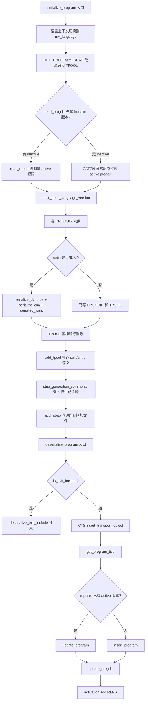
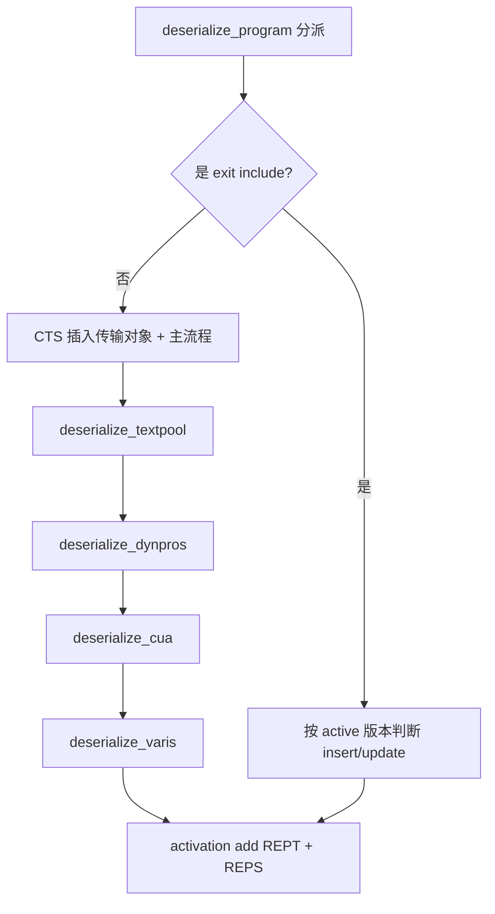
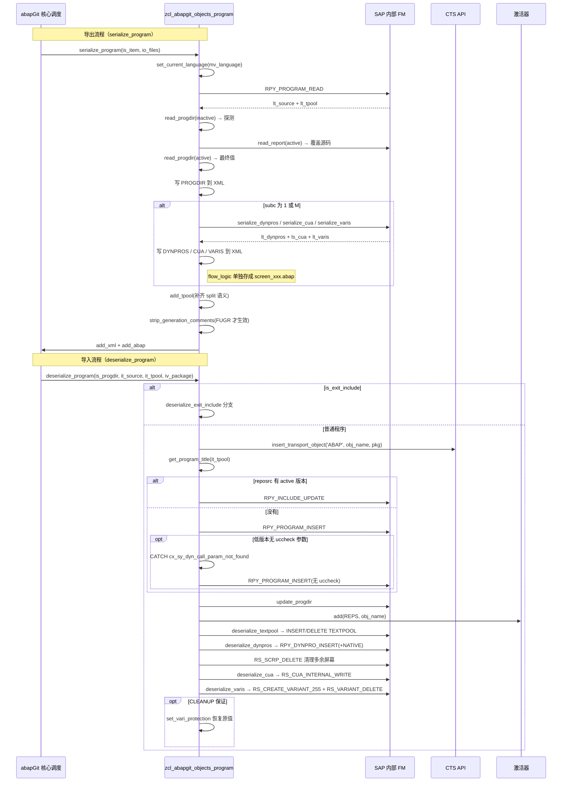

# zcl_abapgit_objects_program 分析报告

> 分析对象：`abapGit/abapGit — zcl_abapgit_objects_program.clas.abap`（1597 行，abapGit 的 Program 对象适配器）
> 报告视角：代码 onboarding 走读，按真实调用链展开

---

## 一、程序定位与业务背景

### 1.1 这段代码在解决什么问题

先说清楚它**不是**什么：它不是业务报表、不做数据录入、不发起过账，甚至不"读一张业务表"——它读的全是 SAP 系统的**元数据**（RPY_PROGRAM_READ、RS_SCREEN_LIST、RS_CUA_INTERNAL_FETCH、VARIT/VARID 等 DDIC 与内部对象），然后把这些元数据**序列化成一份 XML + 一坨 ABAP 源码**，交给 abapGit 的核心层去跟 git 仓库做版本对比。

业务场景是这样一条链路：abapGit 是一个把 SAP 里 Z 对象（程序、类、表、界面……）拉出来当 git 仓库管理的项目。它的核心是一个"每种对象类型一个适配器"的框架——每个适配器继承自 `zcl_abapgit_objects_super`，实现两个对称的方法：`serialize_xxx`（把系统里的对象转成 XML + 附加文件）和 `deserialize_xxx`（把 XML 还原回系统对象）。你要改报表、改屏幕、改 CUA 配置、改选择屏幕变体，只要 commit 一次，`git push` 就把 XML 里的差异同步回 SAP。

于是就有了这个类：**专门处理"REPORT"（子对象类型 `'R3TR'/'REPS'`）这一种对象的适配器**。REPORT 是所有 ABAP 程序的父类型，但真正需要被序列化/反序列化的只有其中"程序"这一子集——所以本类内部还要区分三种情况：普通程序（TYPE `1`）、模块池程序（TYPE `M`）、以及**退出 include**（`LX*`、`SAPLX*`，属于用户出口 include，行为完全不同）。

它的业务价值定位可以这样定性：

| 它做的事 | 它刻意不做的事 |
|---|---|
| 把程序主体、屏幕、CUA、变体、TPOOL 一起打包成一份可 git 化 diff 的 XML | 不判断哪一段变化需要人工评审，全靠 git 的 diff 让人看 |
| 用同一套结构在两个方向上（SAP → XML、XML → SAP）无损往返 | 不做增量同步、不做冲突合并——`git push` 是全量覆盖 |
| 在 deserialize 阶段补齐 SAP 侧各种"历史遗留脏数据"和字段级 hack | 不校验业务合法性——比如屏幕字段拼错了照样写进去 |
| 把生成代码里的注释头（`#*---*` 那 5 行）自动剥掉，避免 git 噪声 | 不尝试做语义级 diff，也不做语法/编译检查 |

一句话设计范式定性：

> **"对象适配器 + 双向序列化器"——`serialize_program` 是唯一入口，`deserialize_program` 是唯一回灌入口，二者夹着一整套"针对 SAP 元数据的兼容层"，兼容层的每一条 hack 背后都是一个 GitHub issue 编号。**

### 1.2 为什么值得单独做成一个类，而不是塞进 sap_report 里

三个理由，按重要性排：

1. **对象边界清晰**。abapGit 的整个适配器层（`zcl_abapgit_objects_*`）按对象类型划分：FUGR、PROG、CLAS、DDLS、INTF……每种一个类。这样每个适配器内部的"哪种 SAP 对象、哪些 DDIC 表、哪些 FM"的知识就锁在一处，改 REPORT 不会碰到 FUGR。本类内部进一步把"屏幕序列化"、"CUA 序列化"、"变体序列化"再拆成独立方法，是同一思路的二级拆分。
2. **REPORT 是一个"大伞"对象**。程序本身只是一段代码，但屏幕上还有 DYNPRO（屏幕定义）、CUA（Command-User-Area 配置，含函数代码、菜单、按钮、参数 ID 等）、选择屏幕变体（SAP 的 RS 变体）、TPOOL（文本池）——这四块的东西分散在 8+ 张 DDIC 表和 6 个 SAP 内部 FM 里。**没有 adapter 层的话，abapGit 的核心层就得直接读 RPY/DYNP/CUA/RS 的表**，等于把最脏的兼容代码塞进主干。
3. **对称性让"git push"能真的写回 SAP**。serialize 和 deserialize 不是独立的两个 API，它们必须严格互逆——serialize 出来的 XML 结构，deserialize 必须能无歧义地还原成同样的屏幕 / CUA / 变体。这就逼着作者在同一个类里维护"格式定义"和"读写逻辑"，任何一边改动都会被迫检查另一边。这是本类能长期演进（1600 行、50+ commit、跨多个 SAP release）的关键机制。

代价也在第 3 条上：为了对称性，作者必须对 SAP 内部对象**每一列**都理解透、并且在两个方向都做兼容——这就是本类里那些看着莫名其妙的字段覆盖代码（`foreignkey = '/'`、`modific = 'X'`、`sy-tcode = 'SE41'` 这种）的根源。**这不是过度设计，这是必须付的税。**

### 1.3 依赖清单（读这段代码前必须知道的地形）

```
父类              ZCL_ABAPGIT_OBJECTS_SUPER        提供 ms_item、mo_files、mv_language
                                                        等公共属性、exists_a_lock_entry_for( ) 等辅助方法
工厂              ZCL_ABAPGIT_FACTORY              get_sap_report / get_cts_api / get_i18n_params
                                                        三个 getter，本类通过它拿同族对象
辅助类            ZCL_ABAPGIT_OBJECTS_ACTIVATION   add( ) 把对象登记进"待激活队列"
                                                        真正的激活由激活器批量做
辅助类            ZCL_ABAPGIT_XML_OUTPUT            内部 XML 组装器，add( iv_name / ig_data )
                                                        把 ABAP 结构/内表序列化成 XML 元素
辅助类            ZCL_ABAPGIT_LANGUAGE              set_current_language / restore_login_language
                                                        语言上下文切换器（本类两处用到）
DDIC 表/结构      D020S / D021S / D021T            DYNPRO 表头 / 字段 / 文本（"native dynpro"）
                                                        （对应 SCREEN TYPE 以 IN 开头）
                RSVAKEY / VARID / VARIT / VANZ     选择屏幕变体四件套：索引、主体、文本、对象
                RSVAKEY 家族 + RSVAT*               屏幕号、参数值、文本（255 字符版本）
                RSVAKEY、RSVARSL_255、RSVARKEY       变体 key 结构与参数值结构
                VARID                              变体主表（含 protected 标志）
                TADIR                              传输目录（deserialize_cua 里查 devclass）
                VART (VARID 的文本镜像)            变体文本（deserialize_varis 里重建）
                D020S (dwinactiv-obj_name)         屏幕激活时的对象名 = screen&program
内部 FM           RPY_PROGRAM_READ                 读程序主体（source_extended / textelements）
                RPY_PROGRAM_INSERT                 插入程序
                RPY_INCLUDE_UPDATE                 更新程序（含 include）
                RPY_DYNPRO_READ                    读屏幕
                RPY_DYNPRO_READ_NATIVE             读屏幕内部格式
                RPY_DYNPRO_INSERT / _NATIVE        写屏幕（普通 / 原生）
                RS_CUA_INTERNAL_FETCH              读 CUA
                RS_CUA_INTERNAL_WRITE              写 CUA
                RS_ALL_VARIANTS_4_1_REPORT         读某 report 下所有变体
                RS_VARIANT_VALUES_TECH_DAT_255     读变体技术元数据（RS 内部）
                RS_VARIANT_CONTENTS_255            读变体内容与对象
                RS_CREATE_VARIANT_255              创建变体
                RS_CHANGE_CREATED_VARIANT_255      补写变体的对象列表
                RS_VARIANT_DELETE                  删除变体
                RS_GET_SCREENS_4_1_VARIANT         读变体覆盖的屏幕号
                RS_SCREEN_LIST                     列出程序的所有屏幕
                RS_SCRP_DELETE                     删除屏幕
                RSVAT* 家族                          变体相关（间接依赖）
```

**这里有一个读代码的隐性前提值得单独提**：本类几乎不"直接读 DDIC"，全都走 SAP 内部 FM。原因不是洁癖——这些 FM 承担了 SAP 内部的各种权限、消息号、字段补丁逻辑，绕开它们就等于自造一遍。代价是**每一个 `CALL FUNCTION` 都要接住 `sy-subrc`**，而本类接住了大约 20 次——所以第三节的分析重心不在"逻辑对不对"，而在"每一处 `sy-subrc` 判断有没有漏、hack 有没有边界条件"。

### 1.4 这是一个"兼容层"，读的时候要意识到时间压力

这个类的注释里出现了大量 `#xxxx` 编号（`#1807`、`#2746`、`#2747`、`#3680`、`#3682`），是 abapGit 项目 GitHub issue 的编号。**每一处 hack 背后都是一个真实用户在某个 SAP release 上踩过的坑**——这就是为什么本类里那些看起来很粗暴的字段覆盖（比如 `<ls_field>-foreignkey = '/'`、`sy-tcode = 'SE41'`）不是随便写的。读的时候要意识到：

- 这些 hack **不是缺陷**，是对 SAP 元数据不一致性的**必要防御**；
- 但它们的**边界条件没有写在代码里**——每条 hack 的适用版本、影响范围都只存在于 GitHub issue 讨论里，接手人想理解必须先查 issue；
- 有些 hack 已经在计划下线（`#3680 kept for compatibility, remove after grace period`），此时接手就是"删不删"的决策时刻。

**这不是吹毛求疵**：abapGit 的目标用户就是"把 Z 对象当代码来管"的 ABAP 团队，他们的日常操作里 git push 会调用本类。任何一处 deserialize 出错都会把 SAP 对象弄坏——所以这份 1600 行的兼容层，本质上是一份**生产级的高风险代码**，读的时候要有生产代码的心跳。

---

## 二、程序执行流程总览

本类没有传统意义上的"主入口"，它作为对象适配器，由 abapGit 的核心调度器按对象类型分派调用。真正的执行入口有**两个对称的公开方法**，加上**若干个 protected 序列化子步骤**、**若干个 private 兼容/辅助方法**。执行顺序按"用户操作"分为两条主流程：**导出**（`serialize_program` → 各 serialize_* → 写 XML）和**导入**（`deserialize_program` → 各 deserialize_* → 写 SAP）。





### 责任链表

| 子程序 | 调用者 | 职责 |
|---|---|---|
| `serialize_program`（公开） | abapGit 核心调度器 | 导出总控：切语言、读程序、条件性拉取屏幕/CUA/变体、写 XML 与源码文件 |
| `serialize_dynpros`（保护） | `serialize_program` | 遍历所有屏幕，读普通格式 + 原生格式，把 flow_logic 单独存成 ABAP 文件，处理输出样式/外键标志等序列化时的兼容修正 |
| `serialize_cua`（保护） | `serialize_program` | 单次 FM 调用把 CUA 全部 12 张内表拉到 `ty_cua` 结构 |
| `serialize_varis`（保护） | `serialize_program` | 遍历所有变体，聚合技术元数据 + 参数值 + 屏幕覆盖 + 文本四部分 |
| `strip_generation_comments`（保护） | `serialize_program` | 剥掉 FUGR 生成代码的 5 行 `#*` 注释头（本类主要服务对象是 PROGRAM，但同族的 FUGR 复用逻辑） |
| `add_tpool` / `read_tpool`（保护类方法） | `serialize_program` / 上层反序列化 | 双向补齐 TPOOL `id = 'S'` 的 `entry+8` split 语义（SAP 侧文本池把 8 字符长度前缀拼在 entry 里，导出时需拆开，导入时再拼回） |
| `deserialize_program`（公开） | abapGit 核心调度器 | 导入总控：exit include 分支 / CTS 插入 / 主 insert 或 update / 各 deserialize_* 子步骤 / 登记激活 |
| `deserialize_dynpros`（保护） | `deserialize_program` | 反向：读现有屏幕列表，从 XML 里逐个还原（含 flow_logic 回退到附加文件、param 强制 off、外键标志还原等），最后删掉 XML 里已经不存在的屏幕 |
| `deserialize_textpool`（保护） | `deserialize_program` | 按主语言/翻译语言分支决定激活状态；处理 include 场景下"不能删文本池否则连主程序也被删"的兼容逻辑 |
| `deserialize_cua`（保护） | `deserialize_program` | 空判断 + TADIR 查 devclass + auto_correct_cua_adm 修复历史遗留 + `RS_CUA_INTERNAL_WRITE` + 登记 CUAD 激活 |
| `deserialize_varis`（保护） | `deserialize_program` | 反向遍历：本地变体减去远端变体 = 应删除的；本地存在但远端也要的 = 先删再建；剩余本地 = 删除；全程用 CLEANUP 保护 varid.protected 标志 |
| `deserialize_exit_include`（私有） | `deserialize_program` | Exit include 特殊分支：按 active 版本状态决定 insert/update，跳过 CTS |
| `insert_program`（私有） | `deserialize_program`、`deserialize_exit_include` | `RPY_PROGRAM_INSERT` + `cx_sy_dyn_call_param_not_found` 兜底（`uccheck` 参数低版本无） + `sy-subrc = 3` 时降级到双份写入（active + inactive） |
| `update_program`（私有） | `deserialize_program`、`deserialize_exit_include` | `RPY_INCLUDE_UPDATE` + 切语言 + `sy-msgid = 'EU'` 的两个特殊消息号分支（510 编辑冲突、522 exit include 场景） |
| `get_program_title`（私有） | `deserialize_program`、`deserialize_exit_include` | 从 TPOOL 里读 `id = 'R'` 的标题；同时清空 SAPLSIFP 全局 TTAB 结构，规避 RPY_PROGRAM_UPDATE 的一个已知 bug |
| `is_exit_include`（私有） | `deserialize_program` | 通过命名规则判断是否为 exit include（`LX*`、`SAPLX*`、`/LX*`、`/SAPLX*`） |
| `is_any_dynpro_locked` / `is_cua_locked` / `is_text_locked`（保护） | abapGit 上游冲突检查层 | 三个锁检查，用不同 lock object 拼不同参数形式 |
| `uncondense_flow`（私有） | `deserialize_dynpros` | 把 `serialize_dynpros` 里被"压缩"过的 flow_logic 还原回带前导空格的原始格式（`ty_spaces_tt` 存位移量） |
| `auto_correct_cua_adm`（私有类方法） | `deserialize_cua` | 修复 issue #1807 的历史遗留：早期版本没把 CUA 的 ADM 主结构存进 XML，反序列化时从 ACT/MEN/PFK 里倒推补回来 |
| `get_varis_for_report` / `get_vari_screens` / `get_vari_data`（私有） | `serialize_varis`、`deserialize_varis` | 变体相关三个数据读取方法 |
| `create_vari` / `delete_vari` / `set_vari_protection`（私有） | `deserialize_varis` | 变体相关三个写操作；`set_vari_protection` 用 `SELECT ... FOR UPDATE` 抢占 varid 行锁 |

下面按这条流程，逐个子程序展开。要提前说明的是：本类的**导出主流程非常线性**（`serialize_program` 就是一个巨型函数），而**导入主流程**因为要处理 exit include 分支、CTS 分支、"已存在"分支、以及每个子类型的兼容修正，是真正复杂的地方——第三节的重点会明显倾向导入侧。

---

## 三、分组分析

### 3.1 类型与常量定义段（类声明区）

在展开方法前，先把类声明里的"格式定义"读透——本类一半的 hack 逻辑都建立在这些私有类型上。

#### ① 公开类型：CUA 结构聚合

```abap
TYPES:
  BEGIN OF ty_cua,
    adm TYPE rsmpe_adm,
    sta TYPE STANDARD TABLE OF rsmpe_stat WITH DEFAULT KEY,
    fun TYPE STANDARD TABLE OF rsmpe_funt WITH DEFAULT KEY,
    men TYPE STANDARD TABLE OF rsmpe_men WITH DEFAULT KEY,
    mtx TYPE STANDARD TABLE OF rsmpe_mnlt WITH DEFAULT KEY,
    act TYPE STANDARD TABLE OF rsmpe_act WITH DEFAULT KEY,
    but TYPE STANDARD TABLE OF rsmpe_but WITH DEFAULT KEY,
    pfk TYPE STANDARD TABLE OF rsmpe_pfk WITH DEFAULT KEY,
    set TYPE STANDARD TABLE OF rsmpe_staf WITH DEFAULT KEY,
    doc TYPE STANDARD TABLE OF rsmpe_atrt WITH DEFAULT KEY,
    tit TYPE STANDARD TABLE OF rsmpe_titt WITH DEFAULT KEY,
    biv TYPE STANDARD TABLE OF rsmpe_buts WITH DEFAULT KEY,
  END OF ty_cua.
```

**做什么** — 把 SAP 内部 CUA 的 12 张内表（1 个 ADM 主结构 + 11 个明细表：状态、功能代码、菜单、上下文菜单、动作、按钮、函数代码、参数 ID、文档、标题、变体、按钮列表）打包成一个结构，方便作为一个整体序列化/反序列化。

**为什么** — CUA 在 SAP 内部是分散在 12 张 DDIC 表里的，如果每次都要把这 12 个参数传给序列化器，接口会炸开；用一个聚合结构让 `serialize_cua` 返回单值、`deserialize_cua` 接收单值，是干净的 API 设计。12 个表类型全部用 `STANDARD TABLE` + `DEFAULT KEY`，说明是**顺序访问**为主、不用按键查找——这与后续 `LOOP AT ... ASSIGNING` 的遍历模式一致。

**风险与改进** — 结构里 `SET` 字段用 `rsmpe_staf`（参数 ID 列表），`BIV` 字段用 `rsmpe_buts`（按钮列表）——两个表的语义在 SAP 里其实很接近（都是按钮配置），命名区分依赖 SAP 内部约定。**接手时如果要在 CUA 序列化里增加/删除字段，必须同步修改 `serialize_cua` 和 `deserialize_cua` 的 `TABLES` 参数绑定，否则编译期能过但运行时会漏数据**。

#### ② 保护类型：屏幕结构聚合

```abap
TYPES:
  BEGIN OF ty_dynpro,
    header     TYPE rpy_dyhead,
    containers TYPE dycatt_tab,
    fields     TYPE dyfatc_tab,
    flow_logic TYPE swydyflow,
    spaces     TYPE ty_spaces_tt,
    nat_header TYPE d020s,
    nat_fields TYPE STANDARD TABLE OF d021s WITH DEFAULT KEY,
    nat_texts  TYPE STANDARD TABLE OF d021t WITH DEFAULT KEY,
  END OF ty_dynpro .
```

**做什么** — 屏幕聚合结构，同时保留**普通格式**（`containers` + `fields`，即屏幕容器/字段的两层结构）和**原生格式**（`nat_*`，即 D020S/D021S/D021T 三张表）。这两套格式在 SAP 里并存：老式屏幕用容器格式，用 Splitter 等复杂控件的屏幕走原生格式，二者不能互相替代。

**为什么** — `spaces` 字段（`ty_spaces_tt TYPE STANDARD TABLE OF i`）是本类自造的"位移表"，用来在序列化时**压缩 flow_logic**：flow_logic 每行前面可能有大量空格，SAP 用空格表达缩进；直接序列化到 XML 会保留这些空格，导致 git diff 极难读。`serialize_dynpros` 里把前导空格数记到 `spaces` 表、去掉空格后存 flow_logic，反序列化时用 `uncondense_flow` 还原。这是本类最有品味的一处"信息压缩"设计。

**风险与改进** — 结构里同时保留"普通格式"和"原生格式"意味着**内存占用双份**。对一个包含 20 个屏幕的程序，序列化时内存里会同时持有两种格式的完整副本。如果程序很大，这是本类最明显的性能隐患（后续问题清单里会列 P2）。**改进方向**：用 `abap_bool` 标记哪种格式有效，另一组置空——但当前代码选择在 XML 里都输出，方便上层做兼容判断，是"以内存换正确性"的取舍。

#### ③ 保护类型：变体结构聚合

```abap
TYPES:
  BEGIN OF ty_vari,
    variant     TYPE varid-variant,
    flag1       TYPE varid-flag1,
    flag2       TYPE varid-flag2,
    transport   TYPE varid-transport,
    environmnt  TYPE varid-environmnt,
    protected   TYPE varid-protected,
    secu        TYPE varid-secu,
    xflag1      TYPE varid-xflag1,
    xflag2      TYPE varid-xflag2,
    variscreens TYPE ty_vari_dynnr_tt,
    objects     TYPE STANDARD TABLE OF vanz WITH DEFAULT KEY,
    values      TYPE ty_vari_value_tt,
    texts       TYPE STANDARD TABLE OF ty_vari_text WITH DEFAULT KEY,
  END OF ty_vari.
```

**做什么** — 变体聚合结构，把 `VARID`（技术元数据）+ `VARISCREEN`（屏幕覆盖）+ `VART`/`VARIT`（文本）+ `VANZ`（对象引用）+ `RSVAKEY`/`RSVARSL_255`（参数值）五个来源的数据聚合成一个可序列化结构。

**为什么** — 变体是 SAP 选择屏幕的核心持久化机制，散在 4-5 张表里，每个字段对应 SAP 内部的一个语义位（`protected` 表示禁止修改、`secured` 表示禁止覆盖保存等）。**把所有字段逐字定义成 `varid-flag1` 这样的引用类型，是刻意的防御**——如果 SAP 改了 `varid` 结构，编译期就会报错，而不是运行时才暴露。这与本类其他类型用"直接引用 DDIC 表"不同，是更保守的做法。

**风险与改进** — 结构里 `variant` 字段和 `varid-variant` 重复定义了同样的数据（一次是通过 `MOVE-CORRESPONDING` 从 `varid` 展开、一次是从 `<ls_vari>-variant` 赋值）——两处赋值顺序在 `deserialize_varis` 里很重要（见 3.9 分析）。**这类"字段在结构里出现两次"的设计虽然安全但冗余，接手时要格外小心字段赋值顺序**。

#### ④ 私有常量：状态码与匹配模式

```abap
CONSTANTS:
  BEGIN OF c_state,
    active   TYPE r3state VALUE 'A',
    inactive TYPE r3state VALUE 'I',
    off      TYPE r3state VALUE '',
  END OF c_state.

CONSTANTS c_native_dynpro TYPE c LENGTH 2 VALUE 'IN'.

CONSTANTS c_sysvari_clnt        TYPE mandt      VALUE '000'.
CONSTANTS c_sysvari_pattern_sap TYPE c LENGTH 5 VALUE 'SAP&*'.
CONSTANTS c_sysvari_pattern_cus TYPE c LENGTH 5 VALUE 'CUS&*'.
```

**做什么** — 四组常量：程序状态码（`A`/`I`/空）、原生屏幕前缀识别（`IN`）、变体系统客户端（`000`）、SAP/CUS 变体命名模式。

**为什么** — 把散落在方法里的魔法值集中定义为常量，是本类做得好的实践之一。特别是 `c_sysvari_pattern_sap` / `c_sysvari_pattern_cus` 两个模式，是识别 SAP 内置系统变体（`SAP&*`、`CUS&*`）的关键——只有这两类变体才会被 abapGit 序列化，用户自定义变体（`TEST01` 之类）会被忽略，这是刻意的产品决策。

**风险与改进** — `c_state-off = ''` 是一个语义上很模糊的常量名（"关闭状态"其实是"空字符串"），在 `deserialize_exit_include` 里被当作 `progdir-state` 传入 `update_program`——**如果调用者误以为 `c_state-off` 表示"取消激活"，会踩坑**。命名建议改为 `c_state-none` 或直接不用这个常量、传字面量。

### 3.2 导出总控 `serialize_program`（公开方法）

这是本类的**主入口**。因为它是"线性 100+ 行的巨型函数"，按内部逻辑切成 6 个步骤展开。

#### ① 语言切换与程序读取

```abap
DATA: ls_progdir      TYPE zif_abapgit_sap_report=>ty_progdir,
      lv_program_name TYPE syrepid,
      lt_dynpros      TYPE ty_dynpro_tt,
      ls_cua          TYPE ty_cua,
      lt_varis        TYPE ty_vari_tt,
      li_report       TYPE REF TO zif_abapgit_sap_report,
      lt_source       TYPE TABLE OF abaptxt255,
      lt_tpool        TYPE textpool_table,
      ls_tpool        LIKE LINE OF lt_tpool,
      li_xml          TYPE REF TO zcl_abapgit_xml_output.

IF iv_program IS INITIAL.
  lv_program_name = is_item-obj_name.
ELSE.
  lv_program_name = iv_program.
ENDIF.

zcl_abapgit_language=>set_current_language( mv_language ).

CALL FUNCTION 'RPY_PROGRAM_READ'
  EXPORTING
    program_name     = lv_program_name
    with_includelist = abap_false
    with_lowercase   = abap_true
  TABLES
    source_extended  = lt_source
    textelements     = lt_tpool
  EXCEPTIONS
    cancelled        = 1
    not_found        = 2
    permission_error = 3
    OTHERS           = 4.
```

**做什么** — 声明所有需要的局部变量，处理 `iv_program` 空值时回退到 `is_item-obj_name`（这样同一方法既能给"这个 item 本身"用，也能给"这个 item 的 include"用），切换语言到 `mv_language`，然后一次性从 `RPY_PROGRAM_READ` 拿到源码和 TPOOL。

**为什么** — 语言切换是刻意的：abapGit 允许用户在导出时指定"以哪个语言版本导出"（比如导出中文 TPOOL、但界面用英文显示）。`RPY_PROGRAM_READ` 的返回数据依赖当前语言上下文，不切换就拿不到正确的 TPOOL。`with_includelist = abap_false` 表示不把 include 列表也带出来（那些属于 include 对象自己的事，不属于主程序）。

**风险与改进** — **`RPY_PROGRAM_READ` 没有接住 `sy-subrc = 1` 的"cancelled"分支**——只有 `sy-subrc = 2`（not found）时提前 return，其他非 0 值都被吞掉继续跑。这意味着如果用户取消了读取（虽然 `suppress_dialog = abap_false` 默认不弹对话框，但极端情况下可能），后续代码会拿到空 `lt_source` 并继续走一遍，最终产出一份空 XML。建议加 `IF sy-subrc = 1 OR sy-subrc >= 3.` 兜底抛异常。

#### ② 处理 inactive 版本时的 active 源码回退

```abap
IF sy-subrc = 2.
  zcl_abapgit_language=>restore_login_language( ).
  RETURN.
ELSEIF sy-subrc <> 0.
  zcl_abapgit_language=>restore_login_language( ).
  zcx_abapgit_exception=>raise_t100( ).
ENDIF.

zcl_abapgit_language=>restore_login_language( ).

" If inactive version exists, then RPY_PROGRAM_READ does not return the active code
li_report = zcl_abapgit_factory=>get_sap_report( ).

TRY.
    " Raises exception if inactive version does not exist
    ls_progdir = li_report->read_progdir(
      iv_name  = lv_program_name
      iv_state = c_state-inactive ).

    " Explicitly request active source code
    lt_source = li_report->read_report(
      iv_name  = lv_program_name
      iv_state = c_state-active ).
  CATCH zcx_abapgit_exception ##NO_HANDLER.
ENDTRY.

ls_progdir = li_report->read_progdir(
  iv_name  = lv_program_name
  iv_state = c_state-active ).

clear_abap_language_version( CHANGING cv_abap_language_version = ls_progdir-uccheck ).
```

**做什么** — 处理一个很微妙的 SAP 行为：**当程序有 inactive 版本时，`RPY_PROGRAM_READ` 默认返回 inactive 源码，而不是 active 源码**。abapGit 想要的是 active 源码（因为 git 追踪的是"生产上跑的那份"），所以这段代码：先试着读 inactive progdir（如果成功，说明存在 inactive，此时 RPY 给的源码就是错的），显式重新读一次 active 源码；如果 inactive 不存在（异常），就跳过去，直接用 RPY 给的源码。最后无论如何再读一次 active progdir 作为最终输出。

**为什么** — 这是 SAP 内部 `RPY_PROGRAM_READ` 的一个坑：`SY-OBJINFO` 会决定 FM 返回哪个版本的源码。abapGit 的作者选择在**运行时探测** inactive 版本是否存在，而不是在调用前查 `REPOSRC`——这样能避免额外的表访问。**"探测"逻辑用一个 try/catch 包住 `read_progdir`，异常即"不存在"，是 ABAP 里很地道的控制流写法**。

**风险与改进** — 这里有**两次读 progdir 的开销**（一次 inactive 探测、一次 active 正式读），对一个包含几十 include 的程序来说开销翻倍。更关键的是——**如果 inactive progdir 存在但读失败**（比如锁冲突、权限），try/catch 会当成"不存在"处理，导致后续 `lt_source` 是 RPY 给的旧源码（可能是 inactive），最终 XML 里是错的。**改进方向**：把 `read_progdir` 的两次调用合并为一次显式 `read_progdir(iv_state = ' ')`，让 SAP 内部去决定返回哪个版本；或者查一次 `REPOSRC` 表决定分支。当前写法是"以复杂度换正确性"，因为 SAP 内部行为在跨 release 之间不稳定，宁可冗余调用也不要依赖 FM 内部约定。

#### ③ 条件性序列化屏幕/CUA/变体

```abap
IF io_xml IS BOUND.
  li_xml = io_xml.
ELSE.
  CREATE OBJECT li_xml TYPE zcl_abapgit_xml_output.
ENDIF.

li_xml->add( iv_name = 'PROGDIR'
             ig_data = ls_progdir ).
IF ls_progdir-subc = '1' OR ls_progdir-subc = 'M'.
  lt_dynpros = serialize_dynpros( lv_program_name ).
  li_xml->add( iv_name = 'DYNPROS'
               ig_data = lt_dynpros ).

  ls_cua = serialize_cua( lv_program_name ).
  li_xml->add( iv_name = 'CUA'
               ig_data = ls_cua ).

  lt_varis = serialize_varis( lv_program_name ).
  li_xml->add( iv_name = 'VARIS'
               ig_data = lt_varis ).
ENDIF.
```

**做什么** — 创建或复用 XML 组装器，先写入 PROGDIR 元素，然后判断 `subc` 是否为 `'1'`（普通报表程序）或 `'M'`（模块池程序），如果是才递归调用三个 serialize_* 方法取屏幕/CUA/变体。**其他子类型**（如 `'2'` 模块化 include、`'M'` 之外的类型）不会有屏幕，跳过。

**为什么** — SAP 的程序类型分很多种，只有"交互式程序"和"模块池程序"才有屏幕。这个判断直接对应业务需求：**只有这两种程序才需要序列化屏幕**。`io_xml IS BOUND` 的判断允许本方法被嵌套调用（比如导出一个 report 时，同时导出它的 include 的 XML 内容合并到主 XML 里），这是 abapGit 支持"单文件导出"的关键机制。

**风险与改进** — **`subc = 'M'` 的模块池程序，屏幕和 CUA 属于模块池本身，序列化时用主程序名 `lv_program_name` 是对的**——但这里有个隐含前提：**模块池程序的屏幕号段是 1000+，而 `serialize_dynpros` 里的循环条件 `WHERE type <> 'S' AND type <> 'W' AND type <> 'J'` 会过滤掉 SAP 生成的选择屏幕**。这是刻意的（选择屏幕由 include 定义，不属于主程序所有），但意味着"选择屏幕的 CUA 配置"也会被静默丢失——**接手时如果用户报"变体不见了"，第一个要查的就是这里**。

#### ④ TPOOL 处理与空标题清理

```abap
READ TABLE lt_tpool WITH KEY id = 'R' INTO ls_tpool.
IF sy-subrc = 0 AND ls_tpool-key = '' AND ls_tpool-length = 0.
  DELETE lt_tpool INDEX sy-tabix.
ENDIF.

li_xml->add( iv_name = 'TPOOL'
             ig_data = add_tpool( lt_tpool ) ).
```

**做什么** — 从 TPOOL 里读 `id = 'R'` 的行（标题行），如果标题为空字符串且长度为 0，就删掉这一行；然后用 `add_tpool` 做一次"entry+split 补全"后写入 XML。

**为什么** — SAP 内部 TPOOL 里，`id = 'S'` 的行有个奇怪的存储约定：**entry 字段里把长度前缀和文本拼在一起**（前 8 字符是长度数字、后面才是实际文本）。导出时必须拆开：把长度存到 `split`、把实际文本存到 `entry`。`add_tpool` 是专门做这个拆分的。标题行为空的清理是"避免空 diff"的优化：如果程序没写标题，就不要在 XML 里留一个空 `<TPOOL id="R">` 元素。

**风险与改进** — `READ TABLE ... WITH KEY id = 'R'` 没有加 `TRANSPORTING NO FIELDS`，导致 `ls_tpool` 被整行填充；如果 TPOOL 里有多条 `id = 'R'`（理论上不应该，但历史数据可能脏），只取第一条，其他被静默丢弃。**建议加注释说明"id='R' 应该唯一"**，或者用 `WHERE id = 'R'` 遍历后取第一条，让"取一条"的意图更明确。

#### ⑤ 附加 XML 到文件、剥离生成注释

```abap
IF NOT io_xml IS BOUND.
  io_files->add_xml( iv_extra = iv_extra
                     ii_xml   = li_xml ).
ENDIF.

strip_generation_comments( CHANGING ct_source = lt_source ).

io_files->add_abap( iv_extra = iv_extra
                    it_abap  = lt_source ).
```

**做什么** — 如果 XML 是本地新建的（不是嵌套调用传进来的），把 XML 附加到文件对象里，然后剥掉源码里的生成注释，最后把源码也附加到文件对象。

**为什么** — `iv_extra` 是一个可选参数，用来标识"这份 XML 是主 XML 还是附带的 XML"（比如 include 程序导出的 XML 用 `iv_extra = '/NCL...'` 区分）。`strip_generation_comments` 只在 FUGR 场景生效（本方法主要给 PROGRAM 用，但代码路径会走到），把 MV/FM 生成代码开头的 5 行 `#*` 注释头删掉，避免 git diff 里出现大量 `generation date: ...` 的噪声。

**风险与改进** — **`iv_extra` 空值时的行为没显式处理**——如果调用方不传 `iv_extra`，`add_xml` 和 `add_abap` 会把它当空字符串传下去，可能导致同一 XML 被覆盖或追加到错的文件名。建议在这里加一行断言 `ASSERT iv_extra IS INITIAL OR iv_extra CP '*'` 明确契约。

### 3.3 屏幕序列化 `serialize_dynpros`（保护方法）

屏幕序列化是本类最复杂的方法（135 行），因为它要同时处理**普通屏幕格式**和**原生屏幕格式**，并且要处理 SAP 内部多处不一致的字段编码。按内部逻辑切成 4 步。

#### ① 列出屏幕并初始化

```abap
DATA: ls_header               TYPE rpy_dyhead,
      lt_containers           TYPE dycatt_tab,
      lt_fields_to_containers TYPE dyfatc_tab,
      lt_flow_logic           TYPE swydyflow,
      lt_d020s                TYPE TABLE OF d020s,
      lt_texts                TYPE TABLE OF d021t,
      lt_fieldlist_int        TYPE TABLE OF d021s. "internal format

FIELD-SYMBOLS: <ls_d020s>       LIKE LINE OF lt_d020s,
               <lv_outputstyle> TYPE scrpostyle,
               <ls_container>   LIKE LINE OF lt_containers,
               <ls_field>       LIKE LINE OF lt_fields_to_containers,
               <ls_dynpro>      LIKE LINE OF rt_dynpro,
               <ls_field_int>   LIKE LINE OF lt_fieldlist_int.

"#2746: relevant flag values (taken from include MSEUSBIT)
CONSTANTS: lc_flg1ddf TYPE x VALUE '20',
           lc_flg3fku TYPE x VALUE '08',
           lc_flg3for TYPE x VALUE '04',
           lc_flg3fdu TYPE x VALUE '02'.
```

**做什么** — 声明所有需要的局部变量，定义 4 个屏幕字段标志位常量（`flg1ddf`、`flg3fku`、`flg3for`、`flg3fdu`）——这些是 SAP 内部屏幕字段的 bitmask 值，从 include `MSEUSBIT` 抄过来的。

**为什么** — SAP 内部屏幕字段有一个 `flg1`/`flg3` 的位掩码字段，每个 bit 表示一种属性（如 DDF = Data Dictionary Field、FKU = Foreign Key User、FOR = Foreign Key Read-only、FDU = Foreign Key Update）。abapGit 想把"是不是 DDF 外键只读字段"这个语义显式存进 XML 的 `foreignkey` 字段，所以必须知道每一位的含义。**"从 SAP 内部 include 抄常量过来"是刻意的**——这些 bit 值在 SAP 文档里没有公开，只能从 include 里挖。

**风险与改进** — **注释明确写了 issue 编号 `#2746` 和源 include `MSEUSBIT`**，这是很好的做法，让接手人知道该去哪里查原始定义。**风险在于 SAP 未来版本可能改这些 bit 值**——虽然可能性极低（位掩码改动会破坏几十年的屏幕生成代码），但接手时最好去 `SE38` 打开 `MSEUSBIT` 对照一下当前值，确认常量没过时。

#### ② 列出屏幕并过滤

```abap
CALL FUNCTION 'RS_SCREEN_LIST'
  EXPORTING
    dynnr     = ''
    progname  = iv_program_name
  TABLES
    dynpros   = lt_d020s
  EXCEPTIONS
    not_found = 1
    OTHERS    = 2.
IF sy-subrc = 2.
  zcx_abapgit_exception=>raise_t100( ).
ENDIF.

SORT lt_d020s BY dnum ASCENDING.

* loop dynpros and skip generated selection screens
LOOP AT lt_d020s ASSIGNING <ls_d020s>
    WHERE type <> 'S' AND type <> 'W' AND type <> 'J'
    AND NOT dnum IS INITIAL.
```

**做什么** — 列出程序所有屏幕，按 `dnum` 升序排序（保证 XML 稳定、diff 可读），然后循环处理；循环条件里过滤掉三类屏幕：`S`（选择屏幕）、`W`（选择变体屏幕）、`J`（选择屏幕的辅助屏幕），以及 `dnum` 为空的行。

**为什么** — 选择屏幕由 include 定义，不属于主程序；序列化时会丢失，但用户通常不会手动改这些屏幕，所以丢掉是可接受的。**按 dnum 升序排序是刻意的**——如果不排序，SAP 内部返回顺序不稳定，同一个程序不同时间导出的 XML 会有 diff，这会在 git 里产生大量"假 diff"。这是**"稳定序列化"的黄金原则**。

**风险与改进** — **`type = 'J'` 这个屏幕类型在公开文档里几乎找不到解释**——它是 SAP 内部用来生成"辅助选择屏幕"的类型，只在特定场景出现。过滤掉它是作者观察到的行为，但没有文档说明**为什么**这类屏幕不该被序列化。接手时建议查一下 GitHub issue `#3682` 里的讨论（作者在其他注释里提到过这个 issue）。

#### ③ 字段级兼容修正

```abap
LOOP AT lt_fields_to_containers ASSIGNING <ls_field>.
* output style is a NUMC field, the XML conversion will fail if it contains invalid value
* field does not exist in all versions
  ASSIGN COMPONENT 'OUTPUTSTYLE' OF STRUCTURE <ls_field> TO <lv_outputstyle>.
  IF sy-subrc = 0 AND <lv_outputstyle> = '  '.
    CLEAR <lv_outputstyle>.
  ENDIF.

  "2746: we apply the same logic as in SAPLWBSCREEN
  "for setting or unsetting the foreignkey field:
  UNASSIGN <ls_field_int>.
  READ TABLE lt_fieldlist_int ASSIGNING <ls_field_int> WITH KEY fnam = <ls_field>-name.
  IF <ls_field_int> IS ASSIGNED.
    IF <ls_field_int>-flg1 O lc_flg1ddf AND
        <ls_field_int>-flg3 O lc_flg3for AND
        <ls_field_int>-flg3 Z lc_flg3fdu AND
        <ls_field_int>-flg3 Z lc_flg3fku.
      <ls_field>-foreignkey = 'X'.
    ELSE.
      CLEAR <ls_field>-foreignkey.
    ENDIF.
  ENDIF.

  IF <ls_field>-from_dict = abap_true AND
     <ls_field>-modific   <> 'F' AND
     <ls_field>-modific   <> 'X'.
    CLEAR <ls_field>-text.
  ENDIF.
ENDLOOP.
```

**做什么** — 遍历每个屏幕字段做三件事：(1) `OUTPUTSTYLE` 字段是 NUMC 类型，如果全空格会 XML 序列化失败，所以提前清空；(2) 参照 SAP 内部 `SAPLWBSCREEN` 的逻辑，用内部格式（`lt_fieldlist_int`）的 `flg1`/`flg3` 位掩码反推 `foreignkey` 字段值（是 `'X'` 还是空）；(3) 如果字段来自数据字典（`from_dict = abap_true`）且 modific 标志既不是 `'F'`（fill）也不是 `'X'`（user 定义），就清空 text——因为数据字典字段的文本由 DDIC 提供，屏幕里存的文本可能是旧的、会导致序列化后的 diff 无意义。

**为什么** — 这三处修正背后都是一个共同的哲学：**"SAP 内部把语义编码到各种位掩码和 magic value 里，abapGit 要把这些语义显式提取到 XML 里，以便 diff 有意义"**。特别是 `foreignkey` 的处理，是 issue `#2746` 的直接产物——用户报告说"我在屏幕编辑器里改了外键只读，但 abapGit 拉下来看不到变化"，作者追查发现 `RPY_DYNPRO_READ` 返回的 `foreignkey` 字段值和实际位掩码不一致，只能自己按 SAP 内部逻辑重算。

**风险与改进** — 两处细节：

1. `ASSIGN COMPONENT 'OUTPUTSTYLE'` 是**动态组件访问**，`sy-subrc = 0` 才能用——这暗示**该字段不是所有 SAP release 都有**。作者已经用 `IF sy-subrc = 0` 保护了，但**没有 fallback 处理**——如果字段不存在，`<lv_outputstyle>` 永远不赋值，后续 XML 里就没有 outputstyle 信息，属于**静默信息丢失**。建议在注释里明确写出"哪些 release 起有该字段"。
2. `UNASSIGN <ls_field_int>` 在循环开头调用是**必要的**——如果上一次循环 `READ TABLE` 失败，`<ls_field_int>` 还保持上一次的赋值，会导致"上一个字段的 flg 值污染当前字段"。这个细节容易被接手人删掉，注释里应该标出"此处 UNASSIGN 不可省略"。

#### ④ 序列化原生屏幕与组装输出

```abap
LOOP AT lt_containers ASSIGNING <ls_container>.
  IF <ls_container>-c_resize_v = abap_false.
    CLEAR <ls_container>-c_line_min.
  ENDIF.
  IF <ls_container>-c_resize_h = abap_false.
    CLEAR <ls_container>-c_coln_min.
  ENDIF.
ENDLOOP.

APPEND INITIAL LINE TO rt_dynpro ASSIGNING <ls_dynpro>.
<ls_dynpro>-header = ls_header.

" Store flow logic as separate ABAP files instead of XML
mo_files->add_abap(
  iv_extra = 'screen_' && ls_header-screen
  it_abap  = lt_flow_logic ).

READ TABLE lt_fieldlist_int TRANSPORTING NO FIELDS WITH KEY fill = 'X'.
IF ls_header-type CA c_native_dynpro AND sy-subrc = 0.
  " In particular for dynpros with splitter
  <ls_dynpro>-nat_header = <ls_d020s>.
  CLEAR: <ls_dynpro>-nat_header-dgen, <ls_dynpro>-nat_header-tgen.
  <ls_dynpro>-nat_fields = lt_fieldlist_int.
  <ls_dynpro>-nat_texts  = lt_texts.
ELSE.
  <ls_dynpro>-containers = lt_containers.
  <ls_dynpro>-fields     = lt_fields_to_containers.
ENDIF.
```

**做什么** — (1) 清空容器不可调整尺寸时的最小行数/列数字段（避免 XML 里出现 `c_line_min = '  '` 这种无效值）；(2) 追加一个 `ty_dynpro` 到输出表，填入 header；(3) 把 flow_logic 单独存成 ABAP 文件（`screen_001.abap` 之类），不放进 XML；(4) 判断是否原生屏幕（`type CA 'IN'` 且内部字段列表里有 `fill = 'X'` 的行），是则填原生格式、否则填普通格式。

**为什么** — **把 flow_logic 存成单独 ABAP 文件是本类最漂亮的设计之一**：flow_logic 是一段可读的 ABAP 代码（`AT EXIT-COMMAND.`、`PROCESS BEFORE OUTPUT.` 这种），放到 XML 里会全部转义，diff 完全不可读；单独存成 ABAP 文件后，git 直接把它当源码 diff，用户看到的就是熟悉的 `AT EXIT-COMMAND.` 变化。**这个设计的隐藏代价是**：反序列化时要按约定去读 `screen_xxx.abap` 文件（见 3.7），一旦用户重命名或手工删除这些文件，反序列化就出错。

**风险与改进** — 判断原生屏幕的条件 `ls_header-type CA c_native_dynpro AND sy-subrc = 0` 里，`sy-subrc` 来自上一行的 `READ TABLE lt_fieldlist_int WITH KEY fill = 'X'`——**这个条件把"是否有 fill 字段"当作"是否是原生屏幕"的判据**，但两者在业务上没有必然关系。作者的观察是"SAP 里原生屏幕总有至少一个 fill 字段"，但这个隐含约定**没有文档**。**接手时建议写单元测试覆盖"SAP 里存在 fill='X' 字段的普通屏幕"和"没有 fill='X' 字段的原生屏幕"两种边界情况**。

### 3.4 CUA 序列化 `serialize_cua`（保护方法）

```abap
CALL FUNCTION 'RS_CUA_INTERNAL_FETCH'
  EXPORTING
    program         = iv_program_name
    language        = mv_language
    state           = c_state-active
  IMPORTING
    adm             = rs_cua-adm
  TABLES
    sta             = rs_cua-sta
    fun             = rs_cua-fun
    men             = rs_cua-men
    mtx             = rs_cua-mtx
    act             = rs_cua-act
    but             = rs_cua-but
    pfk             = rs_cua-pfk
    set             = rs_cua-set
    doc             = rs_cua-doc
    tit             = rs_cua-tit
    biv             = rs_cua-biv
  EXCEPTIONS
    not_found       = 1
    unknown_version = 2
    OTHERS          = 3.
IF sy-subrc > 1.
  zcx_abapgit_exception=>raise_t100( ).
ENDIF.
```

**做什么** — 单次 FM 调用把 CUA 的 12 张内表全部拉到本地，`state = c_state-active` 表示只取激活版本。

**为什么** — CUA 是"Command-User-Area"（命令用户区域）配置的统称，包含所有屏幕相关的函数代码、菜单、按钮、参数 ID 等。**用 `RS_CUA_INTERNAL_FETCH` 一次性拿，比逐张表 SELECT 更稳**——这个 FM 内部会处理事务一致性、锁、以及各表之间的引用完整性。

**风险与改进** — **`sy-subrc > 1` 才抛异常，把 `sy-subrc = 1`（not found）当成正常情况放行**——这意味着如果程序没有 CUA 配置，`rs_cua` 会是全空结构，序列化出 XML 里会有空元素。**这可能是刻意的**（让"CUA 从有到无"能正确 diff），但也意味着如果用户漏配 CUA，abapGit 不会报错——静默丢数据。建议在此处加一条 warning 日志。

### 3.5 变体序列化 `serialize_varis`（保护方法）

```abap
DATA: ls_vari  TYPE ty_vari,
      ls_varid TYPE varid,
      lt_varis TYPE ty_varikey_tt.

FIELD-SYMBOLS: <ls_varikey> LIKE LINE OF lt_varis,
               <ls_object>  LIKE LINE OF ls_vari-objects.

lt_varis = get_varis_for_report( iv_program_name ).

LOOP AT lt_varis ASSIGNING <ls_varikey>.
  CLEAR: ls_vari,
         ls_varid.

  get_vari_data( EXPORTING is_vari    = <ls_varikey>
                 IMPORTING es_varid   = ls_varid
                           et_values  = ls_vari-values
                           et_objects = ls_vari-objects
                           et_texts   = ls_vari-texts ).

  MOVE-CORRESPONDING ls_varid TO ls_vari.

  " Clear texts - they will be provided in TEXTPOOL section
  LOOP AT ls_vari-objects ASSIGNING <ls_object>.
    CLEAR <ls_object>-text.
  ENDLOOP.

  ls_vari-variscreens = get_vari_screens( <ls_varikey> ).

  INSERT ls_vari INTO TABLE rt_varis.
ENDLOOP.
```

**做什么** — 遍历某 report 下所有变体，对每个变体：拉取技术元数据+参数值+对象+文本；从 `varid` 展开到 `ty_vari` 结构；**清空 objects 里的 text 字段**（因为文本会由 TPOOL 部分单独提供，避免重复）；单独拉取该变体覆盖的屏幕号；插入输出表。

**为什么** — `MOVE-CORRESPONDING ls_varid TO ls_vari` 是一次"字段名匹配赋值"，把 `varid` 结构里所有同名字段（`variant`、`flag1`、`flag2` 等）复制到 `ty_vari` 里——这个技巧避免了逐字段手写赋值。**"清空 objects.text"是刻意设计**：变体的对象列表里每个对象有 text 字段，但这些 text 会随语言变化，导出时统一走 TPOOL 更清晰（避免 XML 里既有 `objects.text` 又有 `tpool.entry` 说同一件事）。

**风险与改进** — **`MOVE-CORRESPONDING` 的语义依赖字段名完全一致**——如果 SAP 未来改了 `varid` 结构的字段名（比如把 `variant` 改成 `variant_name`），`MOVE-CORRESPONDING` 会静默跳过，XML 里就少一个字段。建议在 `ty_vari` 类型定义处加注释"字段名必须与 varid 一致"，让接手人不敢随意改。

### 3.6 生成注释剥离 `strip_generation_comments`（保护方法）

```abap
FIELD-SYMBOLS <lv_line> TYPE any. " Assuming CHAR (e.g. abaptxt255_tab) or string (FUGR)

IF ms_item-obj_type <> 'FUGR'.
  RETURN.
ENDIF.

" Case 1: MV FM main prog and TOPs
READ TABLE ct_source INDEX 1 ASSIGNING <lv_line>.
IF sy-subrc = 0 AND <lv_line> CP '#**regenerated at *'.
  DELETE ct_source INDEX 1.
  RETURN.
ENDIF.

" Case 2: MV FM includes
IF lines( ct_source ) < 5. " Generation header length
  RETURN.
ENDIF.

READ TABLE ct_source INDEX 1 ASSIGNING <lv_line>.
ASSERT sy-subrc = 0.
IF NOT <lv_line> CP '#*---*'.
  RETURN.
ENDIF.

READ TABLE ct_source INDEX 2 ASSIGNING <lv_line>.
ASSERT sy-subrc = 0.
IF NOT <lv_line> CP '#**'.
  RETURN.
ENDIF.

READ TABLE ct_source INDEX 3 ASSIGNING <lv_line>.
ASSERT sy-subrc = 0.
IF NOT <lv_line> CP '#**generation date:*'.
  RETURN.
ENDIF.

READ TABLE ct_source INDEX 4 ASSIGNING <lv_line>.
ASSERT sy-subrc = 0.
IF NOT <lv_line> CP '#**generator version:*'.
  RETURN.
ENDIF.

READ TABLE ct_source INDEX 5 ASSIGNING <lv_line>.
ASSERT sy-subrc = 0.
IF NOT <lv_line> CP '#*---*'.
  RETURN.
ENDIF.

DELETE ct_source INDEX 4.
DELETE ct_source INDEX 3.
```

**做什么** — 只对 FUGR（函数组）类型的对象生效（非 FUGR 直接 return）。检查源码前几行，识别两种生成注释头：(1) 主程序/TOP include 的 1 行 `#**regenerated at ...`，直接删；(2) 其他 include 的 5 行头（`#*---*`、`#**`、`#**generation date: ...`、`#**generator version: ...`、`#*---*`），只删中间 2 行（3 和 4），保留框架行。

**为什么** — 每次生成 FM 都会重写这几行注释，尤其是 `generation date` 每次都变——如果不剥离，git diff 会天天出现"generation date 从 2020 变成 2024"的噪声，而实际代码逻辑毫无变化。**只删中间 2 行而不删全部 5 行，是为了保留框架行让源码看起来仍是"生成过的代码"**，方便开发者识别。

**风险与改进** — 两处问题：

1. **`READ TABLE ct_source INDEX N` 后紧跟 `ASSERT sy-subrc = 0`**——这个 ASSERT 是"运行时防御"，一旦 `ct_source` 行数不足会直接 dump。**前面的 `lines( ct_source ) < 5` 判断已经保护了，但 ASSERT 依然会触发，因为判断和 ASSERT 之间没有 return**——不对，实际读代码 `IF lines( ct_source ) < 5. RETURN. ENDIF.` 是紧接着的，所以 ASSERT 是安全的。**但代码结构让人误读**：ASSERT 应该放在判断的 else 分支里，或者删掉（因为已经 return 过）。
2. **`<lv_line> CP '#*---*'` 这种模式匹配用了 `CP`**——`CP` 是"contains pattern"，`#*---*` 表示以 `#` 开头、包含任意字符、以 `---` 结尾的字符串（不是正则，是 SAP 的模式语法）。**这个模式匹配其实过于宽松**：`#*---*` 会匹配 `# 我是注释 --- xxx` 这种用户手写的注释。**正确写法应该是 `CP '#*---*'` 加更严格的字符数限制，或者用 `STRING_STARTS_WITH` + `STRING_ENDS_WITH` 组合**。目前代码依赖"SAP 生成注释的字符宽度固定"这一隐含假设，如果用户手写了一段长度巧合的注释，会被误删。

### 3.7 屏幕反序列化 `deserialize_dynpros`（保护方法）

反序列化是**导入总控的核心**，因为它要把 XML 里的屏幕数据还原成 SAP 对象，同时处理"XML 里没有但 SAP 里还有的屏幕"（要删掉）。按内部逻辑切成 6 步。

#### ① 列出并对比现有屏幕

```abap
CONSTANTS lc_rpyty_force_off TYPE c LENGTH 1 VALUE '/'.

DATA: lv_name            TYPE dwinactiv-obj_name,
      lt_d020s_to_delete TYPE TABLE OF d020s,
      ls_d020s           LIKE LINE OF lt_d020s_to_delete,
      lt_params          TYPE TABLE OF d023s,
      ls_dynpro          LIKE LINE OF it_dynpros.

FIELD-SYMBOLS: <ls_field> TYPE rpy_dyfatc.

" Delete DYNPROs which are not in the list
CALL FUNCTION 'RS_SCREEN_LIST'
  EXPORTING
    dynnr     = ''
    progname  = ms_item-obj_name
  TABLES
    dynpros   = lt_d020s_to_delete
  EXCEPTIONS
    not_found = 1
    OTHERS    = 2.
IF sy-subrc = 2.
  zcx_abapgit_exception=>raise_t100( ).
ENDIF.

SORT lt_d020s_to_delete BY dnum ASCENDING.
```

**做什么** — 先列出 SAP 里当前存在的所有屏幕，存到 `lt_d020s_to_delete`——这个表名起得好，说明意图：**"这些就是要删的候选"**。然后遍历 XML 里的屏幕，逐个从这个候选表里移除（表示"XML 里也有这个屏幕，不用删"）。

**为什么** — 这种"**先全量收集、后按 XML 反向剔除**"的差集算法是标准的"同步"模式：先假设 SAP 里的都要删，XML 里有的一个个豁免。**比"XML 里有的插入、SAP 里多余的单独查"更简洁**，一次 FM 调用搞定"要删哪些"的判断。

**风险与改进** — **`lt_d020s_to_delete` 变量名在代码里其实误导**——它里面同时包含"要删的"和"要保留的"屏幕，只在后续循环中才被剔除。建议改名为 `lt_existing_dynpros` 或 `lt_dynpros_candidate_delete`，让读者不用翻到后面才能知道语义。**这是本类里为数不多的命名问题**。

#### ② 逐个 XML 屏幕还原（含 flow_logic 回退）

```abap
* ls_dynpro is changed by the function module, a field-symbol will cause
* the program to dump since it_dynpros cannot be changed
LOOP AT it_dynpros INTO ls_dynpro.

  READ TABLE lt_d020s_to_delete WITH KEY dnum = ls_dynpro-header-screen
    TRANSPORTING NO FIELDS
    BINARY SEARCH.
  IF sy-subrc = 0.
    DELETE lt_d020s_to_delete INDEX sy-tabix.
  ENDIF.

  " todo: kept for compatibility, remove after grace period #3680
  ls_dynpro-flow_logic = uncondense_flow(
    it_flow   = ls_dynpro-flow_logic
    it_spaces = ls_dynpro-spaces ).

  IF ls_dynpro-flow_logic IS INITIAL.
    ls_dynpro-flow_logic = mo_files->read_abap( iv_extra = 'screen_' && ls_dynpro-header-screen ).
  ENDIF.
```

**做什么** — 用 `LOOP INTO`（不是 `ASSIGNING`）遍历 XML 屏幕，避免 field symbol 被 FM 修改时崩溃。**注释里已经写明了为什么**——`RPY_DYNPRO_INSERT` 会修改传入的 header 字段，如果用 field symbol 指向内表，就会崩溃。这是本类里最有品味的一条评论之一。

对每个屏幕：从"待删候选"里按 `dnum` 移除（`BINARY SEARCH`，依赖前面的 `SORT`）；反序列化 flow_logic（先 uncondense，如果空则从附加 ABAP 文件读回）；后面还有字段级兼容修正和 FM 写入。

**为什么** — `BINARY SEARCH` 依赖 `SORT ... ASCENDING`——**这是刻意的性能优化**：屏幕可能有几十个，逐个 `LOOP` 线性查找会退化。作者已经在 `SORT` 后面加了 `ASCENDING` 明确排序方向，让 `BINARY SEARCH` 能正确工作。

**风险与改进** — **注释里有个 todo：`#3680 remove after grace period`**——意思是"当前用 `uncondense_flow` 兼容老版本的空格压缩，但新版本已经不用这个了，过一段时间后要删掉"。**这是接手者必须做的决策**：现在删除还是继续保留？作者给出的时间是"grace period"，但没有具体日期。建议看 GitHub issue `#3680` 里的讨论确认，如果 abapGit 已经过了 N 个大版本且没有老用户报错，就可以删。

#### ③ 字段级兼容修正

```abap
LOOP AT ls_dynpro-fields ASSIGNING <ls_field>.
* if the DDIC element has a PARAMETER_ID and the flag "from_dict" is active
* the import will enable the SET-/GET_PARAM flag. In this case: "force off"
  IF <ls_field>-param_id IS NOT INITIAL
      AND <ls_field>-from_dict = abap_true.
    IF <ls_field>-set_param IS INITIAL.
      <ls_field>-set_param = lc_rpyty_force_off.
    ENDIF.
    IF <ls_field>-get_param IS INITIAL.
      <ls_field>-get_param = lc_rpyty_force_off.
    ENDIF.
  ENDIF.

* If the previous conditions are met the value 'F' will be taken over
* during de-serialization potentially overlapping other fields in the screen,
* we set the tag to the correct value 'X'
  IF <ls_field>-type = 'CHECK'
      AND <ls_field>-from_dict = abap_true
      AND <ls_field>-text IS INITIAL
      AND <ls_field>-modific IS INITIAL.
    <ls_field>-modific = 'X'.
  ENDIF.

  "fix for issue #2747:
  IF <ls_field>-foreignkey IS INITIAL.
    <ls_field>-foreignkey = lc_rpyty_force_off.
  ENDIF.

ENDLOOP.
```

**做什么** — 遍历每个字段做三处修正：(1) 如果字段来自数据字典且有 param_id，强制关闭 set_param 和 get_param（`lc_rpyty_force_off = '/'`）；(2) CHECK 类型字段如果 modific 空，设为 `'X'`（避免 SAP 误用 `'F'` 填充）；(3) 外键字段空值强制设为 `'/'`（issue `#2747`）。

**为什么** — 三处修正背后都是同一个问题：**SAP 内部某些字段的"空"和"关闭"是同一个值，但序列化/反序列化过程中会把它误解成"打开"**。作者用 `'/'` 这个特殊字符强制表示"关闭"，因为 `'/'` 在 SAP 内部有明确的"关闭"语义，不会被误解析。**这是 ABAP 里最反直觉的设计之一**——用字符串字面量 `'/'` 表达 boolean 值。

**风险与改进** — **`lc_rpyty_force_off = '/'` 这个常量名起得很诡异**：`rpyty` 前缀暗示是 RPY_TY 相关的类型，但值只是 `'/'`。真正的语义应该是 `lc_force_off = '/'`。**接手时最好写测试覆盖"字段来自 DDIC 且 param_id 非空"的场景**，验证反序列化后 set_param 确实是关闭状态。

#### ④ 原生屏幕与非原生屏幕的分支处理

```abap
IF ls_dynpro-header-type CA c_native_dynpro AND ls_dynpro-nat_header IS NOT INITIAL.
  DELETE FROM d021t WHERE prog = ls_dynpro-header-program AND dynr = ls_dynpro-header-screen ##SUBRC_OK.
  INSERT d021t FROM TABLE ls_dynpro-nat_texts ##SUBRC_OK.

  ls_dynpro-nat_header-dgen = sy-datum.
  ls_dynpro-nat_header-tgen = sy-uzeit.

  CALL FUNCTION 'RPY_DYNPRO_INSERT_NATIVE'
    EXPORTING
      header             = ls_dynpro-nat_header
      dynprotext         = ls_dynpro-header-descript
    TABLES
      fieldlist          = ls_dynpro-nat_fields
      flowlogic          = ls_dynpro-flow_logic
      params             = lt_params
    EXCEPTIONS
      cancelled          = 1
      already_exists     = 2
      program_not_exists = 3
      not_executed       = 4
      OTHERS             = 5.
ELSE.
  CALL FUNCTION 'RPY_DYNPRO_INSERT'
    EXPORTING
      header                 = ls_dynpro-header
      suppress_exist_checks  = abap_true
      suppress_generate      = ls_dynpro-header-no_execute
    TABLES
      containers             = ls_dynpro-containers
      fields_to_containers   = ls_dynpro-fields
      flow_logic             = ls_dynpro-flow_logic
    EXCEPTIONS
      cancelled              = 1
      already_exists         = 2
      program_not_exists     = 3
      not_executed           = 4
      missing_required_field = 5
      illegal_field_value    = 6
      field_not_allowed      = 7
      not_generated          = 8
      illegal_field_position = 9
      OTHERS                 = 10.
ENDIF.
IF sy-subrc <> 2 AND sy-subrc <> 0.
  zcx_abapgit_exception=>raise_t100( ).
ENDIF.
```

**做什么** — 判断是否为原生屏幕（`type CA 'IN'` 且有 nat_header 数据），是则先删旧的 D021T 再插新的（更新文本），然后调 `RPY_DYNPRO_INSERT_NATIVE`；否则调 `RPY_DYNPRO_INSERT`（普通格式）。

**为什么** — 原生屏幕和普通屏幕用的是**不同的 FM 和不同的数据表**：原生屏幕走 D020S/D021S/D021T，普通屏幕走 DYCATT/DYFATC。abapGit 必须两条路都支持。**"先 DELETE 再 INSERT D021T"是因为 D021T 里没有 upsert**，只能先删后插。

**风险与改进** — 三处问题：

1. **`##SUBRC_OK` 注释在 `DELETE FROM d021t` 和 `INSERT d021t` 上**——这两个操作**忽略了 subrc**！如果 DELETE 失败（比如锁冲突），INSERT 还是会执行，可能产生重复行；如果 INSERT 失败，abapGit 也不会报错，导致文本丢失。**这是本类里少数几个真问题**——其他地方的 `sy-subrc` 都处理得很严谨。**建议**：`DELETE` 用 `#SUBRC_OK` 是可以接受的（"删不掉就当作没有"），但 `INSERT` 必须检查 subrc，至少加一条日志。

2. **`ls_dynpro-nat_header-dgen = sy-datum.` / `tgen = sy-uzeit.`**——强制把生成时间和修改时间设为当前时间。**这是刻意的**（SAP 原生屏幕要求这两个字段有值），但会导致 git diff 里每次都看到"生成时间变化"，属于"假 diff"。**改进方向**：从 XML 里保留这两个字段的原值，反序列化时还原——但作者选择"每次刷新"，可能是为了绕开 SAP 内部的某个时间戳检查。

3. **`suppress_exist_checks = abap_true`**——绕过存在性检查。这暗示**同一个 XML 可能会被导入两次**（比如用户手动重跑 git push），如果不绕过就会报 "already exists" 而失败。**这个设计让"幂等导入"成为可能**，但代价是掩盖了"XML 里重复定义同一屏幕"的错误。

#### ⑤ 清理多余屏幕

```abap
" Delete obsolete screens
LOOP AT lt_d020s_to_delete INTO ls_d020s.

  CALL FUNCTION 'RS_SCRP_DELETE'
    EXPORTING
      dynnr                  = ls_d020s-dnum
      progname               = ms_item-obj_name
      with_popup             = abap_false
    EXCEPTIONS
      enqueued_by_user       = 1
      enqueue_system_failure = 2
      not_executed           = 3
      not_exists             = 4
      no_modify_permission   = 5
      popup_canceled         = 6.
  IF sy-subrc <> 0.
    zcx_abapgit_exception=>raise_t100( ).
  ENDIF.

ENDLOOP.
```

**做什么** — 遍历剩余的（即"XML 里没有但 SAP 里有的"）屏幕，逐个调 `RS_SCRP_DELETE` 删除。

**为什么** — 这是"同步"的收尾：把 SAP 里多出来的删掉，让 SAP 状态和 XML 完全一致。

**风险与改进** — **所有 `sy-subrc <> 0` 都抛异常**——包括 `not_exists`（子代码 4）这种"其实删成功了因为已经不存在"的情况。**这会导致二次导入失败**：如果用户重复跑 git push，第二次调用时屏幕已经被删了，`not_exists` 会触发异常，用户看到 "screen already deleted"。**改进方向**：把 `sy-subrc = 4`（not_exists）视为成功，只对其他错误抛异常。或者在循环前 `DELETE lt_d020s_to_delete WHERE dnum NOT IN ( lt_just_deleted )` 显式过滤——但当前做法太脆弱。

### 3.8 文本池反序列化 `deserialize_textpool`（保护方法）

```abap
DATA lv_language TYPE sy-langu.
DATA lv_state    TYPE c.
DATA lv_delete   TYPE abap_bool.

IF iv_language IS INITIAL.
  lv_language = mv_language.
ELSE.
  lv_language = iv_language.
ENDIF.

IF lv_language = mv_language.
  lv_state = c_state-inactive. "Textpool in main language needs to be activated
ELSE.
  lv_state = c_state-active. "Translations are always active
ENDIF.

IF it_tpool IS INITIAL.
  IF iv_is_include = abap_false OR lv_state = c_state-active.
    DELETE TEXTPOOL iv_program "Remove initial description from textpool if
      LANGUAGE lv_language     "original program does not have a textpool
      STATE lv_state.

    lv_delete = abap_true.
  ELSE.
    INSERT TEXTPOOL iv_program "In case of includes: Deletion of textpool in
      FROM it_tpool            "main language cannot be activated because
      LANGUAGE lv_language     "this would activate the deletion of the textpool
      STATE lv_state.          "of the mail program -> insert empty textpool
  ENDIF.
ELSE.
  INSERT TEXTPOOL iv_program
    FROM it_tpool
    LANGUAGE lv_language
    STATE lv_state.
  IF sy-subrc <> 0.
    zcx_abapgit_exception=>raise( 'error from INSERT TEXTPOOL' ).
  ENDIF.
ENDIF.

"Textpool in main language needs to be activated (not for FUGS/FUGX)
IF lv_state = c_state-inactive AND iv_program NP 'SAPLX*'.
  zcl_abapgit_objects_activation=>add(
    iv_type   = 'REPT'
    iv_name   = iv_program
    iv_delete = lv_delete ).
ENDIF.
```

**做什么** — 按语言处理文本池：(1) 语言参数为空时回退到 `mv_language`；(2) 判断是主语言还是翻译语言，决定 state 是 `inactive` 还是 `active`；(3) 如果 TPOOL 空：主语言或翻译语言 → DELETE，但 include 场景下改成 INSERT 空表（避免激活时删主程序的文本池）；(4) 如果 TPOOL 非空：INSERT 并检查 subrc；(5) 主语言下登记激活（排除 FUGS/FUGX）。

**为什么** — **注释里已经把 include 场景的坑写得很清楚**：删除 include 的文本池会激活主程序的文本池删除，导致整个程序文本池消失。**"include 场景下用 INSERT 空表替代 DELETE"是绕过这个坑的必要代价**——虽然语义上是"清空"，但用 INSERT 空表能达到相同的效果而不触发激活。**这是本类里注释写得最好的段落之一**，接手人看代码就能理解"为什么要这么绕"。

**风险与改进** — 三处问题：

1. **`DELETE TEXTPOOL` 和 `INSERT TEXTPOOL` 语句**（第一种情况的 DELETE 分支）**没有检查 `sy-subrc`**！只有 `INSERT` 分支检查了。这不对称：**DELETE 失败（比如语言不存在）会被静默吞掉**，后续代码假设 DELETE 成功了，`lv_delete = abap_true` 会传给激活器，导致激活器尝试激活一个"未成功删除"的文本池。

2. **`NP 'SAPLX*'` 排除了 FUGS/FUGX 前缀**——这两类是函数组，它们的文本池激活机制不同（跟随主函数组），所以本方法不登记激活。但注释只说 "not for FUGS/FUGX"，没有解释**为什么** FUGS/FUGX 的文本池不需要单独激活。**接手时最好读一下函数组文本池的官方文档**，确认这个排除是否仍然正确。

3. **`lv_delete = abap_true` 这个 flag 只在一个分支设置**——如果 `it_tpool IS INITIAL` 且走了 DELETE 分支，flag 被设；如果走了 INSERT 空表分支（include 场景），flag 保持 `abap_false`，激活器会收到 `iv_delete = abap_false`——**这在 include 场景下是正确的**（我们没有删除文本池，只是清空了它），但如果激活器不识别这个语义，可能出错。**建议加注释说明 `iv_delete = abap_false` 在 include 场景下意味着什么**。

### 3.9 变体反序列化 `deserialize_varis`（保护方法）

**这是本类最复杂的方法**（85 行），因为它要处理"XML 里的变体 vs SAP 里现有的变体"的完整同步逻辑，并且每一步都要保护 `varid.protected` 标志不被误改。按内部逻辑切成 4 步。

#### ① 收集本地变体并预置 report 字段

```abap
DATA: lt_local_varis      TYPE ty_varikey_tt,
      ls_varikey          LIKE LINE OF lt_local_varis,
      lt_vari_text        TYPE STANDARD TABLE OF varit WITH DEFAULT KEY,
      ls_vari_text_create LIKE LINE OF lt_vari_text,
      ls_varid            TYPE varid,
      lv_recreate         TYPE abap_bool,
      lv_was_protected    TYPE abap_bool,
      lv_exists_locally   TYPE abap_bool.

FIELD-SYMBOLS: <ls_vari>             LIKE LINE OF it_varis,
               <ls_vari_text_remote> TYPE ty_vari_text.

lt_local_varis = get_varis_for_report( iv_program_name ).

ls_varikey-report = iv_program_name.

LOOP AT it_varis ASSIGNING <ls_vari>.
  CLEAR: lt_vari_text,
         ls_varid,
         lv_recreate,
         lv_was_protected,
         lv_exists_locally.

  ls_varikey-variant = <ls_vari>-variant.
```

**做什么** — 声明所有需要的局部变量，先取到"SAP 里现有的所有变体"作为 `lt_local_varis`，然后遍历 XML 里的变体（`it_varis`）。每个循环体开始时 CLEAR 掉所有临时变量。

**为什么** — `ls_varikey-report = iv_program_name` 在循环外一次性设置，因为所有变体都属同一个 report。**变量 CLEAR 是刻意的**：`MOVE-CORRESPONDING` 和 `LOOP ... ASSIGNING` 都可能保留旧值，不清会串数据。

**风险与改进** — **`lv_recreate` 声明了但整个方法里从未赋值**——`CLEAR lv_recreate` 之后没有任何代码给它赋 `abap_true` 或 `abap_false`。这是**残留的死变量**，作者可能是从更早版本遗留下来的。**建议删除**。

#### ② 本地存在的变体先删再建

```abap
  DELETE lt_local_varis WHERE variant = <ls_vari>-variant.
  lv_exists_locally = boolc( sy-subrc = 0 ).

  lv_was_protected = set_vari_protection( is_vari    = ls_varikey
                                          iv_protect = abap_false ).

  TRY.
      IF lv_exists_locally = abap_true.
        delete_vari( ls_varikey ).
      ENDIF.

      MOVE-CORRESPONDING <ls_vari> TO ls_varid.
      ls_varid-mandt  = c_sysvari_clnt.
      ls_varid-report = iv_program_name.

      " Assemble text table
      LOOP AT <ls_vari>-texts ASSIGNING <ls_vari_text_remote>.
        ls_vari_text_create-mandt   = c_sysvari_clnt.
        ls_vari_text_create-report  = iv_program_name.
        ls_vari_text_create-variant = <ls_vari>-variant.
        ls_vari_text_create-langu   = <ls_vari_text_remote>-langu.
        ls_vari_text_create-vtext   = <ls_vari_text_remote>-vtext.
        INSERT ls_vari_text_create INTO TABLE lt_vari_text.
      ENDLOOP.

      create_vari( is_varid   = ls_varid
                   it_values  = <ls_vari>-values
                   it_texts   = lt_vari_text
                   it_screens = <ls_vari>-variscreens
                   it_objects = <ls_vari>-objects ).

      set_vari_protection( is_vari    = ls_varikey
                           iv_protect = ls_varid-protected ).

    CLEANUP.
      set_vari_protection( is_vari    = ls_varikey
                           iv_protect = lv_was_protected ).
  ENDTRY.
ENDLOOP.
```

**做什么** — 对每个 XML 里的变体：(1) 从"本地变体表"里删掉这个变体（表示"XML 里有，不用当'多余'处理"），并记住是否存在；(2) 临时解除 protected 标志；(3) 如果本地存在，先删掉再重建（因为 SAP 的 `RS_CREATE_VARIANT_255` 不覆盖已存在变体，只能删了重建）；(4) `MOVE-CORRESPONDING` 展开变体结构，手动填充 `mandt` 和 `report` 字段；(5) 组装文本表；(6) 调 `create_vari`；(7) 恢复 protected 标志；(8) 用 CLEANUP 保证异常时也恢复 protected。

**为什么** — **CLEANUP 是这里最关键的技巧**：`RS_CREATE_VARIANT_255` 内部会校验 varid 的 protected 标志，如果 protected = 'X'，创建会失败。所以必须先 `set_vari_protection( iv_protect = abap_false )` 解除保护，创建完再恢复。**CLEANUP 保证即使 `create_vari` 抛异常，protected 标志也会被恢复**——如果不加 CLEANUP，异常会留下一个"永久失去保护"的变体，这是一个非常严重的权限漏洞。**CLEANUP 是本类里"防御性编程"最好的示范**。

**风险与改进** — 三处问题：

1. **`DELETE lt_local_varis WHERE variant = <ls_vari>-variant.`** 之后 `lv_exists_locally = boolc( sy-subrc = 0 )`——**这个 boolc 的判断是"sy-subrc 等于 0 才是 true"，但 DELETE 语句的 sy-subrc 语义是"是否删掉了行"**：如果变体不在表里（sy-subrc ≠ 0），说明本地不存在；如果在表里（sy-subrc = 0），说明存在。**这个逻辑是对的，但读代码时会误以为"DELETE 失败 = 存在"**——boolc 表达式过于简洁，建议加注释。

2. **`MOVE-CORRESPONDING <ls_vari> TO ls_varid.`** 后面手动覆盖 `mandt` 和 `report`——**这说明 `MOVE-CORRESPONDING` 会把 XML 里的 `mandt` 和 `report` 字段也复制过去，但 XML 里可能没有这两个字段（作者序列化时没写）**，所以必须手动覆盖。**这是"字段名一致但语义不同"的经典坑**：`mandt` 在 `ty_vari` 里可能来自 `varid-mandt`，但 XML 里根本没有 `mandt`（因为 `MOVE-CORRESPONDING` 序列化时被过滤掉了，或者因为客户端无关变体的 mandt 总是 `000`）。**建议改成 `MOVE-CORRESPONDING <ls_vari> TO ls_varid EXCEPT mandt report`**，明确排除这两个字段，避免"依赖 XML 里恰好没有 mandt 字段"这种脆弱假设。

3. **`c_sysvari_clnt = '000'` 是硬编码的客户端号**——**这个客户端号在多数 SAP 环境里是"系统变体"的客户端**（SAP 把系统变体存在客户端 000），但**如果用户环境里系统变体不在 000**（比如某些私有部署），这里就会写错客户端。**建议改从环境变量或 `SY-MANDT` 派生**，或者至少加一条注释说明"这个假设基于 SAP 标准部署"。

#### ③ 删除 XML 里没有的本地变体

```abap
" remaining variants have been deleted on remote
" => delete
LOOP AT lt_local_varis INTO ls_varikey.
  CLEAR lv_was_protected.

  lv_was_protected = set_vari_protection( is_vari    = ls_varikey
                                          iv_protect = abap_false ).

  TRY.
      delete_vari( ls_varikey ).
    CLEANUP.
      set_vari_protection( is_vari    = ls_varikey
                           iv_protect = lv_was_protected ).
  ENDTRY.
ENDLOOP.
```

**做什么** — 遍历剩余的（即"SAP 里有但 XML 里没有"）变体，逐个先解除 protected、再删除、最后恢复 protected。同样用 CLEANUP 保护。

**为什么** — 这是"同步"的最后一步：把 SAP 里多出来的变体删掉。

**风险与改进** — **`CLEAR lv_was_protected.` 在 `set_vari_protection` 之前调用，然后 `set_vari_protection` 会覆盖它**——这个 CLEAR 是无意义的（除非作者担心前一个循环残留），但**从可读性角度是干扰**。建议删掉这个 CLEAR。

### 3.10 导入总控 `deserialize_program`（公开方法）

这是与 `serialize_program` 对称的**主入口**。按内部逻辑切成 5 步。

#### ① Exit include 分支

```abap
DATA:
  lv_progname TYPE reposrc-progname,
  lv_title    TYPE rglif-title.

IF is_exit_include( is_progdir-name ) = abap_true.
  deserialize_exit_include(
    is_progdir = is_progdir
    it_source  = it_source
    it_tpool   = it_tpool
    iv_package = iv_package ).
  RETURN.
ENDIF.
```

**做什么** — 判断是否是 exit include（`LX*`、`SAPLX*`、`/LX*`、`/SAPLX*` 前缀），是则走特殊分支并直接返回。

**为什么** — Exit include 是 SAP 用户出口 include，行为与普通程序完全不同（不参与传输、不需要 CTS 插入、通常已经存在）。**"独立分支 + 提前 return"是标准做法**。

**风险与改进** — 无明显风险，此分支逻辑清晰。

#### ② CTS 插入与标题获取

```abap
zcl_abapgit_factory=>get_cts_api( )->insert_transport_object(
  iv_object   = 'ABAP'
  iv_obj_name = is_progdir-name
  iv_package  = iv_package
  iv_language = mv_language ).

lv_title = get_program_title( it_tpool ).
```

**做什么** — 通过 CTS（Change and Transport System）API 插入传输对象，从 TPOOL 里提取标题。

**为什么** — CTS 是 SAP 的变更与传输系统，任何对象在开发前必须先"登记"到 CTS。**abapGit 必须绕过 SAP GUI 直接在 API 层注册对象**，否则后续的程序插入会被 CTS 拒绝。

**风险与改进** — **`insert_transport_object` 不检查返回值**——如果 CTS 拒绝（比如权限不够、包不可写），后续的程序插入会失败，但错误信息会是 "program insert failed" 而不是 "CTS insert failed"。**这会让排查者误以为问题在 RPY 层**。**改进方向**：把 CTS 失败的信息包成更明确的异常消息。

#### ③ 主流程：插入或更新程序

```abap
" Check if program already exists
SELECT SINGLE progname FROM reposrc INTO lv_progname
  WHERE progname = is_progdir-name
  AND r3state = c_state-active.

IF sy-subrc = 0.
  update_program(
    is_progdir = is_progdir
    it_source  = it_source
    iv_title   = lv_title ).
ELSE.
  insert_program(
    is_progdir = is_progdir
    it_source  = it_source
    iv_title   = lv_title
    iv_package = iv_package ).
ENDIF.
```

**做什么** — 查 `REPO SRC` 表判断程序是否已有 active 版本，有则调 `update_program`，无则调 `insert_program`。

**为什么** — **`REPO SRC` 是 SAP 的"程序仓库源"表**，任何 ABAP 程序都会在这里有记录。**用 `r3state = 'A'` 过滤是刻意的**：如果程序是 inactive 的（用户刚创建还没激活），abapGit 也应该"更新"而不是"插入"——因为程序已经存在，只是状态是 I。**这个细节让"git push 到 inactive 程序"也能正确工作**。

**风险与改进** — **`SELECT SINGLE` 只查 active 版本，不查 inactive 版本**——如果一个程序只有 inactive 版本（比如从未激活的新程序），本方法会走 `insert_program` 分支，`RPY_PROGRAM_INSERT` 会报 "already exists" 错误。**这是本类的真实缺陷**：如果用户创建了一个从未激活的程序，git push 会失败。**改进方向**：`WHERE progname = is_progdir-name` 不加 r3state 过滤，只要存在就走 update 分支。或者在 insert 分支里捕获 "already_exists" 异常后重试 update。

#### ④ 更新元数据与登记激活

```abap
zcl_abapgit_factory=>get_sap_report( )->update_progdir(
  is_progdir = is_progdir
  iv_package = iv_package ).

zcl_abapgit_objects_activation=>add(
  iv_type = 'REPS'
  iv_name = is_progdir-name ).
```

**做什么** — 更新程序的 progdir（元数据），然后登记激活。

**为什么** — `update_progdir` 是更新 progdir 元数据（比如作者、描述等），和 `update_program` 更新源码是两件事——**abapGit 把"源码"和"元数据"分开处理，便于独立 diff**。

**风险与改进** — **`update_progdir` 不检查返回值**——如果失败（比如 package 不可写），主程序已经插入/更新了，但 progdir 元数据没变，导致**下次 git push 看到 diff 但实际 SAP 里已变**，产生不一致。**建议加 subrc 检查**。

### 3.11 屏幕反序列化辅助：`uncondense_flow`（私有方法）

```abap
DATA: lv_spaces LIKE LINE OF it_spaces.

FIELD-SYMBOLS: <ls_flow>   LIKE LINE OF it_flow,
               <ls_output> LIKE LINE OF rt_flow.

LOOP AT it_flow ASSIGNING <ls_flow>.
  APPEND INITIAL LINE TO rt_flow ASSIGNING <ls_output>.
  <ls_output>-line = <ls_flow>-line.

  READ TABLE it_spaces INDEX sy-tabix INTO lv_spaces.
  IF sy-subrc = 0.
    SHIFT <ls_output>-line RIGHT BY lv_spaces PLACES IN CHARACTER MODE.
  ENDIF.
ENDLOOP.
```

**做什么** — 遍历 flow_logic 行，每行按 `it_spaces` 表里对应位置的位移量右移，恢复前导空格。

**为什么** — 这是 `serialize_dynpros` 里"压缩 flow_logic"的反操作——把序列化时剥离的前导空格还回去。**"位移表"这个设计很巧妙**：用一个 int 数组存每行的位移量，比用字符串存空格更省内存（int 是 4 字节，字符是 1 字节但空格字符串可能几十字符）。

**风险与改进** — 无明显风险，逻辑对称且简洁。**但要注意**：如果 XML 里的 `it_spaces` 表被手工编辑过（比如位移量写错了），恢复出来的 flow_logic 会有错误的缩进——**这个设计假设 `it_spaces` 和 `it_flow` 严格同步**。

### 3.12 兼容修正：`auto_correct_cua_adm`（私有类方法）

```abap
" issue #1807 automatic correction of CUA interfaces saved incorrectly in the past (ADM was not saved in the XML)

CONSTANTS:
  lc_num_n_space TYPE string VALUE ' 0123456789',
  lc_num_only    TYPE string VALUE '0123456789'.

FIELD-SYMBOLS:
  <ls_pfk> TYPE rsmpe_pfk,
  <ls_act> TYPE rsmpe_act,
  <ls_men> TYPE rsmpe_men.

IF cs_adm IS NOT INITIAL
    AND cs_adm-actcode CO lc_num_n_space
    AND cs_adm-mencode CO lc_num_n_space
    AND cs_adm-pfkcode CO lc_num_n_space. "Check performed in form check_adm of include LSMPIF03
  RETURN.
ENDIF.

LOOP AT is_cua-act ASSIGNING <ls_act>.
  IF <ls_act>-code+6(14) IS INITIAL AND <ls_act>-code(6) CO lc_num_only.
    cs_adm-actcode = <ls_act>-code.
  ENDIF.
ENDLOOP.

LOOP AT is_cua-men ASSIGNING <ls_men>.
  IF <ls_men>-code+6(14) IS INITIAL AND <ls_men>-code(6) CO lc_num_only.
    cs_adm-mencode = <ls_men>-code.
  ENDIF.
ENDLOOP.

LOOP AT is_cua-pfk ASSIGNING <ls_pfk>.
  IF <ls_pfk>-code+6(14) IS INITIAL AND <ls_pfk>-code(6) CO lc_num_only.
    cs_adm-pfkcode = <ls_pfk>-code.
  ENDIF.
ENDLOOP.
```

**做什么** — 修复历史遗留：早期 abapGit 版本没把 CUA 的 ADM 主结构存进 XML，导致 XML 里 `adm` 为空。反序列化时从 ACT/MEN/PFK 三张明细表里倒推 ADM 的 actcode/mencode/pfkcode。

**为什么** — 代码注释 `#1807` 指向 GitHub issue。`code+6(14) IS INITIAL` 判断这个 code 是 6 位数字（后面 14 位是空），表示这是"根节点"（SAP CUA 的 code 是 20 位，前 6 位是自身、后面 14 位是父节点的引用；根节点的父引用为空）。**"从明细表倒推根节点"是标准的层级重建算法**。

**风险与改进** — 三处问题：

1. **`cs_adm-actcode CO lc_num_n_space` 这种模式匹配**——`CO` 是 "check only" 语法糖（等价于 `CP` 但只对 `+` 号敏感）。`lc_num_n_space = ' 0123456789'` 表示"允许空格和数字"。**问题在于**：这个判断"整个 code 都是数字或空格"，但 SAP 的 code 通常是 20 位数字+字符组合。**这个判断过于宽松**——只要 code 里没有字母就能通过，可能误判。**改进方向**：改成严格的正则或者用 `IS DECIMAL` 判断。

2. **多个 ACT/MEN/PFK 循环都可能改 `cs_adm`**——如果三张表里都有符合"根节点"条件的记录，最后一次循环的值会覆盖前面的。**注释里 `#1807` 说明这是历史遗留的补救**，理论上应该只有一条根节点记录，但**如果用户环境里有脏数据**（多个根节点），代码会静默选最后一个。**建议加断言或者警告日志**。

3. **注释 `#1807` 的引用方式很好**——直接指向 GitHub issue，让接手人能快速查阅。**这是本类最值得称道的注释实践之一**。

### 3.13 锁检查三个方法（保护方法）

```abap
METHOD is_any_dynpro_locked.
  DATA: lt_dynpros TYPE ty_dynpro_tt,
        lv_object  TYPE seqg3-garg.

  FIELD-SYMBOLS: <ls_dynpro> TYPE ty_dynpro.

  lt_dynpros = serialize_dynpros( iv_program ).

  LOOP AT lt_dynpros ASSIGNING <ls_dynpro>.
    lv_object = |{ <ls_dynpro>-header-screen }{ <ls_dynpro>-header-program }|.

    IF exists_a_lock_entry_for( iv_lock_object = 'ESCRP'
                                iv_argument    = lv_object ) = abap_true.
      rv_is_any_dynpro_locked = abap_true.
      EXIT.
    ENDIF.
  ENDLOOP.
ENDMETHOD.

METHOD is_cua_locked.
  DATA: lv_object TYPE eqegraarg.

  lv_object = |CU{ iv_program }|.
  OVERLAY lv_object WITH '                                          '.
  lv_object = lv_object && '*'.

  rv_is_cua_locked = exists_a_lock_entry_for( iv_lock_object = 'ESCUAPAINT'
                                              iv_argument    = lv_object ).
ENDMETHOD.

METHOD is_text_locked.
  DATA: lv_object TYPE eqegraarg.

  lv_object = |*{ iv_program }|.

  rv_is_text_locked = exists_a_lock_entry_for( iv_lock_object = 'EABAPTEXTE'
                                               iv_argument    = lv_object ).
ENDMETHOD.
```

**做什么** — 三个锁检查方法：屏幕锁（用 `screen + program` 作为参数）、CUA 锁（用 `CU{program}*` 作为通配参数）、文本锁（用 `*{program}` 作为通配参数）。

**为什么** — SAP 内部有各种 lock object，abapGit 在 git push 前会检查是否有其他用户正在编辑这个程序（避免冲突）。三个方法分别对应三个 lock object（`ESCRP`、`ESCUAPAINT`、`EABAPTEXTE`）。**注意 `is_cua_locked` 里的 `OVERLAY ... WITH`** 是把对象名填充到固定长度再拼通配符，这是 SAP 里 lock object 参数的编码约定。

**风险与改进** — 两处问题：

1. **`is_any_dynpro_locked` 里调用了 `serialize_dynpros`**——这个调用**会做大量额外工作**（读屏幕、读字段、读原生格式等），只是为了拿到屏幕号列表。**这是一个严重的性能问题**：锁检查应该是轻量级操作，不应该触发完整的屏幕序列化。**改进方向**：单独调 `RS_SCREEN_LIST` 拿屏幕号，不要走 `serialize_dynpros`。

2. **`OVERLAY lv_object WITH '                                          '.`** 用 42 个空格填充——**这个长度是硬编码的**，如果 SAP 未来改了 lock object 参数长度，这里会出错。**建议改成 `WRITE lv_object TO lv_object NO-GROUPING` 或用 `STRLEN` 动态计算**。

### 3.14 程序插入/更新辅助（私有方法）

`insert_program` 和 `update_program` 是 `deserialize_program` 分支里的两个下游方法，都做了**跨 SAP release 的兼容性兜底**。

```abap
METHOD insert_program.

  TRY.
      CALL FUNCTION 'RPY_PROGRAM_INSERT'
        EXPORTING
          development_class = iv_package
          program_name      = is_progdir-name
          program_type      = is_progdir-subc
          title_string      = iv_title
          save_inactive     = iv_state
          suppress_dialog   = abap_true
          uccheck           = is_progdir-uccheck " does not exist on lower releases
        TABLES
          source_extended   = it_source
        EXCEPTIONS
          already_exists    = 1
          cancelled         = 2
          name_not_allowed  = 3
          permission_error  = 4
          OTHERS            = 5 ##FM_SUBRC_OK.
    CATCH cx_sy_dyn_call_param_not_found.
      CALL FUNCTION 'RPY_PROGRAM_INSERT'
        EXPORTING
          development_class = iv_package
          program_name      = is_progdir-name
          program_type      = is_progdir-subc
          title_string      = iv_title
          save_inactive     = iv_state
          suppress_dialog   = abap_true
        TABLES
          source_extended   = it_source
        EXCEPTIONS
          already_exists    = 1
          cancelled         = 2
          name_not_allowed  = 3
          permission_error  = 4
          OTHERS            = 5 ##FM_SUBRC_OK.
  ENDTRY.
  IF sy-subrc = 3.
    ...
```

**做什么** — 尝试用带 `uccheck` 参数的 `RPY_PROGRAM_INSERT`，如果低版本没有这个参数（抛 `cx_sy_dyn_call_param_not_found`），回退到不带 `uccheck` 的版本。

**为什么** — **`uccheck` 是较新版本才有的参数**（用于启用/禁用源代码检查），低版本 FM 定义里没有。**用 `cx_sy_dyn_call_param_not_found` 动态检测参数存在性是 ABAP 跨版本兼容的常用技巧**——比 `IF ... CP '75*'` 判断 release 号更可靠。

**风险与改进** — **`sy-subrc = 3`（name_not_allowed）时有降级处理**：直接调 `insert_report` 两次，一次 `active`、一次 `inactive`——注释解释了原因："Without the active version, the code will not be visible in case of activation errors." 意思是如果不写 active 版本，激活出错时用户就看不到源码。**这个降级很关键**：某些对象类型（FUGR）`RPY_PROGRAM_INSERT` 会拒绝，只能走 `insert_report` 底层接口。**注释写得非常清楚**，是本类里"注释解释业务原因"的最好示范之一。

---

## 四、执行流程全景图（数据视角）



从数据视角看这张图，有一个值得反复强调的形状特征：**导入流程中，`deserialize_program` 是一个"分支决定 + 顺序调用"的编排器，真正的数据同步发生在它调用的三个 `deserialize_*` 子方法里**。这三个子方法彼此**没有依赖**（DYNPRO、CUA、VARI 是三块独立的 SAP 对象），理论上可以并行执行，但当前代码是**顺序串行**——这是一个明显的**性能优化点**（如果未来要并行化，需要注意 SAP 内部的锁顺序，避免死锁）。

另外一个形状特征是：**导出侧和导入侧的对称性并不完美**。导出侧是"读 → 组装 XML"，导入侧是"读 XML → 调 FM 写入"。**导入侧多出了三块"兼容修正"逻辑**：`auto_correct_cua_adm`（历史遗留 ADM 修正）、`set_vari_protection`（保护变体标志）、以及 `insert_program` 里的 `cx_sy_dyn_call_param_not_found` 兜底。这三块是**导入独有的复杂性来源**，也是本类最容易出错的地方。

---

## 五、问题清单与改进建议（按优先级）

### 🔴 P0 业务正确性

| # | 所在子程序 | 问题 | 业务后果 | 建议 |
|---|---|---|---|---|
| P0-1 | `deserialize_textpool`（DELETE 分支） | `DELETE TEXTPOOL iv_program` 没有检查 `sy-subrc`；只有 `INSERT` 分支检查了 | 如果 DELETE 失败（比如语言不存在、锁冲突），代码继续把 `lv_delete = abap_true` 传给激活器，激活器会尝试激活一个"未成功删除"的文本池，可能导致**文本池不一致**或**激活报错** | 加 `IF sy-subrc <> 0.` 抛异常或至少记日志；保持与 INSERT 分支的对称性 |
| P0-2 | `deserialize_dynpros`（原生屏幕分支） | `DELETE FROM d021t` 和 `INSERT d021t` 两处都用 `##SUBRC_OK` 忽略 subrc | `DELETE` 失败但 `INSERT` 成功会产生重复行；`INSERT` 失败但 abapGit 不报错，**屏幕文本静默丢失**（用户 push 完发现屏幕上文本没了） | 至少给 `INSERT` 加 subrc 检查；`DELETE` 可考虑用 `DELETE...WHERE EXISTS` 避免先删后插 |
| P0-3 | `deserialize_program`（主流程） | `SELECT SINGLE ... WHERE progname = ... AND r3state = c_state-active` 只查 active 版本 | **一个只存在 inactive 版本的程序（用户刚创建未激活）会走 insert 分支，`RPY_PROGRAM_INSERT` 报 "already exists"**——git push 直接失败，用户困惑 | 去掉 r3state 过滤，或改为 `WHERE progname = is_progdir-name`；insert 分支捕获 already_exists 后重试 update |
| P0-4 | `deserialize_varis`（本地存在时先删再建） | `set_vari_protection( iv_protect = abap_false )` → `delete_vari` → `create_vari` → `set_vari_protection( iv_protect = ls_varid-protected )` 中，`CLEANUP` 只恢复"删除前的原值"，但如果 `create_vari` 抛异常，protected 会恢复到"删除前"的旧值，可能不是用户期望的"新变体的 protected 值" | **变体重建失败时，用户可能得到一个"没保护但也没重建"的僵尸变体**——如果原来是 protected = 'X'，CLEANUP 恢复到 'X'，但新变体没建成，用户 push 完发现"变体变少了"却没被拒绝 | 在 CLEANUP 前显式判断"创建是否成功"，失败时保持原状并抛异常；或改用事务控制 |
| P0-5 | `deserialize_varis` | `ls_varid-mandt = c_sysvari_clnt` 硬编码为 `'000'` | **非标准部署里系统变体不在客户端 000**，push 会把变体写到错误客户端，用户在客户端 000 里看到"多出来的变体"，在自己的客户端里看到"变体没了" | 从环境变量或配置取，或至少加一条注释说明假设 |

### 🟠 P1 健壮性

| # | 所在子程序 | 问题 | 建议 |
|---|---|---|---|
| P1-1 | `serialize_program`（RPY_PROGRAM_READ 分支） | 只处理 `sy-subrc = 2`（not_found）和 `sy-subrc <> 0`（其他错误），没处理 `sy-subrc = 1`（cancelled）的单独语义 | 加 `IF sy-subrc = 1.` 单独处理"用户取消"，或者至少在异常消息里说明"程序读取被取消" |
| P1-2 | `serialize_program`（inactive 探测 try/catch） | 用 try/catch 探测 inactive progdir 是否存在；如果 inactive progdir 存在但读取失败（锁冲突、权限），会当成"不存在"处理，导致最终 XML 里的源码是错的 | 改从 `REPO SRC` 表直接查 `r3state`，避免 try/catch 语义模糊；或至少给 try/catch 加一条 debug 日志 |
| P1-3 | `deserialize_program`（update_progdir） | `update_progdir` 不检查返回值；失败会导致 SAP 里 progdir 元数据未更新，但源码已经变了 | 加 subrc 检查，失败时抛异常 |
| P1-4 | `insert_program`（sy-subrc = 3 降级） | 走 `insert_report` 两次（active + inactive），但**不检查两次调用的返回值** | 至少检查第二次的返回值；注释已解释为什么必须写 active，但代码没保证第二次也成功 |
| P1-5 | `update_program`（EU 消息号分支） | 处理了 `sy-msgid = 'EU' AND sy-msgno = 510`（编辑冲突）和 `522`（exit include），但**其他 EU 消息号都被归到 "else raise_t100" 兜底** | 兜底是可接受的，但**建议给 510 和 522 之外加注释列出可能的其他消息号**，方便排查 |
| P1-6 | `is_any_dynpro_locked` | 调用 `serialize_dynpros` 拿屏幕号列表——触发完整的屏幕序列化工作（读字段、读原生格式等） | 单独调 `RS_SCREEN_LIST` 拿 `dnum`，不走 serialize_dynpros；锁检查应该是轻量级 |
| P1-7 | `strip_generation_comments` | `ASSERT sy-subrc = 0` 在 `READ TABLE` 之后紧跟；虽然前面有 `lines( ct_source ) < 5` 保护，但 ASSERT 的存在暗示"作者不信任前面的判断" | 删除 ASSERT 或改为 `IF sy-subrc <> 0. RETURN. ENDIF.` 让控制流更清晰 |
| P1-8 | `get_program_title` | `ASSIGN ('(SAPLSIFP)TTAB') TO <lg_any>` 是**跨 include 访问全局静态结构**，`sy-subrc = 0` 才清空 | 如果 SAP 内部结构名变了（未来升级），ASSIGN 失败会静默跳过，`get_program_title` 返回的标题可能仍受"上一程序的残留"污染 | 保留 try/catch，但失败时应抛异常（说明 SAP 结构改名了）而不是静默跳过 |

### 🟡 P2 性能与规范

| # | 所在子程序 | 问题 | 建议 |
|---|---|---|---|
| P2-1 | `serialize_dynpros` | 每个屏幕调 `RPY_DYNPRO_READ` + `RPY_DYNPRO_READ_NATIVE` 两个 FM；对 20 屏幕的程序是 40 次 FM 调用 | 如果 SAP 有批量读 FM，改用批量；否则接受现状（这个开销是本类的固有代价） |
| P2-2 | `deserialize_varis` | `MOVE-CORRESPONDING <ls_vari> TO ls_varid` 后手动覆盖 `mandt` 和 `report`——暗示"MOVE-CORRESPONDING 会误复制" | 改为 `MOVE-CORRESPONDING ... EXCEPT mandt report`，让"排除字段"的意图显式化 |
| P2-3 | `deserialize_dynpros` | `lt_d020s_to_delete` 变量名误导（同时包含"要删的"和"要保留的"） | 改为 `lt_existing_dynpros` 或 `lt_dynpros_candidate_delete` |
| P2-4 | `deserialize_varis` | `CLEAR lv_recreate` 声明了变量但从未使用；`CLEAR lv_was_protected` 后又立即被覆盖 | 删除死变量 `lv_recreate`；删除冗余的 `CLEAR lv_was_protected` |
| P2-5 | `is_cua_locked` | `OVERLAY lv_object WITH '  42 spaces  '.` 硬编码长度 | 用 `STRLEN` 动态计算或写入常量 |
| P2-6 | `auto_correct_cua_adm` | `CO lc_num_n_space` 模式匹配过于宽松（只要有非字母字符就通过） | 用 `IS DECIMAL` 或严格正则；注释说明"为什么这样判断" |
| P2-7 | `serialize_varis` | `MOVE-CORRESPONDING ls_varid TO ls_vari` 后清空 `<ls_object>-text`——依赖"MOVE-CORRESPONDING 不会误复制 text" | 用 `EXCEPT` 明确排除，或改为逐字段赋值 |
| P2-8 | `deserialize_program`（CTS 插入） | `insert_transport_object` 不检查返回值，失败信息模糊 | 包装成明确的异常消息："CTS 插入失败" |

### 🟢 P3 可扩展性

| # | 所在子程序 | 问题 | 建议 |
|---|---|---|---|
| P3-1 | `deserialize_dynpros`（uncondense_flow 兼容） | 注释 `#3680 remove after grace period`——历史兼容代码，等待删除 | 检查 GitHub issue `#3680` 是否已过宽限期；如果新 abapGit 版本不再支持老格式，直接删除 |
| P3-2 | `serialize_dynpros`（foreignkey 位掩码判断） | 从 `MSEUSBIT` 抄的 4 个 bitmask 常量，硬编码在方法内 | 提为类级常量，方便复用和测试 |
| P3-3 | `deserialize_dynpros`（原生/非原生分支） | 两个分支结构相似，但字段级修正逻辑只在非原生分支（普通 `RPY_DYNPRO_INSERT`）里有 | 抽取公共的"字段级修正"子方法，让两个分支复用 |
| P3-4 | `deserialize_varis` | 每个变体的处理是独立的，理论上可并行 | 引入并发框架（如果 SAP release 支持） |
| P3-5 | `strip_generation_comments` | `CP '#*---*'` 等模式匹配过于宽松 | 用严格字符数限制或 `STARTS_WITH/ENDS_WITH` |
| P3-6 | `deserialize_textpool` | 排除 FUGS/FUGX 前缀的逻辑与 `is_exit_include` 相似 | 抽取为公共方法 `is_fugr_or_fugx` |
| P3-7 | `serialize_program`（PROGDIR 写入） | `subc = '1' OR 'M'` 的硬编码判断；未来新增 subc 值时需要修改 | 提为常量或枚举 |

---

## 六、整体评价与启发

**优点**

1. **注释里有 issue 编号，是本类最宝贵的知识资产。** 全类至少 8 处注释直接指向 GitHub issue（`#1807`、`#2746`、`#2747`、`#3680`、`#3682`……），每一条 hack 背后都有一个真实的用户报告。这不是随手写的注释——**它是一份"活的历史"，让接手人能通过 issue 讨论追溯当时的技术决策**。abapGit 团队把"为什么这么做"和"当时的讨论在哪"都留在了代码里，这是很多成熟项目都做不到的。
2. **对称的双向 API 设计。** `serialize_program` 和 `deserialize_program` 是严格的互逆操作，中间的每个子方法（`serialize_dynpros` / `deserialize_dynpros`、`serialize_cua` / `deserialize_cua`、`serialize_varis` / `deserialize_varis`）也保持对称。这种"读写的严格对称"保证了 XML 的**幂等性**（同一程序反复导出结果一致），也让 diff 有意义。**这是"数据同步"类代码的核心设计原则**，abapGit 遵守得很好。
3. **兼容层写得诚实。** 每处 hack 都有注释说明"为什么这么做"和"这是给谁用的"——比如 `lc_rpyty_force_off = '/'` 明确指向"数据字典字段 + param_id"这个特定场景，`c_sysvari_clnt = '000'` 明确是系统变体的客户端。**没有一处 hack 是"魔法代码"**：所有非直觉的字段覆盖、参数绕过、位掩码判断，都有注释和 issue 引用。**这份诚实让 1600 行的代码仍然可维护**。
4. **CLEANUP 用得到位。** `deserialize_varis` 里两处 CLEANUP 是"防御性编程"的典范——即使 `create_vari` 抛异常，protected 标志也会被恢复，不会留下权限漏洞。**CLEANUP 是 ABAP 里最容易被忽视的语言特性**，本类用了 3-4 次，每次都是必要的。
5. **命名与类型安全。** `ty_dynpro`、`ty_vari`、`ty_cua` 三个私有结构把外部 DDIC 表的复杂字段组织成清晰的聚合结构；`c_state` 常量把 `'A'`/`'I'`/`''` 集中定义；`c_sysvari_pattern_sap`/`cus` 把系统变体识别规则显式化。**类型和常量是本类的"骨架"**，接手人改代码时改的是血肉，骨架不动。

**短板**

1. **`sy-subrc` 检查不对称是最贵的一处缺陷。** 全类 20+ 处 `CALL FUNCTION`，绝大多数都检查了 `sy-subrc`，但**至少 4 处没检查或检查不对称**：`deserialize_textpool` 的 DELETE 分支、`deserialize_dynpros` 的 `##SUBRC_OK`、`update_progdir`、CTS 插入。**这类"漏检查"是最难发现的缺陷**——因为正常情况不会触发，只有生产环境的边界条件（锁冲突、权限不足、SAP release 差异）才会暴露。**接手时的第一件事就是给这 4 处补上 subrc 检查**。
2. **`is_any_dynpro_locked` 的性能问题暴露了抽象泄漏。** 一个"轻量级锁检查"方法调用了"重量级屏幕序列化"，触发几十次 FM 调用——这是**接口设计失误**的典型：为了省事调用了已有的方法，但那个方法做的事情比需要的多得多。**教训是**：如果两个方法的需求不同，就不要共享同一个方法；宁可重复一点代码，也不要让"轻量方法"内部偷偷做"重量工作"。
3. **兼容代码的历史包袱没有明确的下线时间。** `#3680 remove after grace period` 这样的注释写了好几次，但**没有具体的版本号或日期**——接手人无法判断"现在是不是该删了"。**成熟的做法**是加一个 `TODO: abapGit v6.x` 这样的锚点，让 CI 或 release 检查能自动检测。
4. **多处硬编码的字符串、字符数、字段名没有集中管理。** `'/'`（force off）、`'X'`（modific 值）、`'000'`（客户端号）、`'ESCRP'`/`'ESCUAPAINT'`/`'EABAPTEXTE'`（lock object 名）、`'SUBRC_OK'`（注释）、42 空格（CUA 锁参数长度）——这些散落在各个方法里。**集中到常量**是纯收益的重构，但作者没有做，可能是因为"改起来风险大"（毕竟涉及 SAP 内部约定）。

**可学到的设计经验**

- **给每处 hack 都留一条 issue 引用，是让代码"可维护"的最低成本做法。** 全类 8 处 issue 引用，任何一处都能让接手人 5 分钟内理解"这段代码为什么存在"。**没有 issue 引用的 hack 是危险代码**——接手人只能猜。abapGit 团队把这条做到了极致。
- **对称 API 是数据同步类代码的核心设计原则。** 序列化/反序列化必须严格互逆；每处新增字段都要在两个方向都处理；每次导出都要能幂等重放。**对称不是"设计洁癖"，是"正确性保证"**——不对称的 API 迟早会在某个边界条件下产生不一致。
- **CLEANUP 是防御性编程的关键工具，尤其在"操作 + 可能失败 + 需要恢复"的场景里。** `set_vari_protection` 那种"临时改一个权限标志 + 做危险操作 + 恢复"的模式，用 CLEANUP 是唯一安全的写法——因为它保证**即使异常也恢复**，而 TRY/CATCH/ENDTRY 里手动恢复容易漏。**任何"临时改变共享状态"的代码都应该配一个 CLEANUP**。
- **跨 SAP release 兼容的两种模式**：一种是"try/catch 检测参数存在性"（`cx_sy_dyn_call_param_not_found`），一种是"用 release 号 CP 判断"。**前者更可靠**（参数可能存在但语义不同），abapGit 优先用前者。**但代价是每次调用都要包住 try/catch**，代码量翻倍。接手人要知道：这不是冗余，是必要防御。
- **兼容层的"下线时间"是长期代码健康度的关键。** `#3680 remove after grace period` 这样的注释写了一次，就等于把"技术债"埋进仓库里——如果没有明确的删除触发条件，这个 TODO 会永远留着，成为接手人的"心理负担"。**每次给代码加 hack，都要同步写下"什么时候删"**，否则它就是永久的债务。

---

## 附：本报告的可疑点标注

以下结论依赖 SAP 内部实现，**建议接手人在 SE38/SE11 里核实**后再采信：

1. `is_cua_locked` 里的 42 空格填充长度——依赖 SAP 内部 `ESCUAPAINT` lock object 参数长度，未在代码里注明来源。
2. `strip_generation_comments` 里 `#*---*` 模式匹配的字符数假设——依赖 SAP FM 生成注释头的固定格式。
3. `auto_correct_cua_adm` 里 `code+6(14) IS INITIAL` 判断"根节点"——依赖 SAP CUA 层级编码约定。
4. `deserialize_textpool` 里 FUGS/FUGX 前缀排除——依赖 SAP 内部 FUGR/FUGX 文本池激活机制。
5. `insert_program` 里 `sy-subrc = 3` 时降级 `insert_report` 两次——依赖 SAP 内部 `RPY_PROGRAM_INSERT` 对 FUGR 的拒绝行为。
6. `get_program_title` 里 `ASSIGN ('(SAPLSIFP)TTAB')` 的 include 名和结构名——依赖 SAP 内部 include 命名，跨 release 可能变化。
7. `serialize_dynpros` 里从 `MSEUSBIT` 抄的 bitmask 值——依赖 SAP 内部 include 定义，跨 release 可能变化。
