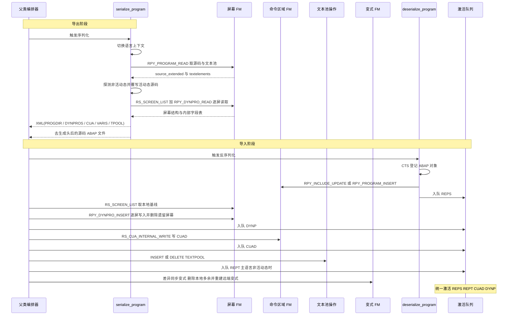

# ZCL_ABAPGIT_OBJECTS_PROGRAM 分析报告

> 分析对象：`zcl_abapgit_objects_program`（CLAS 类，继承自 `zcl_abapgit_objects_super`）
> 来源：abapGit / abapGit —— 把 SAP ABAP 对象纳入 Git 版本控制的工具
> 源码规模：约 1597 行，29 个方法（2 public / 14 protected / 13 private）

---

## 一、程序定位与业务背景

### 1.1 解决什么问题

abapGit 的核心承诺是"让 ABAP 对象能像 Java 源码一样进 Git"。这意味着每一个 SAP 对象都必须是**可导出、可导入、可往返自洽**的——导出成一组纯文本文件，再在另一个系统里导入，得到语义等价的对象副本。

问题在于：ABAP 对象里最复杂的一类是**报表程序**（TADIR 对象类型 `REPS`）。一个"程序"在 SAP 底层根本不是单一实体，而是**八种以上互相嵌套的子对象**散落在十多张底表里：

| 子对象 | 底表 | 内容 |
|---|---|---|
| 程序目录 | `PROGD` / `REPOSRC` | 类型、作者、包、版本控制标记 |
| 源码 | `REPOSRC` / `REPOSRCV` | 活动态 + 非活动态各一份 |
| 文本池 | `TEXTPOOL` | 标题与多语言描述 |
| 屏幕结构 | `D020S` / `D021S` | 屏幕头、字段定义 |
| 屏幕文本 | `D021T` | 屏幕字段的多语言标签 |
| 屏幕流逻辑 | （嵌入 D020S 或独立） | 一段可独立保存的 ABAP 代码 |
| 命令区域 | `RS_CUA_*` 12 张表 | 状态、菜单、功能码、按钮、消息…… |
| 选择变式 | `VARID` / `VARIT` / `RSARIANT_*` | 系统独立变式（客户端 000） |

任何一个环节漏掉，导入后对象就"少了半边身子"；任何一个环节多写，Git 上就会冒出无意义的假差异。这个类就是**把这一整族子对象收口到统一管线**的地方。

### 1.2 设计范式定性

> **"差异消除型双向对称适配器"**：导出侧清洗存储层的噪音、导入侧修复写入层的缺陷，用版本探测式重试兼容跨 release 的 FM 形参差异，用激活入队把多张底表的分散写入收敛成一次原子提交点。

三个关键手法：

1. **双向对称的清洗/修复对**。导出时把"存储层有值但语义层无意义"的字段清空（`OUTPUTSTYLE` 空格、`dgen`/`tgen` 生成时间、`from_dict` 派生文本）；导入时把"语义上为空但 SAP 要求显式取值"的字段填上正确标记（`'/'` force-off、`'X'` modific）。一个空串在导出侧是"干净"，在导入侧必须变成 `'/'` 才是"干净"——这种双向不透明的语义映射是这个类最精妙的设计点。
2. **版本探测式重试**。`uccheck`、`suppress_message` 等形参只在较新 release 存在，代码不维护版本清单，而是"先试完整版、`cx_sy_dyn_call_param_not_found` 捕获后降级重试"。代价是一次失败的动态调用，收益是不用跟踪 release 矩阵。
3. **激活入队而非就地激活**。所有写入都设为非活动态（退出包含除外），屏幕/命令区域/文本池/变式分别入队 `DYNP`/`CUAD`/`REPT`，最后由父类统一激活。这把"不可回滚的多步写入"的爆炸半径压到最后一次激活上。

### 1.3 依赖地形

```
父类   zcl_abapgit_objects_super
        提供 ms_item / mv_language / mo_files / mo_i18n_params /
        exists_a_lock_entry_for / clear_abap_language_version 等共享成员
工厂   zcl_abapgit_factory
        get_sap_report / get_cts_api / get_language
激活   zcl_abapgit_objects_activation=>add
        把 REPS / REPT / CUAD / DYNP 对象加入待激活队列
异常   zcx_abapgit_exception=>raise_t100 / raise
        统一异常出口；raise_t100 依赖 sy-t100key 已设
XML    zcl_abapgit_xml_output / zcl_abapgit_xml_input
        对象元数据的序列化工具
语言   zcl_abapgit_language=>set_current_language / restore_login_language
        切换语言上下文，任何退出路径都必须还原
```

### 1.4 一个前置理解

这个类**只负责"REPS 对象内部"的序列化逻辑**。父类定义了对象处理器的调用模板（`serialize_*` / `deserialize_*` 的契约），导入的完整流程是父类先调 `deserialize_program`（源码 + PROGDIR），再分别调 `deserialize_textpool`、`deserialize_dynpros`、`deserialize_cua`、`deserialize_varis`。类内部看不到这个顺序——阅读时容易误以为"导入就 `deserialize_program` 一步"。

---

## 二、程序执行流程总览

```mermaid
flowchart TD
    subgraph EXP["导出路径"]
        A["serialize_program 导出总编排"]
        A --> A1["RPY_PROGRAM_READ 取源码与文本池"]
        A --> A2["read_progdir 探测活动与非活动态"]
        A --> A3["serialize_dynpros 屏幕与流逻辑"]
        A --> A4["serialize_cua 命令区域"]
        A --> A5["serialize_varis 选择变式"]
        A --> A6["add_tpool 文本池编码"]
        A --> A7["strip_generation_comments 去生成头"]
        A5 --> A5a["get_varis_for_report"]
        A5 --> A5b["get_vari_data"]
        A5 --> A5c["get_vari_screens"]
    end

    subgraph IMP["导入路径"]
        B["deserialize_program 导入总编排"]
        B --> B1["is_exit_include 退出包含分流"]
        B --> B2["get_program_title 取标题修工作区"]
        B --> B3["insert_program 新建"]
        B --> B4["update_program 覆盖"]
        B --> B5["update_progdir 更新目录"]
        C["deserialize_textpool 文本池"]
        D["deserialize_cua 命令区域"]
        D --> D1["auto_correct_cua_adm ADM 兜底重建"]
        E["deserialize_dynpros 屏幕"]
        E --> E1["uncondend_flow 还原流逻辑缩进"]
        F["deserialize_varis 变式差异同步"]
        F --> F1["create_vari / delete_vari"]
        F --> F2["set_vari_protection"]
    end

    subgraph LCK["导入前锁预检"]
        G["is_any_dynpro_locked"]
        H["is_cua_locked"]
        I["is_text_locked"]
    end

    A7 --> J["io_files 落盘 XML 与 ABAP"]
    B --> K["activation 入队 REPS"]
```



### 责任链表

| 子程序 | 调用者 | 职责 |
|---|---|---|
| `serialize_program` | 父类序列化管线 | 导出总编排：取数、分发子对象、装配 XML、落盘 |
| `serialize_dynpros` | `serialize_program`（仅 SUBC 为 1 或 M） | 读全量屏幕，清洗后写 XML，流逻辑外置为独立 ABAP 文件 |
| `serialize_cua` | `serialize_program`（同上） | `RS_CUA_INTERNAL_FETCH` 读命令区域 12 张表 |
| `serialize_varis` | `serialize_program`（同上） | 汇总系统独立变式为一个 `ty_vari_tt` |
| `get_varis_for_report` | `serialize_varis`、`deserialize_varis` | 列出该程序的 `SAP&*` / `CUS&*` 系统独立变式 |
| `get_vari_data` | `serialize_varis` | 读单个变式的技术数据、值、对象、文本 |
| `get_vari_screens` | `serialize_varis` | 读单个变式绑定的屏幕号 |
| `add_tpool` | `serialize_program` | 文本池编码：S 类条目把 ENTRY 拆成 SPLIT 加 ENTRY |
| `read_tpool` | 父类反序列化管线 | `add_tpool` 的逆操作：SPLIT 加 ENTRY 拼回 ENTRY |
| `strip_generation_comments` | `serialize_program` | 删除 FUGR 自动生成头里的日期与版本行 |
| `deserialize_program` | 父类反序列化管线 | 导入总编排：分流退出包含、登记 CTS、写源码与 PROGDIR |
| `deserialize_exit_include` | `deserialize_program` | 退出包含专用写入（只允许活动态） |
| `get_program_title` | `deserialize_program`、`deserialize_exit_include` | 从 TPOOL 取标题，并清空 `SAPLSIFP` 的 `TTAB` 修长度继承 bug |
| `insert_program` | `deserialize_program`、`deserialize_exit_include` | 新建程序（低版本参数降级、name_not_allowed 双写回退） |
| `update_program` | `deserialize_program`、`deserialize_exit_include` | 覆盖已有程序，特化 EU510 / EU522 错误语义 |
| `deserialize_textpool` | 父类反序列化管线 | 文本池写入与删除，主语言走非活动态待激活 |
| `deserialize_cua` | 父类反序列化管线 | 组装 TRKEY、ADM 兜底、写回 CUAD、入队激活 |
| `auto_correct_cua_adm` | `deserialize_cua` | 旧 XML 无 ADM 时从 ACT/MEN/PFK 反查回填 |
| `deserialize_dynpros` | 父类反序列化管线 | 屏幕写入、遗留屏幕删除、字段属性修复、原生屏分流 |
| `uncondense_flow` | `deserialize_dynpros` | 按 spaces 表还原流逻辑原始缩进 |
| `deserialize_varis` | 父类反序列化管线 | 变式差异同步：重建远端存在的、删除本地多余的 |
| `create_vari` | `deserialize_varis` | 变式创建（两步：创建加修改补对象清单） |
| `delete_vari` | `deserialize_varis` | 变式删除（含低版本参数降级重试） |
| `set_vari_protection` | `deserialize_varis` | 以 `SELECT FOR UPDATE` 暂解或恢复变式保护 |
| `is_any_dynpro_locked` | 父类导入前检查 | 逐个屏幕查 ESCR1 锁 |
| `is_cua_locked` | 父类导入前检查 | 查 ESCUAPAINT 锁 |
| `is_text_locked` | 父类导入前检查 | 查 EABAPTEXTE 锁 |
| `is_exit_include` | `deserialize_program`、`update_program` | 按命名模式判断是否为退出包含 |

下面按这条流程，逐个子程序展开。

---

## 三、分组分析（按程序流程与子程序）

### 3.1 类骨架：类型与常量声明

```abap
CLASS zcl_abapgit_objects_program DEFINITION
  PUBLIC
  INHERITING FROM zcl_abapgit_objects_super
  CREATE PUBLIC .
```

**做什么** — 声明一个继承自 `zcl_abapgit_objects_super` 的公开类，作为 `REPS` 对象的处理器；PUBLIC / PROTECTED / PRIVATE 三段把"面向父类的接口"和"实现细节"物理隔开。

**为什么** — 父类定义了一套对象处理器的模板（`serialize_*` / `deserialize_*` 的调用契约、`ms_item` / `mv_language` / `mo_files` / `mo_i18n_params` 等共享成员），子类只需填空。这样 TADIR 里的每种对象类型（类、函数组、程序、表……）都能挂到同一条导入导出管线上，新增对象类型时不碰管线代码。

**风险与改进** — 本类的"导入顺序"完全由父类约定，类内部看不到全貌。`deserialize_program` 里只写了源码和 PROGDIR，屏幕、命令区域、文本池、变式都在别处被父类调用，读源码的人容易误以为"导入就这几步"。建议在类注释中显式写出父类约定的调用顺序。

```abap
TYPES:
  BEGIN OF ty_cua,
    adm TYPE rsmpe_adm,
    sta TYPE STANDARD TABLE OF rsmpe_stat WITH DEFAULT KEY,
    fun TYPE STANDARD TABLE OF rsmpe_funt WITH DEFAULT KEY,
    men TYPE STANDARD TABLE OF rsmpe_men WITH DEFAULT KEY,
    mtx TYPE STANDARD TABLE OF rsmpe_mnlt WITH DEFAULT KEY,
    act TYPE STANDARD TABLE OF rsmpe_act WITH DEFAULT KEY,
    but TYPE STANDARD TABLE OF rsmpe_but WITH DEFAULT KEY,
    pfk TYPE STANDARD TABLE OF rsmpe_pfk WITH DEFAULT KEY,
    set TYPE STANDARD TABLE OF rsmpe_staf WITH DEFAULT KEY,
    doc TYPE STANDARD TABLE OF rsmpe_atrt WITH DEFAULT KEY,
    tit TYPE STANDARD TABLE OF rsmpe_titt WITH DEFAULT KEY,
    biv TYPE STANDARD TABLE OF rsmpe_buts WITH DEFAULT KEY,
  END OF ty_cua.
```

**做什么** — 把 CUAD 子对象的 ADM 主表加 11 张明细表打成一个可序列化的结构体，让序列化器能直接 `XML->add` 整个命令区域。

**为什么** — CUA 是"1 主表加 11 明细表"的家族结构，用 FM 一把取比自己 12 次 SELECT 更可靠（FM 会处理语言合并、多版本回退）。打成结构体后，导出与导入只需操作一个变量。

**风险与改进** — 11 张明细表的结构类型各不相同（`rsmpe_stat` / `rsmpe_funt` / `rsmpe_men`……），没有任何统一接口。`deserialize_cua` 里的"全空短路"必须逐一检查 11 个 `lines()`，新增一张明细表就要改一处——这是**隐式耦合**。建议把短路判断提成一个辅助方法（如 `is_all_detail_tables_initial`），让"新增明细表"只改类型声明。

```abap
TYPES:
  BEGIN OF ty_dynpro,
    header     TYPE rpy_dyhead,
    containers TYPE dycatt_tab,
    fields     TYPE dyfatc_tab,
    flow_logic TYPE swydyflow,
    spaces     TYPE ty_spaces_tt,
    nat_header TYPE d020s,
    nat_fields TYPE STANDARD TABLE OF d021s WITH DEFAULT KEY,
    nat_texts  TYPE STANDARD TABLE OF d021t WITH DEFAULT KEY,
  END OF ty_dynpro .
```

**做什么** — 把屏幕的**两种存储形态**（常规的 `header/containers/fields` 与原生屏的 `nat_header/nat_fields/nat_texts`）放进同一行结构体。

**为什么** — 原生屏（尤其含 splitter 的屏幕）如果按常规格式导出，导入时会丢失 splitter 布局，变成普通容器屏。把两种形态塞进一个结构体，序列化器就能用同一个表承载所有屏幕。

**风险与改进** — 两种互斥形态塞进同一结构体，靠 `type CA c_native_dynpro` 运行时判断走哪一支，类型系统给不了保护。导入侧写错字段组合不会在编译期暴露。可以拆成两个结构加运行时选择，或用 `CASE` 提前定型。

```abap
CONSTANTS:
  BEGIN OF c_state,
    active   TYPE r3state VALUE 'A',
    inactive TYPE r3state VALUE 'I',
    off      TYPE r3state VALUE '',
  END OF c_state.

CONSTANTS c_native_dynpro TYPE c LENGTH 2 VALUE 'IN'.

CONSTANTS c_sysvari_clnt        TYPE mandt      VALUE '000'.
CONSTANTS c_sysvari_pattern_sap TYPE c LENGTH 5 VALUE 'SAP&*'.
CONSTANTS c_sysvari_pattern_cus TYPE c LENGTH 5 VALUE 'CUS&*'.
```

**做什么** — 用结构化常量命名活动态 / 非活动态 / 空态三个取值；用 `c_native_dynpro` 固定原生屏的 `type` 前缀；用 `c_sysvari_clnt` 与两个模式串固定"系统独立变式"的判定口径。

**为什么** — `c_state` 用结构化常量而非散落的字面量 `'A'` / `'I'`，避免 `ACTIVE` 与 `'A'` 混用。`c_sysvari_pattern_sap` / `cus` 把"哪些变式算系统独立"提成常量，导出与导入共用同一口径，不会出现"导出时按一套、导入时按另一套"的错位。

**风险与改进** — `c_state-off` 用空字符串表达"直接保存活动态"，这个语义依赖 FM 对空值的隐含解释，注释里只说"必须活动态"没说空值在此 FM 中等价于什么。`c_native_dynpro` 是 2 字符 `'IN'`，但 `header-type` 的合法值远不止这个，用 `CA` 做子串匹配意味着 `IN` 出现在字符串任何位置都算原生屏——建议提成更精确的匹配。

### 3.2 方法 `serialize_program`（导出总编排）

这是整个类的导出入口，分六步。

#### ① 解析对象名并切换语言上下文

```abap
IF iv_program IS INITIAL.
  lv_program_name = is_item-obj_name.
ELSE.
  lv_program_name = iv_program.
ENDIF.

zcl_abapgit_language=>set_current_language( mv_language ).
```

**做什么** — 优先取调用方显式传入的 `iv_program`，否则回退到 `is_item-obj_name`；随后把当前语言上下文切换成用户配置的 `mv_language`。

**为什么** — 一个对象处理器实例可能被复用来导多个对象（`iv_program` 参数就是为此），必须容忍"未指定即自取"。语言上下文必须先切，因为下一步 `RPY_PROGRAM_READ` 会按 `sy-langu` 去读文本池，不切就读到登录语言的描述。

**风险与改进** — `iv_program` 与 `is_item-obj_name` 同时给出但不一致时静默采信前者，不告警。若上游参数错配（比如批量导出时循环变量串了），对象会被以错误名字取数，直到 FM 返回 not_found 才暴露。建议加一行 `ASSERT is_item-obj_name IS INITIAL OR is_item-obj_name = iv_program.` 做防御。

#### ② 读取源码与文本池

```abap
CALL FUNCTION 'RPY_PROGRAM_READ'
  EXPORTING
    program_name     = lv_program_name
    with_includelist = abap_false
    with_lowercase   = abap_true
  TABLES
    source_extended  = lt_source
    textelements     = lt_tpool
  EXCEPTIONS
    cancelled        = 1
    not_found        = 2
    permission_error = 3
    OTHERS           = 4.

IF sy-subrc = 2.
  zcl_abapgit_language=>restore_login_language( ).
  RETURN.
ELSEIF sy-subrc <> 0.
  zcl_abapgit_language=>restore_login_language( ).
  zcx_abapgit_exception=>raise_t100( ).
ENDIF.

zcl_abapgit_language=>restore_login_language( ).
```

**做什么** — 一次 FM 调用同时取回源码（`source_extended`，255 宽度）和文本池（`textelements`）；not_found 时静默返回（不报错），其余错误码抛异常。`with_lowercase = abap_true` 保留小写源码形式。三条退出路径都保证语言上下文被还原。

**为什么** — "对象不存在"不是错误而是正常状态（删除后的对象、被过滤掉的对象），所以必须返回而非抛异常；但语言上下文切换是有副作用的操作，任何退出路径都必须 `restore_login_language`，否则会污染同会话后续的对象导出。用 `with_lowercase` 是因为 ABAP 允许源码含小写（如字符串字面量），丢掉大小写会改动对象。

**风险与改进** — 三条分支里 `restore_login_language` 被写了三次，靠人肉重复而非 `CLEANUP` 保证。这里没有异常抛出点，所以暂时安全，但一旦中间加一段会抛异常的代码（比如后面就真的有），漏写就必然泄漏语言上下文。建议改成 `TRY. ... ENDTRY. CLEANUP. zcl_abapgit_language=>restore_login_language( ). ENDTRY.` 的形态。

#### ③ 区分活动态与非活动态版本

```abap
li_report = zcl_abapgit_factory=>get_sap_report( ).

TRY.
    " Raises exception if inactive version does not exist
    ls_progdir = li_report->read_progdir(
      iv_name  = lv_program_name
      iv_state = c_state-inactive ).

    " Explicitly request active source code
    lt_source = li_report->read_report(
      iv_name  = lv_program_name
      iv_state = c_state-active ).
  CATCH zcx_abapgit_exception ##NO_HANDLER.
ENDTRY.

ls_progdir = li_report->read_progdir(
  iv_name  = lv_program_name
  iv_state = c_state-active ).
```

**做什么** — 先尝试读非活动态 PROGDIR；若成功（说明存在未激活的版本），再显式用活动态读回源码，覆盖掉步骤 ② 里读到的（可能是非活动的）源码；若失败（无非活动版本），沿用步骤 ② 的结果。最后无条件再读一次活动态 PROGDIR 作为最终输出。

**为什么** — `RPY_PROGRAM_READ` 在对象存在非活动版本时，返回的源码不是活动版本，导致导出的源码与对象实际运行代码不一致（Git 上看到的是没激活的草稿）。这里用一次探测加一次显式覆写来纠正。最终 PROGDIR 固定取活动态，因为元数据以已生效版本为准。

**风险与改进** — `##NO_HANDLER` 的空捕获是这段代码最脆弱的地方：它假设"抛异常等价于非活动版本不存在"，但 `read_progdir` 也可能因表被锁、TADIR 缺失、包不存在而抛同类异常。这些真实错误会被一并吞掉，然后走到活动态读取拿到一份与源码不同步的元数据，导出的 XML 与 ABAP 文件就悄悄错配了。建议捕获后检查异常原因或子码，只对"对象不存在"这一类放行。

#### ④ 清空 ABAP 语言版本并装配 XML

```abap
clear_abap_language_version( CHANGING cv_abap_language_version = ls_progdir-uccheck ).

IF io_xml IS BOUND.
  li_xml = io_xml.
ELSE.
  CREATE OBJECT li_xml TYPE zcl_abapgit_xml_output.
ENDIF.

li_xml->add( iv_name = 'PROGDIR'
             ig_data = ls_progdir ).

IF ls_progdir-subc = '1' OR ls_progdir-subc = 'M'.
  lt_dynpros = serialize_dynpros( lv_program_name ).
  li_xml->add( iv_name = 'DYNPROS'
               ig_data = lt_dynpros ).

  ls_cua = serialize_cua( lv_program_name ).
  li_xml->add( iv_name = 'CUA'
               ig_data = ls_cua ).

  lt_varis = serialize_varis( lv_program_name ).
  li_xml->add( iv_name = 'VARIS'
               ig_data = lt_varis ).
ENDIF.
```

**做什么** — 清掉 PROGDIR 里的 ABAP 语言版本标记（`UCCHECK`），避免升级 ABAP 版本后同一份源码被 Git 判为"有变化"；`io_xml` 可选注入，未注入则自建；先写 PROGDIR，再按程序类型 SUBC 判断是否附带 DYNPROS / CUA / VARIS。

**为什么** — `1`（报表）和 `M`（模块池）才可能有屏幕与命令区域；`5`（函数组）等其他类型导出这些子对象是浪费甚至报错。语言版本清理是纯差异消除：版本升级会改写 `UCCHECK`，但源码一行未变，不处理会让全库产生噪音 diff。`io_xml` 可注入支持"多个对象共享一个 XML 文件"的场景（父类做嵌套对象导出时会传进来）。

**风险与改进** — SUBC 判断用字面量 `'1'` / `'M'` 而非具名常量，SUBC 合法值远不止这两个，新增类型时这里是个隐形分支点。建议提成常量并加注释说明"未覆盖的 SUBC 值不导出屏幕、命令区域、变式"。

#### ⑤ 文本池清洗与编码

```abap
READ TABLE lt_tpool WITH KEY id = 'R' INTO ls_tpool.
IF sy-subrc = 0 AND ls_tpool-key = '' AND ls_tpool-length = 0.
  DELETE lt_tpool INDEX sy-tabix.
ENDIF.

li_xml->add( iv_name = 'TPOOL'
             ig_data = add_tpool( lt_tpool ) ).
```

**做什么** — 若标题类条目（`id='R'`）的 `key` 与 `length` 都是空（即这是一条无内容的空壳标题行），删掉它；再把清洗后的文本池经 `add_tpool` 编码后写入 XML。

**为什么** — 无标题的程序在 TEXTPOOL 里仍会留一条空 `R` 条目，把它当有效内容导出去，导入侧就会重建一条不存在的空条目，形成"空对空"的假差异。删除属于把存储层的"保底占位行"还原成语义层的"没有标题"。

**风险与改进** — 判定条件是 `key = '' AND length = 0`，但若某程序有标题而 `length` 恰好被工作区 bug 清成 0（见 3.9 的 `SAPLSIFP` 问题），这里会误删有效标题。两处 workaround 之间没有交叉校验，属于潜在的正确性盲区。建议在删除前再比对 `ls_tpool-entry` 是否也空。

#### ⑥ 去生成注释并落盘

```abap
strip_generation_comments( CHANGING ct_source = lt_source ).

IF NOT io_xml IS BOUND.
  io_files->add_xml( iv_extra = iv_extra
                     ii_xml   = li_xml ).
ENDIF.

io_files->add_abap( iv_extra = iv_extra
                    it_abap  = lt_source ).
```

**做什么** — 先剥离源码里的生成器时间戳行（仅函数组），再把 XML 交给 `io_files` 落盘（若 XML 是注入的则不落 XML，只返回给调用方），最后落 ABAP 源码。

**为什么** — 生成头里的日期与版本每次重新生成都会变，不剥离则"重新生成一次"就会在 Git 上产生 diff。XML 是否落盘由注入与否决定，是为了让父类能对嵌套对象做"合并到一个文件"的控制。

**风险与改进** — `add_xml` 被包在 `IF NOT io_xml IS BOUND` 里，但 `strip_generation_comments` 与 `add_abap` 无条件执行。也就是说当 XML 被注入时源码仍会落盘而 XML 不会，两个产物的可见性不对称——依赖调用方清楚这一约定，否则容易误以为"注入 XML 就不产出任何文件"。建议把条件对称化或加注释。

---

### 3.3 方法 `serialize_dynpros`（屏幕序列化，导出侧最复杂的一段）

分五步。

#### ① 列举屏幕并过滤生成屏

```abap
CALL FUNCTION 'RS_SCREEN_LIST'
  EXPORTING
    dynnr     = ''
    progname  = iv_program_name
  TABLES
    dynpros   = lt_d020s
  EXCEPTIONS
    not_found = 1
    OTHERS    = 2.
IF sy-subrc = 2.
  zcx_abapgit_exception=>raise_t100( ).
ENDIF.

SORT lt_d020s BY dnum ASCENDING.

LOOP AT lt_d020s ASSIGNING <ls_d020s>
    WHERE type <> 'S' AND type <> 'W' AND type <> 'J'
    AND NOT dnum IS INITIAL.
```

**做什么** — 列出程序下的全部屏幕并按屏幕号升序排序；循环时跳过三种系统生成屏（`S` 选择屏、`W` 状态屏、`J` 菜单屏）以及无屏幕号的条目。

**为什么** — 选择屏 / 状态屏 / 菜单屏是系统按选择参数、状态、菜单结构自动派生的，它们的结构由程序源码和 CUA 决定，导出它们既无用又会引入每次重新生成都变化的噪音。排序是保证导出结果可重现的前提（否则同一份对象的 XML 顺序不稳定，Git 上永远有 diff）。

**风险与改进** — 无。这是标准的"导出白名单加稳定排序"写法。

#### ② 读取屏幕结构与原生格式

```abap
CALL FUNCTION 'RPY_DYNPRO_READ'
  EXPORTING
    progname = iv_program_name
    dynnr    = <ls_d020s>-dnum
  IMPORTING
    header   = ls_header
  TABLES
    containers           = lt_containers
    fields_to_containers = lt_fields_to_containers
    flow_logic           = lt_flow_logic
  EXCEPTIONS
    cancelled        = 1
    not_found        = 2
    permission_error = 3
    OTHERS           = 4.
IF sy-subrc <> 0.
  zcx_abapgit_exception=>raise_t100( ).
ENDIF.

FREE lt_fieldlist_int.

CALL FUNCTION 'RPY_DYNPRO_READ_NATIVE'
  EXPORTING
    progname = iv_program_name
    dynnr    = <ls_d020s>-dnum
  TABLES
    fieldlist  = lt_fieldlist_int
    fieldtexts = lt_texts.
```

**做什么** — 每个屏幕调两次 FM：一次取外部展示格式（容器、字段到容器的绑定、流逻辑），一次取内部底层格式（`d021s` 字段表与文本）。每次循环前 `FREE lt_fieldlist_int` 避免上一屏的字段残留。

**为什么** — 两次调用是必要的：外部格式决定"怎么导出成 XML"，内部格式（带 `flg1` / `flg3` 位掩码）决定"哪些字段真的需要 foreign key"。SAP 自己给外部格式里的 `FOREIGNKEY` 字段填的值并不总是准确的，必须用内部标志位重算。`FREE` 是防串屏的关键——FM 不保证清空传入的内表。

**风险与改进** — `RPY_DYNPRO_READ` 检查了返回码，但 `RPY_DYNPRO_READ_NATIVE` 没有检查 `sy-subrc`。若原生读取失败（权限、屏不存在），后续用一份空的 `lt_fieldlist_int` 去做 foreignkey 重算与原生屏判定，结果可能静默写错。建议补上返回码判断。

#### ③ 规范化字段属性（消除假差异的核心）

```abap
CONSTANTS: lc_flg1ddf TYPE x VALUE '20',
           lc_flg3fku TYPE x VALUE '08',
           lc_flg3for TYPE x VALUE '04',
           lc_flg3fdu TYPE x VALUE '02'.

LOOP AT lt_fields_to_containers ASSIGNING <ls_field>.
  ASSIGN COMPONENT 'OUTPUTSTYLE' OF STRUCTURE <ls_field> TO <lv_outputstyle>.
  IF sy-subrc = 0 AND <lv_outputstyle> = '  '.
    CLEAR <lv_outputstyle>.
  ENDIF.

  UNASSIGN <ls_field_int>.
  READ TABLE lt_fieldlist_int ASSIGNING <ls_field_int> WITH KEY fnam = <ls_field>-name.
  IF <ls_field_int> IS ASSIGNED.
    IF <ls_field_int>-flg1 O lc_flg1ddf AND
        <ls_field_int>-flg3 O lc_flg3for AND
        <ls_field_int>-flg3 Z lc_flg3fdu AND
        <ls_field_int>-flg3 Z lc_flg3fku.
      <ls_field>-foreignkey = 'X'.
    ELSE.
      CLEAR <ls_field>-foreignkey.
    ENDIF.
  ENDIF.

  IF <ls_field>-from_dict = abap_true AND
     <ls_field>-modific   <> 'F' AND
     <ls_field>-modific   <> 'X'.
    CLEAR <ls_field>-text.
  ENDIF.
ENDLOOP
```

**做什么** — 对每个屏幕字段做三件清洗：
- `OUTPUTSTYLE`（NUMC 字段）若为 `'  '` 全空格，清空成 INITIAL，否则 XML 转换会因为 NUMC 非法值失败；
- 用内部 `d021s` 的位标志位重算 `FOREIGNKEY`：仅当 `flg1` 含 DDF 标志、且 `flg3` 含 FOR、不含 FDU、不含 FKU 时才置 `'X'`；
- 若字段是 `from_dict`（文本来自 DDIC）且修改标志既不是 `F`（固定文本）也不是 `X`（总是从字典取），清空自定义 `text`。

**为什么** — 这三条全是"存储层有值、语义层无意义"的典型：NUMC 空值以空格存储，XML 编码会炸；`FOREIGNKEY` 在屏幕被反复打开保存后可能被 FM 写成脏值，而真正的判定依据在内部标志位里；`from_dict` 字段的文本本来就是字典派生的，存一份副本只会因为字典翻译更新而产生无意义 diff。这是差异消除策略在字段级的具体落地。

**风险与改进** — `flg1` / `flg3` 的位掩码常量取自 include `MSEUSBIT`（注释里写明 `#2746`），但位含义没有被任何类型系统保护：`'20'` / `'08'` / `'04'` / `'02'` 是十六进制字面量，未来 SAP 调整标志位定义时这里会静默失效。建议以命名常量注释出位含义（如"位 5 = DDF 派生"），或改为调用 SAP 提供的判定 API。另外 `ASSIGN COMPONENT 'OUTPUTSTYLE'` 用字符串定位字段，字段不存在时靠 `sy-subrc` 兜住——这是为了兼容不同 release（该字段并非所有版本都有），属合理的版本容错，但字符串定位本身就易错。

#### ④ 规范化容器最小尺寸并外置流逻辑

```abap
LOOP AT lt_containers ASSIGNING <ls_container>.
  IF <ls_container>-c_resize_v = abap_false.
    CLEAR <ls_container>-c_line_min.
  ENDIF.
  IF <ls_container>-c_resize_h = abap_false.
    CLEAR <ls_container>-c_coln_min.
  ENDIF.
ENDLOOP.

APPEND INITIAL LINE TO rt_dynpro ASSIGNING <ls_dynpro>.
<ls_dynpro>-header = ls_header.

mo_files->add_abap(
  iv_extra = 'screen_' && ls_header-screen
  it_abap  = lt_flow_logic ).
```

**做什么** — 不可纵向或横向缩放的容器，其最小行数或列数在存储层可能残留旧值，语义上无效，清空。然后把屏幕流逻辑作为独立 ABAP 文件（文件后缀标识 `screen_0001` 之类）落盘，而不是塞进 XML。

**为什么** — 流逻辑是纯 ABAP 文本，放 XML 里要么转义麻烦、要么编码成不可读的二进制形态；外置成 `screen_XXXX.abap` 之后，用户可以用 Git diff 直接看到"哪个屏幕的哪一行流逻辑变了"，且能与主源码一起走 lint。这是把数据形态匹配内容的真实性质的设计选择。

**风险与改进** — 文件名用 `'screen_' && ls_header-screen` 拼接，`screen` 是 4 位屏幕号。导入侧对应靠 `mo_files->read_abap( iv_extra = 'screen_' && ... )` 取回（见 3.13），两侧约定必须严格一致，目前靠两条字面量字符串对齐，没有共享常量。建议提成常量。

#### ⑤ 原生屏分流存储

```abap
READ TABLE lt_fieldlist_int TRANSPORTING NO FIELDS WITH KEY fill = 'X'.
IF ls_header-type CA c_native_dynpro AND sy-subrc = 0.
  <ls_dynpro>-nat_header = <ls_d020s>.
  CLEAR: <ls_dynpro>-nat_header-dgen, <ls_dynpro>-nat_header-tgen.
  <ls_dynpro>-nat_fields = lt_fieldlist_int.
  <ls_dynpro>-nat_texts  = lt_texts.
ELSE.
  <ls_dynpro>-containers = lt_containers.
  <ls_dynpro>-fields     = lt_fields_to_containers.
ENDIF.
```

**做什么** — 判断这个屏幕是否为原生屏（`header-type` 含 `'IN'`，且内部字段表里有 `FILL = 'X'` 的字段，典型如带 splitter 的屏幕）。是则走原生分支：存 `nat_header`（拷贝自 `d020s`）、`nat_fields`、`nat_texts`；否则存常规的容器与字段。`nat_header` 的 `dgen` / `tgen`（生成日期与时间）被显式清空。

**为什么** — 原生屏（尤其含 splitter 的屏幕）如果按常规格式导出，导入时会丢失 splitter 布局，变成普通容器屏。所以必须保留原始 `d020s` 头与 `d021s` 字段表。清 `dgen` / `tgen` 又是差异消除：生成时间是每次写屏都会变的噪音。

**风险与改进** — 判定条件是"两者都满足"（`type CA 'IN'` 且有 `FILL='X'`），这个"且"意味着一个 `type='IN'` 但字段表里没有 `FILL` 的屏幕会被当作常规屏导出，导入时走 `RPY_DYNPRO_INSERT` 而非 `RPY_DYNPRO_INSERT_NATIVE`，可能生成错形态的对象。这条判定来自经验归纳（注释只说"In particular for dynpros with splitter"），没有对照 SAP 文档做穷举验证。建议补一个"原生屏被降级导出"的检测告警。

### 3.4 方法 `serialize_cua`（命令区域序列化）

```abap
CALL FUNCTION 'RS_CUA_INTERNAL_FETCH'
  EXPORTING
    program  = iv_program_name
    language = mv_language
    state    = c_state-active
  IMPORTING
    adm = rs_cua-adm
  TABLES
    sta = rs_cua-sta
    fun = rs_cua-fun
    men = rs_cua-men
    mtx = rs_cua-mtx
    act = rs_cua-act
    but = rs_cua-but
    pfk = rs_cua-pfk
    set = rs_cua-set
    doc = rs_cua-doc
    tit = rs_cua-tit
    biv = rs_cua-biv
  EXCEPTIONS
    not_found       = 1
    unknown_version = 2
    OTHERS          = 3.
IF sy-subrc > 1.
  zcx_abapgit_exception=>raise_t100( ).
ENDIF.
```

**做什么** — 一次 FM 调用把 CUAD 子对象的 ADM 主表加 11 张明细表全部取回，装入 `ty_cua` 返回。语言用 `mv_language` 显式指定，状态固定活动态。

**为什么** — CUA 是"1 主表加 11 明细表"的家族结构，用 FM 一把取比自己 12 次 SELECT 更可靠。固定读活动态是因为命令区域不像源码有"草稿"概念需要区分，读活动态保证导出的就是运行时的命令区域。

**风险与改进** — 返回码判定用 `sy-subrc > 1`，即 not_found（1）与 unknown_version（2）都不算错误：前者是"程序没有 CUA"（正常），后者是"版本未知"（FM 内部兼容态，可能带部分数据）。这样宽松是对的，但 unknown_version 意味着拿到的数据可能是不完整的且无任何告警——导入侧（3.12）会因为"所有表都空"而直接 RETURN，等于静默丢失 CUA。建议至少在 unknown_version 时记录一条警告。

### 3.5 方法 `serialize_varis` 与变式读取助手

```abap
lt_varis = get_varis_for_report( iv_program_name ).

LOOP AT lt_varis ASSIGNING <ls_varikey>.
  CLEAR: ls_vari, ls_varid.

  get_vari_data( EXPORTING is_vari    = <ls_varikey>
                 IMPORTING es_varid   = ls_varid
                           et_values  = ls_vari-values
                           et_objects = ls_vari-objects
                           et_texts   = ls_vari-texts ).

  MOVE-CORRESPONDING ls_varid TO ls_vari.

  " Clear texts - they will be provided in TEXTPOOL section
  LOOP AT ls_vari-objects ASSIGNING <ls_object>.
    CLEAR <ls_object>-text.
  ENDLOOP.

  ls_vari-variscreens = get_vari_screens( <ls_varikey> ).

  INSERT ls_vari INTO TABLE rt_varis.
ENDLOOP.
```

**做什么** — 先取变式清单，然后逐个变式：读技术数据、值、对象、文本，用 `MOVE-CORRESPONDING` 把 `varid` 的技术字段（transport / environmnt / protected / xflag1 / xflag2）搬进 `ty_vari`，清空对象里的 `text`，再取该变式绑定的屏幕号，最后插入结果表。

**为什么** — 对象里的 `text` 是变式对象的描述文本，这部分内容由 TEXTPOOL 段落统一承载（避免同一份文本在 XML 里出现两处，产生双写冲突和假差异）。`MOVE-CORRESPONDING` 而非手写逐字段赋值，是为了让 `varid` 未来新增技术字段时自动带过来——但代价是字段语义对齐完全依赖同名匹配。

**风险与改进** — `MOVE-CORRESPONDING ls_varid TO ls_vari` 是这段唯一一处"靠同名自动对齐"的映射，而 `ty_vari` 的字段是手写选出来的（variant / flag1 / flag2 / transport / environmnt / protected / secu / xflag1 / xflag2）。如果 `varid` 结构未来改名或加一个同名不同义的字段，这里会静默错配。建议改为显式赋值并注释"仅搬运技术字段，业务字段单独处理"。

#### `get_varis_for_report`（列出系统独立变式）

```abap
CALL FUNCTION 'RS_ALL_VARIANTS_4_1_REPORT'
  EXPORTING
    program = iv_repid
  IMPORTING
    cat     = ls_catalog
  EXCEPTIONS
    OTHERS  = 1.
IF sy-subrc <> 0.
  zcx_abapgit_exception=>raise_t100( ).
ENDIF.

ls_vari-report = iv_repid.
LOOP AT ls_catalog-cat ASSIGNING <ls_cat>
     WHERE variant CP c_sysvari_pattern_sap
     OR variant CP c_sysvari_pattern_cus.
  ls_vari-variant = <ls_cat>-variant.
  INSERT ls_vari INTO TABLE rt_varis.
ENDLOOP.

SORT rt_varis.
```

**做什么** — 用 SAP 提供的变式目录 FM 取该程序的全部变式，然后用模式串 `SAP&*` 与 `CUS&*` 过滤出系统独立变式（客户端无关、存放在客户端 000 的那一类），最后按变式名排序。

**为什么** — 选择变式有两个世界：个人变式（存用户自己的客户端，属于用户私有配置）和系统独立变式（`SAP&*` / `CUS&*` 前缀，存客户端 000，属于程序资产）。只有后者应该被版本控制。这个过滤口径被提成常量（`c_sysvari_pattern_sap` / `cus`），导出与导入共用，保证两侧一致。

**风险与改进** — 依赖 SAP 用 `SAP&*` / `CUS&*` 作为系统独立变式的命名约定，这是约定而非接口。若某系统自定义了别的系统级变式前缀，这类变式会被静默忽略、不进入版本控制。这个边界应该在文档里明确告知使用者，而不是埋在过滤逻辑里。

#### `get_vari_data`（读单个变式的全部数据）

```abap
CLEAR: es_varid, et_values, et_objects, et_texts.

CALL FUNCTION 'RS_VARIANT_VALUES_TECH_DAT_255'
  EXPORTING
    report  = is_vari-report
    variant = is_vari-variant
    sorted  = abap_true
  IMPORTING
    techn_data     = es_varid
  TABLES
    variant_values = et_values
  EXCEPTIONS
    OTHERS         = 1.
IF sy-subrc <> 0.
  zcx_abapgit_exception=>raise_t100( ).
ENDIF.

CLEAR et_values.
```

**做什么** — 调用技术数据 FM，只取 `techn_data`（变式的 `varid` 头），把 `variant_values` 表格直接清掉。

**为什么** — 注释写得很清楚：这两个 FM 的 `variant_values` 形参都不是可选的，不传就会报"必填参数缺失"。所以只能传一个进去再扔掉，真正的值稍后用 `RS_VARIANT_CONTENTS_255` 取。这是被 FM 设计逼出来的写法。

**风险与改进** — 一次完整的变式内容读取被完全丢弃，属纯浪费；更关键的是这个 FM 会真正读取变式的值数据，在大量变式的程序上这是可测量的开销。目前无解（FM 形参不可选），但可以记录在性能评估中。`CLEAR et_values` 之后立刻被下面的 `RS_VARIANT_CONTENTS_255` 覆写，这个 CLEAR 主要是为了防"FM 未执行时残留上一次循环的旧数据"——在循环场景下这是必要的防御。

```abap
IF mo_i18n_params->ms_params-main_language_only <> abap_true.
  lt_language_filter = mo_i18n_params->build_language_filter( ).
ENDIF.
ls_language_filter-sign   = 'I'.
ls_language_filter-option = 'EQ'.
ls_language_filter-low    = mv_language.
CLEAR ls_language_filter-high.
INSERT ls_language_filter INTO TABLE lt_language_filter.

SELECT langu vtext FROM varit CLIENT SPECIFIED
  INTO CORRESPONDING FIELDS OF TABLE et_texts
  WHERE mandt = c_sysvari_clnt
    AND report = is_vari-report
    AND variant = is_vari-variant
    AND langu IN lt_language_filter
  ORDER BY langu.
```

**做什么** — 组一个语言筛选区间：非"仅主语言"模式下取用户配置的翻译语言集，并总是追加主语言 `mv_language`（区间 sign 为 `I`、option 为 `EQ`、high 清空）。然后直接 SELECT 底表 `VARIT` 按语言集取文本。

**为什么** — 注释点明了动因：`RS_VARIANT_TEXT` 系列 FM 不能列出变式实际存在哪些语言，所以只能自己 SELECT 底表。主语言必须强制包含，否则主语言描述会丢。`CLIENT SPECIFIED` 配合 `mandt = '000'` 是访问系统独立变式文本的正确姿势（默认客户端读不到）。

**风险与改进** — 直接用 SQL 读 `VARIT` 底表绕过了 FM 层，意味着放弃了 FM 提供的语言合并或派生逻辑。当前实现是"有哪些取哪些"，这正好符合 Git 化的诉求（导出什么就存什么，不做派生），是合理的。但要注意 `langu IN lt_language_filter` 里混了 `I` / `EQ` 区间，若 `build_language_filter` 返回空表再插入主语言，最终只查一个语言——这个空表路径没有显式判断，属隐式依赖。

```abap
CALL FUNCTION 'RS_VARIANT_CONTENTS_255'
  EXPORTING
    report         = is_vari-report
    variant        = is_vari-variant
    execute_direct = abap_true
  TABLES
    valutab        = et_values
    objects        = et_objects
  EXCEPTIONS
    OTHERS         = 1.
IF sy-subrc <> 0.
  zcx_abapgit_exception=>raise_t100( ).
ENDIF.

SORT et_values.
SORT et_objects.
SORT et_texts.
```

**做什么** — 用内容 FM 取真正的变式值（`valutab`）与对象清单（`objects`），`execute_direct = abap_true` 表示不触发执行确认。最后对三张结果表做排序。

**为什么** — `execute_direct` 是为避免 FM 弹出确认或执行变式带来的交互与副作用（变式里的选择条件不该在导出时被真正执行）。三处 `SORT` 是导出确定性的最后保证——底表读取顺序不保证稳定，不排序则同一变式每次导出都可能得到不同顺序的 XML，Git diff 会持续噪音。

**风险与改进** — `SORT et_values` 是对 `rsparamsl_255` 行的排序，若该结构没有稳定的全字段键（比如有未填充的客户端或用户字段），排序结果可能仍有残余不确定性。属低风险，但值得用一次双次导出对比来实证。

```abap
DATA lt_dynnr LIKE rt_vari_screens ##NEEDED.

CALL FUNCTION 'RS_GET_SCREENS_4_1_VARIANT'
  EXPORTING
    program     = is_vari-report
    variant     = is_vari-variant
  TABLES
    dynnr       = lt_dynnr
    variscreens = rt_vari_screens
  EXCEPTIONS
    OTHERS      = 1.
IF sy-subrc <> 0.
  zcx_abapgit_exception=>raise_t100( ).
ENDIF.

SORT rt_vari_screens.
```

**做什么** — 用 FM 取变式绑定的屏幕清单；`lt_dynnr` 是一个从未使用的中间表，用 `##NEEDED` 抑制警告；最后排序。

**为什么** — 这个 FM 的 `dynnr` 表格形参同样不是可选的，必须传一个（与前一个 FM 同型，是同一种"被 FM 逼出来的写法"）。排序同样是为可重现性。

**风险与改进** — `##NEEDED` 是对"我传了一个不用的参数"的显式承认，可读性差；如果这里的必填性未来放宽，这行会变成一个永久噪音。建议改成把 `rt_vari_screens` 直接传给 FM，或用一个带注释的空局部变量说明"此处仅为满足签名"。

### 3.6 方法 `add_tpool` 与 `read_tpool`（文本池的编解码对）

```abap
METHOD add_tpool.

  FIELD-SYMBOLS: <ls_tpool_in>  LIKE LINE OF it_tpool,
                 <ls_tpool_out> LIKE LINE OF rt_tpool.


  LOOP AT it_tpool ASSIGNING <ls_tpool_in>.
    APPEND INITIAL LINE TO rt_tpool ASSIGNING <ls_tpool_out>.
    MOVE-CORRESPONDING <ls_tpool_in> TO <ls_tpool_out>.
    IF <ls_tpool_out>-id = 'S'.
      <ls_tpool_out>-split = <ls_tpool_out>-entry.
      <ls_tpool_out>-entry = <ls_tpool_out>-entry+8.
    ENDIF.
  ENDLOOP.

ENDMETHOD.


METHOD read_tpool.

  FIELD-SYMBOLS: <ls_tpool_in>  LIKE LINE OF it_tpool,
                 <ls_tpool_out> LIKE LINE OF rt_tpool.


  LOOP AT it_tpool ASSIGNING <ls_tpool_in>.
    APPEND INITIAL LINE TO rt_tpool ASSIGNING <ls_tpool_out>.
    MOVE-CORRESPONDING <ls_tpool_in> TO <ls_tpool_out>.
    IF <ls_tpool_out>-id = 'S'.
      CONCATENATE <ls_tpool_in>-split <ls_tpool_in>-entry
        INTO <ls_tpool_out>-entry
        RESPECTING BLANKS.
    ENDIF.
  ENDLOOP.

ENDMETHOD.
```

**做什么** — 一对互为逆操作的方法：`add_tpool`（导出）对 `id='S'`（分类型长文本）的条目，把 `ENTRY` 的前 8 个字符搬到 `SPLIT`，`ENTRY` 保留第 8 位之后的部分；`read_tpool`（导入）把 `SPLIT` 与 `ENTRY` 按保留空格的语义拼回 `ENTRY`。

**为什么** — `TEXTPOOL` 的 S 类条目在底表里是"分行长文本"形态，一个逻辑串被切成 `SPLIT` 加 `ENTRY` 两段存放；而 abapGit 自己用于 XML 序列化的文本池类型对这两段的承载方式与底表不同。把 `ENTRY` 的前 8 个字符显式搬到 `SPLIT` 字段，等于借已有的字段承载会被压平的那一段信息，让长描述能完整往返。`CONCATENATE ... RESPECTING BLANKS` 是逆操作的必需——否则前后段的空格边界会在拼接时被吃掉，长文本内容错位。8 这个数字对应 `TEXTPOOL-SPLIT` 的 `CHAR8` 长度。

**风险与改进** — `entry+8` 的偏移量 8 是硬编码魔术数字，与 `SPLIT` 字段的实际长度耦合；一旦底层结构变更（历史上 SAP 确实调整过 TEXTPOOL 的字段布局），这里会静默错切，且导出与导入两侧会同时错，往返自洽地"看起来没问题"，只有与 SAP GUI 里的原文比对才能发现。建议提成常量并注释来源字段（如 `CONSTANTS lc_split_len TYPE i VALUE 8.`），或改用 `SPLIT` 的实际长度取值而非字面量。

### 3.7 方法 `strip_generation_comments`（剥离函数组生成头）

```abap
IF ms_item-obj_type <> 'FUGR'.
  RETURN.
ENDIF.

READ TABLE ct_source INDEX 1 ASSIGNING <lv_line>.
IF sy-subrc = 0 AND <lv_line> CP '#**regenerated at *'.
  DELETE ct_source INDEX 1.
  RETURN.
ENDIF.

IF lines( ct_source ) < 5.
  RETURN.
ENDIF.

READ TABLE ct_source INDEX 1 ASSIGNING <lv_line>.
ASSERT sy-subrc = 0.
IF NOT <lv_line> CP '#*---*'.
  RETURN.
ENDIF.

READ TABLE ct_source INDEX 2 ASSIGNING <lv_line>.
ASSERT sy-subrc = 0.
IF NOT <lv_line> CP '#**'.
  RETURN.
ENDIF.

READ TABLE ct_source INDEX 3 ASSIGNING <lv_line>.
ASSERT sy-subrc = 0.
IF NOT <lv_line> CP '#**generation date:*'.
  RETURN.
ENDIF.

READ TABLE ct_source INDEX 4 ASSIGNING <lv_line>.
ASSERT sy-subrc = 0.
IF NOT <lv_line> CP '#**generator version:*'.
  RETURN.
ENDIF.

READ TABLE ct_source INDEX 5 ASSIGNING <lv_line>.
ASSERT sy-subrc = 0.
IF NOT <lv_line> CP '#*---*'.
  RETURN.
ENDIF.

DELETE ct_source INDEX 4.
DELETE ct_source INDEX 3.
```

**做什么** — 仅对函数组（`FUGR`）生效。情形 1：若第 1 行是 `#**regenerated at *`（MV 函数模块主程序或 TOPS 的重新生成标记），删除第 1 行。情形 2：若第 1 到 5 行完整匹配生成器头的五段结构，删除第 3 行（生成日期）与第 4 行（生成器版本），保留头框架。

**为什么** — 生成头里的日期与版本每次重新生成都变，是全库最大的 diff 噪音源之一。删掉这两行后，"重新生成一次但逻辑未变"就不会在 Git 上留下痕迹。保留头框架（第 1、2、5 行）是因为它们标记了这段源码是系统生成的——去掉框架会让用户误以为这是手写代码而手改，反而危险。删除顺序是 4 然后 3（倒序），避免索引下移导致的错位删除。

**风险与改进** — 这是导出路径上唯一使用 `ASSERT` 的地方。`ASSERT sy-subrc = 0` 在 `READ TABLE INDEX n` 失败时会直接 dump，而这里的前提是 `lines < 5` 已提前 RETURN，所以理论上安全——但"前提被满足"依赖源码长度而非源码内容，遇到长度够但结构被改动的畸形生成头（比如人工编辑过的函数组包含），`ASSERT` 就会把一次导出变成一次系统崩溃。而情形 1 用的是柔和的 `IF ... CP ... RETURN` 路径，两种情形风格不一致。建议情形 2 的守卫也统一为 `IF NOT ( ... ) RETURN.` 形态，与导出的"容错优先"基调一致。

---

### 3.8 方法 `deserialize_program` 与 `deserialize_exit_include`

#### ① 退出包含分流

```abap
IF is_exit_include( is_progdir-name ) = abap_true.
  deserialize_exit_include(
    is_progdir = is_progdir
    it_source  = it_source
    it_tpool   = it_tpool
    iv_package = iv_package ).
  RETURN.
ENDIF.
```

**做什么** — 先用命名模式判断是否为退出包含，是则走专用导入路径并立即返回，不再执行后续任何步骤。

**为什么** — 退出包含受 SAP 保护，`RS_INSERT_INTO_WORKING_AREA` 会校验其状态；普通导入流程里带的 CTS 登记、PROGDIR 更新对退出包含不适用甚至报错。所以必须先分流。

**风险与改进** — 分流的判断完全基于程序命名约定（`is_exit_include` 只是模式匹配，见 3.15），不看 TADIR / PROGDIR 里的实际类型。一个恰好以 `LX` 开头但不是退出包含的自定义程序会被错误地送进"只允许活动态"的写入路径。命名约定作为控制流依据是脆弱的一环。

#### ② 登记 CTS 对象并探测活动态版本

```abap
zcl_abapgit_factory=>get_cts_api( )->insert_transport_object(
  iv_object   = 'ABAP'
  iv_obj_name = is_progdir-name
  iv_package  = iv_package
  iv_language = mv_language ).

lv_title = get_program_title( it_tpool ).

SELECT SINGLE progname FROM reposrc INTO lv_progname
  WHERE progname = is_progdir-name
  AND r3state = c_state-active.

IF sy-subrc = 0.
  update_program(
    is_progdir = is_progdir
    it_source  = it_source
    iv_title   = lv_title ).
ELSE.
  insert_program(
    is_progdir = is_progdir
    it_source  = it_source
    iv_title   = lv_title
    iv_package = iv_package ).
ENDIF.
```

**做什么** — 先把对象登记进 CTS 的传输队列，再从文本池解析出标题，然后到 `REPOSRC` 底表查是否存在活动态版本：存在则覆盖，不存在则新建。

**为什么** — 顺序不能反：CTS 登记必须在源码写入之前，否则写入产生的更改不会被任何传输请求捕获（对象"消失"在版本控制之外）。标题解析也必须在写入之前完成，因为写入需要标题字符串。用 `REPOSRC` 而不是 `PROGD` 判断，是因为 `REPOSRC` 直接反映"有没有可覆盖的源码"；查活动态是为了避免"存在一个未激活草稿"的场景被误判为覆盖。

**风险与改进** — `insert_transport_object` 没有返回码检查；若登记失败（对象已存在于另一个请求、传输请求已标记为释放），后面的写入照常进行，产生一个"改了但没被登记"的对象。这是导入静默失配的入口。另外只查活动态意味着：若目标系统只有非活动态草稿而没有活动版本，这里会走 `insert_program`，很可能撞上 `already_exists`，触发 `name_not_allowed` 回退分支，最终可能产生"活动加非活动双写"的结果，与预期不完全一致。

#### ③ 更新 PROGDIR 元数据并入队激活

```abap
zcl_abapgit_factory=>get_sap_report( )->update_progdir(
  is_progdir = is_progdir
  iv_package = iv_package ).

zcl_abapgit_objects_activation=>add(
  iv_type = 'REPS'
  iv_name = is_progdir-name ).
```

**做什么** — 源码写入后，用 PROGDIR 结构（类型 `SUBC`、`UCCHECK`、作者、语言版本等）更新程序目录元数据，然后把 `REPS` 对象加入激活队列。

**为什么** — `RPY_PROGRAM_INSERT` / `RPY_INCLUDE_UPDATE` 只处理源码与标题，PROGDIR 里的其他元数据需要单独一步。激活统一入队而非就地激活，是因为屏幕、命令区域、文本池、变式都要写入，分散激活会中间态失败（比如源码激活了但屏幕还没写）。把所有写入都设为非活动态、最后一次性激活，是这个类保证一致性的核心手法。

**风险与改进** — 若前面 `insert_program` / `update_program` 已部分成功（源码写入成功但 PROGDIR 更新失败），激活队列里已经有 `REPS`，会去激活一个元数据不完整的状态。没有事务包裹（这是 ABAP 的常见限制，跨 FM 无法做事务回滚），只能靠"非活动态加延迟激活"降低爆炸半径。这是设计取舍，建议在注释里写明"本方法不具备事务原子性，失败时靠非活动态保持可恢复"。

#### `deserialize_exit_include`（退出包含专用导入）

```abap
lv_title = get_program_title( it_tpool ).

SELECT SINGLE progname FROM reposrc INTO lv_progname
  WHERE progname = is_progdir-name
  AND r3state = c_state-active.

IF sy-subrc = 0.
  update_program(
    is_progdir = is_progdir
    it_source  = it_source
    iv_title   = lv_title
    iv_state   = c_state-off ).
ELSE.
  insert_program(
    is_progdir = is_progdir
    it_source  = it_source
    iv_title   = lv_title
    iv_package = iv_package ).
ENDIF.
```

**做什么** — 与 `deserialize_program` 的写入分支结构相同，但覆盖时传的 `iv_state` 是 `c_state-off`（空字符串），且不做 CTS 登记、不更新 PROGDIR、不入激活队列。

**为什么** — 方法头的注释给出原因：退出包含的写入校验要求活动态，所以不能用"先写非活动态再激活"的常规手法，只能直接写活动态。空字符串 `c_state-off` 在 `RPY_INCLUDE_UPDATE` 的 `save_inactive` 形参上表达的是"不按非活动态保存"，即直接落到活动态。

**风险与改进** — `c_state-off` 的语义依赖 `RPY_INCLUDE_UPDATE` 对空值的隐含解释，这个含义没有在方法注释中说明，只说了"必须活动态"。空字符串作为状态值是典型的"三态枚举漏掉第三态文档化"的隐患：若 SAP 未来改变对空值的解释，这里会静默改变写入行为。建议用显式布尔或命名常量表达意图，或在注释中明确写出"空值在此 FM 中等价于直接保存活动态"。

### 3.9 方法 `get_program_title`（取标题加修工作区 bug）

```abap
READ TABLE it_tpool INTO ls_tpool WITH KEY id = 'R'.
IF sy-subrc = 0.
  " there is a bug in RPY_PROGRAM_UPDATE, the header line of TTAB is not
  " cleared, so the title length might be inherited from a different program.
  ASSIGN ('(SAPLSIFP)TTAB') TO <lg_any>.
  IF sy-subrc = 0.
    CLEAR <lg_any>.
  ENDIF.

  rv_title = ls_tpool-entry.
ENDIF.
```

**做什么** — 从文本池中找 `id='R'`（标题）的条目取值。若找到，先用 `ASSIGN ('(SAPLSIFP)TTAB')` 动态定位到 include `SAPLSIFP` 的私有全局内表 `TTAB` 并清空它，然后再返回标题。

**为什么** — 注释讲清了背景：`RPY_PROGRAM_UPDATE` 有个 bug，`TTAB`（该 FM 内部用来缓存标题元数据的工作区表）的头部行不会被清空，导致标题长度会从上一个程序继承过来，把短标题写成带旧长度标记的形式（结果对象标题显示异常或长度错误）。这里通过反射式访问把缓存清掉，是"在调用方修 SAP 标准 bug"的典型 workaround。

**风险与改进** — 这是整份代码里最脆弱的一处：`ASSIGN ('(SAPLSIFP)TTAB')` 依赖三个隐含前提——(1) include `SAPLSIFP` 已被加载进当前程序空间；(2) 全局变量名 `TTAB` 在所有 release 中不变；(3) 它确实是导致该 bug 的表。任一前提失效时 `sy-subrc <> 0`，代码静默跳过清理，bug 原样复现（不报错、不告警）。建议：(a) 至少记录一条调试输出表明清理未生效；(b) 加注释标注"此 workaround 依赖的 SAP bug 编号或 Note 号"以便追踪；(c) 长期方案是推动 SAP 修复或改用不经过 `RPY_PROGRAM_UPDATE` 的写入路径。

### 3.10 方法 `insert_program` 与 `update_program`

#### `insert_program`（新建程序）

```abap
TRY.
    CALL FUNCTION 'RPY_PROGRAM_INSERT'
      EXPORTING
        development_class = iv_package
        program_name      = is_progdir-name
        program_type      = is_progdir-subc
        title_string      = iv_title
        save_inactive     = iv_state
        suppress_dialog   = abap_true
        uccheck           = is_progdir-uccheck
      TABLES
        source_extended   = it_source
      EXCEPTIONS
        already_exists    = 1
        cancelled         = 2
        name_not_allowed  = 3
        permission_error  = 4
        OTHERS            = 5 ##FM_SUBRC_OK.
  CATCH cx_sy_dyn_call_param_not_found.
    CALL FUNCTION 'RPY_PROGRAM_INSERT'
      EXPORTING
        development_class = iv_package
        program_name      = is_progdir-name
        program_type      = is_progdir-subc
        title_string      = iv_title
        save_inactive     = iv_state
        suppress_dialog   = abap_true
      TABLES
        source_extended   = it_source
      EXCEPTIONS
        already_exists    = 1
        cancelled         = 2
        name_not_allowed  = 3
        permission_error  = 4
        OTHERS            = 5 ##FM_SUBRC_OK.
ENDTRY.
```

**做什么** — 用标准 FM 新建程序，带上开发类、程序类型、标题、保存状态（默认非活动态）、以及版本控制标记 `uccheck`；`suppress_dialog` 关闭交互确认。若 `uccheck` 形参在低版本不存在（`cx_sy_dyn_call_param_not_found`），去掉该形参后重试一次。

**为什么** — `suppress_dialog` 是批量导入的必需，否则每个对象都弹确认框。`uccheck` 是较新版本才有的形参，用于传递 ABAP 版本控制标记，缺了会导致导入后的对象版本标记与源系统不一致。"先试完整版、失败则降级"比"探测版本再分支"简单得多，且不需要维护版本清单。

**风险与改进** — `cx_sy_dyn_call_param_not_found` 只保证"某个参数不存在"，理论上不保证是 `uccheck`；若未来又新增一个可选形参且低版本也没有，这里会误把该失败当成 `uccheck` 问题再重试一次，第二次仍失败才落到 `raise_t100`——路径正确但有一次无谓的失败调用。另外这个模式在文件里出现了三次（`insert_program`、`delete_vari`，以及同类场景），每次都完整复制一遍 FM 调用，任何一处修正都需同步三处。建议提成一个小工具方法或在注释里交叉引用。

```abap
IF sy-subrc = 3.

  " For cases that standard function does not handle (like FUGR),
  " we save active and inactive version of source with the given PROGRAM TYPE.
  " Without the active version, the code will not be visible in case of activation errors.
  zcl_abapgit_factory=>get_sap_report( )->insert_report(
    iv_name         = is_progdir-name
    iv_package      = iv_package
    it_source       = it_source
    iv_state        = c_state-active
    iv_version      = is_progdir-uccheck
    iv_program_type = is_progdir-subc ).

  zcl_abapgit_factory=>get_sap_report( )->insert_report(
    iv_name         = is_progdir-name
    iv_package      = iv_package
    it_source       = it_source
    iv_state        = c_state-inactive
    iv_version      = is_progdir-uccheck
    iv_program_type = is_progdir-subc ).

ELSEIF sy-subrc > 0.
  zcx_abapgit_exception=>raise_t100( ).
ENDIF.
```

**做什么** — 若 FM 返回 `name_not_allowed`（标准 FM 拒绝这个名称或类型组合，典型如函数组），则绕过 FM，用工厂方法 `insert_report` 直接写底表，同一份源码分别写活动态与非活动态。

**为什么** — 注释讲得很清楚：标准 FM 不处理函数组这类对象，必须自己写。而"活动态版本"是必需的——若只写非活动态，一旦激活失败，SE38 里就看不到任何代码（因为没有活动版本可显示），用户面对一个"空对象"无从排错。写活动态版本等于给排错留一条可见路径。

**风险与改进** — 直接写底表意味着绕过了 FM 的所有校验（名称合法性、版本控制、锁）。这里之所以安全，是因为只有 FM 明确拒绝时才走到这。但两次 `insert_report` 之间没有事务保护：若活动态写入成功、非活动态写入失败，对象会处于"只有活动态"的半状态。建议在两次调用之间加异常捕获并尽量补写或清理。

#### `update_program`（覆盖已有程序）

```abap
zcl_abapgit_language=>set_current_language( mv_language ).

CALL FUNCTION 'RPY_INCLUDE_UPDATE'
  EXPORTING
    include_name     = is_progdir-name
    title_string     = iv_title
    save_inactive    = iv_state
  TABLES
    source_extended  = it_source
  EXCEPTIONS
    not_found        = 1
    cancelled        = 2
    permission_error = 3
    OTHERS           = 4.

IF sy-subrc <> 0.
  zcl_abapgit_language=>restore_login_language( ).

  IF sy-msgid = 'EU' AND sy-msgno = '510'.
    zcx_abapgit_exception=>raise( 'User is currently editing program' ).
  ELSEIF sy-msgid = 'EU' AND sy-msgno = '522'.
    IF is_exit_include( is_progdir-name ) = abap_false.
      zcx_abapgit_exception=>raise( |Delete function group and pull again, { is_progdir-name } (EU522)| ).
    ENDIF.
  ELSE.
    zcx_abapgit_exception=>raise_t100( ).
  ENDIF.
ENDIF.

zcl_abapgit_language=>restore_login_language( ).
```

**做什么** — 切换语言上下文后调用 `RPY_INCLUDE_UPDATE` 覆盖源码与标题；失败时按消息号分流：EU510（有用户在编辑该程序）给出人类可读提示；EU522（作者校验失败，多见于系统生成的表维护函数组，因为作者是 `SAP*` 而非当前用户）提示"删除后重新拉取"，但退出包含场景下静默放过；其余走 `raise_t100`。语言上下文在任何退出路径都被还原。

**为什么** — 覆盖操作和新建不同，会撞上"有人在编辑"的锁校验与"作者不匹配"的版本控制校验。把 EU510 / EU522 单独识别，是把 SAP 的模糊错误码翻译成用户可执行的行动指引（"删了重拉"比看 `EU 522` 有用得多）。退出包含对 EU522 放行，是因为退出包含的作者校验在目标系统里本就无法满足（它是 SAP 退出），硬报错只会让所有退出包含导入都失败。

**风险与改进** — `raise_t100` 依赖 `sy-t100key` 是否被 FM 正确设置；若 FM 未设，用户看到的是空消息。另外 EU522 对退出包含的"静默放行"意味着导入实际未成功但方法未报错——后续激活步骤会发现源码没变，但错误已经不可见。建议至少在放行路径记录一条警告消息，让操作者知道这个对象需要人工确认。

### 3.11 方法 `deserialize_textpool`（文本池导入）

#### ① 语言与状态决策

```abap
IF iv_language IS INITIAL.
  lv_language = mv_language.
ELSE.
  lv_language = iv_language.
ENDIF.

IF lv_language = mv_language.
  lv_state = c_state-inactive.
ELSE.
  lv_state = c_state-active.
ENDIF.
```

**做什么** — 语言参数缺省时用主语言。若目标语言等于主语言，写入状态取非活动态（待激活）；否则取活动态（翻译即时生效）。

**为什么** — 主语言文本池的写入必须走激活流程（`REPT` 是独立可激活的对象），而翻译文本是即插即用的。这个分叉是整个方法后续所有分支的开关。

**风险与改进** — "目标语言 = 主语言"的比较用字符串相等，跨语言的等价场景（比如主语言 `EN` 而传入 `en`）不会命中。语言标识的规范化建议集中到语言服务类，而不是在每个对象处理器里各自比较。

#### ② 空文本池的两种处理与非空插入

```abap
IF it_tpool IS INITIAL.
  IF iv_is_include = abap_false OR lv_state = c_state-active.
    DELETE TEXTPOOL iv_program
      LANGUAGE lv_language
      STATE lv_state.

    lv_delete = abap_true.
  ELSE.
    INSERT TEXTPOOL iv_program
      FROM it_tpool
      LANGUAGE lv_language
      STATE lv_state.
  ENDIF.
ELSE.
  INSERT TEXTPOOL iv_program
    FROM it_tpool
    LANGUAGE lv_language
    STATE lv_state.
  IF sy-subrc <> 0.
    zcx_abapgit_exception=>raise( 'error from INSERT TEXTPOOL' ).
  ENDIF.
ENDIF.
```

**做什么** — 文本池为空时有两条路径：非包含或翻译态，直接 `DELETE TEXTPOOL`，并把 `lv_delete` 置真；包含的主语言非活动态，执行一次 `INSERT TEXTPOOL FROM it_tpool`（此时 `it_tpool` 仍为空，等于插入空文本池）。文本池非空时正常插入。

**为什么** — 注释解释得很到位：对包含而言，主语言文本池的删除无法激活，因为激活文本池删除会连带激活主程序的文本池删除，这是 SAP 的保护设计。所以当包含的主语言文本池为空时，不能删（会触发不想要的连锁激活），只能"插入一个空文本池"来表达"这里没有文本"。这是绕开 SAP 激活级联的唯一可行手法。

**风险与改进** — `INSERT TEXTPOOL ... FROM it_tpool` 在 `it_tpool` 为空时执行，这个"用空表插入来表达删除意图"的语义非常反直觉，且这个分支没有返回码检查（`DELETE TEXTPOOL` 分支也没有）。若插入失败，方法静默结束，对象处于"该有文本池却没有"的状态。建议对两个分支都加返回码检查。另外 `iv_is_include` 的判定来源是父类，与 `is_exit_include` 的命名判定是两套不同的包含判定口径，需要保证语义一致。

#### ③ 主语言激活入队

```abap
IF lv_state = c_state-inactive AND iv_program NP 'SAPLX*'.
  zcl_abapgit_objects_activation=>add(
    iv_type   = 'REPT'
    iv_name   = iv_program
    iv_delete = lv_delete ).
ENDIF.
```

**做什么** — 仅当写入的是主语言非活动态、且程序名不匹配 `SAPLX*`（函数组包含）时，把 `REPT` 对象加入激活队列，并把"本次是删除操作"这一事实通过 `iv_delete` 传给激活器。

**为什么** — 函数组包含的文本池激活归属在函数组主对象上，包含本身不应单独激活（否则与上面"删除无法激活"约束冲突）。`iv_delete` 参数让激活器能区分"新增或修改"与"删除"，走不同的激活调用。

**风险与改进** — `NP 'SAPLX*'` 是硬编码的命名排除，与 3.15 的 `is_exit_include` 模式判定是第三套命名规则。全类里"这是不是特殊程序"的判断分散在三处（`SUBC`、`LX*` / `SAPLX*`、`SAPL*`），维护者必须同时记住三者。建议收敛成一个"程序角色判定"方法，各处统一调用。

### 3.12 方法 `deserialize_cua` 与 `auto_correct_cua_adm`

#### ① 全空短路

```abap
IF lines( is_cua-sta ) = 0
    AND lines( is_cua-fun ) = 0
    AND lines( is_cua-men ) = 0
    AND lines( is_cua-mtx ) = 0
    AND lines( is_cua-act ) = 0
    AND lines( is_cua-but ) = 0
    AND lines( is_cua-pfk ) = 0
    AND lines( is_cua-set ) = 0
    AND lines( is_cua-doc ) = 0
    AND lines( is_cua-tit ) = 0
    AND lines( is_cua-biv ) = 0.
  RETURN.
ENDIF.
```

**做什么** — 若 11 张明细表全部为空，直接返回，不执行写入。

**为什么** — 程序没有 CUA 是常态，向 SAP 写一个空 CUA 没有意义且可能触发不必要的激活或锁。这是导入侧的对称短路（导出侧 `serialize_cua` 对 not_found 也是直接返回）。

**风险与改进** — 这个短路不检查 `is_cua-adm`。若 ADM 主表有内容而所有明细表为空（这在 issue 1807 的旧数据里恰恰出现过），会直接被短路跳过，ADM 永远写不回去。虽然 `auto_correct_cua_adm` 就是为了补 ADM，但补完之后的结果仍然被这个 RETURN 挡在门外。建议把 ADM 非空也纳入条件。

#### ② 组装传输键、ADM 兜底、写入与激活入队

```abap
SELECT SINGLE devclass INTO ls_tr_key-devclass
  FROM tadir
  WHERE pgmid = 'R3TR'
  AND object = ms_item-obj_type
  AND obj_name = ms_item-obj_name.
IF sy-subrc <> 0.
  zcx_abapgit_exception=>raise( 'not found in tadir' ).
ENDIF.

ls_tr_key-obj_type = ms_item-obj_type.
ls_tr_key-obj_name = ms_item-obj_name.
ls_tr_key-sub_type = 'CUAD'.
ls_tr_key-sub_name = iv_program_name.

ls_adm = is_cua-adm.
auto_correct_cua_adm( EXPORTING is_cua = is_cua CHANGING cs_adm = ls_adm ).

sy-tcode = 'SE41' ##WRITE_OK.
CALL FUNCTION 'RS_CUA_INTERNAL_WRITE'
  EXPORTING
    program   = iv_program_name
    language  = mv_language
    tr_key    = ls_tr_key
    adm       = ls_adm
    state     = c_state-inactive
  TABLES
    sta       = is_cua-sta
    fun       = is_cua-fun
    men       = is_cua-men
    mtx       = is_cua-mtx
    act       = is_cua-act
    but       = is_cua-but
    pfk       = is_cua-pfk
    set       = is_cua-set
    doc       = is_cua-doc
    tit       = is_cua-tit
    biv       = is_cua-biv
  EXCEPTIONS
    not_found = 1
    OTHERS    = 2.
IF sy-subrc <> 0.
  zcx_abapgit_exception=>raise_t100( ).
ENDIF.

zcl_abapgit_objects_activation=>add(
  iv_type = 'CUAD'
  iv_name = iv_program_name ).
```

**做什么** — 从 TADIR 取开发类填入传输键，补齐 `obj_type` / `obj_name` 与 `sub_type='CUAD'`、`sub_name=程序名`；先复制 ADM 并通过 `auto_correct_cua_adm` 兜底补全；然后手工设置 `sy-tcode = 'SE41'`（作者自己标注为 `evil hack`，针对 SAP Note 2159455）；调用写回 FM（状态固定非活动态）；成功后把 `CUAD` 子对象加入激活队列。

**为什么** — 写 CUA 必须带传输键，而程序本身的包信息不在这一步的入参里，只能回查 TADIR。手动把 `sy-tcode` 设为 `SE41` 是因为 SAP 在某些版本里修了一个 bug，修复逻辑依赖 `sy-tcode` 判断当前事务码，而在 abapGit 这种非 GUI 会话里 `sy-tcode` 不会被设置成期望值，导致 FM 走错分支。作者自己也承认这是 hack，用 `##WRITE_OK` 抑制了"不应写 sy-tcode"的静态警告。

**风险与改进** — **这是本类中风险最高的单行代码**，问题不在它是否有效，而在于它的副作用范围：
1. `sy-tcode` 是会话级全局变量，设置后永远不会被恢复，同一次导入请求里后续所有 FM 调用（屏幕写入、变式创建、文本池激活……）都会看到 `sy-tcode = 'SE41'`，可能触发其他基于事务码的分支逻辑。
2. 修复一个 SAP bug 的手段本身可能再次成为 bug 来源（Note 2159455 的后续修正若改变了对 `sy-tcode` 的判定，这里就会反向出错）。
3. 它把"环境状态"当成"参数"传递，破坏了 FM 的纯函数假设，使得该方法在并发或批量场景下难以推理。

改进方向：(a) 至少在方法末尾记录 `sy-tcode` 的原值并恢复（即使 SAP 文档说不要改，恢复也比泄漏好）；(b) 给这行加一条明确的"适用版本范围加 Note 追踪"注释，便于未来移除；(c) 中期方案是改为直接写 CUA 底表，绕开这个 FM，彻底摆脱对 `sy-tcode` 的依赖。

#### `auto_correct_cua_adm`（ADM 兜底重建）

```abap
CONSTANTS:
  lc_num_n_space TYPE string VALUE ' 0123456789',
  lc_num_only    TYPE string VALUE '0123456789'.

IF cs_adm IS NOT INITIAL
    AND cs_adm-actcode CO lc_num_n_space
    AND cs_adm-mencode CO lc_num_n_space
    AND cs_adm-pfkcode CO lc_num_n_space.
  RETURN.
ENDIF.

LOOP AT is_cua-act ASSIGNING <ls_act>.
  IF <ls_act>-code+6(14) IS INITIAL AND <ls_act>-code(6) CO lc_num_only.
    cs_adm-actcode = <ls_act>-code.
  ENDIF.
ENDLOOP.

LOOP AT is_cua-men ASSIGNING <ls_men>.
  IF <ls_men>-code+6(14) IS INITIAL AND <ls_men>-code(6) CO lc_num_only.
    cs_adm-mencode = <ls_men>-code.
  ENDIF.
ENDLOOP.

LOOP AT is_cua-pfk ASSIGNING <ls_pfk>.
  IF <ls_pfk>-code+6(14) IS INITIAL AND <ls_pfk>-code(6) CO lc_num_only.
    cs_adm-pfkcode = <ls_pfk>-code.
  ENDIF.
ENDLOOP.
```

**做什么** — 这是导入侧的迁移性修复。先检查 ADM 是否已完整（三个 code 字段都非空且符合数字模式），是则直接返回；否则分别从 `act`、`men`、`pfk` 三张表里找"主代码"（`code` 的前 6 位是数字、后 14 位为空，代表该表的主条目而非子条目），回填到 ADM 对应的 `actcode` / `mencode` / `pfkcode`。

**为什么** — 早期版本的 abapGit 导出 XML 时没有保存 ADM 主表，导致旧仓库里的 CUA 数据一导入就缺 ADM，而 SAP 的 `RS_CUA_INTERNAL_WRITE` 需要 ADM 来定位状态、菜单、功能键。这里根据明细表反推出 ADM 应该是什么值，让旧数据能继续用。注释引用的 `check_adm`（include `LSMPIF03` 里的同名校验）说明校验规则是与 SAP 内部一致的。

**风险与改进** — "主代码"的判定规则（前 6 位数字、后 14 位空）是从 SAP 的 CUAD 编码约定归纳的，注释里没写明依据。若某 CUA 有多个主条目，循环会用最后一个覆盖前面的（没有 `EXIT` 或"仅当 ADM 为空才写"的守卫）。这在"旧数据只有一个主条目"的场景下没问题，但对多状态程序可能选错。建议在条件里加 `IF cs_adm-actcode IS INITIAL` 之类的"只填一次"守卫。另外这个方法被设计成 `CHANGING` 传入 `ls_adm` 而非 `RETURNING`，与类里其他"读入加返回"的风格略不一致，但用 `CHANGING` 表达"就地修正"语义也算合理。

---

### 3.13 方法 `deserialize_dynpros` 与 `uncondense_flow`（屏幕导入，导入侧最复杂的一段）

分五步。

#### ① 构建待删除屏幕清单

```abap
CALL FUNCTION 'RS_SCREEN_LIST'
  EXPORTING
    dynnr    = ''
    progname = ms_item-obj_name
  TABLES
    dynpros  = lt_d020s_to_delete
  EXCEPTIONS
    not_found = 1
    OTHERS    = 2.
IF sy-subrc = 2.
  zcx_abapgit_exception=>raise_t100( ).
ENDIF.

SORT lt_d020s_to_delete BY dnum ASCENDING.
```

**做什么** — 先列出目标系统现有的全部屏幕，作为"待删除集合"，并按屏幕号升序排序。

**为什么** — 导入是"用远端定义替换本地定义"，所以先取本地现状做基线。后面每处理一个远端屏幕，就从集合里删掉对应项；循环结束后集合里剩下的就是"远端没有、本地有"的屏幕，需要删除。这是差异集合算法的标准起手式。

**风险与改进** — 这里排序不是可有可无的：下面用了 `BINARY SEARCH`，它要求表已按 `dnum` 排序。排序与后续的二分查找形成隐式耦合，中间若有人删掉排序语句，二分查找会静默返回"未找到"，待删除集合永远清不掉，本地屏幕永远删不掉，而整个过程不报任何错。建议在二分查找前加一行断言或注释说明依赖。

#### ② 逐屏处理：从待删集合移除加还原流逻辑

```abap
LOOP AT it_dynpros INTO ls_dynpro.

  READ TABLE lt_d020s_to_delete WITH KEY dnum = ls_dynpro-header-screen
    TRANSPORTING NO FIELDS
    BINARY SEARCH.
  IF sy-subrc = 0.
    DELETE lt_d020s_to_delete INDEX sy-tabix.
  ENDIF.

  ls_dynpro-flow_logic = uncondense_flow(
    it_flow   = ls_dynpro-flow_logic
    it_spaces = ls_dynpro-spaces ).

  IF ls_dynpro-flow_logic IS INITIAL.
    ls_dynpro-flow_logic = mo_files->read_abap( iv_extra = 'screen_' && ls_dynpro-header-screen ).
  ENDIF.
```

**做什么** — 用 `LOOP INTO`（按值复制）而非 `ASSIGNING`（字段符号）遍历远端屏幕，因为后续 FM 会修改这个结构体，而字段符号指向的 `it_dynpros` 是不可变的。对每个屏幕：若它在待删除集合里，删掉；然后先尝试还原流逻辑缩进，若还原后仍为空，从外置的 `screen_XXXX.abap` 文件读回流逻辑。

**为什么** — `LOOP INTO` 的注释是这段代码最有教学价值的一行：它显式记录了"字段符号加 FM 修改加只读表 = dump"这个 ABAP 陷阱。流逻辑的双重来源是版本迁移的产物：新版本把流逻辑写成独立 ABAP 文件（可读性好），旧版本把它内联在 XML 里并用 `spaces` 表压缩了缩进。两个来源都要支持，否则旧仓库无法导入。

**风险与改进** — `DELETE lt_d020s_to_delete INDEX sy-tabix` 依赖"刚做完二分查找的 `sy-tabix`"，这段逻辑正确但极其脆弱（任何插入的中间语句都会破坏它）。更稳妥的写法是用 `DELETE ... WHERE dnum = ...` 或直接 `DELETE lt_d020s_to_delete WITH KEY dnum = ...`，一次性表达意图且消除对 `sy-tabix` 时序的依赖。另外兼容分支明确标注"保留兼容，宽限期后移除"，属已知负债——建议标注目标移除版本或里程碑，否则这类兼容分支会永久留存。

#### ③ 字段属性的导入侧修复

```abap
LOOP AT ls_dynpro-fields ASSIGNING <ls_field>.
  IF <ls_field>-param_id IS NOT INITIAL
      AND <ls_field>-from_dict = abap_true.
    IF <ls_field>-set_param IS INITIAL.
      <ls_field>-set_param = lc_rpyty_force_off.
    ENDIF.
    IF <ls_field>-get_param IS INITIAL.
      <ls_field>-get_param = lc_rpyty_force_off.
    ENDIF.
  ENDIF.

  IF <ls_field>-type = 'CHECK'
      AND <ls_field>-from_dict = abap_true
      AND <ls_field>-text IS INITIAL
      AND <ls_field>-modific IS INITIAL.
    <ls_field>-modific = 'X'.
  ENDIF.

  IF <ls_field>-foreignkey IS INITIAL.
    <ls_field>-foreignkey = lc_rpyty_force_off.
  ENDIF.
ENDLOOP
```

**做什么** — 对导入的每个字段做三处"反向修复"：
- 有 `PARAMETER_ID` 且 `from_dict` 的字段，导入时会错误地启用 SET / GET 参数标志，用 `'/'`（force-off）强制关闭；
- 无文本、无修改标志的 `CHECK` 类型字段，SAP 导入会默认成 `'F'`（固定文本），而 `'F'` 在屏幕上会遮挡其他字段，所以改回 `'X'`（文本来自字典）；
- `FOREIGNKEY` 为空的字段填 `'/'`（issue 2747）。

**为什么** — 这是导出侧清洗（3.3 ③）的对称镜像。导出时把语义上无效的值清空成空串（为了 diff 干净），导入时又必须把这些空值翻译成 SAP 能接受的显式取值——因为 `'/'`（force off）才是 SAP 里表示"明确关闭"的合法值，而空串会被 SAP 当成"沿用默认"，触发那些错误的默认行为。所以一个空串在导出侧是"干净"，在导入侧必须变成 `'/'` 才是"干净"。这种双向不透明的语义映射是这个类最精妙也最容易出错的地方。

**风险与改进** — 三处修复都是"若为空则填 X"的模式，但它们各自的触发条件各不相同（有的带 `param_id` 加 `from_dict` 双条件，有的带 `type='CHECK'`，有的无条件）。`<ls_field>-foreignkey` 那条是无条件的：任何 `FOREIGNKEY` 为空的字段都会被填 `'/'`。这在导出侧是被"重算后清空"的字段，语义上正确；但如果某字段的 `FOREIGNKEY` 本来就该保持空，这个 `'/'` 是否等价于"不启用"需要确认——注释只说"fix for issue 2747"，没有说明 `'/'` 与空串的语义区别。建议为这三处修复各写一条一句话的语义说明，而不是只留 issue 编号，否则半年后没人记得为什么。

#### ④ 原生屏或常规屏双路径插入

```abap
IF ls_dynpro-header-type CA c_native_dynpro AND ls_dynpro-nat_header IS NOT INITIAL.
  DELETE FROM d021t WHERE prog = ls_dynpro-header-program AND dynr = ls_dynpro-header-screen ##SUBRC_OK.
  INSERT d021t FROM TABLE ls_dynpro-nat_texts ##SUBRC_OK.

  ls_dynpro-nat_header-dgen = sy-datum.
  ls_dynpro-nat_header-tgen = sy-uzeit.

  CALL FUNCTION 'RPY_DYNPRO_INSERT_NATIVE'
    EXPORTING
      header             = ls_dynpro-nat_header
      dynprotext         = ls_dynpro-header-descript
    TABLES
      fieldlist          = ls_dynpro-nat_fields
      flowlogic          = ls_dynpro-flow_logic
      params             = lt_params
    EXCEPTIONS
      cancelled          = 1
      already_exists     = 2
      program_not_exists = 3
      not_executed       = 4
      OTHERS             = 5.
ELSE.
  CALL FUNCTION 'RPY_DYNPRO_INSERT'
    EXPORTING
      header                 = ls_dynpro-header
      suppress_exist_checks  = abap_true
      suppress_generate      = ls_dynpro-header-no_execute
    TABLES
      containers             = ls_dynpro-containers
      fields_to_containers   = ls_dynpro-fields
      flow_logic             = ls_dynpro-flow_logic
    EXCEPTIONS
      cancelled              = 1
      already_exists         = 2
      program_not_exists     = 3
      not_executed           = 4
      missing_required_field = 5
      illegal_field_value    = 6
      field_not_allowed      = 7
      not_generated          = 8
      illegal_field_position = 9
      OTHERS                 = 10.
ENDIF.
IF sy-subrc <> 2 AND sy-subrc <> 0.
  zcx_abapgit_exception=>raise_t100( ).
ENDIF.
```

**做什么** — 原生屏路径：先删除并重新插入 `d021t`（屏幕文本表），然后重写 `nat_header` 的生成日期与时间为当前时间，再调 `RPY_DYNPRO_INSERT_NATIVE`。常规屏路径：调 `RPY_DYNPRO_INSERT`，其中 `suppress_exist_checks = abap_true` 关闭存在性校验，`suppress_generate` 用远端保存的 `no_execute` 标志。最后把 `sy-subrc = 2`（already_exists）当作成功。

**为什么** — 重插 `d021t` 是因为原生屏文本表在已存在对象上不会被 FM 自动覆盖，不手动清就会残留旧文本。重写 `dgen` / `tgen` 是因为这两字段在导出时被清空了（3.3 ⑤，为了 diff 干净），而 FM 要求它们非空。`suppress_exist_checks` 是因为导入场景下屏幕本来就可能存在（覆盖导入），不关掉会误报 already_exists 之外的错误。把 `sy-subrc = 2` 视为成功是幂等性设计：重复导入同一份数据不应该失败。

**风险与改进** — `DELETE FROM d021t ... ##SUBRC_OK` 与 `INSERT d021t ... ##SUBRC_OK` 都忽略了返回码：删除失败（文本未存在，正常）与插入失败（结构不匹配、锁冲突，异常）无法区分。插入失败意味着屏幕文本没写进去但对象结构已插入，产生"有结构无文本"的屏幕。建议至少对 `INSERT` 检查返回码。另外 `sy-subrc = 2` 被放行意味着"已存在的屏幕没被真正覆盖"也可能静默通过——在"本地屏幕已损坏、远端屏幕正常"的场景下，导入会报告成功但对象仍是坏的。

#### ⑤ 屏幕激活入队与遗留屏幕删除

```abap
CONCATENATE ls_dynpro-header-program ls_dynpro-header-screen
  INTO lv_name RESPECTING BLANKS.
ASSERT NOT lv_name IS INITIAL.

zcl_abapgit_objects_activation=>add(
  iv_type = 'DYNP'
  iv_name = lv_name ).

ENDLOOP.

LOOP AT lt_d020s_to_delete INTO ls_d020s.

  CALL FUNCTION 'RS_SCRP_DELETE'
    EXPORTING
      dynnr                  = ls_d020s-dnum
      progname               = ms_item-obj_name
      with_popup             = abap_false
    EXCEPTIONS
      enqueued_by_user       = 1
      enqueue_system_failure = 2
      not_executed           = 3
      not_exists             = 4
      no_modify_permission   = 5
      popup_canceled         = 6.
  IF sy-subrc <> 0.
    zcx_abapgit_exception=>raise_t100( ).
  ENDIF.

ENDLOOP
```

**做什么** — 每个成功插入的屏幕，用"程序名加屏幕号"拼接成激活名（`RESPECTING BLANKS` 保留屏幕号前导空格），入队激活。整个循环结束后，遍历剩余待删除集合，逐个删除本地存在但远端已不存在的屏幕。

**为什么** — `RESPECTING BLANKS` 是关键细节：屏幕号是 `NUMC` 类型，`CONCATENATE` 默认会吃掉前导空格，而 SAP 内部标识屏幕时依赖这个带空格的形态，不保留会导致激活名不匹配。`with_popup = abap_false` 是批量删除必需。删除放在插入循环结束之后，避免"先删后插"在部分失败时留下无屏幕的程序。

**风险与改进** — `ASSERT NOT lv_name IS INITIAL` 又是导入路径里为数不多的硬断言：若 `header-program` 与 `header-screen` 都为空（理论上不可能，但数据损坏时可能），直接 dump 整个导入。更严重的是 `RS_SCRP_DELETE` 任何非零返回码都抛异常——包括 `enqueued_by_user`（被其他用户锁定）。这意味着只要目标系统里有人正开着某个要删的屏幕，整个对象导入就失败，且此时前面的屏幕已经插入成功了（不可回滚）。这就是 3.15 里那些锁预检方法存在的意义——预检是为了在导入前把这种情况挡掉。建议把"被锁定"这一码单独识别并给出可执行提示。

#### `uncondense_flow`（还原流逻辑缩进）

```abap
LOOP AT it_flow ASSIGNING <ls_flow>.
  APPEND INITIAL LINE TO rt_flow ASSIGNING <ls_output>.
  <ls_output>-line = <ls_flow>-line.

  READ TABLE it_spaces INDEX sy-tabix INTO lv_spaces.
  IF sy-subrc = 0.
    SHIFT <ls_output>-line RIGHT BY lv_spaces PLACES IN CHARACTER MODE.
  ENDIF.
ENDLOOP
```

**做什么** — 逐行遍历被压缩的流逻辑，按 `it_spaces`（一个整数表，与流逻辑行一一对应）中记录的偏移量把每行右移，还原原始缩进。

**为什么** — 流逻辑的缩进在旧版导出时被压缩了（去掉行首空格以减小 XML 体积），并另存一份"每行原始缩进量"的整数表。导入时按表还原。这是一个无损压缩方案：缩进量本身是数据，不是格式，所以可以分离存储。

**风险与改进** — `READ TABLE it_spaces INDEX sy-tabix` 用主键索引对齐两个表，若两表长度不一致，多出的流逻辑行会保持未缩进（`sy-subrc <> 0` 时不移动），造成导入的流逻辑缩进错误但不报错。建议在方法末尾加一行长度断言以让长度错位立刻暴露。此外如 3.13 ② 所述，这个方法本身已被标注为兼容用，未来移除时是整段可删的负债。

### 3.14 方法 `deserialize_varis` 与变式写入助手

#### ① 建立本地基线

```abap
lt_local_varis = get_varis_for_report( iv_program_name ).

ls_varikey-report = iv_program_name.
```

**做什么** — 取本地现有的系统独立变式清单作为基线；`ls_varikey-report` 只设置一次，循环内复用。

**为什么** — 与屏幕导入同一套差异集合思路：先拿本地现状，逐条与远端比对，剩下的就是要删的。

**风险与改进** — 无。这是标准的起手式。

#### ② 逐远端变式重建

```abap
LOOP AT it_varis ASSIGNING <ls_vari>.
  CLEAR: lt_vari_text,
         ls_varid,
         lv_recreate,
         lv_was_protected,
         lv_exists_locally.

  ls_varikey-variant = <ls_vari>-variant.

  DELETE lt_local_varis WHERE variant = <ls_vari>-variant.
  lv_exists_locally = boolc( sy-subrc = 0 ).

  lv_was_protected = set_vari_protection( is_vari    = ls_varikey
                                          iv_protect = abap_false ).

  TRY.
      IF lv_exists_locally = abap_true.
        delete_vari( ls_varikey ).
      ENDIF.

      MOVE-CORRESPONDING <ls_vari> TO ls_varid.
      ls_varid-mandt  = c_sysvari_clnt.
      ls_varid-report = iv_program_name.

      LOOP AT <ls_vari>-texts ASSIGNING <ls_vari_text_remote>.
        ls_vari_text_create-mandt   = c_sysvari_clnt.
        ls_vari_text_create-report  = iv_program_name.
        ls_vari_text_create-variant = <ls_vari>-variant.
        ls_vari_text_create-langu   = <ls_vari_text_remote>-langu.
        ls_vari_text_create-vtext   = <ls_vari_text_remote>-vtext.
        INSERT ls_vari_text_create INTO TABLE lt_vari_text.
      ENDLOOP.

      create_vari( is_varid   = ls_varid
                   it_values  = <ls_vari>-values
                   it_texts   = lt_vari_text
                   it_screens = <ls_vari>-variscreens
                   it_objects = <ls_vari>-objects ).

      set_vari_protection( is_vari    = ls_varikey
                           iv_protect = ls_varid-protected ).

    CLEANUP.
      set_vari_protection( is_vari    = ls_varikey
                           iv_protect = lv_was_protected ).
  ENDTRY.
ENDLOOP.
```

**做什么** — 对每个远端变式：先记录它是否在本地存在，然后暂解保护；若本地存在则先删除；重建 `varid`（客户端强制为 `000`、报表名为当前程序）；组装多语言文本表；创建变式；恢复应有保护。整个"删加建"包在 `TRY...CLEANUP` 里，失败时 `CLEANUP` 把保护状态还原成进入前的值。

**为什么** — SAP 的受保护变式不允许被程序修改，所以任何写操作前必须临时解除保护，写完再恢复。用 `CLEANUP` 而非手动在成功失败两条路径都调用恢复，是确保"无论如何都恢复保护"的唯一可靠写法——变式保护是安全属性，导入失败却留下"保护被永久解除"的变式是最糟糕的失败模式。`mandt = c_sysvari_clnt` 与 `report = iv_program_name` 是必要的覆写：XML 里存的客户端或报表名不能直接采信，必须以目标系统为准，否则变式会被写到错误的客户端。

**风险与改进** — `CLEANUP` 里没有 `TRY` 包裹恢复调用，意味着若恢复保护本身抛异常，会覆盖掉原始的导入异常，操作者看到的是"恢复保护失败"而不是"变式创建失败"。这是 `CLEANUP` 的固有局限，建议把恢复逻辑也包一层 `TRY` 并吞掉其异常（恢复失败时无法做的更好，但至少不掩盖原始错误）。另外 `lv_recreate` 变量被声明并每次 `CLEAR`，但方法体中从未使用，属死变量。

#### ③ 清理本地多余变式

```abap
LOOP AT lt_local_varis INTO ls_varikey.
  CLEAR lv_was_protected.

  lv_was_protected = set_vari_protection( is_vari    = ls_varikey
                                          iv_protect = abap_false ).

  TRY.
      delete_vari( ls_varikey ).
    CLEANUP.
      set_vari_protection( is_vari    = ls_varikey
                           iv_protect = lv_was_protected ).
  ENDTRY.
ENDLOOP
```

**做什么** — 遍历差异集合的剩余项（本地有、远端没有），逐个暂解保护并删除，`CLEANUP` 恢复保护。

**为什么** — 这就是差异同步的第二半：远端删掉的变式，本地也要删。用"逐条删除"而非"整体清空"，是为了保留那些不在 `SAP&*` / `CUS&*` 命名范围内的变式（个人变式、其他系统级变式）不被误删。

**风险与改进** — 与 ② 相同的 `CLEANUP` 无保护问题。另外这里没有检查 `delete_vari` 之后的返回状态（`delete_vari` 内部对非零返回码抛异常，所以实际上是被 `TRY` 接住的），路径是通的，但依赖子方法的异常约定而非返回码检查，属隐式耦合。

#### `create_vari`（变式创建）

```abap
CALL FUNCTION 'RS_CREATE_VARIANT_255'
  EXPORTING
    curr_report    = is_varid-report
    curr_variant   = is_varid-variant
    vari_desc      = is_varid
  TABLES
    vari_contents  = it_values
    vari_text      = it_texts
    vscreens       = it_screens
  EXCEPTIONS
    variant_exists = 0
    OTHERS         = 1.
IF sy-subrc <> 0.
  zcx_abapgit_exception=>raise_t100( ).
ENDIF.

CALL FUNCTION 'RS_CHANGE_CREATED_VARIANT_255'
  EXPORTING
    curr_report   = is_varid-report
    curr_variant  = is_varid-variant
    vari_desc     = is_varid
  TABLES
    vari_contents = it_values
    vari_text     = it_texts
    objects       = it_objects
  EXCEPTIONS
    OTHERS        = 1.
IF sy-subrc <> 0.
  zcx_abapgit_exception=>raise_t100( ).
ENDIF.
```

**做什么** — 分两步：先调 `RS_CREATE_VARIANT_255` 创建变式（不含对象清单），再调 `RS_CHANGE_CREATED_VARIANT_255` 补充对象清单。两步都用同一份 `vari_contents` 与 `vari_text`。

**为什么** — `RS_CREATE_VARIANT_255` 的表格形参不支持 `objects`（创建 FM 与修改 FM 的形参集不同），所以必须"创建后立刻修改一次"来补上对象清单。第一步把 `variant_exists = 0` 声明为成功码，是因为调用方已在上游保证变式已被删除，若还报"已存在"说明删除没生效。

**风险与改进** — 两步之间不是事务的：若创建成功而修改失败，会留下一个没有对象清单的半变式。调用方的 `TRY` 会捕获异常，但此时"已删除旧变式加已创建空变式"的状态无法回滚，下次导入会看到"本地已存在该变式"并再次删除重建，属于自愈路径但会留下一次失败。建议在异常消息里带上"变式已部分创建，请手动删除后重试"的指引。

#### `delete_vari`（变式删除）

```abap
TRY.
    CALL FUNCTION 'RS_VARIANT_DELETE'
      EXPORTING
        report                = is_vari-report
        variant               = is_vari-variant
        flag_confirmscreen    = abap_true
        suppress_message      = abap_true
        suppress_input_dialog = abap_true
      EXCEPTIONS
        OTHERS                = 1 ##FM_SUBRC_OK.
  CATCH cx_sy_dyn_call_param_not_found.
    CALL FUNCTION 'RS_VARIANT_DELETE'
      EXPORTING
        report             = is_vari-report
        variant            = is_vari-variant
        flag_confirmscreen = abap_true
      EXCEPTIONS
        OTHERS             = 1 ##FM_SUBRC_OK.
ENDTRY.
IF sy-subrc <> 0.
  zcx_abapgit_exception=>raise_t100( ).
ENDIF.
```

**做什么** — 调用 `RS_VARIANT_DELETE` 删除变式，带两个"抑制弹窗"形参；若低版本没有这两个形参，降级为只带 `flag_confirmscreen` 再试一次。

**为什么** — 同 3.10 的版本降级模式：`suppress_message` / `suppress_input_dialog` 是新版本才有的形参，用于彻底静默删除（连消息都抑制），老版本只能做到"不弹确认框"。

**风险与改进** — 与 `insert_program` 完全同构的降级重试，是第三处重复。另外 `flag_confirmscreen = abap_true` 的注释写的是"true = No confirm screen"，这个语义反直觉（true 表示"不确认"而非"要确认"），值得在注释中点明这是 SAP 的反向命名，避免后来者误改成 `abap_false`。

#### `set_vari_protection`（变式保护的暂解与恢复）

```abap
SELECT SINGLE FOR UPDATE protected
  FROM varid CLIENT SPECIFIED
  INTO rv_was_protected
  WHERE mandt   = c_sysvari_clnt
    AND report  = is_vari-report
    AND variant = is_vari-variant
    AND flag1   = space
    AND flag2   = space.

IF sy-subrc <> 0 OR rv_was_protected = iv_protect.
  RETURN.
ENDIF.

UPDATE varid CLIENT SPECIFIED
  SET protected = iv_protect
  WHERE mandt   = c_sysvari_clnt
    AND report  = is_vari-report
    AND variant = is_vari-variant
    AND flag1   = space
    AND flag2   = space.
```

**做什么** — 用 `SELECT SINGLE FOR UPDATE` 读出变式的当前保护标志并行级加锁；若行不存在（不是系统独立变式）或当前值已等于目标值，直接返回不做更新；否则 `UPDATE` 改保护标志。返回原值供调用方在 `CLEANUP` 里恢复。

**为什么** — `FOR UPDATE` 是关键：变式保护是并发敏感状态，两个导入进程同时"暂解到重建到恢复"会互相覆盖对方的保护状态。加行锁把这段窗口串行化。`flag1 = space AND flag2 = space` 是 SAP 用来标记"该变式未被传输或未激活"的条件，只有满足这个条件的行才是可被 abapGit 管理的变式——避免误改正在传输中的变式。返回值而非状态码，是为了让调用方能精确恢复原状。

**风险与改进** — `SELECT FOR UPDATE` 在 `READ COMMITTED`（SAP 默认隔离级别）下锁在 UPDATE 执行时释放，因此锁只保护了 SELECT 到 UPDATE 之间的窄窗口，并不能覆盖整个"暂解到删除或创建到恢复"的大流程。也就是说，两个导入进程的暂解动作会被串行化，但它们的重建动作可能交错——A 暂解后 B 才能暂解，A 恢复后 B 才恢复，中间 A 的重建与 B 的重建若作用于同一变式就会冲突。当前代码靠"每个变式独立处理"降低了这种概率，但并未真正互斥。若要严谨，需要在外层用应用级锁包住整个变式重建流程。另外本方法对 `UPDATE` 的返回码没有检查：若 UPDATE 影响 0 行（行在 SELECT 后被并发删掉），方法静默返回，调用方会以为保护已被暂解。建议加 `IF sy-dbcnt = 0` 的判断并抛异常。

### 3.15 锁预检三件套

```abap
DATA: lt_dynpros TYPE ty_dynpro_tt,
      lv_object  TYPE seqg3-garg.

FIELD-SYMBOLS: <ls_dynpro> TYPE ty_dynpro.

lt_dynpros = serialize_dynpros( iv_program ).

LOOP AT lt_dynpros ASSIGNING <ls_dynpro>.

  lv_object = |{ <ls_dynpro>-header-screen }{ <ls_dynpro>-header-program }|.

  IF exists_a_lock_entry_for( iv_lock_object = 'ESCR1'
                              iv_argument    = lv_object ) = abap_true.
    rv_is_any_dynpro_locked = abap_true.
    EXIT.
  ENDIF.

ENDLOOP
```

**做什么** — `is_any_dynpro_locked` 调用 `serialize_dynpros` 取全量屏幕，逐个用"屏幕号加程序名"作为锁参数，检查锁对象 `ESCR1` 是否存在锁条目；任一被锁即返回真。

**为什么** — 3.13 ⑤ 已经说明：删除屏幕遇到 `enqueued_by_user` 会让整个导入失败，且此时部分屏幕已写入，不可回滚。与其让导入在跑到一半时失败，不如在开始前就把锁冲突挡掉，给用户一个明确的"请等那个人关掉"的提示。这是"尽早失败加可操作提示"的工程实践。

**风险与改进** — `is_any_dynpro_locked` 调用 `serialize_dynpros` 做锁检查，代价等于一次完整导出（读全量屏幕、清洗字段、外置流逻辑）。锁检查只需用 `RS_SCREEN_LIST` 拿屏幕号清单即可，用全量序列化是明显的过度实现。建议改成只取屏幕清单。

```abap
DATA: lv_object TYPE eqegraarg.

lv_object = |CU{ iv_program }|.
OVERLAY lv_object WITH '                                          '.
lv_object = lv_object && '*'.

rv_is_cua_locked = exists_a_lock_entry_for( iv_lock_object = 'ESCUAPAINT'
                                            iv_argument    = lv_object ).
```

**做什么** — `is_cua_locked` 用 `CU` 加程序名构造锁参数，然后用一串空格 pad 到 `eqegraarg` 的固定长度，再追加星号通配，检查锁对象 `ESCUAPAINT`。

**为什么** — `eqegraarg` 是定长字符字段，锁条目存储时必须按定长填充，否则参数不匹配导致锁检查永远为假（漏检）。星号通配是为了匹配 CUAD 子对象的各种锁粒度。

**风险与改进** — `OVERLAY ... WITH '                                          '` 用一串硬编码空格把对象参数 pad 到固定长度——42 个空格没有任何注释说明来源，是典型的魔术字面量，一次 `eqegraarg` 长度调整就会静默失效。建议用 `REPEAT` 或按目标长度计算，并加注释标注来源字段。

```abap
DATA: lv_object TYPE eqegraarg.

lv_object = |*{ iv_program }|.

rv_is_text_locked = exists_a_lock_entry_for( iv_lock_object = 'EABAPTEXTE'
                                             iv_argument    = lv_object ).
```

**做什么** — `is_text_locked` 用星号加程序名做通配（含义是"该程序及所有包含的文本锁"），检查锁对象 `EABAPTEXTE`。

**为什么** — 文本池的锁粒度可能覆盖主程序或其包含，星号前缀确保两种情况都被捕获。

**风险与改进** — 通配方向的语义没有注释，读者容易误解为"以程序名结尾的对象"。建议在注释中点明"星号在左，匹配任意前缀的程序名"。

---

## 四、执行流程全景图（数据视角）



从数据视角看这张图，有一个值得反复强调的形状特征：**每个子对象的写入都是"先落非活动态、再入激活队列"的单向漏斗**。源码、屏幕、命令区域、文本池、变式各自独立写入各自的底表，但它们之间没有任何直接的数据依赖——唯一的交汇点是激活队列。这意味着：

第一，**写入顺序是无关的**，但激活顺序是有意义的——`REPS` 必须先于 `DYNP` 激活，否则屏幕激活时找不到程序。这个顺序约束不在本类里，而在父类的激活器里，读本类代码的人看不到。

第二，**失败是局部的**：屏幕写入失败不会回滚源码写入，反之亦然。唯一的"恢复手段"是手动删除重新导入。这也是为什么锁预检（3.15）被设计成导入前的硬闸门——与其让导入跑到一半失败留下半对象，不如在开始前就拒绝。

第三，**变式是唯一一个有"删除"动作的子对象**（其他子对象都是"覆盖"），因为变式是"集合"而非"单例"——远端可能删掉了某些变式，本地必须对应删除。这让 `deserialize_varis` 成为最复杂的方法之一，也是唯一需要 `SELECT FOR UPDATE` 加锁的地方。

---

## 五、问题清单与改进建议（按优先级）

### 🔴 P0 业务正确性

| # | 所在子程序 | 问题 | 业务后果 | 建议 |
|---|---|---|---|---|
| P0-1 | 方法 `deserialize_cua` | `sy-tcode = 'SE41'` 是会话级全局变量，设置后从不恢复 | 同一次导入请求里后续所有 FM 调用（屏幕写入、变式创建、文本池激活……）都会看到 `sy-tcode = 'SE41'`，可能触发其他基于事务码的分支逻辑；修复一个 SAP bug 的手段本身可能成为下一个 bug 的来源 | 记录原值并在方法末尾恢复；加"适用版本范围加 Note 追踪"注释；中期方案是改为直接写 CUA 底表，彻底摆脱对 `sy-tcode` 的依赖 |
| P0-2 | 方法 `deserialize_cua` | 全空短路只看 11 张明细表，不看 ADM | 若某数据的形态是"ADM 有值、明细表全空"（issue 1807 旧数据的典型形态），`auto_correct_cua_adm` 补出来的 ADM 会被这个 RETURN 直接挡掉，永远写不回去 | 把 `is_cua-adm IS INITIAL` 纳入短路条件 |

### 🟠 P1 健壮性

| # | 所在子程序 | 问题 | 建议 |
|---|---|---|---|
| P1-1 | 方法 `serialize_program` | `##NO_HANDLER` 的空捕获会吞掉非"版本不存在"类的真实错误（锁、TADIR 缺失、包不存在） | 捕获后检查异常子码或消息，只对"对象不存在"放行 |
| P1-2 | 方法 `deserialize_program` | 不检查 `insert_transport_object` 的返回状态；CTS 登记失败后写入照常进行，产生"改了但没被登记"的对象 | 检查返回状态并在失败时中止 |
| P1-3 | 方法 `deserialize_dynpros` | 二分查找与 `sy-tabix` 的时序耦合：`DELETE INDEX sy-tabix` 依赖紧邻的 `BINARY SEARCH`，任何插入的中间语句都会破坏它 | 改用 `DELETE ... WHERE dnum = ...` 直接表达意图，同时消除对排序前提的隐式依赖 |
| P1-4 | 方法 `deserialize_dynpros` | `RPY_DYNPRO_READ_NATIVE` 不检查 `sy-subrc`；失败时后续 foreignkey 重算与原生屏判定都在空表上进行 | 补上返回码判断 |
| P1-5 | 方法 `deserialize_dynpros` | `DELETE FROM d021t ##SUBRC_OK` 与 `INSERT d021t ##SUBRC_OK` 都忽略返回码；插入失败会产生"有结构无文本"的屏幕 | 对 `INSERT d021t` 检查返回码 |
| P1-6 | 方法 `deserialize_dynpros` | `RS_SCRP_DELETE` 的任何非零返回码（含 `enqueued_by_user`）都走通用 `raise_t100`，而此时代价是不可回滚的部分成功状态 | 对 `enqueued_by_user` 单独识别并给出可操作提示 |
| P1-7 | 方法 `deserialize_textpool` | 对 `DELETE TEXTPOOL` 与"空插入"分支无返回码检查 | 两个分支都补返回码检查 |
| P1-8 | 方法 `get_program_title` | `ASSIGN ('(SAPLSIFP)TTAB')` 的失败路径静默跳过清理；前提失效时 bug 原样复现且无任何告警 | 至少记录调试输出表明清理未生效；加注释标注该 workaround 依赖的 SAP bug 或 Note 编号 |
| P1-9 | 方法 `insert_program` | `name_not_allowed` 双写回退：两次 `insert_report` 之间无事务保护；活动态写入成功、非活动态失败会留下半状态 | 在两次调用之间加异常捕获并尽量补写或清理 |
| P1-10 | 方法 `update_program` | EU522 对退出包含的"静默放行"意味着导入实际未成功但方法未报错 | 至少在放行路径记录一条警告消息 |

### 🟡 P2 性能与规范

| # | 所在子程序 | 问题 | 建议 |
|---|---|---|---|
| P2-1 | 方法 `is_any_dynpro_locked` | 为查锁而完整执行 `serialize_dynpros`，代价等于一次导出 | 改用 `RS_SCREEN_LIST` 取屏幕号清单 |
| P2-2 | 方法 `get_vari_data` | 一次完整的变式值读取被完全丢弃（`variant_values` 形参非可选） | 属 FM 设计限制无解，但值得记录在性能评估中 |
| P2-3 | 方法 `insert_program` 与 `delete_vari` | `cx_sy_dyn_call_param_not_found` 降级重试模式重复三处，每次完整复制 FM 调用 | 提成工具方法或在注释中交叉引用 |
| P2-4 | 方法 `is_cua_locked` 与 `add_tpool` | 42 空格 OVERLAY pad 长度与 `entry+8` 偏移量都是无来源说明的魔术字面量 | 提成常量并注释来源字段 |
| P2-5 | 方法 `strip_generation_comments` 与 `deserialize_dynpros` | `ASSERT` 与 `IF / RETURN` 风格混用；导出导入路径的基调应是"容错优先" | 统一为 `IF NOT ( ... ) RETURN.` 形态 |
| P2-6 | 方法 `deserialize_program` 与 `deserialize_exit_include` | 局部变量用底表字段类型（`reposrc-progname` / `rglif-title`）而非语义类型 | 改为 `syrepid` / `repti` 等语义类型 |
| P2-7 | 方法 `serialize_program` 与 `update_program` | 语言上下文的还原靠人肉重复而非 `CLEANUP` | 改成 `TRY..CLEANUP` 结构保证还原 |
| P2-8 | 全类 | "这是不是特殊程序"的判定分散在三处且口径不同（`SUBC`、`LX*` / `SAPLX*`、`SAPL*`） | 收敛成一个"程序角色判定"方法 |

### 🟢 P3 可扩展性

| # | 所在子程序 | 问题 | 建议 |
|---|---|---|---|
| P3-1 | 方法 `deserialize_dynpros` 与 `uncondense_flow` | 兼容负债标注了"宽限期后移除"但没有目标版本或里程碑 | 标注移除目标版本，并在下次大版本升级时删除整段 |
| P3-2 | 方法 `serialize_dynpros` 与 `deserialize_dynpros` | 导出侧"清洗"与导入侧"修复"成对出现但无映射表，新增一条时极易漏掉对称侧 | 增加一处集中注释或表格，列出"导出侧动作与导入侧动作"的完整对应关系 |
| P3-3 | 方法 `serialize_varis` 与 `deserialize_varis` | `MOVE-CORRESPONDING` 靠同名自动对齐，字段改名或新增同名不同义字段时会静默错配 | 改显式赋值并注释"仅搬运技术字段" |
| P3-4 | 方法 `deserialize_exit_include` | 用 `c_state-off`（空字符串）表达"写活动态"，语义依赖 FM 对空值的隐含解释 | 在注释中明确写出"空值在此 FM 中等价于直接保存活动态" |
| P3-5 | 方法 `deserialize_varis` | `lv_recreate` 死变量：被声明并每次 `CLEAR` 但从未使用 | 删除 |
| P3-6 | 方法 `is_exit_include` | `iv_program+1 CP '/LX*'` 与前面的 `CP 'LX*'` 覆盖范围关系不明确 | 核对后删除冗余分支，或给 `+1` 分支补一条说明 |

---

## 六、整体评价与启发

**优点**

1. **差异消除意识极强。** 这是这份代码最可贵的东西：清 `UCCHECK`、清 `OUTPUTSTYLE` 空格、清 `dgen` / `tgen` 生成时间、清空标题的空壳条目、剥离函数组生成日期、清容器最小尺寸、清空 `from_dict` 字段的派生文本……几乎每一个"存储层有值但语义层无意义"的字段都被识别并处理了。没有这套意识，abapGit 的 Git diff 会全是噪音，工具就失去了存在价值。
2. **双向对称的设计思维。** 导出侧清洗与导入侧修复成对出现（`'/'` force-off 是最精彩的例子：空串在导出侧是"干净"，在导入侧必须变成 `'/'` 才干净），说明作者理解"序列化"不是单向映射而是一个需要往返自洽的协议。
3. **对 SAP 标准 FM 缺陷的处理方式诚实且可追踪。** `SAPLSIFP` 的 `TTAB` bug、`RS_CUA_INTERNAL_WRITE` 的 `sy-tcode` 依赖、`RPY_PROGRAM_READ` 不返回活动源码、`RS_VARIANT_VALUES_TECH_DAT_255` 的非可选形参——每一个都有注释说明原因，甚至标注了 issue 编号与 SAP Note 号。作者用 `evil hack` 自我标注那种最脆弱的代码，这种坦诚比掩盖更有价值。
4. **失败模式设计到位。** 导入前锁预检（尽早失败加可操作提示）、EU510 / EU522 翻译成人话、变式保护的 `CLEANUP` 必恢复、`name_not_allowed` 时保留活动态版本以便排错、所有写入先落非活动态再统一激活——这些都是从真实事故里长出来的设计。
5. **注释写在了刀刃上。** 最有价值的几行注释不是解释"这段代码做了什么"，而是解释"为什么要这样做"——`LOOP INTO` 为什么不能用 `ASSIGNING`、`RESPECTING BLANKS` 为什么不能省、`sy-tcode` 为什么必须设成 `SE41`。这些是读者自己永远推不出来的知识。

**短板**

1. **全局环境状态被当作参数传递**（`sy-tcode = 'SE41'` 从不恢复），这是全类唯一的会话级泄漏点，也是最高优先级问题。它不是"这段代码能不能用"的问题，而是"这段代码用了一次之后，同一次导入请求里的其他代码会不会受影响"的问题。
2. **隐式耦合密集。** 二分查找依赖 20 行外的 `SORT`、`DELETE INDEX sy-tabix` 依赖紧邻的上一次查找、`uncondense_flow` 依赖两个表长度相等、`OVERLAY` 的 pad 长度依赖 `eqegraarg` 的编译期长度、`entry+8` 依赖 `TEXTPOOL-SPLIT` 的字段长度。每一处单看都正确，但都不自解释，重构时极易被踩断。
3. **错误处理的风格不统一。** 有些地方用 `ASSERT`（硬崩）、有些地方用 `IF ... RETURN`（静默）、有些地方用 `raise_t100`（依赖 `sy-t100key`）、有些地方用 `##NO_HANDLER`（吞掉异常）。同一个类里四种错误处理方式并存，读者无法形成"这个类怎么处理错误"的预期。
4. **版本兼容策略的复用程度不足。** `cx_sy_dyn_call_param_not_found` 降级重试出现三处，`##SUBRC_OK` / `##FM_SUBRC_OK` 抑制警告出现多处，都是"能抽出来却复制粘贴"的形态。

**可学到的设计经验**

1. **"清洗导出加修复导入"是应对不完美存储层的通用解法。** 当上游存储把语义信息编码成噪音（空值填空格、生成时间戳、派生字段副本）时，不要在读取时容错，而在写出时清洗、读入时修复——两阶段各自的规则可以很简单，因为每阶段只面对一个问题。这个模式可以推广到任何"存储层与语义层不一致"的场景（数据库字段的默认值、序列化框架的空值处理、文件格式的填充字节）。
2. **对 FM 返回的"看似有效"字段要保持怀疑，必要时用内部标志位重算。** `FOREIGNKEY` 就是典型：FM 给的值不可信，真正依据在 `d021s` 的位掩码里。这个思路可以推广到任何"存储值不等于语义值"的字段——当你发现"为什么这个值看起来不对但程序跑得通"时，大概率是存储层在替你做一个隐式的语义决定。
3. **版本兼容用"先试完整版、失败则降级重试"比"维护版本清单分支"更稳。** 代价是一次失败的动态调用，收益是不用跟踪 release 矩阵，且未来新增形参时行为自动正确。这个模式在需要跨多个服务器版本运行（且版本间接口有差异）的场景里普遍适用，不限于 ABAP。
4. **对不可回滚的多步写入，用"全部写非活动态加统一入队激活"来收窄爆炸半径。** ABAP 无法在跨 FM 写入上做事务回滚，那么就把"不可回滚"的范围压到最小——只让最后一次激活成为真正的状态提交点。这个模式在涉及多张底表、无法用事务保护的对象写入场景里普遍适用。
5. **对 SAP 标准代码的 bug，在调用方修是最实际的选择，但必须标注追踪信息。** 推 SAP 修 bug 的周期可能是以年计，而在调用方修只需几行代码。`ASSIGN ('(SAPLSIFP)TTAB')` 和 `sy-tcode = 'SE41'` 都是这种取舍的产物。关键是：必须标注"我为什么在这里改 SAP 的内部状态"和"什么条件下可以移除这个 workaround"，否则这些 workaround 会变成永久的技术债。