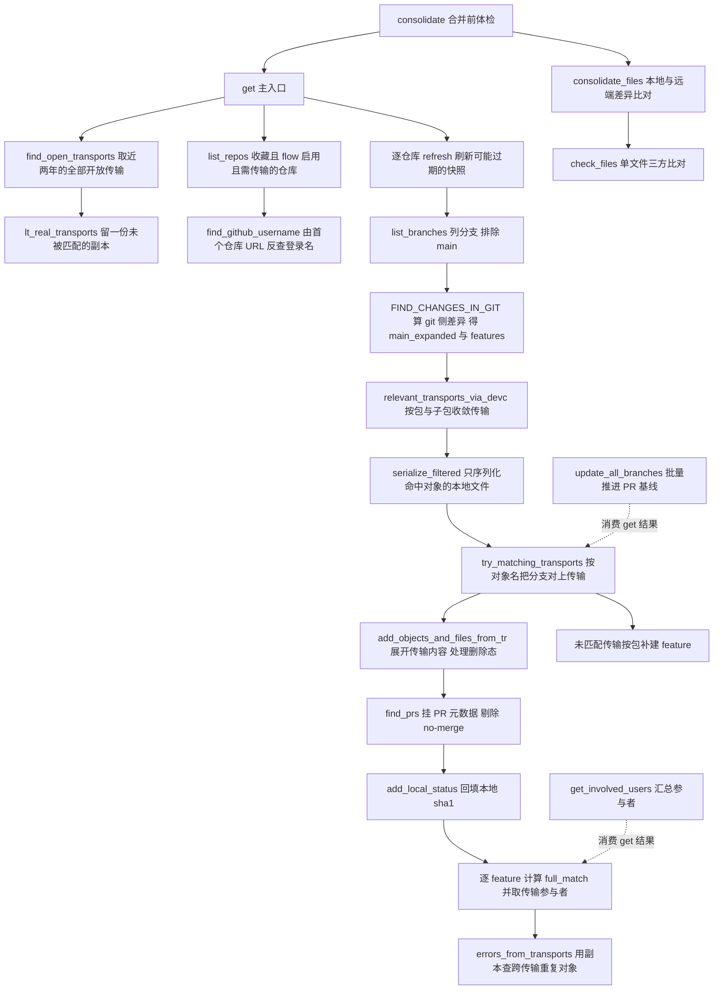
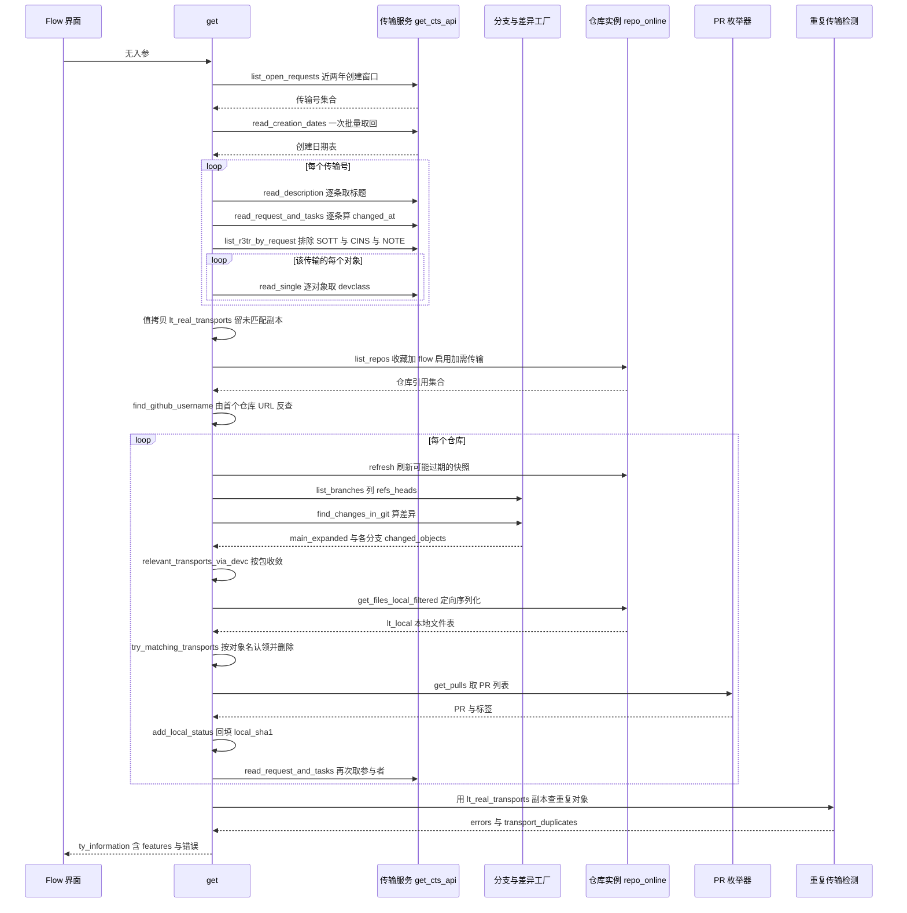

# ZCL_ABAPGIT_FLOW_LOGIC 分析报告

> 分析对象：`abapGit/abapGit — /abapgit/zcl_abapgit_flow_logic.clas.abap`（1114 行，纯静态工具类，19 个类方法）
> 报告视角：代码 onboarding 走读，按真实调用链展开

---

## 一、程序定位与业务背景

### 1.1 这个类在解决什么问题

先说清楚它**不是**什么：它不创建分支、不推 commit、不建 PR、不写传输、也不做合并。它是一个**只读的调度视图**（加上一个单向写 PR 基线的动作，见 3.17）。

业务场景是这样的：abapGit 世界里，一个功能的完整生命周期横跨两套互不相通的追踪系统——

- **Git 侧**：开发者从 `main` 拉出分支 `feature/payment-vat`，在本地改代码、推 PR；
- **SAP 侧**：同样的改动要落进一个自定义传输请求 `DEV K900123`，因为生产系统只认传输，不认 commit。

这两套系统各自都有 UI 能看自己那一半，但没有一处能同时回答：**"我收藏的那 8 个仓库里，现在哪些分支在飞？哪些传输还开着？分支 K900123 和传输 DEV K900123 是同一件事吗？有没有分支没挂传输、有没有传输没挂分支？PR 提到哪了？谁在里面动过手？"**

Flow 就是那个"同时回答全部六个问题"的界面后端。这个类是它的**编排层**：它自己不做任何 Git 查询、不做任何 TADIR 读取、也不序列化任何对象，全部委托出去（`zcl_abapgit_git_factory`、`zcl_abapgit_flow_git`、`zcl_abapgit_factory` 的 CTS/TADIR 服务、`zcl_abapgit_pr_enumerator`），自己只负责**取哪些数据、按什么顺序取、怎么把两套 ID 系对上号、对不上号时怎么报**。

它的业务价值定位可以这样定性：

| 它做的事 | 它刻意不做的事 |
|---|---|
| 把 Git 分支与 SAP 传输按"对象名"对齐成统一的 feature 列表 | 不判断"这个对齐对不对"，不做人工确认 |
| 找出三类不一致：分支无传输、传输无分支、传输重复 | 不自动修复，不自动删分支或关传输 |
| 标出本地有、远端没有（或缺失）的文件 | 不提交、不推送、不建 PR |
| 汇总"谁参与了这个传输" | 不做权限判断、不通知、不留审计日志 |
| 给前端一个可调用的 `get` 入口 + 一个 `consolidate` 体检入口 | 不自己渲染 UI |

一句话设计范式定性：

> **"双轨对齐调度器"（Reconciliation Orchestrator over Git 与 CTS）——本类不拥有任何数据源，只负责把 Git 的分支树和 SAP 的传输表按对象标识做双向归并，并对归并结果里的每一类错位各出一句可展示的错误文本。**

### 1.2 为什么"把两套 ID 对齐"值得单独做成一个类

三个理由，按重要性排：

1. **对齐规则只应存在一处。** Git 里没有 `TRKORR`，传输里没有 `SHA1`。要判断"分支 X 和传输 Y 是同一件事"，只能用两边都有的东西——**TADIR 对象类型 + 对象名**。这个匹配规则如果散落在 UI 层、PR 层、合并层各写一份，三处很快会出现三种口径（比如一处忽略对象类型、一处按包过滤、一处按传输状态过滤）。收进 `try_matching_transports`（3.9）一处，其余调用方只能消费其结果。
2. **它天然要多源并行取数。** 一次 Flow 视图的构建要同时读：所有仓库的所有分支、每个仓库的 git 差异、全系统的开放传输、每个传输的任务时间戳、每个对象的 TADIR 归属、每个仓库的 PR 列表。**取数顺序本身就是业务逻辑**（先拿传输全集，再逐仓库收敛；先匹配传输，再找 PR；先回填本地 sha，再判 `full_match`）。把顺序锁在一个类里，比让 UI 代码自己编排十几步调用可靠得多。
3. **它是"只读视图"里唯一允许写外部状态的地方**（`update_all_branches` 会调 GitHub API 更新 PR 基线）。把这类"读为主、偶尔写一点"的逻辑集中在一个类，比让 UI 层直接碰 `zcl_abapgit_pr_enum_github` 更容易审计。

代价集中在第 2 条上：这个类把**十几步取数**串行编排在一起，任何一步变慢都会拖慢整个视图（详见 3.17 与 P1 组）。

### 1.3 依赖清单（读这段代码前必须知道的地形）

```
本类  ZCL_ABAPGIT_FLOW_LOGIC   纯静态类，无实例状态，无实例方法
                                全部为 CLASS-METHODS；PRIVATE SECTION 里没有任何实例属性

契约接口  ZIF_ABAPGIT_FLOW_LOGIC   定义所有业务行结构，本类不定义，只引用：
                  ty_information        get 的返回体（features / enabled_repositories /
                                        github_username / errors / transport_duplicates）
                  ty_consolidate        consolidate 的返回体（额外含 missing_remote /
                                        only_remote / warnings）
                  ty_feature            一行 feature：repo + branch-* + transport-* +
                                        pr-* + changed_objects + changed_files +
                                        transport-users + full_match
                  ty_features           上述的标准内表
                  ty_local_files        序列化后的本地文件（file-path / file-filename /
                                        file-sha1 / item-obj_type / item-obj_name）
                  ty_path_name          一个 path+filename+local_sha1+remote_sha1 的四元组
                  ty_users_tt           用户名集合
                  c_main                常量 'main'
                  c_open_transport_days 开放传输的搜索窗口（天数）
        ZIF_ABAPGIT_REPO_ONLINE     仓库接口，含 get_url / get_name / get_key / get_package /
                                    get_dot_abapgit / get_files_local_filtered / refresh
        ZIF_ABAPGIT_REPO            上者的父接口（本类两处用 zif_abapgit_repo~ 显式限定访问）

被调服务（本类只调用，不实现）
        ZCL_ABAPGIT_GIT_FACTORY=>GET_V2_PORCELAIN()->LIST_BRANCHES  列分支
        ZCL_ABAPGIT_FLOW_GIT=>FIND_CHANGES_IN_GIT   git 侧差异计算（本文件外，最重的委托）
        ZCL_ABAPGIT_FACTORY=>GET_CTS_API()   传输读写：list_open_requests / read_creation_dates /
                                    read_description / list_r3tr_by_request /
                                    read_request_and_tasks / read
        ZCL_ABAPGIT_FACTORY=>GET_TADIR()   read / read_single
        ZCL_ABAPGIT_FACTORY=>GET_SAP_PACKAGE()   are_changes_recorded_in_tr_req / list_subpackages
        ZCL_ABAPGIT_REPO_SRV=>GET_INSTANCE()   list / list_favorites / get
        ZCL_ABAPGIT_PR_ENUMERATOR->NEW( )->GET_PULLS()   PR 列表
        ZCL_ABAPGIT_PR_ENUM_GITHUB->UPDATE_PULL_REQUEST_BRANCH   唯一的写外部动作
        ZCL_ABAPGIT_LOGIN_MANAGER=>GET_USERNAME    由 URL 反查登录名
        ZCL_ABAPGIT_FLOW_EXIT->GET_INSTANCE()   客户扩展点，可改写 github 用户名
        ZCL_ABAPGIT_OBJECT_FILTER_OBJ   对象过滤器，get_files_local_filtered 的入参
        ZCL_ABAPGIT_AFF_FACTORY=>GET_REGISTRY()->IS_SUPPORTED_OBJECT_TYPE   AFF 判断
        ZCL_ABAPGIT_FILENAME_LOGIC=>OBJECT_TO_FILE    对象名 → 序列化文件名
        ZCL_ABAPGIT_HTTP_AGENT=>CREATE   HTTP 代理

常量/私有类型（本类自持）
        c_max_missing_files = 1000   缺失文件列表的展示上限
        ty_transport / ty_transports_tt / ty_trkorr_tt   传输中间结构
        ty_repos_tt    REF TO ZIF_ABAPGIT_REPO_ONLINE 集合
        ty_update_result   updated / errors / skipped 三个 i 型计数器
```

### 1.4 这是一份"活跃演进中"的代码，读的时候要留意两类痕迹

判断依据有四处，读者一开始就该知道，否则会误判代码质量：

- 全类散布着 `* todo` 注释：`consolidate` 里的 `* todo: handling multiple repositories` 与 `* todo: branches without pull requests?`、`consolidate_files` 里的 `* todo: this is not correct for AFF enabled objects` 与 `* todo: double check, there might have been changes while consolidation is running`、`check_files` 里一个**空的** `* todo` 分支、`add_objects_and_files_from_tr` 里 `ls_changed_file-path = '/src/'. " todo?`。
- `consolidate` 里有一段被整体注释掉的分支过期检查（`ls_feature-branch-up_to_date`），说明这个校验曾存在、被移除、又留了注释。
- `consolidate_files` 用 `500` 这个裸数字做批处理切分，而同类上限 `c_max_missing_files` 却是具名常量——两种纪律混用。
- `get` 里同时存在 `zif_abapgit_repo~get_dot_abapgit( )` 的显式接口限定和 `consolidate_files` 里的裸 `get_dot_abapgit( )`，同一份代码两种风格。

所以本报告的分析对象是**这份代码里真实存在的 19 个方法的完整编排逻辑**，以及它**已经用 `todo` 标出来的、和它没有标出来的两类契约缺口**。后者更值得看：`todo` 是作者的自我怀疑，而下面 P0/P1 组里的问题大多没有被标注。

---

## 二、程序执行流程总览

主入口是 `get`，它串起全部 14 个私有方法中的 10 个；`consolidate` 是第二个入口，它反过来复用 `get`；`get_involved_users` 与 `update_all_branches` 是消费 `get` 结果的下游。



### 责任链表

| 子程序 | 调用者 | 职责 |
|---|---|---|
| `get`（PUBLIC，主入口） | Flow UI / 任何需要"全貌"的调用方 | 总控编排：定仓库范围、串起取数与对齐、汇总错误。无状态 |
| `consolidate`（PUBLIC） | 合并动作前的体检 | 调 `get` 取 features，再按"分支无传输 / 传输无分支"两类条件出错误文本，随后调 `consolidate_files` 做文件级比对 |
| `get_involved_users`（PUBLIC） | Flow UI | 从 `get` 的结果里抽出全部传输参与者用户名，去空 |
| `list_repos`（PUBLIC） | `get`、UI 直接调用 | 列收藏仓库，过滤出 flow 已启用且所在包需要传输请求的两个条件都满足的仓库 |
| `update_all_branches`（PUBLIC） | Flow UI 的"更新分支"按钮 | 对过期且有 PR 号的 feature 调 GitHub API 更新 PR 基线，返回三个计数器 |
| `find_open_transports`（PRIVATE） | `get`、`consolidate_files` | 取近两年内创建的开放传输，逐个补描述、创建日期、任务时间戳与对象清单 |
| `find_github_username`（PRIVATE） | `get` | 由第一个仓库的 URL 反查 GitHub 登录名，再过客户扩展点 |
| `build_repo_data`（PRIVATE） | `get`、`try_matching_transports` | 仓库三元组：name / key / package |
| `relevant_transports_via_devc`（PRIVATE） | `get` | 用仓库包及其子包筛出与本仓库相关的传输编号 |
| `serialize_filtered`（PRIVATE） | `get` | 合并"相关传输里的对象"与"git 里已改的对象"成一张去重过滤表，序列化本地文件 |
| `try_matching_transports`（PRIVATE） | `get` | 按对象名把分支 feature 对上传输并回填传输元数据；把没对上但包相关的传输补建成新 feature |
| `add_objects_and_files_from_tr`（PRIVATE） | `try_matching_transports` | 把一个传输展开成 changed_objects 与 changed_files，含"本地已删、远端仍在"的删除态推导 |
| `find_prs`（PRIVATE） | `get` | 取 PR 列表，按 head 分支名回填标题/URL/编号/草稿/作者，剔除带 `no-merge` 标签的分支 |
| `add_local_status`（PRIVATE） | `get` | 用 path+filename 把本地 sha1 回填进各 feature 的 changed_files |
| `read_transport_users`（PRIVATE） | `get` | 由传输的任务列表取参与者用户名 |
| `get_latest_task_timestamp`（PRIVATE） | `find_open_transports` | 取一个传输内所有任务里最晚的日期+时间，合成时间戳 |
| `errors_from_transports`（PRIVATE） | `get` | 在**未匹配副本**上查同一对象出现在多个传输的情况，并回填 feature 错误 |
| `consolidate_files`（PRIVATE） | `consolidate` | 列分支、算 git 差异、读 TADIR，分批比对，产出 missing_remote 与 only_remote |
| `check_files`（PRIVATE） | `consolidate_files` | 单文件三方比对：本地 / main 远端 / 各分支，判定归属与差异 |

下面按这条流程，逐个子程序展开。要提前说明的是：本类 1114 行里，`get`（108 行）+ `consolidate_files`（122 行）+ `find_open_transports`（64 行）+ `try_matching_transports`（81 行）+ `add_objects_and_files_from_tr`（83 行）占了约一半篇幅，而 `build_repo_data` 只有 4 行。第三节的重点在前者的**编排顺序与对齐规则**，不在语法。

---

## 三、分组分析

### 3.1 类定义段（`ZCL_ABAPGIT_FLOW_LOGIC` 的 PUBLIC SECTION 与 PRIVATE SECTION）

先读契约——这个类把对外暴露面压得很窄，这本身就是它最重要的设计决定。

```abap
CLASS zcl_abapgit_flow_logic DEFINITION PUBLIC.
  PUBLIC SECTION.
    CLASS-METHODS get
      RETURNING
        VALUE(rs_information) TYPE zif_abapgit_flow_logic=>ty_information
      RAISING
        zcx_abapgit_exception.
```

**做什么** — 类是 `PUBLIC`，但整个类**只有 5 个公共方法、没有任何实例**（`PROTECTED SECTION.` 与 `PRIVATE SECTION.` 之间只有一个空行，全是 `CLASS-METHODS`）。`get` 返回一个值型参数 `rs_information`，并声明抛出 `zcx_abapgit_exception`。也就是说这个类是纯静态的编排器：没有实例属性、没有构造器、没有任何需要在会话间保持的状态。

**为什么** — 静态方法 + 值型返回是"无状态调度层"的标准写法，好处是调用方不需要管对象生命周期，`get` 的返回值是一个自包含的快照，可以安全地传给 UI 或缓存。所有行结构都定义在接口 `ZIF_ABAPGIT_FLOW_LOGIC` 里而不是这个类里，意味着**接口才是契约、类只是实现**——将来换个实现（比如加一层缓存或改成异步）不需要动调用方。这一点做对了。

**风险与改进** — 三处：

1. **公共 API 的粒度不太均匀。** `get` 是完整快照，`consolidate` 是另一种完整快照，`get_involved_users` 却是"消费 `get` 的结果再加工"——它的入参是 `is_information`，也就是调用方必须先自己调过 `get`。这形成了一个隐含的两步契约（先 `get` 再 `get_involved_users`），但接口上看不出来。建议把这个依赖写进方法注释，或者干脆把 `get_involved_users` 合并进 `get` 的返回体。
2. **`consolidate` 同时声明 `RAISING zcx_abapgit_exception` 又返回 `errors` 内表**，两条错误通道并存（见 3.14）。哪种情况走异常、哪种走内表，接口上没有约定。
3. `PRIVATE SECTION` 里 `47` 行到 `179` 行之间只有方法声明，没有实例属性——这是刻意的好设计，但要注意：**它意味着所有中间状态都必须靠方法参数层层传递**。这个类现在传了 4 到 7 个参数的方法有好几个（`serialize_filtered` 4 个、`add_objects_and_files_from_tr` 4 个、`consolidate_files` 借 `cs_information` 隐式传），参数耦合是它后面几个问题（P1-6 一类）的结构性根源。

```abap
    CONSTANTS c_max_missing_files TYPE i VALUE 1000.

    TYPES: BEGIN OF ty_transport,
             trkorr     TYPE trkorr,
             title      TYPE string,
             object     TYPE tadir-object,
             obj_name   TYPE tadir-obj_name,
             devclass   TYPE tadir-devclass,
             created_on TYPE d,
             changed_at TYPE timestamp,
           END OF ty_transport.

    TYPES ty_transports_tt TYPE STANDARD TABLE OF ty_transport WITH NON-UNIQUE KEY trkorr.

    TYPES ty_trkorr_tt TYPE STANDARD TABLE OF trkorr WITH DEFAULT KEY.
```

**做什么** — 一个具名常量 `c_max_missing_files = 1000`（缺失文件展示上限），一个描述单个传输项的扁平结构 `ty_transport`（传输号、标题、对象类型、对象名、包、创建日期、最后任务时间戳），以及两张承载它的内表：`ty_transports_tt` 声明 `NON-UNIQUE KEY trkorr`，`ty_trkorr_tt` 只是纯 `trkorr` 的标准表。

**为什么** — `ty_transport` 把传输的**粒度定成"一个对象一行"**而不是"一个传输一行"，这是整个类最关键的数据建模决定：正因为粒度是对象级，才能直接用 `WITH KEY object = ... obj_name = ...` 去和 Git 侧的 `changed_objects` 做对等匹配（3.9）。如果定成传输级，就得先展开再匹配，多一层转换。`NON-UNIQUE KEY trkorr` 明确宣告"一个传输号会重复出现"，是诚实的建模。

**风险与改进** — 两处：

1. **`ty_transports_tt` 的表键只有 `trkorr`，但本类至少四处用 `object` / `obj_name` / `devclass` 去 `READ TABLE ... WITH KEY`**（`consolidate_files` 用 `object`+`obj_name`，`relevant_transports_via_devc` 与 `try_matching_transports` 用 `trkorr`+`devclass`）。这些键在表上**不存在**，ABAP 会退化为逐行线性扫描。表键声明和实际访问模式不匹配，是全类最集中的性能隐患（P2-2、P2-3）。建议按真实访问模式补一个二级键，或改成哈希表并按访问维度建键。
2. `ty_update_result` 的三个计数器用 `TYPE i`（3.2 已引），在 Flow 这种"一次点一下最多几十个分支"的场景下没问题；但如果将来把它复用到大规模批处理（成千上万条 PR），`i` 的 31 位容量在极端情况会溢出。当前规模下不构成风险，仅提示。

---

### 3.2 `get`（`ZCL_ABAPGIT_FLOW_LOGIC` 主入口，PUBLIC）

这是全类的骨架，108 行。分五步：① 取传输并留副本 → ② 定仓库范围 → ③ 逐仓库取 git 侧数据 → ④ 逐仓库做对齐与补充 → ⑤ 收尾算 `full_match` 并查传输重复。

```abap
    DATA lt_branches TYPE zif_abapgit_git_definitions=>ty_git_branch_list_tt.
    DATA ls_branch LIKE LINE OF lt_branches.
    DATA ls_result LIKE LINE OF rs_information-features.
    DATA li_repo_online TYPE REF TO zif_abapgit_repo_online.
    DATA lt_features LIKE rs_information-features.
    DATA lt_all_transports TYPE ty_transports_tt.
    DATA lt_relevant_transports TYPE ty_trkorr_tt.
    DATA lt_main_expanded TYPE zif_abapgit_git_definitions=>ty_expanded_tt.
    DATA lt_local TYPE zif_abapgit_flow_logic=>ty_local_files.
    DATA lt_real_transports LIKE lt_all_transports.

    FIELD-SYMBOLS <ls_feature> LIKE LINE OF lt_features.
    FIELD-SYMBOLS <ls_path_name> LIKE LINE OF <ls_feature>-changed_files.

    lt_all_transports = find_open_transports( ).
    lt_real_transports = lt_all_transports.
```

#### ① 声明与"传输副本"

**做什么** — 声明全部工作内表与两个字段符号，然后取一次全系统开放传输，紧接着做一份**值拷贝** `lt_real_transports = lt_all_transports`。

**为什么** — 这个拷贝是整段代码里最精妙的一处：`lt_all_transports` 后面会被 `try_matching_transports` 以 `CHANGING` 方式逐仓库删除已匹配的记录（3.9 里的 `DELETE ct_transports WHERE trkorr = ...`），到最后一个仓库跑完，`lt_all_transports` 里只剩"哪个仓库都没认领"的传输。而 `errors_from_transports`（3.13）需要在**完整的原始集合**上做重复对象检测——因为"同一对象在两个传输里"这件事与"有没有仓库认领"无关。先留副本、再用副本收尾，是让两个语义截然不同的查询各取所需的最小代价写法，比"再取一次传输"省掉一整轮 CTS 往返。

**风险与改进** — 三处：

1. **`lt_main_expanded` 与 `lt_local` 声明在循环外但只在循环内被赋值，且循环内从不 `CLEAR`。** `lt_features` 有显式 `CLEAR lt_features.`，这两张没有。当前不会出错的原因是：`lt_main_expanded` 是 `find_changes_in_git` 的 `IMPORTING`，`lt_local` 是 `serialize_filtered` 的 `RETURNING`——两者都是整体赋值而非追加。但这是靠**被调方的赋值语义**在兜底，而不是靠本方法自己的纪律。下一个维护者只要把其中一个调用改成 `CHANGING` 追加式，就会把上一个仓库的数据泄漏进下一个仓库。建议在循环开头补 `CLEAR lt_main_expanded. CLEAR lt_local. CLEAR lt_relevant_transports.`。
2. **两遍 `LOOP AT lt_repos INTO li_repo_online`（一次只 refresh，一次做全部事）** 是刻意拆开的，注释 `* Repository instances may contain stale snapshots when Flow is first opened` 说得很清楚：先全部刷新再全部读取，避免"读一半刷一半"导致同一个仓库被读两次。这是对的。
3. `FIELD-SYMBOLS <ls_path_name> LIKE LINE OF <ls_feature>-changed_files.` 声明时 `<ls_feature>` 尚未赋值——这在 ABAP 里是合法的（字段符号的声明只取类型，不取行），但读起来容易被误判成问题。可加一行注释说明意图，避免被"顺手修掉"。

```abap
* list branches on favorite + flow enabled + transported repos
    lt_repos = list_repos( ).
    rs_information-enabled_repositories = lines( lt_repos ).
    rs_information-github_username = find_github_username( lt_repos ).
```

#### ② 圈定仓库范围与用户名

**做什么** — 调 `list_repos`（默认只看收藏）取仓库集合，把仓库数量写进 `enabled_repositories`（给 UI 显示"当前 N 个仓库在监控中"），再用第一个仓库的 URL 反查 GitHub 登录名。

**为什么** — 把 `enabled_repositories` 与 `github_username` 这两个"非 feature 级"的全局信息塞进同一个返回体，是为了让 UI 一次调用拿到完整的顶部状态栏数据，不必另开一次往返。

**风险与改进** — `list_repos` 返回 0 行时，`find_github_username` 会走 `READ TABLE ... INDEX 1` 失败分支并静默返回空字符串（3.4），而 `enabled_repositories = 0` 是唯一提示。UI 若没处理空状态，用户会看到"0 个仓库"却没有任何解释。建议在 `get` 里对空集合提前短路并给出可展示的提示，而不是让一个空快照流到 UI。

```abap
    LOOP AT lt_repos INTO li_repo_online.

      lt_branches = zcl_abapgit_git_factory=>get_v2_porcelain( )->list_branches(
        iv_url    = li_repo_online->get_url( )
        iv_prefix = zif_abapgit_git_definitions=>c_git_branch-heads_prefix )->get_all( ).

      CLEAR lt_features.
      LOOP AT lt_branches INTO ls_branch WHERE display_name <> zif_abapgit_flow_logic=>c_main.
        ls_result-repo = build_repo_data( li_repo_online ).
        ls_result-branch-display_name = ls_branch-display_name.
        ls_result-branch-sha1 = ls_branch-sha1.
        INSERT ls_result INTO TABLE lt_features.
      ENDLOOP.

      zcl_abapgit_flow_git=>find_changes_in_git(
        EXPORTING
          iv_url           = li_repo_online->get_url( )
          io_dot           = li_repo_online->zif_abapgit_repo~get_dot_abapgit( )
          iv_package       = li_repo_online->zif_abapgit_repo~get_package( )
          it_branches      = lt_branches
        IMPORTING
          et_main_expanded = lt_main_expanded
        CHANGING
          ct_features      = lt_features ).
```

#### ③ 逐仓库：列分支、建骨架、算 git 差异

**做什么** — 对每个仓库：用 porcelain v2 列 `refs/heads/` 前缀下的分支；排除 `main` 后为每个分支建一行空 feature（只填 repo 三元组、分支名、分支 sha）；然后把全部分支交给 `zcl_abapgit_flow_git=>find_changes_in_git`，让它算出 main 的展开文件表 `lt_main_expanded` 并把每个分支的 `changed_objects` / `changed_files` 回填进 feature。

**为什么** — 先建"只有分支名"的骨架行再回填，比一次性构造完整行更好维护：`find_changes_in_git` 用 `CHANGING ct_features` 就地增补，不需要知道 feature 的完整构造顺序；而且骨架行保证了"有分支就有一行"，即使 git 差异为空，UI 上仍然能看到这个分支（显示为一个空的 feature），这符合"我在飞什么"的直觉。用 `zif_abapgit_repo~` 显式接口限定访问 `get_dot_abapgit` 与 `get_package` 是正确的——这两个方法属于父接口 `zif_abapgit_repo` 而非 `zif_abapgit_repo_online`。

**风险与改进** — 三处：

1. **`lt_branches` 传给了 `find_changes_in_git` 但里面包含 `main`，而 feature 骨架已经排除 `main`。** 这说明"分支列表"在代码里同时承担两个语义：给 git 差异计算的**全集**（含 main，因为 diff 需要 main 作基线）与给 feature 骨架的**非 main 集**。同一个变量两种用途，靠注释才能看出来。建议拆成 `lt_all_branches` 与 `lt_feature_branches` 两个名字，让语义显式。
2. **每仓库一次 `list_branches` + 一次 `find_changes_in_git` 是串行的。** 8 个仓库就是 16 次网络/IO 往返，且互相独立、无依赖。这是本类最大的性能瓶颈（P1-7）。当前 Flow 的仓库数量通常是个位数，串行尚可接受；仓库数到几十个时视图会明显变慢。
3. `loop` 里 `ls_result` 从不 `CLEAR`——它由 `build_repo_data` 的三个赋值覆盖 name/key/package，但如果 `ty_feature-repo` 结构以后加了字段（很可能，比如加个 visibility），`ls_result` 的残留值就会串到下一行。建议每轮循环开头 `CLEAR ls_result.`。

```abap
      lt_relevant_transports = relevant_transports_via_devc(
        ii_repo        = li_repo_online
        it_transports  = lt_all_transports ).

      lt_local = serialize_filtered(
        it_relevant_transports = lt_relevant_transports
        ii_repo                = li_repo_online
        it_features            = lt_features
        it_all_transports      = lt_all_transports ).

      try_matching_transports(
        EXPORTING
          ii_repo          = li_repo_online
          it_local         = lt_local
          it_main_expanded = lt_main_expanded
        CHANGING
          ct_transports    = lt_all_transports
          ct_features      = lt_features ).

      find_prs(
        EXPORTING
          iv_url      = li_repo_online->get_url( )
        CHANGING
          ct_features = lt_features ).

      add_local_status(
        EXPORTING
          it_local     = lt_local
        CHANGING
          ct_features = lt_features ).
```

#### ④ 逐仓库：收敛传输 → 序列化 → 匹配 → PR → 本地状态

**做什么** — 五步串行：先用仓库包筛出相关传输号，再用"相关传输的对象 + git 已改的对象"这个合并集合序列化本地文件，然后把传输按对象名对到分支上（并可能新建 feature），再挂 PR 元数据，最后回填本地 sha1。

**为什么** — 这个顺序是**有依赖的**，不是随意的：`serialize_filtered` 必须拿完整的对象集合才能序列化，所以它在 `try_matching_transports` 之前；而 `try_matching_transports` 又必须拿到 `it_local` 才能把传输对象映射到本地文件，所以 `add_local_status` 在最后——只有当 `remote_sha1` 与 `local_sha1` 都填好了，`full_match` 才有意义。整个编排顺序是正确且经过推敲的。

**风险与改进** — 两处：

1. **`lt_all_transports` 以 `CHANGING` 传出并被逐仓库删减，但传给 `relevant_transports_via_devc` 的仍是这张正在变小的表。** 结果是：仓库 A 认领掉的传输，在仓库 B 处理时就**不可见了**。如果某个传输的两个对象分别落在两个不同仓库的相关包里，第二个仓库就匹配不到它了。当前设计下这通常不暴露，因为一个传输通常只涉及一个仓库的包；但 `ty_transport` 里有 `devclass` 字段，说明设计者预期了跨包/跨仓库的可能性（P1-5）。稳妥做法是按仓库用未删减的表筛，删减只作用在"已认领集合"的标记上。
2. `serialize_filtered` 的 4 个入参里有 3 个是本方法的中间产物，参数列表已经开始膨胀。这不影响正确性，但意味着 `serialize_filtered` 与 `get` 的编排顺序强耦合——想重排顺序就必须改签名。

```abap
      LOOP AT lt_features ASSIGNING <ls_feature>.
        <ls_feature>-full_match = abap_true.
        LOOP AT <ls_feature>-changed_files ASSIGNING <ls_path_name>.
          IF <ls_path_name>-remote_sha1 <> <ls_path_name>-local_sha1.
            <ls_feature>-full_match = abap_false.
          ENDIF.
        ENDLOOP.

        IF <ls_feature>-transport-trkorr IS NOT INITIAL.
          <ls_feature>-transport-users = read_transport_users( <ls_feature>-transport-trkorr ).
        ENDIF.
      ENDLOOP.

      INSERT LINES OF lt_features INTO TABLE rs_information-features.
    ENDLOOP.

    errors_from_transports(
      EXPORTING
        it_all_transports  = lt_real_transports
      CHANGING
        cs_information     = rs_information ).
```

#### ⑤ 收尾：算 `full_match`、取参与者、查重复

**做什么** — 逐 feature 判 `full_match`（只要有一个文件的远端 sha 与本地 sha 不等就算不全等）；对有传输的 feature 取参与者用户名；把本仓库的 features 追加进返回体。全部仓库跑完后，用**副本** `lt_real_transports` 做跨传输重复检测。

**为什么** — `full_match` 的语义是"本地工作副本与远端分支完全一致"，它是 UI 判断"能不能安全合并"的关键信号。用 `abap_true` 起始、只在发现不等时翻成 `abap_false`，是短路写法的正确方向。这里有个隐含约定值得点出：`remote_sha1` 与 `local_sha1` **都为空**时算相等——这正是 `add_objects_and_files_from_tr` 里那句注释 `* after its deleted locally and remote then remote and local sha1 will match(be empty)` 所依赖的语义（3.10）。两个方法靠一句注释约定了一个边界语义，属于典型的隐式契约。

**风险与改进** — 三处：

1. **`full_match` 只比较 sha 相等性，不判断"是否真的变更过"。** 一个分支如果被 `try_matching_transports` 从传输补建出来（没有对应 git 分支），它的 `changed_files` 全来自传输展开，`remote_sha1` 取自 main、`local_sha1` 取自本地序列化——两者相等不代表"这个传输的内容已经进 git"，只代表"本地序列化结果与 main 快照一致"。UI 若把 `full_match = true` 理解成"可以合并"，在这种 feature 上会得出错误结论。这是语义错配而非代码错误，但后果是业务判断失误（P0-5）。
2. **`read_transport_users` 在循环内逐 feature 调用 CTS。** 有 N 个带传输的 feature 就是 N 次 `read_request_and_tasks` 往返，与 3.5 里 `get_latest_task_timestamp` 的往返是**同一份数据**——`find_open_transports` 早就读过一次任务列表了。这是全类最明显的重复取数（P2-1）。
3. `errors_from_transports` 放在循环外、用副本调用，是对的。但要注意它读的是 `cs_information-features`（已经装完全部仓库的 features）来过滤"是否在收藏的 flow 仓库里"，所以顺序不能换——它必须在所有 feature 装完之后跑。这个依赖同样只体现在调用位置上，没有注释。

---

### 3.3 `list_repos`（PRIVATE 语义、PUBLIC 声明）

```abap
    IF iv_favorites_only = abap_true.
      lt_repos = zcl_abapgit_repo_srv=>get_instance( )->list_favorites( abap_false ).
    ELSE.
      lt_repos = zcl_abapgit_repo_srv=>get_instance( )->list( abap_false ).
    ENDIF.

    LOOP AT lt_repos INTO li_repo.
      IF li_repo->get_local_settings( )-flow = abap_false.
        CONTINUE.
      ELSEIF zcl_abapgit_factory=>get_sap_package( li_repo->get_package( )
          )->are_changes_recorded_in_tr_req( ) = abap_false.
        CONTINUE.
      ENDIF.

      li_online ?= li_repo.
      INSERT li_online INTO TABLE rt_repos.
    ENDLOOP.
```

**做什么** — 按开关取"收藏列表"或"全部列表"，然后逐个仓库做两道过滤：仓库的本地设置里 `flow = abap_false` 的跳过，所在包 `are_changes_recorded_in_tr_req = abap_false`（即该包不需要传输请求）的跳过。剩下的做 `?= ` 接口下沉转换后收进结果表。

**为什么** — 这两道过滤就是"Flow 适用条件"的精确定义：**Flow 只对"用了 flow 且必须走传输的包"的仓库有意义**。不需要传输的包（通常是开发包或已切到 ABAP 版本管理的包）在 Flow 里会出现"分支永远没有传输"的假错误，所以必须在入口就排除。用 `ELSEIF` 把两个条件串成一条链而不是两个 `IF`，避免了对同一个仓库做两次无关判断。

**风险与改进** — 三处：

1. **`IV_FAVORITES_ONLY` 默认 `abap_true`，而 `get` 调用它时不传参。** 这意味着 Flow 视图**永远只看收藏**。用户有一个 flow 启用但没收藏的仓库，Flow 里看不到，也不会有任何提示说"这个仓库没被纳入监控"。这是一个容易让人困惑的行为边界，建议在 Flow 界面明确显示"仅监控已收藏的仓库"。
2. **`get_sap_package( )->are_changes_recorded_in_tr_req( )` 在循环内逐仓库调用**，每个仓库一次配置读取。与 3.5 里的 N+1 属于同一类问题，但这里仓库数量小，影响有限。
3. 方法在 `PUBLIC SECTION` 里声明且带 `RAISING`，但只有 `get` 在内部调用它。**对外暴露一个内部编排细节**扩大了维护面——UI 层理论上可以直接调它拿到"过滤后的仓库表"，绕过 `get` 的完整流程。建议移到 `PRIVATE SECTION`，除非确实有外部调用需求。

---

### 3.4 `find_github_username`

```abap
    READ TABLE it_repos INTO li_repo_online INDEX 1.
    IF sy-subrc = 0.
      TRY.
          rv_username = zcl_abapgit_login_manager=>get_username( li_repo_online->get_url( ) ).
        CATCH zcx_abapgit_exception ##NO_HANDLER.
      ENDTRY.
    ENDIF.

    TRY.
        li_exit = zcl_abapgit_flow_exit=>get_instance( ).
        li_exit->change_github_username( CHANGING cv_username = rv_username ).
      CATCH zcx_abapgit_exception ##NO_HANDLER.
    ENDTRY.
```

**做什么** — 取仓库集合的第一行，用它的 URL 反查 GitHub 登录名；然后把用户名交给客户扩展点 `ZCL_ABAPGIT_FLOW_EXIT` 改写（`CHANGING cv_username` 允许扩展点直接修改返回值）。两处异常都静默吞掉。

**为什么** — 用户名是用来拼 PR 链接和显示头像的，属于"锦上添花"的信息，所以取不到也不能让 Flow 整体失败——用 `##NO_HANDLER` 显式标记"此处静默"是对的，它告诉静态检查器这不是遗漏而是有意为之。扩展点设计允许客户用自己的登录服务替换 URL 反查逻辑，这是 abapGit 一贯的客户化手法。

**风险与改进** — 三处：

1. **只试第一个仓库。** 如果第一个仓库是自建 Git 服务（`git.company.com`）而不是 github.com，`get_username` 大概率返回空，于是整个 Flow 视图都拿不到用户名——哪怕后面第 3 个仓库是 GitHub 的。应该遍历到拿到第一个非空结果为止（P1-6）。
2. **扩展点调用在 `IF` 外面，所以即使没仓库也会调一次扩展点**，此时 `rv_username` 是初值。这不算 bug（扩展点可能就是用来兜底的），但两个 `TRY` 块结构不对称，读代码时容易以为扩展点只在有用户名时才跑。
3. 客户扩展点 `change_github_username` 失败时同样静默——如果扩展点实现有 bug，用户名会悄悄丢失且无任何线索。建议在异常分支至少写一条调试日志。

---

### 3.5 `find_open_transports` 与 `get_latest_task_timestamp`

```abap
* only look for transports that are created/changed in the last two years
    ls_date-sign = 'I'.
    ls_date-option = 'GE'.
    ls_date-low = sy-datum - zif_abapgit_flow_logic=>c_open_transport_days.
    INSERT ls_date INTO TABLE lt_date.

    lt_trkorr = zcl_abapgit_factory=>get_cts_api( )->list_open_requests( lt_date ).
    lt_created_on = zcl_abapgit_factory=>get_cts_api( )->read_creation_dates( lt_trkorr ).
```

#### ① 时间窗与批量预取

**做什么** — 构造一个 `GE`（大于等于）日期区间：`sy-datum - c_open_transport_days` 到今天，用它列开放传输；紧接着**批量**取回这批传输的创建日期。注释里的"两年"是 `c_open_transport_days` 的实际取值（常量定义在接口里，本文件不可见，需在 SE11 核实其值）。

**为什么** — 用创建时间窗裁剪搜索范围是必要的性能保护：一个跑了多年的 SAP 系统可能有几千个开放传输，全量遍历再逐个展开对象会让整个 Flow 视图慢到不可用。批量取创建日期（一次 `read_creation_dates` 处理整张表）而不是逐个 `read_description`，说明作者在这里是有意识地做批量化优化的——`read_creation_dates` 的存在本身就是为这个场景准备的。

**风险与改进** — 三处：

1. **时间窗按"创建日期"裁剪，但注释写的是"created/changed in the last two years"。** 两者不等价：一个三年前创建、昨天刚动过的传输，创建日期在窗口外，会被漏掉。而 Flow 恰恰最关心"最近有人动过"的传输。过滤条件应该用 `changed_at`（本方法后面本来就算好了它）而不是 `created_on`（P1-4）。
2. 日期区间只给了一个 `GE` 下界，没有上界。虽然 `list_open_requests` 只返回开放状态的传输，上界通常无影响，但显式给出 `LE` 上界能让意图更清楚、也防御未来 API 语义变化。
3. `c_open_transport_days` 的值本文件不可见，"两年"只是注释的说法——**接手时应在 SE11 打开 `ZIF_ABAPGIT_FLOW_LOGIC` 确认常量实际值**，两者不一致的话注释会误导后人。

```abap
    LOOP AT lt_trkorr INTO lv_trkorr.
      ls_result-trkorr = lv_trkorr.
      ls_result-title  = zcl_abapgit_factory=>get_cts_api( )->read_description( lv_trkorr ).
      READ TABLE lt_created_on INTO ls_created_on WITH TABLE KEY trkorr = lv_trkorr.
      IF sy-subrc = 0.
        ls_result-created_on = ls_created_on-created_on.
      ELSE.
        CLEAR ls_result-created_on.
      ENDIF.
      ls_result-changed_at = get_latest_task_timestamp( lv_trkorr ).

* LIMU skipped here:
" SOTT = Concept (Online Text Repository) - Short Texts for packages are not serialized anyhow
      CLEAR ls_limu_skip.
      ls_limu_skip-sign = 'I'.
      ls_limu_skip-option = 'EQ'.
      ls_limu_skip-low = 'SOTT'.
      INSERT ls_limu_skip INTO TABLE lt_limu_skip.
      lt_objects = zcl_abapgit_factory=>get_cts_api( )->list_r3tr_by_request(
        iv_request         = lv_trkorr
        it_skip_limu_types = lt_limu_skip ).
```

#### ② 逐传输补描述、时间戳与对象清单

**做什么** — 对每个传输：取标题（1 次调用）；从预取的创建日期表里读（`WITH TABLE KEY trkorr`，命中失败则清空）；算最后任务时间戳（1 次调用）；构造一个排除 `SOTT` 的 LIMU 类型过滤表；列该传输下的 R3TR 对象（1 次调用）。

**为什么** — `ls_limu_skip` 每一轮都 `CLEAR` 再重建，是因为上一轮循环结束后这个局部表还会留着上一行的值（ABAP 内表追加不会自动清空工作区）；虽然逻辑上每轮都只插一条，但显式 `CLEAR` 是防御性的正确写法。排除 `SOTT`（包短文本）有明确注释理由：这类对象本来就不序列化，放进 Flow 只会制造噪音。

**风险与改进** — 四处：

1. **这是全类最严重的 N+1 结构**：每个传输至少 3 次 CTS 往返（`read_description` + `get_latest_task_timestamp` + `list_r3tr_by_request`），而对象级的 `read_single` 还在下一段（见下）。假设 200 个开放传输、平均每个 20 个对象，就是 600 + 4000 = 4600 次 CTS 调用。`read_creation_dates` 已经示范了批量化的正确姿势，剩下三个调用同样值得批量化（P2-1）。
2. `WITH TABLE KEY trkorr = lv_trkorr` 要求 `lt_created_on` 上有 `trkorr` 表键；该类型定义在接口里，本文件不可见，**需核实**是否确有此键——没有的话这里是逐行线性查找，200 行 × 200 次 = 4 万次比较，虽不致命但浪费。
3. `ls_limu_skip` 的 `SIGN/OPTION/LOW` 三字段是硬编码字面量，没有提为常量；`'SOTT'` 这个业务常量散落在逻辑中间，将来要加第二种跳过类型（比如 `CINS` 已经是对象级的跳过）时容易被漏掉。
4. 注释 `* R3TR can be skipped here` 表明作者知道还能省一层，但没做——说明这是一处**已知但未处理**的性能空间，接手时可以顺带确认 `list_r3tr_by_request` 是否有"只要 R3TR 对象"的开关。

```abap
      LOOP AT lt_objects ASSIGNING <ls_object>
          WHERE object <> 'CINS'
          AND object <> 'NOTE'.
        ls_result-object   = <ls_object>-object.
        ls_result-obj_name = <ls_object>-obj_name.

        lv_obj_name = <ls_object>-obj_name.
        ls_result-devclass = zcl_abapgit_factory=>get_tadir( )->read_single(
          iv_object   = ls_result-object
          iv_obj_name = lv_obj_name )-devclass.
        IF ls_result-devclass IS NOT INITIAL.
          INSERT ls_result INTO TABLE rt_transports.
        ENDIF.
      ENDLOOP.

    ENDLOOP.
```

#### ③ 逐对象取包并入库

**做什么** — 遍历该传输的对象，跳过 `CINS`（包含关系）与 `NOTE`（SAP Note）两种类型；对剩余对象调 `read_single` 取 `devclass`；`devclass` 非空才插入结果表。

**为什么** — `devclass` 是后面 `relevant_transports_via_devc`（3.6）做包收敛的唯一依据，所以必须在采集阶段就带上。`CINS` 与 `NOTE` 被排除是因为它们在 abapGit 里没有对应的序列化文件，纳入只会产生永远匹配不上的噪音行。用 `WHERE` 直接在 `LOOP` 上过滤比循环体内 `IF ... CONTINUE` 更省一次判断。

**风险与改进** — 四处：

1. **`read_single` 是对象级调用，且是每对象一次——这是全类调用次数最多的单点。** 一个传输带 50 个对象就是 50 次 TADIR 读取。既然 `zcl_abapgit_tadir` 已经在 `consolidate_files` 里示范了 `read( it_filter )` 的批量接口，这里同样应该一次性用过滤表取回（P2-1）。
2. **`devclass` 为空就静默丢行。** 一个对象可能在 TADIR 里被标为删除（`DELFAG`）而读不到包，此时它被无声丢弃——既不在 Flow 里出现，也不报错。`consolidate_files` 里用 `iv_ignore_delflag = abap_true` 显式处理了这个问题，而这里没有，两处对"删除态对象"的处理不一致（P1-8）。
3. 中间变量 `lv_obj_name` 只是 `ls_result-obj_name` 的复制，用于把赋值和传参分开写——这是为了可读性还是为了绕开某个内联表达式的解析问题，代码里没有说明。可以直接把 `ls_result-obj_name` 传进去，少一个变量。
4. `WHERE object <> 'CINS' AND object <> 'NOTE'` 把跳过类型硬编码在循环条件里，与上一段 LIMU 的跳过类型**分散在两处**。两类"跳过"应该合并成一张可维护的跳过表。

```abap
    TRY.
        lt_tasks = zcl_abapgit_factory=>get_cts_api( )->read_request_and_tasks( iv_trkorr ).

        LOOP AT lt_tasks INTO ls_task.
          IF ls_task-as4date > lv_max_date
              OR ( ls_task-as4date = lv_max_date AND ls_task-as4time > lv_max_time ).
            lv_max_date = ls_task-as4date.
            lv_max_time = ls_task-as4time.
          ENDIF.
        ENDLOOP.

        IF lv_max_date IS NOT INITIAL.
          CONVERT DATE lv_max_date TIME lv_max_time INTO TIME STAMP rv_changed_at TIME ZONE sy-zonlo.
        ELSE.
          GET TIME STAMP FIELD rv_changed_at.
        ENDIF.
      CATCH zcx_abapgit_exception.
        GET TIME STAMP FIELD rv_changed_at.
    ENDTRY.
```

#### ④ 取最晚任务时间戳（`get_latest_task_timestamp`）

**做什么** — 读该传输的请求与任务列表，找出日期最晚、日期相同时取时间最晚的那一条，转成带本地时区的 `TIMESTAMP` 返回。两个兜底路径：没有任何任务时、或读取抛异常时，都用 `GET TIME STAMP` 填**当前时间**。

**为什么** — 用"最晚任务时间"而不是请求自身的创建时间来表示"这个传输最近有多新鲜"是准确的：传输的活跃度体现在任务的持续提交上。用 `sy-zonlo` 显式指定时区转换，说明作者知道 `TIMESTAMP` 的跨时区比较会有坑，这是正确的做法。

**风险与改进** — 两处，其中第一处是全类最阴的静默降级：

1. **两个失败路径都回退为"当前时间"，而这会让失败的传输看起来最新鲜。** `cs_information` 里 `transport-changed_at` 通常用于排序和"最近有变动"的判断。一个读不到的传输会被标成"就在刚刚改动过"，在按时间倒序的列表里排到最前面，用户会优先去看它——而它恰恰是最不该被信任的一条。失败时应该返回初值并单独标记"时间戳未知"，而不是伪装成最新（P1-1）。同时 `CATCH` 完全静默（连 `##NO_HANDLER` 都没有），意味着 `read_request_and_tasks` 的失败在本文件里**没有任何可观测痕迹**。
2. 空任务列表也走同一兜底——一个只有请求头、没有任何任务的传输（刚建还没加对象）会被标成"现在"。这在业务上可以理解，但与上一条的"异常兜底"共用同一个分支，导致**真实失败和正常空值无法区分**。

---

### 3.6 `relevant_transports_via_devc`

```abap
    lt_trkorr = it_transports.
    SORT lt_trkorr BY trkorr.
    DELETE ADJACENT DUPLICATES FROM lt_trkorr COMPARING trkorr.

    lt_packages = zcl_abapgit_factory=>get_sap_package( ii_repo->get_package( ) )->list_subpackages( ).
    INSERT ii_repo->get_package( ) INTO TABLE lt_packages.

    LOOP AT lt_trkorr ASSIGNING <ls_trkorr>.
      lv_found = abap_false.

      LOOP AT lt_packages ASSIGNING <lv_package>.
        READ TABLE it_transports TRANSPORTING NO FIELDS WITH KEY trkorr = <ls_trkorr>-trkorr devclass = <lv_package>.
        IF sy-subrc = 0.
          lv_found = abap_true.
          EXIT.
        ENDIF.
      ENDLOOP.
      IF lv_found = abap_false.
        CONTINUE.
      ENDIF.

      IF lv_found = abap_true.
        INSERT <ls_trkorr>-trkorr INTO TABLE rt_transports.
      ENDIF.
    ENDLOOP.
```

**做什么** — 先把输入传输表按 `trkorr` 排序并去重（一个传输可能因为包含多个对象而重复出现多次），得到"相关传输号"的唯一集合；再取仓库所在包及其全部子包；然后对每个唯一传输号，检查它是否有任何对象落在这些包里，有就收进结果。

**为什么** — "仓库的包 + 所有子包"是 SAP 包层级下"这个仓库能管到什么"的准确边界：子包的对象归属父包的仓库管，所以传输只要碰到子包就该纳入。先按 `trkorr` 去重再判断包，把"传输号数 × 包数"的循环规模压到"唯一传输号数 × 包数"，是必要优化——否则一个带 50 个对象的传输会被反复检查 50 遍。

**风险与改进** — 四处：

1. **`READ TABLE it_transports ... WITH KEY trkorr = ... devclass = ...` 用的复合键在 `ty_transports_tt` 上不存在**（该表只声明了 `NON-UNIQUE KEY trkorr`）。这次 `READ` 会退化为对整张传输表的线性扫描，而它被放在**双层循环最内层**：唯一传输号数 × 包数 × 传输表行数。假设有 100 个传输号、10 个子包、4000 行对象记录，就是 400 万次比较。这是全类最贵的单点计算（P2-2）。`try_matching_transports` 里还有一处一模一样的写法（3.9），问题放大一倍。
2. **两个连续的 `IF lv_found` 判断逻辑冗余。** 第一个 `IF lv_found = abap_false. CONTINUE.` 之后，`lv_found` 必然为 `abap_true`，所以第二个 `IF lv_found = abap_true.` 恒成立。这不是错误，但读者会花时间猜"是否有一条路径我漏看了"。删掉第二个 `IF` 直接 `INSERT` 即可。
3. **同样的"包收敛"逻辑在 `try_matching_transports`（3.9 的末段）里完整重复了一遍**——同样的 `list_subpackages` + `INSERT` 本包 + 双层循环 + `READ TABLE ... WITH KEY trkorr devclass`。两处实现必须始终保持一致，而现在它们是两份独立代码（P3-5）。应该抽成一个方法复用。
4. 结果表 `rt_transports` 没有去重保护。如果同一个传输号在不同包里都命中（跨包子包的情况），当前实现会插一次就 `CONTINUE` 掉外层，所以实际不会重复——但这个正确性依赖 `EXIT` 只退出内层循环这一细节，读起来并不显然。

---

### 3.7 `serialize_filtered`

```abap
    LOOP AT it_relevant_transports INTO lv_trkorr.
      LOOP AT it_all_transports ASSIGNING <ls_transport> WHERE trkorr = lv_trkorr.
        APPEND INITIAL LINE TO lt_filter ASSIGNING <ls_filter>.
        <ls_filter>-object = <ls_transport>-object.
        <ls_filter>-obj_name = <ls_transport>-obj_name.
      ENDLOOP.
    ENDLOOP.

    LOOP AT it_features INTO ls_feature.
      LOOP AT ls_feature-changed_objects INTO ls_changed_object.
        APPEND INITIAL LINE TO lt_filter ASSIGNING <ls_filter>.
        <ls_filter>-object = ls_changed_object-obj_type.
        <ls_filter>-obj_name = ls_changed_object-obj_name.
      ENDLOOP.
    ENDLOOP.

    SORT lt_filter BY object obj_name.
    DELETE ADJACENT DUPLICATES FROM lt_filter COMPARING object obj_name.

    CREATE OBJECT lo_filter EXPORTING it_filter = lt_filter.
    rt_local = ii_repo->get_files_local_filtered( lo_filter ).
```

**做什么** — 从两个来源汇集"需要序列化的对象"：① 相关传输里的所有对象（逐传输号回到 `it_all_transports` 取它的对象行）；② git 侧已改的对象（各 feature 的 `changed_objects`）。合并成一张过滤表，按 `object`+`obj_name` 排序去重，交给对象过滤器，最后调用仓库的 `get_files_local_filtered` 只做**定向序列化**。

**为什么** — 这是本类最实用的性能决定：**序列化是 abapGit 里最贵的操作之一**（要把每个对象读出来、解析、转成文件），而 Flow 视图只需要一小部分对象的本地状态。用"传输对象 ∪ git 已改对象"这张最小集合去序列化，而不是序列化整个包，是把 O(包内对象数) 降到 O(在飞对象数)。排序去重避免同一个对象被序列化两遍（传输里有、git 里也有是常态）。

**风险与改进** — 三处：

1. **`lt_filter` 为空时仍会 `CREATE OBJECT lo_filter` 并调用序列化。** 空过滤表的语义取决于 `zcl_abapgit_object_filter_obj` 的实现——可能匹配全部对象（灾难：等于序列化整个包），也可能匹配零个（无害）。这是本文件里唯一"正确性取决于外部实现约定"的地方，**需在 SE80 核实 `ZCL_ABAPGIT_OBJECT_FILTER_OBJ` 对空 `it_filter` 的处理**（P1-9）。稳妥做法是在 `CREATE OBJECT` 前加 `CHECK lines( lt_filter ) > 0.`。
2. 双层循环里 `LOOP AT it_all_transports ASSIGNING <ls_transport> WHERE trkorr = lv_trkorr`——按 `trkorr` 过滤，而 `trkorr` 恰是这张表的声明键（`NON-UNIQUE KEY trkorr`），所以这个 `WHERE` 是能被索引支持的，**这处写得是对的**。对比 3.6 里那个用不存在键的 `READ`，同一个类里两种习惯并存。
3. `APPEND INITIAL LINE TO ... ASSIGNING <ls_filter>` 是现代 ABAP 的正确写法（比 `APPEND ls_filter. MODIFY ...` 省一次寻址）。这处风格是好的。

---

### 3.8 `try_matching_transports`

```abap
    SORT ct_transports BY object obj_name.

    LOOP AT ct_features ASSIGNING <ls_feature>.
      LOOP AT <ls_feature>-changed_objects ASSIGNING <ls_changed>.
        READ TABLE ct_transports ASSIGNING <ls_transport>
          WITH KEY object = <ls_changed>-obj_type obj_name = <ls_changed>-obj_name BINARY SEARCH.
        IF sy-subrc = 0.
          <ls_feature>-transport-trkorr = <ls_transport>-trkorr.
          <ls_feature>-transport-title = <ls_transport>-title.
          <ls_feature>-transport-created_on = <ls_transport>-created_on.
          <ls_feature>-transport-changed_at = <ls_transport>-changed_at.

          add_objects_and_files_from_tr(
            EXPORTING
              iv_trkorr        = <ls_transport>-trkorr
              it_local         = it_local
              it_main_expanded = it_main_expanded
              it_transports    = ct_transports
            CHANGING
              cs_feature       = <ls_feature> ).

          DELETE ct_transports WHERE trkorr = <ls_transport>-trkorr.
          EXIT.
        ENDIF
      ENDLOOP
    ENDLOOP
```

#### ① 按对象名把分支对上传输

**做什么** — 先把传输表按 `object`+`obj_name` 排序（为后面的二分查找做准备），然后对每个 feature 的每个已改对象，在传输表里二分查找同名对象；命中就把传输的四元元数据（号、标题、创建日期、最后任务时间）回填进 feature，调 `add_objects_and_files_from_tr` 展开这个传输的全部内容，然后把**整个传输**从表里删掉（防止被别的分支重复认领），并 `EXIT` 内层循环（一个分支认领到一个传输就够）。

**为什么** — 这是整个类的核心算法，也是最容易出错的一段，值得细说：

- **排序 + `BINARY SEARCH` 是刻意的**：对象数×传输对象数的暴力配对在大包里会到几十万级别，二分把内层降到 O(log n)。这处优化做对了。
- **认领后整体删除**是"一对一认领"语义的关键：一个传输只该属于一个分支，删掉整条传输（包括它的其他对象）能防止第二个分支通过它另一个对象重复认领。
- **`EXIT` 只退内层**：一个 feature 匹配到第一个传输就停，避免一个分支被绑到多个传输上（那在业务上意味着"一个 PR 对应多个传输"，是 Flow 视图要暴露的异常情况而不是要自动处理的）。

**风险与改进** — 四处：

1. **`BINARY SEARCH` 后接 `DELETE ... WHERE`，会破坏排序不变量。** `SORT ct_transports BY object obj_name` 建立的是对象维度的排序；而 `DELETE ct_transports WHERE trkorr = <ls_transport>-trkorr` 按传输号删除的行**可能散落在任意位置**——删除后剩余行仍然是"按 object obj_name 有序"的（删除不改变相对顺序），所以严格来说二分查找仍然安全。**但这依赖一个隐含前提：`SORT` 的比较键在删除后依然保持前缀有序。** 实际风险在别处：如果同一个对象名出现在多个传输里，`BINARY SEARCH` 只返回**第一个**匹配，而"第一个"由原表顺序决定，可能与"应该认领哪个传输"的业务预期不符（比如应该认领更新的传输）。当前没有二次选择逻辑，这是静默的歧义（P1-2）。
2. **`EXIT` 之后外层循环继续处理下一个 feature，但此时 `ct_transports` 已经被删过、排序状态是否仍可信取决于 ABAP 内部实现。** 更稳妥的写法是用一个"已认领"标记列而不是物理删除，这样排序状态不会被破坏、也不会影响后面 3.9 未匹配段的读取。
3. **`add_objects_and_files_from_tr` 的 `it_transports` 参数传的是正在被删除的表本身**——也就是说子方法看到的是一张边读边删的表。子方法内部用它 `WHERE trkorr = iv_trkorr` 过滤，此刻还没删所以能取到；但顺序耦合非常脆弱：只要有人把 `DELETE` 挪到 `add_objects_and_files_from_tr` 之前，就会静默丢失全部数据且没有任何报错（P1-3）。
4. 一个 feature 有多个 `changed_objects` 时，只有**第一个**命中的传输会被认领。如果第一个命中的传输实际上不该属于这个分支（对象重名），Flow 会把错误的传输绑上去，且用户在界面上看到的是"看起来对齐了"的结果——这是数据正确性层面的风险，而非崩溃。

```abap
    lt_trkorr = ct_transports.
    SORT lt_trkorr BY trkorr.
    DELETE ADJACENT DUPLICATES FROM lt_trkorr COMPARING trkorr.

    lt_packages = zcl_abapgit_factory=>get_sap_package( ii_repo->get_package( ) )->list_subpackages( ).
    INSERT ii_repo->get_package( ) INTO TABLE lt_packages.

    LOOP AT lt_trkorr INTO ls_trkorr.
      lv_found = abap_false.
      LOOP AT lt_packages INTO lv_package.
        READ TABLE ct_transports ASSIGNING <ls_transport> WITH KEY trkorr = ls_trkorr-trkorr devclass = lv_package.
        IF sy-subrc = 0.
          lv_found = abap_true.
          EXIT.
        ENDIF
      ENDLOOP
      IF lv_found = abap_false.
        CONTINUE
      ENDIF

      CLEAR ls_result.
      ls_result-repo = build_repo_data( ii_repo ).
      ls_result-transport-trkorr = <ls_transport>-trkorr.
      ls_result-transport-title = <ls_transport>-title.
      ls_result-transport-created_on = <ls_transport>-created_on.
      ls_result-transport-changed_at = <ls_transport>-changed_at.

      add_objects_and_files_from_tr(
        EXPORTING
          iv_trkorr        = ls_trkorr-trkorr
          it_local         = it_local
          it_main_expanded = it_main_expanded
          it_transports    = ct_transports
        CHANGING
          cs_feature       = ls_result ).

      INSERT ls_result INTO TABLE ct_features.
    ENDLOOP
```

#### ② 未匹配传输按包补建 feature

**做什么** — 处理"有传输、没有对应 git 分支"的另一半：对剩余传输按号去重，再检查是否落在本仓库的包或子包内，命中的就**新建一行没有分支信息的 feature**（`branch-display_name` 为空），同样展开对象与文件，追加进 `ct_features`。

**为什么** — 这让 Flow 视图能同时展示两个方向的不一致：分支无传输（3.14 报错）与传输无分支（3.14 也报错）。如果不补建这些 feature，"有人开了传输但忘了建分支"这种常见情况在 Flow 里会完全消失，用户无从察觉。用 `devclass` 判断包归属，而不是在采集阶段就按包过滤，是为了保留"这个传输到底有没有仓库认领"的信息。

**风险与改进** — 三处：

1. **`READ TABLE ct_transports ... WITH KEY trkorr = ... devclass = lv_package` 又是不存在的复合键**——与 3.6 完全同型的线性扫描，同样在双层循环最内层（P2-2）。
2. **`<ls_transport>` 字段符号的生命周期陷阱**：它在内层 `LOOP AT lt_packages` 里被 `ASSIGNING` 赋值，然后在内层循环结束后（甚至 `lv_found` 判断之后）还被用于填 `ls_result` 的四个字段。此时字段符号指向的是**最后一次 `READ TABLE` 命中的行**，恰好是命中包的那一行——行为正确，但完全依赖"最后一次 READ 就是命中那次"这个隐含前提。如果有人在中间插一次 `READ TABLE` 用于其他目的，这里就会取到错误的传输行。建议在内层循环里直接把需要的字段拷进工作区变量（P1-3）。
3. 这段与 3.6 的"包收敛"逻辑重复（见 P3-5），且此处的重复代码是在一个 81 行的方法内部再复制一遍包收敛逻辑，说明这个类的职责边界已经有点模糊——`try_matching_transports` 既做匹配又做包收敛。

---

### 3.9 `add_objects_and_files_from_tr`

这个方法 83 行，是本类里分支最密的一段。分三步：① 展开对象 → ② 匹配本地文件 → ③ 推导删除态。

```abap
    LOOP AT it_transports ASSIGNING <ls_transport> WHERE trkorr = iv_trkorr.
      ls_changed-obj_type = <ls_transport>-object.
      ls_changed-obj_name = <ls_transport>-obj_name.
      INSERT ls_changed INTO TABLE cs_feature-changed_objects.

      LOOP AT it_local ASSIGNING <ls_local>
          WHERE file-filename <> zif_abapgit_definitions=>c_dot_abapgit
          AND item-obj_type = <ls_transport>-object
          AND item-obj_name = <ls_transport>-obj_name.
```

#### ① 展开传输对象并匹配本地文件

**做什么** — 遍历该传输的全部对象行：把对象记进 feature 的 `changed_objects`；然后在**已序列化的本地文件表**里找对应文件（排除 `.abapgit` 元数据文件，按对象类型+对象名匹配）。

**为什么** — `it_local` 是 3.7 定向序列化的结果，所以这里能精确找到"这个对象对应的本地文件"。排除 `c_dot_abapgit` 是因为 abapGit 会在仓库里写一个 `.abapgit` 配置目录，它不是业务对象，不该混进变更列表。

**风险与改进** — 两处：

1. `LOOP AT it_local ASSIGNING <ls_local> WHERE file-filename <> ... AND item-obj_type = ... AND item-obj_name = ...` — 这个 `WHERE` 用了 `it_local` 的三个字段，而 `ty_local_files` 的键定义在接口里**不可见**。如果这张表没有 `(obj_type, obj_name)` 索引，这就是每个对象一次全表线性扫描；假设传输带 50 个对象、`it_local` 有 500 行，就是 25000 次比较。需核实 `ty_local_files` 的键定义（P2-4）。
2. **`ls_changed` 从不 `CLEAR`**（虽然 `CLEAR ls_changed_file` 在下面做了）。`ls_changed` 每轮都完整赋值两个字段，所以当前不会残留；但风格上不如对称地 `CLEAR` 一下安全。

```abap
        CLEAR ls_changed_file.
        ls_changed_file-path       = <ls_local>-file-path.
        ls_changed_file-filename   = <ls_local>-file-filename.
        ls_changed_file-local_sha1 = <ls_local>-file-sha1.

        READ TABLE it_main_expanded ASSIGNING <ls_main_expanded>
          WITH TABLE KEY path_name COMPONENTS
          path = ls_changed_file-path
          name = ls_changed_file-filename.
        IF sy-subrc = 0.
          ls_changed_file-remote_sha1 = <ls_main_expanded>-sha1.
        ENDIF.

        INSERT ls_changed_file INTO TABLE cs_feature-changed_files.
      ENDLOOP.
```

#### ② 填 path/name/sha 并查 main 快照

**做什么** — 对每个匹配到的本地文件：记录 path、filename、本地 sha1；然后到 `it_main_expanded`（main 分支的展开文件表）里按 **path+name 复合键**查远端 sha1，命中就填 `remote_sha1`，没命中就留空（说明 main 上还没有这个文件，是新文件）。最后插入 `changed_files`。

**为什么** — `WITH TABLE KEY path_name COMPONENTS` 是本方法**唯一一次使用真实存在的复合表键**——说明 `ty_expanded_tt` 上确实定义了名为 `path_name` 的复合键。这处写法是正确的，也反衬出 3.6/3.9 里那些用不存在键的 `READ` 是疏漏而非风格。用"查不到就是新文件"来区分新增与修改，是简洁而准确的建模。

**风险与改进** — 两处：

1. **`local_sha1` 与 `remote_sha1` 都是空时的语义被 `get` 的 `full_match` 判定当作"相等"。** 这是一个文件既不在本地、也不在 main 上的情况——但这种情况在这条分支里不可能出现（这里是"本地有文件"的分支）。真正的边界情况在第三步的删除态推导里，那里两个 sha 都可能为空，且注释明确承认了这一点。**语义正确性依赖跨方法的约定，且约定只写在注释里**（P0-5）。
2. `READ TABLE ... WITH TABLE KEY` 失败后 `remote_sha1` 保持为空——但 `ls_changed_file` 在循环开头被 `CLEAR`，所以为空是"有意为空"而非"未初始化"。这个区分在当前代码里是对的，值得肯定。

```abap
      IF sy-subrc <> 0.
* then its a deletion
        CLEAR ls_item.
        ls_item-obj_type = <ls_transport>-object.
        ls_item-obj_name = <ls_transport>-obj_name.

        IF zcl_abapgit_aff_factory=>get_registry( )->is_supported_object_type( <ls_transport>-object ) = abap_true.
          lv_extension = 'json'.
        ELSE.
          lv_extension = 'xml'.
        ENDIF.

        lv_main_file = zcl_abapgit_filename_logic=>object_to_file(
          is_item = ls_item
          iv_ext  = lv_extension ).
        CONCATENATE '.' lv_extension INTO lv_extension.
        lv_filename = lv_main_file.
        REPLACE FIRST OCCURRENCE OF lv_extension IN lv_filename WITH '*'.

        IF lv_filename = 'package.devc*'.
* this might leave deleted packages in git, but its okay for now
          CONTINUE.
        ENDIF.

        LOOP AT it_main_expanded ASSIGNING <ls_main_expanded>
            WHERE name CP lv_filename.
          CLEAR ls_changed_file.
          ls_changed_file-filename    = <ls_main_expanded>-name.
          ls_changed_file-path        = <ls_main_expanded>-path.
          ls_changed_file-remote_sha1 = <ls_main_expanded>-sha1.
          INSERT ls_changed_file INTO TABLE cs_feature-changed_files.
        ENDLOOP.
        IF sy-subrc <> 0.
          CLEAR ls_changed_file.
          ls_changed_file-filename    = lv_main_file.
          ls_changed_file-path        = '/src/'. " todo?
* after its deleted locally and remote then remote and local sha1 will match(be empty)
          INSERT ls_changed_file INTO TABLE cs_feature-changed_files.
        ENDIF.

      ENDIF.

    ENDLOOP.
```

#### ③ 推导删除态

**做什么** — 如果第二步的 `LOOP AT it_local` 没找到任何匹配（`sy-subrc <> 0`），说明这个对象**在传输里但本地没有对应文件**——作者判定这是"删除"。然后：按 AFF 是否支持该对象类型决定扩展名是 `json` 还是 `xml`；用 `object_to_file` 算出主文件名；把主文件名里的扩展名替换成 `*` 得到通配模式；用 `CP` 模式在 `it_main_expanded` 里找所有匹配的文件（找到就都是"远端有、本地无"=待删）；如果 main 上也没有，就插入一条 path 为硬编码 `/src/` 的占位记录。

**为什么** — 这是 abapGit 里最棘手的场景：**本地已经删掉的对象的痕迹从哪来？** 答案是从传输反推——传输里还有这个对象，说明它在 SAP 侧被改过（很可能是删除动作）；而本地序列化表里没有它，说明本地已经删了。所以"传输有 + 本地无" ≈ "待删除"。通配符 `objname.objtype*` 是为了覆盖 AFF 对象的多个伴生文件（`.json`、`.json.xsd` 等）。`'package.devc*'` 的 `CONTINUE` 有明确注释承认这是妥协。

**风险与改进** — 五处，其中前两处是全类最需要关注的问题：

1. **删除判定完全依赖 `LOOP AT ... WHERE` 退出时的 `sy-subrc`，而这个变量同时被中间的所有 `READ TABLE` 使用。** 当前代码里 `IF sy-subrc <> 0` 紧跟在 `ENDLOOP` 之后，中间没有任何其他语句，所以语义正确。但这是**把控制流判断挂在查询状态码上**——任何后续维护只要在循环体内多加一条 `READ TABLE`、`CHECK` 或 `APPEND`，`sy-subrc` 就会被改写，删除路径会静默变成"非删除路径"，而**没有任何报错、没有任何测试会失败**（P1-3）。正确写法是先用 `READ TABLE ... TRANSPORTING NO FIELDS` 的返回值赋给一个显式布尔变量，再判断。
2. **`ls_changed_file-path = '/src/'. " todo?` 是硬编码占位路径。** 这条记录代表"远端和本地都没有的文件"，但它需要一个 path 才能装进 `changed_files`（`ty_path_name` 的 path 字段必填）。`/src/` 是 abapGit 序列化目录的惯例前缀，选它是合理的猜测，但：① 后面 `check_files` 会用 path 参与比对，一个不存在的目录会参与比较；② 两个不同的"删除对象"会得到同一条 `path = /src/` 的记录，`DELETE ct_main_expanded WHERE name = ... AND path = ...` 这类操作可能误伤（P2-7）。注释里的 `todo?` 表明作者自己也不确定。
3. **通配模式 `objname.objtype*` 在对象名含 `+` 时会过度匹配。** `CP` 比较中 `+` 也是通配符，而 SAP 对象名允许包含 `+`（虽然罕见）。这属于极边界情况，标注即可。
4. **`IF lv_filename = 'package.devc*'` 用字符串等值判断而不是对象类型判断**，等于硬编码了一个特殊对象。`CONTINUE` 掉的是"包对象"，注释说"this might leave deleted packages in git, but its okay for now"——即一个被删除的包会让 git 里留下孤儿文件。这是**已知且不打算现在修**的数据一致性问题（P3-6）。
5. `CONCATENATE '.' lv_extension INTO lv_extension` 就地修改了 `lv_extension`，先当参数传给 `object_to_file`、再改成 `.json` 形式。这种"同一变量两种形态"的写法可读性差，建议用两个变量。

---

### 3.10 `find_prs`

```abap
    IF lines( ct_features ) = 0.
      " only main branch
      RETURN.
    ENDIF.

    lt_pulls = zcl_abapgit_pr_enumerator=>new( iv_url )->get_pulls( ).

    LOOP AT ct_features ASSIGNING <ls_branch>.
      lv_index = sy-tabix.

      READ TABLE lt_pulls INTO ls_pull WITH KEY head_branch = <ls_branch>-branch-display_name.
      IF sy-subrc <> 0.
        CONTINUE.
      ENDIF.

      READ TABLE ls_pull-labels WITH KEY table_line = 'no-merge' TRANSPORTING NO FIELDS.
      IF sy-subrc = 0.
        DELETE ct_features INDEX lv_index.
        CONTINUE.
      ENDIF.

      <ls_branch>-pr-title_raw = ls_pull-title.
```

#### ① 前置守卫与按分支名匹配 PR

**做什么** — 没有 feature 就直接返回（注释说此时只有 main 分支）；否则拉取该仓库的全部 PR，然后逐个 feature 按 `head_branch` 匹配 PR。

**为什么** — `head_branch` 是 PR 的源分支名，与 feature 的 `branch-display_name` 同构，所以能直接对。空表提前返回是必要的：没有分支就不该发网络请求。

**风险与改进** — 两处：

1. **`READ TABLE lt_pulls ... WITH KEY head_branch = ...` 要求 PR 表有 `head_branch` 键；类型定义在 `ZIF_ABAPGIT_PR_ENUM_PROVIDER`，本文件不可见，需核实。** 没有键则每分支一次线性扫描，分支数 × PR 数。
2. **按分支名一对一匹配，重名分支无法处理。** 如果两个 PR 用同一个分支名（不同仓库或历史重名），`READ TABLE` 只返回第一个，第二个 PR 的信息就丢了。abapGit 的 PR 枚举通常按仓库隔离，所以实际风险低，但代码没有防御。

```abap
      " remove markdown formatting,
      REPLACE ALL OCCURRENCES OF '`' IN ls_pull-title WITH ''.

      <ls_branch>-pr-title = |{ ls_pull-title } #{ ls_pull-number }|.
      <ls_branch>-pr-url = ls_pull-html_url.
      <ls_branch>-pr-number = ls_pull-number.
      <ls_branch>-pr-draft = ls_pull-draft.
      <ls_branch>-pr-author = ls_pull-user.
    ENDLOOP.
```

#### ② 清洗标题并回填 PR 字段

**做什么** — 从 PR 标题里去掉反引号（GitHub 作者常用反引号包对象名），然后拼成 `标题 #编号` 的展示形式，同时回填 URL、编号、草稿标记、作者。

**为什么** — 保留 `pr-title_raw` 是好的做法：原始标题被存下来，展示用清洗后的，前端想显示哪个都行。拼 `#编号` 是为了在 UI 上一眼看出这是 PR 而不是分支名。

**风险与改进** — 两处：

1. **`no-merge` 标签是精确字符串匹配，区分大小写。** GitHub 标签如果写成 `No-Merge` 或 `NO MERGE` 就不会被剔除，这个分支会照常出现在 Flow 里并被拿去尝试合并。建议用 `tolower` 或 `CP` 匹配（P3-2）。
2. **只剥离反引号，其他 Markdown 不处理**：`**粗体**`、`*斜体*`、`[链接](url)` 都会原样进 UI。如果 UI 端不做 Markdown 渲染（多半不会），用户会看到裸的星号和括号。这是"清洗了一半"的状态（P3-2）。

---

### 3.11 `add_local_status` 与 `get_involved_users` / `read_transport_users`

```abap
    LOOP AT ct_features ASSIGNING <ls_branch>.
      LOOP AT <ls_branch>-changed_files ASSIGNING <ls_changed_file>.
        READ TABLE it_local ASSIGNING <ls_local>
          WITH KEY file-filename = <ls_changed_file>-filename
          file-path = <ls_changed_file>-path.
        IF sy-subrc = 0.
          <ls_changed_file>-local_sha1 = <ls_local>-file-sha1.
        ENDIF.
      ENDLOOP.
    ENDLOOP.
```

#### ① 回填本地 sha1（`add_local_status`）

**做什么** — 双层循环：外层每个 feature、内层每个变更文件，用 `filename`+`path` 到 `it_local` 里查，命中就把本地 sha1 回填进该文件的 `local_sha1`。

**为什么** — `changed_files` 里的 `local_sha1` 只有在两种情况下才被填：3.9 里从 `it_local` 取到的（本地有文件时），或者这里补一次。这一步是**兜底回填**——`try_matching_transports` 补建的 feature（只有传输没有分支）其文件全部来自 `add_objects_and_files_from_tr`，那里的 `local_sha1` 可能没被填到，这里统一补齐。之后 `get` 的 `full_match` 计算才有意义。

**风险与改进** — 两处：

1. **`READ TABLE it_local WITH KEY file-filename = ... file-path = ...` 同样依赖 `ty_local_files` 的键定义**（本文件不可见，需核实）。若无 `(filename, path)` 键，则每个变更文件一次全表扫描：feature 数 × 文件数 × 本地文件数，在"几十分支 × 每分支 30 文件 × 500 本地文件"下是 45 万次比较（P2-4）。
2. **查不到就静默留空**——这与 3.9 第②步的"查不到 main 就是新文件"语义一致，但两处都不做区分标记。`local_sha1` 为空既可能是"新文件还没 push"也可能是"查询失败"，`full_match` 会把两者都算作"不等"（因为 `remote_sha1` 通常非空），语义上正确但不可诊断。

```abap
    LOOP AT is_information-features ASSIGNING <ls_feature>.
      LOOP AT <ls_feature>-transport-users INTO lv_user.
        INSERT lv_user INTO TABLE rt_users.
      ENDLOOP
    ENDLOOP.

    DELETE rt_users WHERE table_line IS INITIAL.
```

#### ② 汇总参与者（`get_involved_users`）

**做什么** — 遍历 `get` 返回的全部 feature，把每个 feature 的传输参与者逐条追加进结果表，最后删掉空值行。

**为什么** — 这是一个纯投影操作，把"每个传输各有哪些人"扁平成"整体有哪些人"，给 UI 显示头像列表用。末尾删空值是因为 `read_transport_users` 可能产生空字符串行。

**风险与改进** — 一处：

1. **结果不去重。** 同一人在 5 个传输里参与会出现 5 次。UI 若直接渲染头像列表会重复；若自己做去重，那这个去重本应在数据层做。建议在此处 `SORT` + `DELETE ADJACENT DUPLICATES`（P3-1）。

```abap
    lt_tasks = zcl_abapgit_factory=>get_cts_api( )->read_request_and_tasks( iv_trkorr ).
    LOOP AT lt_tasks INTO ls_task.
      INSERT ls_task-as4user INTO TABLE rt_users.
    ENDLOOP.
```

#### ③ 取单个传输的参与者（`read_transport_users`）

**做什么** — 读该传输的请求与任务列表，把每个任务的 `as4user` 追加进结果表。

**为什么** — 用任务的 `AS4USER`（最后修改人）而不是请求的创建人，能反映"谁最后动过这个传输"，对 Flow 的"谁在里面"语义更准确。

**风险与改进** — 两处：

1. **这是全类重复取数的最大来源。** `get_latest_task_timestamp`（3.5 第④步）为同一个 `iv_trkorr` 读过**完全相同**的 `read_request_and_tasks`，这里又读一次。而且 `read_transport_users` 在 `get` 的循环里逐 feature 调用——如果 8 个仓库各有 5 个带传输的 feature，就是 40 次完全重复的 CTS 调用（P2-1）。`find_open_transports` 采集时就应该把参与者一并取回挂在 `ty_transport` 上。
2. **同一个人在一个传输的多个任务上会重复出现**，与上一条相同。

---

### 3.12 `errors_from_transports`

```abap
    lt_transports = it_all_transports.
    SORT lt_transports BY object obj_name trkorr.

    LOOP AT lt_transports INTO ls_transport.
      lv_index = sy-tabix + 1.
      READ TABLE lt_transports INTO ls_next INDEX lv_index.
      IF sy-subrc <> 0.
        CONTINUE.
      ENDIF.

      IF ls_next-object = ls_transport-object
          AND ls_next-trkorr <> ls_transport-trkorr
          AND ls_next-obj_name = ls_transport-obj_name.

        READ TABLE cs_information-features WITH KEY transport-trkorr = ls_transport-trkorr TRANSPORTING NO FIELDS.
        lv_found1 = boolc( sy-subrc = 0 ).
        READ TABLE cs_information-features WITH KEY transport-trkorr = ls_next-trkorr TRANSPORTING NO FIELDS.
        lv_found2 = boolc( sy-subrc = 0 ).
        IF lv_found1 = abap_false AND lv_found2 = abap_false.
          " not in any favorite flow enabled repo
          CONTINUE.
        ENDIF.

        lv_message = |Object <tt>{ ls_transport-object }</tt> <tt>{ ls_transport-obj_name
          }</tt> is in multiple transports: <tt>{ ls_transport-trkorr }</tt> and <tt>{ ls_next-trkorr }</tt>|.
        INSERT lv_message INTO TABLE cs_information-errors.

        CLEAR ls_duplicate.
        ls_duplicate-obj_type = ls_transport-object.
        ls_duplicate-obj_name = ls_transport-obj_name.
        INSERT ls_duplicate INTO TABLE cs_information-transport_duplicates.
      ENDIF.
    ENDLOOP.
```

**做什么** — 先拷贝一份输入并**按对象类型 + 对象名 + 传输号排序**，使同一对象的所有传输记录相邻。然后逐行看"下一行"：如果对象相同、对象名相同、但传输号不同，就是"同一对象在多个传输里"。接着检查这两个传输号是否至少有一个出现在 Flow 监控的 feature 里——两个都不在就跳过（不属于用户关心的范围）。命中的就把一条带 HTML `<tt>` 标签的错误文本插进 `errors`，并把这个对象记进 `transport_duplicates`。

**为什么** — 这是全类里算法密度最高的一段，几个决定都值得说：

- **先排序再相邻比较**是把 O(n²) 的两两配对降到 O(n log n)，正确且必要。
- **只比较相邻行**能抓住所有"同对象跨传输"的情况，因为排序后它们必然相邻。
- **用 `features` 过滤**是重要的降噪：系统里可能有几百个"同一对象在两个传输"的情况（SAP 开发里很常见，比如一个对象先放传输 A 后来发现要放传输 B），但用户只关心**自己 flow 监控的仓库**相关的部分。这个过滤把噪音压到可接受范围。
- **同时写 `errors`（人读）和 `transport_duplicates`（机读）** 是好的分层：UI 可以显示文本，逻辑层可以拿结构化数据做进一步处理。

**风险与改进** — 四处：

1. **`READ TABLE cs_information-features WITH KEY transport-trkorr = ...` 要求 features 表有 `transport-trkorr` 键**（类型定义在接口里不可见，需核实）。若无键，每个重复对要扫两遍整个 features 表；features 表通常不大（几十行），影响有限。
2. **N 个传输里的同一对象会产生 C(N,2) 条重复记录。** 一个对象在 3 个传输里 → 插入 3 条 `transport_duplicates`（1-2、1-3、2-3，因为相邻比较会命中 1-2 和 2-3，加上排序后的其他配对）。结构化输出里同一对象重复出现，消费方必须自己再去重（P3-4）。
3. **`lv_index = sy-tabix + 1` 配合 `READ TABLE ... INDEX lv_index` 是"看下一行"的标准技巧，但 `sy-tabix` 在 `LOOP ... INTO` 里可靠，在 `LOOP ... WHERE` 之后不可靠。** 这里是 `LOOP AT lt_transports INTO ls_transport`（无 `WHERE`），所以 `sy-tabix` 就是真实行号，用法正确。但如果有人日后加了 `WHERE` 条件，这段会静默失效——建议在注释里说明这个前提。
4. **错误文本里用 `<tt>` HTML 标签。** 这说明 `errors` 内表是**给 HTML 渲染层用的**，不是纯文本。这是一个隐式契约：任何把 `errors` 当纯文本显示的消费方都会看到裸标签。接口文档里没有说明（P3-3）。

---

### 3.13 `consolidate`

```abap
* todo: handling multiple repositories

    li_repo ?= ii_online.
    lt_features = get( )-features.

    LOOP AT lt_features INTO ls_feature WHERE repo-key = li_repo->get_key( ).
      " IF ls_feature-branch-display_name IS NOT INITIAL
      "     AND ls_feature-branch-up_to_date = abap_false.
      "   lv_string = |Branch <tt>{ ls_feature-branch-display_name }</tt> is not up to date|.
      "   INSERT lv_string INTO TABLE rs_consolidate-errors.
      " ELSE
      IF ls_feature-branch-display_name IS NOT INITIAL
          AND ls_feature-transport-trkorr IS INITIAL
          AND lines( ls_feature-changed_files ) > 0.
* its okay if the changes are outside the starting folder
        lv_string = |Branch <tt>{ ls_feature-branch-display_name }</tt> has no transport|.
        INSERT lv_string INTO TABLE rs_consolidate-errors.
      ELSEIF ls_feature-transport-trkorr IS NOT INITIAL
          AND ls_feature-branch-display_name IS INITIAL
          AND ls_feature-full_match = abap_false.
        ls_transport = zcl_abapgit_factory=>get_cts_api( )->read( ls_feature-transport-trkorr ).
        lv_string = |Transport <tt>{ ls_feature-transport-trkorr }</tt> has no branch, created {
          ls_transport-as4date DATE = ISO }|.
        INSERT lv_string INTO TABLE rs_consolidate-errors.
      ENDIF.
* todo: branches without pull requests?
    ENDLOOP.
```

#### ① 复用 `get` 并按两类条件体检

**做什么** — 先做接口下沉转换，然后**调 `get` 取全部 feature**（只保留 `features` 分量），再筛出属于本仓库的行，对每一行做两类判断：① 有分支、无传输、且有变更文件 → "分支没有传输"；② 有传输、无分支、且 `full_match = false` → "传输没有分支"，并顺便读传输取创建日期拼进消息。

**为什么** — 复用 `get` 而不是自己重新取数，保证了"体检视图"和"浏览视图"看到的是**同一套对齐结果**——如果两处各自实现取数与对齐，用户会在两个界面看到矛盾的结论，那比显示错更糟糕。两类判断的写法刻意对称（`branch IS NOT INITIAL AND transport IS INITIAL` 对 `transport IS NOT INITIAL AND branch IS NOT INITIAL`），把"对齐关系"的两种断裂都覆盖到。`lines(changed_files) > 0` 的条件排除了"分支存在但没有实质变更"的噪音。

**风险与改进** — 五处，其中前两处是业务正确性层面的：

1. **第一类判断不看 `full_match`。** 一个分支的 `changed_files` 非空但内容与 main 完全一致（`full_match = abap_true`）时，它仍会被报"没有传输"。更常见的触发场景是：分支已经 merge 回 main 但本地还没同步，此时 `changed_files` 可能仍非空而实际上无需传输。这会产生**误报**——用户看到"分支缺传输"的错误提示，去查却发现什么都不用做（P0-6）。判断条件应该是 `full_match = abap_false AND lines(changed_files) > 0`。
2. **第二类判断用 `full_match = abap_false` 作为"传输内容真的不在 git 里"的代理指标，但如 3.2 第⑤步所述，`full_match` 的真实语义是"本地序列化与 main 快照 sha 是否一致"。** 对一个"只有传输、没有分支"的 feature，它的 `changed_files` 全部来自传输展开，`remote_sha1` 取自 main、`local_sha1` 取自本地序列化——两者一致并不代表"传输内容已进 git"，只代表"本地工作副本与 main 一致"。所以这个判断在"传输内容是本地已改但还没 push"的情况下会漏报（P0-5）。
3. **`* todo: handling multiple repositories` 写在方法体第一行。** 这个方法的签名只接受**单个** `ii_online`，但它内部调 `get()` 跑**全部仓库**再按 key 过滤。也就是说：为了校验一个仓库，它付出了校验所有仓库的代价，然后扔掉其余结果。仓库多时这是纯浪费（P2-5）。而且这个 `todo` 说明作者知道这个折衷——但没修。
4. **整段被注释掉的分支过期检查**（`ls_feature-branch-up_to_date`）留下两个问题：一是接口里 `branch-up_to_date` 这个字段是否还被填充已经无法从本文件判断；二是注释块本身会在长期演进中腐烂——它引用的 `branch-display_name` 与错误文本格式都可能已经过时。建议要么恢复实现，要么删除注释块（P3-7）。
5. `* todo: branches without pull requests?` 表明作者意识到"有分支、有传输，但没开 PR"是第三种可能的断裂状态，而当前只检查两类。这是**已识别但未覆盖的业务分支**（P3-6）。

```abap
    consolidate_files(
      EXPORTING
        ii_online      = ii_online
      CHANGING
        cs_information = rs_consolidate ).
```

#### ② 委托文件级比对

**做什么** — 把本仓库交给 `consolidate_files`，让它产出 `missing_remote`（本地有、远端无）与 `only_remote`（远端有、本地无）两个文件列表。

**为什么** — 前面的 feature 级体检只回答"分支和传输配没配好"，而合并前的最后一个问题是"文件层面有没有遗漏"。分两层做（feature 级 → 文件级）让每层的判断都保持简单。

**风险与改进** — 一处：

1. `cs_information = rs_consolidate` 是 `CHANGING` 传出，而 `rs_consolidate` 的类型是 `ty_consolidate`，与 `consolidate_files` 的 `cs_information TYPE zif_abapgit_flow_logic=>ty_consolidate` 一致——类型匹配是对的。但要注意 `consolidate_files` 会**向 `cs_information-features` 之外的字段追加内容**，而 ① 步已经把 `errors` 填进了 `rs_consolidate-errors`；`consolidate_files` 是否可能覆盖 `errors` 需要看它的实现——从 3.15 看它只写 `warnings`、`missing_remote`、`only_remote`，所以不冲突。这个"共用返回体但各写各的分量"的模式是可用的，但需要维护者记住"别写错分量"。

---

### 3.14 `consolidate_files`

```abap
    li_repo ?= ii_online.

* find all that exists local, serialize these, skip if no changes or if in any branch
    lt_branches = zcl_abapgit_git_factory=>get_v2_porcelain( )->list_branches(
      iv_url    = ii_online->get_url( )
      iv_prefix = zif_abapgit_git_definitions=>c_git_branch-heads_prefix )->get_all( ).

    CLEAR lt_features.
    LOOP AT lt_branches INTO ls_branch WHERE display_name <> zif_abapgit_flow_logic=>c_main.
      ls_result-repo = build_repo_data( ii_online ).
      ls_result-branch-display_name = ls_branch-display_name.
      ls_result-branch-sha1 = ls_branch-sha1.
      INSERT ls_result INTO TABLE lt_features.
    ENDLOOP.

    zcl_abapgit_flow_git=>find_changes_in_git(
      EXPORTING
        iv_url           = ii_online->get_url( )
        io_dot           = li_repo->get_dot_abapgit( )
        iv_package       = li_repo->get_package( )
        it_branches      = lt_branches
      IMPORTING
        et_main_expanded = lt_main_expanded
      CHANGING
        ct_features      = lt_features ).

    lt_tadir = zcl_abapgit_factory=>get_tadir( )->read(
      iv_package        = li_repo->get_package( )
      io_dot            = li_repo->get_dot_abapgit( )
      iv_ignore_delflag = abap_true
      iv_check_exists   = abap_false ).

    lt_all_transports = find_open_transports( ).
```

#### ① 取数：分支、git 差异、TADIR、传输

**做什么** — 列分支（排除 main 建 feature 骨架）、算 git 差异、读 TADIR（显式忽略删除标记、不检查存在性）、取开放传输。

**为什么** — 与 `get` 的第③步几乎是同一套动作，这是必要的重复：`consolidate` 需要自己的快照，不能假设 `get` 的结果还在。`iv_ignore_delflag = abap_true` 是刻意选择——合并前体检必须看到**已删除的对象**，否则删掉的对象会从清单里消失、漏掉"删除没提交"这种最常见的遗漏。`iv_check_exists = abap_false` 则是性能选择：不检查对象在系统里是否还存在，快但要接受可能有幽灵行。

**风险与改进** — 三处：

1. **`get_dot_abapgit( )` 与 `get_package( )` 在这里是裸调用，而在 `get`（3.2 第③步）里用的是 `zif_abapgit_repo~get_dot_abapgit( )` 显式限定。** 两处访问同一接口的方法用了两种风格。裸调用能否编译取决于 `zif_abapgit_repo_online` 是否重新声明或透传了这两个方法——**需在 SE80 核实**。如果 `get` 里加 `~` 是因为编译器要求（父接口方法），那这里的裸调用就是编译错误；如果两处都能编译，那风格不一致本身是可维护性问题（P2-6）。
2. **`find_open_transports( )` 在此被第二次调用**（`get` 里已经调过一次，而 `consolidate` 又调 `get` 又调 `consolidate_files`，等于同一次 `consolidate` 执行里 `find_open_transports` 跑了两遍）。这是一次完整的全系统传输扫描，成本不低（P2-5）。
3. `lt_features` 与 `lt_main_expanded` 的用法与 `get` 里完全同构——同样的"先骨架后回填"模式，两处独立实现（P3-5）。

```abap
    LOOP AT lt_tadir ASSIGNING <ls_tadir>.
" skip the object if it is in any open transport
      READ TABLE lt_all_transports WITH KEY object = <ls_tadir>-object obj_name = <ls_tadir>-obj_name TRANSPORTING NO FIELDS.
      IF sy-subrc = 0 AND <ls_tadir>-object <> 'DEVC'.
* todo: this is not correct for AFF enabled objects
        lv_filename = |{ to_lower( <ls_tadir>-obj_name ) }.{ to_lower( <ls_tadir>-object ) }*|.
        DELETE lt_main_expanded WHERE name CP lv_filename.
        CONTINUE.
      ENDIF.

      INSERT <ls_tadir> INTO TABLE lt_filter.

      IF lines( lt_filter ) >= 500.
        CREATE OBJECT lo_filter EXPORTING it_filter = lt_filter.
        lt_local = li_repo->get_files_local_filtered( lo_filter ).
        CLEAR lt_filter.
        check_files(
          EXPORTING
            it_local          = lt_local
            it_features       = lt_features
          CHANGING
            ct_main_expanded  = lt_main_expanded
            ct_missing_remote = cs_information-missing_remote ).
      ENDIF.
    ENDLOOP.

    IF lines( lt_filter ) > 0.
      CREATE OBJECT lo_filter EXPORTING it_filter = lt_filter.
      lt_local = li_repo->get_files_local_filtered( lo_filter ).
      CLEAR lt_filter.
      check_files(
        EXPORTING
          it_local          = lt_local
          it_features       = lt_features
        CHANGING
          ct_main_expanded  = lt_main_expanded
          ct_missing_remote = cs_information-missing_remote ).
    ENDIF.
```

#### ② 分批比对：跳过在传输里的对象，500 个一批序列化

**做什么** — 遍历 TADIR：如果对象在任何开放传输里（且不是 `DEVC` 包对象），就把它从 `lt_main_expanded` 里删掉并跳过（因为传输里的对象已经由传输流程覆盖，不该算"遗漏"）；否则加入过滤表。**每满 500 个对象**就序列化一次、比对一次；循环结束后处理残余。

**为什么** — 分批是必要的：序列化是内存与 IO 双重的重操作，一次序列化 5000 个对象会让内表和会话内存峰值很高。500 是经验值。"跳过在传输里的对象"避免把正常流转的改动误报为遗漏——这是体检的正确性关键。

**风险与改进** — 五处：

1. **`READ TABLE lt_all_transports WITH KEY object = ... obj_name = ...` 又是不存在的复合键**（P2-3）。这次它在 TADIR 遍历的循环里，TADIR 行数 × 传输行数 = 一个包的规模 × 数千，是**线性扫描次数最多的一处**。
2. **`DELETE lt_main_expanded WHERE name CP lv_filename` 用 `CP` 通配删除，且注释承认 `* todo: this is not correct for AFF enabled objects`。** 通配模式 `objname.objtype*` 会连带删掉同前缀的其他文件；而 AFF 对象的实际文件布局与这个模式不匹配。作者自己标了 `todo` 却没修——这是一个**已知会误判**的分支，会导致 AFF 启用对象在体检时被错误地排除或错误地保留（P1-10）。
3. **`500` 是裸魔法数字**，而同类上限 `c_max_missing_files` 却是具名常量。同一方法内两种纪律（P2-8）。
4. **循环结束后的残余批次处理与循环内的批次处理是复制粘贴的两段代码**（`CREATE OBJECT` + `get_files_local_filtered` + `CLEAR` + `check_files`，各 8 行）。两处必须始终一致，改一处忘另一处是经典维护陷阱。应该抽成方法或把循环条件改成"最后统一 flush"（P3-5）。
5. **`IF lines( cs_information-missing_remote ) > c_max_missing_files` 的截断逻辑本身有 bug**（见下）。

```abap
    IF lines( cs_information-missing_remote ) > c_max_missing_files.
      lv_warning = |Only first { c_max_missing_files } missing files shown, {
        lines( cs_information-missing_remote ) } total|.
      INSERT lv_warning INTO TABLE cs_information-warnings.

      lv_count = 0.
      LOOP AT cs_information-missing_remote INTO ls_missing_remote.
        lv_count = lv_count + 1.
        IF lv_count > c_max_missing_files.
          DELETE TABLE cs_information-missing_remote FROM ls_missing_remote.
        ENDIF.
      ENDLOOP.
    ENDIF.
```

#### ③ 缺失文件截断

**做什么** — 如果缺失文件超过 1000 条，先插一条警告说明"只显示前 N 条，共 M 条"，然后边遍历边删掉第 1001 条之后的行。

**为什么** — 目的是防止一个包有大量遗漏时把 UI 撑爆。插警告再截断的顺序是对的：警告里的总数必须在截断**之前**取，否则就不知道总数了。

**风险与改进** — 两处，第一处是真 bug：

1. **在 `LOOP AT ... INTO` 遍历期间执行 `DELETE TABLE ... FROM`，边遍历边删同一张表——迭代游标行为不确定。** 具体后果：删除当前行后，循环游标的位置不再指向"下一行"，而是可能跳过一行、也可能停在原地反复删同一行。实际结果是：截断后的行数**可能少于 1000**（多删了），也可能删除失败但警告已插入（数量与提示不符）。而警告文本里写的 `lines(...)` 是截断前的总数，所以用户在界面上会看到"只显示前 1000 条，共 1500 条"，但实际列表可能只有 600 条——**提示与实际不符**，这正是最不该出错的地方（P0-3）。正确写法是先取 `lines`、再一次性 `DELETE TABLE ... FROM <row>` 用 `ASSIGNING` 定位，或改用新建表只拷贝前 1000 行。
2. **警告只在"超过上限"时才插入，但没有对应的"已截断"标记字段。** 消费方只能靠读警告文本来判断列表是否被截断，属于文本解析式的契约（P3-3）。

```abap
* todo: double check, there might have been changes while consolidation is running
* or do smaller batches?

* those left in lt_main_expanded are only in remote, not local
    LOOP AT lt_main_expanded INTO ls_expanded.
      CLEAR ls_only_remote.
      ls_only_remote-path = ls_expanded-path.
      ls_only_remote-filename = ls_expanded-name.
      ls_only_remote-remote_sha1 = ls_expanded-sha1.
      INSERT ls_only_remote INTO TABLE cs_information-only_remote.
    ENDLOOP.
```

#### ④ 收尾：剩余即"只在远端"

**做什么** — `lt_main_expanded` 里剩下的行就是"远端有、本地没有"的文件（因为 `check_files` 会把匹配到的行从 `lt_main_expanded` 删掉），全部收进 `only_remote`。

**为什么** — 用"剩余"而不是"补查"是巧妙的：`check_files` 每匹配到一个本地文件就从 main 快照里删掉对应行，所以循环结束后剩下的必然是本地没有的。省掉一次反向查询。两条 `todo` 注释说明作者知道这里有**竞态**（比对过程中系统可能变了）和**批大小**两个未决问题。

**风险与改进** — 三处：

1. **这里的正确性依赖 `check_files` 的删除行为——如果 `check_files` 在某条分支上不删行，该文件会同时出现在 `missing_remote` 和 `only_remote` 里。** 具体来说，3.15 的第二条 `ELSEIF`（路径不同但存在）是**空的 `* todo` 分支**，它既不 `INSERT` 也不 `DELETE`，所以落在该分支的文件**既不在 missing 也不在 only_remote**——它从体检结果里彻底消失（P0-1）。
2. **竞态未被处理**：`todo` 承认了"比对过程中可能有变更"。对一个交互式视图这是可接受的（用户看完再刷新），但代码里没有"快照时间戳"字段让 UI 提示"这是 X 秒前的状态"。
3. `ls_only_remote` 每轮都 `CLEAR`，风格正确（对比 3.9 里 `ls_changed` 没 `CLEAR`，同类代码两种风格）。

---

### 3.15 `check_files`

```abap
    LOOP AT it_local ASSIGNING <ls_local> WHERE file-filename <> zif_abapgit_definitions=>c_dot_abapgit.
      READ TABLE ct_main_expanded WITH KEY name = <ls_local>-file-filename ASSIGNING <ls_expanded>.
      lv_found_main = boolc( sy-subrc = 0 ).

      lv_found_branch = abap_false.
      LOOP AT it_features INTO ls_feature.
        READ TABLE ls_feature-changed_files TRANSPORTING NO FIELDS
          WITH KEY filename = <ls_local>-file-filename.
        IF sy-subrc = 0.
          lv_found_branch = abap_true.
          EXIT.
        ENDIF
      ENDLOOP

      IF lv_found_main = abap_false AND lv_found_branch = abap_false.
        CLEAR ls_missing.
        ls_missing-path = <ls_local>-file-path.
        ls_missing-filename = <ls_local>-file-filename.
        ls_missing-local_sha1 = <ls_local>-file-sha1.
        INSERT ls_missing INTO TABLE ct_missing_remote.
      ELSEIF lv_found_branch = abap_false AND <ls_expanded>-path <> <ls_local>-file-path.
* todo
      ELSEIF lv_found_branch = abap_false AND <ls_expanded>-sha1 <> <ls_local>-file-sha1.
        CLEAR ls_missing.
        ls_missing-path = <ls_local>-file-path.
        ls_missing-filename = <ls_local>-file-filename.
        ls_missing-local_sha1 = <ls_local>-file-sha1.
        ls_missing-remote_sha1 = <ls_expanded>-sha1.
        INSERT ls_missing INTO TABLE ct_missing_remote.
      ENDIF

      IF lv_found_main = abap_true OR lv_found_branch = abap_true.
        DELETE ct_main_expanded WHERE name = <ls_local>-file-filename AND path = <ls_local>-file-path.
      ENDIF
    ENDLOOP.
```

**做什么** — 对每个本地文件（排除 `.abapgit`）做三方判定：① 在 main 远端快照里找同名文件（**只按 filename 匹配**）；② 遍历所有 feature 的 `changed_files` 找同名文件（也只按 filename）；然后按组合分类：两边都没有 → "本地有、任何远端都没有"（缺失）；只在分支里有但 main 路径不同 → **空分支，什么都不做**；两边都有但 sha 不同 → "内容不同"（也归入缺失，但带上 `remote_sha1`）。最后，只要命中任一方，就把这个文件从 `ct_main_expanded` 里删掉（供 3.14 第④步的"剩余即 only_remote"使用）。

**为什么** — 三方判定（本地 / main / 分支）是合并前体检的完整语义：一个本地改动只有"和 main 一致"或"已在某个分支里"才算安全。用"删除已匹配行"来驱动后续的 `only_remote` 计算，是把两步判定耦合进一次遍历的省流设计。

**风险与改进** — 五处，其中前两处是全类最严重的业务正确性问题：

1. **`READ TABLE ct_main_expanded WITH KEY name = <ls_local>-file-filename` 只按文件名匹配，不含 path。** 而 abapGit 的文件名在序列化后是 `<objname>.<objtype>` 形式，正常情况下全局唯一——**但在包目录或子包目录下同名文件是可能的**，更重要的是**这个匹配完全不看 path**，所以：本地新增了一个文件 `znew_prog.prog`（在 `/src/zpackage/` 下），而 main 上已有一个同名的 `znew_prog.prog`（在别的包目录下），`lv_found_main` 会被误判为 `abap_true`，本地这个**全新文件**随后落入第二条 `ELSEIF`——**空的 `* todo` 分支**，既不报 missing 也不从 main 快照里删掉。结果：这个新文件在合并体检里**完全不可见**，用户会以为没有遗漏而合并，实际漏掉了一个文件（P0-1）。
2. **`READ TABLE ls_feature-changed_files ... WITH KEY filename = ...` 同样只按文件名匹配。** 一个本地新文件若与其他分支里某个**不同路径**的同名文件撞名，会被判成"已在某个分支里"（`lv_found_branch = abap_true`），然后从 main 快照里删掉（因为 `DELETE` 条件是 `name = ... AND path = ...`，path 不等所以删不掉），最后既不 missing 也不 only_remote——**同样静默消失**（P0-2）。两条缺陷叠加的效果是：**任何与 main 上已有文件同名的本地新增文件，都可能从体检结果里蒸发。**
3. **第二条 `ELSEIF` 是空的 `* todo`**，且它的条件 `lv_found_branch = abap_false AND <ls_expanded>-path <> <ls_local>-file-path` 意味着"main 上有同名文件但路径不同"——这恰恰是**文件被移动/重命名**的场景。重命名在合并前最该被报告（因为它可能导致引用断裂），而这里什么都不做（P0-1）。
4. **`ELSEIF` 链的第一个条件为真时后面的条件不再求值，所以空分支的 `<ls_expanded>` 解引用是安全的**（当 `lv_found_main = abap_false` 时整个 IF 链都不进第二、三个分支）。这一点值得明确说明：这段代码在字段符号解引用上**没有**空指针风险，因为条件顺序保证了 `<ls_expanded>` 只在 `lv_found_main = abap_true` 时被访问。这是好的防御性写法。
5. **`DELETE ct_main_expanded WHERE name = ... AND path = ...` 用了两个字段做删除条件，但 `ty_expanded_tt` 上是否真有 `(name, path)` 复合键本文件不可见**（3.9 里用的是名为 `path_name` 的复合键，说明键存在但键名不同）。若没有匹配键，这次 `DELETE` 是每次全表扫描，且它在一个双层循环里执行——O(本地文件数 × main 快照行数)（P2-4）。

---

### 3.16 `build_repo_data`

```abap
    rs_data-name = ii_repo->get_name( ).
    rs_data-key = ii_repo->get_key( ).
    rs_data-package = ii_repo->get_package( ).
```

**做什么** — 从仓库对象取三个属性（名称、持久化 key、包）填进结果结构。

**为什么** — 把"仓库的展示信息"收敛成一个三字段结构，让所有需要引用仓库的地方（feature 行、补建 feature、UI 层）共享同一个形状，避免每处自己拼三元组。

**风险与改进** — 无明显风险。这是本类里最干净的一段。唯一可提的是：`ty_feature-repo` 只有 3 个字段，而 `zif_abapgit_repo_online` 能提供的远不止这些（visibility、URL、owner 等），如果 UI 以后需要更多仓库信息，这个结构会成为瓶颈——但这属于尚未出现的需求，不构成当前问题。

---

### 3.17 `update_all_branches`

```abap
    LOOP AT it_features INTO ls_feature.
      IF ls_feature-branch-up_to_date <> abap_false.
        CONTINUE.
      ENDIF
      IF ls_feature-pr-number IS INITIAL.
        rs_result-skipped = rs_result-skipped + 1.
        CONTINUE.
      ENDIF

      IF lv_previous_key <> ls_feature-repo-key.
        li_repo_online ?= zcl_abapgit_repo_srv=>get_instance( )->get( ls_feature-repo-key ).
        lv_url = li_repo_online->get_url( ).

        FIND FIRST OCCURRENCE OF REGEX 'github\.com\/([^\/]+)\/([^\/]+)'
          IN lv_url
          SUBMATCHES lv_user lv_repo ##REGEX_POSIX.
        IF sy-subrc <> 0.
          rs_result-skipped = rs_result-skipped + 1.
          CONTINUE.
        ENDIF
        lv_repo = replace(
          val = lv_repo
          regex = '\.git$'
          with = '' ) ##REGEX_POSIX.

        CREATE OBJECT lo_github
          EXPORTING
            iv_user_and_repo = |{ lv_user }/{ lv_repo }|
            ii_http_agent    = zcl_abapgit_http_agent=>create( ).
        lv_previous_key = ls_feature-repo-key.
      ENDIF

      TRY.
          lo_github->update_pull_request_branch(
            iv_pull_number       = ls_feature-pr-number
            iv_expected_head_sha = ls_feature-branch-sha1 ).
          rs_result-updated = rs_result-updated + 1.
        CATCH zcx_abapgit_exception.
          rs_result-errors = rs_result-errors + 1.
      ENDTRY
    ENDLOOP.
```

**做什么** — 遍历 feature：跳过非"过期"的分支（`branch-up_to_date <> abap_false` 即已更新则跳过）；跳过没有 PR 号的；然后按仓库 key 分组——**同一个仓库只创建一次 GitHub 客户端**（`lv_previous_key` 缓存），从仓库 URL 用正则抽出 `user/repo`，去掉 `.git` 后缀，创建客户端；最后对每个 PR 调 `update_pull_request_branch` 更新基线，成功/失败/跳过各计一个数。

**为什么** — 三个决定都合理：① **乐观并发控制**——`iv_expected_head_sha` 传入当前分支 sha，GitHub API 会在 head 已变时拒绝更新，避免"用旧快照覆盖别人的新提交"，这是正确的 API 用法；② **按仓库缓存客户端**避免为每个分支建一次 HTTP agent；③ **三个计数器分别计数**让 UI 能显示"更新了 X、失败 Y、跳过 Z"，比一个布尔值有用得多。

**风险与改进** — 五处，其中第一处需要人工核实、后果最重：

1. **正则用 `##REGEX_POSIX` 注解声明 POSIX 模式，但表达式里写了 `\/`。** POSIX 正则不识别 `\/` 作为转义（`\.` 是合法转义，`\/` 不是）。同一方法里下一处正则 `'\.git$'` 配同样的注解是**完全合法**的 POSIX 写法——两处并存说明作者对这两种转义的差异没有意识。**这里必须到 SE38 里实测**：如果 `\/` 在 POSIX 模式下被当作非法转义而抛错，那么 `sy-subrc <> 0` 会让**所有仓库**都被计入 `skipped` 并 `CONTINUE`，整个"更新分支"按钮**静默什么都不做**——而 UI 只会显示"跳过 N 个"，用户完全看不出是正则问题。如果 `\/` 被容忍（当作字面 `/`），行为正常。两种可能后果差异极大，**这是本报告最需要人工验证的一处**（P0-4）。稳妥修法是把注解去掉或把表达式改成 POSIX 合法的 `github\.com/([^/]+)/([^/]+)`。
2. **`CATCH zcx_abapgit_exception` 只计数、不保留异常文本**，也没加 `##NO_HANDLER`。用户看到"失败 3 个"但不知道是认证失败、还是 PR 已关闭、还是 head sha 不匹配。这三种情况的用户应对方式完全不同（P1-12）。
3. **仓库客户端缓存依赖 `it_features` 按 `repo-key` 连续排列。** 如果调用方传入的 feature 表是按分支名排序的，同一仓库的 feature 会交错分布，缓存失效，客户端会被重复创建 N 次。正确性不受影响（功能仍对），但性能退化。建议在方法开头 `SORT it_features BY repo-key` 或改成哈希表缓存（P3-3）。
4. **URL 只支持 github.com 一种形态**：自托管 GitHub Enterprise（`github.company.com`）、`git@github.com:` SSH 形式、URL 带 `.git` 之外的后缀都会被 `sy-subrc <> 0` 跳过。abapGit 明确支持多种 Git 服务，而这里硬编码了 github.com——**功能与 abapGit 的能力边界不一致**（P1-11）。
5. `IF ls_feature-branch-up_to_date <> abap_false. CONTINUE.` 的语义是"只有明确过期才更新"。`branch-up_to_date` 为初值（空）时也会被跳过，而它的填充在 `consolidate` 里是被注释掉的代码（3.13 第①步）。**这两个地方合起来意味着：如果 `branch-up_to_date` 从未被填充，这个方法永远跳过所有分支。** 需要核实 `branch-up_to_date` 在何处被赋值（本文件里没有），这是跨文件的隐式契约（P1-13）。

---

## 四、执行流程全景图（数据视角）



从数据视角看这张图，有一个值得反复强调的形状特征：**取数在最外层串行展开成三个嵌套的 loop（传输号 → 对象 → 仓库 → 分支），而"对齐"只发生在最内层。** 具体来说：

**第一，CTS 服务是唯一的热点。** 传输采集阶段每个传输号触发 3 次往返、每个对象再触发 1 次 `read_single`；仓库循环里又因 `read_transport_users` 与 `get_latest_task_timestamp` 读**同一份**任务列表而重复触发。整张图里对 `get_cts_api` 的箭头数量远超其他所有参与者之和，而 `read_creation_dates` 那一条批量箭头证明作者**知道**该怎么批量——只是没继续做下去。

**第二，`lt_all_transports` 是唯一被"边读边写"的数据。** 它在 ① 被值拷贝成 `lt_real_transports`，然后进入仓库循环后被 `try_matching_transports` 以 `CHANGING` 逐仓库删减。到循环结束时，`lt_all_transports` 只剩"无人认领"的传输，而 `lt_real_transports` 保持完整。这张图里所有关于传输的箭头都指向这两张表之一——**副本的存在与否直接决定了最后一步重复检测的输入是否完整**。

**第三，`main_expanded` 被两种方式削减，而削减方式决定了"遗漏"的定义。** `find_changes_in_git` 产出它；`consolidate_files` 里先用 `DELETE ... WHERE name CP` 通配删掉在传输里的对象，再用 `check_files` 的 `DELETE ... WHERE name = ... AND path = ...` 逐文件删掉本地有的；剩下的就是 `only_remote`。**"遗漏"不是查出来的，是减出来的**——这意味着任何一次删除条件写错（比如 P0-1 的只按 filename 匹配），遗漏列表就永久性地少一类文件，而且不会有任何报错。

**第四，错误信息分三条通道，且都是富文本。** `consolidate` 写 `errors`，`errors_from_transports` 也写 `errors` 并额外写结构化的 `transport_duplicates`，`consolidate_files` 写 `warnings` 加两个文件表。三处都使用 `<tt>` 标签——这说明返回体是给 HTML 渲染层用的，`ty_information` 的字段名看起来像纯数据，实际承载了渲染格式。这个约定在接口上完全不可见。

---

## 五、问题清单与改进建议（按优先级）

### 🔴 P0 业务正确性

| # | 所在子程序 | 问题 | 业务后果 | 建议 |
|---|---|---|---|---|
| P0-1 | `check_files` | `READ TABLE ct_main_expanded WITH KEY name = <ls_local>-file-filename` **只按文件名匹配，不含 path**；且第二条 `ELSEIF`（main 有同名但路径不同，即文件被移动/重命名）是**空的 `* todo` 分支**，既不 INSERT 也不 DELETE | 本地新增一个与 main 上已有文件同名的文件，会被误判为"已在 main"然后落入空分支——**该文件在合并体检里完全不可见**。用户看到"无遗漏"就合并，实际漏掉文件。文件重命名/移动（合并前最该报告的变更）也一并消失 | `READ` 条件补上 path，改用 `WITH TABLE KEY path_name COMPONENTS path = ... name = ...`（`ty_expanded_tt` 上该复合键已存在，见 `add_objects_and_files_from_tr` 的正确用法）；把空分支补成"路径变更"的独立类别并输出到 `missing_remote` 或单独字段 |
| P0-2 | `check_files` | `READ TABLE ls_feature-changed_files TRANSPORTING NO FIELDS WITH KEY filename = ...` 同样只按 filename 匹配，不看 path | 本地新文件若与其他分支里某个不同路径的同名文件撞名，被判成"已在某个分支里"（`lv_found_branch = abap_true`），随后 `DELETE` 因 path 不等删不掉——**既不 missing 也不 only_remote，同样静默消失**。与 P0-1 叠加后：**任何与 main 上已有文件同名的本地新增文件都可能从体检结果里蒸发** | 同上，改为 path+name 复合条件；`changed_files` 上若有 `(path, filename)` 键则直接用，否则先在 feature 内建索引 |
| P0-3 | `consolidate_files` 第③步 | 在 `LOOP AT cs_information-missing_remote INTO ls_missing_remote` 遍历期间执行 `DELETE TABLE cs_information-missing_remote FROM ls_missing_remote`——**边遍历边删同一张表**，迭代游标行为不确定 | 截断后实际行数**可能少于 1000**，而警告文本里写的是截断前的总数。用户在界面看到"只显示前 1000 条，共 1500 条"，但列表可能只有 600 条——**提示与实际不符**，而这恰是最不该出错的地方 | 不要用游标删除。要么 `DELETE TABLE cs_information-missing_remote FROM <row>` 配合 `ASSIGNING`，要么新建表只拷贝前 `c_max_missing_files` 行再整体赋值。警告文本的 `lines` 必须在截断前取（当前顺序是对的，只需改删除方式） |
| P0-4 | `update_all_branches` | `FIND FIRST OCCURRENCE OF REGEX 'github\.com\/([^\/]+)\/([^\/]+)'` 带 `##REGEX_POSIX` 注解，但 POSIX 正则不识别 `\/` 转义（同方法里下一处 `'\.git$'` 配同一注解是**完全合法**的，两处并存说明作者未意识到差异） | **必须到 SE38 实测。** 若 `\/` 在 POSIX 模式下被当作非法转义而失败，`sy-subrc <> 0` 会让**所有仓库**计入 `skipped` 并 `CONTINUE`——"更新分支"按钮**静默什么都不做**，而 UI 只显示"跳过 N 个"，用户完全看不出是正则问题。若 `\/` 被容忍为字面 `/`，则行为正常。两种可能后果差异极大 | 去掉 `##REGEX_POSIX` 注解，或把表达式改成 POSIX 合法的 `github\.com/([^/]+)/([^/]+)`；并在 SE38 用两种形态各测一次。**这是本报告最需要人工验证的一处** |
| P0-5 | `get` 第⑤步 + `consolidate` 第①步 | `full_match` 的真实语义是"本地序列化 sha 与 main 快照 sha 是否相等"，但它在两处被当作更强的东西使用：① 当作"可以安全合并"；② 当作"传输内容已经进了 git"。对"只有传输没有分支"的 feature，其 `changed_files` 全来自传输展开，`remote_sha1` 取自 main、`local_sha1` 取自本地序列化——两者相等只说明"本地工作副本与 main 一致" | 误判合并可行性：一个传输内容其实还没进 git 的 feature，可能因本地副本恰好与 main 一致而被认为 `full_match = true`；反过来 `consolidate` 的第二类判断会漏报这类传输 | 把"本地是否干净"与"内容是否已进远端分支"拆成两个字段（如 `local_matches_main` 与 `pushed_to_branch`）；语义约定目前只写在 `add_objects_and_files_from_tr` 的一句注释里，应升级为接口注释 |
| P0-6 | `consolidate` 第①步 | 第一类判断条件是 `branch-display_name IS NOT INITIAL AND transport-trkorr IS INITIAL AND lines(changed_files) > 0`，**不看 `full_match`** | 一个分支的 `changed_files` 非空但内容与 main 完全一致（如已 merge 回 main 但本地未同步）仍会被报"分支没有传输"——**误报**。用户去查却发现什么都不用做，削弱对 Flow 错误提示的信任 | 判断条件改为 `full_match = abap_false AND lines(changed_files) > 0` |

### 🟠 P1 健壮性

| # | 所在子程序 | 问题 | 建议 |
|---|---|---|---|
| P1-1 | `get_latest_task_timestamp` | 两条失败路径（`CATCH zcx_abapgit_exception` 与空任务列表）都回退为 `GET TIME STAMP` 即**当前时间**，且 `CATCH` 完全静默（连 `##NO_HANDLER` 都没有） | 一个读不到的传输会被标成"就在刚刚改动过"，在按时间倒序的列表里排到最前，用户优先去看它——而它恰是最不该被信任的一条。失败时应返回初值并单独标记"时间戳未知"，至少加 `##NO_HANDLER` 并写一条调试日志。真实失败与正常空值当前共用同一分支，无法区分 |
| P1-2 | `try_matching_transports` 第①步 | `BINARY SEARCH` 对同名对象只返回**第一个**匹配，"第一个"由原表顺序决定，没有二次选择逻辑 | 若同一对象在多个传输里（SAP 开发常见：对象从传输 A 挪到传输 B），分支可能被绑到错误的传输，而界面显示的是"看起来对齐了"的结果。建议匹配到多个时按 `changed_at` 取最新，并把歧义上报给用户而不是静默选一个 |
| P1-3 | `add_objects_and_files_from_tr` 第③步 / `try_matching_transports` | 三处脆弱耦合：① 删除判定挂在 `LOOP AT ... WHERE` 退出时的 `sy-subrc` 上，而该变量同时被中间所有 `READ TABLE` 使用；② `DELETE ct_transports WHERE trkorr = ...` 必须位于 `add_objects_and_files_from_tr` **之后**，因为子方法用 `WHERE trkorr = iv_trkorr` 从同一张表取行；③ `<ls_transport>` 在内层循环里 `ASSIGNING`，循环结束后仍被解引用填 `ls_result` 的四个字段 | 三处都**当前正确但零容错**：维护者只要在循环体内多加一条 `READ TABLE`、把 `DELETE` 挪到子方法之前、或在内层循环后再读一次表，就会静默丢失数据且没有任何报错、没有测试会失败。建议：删除判定改为显式布尔（先 `READ TABLE ... TRANSPORTING NO FIELDS` 再判）；用"已认领标记列"代替物理删除；内层循环里把所需字段拷进工作区变量 |
| P1-4 | `find_open_transports` 第①步 | 时间窗按**创建日期**裁剪（`ls_date-low = sy-datum - c_open_transport_days`），但注释写的是"created/changed in the last two years" | 两者不等价：三年前创建、昨天刚动过的传输会被漏掉，而 Flow 恰恰最关心"最近有人动过"的传输。应改用 `changed_at`（本方法后面本就算好了它）过滤，或至少在注释里说清实际语义。另需在 SE11 打开 `ZIF_ABAPGIT_FLOW_LOGIC` 核实 `c_open_transport_days` 的实际值是否真为两年 |
| P1-5 | `get` 第④步 | `lt_all_transports` 以 `CHANGING` 传出并被逐仓库删减，而传给 `relevant_transports_via_devc` 的**仍是这张正在变小的表** | 仓库 A 认领掉的传输，在仓库 B 处理时就不可见了。若一个传输的两个对象分属两个仓库的相关包，第二个仓库匹配不到它。`ty_transport` 里有 `devclass` 字段，说明设计者预期了跨包/跨仓库的可能性。建议按仓库用未删减的表筛选，删减只作用在"已认领集合"的标记上 |
| P1-6 | `find_github_username` | 只试 `READ TABLE it_repos INTO li_repo_online INDEX 1`，两处异常都静默吞掉 | 若第一个仓库是自托管服务（`git.company.com`）而第 3 个是 GitHub 的，整个 Flow 视图都拿不到用户名。建议遍历到拿到第一个非空结果为止；扩展点调用失败时至少写日志 |
| P1-7 | `get` 第③步 | 逐仓库串行取 `list_branches` + `find_changes_in_git`，8 个仓库即 16 次独立且无依赖的往返；无 per-repo 错误隔离、无进度信号 | 一个仓库挂掉会让整个视图失败（前面已取到的数据也全部丢弃），仓库多时视图长时间无响应。建议为每个仓库包 `TRY/CATCH` 并把它记进 `errors`，让一个仓库失败不影响其他仓库显示 |
| P1-8 | `find_open_transports` 第③步 | `devclass` 为空就静默丢行（`IF ls_result-devclass IS NOT INITIAL. INSERT ... ENDIF.`），既不出现在 Flow 也不报错 | 一个对象可能在 TADIR 里被标为删除而读不到包，此时它被无声丢弃。`consolidate_files` 里用 `iv_ignore_delflag = abap_true` 显式处理了这个问题，而这里没有——**同类数据两处对删除态对象的处理不一致**。建议统一策略：要么两边都忽略 delflag，要么两边都在删除态时单独标记 |
| P1-9 | `serialize_filtered` | `lt_filter` 为空时仍会 `CREATE OBJECT lo_filter` 并调用 `get_files_local_filtered` | 空过滤表的语义取决于 `ZCL_ABAPGIT_OBJECT_FILTER_OBJ` 的实现——可能匹配全部对象（等于序列化整个包，会话内存峰值），也可能匹配零个（无害）。**需在 SE80 核实**。稳妥做法是在 `CREATE OBJECT` 前加 `CHECK lines( lt_filter ) > 0.` |
| P1-10 | `consolidate_files` 第②步 | `DELETE lt_main_expanded WHERE name CP lv_filename` 用 `CP` 通配删除，注释自承 `* todo: this is not correct for AFF enabled objects` | 作者**自己标了 todo 却没修**——这是一个已知会误判的分支：通配模式 `objname.objtype*` 与 AFF 对象的实际文件布局不匹配，会导致 AFF 启用对象在体检时被错误排除（漏报遗漏）或错误保留（误报遗漏）。这类"已知不准"的分支比 bug 更危险，因为它带着作者认可的标签长期存在 |
| P1-11 | `update_all_branches` | URL 正则硬编码 `github\.com` | 自托管 GitHub Enterprise（`github.company.com`）、`git@github.com:` SSH 形式都会被 `sy-subrc <> 0` 跳过。abapGit 明确支持多种 Git 服务，而这里只认一种——**功能与 abapGit 的能力边界不一致**，用户换到 Enterprise 后会以为按钮坏了 |
| P1-12 | `update_all_branches` | `CATCH zcx_abapgit_exception. rs_result-errors = rs_result-errors + 1. ENDTRY` 只计数、丢弃异常文本，且未标 `##NO_HANDLER` | 用户看到"失败 3 个"但不知道是认证失败、还是 PR 已关闭、还是 `expected_head_sha` 不匹配。这三种情况的用户应对方式完全不同。建议把异常消息收集进 `rs_result` 的一个文本表（或至少写日志），并加 `##NO_HANDLER` 使"此处静默"成为显式决定 |
| P1-13 | `update_all_branches` | `IF ls_feature-branch-up_to_date <> abap_false. CONTINUE.` 意味着"只有明确过期才更新"，而 `branch-up_to_date` 的填充点在 `consolidate` 里是**被整段注释掉的代码**，本文件从未给它赋值 | 两处合起来意味着：**若 `branch-up_to_date` 从未被填充，这个方法永远跳过所有分支**，且 `update_all_branches` 会返回 `skipped` 全等于总数、`updated = 0`，看起来像"都已经是最新的"。需核实该字段在何处被赋值（本文件里没有），这是跨文件的隐式契约——建议在本文件内至少加一处赋值或一句注释说明来源 |

### 🟡 P2 性能与规范

| # | 所在子程序 | 问题 | 建议 |
|---|---|---|---|
| P2-1 | `find_open_transports` 第②③步 / `read_transport_users` | 每传输至少 3 次 CTS 往返（`read_description` + `get_latest_task_timestamp` + `list_r3tr_by_request`），再加每对象 1 次 `read_single`。200 传输 × 20 对象 ≈ 4600 次调用。且 `read_transport_users` 与 `get_latest_task_timestamp` 为**同一个** `trkorr` 读完全相同的 `read_request_and_tasks` | `read_creation_dates` 已经示范了批量化的正确姿势，剩下四个调用同样值得批量化。最直接的改法：`find_open_transports` 采集时把参与者一并取回挂在 `ty_transport` 上，`get` 循环里的 `read_transport_users` 直接读缓存，省掉整轮往返 |
| P2-2 | `relevant_transports_via_devc` / `try_matching_transports` 第②步 | `READ TABLE ... WITH KEY trkorr = ... devclass = ...` 用的复合键在 `ty_transports_tt` 上**不存在**（该表只声明 `NON-UNIQUE KEY trkorr`），退化为逐行线性扫描，且位于**双层循环最内层** | 两处完全同型的代码，问题放大一倍。表键声明与实际访问模式不匹配是全类最集中的性能隐患。建议按真实访问模式补二级键，或改为哈希表并按访问维度建键 |
| P2-3 | `consolidate_files` 第②步 | `READ TABLE lt_all_transports WITH KEY object = ... obj_name = ... TRANSPORTING NO FIELDS` 同样使用不存在的复合键 | 它在 TADIR 遍历循环里，规模 = 包内对象数 × 传输表行数，是全类线性扫描次数最多的一处。补键即可 |
| P2-4 | `add_local_status` / `add_objects_and_files_from_tr` 第①步 / `check_files` | 三处依赖 `ty_local_files` 与 `ty_expanded_tt` 的键定义，而这些类型定义在接口里、**本文件不可见**；`DELETE ct_main_expanded WHERE name = ... AND path = ...` 是否命中复合键需核实 | 需到 SE11 核实：`ty_local_files` 是否有 `(obj_type, obj_name)` 与 `(filename, path)` 键，`ty_expanded_tt` 是否除 `path_name` 外还有 `(name, path)` 组合可命中。若无键，`add_local_status` 在"几十分支 × 每分支 30 文件 × 500 本地文件"下约 45 万次比较，`check_files` 的 `DELETE` 则是每行一次全表扫描 |
| P2-5 | `consolidate` 第①②步 | 方法签名只接受**单个** `ii_online`，但内部调 `get( )` 跑**全部仓库**再按 `repo-key` 过滤——为校验一个仓库付出校验所有仓库的代价；且同一次 `consolidate` 执行里 `find_open_transports` 跑了两遍（`get` 一次、`consolidate_files` 一次） | 注释 `* todo: handling multiple repositories` 表明作者知道这个折衷。建议把 `get` 的"取数"与"对齐"拆成可传仓库集合的私有方法，让 `consolidate` 只取自己那个仓库的数据；并把 `find_open_transports` 的结果作为参数传入 `consolidate_files` |
| P2-6 | `get` 第③步 / `consolidate_files` 第①步 | 同一父接口的方法用两种访问风格：`get` 里写 `zif_abapgit_repo~get_dot_abapgit( )`（显式限定），`consolidate_files` 里写裸 `get_dot_abapgit( )` | 需在 SE80 核实 `ZIF_ABAPGIT_REPO_ONLINE` 是否重新声明或透传了这两个方法。若 `get` 里的 `~` 是编译器要求，则 `consolidate_files` 里的裸调用是**编译错误**；若两处都能编译，则风格不一致本身就是可维护性问题。统一成一种 |
| P2-7 | `add_objects_and_files_from_tr` 第③步 | `ls_changed_file-path = '/src/'. " todo?` 硬编码占位路径（注释里的 `todo?` 表明作者自己也不确定） | 两个不同的"删除对象"会得到同一条 `path = /src/` 的记录，而后续 `DELETE ct_main_expanded WHERE name = ... AND path = ...` 这类操作会把它们视为同一位置，可能误伤。建议用一个显式的"未知路径"哨兵值（或让 `ty_path_name-path` 可为空并在消费方判断），并把 `todo?` 落成明确决定 |
| P2-8 | `consolidate_files` 第②步 | 批处理切分用裸数字 `500`，而同类上限 `c_max_missing_files` 却是具名常量——同一方法内两种纪律 | 提为常量（如 `c_serialize_batch_size`）并注释说明取值依据（内存峰值、序列化耗时）。魔法数字会让"为什么是 500"永远无人知道 |

### 🟢 P3 可扩展性

| # | 所在子程序 | 问题 | 建议 |
|---|---|---|---|
| P3-1 | `get_involved_users` / `read_transport_users` | 参与者不去重：同一人在 5 个传输里参与会出现 5 次（`read_transport_users` 里同一个人在一个传输的多个任务上也会重复） | 在 `get_involved_users` 里 `SORT rt_users` + `DELETE ADJACENT DUPLICATES`，或改用哈希表收集。去重应在数据层做，否则每个消费方都要自己做 |
| P3-2 | `find_prs` | ① `no-merge` 标签精确字符串匹配、区分大小写；② 只剥离反引号，`**粗体**`、`[链接](url)` 等 Markdown 原样进 UI | ① 用 `tolower` 或 `CP` 匹配，否则标签写成 `No-Merge` 的分支会照常进入合并流程；② 要么剥离全部 Markdown、要么明确"该字段为 Markdown 原文，由 UI 渲染"并在接口注释里说明——当前"清洗了一半"的状态最容易误导 |
| P3-3 | `errors_from_transports` / `consolidate_files` 第③步 / `update_all_branches` | 三处隐式契约：① `errors` 内表承载 HTML 富文本（`<tt>` 标签），字段名却像纯数据；② 截断只在 `warnings` 文本里体现，没有"已截断"标记字段，消费方只能解析文本来判断；③ 仓库客户端缓存依赖 `it_features` 按 `repo-key` 连续排列 | ① 在 `ty_information-errors` 的接口注释里写明"HTML 富文本"；② 加一个 `warnings-truncated` 布尔字段；③ 在方法开头 `SORT it_features BY repo-key` 或改用哈希表缓存，让正确性不依赖传入顺序 |
| P3-4 | `errors_from_transports` | 一个对象在 N 个传输里会产生 C(N,2) 条 `transport_duplicates` 记录（排序后相邻比较会命中多对） | 结构化输出里同一对象重复出现，每个消费方必须自己再去重。建议在插入前按 `obj_type`+`obj_name` 去重，或改用 `SORT ... COMPARING` 一次性归类 |
| P3-5 | `relevant_transports_via_devc` / `try_matching_transports` 第②步 / `consolidate_files` 第②步 / `get` 第③步 | 三组复制粘贴：① "包收敛"逻辑（`list_subpackages` + `INSERT` 本包 + 双层循环 + 按 `devclass` 读表）在两处完整重复；② "500 批次 flush"（`CREATE OBJECT` + `get_files_local_filtered` + `CLEAR` + `check_files`）在循环内与循环后重复；③ "分支骨架 + `find_changes_in_git`"在 `get` 与 `consolidate_files` 重复 | 两处实现必须始终保持一致，改一处忘另一处是经典维护陷阱。建议：包收敛抽成独立方法（顺带解决 P2-2）；批次 flush 抽成方法或改成"最后统一 flush"；骨架+差异抽成方法让两个入口共享 |
| P3-6 | `consolidate` 第①步 / `add_objects_and_files_from_tr` 第③步 | 两处**已识别但未覆盖**的业务分支：① `* todo: branches without pull requests?`——"有分支、有传输、但没开 PR"是第三种可能的断裂状态，当前只检查两类；② `IF lv_filename = 'package.devc*'` 用字符串等值判断硬编码了包对象并 `CONTINUE`，注释承认 `this might leave deleted packages in git` | ① 补上第三类检查；② 用对象类型判断代替字符串判断，并把"删除包在 git 里留下孤儿文件"这个已知妥协登记为待办——这类"作者自己标了不打算现在修"的问题最容易在半年后被当作"作者认为没问题" |
| P3-7 | `consolidate` 第①步 | 整段被注释掉的 `branch-up_to_date` 检查留在代码里（含错误文本格式），且与 P1-13 相互作用 | 注释会腐烂：它引用的字段与消息格式可能已经过时。要么恢复实现，要么删除注释块。留着一段能编译的注释代码，比没有更糟——它会让人以为"功能还在，只是被关了" |

---

## 六、整体评价与启发

**优点**

1. **"留副本、再收尾"是这份代码最漂亮的一处编排。** `get` 在取完传输后立即值拷贝一份 `lt_real_transports`，随后让主循环自由地用 `CHANGING` 删减原表，最后用副本做重复检测。同一份数据承载两种互斥语义（"已被认领"与"完整原始集合"），而解决它只花了一行赋值。这比"再取一次传输"省一整轮 CTS 往返，比"引入两张新表"少一堆声明——是把成本、正确性与可读性同时兼顾的教科书写法。读代码的人如果只学一件事，应该学这一处。

2. **定向序列化是把"最贵的操作"当优化目标的正确姿势。** abapGit 里最贵的是序列化，而 `serialize_filtered` 用"相关传输对象 ∪ git 已改对象"这张最小集合去驱动它，把 O(包内对象数) 降到 O(在飞对象数)。更难得的是这个集合来自**两个独立的来源**并被 `SORT` + `DELETE ADJACENT DUPLICATES` 合并去重——作者知道"传输里有、git 里也有"是常态，重复序列化等于把最贵的操作做两遍。性能意识不是靠魔法数字，而是靠想清楚"这张表的输入来自哪几个源"。

3. **三处算法选择都挑对了，且都是可教学的。** `try_matching_transports` 用"排序 + `BINARY SEARCH`"把对象×传输对象的暴力配对降到 O(n log n)；`errors_from_transports` 用"按对象排序 + 只看相邻行"把两两配对降到线性；`consolidate_files` 用"边比对边从 `main_expanded` 删除，剩余即 only_remote"省掉一次反向查询。**这三个决定都不是"能跑就行"能碰出来的**，说明作者对数据规模有真实判断。

4. **全类无状态，且契约在接口里。** `PROTECTED SECTION` 与 `PRIVATE SECTION` 之间只有一个空行，全是 `CLASS-METHODS`，没有任何实例属性；所有行结构定义在 `ZIF_ABAPGIT_FLOW_LOGIC` 而非本类。这意味着 `get` 的返回值是一个自包含的快照，可以安全缓存、可以传 UI、可以换实现。这是这个类最值得肯定的架构决定。

5. **`todo` 注释是诚实的自我怀疑，不是敷衍。** `* todo: this is not correct for AFF enabled objects`、`* after its deleted locally and remote then remote and local sha1 will match(be empty)`、`* Repository instances may contain stale snapshots when Flow is first opened`、`* this might leave deleted packages in git, but its okay for now`——每一条都把"这里为什么这么写"和"这里哪里不对"同时说清楚了。特别是 `add_objects_and_files_from_tr` 里那句解释"两个 sha 都为空时算相等"的注释，它把一个**跨方法的隐式契约**留在了唯一合适的地方。

**短板**

1. **表键声明与访问模式脱节，是全类最系统性的一处技术债。** `ty_transports_tt` 只声明 `NON-UNIQUE KEY trkorr`，但本类至少四处用 `object` / `obj_name` / `devclass` 做 `READ TABLE ... WITH KEY`，全部退化为线性扫描——而且其中三处位于双层循环最内层。讽刺的是同一个类里 `serialize_filtered` 的 `WHERE trkorr = ...` 恰好用对了键、`add_objects_and_files_from_tr` 的 `WITH TABLE KEY path_name COMPONENTS` 也用对了复合键。**作者会用索引，只是没把表定义跟着访问模式一起更新。** 这一类问题不会因为"当前数据量小"而消失，它只在数据量增长时以"界面变慢"的形式出现，而且很难被定位。

2. **按 filename 匹配而不含 path，是这份代码最贵的一处缺陷。** `check_files` 的两条 `READ TABLE` 都只按文件名查，而"遗漏"恰恰是靠"从 `main_expanded` 里减掉本地有的"得来的。减错了，缺失列表就永久性地少一类文件，而且**没有任何报错**——用户看到的是"无遗漏"这个积极的信号，而不是"这里有个 todo"。再叠上第二条 `ELSEIF` 是空的 `* todo`（文件重命名场景什么都不做），结果是：**合并前最该被报告的两类变更（新增同名文件、文件移动）恰好是最容易消失的两类。** 这比崩溃糟糕得多，因为崩溃会被修，静默漏报不会。

3. **失败一律降级为"看起来正常"的值。** `get_latest_task_timestamp` 读不到就填当前时间；`find_github_username` 失败就填空字符串；`find_open_transports` 取不到 `devclass` 就静默丢行；`update_all_branches` 的 `CATCH` 只计数不存文本；`find_prs` 找不到 PR 就 `CONTINUE`。单独看每一条都是合理的"锦上添花信息不该拖垮整个视图"，但**五条加起来形成了一种系统性的乐观偏差**：这个视图在任何局部失败下都返回一个结构完整、看起来正常的快照，而失败的痕迹全部消失。对一个"帮你决定能不能合并"的工具来说，这是最不该有的性质。

4. **"复制而不是复用"的密度偏高。** 包收敛逻辑在两处完整重复（且都带着同一个缺键的 `READ`）；500 批次 flush 在循环内与循环后重复；分支骨架加 git 差异在 `get` 与 `consolidate_files` 重复；参与者取数在 `get_latest_task_timestamp` 与 `read_transport_users` 之间重复（读的是同一份 CTS 数据）。每一处重复单独看都不算错误，但**重复的代码意味着重复的缺陷**——P2-2 那个缺键问题就是被复制了两份。

**可学到的设计经验**

- **同一份数据要承载两种互斥语义时，留副本比加参数便宜得多。** `lt_all_transports` 在主循环里被删减成"未认领集合"，而重复检测需要"完整原始集合"。常见的解法是引入"已认领标记列"或传一个集合参数，代价是改动签名和所有调用点。这里用一行值拷贝解决了，而且两处的意图在命名上都直白（`real` 表示"真实的完整"）。**判断什么时候该留副本：如果两个消费方对同一数据做互不兼容的修改，而其中一方只需要原始状态，副本是最小改动。**

- **优化的目标应该是"最贵操作的输入集合大小"，而不是"减少调用次数"。** `serialize_filtered` 的价值不在它调用了几个方法，而在它把序列化的输入从"整个包"压到"在飞对象"。反过来看 `find_open_transports`：它减少了调用次数吗？没有——它反而是全类调用次数最多的地方。但作者确实示范了批量化的正确姿势（`read_creation_dates` 一次取回全部），只是没坚持做下去。**性能问题的典型形态不是"调用了 5000 次 API"，而是"把最贵的操作做在了一个可以小得多的集合上"。**

- **隐式契约必须被显式化，尤其是那些只存在于注释里的。** 这份代码里有四条只写在注释或调用位置上的契约：① 两个 sha 都为空算相等（在 `add_objects_and_files_from_tr` 的注释里）；② `errors` 内表是 HTML 富文本（从 `<tt>` 标签反推）；③ `errors_from_transports` 必须在所有 feature 装完之后跑（只在调用位置体现）；④ `branch-up_to_date` 由别处赋值（本文件里从未赋值，只在被注释掉的代码里出现过）。这四条**任何一条被破坏都不会报错**，只会让结果悄悄变错。**判断一段代码好不好维护，先看它的契约有多少条是写在接口里的，多少条要靠读代码反推。**

- **跨两套 ID 系统对齐时，歧义是无法消除的，只能选择怎么暴露。** Git 没有 `TRKORR`，传输没有 `SHA1`，两者唯一的公共标识是 TADIR 的对象类型加对象名。而同一个对象名天然可能出现在多个传输里（对象从传输 A 挪到 B 是 SAP 开发常态）。`try_matching_transports` 的做法是"取第一个匹配并静默"，这在界面上呈现为"已经对齐了"——**最危险的形态不是"没对齐"，而是"看起来对齐了但不对"**。同类场景的正确处理是：匹配到多个时按业务优先级选（比如取 `changed_at` 最新），**同时把歧义上报给用户**，而不是替用户决定。

- **静态工具类不是"没有状态就没有风险"。** 这个类零实例属性、零全局变量，是教科书式的无状态设计。但它仍然有一整类问题：`ty_transports_tt` 的表键定义与实际访问模式脱节、两个方法对删除态对象处理不一致、五处失败静默降级。**无状态解决的是"会话之间会不会串"，不解决"同一份数据在不同访问维度上是否被正确索引"，也不解决"失败时该返回什么"。** 把类做成静态的这一步做对了，但它不能替代对表结构设计和错误策略的单独审视。

