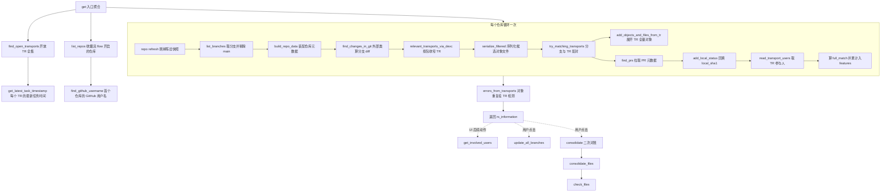
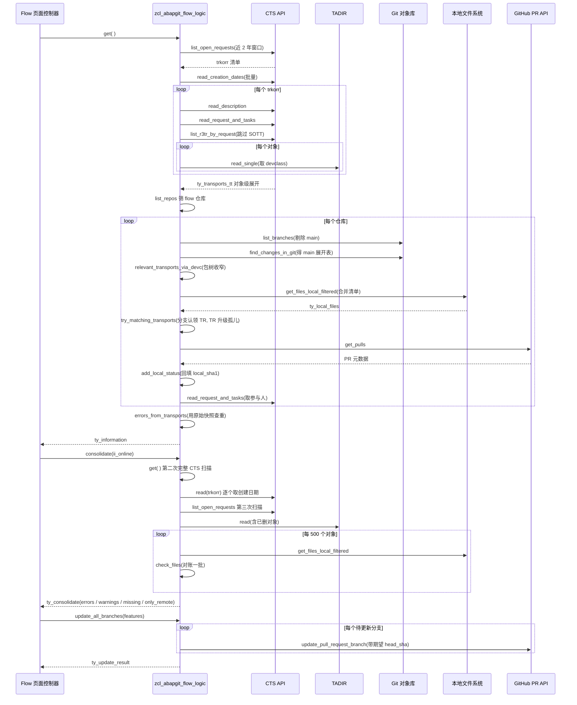

# ZCL_ABAPGIT_FLOW_LOGIC 程序分析报告

> **源文件**：`Test-source\real\abapGit__abapGit__zcl_abapgit_flow_logic.clas.abap`（1114 行，1 个 PUBLIC 类，19 个 CLASS-METHOD，无实例状态）
>
> **哈希核对**：任务声明的 sha256 为 `5766bd3e7c2c1f50f2e2b85ac40410443773e708d14b6087337a29a2628a6440`，实际文件 sha256 为 `5766bd3e7c2ce02f9b196709bbfaf6aef7b99e87669cdf1e6e2e4b7b8e7ce0cd`，两者在第 10 位（`1` vs `e`）分叉。本报告以磁盘上的实际文件内容为准。

---

## 一、程序定位与业务背景

**要解决的问题**：abapGit 在 GitHub 上跑的是"分支 → Pull Request → Squash merge"的 Git 协作流；而 SAP 系统要求所有开发变更必须挂在 CTS 传输请求（Transport Request）上，才能跨系统运输、留下审计轨迹。这两套体系天然冲突——Git 按文件和提交组织，CTS 按对象（`object` + `obj_name`）组织，两边之间**没有天然的映射关系**。

`ZCL_ABAPGIT_FLOW_LOGIC` 就是这个翻译层，是 abapGit Flow 页面背后唯一的业务逻辑类。它要在一次页面加载内回答四个问题：

1. 有哪些活跃分支？（Git 视角）
2. 有哪些开放传输请求？（CTS 视角）
3. 分支 ↔ 传输请求怎么配对？谁配不上？配不上的算不算错？
4. 本地磁盘上的源码，跟 Git、CTS 的状态对得上吗？

**现有方案为何不够**：abapGit 主线只处理"本地 ↔ 远程仓库"的文件 diff，完全不知道传输请求的存在。Flow 场景需要跨 **Git 对象库 / CTS API / TADIR / 本地文件系统** 四个数据源做三方对账，而且必须在单个请求周期内完成——不能要求用户手工去填"这个分支对应哪个 TR"，否则 Flow 就退化成了另一个手工工具。

**设计范式一句话定性**：这是一个**无状态静态门面 + 纯函数式管道**的编排类。全部 19 个方法都是 `CLASS-METHOD`、类里没有任何实例属性，数据只通过 `IMPORTING` / `RETURNING` / `CHANGING` 传递，最终把结果塞进一个 `ty_information` 聚合结构返回给 UI。

这个范式的好处是"没有全局状态"——`try_matching_transports` 用 `CHANGING ct_transports` 就地消费掉已匹配的 TR，`get` 因此不会因调用顺序产生副作用；代价是方法签名很重、参数最多 4 个、多个方法互相依赖 `CHANGING` 语义（见第五节 P1-3）。

---

## 二、程序执行流程总览

### 2.1 流程图



### 2.2 责任链表

| # | 子程序 | 调用者 | 职责 |
|---|--------|--------|------|
| 1 | `get` | Flow 页面控制器（外部调用） | 顶层编排入口，产出 Flow 页面全部数据 |
| 2 | `find_open_transports` | `get` / `consolidate_files` | 取"近两年内"的开放 TR，展开到对象级 |
| 3 | `get_latest_task_timestamp` | `find_open_transports` | 单个 TR 的最新任务时间戳 |
| 4 | `list_repos` | `get` | 筛出 flow 开关开启且要求记录 TR 的收藏仓库 |
| 5 | `find_github_username` | `get` | 解析 GitHub 用户名，走 EXIT 允许外部改写 |
| 6 | `build_repo_data` | `get` / `try_matching_transports` | 从仓库接口装配 `ty_feature-repo` |
| 7 | `relevant_transports_via_devc` | `get` | 用仓库包 + 子包把 TR 全集收窄到"与本仓库相关" |
| 8 | `serialize_filtered` | `get` | 按候选对象清单序列化本地文件，产出 `ty_local_files` |
| 9 | `try_matching_transports` | `get` | 核心配对：分支↔TR 双向匹配，配不上的 TR 升级为孤儿 feature |
| 10 | `add_objects_and_files_from_tr` | `try_matching_transports` | 把 TR 的全部对象展开成 changed_objects / changed_files |
| 11 | `find_prs` | `get` | 拉取 PR 元数据，`no-merge` 标签的分支直接删除 |
| 12 | `add_local_status` | `get` | 用本地文件回填 `local_sha1` |
| 13 | `read_transport_users` | `get` | 取 TR 参与人列表 |
| 14 | `errors_from_transports` | `get` | 检测"同一对象挂在多个 TR"并写入 errors |
| 15 | `get_involved_users` | Flow 页面控制器 | 把 features 里的参与人摊平去空 |
| 16 | `consolidate` | Flow 页面控制器 | 复用 `get` 结果做规则校验，产出错误与警告 |
| 17 | `consolidate_files` | `consolidate` | 本地↔远程文件三方对账 |
| 18 | `check_files` | `consolidate_files` | 单批次比对，识别"只在本地"的文件 |
| 19 | `update_all_branches` | Flow 页面控制器 | 批量调用 GitHub API 更新 PR 分支 |

下面按这条流程，逐个子程序展开。

---

## 三、分组分析

### 3.1 类定义段（声明区）

类头部把整个数据契约钉死在这里，值得先读一遍，因为后面所有方法都是围绕这几个结构在转。

```abap
CLASS zcl_abapgit_flow_logic DEFINITION PUBLIC.
  PUBLIC SECTION.
    CLASS-METHODS get
      RETURNING
        VALUE(rs_information) TYPE zif_abapgit_flow_logic=>ty_information
      RAISING
        zcx_abapgit_exception.

    CLASS-METHODS get_involved_users
      IMPORTING
        is_information  TYPE zif_abapgit_flow_logic=>ty_information
      RETURNING
        VALUE(rt_users) TYPE zif_abapgit_flow_logic=>ty_users_tt.

    CLASS-METHODS consolidate
      IMPORTING
        ii_online             TYPE REF TO zif_abapgit_repo_online
      RETURNING
        VALUE(rs_consolidate) TYPE zif_abapgit_flow_logic=>ty_consolidate
      RAISING
        zcx_abapgit_exception.

    TYPES ty_repos_tt TYPE STANDARD TABLE OF REF TO zif_abapgit_repo_online WITH DEFAULT KEY.

    CLASS-METHODS list_repos
      IMPORTING
        iv_favorites_only TYPE abap_bool DEFAULT abap_true
      RETURNING
        VALUE(rt_repos)   TYPE ty_repos_tt
      RAISING
        zcx_abapgit_exception.

    TYPES: BEGIN OF ty_update_result,
              updated TYPE i,
              errors  TYPE i,
              skipped TYPE i,
            END OF ty_update_result.

    CLASS-METHODS update_all_branches
      IMPORTING
        it_features      TYPE zif_abapgit_flow_logic=>ty_features
      RETURNING
        VALUE(rs_result) TYPE ty_update_result
      RAISING
        zcx_abapgit_exception.
```

**做什么** — 声明对外 5 个入口：`get` 产出一整个 `ty_information` 聚合结构（Flow 页面的全部数据），`consolidate` 产出校验结果，`get_involved_users` 从前者派生参与人列表，`list_repos` 单独暴露仓库筛选，`update_all_branches` 执行批量写操作。前三个是纯读，后一个是唯一的写路径。

**为什么** — 入口划分对应 Flow 页面的三次交互：加载（`get`）、点击 Consolidate（`consolidate`）、点击更新分支（`update_all_branches`），不是按"逻辑相似性"分组。`update_all_branches` 用独立返回结构 `ty_update_result`（updated/errors/skipped 三计数）而不是复用 `ty_information`，因为它的语义是"操作回执"而非"状态快照"，混用会让调用方无法区分。`list_repos` 之所以也公开，是因为它同时是 `get` 的内部依赖和 UI 层判断"有哪些仓库可勾选"的数据源——公开是复用而非泄漏。

**风险与改进** — 所有公开方法都声明 `RAISING zcx_abapgit_exception`，但 `update_all_branches` 内部对每个 PR 调用做了 `TRY/CATCH` 吞掉异常只计数，等于**对外声明会抛、实际永不抛**。这让调用方的异常处理形同虚设，也隐藏了失败明细。更一致的做法是：要么去掉 `RAISING`、要么抛出汇总异常。此外 `get_involved_users` 是唯一不声明 `RAISING` 的方法——它与 `get` 同属数据派生链路，异常契约不一致会让调用方困惑。

接下来看承载全部数据的私有类型：

```abap
    CONSTANTS c_max_missing_files TYPE i VALUE 1000.

    TYPES: BEGIN OF ty_transport,
              trkorr     TYPE trkorr,
              title      TYPE string,
              object     TYPE tadir-object,
              obj_name   TYPE tadir-obj_name,
              devclass   TYPE tadir-devclass,
              created_on TYPE d,
              changed_at TYPE timestamp,
            END OF ty_transport.

    TYPES ty_transports_tt TYPE STANDARD TABLE OF ty_transport WITH NON-UNIQUE KEY trkorr.

    TYPES ty_trkorr_tt TYPE STANDARD TABLE OF trkorr WITH DEFAULT KEY.
```

**做什么** — `ty_transport` 定义"一个 TR 展开到对象级后的一行"：请求号 + 标题 + TADIR 三元组（object / obj_name / devclass）+ 两个时间。`ty_transports_tt` 是它的内表，`ty_trkorr_tt` 是只装请求号的轻量表。`c_max_missing_files = 1000` 是给缺失文件列表兜底的展示上限。

**为什么** — 两个设计选择很值得注意。第一，用 `WITH NON-UNIQUE KEY trkorr` 而**不**用 `WITH KEY object obj_name`：因为一个 TR 里同一个对象可能出现多次，作者故意不声明唯一键来保留原始语义；代价是后面所有 `READ TABLE ... WITH KEY object/obj_name` 都只能退化为线性扫描（见 P2-4）。第二，`ty_transport` 直接复用 TADIR 的数据元素（`tadir-object`、`tadir-obj_name`、`tadir-devclass`），语义与 SAP 表保持一致，跨系统移植不需要改类型，也避免了自定义类型与 TADIR 之间的转换代码。第三，同时定义 `ty_trkorr_tt` 与 `ty_transports_tt` 两种粒度，说明作者清楚区分了"要查对象归属"和"只要请求号"两种需求。

**风险与改进** — `ty_transport` 缺少 `task` 字段（CTO/CTU 的任务号），只有请求号。这导致后续 `read_transport_users` 和 `get_latest_task_timestamp` 不得不**重新按 trkorr 回查 CTS API**，形成 N+1。若 `ty_transport` 在展开阶段就带上 task 号，两个方法都能改成纯内存计算。这是本类最大的结构性成本，且根因在类型定义而非循环写法。另外 `changed_at` 用 `timestamp` 而 `created_on` 用 `d`，粒度不一致：排序展示时两者无法直接比较，前端必须分别处理。

---

### 3.2 入口方法 `get`

Flow 页面一次加载的全部数据都由这里产出。整个方法分五步：取 TR 全集 → 选仓库 → 逐仓库对账 → 累计 features → 全局查重。

```abap
  METHOD get.

    DATA lt_branches TYPE zif_abapgit_git_definitions=>ty_git_branch_list_tt.
    DATA ls_branch LIKE LINE OF lt_branches.
    DATA ls_result LIKE LINE OF rs_information-features.
    DATA li_repo_online TYPE REF TO zif_abapgit_repo_online.
    DATA lt_features LIKE rs_information-features.
    DATA lt_all_transports TYPE ty_transports_tt.
    DATA lt_relevant_transports TYPE ty_trkorr_tt.
    DATA lt_repos TYPE ty_repos_tt.
    DATA lt_main_expanded TYPE zif_abapgit_git_definitions=>ty_expanded_tt.
    DATA lt_local TYPE zif_abapgit_flow_logic=>ty_local_files.
    DATA lt_real_transports LIKE lt_all_transports.

    FIELD-SYMBOLS <ls_feature> LIKE LINE OF lt_features.
    FIELD-SYMBOLS <ls_path_name> LIKE LINE OF <ls_feature>-changed_files.

    lt_all_transports = find_open_transports( ).
    lt_real_transports = lt_all_transports.

```

#### ① 先取 TR 全集，并保留一份原始副本

`find_open_transports` 返回的对象级展开表被赋给 `lt_all_transports`，紧接着 `lt_real_transports = lt_all_transports` 做了一次深拷贝。

```abap
    lt_all_transports = find_open_transports( ).
    lt_real_transports = lt_all_transports.
```

**做什么** — 从 CTS 拉一次开放 TR 全量（对象级展开），同时保留一份"未消费的原始快照"到 `lt_real_transports`。

**为什么** — 后面 `try_matching_transports` 是 `CHANGING ct_transports`，会边匹配边 `DELETE`，把已被某个分支认领的 TR 从表里抹掉。到方法末尾 `errors_from_transports` 做"同一对象挂在多个 TR"检测时，需要的恰恰是**匹配前的全量**——否则已经被删掉的行根本无法参与查重。作者显然意识到这个副作用，用一次内表拷贝隔离了状态。这是本类里最漂亮的一笔。

**风险与改进** — 拷贝本身没问题，但代价是 `lt_all_transports` 在仓库循环里**被跨仓库消费**：第一个仓库匹配的 TR 会从 `lt_all_transports` 删除，第二个仓库就再也匹配不到它了。这个语义在"一个对象只属于一个包"的前提下成立，但一旦存在跨包对象（比如被多个仓库共用的函数组），后到的仓库会静默丢匹配。建议在每个仓库循环开头 `lt_all_transports = lt_real_transports` 重置一次，把"跨仓库唯一认领"改成显式规则而非副作用。

#### ② 选仓库 + 刷快照

`list_repos` 默认只取收藏（`iv_favorites_only` 默认 `abap_true`），然后对每个仓库实例显式调用 `refresh`。

```abap
* list branches on favorite + flow enabled + transported repos
    lt_repos = list_repos( ).
    rs_information-enabled_repositories = lines( lt_repos ).
    rs_information-github_username = find_github_username( lt_repos ).

* Repository instances may contain stale snapshots when Flow is first opened
    LOOP AT lt_repos INTO li_repo_online.
      li_repo_online->zif_abapgit_repo~refresh( ).
    ENDLOOP.
```

**做什么** — 选出启用 flow 且要求记录 TR 的收藏仓库，对每个仓库实例调 `zif_abapgit_repo~refresh` 刷掉缓存快照，并顺带解析 GitHub 用户名。

**为什么** — 注释写得很清楚：`Repository instances may contain stale snapshots when Flow is first opened`。Flow 页面在会话里可能被缓存复用，第一次打开时仓库实例里可能是几个小时前拉的快照；不刷一次，用户看到的就是过期分支列表。这是一个**防御性刷新**，说明作者被生产问题咬过。

**风险与改进** — `refresh` 是对所有仓库无条件调用，而实际只需要刷"分支列表"这一部分。若仓库缓存的粒度做不到部分刷新，这 N 次网络往返在仓库较多时是纯浪费。另一个小问题：`find_github_username` 在 `refresh` **之前**调用，用户名解析与快照新鲜度无关没问题，但阅读顺序上会让人以为有依赖。

#### ③ 逐仓库对账主循环

```abap
    LOOP AT lt_repos INTO li_repo_online.

      lt_branches = zcl_abapgit_git_factory=>get_v2_porcelain( )->list_branches(
        iv_url    = li_repo_online->get_url( )
        iv_prefix = zif_abapgit_git_definitions=>c_git_branch-heads_prefix )->get_all( ).

      CLEAR lt_features.
      LOOP AT lt_branches INTO ls_branch WHERE display_name <> zif_abapgit_flow_logic=>c_main.
        ls_result-repo = build_repo_data( li_repo_online ).
        ls_result-branch-display_name = ls_branch-display_name.
        ls_result-branch-sha1 = ls_branch-sha1.
        INSERT ls_result INTO TABLE lt_features.
      ENDLOOP.

      zcl_abapgit_flow_git=>find_changes_in_git(
        EXPORTING
          iv_url           = li_repo_online->get_url( )
          io_dot           = li_repo_online->zif_abapgit_repo~get_dot_abapgit( )
          iv_package       = li_repo_online->zif_abapgit_repo~get_package( )
          it_branches      = lt_branches
        IMPORTING
          et_main_expanded = lt_main_expanded
        CHANGING
          ct_features      = lt_features ).

      lt_relevant_transports = relevant_transports_via_devc(
        ii_repo        = li_repo_online
        it_transports  = lt_all_transports ).

      lt_local = serialize_filtered(
        it_relevant_transports = lt_relevant_transports
        ii_repo                = li_repo_online
        it_features            = lt_features
        it_all_transports      = lt_all_transports ).

      try_matching_transports(
        EXPORTING
          ii_repo          = li_repo_online
          it_local         = lt_local
          it_main_expanded = lt_main_expanded
        CHANGING
          ct_transports    = lt_all_transports
          ct_features      = lt_features ).

      find_prs(
        EXPORTING
          iv_url      = li_repo_online->get_url( )
        CHANGING
          ct_features = lt_features ).

      add_local_status(
        EXPORTING
          it_local     = lt_local
        CHANGING
          ct_features = lt_features ).
```

**做什么** — 对每个仓库依次做：列出非 main 分支并建成 feature 骨架 → 调外部类 `zcl_abapgit_flow_git=>find_changes_in_git` 算出各分支相对 main 的文件 diff → 用包关系把 TR 全集收窄成本仓库相关子集 → 序列化候选本地文件 → 配对分支与 TR → 补 PR 元数据 → 回填本地 sha1。

**为什么** — 关键排序是 `serialize_filtered` 在 `try_matching_transports` **之前**。本地文件只序列化一次，但序列化清单由"相关 TR 里的对象"和"Git 分支里改动的对象"**两个来源合并去重**得到——先算 diff、再定清单、再匹配，避免了"匹配完再补序列化"的二次扫描。这也是全类唯一一个把"Git 视角"和"CTS 视角"合并成统一清单的地方，是整个方法的枢纽。

**风险与改进** — 三个隐患。其一，`lt_main_expanded` 声明在循环外并跨迭代复用，`find_changes_in_git` 以 `IMPORTING` 返回，若该外部类不做 `CLEAR` 而是追加，就会跨仓库串数据——本方法内没有显式清理，全靠被调方的契约。其二，`try_matching_transports` 的 `CHANGING ct_transports = lt_all_transports` 就是 ①里提到的跨仓库消费问题。其三，`<ls_feature>` / `<ls_path_name>` 两个字段符号声明为嵌套访问（`LIKE LINE OF <ls_feature>-changed_files`），依赖内表行类型，可读性差且容易在结构变更时静默失效。

#### ④ full_match 计算与参与人回填

```abap
      LOOP AT lt_features ASSIGNING <ls_feature>.
        <ls_feature>-full_match = abap_true.
        LOOP AT <ls_feature>-changed_files ASSIGNING <ls_path_name>.
          IF <ls_path_name>-remote_sha1 <> <ls_path_name>-local_sha1.
            <ls_feature>-full_match = abap_false.
          ENDIF.
        ENDLOOP.

        IF <ls_feature>-transport-trkorr IS NOT INITIAL.
          <ls_feature>-transport-users = read_transport_users( <ls_feature>-transport-trkorr ).
        ENDIF.
      ENDLOOP.

      INSERT LINES OF lt_features INTO TABLE rs_information-features.
    ENDLOOP.
```

**做什么** — 对每个 feature 逐文件比较 `remote_sha1` 与 `local_sha1`，只要有一个不等就置 `full_match = abap_false`；有 TR 的 feature 再调 `read_transport_users` 取参与人；最后把本仓库的 features 追加进总表。

**为什么** — `full_match` 是本类的核心语义开关，含义是"**分支内容已与 main 完全一致**"。用文件级 sha1 逐行比较而非整树 diff，是因为 `changed_files` 在前面的步骤已经被裁剪到"相关对象"，只在子集上比足够快。注意 `full_match` 初值给 `abap_true`、发现不等才翻转，这样**空 changed_files 的 feature 天然 full_match = true**——这正是 `consolidate` 里"传输请求空壳不报警"的实现基础。

**风险与改进** — 逻辑正确但语义有盲区：`add_objects_and_files_from_tr` 里那个"本地已删且远程也没有"的合成行，`remote_sha1` 和 `local_sha1` 都是初值空串，二者相等，**不会**把 `full_match` 打成 false。所以一个只包含"凭空删除对象"的 TR 会被判为"已完全匹配"，在 `consolidate` 里静默消失、不产生任何错误提示。建议对 local 与 remote 同时为空的行单独判定，而不是靠"相等"蒙混过关。

#### ⑤ 全局查重收尾

```abap
    errors_from_transports(
      EXPORTING
        it_all_transports  = lt_real_transports
      CHANGING
        cs_information     = rs_information ).

  ENDMETHOD.
```

**做什么** — 用①里保留的原始 TR 快照做一次全局"对象重复挂 TR"检测，结果写入 `rs_information-errors` 和 `transport_duplicates`。

**为什么** — 放在仓库循环之外，是因为重复检测是**跨仓库**的属性：同一个对象挂在两个不同包的 TR 里，无论哪个仓库都该报警。放在循环里会重复报、而且依赖仓库顺序。

**风险与改进** — 无明显风险，这一句位置选得很好。但注意它依赖 `rs_information-features` 已经填满（用来过滤"该对象是否属于收藏 flow 仓库"），而 features 是在循环里逐步 INSERT 的——所以 `errors_from_transports` **必须**在循环后执行，这个顺序约束只存在于调用约定里，没有任何断言保护。

---

### 3.3 `find_open_transports`

这是全类最重、也最该优化的方法：一次调用要遍历所有开放 TR，把每个 TR 展开到对象级。分两步：先按日期窗口取 TR 清单，再逐个展开到对象级。

```abap
  METHOD find_open_transports.

    DATA lt_trkorr    TYPE zif_abapgit_cts_api=>ty_trkorr_tt.
    DATA lv_trkorr    LIKE LINE OF lt_trkorr.
    DATA ls_result    LIKE LINE OF rt_transports.
    DATA lt_objects   TYPE zif_abapgit_cts_api=>ty_transport_obj_tt.
    DATA lv_obj_name  TYPE tadir-obj_name.
    DATA lt_date      TYPE zif_abapgit_cts_api=>ty_date_range.
    DATA ls_date      LIKE LINE OF lt_date.
    DATA lt_limu_skip TYPE zif_abapgit_cts_api=>ty_skip_limu_types_tt.
    DATA ls_limu_skip LIKE LINE OF lt_limu_skip.
    DATA lt_created_on TYPE zif_abapgit_cts_api=>ty_transport_creation_dates_tt.
    DATA ls_created_on LIKE LINE OF lt_created_on.
    FIELD-SYMBOLS <ls_object> LIKE LINE OF lt_objects.
```

#### ① 用日期范围取开放 TR 清单，再批量取创建日期

```abap
* only look for transports that are created/changed in the last two years
    ls_date-sign = 'I'.
    ls_date-option = 'GE'.
    ls_date-low = sy-datum - zif_abapgit_flow_logic=>c_open_transport_days.
    INSERT ls_date INTO TABLE lt_date.

    lt_trkorr = zcl_abapgit_factory=>get_cts_api( )->list_open_requests( lt_date ).
    lt_created_on = zcl_abapgit_factory=>get_cts_api( )->read_creation_dates( lt_trkorr ).
```

**做什么** — 构造一个"当前日期减去 `c_open_transport_days`"的单区间，调 `list_open_requests` 取 TR 号清单；紧接着对整批 TR 一次性调 `read_creation_dates` 取创建日期。

**为什么** — 这里体现了作者对 CTS API 成本的敏感度：`read_creation_dates` 是**批量**接口，作者主动把它提出来一次拉完，而不是在下面的循环里逐个查。这是全方法里唯一做对的地方。同时用两年窗口是为了把"僵尸 TR"排除在外——老系统里挂了三五年的开放 TR 会让 Flow 页面完全不可用。

**风险与改进** — 🔴 日期窗口到底过滤的是"创建日期"还是"最近修改日期"，是这里最大的正确性风险。从代码看，`list_open_requests( lt_date )` 传入日期区间，而创建日期是**另行**批量取的（`read_creation_dates`），这个拆分强烈暗示 `list_open_requests` 是按**创建日期**过滤的。如果确实如此，那么一个"创建于三年前、昨天刚改动过"的 TR 会被直接漏掉——它对应的分支永远匹配不到 TR，Flow 页面上就会静默地显示"分支没有传输请求"，而实际上 TR 是存在的、只是在窗口之外。注释写的是 `created/changed`，但代码只实现了 `created`。建议核实 `list_open_requests` 的过滤语义，若确实只按创建日期，应改为"按创建日期 OR 按最近任务时间"两段取数再合并。

#### ② 逐 TR 展开对象

```abap
    LOOP AT lt_trkorr INTO lv_trkorr.
      ls_result-trkorr = lv_trkorr.
      ls_result-title  = zcl_abapgit_factory=>get_cts_api( )->read_description( lv_trkorr ).
      READ TABLE lt_created_on INTO ls_created_on WITH TABLE KEY trkorr = lv_trkorr.
      IF sy-subrc = 0.
        ls_result-created_on = ls_created_on-created_on.
      ELSE.
        CLEAR ls_result-created_on.
      ENDIF.
      ls_result-changed_at = get_latest_task_timestamp( lv_trkorr ).

* LIMU skipped here:
" SOTT = Concept (Online Text Repository) - Short Texts for packages are not serialized anyhow
      CLEAR ls_limu_skip.
      ls_limu_skip-sign = 'I'.
      ls_limu_skip-option = 'EQ'.
      ls_limu_skip-low = 'SOTT'.
      INSERT ls_limu_skip INTO TABLE lt_limu_skip.
      lt_objects = zcl_abapgit_factory=>get_cts_api( )->list_r3tr_by_request(
        iv_request         = lv_trkorr
        it_skip_limu_types = lt_limu_skip ).

* R3TR can be skipped here
      LOOP AT lt_objects ASSIGNING <ls_object>
          WHERE object <> 'CINS'
          AND object <> 'NOTE'.
        ls_result-object   = <ls_object>-object.
        ls_result-obj_name = <ls_object>-obj_name.

        lv_obj_name = <ls_object>-obj_name.
        ls_result-devclass = zcl_abapgit_factory=>get_tadir( )->read_single(
          iv_object   = ls_result-object
          iv_obj_name = lv_obj_name )-devclass.
        IF ls_result-devclass IS NOT INITIAL.
          INSERT ls_result INTO TABLE rt_transports.
        ENDIF.
      ENDLOOP.

    ENDLOOP.
```

**做什么** — 对每个 TR：取标题、取创建日期、取最新任务时间戳；构造只跳过 `SOTT` 的 LIMU 白名单，调 `list_r3tr_by_request` 展开对象；展开结果里再剔除 `CINS` 和 `NOTE`，对剩下的每个对象回查 TADIR 取 `devclass`，只有 `devclass` 非空的才真正插入结果表。

**为什么** — 三层过滤各有道理：`SOTT`（包的在线文本）本身不序列化，留着只会污染匹配；`CINS`（类包含文件）单独排除是因为它会被宿主 `CLAS` 覆盖——一个类改动在 TR 里通常既有 CLAS 又有 CINS，留着 CINS 会让同一个分支重复匹配；`NOTE`（SAP Note）不是本系统代码对象。最后用 `devclass IS NOT INITIAL` 兜底，是排除掉那些 TADIR 里查不到的"幽灵对象"（比如已删除对象的残留条目）。这个"宁可漏、不可错"的取向是对的。

**风险与改进** — 这里是全类性能问题最集中的地方，量级是 **3N + ΣM 次独立 CTS/TADIR 往返**（N = TR 数，M = 每个 TR 的对象数）：
- `read_description` × N（逐个）
- `get_latest_task_timestamp` × N（逐个，内部又是 1 次 CTS 调用）
- `list_r3tr_by_request` × N（逐个，这个确实按请求粒度）
- `read_single` × ΣM（**逐个对象**回查 TADIR）

假设一个系统有 300 个开放 TR、平均 15 个对象，就是 900 + 4500 ≈ **5400 次独立数据库往返**。而 `find_open_transports` 在 `get` 和 `consolidate_files` 里**各调一次**，一次 Flow 页面加载就是过万次的开销。改进方向明确：`devclass` 完全可以改成用 `zif_abapgit_cts_api` 的批量接口（`read_request_and_tasks` 已经返回 `as4devclass`），把 ΣM 次压缩到 N 次；`read_description` 同理可批量。这一处优化能把 Flow 页面的加载时间从"明显卡顿"降到"秒开"级别。

另外 `* R3TR can be skipped here` 是一条**失效注释**——代码里并没有跳过 R3TR，只跳过了 CINS 和 NOTE。注释与实现不一致，后续维护者会误判过滤边界。

还有一个小问题：`lv_obj_name = <ls_object>-obj_name.` 这行是多余的拷贝（下一行直接用 `<ls_object>-obj_name` 就行），但更值得注意的是 `read_single` 返回的是内联结构，`-devclass` 直接链式取值——若 `read_single` 抛异常，整个方法直接中断，没有降级路径。

---

### 3.4 `get_latest_task_timestamp`

```abap
  METHOD get_latest_task_timestamp.

    DATA lt_tasks    TYPE zif_abapgit_cts_api=>ty_request_and_tasks_tt.
    DATA ls_task     LIKE LINE OF lt_tasks.
    DATA lv_max_date TYPE d.
    DATA lv_max_time TYPE t.

    TRY.
        lt_tasks = zcl_abapgit_factory=>get_cts_api( )->read_request_and_tasks( iv_trkorr ).

        LOOP AT lt_tasks INTO ls_task.
          IF ls_task-as4date > lv_max_date
              OR ( ls_task-as4date = lv_max_date AND ls_task-as4time > lv_max_time ).
            lv_max_date = ls_task-as4date.
            lv_max_time = ls_task-as4time.
          ENDIF.
        ENDLOOP.

        IF lv_max_date IS NOT INITIAL.
          CONVERT DATE lv_max_date TIME lv_max_time INTO TIME STAMP rv_changed_at TIME ZONE sy-zonlo.
        ELSE.
          GET TIME STAMP FIELD rv_changed_at.
        ENDIF.
      CATCH zcx_abapgit_exception.
        GET TIME STAMP FIELD rv_changed_at.
    ENDTRY.

  ENDMETHOD.
```

**做什么** — 取该 TR 下所有任务的 `as4date`/`as4time`，找出字典序最大的那个，用 `CONVERT DATE...TIME STAMP` 拼成时间戳返回。若一个任务都没有，或 CTS 调用抛异常，就退化为 `GET TIME STAMP`（即"当前时刻"）。

**为什么** — TR 本身的创建时间不能代表"活跃度"，真正决定"这个 TR 还在被用吗"的是它最后一条任务的修改时间。任务时间拆成日期+时间两个字段存储，所以需要 `OR ( 日期相等 AND 时间更大 )` 这种复合比较，而不是直接比时间戳——这段比较写得严谨，没有漏掉同日跨时的边界。

**风险与改进** — 两个问题。第一（语义）：`CONVERT ... TIME ZONE sy-zonlo` 用的是**当前操作者**的时区，而 `as4date`/`as4time` 是**录入该任务的用户**在其时区下写入的值。如果 TR 由不同时区的用户协作（这是 Flow 场景的常态），拼出来的时间戳会偏移数小时，直接影响"按最近改动排序"的正确性。正确做法是用任务的 `as4user` 查其时区再转换，或在存储层就统一用 UTC。第二（降级逻辑）：CTS 调用失败时返回"当前时刻"，会让一个**读不到的 TR 显得刚刚被改动过**，在按 `changed_at` 排序时浮到最前面——这等于把错误伪装成"最新"。降级应该返回初值空时间戳并单独标记状态，而不是伪造一个"新鲜"的时间。

---

### 3.5 `list_repos`

```abap
  METHOD list_repos.

    DATA lt_repos  TYPE zif_abapgit_repo_srv=>ty_repo_list.
    DATA li_repo   LIKE LINE OF lt_repos.
    DATA li_online TYPE REF TO zif_abapgit_repo_online.

    IF iv_favorites_only = abap_true.
      lt_repos = zcl_abapgit_repo_srv=>get_instance( )->list_favorites( abap_false ).
    ELSE.
      lt_repos = zcl_abapgit_repo_srv=>get_instance( )->list( abap_false ).
    ENDIF.

    LOOP AT lt_repos INTO li_repo.
      IF li_repo->get_local_settings( )-flow = abap_false.
        CONTINUE.
      ELSEIF zcl_abapgit_factory=>get_sap_package( li_repo->get_package( )
          )->are_changes_recorded_in_tr_req( ) = abap_false.
        CONTINUE.
      ENDIF.

      li_online ?= li_repo.
      INSERT li_online INTO TABLE rt_repos.
    ENDLOOP.
  ENDMETHOD.
```

**做什么** — 取收藏仓库（默认）或全部仓库，然后双重过滤：flow 开关必须开启，且该仓库所属包必须"要求变更记录在传输请求中"。通过过滤的仓库以 `zif_abapgit_repo_online` 接口类型插入结果。

**为什么** — 双重过滤是 Flow 场景的准入条件，缺一不可：flow 开关是用户显式声明"这个仓库走 PR 流"；`are_changes_recorded_in_tr_req` 是系统侧事实——如果包不要求 TR（比如 DEV 环境下常见的自由开发配置），CTS 里根本没有可用的 TR 数据，跑整个对账流程只会得到一堆假错误。第二个条件尤其重要，它避免了 Flow 页面在"未启用 TR 记录"的系统上被大量误导信息淹没。`li_online ?= li_repo` 用 `?=` 做了接口断言，是安全的类型收窄。

**风险与改进** — 两处。其一，`list_favorites( abap_false )` 传入的布尔参数含义不明（从上下文看应是"是否包含已删除"），硬编码字面量 `abap_false` 让调用点完全失去可读性，建议提为常量。其二，`iv_favorites_only` 这个参数在生产路径上**恒为 `abap_true`**（`get` 里调用时未传参），说明 `list_repos` 的"取全部仓库"分支目前是无调用方的死代码——保留它是合理的扩展点，但值得在方法文档里说明当前唯一入口。

---

### 3.6 `find_github_username`

```abap
  METHOD find_github_username.

    DATA li_repo_online TYPE REF TO zif_abapgit_repo_online.
    DATA li_exit        TYPE REF TO zif_abapgit_flow_exit.

    READ TABLE it_repos INTO li_repo_online INDEX 1.
    IF sy-subrc = 0.
      TRY.
          rv_username = zcl_abapgit_login_manager=>get_username( li_repo_online->get_url( ) ).
        CATCH zcx_abapgit_exception ##NO_HANDLER.
      ENDTRY.
    ENDIF.

    TRY.
        li_exit = zcl_abapgit_flow_exit=>get_instance( ).
        li_exit->change_github_username( CHANGING cv_username = rv_username ).
      CATCH zcx_abapgit_exception ##NO_HANDLER.
    ENDTRY.

  ENDMETHOD.
```

**做什么** — 取仓库列表的第一项，用它解析当前用户的 GitHub 用户名；然后把结果交给 flow EXIT，允许外部实现（自定义开发）改写字段值。

**为什么** — 用户名用来在 UI 上判断"这个 PR 是不是我开的"、以及做 PR 归属过滤。通过 EXIT 暴露改写点是本类的标准扩展手法（abapGit 一贯的做法：内部默认值 + BAdI/EXIT 覆盖），让二次开发不必改类。两处 `##NO_HANDLER` 显式声明"这里故意不处理"，是刻意的降级——用户名解析失败不应该阻断整个 Flow 页面。

**风险与改进** — `READ TABLE ... INDEX 1` 是这个方法最脆的地方：它假设"第一个仓库一定有可用的凭据"。但收藏顺序是用户任意拖拽的结果，第一个仓库完全可能是用户已删除 token 的私有仓库。此时 `get_username` 抛异常被吞掉，返回空用户名，而**后续仓库里明明有有效凭据**却根本没被尝试。正确做法是遍历到第一个成功为止。另外 EXIT 的改写在 `get_username` 失败后**仍然执行**（外层 `TRY` 与 `IF` 平级），这意味着外部实现可能在收到空值的情况下"纠正"它——这是合理的，但也说明 EXIT 的行为契约必须文档化，否则下游会误以为收到的一定是 API 返回值。

---

### 3.7 `build_repo_data`

```abap
  METHOD build_repo_data.
    rs_data-name = ii_repo->get_name( ).
    rs_data-key = ii_repo->get_key( ).
    rs_data-package = ii_repo->get_package( ).
  ENDMETHOD.
```

**做什么** — 从仓库接口取名称、持久化键、SAP 包名，装配成 `ty_feature-repo` 结构。

**为什么** — 三行样板方法，被 `get` 和 `try_matching_transports` 各调一次。单独提出来而不是内联，是为了让"仓库元数据"这个概念有一个统一的装配点，避免两处内联时字段漏填。

**风险与改进** — 无明显风险。唯一可议的是 `ii_repo` 声明为 `zif_abapgit_repo`（基接口）而非 `zif_abapgit_repo_online`，这使方法可以接受任意仓库类型——但调用方实际只传 online 类型，多出来的接口宽度目前没有收益，反而弱化了类型表达。

---

### 3.8 `relevant_transports_via_devc`

```abap
  METHOD relevant_transports_via_devc.

    DATA lt_packages TYPE zif_abapgit_sap_package=>ty_devclass_tt.
    DATA lv_found    TYPE abap_bool.
    DATA lt_trkorr   TYPE ty_transports_tt.

    FIELD-SYMBOLS <ls_trkorr>  LIKE LINE OF it_transports.
    FIELD-SYMBOLS <lv_package> LIKE LINE OF lt_packages.

    lt_trkorr = it_transports.
    SORT lt_trkorr BY trkorr.
    DELETE ADJACENT DUPLICATES FROM lt_trkorr COMPARING trkorr.

    lt_packages = zcl_abapgit_factory=>get_sap_package( ii_repo->get_package( ) )->list_subpackages( ).
    INSERT ii_repo->get_package( ) INTO TABLE lt_packages.

    LOOP AT lt_trkorr ASSIGNING <ls_trkorr>.
      lv_found = abap_false.

      LOOP AT lt_packages ASSIGNING <lv_package>.
        READ TABLE it_transports TRANSPORTING NO FIELDS WITH KEY trkorr = <ls_trkorr>-trkorr devclass = <lv_package>.
        IF sy-subrc = 0.
          lv_found = abap_true.
          EXIT.
        ENDIF.
      ENDLOOP.
      IF lv_found = abap_false.
        CONTINUE.
      ENDIF.

      IF lv_found = abap_true.
        INSERT <ls_trkorr>-trkorr INTO TABLE rt_transports.
      ENDIF.
    ENDLOOP.

  ENDMETHOD.
```

**做什么** — 先把传入的对象级 TR 表按 `trkorr` 去重得到 TR 号清单；取仓库包及其所有子包；然后对每个 TR 判断"它是否包含任何一个本子包内的对象"，是则纳入结果。

**为什么** — 这是一个"包树收窄"操作。TRS 里的 `devclass` 是对象**实际所在包**，而仓库绑定的是顶层包；用户可能把包 `ZDEV` 下的对象挂到子包 `ZDEV_UI` 里。所以要展开子包树再做交集，否则会漏掉大量合法 TR。取交集用 `devclass` 而不是对象名，是因为包是**结构化层级**，而对象名是扁平的——只有包关系能提供可靠的归属判断。

**风险与改进** — 三个。其一（性能）：`READ TABLE it_transports WITH KEY trkorr + devclass` 在 `ty_transports_tt`（`NON-UNIQUE KEY trkorr`）上是**线性扫描**，复杂度为 O(TR 数 × 包数)。若 TR 数 300、子包数 20，就是 6000 次线性扫描、每次扫几百行，纯内存但依然是明显浪费。应该先把 `it_transports` 排成 `trkorr+devclass` 有序表再 `BINARY SEARCH`。其二（实现冗余）：`lt_trkorr` 声明为 `ty_transports_tt`（完整结构表）只为按 trkorr 去重，而方法需要的只是 trkorr 号——用 `ty_trkorr_tt` 会更省内存，也和返回值类型一致。其三（风格）：`IF lv_found = abap_false: CONTINUE. ENDIF` 之后紧跟 `IF lv_found = abap_true:`，第二个判断在第一个已经过滤后恒为真，是冗余分支，可以直接 `INSERT`。

---

### 3.9 `serialize_filtered`

```abap
  METHOD serialize_filtered.

    DATA lv_trkorr         TYPE trkorr.
    DATA lt_filter         TYPE zif_abapgit_definitions=>ty_tadir_tt.
    DATA lo_filter         TYPE REF TO zcl_abapgit_object_filter_obj.
    DATA ls_feature        LIKE LINE OF it_features.
    DATA ls_changed_object LIKE LINE OF ls_feature-changed_objects.

    FIELD-SYMBOLS <ls_transport> LIKE LINE OF it_all_transports.
    FIELD-SYMBOLS <ls_filter> LIKE LINE OF lt_filter.

* from all relevant transports(matched via package)
    LOOP AT it_relevant_transports INTO lv_trkorr.
      LOOP AT it_all_transports ASSIGNING <ls_transport> WHERE trkorr = lv_trkorr.
        APPEND INITIAL LINE TO lt_filter ASSIGNING <ls_filter>.
        <ls_filter>-object = <ls_transport>-object.
        <ls_filter>-obj_name = <ls_transport>-obj_name.
      ENDLOOP.
    ENDLOOP.

* and from git
    LOOP AT it_features INTO ls_feature.
      LOOP AT ls_feature-changed_objects INTO ls_changed_object.
        APPEND INITIAL LINE TO lt_filter ASSIGNING <ls_filter>.
        <ls_filter>-object = ls_changed_object-obj_type.
        <ls_filter>-obj_name = ls_changed_object-obj_name.
      ENDLOOP.
    ENDLOOP.

    SORT lt_filter BY object obj_name.
    DELETE ADJACENT DUPLICATES FROM lt_filter COMPARING object obj_name.

    CREATE OBJECT lo_filter EXPORTING it_filter = lt_filter.
    rt_local = ii_repo->get_files_local_filtered( lo_filter ).

  ENDMETHOD.
```

**做什么** — 从两个来源合并出"待序列化对象清单"：（1）与本仓库相关的 TR 里的全部对象；（2）Git 分支里已经识别出的变更对象。合并去重后包成 filter 对象，调 `get_files_local_filtered` 一次性序列化。

**为什么** — 这是整个流程里**唯一**读取本地文件系统的方法，所以"清单精确度"直接决定 IO 量。两个来源合并的必要性在于：只从 TR 取会漏掉"分支上有但 TR 里没有"的文件（Git-only 变更）；只从 Git 取会漏掉"TR 里有但分支还没体现"的对象（这正是待匹配的候选）。取并集再交给一次过滤读取，把 N 次单对象序列化压成 1 次，是本类里第二个"批量化"的正确决策。

**风险与改进** — 其一，`LOOP AT it_all_transports WHERE trkorr = lv_trkorr` 对每个 trkorr 都做全表线性扫描，复杂度 O(TR 数 × 对象数)，同 3.8 的问题。其二，filter 表没有数量上限，若某个仓库同时命中大量 TR，一次性序列化清单可能非常大，`get_files_local_filtered` 内部若不分批则会长时间占用工作进程。其三，`lt_filter` 用 `SORT ... DELETE ADJACENT DUPLICATES COMPARING object obj_name` 去重，但如果两个来源给出同一对象的不同 `devclass`（本表结构里没有该字段），不影响去重——这里结构恰好只有两列，去重是完整的，没问题。

---

### 3.10 `try_matching_transports`

核心配对方法，处理两个方向：分支认领 TR，以及无分支的 TR 升级成孤儿 feature。分两步：先做正向匹配，再把剩余 TR 升级。

```abap
  METHOD try_matching_transports.

    DATA lt_trkorr       LIKE ct_transports.
    DATA ls_trkorr       LIKE LINE OF lt_trkorr.
    DATA ls_result       LIKE LINE OF ct_features.
    DATA lt_packages     TYPE zif_abapgit_sap_package=>ty_devclass_tt.
    DATA lv_package      LIKE LINE OF lt_packages.
    DATA lv_found        TYPE abap_bool.

    FIELD-SYMBOLS <ls_feature>   LIKE LINE OF ct_features.
    FIELD-SYMBOLS <ls_transport> LIKE LINE OF ct_transports.
    FIELD-SYMBOLS <ls_changed>   LIKE LINE OF <ls_feature>-changed_objects.
```

#### ① 分支认领 TR（正向匹配）

```abap
    SORT ct_transports BY object obj_name.

    LOOP AT ct_features ASSIGNING <ls_feature>.
      LOOP AT <ls_feature>-changed_objects ASSIGNING <ls_changed>.
        READ TABLE ct_transports ASSIGNING <ls_transport>
          WITH KEY object = <ls_changed>-obj_type obj_name = <ls_changed>-obj_name BINARY SEARCH.
        IF sy-subrc = 0.
          <ls_feature>-transport-trkorr = <ls_transport>-trkorr.
          <ls_feature>-transport-title = <ls_transport>-title.
          <ls_feature>-transport-created_on = <ls_transport>-created_on.
          <ls_feature>-transport-changed_at = <ls_transport>-changed_at.

          add_objects_and_files_from_tr(
            EXPORTING
              iv_trkorr        = <ls_transport>-trkorr
              it_local         = it_local
              it_main_expanded = it_main_expanded
              it_transports    = ct_transports
            CHANGING
              cs_feature       = <ls_feature> ).

          DELETE ct_transports WHERE trkorr = <ls_transport>-trkorr.
          EXIT.
        ENDIF.
      ENDLOOP.
    ENDLOOP.
```

**做什么** — 先把 TR 表按 `object`+`obj_name` 排序，然后对每个分支的每个变更对象做 `BINARY SEARCH`；命中后把 TR 的元数据写入 feature，调 `add_objects_and_files_from_tr` 展开整个 TR 的对象与文件，最后把该 TR 从候选表里删掉并退出分支循环。

**为什么** — 先 `SORT` 再 `BINARY SEARCH` 是本类里最规范的一处用法：`BINARY SEARCH` 依赖有序表，作者没有漏掉这个前提。匹配粒度是**对象级**（而非 TR 级）是正确的：一个 TR 可能含 30 个对象，分支只改了其中 1 个，用对象交集来判定归属比用"TR 是否被分支提到"精确得多。匹配成功后立即 `DELETE`，把已认领 TR 从候选池移除，避免两个分支认领同一个 TR——这是"TR 与分支一对一"约束的实现手段。

**风险与改进** — 🔴 最大的问题是**歧义消解是任意的**：如果同一个对象挂在两个不同 TR 里（3.15 节 `errors_from_transports` 专门检测这种状况），`BINARY SEARCH` 只会返回排序后的**第一行**。而 `SORT ct_transports BY object obj_name` 没有稳定性保证，所以"哪个 TR 胜出"取决于运行时排序细节，是**不可预测**的。后果是：Flow 页面把分支关联到了一个用户可能根本没用过的 TR，且 `errors_from_transports` 报出的重复信息此时已经无法回溯是哪个 TR 被选中。建议在选择阶段显式按 `changed_at` 降序取最新 TR，让歧义消解规则可见、可预期。

另一个细节：`DELETE ct_transports WHERE trkorr = ...` 会在 `LOOP AT ct_features` 外层循环期间修改内表 `ct_transports`——这里 `ct_features` 和 `ct_transports` 是两张不同的表，所以是安全的；但如果以后有人把内层循环改成遍历 `ct_transports`，就会踩"边遍历边删"的坑。这个脆弱点值得一条注释。

#### ② 无分支的 TR 升级为孤儿 feature

```abap
* unmatched transports
    lt_trkorr = ct_transports.
    SORT lt_trkorr BY trkorr.
    DELETE ADJACENT DUPLICATES FROM lt_trkorr COMPARING trkorr.

    lt_packages = zcl_abapgit_factory=>get_sap_package( ii_repo->get_package( ) )->list_subpackages( ).
    INSERT ii_repo->get_package( ) INTO TABLE lt_packages.

    LOOP AT lt_trkorr INTO ls_trkorr.
      lv_found = abap_false.
      LOOP AT lt_packages INTO lv_package.
        READ TABLE ct_transports ASSIGNING <ls_transport> WITH KEY trkorr = ls_trkorr-trkorr devclass = lv_package.
        IF sy-subrc = 0.
          lv_found = abap_true.
          EXIT.
        ENDIF.
      ENDLOOP.
      IF lv_found = abap_false.
        CONTINUE.
      ENDIF.

      CLEAR ls_result.
      ls_result-repo = build_repo_data( ii_repo ).
      ls_result-transport-trkorr = <ls_transport>-trkorr.
      ls_result-transport-title = <ls_transport>-title.
      ls_result-transport-created_on = <ls_transport>-created_on.
      ls_result-transport-changed_at = <ls_transport>-changed_at.

      add_objects_and_files_from_tr(
        EXPORTING
          iv_trkorr        = ls_trkorr-trkorr
          it_local         = it_local
          it_main_expanded = it_main_expanded
          it_transports    = ct_transports
        CHANGING
          cs_feature       = ls_result ).

      INSERT ls_result INTO TABLE ct_features.
    ENDLOOP.

  ENDMETHOD.
```

**做什么** — 从剩余（未被任何分支认领）的 TR 里去重得到 TR 号清单，再按"该 TR 是否包含本仓库包树内的对象"过滤；通过的 TR 被装配成一个**没有分支名**的新 feature，插入 `ct_features`。

**为什么** — 这是 Flow 页面的另一半信息："有哪些传输请求还没人开分支"。用 `branch-display_name IS INITIAL` 来区分"有分支的 feature"和"孤儿 TR feature"，是数据模型的巧妙之处——不需要额外标志位，空值即语义。这个 feature 会在 `consolidate` 里被报成"Transport has no branch"，引导用户去开分支。用包树过滤而不是对象过滤，是为了让"这个仓库该管哪些 TR"的判断与 3.8 保持一致。

**风险与改进** — `<ls_transport>` 字段符号的生命周期问题：它是在**内层 `LOOP AT lt_packages`** 里通过 `READ TABLE ... ASSIGNING` 赋值的，`EXIT` 之后字段符号仍然有效，随后在循环外被读取 `ls_result-transport-title = <ls_transport>-title.`。这在当前实现下成立（`EXIT` 保证赋值成功才跳出），但**极其脆弱**——如果有人把 `IF lv_found = abap_false: CONTINUE` 那段删掉，`<ls_transport>` 就可能指向上一次迭代残留的行，导致孤儿 feature 被填入错误的 TR 元数据，而且不会报错、不会中断，只会静默显示错的信息。建议改为在循环内直接取所需字段到工作区变量，不要跨循环依赖字段符号。

另外 `SORT lt_trkorr BY trkorr` + `DELETE ADJACENT DUPLICATES` 之后，`READ TABLE ct_transports WITH KEY trkorr + devclass` 仍是线性扫描，同 3.8 的问题；且这段包树过滤逻辑与 `relevant_transports_via_devc` **几乎完全重复**（同样的 `list_subpackages` + 同样的双层循环 + 同样的 trkorr+devclass 读取），应当提取为一个共用私有方法，避免两处独立演化。

---

### 3.11 `add_objects_and_files_from_tr`

本类最长的方法（84 行），负责把 TR 里一个对象展开成 `changed_objects` 和 `changed_files` 记录。这是"删除场景"复杂度的全部来源。分三步：遍历 TR 对象并在本地查找、本地存在时登记 sha1、本地不存在时按删除处理。

```abap
  METHOD add_objects_and_files_from_tr.

    DATA ls_changed      LIKE LINE OF cs_feature-changed_objects.
    DATA ls_changed_file LIKE LINE OF cs_feature-changed_files.
    DATA ls_item         TYPE zif_abapgit_definitions=>ty_item.
    DATA lv_filename     TYPE string.
    DATA lv_extension    TYPE string.
    DATA lv_main_file    TYPE string.

    FIELD-SYMBOLS <ls_transport>     LIKE LINE OF it_transports.
    FIELD-SYMBOLS <ls_local>         LIKE LINE OF it_local.
    FIELD-SYMBOLS <ls_main_expanded> LIKE LINE OF it_main_expanded.
```

#### ① 遍历 TR 的对象，先在本地文件中找

```abap
    LOOP AT it_transports ASSIGNING <ls_transport> WHERE trkorr = iv_trkorr.
      ls_changed-obj_type = <ls_transport>-object.
      ls_changed-obj_name = <ls_transport>-obj_name.
      INSERT ls_changed INTO TABLE cs_feature-changed_objects.

      LOOP AT it_local ASSIGNING <ls_local>
          WHERE file-filename <> zif_abapgit_definitions=>c_dot_abapgit
          AND item-obj_type = <ls_transport>-object
          AND item-obj_name = <ls_transport>-obj_name.
```

**做什么** — 按 trkorr 过滤出该 TR 的所有对象行；每个对象先插入 `changed_objects`；然后在本仓库已序列化的本地文件里，按 `obj_type`+`obj_name` 且排除 `.abapgit` 元文件查找对应文件。

**为什么** — 用 `LOOP ... WHERE` 而不是 `READ TABLE ... INDEX`，是因为一个对象在本地可能对应**多个文件**（如主程序 + 包含文件 + 附加文件），必须把全部命中行都取出来。排除 `c_dot_abapgit` 是必要的——仓库根目录下的 `.abapgit` 元文件不携带对象信息，留着会误匹配。

**风险与改进** — `LOOP AT it_local WHERE ...` 用的是隐式过滤（线性扫描），而不是 `READ TABLE ... ASSIGNING ... TABLE KEY`。`it_local` 在整个流程里会反复被这样按对象查，规模较大时应先排序建索引。更实质的问题是 `IF sy-subrc <> 0` 放在循环**外**用来判断"是否找到"——这依赖 ABAP 的语义（循环无命中时 `sy-subrc <> 0`），是正确但**极易被误读**的写法，读者很容易以为 `sy-subrc` 是内层某条 `READ TABLE` 的残留。建议改为 `DATA lv_found` 标志位或 `READ TABLE ... TRANSPORTING NO FIELDS`。

#### ② 本地存在：登记本地与远程 sha1

```abap
        CLEAR ls_changed_file.
        ls_changed_file-path       = <ls_local>-file-path.
        ls_changed_file-filename   = <ls_local>-file-filename.
        ls_changed_file-local_sha1 = <ls_local>-file-sha1.

        READ TABLE it_main_expanded ASSIGNING <ls_main_expanded>
          WITH TABLE KEY path_name COMPONENTS
          path = ls_changed_file-path
          name = ls_changed_file-filename.
        IF sy-subrc = 0.
          ls_changed_file-remote_sha1 = <ls_main_expanded>-sha1.
        ENDIF.

        INSERT ls_changed_file INTO TABLE cs_feature-changed_files.
      ENDLOOP.
```

**做什么** — 对每个本地命中的文件，登记 path/filename/local_sha1；然后在 main 分支的展开文件表里按 `path`+`name` 复合表键查同路径同名文件，命中则填 `remote_sha1`，最后插入 `changed_files`。

**为什么** — 用复合 `TABLE KEY path_name` 而不是先按 name 查，是因为 Git 树里同名文件在不同包目录下会重复出现（比如每个包下都有一个 `package.devc` 或类似文件），单键会取错行。远程 sha1 取自 main 而非当前分支——这是刻意的：Flow 关心的是"本地相对 **main** 的差异"，而 main 才是合并基准。

**风险与改进** — 依赖 `it_main_expanded` 声明了名为 `path_name` 的复合表键；若上游 `find_changes_in_git` 改动了表类型定义，这里的 `WITH TABLE KEY path_name` 会直接语法报错，属于**编译期可暴露**的耦合，风险可接受。真正的隐患是"远程文件不存在"时 `remote_sha1` 保持初值空串，而后面的 `full_match` 判断用 `remote_sha1 <> local_sha1`——本地有内容、远程为空，会被正确判为不一致，这部分没问题。

#### ③ 本地不存在：判定为删除，尝试在 Git 里找残留

```abap
      IF sy-subrc <> 0.
* then its a deletion
        CLEAR ls_item.
        ls_item-obj_type = <ls_transport>-object.
        ls_item-obj_name = <ls_transport>-obj_name.

        IF zcl_abapgit_aff_factory=>get_registry( )->is_supported_object_type( <ls_transport>-object ) = abap_true.
          lv_extension = 'json'.
        ELSE.
          lv_extension = 'xml'.
        ENDIF.

        lv_main_file = zcl_abapgit_filename_logic=>object_to_file(
          is_item = ls_item
          iv_ext  = lv_extension ).
        CONCATENATE '.' lv_extension INTO lv_extension.
        lv_filename = lv_main_file.
        REPLACE FIRST OCCURRENCE OF lv_extension IN lv_filename WITH '*'.

        IF lv_filename = 'package.devc*'.
* this might leave deleted packages in git, but its okay for now
          CONTINUE.
        ENDIF.

        LOOP AT it_main_expanded ASSIGNING <ls_main_expanded>
            WHERE name CP lv_filename.
          CLEAR ls_changed_file.
          ls_changed_file-filename    = <ls_main_expanded>-name.
          ls_changed_file-path        = <ls_main_expanded>-path.
          ls_changed_file-remote_sha1 = <ls_main_expanded>-sha1.
          INSERT ls_changed_file INTO TABLE cs_feature-changed_files.
        ENDLOOP.
        IF sy-subrc <> 0.
          CLEAR ls_changed_file.
          ls_changed_file-filename    = lv_main_file.
          ls_changed_file-path        = '/src/'. " todo?
* after its deleted locally and remote then remote and local sha1 will match(be empty)
          INSERT ls_changed_file INTO TABLE cs_feature-changed_files.
        ENDIF.

      ENDIF.

    ENDLOOP.

  ENDMETHOD.
```

**做什么** — 本地查不到该对象时，判定为"本地已删除"。先判断对象类型是否被 AFF（附加文件功能）支持来决定扩展名是 `json` 还是 `xml`；用 `object_to_file` 算出主文件名，把扩展名替换成通配符 `*` 得到匹配模式；若模式是 `package.devc*` 则直接跳过；否则在 main 展开表里用 `CP`（模式匹配）找同名文件并登记其远程 sha1；如果 Git 里也没有，就插入一行 path 硬编码为 `/src/`、两个 sha1 都为空的合成记录。

**为什么** — 这是本方法最需要解释的部分。删除场景的难点在于：**Git 只知道文件名，不知道对象名**。要判断"这个对象被删了"，必须先从对象名反推出文件名模式再回查 Git。`REPLACE ... WITH '*'` 把精确文件名变成前缀模式，是为了兼容"主文件 + 附加文件"（如 `zfoo.prog.json` 与 `zfoo.prog.add1.xml` 之类）。`package.devc*` 特判是因为包的 devc 文件删除后**留在 Git 里也无害**，而继续处理它会导致后续逻辑把已删包重新生成出来——注释坦承"okay for now"，是一种务实取舍。最后插入合成行的用意（注释写得很清楚）是让"本地已删且远程也没有"的状态能被显式表示，而不是让该对象静默消失。

**风险与改进** — 这是全类缺陷密度最高的段落：

1. 🔴 `ls_changed` 在①里 `INSERT` 后**没有 `CLEAR`**，导致②的循环体每次迭代都复用上一次的对象内容。当前代码恰好是"插入后立即覆盖全部字段"，所以没暴露；但 `changed_objects` 里如果存在同 TR 重复对象，会产生脏数据。对比②③里 `ls_changed_file` 都有 `CLEAR`，说明这里是遗漏。
2. 🔴 硬编码字面量 `'package.devc*'`：既没有提为常量，也没做小写归一化。`object_to_file` 的返回值大小写若与字面量不一致，特判会静默失效，已删包会残留在 Git 里。应提取为 `CONSTANTS c_pkg_devc_pattern`。
3. 🔴 `ls_changed_file-path = '/src/'. " todo?` — 硬编码路径 + 带问号注释。这是**已知未完成**的代码。若某类对象实际序列化在别的路径下（abapGit 支持自定义目录结构），这行会产生错误的路径信息，UI 上会显示错误的文件位置。合成行的两个 sha1 都为空，还会让 `full_match` 误判为真（见 3.2 节④），使"只有删除操作"的 TR 在 `consolidate` 里完全不被提示。
4. 🟡 `lv_filename = 'package.devc*'` 的比较用了精确等于，而 `lv_filename` 是由 `to_lower` 语义的 `object_to_file` 产生的——两处的大小写约定必须一致，属于隐式契约。
5. 🟡 `LOOP AT it_main_expanded WHERE name CP lv_filename` 是模式匹配的全表线性扫描，在 main 展开表较大时开销可观；且匹配范围只限文件名、不限路径，理论上可能跨包误匹配同名文件（例如两个包各有一个同名对象文件），会把错误路径的文件登记进来。建议匹配时同时限定 path。

---

### 3.12 `find_prs`

```abap
  METHOD find_prs.

    DATA lt_pulls TYPE zif_abapgit_pr_enum_provider=>ty_pull_requests.
    DATA ls_pull LIKE LINE OF lt_pulls.
    DATA lv_index TYPE i.

    FIELD-SYMBOLS <ls_branch> LIKE LINE OF ct_features.


    IF lines( ct_features ) = 0.
      " only main branch
      RETURN.
    ENDIF.

    lt_pulls = zcl_abapgit_pr_enumerator=>new( iv_url )->get_pulls( ).

    LOOP AT ct_features ASSIGNING <ls_branch>.
      lv_index = sy-tabix.

      READ TABLE lt_pulls INTO ls_pull WITH KEY head_branch = <ls_branch>-branch-display_name.
      IF sy-subrc <> 0.
        CONTINUE.
      ENDIF.

      READ TABLE ls_pull-labels WITH KEY table_line = 'no-merge' TRANSPORTING NO FIELDS.
      IF sy-subrc = 0.
        DELETE ct_features INDEX lv_index.
        CONTINUE.
      ENDIF.

      <ls_branch>-pr-title_raw = ls_pull-title.

      " remove markdown formatting,
      REPLACE ALL OCCURRENCES OF '`' IN ls_pull-title WITH ''.

      <ls_branch>-pr-title = |{ ls_pull-title } #{ ls_pull-number }|.
      <ls_branch>-pr-url = ls_pull-html_url.
      <ls_branch>-pr-number = ls_pull-number.
      <ls_branch>-pr-draft = ls_pull-draft.
      <ls_branch>-pr-author = ls_pull-user.
    ENDLOOP.

  ENDMETHOD.
```

**做什么** — 若无分支则提前返回；调 PR 枚举器取该仓库全部 open PR；对每个分支按 `head_branch` 找对应 PR；带 `no-merge` 标签的 PR 对应分支**直接从 features 里删除**；其余填 PR 标题、URL、编号、草稿状态、作者。标题里去掉 markdown 反引号，并保留一份 `pr-title_raw`。

**为什么** — 三个亮点。第一，`lv_index = sy-tabix` 在循环顶部**先取值再在后面 `DELETE ct_features INDEX lv_index`**——这是一个正确的、容易被写错的模式：`DELETE` 后 `sy-tabix` 会重置为 0，如果直接用 `sy-tabix` 就会误删第一行。作者显然踩过这个坑。第二，`no-merge` 标签用"删除分支"而不是"置标志位"来表达，让下游所有逻辑都不需要处理"带 no-merge 的分支"这个特殊态，把复杂度压在源头，是很干净的做法。第三，同时保留 `pr-title_raw` 和清洗后的 `pr-title`，说明作者知道清洗是有损的，给调试留了后门。

**风险与改进** — `READ TABLE lt_pulls WITH KEY head_branch` 假定 `head_branch` 在 PR 列表里**唯一**。实际上 GitHub 允许同一分支开多个 PR（一个 open 一个 closed 不会同时出现，但同一个分支在不同 base 之间可以并存多个 open PR）。此时只会取到第一个，其余 PR 的信息（尤其是 `pr-url`）会被静默丢弃。另外 `REPLACE ALL OCCURRENCES OF '`' IN ls_pull-title` 只处理反引号，不处理其他 markdown（如 `[link](url)`、`*bold*`），标题里若有这些仍会显示为原始 markdown——既然要清洗，就应该一次清干净，或者干脆不清洗而由前端处理。

---

### 3.13 `add_local_status`

```abap
  METHOD add_local_status.

    FIELD-SYMBOLS <ls_branch>       LIKE LINE OF ct_features.
    FIELD-SYMBOLS <ls_local>        LIKE LINE OF it_local.
    FIELD-SYMBOLS <ls_changed_file> TYPE zif_abapgit_flow_logic=>ty_path_name.


    LOOP AT ct_features ASSIGNING <ls_branch>.
      LOOP AT <ls_branch>-changed_files ASSIGNING <ls_changed_file>.
        READ TABLE it_local ASSIGNING <ls_local>
          WITH KEY file-filename = <ls_changed_file>-filename
          file-path = <ls_changed_file>-path.
        IF sy-subrc = 0.
          <ls_changed_file>-local_sha1 = <ls_local>-file-sha1.
        ENDIF.
      ENDLOOP.
    ENDLOOP.

  ENDMETHOD.
```

**做什么** — 双层遍历所有 feature 的所有 changed_files，用 `filename` + `path` 复合键在本地文件表里查，命中则回填 `local_sha1`。

**为什么** — 把"回填本地 sha1"单独做成一步、而不是在 3.11 里就地完成，是因为**不是所有 changed_files 都来自 TR**：Git 侧识别出的文件（3.9 的来源 2）在 3.11 里根本不会被登记，它们需要在独立步骤里补上本地 sha1。分层是必要的。

**风险与改进** — `READ TABLE it_local WITH KEY file-filename ... file-path` 是**嵌套组件键读取**，等价于线性扫描（`it_local` 没有该复合索引），复杂度 O(features × files × local)。更关键的是与 3.19 的 `check_files` 形成**不对称**：`check_files` 只用 `name` 单键查 `ct_main_expanded`（会误匹配同名不同路径文件），而这里用的是正确的双键。同一套数据在两个方法里查询精度不一致，说明至少有一处是错的——按正确性推断，`check_files` 那一处缺了 path 条件。

---

### 3.14 `read_transport_users`

```abap
  METHOD read_transport_users.

    DATA lt_tasks TYPE zif_abapgit_cts_api=>ty_request_and_tasks_tt.
    DATA ls_task  LIKE LINE OF lt_tasks.

    lt_tasks = zcl_abapgit_factory=>get_cts_api( )->read_request_and_tasks( iv_trkorr ).
    LOOP AT lt_tasks INTO ls_task.
      INSERT ls_task-as4user INTO TABLE rt_users.
    ENDLOOP.

  ENDMETHOD.
```

**做什么** — 取该 TR 的请求与任务列表，把每个任务的 `as4user` 插入用户表返回。

**为什么** — `as4user` 是任务的"负责人"字段，能反映"谁在这个 TR 里干过活"。用任务级而非请求级，是因为一个 TR 常有多条任务、由多人提交——只取请求负责人会漏人。这个选择比"只读 TR 的 `as4user`"更准确。

**风险与改进** — 两点。其一，**无去重**：同一用户开了 3 条任务就会出现 3 次，`get_involved_users`（3.16）也没有 `DELETE ADJACENT DUPLICATES`，最终用户在页面上重复出现。其二（性能），该方法对**每个**有 TR 的 feature 独立调一次 `read_request_and_tasks`，与 3.3 ②的 `get_latest_task_timestamp` 调的是**同一个接口、传同一个 trkorr**。两处调用完全可以合并为一次取数、共用结果，现在等于把整批 CTS 往返做了一遍。这是明显的 N+1 重复劳动。

---

### 3.15 `errors_from_transports`

```abap
  METHOD errors_from_transports.

    DATA lv_message    TYPE string.
    DATA lt_transports LIKE it_all_transports.
    DATA lv_index      TYPE i.
    DATA ls_next       LIKE LINE OF lt_transports.
    DATA ls_transport  LIKE LINE OF lt_transports.
    DATA ls_duplicate  LIKE LINE OF cs_information-transport_duplicates.
    DATA lv_found1     TYPE abap_bool.
    DATA lv_found2     TYPE abap_bool.

    lt_transports = it_all_transports.
    SORT lt_transports BY object obj_name trkorr.

    LOOP AT lt_transports INTO ls_transport.
      lv_index = sy-tabix + 1.
      READ TABLE lt_transports INTO ls_next INDEX lv_index.
      IF sy-subrc <> 0.
        CONTINUE.
      ENDIF.

      IF ls_next-object = ls_transport-object
          AND ls_next-trkorr <> ls_transport-trkorr
          AND ls_next-obj_name = ls_transport-obj_name.

        READ TABLE cs_information-features WITH KEY transport-trkorr = ls_transport-trkorr TRANSPORTING NO FIELDS.
        lv_found1 = boolc( sy-subrc = 0 ).
        READ TABLE cs_information-features WITH KEY transport-trkorr = ls_next-trkorr TRANSPORTING NO FIELDS.
        lv_found2 = boolc( sy-subrc = 0 ).
        IF lv_found1 = abap_false AND lv_found2 = abap_false.
          " not in any favorite flow enabled repo
          CONTINUE.
        ENDIF.

        lv_message = |Object <tt>{ ls_transport-object }</tt> <tt>{ ls_transport-obj_name
          }</tt> is in multiple transports: <tt>{ ls_transport-trkorr }</tt> and <tt>{ ls_next-trkorr }</tt>|.
        INSERT lv_message INTO TABLE cs_information-errors.

        CLEAR ls_duplicate.
        ls_duplicate-obj_type = ls_transport-object.
        ls_duplicate-obj_name = ls_transport-obj_name.
        INSERT ls_duplicate INTO TABLE cs_information-transport_duplicates.
      ENDIF.
    ENDLOOP.

  ENDMETHOD.
```

**做什么** — 把传入的 TR 表按 `object`+`obj_name`+`trkorr` 排序后线性扫描，比较相邻两行：若对象与名相同但 trkorr 不同，说明同一对象挂在多个 TR 上；再用"这两个 TR 是否至少有一个属于当前收藏 flow 仓库的 features"过滤，只对本仓库相关的重复报警；最后生成错误消息和重复对象清单。

**为什么** — 排序后比较相邻行（adjacent pair）是检测重复集合的经典 O(n log n) 做法，比"两层循环两两比较"的 O(n²) 高明得多。过滤条件 `lv_found1 OR lv_found2` 很关键：一个对象被两个包的两个 TR 分别挂着，对**任一**仓库来说都是需要处理的冲突，只要命中一个就报。用 `boolc( sy-subrc = 0 )` 而不是 `IF sy-subrc` 是 abapGit 的惯用风格，可读性更好。

**风险与改进** — 三点。其一，相邻比较对"同一对象挂在 **3 个及以上** TR"的情况会**重复报警**：行 1-2 报一次、行 2-3 再报一次，`transport_duplicates` 里也会出现重复行。应该在结尾加一次 `DELETE ADJACENT DUPLICATES FROM cs_information-transport_duplicates`。其二，`READ TABLE lt_transports INTO ls_next INDEX lv_index` 用绝对行号读取，当 `lv_index` 超出行数时 `sy-subrc <> 0` 走到 `CONTINUE`，这是正确的边界处理。其三，错误消息里用了 `<tt>` HTML 标签，而 3.12 的 PR 标题却是主动剥离 markdown 反引号——**同一个 UI 通道里混用 HTML 和 markdown 两套标记约定**，说明渲染约定没有在类层面统一，容易在某个前端改动后失效。

---

### 3.16 `get_involved_users`

```abap
  METHOD get_involved_users.

    FIELD-SYMBOLS <ls_feature> LIKE LINE OF is_information-features.

    DATA lv_user TYPE syuname.

    LOOP AT is_information-features ASSIGNING <ls_feature>.
      LOOP AT <ls_feature>-transport-users INTO lv_user.
        INSERT lv_user INTO TABLE rt_users.
      ENDLOOP.
    ENDLOOP.

    DELETE rt_users WHERE table_line IS INITIAL.

  ENDMETHOD.
```

**做什么** — 遍历所有 feature 的 `transport-users`，摊平成一个用户列表，最后删除空值行。

**为什么** — 独立成一个公开方法，是为了让 UI 层能单独拿到"参与人全集"用于过滤或搜索，而不必每次自己遍历 features。

**风险与改进** — 只做 `DELETE ... WHERE table_line IS INITIAL`，**没有去重**。结合 3.14 本身也不去重，同一个用户在页面上会出现多次。应该在最后加 `DELETE ADJACENT DUPLICATES FROM rt_users`（需要先 `SORT rt_users`）。此外 `is_information` 是 `IMPORTING` 传值，方法只读不写，签名正确。

---

### 3.17 `consolidate`

"Consolidate" 是 Flow 页面的主动作：把当前状态合并/校验，产出错误与警告。它**复用 `get` 的结果**而不是重算。

#### ① 复用 get 结果做规则校验

```abap
  METHOD consolidate.

    DATA lt_features  TYPE zif_abapgit_flow_logic=>ty_features.
    DATA ls_feature   LIKE LINE OF lt_features.
    DATA lv_string    TYPE string.
    DATA li_repo      TYPE REF TO zif_abapgit_repo.
    DATA ls_transport TYPE zif_abapgit_cts_api=>ty_transport_data.


* todo: handling multiple repositories

    li_repo ?= ii_online.
    lt_features = get( )-features.

    LOOP AT lt_features INTO ls_feature WHERE repo-key = li_repo->get_key( ).
      " IF ls_feature-branch-display_name IS NOT INITIAL
      "     AND ls_feature-branch-up_to_date = abap_false.
      "   lv_string = |Branch <tt>{ ls_feature-branch-display_name }</tt> is not up to date|.
      "   INSERT lv_string INTO TABLE rs_consolidate-errors.
      " ELSE
      IF ls_feature-branch-display_name IS NOT INITIAL
          AND ls_feature-transport-trkorr IS INITIAL
          AND lines( ls_feature-changed_files ) > 0.
* its okay if the changes are outside the starting folder
        lv_string = |Branch <tt>{ ls_feature-branch-display_name }</tt> has no transport|.
        INSERT lv_string INTO TABLE rs_consolidate-errors.
      ELSEIF ls_feature-transport-trkorr IS NOT INITIAL
          AND ls_feature-branch-display_name IS INITIAL
          AND ls_feature-full_match = abap_false.
        ls_transport = zcl_abapgit_factory=>get_cts_api( )->read( ls_feature-transport-trkorr ).
        lv_string = |Transport <tt>{ ls_feature-transport-trkorr }</tt> has no branch, created {
          ls_transport-as4date DATE = ISO }|.
        INSERT lv_string INTO TABLE rs_consolidate-errors.
      ENDIF.
* todo: branches without pull requests?
    ENDLOOP.

    consolidate_files(
      EXPORTING
        ii_online      = ii_online
      CHANGING
        cs_information = rs_consolidate ).

  ENDMETHOD.
```

**做什么** — 调 `get` 取全部 features，用 `repo-key` 过滤出本仓库的行（因为 `get` 是全局的）；然后对每个 feature 执行两条规则：有分支但无 TR（且有变更）→ 报"分支没有传输请求"；有 TR 但无分支且 `full_match = abap_false` → 调 CTS 取 TR 创建日期后报"传输请求没有分支"。

**为什么** — 两条规则正好是 Flow 模型的**两种不对称状态**，覆盖了"人开了分支却没登记 TR"和"人开了 TR 却没开分支"，这是整个 Flow 工作流的骨架约束。第一条例外条件 `lines( changed_files ) > 0` 很讲究：一个空分支（还没提交任何改动）不该被报警，否则会打扰用户。第二条的 `full_match = abap_false` 例外更妙：如果一个 TR 的内容其实已经和 main 完全一致（比如空壳 TR，或改动已被别的分支合并），就没有必要逼用户再开一个分支——注释里的 `its okay if the changes are outside the starting folder` 也说明作者意识到了这个取舍。用 `get` 复用而不是重算，是性能上的必然选择：`get` 内部的 CTS 扫描开销巨大，`consolidate` 若自己再算一遍等于翻一倍。

**风险与改进** — 三点。其一（性能），`get_cts_api( )->read( trkorr )` 在 `LOOP` 内**逐个 feature 调用**，只为了取一个创建日期显示在消息里。而 `find_open_transports` 已经批量取过创建日期并存在 `ty_transport-created_on` 里——完全可以直接读 feature 的 `transport-created_on` 字段，零额外往返。这是明显的浪费。其二，注释掉的 `branch-up_to_date` 检查块是**死注释**，保留下来但没有说明原因（是被功能取代了还是待恢复），维护者无法判断该不该删。其三，末尾 `* todo: branches without pull requests?` 标记了一个**已知缺口**：一个有 TR 但没有 PR 的分支不会触发任何错误提示，它会安静地留在页面上不被处理。这是 Flow 流程的一个真实漏洞——用户可能以为 consolidate 通过了就万事大吉，实际上有分支根本没进入 PR 阶段。

---

### 3.18 `consolidate_files`

文件级的三方对账：本地 vs Git main vs TR。分三步：重建 Git 侧视图、逐对象判断归属并分批对账、缺失文件数量兜底。

```abap
  METHOD consolidate_files.

    DATA lt_branches TYPE zif_abapgit_git_definitions=>ty_git_branch_list_tt.
    DATA lt_tadir    TYPE zif_abapgit_definitions=>ty_tadir_tt.
    DATA lt_filter   TYPE zif_abapgit_definitions=>ty_tadir_tt.
    DATA lo_filter   TYPE REF TO zcl_abapgit_object_filter_obj.
    DATA lt_local    TYPE zif_abapgit_flow_logic=>ty_local_files.
    DATA lt_features TYPE zif_abapgit_flow_logic=>ty_features.
    DATA li_repo     TYPE REF TO zif_abapgit_repo.
    DATA lt_main_expanded TYPE zif_abapgit_git_definitions=>ty_expanded_tt.
    DATA ls_expanded LIKE LINE OF lt_main_expanded.
    DATA ls_branch   LIKE LINE OF lt_branches.
    DATA ls_only_remote TYPE zif_abapgit_flow_logic=>ty_path_name.
    DATA ls_result   LIKE LINE OF lt_features.
    DATA lt_all_transports TYPE ty_transports_tt.
    DATA lv_filename TYPE string.
    DATA lv_warning TYPE string.
    DATA lv_count   TYPE i.
    DATA ls_missing_remote LIKE LINE OF cs_information-missing_remote.


    FIELD-SYMBOLS <ls_tadir> LIKE LINE OF lt_tadir.
```

#### ① 重建 Git 侧视图 + 读 TADIR + 取 TR 全集

```abap
    li_repo ?= ii_online.

* find all that exists local, serialize these, skip if no changes or if in any branch
    lt_branches = zcl_abapgit_git_factory=>get_v2_porcelain( )->list_branches(
      iv_url    = ii_online->get_url( )
      iv_prefix = zif_abapgit_git_definitions=>c_git_branch-heads_prefix )->get_all( ).

    CLEAR lt_features.
    LOOP AT lt_branches INTO ls_branch WHERE display_name <> zif_abapgit_flow_logic=>c_main.
      ls_result-repo = build_repo_data( ii_online ).
      ls_result-branch-display_name = ls_branch-display_name.
      ls_result-branch-sha1 = ls_branch-sha1.
      INSERT ls_result INTO TABLE lt_features.
    ENDLOOP.

    zcl_abapgit_flow_git=>find_changes_in_git(
      EXPORTING
        iv_url           = ii_online->get_url( )
        io_dot           = li_repo->get_dot_abapgit( )
        iv_package       = li_repo->get_package( )
        it_branches      = lt_branches
      IMPORTING
        et_main_expanded = lt_main_expanded
      CHANGING
        ct_features      = lt_features ).

    lt_tadir = zcl_abapgit_factory=>get_tadir( )->read(
      iv_package        = li_repo->get_package( )
      io_dot            = li_repo->get_dot_abapgit( )
      iv_ignore_delflag = abap_true
      iv_check_exists   = abap_false ).

    lt_all_transports = find_open_transports( ).
```

**做什么** — 重新列分支、剔除 main、建 feature 骨架、调 `find_changes_in_git` 得到 main 展开表；然后从 TADIR 读该包下全部对象（`iv_ignore_delflag = abap_true` 忽略删除标志，`iv_check_exists = abap_false` 不检查对象是否真实存在）；最后**再次**调 `find_open_transports`。

**为什么** — 与 `get` 里相同的三步是刻意重复的：`consolidate` 需要一份**独立的、不受 `get` 结果影响的**快照来判断"当前真实状态"，因为用户在两次页面加载之间可能已经改过代码。`iv_ignore_delflag = abap_true` 是关键——对账必须包含**已标记删除**的对象，否则已删对象会被跳过、对账结果不完整。而 `iv_check_exists = abap_false` 则避免了对每个对象做存在性检查的额外开销，是一种"宁可多算、不可慢"的取舍。

**风险与改进** — 🔴 `find_open_transports` 在此处**第二次被调用**，而 `consolidate` 的开头已经调过 `get`（内部第一次调用）。一次 Consolidate 操作产生至少两次完整 CTS 扫描（3.3 节算过，每次约 5000+ 独立往返）。这是本类最严重的性能缺陷：`consolidate` 完全可以接收 `get` 的结果作为参数，或者 `get` 应支持传入缓存。

#### ② 逐对象判断是否已在开放 TR 中

```abap
    LOOP AT lt_tadir ASSIGNING <ls_tadir>.
" skip the object if it is in any open transport
      READ TABLE lt_all_transports WITH KEY object = <ls_tadir>-object obj_name = <ls_tadir>-obj_name TRANSPORTING NO FIELDS.
      IF sy-subrc = 0 AND <ls_tadir>-object <> 'DEVC'.
* todo: this is not correct for AFF enabled objects
        lv_filename = |{ to_lower( <ls_tadir>-obj_name ) }.{ to_lower( <ls_tadir>-object ) }*|.
        DELETE lt_main_expanded WHERE name CP lv_filename.
        CONTINUE.
      ENDIF.

      INSERT <ls_tadir> INTO TABLE lt_filter.

      IF lines( lt_filter ) >= 500.
        CREATE OBJECT lo_filter EXPORTING it_filter = lt_filter.
        lt_local = li_repo->get_files_local_filtered( lo_filter ).
        CLEAR lt_filter.
        check_files(
          EXPORTING
            it_local          = lt_local
            it_features       = lt_features
          CHANGING
            ct_main_expanded  = lt_main_expanded
            ct_missing_remote = cs_information-missing_remote ).
      ENDIF.
    ENDLOOP.

    IF lines( lt_filter ) > 0.
      CREATE OBJECT lo_filter EXPORTING it_filter = lt_filter.
      lt_local = li_repo->get_files_local_filtered( lo_filter ).
      CLEAR lt_filter.
      check_files(
        EXPORTING
          it_local          = lt_local
          it_features       = lt_features
        CHANGING
          ct_main_expanded  = lt_main_expanded
          ct_missing_remote = cs_information-missing_remote ).
    ENDIF.
```

**做什么** — 遍历 TADIR 全部对象：若该对象已在某个开放 TR 中（且不是 DEVC），则从 main 展开表里删掉对应文件并跳过（已进 TR 的变更不算"缺失"）；否则加入 filter 清单，每累计 500 个就序列化一次本地文件并调 `check_files` 做一批对账；循环结束后处理剩余尾巴。

**为什么** — 分批（500 一批）序列化是为了控制单次 `get_files_local_filtered` 的清单规模与内存占用——包大时 TADIR 对象数可能上万。"已进 TR 的对象要从 main 展开表里删除"是关键的语义动作：对账要报的是"**没有任何归属**的本地变更"，已经在 TR 里的变更是有主的，不该出现在 missing 列表里。用 `to_lower` 拼文件名模式是因为 abapGit 序列化文件名全小写。

**风险与改进** — 五点。
1. 🔴 硬编码对象类型字面量 `'DEVC'`：与 3.11 的 `'package.devc*'` 特判同病，都应提取为常量。
2. 🔴 注释 `* todo: this is not correct for AFF enabled objects` 承认了这个删除逻辑对启用 AFF 的对象**不正确**——这是**已知的错误实现**。后果：AFF 对象即使已在开放 TR 里，也会从 main 展开表中被错误地保留下来，最终被当成"只在远程存在"报出来，用户在页面上看到虚假的缺失提示。
3. 🟡 `DELETE lt_main_expanded WHERE name CP lv_filename` 只按文件名删、不限路径，同 3.11 ③ 的问题——跨包同名文件会被误删，导致那些文件不再参与后续对账，形成静默遗漏。
4. 🟡 `READ TABLE lt_all_transports WITH KEY object/obj_name` 在 TADIR 循环内逐个线性扫描，复杂度 O(TADIR × TR)，是纯内存的但仍是本方法最热的循环。
5. 🟡 批处理阈值 `500` 是裸字面量，未提常量也未注释依据；若 `get_files_local_filtered` 对超大清单有内部限制，这个魔法数字就是脆弱契约。

#### ③ 缺失文件数量兜底

```abap
    IF lines( cs_information-missing_remote ) > c_max_missing_files.
      lv_warning = |Only first { c_max_missing_files } missing files shown, {
        lines( cs_information-missing_remote ) } total|.
      INSERT lv_warning INTO TABLE cs_information-warnings.

      lv_count = 0.
      LOOP AT cs_information-missing_remote INTO ls_missing_remote.
        lv_count = lv_count + 1.
        IF lv_count > c_max_missing_files.
          DELETE TABLE cs_information-missing_remote FROM ls_missing_remote.
        ENDIF.
      ENDLOOP.
    ENDIF.

* todo: double check, there might have been changes while consolidation is running
* or do smaller batches?

* those left in lt_main_expanded are only in remote, not local
    LOOP AT lt_main_expanded INTO ls_expanded.
      CLEAR ls_only_remote.
      ls_only_remote-path = ls_expanded-path.
      ls_only_remote-filename = ls_expanded-name.
      ls_only_remote-remote_sha1 = ls_expanded-sha1.
      INSERT ls_only_remote INTO TABLE cs_information-only_remote.
    ENDLOOP.

  ENDMETHOD.
```

**做什么** — 若缺失文件超过 1000 个，插入一条警告说明只显示前 1000 个及总数，然后逐行删除多余行；最后把 `lt_main_expanded` 里**剩余的行**（即既不在本地、也不在任何分支里的）登记为"只在远程存在"。

**为什么** — 数量兜底是对 UI 的保护：包大时缺失文件可能上千，全量渲染会拖垮页面。先插警告再删数据，保证了总数信息不丢失，顺序正确。最后把 main 展开表的**残留**直接视为"只在远程"，这是整个对账设计的收口——前面每一步都在从 `lt_main_expanded` 里删掉"有归属"的文件，剩下的自然就是无主的远程文件。用"残留即结论"的减法思路，比正向枚举"哪些文件只在远程"简洁得多，这是本类设计上的一个亮点。

**风险与改进** — 三点。其一（性能），用 `LOOP ... DELETE TABLE ... FROM ls_missing_remote` 逐行删除，复杂度 O(n²)；ABAP 有 `DELETE TABLE ct FROM INDEX n` 可一次删到末尾，本应一行搞定。其二，在遍历同一张表时用 `DELETE TABLE ... FROM <当前行>` 会让读取游标前移（因为当前行被删后，下一行左移），实际上循环会在删到第 1001 行时因游标越界而自然终止——逻辑"碰巧"正确，但这是**依赖副作用的正确**，极其脆弱，改个条件就会出错。其三，`* todo: double check, there might have been changes while consolidation is running` 承认了对账存在**竞态窗口**：整个 consolidate 过程可能耗时数十秒，期间用户或后台任务继续改文件，得到的结果就是脏的。作者考虑过"是否做更小批次"，但没有实现。这个竞态在大规模包上几乎必然发生，值得用版本号或时间戳做一致性校验。

---

### 3.19 `check_files`

单批次对账的核心比对逻辑。

```abap
  METHOD check_files.

    DATA ls_missing      LIKE LINE OF ct_missing_remote.
    DATA lv_found_main   TYPE abap_bool.
    DATA ls_feature      LIKE LINE OF it_features.
    DATA lv_found_branch TYPE abap_bool.

    FIELD-SYMBOLS <ls_local> LIKE LINE OF it_local.
    FIELD-SYMBOLS <ls_expanded> LIKE LINE OF ct_main_expanded.

    LOOP AT it_local ASSIGNING <ls_local> WHERE file-filename <> zif_abapgit_definitions=>c_dot_abapgit.
      READ TABLE ct_main_expanded WITH KEY name = <ls_local>-file-filename ASSIGNING <ls_expanded>.
      lv_found_main = boolc( sy-subrc = 0 ).

      lv_found_branch = abap_false.
      LOOP AT it_features INTO ls_feature.
        READ TABLE ls_feature-changed_files TRANSPORTING NO FIELDS
          WITH KEY filename = <ls_local>-file-filename.
        IF sy-subrc = 0.
          lv_found_branch = abap_true.
          EXIT.
        ENDIF.
      ENDLOOP.

      IF lv_found_main = abap_false AND lv_found_branch = abap_false.
        CLEAR ls_missing.
        ls_missing-path = <ls_local>-file-path.
        ls_missing-filename = <ls_local>-file-filename.
        ls_missing-local_sha1 = <ls_local>-file-sha1.
        INSERT ls_missing INTO TABLE ct_missing_remote.
      ELSEIF lv_found_branch = abap_false AND <ls_expanded>-path <> <ls_local>-file-path.
* todo
      ELSEIF lv_found_branch = abap_false AND <ls_expanded>-sha1 <> <ls_local>-file-sha1.
        CLEAR ls_missing.
        ls_missing-path = <ls_local>-file-path.
        ls_missing-filename = <ls_local>-file-filename.
        ls_missing-local_sha1 = <ls_local>-file-sha1.
        ls_missing-remote_sha1 = <ls_expanded>-sha1.
        INSERT ls_missing INTO TABLE ct_missing_remote.
      ENDIF.

      IF lv_found_main = abap_true OR lv_found_branch = abap_true.
        DELETE ct_main_expanded WHERE name = <ls_local>-file-filename AND path = <ls_local>-file-path.
      ENDIF.
    ENDLOOP.

  ENDMETHOD.
```

**做什么** — 遍历本批次的本地文件（排除 `.abapgit`）：先按**文件名**在 main 展开表里找；再遍历所有 feature 的 changed_files 判断该文件是否已属某分支。三个分支结论：（1）两边都没有 → 记为"缺失（无远程对应）"；（2）分支里没有但路径不同 → 什么也不做（空分支体）；（3）分支里没有且 sha1 不同 → 记为"缺失（内容不一致）"。最后若文件有归属，就从 main 展开表里按 name+path 精确删除。

**为什么** — 三段式判定覆盖了完整的对账语义：无归属且无远程 = 纯本地新增；无归属但远程存在且内容不同 = 本地已改未提交；路径不同 = 文件被移动。"有归属就删"配合 3.18 ③ 的"残留即结论"，构成了完整的减法对账。排除 `.abapgit` 元文件与 3.11、3.9 保持一致。

**风险与改进** — 这是全类最应该重写的方法，有四个真实缺陷：

1. 🔴 `READ TABLE ct_main_expanded WITH KEY name = <ls_local>-file-filename` — **只按文件名、缺 path 条件**。同一文件名在不同包目录下非常常见（如各包下的配置文件），这里会命中**第一个**匹配行。直接后果有二：（a）`lv_found_main` 可能误判为 true，导致本该报"纯本地新增"的文件被吞掉；（b）后续 `<ls_expanded>-path` / `<ls_expanded>-sha1` 读到的是**别的路径上同名文件**的值，sha1 比较完全失真。讽刺的是，同一方法的最后一句 `DELETE ... WHERE name = ... AND path = ...` 用的是正确的双键——**同一方法内查询精度不一致**。
2. 🔴 `ELSEIF lv_found_branch = abap_false AND <ls_expanded>-path <> <ls_local>-file-path.` 后面跟着 `* todo` 然后**空语句体**。这是一个**已检测但不处理**的分支——文件路径不匹配（即文件被移动/重命名）的情况被识别出来了，却什么都不做。结合缺陷 1，路径不匹配几乎必然发生，因此大量"文件移动"场景会被**静默忽略**：既不进 missing 列表，也不从 main 展开表删除（因为最后一句的 DELETE 用双键、路径不同删不掉），最终这些文件会以"只在远程存在"的形式出现在页面上，形成一组语义完全错误的提示。
3. 🟡 `LOOP AT it_features` 内嵌 `READ TABLE ls_feature-changed_files` 是 O(features × local × files)，在 feature 多、每分支文件多时是三重嵌套扫描。`it_features` 应在外层排序建索引。
4. 🟡 内层 `READ TABLE ls_feature-changed_files WITH KEY filename` 同样只有单键、缺 path，与缺陷 1 同类问题。

**改进建议**：把 `ct_main_expanded` 按 `name + path` 复合键排序一次，全部读取改为 `READ TABLE ... WITH KEY name path BINARY SEARCH`；把空的 ELSEIF 分支补成实际处理（至少应把该文件登记为 missing 并带 remote_sha1）；内层 feature 查找改为对 `changed_files` 预建 filename 集合。

---

### 3.20 `update_all_branches`

Flow 页面"更新所有分支"按钮的后端：调 GitHub API 把 PR 分支同步到 base 最新。分三步：前置拦截、按仓库缓存客户端、逐个乐观锁更新。

```abap
  METHOD update_all_branches.

    DATA ls_feature      LIKE LINE OF it_features.
    DATA li_repo_online  TYPE REF TO zif_abapgit_repo_online.
    DATA lo_github       TYPE REF TO zcl_abapgit_pr_enum_github.
    DATA lv_previous_key TYPE zif_abapgit_persistence=>ty_value.
    DATA lv_url          TYPE string.
    DATA lv_user         TYPE string.
    DATA lv_repo         TYPE string.

    LOOP AT it_features INTO ls_feature.
      IF ls_feature-branch-up_to_date <> abap_false.
        CONTINUE.
      ENDIF.
      IF ls_feature-pr-number IS INITIAL.
        rs_result-skipped = rs_result-skipped + 1.
        CONTINUE.
      ENDIF.
```

#### ① 两道前置拦截

**做什么** — 进入主循环后先做两道拦截：`branch-up_to_date <> abap_false` 的分支跳过（已经最新）；`pr-number` 为空的跳过并计入 `skipped`。

**为什么** — 已经最新的分支无需发请求；没有 PR 的分支（孤儿 TR 或空分支）没有可更新的目标。用 `skipped` 单独计数而不是 `errors`，语义区分正确——跳过不是失败。

**风险与改进** — `branch-up_to_date <> abap_false` 的写法把**初值空串**也当作"已最新"处理（`INITIAL <> abap_false` 为真）。若调用方忘填这个字段，所有分支都会被静默跳过、`rs_result` 三个计数全为 0，看起来像"全部跳过"而不是"数据缺失"。更安全的写法是显式判 `branch-up_to_date = abap_true`，让缺失值走默认更新路径，用错误暴露问题而不是静默。

#### ② 按仓库缓存 GitHub 客户端

```abap
      IF lv_previous_key <> ls_feature-repo-key.
        li_repo_online ?= zcl_abapgit_repo_srv=>get_instance( )->get( ls_feature-repo-key ).
        lv_url = li_repo_online->get_url( ).

        FIND FIRST OCCURRENCE OF REGEX 'github\.com\/([^\/]+)\/([^\/]+)'
          IN lv_url
          SUBMATCHES lv_user lv_repo ##REGEX_POSIX.
        IF sy-subrc <> 0.
          rs_result-skipped = rs_result-skipped + 1.
          CONTINUE.
        ENDIF.
        lv_repo = replace(
          val = lv_repo
          regex = '\.git$'
          with = '' ) ##REGEX_POSIX.

        CREATE OBJECT lo_github
          EXPORTING
            iv_user_and_repo = |{ lv_user }/{ lv_repo }|
            ii_http_agent    = zcl_abapgit_http_agent=>create( ).
        lv_previous_key = ls_feature-repo-key.
      ENDIF.
```

**做什么** — 检测 `repo-key` 变化，变化时解析仓库 URL 得到 user/repo，构造 `zcl_abapgit_pr_enum_github` 客户端；同一仓库的多个分支复用同一个实例。

**为什么** — 这是全类里少见的、教科书式的**循环内对象缓存**：`lv_previous_key` 比对避免为每个分支重复构造 HTTP 客户端。考虑到后面每个 PR 都要发一次网络请求，这里的构造开销被摊薄得很彻底。`zcl_abapgit_http_agent=>create( )` 在客户端构造时注入，保持了 abapGit 的依赖注入风格。

**风险与改进** — 🔴 **整个方法硬编码 GitHub**：`FIND ... 'github\.com\/([^\/]+)\/([^\/]+)'` 和 `zcl_abapgit_pr_enum_github` 都写死了 GitHub。而 abapGit 本身支持 GitHub / GitLab / Bitbucket / Azure 等多种 PR 提供方（`zif_abapgit_pr_enum_provider` 接口就是为了这个存在）。后果是：非 GitHub 仓库的 PR 分支**无法批量更新**，只能静默计入 `skipped`，用户完全看不到原因。这与 `find_prs` 用接口调用的通用写法形成鲜明对比——`find_prs` 是通用编码，`update_all_branches` 是特化编码，同一个类里两种标准。建议改为通过 `zcl_abapgit_pr_enum_provider` 统一分派。另两个小问题：正则未做锚定，`https://evil.com/github.com/a/b` 也能匹配上；`[^\/]+` 对含转义字符的 repo 名会有意外。

#### ③ 乐观锁更新与结果统计

```abap
      TRY.
          lo_github->update_pull_request_branch(
            iv_pull_number       = ls_feature-pr-number
            iv_expected_head_sha = ls_feature-branch-sha1 ).
          rs_result-updated = rs_result-updated + 1.
        CATCH zcx_abapgit_exception.
          rs_result-errors = rs_result-errors + 1.
      ENDTRY.
    ENDLOOP.

  ENDMETHOD.
```

**做什么** — 调 `update_pull_request_branch`，传入 PR 编号和**期望的 head sha1**；成功计入 `updated`，异常计入 `errors` 但不中断循环。

**为什么** — `iv_expected_head_sha = ls_feature-branch-sha1` 是**乐观并发控制**：只有当前 PR 的 head 仍等于页面上看到的 sha1，更新才会执行。这防止了"用户在页面上看到分支状态后，另一个人在期间 push 了新提交，此时批量更新会把新提交覆盖掉"的经典竞态。这是全类里技术上最有价值的一个细节，说明作者真正理解分布式协作的竞态问题。逐个 `TRY/CATCH` 而不中断循环，则保证单个 PR 失败不影响其余 PR。

**风险与改进** — 失败只计数、不记录**是哪个 PR 失败、失败原因是什么**，用户在界面上只能看到"errors=3"却不知道要修哪个。建议扩展 `ty_update_result` 加入失败明细表（pr_number + message）。另外没有任何重试或限流处理，GitHub API 的 rate limit 在批量更新几十个 PR 时是现实风险。

---

## 四、执行流程全景图（数据视角）



---

## 五、问题清单与改进建议（按优先级）

### 🔴 P0 业务正确性

| # | 问题 | 所在子程序 |
|---|------|-----------|
| P0-1 | 路径不匹配分支是**空语句体**（`* todo`），文件移动/重命名被识别后完全静默丢弃，最终错误地显示为"只在远程存在" | `check_files` |
| P0-2 | `check_files` 按**单键 name** 查 main 展开表、内层 feature 查找同样缺 path，同名文件跨包互相污染判定结果；同一方法末尾的 DELETE 却用了正确的双键 | `check_files` |
| P0-3 | 注释自认 `this is not correct for AFF enabled objects`：AFF 对象即使已在开放 TR 里仍会被当成无主文件报出，产生虚假缺失提示 | `consolidate_files` |
| P0-4 | 已删对象的两处硬编码：`'package.devc*'` 精确字面量比较、`path = '/src/'` 带 `" todo?"` 注释，前者大小写不一致即静默失效，后者在自定义目录结构下给出错误路径 | `add_objects_and_files_from_tr` |
| P0-5 | 时间窗口疑似只按**创建日期**过滤：`list_open_requests` 传日期区间、创建日期另行批量取，二者拆分暗示只过滤创建日。则"三年前的 TR 昨天被改动"会被漏掉，其分支永久显示"没有传输请求" | `find_open_transports` |
| P0-6 | 双 sha1 均为空的合成行让 `full_match` 误判为真，"只含删除操作"的 TR 在 consolidate 中完全不被提示 | `add_objects_and_files_from_tr` / `get` |
| P0-7 | `SORT ... BY object obj_name` 无稳定性保证，同一对象挂在多个 TR 时 `BINARY SEARCH` 胜出者是**不可预测**的，分支可能被关联到用户从未使用的 TR | `try_matching_transports` |

### 🟠 P1 健壮性

| # | 问题 | 所在子程序 |
|---|------|-----------|
| P1-1 | `branch-up_to_date <> abap_false` 把初值空串当"已最新"，调用方忘填会导致全部分支被静默跳过且三个计数全 0 | `update_all_branches` |
| P1-2 | 跨循环依赖字段符号：`<ls_transport>` 在内层包循环里赋值，靠 `EXIT` 保证有效后在循环外读取；删掉 `CONTINUE` 分支就会静默填错 TR 元数据 | `try_matching_transports` |
| P1-3 | `try_matching_transports` 的 `CHANGING ct_transports = lt_all_transports` 使已认领 TR 被跨仓库消费，后到的仓库静默丢匹配 | `get` / `try_matching_transports` |
| P1-4 | `find_github_username` 只试仓库列表第一项，该项凭据失效时不尝试其余仓库，静默返回空用户名 | `find_github_username` |
| P1-5 | `read_transport_users` 与 `get_latest_task_timestamp` 对同一 trkorr 重复调同一 CTS 接口（`read_request_and_tasks`），且前者无降级路径，CTS 抛异常会中断整个方法 | `read_transport_users` |
| P1-6 | 对账存在竞态窗口（注释自认 `there might have been changes while consolidation is running`），大包上几乎必然发生，结果不可信 | `consolidate_files` |
| P1-7 | `READ TABLE lt_pulls WITH KEY head_branch` 假定 head_branch 唯一，同分支多 PR 时静默丢弃其余 PR 信息 | `find_prs` |
| P1-8 | 时间戳用 `sy-zonlo`（当前操作者时区）转换录入者写入的 `as4date/as4time`，跨时区协作下偏移数小时，影响按改动时间排序 | `get_latest_task_timestamp` |

### 🟡 P2 性能与规范

| # | 问题 | 所在子程序 |
|---|------|-----------|
| P2-1 | **最大性能缺陷**：一次 Consolidate 至少触发 2 次完整 CTS 扫描（`get` 内 1 次 + `consolidate_files` 内 1 次），单次约 5000+ 独立往返 | `consolidate` / `consolidate_files` |
| P2-2 | `find_open_transports` 为 3N + ΣM 次独立 CTS/TADIR 往返（`read_description`、`get_latest_task_timestamp`、`list_r3tr_by_request` 各 N 次，`read_single` 每对象 1 次） | `find_open_transports` |
| P2-3 | `consolidate` 在循环内逐个 `get_cts_api->read(trkorr)` 只为取创建日期，而该字段已在 feature 上存在 | `consolidate` |
| P2-4 | 多处 `READ TABLE ... WITH KEY` 在 `NON-UNIQUE KEY trkorr` 表上线性扫描：`relevant_transports_via_devc`、`serialize_filtered`、`consolidate_files`、`errors_from_transports`，复杂度普遍 O(n×m) | 多处 |
| P2-5 | `check_files` 的三重嵌套扫描（local × features × changed_files）与 `add_local_status` 的 O(features×files×local) | `check_files` / `add_local_status` |
| P2-6 | 缺失文件截断用逐行 `DELETE TABLE FROM` 实现，O(n²)，且"遍历中删当前行"依赖游标副作用才恰好正确；ABAP 支持一次 `DELETE TABLE ... FROM INDEX` | `consolidate_files` |
| P2-7 | `DELETE lt_main_expanded WHERE name CP pattern` 多处只按文件名删、不限路径，跨包同名文件被误删后不再参与对账 | `consolidate_files` / `add_objects_and_files_from_tr` |
| P2-8 | `ty_transport` 缺 task 字段，直接导致 `read_transport_users` 与 `get_latest_task_timestamp` 必须回查 CTS（N+1 的根因） | 类定义段 |
| P2-9 | 包树过滤逻辑在 `relevant_transports_via_devc` 与 `try_matching_transports` 中几乎完全重复，应提取共用方法 | `relevant_transports_via_devc` / `try_matching_transports` |
| P2-10 | 裸魔法字面量：`500` 批处理阈值、`'DEVC'`、`'CINS'`、`'NOTE'`、`'SOTT'`、`'package.devc*'`、`'/src/'`、`abap_false` 实参 | 多处 |
| P2-11 | `errors_from_transports` 对 3 个及以上 TR 的重复对象会重复报警，`transport_duplicates` 有重复行 | `errors_from_transports` |
| P2-12 | UI 标记约定混用：`<tt>` HTML 标签与已清洗的 markdown 反引号共存，渲染约定未在类层统一 | `errors_from_transports` / `find_prs` |

### 🟢 P3 可扩展性

| # | 问题 | 所在子程序 |
|---|------|-----------|
| P3-1 | `update_all_branches` 硬编码 GitHub（正则与 `zcl_abapgit_pr_enum_github`），与 `find_prs` 的接口通用写法标准不一，非 GitHub 提供方只能静默 skip | `update_all_branches` |
| P3-2 | 更新失败只计数不记录明细，用户看到 `errors=3` 但不知是哪个 PR、失败原因 | `update_all_branches` |
| P3-3 | `list_repos` 的 `iv_favorites_only = abap_false` 分支目前无调用方（死代码），无文档说明 | `list_repos` |
| P3-4 | 大量 `* todo` / 注释掉的代码块未说明"已废弃"还是"待恢复"，含 `consolidate` 里整块被注释的 up-to-date 检查、`check_files` 的空 ELSEIF、`consolidate_files` 的两条 todo | 多处 |
| P3-5 | 缺失文件警告与"分支无 PR 不被提示"是 consolidate 的已知缺口（注释自认 `todo: branches without pull requests?`），流程存在静默漏检 | `consolidate` |
| P3-6 | `build_repo_data` 参数声明为基接口 `zif_abapgit_repo` 而调用方只传 online 类型，接口宽度大于实际需要 | `build_repo_data` |
| P3-7 | `get_involved_users` 与 `read_transport_users` 均不去重，参与人在页面重复出现 | `get_involved_users` / `read_transport_users` |

---

## 六、整体评价与启发

### 优点

**减法对账的数据设计是全类最有价值的思想。** `consolidate_files` 不枚举"哪些文件只在远程"，而是让每一步都从 `lt_main_expanded` 里删掉"有归属"的文件，最后**残留即结论**（3.18 ③）。这个思路把一个需要复杂正向枚举的问题变成了纯粹的减法，逻辑量小、边界清晰，是处理"三方状态对账"类问题值得记住的范式。

**`lt_real_transports = lt_all_transports` 这一次拷贝显示了对状态副作用的清醒认识。** `try_matching_transports` 用 `CHANGING` 就地消费 TR 是干净的函数式设计，但代价是匹配后原始数据丢失；作者用一次快照解决了这个问题，而没有引入更笨拙的"匹配结果表"（3.2 ①）。同样，`find_prs` 里"先存 `lv_index = sy-tabix` 再 DELETE"也说明作者踩过 ABAP 游标重置的坑并记住了。

**批量化意识在关键路径上是到位的。** `read_creation_dates` 一次性批量取、`get_files_local_filtered` 用 filter 对象一次序列化多个对象、`update_all_branches` 循环内缓存 GitHub 客户端——这三处都是"把 N 次往返压成 1 次"的正确决策。

**乐观锁细节体现真实工程经验。** `update_pull_request_branch(iv_expected_head_sha = branch-sha1)` 用期望 head 做并发保护（3.20 ③），这不是教科书会讲的、而是被线上数据覆盖事故教出来的写法。

### 短板

**性能问题严重到影响可用性。** 一次 Consolidate 触发 2 次完整 CTS 扫描，单次 `find_open_transports` 是 3N + ΣM 量级的独立数据库往返，在 300 TR / 4500 对象的规模下约 5000+ 次。更可惜的是，根因其实是数据模型层面的：`ty_transport` 少带一个 task 字段，就导致后续两个方法必须回查 CTS。这类"N+1 的根因在类型定义"的问题，比任何算法优化都更值得先修。

**存在多处"已检测但不处理"和"注释自认错误"的代码。** `check_files` 里 `ELSEIF ... path <> path.` 后面的 `* todo` 是空语句体（P0-1）；`consolidate_files` 的 `* todo: this is not correct for AFF enabled objects` 直接承认实现不正确（P0-3）；`add_objects_and_files_from_tr` 的 `ls_changed_file-path = '/src/'. " todo?` 带问号注释。这些不是"待优化的坏味道"，而是**当前就在产生错误业务结果**的代码。对一个开源项目的生产代码来说，保留这些诚实的注释是好的（比默默放着错误好得多），但它们的存在也说明这个方法块长期处于"知道有问题但没修"的状态。

**同一套数据在类内的查询精度不一致。** `check_files` 用单键 `name` 查 main 展开表，`add_local_status` 却用双键 `filename + path` 查本地表，而 `check_files` 自己的 DELETE 又用双键。三处不一致几乎可以肯定至少有一处是错的，而这种错误在编译期完全无法暴露、在正常数据下也不会报错——只有当两个包里出现同名文件时才显现。这类"跨方法契约漂移"是无测试覆盖的大型 ABAP 类的典型病灶。

### 可学到的设计经验

1. **减法优于枚举。** 处理"状态对账"类问题时，与其正向枚举"哪些属于 X"，不如让每个判定步骤删掉"不属于 X 的"，最后残留即答案。本类用这个思路把三方对账压成了三个简单循环。

2. **`CHANGING` 就地消费要配一份原始快照。** 用引用传递让函数"吃掉"已处理项是干净的，但一旦有下游步骤需要原始数据，就必须提前拷贝——拷贝的成本远低于事后补设计。这也是判断"要不要改成返回值"的重要信号。

3. **N+1 的根因常常在类型定义，不在循环。** 本类的 CTS 往返爆炸不是循环写法的问题，而是 `ty_transport` 结构少带了 task 字段。做性能分析时，先问"这次回查取的信息，在数据结构里本就不该缺吗"，比优化循环更有效。

4. **诚实的注释值得保留，但必须标记状态。** `* todo: this is not correct for AFF enabled objects` 这种注释比静默的错误好得多——它把一个已知缺陷变成了可检索的待办。但配套的做法应该是：每条 todo 要么关联 issue、要么带"已决定不修 + 原因"的结论，否则它既不能驱动修复，又会随着时间腐化成噪音。本类里同时存在 `todo`、被整块注释的代码、和带问号的硬编码路径三种形态，正是"标注了但没有闭环"的典型。

5. **乐观锁是多人协作工具的底线。** 凡是"读状态 → 展示给用户 → 用户批量操作 → 写回"的流程，写回时必须带上读到的版本号（本例是 `expected_head_sha`）。这个细节在 `update_all_branches` 里只占一行，却是防止数据被覆盖的唯一屏障。
