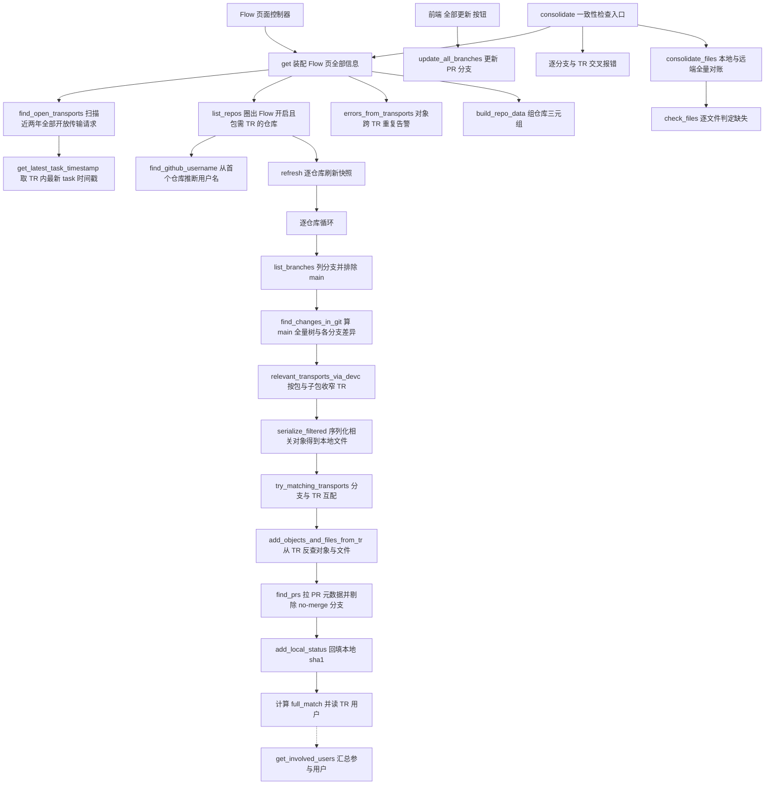
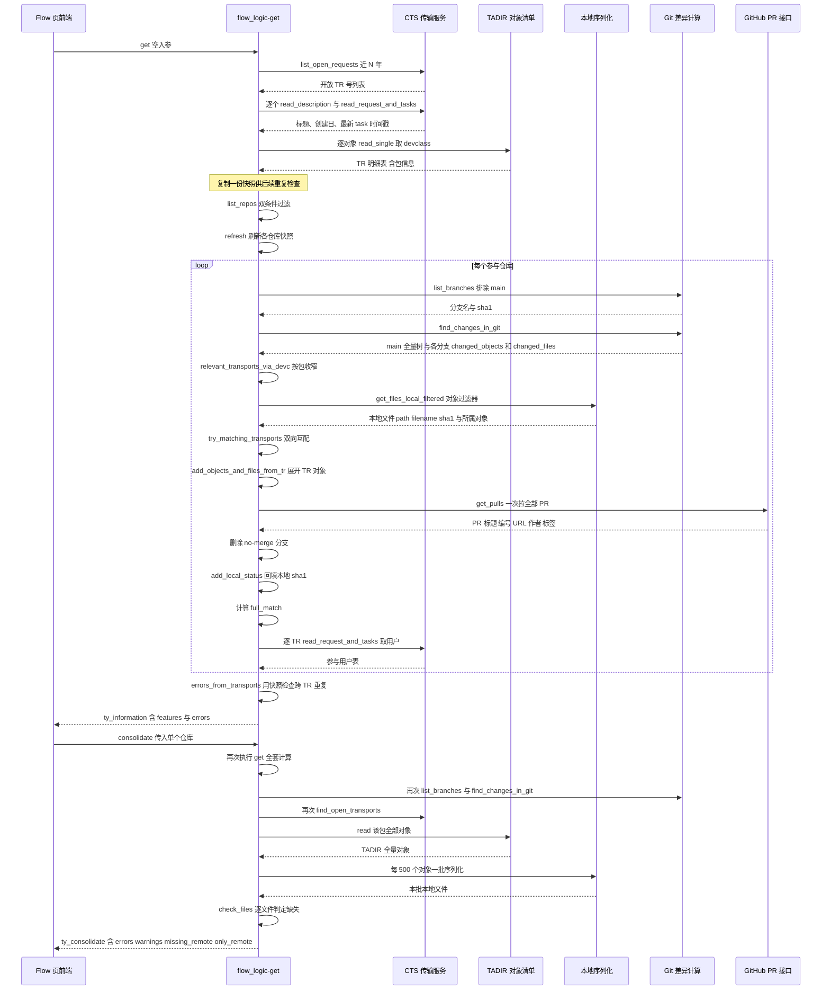

# zcl_abapgit_flow_logic 程序分析报告

> 源文件：`abapGit__abapGit__zcl_abapgit_flow_logic.clas.abap`（1114 行，1 个公共类定义 + 18 个方法实现）

---

## 一、程序定位与业务背景

**它解决什么问题。** abapGit 把 ABAP 代码搬进 Git 做版本管理，但 SAP 侧还有一个并行且强制存在的系统——传输请求（TR，Transport Request）。真实开发流里，一个人同时面对两张互不相认的表：GitHub 上的 feature 分支 + Pull Request，和 SE09 里的传输请求。两者没有任何自动关联，全靠人肉记忆「我这条 `zdev-8823` 分支配的是 `ZDEVK900123`」。一旦分支落后 main、或 TR 里有对象没进分支，只有上线时才会爆炸。

**现有方案为何不够。** 手工对账要在 TADIR / SE10 里翻对象清单，再和 Git diff 逐条比对；对上百个对象的仓库根本不现实，也回答不了「我的分支现在和 main 差多少」这类全局问题。abapGit 的 **Flow 页面**就是把这个对账自动化：把「Git 分支」「Pull Request」「传输请求」三件事并排呈现，并直接指出——哪个分支没配 TR、哪个 TR 没有对应分支、哪些文件只存在于远端 main 而本地已消失。

**这个类的角色。** 它是 Flow 页面的**后端数据装配层**：纯静态类（18 个方法全是 `CLASS-METHODS`，零实例状态、不碰任何 UI），输入是仓库接口对象，输出是一个大结构 `zif_abapgit_flow_logic=>ty_information`，交给前端直接渲染。

**一句话定性。** 这是一个**双索引对账器（reconciliation）**——用「SAP TADIR + CTS 传输请求」和「Git 全量文件树 + 分支 diff」两套互不信任的清单互相印证，把差异翻译成用户可读的条目和告警。

**一个必须先建立的心智模型。** 这里的 `local_sha1` **不是磁盘文件哈希**，而是「此刻按仓库序列化规则重新生成该内容」得到的哈希。因此 `remote_sha1 <> local_sha1` 的真正含义是「远端存的那份，和我现在本地会序列化出来的那份不一样」，而不是「磁盘文件被改动了」。这个前提决定了后续 `full_match`、`missing_remote`、`only_remote` 的全部判定逻辑。

---

## 二、程序执行流程总览

三个入口，一条主干：`get` 是主干；`consolidate` 复用 `get` 再追加一致性检查；`update_all_branches` 是写动作入口。



### 责任链表（按执行先后）

| 子程序 | 调用者 | 职责 |
|---|---|---|
| `get` | Flow 页面控制器 | 主入口，装配 `ty_information` |
| `find_open_transports` | `get`、`consolidate_files` | 拉近两年全部开放 TR 及其对象 / 包 / 时间戳 |
| `get_latest_task_timestamp` | `find_open_transports` | 取单个 TR 内最新 task 的时间戳 |
| `list_repos` | `get` | 圈定参与 Flow 的仓库 |
| `find_github_username` | `get` | 从仓库 URL 推断当前用户 GitHub 名 |
| `relevant_transports_via_devc` | `get` | 按仓库包 + 子包收窄 TR 列表 |
| `serialize_filtered` | `get` | 把相关对象序列化成「本地文件」清单 |
| `try_matching_transports` | `get` | TR 与分支互配，双向补建 feature |
| `add_objects_and_files_from_tr` | `try_matching_transports` | 从 TR 反查对象与文件条目（含删除判定） |
| `build_repo_data` | `get`、`consolidate_files`、`try_matching_transports` | 组 `ty_feature-repo` 三元组（name/key/package） |
| `find_prs` | `get` | 拉 PR 元数据，剔除带 `no-merge` 标签的分支 |
| `add_local_status` | `get` | 把本地 sha1 回填进 changed_files |
| `read_transport_users` | `get` | 读单个 TR 的参与用户 |
| `errors_from_transports` | `get` | 同一对象跨多个 TR 的重复告警 |
| `get_involved_users` | 前端 | 从已装配的 information 汇总用户名单 |
| `consolidate` | 前端「检查」按钮 | 第二入口：分支 ↔ TR 交叉校验 |
| `consolidate_files` | `consolidate` | 本地序列化结果 vs main 全量树对账 |
| `check_files` | `consolidate_files` | 单文件缺失判定 |
| `update_all_branches` | 前端「全部更新」按钮 | 第三入口：调用 GitHub API 更新 PR 分支 |

下面按这条流程，逐个子程序展开。

---

## 三、分组分析

### 3.1 类定义段（全局声明区）

这个类的骨架信息量很大：**公开区 5 个入口 + 私有区 14 个方法，全部 `CLASS-METHODS`，无实例属性、无事件、无单元测试段**。

#### ① 公开 API

```abap
CLASS zcl_abapgit_flow_logic DEFINITION PUBLIC.
  PUBLIC SECTION.
    CLASS-METHODS get
      RETURNING
        VALUE(rs_information) TYPE zif_abapgit_flow_logic=>ty_information
      RAISING
        zcx_abapgit_exception.

    CLASS-METHODS get_involved_users
      IMPORTING
        is_information  TYPE zif_abapgit_flow_logic=>ty_information
      RETURNING
        VALUE(rt_users) TYPE zif_abapgit_flow_logic=>ty_users_tt.

    CLASS-METHODS consolidate
      IMPORTING
        ii_online             TYPE REF TO zif_abapgit_repo_online
      RETURNING
        VALUE(rs_consolidate) TYPE zif_abapgit_flow_logic=>ty_consolidate
      RAISING
        zcx_abapgit_exception.

    CLASS-METHODS list_repos
      IMPORTING
        iv_favorites_only TYPE abap_bool DEFAULT abap_true
      RETURNING
        VALUE(rt_repos)   TYPE ty_repos_tt
      RAISING
        zcx_abapgit_exception.

    CLASS-METHODS update_all_branches
      IMPORTING
        it_features      TYPE zif_abapgit_flow_logic=>ty_features
      RETURNING
        VALUE(rs_result) TYPE ty_update_result
      RAISING
        zcx_abapgit_exception.
```

**做什么** — 五个入口各管一摊：`get` 装配整页数据；`get_involved_users` 从已装配结果里抽用户；`consolidate` 做一致性检查；`list_repos` 取仓库清单；`update_all_branches` 是唯一有写副作用的入口。

**为什么** — 输入输出全走值类型结构（`VALUE()` 参数），不返回引用对象，天然便于序列化给前端、也便于单元测试。数据契约（`ty_information`、`ty_feature`、`ty_consolidate`）放在接口 `zif_abapgit_flow_logic` 里，实现类只负责填充，这是 abapGit 全项目的统一约定。

**风险与改进** — 接口与实现的耦合只靠类型约定，`ty_feature` 里加了新字段而某个装配点没赋值时，编译器不会报错，字段就静默带着上一轮的值跑出去（见 3.2 的 `ls_result` 问题）。建议在接口侧把这类可选字段显式标注初值语义，或在装配入口加一处集中 `CLEAR`。

#### ② 私有类型与常量（键设计是本类最大隐患的根源）

```abap
  PRIVATE SECTION.

    CONSTANTS c_max_missing_files TYPE i VALUE 1000.

    TYPES: BEGIN OF ty_transport,
             trkorr     TYPE trkorr,
             title      TYPE string,
             object     TYPE tadir-object,
             obj_name   TYPE tadir-obj_name,
             devclass   TYPE tadir-devclass,
             created_on TYPE d,
             changed_at TYPE timestamp,
           END OF ty_transport.

    TYPES ty_transports_tt TYPE STANDARD TABLE OF ty_transport WITH NON-UNIQUE KEY trkorr.

    TYPES ty_trkorr_tt TYPE STANDARD TABLE OF trkorr WITH DEFAULT KEY.
```

**做什么** — `ty_transport` 一行 = 「一个 TR 中的一个对象」，因此同一 `trkorr` 会出现多次；`c_max_missing_files = 1000` 是前端展示截断阈值。

**为什么** — 时间字段类型选择是准确的：`created_on` 用 `d`（创建日只要日期），`changed_at` 用 `timestamp`（最近改动要精确到秒，用于排序和判断新鲜度），与 CTS 的 `AS4DATE/AS4TIME` 语义一致。

**风险与改进** — **`WITH NON-UNIQUE KEY trkorr` 是本类性能与正确性问题的高发根源**。但代码里绝大多数的访问方向是「按 `object` + `obj_name` 找」或「按 `trkorr` + `devclass` 找」，都不是声明的键：
- `consolidate_files` 用 `WITH KEY object = ... obj_name = ...` 线性扫描（方法内）；
- `relevant_transports_via_devc` 用 `WITH KEY trkorr = ... devclass = ...` 线性扫描；
- `try_matching_transports` 靠 `SORT BY object obj_name` 后用 `BINARY SEARCH` 救回来，而 `DELETE ct_transports WHERE trkorr = ...` 又退回 O(n)。

同一张表在同一个方法里被当作三种键用，是典型的「先声明后用、键设计没跟访问模式对齐」。建议改成带唯一键 `object obj_name` 的 sorted table，或干脆拆成两张表（一张按 trkorr 汇总、一张按对象明细）。

#### ③ 私有方法清单

私有区共 14 个方法（`consolidate_files`、`check_files`、`build_repo_data`、`try_matching_transports`、`errors_from_transports`、`add_objects_and_files_from_tr`、`find_prs`、`add_local_status`、`relevant_transports_via_devc`、`find_open_transports`、`serialize_filtered`、`read_transport_users`、`get_latest_task_timestamp`、`find_github_username`），全部 `RAISING zcx_abapgit_exception`，**只有** `find_github_username` 和 `build_repo_data` 不抛。

**做什么** — 14 个私有方法构成一条纯函数式流水线，互相通过 `CHANGING` 传递中间结果。

**为什么** — 全部私有 + 抛异常，等于把「可以调用这些方法」的权限收缩到类内，同时把失败显式上浮。策略上是对的。

**风险与改进** — 例外是 `get_latest_task_timestamp` 内部自己 `CATCH` 掉异常并返回当前时间戳（见 3.3），以及 `find_github_username` 全程 `##NO_HANDLER` 静默吞掉——「声明抛、内部吞」破坏了这条约定，调用方以为失败会传上来，实际拿到的是假数据。

---

主干的每一步都在调用私有方法，下面按被调用的先后顺序逐个拆开。

### 3.2 方法 `get`（主入口，装配整页数据）

这是全类的骨架方法，分 10 步。整个方法**没有任何 TRY/CATCH**，任何一步抛异常整页失败。

#### ① 拉全系统开放传输请求并留一份快照

```abap
lt_all_transports = find_open_transports( ).
lt_real_transports = lt_all_transports.
```

**做什么** — 一次性把全系统近两年的开放 TR 拉平到 `lt_all_transports`（每行一个对象），随后立刻复制一份到 `lt_real_transports`。

**为什么** — 这个快照不是多余的：后面 `try_matching_transports` 以 `CHANGING` 方式反复 `DELETE ct_transports WHERE trkorr = ...`，把已被分支认领的 TR 从工作表里消掉；而 `errors_from_transports` 需要做「同一对象出现在多个 TR」的全局检查，必须在删除发生之前留存原始视图。这是处理「数据在处理过程中被消费」的实用手法。

**风险与改进** — 快照是全系统范围、与具体仓库无关，即使当前只开了一个仓库也会全量拉取。见问题清单性能项。

#### ② 圈定仓库范围并推断 GitHub 身份

```abap
lt_repos = list_repos( ).
rs_information-enabled_repositories = lines( lt_repos ).
rs_information-github_username = find_github_username( lt_repos ).
```

**做什么** — 取参与 Flow 的仓库列表，把数量写进结果（供前端判断「没有可用仓库」），再从仓库 URL 推断当前登录者的 GitHub 用户名。

**为什么** — `enabled_repositories` 是个数量而非列表，因为前端只需要知道「是不是空的」来切换提示文案。用户名放在 information 里，是因为 PR 列表要按作者显示「你发起的 / 别人发起的」。

**风险与改进** — `lines( lt_repos )` 只传数量，前端拿不到「哪些仓库被排除了以及原因」。某仓库因为包设置改了 `are_changes_recorded_in_tr_req` 而静默消失，用户会以为仓库丢了。建议把排除原因也带出去。

#### ③ 刷新仓库快照，避免首次打开时的陈旧数据

```abap
LOOP AT lt_repos INTO li_repo_online.
  li_repo_online->zif_abapgit_repo~refresh( ).
ENDLOOP.
```

**做什么** — 在真正取数据之前，先把每个仓库实例强制刷新一次（丢弃缓存的目录树 / 对象快照）。

**为什么** — 仓库对象是带缓存的快照，Flow 页面首次打开时快照很可能是几分钟前的。源码注释写得很直白：`Repository instances may contain stale snapshots when Flow is first opened`。放在单独一个循环里而不是塞进主循环，是因为刷新对所有后续读操作都要生效。

**风险与改进** — `refresh( )` 在循环里裸调用，没有 TRY/CATCH。任何一个仓库刷新失败（权限、网络、包已删除），整页空白。这应该是最该加隔离的一步：一个仓库坏了不该让其他仓库也看不到。另外这里用了显式接口调用 `zif_abapgit_repo~refresh`，而主循环里取 URL 用隐式调用 `->get_url( )`，同一方法内风格不一致。

#### ④ 逐仓库枚举分支，搭好 feature 骨架

```abap
LOOP AT lt_repos INTO li_repo_online.

  lt_branches = zcl_abapgit_git_factory=>get_v2_porcelain( )->list_branches(
    iv_url    = li_repo_online->get_url( )
    iv_prefix = zif_abapgit_git_definitions=>c_git_branch-heads_prefix )->get_all( ).

  CLEAR lt_features.
  LOOP AT lt_branches INTO ls_branch WHERE display_name <> zif_abapgit_flow_logic=>c_main.
    ls_result-repo = build_repo_data( li_repo_online ).
    ls_result-branch-display_name = ls_branch-display_name.
    ls_result-branch-sha1 = ls_branch-sha1.
    INSERT ls_result INTO TABLE lt_features.
  ENDLOOP.
```

**做什么** — 用 v2 porcelain 接口列仓库的 `heads/` 分支，剔除 `main`，为每条分支建一个空壳 feature：只填仓库三元组、分支名、分支 sha1。

**为什么** — 先造骨架再逐个填肉，是为了让后续所有步骤都可以用同一个 `lt_features` 内表迭代；`main` 被排除是因为它是对账的基准线，不是 feature。这里 `lt_features` 被 `CLEAR`，但 `ls_result` 没有。

**风险与改进** — **`ls_result` 复用但不 `CLEAR`，只赋值三个字段**。transport 系列字段、pr 系列字段、`full_match`、`transport-users` 全靠后续步骤显式覆盖。也就是说，第 2 条分支是否还残留第 1 条分支的 `transport-trkorr`，完全取决于 `find_changes_in_git` 有没有把整个结构体重置干净——这是跨类的隐式契约。`full_match` 恰好因为在 ⑧ 里被显式重算而安全，但其他字段没有这个保险。建议在这一步加一行 `CLEAR ls_result`，把契约收回到本方法内，成本一行，收益是这段代码可独立推理、可独立测试。

#### ⑤ 计算 main 全量文件树与各分支的差异

```abap
  zcl_abapgit_flow_git=>find_changes_in_git(
    EXPORTING
      iv_url           = li_repo_online->get_url( )
      io_dot           = li_repo_online->zif_abapgit_repo~get_dot_abapgit( )
      iv_package       = li_repo_online->zif_abapgit_repo~get_package( )
      it_branches      = lt_branches
    IMPORTING
      et_main_expanded = lt_main_expanded
    CHANGING
      ct_features      = lt_features ).
```

**做什么** — 交给 `zcl_abapgit_flow_git` 做 Git 侧的重活：产出 `lt_main_expanded`（main 分支展开后的全量文件清单：path + name + sha1），并把每个分支相对 main 的 diff 填进各 feature 的 `changed_objects` 和 `changed_files`。

**为什么** — 这是整个对账的「Git 视角」数据源，本类不重复实现。注意 `CHANGING ct_features`——它既补数据也（隐式地）重置骨架，这正是 ④ 里 `ls_result` 不 CLEAR 也「看起来能跑」的原因。

**风险与改进** — 把最重的差异计算外包是合理的，但本类因此对 `find_changes_in_git` 的重置行为有强依赖。更稳妥的做法是本类自己 `CLEAR`，让外包方法只做加法。

#### ⑥ 按包收窄传输请求并序列化本地文件

```abap
  lt_relevant_transports = relevant_transports_via_devc(
    ii_repo        = li_repo_online
    it_transports  = lt_all_transports ).

  lt_local = serialize_filtered(
    it_relevant_transports = lt_relevant_transports
    ii_repo                = li_repo_online
    it_features            = lt_features
    it_all_transports      = lt_all_transports ).
```

**做什么** — 两步收窄：先用仓库所属包及其子包筛出「跟这个仓库有关的 TR」，再把这些 TR 里的对象 + Git diff 里出现的对象合并成一个过滤器，只对这批对象做本地序列化，得到 `lt_local`（path + filename + file-sha1 + item-obj_type/obj_name）。

**为什么** — 序列化是 abapGit 里最贵的操作之一（要读表、读文本、生成 XML/JSON 再算哈希）。一个仓库相关的对象往往只占系统对象总量的千分之一，不先收窄直接全量序列化会不可接受。这个「先收窄再计算」的意识在整类里贯彻得不错（后面 `consolidate_files` 也做了 500 个一批的批处理）。

**风险与改进** — 收窄的判定维度是「对象的 devclass 是否在包内」，而不是「对象是否真的在这个仓库的序列化范围内」。仓库如果用了自定义根目录或 `.abapgit` 里配了排除规则，收窄结果会和实际序列化范围不一致，导致后续 `add_objects_and_files_from_tr` 在 `it_local` 里找不到本该找到的文件，从而把一个「改动的对象」误判成「删除的对象」——误判会触发 3.8 里的 `/src/` 兜底路径，产生错误数据。

#### ⑦ 传输请求与分支互配

```abap
  try_matching_transports(
    EXPORTING
      ii_repo          = li_repo_online
      it_local         = lt_local
      it_main_expanded = lt_main_expanded
    CHANGING
      ct_transports    = lt_all_transports
      ct_features      = lt_features ).
```

**做什么** — 双向匹配：分支找到 TR 就把 TR 标记为已认领并从工作表删除；TR 没被任何分支认领但包对得上，就反向新建一个「只有 TR、没有分支」的 feature。

**为什么** — 这是 Flow 页面的核心交互：用户需要同时看到「分支没配 TR」和「TR 没有分支」两种不一致。放在一个方法里做双向补建，避免前端再发一次请求。

**风险与改进** — 见 3.7：一个分支只认领第一个命中的 TR，多 TR 分支的其余对象不会被补齐。

#### ⑧ 拉 PR 元数据并回填本地状态

```abap
  find_prs(
    EXPORTING
      iv_url      = li_repo_online->get_url( )
    CHANGING
      ct_features = lt_features ).

  add_local_status(
    EXPORTING
      it_local     = lt_local
    CHANGING
      ct_features = lt_features ).
```

**做什么** — `find_prs` 按 `head_branch` 把 PR 的标题、编号、URL、draft、作者回填到对应分支，并顺手删掉带 `no-merge` 标签的分支；`add_local_status` 把本地序列化得到的 sha1 回填进各 changed_file。

**为什么** — PR 元数据来自 GitHub，必须单独一次 HTTP 往返；本地状态回填之所以放在最后，是因为 `try_matching_transports` 可能会新增文件条目（尤其是从 TR 反查出来的），得等所有条目都齐了才能补 sha1。

**风险与改进** — `find_prs` 直接 `DELETE ct_features`，被剔除的分支在页面上彻底消失且无任何提示（用户会以为分支没了）。而且这个删除发生在 `errors_from_transports` 之前，会让「对象跨 TR 重复」的告警被静默抑制（见 3.10）。

#### ⑨ 计算 `full_match`、补用户、汇总进结果

```abap
  LOOP AT lt_features ASSIGNING <ls_feature>.
    <ls_feature>-full_match = abap_true.
    LOOP AT <ls_feature>-changed_files ASSIGNING <ls_path_name>.
      IF <ls_path_name>-remote_sha1 <> <ls_path_name>-local_sha1.
        <ls_feature>-full_match = abap_false.
      ENDIF
    ENDLOOP.

    IF <ls_feature>-transport-trkorr IS NOT INITIAL.
      <ls_feature>-transport-users = read_transport_users( <ls_feature>-transport-trkorr ).
    ENDIF
  ENDLOOP.

  INSERT LINES OF lt_features INTO TABLE rs_information-features.
ENDLOOP.
```

**做什么** — 逐 feature 判定「远端与我此刻本地的序列化结果是否完全一致」；有 TR 的再读一次 TR 的用户清单；最后把整批塞进结果。

**为什么** — `full_match` 的判断顺序刻意是「先置 true，遇到不一致再翻 false」，这样空 changed_files 的 feature 自动算匹配。放在主循环末尾而不是各步骤内联，是因为它依赖前面所有回填都完成。注意这里**显式重算了** `full_match`，是 ④ 里 `ls_result` 不 CLEAR 却能不出错的关键补丁。

**风险与改进** — 两个真实缺陷：
1. `full_match` 把「空 sha1 vs 空 sha1」当成一致。3.8 的删除兜底会造出一个 path 和 sha1 都只填了 path 的幽灵条目（`remote_sha1`、`local_sha1` 都为空），这种条目在判定里被视为匹配——删除类变更永远不会触发 `full_match = false`。
2. `read_transport_users` 是**每个 feature 一次**的 CTS 往返。如果一个仓库有 20 条分支配了 20 个 TR，这里就 20 次往返；同一 TR 若在两条分支上重复出现（理论上 `try_matching_transports` 已去重，但保险起见），还会重复读。

#### ⑩ 同一对象跨多个 TR 的重复告警

```abap
errors_from_transports(
  EXPORTING
    it_all_transports  = lt_real_transports
  CHANGING
    cs_information     = rs_information ).
```

**做什么** — 用 ① 留的快照做全局重复检查，把「同一对象出现在两个 TR」的错误信息和重复对象清单写进结果。

**为什么** — 用快照而非工作表，是因为工作表里的 TR 已被分支认领删除，用它检查会漏报。这一步放在仓库循环之外，因为重复检查是跨仓库的系统级问题。

**风险与改进** — 见 3.10 的「只比对相邻两行」与 `find_prs` 删除分支导致的抑制问题。

---

TR 明细到手之后，主干需要先圈定「哪些仓库参与」。

### 3.3 方法 `find_open_transports`（+ `get_latest_task_timestamp`）

**做什么** — 拉全系统近两年开放 TR 的完整明细。分三步。

#### ① 定时间窗口并取 TR 列表

```abap
ls_date-sign = 'I'.
ls_date-option = 'GE'.
ls_date-low = sy-datum - zif_abapgit_flow_logic=>c_open_transport_days.
INSERT ls_date INTO TABLE lt_date.

lt_trkorr = zcl_abapgit_factory=>get_cts_api( )->list_open_requests( lt_date ).
lt_created_on = zcl_abapgit_factory=>get_cts_api( )->read_creation_dates( lt_trkorr ).
```

**做什么** — 用选择选项 `I/GE` 把 TR 范围限制在近 `c_open_transport_days` 天，一次列出所有 TR 号，再一次性批量取创建日期。

**为什么** — 「近 N 年」是把全系统对账成本压到可接受的必要妥协：Flow 只关心近期活跃的开发。`read_creation_dates` 用批量接口而非逐个读，说明作者是有批量意识的。时间窗口做成接口常量而非写死，也方便不同部署调整。

**风险与改进** — 这个窗口对「长周期项目」是硬伤：跨半年以上才合并的大需求，其 TR 会被直接排除，导致 Flow 页面上「TR 没有分支」的告警永远不出现，用户以为没事，实际上是不一致被时间窗口滤掉了。建议至少在结果里带上「已按 N 天窗口过滤」的提示，或让窗口可配置到仓库级别。

#### ② 逐 TR 补标题、创建日与最近改动时间

```abap
LOOP AT lt_trkorr INTO lv_trkorr.
  ls_result-trkorr = lv_trkorr.
  ls_result-title  = zcl_abapgit_factory=>get_cts_api( )->read_description( lv_trkorr ).
  READ TABLE lt_created_on INTO ls_created_on WITH TABLE KEY trkorr = lv_trkorr.
  IF sy-subrc = 0.
    ls_result-created_on = ls_created_on-created_on.
  ELSE.
    CLEAR ls_result-created_on.
  ENDIF
  ls_result-changed_at = get_latest_task_timestamp( lv_trkorr ).
```

**做什么** — 对每个 TR 逐个读标题、从批量结果里取创建日、再取「最新 task 的时间戳」作为最近改动时间。

**为什么** — `changed_at` 用 task 而非 request 的时间戳，是因为 request 的 AS4 时间在导入/重激活时不会更新，而 task 的每次修改都会写新时间——用它做新鲜度判断更真实。

**风险与改进** — 这是**全类最重的性能热点**：`read_description` 和 `get_latest_task_timestamp` 都是每个 TR 一次 CTS 往返，TR 数量在中等规模的 SAP 系统里轻松过千。加上 3.1 说过 `find_open_transports` 在一次 `consolidate` 里会被调用两次，往返次数是「2 × TR 数」。建议把标题与时间戳也做成批量接口（SAP 的 CTS API 支持批量取）。

#### ③ 逐对象落表并做包/类型过滤

```abap
  CLEAR ls_limu_skip.
  ls_limu_skip-sign = 'I'.
  ls_limu_skip-option = 'EQ'.
  ls_limu_skip-low = 'SOTT'.
  INSERT ls_limu_skip INTO TABLE lt_limu_skip.
  lt_objects = zcl_abapgit_factory=>get_cts_api( )->list_r3tr_by_request(
    iv_request         = lv_trkorr
    it_skip_limu_types = lt_limu_skip ).

* R3TR can be skipped here
  LOOP AT lt_objects ASSIGNING <ls_object>
      WHERE object <> 'CINS'
      AND object <> 'NOTE'.
    ls_result-object   = <ls_object>-object.
    ls_result-obj_name = <ls_object>-obj_name.

    lv_obj_name = <ls_object>-obj_name.
    ls_result-devclass = zcl_abapgit_factory=>get_tadir( )->read_single(
      iv_object   = ls_result-object
      iv_obj_name = lv_obj_name )-devclass.
    IF ls_result-devclass IS NOT INITIAL.
      INSERT ls_result INTO TABLE rt_transports.
    ENDIF
  ENDLOOP.

ENDLOOP.
```

**做什么** — 取每个 TR 里的 R3TR 对象，跳过 `CINS`（插入序列）和 `NOTE`，逐对象查 TADIR 拿 devclass，只有能查到包的对象才落表。

**为什么** — 只保留 `devclass` 非空的对象，是后面所有「按包收窄」的前提（`relevant_transports_via_devc`、`try_matching_transports` 的 unmatched 分支都靠它）。跳过 CINS/NOTE 是因为它们既不序列化也不影响 ABAP 开发语义。

**风险与改进** — 三个问题：
1. **`read_single` 是对象级往返**，与 ② 叠加后总往返数 = TR 数 + 对象数 + TR 数，是最贵的一环。TADIR 明明可以 `FOR ALL ENTRIES` 或按包批量取。
2. `lt_limu_skip` 里只排除了 `SOTT`，注释 `SOTT = Concept (Online Text Repository) - Short Texts for packages are not serialized anyhow` 是准确的，但 LIMU（短文本）本身是会被序列化的，只跳过包级短文本会漏掉对象级 LIMU。
3. 注释写 `R3TR can be skipped here`，但代码里并没有跳 R3TR 的逻辑——R3TR 对象仍会进 `read_single`，只是 devclass 为空被滤掉。注释与实现不符，是留给自己看的中间状态。

#### `get_latest_task_timestamp`

```abap
TRY.
    lt_tasks = zcl_abapgit_factory=>get_cts_api( )->read_request_and_tasks( iv_trkorr ).

    LOOP AT lt_tasks INTO ls_task.
      IF ls_task-as4date > lv_max_date
          OR ( ls_task-as4date = lv_max_date AND ls_task-as4time > lv_max_time ).
        lv_max_date = ls_task-as4date.
        lv_max_time = ls_task-as4time.
      ENDIF
    ENDLOOP.

    IF lv_max_date IS NOT INITIAL.
      CONVERT DATE lv_max_date TIME lv_max_time INTO TIME STAMP rv_changed_at TIME ZONE sy-zonlo.
    ELSE.
      GET TIME STAMP FIELD rv_changed_at.
    ENDIF
  CATCH zcx_abapgit_exception.
    GET TIME STAMP FIELD rv_changed_at.
ENDTRY.
```

**做什么** — 取 TR 及其 task 的 AS4 时间戳，挑出最大的一对（日期相同则比时间），用本地时区转成 timestamp；取不到就用当前时间。

**为什么** — 「TR 最近一次有人动过」比「TR 的 AS4 时间」更接近用户的直觉；跨日期+时间两字段取最大是必要的，因为只比日期会把不同 task 抹平。

**风险与改进** — 这是全类**最需要修的一处**：
1. **静默失败 + 假数据**：`CATCH zcx_abapgit_exception` 不做任何日志，然后 `GET TIME STAMP` 把「读取失败」翻译成「刚刚被改过」。调用方拿到的 `changed_at` 永远是「现在」，会让一个读不出来的 TR 看起来是系统里最新鲜的——直接影响排序、直接影响 `consolidate` 里「created ... 」这类提示文案的可信度。**把异常翻译成假数据比把异常抛出去危险得多**。
2. 同一逻辑里还有第二条静默路径：task 列表为空时也 `GET TIME STAMP`，语义上「没有 task」和「读取失败」被合并成同一个返回值。
3. 与类内其他方法一律 `RAISING` 的约定相冲突，属于约定破口。
4. 建议：至少写一条系统日志或返回一个可判别的哨兵值；`CATCH` 里补一个带 TR 号的错误信息。

---

仓库清单确定了，页面上还差一行「当前用户是谁」。

### 3.4 方法 `list_repos`

```abap
DATA lt_repos  TYPE zif_abapgit_repo_srv=>ty_repo_list.
DATA li_repo   LIKE LINE OF lt_repos.
DATA li_online TYPE REF TO zif_abapgit_repo_online.

IF iv_favorites_only = abap_true.
  lt_repos = zcl_abapgit_repo_srv=>get_instance( )->list_favorites( abap_false ).
ELSE.
  lt_repos = zcl_abapgit_repo_srv=>get_instance( )->list( abap_false ).
ENDIF.

LOOP AT lt_repos INTO li_repo.
  IF li_repo->get_local_settings( )-flow = abap_false.
    CONTINUE
  ELSEIF zcl_abapgit_factory=>get_sap_package( li_repo->get_package( )
      )->are_changes_recorded_in_tr_req( ) = abap_false.
    CONTINUE
  ENDIF.

  li_online ?= li_repo.
  INSERT li_online INTO TABLE rt_repos.
ENDLOOP.
```

**做什么** — 取收藏（或全部）仓库，双条件过滤：仓库本地设置里 `flow = abap_true`，且所属包设置里 `are_changes_recorded_in_tr_req = abap_true`；通过后做类型收窄 `?= ` 装入结果。

**为什么** — 两个条件缺一不可：没开 Flow 的仓库不该出现在 Flow 页；而包不记录 TR 的话，整个「分支 ↔ TR 对账」在这个仓库里根本不成立，显示出来只会全是误导。用 `?= ` 做运行时类型收窄，比直接 `CAST` 更干净（失败走异常而非返回空引用）。

**风险与改进** — 过滤条件失败时**没有任何可见痕迹**：一个仓库因为包设置被人改了而突然从 Flow 页消失，用户无从得知原因。建议在 `ty_information` 里带一个「被排除的仓库 + 原因」清单。另外 `get_local_settings` 和 `get_sap_package` 都是仓库级往返，仓库多时会成为入口处的隐性开销。

---

身份与仓库范围都定了，主干回到核心工作：把 TR 收窄到与本仓库相关的那批。

### 3.5 方法 `find_github_username`

```abap
DATA li_repo_online TYPE REF TO zif_abapgit_repo_online.
DATA li_exit        TYPE REF TO zif_abapgit_flow_exit.

READ TABLE it_repos INTO li_repo_online INDEX 1.
IF sy-subrc = 0.
  TRY.
      rv_username = zcl_abapgit_login_manager=>get_username( li_repo_online->get_url( ) ).
    CATCH zcx_abapgit_exception ##NO_HANDLER.
  ENDTRY.
ENDIF.

TRY.
    li_exit = zcl_abapgit_flow_exit=>get_instance( ).
    li_exit->change_github_username( CHANGING cv_username = rv_username ).
  CATCH zcx_abapgit_exception ##NO_HANDLER.
ENDTRY.
```

**做什么** — 取第一个仓库的 URL 去反查当前登录者的 GitHub 用户名，然后把结果回调给流程退出（`zif_abapgit_flow_exit`）插件点。

**为什么** — abapGit 的用户名与 SAP 用户名没有强制对应，只能从凭据里反推。做成退出点让二次开发方可以覆盖这个推断（比如统一用 SAP 用户映射）。

**风险与改进** — 两个真实缺陷：
1. **只试第一个仓库**。如果第一个仓库的连接失败或凭据异常，`rv_username` 就是空串，而它不会去试第二个仓库。
2. **空值也会回调**：无论成败都会调 `change_github_username`，用一个空串覆盖插件点里可能已有的有效缓存值。
3. 参数类型声明为整张 `ty_repos_tt`，但实际只需要一个 URL——签名过宽，容易被误用。建议改成 `iv_url TYPE string`。

---

收窄完成，接下来是整条链路里最贵的动作——序列化。

### 3.6 方法 `relevant_transports_via_devc`

```abap
lt_trkorr = it_transports.
SORT lt_trkorr BY trkorr.
DELETE ADJACENT DUPLICATES FROM lt_trkorr COMPARING trkorr.

lt_packages = zcl_abapgit_factory=>get_sap_package( ii_repo->get_package( ) )->list_subpackages( ).
INSERT ii_repo->get_package( ) INTO TABLE lt_packages.

LOOP AT lt_trkorr ASSIGNING <ls_trkorr>.
  lv_found = abap_false.

  LOOP AT lt_packages ASSIGNING <lv_package>.
    READ TABLE it_transports TRANSPORTING NO FIELDS WITH KEY trkorr = <ls_trkorr>-trkorr devclass = <lv_package>.
    IF sy-subrc = 0.
      lv_found = abap_true.
      EXIT.
    ENDIF
  ENDLOOP.
  IF lv_found = abap_false.
    CONTINUE
  ENDIF.

  IF lv_found = abap_true.
    INSERT <ls_trkorr>-trkorr INTO TABLE rt_transports.
  ENDIF
ENDLOOP.
```

**做什么** — 把「对象明细表」压成「TR 号集合」，然后对每个 TR 检查它下面是否有对象的 devclass 落在本仓库包或子包里，命中即保留。

**为什么** — 判定粒度刻意放在**对象级**而非 TR 级：一个 TR 可能跨多个包，只有当它确实包含本仓库包内的对象时才相关。用 `SORT + DELETE ADJACENT DUPLICATES` 去重 TR 号，是当时 ABAP 里最省事的去重写法。

**风险与改进** — 三点：
1. **`COMPARING trkorr` 丢弃了整行对象明细**，后面 `serialize_filtered` 只能靠 TR 号回头再扫一遍 `it_all_transports`（见 3.8），一次去重换来一次重复扫描。
2. 双重循环 `TR 数 × 包数` 且每轮都是 `READ TABLE` 线性扫描——仓库子包多的时候会明显变慢。
3. `IF lv_found = abap_true.` 紧跟在 `IF lv_found = abap_false. CONTINUE. ENDIF` 之后，逻辑上 100% 恒真，是冗余嵌套。删掉外层判断可读性会好很多。

---

本地文件与 TR 明细现在都在手里，可以开始真正配对。

### 3.7 方法 `serialize_filtered`

```abap
* from all relevant transports(matched via package)
LOOP AT it_relevant_transports INTO lv_trkorr.
  LOOP AT it_all_transports ASSIGNING <ls_transport> WHERE trkorr = lv_trkorr.
    APPEND INITIAL LINE TO lt_filter ASSIGNING <ls_filter>.
    <ls_filter>-object = <ls_transport>-object.
    <ls_filter>-obj_name = <ls_transport>-obj_name.
  ENDLOOP.
ENDLOOP.

* and from git
LOOP AT it_features INTO ls_feature.
  LOOP AT ls_feature-changed_objects INTO ls_changed_object.
    APPEND INITIAL LINE TO lt_filter ASSIGNING <ls_filter>.
    <ls_filter>-object = ls_changed_object-obj_type.
    <ls_filter>-obj_name = ls_changed_object-obj_name.
  ENDLOOP.
ENDLOOP.

SORT lt_filter BY object obj_name.
DELETE ADJACENT DUPLICATES FROM lt_filter COMPARING object obj_name.

CREATE OBJECT lo_filter EXPORTING it_filter = lt_filter.
rt_local = ii_repo->get_files_local_filtered( lo_filter ).
```

**做什么** — 把两个来源（按包命中的 TR 对象、Git diff 出来的对象）合成一个 TADIR 过滤器，去重后一次性调 `get_files_local_filtered` 拿到本地序列化结果。

**为什么** — 这是 3.2 ⑥ 说的「先收窄再序列化」的落地：序列化对象越多越贵，而两个来源的并集恰好覆盖了「可能被展示的文件」。`SORT + DELETE ADJACENT DUPLICATES` 去重是必要的一步，否则同一对象会被重复序列化。

**风险与改进** — 一个边界情况值得注意：过滤器里**只有对象，没有「路径」信息**，所以如果某个对象在 Git 里的实际路径与序列化规则算出的路径不同（自定义根目录、`.abapgit` 里的目录映射），本地文件是拿得到的，但后面 3.9 用通配符匹配时会失配，导致「改动的对象」被误判成「删除的对象」。这个问题作者自己是知道的——3.9 里有 `* after its deleted locally and remote then remote and local sha1 will match(be empty) *` 这样的注释。

---

配对时会为每条 TR 展开它的对象与文件，这是全类细节最讲究的一步。

### 3.8 方法 `try_matching_transports`（TR ↔ 分支互配，本类核心）

这个方法是整个对账逻辑的心脏，分「正向配」「反向补」两段。

#### ① 正向：分支认领 TR

```abap
SORT ct_transports BY object obj_name.

LOOP AT ct_features ASSIGNING <ls_feature>.
  LOOP AT <ls_feature>-changed_objects ASSIGNING <ls_changed>.
    READ TABLE ct_transports ASSIGNING <ls_transport>
      WITH KEY object = <ls_changed>-obj_type obj_name = <ls_changed>-obj_name BINARY SEARCH.
    IF sy-subrc = 0.
      <ls_feature>-transport-trkorr = <ls_transport>-trkorr.
      <ls_feature>-transport-title = <ls_transport>-title.
      <ls_feature>-transport-created_on = <ls_transport>-created_on.
      <ls_feature>-transport-changed_at = <ls_transport>-changed_at.

      add_objects_and_files_from_tr(
        EXPORTING
          iv_trkorr        = <ls_transport>-trkorr
          it_local         = it_local
          it_main_expanded = it_main_expanded
          it_transports    = ct_transports
        CHANGING
          cs_feature       = <ls_feature> ).

      DELETE ct_transports WHERE trkorr = <ls_transport>-trkorr.
      EXIT.
    ENDIF
  ENDLOOP.
ENDLOOP.
```

**做什么** — 先把 TR 明细表按 `object obj_name` 排序（`SORT` 之后 `BINARY SEARCH` 才能用），然后对每个分支的每个 changed object 做一次二分查找；命中就回填 TR 四元组、把该 TR 全部对象展开进 feature 的文件清单，并把整条 TR 从工作表删除，`EXIT` 跳出。

**为什么** — `BINARY SEARCH` 是这里唯一被正确使用索引的地方，说明作者对性能是有自觉的。认领后立即 `DELETE` 整条 TR，保证「一个 TR 只被一个分支认领」——否则同一个 TR 会挂在多条分支上，Flow 页会重复展示。

**风险与改进** — 三个真实缺陷：
1. **`EXIT` 让一个分支只认领第一个命中的 TR**。如果一条分支改了三条对象、分属三个 TR，只有第一个 TR 被链接，其余两个对象对应的文件**不会**被 `add_objects_and_files_from_tr` 补齐。多 TR 分支是这个方法的已知盲区。
2. **认领是按「对象首个命中」而非「对象数量最多」决定的**，命中顺序取决于 `changed_objects` 的排列，具有偶然性。
3. `DELETE ct_transports WHERE trkorr = ...` 发生在按 `object obj_name` 排序的表上，是全表线性扫描；分支多的时候是 O(分支数 × TR 明细数)。

#### ② 反向：TR 补建「只有 TR、没有分支」的 feature

```abap
* unmatched transports
lt_trkorr = ct_transports.
SORT lt_trkorr BY trkorr.
DELETE ADJACENT DUPLICATES FROM lt_trkorr COMPARING trkorr.

lt_packages = zcl_abapgit_factory=>get_sap_package( ii_repo->get_package( ) )->list_subpackages( ).
INSERT ii_repo->get_package( ) INTO TABLE lt_packages.

LOOP AT lt_trkorr INTO ls_trkorr.
  lv_found = abap_false.
  LOOP AT lt_packages INTO lv_package.
    READ TABLE ct_transports ASSIGNING <ls_transport> WITH KEY trkorr = ls_trkorr-trkorr devclass = lv_package.
    IF sy-subrc = 0.
      lv_found = abap_true.
      EXIT.
    ENDIF
  ENDLOOP.
  IF lv_found = abap_false.
    CONTINUE
  ENDIF.

  CLEAR ls_result.
  ls_result-repo = build_repo_data( ii_repo ).
  ls_result-transport-trkorr = <ls_transport>-trkorr.
  ls_result-transport-title = <ls_transport>-title.
  ls_result-transport-created_on = <ls_transport>-created_on.
  ls_result-transport-changed_at = <ls_transport>-changed_at.

  add_objects_and_files_from_tr(
    EXPORTING
      iv_trkorr        = ls_trkorr-trkorr
      it_local         = it_local
      it_main_expanded = it_main_expanded
      it_transports    = ct_transports
    CHANGING
      cs_feature       = ls_result ).

  INSERT ls_result INTO TABLE ct_features.
ENDLOOP.
```

**做什么** — 把没被认领的 TR 按包再筛一遍，命中的反向新建一个 feature（`branch-display_name` 保持为空），同样展开对象与文件。

**为什么** — 注意这里**显式 `CLEAR ls_result`**——与 3.2 ④ 的疏忽形成鲜明对照，说明作者知道这个模式，只是漏了另一处。反向补建是 Flow 页「TR 没有分支」告警的数据来源。

**风险与改进** — 一个隐蔽的取值问题：`ls_result-transport-*` 四个字段的来源是 `<ls_transport>`，也就是**最后一次 `READ TABLE` 命中时留在字段符号上的行**（循环 `EXIT` 出来的那一行），而不是 `ls_trkorr` 对应 TR 的代表行。因为 `trkorr` 相同，这四字段的值碰巧一致，代码才能正确运行——但这是靠「同一 TR 的所有行标题/日期都相同」这个数据特性兜住的，任何一次 CTS 返回不一致（比如标题在读取间隙被改）就会写出错位数据。建议直接按 `ls_trkorr-trkorr` 重新 `READ TABLE` 一次，让取值逻辑与意图对齐。

---

展开过程中反复用到一个仓库三元组，它本身是个三行的小方法。

### 3.9 方法 `add_objects_and_files_from_tr`（从 TR 反查对象与文件）

这个方法处理 TR 里每个对象的两种状态：「还活着，取本地序列化结果」和「已经被删，去 Git 里找残留文件」。分四步。

#### ① 登记 TR 中的对象

```abap
LOOP AT it_transports ASSIGNING <ls_transport> WHERE trkorr = iv_trkorr.
  ls_changed-obj_type = <ls_transport>-object.
  ls_changed-obj_name = <ls_transport>-obj_name.
  INSERT ls_changed INTO TABLE cs_feature-changed_objects.
```

**做什么** — 把 TR 里所有对象登记进 feature 的 `changed_objects`，不管它是否还在本地。

**为什么** — 先全量登记，让 `changed_objects` 成为 TR 的忠实反映；后面的文件层再单独处理存在性。

**风险与改进** — `ls_changed` 未 `CLEAR` 就复用，但两个字段都被赋值，不影响结果。属于无风险样板。

#### ② 对象还活着：取本地文件并回填 main 的 sha1

```abap
  LOOP AT it_local ASSIGNING <ls_local>
      WHERE file-filename <> zif_abapgit_definitions=>c_dot_abapgit
      AND item-obj_type = <ls_transport>-object
      AND item-obj_name = <ls_transport>-obj_name.

    CLEAR ls_changed_file.
    ls_changed_file-path       = <ls_local>-file-path.
    ls_changed_file-filename   = <ls_local>-file-filename.
    ls_changed_file-local_sha1 = <ls_local>-file-sha1.

    READ TABLE it_main_expanded ASSIGNING <ls_main_expanded>
      WITH TABLE KEY path_name COMPONENTS
      path = ls_changed_file-path
      name = ls_changed_file-filename.
    IF sy-subrc = 0.
      ls_changed_file-remote_sha1 = <ls_main_expanded>-sha1.
    ENDIF.

    INSERT ls_changed_file INTO TABLE cs_feature-changed_files.
  ENDLOOP.
```

**做什么** — 在已序列化的本地文件里按「对象类型 + 对象名」找文件（跳过 `.abapgit` 配置文件），命中就把 path/filename/local_sha1 填入条目，再回 main 全量树里查同路径同名的 sha1 作为 `remote_sha1`。

**为什么** — 这一步是**匹配维度正确**的样板：既比了对象名，又比了路径。注意 `it_main_expanded` 用了 `TABLE KEY path_name COMPONENTS path / name` 的复合键访问——这是全类里唯一一次正确地用上了复合键。

**风险与改进** — 依赖 3.7 的过滤器覆盖：如果 TR 的对象没进过滤器，`it_local` 里就没有对应文件，代码会掉进 ③ 的删除分支——把一个正常存在的对象误判成删除。过滤器覆盖不全时这个误判率会很高。

#### ③ 对象已被删：按通配符在 main 里找残留文件

```abap
  IF sy-subrc <> 0.
* then its a deletion
    CLEAR ls_item.
    ls_item-obj_type = <ls_transport>-object.
    ls_item-obj_name = <ls_transport>-obj_name.

    IF zcl_abapgit_aff_factory=>get_registry( )->is_supported_object_type( <ls_transport>-object ) = abap_true.
      lv_extension = 'json'.
    ELSE.
      lv_extension = 'xml'.
    ENDIF.

    lv_main_file = zcl_abapgit_filename_logic=>object_to_file(
      is_item = ls_item
      iv_ext  = lv_extension ).
    CONCATENATE '.' lv_extension INTO lv_extension.
    lv_filename = lv_main_file.
    REPLACE FIRST OCCURRENCE OF lv_extension IN lv_filename WITH '*'.

    IF lv_filename = 'package.devc*'.
* this might leave deleted packages in git, but its okay for now
      CONTINUE.
    ENDIF.

    LOOP AT it_main_expanded ASSIGNING <ls_main_expanded>
        WHERE name CP lv_filename.
      CLEAR ls_changed_file.
      ls_changed_file-filename    = <ls_main_expanded>-name.
      ls_changed_file-path        = <ls_main_expanded>-path.
      ls_changed_file-remote_sha1 = <ls_main_expanded>-sha1.
      INSERT ls_changed_file INTO TABLE cs_feature-changed_files.
    ENDLOOP.
```

**做什么** — 拿不到本地文件就判定为「删除」：先按 AFF（Advanced File Format）判断该对象是用 `.json` 还是 `.xml` 序列化，用 `object_to_file` 算出主文件名，再把扩展名替换成通配符 `*`，去 main 全量树里按通配找可能存在的文件（一个对象在 Git 里可能对应多个文件，比如类、接口组件）。`package.devc*` 特判跳过，因为删包的残留文件留在 Git 里暂时无害。

**为什么** — 这是**全类技巧性最高、也最脆弱的一步**：它用 `LOOP...WHERE` 结束后的 `sy-subrc <> 0` 作为「找不到本地文件 = 已删除」的判据。这个写法利用了 ABAP 的一个细节——`LOOP ... ENDLOOP` 之后若无行被处理则 `sy-subrc = 4`。省了一个布尔变量，但把语义埋进了隐式返回码里。

**风险与改进** — 两点：
1. **`sy-subrc` 判据与 3.2 ⑨ 的 `full_match` 判定不兼容**：此处分支产出的条目只有 `remote_sha1` 有值、`local_sha1` 为空，在 `full_match` 的比较里 `'' <> '<sha1>'` 是成立的，所以删除会正确地把 `full_match` 置为 false——但如果走到 ④ 的兜底（本地和远端都没有），两个 sha1 都为空，`'' <> ''` 为假，**删除被判定为完全匹配**。
2. 通配符只替换了主文件名的扩展名，注释 `* todo: this is not correct for AFF enabled objects` 出现在 `consolidate_files` 里，说明作者已意识到 AFF 对象的文件命名（含组件文件）用这种通配不一定覆盖全。

#### ④ 兜底：找不到文件时造一个幽灵条目

```abap
    IF sy-subrc <> 0.
      CLEAR ls_changed_file.
      ls_changed_file-filename    = lv_main_file.
      ls_changed_file-path        = '/src/'. " todo?
* after its deleted locally and remote then remote and local sha1 will match(be empty)
      INSERT ls_changed_file INTO TABLE cs_feature-changed_files.
    ENDIF.
```

**做什么** — 如果连 main 里都找不到该对象的任何文件，就手工造一条只有 `filename` 和硬编码 `path = '/src/'` 的空条目。

**为什么** — 目的很明确：让「本地已删、远端也已删」的情况在前端依然可见（否则 feature 的 `changed_files` 会空掉，前端无法显示这个对象的状态）。注释写得很诚实：`after its deleted locally and remote then remote and local sha1 will match(be empty)`。

**风险与改进** — 这是全类**最需要修的硬编码**：
1. **`path = '/src/'` 是写死的**。abapGit 的仓库根目录完全可以是别的（`.abapgit` 里可配置根目录、多包仓库），此时这条目会指向一个不存在的路径，前端展示的删除条目路径是错的。代码里自己也标了 `todo?`。
2. 两个空 sha1 会让 `full_match` 误判为 true（见 ③ 的结论），也就是说「本地和远端都删干净了」的删除状态，在 Flow 页上会显示成「完全一致」。
3. 建议把路径交给 `object_to_file` / 仓库配置推导，或者干脆用一个显式的 `is_deletion` 标志字段，不要用「空 sha1」来表达语义。

---

回到主干，Git 与 TR 的关联已经建好，接下来补 GitHub 侧的信息。

### 3.10 方法 `build_repo_data`

```abap
METHOD build_repo_data.
  rs_data-name = ii_repo->get_name( ).
  rs_data-key  = ii_repo->get_key( ).
  rs_data-package = ii_repo->get_package( ).
ENDMETHOD.
```

**做什么** — 把仓库实例的三个属性打包成 `ty_feature-repo`。

**为什么** — feature 是跨仓库内表的一行，必须自带仓库信息才能区分「哪条分支属于哪个仓库」。做成独立方法而非内联，是因为它在三个地方被调用。

**风险与改进** — 无明显风险。属于纯粹的样板装配，也是全类里写得最干净的一个方法。

---

PR 元数据补完，还差本地这一侧的 sha1。

### 3.11 方法 `find_prs`

```abap
IF lines( ct_features ) = 0.
  " only main branch
  RETURN.
ENDIF.

lt_pulls = zcl_abapgit_pr_enumerator=>new( iv_url )->get_pulls( ).

LOOP AT ct_features ASSIGNING <ls_branch>.
  lv_index = sy-tabix.

  READ TABLE lt_pulls INTO ls_pull WITH KEY head_branch = <ls_branch>-branch-display_name.
  IF sy-subrc <> 0.
    CONTINUE
  ENDIF.

  READ TABLE ls_pull-labels WITH KEY table_line = 'no-merge' TRANSPORTING NO FIELDS.
  IF sy-subrc = 0.
    DELETE ct_features INDEX lv_index.
    CONTINUE
  ENDIF.

  <ls_branch>-pr-title_raw = ls_pull-title.

  " remove markdown formatting,
  REPLACE ALL OCCURRENCES OF '`' IN ls_pull-title WITH ''.

  <ls_branch>-pr-title = |{ ls_pull-title } #{ ls_pull-number }|.
  <ls_branch>-pr-url = ls_pull-html_url.
  <ls_branch>-pr-number = ls_pull-number.
  <ls_branch>-pr-draft = ls_pull-draft.
  <ls_branch>-pr-author = ls_pull-user.
ENDLOOP.
```

**做什么** — 一次拉取仓库的全部 PR，按 `head_branch` 匹配到分支，回填标题/编号/URL/draft/作者；带 `no-merge` 标签的分支直接从 feature 列表删除。

**为什么** — `head_branch` 匹配是 GitHub PR 与本地分支的天然连接键。先存 `pr-title_raw`（带反引号）再清洗出 `pr-title`，是为了让前端既能显示干净文案，也能保留原始 markdown。`no-merge` 标签是 abapGit 约定的「这条分支不要出现在 Flow 里」的开关。

**风险与改进** — 三点：
1. **`DELETE ct_features INDEX lv_index` 是静默删除**，被剔除的分支在页面上完全消失，且没有任何「已过滤 N 条分支」的提示。用户可能会误以为分支被删了。
2. **删除发生在 `errors_from_transports` 之前**，会让该分支关联的 TR 在 `lv_found1/lv_found2` 检查里被判为「不在任何 flow 仓库」，从而**抑制本该发出的跨 TR 重复告警**。跨方法副作用。
3. `pr-title = |{ ls_pull-title } #{ ls_pull-number }|` 直接把 PR 号拼进标题。而 abapGit 创建的分支名本身往往已经包含 PR/需求号，容易出现「号重复两遍」的观感问题——这是文案取舍，不是 bug，但值得确认前端是否会去重。
4. 从 fork 发起的 PR 其 `head_branch` 可能不匹配本地分支名，这类 PR 会被静默跳过，分支显示为「没有 PR」。

---

本地 sha1 回填之后，主干给每条有 TR 的 feature 读一次参与用户。

### 3.12 方法 `add_local_status`

```abap
LOOP AT ct_features ASSIGNING <ls_branch>.
  LOOP AT <ls_branch>-changed_files ASSIGNING <ls_changed_file>.
    READ TABLE it_local ASSIGNING <ls_local>
      WITH KEY file-filename = <ls_changed_file>-filename
      file-path = <ls_changed_file>-path.
    IF sy-subrc = 0.
      <ls_changed_file>-local_sha1 = <ls_local>-file-sha1.
    ENDIF
  ENDLOOP.
ENDLOOP.
```

**做什么** — 对每个 feature 的每条 changed_file，用「filename + path」双条件回查本地序列化结果，命中就回填 `local_sha1`。

**为什么** — 这一步是 3.2 ⑨ `full_match` 判定的数据前提，必须在所有文件条目都生成之后执行。

**风险与改进** — **这个方法与 3.14 的 `check_files` 形成了全类最关键的一组对照**：
- `add_local_status`：按 `file-filename` **和** `file-path` 双条件匹配 ✅
- `check_files`：按 `name` 单条件匹配 ❌

同一个程序里，作者既写对过又写错过同一个匹配问题——这证明 `check_files` 的单字段匹配是疏忽而不是设计选择。另外这个方法本身也没有 `CLEAR` 或边界保护，但因为它只做加法（回填一个字段），不会引入错误数据，无额外风险。

---

逐条 TR 的活干完，主干做最后一个全局检查，然后收工。

### 3.13 方法 `read_transport_users`

```abap
DATA lt_tasks TYPE zif_abapgit_cts_api=>ty_request_and_tasks_tt.
DATA ls_task  LIKE LINE OF lt_tasks.

lt_tasks = zcl_abapgit_factory=>get_cts_api( )->read_request_and_tasks( iv_trkorr ).
LOOP AT lt_tasks INTO ls_task.
  INSERT ls_task-as4user INTO TABLE rt_users.
ENDLOOP.
```

**做什么** — 读一个 TR 及其 task，把每条的 `as4user` 收集成用户表。

**为什么** — Flow 页要显示「这个 TR 有哪些人动过」，用于协作沟通。用 `read_request_and_tasks` 而非 `read_request`，是为了覆盖 task 级别的用户（TR 的 AS4USER 往往只是创建人）。

**风险与改进** — 同一个人在 TR 的 request 行和多个 task 行里都会出现，这里**不去重**，`rt_users` 里「张三」可能出现十次。下游 `get_involved_users` 也不去重（见 3.15），最终前端拿到的用户名单是带重复的。建议在源头去重。

---

get 的全部产物到这里已经齐了，类里还留了一个独立的读取入口。

### 3.14 方法 `errors_from_transports`（跨 TR 重复对象告警）

```abap
lt_transports = it_all_transports.
SORT lt_transports BY object obj_name trkorr.

LOOP AT lt_transports INTO ls_transport.
  lv_index = sy-tabix + 1.
  READ TABLE lt_transports INTO ls_next INDEX lv_index.
  IF sy-subrc <> 0.
    CONTINUE
  ENDIF.

  IF ls_next-object = ls_transport-object
      AND ls_next-trkorr <> ls_transport-trkorr
      AND ls_next-obj_name = ls_transport-obj_name.

    READ TABLE cs_information-features WITH KEY transport-trkorr = ls_transport-trkorr TRANSPORTING NO FIELDS.
    lv_found1 = boolc( sy-subrc = 0 ).
    READ TABLE cs_information-features WITH KEY transport-trkorr = ls_next-trkorr TRANSPORTING NO FIELDS.
    lv_found2 = boolc( sy-subrc = 0 ).
    IF lv_found1 = abap_false AND lv_found2 = abap_false.
      " not in any favorite flow enabled repo
      CONTINUE.
    ENDIF.

    lv_message = |Object <tt>{ ls_transport-object }</tt> <tt>{ ls_transport-obj_name
      }</tt> is in multiple transports: <tt>{ ls_transport-trkorr }</tt> and <tt>{ ls_next-trkorr }</tt>|.
    INSERT lv_message INTO TABLE cs_information-errors.

    CLEAR ls_duplicate.
    ls_duplicate-obj_type = ls_transport-object.
    ls_duplicate-obj_name = ls_transport-obj_name.
    INSERT ls_duplicate INTO TABLE cs_information-transport_duplicates.
  ENDIF
ENDLOOP.
```

**做什么** — 把 TR 明细按「对象 + 对象名 + TR 号」排序，然后逐行看下一行：如果对象相同、TR 号不同，就是同一对象落在两个 TR 里。再检查这两个 TR 是否至少有一个已经被某个 Flow 仓库认领，避免对无关仓库报警；命中就写错误消息和重复对象清单。

**为什么** — 「先排序再看相邻行」是 ABAP 里检测相邻重复的经典手法，比嵌套循环省一个量级。加 `lv_found1/lv_found2` 过滤是必要的克制：这个告警是给 Flow 用户的，不该把别的团队的 TR 冲突也推上来。

**风险与改进** — 三点：
1. **只看相邻两行，重复 3 次及以上会被多次报错**。对象在 TR-A、TR-B、TR-C 里各出现一次，会报「A 和 B」「B 和 C」两条消息，`transport_duplicates` 里同一个对象也会被插三次。
2. `transport_duplicates` **不去重**，前端如果按对象渲染会有重复卡片。
3. 告警依赖 `cs_information-features` 里的 `transport-trkorr`，而 `find_prs` 已经删过一批分支——被删分支关联的 TR 会在这里被判为「未认领」，从而**抑制**本该发出的重复告警。这是 3.11 的副作用在此显形。

---

接下来看第二个入口：它复用 get，但不满足于「展示现状」。

### 3.15 方法 `get_involved_users`

```abap
DATA lv_user TYPE syuname.

LOOP AT is_information-features ASSIGNING <ls_feature>.
  LOOP AT <ls_feature>-transport-users INTO lv_user.
    INSERT lv_user INTO TABLE rt_users.
  ENDLOOP.
ENDLOOP.

DELETE rt_users WHERE table_line IS INITIAL.
```

**做什么** — 把已装配好的 information 里所有 feature 的 `transport-users` 汇总成一张用户表，清掉空行。

**为什么** — 做成独立方法而非塞进 `get`，是因为前端可能在 Flow 页渲染之后再单独要一次「涉及哪些人」，无需重新装配整页。参数用 `is_information`（传入已装配结果）而不是自己再算，避免了重复计算。

**风险与改进** — 只做「删空行」不做去重，叠加 3.13 的源头不去重，最终用户名单会带大量重复。建议在 `DELETE` 后加一次 `SORT + DELETE ADJACENT DUPLICATES`，两行代码的事。

---

consolidate 的后半段交给一个独立方法做全量对账。

### 3.16 方法 `consolidate`（第二入口：一致性检查）

```abap
DATA lt_features  TYPE zif_abapgit_flow_logic=>ty_features.
DATA ls_feature   LIKE LINE OF lt_features.
DATA lv_string    TYPE string.
DATA li_repo      TYPE REF TO zif_abapgit_repo.
DATA ls_transport TYPE zif_abapgit_cts_api=>ty_transport_data.

* todo: handling multiple repositories

li_repo ?= ii_online.
lt_features = get( )-features.

LOOP AT lt_features INTO ls_feature WHERE repo-key = li_repo->get_key( ).
  " IF ls_feature-branch-display_name IS NOT INITIAL
  "     AND ls_feature-branch-up_to_date = abap_false.
  "   lv_string = |Branch <tt>{ ls_feature-branch-display_name }</tt> is not up to date|.
  "   INSERT lv_string INTO TABLE rs_consolidate-errors.
  " ELSE
  IF ls_feature-branch-display_name IS NOT INITIAL
      AND ls_feature-transport-trkorr IS INITIAL
      AND lines( ls_feature-changed_files ) > 0.
* its okay if the changes are outside the starting folder
    lv_string = |Branch <tt>{ ls_feature-branch-display_name }</tt> has no transport|.
    INSERT lv_string INTO TABLE rs_consolidate-errors.
  ELSEIF ls_feature-transport-trkorr IS NOT INITIAL
      AND ls_feature-branch-display_name IS INITIAL
      AND ls_feature-full_match = abap_false.
    ls_transport = zcl_abapgit_factory=>get_cts_api( )->read( ls_feature-transport-trkorr ).
    lv_string = |Transport <tt>{ ls_feature-transport-trkorr }</tt> has no branch, created {
      ls_transport-as4date DATE = ISO }|.
    INSERT lv_string INTO TABLE rs_consolidate-errors.
  ENDIF
* todo: branches without pull requests?
ENDLOOP.

consolidate_files(
  EXPORTING
    ii_online      = ii_online
  CHANGING
    cs_information = rs_consolidate ).
```

**做什么** — 复用 `get` 拿到已装配的 features（用 `repo-key` 过滤到当前仓库），逐条做两类交叉校验：「有分支改动、没有 TR」和「有 TR、没有分支、且不匹配」；然后调 `consolidate_files` 做本地/远端全量对账。

**为什么** — 复用 `get` 而非重算，是正确的设计：`get` 已经把所有关联关系算好了，这里只做「一致性断言」。`full_match = abap_false` 的附加条件是有意的——TR 完全匹配到分支时不算问题。

**风险与改进** — 四个问题：
1. **注释掉的代码块没删**（`branch-up_to_date` 的判断整段被注释），是明确的未完成功能痕迹，读代码的人会花时间猜为什么被注释。
2. **`* its okay if the changes are outside the starting folder` 这句注释是个愿望，不是实现**。当前条件只看 `lines(changed_files) > 0`，并不检查这些改动是否落在仓库起始文件夹内。因此改动的只是文档、非 ABAP 对象、或包外文件时，也会报「Branch has no transport」——这是一个真实的误报源。
3. **`read( ls_feature-transport-trkorr )` 逐 feature 一次 CTS 往返**，且异常直接向上抛——一个 TR 读不出来会中断整个 `consolidate`，而不是跳过这一条继续报别的。
4. `ls_transport-as4date` 为空时会拼出 `created ` 这种空日期的文案。建议 `IF ls_transport-as4date IS NOT INITIAL` 保护，或在读不到时用 TR 号本身的创建日期（`try_matching_transports` 已经填过 `transport-created_on`，这里没必要再读一次）。

**一个值得肯定的点**：`LOOP AT lt_features ... WHERE repo-key = li_repo->get_key( )` 这一行是正确的——虽然上面留了 `todo: handling multiple repositories` 的注释，但按仓库 key 过滤确实让「只对当前仓库报警」生效了。注释是过期的。

---

全量对账的核心是一处逐文件判定，也是全类风险最集中的地方。

### 3.17 方法 `consolidate_files`（本地 vs main 全量对账）

分四步：建骨架、读 TADIR 与 TR、批处理比对、收尾截断与远端独有。

#### ① 重建分支骨架与差异

```abap
lt_branches = zcl_abapgit_git_factory=>get_v2_porcelain( )->list_branches(
  iv_url    = ii_online->get_url( )
  iv_prefix = zif_abapgit_git_definitions=>c_git_branch-heads_prefix )->get_all( ).

CLEAR lt_features.
LOOP AT lt_branches INTO ls_branch WHERE display_name <> zif_abapgit_flow_logic=>c_main.
  ls_result-repo = build_repo_data( ii_online ).
  ls_result-branch-display_name = ls_branch-display_name.
  ls_result-branch-sha1 = ls_branch-sha1.
  INSERT ls_result INTO TABLE lt_features.
ENDLOOP.

zcl_abapgit_flow_git=>find_changes_in_git(
  EXPORTING
    iv_url           = ii_online->get_url( )
    io_dot           = li_repo->get_dot_abapgit( )
    iv_package       = li_repo->get_package( )
    it_branches      = lt_branches
  IMPORTING
    et_main_expanded = lt_main_expanded
  CHANGING
    ct_features      = lt_features ).
```

**做什么** — 和 3.2 ④⑤ 一模一样的两步：列分支（排除 main）、算 main 全量树与分支差异。

**为什么** — `consolidate` 已经在 3.16 里调过一次 `get`（其中包含这套计算），这里**再来一遍**。

**风险与改进** — 这是全类最大的重复计算：**一次 `consolidate` 调用 ≈ 两次 `get` 的全部成本**。`get` 里的 `find_open_transports`（3.3 说过的千级往返）、`find_changes_in_git`、序列化在 `consolidate_files` 里全部重跑一遍。前端点一次「检查」按钮的实际开销是「打开 Flow 页」的两倍。建议 `consolidate` 接收 `is_information` 作为参数复用，或把 `consolidate_files` 改成接收已算好的 `it_main_expanded` 与 `it_features`。

#### ② 读 TADIR 与开放 TR，做批处理比对

```abap
lt_tadir = zcl_abapgit_factory=>get_tadir( )->read(
  iv_package        = li_repo->get_package( )
  io_dot            = li_repo->get_dot_abapgit( )
  iv_ignore_delflag = abap_true
  iv_check_exists   = abap_false ).

lt_all_transports = find_open_transports( ).

LOOP AT lt_tadir ASSIGNING <ls_tadir>.
" skip the object if it is in any open transport
  READ TABLE lt_all_transports WITH KEY object = <ls_tadir>-object obj_name = <ls_tadir>-obj_name TRANSPORTING NO FIELDS.
  IF sy-subrc = 0 AND <ls_tadir>-object <> 'DEVC'.
* todo: this is not correct for AFF enabled objects
    lv_filename = |{ to_lower( <ls_tadir>-obj_name ) }.{ to_lower( <ls_tadir>-object ) }*|.
    DELETE lt_main_expanded WHERE name CP lv_filename.
    CONTINUE
  ENDIF

  INSERT <ls_tadir> INTO TABLE lt_filter.

  IF lines( lt_filter ) >= 500.
    CREATE OBJECT lo_filter EXPORTING it_filter = lt_filter.
    lt_local = li_repo->get_files_local_filtered( lo_filter ).
    CLEAR lt_filter.
    check_files(
      EXPORTING
        it_local          = lt_local
        it_features       = lt_features
      CHANGING
        ct_main_expanded  = lt_main_expanded
        ct_missing_remote = cs_information-missing_remote ).
  ENDIF
ENDLOOP.
```

**做什么** — 读该包下 TADIR 全量对象（忽略删除标记），对每个对象先看它是否在任意开放 TR 里：在的话就从 main 全量树里把它的文件模式删掉并跳过（不参与缺失检查）；不在的攒进过滤器，满 500 个就序列化一批并交给 `check_files` 比对。

**为什么** — 「满 500 就 flush」是明显的工程考量：不是一次性传上万个对象给序列化接口（可能触发内存或语句限制问题），而是控制单批规模。批量边界处理得对——循环后还有收尾 flush（③ 的第一段）。

**风险与改进** — 三点，其中第一点是本方法最大的语义风险：
1. **「在任意开放 TR 里」的范围是全系统而非本仓库包**。一个对象只要落在系统里任何人的任何开放 TR 里，就会被跳过缺失检查。结果是：本仓库里一个本该被报告「远端没有、本地有」的对象，因为它恰好属于别团队的一个 TR，就被静默放过。这是**对账器最不该有的漏报方向**——漏报比误报危险。
2. **`READ TABLE lt_all_transports WITH KEY object ... obj_name ...` 是线性扫描**（键是 `trkorr`，见 3.1），复杂度 = TADIR 对象数 × TR 明细数，在大包上是 O(百万) 级。
3. `DELETE lt_main_expanded WHERE name CP lv_filename` 的通配匹配与 3.9 ③ 是同一套逻辑，`* todo: this is not correct for AFF enabled objects *` 的注释点明了它的不完备——AFF 对象的组件文件（如类含多个接口引用）不一定被 `对象名.对象类型*` 覆盖。

#### ③ 收尾 flush、截断告警、产出远端独有

```abap
IF lines( lt_filter ) > 0.
  CREATE OBJECT lo_filter EXPORTING it_filter = lt_filter.
  lt_local = li_repo->get_files_local_filtered( lo_filter ).
  CLEAR lt_filter.
  check_files(
    EXPORTING
      it_local          = lt_local
      it_features       = lt_features
    CHANGING
      ct_main_expanded  = lt_main_expanded
      ct_missing_remote = cs_information-missing_remote ).
ENDIF.

IF lines( cs_information-missing_remote ) > c_max_missing_files.
  lv_warning = |Only first { c_max_missing_files } missing files shown, {
    lines( cs_information-missing_remote ) } total|.
  INSERT lv_warning INTO TABLE cs_information-warnings.

  lv_count = 0.
  LOOP AT cs_information-missing_remote INTO ls_missing_remote.
    lv_count = lv_count + 1.
    IF lv_count > c_max_missing_files.
      DELETE TABLE cs_information-missing_remote FROM ls_missing_remote.
    ENDIF
  ENDLOOP.
ENDIF.

* todo: double check, there might have been changes while consolidation is running
* or do smaller batches?

* those left in lt_main_expanded are only in remote, not local
LOOP AT lt_main_expanded INTO ls_expanded.
  CLEAR ls_only_remote.
  ls_only_remote-path = ls_expanded-path.
  ls_only_remote-filename = ls_expanded-name.
  ls_only_remote-remote_sha1 = ls_expanded-sha1.
  INSERT ls_only_remote INTO TABLE cs_information-only_remote.
ENDLOOP.
```

**做什么** — 先 flush 最后一批；然后如果缺失文件超过 1000 条，写一条截断提示并只保留前 1000 条；最后剩下的 `lt_main_expanded`（没被任何本地文件匹配的）就是「只在远端有」的文件。

**为什么** — 截断提示是好的用户体验：与其让前端渲染一万行，不如明确告诉用户「只展示前 1000 条，共 N 条」。剩下的 main 全量树直接当「远端独有」，是对账算法的优雅收尾——`check_files` 每匹配一个就删一行，删完剩下的自然就是没被匹配的。

**风险与改进** — 截断循环的写法有陷阱：

```abap
LOOP AT cs_information-missing_remote INTO ls_missing_remote.
  lv_count = lv_count + 1.
  IF lv_count > c_max_missing_files.
    DELETE TABLE cs_information-missing_remote FROM ls_missing_remote.
  ENDIF
ENDLOOP
```

`DELETE TABLE ... FROM <row>` 在 ABAP 里是「从该行到末尾全部删除」，所以第一次执行就把 1001 行以后的全删了，循环随即结束。结果是对的，但这是**靠 DELETE 的「删到末尾」副作用凑出来的效果**，而不是显式的「保留前 N 条」意图。如果哪天 `missing_remote` 的内表类型从 STANDARD 改成 SORTED，`DELETE FROM <row>` 的语义会变，这段代码会静默出 bug。一行 `DELETE TABLE cs_information-missing_remote FROM INDEX c_max_missing_files + 1 TO LAST.` 就能把意图写清楚。

#### ④ 批边界与竞态

**做什么** — 方法尾部留了一行诚实的注释：`todo: double check, there might have been changes while consolidation is running`。

**为什么** — 整个对账流程不是原子操作：读 TADIR、序列化、查 TR、diff 都是分开的时刻，中间有人提交了代码或开了新 TR，结果就会有细微不一致。

**风险与改进** — 这是一个已识别但没解决的正确性边界。对账类工具的固有问题，但对「上线前最后一次检查」这种场景有实际影响。建议至少在 warning 里带上「检查开始/结束时间」，让用户能判断结果的新鲜度。

---

最后一个是本类里唯一会改远端状态的入口。

### 3.18 方法 `check_files`（单文件缺失判定，本类风险最集中处）

**做什么** — 对每个本地序列化出来的文件，判断它是否「既不在 main 里、也不在任何分支的改动里」；如果是，记为「远端缺失」。分三步。

#### ① 判定是否命中 main 与分支

```abap
LOOP AT it_local ASSIGNING <ls_local> WHERE file-filename <> zif_abapgit_definitions=>c_dot_abapgit.
  READ TABLE ct_main_expanded WITH KEY name = <ls_local>-file-filename ASSIGNING <ls_expanded>.
  lv_found_main = boolc( sy-subrc = 0 ).

  lv_found_branch = abap_false.
  LOOP AT it_features INTO ls_feature.
    READ TABLE ls_feature-changed_files TRANSPORTING NO FIELDS
      WITH KEY filename = <ls_local>-file-filename.
    IF sy-subrc = 0.
      lv_found_branch = abap_true.
      EXIT.
    ENDIF
  ENDLOOP.
```

**做什么** — 跳过 `.abapgit` 配置文件，先用**仅 `name` 单条件**在 main 全量树里找同名文件，再遍历所有 feature 用**仅 `filename` 单条件**找同名文件。

**为什么** — 意图是「这个文件是不是已经被 Git 覆盖了」。判断依据应该是 path + name，因为 abapGit 里同名的文件在不同包目录下**极其常见**——每个包都有一个 `package.devc`，这是 abapGit 仓库的标准结构。

**风险与改进** — 🔴 **本类最严重的正确性缺陷，两处**：
1. `READ TABLE ct_main_expanded WITH KEY name = ...` 只按文件名匹配。`/ZDEV/package.devc` 可能匹配到 `/ZPROJ/package.devc` 的那一行，于是 `lv_found_main = abap_true`，取到的 `<ls_expanded>` 是**另一个路径**的行。下面 ② 的 sha1 比较和 path 比较全都会用错行。
2. `READ TABLE ls_feature-changed_files WITH KEY filename = ...` 同样只按文件名。`/ZDEV/package.devc` 只要在任何分支的改动里出现过同名文件（哪怕是别的包目录下的），`lv_found_branch` 就会被置 true，**导致这个真正未被覆盖的本地文件被静默放过**。

**漏报比对账器是致命缺陷**。而 3.12 的 `add_local_status` 用的是 `file-filename` + `file-path` 双条件——同一个类里作者既写对又写错，这明确是疏忽。修复成本是两处 `READ TABLE` 各加一个键条件，收益是消除一整类误报。

#### ② 三分支判定缺失

```abap
  IF lv_found_main = abap_false AND lv_found_branch = abap_false.
    CLEAR ls_missing.
    ls_missing-path = <ls_local>-file-path.
    ls_missing-filename = <ls_local>-file-filename.
    ls_missing-local_sha1 = <ls_local>-file-sha1.
    INSERT ls_missing INTO TABLE ct_missing_remote.
  ELSEIF lv_found_branch = abap_false AND <ls_expanded>-path <> <ls_local>-file-path.
* todo
  ELSEIF lv_found_branch = abap_false AND <ls_expanded>-sha1 <> <ls_local>-file-sha1.
    CLEAR ls_missing.
    ls_missing-path = <ls_local>-file-path.
    ls_missing-filename = <ls_local>-file-filename.
    ls_missing-local_sha1 = <ls_local>-file-sha1.
    ls_missing-remote_sha1 = <ls_expanded>-sha1.
    INSERT ls_missing INTO TABLE ct_missing_remote.
  ENDIF
```

**做什么** — 三种情况：①既不在 main 也不在任何分支 → 缺失；②在 main 但路径不同 → `* todo *` 空实现；③在 main 但 sha1 不同 → 记为缺失并带上两边的 sha1。

**为什么** — 分支 ②（路径不同）留了 todo，是作者知道「文件在 Git 里换了位置」这种情况需要处理，但没想好怎么处理。分支 ③ 带 sha1 是为了让前端能显示「远端是 X、本地是 Y」的具体差异。

**风险与改进** — 两点：
1. **分支 ② 的空实现会让「被移动的文件」既不被报告为缺失，也留在 `lt_main_expanded` 里**（③ 的删除用的是本地 path，匹配不上换路径后的行），最终落到 3.17 ③ 的「只在远端有」清单里。用户看到的是「远端多了个文件」，而不是「我改的那个文件在 Git 里换位置了」——**诊断信息会误导**。
2. 分支 ③ 用 `<ls_expanded>` 的 sha1，而 `<ls_expanded>` 在 ① 里是靠单字段匹配拿到的，很可能是**别的路径**的行。于是「远端 sha1」可能来自完全不相干的文件。这是 ① 的缺陷在此处的传导，比 ① 本身的后果更具体、更容易被用户当成真实数据引用。

#### ③ 从 main 全量树移除已匹配行

```abap
  IF lv_found_main = abap_true OR lv_found_branch = abap_true.
    DELETE ct_main_expanded WHERE name = <ls_local>-file-filename AND path = <ls_local>-file-path.
  ENDIF
ENDLOOP.
```

**做什么** — 只要这个本地文件被 main 或某个分支覆盖过，就从 main 全量树里删掉同 path 同 name 的行，让剩下的行成为「远端独有」。

**为什么** — 这是 3.17 ③ 里「剩下的就是 only_remote」这个巧妙收尾的前提：必须逐条删掉被覆盖的行。这里用的是**双条件**删除，说明作者在这里是记得路径的——进一步印证 ① 的单条件读取是漏掉了。

**风险与改进** — 删除条件本身正确，但复杂度是 O(本地文件数 × main 全量树规模)，且与 ① 的单条件读取叠加后，「path 不匹配导致删不掉」的行会堆积到 only_remote 清单里，与 ② 的问题 1 同源。

---


### 3.19 方法 `update_all_branches`（唯一写动作入口）

```abap
LOOP AT it_features INTO ls_feature.
  IF ls_feature-branch-up_to_date <> abap_false.
    CONTINUE
  ENDIF
  IF ls_feature-pr-number IS INITIAL.
    rs_result-skipped = rs_result-skipped + 1.
    CONTINUE
  ENDIF

  IF lv_previous_key <> ls_feature-repo-key.
    li_repo_online ?= zcl_abapgit_repo_srv=>get_instance( )->get( ls_feature-repo-key ).
    lv_url = li_repo_online->get_url( ).

    FIND FIRST OCCURRENCE OF REGEX 'github\.com\/([^\/]+)\/([^\/]+)'
      IN lv_url
      SUBMATCHES lv_user lv_repo ##REGEX_POSIX.
    IF sy-subrc <> 0.
      rs_result-skipped = rs_result-skipped + 1.
      CONTINUE
    ENDIF
    lv_repo = replace(
      val = lv_repo
      regex = '\.git$'
      with = '' ) ##REGEX_POSIX.

    CREATE OBJECT lo_github
      EXPORTING
        iv_user_and_repo = |{ lv_user }/{ lv_repo }|
        ii_http_agent    = zcl_abapgit_http_agent=>create( ).
    lv_previous_key = ls_feature-repo-key.
  ENDIF

  TRY.
      lo_github->update_pull_request_branch(
        iv_pull_number       = ls_feature-pr-number
        iv_expected_head_sha = ls_feature-branch-sha1 ).
      rs_result-updated = rs_result-updated + 1.
    CATCH zcx_abapgit_exception.
      rs_result-errors = rs_result-errors + 1.
  ENDTRY.
ENDLOOP.
```

**做什么** — 遍历待更新的分支，逐个调 GitHub API 的「update pull request branch」接口，用「updated / errors / skipped」三个计数器汇报结果。

**为什么** — 几个设计点是清楚的：
- `IF branch-up_to_date <> abap_false. CONTINUE.` 用「不等于 false 就跳过」而不是「等于 true 才跳过」，是刻意把 INITIAL（未知）当作「需要更新」，宁可多推一次也不漏推。
- **`lv_previous_key` 缓存 GitHub 客户端**，同一仓库只 `CREATE OBJECT` 一次，避免每个分支都建一次 HTTP 连接。这是全类里做得最像样的性能优化。
- 正则硬编码 `github\.com`，非 GitHub 仓库直接计入 skipped。

**风险与改进** — 三点：
1. **`CATCH zcx_abapgit_exception` 只计数、不留任何信息**。用户点完「全部更新」看到「3 updated, 2 errors, 1 skipped」，完全不知道哪两条失败了、为什么失败。对一个直接改远端状态的写操作，这个反馈粒度不够——建议 `rs_result` 里带失败明细（PR 号 + 错误消息）。
2. **串行逐个调 API，无节流、无 rate-limit 处理**。分支多时容易撞上 GitHub 的 API 限额，而且没有重试。
3. `lv_previous_key` 缓存只在 `repo-key` 变化时重建客户端——但如果同一个仓库的第一个分支就因为正则不匹配被 `CONTINUE` 掉了，`lv_previous_key` 不会被更新，下一个分支又会走一次 `get( repo-key )`。逻辑正确但有一次多余往返。另外 `branch-up_to_date` 这个字段**在本类里从未被赋值**，完全依赖 `find_changes_in_git` 填充，是又一个跨类隐式契约。

---

## 四、执行流程全景图（数据视角）



从图上可以直观看到三个问题：CTS 往返密度（每个 TR 多次、每个对象一次）、`consolidate` 把 `get` 的全套计算重跑一遍、以及序列化被切成了两处以不同粒度调用。

---

## 五、问题清单与改进建议（按优先级）

### 🔴 P0 业务正确性

| # | 问题 | 所在方法 |
|---|---|---|
| 1 | `check_files` 用**仅 `name` 单条件**读 `ct_main_expanded`，跨路径同名文件（`package.devc` 在每个包目录都存在，是 abapGit 仓库的标准结构）会串号，把「远端 sha1」取成另一个路径文件的值 | `check_files` |
| 2 | `check_files` 用**仅 `filename` 单条件**匹配分支 `changed_files`，同名不同路径会被误判为「已在分支里」，**真实未被覆盖的本地文件被静默放过**——对账器漏报 | `check_files` |
| 3 | 删除对象的兜底条目**硬编码 `path = '/src/'`**（作者自己标了 `todo?`），非默认根目录的仓库会写出错误路径；且该条目两个 sha1 都为空，会被 `full_match` 判定为「完全一致」，删除状态在页面上显示成「已同步」 | `add_objects_and_files_from_tr` |
| 4 | `consolidate_files` 里「对象在任意开放 TR 里就跳过缺失检查」的范围是**全系统**而非本仓库包，别的团队的 TR 会让本仓库的真实缺失被漏报 | `consolidate_files` |
| 5 | `consolidate` 的「分支无传输请求」判定只看 `lines(changed_files) > 0`，注释里写的「改动在起始文件夹之外不算」并未实现，非 ABAP 改动也会误报 | `consolidate` |

对照证据：`add_local_status`（3.12）用的是 `file-filename` + `file-path` **双条件**，说明单条件写法不是设计选择而是疏忽。

### 🟠 P1 健壮性

| # | 问题 | 所在方法 |
|---|---|---|
| 6 | `get_latest_task_timestamp` 吞掉 `zcx_abapgit_exception` 后返回**当前时间戳**，把「读取失败」翻译成「刚刚被改过」，且无日志——静默失败产生假数据，比抛出异常危险 | `get_latest_task_timestamp` |
| 7 | `get` 全程无 TRY/CATCH，`refresh` / `list_branches` / `find_changes_in_git` 任一仓库失败即整页空白，无按仓库隔离 | `get` |
| 8 | `get` 里 `ls_result` 复用但**不 `CLEAR`**，只赋值 3 个字段，其余字段依赖 `find_changes_in_git` 隐式重置——跨类隐式契约（`full_match` 恰好被显式重算而安全） | `get` |
| 9 | `consolidate` 里 `read(trkorr)` 抛异常会中断整个检查；`as4date` 为空会拼出 `created ` 空日期文案 | `consolidate` |
| 10 | `try_matching_transports` 用 `EXIT` 让一个分支只认领**第一个命中**的 TR，多 TR 分支的其余对象文件不会被补齐 | `try_matching_transports` |
| 11 | `update_all_branches` 的 `CATCH` 只计数不留错误信息，一个改远端状态的写操作反馈粒度不足以定位失败 | `update_all_branches` |

### 🟡 P2 性能与规范

| # | 问题 | 所在方法 |
|---|---|---|
| 12 | `find_open_transports` 全系统扫描，且一次 `consolidate` 内被调**两次**（`get` 一次 + `consolidate_files` 一次），每个 TR 还逐个往返 `read_description` / `read_request_and_tasks`，每个对象一次 `read_single` | `find_open_transports` |
| 13 | `ty_transports` 声明 `NON-UNIQUE KEY trkorr`，但访问方向是 `object/obj_name`、`trkorr+devclass`、`DELETE WHERE trkorr` 三种，键设计与访问模式不匹配，多处退化为线性扫描 | 全局声明区 |
| 14 | `check_files` 对 main 全量树逐文件线性读 + 逐条 `DELETE`，复杂度 O(本地文件数 × main 树规模)；`consolidate_files` 的 TADIR × TR 双重扫描同理 | `check_files`、`consolidate_files` |
| 15 | `consolidate_files` 把 3.2 ④⑤ 的分支枚举与 `find_changes_in_git` **完整重跑一遍**，一次「检查」的实际开销约等于两次「打开 Flow 页」 | `consolidate_files` |
| 16 | `update_all_branches` 串行逐个调 GitHub API，无节流、无 rate-limit 处理、无重试 | `update_all_branches` |
| 17 | `zcl_abapgit_factory=>get_cts_api( )` 在 `find_open_transports` 内被重复调用约 4 次/TR，建议在方法头取一次实例 | `find_open_transports` |
| 18 | 异常策略不一致：类约定一律 `RAISING`，但 `get_latest_task_timestamp` 内部吞掉、`find_github_username` 全程 `##NO_HANDLER` | 全局 |

### 🟢 P3 可扩展性

| # | 问题 | 所在方法 |
|---|---|---|
| 19 | `errors_from_transports` 只比对相邻两行，同对象落在 3 个 TR 会重复报错，`transport_duplicates` 不去重 | `errors_from_transports` |
| 20 | `read_transport_users` 与 `get_involved_users` 都不去重，同一用户在结果里重复出现 | `read_transport_users`、`get_involved_users` |
| 21 | `missing_remote` 截断靠 `DELETE TABLE ... FROM <row>` 的「删到末尾」副作用实现意图，表类型一改就会静默出错；一行 `DELETE ... FROM INDEX n+1 TO LAST` 即可写清意图 | `consolidate_files` |
| 22 | `find_github_username` 只试第一个仓库；用空串回调 exit 可能覆盖有效缓存值 | `find_github_username` |
| 23 | `find_prs` 静默 `DELETE` 带 `no-merge` 标签的分支，用户无可见提示，且抑制了 `errors_from_transports` 的告警（跨方法副作用） | `find_prs` |
| 24 | 留有多处未完成痕迹：`consolidate` 整段注释掉的 `branch-up_to_date` 判断、`check_files` 分支②的 `* todo *` 空实现、`/src/` 的 `todo?`、`handling multiple repositories`、`double check ... changes while consolidation is running` | 全局 |
| 25 | 全静态类、无单元测试段；`branch-up_to_date` 字段在本类从未赋值却参与 `update_all_branches` 的判断，契约完全在类外 | 全局 |
| 26 | `relevant_transports_via_devc` 末尾 `IF lv_found = abap_true` 紧跟在 `IF lv_found = abap_false. CONTINUE.` 之后，恒真冗余嵌套 | `relevant_transports_via_devc` |

---

## 六、整体评价与启发

### 优点

1. **职责边界干净**。一个纯静态类、18 个方法、零实例状态、不碰 UI，输入输出全是值类型结构。Flow 页面的所有数据都能从这一个类的一个入口拿到——这就是「数据装配层」该有的样子，也意味着它天然可测试、可替换。
2. **「先收窄再计算」的意识贯穿全类**。`list_repos` 双条件过滤 → `relevant_transports_via_devc` 按包收窄 → `serialize_filtered` 只对命中的对象序列化 → `consolidate_files` 500 个一批 flush。序列化是 abapGit 里最贵的操作，这个类把成本压在了正确的地方。
3. **双向对账的设计很好**。`try_matching_transports` 既从分支找 TR，也反过来给没被认领的 TR 建 feature——两种不一致（分支没 TR、TR 没分支）都能落地成用户可见的条目，而不是只报一半。这是「对账器」和「查询器」的本质区别。
4. **快照 + 工作表并存的技巧实用**。`lt_real_transports` 那份复制（3.2 ①）解决了「数据在处理中被消费掉、后面又要全局检查」的经典矛盾，一行代码，思路清楚。
5. **`DELETE` 剩下的当结果**（3.17 ③）：`check_files` 每匹配一个就删一行，循环结束后剩下的自然是「远端独有」，省掉了第二遍遍历。这是内表当状态机用的好范例。
6. **对已知缺陷有诚实的注释**。`* this is not correct for AFF enabled objects *`、`* after its deleted locally and remote then remote and local sha1 will match(be empty) *`、`todo?`——作者知道自己留了坑，这比把 bug 藏起来要好得多，也是这个类能被持续改进的前提。

### 短板

**匹配维度普遍是「单字段」，这是全类系统性的风险来源。** `check_files` 按 `name` 读、按 `filename` 匹配；`ty_transports` 声明了 `trkorr` 键却处处按 `object/obj_name` 访问；删除对象的兜底路径写死 `/src/`。这些问题的共同根因是**「标识一个文件/对象只用了它的一部分特征」**，而在 abapGit 的仓库结构里，同名文件跨路径共存是常态（每个包一个 `package.devc`）。有意思的是，同一个类里的 `add_local_status` 用的是双条件——作者既写对又写错，说明这不是权衡而是遗漏，也说明修复成本极低（两处 `READ TABLE` 各加一个键条件）。

**第二个系统性短板是静默失败**。`get_latest_task_timestamp` 把读取失败翻译成「当前时间戳」、`update_all_branches` 把 API 失败压成计数器、`find_prs` 静默删除分支、`find_github_username` 用空串回调。对账器的价值在于「告诉你哪里不一致」，而静默失败让不一致**消失**，比报错更糟。

**第三个是重复计算**：一次 `consolidate` 实际跑了两套 `get` 的全量工作，前端点一次「检查」的开销是打开页面的两倍。

### 可以带走的四条经验

1. **内表的键设计要跟访问模式对齐，而不是跟「主标识」对齐**。`NON-UNIQUE KEY trkorr` 看起来正确（trkorr 确实是业务主标识），但代码真正需要的是 `object/obj_name` 维度的访问。键是契约，声明错了后面所有访问都会退化。
2. **对账类程序里，「把异常翻译成假数据」比抛出异常危险一个量级**。返回当前时间戳、返回空串、返回计数器——这些都不会让程序崩，但会让用户基于错误信息做决策。至少要留一条日志，最好让失败可判别。
3. **同一个类里的「写对」是最好的证据**。定位 `check_files` 的单字段缺陷，靠的不是通用 ABAP 知识，而是看到 30 行外 `add_local_status` 用了双条件。代码库内部的一致性对照，往往比任何规范都更能暴露疏忽。
4. **诚实的 `todo` 注释是这个类最被低估的资产**。六处明确标注的不完备（AFF 对象、`/src/` 路径、路径变更、多仓库、并发变更、`branch-up_to_date`）等于给下一个维护者留了一份精确的债务清单。留 bug 不可怕，可怕的是留了 bug 还不承认。

---

*报告基于 `zcl_abapgit_flow_logic.clas.abap`（1114 行）静态分析。`find_changes_in_git`、`get_files_local_filtered`、CTS API 等外部依赖的实现未在本文件内，相关结论（如 `ls_result` 未 `CLEAR` 是否已被下游重置）依赖对被调方法的推断，建议以实际代码核对。*
