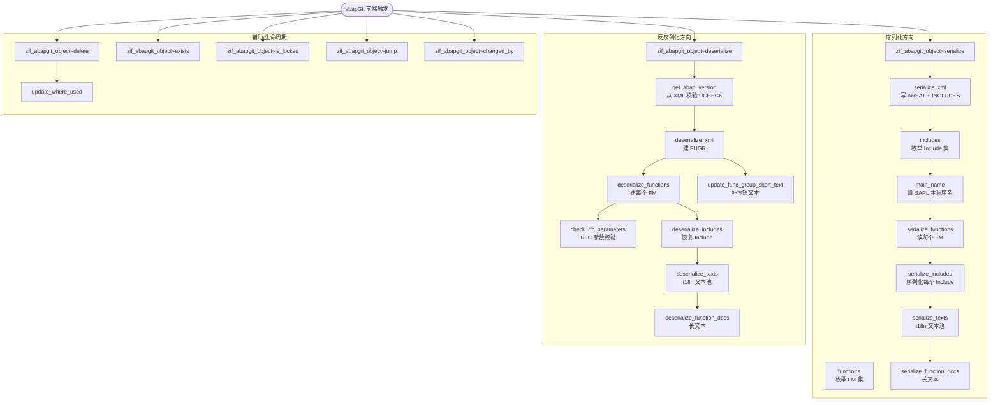
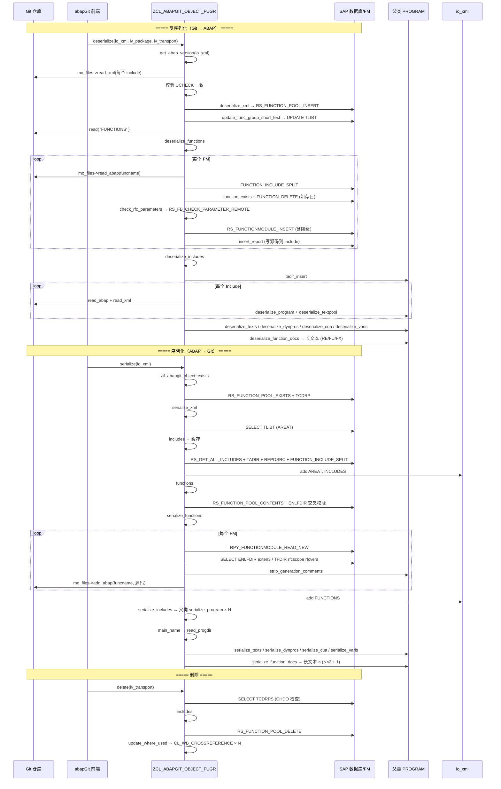

# ZCL_ABAPGIT_OBJECT_FUGR 程序分析报告

## 一、程序定位与业务背景

`ZCL_ABAPGIT_OBJECT_FUGR` 是 **abapGit** 项目里用来把 SAP **函数组（Function Group / FUGR）** 这一类"元对象"打包到 Git 仓库、再从 Git 恢复到 ABAP 系统的核心适配类。它继承自 `ZCL_ABAPGIT_OBJECTS_PROGRAM`，实现接口 `ZIF_ABAPGIT_OBJECT`，是 abapGit 一整套"每种对象一类"适配器中的一个成员。

**为什么需要它**：SAP 系统里一个函数组从来不是单一对象，而是"一坨"——它至少包括：一个 FUGR 主程序 `SAPL<GROUP>`、T00 / T99 / TFL / TOP / DATA 等多个 Include、N 个 Function Module（每个 FM 又有自己的 Include 文件 + 参数表 RSKIP/RSIMP/RSEX/RSCH/RSTBL/RSEXC/RSFDO + 长文本），再加上 DYNPRO、CUA 命令处理、文本池、变量设置等周边数据。传统的传输请求（TR）在跨系统迁移时把这些东西"打包成不可见的一坨"，Git 却无法直接表示。abapGit 的解法是：**一个 FUGR 在 Git 里 = 一个目录，目录下每个 Include 是一个 `.abap` 文件 + 一个 `.xml` 文件**；这个类就是负责双向转换的引擎。

**核心业务场景**：
- **序列化（serialize）**：从运行时表（`ENLFDIR` / `RSK*` 参数表 / `REPOSRC` / `TLIBT` / `D010TINF` / `EUDB` …）读取一个函数组的全部成分，把二进制/表结构翻成 XML 元数据 + ABAP 源码文本，交给 Git。
- **反序列化（deserialize）**：从 Git 读到的 XML 与源码里恢复元数据、Include、Function Module、长文本，落回 ABAP 系统。
- **辅助能力**：`exists / is_locked / jump / changed_by / delete`——供 abapGit 前端界面调用。

**设计范式一句话**：以接口方法 `serialize` / `deserialize` 为主入口，内部按"元数据 → 源码 → 派生表 → 长文本"分层，每个分层委托给私有方法；重资产操作（FUGR 主程序、Include、FM）复用父类 `ZCL_ABAPGIT_OBJECTS_PROGRAM` 的通用程序序列化能力，本类只负责"函数组特有的一层胶水"。

---

## 二、程序执行流程总览

### 2.1 流程总览图



### 2.2 责任链表

| 子程序 | 调用者 | 职责 |
|---|---|---|
| `zif_abapgit_object~serialize` | abapGit 上层调度器 | 序列化入口：编排 XML 元数据、Functions、Includes、Texts、Docs |
| `serialize_xml` | `serialize` | 读 `TLIBT` 短文本 + Include 清单，写入 `<AREAT>` / `<INCLUDES>` |
| `main_name` | 全类多处 | FUGR area 名 → `SAPL<GROUP>` 主程序名 |
| `includes` | `serialize`、`delete`、`changed_by`、`is_any_include_locked` | 从 `RS_GET_ALL_INCLUDES` 出发，剔除 FM/Tadir 自有/XTI/LSVIM 等噪声，得出"仅属本 FUGR 的 Include"清单，并做实例级缓存 |
| `functions` | `serialize`、`deserialize`、`jump`、`changed_by`、`is_any_function_module_locked` | 用 `RS_FUNCTION_POOL_CONTENTS` 取 FM 清单，再用 `ENLFDIR` 交叉校验修正不一致状态 |
| `serialize_functions` | `serialize` | 对每个 FM 调 `RPY_FUNCTIONMODULE_READ_NEW` 拉参数、文档、源码 |
| `serialize_includes` | `serialize` | 委托父类 `serialize_program` 逐个序列化 Include |
| `serialize_texts` | `serialize` | 读 `D010TINF` 拿非主语言清单，`READ TEXTPOOL` 装文本池 |
| `serialize_function_docs` | `serialize` | 序列化 FUGR 主长文本 + 每个 FM 的 FM/FX 长文本 |
| `zif_abapgit_object~deserialize` | abapGit 上层调度器 | 反序列化入口：编排 XML、Functions、Includes、Texts、Dynpros、CUA、Varis、Docs |
| `get_abap_version` | `deserialize` | 从所有 Include 的 PROGDIR 中取 UCHECK，校验一致性 |
| `deserialize_xml` | `deserialize` | 调 `RS_FUNCTION_POOL_INSERT` 建 FUGR，若已存在则补写短文本 |
| `update_func_group_short_text` | `deserialize_xml` | 直接 `UPDATE TLIBT` 补短文本 |
| `deserialize_functions` | `deserialize` | 对每个 FM 调 `RS_FUNCTIONMODULE_INSERT` 恢复；含参数兼容降级 |
| `check_rfc_parameters` | `deserialize_functions` | 用 `RS_FB_CHECK_PARAMETER_REMOTE` 校验 RFC 参数 |
| `deserialize_includes` | `deserialize` | 从 Git 读每个 Include 的 `.abap` 与 `.xml`，委托父类 `deserialize_program` |
| `deserialize_texts` | `deserialize` | 反序列化 i18n 文本池 |
| `deserialize_function_docs` | `deserialize` | 反序列化 FUGR 主长文本 + 每个 FM 的 FM/FX 长文本 |
| `zif_abapgit_object~delete` | abapGit 前端 | 删除 FUGR：调 `RS_FUNCTION_POOL_DELETE` 后刷 WHERE-USED |
| `update_where_used` | `delete` | 对每个 Include 触发 `CL_WB_CROSSREFERENCE->INDEX_ACTUALIZE` |
| `zif_abapgit_object~exists` | abapGit 前端 | `RS_FUNCTION_POOL_EXISTS` + `TCDRP` 排除 CHDO 生成的伪 FUGR |
| `zif_abapgit_object~is_locked` | abapGit 前端 | 汇总 FUGR / Include / FM / Dynpro / CUA / Text 六种锁 |
| `is_function_group_locked` | `is_locked` | 查 `EEUDB` + `FG` 前缀 |
| `is_any_include_locked` | `is_locked` | 遍历 Include 查 `ESRDIRE` 锁 |
| `is_any_function_module_locked` | `is_locked` | 遍历 FM 查 `ESFUNCTION` 锁 |
| `zif_abapgit_object~jump` | abapGit 前端 | 把 FM 名解析成对应 Include 名后交给 GUI Jumper |
| `zif_abapgit_object~changed_by` | abapGit 前端 | 从 `REPOSRC` / `REPOTEXT` / `EUDB` 三处拼最新改动者 |
| `is_part_of_other_fugr` | `includes` | 校验某个 Include 是否属于别的 FUGR / FUGS |
| `zif_abapgit_object~get_deserialize_steps` | abapGit 上层 | 声明 deserialize 需要走 `ABAP` 与 `LXE` 两步 |
| `zif_abapgit_object~get_comparator` / `~get_deserialize_order` / `~get_metadata` / `~is_active` / `~map_filename_to_object` / `~map_object_to_filename` | 上层 | 样板接口，全部空实现或委托父类 |

**下面按这条流程，逐个子程序展开。**

---

## 三、分组分析

### 3.1 全局声明区

类头部一次性声明了：三个长文本 ID 常量（`RE` / `FU` / `FX`，对应 FUGR 主程序、FM、FXC 异常文档）、类型 `ty_function`（一个 FM 的完整"画像"，含 `FUNCNAME` / 各种开关位 / 参数内表 / `EXCEPTION_CLASSES` 标志）、类型 `ty_sobj_name_tt` 与 `ty_function_tt`、以及两个实例数据 `mt_includes_cache` / `mt_includes_all`（都用于 Include 清单缓存）。

**做什么** — 常量固化长文本 ID，避免魔法字面量散落各方法；`ty_function` 结构对齐 `RS38L` 及参数表内表结构，让 FM 序列化/反序列化有统一中间表示；两个 cache 成员把耗时的 Include 扫描结果缓存到实例生命周期内。
**为什么** — FUGR 的 Include 枚举要跑 `RS_GET_ALL_INCLUDES` + `TADIR` + `REPOSRC` 三次数据库访问，任何一次遍历都可能调用 `includes( )` 五次以上；把结果放到实例变量可以显著降频，代价是该实例一旦用过就永远返回同一份，无法感知运行中 Include 集的变更。
**风险与改进** — `mt_includes_cache` 缺少失效钩子。若在同一个 `zcl_abapgit_object_fugr` 实例上先执行 `deserialize_includes`（会新建 Include）、再调用 `includes( )`，拿到的是过期清单，可能导致新 Include 没被后续步骤处理。建议在每次成功反序列化或修改 Include 集的操作后显式 `CLEAR mt_includes_cache`，或改造成惰性重算 + TTL 缓存。

---

### 3.2 序列化入口 `zif_abapgit_object~serialize`

```abap
METHOD zif_abapgit_object~serialize.

* function group SEUF
* function group SIFP
* function group SUNI

    DATA: lt_functions    TYPE ty_function_tt,
          ls_progdir      TYPE zif_abapgit_sap_report=>ty_progdir,
          lv_program_name TYPE syrepid,
          lt_dynpros      TYPE ty_dynpro_tt,
          ls_cua          TYPE ty_cua,
          lt_varis        TYPE ty_vari_tt.

    IF zif_abapgit_object~exists( ) = abap_false.
      RETURN.
    ENDIF.

    serialize_xml( io_xml ).

    lt_functions = serialize_functions( ).

    io_xml->add( iv_name = 'FUNCTIONS'
                 ig_data = lt_functions ).

    serialize_includes( ).

    lv_program_name = main_name( ).

    ls_progdir = zcl_abapgit_factory=>get_sap_report( )->read_progdir( lv_program_name ).

    IF mo_i18n_params->is_lxe_applicable( ) = abap_false.
      serialize_texts(
        iv_prog_name = lv_program_name
        ii_xml       = io_xml ).
    ENDIF.

    IF ls_progdir-subc = 'F'.
      lt_dynpros = serialize_dynpros( lv_program_name ).
      io_xml->add( iv_name = 'DYNPROS'
                   ig_data = lt_dynpros ).

      ls_cua = serialize_cua( lv_program_name ).
      io_xml->add( iv_name = 'CUA'
                   ig_data = ls_cua ).

      lt_varis = serialize_varis( lv_program_name ).
      io_xml->add( iv_name = 'VARIS'
                   ig_data = lt_varis ).
    ENDIF.

    serialize_function_docs( iv_prog_name = lv_program_name
                             it_functions = lt_functions
                             ii_xml       = io_xml ).

  ENDMETHOD.
```

**做什么** — 先检查 FUGR 是否存在（不存在直接返回，避免空操作）；然后按固定顺序编排 6 个序列化子步骤：`serialize_xml` 写元数据 → `serialize_functions` 装 FM 清单并回写 XML → `serialize_includes` 遍历序列化每个 Include 程序 → 读主程序 `PROGDIR` 判断子类型 → 按需要写 i18n 文本池 → 若 FUGR 带屏幕（`subc = 'F'`）追加 DYNPRO/CUA/VARIS → 最后写长文本。
**为什么** — 顺序体现了对象依赖：FUGR 元数据 → 结构（FM/Include） → 派生表（文本/DYNPRO） → 文档。i18n 判断和 DYNPRO 分支保证了"不引入不必要数据"（LXE 系统跳过文本池，无屏幕 FUGR 跳过 DYNPRO），符合"只序列化实际存在的东西"的原则。
**风险与改进** — `serialize` 与 `deserialize` 是镜像对称的一对入口，两者的调用顺序必须严格一致（`serialize` 里 DYNPRO 在文本池之后，`deserialize` 里 DYNPRO 在文本池之后也是）；如果后续单独修改一侧的顺序，Git 仓库里可能出现"新仓库按旧顺序写、旧程序按新顺序读"的不兼容问题，建议两侧顺序通过一个共享常量或注释同步管理。另外顶部注释列出的 SEUF/SIFP/SUNI 三个系统 FUGR 属于"应该被排除但不能排除"的历史遗留，实际过滤依赖 `exists` 的 CHDO 检查，若哪天 abapGit 支持系统对象导入，这里就成了坑。

---

### 3.3 `serialize_xml`

```abap
METHOD serialize_xml.

    DATA: lt_includes TYPE ty_sobj_name_tt,
          lv_areat    TYPE tlibt-areat.

    SELECT SINGLE areat INTO lv_areat
      FROM tlibt
      WHERE spras = mv_language
      AND area = ms_item-obj_name.        "#EC CI_GENBUFF "#EC CI_SUBRC

    lt_includes = includes( ).

    ii_xml->add( iv_name = 'AREAT'
                 ig_data = lv_areat ).
    ii_xml->add( iv_name = 'INCLUDES'
                 ig_data = lt_includes ).

  ENDMETHOD.
```

**做什么** — 从 `TLIBT` 取当前语言下的函数组短文本 `AREAT`，从 `includes( )` 拿 Include 清单，两个字段一并写入 XML。
**为什么** — 短文本与 Include 清单属于"轻量元数据"，与后面较重的源码/参数分离，能让反序列化阶段先快速搭建骨架。
**风险与改进** — `spras = mv_language` 硬绑定当前会话语言，若仓库目标语言与源语言不同（比如从英文系统导入到中文系统），`AREAT` 会丢失；应改为 `SELECT DISTINCT area, areat FROM TLIBT` 全语言序列化并在 `deserialize_xml` 里按语言写回，或在 i18n 分支单独序列化短文本的多语言版本。

---

### 3.4 `main_name`

```abap
METHOD main_name.

    DATA: lv_area      TYPE rs38l-area,
          lv_namespace TYPE rs38l-namespace,
          lv_group     TYPE rs38l-area.

    lv_area = ms_item-obj_name.

    CALL FUNCTION 'FUNCTION_INCLUDE_SPLIT'
      EXPORTING
        complete_area = lv_area
      IMPORTING
        namespace = lv_namespace
        group = lv_group
      EXCEPTIONS
        include_not_exists           = 1
        group_not_exists             = 2
        no_selections                = 3
        no_function_include          = 4
        no_function_pool             = 5
        delimiter_wrong_position     = 6
        no_customer_function_group   = 7
        no_customer_function_include = 8
        reserved_name_customer       = 9
        namespace_too_long           = 10
        area_length_error            = 11
        OTHERS                       = 12.
    IF sy-subrc <> 0.
      zcx_abapgit_exception=>raise_t100( ).
    ENDIF.

    CONCATENATE lv_namespace 'SAPL' lv_group INTO rv_program.

  ENDMETHOD.
```

**做什么** — 输入 FUGR 名（可能带 `/namespace` 前缀），调 `FUNCTION_INCLUDE_SPLIT` 拆出命名空间和分组名，拼接成 ABAP 主程序 `SAPL<GROUP>`。
**为什么** — FUGR 与其主程序 `SAPL<GROUP>` 的对应关系是 SAP 底层约定，无法直接查表得到主程序名，必须用这个"半解析+半拼接"的方式；`FUNCTION_INCLUDE_SPLIT` 同时能覆盖 namespace 与非 namespace 两种形态。
**风险与改进** — `main_name` 是纯函数式计算，但**在整个类里被重复调用**（`serialize`、`deserialize`、`is_locked`、`jump`、`zif_abapgit_object~changed_by` 都会调用），且每次都跑一次同步 FM 调用。建议改成实例惰性属性或加一个 `mv_main_program` 缓存字段；`sy-subrc <> 0` 直接抛 `raise_t100` 意味着任何异常都会冒泡为通用异常，日志定位困难，可考虑把 FM 子错误码翻译为业务错误消息。

---

### 3.5 `includes`

**分五步完成"从所有 Include 到干净清单"的过滤链**：

#### ① 缓存检查 + 主程序名获取

```abap
IF lines( mt_includes_cache ) > 0.
  rt_includes = mt_includes_cache.
  RETURN.
ENDIF.

lv_program = main_name( ).
lt_functab = functions( ).

CALL FUNCTION 'RS_GET_ALL_INCLUDES'
  EXPORTING
    program = lv_program
  TABLES
    includetab = rt_includes
  EXCEPTIONS
    not_existent = 1
    no_program   = 2
    OTHERS       = 3.
IF sy-subrc <> 0.
  zcx_abapgit_exception=>raise( 'Error from RS_GET_ALL_INCLUDES' ).
ENDIF.
```

**做什么** — 若已有缓存直接返回；否则算主程序名、拿到 FM 清单，从 `RS_GET_ALL_INCLUDES` 拉所有相关 Include（含函数模块 include）。
**为什么** — `RS_GET_ALL_INCLUDES` 是 SAP 官方标准 FM，覆盖了主程序与所有 T00/TFL/TOP/DATA/FM 相关 include 的完整清单，比自己扫 `ENLFDIR`/`REPOSRC` 更保险。
**风险与改进** — 缓存在实例级，`deserialize_includes` 新建 include 后不会失效（见 3.1）；`functions( )` 会触发一次 FUGR 内容 FM 调用，两个缓存之间无依赖管理，容易顺序错乱。

#### ② 剔除 FM 相关 Include

```abap
LOOP AT lt_functab ASSIGNING <ls_func>.
  DELETE TABLE rt_includes FROM <ls_func>-include.
ENDLOOP.
```

**做什么** — 从 `RS_GET_ALL_INCLUDES` 返回的清单里删掉所有 Function Module 专属的 Include（它们后面会由 `serialize_functions` 单独处理）。
**为什么** — abapGit 的存储策略是 FM 与 Include 分家：Include 作为"共享代码段"归到 FUGR 主体目录，FM 作为独立单元走 `serialize_functions` 路径，两者不能重复。
**风险与改进** — 使用 `DELETE ... FROM` 按表行值删除，性能可接受但可读性略差；无异常保护，若 `functions( )` 返回空（FUGR 无 FM）这段循环体为空，逻辑正确。

#### ③ 追加 T00 维护视图 Include

```abap
IF ms_item-obj_name(1) <> '/'.
  "FGroup name does not contain a namespace
  lv_maintviewname = |L{ ms_item-obj_name }T00|.
ELSE.
  "FGroup name contains a namespace
  lv_offset_ns = find( val = ms_item-obj_name+1
                       sub = '/' ).
  lv_offset_ns = lv_offset_ns + 2.
  lv_maintviewname = |{ ms_item-obj_name(lv_offset_ns) }L{ ms_item-obj_name+lv_offset_ns }T00|.
ENDIF.

READ TABLE rt_includes WITH KEY table_line = lv_maintviewname TRANSPORTING NO FIELDS.
IF sy-subrc <> 0.
  APPEND lv_maintviewname TO rt_includes.
ENDIF.
```

**做什么** — 按 SAP 命名约定 `L<FGROUP>T00`（命名空间情形下把 namespace 拼进前缀）计算 T00 维护视图 include 名，若 `RS_GET_ALL_INCLUDES` 未返回则追加。
**为什么** — 历史经验：某些场景下 `RS_GET_ALL_INCLUDES` 漏掉 `LT00` 类 include，尤其是新建的 T-code 视图配置；主动追加更稳。
**风险与改进** — 手动拼接规则与 `FUNCTION_INCLUDE_SPLIT` 的算法存在耦合，若命名空间规则变化（例如未来 SAP 引入更深层级），此处的字符串截取 `lv_offset_ns = lv_offset_ns + 2` 会静默失配。建议把 T00 include 名的构造抽成独立 helper，或统一走 `FUNCTION_INCLUDE_SPLIT`。

#### ④ 用 `TADIR` 剔除"自有 TADIR 记录"的 Include

```abap
SELECT obj_name
  INTO TABLE lt_tadir_includes
  FROM tadir
  FOR ALL ENTRIES IN rt_includes
  WHERE pgmid      = 'R3TR'
        AND object = 'PROG'
        AND obj_name = rt_includes-table_line.
LOOP AT rt_includes ASSIGNING <lv_include>.
  " skip autogenerated includes from Table Maintenance Generator
  IF <lv_include> CP 'LSVIM*'.
    DELETE rt_includes INDEX sy-tabix.
    CONTINUE.
  ENDIF.
  READ TABLE lt_tadir_includes WITH KEY table_line = <lv_include> TRANSPORTING NO FIELDS.
  IF sy-subrc = 0.
    DELETE rt_includes.
    CONTINUE.
  ENDIF
```

**做什么** — 用 `TADIR` 检查每个 Include 是否有独立条目；有独立 `TADIR` 的 include 视为"独立 PROG 对象"（跨包或跨 FUGR 共享），不属于当前 FUGR；同时按命名模式 `LSVIM*` 剔除 Table Maintenance Generator 自动生成的 include。
**为什么** — 只有"依附于 FUGR 而生"的 include 才能安全地打包进 FUGR；有独立 `TADIR` 的说明它被单独维护，强行打包会造成跨包依赖。
**风险与改进** — `FOR ALL ENTRIES IN rt_includes` 之前没有 `IF lines( rt_includes ) = 0 RETURN` 保护，虽然此处外层已有 `IF lines( rt_includes ) > 0` 判断，但阅读顺序不直观；`obj_name = rt_includes-table_line` 这种"字段名对齐字段引用"是 ABAP 隐式对齐，可读性弱，建议显式写 `obj_name = @rt_includes-table_line`（若编译器支持）或用中间变量。

#### ⑤ 用 `REPOSRC` 与 `is_part_of_other_fugr` 双重过滤

```abap
IF lines( rt_includes ) > 0.
  SELECT progname FROM reposrc
    INTO TABLE lt_reposrc
    FOR ALL ENTRIES IN rt_includes
    WHERE progname = rt_includes-table_line
    AND r3state = 'A'.
ENDIF
SORT lt_reposrc BY progname ASCENDING.

LOOP AT rt_includes ASSIGNING <lv_include>.
  lv_tabix = sy-tabix.
  READ TABLE lt_reposrc INTO ls_reposrc
    WITH KEY progname = <lv_include> BINARY SEARCH.
  IF sy-subrc <> 0.
    DELETE rt_includes INDEX lv_tabix.
    CONTINUE.
  ENDIF.
  IF is_part_of_other_fugr( <lv_include> ) = abap_true.
    DELETE rt_includes.
  ENDIF
ENDLOOP.

APPEND lv_program TO rt_includes.
SORT rt_includes.
mt_includes_cache = rt_includes.
```

**做什么** — 用 `REPOSRC` 确认每个 Include 有活跃版本（防止打包不存在的对象），再用 `is_part_of_other_fugr` 兜底剔除属于其他 FUGR/FUGS 的 include；最后把主程序 `SAPL<GROUP>` 本身追加进清单，整体排序、缓存。
**为什么** — `BINARY SEARCH` 前提是先 `SORT`，代码顺序正确；`is_part_of_other_fugr` 是最后一道防线，避免 `TADIR` 判断漏洞；把主程序加入清单是刻意设计——因为 `serialize_includes` 会遍历整个清单去序列化，主程序 `SAPL<GROUP>` 不能被漏掉。
**风险与改进** — 循环体内多次 `DELETE rt_includes` 依赖 `sy-tabix` 或当前赋值字段，`DELETE rt_includes` 无 `INDEX` 参数会按当前字段删（`<lv_include>`），语义正确但语义不明确，可读性差；`READ TABLE ... BINARY SEARCH` 要求表严格排序，`SORT lt_reposrc BY progname ASCENDING` 之后 `BINARY SEARCH` 才安全，但这里 `SORT rt_includes` 没做（后面追加主程序后 SORT 一次），当前顺序 OK，但**若有人在中间插入一条新逻辑，很容易破坏这个前提**。

**过渡：** `includes` 输出的是"干净的 Include 清单"，接下来 `serialize_includes` 会逐条委托父类处理；同时 `serialize_functions` 会用 `functions( )` 拿另一条"FM 清单"，走完全不同的路径。

---

### 3.6 `functions`

```abap
METHOD functions.

    DATA: lv_area    TYPE rs38l-area,
          lt_enlfdir TYPE STANDARD TABLE OF enlfdir.
    DATA lv_index TYPE i.

    FIELD-SYMBOLS: <ls_functab> TYPE LINE OF ty_rs38l_incl_tt,
                   <ls_enlfdir> TYPE enlfdir.

    lv_area = ms_item-obj_name.

    CALL FUNCTION 'RS_FUNCTION_POOL_CONTENTS'
      EXPORTING
        function_pool = lv_area
      TABLES
        functab = rt_functab
      EXCEPTIONS
        function_pool_not_found = 1
        OTHERS                  = 2.
    IF sy-subrc <> 0.
      zcx_abapgit_exception=>raise_t100( ).
    ENDIF.

    " FM RS_FUNCTION_POOL_CONTENTS is not reliable if Function Group is inconsistent, so cross-check results (#7147)
    " Don't check active flag, or the includes become wrong (#7702)
    SELECT * FROM enlfdir
      INTO TABLE lt_enlfdir
      WHERE area = ms_item-obj_name
      ORDER BY funcname.                                  "#EC CI_SUBRC

    LOOP AT lt_enlfdir ASSIGNING <ls_enlfdir>.
      TRANSLATE <ls_enlfdir>-funcname TO UPPER CASE.
    ENDLOOP.

    SORT lt_enlfdir BY funcname ASCENDING.

    "Remove anything not in FM attributes table
    LOOP AT rt_functab ASSIGNING <ls_functab>.
      TRANSLATE <ls_functab> TO UPPER CASE.
      lv_index = sy-tabix.
      READ TABLE lt_enlfdir WITH KEY funcname = <ls_functab>-funcname TRANSPORTING NO FIELDS.
      IF sy-subrc <> 0.
        DELETE rt_functab INDEX lv_index.
      ENDIF
    ENDLOOP.

    SORT rt_functab BY funcname ASCENDING.
    DELETE ADJACENT DUPLICATES FROM rt_functab COMPARING funcname.

  ENDMETHOD.
```

**做什么** — 从 `RS_FUNCTION_POOL_CONTENTS` 拿权威 FM 清单 → 从 `ENLFDIR` 拿交叉校验清单 → 剔除仅在 FM 表存在、`ENLFDIR` 缺失的项（不一致状态） → 去重排序。
**为什么** — 注释 `#7147` 与 `#7702` 记录了这个方法存在的原因：`RS_FUNCTION_POOL_CONTENTS` 在函数组结构不一致时返回"幽灵 FM"，直接用会污染后续所有操作；`ENLFDIR` 是真正承载 FM 元数据的核心表，用它做交集修正比检查 active 标志（`r3state = 'A'`）更保险——因为 include 名判断会依赖 inactive FM 的 include 路径。
**风险与改进** — `LOOP AT rt_functab ... DELETE rt_functab INDEX lv_index` 在循环体内删当前行是合法的但**依赖 `lv_index` 及时捕获**，如果未来在 `TRANSLATE` 前后插入任何会修改 `sy-tabix` 的语句，就会错位；更稳的写法是收集"待删索引"再一次 `DELETE`，或用 `LOOP ... WHERE` 反向筛。另外 `DELETE ADJACENT DUPLICATES COMPARING funcname` 只保留第一个，语义正确但会丢其它字段差异（比如两个 `RS38L_INCL` 条目同名但 `include` 字段不同），此处依赖上游去重，属于隐性契约。

---

### 3.7 `serialize_functions`

**分四步**：调官方 FM 读参数、修文档索引、补读 FM 扩展表、写源码文件。

#### ① 读 FM 元数据与源码

```abap
LOOP AT lt_functab ASSIGNING <ls_func>.
* fm RPY_FUNCTIONMODULE_READ does not support source code
* lines longer than 72 characters
  CLEAR ls_function.
  MOVE-CORRESPONDING <ls_func> TO ls_function.

  CLEAR lt_new_source.
  CLEAR lt_source.

  CALL FUNCTION 'RPY_FUNCTIONMODULE_READ_NEW'
    EXPORTING
      functionname = <ls_func>-funcname
    IMPORTING
      global_flag = ls_function-global_flag
      remote_call = ls_function-remote_call
      update_task = ls_function-update_task
      short_text  = ls_function-short_text
      remote_basxml_supported = ls_function-remote_basxml
    TABLES
      import_parameter  = ls_function-import
      changing_parameter = ls_function-changing
      export_parameter  = ls_function-export
      tables_parameter  = ls_function-tables
      exception_list    = ls_function-exception
      documentation     = ls_function-documentation
      source            = lt_source
    CHANGING
      new_source = lt_new_source
    EXCEPTIONS
      error_message      = 1
      function_not_found = 2
      invalid_name       = 3
      OTHERS             = 4.
  IF sy-subrc = 2.
    CONTINUE.
  ELSEIF sy-subrc <> 0.
    zcx_abapgit_exception=>raise( 'Error from RPY_FUNCTIONMODULE_READ_NEW' ).
  ENDIF.
```

**做什么** — 对每个 FM 名，调 `RPY_FUNCTIONMODULE_READ_NEW` 一次拿齐：接口标志、参数四表（IMPORT/EXPORT/CHANGING/TABLES）、异常、文档、旧格式源码 `lt_source`、新格式源码 `lt_new_source`。
**为什么** — 官方老 FM `RPY_FUNCTIONMODULE_READ` 不支持超过 72 字符的源码行（见方法内注释），必须换用 `_NEW` 版本；`new_source` 优先是因为它保留长行。
**风险与改进** — `MOVE-CORRESPONDING <ls_func> TO ls_function` 是把 `RS38L_INCL` 的 `funcname` 复制到 `ty_function`；随后 FM 返回值会覆盖除 `funcname` 之外的其他字段，属于"先兜底再覆盖"的经典写法，OK；`function_not_found` 直接 `CONTINUE` 是宽容策略，日志不友好，建议在 `CONTINUE` 前 `ii_log->add_warning`（此方法当前没有 log 参数，只能抛异常或忽略）。

#### ② 修文档索引

```abap
LOOP AT ls_function-documentation ASSIGNING <ls_documentation>.
  CLEAR <ls_documentation>-index.
ENDLOOP.
```

**做什么** — 清空参数文档 `RSFDO` 的 `index` 字段。
**为什么** — `RSFDO` 的 `index` 是运行时序数，反序列化时会被重新计算；序列化阶段留空可避免 Git 上出现无意义的序号漂移（改一个参数前后所有 index 都会变，导致 diff 噪声）。
**风险与改进** — 这是"消除无意义变更"的良好实践，但清 index 也丢掉了参数的原始顺序信息；反序列化时若依赖 `RS_FUNCTIONMODULE_INSERT` 用行序重建，需要保证 `documentation` 表的行序与参数行的行序一致（当前依赖 FM 返回顺序，风险低）。

#### ③ 补读扩展字段

```abap
SELECT SINGLE exten3 INTO ls_function-exception_classes FROM enlfdir
  WHERE funcname = <ls_func>-funcname.              "#EC CI_SUBRC

" Scope and Interface Contract only for 7.55 or higher
TRY.
    SELECT SINGLE rfcscope rfcvers INTO CORRESPONDING FIELDS OF ls_function FROM ('TFDIR')
      WHERE funcname = <ls_func>-funcname.          "#EC CI_SUBRC
  CATCH cx_sy_dynamic_osql_semantics ##NO_HANDLER.
ENDTRY.
```

**做什么** — 从 `ENLFDIR` 补读 `exten3`（是否使用异常类）；用动态表名 `'TFDIR'` 尝试读 `rfcscope`/`rfcvers`（ABAP 7.55+ 才有）。
**为什么** — 这两个字段在官方 FM 里没暴露，必须直接查表；`TRY/CATCH cx_sy_dynamic_osql_semantics` 是"探测低版本系统"的标准写法，兼容 7.55 以下。
**风险与改进** — 动态 SQL 与 `CATCH ... ##NO_HANDLER` 是最优雅的降级手段，但**注释里只写"not on lower releases"，没有记录 7.55 起才有**，交接时新人容易误以为 `TFDIR` 是历史表；建议在 `TYPES` 声明处（见全局声明区 `rfcscope`/`rfcvers`）补注释指向 SAP Note 或具体版本。

#### ④ 写源码文件

```abap
APPEND ls_function TO rt_functions.

IF NOT lt_new_source IS INITIAL.
  strip_generation_comments( CHANGING ct_source = lt_new_source ).
  mo_files->add_abap(
    iv_extra = <ls_func>-funcname
    it_abap  = lt_new_source ).
ELSE.
  strip_generation_comments( CHANGING ct_source = lt_source ).
  mo_files->add_abap(
    iv_extra = <ls_func>-funcname
    it_abap  = lt_source ).
ENDIF.
```

**做什么** — 把 FM 元数据追加进返回值，同时按 `new_source` 优先、`source` 兜底的策略写源码文件，写之前用 `strip_generation_comments` 剥离生成注释。
**为什么** — `strip_generation_comments` 是关键设计：不剥离的话，SAP 生成的注释（如 `*----*----*----` 或版本号）会在每次导入-导出循环里产生 diff 噪声，Git 上会看到"没改动但显示改了"的假变更。
**风险与改进** — 依赖 `new_source` 非空做优先，若某 FM 是新代码但 `RPY_FUNCTIONMODULE_READ_NEW` 因为版本过低返回空 `new_source`，会 fallback 到 `source`（可能被截断到 72 字符），**源码内容会静默丢失**——这是低版本系统的历史坑，代码里靠 `types` 注释 `not on older releases` 提醒，但没有主动检测并给出警告。

---

### 3.8 `serialize_includes`

```abap
METHOD serialize_includes.

    DATA: lt_includes TYPE ty_sobj_name_tt.
    FIELD-SYMBOLS: <lv_include> LIKE LINE OF lt_includes.

    lt_includes = includes( ).

    LOOP AT lt_includes ASSIGNING <lv_include>.
* todo, filename is not correct, a include can be used in several programs
      serialize_program( is_item    = ms_item
                         io_files   = mo_files
                         iv_program = <lv_include>
                         iv_extra   = <lv_include> ).
    ENDLOOP.

  ENDMETHOD.
```

**做什么** — 拿 Include 清单，逐个委托父类 `serialize_program` 序列化。
**为什么** — Include 本质就是"没有 `SAPL`/`L<xxx>` 主入口的程序"，与真正的 PROG 对象走同一条序列化路径，通过父类复用可以省掉大量重复代码。
**风险与改进** — 方法上方注释 `todo, filename is not correct` 承认了"Include 可能被多个程序共享"的固有问题：abapGit 目前的策略是"归属当前 FUGR"，若某个 Include 同时被 FUGR A 和 PROG B 引用，两边打包会重复但内容一致，反序列化时后写者会覆盖——属于**已知设计取舍而非 bug**。建议在文档或 `README` 里显式声明。

---

### 3.9 `serialize_texts`

```abap
METHOD serialize_texts.
    DATA: lt_tpool_i18n TYPE zif_abapgit_lang_definitions=>ty_i18n_tpools,
          lt_tpool      TYPE textpool_table.
    FIELD-SYMBOLS <ls_tpool> LIKE LINE OF lt_tpool_i18n.

    IF mo_i18n_params->ms_params-main_language_only = abap_true.
      RETURN.
    ENDIF.

    " Table d010tinf stores info. on languages in which program is maintained
    " Select all active translations of program texts
    " Skip main language - it was already serialized
    SELECT DISTINCT language
      INTO CORRESPONDING FIELDS OF TABLE lt_tpool_i18n
      FROM d010tinf
      WHERE r3state = 'A'
      AND prog = iv_prog_name
      AND language <> mv_language
      ORDER BY language ##TOO_MANY_ITAB_FIELDS.

    mo_i18n_params->trim_saplang_keyed_table(
      EXPORTING
        iv_lang_field_name = 'LANGUAGE'
      CHANGING
        ct_tab = lt_tpool_i18n ).

    SORT lt_tpool_i18n BY language ASCENDING.
    LOOP AT lt_tpool_i18n ASSIGNING <ls_tpool>.
      READ TEXTPOOL iv_prog_name
        LANGUAGE <ls_tpool>-language
        INTO lt_tpool.
      <ls_tpool>-textpool = add_tpool( lt_tpool ).
    ENDLOOP.

    ii_xml->add( iv_name = 'I18N_TPOOL'
                 ig_data = lt_tpool_i18n ).
  ENDMETHOD.
```

**做什么** — 若配置只保主语言直接返回；否则从 `D010TINF` 取非主语言的活跃版本，用 `READ TEXTPOOL` 内建语句逐语言装文本池，包装进 `I18N_TPOOL` XML 节点。
**为什么** — 主语言文本池由父类的通用 `serialize_program` 处理，i18n 分支只处理"差异语言"，避免重复；`READ TEXTPOOL` 比直接 `SELECT FROM REPOTEXT` 更简洁，也自动处理 `text_id` 到 `ID` 的映射。
**风险与改进** — `SELECT DISTINCT ... ORDER BY language` 后紧接 `SORT ... BY language ASCENDING`，一次冗余排序（SELECT 已排序）；`READ TEXTPOOL` 若返回空（比如某个语言版本无内容），`lt_tpool` 为空表被 `add_tpool` 包装后仍会写出一个空条目，反序列化时可能造出一个只有 header 的行，建议加 `IF lt_tpool IS INITIAL CONTINUE` 保护。

---

### 3.10 `serialize_function_docs`

```abap
METHOD serialize_function_docs.

    FIELD-SYMBOLS <ls_func> LIKE LINE OF it_functions.

    zcl_abapgit_factory=>get_longtexts( )->serialize(
      iv_longtext_id = c_longtext_id_prog
      iv_object_name = iv_prog_name
      io_i18n_params = mo_i18n_params
      ii_xml         = ii_xml ).

    LOOP AT it_functions ASSIGNING <ls_func>.
      zcl_abapgit_factory=>get_longtexts( )->serialize(
        iv_longtext_name = |LONGTEXTS_{ <ls_func>-funcname }|
        iv_longtext_id   = c_longtext_id_func
        iv_object_name   = <ls_func>-funcname
        io_i18n_params   = mo_i18n_params
        ii_xml           = ii_xml ).
      zcl_abapgit_factory=>get_longtexts( )->serialize(
        iv_longtext_name = |LONGTEXTS_{ <ls_func>-funcname }___EXC|
        iv_longtext_id   = c_longtext_id_func_exc
        iv_object_name   = <ls_func>-funcname
        io_i18n_params   = mo_i18n_params
        ii_xml           = ii_xml ).
    ENDLOOP.

  ENDMETHOD.
```

**做什么** — 先序列化 FUGR 主程序的长文本（`ID = 'RE'`），再遍历 FM 分别序列化 FM 文档（`ID = 'FU'`）与异常文档（`ID = 'FX'`），三者的 XML 节点名用 `LONGTEXTS_` 前缀 + 特殊 `___EXC` 后缀区分。
**为什么** — 长文本在 SAP 里是 `T*` 系列独立表，与源码分离；`LONGTEXTS_` 命名约定让反序列化时能通过 XML 节点名反查是 FM 还是 FX，无需再读 FM 列表。
**风险与改进** — 命名空间里出现 33 字符的函数名时，`LONGTEXTS_<FUNCNAME>` 会突破 `T100-ID` 常见的 30 字符限制（取决于长文本表结构），此处没做长度保护；若日后支持命名空间 FM，需要评估 `TTEXT` 表结构对 ID 字段的容量。

---

### 3.11 反序列化入口 `zif_abapgit_object~deserialize`

```abap
METHOD zif_abapgit_object~deserialize.

    DATA: lv_program_name TYPE syrepid,
          lv_abap_version TYPE trdir-uccheck,
          lt_functions    TYPE ty_function_tt,
          lt_dynpros      TYPE ty_dynpro_tt,
          ls_cua          TYPE ty_cua,
          lt_varis        TYPE ty_vari_tt.

    lv_abap_version = get_abap_version( io_xml ).

    deserialize_xml(
      ii_xml       = io_xml
      iv_version   = lv_abap_version
      iv_package   = iv_package
      iv_transport = iv_transport ).

    io_xml->read( EXPORTING iv_name = 'FUNCTIONS'
                  CHANGING  cg_data = lt_functions ).

    deserialize_functions(
      it_functions = lt_functions
      ii_log       = ii_log
      iv_version   = lv_abap_version
      iv_package   = iv_package
      iv_transport = iv_transport ).

    deserialize_includes(
      ii_xml     = io_xml
      iv_package = iv_package
      ii_log     = ii_log ).

    lv_program_name = main_name( ).

    IF mo_i18n_params->is_lxe_applicable( ) = abap_false.
      deserialize_texts( iv_prog_name = lv_program_name
                         ii_xml       = io_xml ).
    ENDIF.

    io_xml->read( EXPORTING iv_name = 'DYNPROS'
                  CHANGING  cg_data = lt_dynpros ).

    deserialize_dynpros( lt_dynpros ).

    io_xml->read( EXPORTING iv_name = 'CUA'
                  CHANGING  cg_data = ls_cua ).

    deserialize_cua( iv_program_name = lv_program_name
                     is_cua          = ls_cua ).

    io_xml->read( EXPORTING iv_name = 'VARIS'
                  CHANGING  cg_data = lt_varis ).

    deserialize_varis( iv_program_name = lv_program_name
                       it_varis        = lt_varis ).

    deserialize_function_docs(
      iv_prog_name = lv_program_name
      it_functions = lt_functions
      ii_xml       = io_xml ).

  ENDMETHOD.
```

**做什么** — 顺序编排：`get_abap_version` → `deserialize_xml`（建 FUGR） → 读 FUNCTIONS 节点 → `deserialize_functions` → `deserialize_includes` → 按 LXE 判断走 i18n 文本池 → 依次处理 DYNPRO / CUA / VARIS → 最后写长文本。
**为什么** — 顺序体现依赖：FUGR 主表必须最先存在，才能让 `RS_FUNCTIONMODULE_INSERT` 通过；DYNPRO/CUA/VARIS 都依赖主程序存在；长文本最后写是因为它依赖 FM 对象已经插入完毕（长文本的 `OBJECT_NAME` 就是 FM 名）。
**风险与改进** — 与 `serialize` 严格镜像（3.2），但 DYNPRO 判断在 `serialize` 里是"读 PROGDIR 后决定"，`deserialize` 里则"无条件读 DYNPROS 节点并传给 `deserialize_dynpros`"，若 XML 里没有该节点 `lt_dynpros` 是空表——`deserialize_dynpros` 必须容忍空输入，属于隐式契约；建议加注释或断言 `ASSERT lt_dynpros IS INITIAL OR ...`。

**过渡：** 反序列化主流程拆完了，接下来看每一步的关键实现，特别是 `deserialize_functions` 里的两处大 try-catch 补丁。

---

### 3.12 `get_abap_version`

```abap
METHOD get_abap_version.

    DATA: lt_includes TYPE ty_sobj_name_tt,
          ls_progdir  TYPE zif_abapgit_sap_report=>ty_progdir,
          lo_xml      TYPE REF TO zif_abapgit_xml_input.

    FIELD-SYMBOLS: <lv_include> LIKE LINE OF lt_includes.

    ii_xml->read( EXPORTING iv_name = 'INCLUDES'
                  CHANGING  cg_data = lt_includes ).

    LOOP AT lt_includes ASSIGNING <lv_include>.
      lo_xml = mo_files->read_xml( <lv_include> ).
      lo_xml->read( EXPORTING iv_name = 'PROGDIR'
                    CHANGING  cg_data = ls_progdir ).

      IF ls_progdir-uccheck IS INITIAL.
        CONTINUE.
      ELSEIF rv_abap_version IS INITIAL.
        rv_abap_version = ls_progdir-uccheck.
        CONTINUE.
      ELSEIF rv_abap_version <> ls_progdir-uccheck.
*** All includes need to have the same ABAP language version
        zcx_abapgit_exception=>raise( 'different ABAP Language Versions' ).
      ENDIF
    ENDLOOP.

    IF rv_abap_version IS INITIAL.
      set_abap_language_version( CHANGING cv_abap_language_version = rv_abap_version ).
    ENDIF.

  ENDMETHOD.
```

**做什么** — 遍历 INCLUDES 清单，逐个读 XML 中的 PROGDIR，抓取 `uccheck` 字段；空值跳过，首个非空值定为基准，后续任一 include 与基准不同则抛异常；若全部为空则回退到 `set_abap_language_version` 设置默认值。
**为什么** — 一个 FUGR 的所有 Include 必须使用相同的 ABAP Language Version（UCHECK），否则激活时会有兼容性问题；把校验前置到反序列化入口可以在最早期拒绝错误输入。
**风险与改进** — 每个 include 都要读一次磁盘 XML，若 FUGR 有 20+ Include，磁盘 I/O 密集；建议一次性把所有 XML 加载成内存字典；异常消息 `'different ABAP Language Versions'` 过于笼统，没告诉用户是哪两个 include 冲突，建议在抛异常前把冲突的 include 名与版本值附加到消息里。

---

### 3.13 `deserialize_xml`

```abap
METHOD deserialize_xml.

    DATA: lv_complete  TYPE rs38l-area,
          lv_namespace TYPE rs38l-namespace,
          lv_areat     TYPE tlibt-areat,
          lv_stext     TYPE tftit-stext,
          lv_group     TYPE rs38l-area.

    DATA lv_transport TYPE trkorr.

    lv_complete = ms_item-obj_name.

    CALL FUNCTION 'FUNCTION_INCLUDE_SPLIT'
      EXPORTING
        complete_area = lv_complete
      IMPORTING
        namespace = lv_namespace
        group     = lv_group
      EXCEPTIONS
        include_not_exists           = 1
        group_not_exists             = 2
        no_selections                = 3
        no_function_include          = 4
        no_function_pool             = 5
        delimiter_wrong_position     = 6
        no_customer_function_group   = 7
        no_customer_function_include = 8
        reserved_name_customer       = 9
        namespace_too_long           = 10
        area_length_error            = 11
        OTHERS                       = 12.
    IF sy-subrc <> 0.
      zcx_abapgit_exception=>raise_t100( ).
    ENDIF.

    ii_xml->read( EXPORTING iv_name = 'AREAT'
                  CHANGING  cg_data = lv_areat ).
    lv_stext = lv_areat.

    CALL FUNCTION 'RS_FUNCTION_POOL_INSERT'
      EXPORTING
        function_pool           = lv_group
        short_text              = lv_stext
        namespace               = lv_namespace
        devclass                = iv_package
        unicode_checks          = iv_version
        corrnum                 = iv_transport
        suppress_corr_check     = abap_false
      IMPORTING
        corrnum = lv_transport
      EXCEPTIONS
        name_already_exists     = 1
        name_not_correct        = 2
        function_already_exists = 3
        invalid_function_pool   = 4
        invalid_name            = 5
        too_many_functions      = 6
        no_modify_permission    = 7
        no_show_permission      = 8
        enqueue_system_failure  = 9
        canceled_in_corr        = 10
        undefined_error         = 11
        OTHERS                  = 12.

    CASE sy-subrc.
      WHEN 0.
        " Everything is ok
      WHEN 1 OR 3.
        " If the function group exists we need to manually update the short text
        update_func_group_short_text( iv_group = lv_group
                                      iv_short_text = lv_stext ).
      WHEN OTHERS.
        zcx_abapgit_exception=>raise_t100( ).
    ENDCASE.

  ENDMETHOD.
```

**做什么** — 用 `FUNCTION_INCLUDE_SPLIT` 解析 FUGR 名为 namespace + group，从 XML 读 `AREAT` 短文本，调 `RS_FUNCTION_POOL_INSERT` 创建 FUGR；根据子错误码做三分支：`0` 成功、`1/3` 已存在（走短文本补写）、其他抛异常。
**为什么** — `RS_FUNCTION_POOL_INSERT` 是标准 FM，能一次性写 `TLIBG`/`TLIBT` 主表；子错误码 1（name already exists）和 3（function already exists）实际都是"FUGR 已存在"，都需要走"更新短文本"路径，因为标准 FM 在 FUGR 已存在时不会更新短文本。
**风险与改进** — `update_func_group_short_text` 直接 `UPDATE TLIBT`（3.14），**绕过了传输控制**，理论上若用户没在传输请求里锁 FUGR，短文本会被无声修改；不过此处已经通过 `RS_FUNCTION_POOL_INSERT` 拿到 `corrnum`，语义上应该已锁，属于依赖上游约定。另外 `lv_stext = lv_areat` 是类型不匹配赋值（`tlibt-areat` 25 字符 vs `tftit-stext` 60 字符），ABAP 会静默右补空格，无实际风险但可读性差，建议显式写 `lv_stext = |{ lv_areat }|`。

---

### 3.14 `update_func_group_short_text`

```abap
METHOD update_func_group_short_text.

    " We update the short text directly.
    " SE80 does the same in
    "   Program SAPLSEUF / LSEUFF07
    "   FORM GROUP_CHANGE

    UPDATE tlibt SET areat = iv_short_text
      WHERE spras = mv_language AND area = iv_group.

  ENDMETHOD.
```

**做什么** — 直接更新 `TLIBT` 表的当前语言短文本。
**为什么** — 注释明确说这是复制 SE80 的官方行为，属于"官方也不走标准 FM 更新短文本"的既有做法。
**风险与改进** — 直接更新数据库表，缺少传输请求保护、锁检查和日志；虽然上游 `RS_FUNCTION_POOL_INSERT` 已经建立锁，但若未来某个调用者直接调这个方法而没经过 `deserialize_xml`，就会有传输风险。建议加断言 `ASSERT sy-tcode = 'R3TR' AND ...`（实际 ABAP 没这么严格的语法），或至少加一条注释说明"仅能被 `deserialize_xml` 调用"。

---

### 3.15 `deserialize_functions` + `check_rfc_parameters`

**分六步**：解析 → 校验 FM 存在 → 删旧 FM → RFC 参数校验 → INSERT FM（双版本调用） → 检查传输变更 → 写源码。

#### ① 循环头部：读源码 + 解析 FUGR 名

```abap
LOOP AT it_functions ASSIGNING <ls_func>.

  lt_source = mo_files->read_abap( iv_extra = <ls_func>-funcname ).

  lv_area = ms_item-obj_name.

  CALL FUNCTION 'FUNCTION_INCLUDE_SPLIT'
    EXPORTING
      complete_area = lv_area
    IMPORTING
      namespace = lv_namespace
      group     = lv_group
    EXCEPTIONS
      OTHERS = 12.

  IF sy-subrc <> 0.
    MESSAGE ID sy-msgid TYPE 'S' NUMBER sy-msgno WITH sy-msgv1 sy-msgv2 sy-msgv3 sy-msgv4 INTO lv_msg.
    ii_log->add_error( iv_msg = |Function module { <ls_func>-funcname }: { lv_msg }|
                       is_item = ms_item ).
    CONTINUE. "with next function module
  ENDIF.
```

**做什么** — 逐个 FM：读源码、解析 FUGR 名为 namespace+group；解析失败则记录错误并跳过。
**为什么** — 源码与 XML 元数据分离存储，源码单独存放在 `extra` 路径下。
**风险与改进** — `lv_area`/`lv_namespace`/`lv_group` 在循环外声明、循环内赋值，理论上每个 FM 都一样，**可以在循环外解析一次**，减少 FM 调用 N-1 次；`MESSAGE ... TYPE 'S' INTO lv_msg` 会把消息降级为信息类型，正确。

#### ② 已存在则删除 FM

```abap
IF zcl_abapgit_factory=>get_function_module( )->function_exists( <ls_func>-funcname ) = abap_true.
* delete the function module to make sure the parameters are updated
* haven't found a nice way to update the parameters
    CALL FUNCTION 'FUNCTION_DELETE'
      EXPORTING
        funcname                 = <ls_func>-funcname
        suppress_success_message = abap_true
      EXCEPTIONS
        error_message = 1
        OTHERS        = 2.
    IF sy-subrc <> 0.
      MESSAGE ID sy-msgid TYPE 'S' NUMBER sy-msgno WITH sy-msgv1 sy-msgv2 sy-msgv3 sy-msgv4 INTO lv_msg.
      ii_log->add_error( iv_msg = |Function module { <ls_func>-funcname }: { lv_msg }|
                         is_item = ms_item ).
      CONTINUE. "with next function module
    ENDIF.
  ENDIF.
```

**做什么** — 若目标 FM 已存在则先删除，因为 SAP 没有"直接更新参数"的 FM，只能"删了重建"。
**为什么** — 方法内注释 `haven't found a nice way to update the parameters` 直白说明了这个 workaround 的必要性：SAP 官方不提供增量更新 FM 接口的入口。
**风险与改进** — **这是本方法最重的副作用**：先删后建在事务失败时会留下一个"被删掉但未重建"的空洞状态，用户需要重新执行反序列化才能恢复；建议把 delete 和 insert 放进同一个逻辑事务（虽然 ABAP 本身没有显式事务边界，但可以在两次 FM 调用之间检查 `sy-dbc` 与错误码，失败时立即抛异常终止）。另外 `suppress_success_message = abap_true` 会隐藏成功消息，减少日志噪声但也在出错时更晚发现问题。

#### ③ RFC 参数校验（`check_rfc_parameters`）

```abap
TRY.
    check_rfc_parameters( <ls_func> ).
  CATCH zcx_abapgit_exception INTO lx_error.
    ii_log->add_error(
      iv_msg = |Function module { <ls_func>-funcname }: { lx_error->get_text( ) }|
      is_item = ms_item ).
    CONTINUE. "with next function module
ENDTRY.
```

`check_rfc_parameters` 内部实现：

```abap
METHOD check_rfc_parameters.

* function module RS_FUNCTIONMODULE_INSERT does the same deep down, but the right error
* message is not returned to the user, this is a workaround to give a proper error
* message to the user

    DATA: ls_parameter TYPE rsfbpara,
          lt_fupa      TYPE rsfb_param,
          ls_fupa      LIKE LINE OF lt_fupa.

    IF is_function-remote_call = 'R'.
      cl_fb_parameter_conversion=>convert_parameter_old_to_fupa(
        EXPORTING
          functionname = is_function-funcname
          import       = is_function-import
          export       = is_function-export
          change       = is_function-changing
          tables       = is_function-tables
          except       = is_function-exception
        IMPORTING
          fupararef    = lt_fupa ).

      LOOP AT lt_fupa INTO ls_fupa WHERE paramtype = 'I' OR paramtype = 'E' OR paramtype = 'C' OR paramtype = 'T'.
        cl_fb_parameter_conversion=>convert_intern_to_extern(
          EXPORTING
            parameter_db  = ls_fupa
          IMPORTING
            parameter_vis = ls_parameter ).

        CALL FUNCTION 'RS_FB_CHECK_PARAMETER_REMOTE'
          EXPORTING
            parameter        = ls_parameter
            basxml_enabled   = is_function-remote_basxml
          EXCEPTIONS
            not_remote_compatible = 1
            OTHERS                = 2.
        IF sy-subrc <> 0.
          zcx_abapgit_exception=>raise_t100( ).
        ENDIF
      ENDLOOP.
    ENDIF.

  ENDMETHOD.
```

**做什么** — 仅对 `remote_call = 'R'` 的 FM 校验参数兼容性：先用 `CL_FB_PARAMETER_CONVERSION` 把老格式参数转成 FUPA 结构，再逐条用 `RS_FB_CHECK_PARAMETER_REMOTE` 校验能否作为 RFC 参数暴露；任一不兼容直接抛异常。
**为什么** — 方法上方注释说明：`RS_FUNCTIONMODULE_INSERT` 内部也会做同样校验，但错误消息不友好；提前校验可以把 RFC 相关的错误消息精准反馈给用户，而不是让用户看到 SAP 内部的模糊错误。
**风险与改进** — `IF sy-subrc <> 0` 直接抛异常，没有区分 `not_remote_compatible` 与其它异常，用户无法定位是哪个参数不兼容；建议捕获 `not_remote_compatible` 分支并把当前 `ls_fupa` 的关键字段（参数名、类型、结构名）附进异常消息。

#### ④ INSERT FM（含动态参数降级）

```abap
TRY.
    CALL FUNCTION 'RS_FUNCTIONMODULE_INSERT'
      EXPORTING
        funcname                = <ls_func>-funcname
        function_pool           = lv_group
        interface_global        = <ls_func>-global_flag
        remote_call             = <ls_func>-remote_call
        short_text              = <ls_func>-short_text
        update_task             = <ls_func>-update_task
        exception_class         = <ls_func>-exception_classes
        namespace               = lv_namespace
        remote_basxml_supported = <ls_func>-remote_basxml
        corrnum                 = iv_transport
        rfcscope                = <ls_func>-rfcscope " not on lower releases
        rfcvers                 = <ls_func>-rfcvers " not on lower releases
        suppress_corr_check     = abap_false
      IMPORTING
        function_include = lv_include
        corrnum_e        = lv_transport
      TABLES
        import_parameter  = <ls_func>-import
        export_parameter  = <ls_func>-export
        tables_parameter  = <ls_func>-tables
        changing_parameter = <ls_func>-changing
        exception_list    = <ls_func>-exception
        parameter_docu    = <ls_func>-documentation
      EXCEPTIONS
        double_task             = 1
        error_message           = 2
        function_already_exists = 3
        invalid_function_pool   = 4
        invalid_name            = 5
        too_many_functions      = 6
        no_modify_permission    = 7
        no_show_permission      = 8
        enqueue_system_failure  = 9
        canceled_in_corr        = 10
        OTHERS                  = 11.
  CATCH cx_sy_dyn_call_param_not_found.
    CALL FUNCTION 'RS_FUNCTIONMODULE_INSERT'
      EXPORTING
        funcname                = <ls_func>-funcname
        function_pool           = lv_group
        interface_global        = <ls_func>-global_flag
        remote_call             = <ls_func>-remote_call
        short_text              = <ls_func>-short_text
        update_task             = <ls_func>-update_task
        exception_class         = <ls_func>-exception_classes
        namespace               = lv_namespace
        remote_basxml_supported = <ls_func>-remote_basxml
        corrnum                 = iv_transport
        suppress_corr_check     = abap_false
      IMPORTING
        function_include = lv_include
        corrnum_e        = lv_transport
      TABLES
        import_parameter   = <ls_func>-import
        export_parameter   = <ls_func>-export
        tables_parameter   = <ls_func>-tables
        changing_parameter = <ls_func>-changing
        exception_list     = <ls_func>-exception
        parameter_docu     = <ls_func>-documentation
      EXCEPTIONS
        double_task             = 1
        error_message           = 2
        function_already_exists = 3
        invalid_function_pool   = 4
        invalid_name            = 5
        too_many_functions      = 6
        no_modify_permission    = 7
        no_show_permission      = 8
        enqueue_system_failure  = 9
        canceled_in_corr        = 10
        OTHERS                  = 11.
ENDTRY.
```

**做什么** — 主路径带 `rfcscope`/`rfcvers` 两个动态参数（7.55+），失败于 `cx_sy_dyn_call_param_not_found` 时降级到不带这两个参数的老签名。
**为什么** — ABAP 通过 `cx_sy_dyn_call_param_not_found` 提供"运行时参数不匹配"的标准异常，是实现"高版本兼容低版本"的经典技巧；避免用系统版本判断分支（`SYS_VERSION`），降低耦合。
**风险与改进** — **两段几乎完全一样的 CALL FUNCTION**（除两个参数），是明显的代码重复，任何后续修改（比如加一个新参数）都要改两处；建议使用一个内部 FM/方法封装，把 `rfcscope`/`rfcvers` 作为可选参数通过 `NEW`/`OLD` 模式或 `DATA` 引用传递；另外 `CATCH` 只捕获 `cx_sy_dyn_call_param_not_found`，若其它系统异常（如 `CX_SY_ZERODIVISION`）出现不会被处理，虽然理论上不会发生，但可考虑再加一个通用 `CATCH cx_root`。

#### ⑤ 检查传输变更

```abap
IF sy-subrc <> 0.
  MESSAGE ID sy-msgid TYPE 'S' NUMBER sy-msgno WITH sy-msgv1 sy-msgv2 sy-msgv3 sy-msgv4 INTO lv_msg.
  ii_log->add_error( iv_msg = |Function module { <ls_func>-funcname }: { lv_msg }|
                     is_item = ms_item ).
  CONTINUE. "with next function module
ENDIF.

IF iv_transport IS NOT INITIAL.
  lt_tasks = zcl_abapgit_factory=>get_cts_api( )->read_request_and_tasks( iv_transport ).
  READ TABLE lt_tasks WITH KEY trkorr = lv_transport TRANSPORTING NO FIELDS.
  IF sy-subrc <> 0.
    " this happens when a FUNC is recorded in a different transport than
    " what the current user selected
    ii_log->add_warning( iv_msg = |FUGR, transport changed to { lv_transport }|
                         is_item = ms_item ).
  ENDIF
ENDIF.
```

**做什么** — INSERT 失败时把消息加入日志并跳过；成功后若指定了传输请求，检查最终传输号 `lv_transport`（由 `corrnum_e` 返回）是否与用户传入的一致，不一致则警告。
**为什么** — SAP 有时会自动把对象分配到另一个传输（比如用户没锁对象但系统找到了默认运输），此处给用户明确提示。
**风险与改进** — `lv_transport` 是**局部变量**，从 `RS_FUNCTION_POOL_INSERT` 的 `corrnum_e` 返回；但注意 `iv_transport` 是 `IMPORTING` 参数，语义上是"输入"，`lv_transport` 是"输出"，命名清晰；`read_request_and_tasks` 会读 `TRDIR`/`TRMGMT` 等表，属于性能热点，若单次反序列化处理几十上百个 FM，会累积开销。

#### ⑥ 写源码

```abap
zcl_abapgit_factory=>get_sap_report( )->insert_report(
  iv_name    = lv_include
  iv_package = iv_package
  iv_version = iv_version
  it_source  = lt_source ).

ii_log->add_success( iv_msg = |Function module { <ls_func>-funcname } imported|
                     is_item = ms_item ).
ENDLOOP.
```

**做什么** — 把源码写回 FM 的 include（由 `RS_FUNCTIONMODULE_INSERT` 返回的 `lv_include`）；成功后打日志。
**为什么** — 源码和元数据分离写入，是 abapGit 的核心设计：先建 FM 结构、再填代码。
**风险与改进** — 若 `insert_report` 抛异常，前面的 FM 结构已经插入但源码缺失，导致半成品状态；建议包一层 TRY，异常时回滚 FM 删除（`FUNCTION_DELETE`）。这是本方法最严重的**原子性缺失**，与 ② 的"删了重建"共同构成一个"删除-插入-写入"三步非事务流程。

---

### 3.16 `deserialize_includes`

```abap
METHOD deserialize_includes.

    DATA: lo_xml      TYPE REF TO zif_abapgit_xml_input,
          ls_progdir  TYPE zif_abapgit_sap_report=>ty_progdir,
          lt_includes TYPE ty_sobj_name_tt,
          lt_tpool    TYPE textpool_table,
          lt_tpool_ext TYPE zif_abapgit_lang_definitions=>ty_tpool_tt,
          lt_source   TYPE TABLE OF abaptxt255,
          lx_exc      TYPE REF TO zcx_abapgit_exception.
    FIELD-SYMBOLS: <lv_include> LIKE LINE OF lt_includes.

    tadir_insert( iv_package ).

    ii_xml->read( EXPORTING iv_name = 'INCLUDES'
                  CHANGING  cg_data = lt_includes ).

    LOOP AT lt_includes ASSIGNING <lv_include>.

      "ignore simple transformation includes (as long as they remain in existing repositories)
      IF strlen( <lv_include> ) = 33 AND <lv_include>+30(3) = 'XTI'.
        ii_log->add_warning( iv_msg = |Simple Transformation include { <lv_include> } ignored|
                             is_item = ms_item ).
        CONTINUE.
      ENDIF.

      TRY.
          lt_source = mo_files->read_abap( iv_extra = <lv_include> ).
          lo_xml = mo_files->read_xml( <lv_include> ).
          lo_xml->read( EXPORTING iv_name = 'PROGDIR'
                        CHANGING  cg_data = ls_progdir ).
          set_abap_language_version( CHANGING cv_abap_language_version = ls_progdir-uccheck ).
          lo_xml->read( EXPORTING iv_name = 'TPOOL'
                        CHANGING  cg_data = lt_tpool_ext ).
          lt_tpool = read_tpool( lt_tpool_ext ).

          deserialize_program( is_progdir  = ls_progdir
                               it_source   = lt_source
                               it_tpool    = lt_tpool
                               iv_package  = iv_package ).

          deserialize_textpool( iv_program    = <lv_include>
                                it_tpool      = lt_tpool
                                iv_is_include = abap_true ).

          ii_log->add_success( iv_msg = |Include { ls_progdir-name } imported|
                               is_item = ms_item ).

        CATCH zcx_abapgit_exception INTO lx_exc.
          ii_log->add_exception( ix_exc = lx_exc
                                 is_item = ms_item ).
          CONTINUE.
      ENDTRY.

    ENDLOOP.

  ENDMETHOD.
```

**做什么** — 先补 `TADIR` 条目（`tadir_insert`），然后遍历 XML 里的 INCLUDES 清单，逐个读源码与 XML 元数据、设置 ABAP 版本、反序列化 program 主体与文本池；忽略历史遗留的 XTI 结尾的 include；单个 include 出错只记日志不中断。
**为什么** — Include 是 FUGR 里的"共享代码"，其 XML 结构与 PROG 一样，故复用 `deserialize_program`；XTI 过滤是历史兼容：早期仓库里有 SAP 生成的 XTI include（表维护生成器），现代版本已忽略。
**风险与改进** — `tadir_insert( iv_package )` 的实参是包名，暗示该方法会遍历所有 include 补 TADIR——具体实现不在此方法内，无法评估副作用；`CATCH zcx_abapgit_exception` 允许"部分成功"，一个坏 include 不影响其他 include，容错性良好；`read_tpool`/`set_abap_language_version` 是父类方法，隐藏了具体行为。

---

### 3.17 `deserialize_texts`

```abap
METHOD deserialize_texts.
    DATA: lt_tpool_i18n TYPE zif_abapgit_lang_definitions=>ty_i18n_tpools,
          lt_tpool      TYPE textpool_table.

    FIELD-SYMBOLS <ls_tpool> LIKE LINE OF lt_tpool_i18n.
    ii_xml->read( EXPORTING iv_name = 'I18N_TPOOL'
                  CHANGING  cg_data = lt_tpool_i18n ).

    LOOP AT lt_tpool_i18n ASSIGNING <ls_tpool>.
      lt_tpool = read_tpool( <ls_tpool>-textpool ).
      deserialize_textpool( iv_program  = iv_prog_name
                            iv_language = <ls_tpool>-language
                            it_tpool    = lt_tpool ).
    ENDLOOP
  ENDMETHOD.
```

**做什么** — 反序列化 i18n 文本池：读 XML 的 `I18N_TPOOL` 节点，逐条把 `textpool` 结构反解成 `textpool_table` 并调用 `deserialize_textpool` 落库。
**为什么** — 与 `serialize_texts` 严格对称；主语言文本池已经在 `deserialize_program` 里处理，这里只处理 i18n。
**风险与改进** — 无明显风险，逻辑清晰。

---

### 3.18 `deserialize_function_docs`

```abap
METHOD deserialize_function_docs.

    FIELD-SYMBOLS <ls_func> LIKE LINE OF it_functions.

    zcl_abapgit_factory=>get_longtexts( )->deserialize(
      iv_longtext_id   = c_longtext_id_prog
      iv_object_name   = iv_prog_name
      ii_xml           = ii_xml
      iv_main_language = mv_language ).

    LOOP AT it_functions ASSIGNING <ls_func>.
      zcl_abapgit_factory=>get_longtexts( )->deserialize(
        iv_longtext_name = |LONGTEXTS_{ <ls_func>-funcname }|
        iv_longtext_id   = c_longtext_id_func
        iv_object_name   = <ls_func>-funcname
        ii_xml           = ii_xml
        iv_main_language = mv_language ).
      zcl_abapgit_factory=>get_longtexts( )->deserialize(
        iv_longtext_name = |LONGTEXTS_{ <ls_func>-funcname }___EXC|
        iv_longtext_id   = c_longtext_id_func_exc
        iv_object_name   = <ls_func>-funcname
        ii_xml           = ii_xml
        iv_main_language = mv_language ).
    ENDLOOP.

  ENDMETHOD.
```

**做什么** — 与 `serialize_function_docs`（3.10）完全对称，三处长文本 ID（`RE`/`FU`/`FX`）分别对应主程序、FM、异常文档。
**为什么** — 长文本最后处理，保证 FUGR 与 FM 主对象已经存在（长文本的 `OBJECT_NAME` 必须能关联到实际对象）。
**风险与改进** — 与 `serialize_function_docs` 的 XML 节点命名对齐（`LONGTEXTS_` + `___EXC` 后缀），命名约定清晰。

---

### 3.19 删除入口 `zif_abapgit_object~delete`

```abap
METHOD zif_abapgit_object~delete.

    DATA: lv_area     TYPE rs38l-area,
          lt_includes TYPE ty_sobj_name_tt.

    " FUGR related to change documents will be deleted by CHDO
    SELECT SINGLE fgrp FROM tcdrps INTO lv_area WHERE fgrp = ms_item-obj_name.
    IF sy-subrc = 0.
      RETURN.
    ENDIF.

    lt_includes = includes( ).

    lv_area = ms_item-obj_name.

    CALL FUNCTION 'RS_FUNCTION_POOL_DELETE'
      EXPORTING
        area                = lv_area
        suppress_popups     = abap_true
        skip_progress_ind   = abap_true
        corrnum             = iv_transport
      EXCEPTIONS
        canceled_in_corr       = 1
        enqueue_system_failure = 2
        function_exist         = 3
        not_executed           = 4
        no_modify_permission   = 5
        no_show_permission     = 6
        permission_failure     = 7
        pool_not_exist         = 8
        cancelled              = 9
        OTHERS                 = 10.
    IF sy-subrc <> 0.
      zcx_abapgit_exception=>raise_t100( ).
    ENDIF.

    update_where_used( lt_includes ).

  ENDMETHOD.
```

**做什么** — 先检查该 FUGR 是否是 CHDO 生成的（用 `TCDRPS`），是则直接返回让 CHDO 自己处理；否则拿 Include 清单 → 调 `RS_FUNCTION_POOL_DELETE` 删整个 FUGR → 更新 WHERE-USED 索引。
**为什么** — CHDO 管理的 FUGR 由 `TCDRP`/`TCDRPS` 表驱动，删除它们必须走 CHDO 自己的接口，否则数据库会不一致；先保存 include 清单是因为 `RS_FUNCTION_POOL_DELETE` 会连带删除所有 include，之后就没法再取清单去刷 WHERE-USED。
**风险与改进** — 与 `zif_abapgit_object~exists` 使用的 `TCDRP` 表**不一致**（这里是 `TCDRPS`），两处分别检查同一类条件但查不同的表：`exists` 用 `TCDRP` 是"是否有任何 CHDO 记录"，`delete` 用 `TCDRPS` 是"是否有活跃 CHDO 记录"；语义正确但**读者容易困惑**，建议在方法注释里明确区分。

---

### 3.20 `update_where_used`

```abap
METHOD update_where_used.
* make extra sure the where-used list is updated after deletion
* Experienced some problems with the T00 include
* this method just tries to update everything

    DATA: lv_include LIKE LINE OF it_includes,
          lo_cross   TYPE REF TO cl_wb_crossreference.

    LOOP AT it_includes INTO lv_include.
      CREATE OBJECT lo_cross
        EXPORTING
          p_name    = lv_include
          p_include = lv_include.
      lo_cross->index_actualize( ).
    ENDLOOP.

  ENDMETHOD.
```

**做什么** — 对每个 Include 构造 `CL_WB_CROSSREFERENCE` 对象并调用 `INDEX_ACTUALIZE`，强制刷新 WHERE-USED 索引。
**为什么** — 注释 `Experienced some problems with the T00 include` 直白说明：SAP 在删除 FUGR 后不会自动更新所有 WHERE-USED，尤其是 T00 维护视图 include，会导致 IDE 的"Where-Used List"依然显示已删除的引用。
**风险与改进** — 每个 include 新建一次 `CL_WB_CROSSREFERENCE` 对象，属于对象池滥用；若 FUGR 有 50 个 include，会创建 50 次对象，性能较差；建议改为一次实例化 + 循环调用（若接口允许），或至少加个对象池/复用。另外 `INDEX_ACTUALIZE` 内部可能触发大量写操作（`TADIR`/`TDEF*` 等），生产环境应评估对响应时间的影响。

---

### 3.21 存在性检查 `zif_abapgit_object~exists`

```abap
METHOD zif_abapgit_object~exists.

    DATA: lv_pool TYPE tlibg-area.

    lv_pool = ms_item-obj_name.
    CALL FUNCTION 'RS_FUNCTION_POOL_EXISTS'
      EXPORTING
        function_pool = lv_pool
      EXCEPTIONS
        pool_not_exists = 1.
    rv_bool = boolc( sy-subrc <> 1 ).

    " Skip FUGR generated by CHDO
    IF rv_bool = abap_true.
      SELECT SINGLE fgrp FROM tcdrp INTO lv_pool WHERE fgrp = lv_pool.
      IF sy-subrc = 0.
        rv_bool = abap_false.
      ENDIF
    ENDIF.

  ENDMETHOD.
```

**做什么** — 先用 `RS_FUNCTION_POOL_EXISTS` 检查 FUGR 是否存在，若存在再检查 `TCDRP` 判断是否 CHDO 生成，CHDO 生成的伪 FUGR 一律视为不存在。
**为什么** — CHDO 会动态生成 FUGR，这些 FUGR 不应该被 abapGit 接管，否则会污染仓库。
**风险与改进** — `lv_pool` 类型是 `tlibt-area`，与 `TCDRP-FGRP` 长度可能不匹配（前者 20 字符，后者实际也 20），赋值安全；`IF sy-subrc = 0` 后 `rv_bool = abap_false` 是"降级判定"，正确；不过**注意** `delete` 里查的是 `TCDRPS`（3.19），语义差异需要文档化。

---

### 3.22 锁检查族

#### `zif_abapgit_object~is_locked`

```abap
METHOD zif_abapgit_object~is_locked.

    DATA: lv_program TYPE program.

    lv_program = main_name( ).

    IF is_function_group_locked( )        = abap_true
    OR is_any_include_locked( )           = abap_true
    OR is_any_function_module_locked( )   = abap_true
    OR is_any_dynpro_locked( lv_program ) = abap_true
    OR is_cua_locked( lv_program )        = abap_true
    OR is_text_locked( lv_program )       = abap_true.

      rv_is_locked = abap_true.

    ENDIF.

  ENDMETHOD.
```

**做什么** — 汇总 6 种锁检查：FUGR 本身、任意 Include、任意 FM、任意 Dynpro、CUA、文本池。
**为什么** — FUGR 是一个"多对象聚合体"，任何一个子对象被锁都应该让整个 FUGR 视为"不可操作"。
**风险与改进** — **短路 OR 逻辑**：ABAP 的 `OR` 短路行为在 `IF` 条件中不保证按顺序计算（虽然实践上多数情况会短路），且每次都调用 `main_name( )` 会重复 FM 调用。建议把六个检查改成显式循环，或至少把 `main_name` 结果缓存到局部变量后一次性传入后续检查。

#### `is_function_group_locked`

```abap
METHOD is_function_group_locked.
    rv_is_functions_group_locked = exists_a_lock_entry_for( iv_lock_object = 'EEUDB'
                                                            iv_argument    = ms_item-obj_name
                                                            iv_prefix      = 'FG' ).
  ENDMETHOD.
```

**做什么** — 用父类 `exists_a_lock_entry_for` 检查 `EEUDB` 锁对象（FUGR 锁），带 `FG` 前缀。
**为什么** — SAP 里 FUGR 的锁是 `EEUDB`（不是 `E*UDS` 或 `EE*`），且锁参数带 `FG` 前缀区分类型；委托父类统一封装避免重复。
**风险与改进** — 无明显风险，写法优雅。

#### `is_any_include_locked`

```abap
METHOD is_any_include_locked.

    DATA: lt_includes TYPE ty_sobj_name_tt.
    FIELD-SYMBOLS: <lv_include> TYPE sobj_name.

    TRY.
        lt_includes = includes( ).
      CATCH zcx_abapgit_exception.
        RETURN.
    ENDTRY.

    LOOP AT lt_includes ASSIGNING <lv_include>.
      IF exists_a_lock_entry_for( iv_lock_object = 'ESRDIRE'
                                  iv_argument    = |{ <lv_include> }| ) = abap_true.
        rv_is_any_include_locked = abap_true.
        EXIT.
      ENDIF
    ENDLOOP.

  ENDMETHOD.
```

**做什么** — 遍历 Include 清单，逐个检查 `ESRDIRE` 锁；命中即返回真。
**为什么** — Include 本质是 PROG 对象，锁对象是 `ESRDIRE`；异常时静默返回，避免锁检查失败阻塞 abapGit 主流程。
**风险与改进** — `CATCH zcx_abapgit_exception. RETURN.` 直接返回意味着 `rv_is_any_include_locked` 保持初值 `abap_false`——若真的因异常导致检查失败，会给出"未上锁"的错误信号，可能让上层误判为可修改。建议 `CATCH` 分支至少记一条警告日志。

#### `is_any_function_module_locked`

```abap
METHOD is_any_function_module_locked.

    DATA: lt_functions TYPE ty_rs38l_incl_tt.
    FIELD-SYMBOLS: <ls_function> TYPE rs38l_incl.

    TRY.
        lt_functions = functions( ).
      CATCH zcx_abapgit_exception.
        RETURN.
    ENDTRY.

    LOOP AT lt_functions ASSIGNING <ls_function>.
      IF exists_a_lock_entry_for( iv_lock_object = 'ESFUNCTION'
                                  iv_argument    = |{ <ls_function>-funcname }| ) = abap_true.
        rv_any_function_module_locked = abap_true.
        EXIT.
      ENDIF
    ENDLOOP.

  ENDMETHOD.
```

**做什么** — 与 `is_any_include_locked` 对称，检查 FM 的 `ESFUNCTION` 锁。
**为什么** — FM 有独立锁对象 `ESFUNCTION`，不能与 Include 共用检查。
**风险与改进** — 与 include 版本同样的静默吞异常问题。

**过渡：** 锁检查族完成"能不能改"的判断，接下来是"跳转到源码"和"最后修改者"两个信息查询接口。

---

### 3.23 跳转 `zif_abapgit_object~jump`

```abap
METHOD zif_abapgit_object~jump.

    DATA: ls_item      TYPE zif_abapgit_definitions=>ty_item,
          lt_functions TYPE ty_rs38l_incl_tt,
          lt_includes  TYPE ty_sobj_name_tt.

    FIELD-SYMBOLS: <ls_function> LIKE LINE OF lt_functions,
                   <lv_include>  LIKE LINE OF lt_includes.

    ls_item-obj_type = 'PROG'.
    ls_item-obj_name = to_upper( iv_extra ).

    lt_functions = functions( ).

    LOOP AT lt_functions ASSIGNING <ls_function> WHERE funcname = ls_item-obj_name.
      ls_item-obj_name = <ls_function>-include.
      rv_exit = zcl_abapgit_objects_factory=>get_gui_jumper( )->jump( ls_item ).
      IF rv_exit = abap_true.
        RETURN.
      ENDIF
    ENDLOOP.

    lt_includes = includes( ).

    LOOP AT lt_includes ASSIGNING <lv_include> WHERE table_line = ls_item-obj_name.
      rv_exit = zcl_abapgit_objects_factory=>get_gui_jumper( )->jump( ls_item ).
      IF rv_exit = abap_true.
        RETURN.
      ENDIF
    ENDLOOP.

    " Otherwise covered by ZCL_ABAPGIT_OBJECTS=>JUMP

  ENDMETHOD.
```

**做什么** — 输入一个 extra 名，先在 FM 清单里找，命中则跳转到 FM 的 include；否则在 Include 清单里找，命中则直接跳；都不命中则交给父类兜底。
**为什么** — FUGR 的跳转目标可能是 FM 或 Include，需要先解析出真正的 PROG 名（因为 FUGR 层不是 PROG 层）；GUI Jumper 需要 `obj_type = 'PROG'` 才能打开编辑器。
**风险与改进** — 两个 `LOOP ... WHERE` 各带一次 GUI Jumper 调用，若两个清单都命中（理论上不应，因为 FM include 已从 Include 清单剔除），会重复跳转；`rv_exit` 是接口方法的返回参数，多次赋值可能覆盖，但用 `RETURN` 提前退出保护了语义。

---

### 3.24 修改者查询 `zif_abapgit_object~changed_by`

**分四段查库合并**：

#### ① 解析目标程序名

```abap
METHOD zif_abapgit_object~changed_by.

    TYPES: BEGIN OF ty_stamps,
             user TYPE syuname,
             date TYPE d,
             time TYPE t,
           END OF ty_stamps.

    DATA: lt_stamps    TYPE STANDARD TABLE OF ty_stamps WITH DEFAULT KEY,
          lv_program   TYPE program,
          lv_found     TYPE abap_bool,
          lt_functions TYPE ty_rs38l_incl_tt.

    FIELD-SYMBOLS: <ls_function> LIKE LINE OF lt_functions,
                   <lv_include>  LIKE LINE OF mt_includes_all,
                   <ls_stamp>    LIKE LINE OF lt_stamps.

    lv_program = main_name( ).

    IF mt_includes_all IS INITIAL.
      CALL FUNCTION 'RS_GET_ALL_INCLUDES'
        EXPORTING
          program = lv_program
        TABLES
          includetab = mt_includes_all
        EXCEPTIONS
          not_existent = 1
          no_program   = 2
          OTHERS       = 3.
      IF sy-subrc <> 0.
        zcx_abapgit_exception=>raise( 'Error from RS_GET_ALL_INCLUDES' ).
      ENDIF
    ENDIF.
```

**做什么** — 定义一个 stamps 内表结构（用户、日期、时间），初始化主程序名和 Include 缓存（`mt_includes_all`）。
**为什么** — `mt_includes_all` 是"未经过滤的完整 Include 清单"，与 `mt_includes_cache`（过滤后）区分开，这里查询修改者需要看到所有相关 include 的修改历史。
**风险与改进** — `mt_includes_all` 是**实例级缓存**，但从未在任何修改路径上失效（3.1 已提到）；如果 `deserialize_includes` 加了新 include，这里仍会看到旧清单，导致 `changed_by` 遗漏新对象的修改记录。

#### ② 匹配具体对象

```abap
LOOP AT mt_includes_all ASSIGNING <lv_include> WHERE table_line = to_upper( iv_extra ).
  lv_program = <lv_include>.
  lv_found   = abap_true.
  EXIT.
ENDLOOP.

lt_functions = functions( ).

LOOP AT lt_functions ASSIGNING <ls_function> WHERE funcname = to_upper( iv_extra ).
  lv_program = <ls_function>-include.
  lv_found   = abap_true.
  EXIT.
ENDLOOP.
```

**做什么** — 先用 `iv_extra` 在 Include 清单里查，再用它查 FM 清单，命中就更新目标程序名。
**为什么** — `iv_extra` 可能是 Include 名或 FM 名，两种都要能查到对应的 PROG 名。
**风险与改进** — 两段循环都设 `lv_found = abap_true` 但没有 `EXIT` 前的 break，逻辑正确；若两者都命中（理论上不会），后面的会覆盖前面的。

#### ③ 三表并集

```abap
SELECT unam AS user udat AS date utime AS time FROM reposrc
  APPENDING CORRESPONDING FIELDS OF TABLE lt_stamps
  WHERE progname = lv_program
  AND r3state = 'A'
  ORDER BY PRIMARY KEY.                               "#EC CI_SUBRC

IF mt_includes_all IS NOT INITIAL AND lv_found = abap_false.
  SELECT unam AS user udat AS date utime AS time FROM reposrc
    APPENDING CORRESPONDING FIELDS OF TABLE lt_stamps
    FOR ALL ENTRIES IN mt_includes_all
    WHERE progname = mt_includes_all-table_line
    AND r3state = 'A'.                                "#EC CI_SUBRC
ENDIF

SELECT unam AS user udat AS date utime AS time FROM repotext " Program text pool
  APPENDING CORRESPONDING FIELDS OF TABLE lt_stamps
  WHERE progname = lv_program
  AND r3state = 'A'
  ORDER BY PRIMARY KEY.                               "#EC CI_SUBRC

SELECT vautor AS user vdatum AS date vzeit AS time FROM eudb         " GUI
  APPENDING CORRESPONDING FIELDS OF TABLE lt_stamps
  WHERE relid = 'CU'
  AND name = lv_program
  AND srtf2 = 0
  ORDER BY PRIMARY KEY ##TOO_MANY_ITAB_FIELDS.
```

**做什么** — 从三个表拼修改历史：`REPOSRC`（源码）、`REPOTEXT`（文本池）、`EUDB`（GUI/屏幕）；若前面没找到具体 include，则批量查询所有 include 的 REPOSRC 修改记录。
**为什么** — abapGit 前端需要显示"最后修改者"，SAP 里不同类型的修改存在不同表中，必须做并集；`EUDB.RELID = 'CU'` 是 DYNPRO 相关变更，`SRTF2 = 0` 排除派生屏。
**风险与改进** — `SELECT ... APPENDING` 后**没有排序**直到最后 `SORT lt_stamps BY date DESCENDING time DESCENDING` 一次性排；若三次查询都取到大量记录（比如 `FOR ALL ENTRIES IN mt_includes_all` 且 include 数多），stamps 表会膨胀。`lv_found = abap_false` 时才会执行 fallback 查询，但这里的 fallback 用 `FOR ALL ENTRIES IN mt_includes_all` 是**批量查询所有 include**——语义上合理（不知道具体哪个 include 被改），但性能可能不佳。

#### ④ 取最新

```abap
SORT lt_stamps BY date DESCENDING time DESCENDING.

READ TABLE lt_stamps INDEX 1 ASSIGNING <ls_stamp>.
IF sy-subrc = 0.
  rv_user = <ls_stamp>-user.
ELSE.
  rv_user = c_user_unknown.
ENDIF.

  ENDMETHOD.
```

**做什么** — 按日期+时间倒序排序，取第一条作为最后修改者；找不到则返回未知常量。
**为什么** — 简洁可靠；用时间戳做兜底排序保证同一天多次修改的稳定性。
**风险与改进** — `INDEX 1` 在 `sy-subrc = 0` 时可能仍为空表——不，`INDEX 1` 越界会返回非 0 的 `sy-subrc`，正确；`c_user_unknown` 常量在父类或全局里定义，此处无法评估其值。

---

### 3.25 其他样板接口方法

以下 6 个方法都是接口要求但本对象不需要的"占位实现"：

```abap
METHOD zif_abapgit_object~get_comparator.
  RETURN.
ENDMETHOD.

METHOD zif_abapgit_object~get_deserialize_order.
  RETURN.
ENDMETHOD.

METHOD zif_abapgit_object~get_deserialize_steps.
  APPEND zif_abapgit_object=>gc_step_id-abap TO rt_steps.
  APPEND zif_abapgit_object=>gc_step_id-lxe TO rt_steps.
ENDMETHOD.

METHOD zif_abapgit_object~get_metadata.
  rs_metadata = get_metadata( ).
ENDMETHOD.

METHOD zif_abapgit_object~is_active.
  rv_active = is_active( ).
ENDMETHOD.

METHOD zif_abapgit_object~map_filename_to_object.
  RETURN.
ENDMETHOD.

METHOD zif_abapgit_object~map_object_to_filename.
  RETURN.
ENDMETHOD.
```

**做什么** — 空实现（`RETURN`）或直接委托同名父类方法；`get_deserialize_steps` 声明本类需要走 ABAP 和 LXE 两步反序列化流程。
**为什么** — 接口要求实现所有方法，但 FUGR 不需要自定义比对器（`get_comparator`）、不需要顺序控制（`get_deserialize_order`）、不需要文件名映射（继承父类默认即可）；`get_deserialize_steps` 里的 `abap` 与 `lxe` 是 abapGit 的两阶段反序列化模式（先建结构再激活/加载 LXE）。
**风险与改进** — 空实现的 `get_deserialize_order` 返回空表，让上层自己决定顺序；若未来 abapGit 需要"FUGR 必须在 FUGS 之前反序列化"这类跨对象排序，此处需重写。**注释建议**：接口实现方法上应加一行说明"此处不覆盖，依赖父类默认"，帮助后来的维护者判断意图。

---

## 四、执行流程全景图（数据视角）



---

## 五、问题清单与改进建议

### 🔴 P0 业务正确性

- **【反序列化的原子性缺失】**（`deserialize_functions`）：单个 FM 的处理是"删旧 → RFC 校验 → INSERT → 写源码"四步，任一步骤失败都会留下半成品状态（FM 被删但源码没写回、结构在但源码缺失）。多次运行才能恢复，且期间任何激活/引用该 FM 的操作都会失败。建议引入显式事务边界或"最小失败影响"策略：校验阶段先跑一次"干跑"确认所有 FM 参数合法，再进入变更阶段；单 FM 失败时回滚已插入的 FM。
- **【`mt_includes_cache` / `mt_includes_all` 无失效机制】**（`includes`、`zif_abapgit_object~changed_by`）：实例级缓存在 `deserialize_includes` 新建 include 后不会失效，导致后续 `includes( )`、`changed_by`、`delete` 使用过期清单。建议每次 include 集合有变更的操作后显式 `CLEAR` 两个缓存字段，或把 include 查询改成每次实时执行（若性能允许）。
- **【`exists` 与 `delete` 使用不同的 CHDO 表】**（`zif_abapgit_object~exists`、`zif_abapgit_object~delete`）：前者查 `TCDRP`，后者查 `TCDRPS`。两者语义相近但字段/记录集不同，容易让人误以为可以互换。建议在两处都加注释明确"TCDRP=所有 CHDO 记录 / TCDRPS=活跃 CHDO 记录"，或统一查一张表。

### 🟠 P1 健壮性

- **【锁检查静默吞异常】**（`is_any_include_locked`、`is_any_function_module_locked`）：`CATCH zcx_abapgit_exception. RETURN.` 让异常时返回值默认为 `abap_false`（"未上锁"），可能让上层误判可写。建议至少加警告日志，或改成抛异常阻断主流程。
- **【`check_rfc_parameters` 错误消息粒度过粗】**（`check_rfc_parameters`）：`RS_FB_CHECK_PARAMETER_REMOTE` 返回 `not_remote_compatible` 时不区分哪个参数不兼容，只抛通用异常。建议捕获后把当前 `ls_fupa` 的关键字段（参数名、类型）拼进异常消息。
- **【低版本系统的源码截断风险】**（`serialize_functions`）：`RPY_FUNCTIONMODULE_READ_NEW` 返回空 `new_source` 时降级到 `lt_source`，可能被截断到 72 字符。建议检测到空 `new_source` 时至少给出一条警告日志（当前方法无 log 参数，需要接口增加）。
- **【`deserialize_xml` 类型不匹配赋值】**（`deserialize_xml`）：`lv_stext = lv_areat`（`tlibt-areat` 25 字符 → `tftit-stext` 60 字符）依赖 ABAP 隐式右补空格。语义正确但可读性差，建议显式 `lv_stext = |{ lv_areat }|`。
- **【`get_abap_version` 异常消息缺失上下文】**（`get_abap_version`）：抛 `'different ABAP Language Versions'` 时未附带冲突的 include 名和版本值，排查困难。建议在异常消息里拼上两个冲突的 include 与 UCHECK 值。

### 🟡 P2 性能与规范

- **【`main_name( )` 重复调用】**：全类有 6+ 处调用 `main_name`，每次都跑 `FUNCTION_INCLUDE_SPLIT` 一次同步 FM。建议改成实例惰性属性，或加 `mv_main_program` 缓存字段。
- **【`RS_FUNCTIONMODULE_INSERT` 双版本调用重复代码】**（`deserialize_functions`）：`TRY/CATCH cx_sy_dyn_call_param_not_found` 结构下两段 CALL FUNCTION 几乎完全相同（除两个参数），维护成本高。建议抽成 helper 方法，用可选参数或"两阶段"策略。
- **【`includes` 中的循环内删除】**（`includes`）：`DELETE rt_includes INDEX lv_index` 在循环内删除当前行是合法的但依赖 `sy-tabix` 精确性；未来若在中间插入任何修改 `sy-tabix` 的语句就会错位。建议改为收集"待删索引集合"再一次 `DELETE`，或用 `LOOP ... WHERE` 反向筛。
- **【`update_where_used` 每 include 创建对象】**：循环内 `CREATE OBJECT lo_cross` 每次都新建 `CL_WB_CROSSREFERENCE`。若 `p_name`/`p_include` 可复用则改为一次实例化 + 多次 `index_actualize`；若不可复用则至少用 `FREE lo_cross` 避免对象池膨胀。
- **【`serialize_texts` 冗余排序】**（`serialize_texts`）：`SELECT ... ORDER BY language` 后紧跟 `SORT lt_tpool_i18n BY language ASCENDING`，SELECT 已排序，SORT 冗余。
- **【`zif_abapgit_object~is_locked` 短路不确定】**：`IF ... OR ... OR ...` 六个条件，ABAP 是否短路取决于实现；若每次都评估全部六个，性能浪费明显。建议改成显式循环 + `RETURN` 提前退出。

### 🟢 P3 可扩展性

- **【`functions` 与 `includes` 的清单契约不显式】**：`includes` 依赖 `functions` 返回的 `RS38L_INCL-FUNCNAME` 一致，`is_any_function_module_locked` 依赖 `functions` 返回全部 FM。这些隐性契约在方法注释里没有明确说明。建议在方法上方加注释块列出"前置依赖 / 后置保证"。
- **【`exists`/`delete` 的 CHDO 判断可复用】**：两处分别写 `SELECT FROM TCDRP` 与 `SELECT FROM TCDRPS`，逻辑类似。建议抽成 `is_generated_by_chdo( )` 私有方法，两个地方复用。
- **【常量 `c_longtext_id_*` 语义可更强】**：`c_longtext_id_prog = 'RE'` 等，语义靠注释理解。建议在常量声明处补一行文档注释说明各自对应的长文本 ID 含义（`RE`=Report、`FU`=Function Module、`FX`=Function Module Exception）。
- **【样板接口方法无说明】**：`get_comparator`/`get_deserialize_order`/`map_filename_to_object` 等空实现的接口方法缺少"此处不覆盖，走父类默认"的意图注释，交接时容易让人误以为漏写。

---

## 六、整体评价与启发

**优点**

1. **接口编排清晰**：`serialize` 与 `deserialize` 是严格镜像的一对入口，内部按"元数据 → 结构 → 派生表 → 长文本"分层，每一层职责单一，读者很容易通过目录跳转定位实现。
2. **实用化的兼容策略**：用 `CATCH cx_sy_dynamic_osql_semantics` 探测 `TFDIR`、用 `CATCH cx_sy_dyn_call_param_not_found` 降级 FM 调用、用 `is_lxe_applicable` 分流 i18n——这些"运行时兼容"的写法避免了 `SYS_VERSION` 之类的硬编码，跨版本移植友好。
3. **交叉校验意识强**：`functions` 方法用 `ENLFDIR` 修正 `RS_FUNCTION_POOL_CONTENTS` 的不一致（#7147/#7702）；`includes` 用 `TADIR` + `REPOSRC` + `is_part_of_other_fugr` 三重过滤；这些细节说明作者经历过真实的生产问题，代码是对经验的直接映射。
4. **注释有工程温度**：多处注释直白地说明"为什么这样做"（`haven't found a nice way to update the parameters`、`Experienced some problems with the T00 include`、`SE80 does the same in ...`），是难得的"面向未来维护者"的代码文化。

**短板**

1. **原子性缺失是最实质的隐患**：`deserialize_functions` 的"删-校验-插-写"四步流程任何一步失败都留下半成品状态；`update_func_group_short_text` 直接 `UPDATE TLIBT` 绕过传输控制。这类问题在小数据量测试中不明显，但在批量反序列化数百个 FM 时会显著放大。
2. **实例缓存无失效钩子**：`mt_includes_cache` / `mt_includes_all` 两个字段设计初衷是性能优化，但没有配套的失效机制，在 `deserialize_includes` 新建 include 后会污染后续调用。
3. **代码重复**：`RS_FUNCTIONMODULE_INSERT` 的双版本调用、`serialize_function_docs` 与 `deserialize_function_docs` 的对称长文本处理、`is_any_include_locked` 与 `is_any_function_module_locked` 的镜像结构——都值得进一步抽象，但受限于 ABAP 泛型能力有限，重复在客观上难以完全消除。

**可学到的设计经验**

1. **"运行时兼容"优于"编译期兼容"**：用 `CATCH cx_sy_*` 系列异常探测运行时能力（动态参数、动态表名），比用 `SYS_VERSION` 判断更健壮。这套模式在跨系统移植的 abapGit 场景里是必须的。
2. **"结构先建，源码后写"**：`deserialize_functions` 先建 FM 元数据、再写源码到 include，让元数据错误和源码错误解耦，用户能定位是哪个环节出问题。这个"分阶段写入 + 每阶段独立错误"的模式值得借鉴。
3. **"清单过滤"要显式且多层**：`includes` 方法用了五层过滤（缓存 → RS_GET_ALL_INCLUDES → 剔除 FM → TADIR → REPOSRC + `is_part_of_other_fugr`），每一层都解决一个具体的历史问题。这种"防御性清单构建"的思路对任何需要聚合多源对象的项目都有参考价值。
4. **"接口实现"要留意图注释**：样板方法（`get_comparator`/`get_deserialize_order`）空实现是必要的，但加上"此处不覆盖，走父类默认"的意图注释，能显著降低未来维护者的疑惑——尤其是当父类后续修改时，读者能立刻判断是否需要重写。
