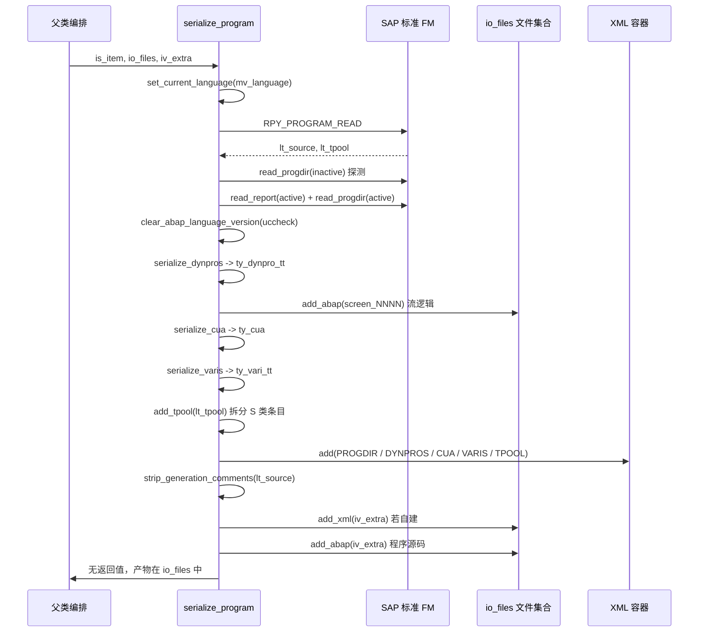
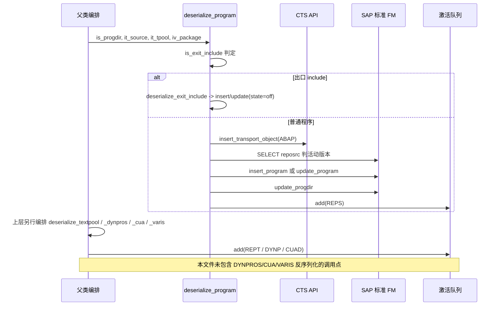

# ZCL_ABAPGIT_OBJECTS_PROGRAM 分析报告

> 分析对象：`abapGit/abapGit — zcl_abapgit_objects_program.clas.abap`（1597 行，类 `ZCL_ABAPGIT_OBJECTS_PROGRAM`）
> 报告视角：代码 onboarding 走读，按真实执行链展开
> 说明：本报告只读这一个文件。所有跨类调用（`mo_files`、`mo_i18n_params`、`exists_a_lock_entry_for`、`zcl_abapgit_sap_report` 等）的实现不在本文件内，凡涉及其行为的部分均标注「需核实」。

---

## 一、概述：一个「把 Git 装进 SAP」的对象适配器

### 1.1 这个类在整盘棋里的位置

abapGit 是一个把 Git 的版本控制能力搬到 SAP 系统上的开源项目：它把 ABAP 对象（程序、类、表、屏幕、变式……）序列化成一堆文本文件，扔进一个 Git 仓库，于是"提交 / 分支 / 合并 / diff"这些 Git 的看家本领就能用在 ABAP 代码上了。整个项目按**对象类型**划分适配器类，每一个对象类型一个类；本类负责的是 `REPS`（报表程序）这一类，父类 `zcl_abapgit_objects_super` 提供了锁检查、语言上下文、文件集合等公共能力。

一个 REPS 程序在 Git 里落地之后，长得是这样：

| Git 侧产物 | 内容 | 谁生成 |
|---|---|---|
| `*1.prg.xml` | `PROGDIR` + `DYNPROS` + `CUA` + `VARIS` + `TPOOL` | `serialize_program` |
| `*1.prg.abap` | 程序源代码 | `serialize_program`（经 `strip_generation_comments`） |
| `*1.screen_NNNN.abap` | 每个屏幕的流程逻辑 | `serialize_dynpros` |

### 1.2 它要解决的真正难题

难点不在"读个程序存起来"。SAP 存 REPS 对象用的是一张张 CDS 表（`PROGDIR` / `REPOSRC` / `D020S` / `D021S` / `VARID` …），而 abapGit 要拿到的是**结构化 XML**。中间隔着一层标准函数模块——`RPY_PROGRAM_READ`、`RS_CUA_INTERNAL_FETCH`、`RPY_DYNPRO_READ` 这类——它们是为 GUI 事务码写的，不是为序列化工具写的。于是本类里充斥着三类"补丁代码"：

1. **版本差异适配**：低版本 SAP 上没有的导出参数（如 `RPY_PROGRAM_INSERT` 的 `uccheck`、`RS_VARIANT_DELETE` 的 `suppress_message`），用 `TRY...CATCH cx_sy_dyn_call_param_not_found` 包一层，动态调用抛错就退化成旧签名重试。
2. **SAP 自身缺陷绕行**：`get_program_title` 里 `ASSIGN ('(SAPLSIFP)TTAB')` 直接去改另一个程序的内部工作区变量，绕开 `RPY_PROGRAM_UPDATE` 标题长度继承的 bug；`deserialize_cua` 里 `sy-tcode = 'SE41'` 这个自称 "evil hack" 的赋值绕开 SAP note 2159455 的修复。
3. **XML 往返丢字段的补偿**：`RPY_DYNPRO_READ` 读出的字段被序列化成 XML 再反序列化回来时，`SET-/GET_PARAM`、`MODIFIC`、`FOREIGNKEY`、容器最小行列数、流逻辑缩进等细节会变形或丢失。`serialize_dynpros` 和 `deserialize_dynpros` 各自写了一堆 `IF ... IS INITIAL` 补丁把它们顶回去。

所以读这份代码，**不能只看"它调了哪个 FM"**，要看"它为什么要在调用前后各打一个补丁"。

### 1.3 两个入口，两种语义

```abap
    METHODS serialize_program
      IMPORTING
        !io_xml     TYPE REF TO zif_abapgit_xml_output OPTIONAL
        !is_item    TYPE zif_abapgit_definitions=>ty_item
        !io_files   TYPE REF TO zcl_abapgit_objects_files
        !iv_program TYPE syrepid OPTIONAL
        !iv_extra   TYPE clike OPTIONAL
      RAISING
        zcx_abapgit_exception.
    METHODS deserialize_program
      IMPORTING
        !is_progdir TYPE zif_abapgit_sap_report=>ty_progdir
        !it_source  TYPE abaptxt255_tab
        !it_tpool   TYPE textpool_table
        !iv_package TYPE devclass
      RAISING
        zcx_abapgit_exception.
```

**做什么** — 声明两个 `PUBLIC` 入口。`serialize_program` 收五个可选导入参数（`io_xml`、`is_item`、`io_files`、`iv_program`、`iv_extra`），`deserialize_program` 收四个必填参数（`is_progdir`、`it_source`、`it_tpool`、`iv_package`），二者都声明 `RAISING zcx_abapgit_exception`。

**为什么** — `serialize_program` 的参数几乎全部 `OPTIONAL`，因为它是被父类编排调用的"被喂数据"式接口：`io_xml` 可传入复用（include 程序共享同一 XML），`iv_program` 可回退到 `is_item-obj_name`。`deserialize_program` 参数全部必填，因为导入必须拿到完整数据才能动手写 SAP。两个方法都抛同一业务异常，错误处理入口统一。

**风险与改进** — 两个入口的对称性只在"方法签名"层面成立，实际职责范围并不对称：`serialize_program` 在本文件内是自包含的完整流程，而 `deserialize_program` **只负责程序本体**——`DYNPROS`/`CUA`/`VARIS` 的反序列化方法都是本类的 `PROTECTED`，编排责任在父类，本文件看不到完整调用序列。读代码时容易误以为 `deserialize_program` 就是完整导入流程。建议在方法注释里写明"子对象反序列化由父类另行编排"。

### 1.4 关键设计常量

```abap
    CONSTANTS:
      BEGIN OF c_state,
        active   TYPE r3state VALUE 'A',
        inactive TYPE r3state VALUE 'I',
        off      TYPE r3state VALUE '',
      END OF c_state.

    CONSTANTS c_native_dynpro TYPE c LENGTH 2 VALUE 'IN'.

    CONSTANTS c_sysvari_clnt        TYPE mandt      VALUE '000'.
    CONSTANTS c_sysvari_pattern_sap TYPE c LENGTH 5 VALUE 'SAP&*'.
    CONSTANTS c_sysvari_pattern_cus TYPE c LENGTH 5 VALUE 'CUS&*'.
```

这三个常量决定了本类的三条主干语义：`c_state` 区分活动/非活动版本（SAP 程序有两份源码）；`c_native_dynpro = 'IN'` 区分原生屏幕（splitter、Web Dynpro 容器）与传统屏幕，两条路径调不同的 FM；`c_sysvari_pattern_*` 限定"只同步 SAP 提供的与 CUS 前缀的变式"——用户自建的变式（其他前缀）**不在同步范围内**，这是产品边界而非遗漏。

**做什么** — 声明三组类常量：`c_state` 是含三个成员的常量结构体（`active = 'A'`、`inactive = 'I'`、`off = ''`）；`c_native_dynpro = 'IN'`；`c_sysvari_clnt = '000'` 与两个变式名前缀模式。

**为什么** — `c_state` 把 SAP 的 `r3state` 取值封装成命名成员，让"活动版/非活动版"的语义在代码里自解释，避免散落 `'A'`/`'I'` 字面量。`c_sysvari_clnt` 固定为 `'000'` 是因为 SAP 的变式存储在 `'000'` 客户端，跨客户端取数必须显式指定。两个前缀模式定义了同步的产品边界。

**风险与改进** — 三点。其一，`c_state-off` 的值是**空字符串**，用它表达"跳过状态设置"含义晦涩；后续若有人把它复用为真正的状态值或改成 `' '`，`deserialize_exit_include` 的行为会静默改变。其二，`c_sysvari_pattern_*` 用 `&`（任意单字符）而非 `*`（任意字符串）拼前缀，`SAP&*` 实际匹配的是"长度 ≥ 4 且前缀为 SAP"，与直觉的"前缀匹配"表达不一致，属可读性陷阱。其三，`c_native_dynpro` 长度为 2 却用 `CA` 判断（`ls_header-type CA c_native_dynpro`），`CA` 对定长常量等价于相等匹配，语义正确但表达绕。建议给三处判断补一行注释说明预期语义。

---

## 二、执行流程

两条主链共用一大半子程序，方向相反：

```mermaid
flowchart TD
    subgraph PUSH["推送 serialize_program"]
        A1["serialize_program 编排"]
        A2["RPY_PROGRAM_READ 读源与文本池"]
        A3["li_report 取活动版本 PROGDIR 与源"]
        A4["serialize_dynpros 屏幕"]
        A5["serialize_cua 命令界面"]
        A6["serialize_varis 变式"]
        A7["add_tpool 文本池编码"]
        A8["strip_generation_comments 去生成物注释"]
        A9["io_files 落 XML 与 ABAP"]
        A1 --> A2 --> A3
        A3 --> A4 --> A5 --> A6 --> A7
        A7 --> A8 --> A9
    end

    subgraph PULL["拉取 deserialize_program"]
        B1["deserialize_program 编排"]
        B2{"is_exit_include 是否出口 include"}
        B3["get_cts_api insert_transport_object"]
        B4["SELECT reposrc 判活动版本是否存在"]
        B5["insert_program 新建"]
        B6["update_program 更新"]
        B7["update_progdir 回写 PROGDIR"]
        B8["deserialize_exit_include"]
        B1 --> B2
        B2 -->|否| B3 --> B4
        B4 -->|存在| B6
        B4 -->|不存在| B5
        B5 --> B7
        B6 --> B7
        B2 -->|是| B8
    end

    P4["deserialize_dynpros"] -.父类或上层编排.-> P1
    P5["deserialize_cua"] -.父类或上层编排.-> P1
    P6["deserialize_varis"] -.父类或上层编排.-> P1
    P7["deserialize_textpool"] -.父类或上层编排.-> P1
    P1["反序列化子对象"]
```



### 责任链表

| 子程序 | 调用者 | 职责 |
|---|---|---|
| `serialize_program` | 父类对象编排 | 推送主入口：读程序、分发子对象序列化、落文件 |
| `deserialize_program` | 父类对象编排 | 拉取主入口：CTS 登记、判存、insert/update、回写 PROGDIR |
| `serialize_dynpros` | `serialize_program` | 导出屏幕：过滤生成屏幕、读传统/原生两套、流逻辑落独立 ABAP |
| `serialize_cua` | `serialize_program` | 导出命令界面 11 张表到 `ty_cua` |
| `serialize_varis` | `serialize_program` | 遍历变式并逐个装配完整结构 |
| `get_varis_for_report` | `serialize_varis` / `deserialize_varis` | 按 `SAP&*`/`CUS&*` 过滤出同步范围内的变式 |
| `get_vari_data` | `serialize_varis` | 取变式技术数据、取值、对象、多语言文本 |
| `get_vari_screens` | `serialize_varis` | 取变式关联的屏幕号 |
| `add_tpool` | `serialize_program` | 文本池序列化方向编码：`S` 类条目拆 `split`/`entry` |
| `read_tpool` | 上层 XML 解包（需核实） | 文本池反序列化方向：`split`+`entry` 拼回 `entry` |
| `strip_generation_comments` | `serialize_program` | 抹掉 MV 函数组生成物的易变行，稳定 diff |
| `get_program_title` | `deserialize_program` / `deserialize_exit_include` | 从文本池取 `R` 行标题，并修 `RPY_PROGRAM_UPDATE` 的 bug |
| `is_exit_include` | `deserialize_program` / `update_program` | 按命名模式判断 `LX*`/`SAPLX*` 出口 include |
| `is_any_dynpro_locked` | 父类锁检查（需核实） | 逐屏幕查 `ESCRP` 锁 |
| `is_cua_locked` | 父类锁检查（需核实） | 查 `ESCUAPAINT` 锁 |
| `is_text_locked` | 父类锁检查（需核实） | 查 `EABAPTEXTE` 锁 |
| `insert_program` | `deserialize_program` / `deserialize_exit_include` | 新建程序，含低版本参数回退与 `subrc=3` 兜底 |
| `update_program` | `deserialize_program` / `deserialize_exit_include` | 更新程序源码，区分 `EU 510`/`EU 522` 错误 |
| `deserialize_exit_include` | `deserialize_program` | 出口 include 特殊路径：强制活动态、无 CTS |
| `deserialize_textpool` | 上层编排 | 写文本池，区分主语言/翻译、include 空文本池 |
| `deserialize_dynpros` | 上层编排 | 反序列化屏幕并删除已不在清单里的旧屏幕 |
| `deserialize_cua` | 上层编排 | 写 CUA，含 ADM 自动纠正 |
| `deserialize_varis` | 上层编排 | 变式全量同步：重建远端有的、删除远端已删的 |
| `uncondense_flow` | `deserialize_dynpros` | 恢复流逻辑缩进（旧版 XML 兼容） |
| `auto_correct_cua_adm` | `deserialize_cua` | 补齐历史 XML 缺失的 ADM 命令码 |
| `create_vari` | `deserialize_varis` | 两个 FM 串联创建变式 |
| `delete_vari` | `deserialize_varis` | 删变式，含低版本参数回退 |
| `set_vari_protection` | `deserialize_varis` | 同步前解锁、结束后复原保护标记 |

下面按推送、拉取两条链逐一展开。

---

## 三、分组分析

### 3.1 推送链

#### 3.1.1 `serialize_program`：编排器

推送链的编排器。它自己不做任何业务，只做四件事：切语言、读程序、按程序类型分发、落文件。

```abap
    IF iv_program IS INITIAL.
      lv_program_name = is_item-obj_name.
    ELSE.
      lv_program_name = iv_program.
    ENDIF.

    zcl_abapgit_language=>set_current_language( mv_language ).

    CALL FUNCTION 'RPY_PROGRAM_READ'
      EXPORTING
        program_name     = lv_program_name
        with_includelist = abap_false
        with_lowercase   = abap_true
      TABLES
        source_extended  = lt_source
        textelements     = lt_tpool
      EXCEPTIONS
        cancelled        = 1
        not_found        = 2
        permission_error = 3
        OTHERS           = 4.

    IF sy-subrc = 2.
      zcl_abapgit_language=>restore_login_language( ).
      RETURN.
    ELSEIF sy-subrc <> 0.
      zcl_abapgit_language=>restore_login_language( ).
      zcx_abapgit_exception=>raise_t100( ).
    ENDIF.

    zcl_abapgit_language=>restore_login_language( ).
```

- **做什么**：确定程序名（`iv_program` 优先，回退到对象清单里的 `ms_item`）；切到同步语言；`RPY_PROGRAM_READ` 一次取回源码与文本池；`sy-subrc = 2`（对象不存在）静默返回，其他非零抛异常；三条出口路径都在抛异常/返回前 `restore_login_language`。
- **为什么**：`RPY_PROGRAM_READ` 读什么语言取决于当前登录语言，而 abapGit 同步的是仓库里存的 `mv_language` 版本，所以必须切语言。切换后立刻恢复而不是用 `TRY` 包裹整段，是为了让"语言副作用"的作用域显式且最小——但这个写法把恢复点散成了三处，见风险。
- **风险与改进**：`restore_login_language` 被复制了三次，后续任何人在这段里新增一条失败路径都很容易漏掉恢复，导致整条 Git 推送后续操作都在错误的语言上下文里跑。更稳的写法是用 `TRY...CLEANUP` 把恢复收敛到一处。另外 `IF sy-subrc = 2 ... RETURN` 是静默成功语义，上层如果指望"程序不存在"有反馈，会拿不到。

接着处理 SAP 的"双份源码"特性：

```abap
    " If inactive version exists, then RPY_PROGRAM_READ does not return the active code
    li_report = zcl_abapgit_factory=>get_sap_report( ).

    TRY.
        " Raises exception if inactive version does not exist
        ls_progdir = li_report->read_progdir(
          iv_name  = lv_program_name
          iv_state = c_state-inactive ).

        " Explicitly request active source code
        lt_source = li_report->read_report(
          iv_name  = lv_program_name
          iv_state = c_state-active ).
      CATCH zcx_abapgit_exception ##NO_HANDLER.
    ENDTRY.

    ls_progdir = li_report->read_progdir(
      iv_name  = lv_program_name
      iv_state = c_state-active ).

    clear_abap_language_version( CHANGING cv_abap_language_version = ls_progdir-uccheck ).
```

- **做什么**：SAP 程序可能有活动版与非活动版两份源码，`RPY_PROGRAM_READ` 在非活动版存在时会返回非活动版。这里先试着读非活动版 PROGDIR 探测"是否有人改了没激活"，若有则显式改读活动版源码；`CATCH` 空处理器表达"非活动版不存在是正常情况"；无论哪条路径，最后都强制重读活动版 PROGDIR；`clear_abap_language_version` 清掉 `uccheck` 里的语言版本标记（跨系统搬移时该标记无意义）。
- **为什么**：Git 应该追踪"最后一次激活的代码"而不是"某人正在改的草稿"，所以非活动版被刻意跳过；但"是否存在非活动版"这个信息又必须知道，否则会把草稿当正文。用"读非活动版抛异常"当探测手段是 ABAP 里最常见的存在性判断替代方案。
- **风险与改进**：`read_progdir(inactive)` 成功但 `read_report(active)` 失败（例如活动版被删、只有非活动版）时，异常被 `CATCH` 吞掉，`lt_source` 保留 `RPY_PROGRAM_READ` 之前填的值——那可能是非活动版源码，于是**把草稿静默推进了 Git**。这是空 `CATCH` 的典型代价。建议把"非活动版存在"单独查一次（`SELECT ... WHERE r3state = 'I'`）而不是靠异常探测。

然后按程序类型分发：

```abap
    li_xml->add( iv_name = 'PROGDIR'
                 ig_data = ls_progdir ).
    IF ls_progdir-subc = '1' OR ls_progdir-subc = 'M'.
      lt_dynpros = serialize_dynpros( lv_program_name ).
      li_xml->add( iv_name = 'DYNPROS'
                   ig_data = lt_dynpros ).

      ls_cua = serialize_cua( lv_program_name ).
      li_xml->add( iv_name = 'CUA'
                   ig_data = ls_cua ).

      lt_varis = serialize_varis( lv_program_name ).
      li_xml->add( iv_name = 'VARIS'
                   ig_data = lt_varis ).
    ENDIF.

    READ TABLE lt_tpool WITH KEY id = 'R' INTO ls_tpool.
    IF sy-subrc = 0 AND ls_tpool-key = '' AND ls_tpool-length = 0.
      DELETE lt_tpool INDEX sy-tabix.
    ENDIF.

    li_xml->add( iv_name = 'TPOOL'
                 ig_data = add_tpool( lt_tpool ) ).
```

- **做什么**：只有 `subc = '1'`（报表程序）与 `subc = 'M'`（模块池程序）才导出屏幕、CUA、变式；文本池里标题为空且长度为 0 的 `R` 行先删掉再序列化（避免导出空标题占位行）。
- **为什么**：`subc` 是 PROGDIR 里的程序类型码，`'1'`/`'M'` 才有 UI，其余类型（含、函数组 include 等）没有屏幕与 CUA，导出这些节点只会产出空 XML。
- **风险与改进**：`subc` 用字符串字面量 `'1'`、`'M'` 硬编码两次判断条件，且没有常量。SAP 的类型码含义散落在文档里，未来若加入 `'F'`（函数组）等其他需要 UI 的类型，这里需要改代码。建议抽成常量或一个判定方法，并在注释里写明 `subc` 取值含义。

最后落文件：

```abap
    IF NOT io_xml IS BOUND.
      io_files->add_xml( iv_extra = iv_extra
                         ii_xml   = li_xml ).
    ENDIF.

    strip_generation_comments( CHANGING ct_source = lt_source ).

    io_files->add_abap( iv_extra = iv_extra
                        it_abap  = lt_source ).
```

- **做什么**：XML 容器只有在本方法自建时才交给 `io_files`（外层传入的由外层负责）；源码先剥掉生成物注释再落盘。
- **为什么**：include 程序与主程序共享同一个 XML，所以 `io_xml` 可传入复用；而 ABAP 源码文件永远是独立的。
- **风险与改进**：`io_xml` 未绑定时才会 `add_xml`，但若调用方**传入了** `io_xml` 却又期望 `io_files` 收到它，这里不会发生。契约只写在参数注释里，缺少显式约定文档。

#### 3.1.2 `serialize_dynpros`：屏幕导出

推送链里最复杂的一段，负责把屏幕体系导出成 `ty_dynpro_tt`，并把流逻辑拆成独立 ABAP 文件。

```abap
    CALL FUNCTION 'RS_SCREEN_LIST'
      EXPORTING
        dynnr     = ''
        progname  = iv_program_name
      TABLES
        dynpros   = lt_d020s
      EXCEPTIONS
        not_found = 1
        OTHERS    = 2.
    IF sy-subrc = 2.
      zcx_abapgit_exception=>raise_t100( ).
    ENDIF.

    SORT lt_d020s BY dnum ASCENDING.

    LOOP AT lt_d020s ASSIGNING <ls_d020s>
        WHERE type <> 'S' AND type <> 'W' AND type <> 'J'
        AND NOT dnum IS INITIAL.
```

- **做什么**：列出程序下全部屏幕并按屏号排序；循环里跳过三类自动生成的屏幕（`S`=选择屏幕、`W`=状态屏幕、`J`=搜索帮助相关）以及 `dnum` 为空的条目。
- **为什么**：生成屏幕由程序源码决定，Git 里已有源码，再导出一份屏幕定义既冗余又必然产生无法合并的 diff。`SORT` 是为了让 XML 输出稳定——同一份程序两次序列化必须逐字节相同，否则 Git 会认为是变更。
- **风险与改进**：过滤条件用了四个字符串字面量 `'S'`/`'W'`/`'J'`，语义只靠读者回忆 SAP 文档。建议提为命名常量（如 `c_screen_type_generated`），或写一行注释说明这三个码含义。

```abap
       "#2746: we need the dynpro fields in internal format:
       FREE lt_fieldlist_int.

       CALL FUNCTION 'RPY_DYNPRO_READ_NATIVE'
         EXPORTING
           progname   = iv_program_name
           dynnr      = <ls_d020s>-dnum
         TABLES
           fieldlist  = lt_fieldlist_int
           fieldtexts = lt_texts.

       LOOP AT lt_fields_to_containers ASSIGNING <ls_field>.
         ASSIGN COMPONENT 'OUTPUTSTYLE' OF STRUCTURE <ls_field> TO <lv_outputstyle>.
         IF sy-subrc = 0 AND <lv_outputstyle> = '  '.
           CLEAR <lv_outputstyle>.
         ENDIF.

         UNASSIGN <ls_field_int>.
         READ TABLE lt_fieldlist_int ASSIGNING <ls_field_int> WITH KEY fnam = <ls_field>-name.
         IF <ls_field_int> IS ASSIGNED.
           IF <ls_field_int>-flg1 O lc_flg1ddf AND
               <ls_field_int>-flg3 O lc_flg3for AND
               <ls_field_int>-flg3 Z lc_flg3fdu AND
               <ls_field_int>-flg3 Z lc_flg3fku.
             <ls_field>-foreignkey = 'X'.
           ELSE.
             CLEAR <ls_field>-foreignkey.
           ENDIF.
         ENDIF.

         IF <ls_field>-from_dict = abap_true AND
            <ls_field>-modific   <> 'F' AND
            <ls_field>-modific   <> 'X'.
           CLEAR <ls_field>-text.
         ENDIF.
       ENDLOOP.
```

- **做什么**：额外调 `RPY_DYNPRO_READ_NATIVE` 取字段的**内部格式**（`d021s` 的 `flg1`/`flg3` 位标记）。`OUTPUTSTYLE` 用 `ASSIGN COMPONENT` 动态探测——低版本字段可能不存在，不存在时 `sy-subrc <> 0` 直接跳过；值为两个空格的 NUMC 会被 XML 转换拒绝，故清空。然后逐字段用位运算重算 `foreignkey`：`flg1` 含 DDF 标记且 `flg3` 同时被 FOR/DU/KU 三个标记"遮住"时才置 `X`。最后，从字典派生的字段若 `modific` 不是 `F` 或 `X`，清空文本（避免导出一个不该显示的文本）。
- **为什么**：`RPY_DYNPRO_READ` 返回的 `foreignkey` 字段在往返后不可信——它依赖屏幕生成时的中间态。用内部位标记按 `SAPLWBSCREEN` 的原始逻辑重算，等于绕过标准函数的已知偏差（issue #2746 的修复）。
- **风险与改进**：`UNASSIGN` + `READ TABLE` 在循环里逐字段做，`lt_fieldlist_int` 若非哈希表则是 O(n²)；大屏幕（几百字段）会明显变慢。位标记语义完全依赖注释里的 include 名 `MSEUSBIT`，接手者无法从代码本身验证位含义，建议在常量旁补一行"哪一位代表什么"。

```abap
       LOOP AT lt_containers ASSIGNING <ls_container>.
         IF <ls_container>-c_resize_v = abap_false.
           CLEAR <ls_container>-c_line_min.
         ENDIF.
         IF <ls_container>-c_resize_h = abap_false.
           CLEAR <ls_container>-c_coln_min.
         ENDIF.
       ENDLOOP.
```

- **做什么**：容器不可纵向缩放时清空最小行数，不可横向缩放时清空最小列数。
- **为什么**：这两个值在屏幕生成时会被填成默认数字，但它们只在"可缩放"时有意义。带回来会让还原后的屏幕出现意料外的最小尺寸，故剥离。
- **风险与改进**：这是"序列化时剥离、反序列化时无需恢复"的单向清理，属于正确的补丁方向。无明显风险。

```abap
       APPEND INITIAL LINE TO rt_dynpro ASSIGNING <ls_dynpro>.
       <ls_dynpro>-header = ls_header.

       mo_files->add_abap(
         iv_extra = 'screen_' && ls_header-screen
         it_abap  = lt_flow_logic ).

       READ TABLE lt_fieldlist_int TRANSPORTING NO FIELDS WITH KEY fill = 'X'.
       IF ls_header-type CA c_native_dynpro AND sy-subrc = 0.
         <ls_dynpro>-nat_header = <ls_d020s>.
         CLEAR: <ls_dynpro>-nat_header-dgen, <ls_dynpro>-nat_header-tgen.
         <ls_dynpro>-nat_fields = lt_fieldlist_int.
         <ls_dynpro>-nat_texts  = lt_texts.
       ELSE.
         <ls_dynpro>-containers = lt_containers.
         <ls_dynpro>-fields     = lt_fields_to_containers.
       ENDIF.
```

- **做什么**：每个屏幕先落一份流逻辑 ABAP 文件（`screen_NNNN.abap`）；若屏头类型含 `IN`（原生屏幕，如 splitter）且字段表里有 `fill = 'X'` 标记，走原生分支：存整行 `d020s` 作 `nat_header` 并清掉生成日期/时间、存内部字段表与文本；否则走传统分支：存容器与字段清单。
- **为什么**：原生屏幕的结构（含 splitter 分栏）无法用传统容器/字段模型表达，只能存原生格式。清 `dgen`/`tgen` 是为了让日期时间这类易变字段不进 Git diff。
- **风险与改进**：`READ TABLE ... WITH KEY fill = 'X'` 用 `sy-subrc` 判断"是否存在分栏"，但 `READ TABLE TRANSPORTING NO FIELDS` 只查存在性不查内容，若 `fill` 字段语义变更（SAP 版本升级）此处会静默失效。且 `ls_header-type CA c_native_dynpro` 的 `CA` 是"包含任意字符"，对两字符常量 `'IN'` 等价于匹配 `'IN'`，语义正确但可读性差——建议改用 `CP` 或直接 `=`。

#### 3.1.3 `serialize_cua`：命令界面导出

```abap
    CALL FUNCTION 'RS_CUA_INTERNAL_FETCH'
      EXPORTING
        program         = iv_program_name
        language        = mv_language
        state           = c_state-active
      IMPORTING
        adm             = rs_cua-adm
      TABLES
        sta             = rs_cua-sta
        fun             = rs_cua-fun
        men             = rs_cua-men
        mtx             = rs_cua-mtx
        act             = rs_cua-act
        but             = rs_cua-but
        pfk             = rs_cua-pfk
        set             = rs_cua-set
        doc             = rs_cua-doc
        tit             = rs_cua-tit
        biv             = rs_cua-biv
      EXCEPTIONS
        not_found       = 1
        unknown_version = 2
        OTHERS          = 3.
    IF sy-subrc > 1.
      zcx_abapgit_exception=>raise_t100( ).
    ENDIF.
```

- **做什么**：一次取出 CUA 的 ADM（命令界面总表）与 11 张明细表（状态、功能码、菜单、菜单链接、动作、按钮、PF 键、状态字段、文档、标题、按钮文本）。
- **为什么**：CUA 是 SE41 的对象，标准函数就是为它设计的，无需补丁。
- **风险与改进**：`sy-subrc > 1` 才报错，即 `not_found`（1）被当作"程序没有 CUA"静默通过——这符合事实（很多程序确实没有命令界面），但 `unknown_version`（2）也被放过，那可能是数据结构版本不匹配这种真实故障。建议只对 `not_found` 放行。

#### 3.1.4 `serialize_varis` 与三个取数方法

```abap
    lt_varis = get_varis_for_report( iv_program_name ).

    LOOP AT lt_varis ASSIGNING <ls_varikey>.
      CLEAR: ls_vari,
             ls_varid.

      get_vari_data( EXPORTING is_vari    = <ls_varikey>
                     IMPORTING es_varid   = ls_varid
                               et_values  = ls_vari-values
                               et_objects = ls_vari-objects
                               et_texts   = ls_vari-texts ).

      MOVE-CORRESPONDING ls_varid TO ls_vari.

      LOOP AT ls_vari-objects ASSIGNING <ls_object>.
        CLEAR <ls_object>-text.
      ENDLOOP.

      ls_vari-variscreens = get_vari_screens( <ls_varikey> ).

      INSERT ls_vari INTO TABLE rt_varis.
    ENDLOOP.
```

- **做什么**：遍历同步范围内的变式；每个变式取技术数据、取值、对象、多语言文本；用 `MOVE-CORRESPONDING` 把 `varid` 铺进 `ty_vari`；清空对象里的 `text`（注释说明文本会另在 TEXTPOOL 段提供）；再取关联屏幕号。
- **为什么**：变式是 SE16 那套多表对象，标准工具没有"一次取全"的接口，只能拆成三个 FM 各取一块再拼装。
- **风险与改进**：`MOVE-CORRESPONDING` 把整个 `varid` 结构搬进 `ty_vari`，`ty_vari` 里手工列了 9 个字段——两者字段集若不同步（SAP 升级给 `varid` 加字段），新增内容会被静默丢弃或漏映射，且编译期不报错。建议改为显式逐字段赋值，或在 `ty_vari` 定义处注明"必须与 `varid` 保持同步"。

```abap
     CALL FUNCTION 'RS_ALL_VARIANTS_4_1_REPORT'
       EXPORTING
         program = iv_repid
       IMPORTING
         cat     = ls_catalog
       EXCEPTIONS
         OTHERS  = 1.
    IF sy-subrc <> 0.
      zcx_abapgit_exception=>raise_t100( ).
    ENDIF.

    ls_vari-report = iv_repid.
    LOOP AT ls_catalog-cat ASSIGNING <ls_cat>
         WHERE variant CP c_sysvari_pattern_sap
         OR variant CP c_sysvari_pattern_cus.
      ls_vari-variant = <ls_cat>-variant.
      INSERT ls_vari INTO TABLE rt_varis.
    ENDLOOP.

    SORT rt_varis.
```

- **做什么**：`get_varis_for_report` 取程序全部变式，只保留 `SAP&*` 与 `CUS&*` 两种前缀的，按变式名排序后返回。
- **为什么**：这是产品边界——abapGit 只管同步 SAP 自带变式与客户命名空间的变式，用户随手建的临时变式不进版本控制（否则仓库会被污染）。`SORT` 保序输出。
- **风险与改进**：`CP` 用的是 `&`（任意单字符）而非 `*`（任意字符串），所以 `SAP&*` 匹配的是"SAP + 任意一字符 + 任意串"，等价于长度 ≥ 4 且前缀 SAP。这与预期一致但表达晦涩，建议改用 `SAP*` 并加注释说明这是刻意的前缀过滤。

```abap
    CALL FUNCTION 'RS_VARIANT_VALUES_TECH_DAT_255'
      EXPORTING
        report         = is_vari-report
        variant        = is_vari-variant
        sorted         = abap_true
      IMPORTING
        techn_data     = es_varid
      TABLES
        variant_values = et_values
      EXCEPTIONS
        OTHERS         = 1.
    IF sy-subrc <> 0.
      zcx_abapgit_exception=>raise_t100( ).
    ENDIF.

    CLEAR et_values.

    IF mo_i18n_params->ms_params-main_language_only <> abap_true.
      lt_language_filter = mo_i18n_params->build_language_filter( ).
    ENDIF.
    ls_language_filter-sign   = 'I'.
    ls_language_filter-option = 'EQ'.
    ls_language_filter-low    = mv_language.
    CLEAR ls_language_filter-high.
    INSERT ls_language_filter INTO TABLE lt_language_filter.

    SELECT langu vtext FROM varit CLIENT SPECIFIED
      INTO CORRESPONDING FIELDS OF TABLE et_texts
      WHERE mandt = c_sysvari_clnt
        AND report = is_vari-report
        AND variant = is_vari-variant
        AND langu IN lt_language_filter
      ORDER BY langu.

    CALL FUNCTION 'RS_VARIANT_CONTENTS_255'
      EXPORTING
        report         = is_vari-report
        variant        = is_vari-variant
        execute_direct = abap_true
      TABLES
        valutab        = et_values
        objects        = et_objects
      EXCEPTIONS
        OTHERS         = 1.
    IF sy-subrc <> 0.
      zcx_abapgit_exception=>raise_t100( ).
    ENDIF.

    SORT et_values.
    SORT et_objects.
    SORT et_texts.
```

- **做什么**：先调 `RS_VARIANT_VALUES_TECH_DAT_255` 拿变式技术数据（`varid` 本体），它顺带返回的 `variant_values` 被显式 `CLEAR` 丢弃；再按国际化参数构建语言过滤条件（总是包含当前同步语言），直连 `VARIT` 表取多语言描述；最后调 `RS_VARIANT_CONTENTS_255` 取真正的取值与对象；三张表全部排序。
- **为什么**：两个 FM 的 `variant_values`/`valutab` 参数都是非可选的，第一个 FM 的返回值不可用（注释写明 "is ignored"），只能白取一次再清掉——这是标准接口设计不佳带来的强制浪费。文本不走 FM 是因为"相关 FM 无法列出可用语言"（注释原话），只能自己 SELECT。
- **风险与改进**：`CLEAR et_values` 后 `et_values` 又被传给下一个 FM 作 `TABLES` 输出，此处依赖 FM 会覆写传入表；若 `RS_VARIANT_CONTENTS_255` 在某些版本不清空表而追加，会残留脏数据（当前已 `CLEAR` 故安全，但脆弱）。另外 `CLIENT SPECIFIED` + 硬编码 `c_sysvari_clnt = '000'`：变式存在 SAP 的 `'000'` 客户端，这是刻意的跨客户端取数，但 `c_sysvari_clnt` 在三个方法里被重复引用且无任何校验——若未来支持非 `'000'` 存储会全线失效。建议在常量定义处注明"SAP 变式固定存 000 客户端"这一业务前提。

```abap
    CALL FUNCTION 'RS_GET_SCREENS_4_1_VARIANT'
      EXPORTING
        program     = is_vari-report
        variant     = is_vari-variant
      TABLES
        dynnr       = lt_dynnr
        variscreens = rt_vari_screens
      EXCEPTIONS
        OTHERS      = 1.
```

- **做什么**：取变式关联的屏幕号清单（`rsdynnr` 形式），排序后返回。
- **为什么**：变式的屏幕关联是独立表，需单独取。
- **风险与改进**：`lt_dynnr` 声明后带 `##NEEDED` 抑制器——该参数被要求传入但未读取。说明 FM 接口存在但未用的输出，无实际风险。

#### 3.1.5 `add_tpool` / `read_tpool`：文本池编码

```abap
    LOOP AT it_tpool ASSIGNING <ls_tpool_in>.
      APPEND INITIAL LINE TO rt_tpool ASSIGNING <ls_tpool_out>.
      MOVE-CORRESPONDING <ls_tpool_in> TO <ls_tpool_out>.
      IF <ls_tpool_out>-id = 'S'.
        <ls_tpool_out>-split = <ls_tpool_out>-entry.
        <ls_tpool_out>-entry = <ls_tpool_out>-entry+8.
      ENDIF.
    ENDLOOP.
```

- **做什么**：把文本池逐行搬进输出结构；对 `id = 'S'`（屏幕标题类）的行，把原 `entry` 整值存入 `split`，再把 `entry` 截成去掉前 8 个字符的尾部。
- **为什么**：`'S'` 类条目的 `entry` 前 8 位是屏幕号而非标题文本，直接当标题导出会污染 Git 内容，故拆成"屏幕号 + 标题"两段。
- **风险与改进**：与 `read_tpool` 拼合逻辑核对后，**这一对转换在数学上不互逆**。

#### 3.1.6 `strip_generation_comments` 与 `get_program_title`

```abap
    IF ms_item-obj_type <> 'FUGR'.
      RETURN.
    ENDIF.

    READ TABLE ct_source INDEX 1 ASSIGNING <lv_line>.
    IF sy-subrc = 0 AND <lv_line> CP '#**regenerated at *'.
      DELETE ct_source INDEX 1.
      RETURN.
    ENDIF.

    IF lines( ct_source ) < 5.
      RETURN.
    ENDIF.
```

- **做什么**：只处理函数组（`FUGR`）。MV 生成函数组的主程序/TOPS 首行是 `#**regenerated at <日期>*`，删掉；include 的生成物头是 5 行 `#*---*`/`#**`/`#**generation date:*`/`#**generator version:*`/`#*---*`，校验后删除其中第 3、4 两行。
- **为什么**：生成日期与生成器版本每次重新生成都会变，进 Git 就会造成无意义 diff。删掉这两行即可稳定，而保留 `#*---*` 边框让文件看起来仍是合法 ABAP。
- **风险与改进**：删除后只去掉易变行、保留标识行，是精细的处理。但**只删 2 行而非整块 5 行**，意味着 include 的生成物头仍在 Git 里，后续若 SAP 再往这个头里加易变字段需再改。另外判断用 `CP` 逐行比对字面量模式，SAP 若调整生成物头格式（历史上确实调整过）会静默失效，建议集中到一处并加注释指向 SAP note。

```abap
    READ TABLE it_tpool INTO ls_tpool WITH KEY id = 'R'.
    IF sy-subrc = 0.
      ASSIGN ('(SAPLSIFP)TTAB') TO <lg_any>.
      IF sy-subrc = 0.
        CLEAR <lg_any>.
      ENDIF.

      rv_title = ls_tpool-entry.
    ENDIF.
```

- **做什么**：`get_program_title` 取 `R` 行（程序标题）作返回值；若取得，则通过 `ASSIGN` 按变量名 `'(SAPLSIFP)TTAB'` 访问 `SAPLSIFP` 程序的工作区内部表变量 `TTAB` 并清空。
- **为什么**：注释直接说明了原因——`RPY_PROGRAM_UPDATE` 有个 bug，`TTAB` 首行未被清空，导致新程序的标题长度可能继承自另一个程序。这是**故意越界修改其他程序工作区**以绕开标准 FM 缺陷的 hack。
- **风险与改进**：这是全类最激进的一处。`ASSIGN ('(SAPLSIFP)TTAB')` 依赖 `SAPLSIFP` 这个 SAP 内部程序名与其内部变量名在目标系统版本上保持不变——**SAP 升级随时可能改名或改结构，届时静默失效**（`sy-subrc <> 0` 时什么都不做，于是 bug 复现）。且 `ASSIGN` 一个字符串变量名的做法无法被静态分析工具检查，也不会在编译期报错。建议：跟踪对应 SAP note 的修复版本，达到该版本后删除此 hack；若必须保留，至少加 `CONVERSION_EXIT` 之外的显式版本检查。

### 3.2 拉取链

#### 3.2.1 `deserialize_program`：编排器

```abap
    IF is_exit_include( is_progdir-name ) = abap_true.
      deserialize_exit_include(
        is_progdir = is_progdir
        it_source  = it_source
        it_tpool   = it_tpool
        iv_package = iv_package ).
      RETURN.
    ENDIF.

    zcl_abapgit_factory=>get_cts_api( )->insert_transport_object(
      iv_object   = 'ABAP'
      iv_obj_name = is_progdir-name
      iv_package  = iv_package
      iv_language = mv_language ).

    lv_title = get_program_title( it_tpool ).

    SELECT SINGLE progname FROM reposrc INTO lv_progname
      WHERE progname = is_progdir-name
      AND r3state = c_state-active.

    IF sy-subrc = 0.
      update_program(
        is_progdir = is_progdir
        it_source  = it_source
        iv_title   = lv_title ).
    ELSE.
      insert_program(
        is_progdir = is_progdir
        it_source  = it_source
        iv_title   = lv_title
        iv_package = iv_package ).
    ENDIF.

    zcl_abapgit_factory=>get_sap_report( )->update_progdir(
      is_progdir = is_progdir
      iv_package = iv_package ).

    zcl_abapgit_objects_activation=>add(
      iv_type = 'REPS'
      iv_name = is_progdir-name ).
```

- **做什么**：出口 include（`LX*`/`SAPLX*` 等）走特殊分支并提前返回；否则先在 CTS 登记 ABAP 对象，取标题，用 `REPOSRC` 里是否存在活动版本决定新建还是更新，随后回写 PROGDIR，最后登记激活任务（类型 `REPS`）。
- **为什么**：CTS（传输管理）必须先于对象写入登记，否则对象变更不会进入传输请求；`REPOSRC` 而非 `PROGDIR` 判断存在性，是因为 `PROGDIR` 可能有记录但源码已被删除。
- **风险与改进**：**CTS 登记在存在性判断之前**。若后续 `insert_program`/`update_program` 抛异常，CTS 里已经登记了一个实际未创建/未修改的对象，会留下一个"指向空对象的传输条目"，在激活时报错或造成传输请求内容与实际不一致。建议把 CTS 登记挪到写入成功之后，或整体包在可回滚的边界里。另外 `SELECT ... FROM reposrc` 未检查 `sy-subrc = 0` 的 `progname` 是否真的匹配到当前对象（`SINGLE` 已保证），但缺少 `AND r3state = c_state-active` 之外的包/语言限定，理论上可能命中同名旧记录——需核实 `reposrc` 主键定义。

#### 3.2.2 `is_exit_include` 与 `deserialize_exit_include`

```abap
    rv_is_exit_include = boolc(
      iv_program CP 'LX*' OR iv_program CP 'SAPLX*' OR
      iv_program+1 CP '/LX*' OR iv_program+1 CP '/SAPLX*' ).
```

- **做什么**：按命名模式判定出口 include：`LX*`、`SAPLX*`，以及第一个字符之后以 `/LX*`、`/SAPLX*` 开头的形式。
- **为什么**：SAP 出口 include 是标准程序与客户的接缝，命名有固定约定；`iv_program+1` 的处理是为了兼容带前导字符的变体。
- **风险与改进**：纯命名约定判断，脆弱但无替代方案（对象类型上确实无标志位）。`iv_program+1` 的两种前缀重复了 `LX`/`SAPLX`，可读性差，建议抽成常量表并加注释列出 SAP 出口命名规范出处。

```abap
    lv_title = get_program_title( it_tpool ).

    SELECT SINGLE progname FROM reposrc INTO lv_progname
      WHERE progname = is_progdir-name
      AND r3state = c_state-active.

    IF sy-subrc = 0.
      update_program(
        is_progdir = is_progdir
        it_source  = it_source
        iv_title   = lv_title
        iv_state   = c_state-off ).
    ELSE.
      insert_program(
        is_progdir = is_progdir
        it_source  = it_source
        iv_title   = lv_title
        iv_package = iv_package ).
    ENDIF.
```

- **做什么**：出口 include 的特殊处理——存在则更新但传 `iv_state = c_state-off`（空字符串），即不保存非活动版；不存在则正常新建。
- **为什么**：注释说明：函数组的出口 include 只能以活动态处理，因为 `RS_INSERT_INTO_WORKING_AREA` 里有检查。
- **风险与改进**：`c_state-off` 的值是**空字符串**（见 1.4），语义是"既非活动也非非活动"，用它表达"跳过状态设置"含义晦涩。若某天有人把它改成 `' '` 或复用为真正的状态值，行为会变。建议命名更明确或改用可选参数。

#### 3.2.3 `insert_program` 与 `update_program`

```abap
    TRY.
        CALL FUNCTION 'RPY_PROGRAM_INSERT'
          EXPORTING
            development_class = iv_package
            program_name      = is_progdir-name
            program_type      = is_progdir-subc
            title_string      = iv_title
            save_inactive     = iv_state
            suppress_dialog   = abap_true
            uccheck           = is_progdir-uccheck
          TABLES
            source_extended   = it_source
          EXCEPTIONS
            already_exists    = 1
            cancelled         = 2
            name_not_allowed  = 3
            permission_error  = 4
            OTHERS            = 5 ##FM_SUBRC_OK.
      CATCH cx_sy_dyn_call_param_not_found.
        CALL FUNCTION 'RPY_PROGRAM_INSERT'
          EXPORTING
            development_class = iv_package
            program_name      = is_progdir-name
            program_type      = is_progdir-subc
            title_string      = iv_title
            save_inactive     = iv_state
            suppress_dialog   = abap_true
          TABLES
            source_extended   = it_source
          EXCEPTIONS
            already_exists    = 1
            cancelled         = 2
            name_not_allowed  = 3
            permission_error  = 4
            OTHERS            = 5 ##FM_SUBRC_OK.
    ENDTRY.
```

- **做什么**：调 `RPY_PROGRAM_INSERT` 新建程序，带 `uccheck` 参数；若动态调用报 `cx_sy_dyn_call_param_not_found`（低版本无此参数），去掉该参数重试同一 FM。
- **为什么**：这是 abapGit 支持多版本 SAP 的标准手法——`uccheck`（语言版本标记）是较新版本才有的 FM 参数，静态写死会在低版本系统上编译/运行失败。
- **风险与改进**：为绕开一个参数而整段复制 FM 调用，两处必须手工保持同步（注释也承认了 `does not exist on lower releases`）。**任何一处改了参数，另一处很容易漏**。建议抽成一个私有方法或用 `CALL FUNCTION ... USING` 加参数表动态传参，把版本差异收敛到一处。同样的模式在 `delete_vari` 与 `update_program` 的 FM 调用里重复出现，是本类的系统性技术债。

```abap
    IF sy-subrc = 3.
      zcl_abapgit_factory=>get_sap_report( )->insert_report(
        iv_name         = is_progdir-name
        iv_package      = iv_package
        it_source       = it_source
        iv_state        = c_state-active
        iv_version      = is_progdir-uccheck
        iv_program_type = is_progdir-subc ).

      zcl_abapgit_factory=>get_sap_report( )->insert_report(
        iv_name         = is_progdir-name
        iv_package      = iv_package
        it_source       = it_source
        iv_state        = c_state-inactive
        iv_version      = is_progdir-uccheck
        iv_program_type = is_progdir-subc ).

    ELSEIF sy-subrc > 0.
      zcx_abapgit_exception=>raise_t100( ).
    ENDIF.
```

- **做什么**：`sy-subrc = 3`（`name_not_allowed`）时不走标准 FM，改为直接调工厂的 `insert_report`，分别写活动版与非活动版各一份。
- **为什么**：注释说明：标准函数对某些类型（如函数组 `FUGR`）不允许，而标准实现又不会同时创建活动与非活动版本；**没有活动版本，一旦激活出错，代码就看不到了**。所以必须手动补两份。
- **风险与改进**：两次 `insert_report` 之间没有原子性——若第一次成功、第二次失败，会留下一个只有活动版的程序，恰是注释里说要避免的状态，但方向相反。建议整体 `TRY` 包裹并考虑失败补偿。`sy-subrc = 3` 作为分支条件用了裸数字，与上一段 `name_not_allowed = 3` 的映射靠读者对齐，建议用 `CONSTANTS` 命名。

```abap
    CALL FUNCTION 'RPY_INCLUDE_UPDATE'
      EXPORTING
        include_name     = is_progdir-name
        title_string     = iv_title
        save_inactive    = iv_state
      TABLES
        source_extended  = it_source
      EXCEPTIONS
        not_found        = 1
        cancelled        = 2
        permission_error = 3
        OTHERS           = 4.

    IF sy-subrc <> 0.
      zcl_abapgit_language=>restore_login_language( ).

      IF sy-msgid = 'EU' AND sy-msgno = '510'.
        zcx_abapgit_exception=>raise( 'User is currently editing program' ).
      ELSEIF sy-msgid = 'EU' AND sy-msgno = '522'.
        IF is_exit_include( is_progdir-name ) = abap_true.
          " ...
        ENDIF.
      ELSE.
        zcx_abapgit_exception=>raise_t100( ).
      ENDIF.
    ENDIF.

    zcl_abapgit_language=>restore_login_language( ).
```

- **做什么**：调 `RPY_INCLUDE_UPDATE` 更新程序源码；出错时区分消息：`EU 510` 转成"用户正在编辑该程序"的友好异常，`EU 522` 是 MV 生成函数组的作者校验问题（注释说明该场景下作者是 `SAP*` 而非生成者，会触发标准检查），非出口 include 时转成带程序名的提示；其他错误走通用 `raise_t100`。
- **为什么**：把 SAP 的原始消息号翻译成用户可理解的错误，是导入体验的关键——`EU 522` 这种错误用户完全不知道怎么办，转成"删除函数组后重新拉取"就有了出路。
- **风险与改进**：方法开头切了 `set_current_language`，恢复点在**两处**（错误分支内 + 末尾），与 `serialize_program` 同样的分散模式。更严重的是：`EU 522` 分支对出口 include 什么都不做（注释截断处），既不抛异常也不重试，**方法会以"成功"返回但源码实际未更新**——调用方无法区分"更新成功"与"静默跳过"。需核实该分支的完整实现意图，若是刻意容忍，应至少 `MESSAGE` 一条警告。

#### 3.2.4 `deserialize_textpool`

```abap
    IF iv_language IS INITIAL.
      lv_language = mv_language.
    ELSE.
      lv_language = iv_language.
    ENDIF.

    IF lv_language = mv_language.
      lv_state = c_state-inactive.
    ELSE.
      lv_state = c_state-active.
    ENDIF.

    IF it_tpool IS INITIAL.
      IF iv_is_include = abap_false OR lv_state = c_state-active.
        DELETE TEXTPOOL iv_program
          LANGUAGE lv_language
          STATE lv_state.
        lv_delete = abap_true.
      ELSE.
        INSERT TEXTPOOL iv_program
          FROM it_tpool
          LANGUAGE lv_language
          STATE lv_state.
      ENDIF.
    ELSE.
      INSERT TEXTPOOL iv_program
        FROM it_tpool
        LANGUAGE lv_language
        STATE lv_state.
      IF sy-subrc <> 0.
        zcx_abapgit_exception=>raise( 'error from INSERT TEXTPOOL' ).
      ENDIF.
    ENDIF.

    IF lv_state = c_state-inactive AND iv_program NP 'SAPLX*'.
      zcl_abapgit_objects_activation=>add(
        iv_type   = 'REPT'
        iv_name   = iv_program
        iv_delete = lv_delete ).
    ENDIF.
```

- **做什么**：主语言的文本池写入**非活动**态（需要激活才生效），翻译语言直接写**活动**态；文本池为空时：非 include 或翻译语言则删除文本池并标记 `lv_delete`，include 的主语言则插入空文本池（注释解释：include 的主语言文本池不能删，因为那会连带删掉主程序的）；最后只有主语言且非出口 include 才登记激活任务。
- **为什么**：SAP 的文本池有激活态概念，主语言改动需激活，翻译则即时生效。include 与主程序共享文本池机制，删除语义必须区别对待。
- **风险与改进**：`DELETE TEXTPOOL` 之后**没有检查 `sy-subrc`**（同段的 `INSERT` 有检查，不对称）。删除失败会被静默吞掉，后续激活登记仍会执行，造成"以为删了实际还在"。`np 'SAPLX*'` 的排除条件与 `is_exit_include` 的四种模式不一致——`is_exit_include` 还判 `LX*` 与 `/LX*`，这里只排 `SAPLX*`，**出口 include 若名为 `LX*`，会走激活登记**，行为不一致。建议复用 `is_exit_include`。

#### 3.2.5 `deserialize_dynpros`

```abap
    CALL FUNCTION 'RS_SCREEN_LIST'
      EXPORTING
        dynnr     = ''
        progname  = ms_item-obj_name
      TABLES
        dynpros   = lt_d020s_to_delete
      EXCEPTIONS
        not_found = 1
        OTHERS    = 2.
    IF sy-subrc = 2.
      zcx_abapgit_exception=>raise_t100( ).
    ENDIF.

    SORT lt_d020s BY dnum ASCENDING.

    LOOP AT it_dynpros INTO ls_dynpro.

      READ TABLE lt_d020s_to_delete WITH KEY dnum = ls_dynpro-header-screen
        TRANSPORTING NO FIELDS
        BINARY SEARCH.
      IF sy-subrc = 0.
        DELETE lt_d020s_to_delete INDEX sy-tabix.
      ENDIF.
```

- **做什么**：先取程序现有全部屏幕作为"待删除清单"；遍历 Git 带来的屏幕清单，在待删除清单里找到同名屏就删掉；循环结束后清单里剩下的就是 Git 里没有的屏幕，将在末尾逐个删除。
- **为什么**：这是标准的**全量同步 + 差异删除**：Git 是权威源，本地多出来的屏幕必须删掉，否则会变成孤儿对象。用"从全量清单里减掉要保留的"比直接比对更简单。
- **风险与改进**：`SORT ... BY dnum` 后紧接 `BINARY SEARCH`，前提是 `dnum` 为**升序且唯一**——`dnum` 对同一程序确实唯一，升序由 `SORT` 保证，此处正确。但 `DELETE ... INDEX sy-tabix` 在遍历待删除清单而非 `it_dynpros`，`sy-tabix` 指向 `lt_d020s_to_delete` 当前行，用法正确但**极易被误读**，建议改用 `DELETE lt_d020s_to_delete WHERE dnum = ...` 让意图自明。另外循环用 `INTO` 而非 `ASSIGNING`，注释明确说明原因：FM 会修改 `ls_dynpro`，用 field symbol 会导致 `it_dynpros` 无法修改而 dump。

```abap
       ls_dynpro-flow_logic = uncondense_flow(
         it_flow   = ls_dynpro-flow_logic
         it_spaces = ls_dynpro-spaces ).

       IF ls_dynpro-flow_logic IS INITIAL.
         ls_dynpro-flow_logic = mo_files->read_abap( iv_extra = 'screen_' && ls_dynpro-header-screen ).
       ENDIF.
```

- **做什么**：先用 `uncondense_flow` 按记录的缩进量还原流逻辑缩进；若还原后仍为空（老版本 XML 没有流逻辑），从独立的 ABAP 文件里读回来。
- **为什么**：兼容旧版 XML 格式（注释标注 issue #3680 与"grace period"）。
- **风险与改进**：兼容分支依赖 `iv_extra = 'screen_' && screen` 的命名约定，与 `serialize_dynpros` 里的 `add_abap` 命名必须完全一致，两处硬编码同一拼接逻辑，改名时容易漏改。建议提为常量方法。

```abap
       LOOP AT ls_dynpro-fields ASSIGNING <ls_field>.
         IF <ls_field>-param_id IS NOT INITIAL
             AND <ls_field>-from_dict = abap_true.
           IF <ls_field>-set_param IS INITIAL.
             <ls_field>-set_param = lc_rpyty_force_off.
           ENDIF.
           IF <ls_field>-get_param IS INITIAL.
             <ls_field>-get_param = lc_rpyty_force_off.
           ENDIF.
         ENDIF.

         IF <ls_field>-type = 'CHECK'
             AND <ls_field>-from_dict = abap_true
             AND <ls_field>-text IS INITIAL
             AND <ls_field>-modific IS INITIAL.
           <ls_field>-modific = 'X'.
         ENDIF.

         IF <ls_field>-foreignkey IS INITIAL.
           <ls_field>-foreignkey = lc_rpyty_force_off.
         ENDIF.
       ENDLOOP.
```

- **做什么**：三处补偿：有 `param_id` 且来自字典的字段，`SET_PARAM`/`GET_PARAM` 为空时填 `/`（强制关闭，常量 `lc_rpyty_force_off`）；`CHECK` 类型字典字段在文本与修改标记都为空时把 `modific` 设成 `X`；`foreignkey` 为空时同样填 `/`。
- **为什么**：注释逐条说明了原因——DDIC 元素带 `PARAMETER_ID` 且 `from_dict` 激活时，导入会自动打开 SET/GET_PARAM 标志，必须显式关闭；`modific` 会被错误地继承成 `F` 而覆盖屏幕上其他字段，故强制为 `X`。这些都是标准 FM 在往返中的已知偏差。
- **风险与改进**：这段代码是"补丁密度最高"的地方，三处补偿都依赖注释解释原因，**读者无法从代码本身判断这些值是历史约定还是正确语义**。`lc_rpyty_force_off = '/'` 这个字符常量的含义（"强制关闭"）只存在于变量名里，建议在声明处加一行说明它来自 `RPTY*` 屏幕生成器的标志约定。另需注意：`modific` 被无条件改成 `X`，会覆盖 XML 里可能存在的其他合法值（当前判断已排除 `F`/`X` 之外的场景吗？此处仅要求 `IS INITIAL`，即只在不为空之外才改，故安全）。

```abap
       IF ls_dynpro-header-type CA c_native_dynpro AND ls_dynpro-nat_header IS NOT INITIAL.
         DELETE FROM d021t WHERE prog = ls_dynpro-header-program AND dynr = ls_dynpro-header-screen ##SUBRC_OK.
         INSERT d021t FROM TABLE ls_dynpro-nat_texts ##SUBRC_OK.

         ls_dynpro-nat_header-dgen = sy-datum.
         ls_dynpro-nat_header-tgen = sy-uzeit.

         CALL FUNCTION 'RPY_DYNPRO_INSERT_NATIVE'
           EXPORTING
             header             = ls_dynpro-nat_header
             dynprotext         = ls_dynpro-header-descript
           TABLES
             fieldlist          = ls_dynpro-nat_fields
             flowlogic          = ls_dynpro-flow_logic
             params             = lt_params
           EXCEPTIONS
             cancelled          = 1
             already_exists     = 2
             program_not_exists = 3
             not_executed       = 4
             OTHERS             = 5.
       ELSE.
         CALL FUNCTION 'RPY_DYNPRO_INSERT'
           EXPORTING
             header                 = ls_dynpro-header
             suppress_exist_checks  = abap_true
             suppress_generate      = ls_dynpro-header-no_execute
           TABLES
             containers             = ls_dynpro-containers
             fields_to_containers   = ls_dynpro-fields
             flow_logic             = ls_dynpro-flow_logic
           EXCEPTIONS
             cancelled              = 1
             already_exists         = 2
             program_not_exists     = 3
             not_executed           = 4
             missing_required_field = 5
             illegal_field_value    = 6
             field_not_allowed      = 7
             not_generated          = 8
             illegal_field_position = 9
             OTHERS                 = 10.
       ENDIF.
       IF sy-subrc <> 2 AND sy-subrc <> 0.
         zcx_abapgit_exception=>raise_t100( ).
       ENDIF.
```

- **做什么**：原生屏幕（类型含 `IN` 且有 `nat_header`）走 `RPY_DYNPRO_INSERT_NATIVE`，并先把文本表 `d021t` 删了重插（因为该 FM 不会自行覆盖文本）、把生成日期时间设为当前；传统屏幕走 `RPY_DYNPRO_INSERT`，`suppress_generate` 直接取屏头里的 `no_execute` 标志。两个分支合并判断 `sy-subrc`：`0` 与 `2`（已存在）都算成功，其他报错。
- **为什么**：`already_exists = 2` 被容忍是为了让重复导入幂等；原生屏幕必须先清文本是因为该 FM 对文本表是追加语义。
- **风险与改进**：`DELETE FROM d021t ... ##SUBRC_OK` **显式忽略返回码**——若删除失败（例如锁冲突），紧接着的 `INSERT` 会产生重复文本行，且不会被发现。用 `##SUBRC_OK` 抑制器掩盖真实风险，建议至少对删除失败走异常。另外 `sy-subrc <> 2 AND sy-subrc <> 0` 的合并判断对两个 FM 的异常号语义不同（`RPY_DYNPRO_INSERT` 有 5-10 共 6 种业务异常，全部会被 `raise_t100` 抛出但**用户看到的是 SAP 原始消息号**，缺少像 `update_program` 那样的翻译），错误可诊断性不一致。

```abap
       CONCATENATE ls_dynpro-header-program ls_dynpro-header-screen
         INTO lv_name RESPECTING BLANKS.
       ASSERT NOT lv_name IS INITIAL.

      zcl_abapgit_objects_activation=>add(
        iv_type = 'DYNP'
        iv_name = lv_name ).
```

- **做什么**：拼出屏幕的激活对象名（程序名 + 屏号，保留空格）并登记为 `DYNP` 类型激活任务；`ASSERT` 保证不为空。
- **为什么**：屏幕激活需要"程序+屏号"复合键。
- **风险与改进**：`ASSERT` 在此是合理的（空对象名会污染激活队列），但 `ASSERT` 触发是**短转储**而非业务异常，会让整条 Git 拉取以 dump 结束而非可处理的错误消息。建议改为显式 `IF ... raise`。

```abap
    LOOP AT lt_d020s_to_delete INTO ls_d020s.

      CALL FUNCTION 'RS_SCRP_DELETE'
        EXPORTING
          dynnr                  = ls_d020s-dnum
          progname               = ms_item-obj_name
          with_popup             = abap_false
        EXCEPTIONS
          enqueued_by_user       = 1
          enqueue_system_failure = 2
          not_executed           = 3
          not_exists             = 4
          no_modify_permission   = 5
          popup_canceled         = 6.
      IF sy-subrc <> 0.
        zcx_abapgit_exception=>raise_t100( ).
      ENDIF.

    ENDLOOP.
```

- **做什么**：删除 Git 清单里没有的屏幕；任何非零返回码都抛异常。
- **为什么**：全量同步的删除阶段。
- **风险与改进**：`not_exists = 4` 也会被当作错误抛出，但"待删除清单里本来就不存在"是完全正常的竞态（例如另一个会话刚删了它）。`with_popup = abap_false` 已关闭确认弹窗，`popup_canceled` 因此几乎不会触发。建议对 `not_exists` 单独放行。此外，删除失败会**中断整个循环**，已删除的屏幕与未删除的屏幕处于中间状态，缺少回滚或清单续跑机制。

#### 3.2.6 `deserialize_cua` 与 `auto_correct_cua_adm`

```abap
    IF lines( is_cua-sta ) = 0
        AND lines( is_cua-fun ) = 0
        AND lines( is_cua-men ) = 0
        AND lines( is_cua-mtx ) = 0
        AND lines( is_cua-act ) = 0
        AND lines( is_cua-but ) = 0
        AND lines( is_cua-pfk ) = 0
        AND lines( is_cua-set ) = 0
        AND lines( is_cua-doc ) = 0
        AND lines( is_cua-tit ) = 0
        AND lines( is_cua-biv ) = 0.
      RETURN.
    ENDIF.
```

- **做什么**：11 张明细表全空则直接返回，不做任何写入。
- **为什么**：无 CUA 的程序是多数，跳过可避免不必要的写入与激活登记。
- **风险与改进**：11 个 `lines( ) = 0` 手写展开，冗长但清晰。**注意它不检查 `is_cua-adm`**——若明细全空但 `adm` 非空，会直接返回，`adm` 被丢弃。当前 `serialize_cua` 在有 CUA 时必取 `adm`，所以这个组合在正常往返中不会出现；但作为防御性检查缺口值得补上。

```abap
    SELECT SINGLE devclass INTO ls_tr_key-devclass
      FROM tadir
      WHERE pgmid = 'R3TR'
        AND object = ms_item-obj_type
        AND obj_name = ms_item-obj_name.
    IF sy-subrc <> 0.
      zcx_abapgit_exception=>raise( 'not found in tadir' ).
    ENDIF.

    ls_tr_key-obj_type = ms_item-obj_type.
    ls_tr_key-obj_name = ms_item-obj_name.
    ls_tr_key-sub_type = 'CUAD'.
    ls_tr_key-sub_name = iv_program_name.

    ls_adm = is_cua-adm.
    auto_correct_cua_adm( EXPORTING is_cua = is_cua CHANGING cs_adm = ls_adm ).

    sy-tcode = 'SE41' ##WRITE_OK.
    CALL FUNCTION 'RS_CUA_INTERNAL_WRITE'
      EXPORTING
        program   = iv_program_name
        language  = mv_language
        tr_key    = ls_tr_key
        adm       = ls_adm
        state     = c_state-inactive
      TABLES
        sta       = is_cua-sta
        ...
      EXCEPTIONS
        not_found = 1
        OTHERS    = 2.
```

- **做什么**：先查 `TADIR` 拿到程序的开发类构造传输键（`sub_type = 'CUAD'`，`sub_name` 为程序名），失败即抛异常；复制 `adm` 并做自动纠正；然后**直接改写 `sy-tcode` 为 `'SE41'`**，再调 `RS_CUA_INTERNAL_WRITE` 写入非活动态；最后登记 `CUAD` 激活任务。
- **为什么**：注释直接承认这是 "evil hack, workaround to handle fixes in note 2159455"——`RS_CUA_INTERNAL_WRITE` 内部靠 `sy-tcode` 判断调用上下文，SAP note 2159455 的修复在特定 `tcode` 下行为异常，改 `tcode` 可绕过。
- **风险与改进**：这是全类**副作用最危险**的一处。`sy-tcode` 是**全局会话状态**，本方法改了它却**从未恢复**：整个 abapGit 会话后续所有代码看到的 `sy-tcode` 都是 `'SE41'`。虽然代码里用 `##WRITE_OK` 抑制了静态检查告警，但这是一次性的、不可见的、跨方法的状态污染。建议：记录原值并在 `CLEANUP` 中恢复；或寻找不依赖 `tcode` 的写入路径。此外 `ls_tr_key-sub_type = 'CUAD'` 用了字面量而激活登记处又写了一次 `'CUAD'`，应提为常量。

```abap
    IF cs_adm IS NOT INITIAL
        AND cs_adm-actcode CO lc_num_n_space
        AND cs_adm-mencode CO lc_num_n_space
        AND cs_adm-pfkcode CO lc_num_n_space.
      RETURN.
    ENDIF.

    LOOP AT is_cua-act ASSIGNING <ls_act>.
      IF <ls_act>-code+6(14) IS INITIAL AND <ls_act>-code(6) CO lc_num_only.
        cs_adm-actcode = <ls_act>-code.
      ENDIF.
    ENDLOOP.
```

- **做什么**：`auto_correct_cua_adm` 修补历史遗留问题——issue #1807 说明旧版 abapGit 的 XML 里没有存 `ADM`，导入时 `ADM` 为空但明细表有数据，导致命令界面无法激活。逻辑是：若 `ADM` 已完整（非空且三个命令码都匹配"数字或空格"）就直接返回；否则遍历 `act`/`men`/`pfk` 三张明细表，从命令码字段反推 `ADM` 的三个码。
- **为什么**：向后兼容旧 XML，无需用户重新导出。
- **风险与改进**：**这里有一个真实的逻辑风险**。判断命令码格式用的是 `CO`（模式匹配），而 `lc_num_only = '0123456789'` 是 10 个数字字符的模式——`CO` 对定长字符串的模式匹配是**逐字符通配**，`'0123456789'` 这个模式实际匹配的是"任意 10 个字符"（每个位置上的数字字符在 `CO` 里等同字面字符，但整个模式长度 10 而 `code(6)` 只有 6 字符）。**需核实 `CO` 在模式长于字符串时的实际语义**——若按"模式逐位置匹配、字符串不足则不匹配"处理，此处判断恒为假，整个兼容分支永不生效；若按"字符串补足后匹配"处理，则会误判任意 6 字符为合法命令码。同理 `<ls_act>-code+6(14) IS INITIAL` 假设命令码长度 ≥ 6 且第 7 位起为空，与实际 `RSMPE_ACT-CODE` 字段长度需核实。这是**依赖系统字段长度与模式匹配语义的判断**，必须在 SE37/实际系统上验证才能确定分支是否可达。另注意它用 `CHANGING cs_adm` 修改传入结构，而调用处传的是局部副本 `ls_adm`，作用域控制正确。

#### 3.2.7 `deserialize_varis` 与变式写回

```abap
    lt_local_varis = get_varis_for_report( iv_program_name ).

    ls_varikey-report = iv_program_name.

    LOOP AT it_varis ASSIGNING <ls_vari>.
      CLEAR: lt_vari_text,
             ls_varid,
             lv_recreate,
             lv_was_protected,
             lv_exists_locally.

      ls_varikey-variant = <ls_vari>-variant.

      DELETE lt_local_varis WHERE variant = <ls_vari>-variant.
      lv_exists_locally = boolc( sy-subrc = 0 ).

      lv_was_protected = set_vari_protection( is_vari    = ls_varikey
                                              iv_protect = abap_false ).

      TRY.
          IF lv_exists_locally = abap_true.
            delete_vari( ls_varikey ).
          ENDIF.

          MOVE-CORRESPONDING <ls_vari> TO ls_varid.
          ls_varid-mandt  = c_sysvari_clnt.
          ls_varid-report = iv_program_name.

          LOOP AT <ls_vari>-texts ASSIGNING <ls_vari_text_remote>.
            ls_vari_text_create-mandt   = c_sysvari_clnt.
            ls_vari_text_create-report  = iv_program_name.
            ls_vari_text_create-variant = <ls_vari>-variant.
            ls_vari_text_create-langu   = <ls_vari_text_remote>-langu.
            ls_vari_text_create-vtext   = <ls_vari_text_remote>-vtext.
            INSERT ls_vari_text_create INTO TABLE lt_vari_text.
          ENDLOOP.

          create_vari( is_varid   = ls_varid
                       it_values  = <ls_vari>-values
                       it_texts   = lt_vari_text
                       it_screens = <ls_vari>-variscreens
                       it_objects = <ls_vari>-objects ).

          set_vari_protection( is_vari    = ls_varikey
                               iv_protect = ls_varid-protected ).

        CLEANUP.
          set_vari_protection( is_vari    = ls_varikey
                               iv_protect = lv_was_protected ).
      ENDTRY.
    ENDLOOP.
```

- **做什么**：取本地现有变式清单；对 Git 带来的每个变式：先从本地清单里删掉同名项并记录"本地是否已存在"，**先解除保护**并记住原值，`TRY` 内：若本地存在则先删再建（全量重建而非增量更新），把变式技术数据铺进 `varid` 并强制客户端 `'000'` 与程序名，展开多语言文本表，调 `create_vari` 创建，成功后按 XML 里的 `protected` 标志设回保护；`CLEANUP` 无论成功失败都把保护还原成原来的值。
- **为什么**：变式没有"更新"语义，标准工具只有创建与删除，所以只能删了重建。保护标记（`VARID-PROTECTED`）会阻止删除，故必须临时解除；`CLEANUP` 保证即使创建失败也不会把用户的保护状态搞坏——这是本方法设计得最好的地方。
- **风险与改进**：`lv_recreate` 被 `CLEAR` 但**全流程从未被赋值或读取**，是死变量，应删除。`MOVE-CORRESPONDING <ls_vari> TO ls_varid` 与 `serialize_varis` 里的同名操作构成一对，同样存在字段集不同步的静默丢失风险。另外 `set_vari_protection` 在 `TRY` 外先调一次、`CLEANUP` 里再调一次，两次都带数据库写操作，**若变式数量很多会产生大量小事务**（见下）。

```abap
    LOOP AT lt_local_varis INTO ls_varikey.
      CLEAR lv_was_protected.

      lv_was_protected = set_vari_protection( is_vari    = ls_varikey
                                              iv_protect = abap_false ).

      TRY.
          delete_vari( ls_varikey ).
        CLEANUP.
          set_vari_protection( is_vari    = ls_varikey
                               iv_protect = lv_was_protected ).
      ENDTRY.
    ENDLOOP.
```

- **做什么**：`lt_local_varis` 里剩下的就是 Git 里没有的变式（远端已删除），逐个解除保护并删除，`CLEANUP` 复原保护。
- **为什么**：全量同步的删除阶段，与屏幕删除阶段对称。
- **风险与改进**：`delete_vari` 抛异常时会从 `TRY` 中跳出，**后续变式不再被删除**——删除阶段缺少逐个隔离（不像 `deserialize_dynpros` 那样也会中断，但这里影响面是"Git 里已删除的变式在本地残留"）。建议 `TRY` 内层包裹单个删除，让一个失败不阻断其余。

```abap
    SELECT SINGLE FOR UPDATE protected
      FROM varid CLIENT SPECIFIED
      INTO rv_was_protected
      WHERE mandt   = c_sysvari_clnt
        AND report  = is_vari-report
        AND variant = is_vari-variant
        AND flag1   = space
        AND flag2   = space.

    IF sy-subrc <> 0 OR rv_was_protected = iv_protect.
      RETURN.
    ENDIF.

    UPDATE varid CLIENT SPECIFIED
      SET protected = iv_protect
      WHERE mandt   = c_sysvari_clnt
        AND report  = is_vari-report
        AND variant = is_vari-variant
        AND flag1   = space
        AND flag2   = space.
```

- **做什么**：`set_vari_protection`：`SELECT FOR UPDATE` 取当前保护值（同时上 DB 排他锁），若取不到或目标值与当前相同则返回；否则更新保护标志。
- **为什么**：`SELECT FOR UPDATE` 保证并发导入时保护状态的读改写不交错。
- **风险与改进**：三处问题。其一，`UPDATE` 之后**不检查 `sy-subrc`**，更新 0 行会被静默接受（虽然 `SELECT FOR UPDATE` 已保证行存在，但并发 DELETE 仍可能发生）。其二，方法名是 `set_vari_protection` 但**返回值语义是"修改前的值"**，靠 `VALUE(rv_was_protected)` 命名表达，可读性差，建议改名为 `get_and_set_vari_protection`。其三，也是最实际的：`SELECT FOR UPDATE` 拿的 **DB 锁在方法返回后不会释放**（ABAP 的 DB 锁在 `COMMIT WORK` 时释放）。本方法每次调用都上锁，而 `deserialize_varis` 对每个变式调 2-3 次，导入几十个变式会累积几十把未释放的排他锁，**直到 abapGit 整体事务提交才释放**——这会显著增加与其他会话的锁冲突概率。建议在同一变式处理内合并解锁/设锁为一次 UPDATE，或显式 `COMMIT WORK AND WAIT`（需评估对整体事务边界的影响）。

```abap
    CALL FUNCTION 'RS_CREATE_VARIANT_255'
      EXPORTING
        curr_report    = is_varid-report
        curr_variant   = is_varid-variant
        vari_desc      = is_varid
      TABLES
        vari_contents  = it_values
        vari_text      = it_texts
        vscreens       = it_screens
      EXCEPTIONS
        variant_exists = 0
        OTHERS         = 1.
    IF sy-subrc <> 0.
      zcx_abapgit_exception=>raise_t100( ).
    ENDIF.

    CALL FUNCTION 'RS_CHANGE_CREATED_VARIANT_255'
      EXPORTING
        curr_report   = is_varid-report
        curr_variant  = is_varid-variant
        vari_desc     = is_varid
      TABLES
        vari_contents = it_values
        vari_text     = it_texts
        objects       = it_objects
      EXCEPTIONS
        OTHERS        = 1.
    IF sy-subrc <> 0.
      zcx_abapgit_exception=>raise_t100( ).
    ENDIF.
```

- **做什么**：`create_vari` 分两步：先 `RS_CREATE_VARIANT_255` 创建变式骨架（含取值、文本、屏幕），`variant_exists` 返回码 0 被容忍（不报错）；再 `RS_CHANGE_CREATED_VARIANT_255` 补上对象清单。
- **为什么**：标准工具把"创建"与"对象关联"拆成两个 FM，因为对象关联只能在创建后做。
- **风险与改进**：**两步之间无原子性**——第一步成功、第二步失败会留下一个**缺对象关联的半成品变式**。由于调用方 `deserialize_varis` 在 `TRY` 里捕获异常后只做保护状态复原，**不会删除这个半成品**，下次导入虽会因 `lv_exists_locally = abap_true` 而先删后建从而自愈，但在那之前用户会在 SE16 看到一个坏变式。建议在 `create_vari` 内包 `TRY` 并对第一步失败执行补偿删除。另外第一步对 `sy-subrc` 只判 `<> 0`，第二步同样，两处错误都只走 `raise_t100`，用户看不到"是哪一步失败"。

```abap
    TRY.
        CALL FUNCTION 'RS_VARIANT_DELETE'
          EXPORTING
            report                = is_vari-report
            variant               = is_vari-variant
            flag_confirmscreen    = abap_true
            suppress_message      = abap_true
            suppress_input_dialog = abap_true
          EXCEPTIONS
            OTHERS                = 1 ##FM_SUBRC_OK.
      CATCH cx_sy_dyn_call_param_not_found.
        CALL FUNCTION 'RS_VARIANT_DELETE'
          EXPORTING
            report             = is_vari-report
            variant            = is_vari-variant
            flag_confirmscreen = abap_true
          EXCEPTIONS
            OTHERS             = 1 ##FM_SUBRC_OK.
    ENDTRY.
    IF sy-subrc <> 0.
      zcx_abapgit_exception=>raise_t100( ).
    ENDIF.
```

- **做什么**：`delete_vari`：调 `RS_VARIANT_DELETE`，关确认屏，并尝试传两个静默参数；低版本无这两个参数时动态调用抛 `cx_sy_dyn_call_param_not_found`，退化为最小参数集重试。
- **为什么**：与 `insert_program` 相同的版本兼容手法。
- **风险与改进**：注释 `suppress parameters do not exist in older releases` 说明了动机，但**整段 FM 调用被复制两份**，与 `insert_program`、`update_program` 里同样的模式重复了三次。这是本类最集中的可维护性问题：每次标准 FM 增删参数，都要在三处同步修改，漏一处就是版本兼容 bug。建议抽成一个通用的"带版本回退的 FM 调用"辅助方法，或用参数表动态构造。

#### 3.2.8 `uncondense_flow`

```abap
    LOOP AT it_flow ASSIGNING <ls_flow>.
      APPEND INITIAL LINE TO rt_flow ASSIGNING <ls_output>.
      <ls_output>-line = <ls_flow>-line.

      READ TABLE it_spaces INDEX sy-tabix INTO lv_spaces.
      IF sy-subrc = 0.
        SHIFT <ls_output>-line RIGHT BY lv_spaces PLACES IN CHARACTER MODE.
      ENDIF.
    ENDLOOP.
```

- **做什么**：把流逻辑逐行复制，并按 `it_spaces` 中记录的缩进量向右移动字符恢复缩进。
- **为什么**：`swydyflow` 的 `LINE` 字段在序列化时会丢失前导空格，abapGit 额外存了一份 `ty_spaces_tt`（每个 `I` 类型元素记录一行应有的缩进量），反序列化时用 `SHIFT ... IN CHARACTER MODE` 补回。
- **风险与改进**：`READ TABLE it_spaces INDEX sy-tabix` 按循环序号取缩进，前提是两张表**行数一致且顺序对齐**——若某版本序列化时少存了缩进记录，`sy-subrc <> 0` 则该行不缩进，静默降级。`SHIFT` 用了 `IN CHARACTER MODE`（对 Unicode 正确处理），这是正确的细节。建议加一行注释说明 `it_spaces` 与 `it_flow` 必须等长。

#### 3.2.9 锁检查三兄弟

```abap
    lt_dynpros = serialize_dynpros( iv_program ).

    LOOP AT lt_dynpros ASSIGNING <ls_dynpro>.
      lv_object = |{ <ls_dynpro>-header-screen }{ <ls_dynpro>-header-program }|.
      IF exists_a_lock_entry_for( iv_lock_object = 'ESCRP'
                                  iv_argument    = lv_object ) = abap_true.
        rv_is_any_dynpro_locked = abap_true.
        EXIT.
      ENDIF.
    ENDLOOP.
```

- **做什么**：`is_any_dynpro_locked`：把程序序列化一遍取出所有屏幕，逐个拼出 `ESCRP` 锁参数（屏号在前、程序名在后），任一命中即返回 `abap_true` 并提前退出。
- **为什么**：屏幕锁（`ESCRP`）是对象级锁，abapGit 导入前必须检查，否则会覆盖他人正在编辑的屏幕。
- **风险与改进**：**为了一次锁检查而完整序列化整个程序的屏幕体系**，代价高——`serialize_dynpros` 会对每个屏幕调两个 `RPY_DYNPRO_READ*` FM。锁检查本该是轻量的前置守卫，这里却要做一次全量导出。建议改为直接查锁表或只取屏号清单（`RS_SCREEN_LIST` 已经能拿到 `dnum`）。另外锁参数拼接顺序（屏号+程序名）是 `ESCRP` 的既定约定，**需核实顺序是否与 SAP 锁对象定义一致**，顺序反了会永远查不到锁而放行覆盖。

```abap
    lv_object = |CU{ iv_program }|.
    OVERLAY lv_object WITH '                                          '.
    lv_object = lv_object && '*'.

    rv_is_cua_locked = exists_a_lock_entry_for( iv_lock_object = 'ESCUAPAINT'
                                                iv_argument    = lv_object ).
```

- **做什么**：`is_cua_locked`：拼出 `CU` + 程序名，用 `OVERLAY` 填充空格到固定宽度，再追加通配符 `*`，查 `ESCUAPAINT` 锁。
- **为什么**：`ESCUAPAINT` 锁参数的格式要求定长 + 尾部通配，因为锁可能打在命令界面的任意子对象上。
- **风险与改进**：`OVERLAY ... WITH '<42 个空格>'` 用硬编码空格串做定长填充，**魔术字符串长度 42 无注释、无常量**，锁参数定长若变化（SAP 版本）会静默失效。建议提为常量并注明长度来源（`ESCUAPAINT` 的参数定义）。

```abap
    lv_object = |*{ iv_program }|.

    rv_is_text_locked = exists_a_lock_entry_for( iv_lock_object = 'EABAPTEXTE'
                                                 iv_argument    = lv_object ).
```

- **做什么**：`is_text_locked`：`EABAPTEXTE` 锁参数格式是前导通配符 + 程序名。
- **为什么**：文本锁（`EABAPTEXTE`）允许程序名部分匹配，故用 `*` 前缀。
- **风险与改进**：三个锁检查方法的参数格式各不相同（`屏号+程序名` / `CU+程序名+空格+*` / `*+程序名`），**这三种格式约定散落在三处无集中说明**，接手者必须逐个查 SAP 锁对象文档才能验证正确性。建议把锁参数构造抽成一个集中方法并注释各锁对象的参数定义来源。无明显功能风险，但可验证性差。

---

## 四、执行流程全景图（数据视角）

推送方向：



拉取方向：



---

## 五、问题清单与改进建议

### 🔴 P0 业务正确性

| # | 子程序 | 问题 | 业务后果 | 建议 |
|---|---|---|---|---|
| P0-1 | `serialize_program` / `deserialize_dynpros` | 两处对同一锁参数采用**相反**的拼接顺序：`deserialize_dynpros` 用 `CONCATENATE ls_dynpro-header-program ls_dynpro-header-screen`（程序名在前、屏号在后，带 `RESPECTING BLANKS`），`is_any_dynpro_locked` 用 `\|{ screen }{ program }\|`（屏号在前、程序名在后，**不**保留前导空格） | 若 `ESCRP` 锁参数实际约定只有一种顺序，则另一处**永远查不到锁**，abapGit 会在他人正在编辑屏幕时静默覆盖；屏号前导空格被丢弃还会让 `'1'` 与 `'0001'` 无法匹配 | 先在 SE37/锁对象定义中确认 `ESCRP` 参数格式与顺序，统一两处；锁参数构造抽成单一方法，`CONCATENATE` 显式加 `RESPECTING BLANKS` |
| P0-2 | `auto_correct_cua_adm` | 命令码格式判断用 `CO lc_num_only`，其中 `lc_num_only` 是 10 个数字字符的模式串，而 `code(6)` 只有 6 字符；`CO` 在模式串长于目标串时的匹配语义决定了整个兼容分支是否可达 | 若判断恒为假，issue #1807 的旧 XML 兼容逻辑**完全不生效**，用户导入旧仓库的 CUA 时命令界面无法激活且无任何提示；若判断过宽，则任意 6 字符都被当成合法命令码写入 `ADM`，可能污染命令界面定义 | 用 `CL_ABAP_REGEX_MATCH` 或 `COUNT`/`LINES` 明确表达"6 位数字"，或在 SE37 中实测 `CO` 对该长度的实际返回值后修正判断；同时核实 `RSMPE_ACT-CODE` 字段长度以确认 `code+6(14)` 越界读的行为 |
| P0-3 | `create_vari` | `RS_CREATE_VARIANT_255` 成功后 `RS_CHANGE_CREATED_VARIANT_255` 失败时无补偿删除 | 留下一个**缺对象关联的半成品变式**；`deserialize_varis` 的 `CLEANUP` 只还原保护标记，不删除半成品，用户在 SE16 会看到一个坏变式，且它会被计入下一次同步的"本地已存在"从而改变后续导入路径 | 在 `create_vari` 内包 `TRY`，第二步失败时调 `delete_vari` 做补偿；或至少在异常消息中指明是哪一步失败 |
| P0-4 | `add_tpool` / `read_tpool` | 一对转换在数学上不互逆：序列化时 `split := entry`、`entry := entry+8`；反序列化时 `entry := split \|\| entry`。代入得 `read(add(E)) = E \|\| E[8:]`，恒不等于 `E` | 若 `id = 'S'` 的文本池条目确实进入往返，**屏幕标题会被重复拼接**（原文 + 原文尾部），写入 `TEXTPOOL` 后用户在屏幕上看到的是错乱标题 | 在 SE37 中确认 `RPY_PROGRAM_READ` 返回的文本池是否真的含 `id = 'S'` 条目；若含，则修正反序列化侧为 `entry := split+8 \|\| entry` 或重新定义拆分段；若不含（分支当前不可达），加注释说明并考虑删除死代码 |

### 🟠 P1 健壮性

| # | 子程序 | 问题 | 业务后果 | 建议 |
|---|---|---|---|---|
| P1-1 | `deserialize_cua` | `sy-tcode = 'SE41'` 改写全局会话状态且**从未恢复** | abapGit 会话后续所有代码看到的 `sy-tcode` 都是 `SE41`，任何依赖 `tcode` 判断调用上下文的 SAP 内部逻辑都会走错分支；这是跨方法的隐式状态污染 | 记录原值并在 `TRY...CLEANUP` 中恢复；或寻找不依赖 `tcode` 的写入路径 |
| P1-2 | `serialize_program` | `TRY...CATCH zcx_abapgit_exception ##NO_HANDLER` 空处理器用于探测非活动版是否存在 | 当 `read_progdir(inactive)` 成功但 `read_report(active)` 因真实原因失败时，异常被吞掉，`lt_source` 保留此前 `RPY_PROGRAM_READ` 的值——那可能是**非活动版草稿源码**，于是把未激活的草稿静默推进了 Git | 用 `SELECT ... FROM reposrc WHERE r3state = 'I'` 显式探测存在性，不要用异常当控制流 |
| P1-3 | `serialize_program` 与 `update_program` | 语言上下文切换用 `set_current_language` + 多点 `restore_login_language`（前者 3 处、后者 2 处），非 `TRY...CLEANUP` | 任何新增的失败路径漏掉恢复点，整条 Git 操作会在错误语言上下文里继续执行，导致后续对象读到错误语言的文本池 | 用 `TRY...CLEANUP` 把恢复收敛到一处 |
| P1-4 | `deserialize_program` | `insert_transport_object` 在存在性判断与写入之前执行 | 若后续 `insert_program`/`update_program` 抛异常，CTS 中已登记一个实际未创建/未修改的对象，产生"指向空对象的传输条目"，激活时报错或传输请求内容与实际不一致 | 把 CTS 登记挪到写入成功之后 |
| P1-5 | `update_program` | `EU 522` 分支对出口 include **既不抛异常也不重试**，方法以成功返回 | 调用方无法区分"更新成功"与"静默跳过"，源码实际未更新但 Git 侧认为已同步 | 至少输出一条警告消息，或返回可区分的标志 |
| P1-6 | `deserialize_dynpros` | `DELETE FROM d021t ... ##SUBRC_OK` 与两条 `INSERT d021t` 均用抑制器忽略返回码 | 删除失败（如锁冲突）后紧接的插入会产生重复文本行，且不被发现 | 对删除失败走异常而非 `##SUBRC_OK` |
| P1-7 | `deserialize_dynpros` | 末尾 `RS_SCRP_DELETE` 循环中 `not_exists = 4` 也被当作错误抛出 | 正常竞态（另一会话刚删了该屏幕）会中断整个导入 | 对 `not_exists` 单独放行 |
| P1-8 | `deserialize_varis` / `deserialize_dynpros` | 删除阶段单个失败即中断整个循环，无逐个隔离 | 一个删除失败导致后续所有"应删除对象"残留，形成孤儿对象累积 | 循环内层包 `TRY`，单点失败不阻断其余 |
| P1-9 | `set_vari_protection` | `SELECT FOR UPDATE` 获取的 DB 排他锁在方法返回后不释放（ABAP 的 DB 锁随事务提交释放）；且每变式调 2-3 次 | 导入几十个变式累积几十把未释放锁，显著增加与其他会话的锁冲突；`UPDATE` 后不检查 `sy-subrc` | 合并同变式的解锁/设锁为一次 UPDATE；检查 `UPDATE` 返回码 |
| P1-10 | `deserialize_cua` | 前置空判断检查 11 张明细表但**不检查 `is_cua-adm`** | 明细全空而 `adm` 非空的组合会被直接丢弃 | 把 `adm` 纳入前置判断 |
| P1-11 | `deserialize_textpool` | `DELETE TEXTPOOL` 后不检查 `sy-subrc`（同段 `INSERT` 有检查，不对称） | 删除失败被静默吞掉，后续激活登记照常执行 | 补 `sy-subrc` 检查 |

### 🟡 P2 性能与规范

| # | 子程序 | 问题 | 建议 |
|---|---|---|---|
| P2-1 | `insert_program` / `delete_vari` / `update_program` 相关 FM 调用 | 为绕开低版本缺失参数，整段 `CALL FUNCTION` 被复制两份，共出现三次 | 抽成"带版本回退的 FM 调用"辅助方法，或改用参数表动态传参 |
| P2-2 | `is_any_dynpro_locked` | 为一次锁检查调用 `serialize_dynpros` 完整导出全部屏幕（每屏两个 FM） | 改为只取屏号清单（`RS_SCREEN_LIST` 已能拿到 `dnum`）或直接查锁表 |
| P2-3 | `serialize_dynpros` | `UNASSIGN` + `READ TABLE lt_fieldlist_int WITH KEY fnam` 在字段循环内逐条做 | 大屏幕上近似 O(n²)，建议预建哈希索引 |
| P2-4 | `is_cua_locked` | `OVERLAY lv_object WITH '<42 个空格>'` 用魔术字符串做定长填充 | 提为命名常量并注明长度来源 |
| P2-5 | `serialize_program` / `serialize_cua` / `deserialize_cua` | `subc = '1'`、`'M'`、`'CUAD'`、`'REPS'`、`'DYNP'`、`'REPT'`、`'S'`、`'W'`、`'J'` 等 SAP 编码全部硬编码且无常量、无注释 | 集中定义为命名常量并注释其 SAP 文档含义 |
| P2-6 | `deserialize_varis` | `lv_recreate` 被 `CLEAR` 但全流程从未赋值或读取，是死变量 | 删除 |
| P2-7 | `serialize_varis` / `deserialize_varis` | `MOVE-CORRESPONDING` 在 `varid` 与 `ty_vari` 之间双向搬数据，字段集不同步时静默丢失且编译期不报错 | 改显式逐字段赋值，或在类型定义处注明同步责任 |
| P2-8 | `get_vari_data` | `RS_VARIANT_VALUES_TECH_DAT_255` 返回的 `variant_values` 被显式 `CLEAR` 丢弃，随后同表名再传给另一个 FM | 依赖"FM 会覆写传入表"的隐含契约，脆弱；建议加断言或注释锁定该假设 |
| P2-9 | `is_text_locked` / `is_cua_locked` / `is_any_dynpro_locked` | 三种锁参数格式约定（`*+程序名`、`CU+程序名+空格+*`、`屏号+程序名`）散落三处无集中说明 | 抽成集中的锁参数构造方法并注释各锁对象定义来源 |
| P2-10 | 多处 | `ASSERT` 用于业务前置条件（`deserialize_dynpros` 的对象名、`strip_generation_comments` 的索引读取） | `ASSERT` 触发是短转储而非业务异常，会让整条 Git 操作以 dump 结束；改用显式 `IF ... raise` |

### 🟢 P3 可扩展性

| # | 子程序 | 问题 | 建议 |
|---|---|---|---|
| P3-1 | `get_program_title` | `ASSIGN ('(SAPLSIFP)TTAB')` 越界修改 SAP 内部程序工作区变量以绕开 `RPY_PROGRAM_UPDATE` 缺陷 | 依赖 SAP 内部程序名与变量名不变，升级即静默失效；跟踪对应 SAP note 的修复版本，达标后删除该 hack |
| P3-2 | `serialize_program` | `deserialize_program` 不编排 `deserialize_textpool`/`_dynpros`/`_cua`/`_varis`，编排责任隐式落在父类 | 调用序列无法从本文件看出，建议在本类提供一个显式的完整导入编排方法或注释说明编排位置 |
| P3-3 | `strip_generation_comments` | 只删生成物头 5 行中的第 3、4 行，保留标识行 | 若 SAP 未来在该头中加入新的易变字段需再改；建议集中一处并加 note 出处注释 |
| P3-4 | `deserialize_cua` | `sy-tcode` hack 与 `RPY_DYNPRO_INSERT` 的 `already_exists` 容忍、`add_tpool` 的 `S` 类拆分等历史补丁无统一登记 | 建立"已知 SAP 缺陷绕行"清单（note 号 + 预计移除版本），便于升级时逐个清理 |
| P3-5 | `is_exit_include` / `deserialize_textpool` | 出口 include 判定：`is_exit_include` 判四种模式（`LX*`、`SAPLX*`、`/LX*`、`/SAPLX*`），而 `deserialize_textpool` 只用 `NP 'SAPLX*'` 排除 | 判定逻辑不一致，`LX*` 命名的出口 include 会走激活登记路径；应复用 `is_exit_include` |

---

## 六、整体评价

### 设计得好的地方

1. **`deserialize_varis` 的保护标记处理是全类最佳实践**。"记住原值 → 临时解除 → TRY 操作 → CLEANUP 无条件复原"这个四步模式，把变式同步这个危险操作包在了一个可靠的事务边界里。即使创建失败，用户的保护状态也不会被搞坏——这是分布式同步代码最容易被忽略的细节。

2. **补丁都带着 issue 编号与原因注释**。`#2746`、`#1807`、`#3680`、`#2747`、`note 2159455` 都能在注释里找到出处，`"evil hack"` 这种自嘲式标注甚至比规范注释更诚实。接手者能顺着编号回到 issue 讨论区看完整背景，而不是靠猜。

3. **序列化输出刻意求稳定**。`SORT` 出现在每个列表出口前，`dgen`/`tgen` 被清空，生成物日期行被删除，`OUTPUTSTYLE` 的空白 NUMC 被清掉——所有这些动作的共同目的都是"同一份程序两次序列化必须逐字节相同"。这个意识在 abapGit 这类工具里是产品正确性的核心。

4. **多版本兼容有统一手法**。`TRY...CATCH cx_sy_dyn_call_param_not_found` + 退化重试，虽然复制了代码，但模式一致、意图清晰。

### 主要短板

1. **全局状态污染缺少自律**。`sy-tcode = 'SE41'` 与多处 `set_current_language` 都是"改全局、不恢复"，靠人工纪律保证恢复。前者有 `##WRITE_OK` 抑制器背书，后者有三四处手工恢复点。全局状态应该由语言机制（`TRY...CLEANUP`）而非注释来保证。

2. **FM 调用复制是系统性技术债**。同一模式重复三次，每次标准 FM 增删参数都要同步三处。这类"为兼容性复制代码"的债务在长期维护的项目里是最贵的一类。

3. **静默容忍过多**。`##SUBRC_OK`、空 `CATCH`、`not_exists` 被当错误、`EU 522` 对出口 include 什么都不做——这些"为了让流程走通而放行"的分支，累积起来让"同步成功"这个信号的可信度下降。工具类代码尤其应该让"部分成功"显式可见。

4. **可验证性依赖读者外部知识**。锁参数格式、`subc` 取值、`ESCRP`/`ESCUAPAINT`/`EABAPTEXTE` 的参数约定、`CO` 模式匹配语义——这些正确性关键判断全部依赖 SAP 文档而非代码本身可推导。`P0-1` 与 `P0-2` 都源于此。

### 可以带走的三点经验

**第一，同步类工具的"成功"信号必须能区分"完全成功"与"部分放行"。** 本类多处静默容忍让 Git 侧认为同步完成，而 SAP 侧实际有对象处于中间状态（半成品变式、残留屏幕、未更新的源码）。改进方向不是消灭所有容忍分支，而是让它们以可观测的形式存在（至少一条警告消息）。

**第二，绕过 SAP 缺陷的 hack 必须自带"过期时间"。** `sy-tcode` 赋值、`ASSIGN ('(SAPLSIFP)TTAB')`、`OVERLAY` 填充 42 空格，这三处的共同特征是"依赖 SAP 内部实现细节，升级即失效"。建议在类头部维护一张 note 号 → 预计移除版本的清单，把技术债变成可追踪的待办。

**第三，全量同步的删除阶段必须逐个隔离失败。** `deserialize_varis` 与 `deserialize_dynpros` 的删除循环都在单点失败时中断整批，留下孤儿对象。把删除包在循环内层 `TRY` 里，让一个失败不阻断其余，是低成本高收益的改动。

### 阅读建议

如果只读三处，按此顺序：

1. **`serialize_program`**——看懂编排结构与"双份源码"探测逻辑，其余方法是它的下游。
2. **`deserialize_varis`**——全类工程质量最高的部分，`TRY...CLEANUP` 保护标记四步模式值得抄。
3. **`deserialize_cua` + `auto_correct_cua_adm`**——全类风险最高的部分，`sy-tcode` 全局污染与 `CO` 模式匹配两个问题都在这里，也是本报告最需要你在实际系统上验证的地方。
