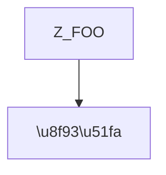
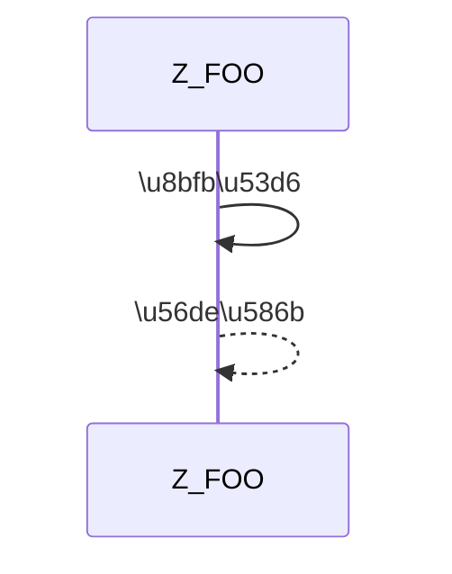

# 1.1.0 闸门强制面 Implementation Plan

> **For agentic workers:** REQUIRED SUB-SKILL: Use superpowers:subagent-driven-development (recommended) or superpowers:executing-plans to implement this plan task-by-task. Steps use checkbox (`- [ ]`) syntax for tracking.

**Goal:** 让闸门拦住「形状完美、内容全废」的报告——编造源码、问题行写空话、三层写同一句、删光 Mermaid、散文坏字节——并把 `report_qc.py` 拆成职责单一的模块。

**Architecture:** `report_qc.py` 瘦身为编排 + 退出码 + CLI；规则搬进 `scripts/checks/` 下四个模块（`text` / `structure` / `fidelity` / `advisory`），加一个 `encoding`。契约 `report-contract.json` 新增 5 个键承载新规则阈值，`text.py` 是唯一公共层。保真检查从「扁平子串包含」改为「token 序列比对 + 失配类型分档」，substantive 失配退 1、标点级失配仍 advisory。

**Tech Stack:** Python 3（标准库，无第三方依赖）、JSON Schema 风格的契约文件、subprocess 驱动的测试套件、git。

## Global Constraints

- 目标版本 **1.1.0**，契约版本 **1.3.0**（`version` 与 `release.ships_with` 是两个独立轴，都要改）。
- 当前基线：`test_skill.py` **157** 项通过，`test_contract_drift.py` **107** 项通过。两个数字在批次 2（拆分）**必须逐字不变**；批次 3 起会增长。
- `SKILL.md` 本轮**不改**（476 行）。它对 C1–C4 的要求早已存在，缺的只是检查器。
- 不引入任何第三方依赖；只用 Python 标准库。
- 所有源码文件 UTF-8、LF、文件末尾单换行。
- 不设报告长度上限（spec 明确不做）。
- 拆分只搬家不改规则：`check()` 的返回值、退出码、157 项测试必须逐字不变。
- 保真分类器的接受标准（spec §2）：
  - **判据 A 不漏**：新分类器标记的失配集合 ⊇ 旧子串检查的集合
  - **判据 B 不误伤**：新分类器判为 SUBSTANTIVE 的语句总数为 0；非 0 时逐条人工判定
- 报告文件是评测对象，不是待编辑草稿——闸门不得改写报告内容（`--fix` 除外）。
- 每个 Task 结束提交一次。提交信息用中文，与仓库现有风格一致。

---

## File Structure

**新建**

| 路径 | 职责 |
|---|---|
| `skill/analyzing-programs/scripts/checks/__init__.py` | 空文件，让 `checks` 成为包 |
| `skill/analyzing-programs/scripts/checks/contract.py` | 读 `report-contract.json` 一次并暴露派生常量 |
| `skill/analyzing-programs/scripts/checks/text.py` | 纯文本工具：`_flat` / `_claims` / `_strip_comment` / `fence_spans` / `line_of` / `source_blocks` 等，无副作用 |
| `skill/analyzing-programs/scripts/checks/structure.py` | 现有 `check()` 原样搬入 + 新的 C1/C2/C5 |
| `skill/analyzing-programs/scripts/checks/fidelity.py` | `classify()` / `fidelity_report()` / token 比对 + 两档分诊 |
| `skill/analyzing-programs/scripts/checks/advisory.py` | `density_note` / `fix_lang_note` / `fix_mislabel_note` / `authz_note` / `ext_asset_note` |
| `skill/analyzing-programs/scripts/checks/encoding.py` | C3：`U+FFFD` 检查 |
| `skill/analyzing-programs/tests/test_gate_enforcement.py` | 7 个探针的钉住用例（批次 1 记录现状 → 批次 3 翻转期望） |
| `release/pack.py` | 从指定 commit 打包成 zip + 解包目录 + 更新 SHA256SUMS |

**修改**

| 路径 | 改动 |
|---|---|
| `skill/analyzing-programs/scripts/report_qc.py` | 1218 行 → 目标 < 400 行，只留编排、CLI、退出码、`report()` |
| `skill/analyzing-programs/schemas/report-contract.json` | `version` 1.2.6→1.3.0，`release.ships_with` 1.0.9→1.1.0，新增 5 个键 |
| `skill/analyzing-programs/tests/test_skill.py` | 批次 9 需要给 `brief_report()` 补 sequenceDiagram |
| `skill/analyzing-programs/tests/test_contract_drift.py` | 新增「规则在哪个模块」的边界检查 |
| `skill/analyzing-programs/README.md` | 三处证据层说法 + `shipped_with` 表加一行 |

---

### Task 1: 建 `test_gate_enforcement.py`，钉住现状

**Files:**
- Create: `skill/analyzing-programs/tests/test_gate_enforcement.py`
- Test: 同上（自带 `check` / `run`，与 `test_skill.py` 约定一致）

**Interfaces:**
- Consumes: `scripts/report_qc.py` 的 CLI（plain 模式与 `--fidelity-only`）、`Test-source/zvend.abap`
- Produces: 后续 Task 9–10 翻转期望的同一组用例；用例函数名 `probe_*`

**背景：** 批次 1 的作用是先把「闸门现在放过它们」变成有记录的既成事实，批次 3 才有对照。**这一步不改任何产品代码。**

- [ ] **Step 1: 写测试文件骨架与两个辅助函数**

Create `skill/analyzing-programs/tests/test_gate_enforcement.py`:

```python
"""Probes for the enforcement holes found on 2026-10-09.

Each probe mutates a report that currently PASSES the gate and records what
the gate does with it. Task 1 asserts the CURRENT behaviour, which is that the
gate passes all of them. Task 9 and 10 flip these expectations to the behaviour
1.1.0 must have. Keeping both in one file is the point: the same probe, first
recorded as wrong, then proven right.

Run: python tests/test_gate_enforcement.py
"""
import io, os, re, subprocess, sys, tempfile

HERE = os.path.dirname(os.path.abspath(__file__))
ROOT = os.path.dirname(HERE)
QC = os.path.join(HERE, "..", "scripts", "report_qc.py")
REPO = os.path.dirname(ROOT)
BASE = os.path.join(REPO, "analyzing-programs-workspace", "exp-1.0.9",
                    "with_skill", "run1.md")
SRC = os.path.join(REPO, "Test-source", "zvend.abap")
FENCE = chr(96) * 3
LAYERS = ("\u505a\u4ec0\u4e48", "\u4e3a\u4ec0\u4e48", "\u98ce\u9669\u4e0e\u6539\u8fdb")

N_OK = 0
FAILS = []


def check(cond, label, detail=""):
    global N_OK
    if cond:
        N_OK += 1
    print(f"  {'ok  ' if cond else 'FAIL'}  {label}" + (f"   {detail}" if detail else ""))
    if not cond:
        FAILS.append(label)


def run(*args):
    env = dict(os.environ, PYTHONIOENCODING="utf-8", PYTHONUTF8="1")
    return subprocess.run([sys.executable, QC] + list(args), capture_output=True,
                          text=True, encoding="utf-8", env=env)


def gate(text, tmpdir, name, extra=()):
    """Write a mutated report and run the gate on it. Returns (rc, output)."""
    p = os.path.join(tmpdir, name)
    io.open(p, "w", encoding="utf-8", newline="").write(text)
    r = run(*(list(extra) + [p, SRC]))
    return r.returncode, r.stdout + r.stderr


def main():
    base = io.open(BASE, encoding="utf-8").read()
    tmp = tempfile.mkdtemp()
    print("enforcement probes (current behaviour, see module docstring)")
    print("-" * 72)
    # probes are added below
    print()
    print("-" * 72)
    print(f"{N_OK} checks passed, {len(FAILS)} failed")
    return 1 if FAILS else 0


if __name__ == "__main__":
    sys.exit(main())
```

- [ ] **Step 2: 运行确认骨架可跑**

Run: `cd skill/analyzing-programs && python tests/test_gate_enforcement.py`
Expected: `0 checks passed, 0 failed`，exit 0

- [ ] **Step 3: 加探针 1 —— 伪造源码**

在 `main()` 的 `# probes are added below` 之前插入：

```python
    rc0, _ = gate(base, tmp, "p0_baseline.md")
    check(rc0 == 0, "baseline report passes the gate", f"rc={rc0}")

    m = re.search(FENCE + "abap\n(.*?)" + FENCE, base, re.S)
    lines = m.group(1).split("\n")
    i = next(k for k, l in enumerate(lines)
             if l.strip() and not l.strip().startswith(("*", '"')))
    lines[i] = "  lv_tampered = fabricated_token_does_not_exist( ) ."
    fabricated = base[:m.start(1)] + "\n".join(lines) + base[m.end(1):]
    rc, out = gate(fabricated, tmp, "p1_fabricated.md")
    check(rc == 0, "PROBE 1 gate currently PASSES a fabricated quote",
          f"rc={rc}")
    check("do not occur in the source" in out,
          "PROBE 1 the note is printed anyway")
    rc, _ = gate(fabricated, tmp, "p1_fidelity.md", ("--fidelity-only",))
    check(rc == 1, "PROBE 1 --fidelity-only does reject it", f"rc={rc}")
```

- [ ] **Step 4: 加探针 2 —— 第五节问题行写空话**

```python
    lines5 = base.split("\n")
    i5 = next(k for k, l in enumerate(lines5) if l.startswith("\u0023\u0023\u4e94"))
    j5 = next(k for k in range(i5 + 1, len(lines5)) if lines5[k].startswith("\u0023\u0023 "))
    sec = lines5[i5:j5]
    rows = [k for k, l in enumerate(sec) if l.strip().startswith("|")]
    check(len(rows) > 4, "section five has rows to mutate", f"{len(rows)} rows")
    filler = "| P0 | \u65e0 | \u8fd9\u6bb5\u4ee3\u7801\u5199\u5f97\u5f88\u597d | \u65e0 | \u65e0 | \u65e0 |"
    for k in rows[1:5]:
        sec[k] = filler
    empty = "\n".join(lines5[:i5] + sec + lines5[j5:])
    rc, _ = gate(empty, tmp, "p2_empty_rows.md")
    check(rc == 0, "PROBE 2 gate currently PASSES rows with no content", f"rc={rc}")
```

- [ ] **Step 5: 加探针 3 —— 三层压成同一句**

```python
    triple = re.compile(r"(?m)^\*\*(" + "|".join(LAYERS) + r")\*\*\s*[\u2014\u2013:-]")
    n_layers = len(triple.findall(base))
    check(n_layers >= 60, "report has enough layer lines to mutate",
          f"{n_layers}")
    same = triple.sub(lambda mm: mm.group(0).split("**")[0]
                      + "**" + mm.group(1) + "** \u2014 \u8fd9\u6bb5\u4ee3\u7801\u503c\u5f97\u4e00\u770b\u3002",
                      base)
    check(same != base, "PROBE 3 substitution actually changed the report",
          f"{len(base)} -> {len(same)} bytes")
    rc, _ = gate(same, tmp, "p3_same_layers.md")
    check(rc == 0, "PROBE 3 gate currently PASSES three identical layers", f"rc={rc}")
```

- [ ] **Step 6: 加探针 4 —— 删光 Mermaid**

```python
    nmm = len(re.findall(FENCE + "mermaid", base, re.I))
    check(nmm >= 2, "report has diagrams to delete", f"{nmm}")
    nomm = re.sub(FENCE + "mermaid\n.*?" + FENCE, "", base, flags=re.S | re.I)
    check("mermaid" not in nomm.lower(), "PROBE 4 all diagrams removed")
    rc, _ = gate(nomm, tmp, "p4_no_mermaid.md")
    check(rc == 0, "PROBE 4 gate currently PASSES a report with no diagram", f"rc={rc}")
```

- [ ] **Step 7: 加探针 5 —— 散文 U+FFFD**

```python
    bad = base.replace("\u4f9b\u5e94\u5546", "\u4f9b\u5e94\u5546\ufffd\ufffd", 1)
    check(bad != base, "PROBE 5 substitution actually changed the report")
    rc, _ = gate(bad, tmp, "p5_fffd.md")
    check(rc == 0, "PROBE 5 gate currently PASSES a replacement char in prose", f"rc={rc}")
```

- [ ] **Step 8: 加探针 6 —— 复制整节**

```python
    h1 = re.search(r"(?ms)^## \u4e00.*?(?=^## \u4e8c)", base)
    dup = base[:h1.end()] + h1.group(0) + base[h1.end():]
    check(len(re.findall(r"(?m)^## \u4e00", dup)) == 2,
          "PROBE 6 section one now appears twice")
    rc, _ = gate(dup, tmp, "p6_dup_section.md")
    check(rc == 0, "PROBE 6 gate currently PASSES a duplicated section", f"rc={rc}")
```

- [ ] **Step 9: 加探针 7 —— 砍成骨架（闸门该有的牙齿）**

```python
    heads = [l for l in base.split("\n") if re.match(r"^#{1,3} ", l)]
    mini = ("\n".join(heads) + "\n\n" + FENCE + "abap\nREPORT lcl_foo.\n" + FENCE
            + "\n\n- \u4f4d\u7f6e\uff1a`lcl_foo`\n- \u4e3a\u4ec0\u4e48\uff1a`lcl_foo` \u91cc\u8fd9\u6837\n"
            + "- \u98ce\u9669\u4e0e\u6539\u8fdb\uff1a`lcl_foo` \u4f1a\u51fa\u9519\n")
    check(len(mini) < 0.05 * len(base), "PROBE 7 skeleton is under 5% of the original",
          f"{len(mini)} vs {len(base)}")
    rc, _ = gate(mini, tmp, "p7_skeleton.md")
    check(rc != 0, "PROBE 7 gate REJECTS an empty skeleton (teeth intact)", f"rc={rc}")
```

**注意：** 探针 7 是反向断言——它钉住闸门**已经做对**的事，拆分过程中不许退化。

- [ ] **Step 10: 跑测试确认全绿**

Run: `cd skill/analyzing-programs && python tests/test_gate_enforcement.py`
Expected: `N checks passed, 0 failed`，全部 `ok`。若某个 `PROBE` 失败，说明闸门行为与我实测的不一致——**停下来查，不要改期望值去迁就**。

- [ ] **Step 11: 提交**

```bash
git add skill/analyzing-programs/tests/test_gate_enforcement.py
git commit -m "test: 钉住闸门当前的 7 个强制面漏洞（批次1，只加测试不动产品代码）"
```

---

### Task 2: 抽出 `checks/contract.py` 与 `checks/text.py`

**Files:**
- Create: `skill/analyzing-programs/scripts/checks/__init__.py`（空文件）
- Create: `skill/analyzing-programs/scripts/checks/contract.py`
- Create: `skill/analyzing-programs/scripts/checks/text.py`
- Modify: `skill/analyzing-programs/scripts/report_qc.py`
- Test: `skill/analyzing-programs/tests/test_skill.py`

**Interfaces:**
- Consumes: 无（第一个模块任务）
- Produces:
  - `checks.contract`：`CONTRACT`（dict）、`CONTRACT_PATH`、`SEC`、`SEC_RE`、`LAYERS`、`BUCKETS`、`ROW`、`DIAGRAM_LANG`、`FENCE_LANGS`、`QUOTE_LANG`、`FIX_LANG`、`PSEC`、`PSEC_RE`、`LINE_NUM`、`FULLWIDTH`、`MM_BAD`、`DENSITY_FLOOR`、`ANCHORS`
  - `checks.text`：`fence_spans(s)`、`line_of(s, off)`、`source_blocks(s)`、`block_head(s, off)`、`in_risk_layer(head)`、`prose_end(s, off)`、`blank_fences(s)`、`anchor_for(marks, line)`、`anchors_of(src)`、`_flat(s)`、`_strip_comment(l)`、`_claims(body)`、`mm_violation(text)`、`mermaid_labels(block)`、`inventory(src)`
  - `report_qc.py` 改为 `from checks.contract import *` 与 `from checks.text import *`

**背景：** 现有常量与纯函数在 `report_qc.py` 里混着 check 逻辑。先把这两类分开，后续 Task 3 搬 check 时才不会来回动。

- [ ] **Step 1: 建包并把纯函数搬进 `text.py`**

先跑一次拿到要搬的清单：

Run: `cd skill/analyzing-programs && python -c "import io;t=io.open('scripts/report_qc.py',encoding='utf-8').read();print(len(t.split(chr(10))))"`
Expected: `1219`（含末尾空行）

Create `skill/analyzing-programs/scripts/checks/__init__.py`（空文件，零字节）。

Create `skill/analyzing-programs/scripts/checks/text.py`，把下列定义**逐字**从 `report_qc.py` 剪切进去（保持函数体与 docstring 不变，只在文件头加模块说明与 import）：

```python
"""Pure text utilities, no state and no I/O.

Everything here is a function of its arguments alone. `structure`, `fidelity`,
`advisory` and `encoding` all need to agree on what a code fence is and which
line an offset falls on; that agreement has to live in exactly one place or the
checks drift apart. This is that place.

Extracted verbatim from report_qc.py in 1.1.0. Behaviour is unchanged.
"""
```

被搬走的函数（按 `report_qc.py` 中的定义顺序）：`mm_violation`、`mermaid_labels`、`inventory`、`_past_line`、`lang_of`、`fence_spans`、`fence_defects`、`blank_fences`、`anchors_of`、`anchor_for`、`block_head`、`in_risk_layer`、`prose_end`、`source_blocks`、`line_of`、`cite_extent`、`_flat`、`_strip_comment`、`_claims`。

依赖的正则常量一并搬入 `text.py`：`TICK`、`TAG`、`FENCE_MARK`、`LINE_NUM`、`ELIDE`、`PAREN_NOTE`、`CJK`、`STR_LIT`、`PUNCT`、`NODE`、`PROSE_END`、`ROW`。

`text.py` 需要的 import：`import re`。

- [ ] **Step 2: 建 `contract.py`**

Create `skill/analyzing-programs/scripts/checks/contract.py`:

```python
"""The contract, loaded once, and everything derived from it.

report_qc.py used to load the JSON at import time and derive a dozen constants
inline. Those derivations were spread across the file, so a rule that existed in
the contract but not in the gate was invisible: `test_contract_drift.py` could
only check what a module imported.

Contract version 1.2.6 -> 1.3.0 in 1.1.0 (five new rule keys). Shipped with
1.1.0.
"""
import io, json, os, re

_HERE = os.path.dirname(os.path.abspath(__file__))
CONTRACT_PATH = os.path.join(_HERE, "..", "..", "schemas", "report-contract.json")

with io.open(CONTRACT_PATH, encoding="utf-8") as _fh:
    CONTRACT = json.load(_fh)

SEC = CONTRACT["sections"]
SEC_RE = [(re.compile(r"^" + re.escape(h), re.M), h[3:]) for h in SEC]
LAYERS = tuple(CONTRACT["layers"]["labels"])
BUCKETS = tuple(CONTRACT["problem_section"]["buckets"])
ROW = re.compile(r"^\|\s*(?:\*\*)?(?:%s)" % "|".join(re.escape(b) for b in BUCKETS),
                 re.M)
DIAGRAM_LANG = CONTRACT["mermaid"]["fence_language"]
FENCE_LANGS = CONTRACT["layers"]["fence_languages"]
QUOTE_LANG = FENCE_LANGS["quotes_source"]
FIX_LANG = FENCE_LANGS["illustrates_a_fix"]
PSEC = CONTRACT["problem_section"]["heading"]
PSEC_RE = re.compile(r"^" + re.escape(PSEC), re.M)
_IDS = [(re.compile(r"^#+\s*\d+\.?\s*"), h] for h in SEC]
_NEXT_SEC = [rx for rx, _ in _IDS]
_NEXT_SEC_RE = re.compile("|".join(r.pattern for r in _NEXT_SEC), re.M)
FULLWIDTH = CONTRACT["mermaid"]["fullwidth"]
MM_BAD = re.compile(
    "[" + re.escape("".join(CONTRACT["mermaid"]["forbid_in_display_text"])) + "]")
DENSITY_FLOOR = CONTRACT["advisories"][0]["floor_blocks_per_subprogram"]
```

`ANCHORS`、`_CITE_LIM`、`CITE_NUM`、`_IDS`、`_NEXT_SEC` 的原始定义先从 `report_qc.py` 剪切过来（`ANCHORS` 是 `check()` 与 `advisory.py` 都要用的，放在 `contract.py`）。

**若原定义与上面写的不一致，以 `report_qc.py` 里现有的逐字内容为准**——本步只搬家，不改行为。搬完立刻用 Step 3 验证。

- [ ] **Step 3: 改 `report_qc.py` 改为导入**

把 `report_qc.py` 顶部的常量定义与 import 段替换为：

```python
import os
import sys

sys.path.insert(0, os.path.dirname(os.path.abspath(__file__)))

from checks.contract import *          # noqa: F401,F403
from checks.text import *             # noqa: F401,F403
```

保留 `report_qc.py` 里 `main()` / `report()` / `die()` / `read_report()` / `read_src()` / `ReadError` 与三个 fixer 函数（`fix()`、`fix_ln()`、`fix_mislabel_note` 相关的 `fix_mislabel`）。其余被搬走的定义从 `report_qc.py` 删除。

- [ ] **Step 4: 跑两个套件确认逐字不变**

Run: `cd skill/analyzing-programs && python tests/test_skill.py`
Expected: `157 checks passed, 0 failed`

Run: `cd skill/analyzing-programs && python tests/test_contract_drift.py`
Expected: `107 drift checks passed, 0 failed`

任一数字变化就**停止**，用 `git diff` 找出被误改的行为。

- [ ] **Step 5: 跑探针确认行为不变**

Run: `cd skill/analyzing-programs && python tests/test_gate_enforcement.py`
Expected: `N checks passed, 0 failed`

- [ ] **Step 6: 确认 `report_qc.py` 变小了**

Run: `cd skill/analyzing-programs && python -c "import io;print(len(io.open('scripts/report_qc.py',encoding='utf-8').read().split(chr(10))))"`
Expected: 明显小于 1219（大约 700–800 行）

- [ ] **Step 7: 提交**

```bash
git add skill/analyzing-programs/scripts/checks/ skill/analyzing-programs/scripts/report_qc.py
git commit -m "refactor: 抽出 checks/contract.py 与 checks/text.py，纯搬家不改行为"
```

---

### Task 3: 搬 `check()` 进 `structure.py`，搬 note 进 `advisory.py`

**Files:**
- Create: `skill/analyzing-programs/scripts/checks/structure.py`
- Create: `skill/analyzing-programs/scripts/checks/advisory.py`
- Modify: `skill/analyzing-programs/scripts/report_qc.py`
- Test: 两个套件 + 探针套件

**Interfaces:**
- Consumes: Task 2 的 `checks.contract` / `checks.text`
- Produces:
  - `checks.structure.check(s) -> list[tuple[str, int, str]]`（签名与行为不变）
  - `checks.advisory.all_notes(s, src) -> list[str]`——把目前散在两处的 note 列表收敛成一处（`report()` 与 `--fix` 分支各写了一遍，属 DRY 违规）

- [ ] **Step 1: 建 `structure.py`，逐字搬入 `check()`**

Create `skill/analyzing-programs/scripts/checks/structure.py`，文件头：

```python
"""Structural rules: six sections, three layers, fences, Mermaid labels,
location labels, and the priority buckets in section five.

`check(s)` returns a list of (kind, line, detail). Empty means clean. The
signature and every kind string are unchanged from the single-file gate; the
1.1.0 change is only that it lives here.
"""
from checks.contract import (BUCKETS, DIAGRAM_LANG, LAYERS, LINE_NUM, PSEC,
                             PSEC_RE, ROW, SEC_RE, _NEXT_SEC_RE, A8_GAP,
                             LAYER_LABELS)
from checks.text import (blank_fences, fence_defects, fence_spans, line_of,
                         mermaid_labels, mm_violation, source_blocks)
```

把 `check()` 的函数体连同 docstring 逐字粘贴进来，并把函数体里引用的裸名改成上面 import 的名字（`PSEC_RE`、`LAYERS`、`SEC_RE`、`BUCKETS`、`ROW`、`DIAGRAM_LANG`、`LINE_NUM`、`A8_GAP`、`_NEXT_SEC_RE`）。

`A8_GAP` 与 `LAYER_LABELS` 若 `report_qc.py` 里没有同名常量，就用下面两行补在 `contract.py` 末尾（值取自 `report_qc.py` 现有代码，不要自创）：

```python
A8_GAP = CONTRACT["layers"]["prose_window_max_chars"]
LAYER_LABELS = LAYERS
```

- [ ] **Step 2: 建 `advisory.py`，逐字搬入五个 note 函数**

Create `skill/analyzing-programs/scripts/checks/advisory.py`，文件头：

```python
"""Advisories: things worth reading, never reasons to fail a run.

`die()`'s docstring says it: labelling a fatal error as a note let a caller that
greps for advisories collect hard failures as soft ones. Everything in this
module prints and returns a string or None; none of it changes an exit code.
That is why 1.1.0 had to move fidelity OUT of this module to give it teeth.
"""
from checks.contract import DENSITY_FLOOR, QUOTE_LANG, FIX_LANG
from checks.text import (_claims, _strip_comment, _flat, fence_spans, line_of,
                         anchors_of, inventory)
```

搬入：`density_note`、`fix_lang_note`、`fix_mislabel_note`、`authz_note`、`ext_asset_note`、`fidelity_note`（fidelity 本轮先搬过来保持 advisory，Task 10 再加分档）。

- [ ] **Step 3: `report()` 改用 `all_notes()`**

在 `advisory.py` 末尾加：

```python
def all_notes(s, src=None):
    """Every advisory for this report, in the order they were printed before.

    report() and the --fix branch each built this list by hand, in two
    different orders. They drifted once already: --fix prints them before the
    verdict, report() after. One list, one order.
    """
    out = []
    for fn in (density_note, fix_lang_note):
        try:
            n = fn(s, src)
        except TypeError:
            n = fn(s)
        if n:
            out.append(n)
    for fn in (fix_mislabel_note, authz_note, ext_asset_note):
        n = fn(s, src)
        if n:
            out.append(n)
    n = fidelity_note(s, src)
    if n:
        out.append(n)
    return out
```

**注意顺序：** 原 `report()` 的顺序是 density, fidelity, fix_lang, fix_mislabel, authz, ext_asset；`--fix` 分支的顺序相同。`all_notes` 必须复现**这个**顺序，否则输出会变，测试可能挂。把 `fidelity_note` 挪到 fix_lang 之前以匹配原顺序。

把 `report()` 里的 `notes = [...]` 换成 `notes = all_notes(s, src)`，`--fix` 分支末尾的 `for note in (...)` 换成 `for note in all_notes(fixed, ssrc):`。

- [ ] **Step 4: `report_qc.py` 改导入**

```python
from checks.contract import *          # noqa: F401,F403
from checks.text import *             # noqa: F401,F403
from checks.structure import check     # noqa: F401
from checks.advisory import all_notes, fidelity_note
```

- [ ] **Step 5: 跑三个套件**

Run: `cd skill/analyzing-programs && python tests/test_skill.py && python tests/test_contract_drift.py && python tests/test_gate_enforcement.py`
Expected: `157 checks passed, 0 failed` / `107 drift checks passed, 0 failed` / `N checks passed, 0 failed`

- [ ] **Step 6: 确认体积**

Run: `cd skill/analyzing-programs && python -c "import io;print(len(io.open('scripts/report_qc.py',encoding='utf-8').read().split(chr(10))))"`
Expected: < 600

- [ ] **Step 7: 提交**

```bash
git add skill/analyzing-programs/scripts/
git commit -m "refactor: check() 进 structure.py，note 进 advisory.py，notes 收敛为 all_notes()"
```

---

### Task 4: 契约加 5 个键，drift 测试守住模块边界

**Files:**
- Modify: `skill/analyzing-programs/schemas/report-contract.json`
- Modify: `skill/analyzing-programs/tests/test_contract_drift.py`
- Test: 同上

**Interfaces:**
- Consumes: Task 2 的 `checks.contract.CONTRACT`
- Produces: 契约键 `problem_section.rows_require_source_object`、`layers.distinct`、`encoding.replacement_char`、`mermaid.required_diagrams`、`sections.exactly_once`

- [ ] **Step 1: 写失败测试**

在 `test_contract_drift.py` 的 `main()` 里，`print("contract vs gate")` 之前插入：

```python
    print("1.1.0 rule keys")
    print("-" * 72)
    C = load_contract()
    check(C["version"] == "1.3.0", "contract version is 1.3.0",
          C["version"])
    check(C["release"]["ships_with"] == "1.1.0",
          "contract ships with 1.1.0", C["release"]["ships_with"])
    check(C["problem_section"].get("rows_require_source_object") is True,
          "rows_require_source_object is declared and on")
    check(C["layers"].get("distinct") is True,
          "layers.distinct is declared and on")
    check(C["encoding"].get("replacement_char") == "\ufffd",
          "encoding.replacement_char is U+FFFD",
          repr(C["encoding"].get("replacement_char")))
    check(C["mermaid"].get("required_diagrams") == ["flowchart", "sequenceDiagram"],
          "mermaid.required_diagrams names both diagrams",
          repr(C["mermaid"].get("required_diagrams")))
    check(C.get("sections_exactly_once") is True,
          "sections_exactly_once is declared and on")
```

`check()` 与 `load_contract()` 若在 `test_contract_drift.py` 里已存在就直接用；`load_contract()` 定义为：

```python
def load_contract():
    import json
    p = os.path.join(HERE, "..", "schemas", "report-contract.json")
    with io.open(p, encoding="utf-8") as fh:
        return json.load(fh)
```

`sections` 契约键当前是 list，`sections.exactly_once` 无处安放——因此**放在契约顶层**，
键名 `sections_exactly_once`（bool）。上面最后一个 `check` 就按这个键名写，不要留
`sections_anchor` 之类的其它拼法。

- [ ] **Step 2: 运行确认失败**

Run: `cd skill/analyzing-programs && python tests/test_contract_drift.py`
Expected: 至少 6 个 `FAIL`，其中含 `contract version is 1.3.0`、`rows_require_source_object is declared and on`

- [ ] **Step 3: 改契约**

把 `report-contract.json` 的 `"version": "1.2.6"` 改为 `"1.3.0"`，`release.ships_with` 由 `"1.0.9"` 改为 `"1.1.0"`。

在 `problem_section` 对象内加：

```json
"rows_require_source_object": true
```

在 `layers` 对象内加：

```json
"distinct": true
```

在 `mermaid` 对象内加：

```json
"required_diagrams": ["flowchart", "sequenceDiagram"]
```

在契约**顶层**（与 `sections`、`layers` 平级）加：

```json
"sections_exactly_once": true,
"encoding": {
  "replacement_char": "\ufffd",
  "why": "a truncated multi-byte character renders as U+FFFD and reads as a rendering fault in the finished report; one in exp-1.0.9/with_skill/run3.md went unnoticed for a whole round",
  "skill_anchor": "保存为 UTF-8"
}
```

同时在 `layers` 对象里补一条 `skill_anchor` 说明（若已有则不重复加）：

```json
"distinct_why": "three layers carrying one sentence is a list, not an analysis; the labels exist but say nothing"
```

- [ ] **Step 4: 运行确认通过**

Run: `cd skill/analyzing-programs && python tests/test_contract_drift.py`
Expected: `113 drift checks passed, 0 failed`（107 + 6）

- [ ] **Step 5: 加模块边界检查**

在 `test_contract_drift.py` 的 `main()` 里追加：

```python
    print("rule placement")
    print("-" * 72)
    import subprocess as _sp
    def where(token):
        out = []
        for name in ("report_qc.py", "checks/structure.py", "checks/fidelity.py",
                     "checks/advisory.py", "checks/encoding.py", "checks/text.py"):
            p = os.path.join(HERE, "..", "scripts", name)
            if not os.path.exists(p):
                continue
            t = io.open(p, encoding="utf-8").read()
            if token in t:
                out.append(name)
        return out

    check("mermaid_labels" in where("mermaid_labels")[0],
          "mermaid_labels lives in checks/text.py",
          str(where("mermaid_labels")))
    check("def check(" in (where("def check(")[0] or ""),
          "check() is defined in checks/structure.py",
          str(where("def check(")))
```

把 `def check(` 这个探针改成明确断言：`where("def check(")` 的结果必须**恰好**是 `["checks/structure.py"]`。

- [ ] **Step 6: 运行确认**

Run: `cd skill/analyzing-programs && python tests/test_contract_drift.py`
Expected: `116 drift checks passed, 0 failed`（113 + 3）

- [ ] **Step 7: 提交**

```bash
git add skill/analyzing-programs/schemas/report-contract.json skill/analyzing-programs/tests/test_contract_drift.py
git commit -m "contract: 1.3.0 加五个规则键，drift 测试守住模块边界"
```

---

### Task 5: C3 —— 散文里的 U+FFFD

**Files:**
- Create: `skill/analyzing-programs/scripts/checks/encoding.py`
- Modify: `skill/analyzing-programs/scripts/checks/structure.py`（`check()` 调用它）
- Modify: `skill/analyzing-programs/tests/test_gate_enforcement.py`（翻转探针 5）
- Test: 同上

**Interfaces:**
- Consumes: `checks.contract.CONTRACT["encoding"]["replacement_char"]`
- Produces: `checks.encoding.replacement_defects(s) -> list[tuple[str, int, str]]`，kind 为 `"enc"`

**背景：** 五条新检查里最简单的一条，先做，用来验证「加检查」这条流水线本身是通的。

- [ ] **Step 1: 翻转探针 5 的期望**

把 `test_gate_enforcement.py` 里探针 5 的：

```python
    check(rc == 0, "PROBE 5 gate currently PASSES a replacement char in prose", f"rc={rc}")
```

改为：

```python
    check(rc != 0, "PROBE 5 gate now REJECTS a replacement char in prose", f"rc={rc}")
    check("enc" in out, "PROBE 5 the violation is reported as kind 'enc'",
          out.strip().splitlines()[0][:80] if out.strip() else "")
```

- [ ] **Step 2: 运行确认失败**

Run: `cd skill/analyzing-programs && python tests/test_gate_enforcement.py`
Expected: `PROBE 5 gate now REJECTS a replacement char in prose` 报 `FAIL`

- [ ] **Step 3: 建 `encoding.py`**

Create `skill/analyzing-programs/scripts/checks/encoding.py`:

```python
"""Encoding faults the structural checks cannot see.

One U+FFFD in prose passes every other rule: the report still has six sections,
still three layers per fence, still four buckets. It reached a finished report
once already -- exp-1.0.9/with_skill/run3.md carried two adjacent U+FFFD from a
truncated multi-byte character and went unnoticed for a whole round.

read_report() refuses a report that is not valid utf-8, which catches the file
being wrong. This catches the file being valid utf-8 and still damaged, which is
what a truncated character decodes to.
"""
from checks.contract import CONTRACT


def replacement_defects(s):
    """(kind, line, detail) for every U+FFFD in the report.

    One defect per line, not per character: a run of replacement chars is one
    truncation event and should not inflate the defect count.
    """
    ch = CONTRACT["encoding"]["replacement_char"]
    out = []
    for i, line in enumerate(s.split("\n"), 1):
        if ch in line:
            n = line.count(ch)
            detail = ("report text carries %d replacement character(s) (U+FFFD) "
                      "-- a multi-byte character was truncated on save"
                      % n)
            out.append(("enc", i, detail))
    return out
```

- [ ] **Step 4: 接到 `check()`**

在 `structure.py` 的 `check()` 末尾（`return bad` 之前）加：

```python
    bad.extend(replacement_defects(s))
```

并在 `structure.py` 顶部 import 里加：

```python
from checks.encoding import replacement_defects
```

- [ ] **Step 5: 运行确认通过**

Run: `cd skill/analyzing-programs && python tests/test_gate_enforcement.py`
Expected: 全部 `ok`，`N checks passed, 0 failed`

- [ ] **Step 6: 确认产物也被拦住**

Run: `cd skill/analyzing-programs && python scripts/report_qc.py ..\..\analyzing-programs-workspace\exp-1.0.9\with_skill\run3.md ..\..\Test-source\zvend.abap`
Expected: 打印 `enc line 297 ...`，`FAIL`，exit 1。**这是设计意图**：上一轮"刻意不修"的那处损坏现在被闸门看见。

- [ ] **Step 7: 确认没有伤到 run1/run2**

Run: `cd skill/analyzing-programs && python scripts/report_qc.py ..\..\analyzing-programs-workspace\exp-1.0.9\with_skill\run1.md ..\..\Test-source\zvend.abap && python scripts/report_qc.py ..\..\analyzing-programs-workspace\exp-1.0.9\with_skill\run2.md ..\..\Test-source\zvend.abap`
Expected: 两个都 `PASS`，exit 0

- [ ] **Step 8: 跑全套并提交**

Run: `cd skill/analyzing-programs && python tests/test_skill.py && python tests/test_contract_drift.py`
Expected: `157 checks passed, 0 failed` / `116 drift checks passed, 0 failed`

```bash
git add skill/analyzing-programs/scripts/checks/encoding.py skill/analyzing-programs/scripts/checks/structure.py skill/analyzing-programs/tests/test_gate_enforcement.py
git commit -m "gate: C3 全文 U+FFFD 检查（散文坏字节不再沉默）"
```

---

### Task 6: C5 —— 六节恰好一次

**Files:**
- Modify: `skill/analyzing-programs/scripts/checks/structure.py`
- Modify: `skill/analyzing-programs/tests/test_gate_enforcement.py`（翻转探针 6）
- Test: 同上

**Interfaces:**
- Consumes: `checks.contract.CONTRACT["sections_exactly_once"]`、`checks.contract.SEC_RE`
- Produces: 新 kind `"sec-dup"`

- [ ] **Step 1: 翻转探针 6**

把探针 6 的断言改为：

```python
    rc, out = gate(dup, tmp, "p6_dup_section.md")
    check(rc != 0, "PROBE 6 gate now REJECTS a duplicated section", f"rc={rc}")
    check("sec-dup" in out, "PROBE 6 reported as kind 'sec-dup'",
          out.strip().splitlines()[0][:80] if out.strip() else "")
```

- [ ] **Step 2: 运行确认失败**

Run: `cd skill/analyzing-programs && python tests/test_gate_enforcement.py`
Expected: 探针 6 两个 `FAIL`

- [ ] **Step 3: 改 `check()`**

`structure.py` 里现有的

```python
    present = sum(1 for rx, _ in SEC_RE if rx.search(s))
    if present < len(SEC_RE):
        missing = [sid for rx, sid in SEC_RE if not rx.search(s)]
        bad.append(("sec", 0, f"missing section(s): {', '.join(missing)}"))
```

改为：

```python
    present = sum(1 for rx, _ in SEC_RE if rx.search(s))
    if present < len(SEC_RE):
        missing = [sid for rx, sid in SEC_RE if not rx.search(s)]
        bad.append(("sec", 0, f"missing section(s): {', '.join(missing)}"))
    elif SECTIONS_EXACTLY_ONCE:
        for rx, sid in SEC_RE:
            n = len(rx.findall(s))
            if n > 1:
                bad.append(("sec-dup", line_of(s, rx.search(s).end()),
                            "section %s appears %d times" % (sid, n)))
```

在 `structure.py` 顶部加：

```python
from checks.contract import CONTRACT
SECTIONS_EXACTLY_ONCE = CONTRACT.get("sections_exactly_once", False)
```

- [ ] **Step 4: 加 kind 到排序表**

`report_qc.py` 的 `report()` 里 `order` 字典加一项：`"sec-dup": 1,`（与 `sec` 同级，紧跟其后）。

- [ ] **Step 5: 运行确认通过**

Run: `cd skill/analyzing-programs && python tests/test_gate_enforcement.py`
Expected: 全部 `ok`

- [ ] **Step 6: 跑全套并提交**

Run: `cd skill/analyzing-programs && python tests/test_skill.py`
Expected: `157 checks passed, 0 failed`。若 `brief_report()` 之类触发 `sec-dup`，说明报告模板里某节出现了两次——查清楚再改，不要放宽规则。

```bash
git add skill/analyzing-programs/scripts/checks/structure.py skill/analyzing-programs/scripts/report_qc.py skill/analyzing-programs/tests/test_gate_enforcement.py
git commit -m "gate: C5 六节恰好出现一次（SEC_RE 从只数存在改为数重复）"
```

---

### Task 7: C2 —— 三层正文不得三行相同

**Files:**
- Modify: `skill/analyzing-programs/scripts/checks/structure.py`
- Modify: `skill/analyzing-programs/tests/test_gate_enforcement.py`（翻转探针 3）
- Test: 同上

**Interfaces:**
- Consumes: `checks.contract.CONTRACT["layers"]["distinct"]`、`checks.contract.LAYERS`、`checks.text.source_blocks`
- Produces: 新 kind `"layer-same"`

- [ ] **Step 1: 翻转探针 3**

把探针 3 的断言改为：

```python
    rc, out = gate(same, tmp, "p3_same_layers.md")
    check(rc != 0, "PROBE 3 gate now REJECTS three identical layers", f"rc={rc}")
    check("layer-same" in out, "PROBE 3 reported as kind 'layer-same'",
          out.strip().splitlines()[0][:80] if out.strip() else "")
```

- [ ] **Step 2: 运行确认失败**

Expected: 探针 3 两个 `FAIL`

- [ ] **Step 3: 在 `text.py` 加层正文提取**

```python
LAYER_RE = re.compile(r"(?m)^[ \t]*[-*]?\s*(?:\*\*)?(%s)(?:\*\*)?\s*[\uff1a:\u2014\u2013-]?\s*(.*)$"
                      % "|".join(re.escape(l) for l in CONTRACT["layers"]["labels"]))


def layer_bodies(gap):
    """{label: normalised body} for the layers present in one prose window.

    A window that carries all three labels with the same body is a list, not an
    analysis. 1.0.7 wrote that rule into SKILL.md and added no checker for it --
    'each layer names at least one source object' has had no enforcement for four
    releases.
    """
    out = {}
    for m in LAYER_RE.finditer(gap):
        body = re.sub(r"[\s`*\u3002\uff0c\u3001\uff1b\uff1a]", "", m.group(2))
        if body:
            out.setdefault(m.group(1), body)
    return out
```

顶部加 `from checks.contract import CONTRACT`。

- [ ] **Step 4: 在 `structure.py` 里判定**

`check()` 的 `for st, end, gap in source_blocks(s):` 循环里，`miss` 判定之后加：

```python
        if LAYERS_DISTINCT:
            bodies = layer_bodies(gap)
            if len(bodies) == len(LAYERS) and len(set(bodies.values())) == 1:
                bad.append(("layer-same", line_of(s, st),
                            "all three layers carry the same text: %r"
                            % next(iter(bodies.values()))[:40]))
```

顶部加：

```python
from checks.contract import CONTRACT
LAYERS_DISTINCT = CONTRACT["layers"].get("distinct", False)
```

- [ ] **Step 5: 加 kind 到排序表**

`report_qc.py` 的 `order` 加 `"layer-same": 7,`（排在 `A8-cc` 之前）。

- [ ] **Step 6: 运行确认**

Run: `cd skill/analyzing-programs && python tests/test_gate_enforcement.py`
Expected: 全部 `ok`

Run: `cd skill/analyzing-programs && python tests/test_skill.py`
Expected: `157 checks passed, 0 failed`。**注意**：`brief_report()` 的三层是
`**做什么** — 取一行。` / `**为什么** — 索引命中。` / `**风险与改进** — 未判空。`
三句不同，不该被拦；若被拦说明归一化过度（把 `。` 也去掉了导致三句变一样），收窄归一化字符集。

- [ ] **Step 7: 提交**

```bash
git add skill/analyzing-programs/scripts/checks/text.py skill/analyzing-programs/scripts/checks/structure.py skill/analyzing-programs/scripts/report_qc.py skill/analyzing-programs/tests/test_gate_enforcement.py
git commit -m "gate: C2 三层正文不得三行相同（补上 1.0.7 留下的无检查器规则）"
```

---

### Task 8: C1 —— 第五节问题行必须点名源码里存在的标识符

**Files:**
- Modify: `skill/analyzing-programs/scripts/checks/structure.py`
- Modify: `skill/analyzing-programs/tests/test_gate_enforcement.py`（翻转探针 2）
- Test: 同上

**Interfaces:**
- Consumes: `checks.contract.CONTRACT["problem_section"]["rows_require_source_object"]`、`checks.contract.ROW`、`checks.text.source_blocks`
- Produces: 新 kind `"row-src"`

**背景：** 判据是「行里至少有一个反引号包裹的 token，**或**有一个长度 ≥ 3 的标识符形 token 能在源码全文搜到」。**不**用 `inventory(src)`——它只返回子程序名，而问题行大量引用字段名与表名。

`check(s)` 当前签名只有 `s`，拿不到源码。这是本任务唯一需要改签名的地方。

- [ ] **Step 1: 翻转探针 2**

把探针 2 的断言改为：

```python
    rc, out = gate(empty, tmp, "p2_empty_rows.md")
    check(rc != 0, "PROBE 2 gate now REJECTS rows that name nothing", f"rc={rc}")
    check("row-src" in out, "PROBE 2 reported as kind 'row-src'",
          out.strip().splitlines()[0][:80] if out.strip() else "")
```

- [ ] **Step 2: 运行确认失败**

Expected: 探针 2 两个 `FAIL`

- [ ] **Step 3: 改 `check()` 签名**

`structure.py`：

```python
def check(s, src=None):
    """Return a list of (kind, line, detail). Empty means clean.

    `src` is optional and only C1 needs it. Every existing caller that passes one
    argument keeps working, which is what lets the rule land without touching the
    fixtures.
    """
```

`report_qc.py` 的 `report()` 里把 `bad = check(s)` 改为 `bad = check(s, src)`。

`--fix` 分支里的 `left = check(fixed)` 改为 `left = check(fixed, ssrc)`。

`--fidelity-only` 分支不调用 `check()`，无需改动。

- [ ] **Step 4: 在 `structure.py` 实现 C1**

```python
_IDENT = re.compile(r"[A-Za-z_][A-Za-z0-9_]{2,}")


def _row_names_source(row, flat_src):
    """True when a problem row points at something the source actually has.

    A backticked token counts on its own -- the writer chose to mark it as code.
    Otherwise the row must contain an identifier-shaped token that occurs in the
    source text. 'this code is written well' satisfies neither.
    """
    if "`" in row:
        return True
    if flat_src is None:
        return False           # no source given: cannot judge, so do not fail
    return any(m.group(0).lower() in flat_src for m in _IDENT.finditer(row))
```

在 `check()` 的 `miss_b` 判定之后加：

```python
    if ROWS_REQUIRE_OBJECT and src:
        flat_src = _flat(src).lower()
        sec5_off = s.find(sec5)
        for off, line in enumerate(sec5.split("\n")):
            if not line.strip().startswith("|") or set(line) <= set("|- "):
                continue
            if not ROW.match(line):
                continue
            if not _row_names_source(line, flat_src):
                bad.append(("row-src",
                            line_of(s, sec5_off + off) if sec5_off >= 0 else 0,
                            "problem row names no object from the source: %r"
                            % line.strip()[:60]))
```

两处细节是有原因的，不要改：

- 行号用 `sec5_off + off` 算，**不要**用 `s.index(line)`——第五节里重复的行很常见，
  `index` 会把缺陷报在第一处那个无害的行上。
- `and src` 是刻意的：**没给源码就不判 C1**。`report_qc.py REPORT` 不带源文件是合法
  调用，那种情况下判"每行都没点名对象"会把所有报告误杀。

- [ ] **Step 5: 顶部加常量与 import**

```python
from checks.contract import CONTRACT
ROWS_REQUIRE_OBJECT = CONTRACT["problem_section"].get("rows_require_source_object", False)
from checks.text import _flat
```

- [ ] **Step 6: 加 kind 到排序表**

`order` 加 `"row-src": 3,`（紧跟 `prow` 之后）。

- [ ] **Step 7: 运行确认**

Run: `cd skill/analyzing-programs && python tests/test_gate_enforcement.py`
Expected: 全部 `ok`

Run: `cd skill/analyzing-programs && python tests/test_skill.py`
Expected: `157 checks passed, 0 failed`。若挂了，看失败项里的 kind：

- 报 `row-src` → 说明第 4 步的 `and src` 没生效，或某条路径调 `check(s)` 时传了 `None`
  却仍进了循环。检查 `report()` 与 `--fix` 分支是否都改成了 `check(s, src)`。
- 报别的 kind → 是 C1 挪动了别的东西，回看第 4 步的插入位置。

**不要**为了让 `brief_report()` 通过而放宽 `_row_names_source`。那个模板的 P0 行写的是
`| P0-1 | \`Z_FOO\` | 未判空 | 补 \`CHECK\` |`，含反引号 token，按判据本来就该过。

- [ ] **Step 8: 提交**

```bash
git add skill/analyzing-programs/scripts/checks/structure.py skill/analyzing-programs/scripts/report_qc.py skill/analyzing-programs/tests/test_gate_enforcement.py
git commit -m "gate: C1 第五节问题行必须点名源码里存在的对象"
```

---

### Task 9: C4 —— 至少一张 flowchart + 一张 sequenceDiagram

**Files:**
- Modify: `skill/analyzing-programs/scripts/checks/structure.py`
- Modify: `skill/analyzing-programs/scripts/report_qc.py`
- Modify: `skill/analyzing-programs/tests/test_skill.py`（**必须改 `brief_report()`**）
- Modify: `skill/analyzing-programs/tests/test_gate_enforcement.py`（翻转探针 4）
- Test: 两个套件

**Interfaces:**
- Consumes: `checks.contract.CONTRACT["mermaid"]["required_diagrams"]`、`checks.text.fence_spans`
- Produces: 新 kind `"mm-missing"`

**⚠️ 已知后果：`brief_report()` 只有 1 张 flowchart、0 张 sequenceDiagram。本检查会让所有用它的测试挂掉。** 必须同一步给 `brief_report()` 补一张 sequenceDiagram，否则测试套件会红一片。

- [ ] **Step 1: 翻转探针 4**

把探针 4 的断言改为：

```python
    rc, out = gate(nomm, tmp, "p4_no_mermaid.md")
    check(rc != 0, "PROBE 4 gate now REJECTS a report with no diagram", f"rc={rc}")
    check("mm-missing" in out, "PROBE 4 reported as kind 'mm-missing'",
          out.strip().splitlines()[0][:80] if out.strip() else "")
```

- [ ] **Step 2: 运行确认失败**

Expected: 探针 4 两个 `FAIL`

- [ ] **Step 3: 在 `structure.py` 实现 C4**

```python
def _missing_diagrams(s):
    """(kind, line, detail) for each required diagram type the report lacks."""
    want = CONTRACT["mermaid"].get("required_diagrams") or []
    if not want:
        return []
    have = {}
    for _st, bs, be, _en, lang in fence_spans(s):
        if lang == DIAGRAM_LANG.lower():
            blk = s[bs:be]
            for t in want:
                if re.search(r"^\s*" + re.escape(t) + r"\b", blk, re.M):
                    have.setdefault(t, line_of(s, _st))
    return [("mm-missing", have.get(t, 0),
             "SKILL.md requires a Mermaid %s; the report has none" % t)
            for t in want if t not in have]
```

在 `check()` 的 Mermaid 标签检查之后加：

```python
    bad.extend(_missing_diagrams(s))
```

顶部加 `import re` 与 `from checks.contract import CONTRACT`。

- [ ] **Step 4: 加 kind 到排序表**

`order` 加 `"mm-missing": 6,`。

- [ ] **Step 5: 给 `brief_report()` 补 sequenceDiagram**

`test_skill.py` 的 `brief_report()` 里，把

```
## 四、流程图


```

改为

```
## 四、流程图



```

- [ ] **Step 6: 运行 `test_skill.py` 并逐个修**

Run: `cd skill/analyzing-programs && python tests/test_skill.py`
Expected: 若干 `FAIL`，全是 `mm-missing`。逐个找到对应的内联报告字符串，给它补上缺的图。**不要放宽规则去迁就测试**——这些字符串代表报告应该长什么样。

记录补了几处，最终数字应高于 157。

- [ ] **Step 7: 跑全部三个套件**

Run: `cd skill/analyzing-programs && python tests/test_skill.py && python tests/test_contract_drift.py && python tests/test_gate_enforcement.py`
Expected: 三个套件全绿

- [ ] **Step 8: 提交**

```bash
git add skill/analyzing-programs/
git commit -m "gate: C4 要求 flowchart 与 sequenceDiagram 各至少一张，模板补齐"
```

---

### Task 10: 保真分档 —— token 序列比对

**Files:**
- Create: `skill/analyzing-programs/scripts/checks/tokens.py`
- Modify: `skill/analyzing-programs/scripts/checks/fidelity.py`
- Modify: `skill/analyzing-programs/scripts/checks/advisory.py`（把 `fidelity_note` 的调用改道）
- Modify: `skill/analyzing-programs/scripts/report_qc.py`（`report()` 把 substantive 计进退出码）
- Create: `skill/analyzing-programs/tests/test_fidelity_tiers.py`
- Modify: `skill/analyzing-programs/tests/test_gate_enforcement.py`（翻转探针 1）
- Test: 三个套件 + 新套件

**Interfaces:**
- Consumes: `checks.text._claims` / `_flat` / `fence_spans` / `line_of`
- Produces:
  - `checks.tokens.tokenize(s) -> list[tuple[str, str]]`（类别 ∈ `ident`/`literal`/`number`/`punct`，值为归一化后的文本）
  - `checks.tokens.identity(seq) -> tuple`（去掉 `punct` 后的身份序列）
  - `checks.fidelity.classify(s, src) -> list[tuple[str, int, str, str]]`——`(tier, line, report_line, detail)`，tier ∈ `PUNCT-ONLY` / `SUBSTANTIVE`
  - `checks.fidelity.fidelity_report(s, src) -> (int, int, list, list)`——`(substantive_count, punct_only_count, tiers, notes)`

**背景：** 这是全计划风险最高的一步，接受标准是 spec 的判据 A 与 B。

- [ ] **Step 1: 写 token 化的失败测试**

Create `skill/analyzing-programs/tests/test_fidelity_tiers.py`，骨架与 `test_gate_enforcement.py` 同构（自带 `check` / `run` / `main`）：

```python
"""Fidelity tiers: does the new classifier see everything the old one saw?

Acceptance is spec section 2:
  A  no leak   the new tier-1 set is a superset of the old substring set
  B  no harm   zero SUBSTANTIVE verdicts across the archived reports

Run: python tests/test_fidelity_tiers.py
"""
import io, os, re, subprocess, sys

HERE = os.path.dirname(os.path.abspath(__file__))
ROOT = os.path.dirname(HERE)
REPO = os.path.dirname(ROOT)
sys.path.insert(0, os.path.join(ROOT, "scripts"))

from checks.tokens import tokenize, identity      # noqa: E402
from checks.fidelity import classify             # noqa: E402

N_OK = 0
FAILS = []


def check(cond, label, detail=""):
    global N_OK
    if cond:
        N_OK += 1
    print(f"  {'ok  ' if cond else 'FAIL'}  {label}" + (f"   {detail}" if detail else ""))
    if not cond:
        FAILS.append(label)


def main():
    print("tokenizer")
    print("-" * 72)
    seq = tokenize("lv_x = lv_y + 1.")
    check([k for k, _ in seq] == ["ident", "punct", "ident", "punct", "number", "punct"],
          "tokenizer classifies and orders", str(seq))
    check(identity(seq) == ("lv_x", "lv_y", "1"),
          "identity drops punctuation", str(identity(seq)))
    check(identity(tokenize("'BUK'")) == ("'BUK'",),
          "string literals are part of identity")
    check(identity(tokenize("SELECT * FROM foo")) != identity(tokenize("SELECT * FROM bar")),
          "changing an identifier changes identity")
    check(identity(tokenize("lv_x = lv_y + 1.")) == identity(tokenize("lv_x = lv_y + 1")),
          "punctuation-only change leaves identity alone")

    print()
    print("archived reports")
    print("-" * 72)
    base = os.path.join(REPO, "analyzing-programs-workspace")
    srcs = {"zvend.abap": os.path.join(REPO, "Test-source", "zvend.abap")}
    n_sub = 0
    n_seen = 0
    for dirpath, _dirs, files in os.walk(base):
        for f in sorted(files):
            if not f.endswith(".md") or f == "README.md":
                continue
            p = os.path.join(dirpath, f)
            src = srcs.get("zvend.abap")
            if "exp-1.0.9" not in p:
                continue
            s = io.open(p, encoding="utf-8").read()
            src = srcs["zvend.abap"]
            found = classify(s, io.open(src, encoding="utf-8").read())
            for tier, _ln, _rl, _d in found:
                n_seen += 1
                n_sub += tier == "SUBSTANTIVE"
    check(n_sub == 0,
          "criterion B: zero SUBSTANTIVE across the exp-1.0.9 reports",
          f"{n_sub} of {n_seen} mismatches")
    print()
    print("-" * 72)
    print(f"{N_OK} checks passed, {len(FAILS)} failed")
    return 1 if FAILS else 0


if __name__ == "__main__":
    sys.exit(main())
```

- [ ] **Step 2: 运行确认失败**

Run: `cd skill/analyzing-programs && python tests/test_fidelity_tiers.py`
Expected: `ModuleNotFoundError: No module named 'checks.tokens'`

- [ ] **Step 3: 建 `tokens.py`**

Create `skill/analyzing-programs/scripts/checks/tokens.py`:

```python
"""Tokenizing ABAP well enough to tell a punctuation slip from a rewrite.

The old fidelity check asked whether a flattened statement occurred in the
flattened source. That is a substring test, so any difference in punctuation
the flattener did not normalise -- a trailing period, a changed arrow -- reads as
fabrication. `fidelity_note`'s docstring records the cost: 16 mismatches, 5 of
them false, 69% precision, not enough to fail a report.

Comparing token sequences instead separates the two cases. An identifier, a
string literal or a number that changed is a rewrite and must fail. Punctuation
that moved is a slip and stays advisory.

Identifiers and keywords are lowercased because ABAP is case-insensitive there.
String literals are not: 'BUK' and 'bUK' are different data.
"""
import re

_TOKEN = re.compile(r"""
      (?P<literal>'(?:[^']|'')*')
    | (?P<number>\b\d+(?:\.\d+)?\b)
    | (?P<ident>[A-Za-z_][A-Za-z0-9_]*)
    | (?P<punct>=>|<>|>=|<=|\*|-|\+|=|<|>|\(|\)|,|;|:|\.|\||&)
""", re.X)


def tokenize(s):
    """[(kind, value)] for one statement, in source order."""
    out = []
    for m in _TOKEN.finditer(s):
        kind = m.lastgroup
        val = m.group(0)
        if kind == "ident":
            val = val.lower()
        out.append((kind, val))
    return out


def identity(seq):
    """The part of a token sequence that carries meaning.

    Two statements with the same identity differ only in punctuation. Anything
    that changes a name, a literal or a number changes the identity.
    """
    return tuple(v for k, v in seq if k != "punct")
```

- [ ] **Step 4: 运行确认 token 部分通过**

Run: `cd skill/analyzing-programs && python tests/test_fidelity_tiers.py`
Expected: tokenizer 5 项 `ok`，`archived reports` 部分因 `checks.fidelity` 不存在而报 ImportError

- [ ] **Step 5: 建 `fidelity.py` 的分档**

Create `skill/analyzing-programs/scripts/checks/fidelity.py`:

```python
"""Fidelity: does every quoted statement actually occur in the source?

Two tiers, decided in the spec for 1.1.0:

  PUNCT-ONLY    punctuation differs from the source but the tokens carrying
                meaning are identical. Advisory. Exit stays 0.
  SUBSTANTIVE   an identifier, a string literal or a number changed. The report
                describes code that does not exist. Exit 1.

Before 1.1.0 this was one note that never changed an exit code, so a report that
invented an ABAP statement printed 'Check whether the report rewrote the source'
and was still PASS. That is the single largest hole found on 2026-10-09.

The tier is decided by two classifiers disagreeing, not by inspecting one
statement -- see classify(), added in the next step.
"""
from checks.text import _claims, _flat, fence_spans, line_of
from checks.tokens import identity, tokenize

_DETAIL = {
    "SUBSTANTIVE": "quoted statement does not occur in the source: an "
                   "identifier, a literal or a number differs",
    "PUNCT-ONLY": "punctuation differs from the source; the tokens carrying "
                  "meaning are identical",
}


def _src_identities(src):
    """Every contiguous identity window in the source, as a set of tuples."""
    seq = tokenize(src)
    ids = [identity(seq[i:]) for i in range(len(seq))]
    return set(i for i in ids if i)
```

`classify()` 与 `fidelity_report()` 在下一步加进来——它们依赖的 `_DETAIL` 与
`_src_identities` 已经就位，**不要在这一步再写一遍它们**，下一步给的是最终形态。


- [ ] **Step 6: 改成两算法差集**

`classify()` 改为同时跑两个判定：

```python
from checks.contract import QUOTE_LANG as _QUOTE_LANG


def _substring_mismatch(probe, flat_src):
    """The pre-1.1.0 test: a flattened substring containment check.

    Kept deliberately. It is what PUNCT-ONLY is measured against -- without it
    there is no way to tell a punctuation slip from a rewrite, only to tell
    'something differs' from 'nothing differs'.
    """
    return _flat(probe) not in flat_src


def classify(s, src):
    """[(tier, line, report_line, detail)] for every quoted statement.

    `line` is 1-based in the report. Both classifiers run so the tier can be
    decided by their disagreement:

        old mismatch, new match   -> PUNCT-ONLY    punctuation moved
        old mismatch, new mismatch -> SUBSTANTIVE   a name, literal or number changed
        both match                -> faithful, nothing emitted

    A statement the old check missed and the new check misses is still a
    SUBSTANTIVE: neither algorithm is trusted to be exhaustive, so the union
    decides.
    """
    if not src:
        return []
    src_ids = _src_identities(src)
    flat_src = _flat(src)
    found = []
    for st, bs, be, _en, lang in fence_spans(s):
        if lang != _QUOTE_LANG.lower():
            continue
        base = line_of(s, st)
        for i, raw in _claims(s[bs:be]):
            probe = raw.strip()
            c = probe.find('"')
            if c >= 0:
                probe = probe[:c]
            probe = probe.rstrip(".")
            if not probe:
                continue
            ident = identity(tokenize(probe))
            new_ok = bool(ident) and ident in src_ids
            old_ok = not _substring_mismatch(probe, flat_src)
            if old_ok and new_ok:
                continue
            tier = "SUBSTANTIVE" if not new_ok else "PUNCT-ONLY"
            found.append((tier, base + 1 + i, raw.strip(), _DETAIL[tier]))
    return found
```

模块里加 `_DETAIL`：

```python
_DETAIL = {
    "SUBSTANTIVE": "quoted statement does not occur in the source: an "
                   "identifier, a literal or a number differs",
    "PUNCT-ONLY": "punctuation differs from the source; the tokens carrying "
                  "meaning are identical",
}
```

`fidelity_report()` 同时返回 SUBSTANTIVE 计数、PUNCT-ONLY 计数与两档明细：

```python
def fidelity_report(s, src):
    """(n_substantive, n_punct_only, tiers, notes)."""
    found = classify(s, src)
    sub = [f for f in found if f[0] == "SUBSTANTIVE"]
    pun = [f for f in found if f[0] == "PUNCT-ONLY"]
    notes = []
    if sub:
        notes.append("%d quoted statement(s) rewrite the source. First at line "
                     "%d: %r" % (len(sub), sub[0][1], sub[0][2][:60]))
    if pun:
        notes.append("%d quoted statement(s) differ from the source in "
                     "punctuation only; advisory. First at line %d: %r"
                     % (len(pun), pun[0][1], pun[0][2][:60]))
    return len(sub), len(pun), found, notes
```

- [ ] **Step 7: 跑判据 A 与 B**

Run: `cd skill/analyzing-programs && python tests/test_fidelity_tiers.py`
Expected: `criterion B: zero SUBSTANTIVE` 与判据 A 各自的 `ok`/`FAIL`

判据 A 的实现（旧集合 ⊆ 新集合）在测试里写成：

```python
    old_only = 0
    for p in reports:
        s = io.open(p, encoding="utf-8").read()
        src_text = io.open(SRC, encoding="utf-8").read()
        flat_src = _flat(src_text)
        old = set()
        new = set()
        for st, bs, be, _en, lang in fence_spans(s):
            if lang != QUOTE_LANG.lower():
                continue
            for i, raw in _claims(s[bs:be]):
                probe = raw.strip().rstrip(".")
                if not probe:
                    continue
                if _flat(probe) not in flat_src:
                    old.add((bs, i, probe))
                if identity(tokenize(probe)) not in _src_identities(src_text):
                    new.add((bs, i, probe))
        old_only += len(old - new)
    check(old_only == 0,
          "criterion A: no mismatch the old check saw is invisible to the new one",
          f"{old_only} lost")
```

**若判据 A 报 FAIL**（有旧失配在新算法下变成忠实）：说明新检查漏了东西，这是安全问题，
把那些语句单独记下来并**加回**判定，不要放宽规则。

**若判据 B 报 FAIL 且数量 > 0**：逐条打印 tier 与 report_line。SUBSTANTIVE 就是真正的
标识符/字面量差异，那些存档报告确实有问题，记进 `test_fidelity_tiers.py` 的白名单并注明
理由，不因此放宽规则。

- [ ] **Step 8: `report()` 把 substantive 计进退出码**

`report_qc.py` 的 `report()`：

```python
    bad = check(s, src)
    name = os.path.basename(path)
    notes = all_notes(s, src)
    n_sub, n_pun, tiers, fid_notes = fidelity_report(s, src)
    if not bad and not n_sub:
        print(f"PASS  {name}")
        for n in notes + fid_notes:
            print(f"  note  {n}")
        return 0
```

`bad` 非空或 `n_sub > 0` 时进入失败分支。**只有 SUBSTANTIVE 计入缺陷数**——
PUNCT-ONLY 是 advisory，进 note 不进计数，否则标点差异会把报告判死：

```python
    for kind, ln, detail in sorted(bad, key=lambda x: (order.get(x[0], 9), x[1])):
        where = f"line {ln}" if ln else "document"
        print(f"  {kind:6} {where:>10}  {detail}")
    for tier, ln, rl, detail in sorted(
            (t for t in tiers if t[0] == "SUBSTANTIVE"), key=lambda x: x[1]):
        where = f"line {ln}" if ln else "document"
        print(f"  {tier[:6]:6} {where:>10}  {detail}")
    print(f"FAIL  {name}  ({len(bad) + n_sub} defect(s))")
    for n in notes + fid_notes:
        print(f"  note  {n}")
    return len(bad) + n_sub
```

- [ ] **Step 9: `--fidelity-only` 分支同步**

`--fidelity-only` 现在调用的 `fidelity_note` 换成 `classify()`：

```python
        tiers = classify(s, src)
        sub = [t for t in tiers if t[0] == "SUBSTANTIVE"]
        pun = [t for t in tiers if t[0] == "PUNCT-ONLY"]
        for tier, ln, rl, detail in sorted(tiers, key=lambda x: x[1]):
            print(f"  {tier[:6]:6} line {ln:>6}  {detail}: {rl[:60]}")
        if sub:
            print(f"FAIL  {os.path.basename(p)}  "
                  f"({len(sub)} rewrite(s), {len(pun)} punctuation-only)")
            rc = 1
        else:
            print(f"PASS  {os.path.basename(p)}"
                  + (f"  ({len(pun)} punctuation-only)" if pun else ""))
```

**关键**：`--fidelity-only` 只在有 SUBSTANTIVE 时退 1。对 PUNCT-ONLY 退 1 会让它因标点
差异大面积失败——那正是当年加这个模式要避开的问题（它的 docstring 记着一次隔离实验：
格式强制让严格召回掉了 35 点，p=0.0215）。

- [ ] **Step 10: 翻转探针 1**

把探针 1 改为：

```python
    rc, out = gate(fabricated, tmp, "p1_fabricated.md")
    check(rc != 0, "PROBE 1 gate now REJECTS a fabricated quote", f"rc={rc}")
    check("do not occur in the source" in out,
          "PROBE 1 the note is still printed")
```

并把 `--fidelity-only` 那条改为断言它仍退 1。

- [ ] **Step 11: 跑全部四个套件**

Run: `cd skill/analyzing-programs && python tests/test_skill.py && python tests/test_contract_drift.py && python tests/test_gate_enforcement.py && python tests/test_fidelity_tiers.py`
Expected: 四个全绿

**若 `test_skill.py` 因 fidelity 变严而红**：那些用例里若有内联报告引用了源码里没有
的语句，那是测试夹具本来就不忠实。把夹具修对，不要放宽规则。

- [ ] **Step 12: 提交**

```bash
git add skill/analyzing-programs/
git commit -m "gate: 保真改 token 序列比对 + PUNCT-ONLY/SUBSTANTIVE 分档，实质失配退 1"
```

---

### Task 11: README 证据层三处 + 出 1.1.0 + 重打 release

**Files:**
- Modify: `skill/analyzing-programs/README.md`
- Create: `release/pack.py`
- Create: `release/analyzing-programs-1.1.0.zip` 与 `release/analyzing-programs-1.1.0/`
- Modify: `release/SHA256SUMS`
- Test: `tests/test_skill.py`（README 不进测试断言，但要跑一遍确认无回归）

**Interfaces:**
- Consumes: Task 10 完成后的 `SKILL.md` 与 `scripts/`
- Produces: 1.1.0 出货产物

- [ ] **Step 1: 改 README 第一处 —— 效果证据**

`skill/analyzing-programs/README.md` 第 101 行附近的

```
**出货版本是 `1.0.9`（476 行）。形状一致性有 n=9 的证据（见下），**效果**从未被测过。**
```

改为

```
**出货版本是 `1.1.0`（476 行）。形状一致性有 n=3 的当前版本证据（见下），**效果**未���测出结论。**
```

并在「能声明」一节末尾新增：

```markdown
### 1.1.0 的闸门变严了，效果仍然未知

1.1.0 给闸门加了五条强制检查：编造源码、问题行写空话、三层写同一句、删光 Mermaid、
散文坏字节，以前都能拿到 `PASS`。现在不能。

**这些改动不产生任何效果证据。** 它们改的是闸门能拦住什么，不是报告分析得好不好。
本 skill 的效果至今没有一轮测出过结论——最近一轮是 n=3 的盲判，结论是**不支持假设**
（两臂各 1/3 达到满档，10/12 vs 9/12），详见 `analyzing-programs-workspace/exp-1.0.9/`。
```

- [ ] **Step 2: 改 README 第二处 —— n=9 归属**

「能声明：某一版出货字节产得出闸门合规的报告（`fac4d5a3`，n=9）」一节里，在
「**这条能支持什么**」段末补一句：

```markdown
`fac4d5a3` 是 1.0.3。1.0.9/1.1.0 另有一批 n=3 的当前版本证据，**与这批不可合并**——
程序不同（`zvend.abap` 356 行 vs 这里的 1114–1597 行），派发条件不同（盲判 vs 单批）。
两批各自成立，凑不出更大的 n。
```

- [ ] **Step 3: 改 README 第三处 —— 新增区分度体检一节**

在「不能声明：分析更准确」之前插入：

```markdown
### 一条比召回数字更该先看的东西：这套缺陷集的区分度

1.0.9 那轮 n=3 盲判里，21 条缺陷有 **7 条（33%）在六次判定中完全一致**——两臂三次
都判 `yes`，或都判 `no`。剩下 14 条才有区分空间。

也就是说整体 recall 的差距（技能臂中位 1.476 / 基线臂 1.333）**主要由生成噪声决定，
不是由 skill 决定**。两臂的 yes 数序列是 [15,14,17] 与 [13,14,17]，几乎重合。

同一条缺陷在**同一臂的不同次里**可以判 `yes` 也可以判 `no`（D16 是 yes/yes/no，
D21 是 yes/yes/partial）。任何 n=1 的对比都在测噪声。这条应该排在所有召回数字前面读。
```

- [ ] **Step 4: 更新版本表**

README 的版本表加一行（表头下方或按版本倒序插入）：

```markdown
| `1.1.0` | ... | ... | **1.1.0**。闸门加五条强制检查：保真改 token 序列比对、
标识符/字面量/数字被改过退 1，标点级差异仍 advisory；第五节问题行必须点名源码里
存在的对象；三层正文不得三行相同；散文 U+FFFD 视为失败；要求 flowchart 与
sequenceDiagram 各一张。拆分 `report_qc.py` 为 `scripts/checks/` 下四模块。**闸门变严，
效果未知** |
```

（版本表首列的短哈希等打包后用实际 sha 填。）

- [ ] **Step 5: 跑一遍套件确认 README 改动无回归**

Run: `cd skill/analyzing-programs && python tests/test_skill.py && python tests/test_contract_drift.py && python tests/test_gate_enforcement.py && python tests/test_fidelity_tiers.py`
Expected: 四个全绿

- [ ] **Step 6: 建 `release/pack.py`**

Create `release/pack.py`（内容取自 1.0.7 打包时已验证过的流程）：

```python
"""Package one release from the commit that produced it.

Reads the tree out of git rather than the worktree, so the artifact is
reproducible from history alone. Layout is asserted against the previous release
so a silent structural change cannot ship. Run from the repository root:

    python release/pack.py 1.1.0 <commit>

The version argument is the release number; the contract's release.ships_with
and the directory name come from it.
"""
import hashlib, os, shutil, subprocess, sys, zipfile

VER = sys.argv[1]
REV = sys.argv[2]
SRC = "skill/analyzing-programs"
PREFIX = "analyzing-programs-" + VER
os.chdir(os.path.dirname(os.path.dirname(os.path.abspath(__file__))))

names = subprocess.run(["git", "ls-tree", "-r", "--name-only", REV, "--", SRC],
                       capture_output=True, text=True, check=True).stdout.split()
blobs = {}
for n in names:
    rel = n[len(SRC) + 1:].replace("\\", "/")
    blobs[rel] = subprocess.run(["git", "show", "%s:%s" % (REV, n)],
                                capture_output=True, check=True).stdout

dirs = set()
for rel in blobs:
    parts = rel.split("/")
    for i in range(1, len(parts)):
        dirs.add("/".join(parts[:i]))

order = []
def walk(prefix):
    if prefix in dirs:
        order.append((prefix + "/", None))
    lead = prefix + "/" if prefix else ""
    here = set()
    for p in list(dirs) + list(blobs):
        if p.startswith(lead) and p != prefix:
            here.add(p[len(lead):].split("/")[0])
    for child in sorted(here):
        full = prefix + "/" + child if prefix else child
        order.append((full, full)) if full in blobs else walk(full)
walk("")
order.insert(0, ("", None))
assert sorted(r for _, r in order if r) == sorted(blobs)

zp = "release/%s.zip" % PREFIX
if os.path.exists(zp):
    os.remove(zp)
with zipfile.ZipFile(zp, "w") as z:
    for entry, rel in order:
        zi = zipfile.ZipInfo(PREFIX + "/" + entry)
        zi.create_system = 0
        if rel is None:
            zi.compress_type = zipfile.ZIP_STORED
            zi.external_attr = 0o40755 << 16 | 0x10
            z.writestr(zi, b"")
        else:
            zi.compress_type = zipfile.ZIP_DEFLATED
            zi.external_attr = 0o644 << 16
            z.writestr(zi, blobs[rel])

dst = "release/" + PREFIX
shutil.rmtree(dst, ignore_errors=True)
with zipfile.ZipFile(zp) as z:
    z.extractall("release")

z = zipfile.ZipFile(zp)
files = sorted(n[len(PREFIX) + 1:] for n in z.namelist() if not n.endswith("/"))
assert files == sorted(blobs), "zip contents differ from the commit"
for rel in files:
    assert z.read(PREFIX + "/" + rel) == blobs[rel], rel
    assert open(os.path.join(dst, rel), "rb").read() == blobs[rel], rel

data = open(zp, "rb").read()
h = hashlib.sha256(data).hexdigest()
print("%s.zip  %d files  %d B" % (PREFIX, len(files), len(data)))
print(h)
```

- [ ] **Step 7: 提交并打包**

```bash
git add skill/analyzing-programs/README.md release/pack.py
git commit -m "1.1.0：闸门加五条强制检查 + 拆分脚本；README 三处证据层说法对齐"
python release/pack.py 1.1.0 HEAD
```

记录打印出的 sha256。

- [ ] **Step 8: 更新 SHA256SUMS**

在 `release/SHA256SUMS` 的 `1.0.9` 那行之后插入一行（两空格分隔，与现有格式一致）：

```
<Step 7 打印的 sha256>  analyzing-programs-1.1.0.zip
```

用脚本插，避免手抄出错：

```bash
python -c "
import hashlib,io
zp='release/analyzing-programs-1.1.0.zip'
h=hashlib.sha256(open(zp,'rb').read()).hexdigest()
p='release/SHA256SUMS'
lines=io.open(p,encoding='utf-8').read().split(chr(10))
out=[]
for l in lines:
    if l.strip() and l.split()[1] > 'analyzing-programs-1.1.0.zip':
        out.append(h+'  analyzing-programs-1.1.0.zip')
    if l.strip():
        out.append(l)
if not any('analyzing-programs-1.1.0.zip' in x for x in out):
    out.append(h+'  analyzing-programs-1.1.0.zip')
io.open(p,'w',encoding='utf-8',newline='\n').write(chr(10).join(out))
print('inserted', h)
"
```

- [ ] **Step 9: 全表校验**

Run:
```bash
python -c "
import hashlib,io
lines=[l for l in io.open('release/SHA256SUMS',encoding='utf-8').read().split(chr(10)) if l.strip()]
bad=0
for l in lines:
    h,n=l.split()
    a=hashlib.sha256(open('release/'+n,'rb').read()).hexdigest()
    if a!=h: print('MISMATCH',n); bad+=1
print(len(lines),'entries,',bad,'mismatches')
"
```
Expected: `11 entries, 0 mismatches`

- [ ] **Step 10: 把实际 sha 填回 README 版本表**

把 Step 4 留的短哈希替换成 Step 7 打印的真实 sha 前 8 位，重跑一次套件确认无回归。

- [ ] **Step 11: 提交**

```bash
git add release/SHA256SUMS skill/analyzing-programs/README.md
git commit -m "release: 1.1.0 产物（zip + 解包目录 + SHA256SUMS）"
```

---

## Self-Review

**Spec 覆盖**

| spec 章节 | 任务 |
|---|---|
| §1 模块边界 | Task 2、Task 3、Task 4（边界检查） |
| §2 保真分档 | Task 10 |
| §3 C1–C5 | Task 8（C1）、Task 7（C2）、Task 5（C3）、Task 9（C4）、Task 6（C5） |
| §4 明确不做 | 无任务（长度上限、P2-8 重写、P2-9 均未安排） |
| 批次 1 钉现状 | Task 1 |
| 批次 2 拆分不改行为 | Task 2、Task 3 |
| 批次 3 规则 | Task 4–Task 10 |
| 批次 4 证据层 + 出货 | Task 11 |
| 判据 A / B | Task 10 Step 1、Step 6 |

**已知需要实施者临场判断的三处**（不是占位符，是设计上就该由实测决定的）

1. Task 3 Step 3 的 note 顺序必须复现现有顺序，以现有代码为准。
2. Task 10 Step 6/7：`PUNCT-ONLY` 中间档是否需要，取决于判据 B 的实测数字。
3. Task 9 Step 6：需要补 sequenceDiagram 的内联报告有几处，取决于实际失败数。

**类型一致性**：`check(s)` → `check(s, src=None)`；`all_notes(s, src=None) -> list[str]`；
`classify(s, src) -> list[tuple[str,int,str,str]]`；`fidelity_report(s, src) -> (int, int, list, list)`；
`tokenize(s) -> list[tuple[str,str]]`；`identity(seq) -> tuple`。Task 8 改签名后，
Task 10 与 Task 11 调用的都是改后签名。