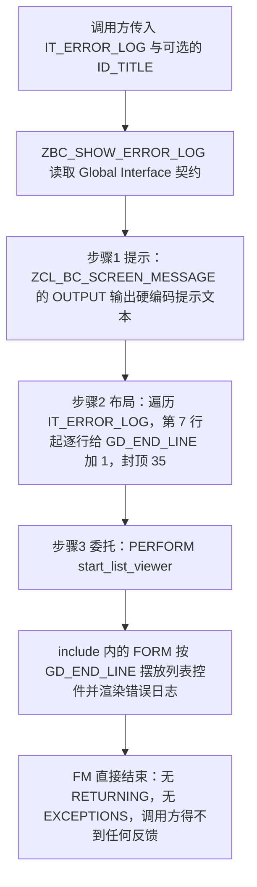
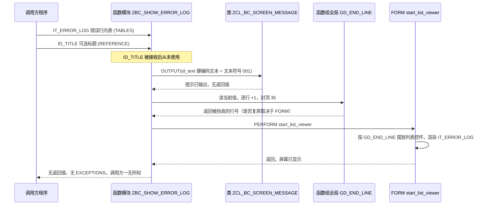

# ZBC_SHOW_ERROR_LOG 分析报告

> 分析对象：`hardyp/AbapToTheFuture03 — src/zmonsters/p01_enablers/zmonsters_c04_exceptions/zbc_show_error_log.fugr.zbc_show_error_log.abap`（24 行，函数组 `ZMONSTERS_UNIT_TESTING` 的成员）
> 报告视角：代码 onboarding 走读，按真实调用链展开

---

## 一、程序定位与业务背景

### 1.1 这段代码在解决什么问题

先说清楚它**不是**什么：它不是报表、不做过账、不写错误日志表，也**不判断错误该不该让流程继续**。它是一个纯粹的**呈现层出口**。

业务场景是这样的：一个批量程序或交互式校验程序跑完一串规则，把每一条踩中的错误累积成一张内表（行结构 `ZBC_S_ERROR_LOG`，一行一条错误：错误号、消息文本、来源行号、严重级别之类）。程序结束时如果不把这些行摆到屏幕上，用户只会看到一句"处理失败"，完全不知道是哪几行数据、哪条规则出了问题；如果用 `MESSAGE` 一条条弹，又会弹到用户麻木、还容易被当成"程序卡死"。

于是就有了这个函数模块：**输入一张错误日志内表 → 弹一条提示告诉用户"请看错误清单" → 把内表画成一个可滚动的列表**。调用方把"错误怎么收集"自己搞定，把"错误怎么给人看"全部交给它。

它的业务价值定位可以这样定性：

| 它做的事 | 它刻意不做的事 |
|---|---|
| 统一多条错误的展示形态（一个列表，而不是 N 条 message） | 不判断错误级别，不决定是否 `MESSAGE ... TYPE 'E'` 中止 |
| 按错误条数把列表框拉高，避免用户在小框里滚动 | 不分页、不排序、不支持双击跳转到出错行 |
| 输出一条固定提示，把用户注意力引到列表上 | 不返回错误条数，也不告诉调用方"用户看没看" |
| 提供一个可被多个程序（含 RFC 客户端）复用的调用入口 | 不留日志、不落表，屏幕一关就没了 |

一句话设计范式定性：

> **"呈现层门面 FM"（Facade over a FORM）——薄壳负责提示与布局参数，真正的绘制委托给函数组 include 里的 FORM，而副作用（列表高度）直接写在函数组全局变量上。**

### 1.2 为什么值得单独做成一个 FM，而不是每个程序各写一份 ALV

三个理由，按重要性排：

1. **重复消除**。列表控件的摆放、错误行的换色、空列表的处理，在三个校验程序里各写一遍必然出现"三个程序三种样式"的经典问题。做成 FM，样式就锁在一处。
2. **函数组内存的物理限制**。这个 FM 的核心动作之一是调整列表框底边行号，而能读写这个值的是函数组全局数据 `GD_END_LINE`——它只在函数组的 include 里可见。把它封成 FM，等于给 include 里的 `FORM` 提供了一个规范入口（`PERFORM` 只能在同一个程序/函数组内调用，函数组的对外契约天然就是 FM）。
3. **可被外部调用**。接口注释块写的是 `Global Interface`，意味着这个 FM 在 SE37 里勾了 "FM 是 RFC 可用的"，别的程序、甚至外部系统可以通过 RFC 调它。**注意这条正是它的风险来源**：一个只会弹窗和画列表的函数模块被暴露成 RFC 能力，调用方拿不到任何结果，也无从判断它到底做了什么（详见 3.5 与 P1-3）。

代价也在第 3 条上，而不在第 1、2 条上。前两条是纯收益。

### 1.3 依赖清单（读这段代码前必须知道的地形）

```
Z 对象（客户自有）  ZCL_BC_SCREEN_MESSAGE      全局类，静态方法 OUTPUT，输出屏幕提示
                   ZBC_S_ERROR_LOG             错误日志行结构，作为 TABLES 参数的绑定结构
函数组全局数据      GD_END_LINE                列表框底边行号。本文件只读它、也写它，
                                              但声明在函数组 TOP include，本文件看不到
函数组 include      FORM start_list_viewer      真正的列表绘制逻辑，本文件不可见
消息                文本符号 (001)             依赖 FM 在 SE37 "Messages" 页分配的消息类
声明但未使用        ID_TITLE                   接口声明为 REFERENCE TYPE STRING OPTIONAL，
                                              但整个函数体一次都没有引用它
```

### 1.4 这是一份"课程骨架"，读的时候要换一副眼睛

这个文件来自 `AbapToTheFuture03`（hardyp 的分支，MIT）的教学仓库，不是生产系统里的成熟代码。判断依据有三条，读者一开始就该知道，否则会误判代码质量：

- 同一函数组的兄弟函数 `ZMONSTER_GOLF_SCORES` 是一个**函数体完全为空**、只有接口注释块的骨架；
- 本文件 `PERFORM` 之后、`ENDFUNCTION` 之前留了 **5 个空行**——原本该是 `MESSAGE ... RAISING` 的位置被清空了；
- 本文件叫 `ZBC_SHOW_ERROR_LOG`，函数组叫 `ZMONSTERS_UNIT_TESTING`，文件所在目录叫 `zmonsters_c04_exceptions`——"ZBC"（Business Central）前缀与 "ZMONSTERS"（怪兽）前缀属于两个不同的示例体系，是拼接骨架时留下的痕迹。

所以本报告的分析对象是**这份骨架里真实存在的那 8 行逻辑**，以及它**暴露出来的契约缺口**。这不是吹毛求疵：课程骨架是新人第一次读到的代码，它教出来的习惯（比如"接口参数声明了就要用""全局变量不要随便改"）会直接复制到生产代码里。

---

## 二、程序执行流程总览

本 FM 没有分支、没有循环之外的分支判断，执行流是一条直线，共三步：



### 责任链表

| 子程序 | 调用者 | 职责 |
|---|---|---|
| `ZBC_SHOW_ERROR_LOG`（本文件，FM 主体） | 业务校验程序 / 事务流程调用方 / RFC 客户端 | 门面总控：弹提示、算列表高度、委托绘制；自身不返回结果、不抛异常 |
| `ZCL_BC_SCREEN_MESSAGE=>OUTPUT`（被调，类静态方法） | 函数模块 `ZBC_SHOW_ERROR_LOG` | 输出一条带文本元素的屏幕提示，把用户注意力引向错误清单 |
| `GD_END_LINE`（被读+被写，函数组全局数据） | 由 `ZBC_SHOW_ERROR_LOG` 写入；由 `start_list_viewer` 与屏幕控件读取 | 列表框底边行号；本文件把它当成"高度旋钮"使用，且只加不减 |
| `FORM start_list_viewer`（被调，函数组 include） | 函数模块 `ZBC_SHOW_ERROR_LOG` 的 `PERFORM` | 按 `GD_END_LINE` 摆放列表控件，把 `IT_ERROR_LOG` 渲染成可滚动列表 |
| `IT_ERROR_LOG`（被读，TABLES 参数） | 调用方传入（通常是上游校验逻辑累积的结果） | 错误日志行集合，本文件只按行数遍历、不读任何字段 |

下面按这条流程，逐个子程序展开。要提前说明的是：本文件自带的可执行逻辑只有 8 行（1 行提示 + 7 行高度计算 + 1 行 `PERFORM`），所以第三节的重点不在"讲语法"，而在"这 8 行动了函数组的什么状态、漏掉了哪些契约"。

---

## 三、分组分析

### 3.1 接口契约段 函数模块 `ZBC_SHOW_ERROR_LOG` 的 Global Interface（全局声明区）

先把接口读透——这段代码 1/3 的篇幅是契约，而契约和实现不一致的地方正是本次分析的主要发现。

```abap
FUNCTION ZBC_SHOW_ERROR_LOG.
*"--------------------------------------------------------------------
*"*"Global Interface:
*"  IMPORTING
*"     REFERENCE(ID_TITLE) TYPE  STRING OPTIONAL
*"  TABLES
*"      IT_ERROR_LOG STRUCTURE  ZBC_S_ERROR_LOG
*"--------------------------------------------------------------------
```

**做什么** — 声明这个 FM 对外的全部契约：输入一个可选的标题字符串 `ID_TITLE`（按引用传入），输入一张以 `ZBC_S_ERROR_LOG` 为行结构的表参数 `IT_ERROR_LOG`，不输出任何东西，不声明任何异常。`Global Interface` 表明它在 SE37 里是 RFC 可用函数模块（同一函数组的兄弟 FM `ZMONSTER_GOLF_SCORES` 写的是 `Local Interface`，即非 RFC，两者混用）。

**为什么** — 契约选得基本合理：`IT_ERROR_LOG` 用 `STRUCTURE` 而不是 `LINE OF`，是 SE37 里绑定一个已存在的行结构（而不是 `TYPE STANDARD TABLE OF` 那种把表类型塞进接口），这是老式 FM 绑定自定义行的正确写法；`ID_TITLE` 用 `REFERENCE` + `STRING` 而不是 `TYPE STRING`，避免为了一段短文本付出定长字段的截断风险，也贴合现代 ABAP 的引用传参习惯；`OPTIONAL` 明确表示标题可以不给，调用方不必准备占位串。

**风险与改进** — 三处实打实的缺口：

1. **`ID_TITLE` 声明了却从不使用**，函数体里一次都没引用（见 3.2）。调用方以为可以自定义标题，实际屏幕上永远是硬编码的 `'Show Error Log'`——契约承诺了、文档写着、代码没做，是最难查的一类不一致。
2. **没有 `EXCEPTIONS` 段**。同一函数组的 `ZMONSTER_GOLF_SCORES` 示范了用命名异常（`MONSTER_ONLY_ONE_INCH_TALL`）表达失败，本 FM 却什么都不给。这里要区分两种可能：本 FM 在 SE37 里确实没声明异常；或者声明了但注释块没体现（FM 源码顶部的 `*"` 接口注释由编辑器在激活时生成，对未使用的参数可能不完整）。**接手第一件事就是去 SE37 的 "Exceptions" 页确认**，两种情况的修法完全不同。RFC 调用方在第一种情况下拿不到任何成功/失败信号——FM dump 时只能从短转储里看到。
3. **`TABLES` 是老式表参数**。它绑定的是"表头行 + 内表"这套已废弃的约定：不能传内联构造、不能传 `REF TO`、在 FM 里引用时隐含一条工作区行。本文件因为循环体不读字段所以没踩到工作区的坑，但接口本身应该改成 `IT_ERROR_LOG TYPE ZBC_T_ERROR_LOG`（或 `REF TO`），这也是新建 FM 的官方建议。

### 3.2 步骤① 输出提示信息（函数模块 `ZBC_SHOW_ERROR_LOG` 消息输出段）

```abap
  zcl_bc_screen_message=>output( EXPORTING id_text = 'Show Error Log'(001) ).
```

**做什么** — 通过全局类 `ZCL_BC_SCREEN_MESSAGE` 的静态方法 `OUTPUT`，把字符串 `'Show Error Log'` 后面拼接上消息类中的文本 001，作为一条屏幕提示输出。效果是把用户的注意力从"程序失败了"引导到"下面有一张错误清单"。

**为什么** — 用一个统一的 BC 消息类而不是 `MESSAGE` 语句，是这套代码库的一贯做法，好处有三：一是消息类型（E/W/S/I）、消息栏位置、超时时长都封装在类里，业务代码不必关心；二是将来要接消息服务器、要做 ALV 顶部消息行、要在后台把提示转成日志，改一处即可；三是这条路径可以被 ABAP Unit 的测试替身替换掉（静态方法调用可以用 linking 双件拦截），这是它比 `MESSAGE` 好的地方——`MESSAGE` 会直接打断 LUW，根本没法在单测里执行。

**风险与改进** — 这里有四个问题，其中前两个是必然出错的：

1. **`ID_TITLE` 在这里本该被用上，却被完全忽略**（P0-1）。正确写法是先做默认值回填再传出去（示意，源码中不存在）：
   ```abap-fix
     IF id_title IS INITIAL.
       id_title = 'Show Error Log'(001).
     ENDIF.
     zcl_bc_screen_message=>output( EXPORTING id_text = id_title ).
   ```
   这样既保住现有默认行为，又让参数真正生效。
2. **`'Show Error Log'(001)` 会把文本符号 001 的内容**追加到字面量后面**，中间没有分隔符**。如果消息类里 001 存在且内容是"错误日志"，最终 `id_text` 会是 `Show Error Log错误日志` 这种叠字。正确写法二选一：只用字面量 `'Show Error Log'`（不要文本符号），或者只用文本符号 `'(001)'`。
3. **文本符号能否解析取决于 SE37 "Messages" 页有没有给这个 FM 分配消息类**。函数组里消息类取自函数组的 `TABA-MSGCL`；没分配时 `(001)` 解析成空白，界面上就只剩那个英文硬编码串，且没有任何报错——**静默降级**。而且这段英文硬编码本身也没有走文本符号体系，等于绕过了多语言翻译，外国用户看到的是英文。
4. **空表也会弹这条提示**。如果上游校验逻辑一行错误都没收集到，用户会看到"Show Error Log"然后一个空列表。开头加 `CHECK it_error_log IS NOT INITIAL`（或改提示语为"没有错误"）比弹空框更体面。

### 3.3 步骤② 按错误条数自适应列表框高度（函数模块 `ZBC_SHOW_ERROR_LOG` 高度调整段）

这是本文件唯一有"算法"味道的代码，也是问题最集中的一段。

```abap
* Make the box a bit taller when the table has lots of rows
  LOOP AT it_error_log.
    IF sy-tabix > 6 AND gd_end_line < 35.
      gd_end_line = gd_end_line + 1.
    ENDIF.
  ENDLOOP.
```

**做什么** — 遍历错误日志内表，从第 7 行起每读到一行就把函数组全局变量 `GD_END_LINE`（列表框底边所在行号）加 1，加到 35 就不再加。净效果是：错误超过 6 条时，列表框每多一条错误就长高一行，最多长到 35 行，让用户少滚动。这行注释把这个意图说清楚了，是本文件最好的一处文档实践。

**为什么** — 思路本身是对的：默认的列表框只有 6 行左右，多出来的错误要滚动才能看完，"错误越多越要多滚"是个真实的体验问题。用一个全局变量把"要多高"这个信息传给 `start_list_viewer`（因为 FORM 与 FM 共享函数组内存，FORM 里能直接读到 `GD_END_LINE`），比再加一个 FORM 参数更省事——**代价是把这个"旋钮"暴露成了全局可变状态**，这正是下面要拆的问题。

**风险与改进** — 五点，前两点是设计层面的：

1. **只加不减，且基线不可知**（P0-3）。本文件没有任何复位逻辑，`GD_END_LINE` 被抬高之后是否还原，取决于 `start_list_viewer` 里有没有把它改回去——**这一点从本文件无法判断，是接手时必须先确认的第一件事**。如果 FORM 不复位，行为是：用户第一次触发一个 50 条错误的日志，列表框永久变成 35 行高；随后在同一会话里触发一个 2 条错误的日志，屏幕依然是 35 行高的空旷列表——用户会以为"程序又出错了"。而且这个全局是函数组级的，同一函数组的其他屏幕（比如别的 FM 复用同一个控件）也会被连累。
2. **算的是"当前值"而不是"本次增量"**。守卫条件 `GD_END_LINE < 35` 读的是被它自己修改的变量，等于用"结果"反过来约束"过程"。即使 FORM 做了复位，这段逻辑也无法处理嵌套/重入调用（在一个已经显示着列表的流程里再弹一次错误日志），也无法回答"这个 35 是从多少加到多少的"。稳妥的写法是先把基线算清楚再一次性赋值（示意，源码中不存在）：
   ```abap-fix
     DATA lv_rows     TYPE i.
     DATA lv_end_line TYPE i.
     lv_rows     = lines( it_error_log ).
     lv_end_line = MIN( gd_end_line + MAX( lv_rows - 6, 0 ), 35 ).
   ```
   注意这种写法仍然需要 `GD_END_LINE` 的初值是可预期的（见第 4 点），否则 `MIN` 的上界也会跟着漂。
3. **为了数行数而全表 `LOOP`**。循环体只用到 `SY-TABIX`（计数器），完全不读内表内容，一趟 `LOOP` 换来一个 `lines( it_error_log )` 就能得到的值。错误日志可能有几百上千行，`lines( )` 是 O(1) 的（表头里就存着行数）。另外达到 35 之后循环还在空跑剩下的行，加一句 `EXIT` 也比让它跑完更省。
4. **`6` 和 `35` 是裸魔法数字**，而且它和 `GD_END_LINE` 初值之间存在隐含的算术关系（初值 + 增量上限 ≤ 35 才成立）。这个关系没有写在任何地方，下一个改屏幕布局的人把初值从 30 调到 20，行为就变了。建议提为常量并在注释里写清三者的关系。
5. **`SY-TABIX` 不适合当计数器**。它在 `LOOP AT` 里确实是当前行号，但它是系统字段：`LOOP ... WHERE` 结束后它的值不可靠，循环体里任何能影响它的操作都会让它失效。想表达"这是第几行"用一个显式的 `lv_idx TYPE i.` 更直白，读者也不用去查 `SY-TABIX` 的语义。

### 3.4 步骤③ 委托给列表显示（函数模块 `ZBC_SHOW_ERROR_LOG` 委托段）

```abap
  PERFORM start_list_viewer.


ENDFUNCTION.
```

**做什么** — 把实际绘制工作交给函数组 include 里的 `FORM start_list_viewer`，然后直接结束函数。`PERFORM` 之后的 5 个空行加 `ENDFUNCTION`（FM 的结束语句，后面不带句点是合法的），是课程骨架里被清空的位置——对照函数组命名 `c04_exceptions`，这里原本大概该有几处 `MESSAGE ... RAISING`。

**为什么** — 用 `PERFORM` 而不是直接写列表逻辑，理由在 1.2 说过：屏幕控件的绘制代码通常有几百行，放在 FM 里会让接口臃肿、也让这个"门面"失去可读性；放进 FORM 后，FM 只剩"提示 + 布局参数 + 委托"三件事，读者十秒能懂。**"薄壳 + 厚 FORM"是函数组开发的经典分工**，从这个角度看本文件的结构选择是对的。

**风险与改进** —

1. **`PERFORM` 是黑箱调用**，没有 `IF sy-subrc` 之类可判断的返回，也没有异常通道（本 FM 无 `EXCEPTIONS`）。`start_list_viewer` 内部如果因为数据问题出错，错误只会以 message 或 dump 的形式出现，调用方完全不知情。在有异常体系的这套代码库里（章节名就叫 `c04_exceptions`），这里是一个明显的风格断层。
2. **`ENDFUNCTION` 前的 5 个空行应当清理**，或者——更好的做法——把这里填上真正的异常处理骨架（比如 `CHECK it_error_log IS NOT INITIAL` 前置校验对应的异常、或统一出口处的清理动作）。空行不是错误，但在一份教学骨架里它是在提醒读者"这里少了东西"。
3. **`ENDFUNCTION` 后没有 `MESSAGE`、没有 `sy-subrc` 归零、没有任何清理**。对 FM 来说这是正常的（FM 靠界面控制块传递成功/失败），但配合"无异常"的接口，调用方唯一的判断依据就是"程序没 dump"。

### 3.5 边界：函数组全局 `GD_END_LINE` 与 FORM `start_list_viewer`（本文件不可见）

这两个是本文件真正的实现所在，但代码不在这里。按三层的规矩，把能确定的和不能确定的分开说清楚。

**做什么** — 已确定的部分：`GD_END_LINE` 是函数组全局数据（本文件未声明却被读写，按函数组作用域规则必然解析到函数组 TOP include），本文件把它当"列表框底边行号"用并修改它；`START_LIST_VIEWER` 是同一函数组内的一个 FORM，被本文件 `PERFORM` 调用，职责从名字和上下文看是"按 `GD_END_LINE` 摆放列表控件并渲染 `IT_ERROR_LOG`"。不能确定的部分：这个 FORM 是否在结束时把 `GD_END_LINE` 还原、是否做了空表处理、是否处理了双击跳转、是否设置了 ALV 的排序/筛选——这些都需要去函数组的 include（`LZ...TOP` 与 `LZ...U01/U02`）里读。

**为什么** — 把"布局旋钮"放进函数组全局、通过 `PERFORM` 在同一内存里传递，是老式函数组开发的常规做法，比层层传参省事。它的隐含前提是**函数组是"一次调用一个会话状态"的容器**；这个前提在 SE38 交互执行、批处理、RFC 场景下都大致成立，但在同一会话里连续多次调用的场景下就是隐患——而本 FM 的接口恰恰允许调用方随便调。

**风险与改进** —

1. **本文件对 `GD_END_LINE` 的读写是"隐式契约"**：FM 的接口里既没有这个参数，也没有 `RETURNING` 告诉调用方高度被改成了多少。测试它的人（ABAP Unit 的测试类）无法断言"给了 10 条错误，底边行号应该 +4"，因为这个逻辑和 UI 显示缠在一起。**改进方向：把高度计算抽成一个纯函数**（形如 `zcl_bc_error_log=>calculate_end_line( rows = lines( it_error_log ) base = 25 max = 35 )`），让本 FM 只负责传参——这既消掉了全局状态，又把这个仓库 `c05` 章节想讲的"测试缝"（test seam）示范了出来。这套教学仓库有整整一章在讲可测性，而这 8 行代码恰好是个反例。
2. **`FORM` 与 FM 共享内存带来的另一个副作用**：`IT_ERROR_LOG` 这个 TABLES 参数在 `start_list_viewer` 里能不能直接访问，取决于它是不是被 PERFORM 进来了。ABAP 里 FORM 能看到 FM 的形参，但这条隐式可见性对读代码的人很不友好——打开 `start_list_viewer` 无法一眼看出它依赖哪个 FM 的哪个参数。改成 FORM 的显式形参（`PERFORM start_list_viewer USING it_error_log`）会好很多。
3. **`ZCL_BC_SCREEN_MESSAGE` 的方法签名不可见**：`OUTPUT` 是否接受 `ID_TITLE`、是否抛异常、有没有 `ID_DETAIL` 之类的兄弟方法，本文件看不出来。建议接手时先 `SE24` 看一眼——如果它本来就有标题参数，那 3.2 的修法可以更直接。

---

## 四、执行流程全景图（数据视角）



从数据视角看这张图，有一个值得反复强调的形状特征：**错误数据只流过一次——从调用方进来，被 `LOOP` 用来数行数（内容从未被读），然后原样交给 `start_list_viewer` 渲染出去。** 本 FM 对错误行本身不做任何加工：不排序、不分级、不截断、不去重。这意味着三件事——第一，排序和分页的责任全部落在 `start_list_viewer` 上（本文件不可见，也就无从判断做得对不对）；第二，如果上游传进来 500 条完全相同的错误，本 FM 会老老实实把列表框顶到 35 行然后让用户滚 465 行，"去重"这种用户最期待的行为没人做；第三，第 7 行这个阈值判断的是"行数"而不是"信息量"，一条致命错误和一条无害提示在高度计算里权重完全相同——而这两者在业务上的严重程度可能差着数量级。

---

## 五、问题清单与改进建议（按优先级）

### 🔴 P0 业务正确性

| # | 所在子程序 | 问题 | 业务后果 | 建议 |
|---|---|---|---|---|
| P0-1 | 步骤① 输出提示信息（`ZBC_SHOW_ERROR_LOG` 消息输出段） | 接口声明了 `ID_TITLE TYPE STRING OPTIONAL`，函数体从未引用；标题被硬编码为 `'Show Error Log'(001)` | 调用方传"订单 4711 导入失败明细"这类上下文标题，屏幕上仍是千篇一律的 "Show Error Log"；用户以为功能没生效，也让这个参数形同虚设。契约与实现不一致是最难排查的一类缺陷——因为从代码上看"参数是有的" | 开头做默认值回填（`IF id_title IS INITIAL. id_title = 'Show Error Log'(001). ENDIF.`），再把 `id_title` 传给 `OUTPUT`；若确认 SE37 里没有该参数，则从接口里删掉，别留一个骗人的形参 |
| P0-2 | 步骤① 输出提示信息 + 接口契约段 | 无 `EXCEPTIONS`、无 `RETURNING`，且不判断内表是否为空——空表也照弹提示、照画空列表 | 调用方无法知道"到底有没有错误""错误有几条""用户是否真的看到"，也没法在展示失败时中止后续过账。批量场景下这等于把"确认过错误"变成"假设用户看过错误" | 先去 SE37 "Exceptions" 页确认现有异常声明；至少补 `no_errors`（空表）与 `display_failed`（无法显示，非交互场景）；同时 `CHECK it_error_log IS NOT INITIAL` 前置拦截空表 |
| P0-3 | 步骤② 按错误条数自适应列表框高度 | `GD_END_LINE` 只加不减，本文件无任何复位；`GD_END_LINE < 35` 又用被自己修改的变量反过来约束修改过程 | 若 `start_list_viewer` 未复位：一次 50 条错误的日志会把列表框永久顶到 35 行高，之后同会话内所有 2 条错误的小日志也顶着 35 行空框显示，用户误判为程序异常；同函数组复用该控件的其他屏幕一并受害（本文件不可见是否复位，**接手第一件事就是查这个**） | 把高度计算改成纯函数：读一次基线、算一次增量、一次性赋值；赋值前后都由该函数负责，不在 FM 里裸改全局。至少要在 FORM 结束时成对还原（改前存、改后恢复） |

### 🟠 P1 健壮性

| # | 所在子程序 | 问题 | 建议 |
|---|---|---|---|
| P1-1 | 步骤② 高度调整段 | 通过未在接口中声明的函数组全局 `GD_END_LINE` 读写状态，隐式修改调用方看不见的东西 | 把"要多少行"作为显式契约：要么 FM 内部用局部变量算完再传给 FORM（`PERFORM ... USING lv_end_line`），要么把高度策略收进类里。接口不可见的可变状态是单测与维护的共同敌人 |
| P1-2 | 步骤① 输出提示信息 | `'Show Error Log'(001)` 依赖 FM 在 SE37 "Messages" 页分配的消息类；未分配时文本符号解析为空白，静默降级为英文硬编码串 | 确认并补齐消息类分配；要么只留字面量，要么只用文本符号，不要两者叠加（叠加会产生叠字） |
| P1-3 | 接口契约段（`Global Interface`） | 接口标注 `Global Interface`（RFC 可用），但函数体只做弹窗与列表显示：无 `SY-BATCH` / `SY-CALLER` 守卫，也无 `IN_SYSDUMP` / `IN_UPDATE_TASK` 限制 | 无交互能力时应直接退出并给出可判断的失败信号；或明确该 FM 不做 RFC，只在 SE37 取消 "FM 是 RFC 可用的" 勾选，缩小暴露面 |
| P1-4 | 步骤③ 委托段 | `PERFORM start_list_viewer` 无返回判断、无异常通道，与函数组 `c04_exceptions` 的异常示范风格断层 | 在 FM 内建立统一出口（try/异常或 `sy-subrc` 判断），把 `start_list_viewer` 的失败向上反映；同时考虑把该 FORM 升级为类方法（见 P3-1） |
| P1-5 | 接口契约段 | `TABLES IT_ERROR_LOG STRUCTURE ZBC_S_ERROR_LOG` 使用已废弃的表参数形式，隐含"表头行 + 内表"约定 | 改为 `IT_ERROR_LOG TYPE ZBC_T_ERROR_LOG`（配套建表类型）或 `REF TO` 形式；这是新建 FM 的官方建议，也能顺手消除旧式工作区约定 |
| P1-6 | 步骤② 高度调整段 | 阈值 `6`、上限 `35` 与 `GD_END_LINE` 初值之间的算术关系没有契约，也没有任何命名常量 | 提为常量（`iv_free_rows` / `iv_max_end_line`）并注释写清三者关系；把"免费行数"和"最大高度"变成可传入参数而不是写死 |

### 🟡 P2 性能与规范

| # | 所在子程序 | 问题 | 建议 |
|---|---|---|---|
| P2-1 | 步骤② 高度调整段 | 为得到一个行数而全表 `LOOP AT`，循环体不读任何字段；达到上限后仍空跑剩余行 | 直接 `lines( it_error_log )`（表头已存行数，O(1)）；需要边算边停时补 `EXIT` |
| P2-2 | 步骤② 高度调整段 | 用 `SY-TABIX` 充当循环计数器 | 改用显式 `DATA lv_idx TYPE i.`，语义直白，也不受 `LOOP ... WHERE` 等场景下 `SY-TABIX` 语义变化的影响 |
| P2-3 | 步骤② 高度调整段 | 增量逻辑写成逐行 `+1` 的循环，掩盖了它其实只是一个 `MIN/MAX` 夹取 | 用一行算术表达（见 3.3 建议代码），把"意图"和"实现"对齐 |
| P2-4 | 步骤① 输出提示信息 | 硬编码英文字面量 + 文本符号混用，未走消息类体系，外籍用户看到英文 | 统一走消息类文本符号，或至少在注释里说明为何此处不用多语言 |
| P2-5 | 步骤③ 委托段 | `PERFORM` 后、`ENDFUNCTION` 前 5 个空行（课程骨架清理痕迹） | 清理空行，或在此补上骨架缺失的异常处理与统一出口 |

### 🟢 P3 可扩展性

| # | 所在子程序 | 问题 | 建议 |
|---|---|---|---|
| P3-1 | 步骤③ 委托段 | 真正的展示逻辑沉在函数组 include 的 `FORM start_list_viewer` 里，只能被同函数组的 FM 通过 `PERFORM` 调用，无法被其他程序复用、无法被单测直接测 | 把 FORM 升级为全局类方法（如 `zcl_bc_error_log=>display( it_log = ... )`），FM 退化为一行转发。同函数组的 `ZCL_BC_SCREEN_MESSAGE` 已经是这个形态，照它办即可 |
| P3-2 | 步骤② 高度调整段 | 高度逻辑与 UI 显示耦合在一起，"计算高度"这个纯逻辑无法单独验证 | 抽出纯函数（入参：行数 / 基线 / 上限；出参：目标行号）并为它写 ABAP Unit——这正是本仓库 `c05_abap_unit` 章节的主题，而当前代码把它挡在了全局变量后面 |
| P3-3 | 边界 `GD_END_LINE` / `FORM start_list_viewer`（本文件不可见） | 谁初始化 `GD_END_LINE`、谁复位、基线是多少，全靠阅读 include 里的隐含约定 | 在 FM 注释或函数组 TOP 处写明"由谁设置基线、由谁复原"；提供 `reset_layout` 入口，程序切换屏幕时可显式调用 |
| P3-4 | 边界 `FORM start_list_viewer`（本文件不可见） | `PERFORM` 隐式访问 FM 形参 `IT_ERROR_LOG`，打开 FORM 看不到它依赖哪个入口 | 改成显式 FORM 形参并用 `PERFORM ... USING` 传参，让依赖在代码里可见 |

---

## 六、整体评价与启发

**优点**

1. **注释写在了刀刃上。** 全文件最有价值的一行是 `* Make the box a bit taller when the table has lots of rows`——它出现在高度计算段的正上方，一句话交代了"为什么要有这段看起来很奇怪的循环"。这比整段代码本身更值钱：新接手的人不用反推意图。教学材料里作者知道注释该写在哪。
2. **薄壳分工是对的。** FM 只做"提示 + 布局参数 + 委托"，几百行的屏幕绘制留在 FORM 里。这个分法让接口稳定、让读者十秒理解入口。结构选得比实现写得好。
3. **走消息类而不是 `MESSAGE` 语句，是有意识的可测性设计。** `ZCL_BC_SCREEN_MESSAGE=>OUTPUT` 是静态方法调用，可以用 ABAP Unit 的 linking 双件替换成测试替身；而 `MESSAGE` 语句会直接打断 LUW，在单测里根本执行不到。这套教学仓库专门有一章讲"测试缝"，这行代码恰好示范了正面做法——可惜同一份代码的下一段就把可测性还了回去。
4. **命名规范一致。** `id_title`（导入）、`it_error_log`（内表）、`gd_end_line`（全局数据）、`zcl_bc_*`（全局类）前缀齐全，同函数组的 `ZMONSTER_GOLF_SCORES` 也是 `id_` / `ed_` 风格。ABAP 的命名约定能把作用域和角色直接写进标识符，是这份代码里最可靠的一致性。

**短板**

1. **声明了却不用的参数，是这份骨架最贵的一处缺陷。** `ID_TITLE` 在接口里躺着、在函数体里消失。它同时教坏两件事：调用方会以为标题可定制而白写代码；审代码的人会以为"参数都处理了"。**接口契约的每一个参数都必须有对应的使用点，没有就删掉。**
2. **用一个全局变量当可变量旋钮，而不是用一次算清楚的值。** `GD_END_LINE` 被逐行 `+1`、被 `= 35` 封顶、还不复位——这段代码里没有任何一处能让人一眼看出"最终高度是多少"。而它的全部逻辑其实就是 `MIN(基线 + MAX(行数 - 6, 0), 35)`，一行就能写完且可测。**能用纯函数算清楚的值，不要用可变全局攒出来。**
3. **提示文本与错误数据都缺少业务厚度。** 标题是硬编码英文，错误行原样透传、不排序、不去重、不分级。500 条重复错误会把列表顶满 35 行让用户滚到底，而用户真正期待的是"就 3 类问题，去重后看"。呈现层的价值恰恰在这里，这份代码只做了最薄的一层。
4. **与函数组自身的示范风格脱节。** 这个函数组的名字里带着 `c04_exceptions`，兄弟函数用命名异常表达失败，而本 FM 什么都不抛；教学仓库后面整章讲 ABAP Unit，而本 FM 的核心逻辑因为绑在全局变量和 FORM 上恰好无法单测。**示例代码的"随手一写"会被学员当成范式抄走**，这是教学仓库比生产代码更需要严格的原因。

**可学到的设计经验**

- **接口即承诺：每个形参都要有使用点。** 判断一个 FM/方法的接口是否诚实，最快的办法就是搜一遍每个参数在函数体里的出现次数，出现 0 次的要么是死参数、要么是没写完的实现。两种都得处理，不能放着。
- **屏幕布局参数要一次性算清楚，再传下去。** "逐行累加一个全局变量"是把计算过程和状态混在一起，读者要模拟执行一遍才知道结果，而且这个状态无法回滚。正确形状是：`lv_end_line = MIN( base + MAX( rows - free_rows, 0 ), max_line ).` 局部变量算完，`PERFORM ... USING` 传进去，全函数组不留痕迹。
- **纯逻辑与副作用分开，是可测性的最低成本来源。** 这 8 行里，"算高度"是纯逻辑（入参行数、出参行数），"弹提示、画列表"是副作用。把前者抽成类方法后可以写 4 条单测覆盖边界（0 条、6 条、7 条、1000 条）；现在它藏在 `LOOP` + 全局变量里，一条都测不了。**判断一段代码好不好改，先看它的纯逻辑有没有被从副作用里摘出来。**
- **"无返回值、无异常"的呈现型 FM，要先用交互场景假设去压一遍。** 依次问四个问题：空输入会怎样？批处理会怎样？RFC 客户端会得到什么？用户没看列表调用方知道吗？这段代码四个问题全部没有答案，而这正是它作为业务出口最危险的地方。

---

## 附：第三层的两种常见写法（对照）

这一节不属于六节正文，是写作时的自检标尺。它对比的是**同一个符号，两种落笔方式**——
差别不在信息量，在有没有把话说到读者能行动的位置。

### 落到运行期后果

```
❌ 位图名 ZCHEM_N_LOGO_SMALL 是硬编码的外部依赖，属于跨行业遗留。
✅ 位图名 ZCHEM_N_LOGO_SMALL 是硬编码的外部依赖，且调用它的 display 外面没有
   包 TRY：目标系统缺该图形时，异常在显示阶段抛出，用户看到的是空屏幕加一条
   短转储，看不出是图形没上传。
```

```
❌ s_lifnr 是内表类型，未定义键。
✅ s_lifnr 声明成标准表而非 HASHED，回填名称段时每行都要线性 READ TABLE，
   万行规模下是 O(n²)；改成 SORTED 或 HASHED，由 SORT / READ 维护索引即可。
```

```
❌ EKKO-STATU 用于判断报价是否已维护。
✅ 报价段是五段里唯一用 statu = 'A' 当"已维护报价"判据的，而 STATU 记的是
   整张凭证的处理状态、不是报价存在与否；RFQ 那段用的是 b~loekz EQ space，
   两段口径不同。STATU 的合法值集合需在 SE11 核实，但"这里两段口径不一致"
   从源码就能判。
```

### 停在名词上（反模式）

```
❌ ID_TITLE 声明了却从不使用。
```

这一句不算写完。读者读完不知道调用方写了自定义标题会不会生效、审查时该查哪里。
§3.1 的第 1 条写法是完整形态：**点名 → 说明承诺了什么 → 指出实际发生了什么 →
点明为什么这类不一致最难查**。少了后半段就退化成一句观察。

判据很简单：**每写出一个反引号里的标识符，紧跟一句"它出事会怎样"。**
一个都答不上来的条目，补上后果或删掉它。